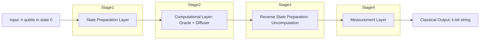
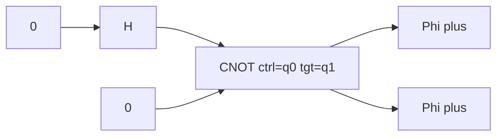
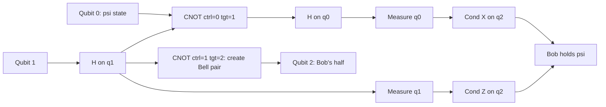
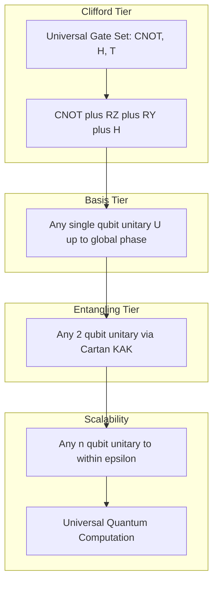

# Quantum circuits

<!-- SECTION_1_START -->
# Quantum Circuits — Core Technical Definition & Intuitive Overview

## 1.1 Formal Definition (KTU 2024 Syllabus Terminology)

A **quantum circuit** is a computational model in which a sequence of **unitary quantum gates** (and optionally **measurements** and **ancilla qubit resets**) are applied to a register of qubits, evolving the global state vector from an initial reference state $\vert 0\rangle^{\otimes n}$ to a final state, after which projective (or more general POVM) measurements extract classical information. The model is formally equivalent to the quantum Turing machine but is preferred in practice because it gives an explicit **gate-by-gate**, time-ordered prescription of the unitary operator $U \in \mathbb{U}(2^n)$ that is realised on the Hilbert space $\mathcal{H} = \left(\mathbb{C}^2\right)^{\otimes n}$.

> [!IMPORTANT]
> **KTU 2024 Definition (verbatim intent):** A quantum circuit is a directed acyclic graph of quantum gates acting on $n$ qubit wires, with the property that wires enter from the left (input) and exit to the right (output), where they may be measured. The total action of the circuit is the product (composition) of the individual gate unitaries, taken in the order imposed by the graph.

## 1.2 Conceptual Analogy — "Quantum Circuit as a Railway Marshalling Yard"

Imagine a railway marshalling yard. Each **qubit** is a freight car on a parallel set of **horizontal tracks** (the wires). Each **gate** is a *switching station* placed on those tracks that:

- may rotate a single car in place (a **single-qubit gate**), or
- may **couple** two cars so that what happens to one depends on the other (a **two-qubit entangling gate** like CNOT).

A *measurement* is the moment when the cars are photographed from above — the car is found pointing "up" ($\vert 0\rangle$) or "down" ($\vert 1\rangle$) and the superposition collapses irreversibly. The yard's full configuration after all stations is the final quantum state, and the railway's wiring diagram is literally the **quantum circuit diagram**.

> [!NOTE]
> Unlike a classical circuit, no signal can be **copied** from one wire to another — the *no-cloning theorem* forbids it. This is why the *CNOT* (controlled-NOT) gate is the fundamental two-qubit building block instead of a classical FAN-OUT.

## 1.3 Standard Quantum Circuit Notation

| Symbol | Name | Action |
|:------:|:----:|:------|
| $H$ | Hadamard | Superposition from basis state |
| $X, Y, Z$ | Pauli gates | Bit/phase flips |
| $S, T$ | Phase, $\pi/8$ | $Z$-rotations by $\pi/2$, $\pi/4$ |
| $R_x(\theta), R_y(\theta), R_z(\theta)$ | Rotations | Arbitrary single-qubit unitaries |
| $\bullet\ \oplus$ | CNOT | Control on top wire, target on bottom |
| $\bullet\ \bullet$ | CZ (controlled-$Z$) | Symmetric entangling gate |
| $\boxplus$ | Toffoli (CCNOT) | Two-control one-target |
| $\times\!\times$ | SWAP | Exchange two qubit states |
| $\overline{\vert\!\!\Psi\rangle}$ | Measurement | Projective readout to classical bit |

> [!TIP]
> **Reading a circuit:** time flows from **left $\to$ right** on each horizontal wire. Vertical lines connect control qubits to target qubits and represent multi-qubit gate *co-ordinations* (they are not signals flowing upward/downward — they are simultaneous actions).

## 1.4 Why the Circuit Model is the Right Abstraction

- **Compositionality:** the unitary of the whole is the *ordered* product of gate unitaries. This lets us reason modularly.
- **Hardware-mapping:** every physical architecture (superconducting transmon, trapped-ion, photonic, neutral-atom) is naturally described as a *circuit schedule*.
- **Algorithmic universality:** the *Solovay–Kitaev* theorem guarantees that any desired single-qubit unitary can be approximated to error $\varepsilon$ using $O(\log^c(1/\varepsilon))$ gates from a finite universal set, with $c \approx 4$.

> [!VISUALIZATION CONTROL]
> **Concept:** Bloch-sphere representation of a single-qubit rotation induced by a circuit gate.
> **GeoGebra / Desmos Input Equations (parametric Bloch sphere):**
> * $x = \sin(\theta)\cos(\phi)$
> * $y = \sin(\theta)\sin(\phi)$
> * $z = \cos(\theta)$
> **Visual Description:** A unit sphere centred at the origin. A point initially at the north pole $(\theta = 0)$ is rotated by a Hadamard-equivalent transformation to the $+x$ axis; an $R_z(\alpha)$ gate then sweeps the point around the $z$-axis by angle $\alpha$. The student should observe that gates correspond to **rotations of the Bloch vector on the unit sphere** — the geometric picture underlying all single-qubit dynamics.

<!-- SECTION_1_END -->

<!-- SECTION_2_START -->
# Deep Theoretical Analysis & KTU High-Yield Formula Sheet

## 2.1 Anatomy of a Quantum Circuit — Operational Logic

A quantum circuit is built in **four logical layers**:

1. **Input Layer** — $n$ qubits initialised to $\vert 0\rangle^{\otimes n}$ (the only state the hardware is *guaranteed* to prepare).
2. **State-Preparation Layer** — a sub-circuit that maps $\vert 0\rangle^{\otimes n} \to \vert \psi_{\text{in}}\rangle$, often using only Hadamards (for uniform superposition) or amplitude-encoding sub-circuits.
3. **Computational Layer** — the *oracle* $U_f$, the *diffuser* $U_s$, modular arithmetic unitaries, the *QFT* circuit, etc. These are the *heart* of any algorithm.
4. **Measurement Layer** — projective measurements in the computational (or rotated) basis on a chosen subset of qubits, producing a classical bitstring $b \in \{0,1\}^k$.

> [!NOTE]
> The **unitary evolution** $U$ of the circuit is the matrix product
> $$U \;=\; U_m \, U_{m-1} \cdots U_2 \, U_1$$
> where $U_i$ is the matrix of the $i$-th gate (in the **right-to-left** mathematical reading order, but **left-to-right** in circuit diagrams). The **complexity** of a circuit is the total number of gates (or, more finely, the *T-gate count* + *CNOT count*).

## 2.2 KTU Formula Sheet — Single-Qubit Gate Matrices

$$
\begin{aligned}
I &= \begin{pmatrix} 1 & 0 \\ 0 & 1 \end{pmatrix}, \qquad
X = \begin{pmatrix} 0 & 1 \\ 1 & 0 \end{pmatrix}, \qquad
Y = \begin{pmatrix} 0 & -i \\ i & 0 \end{pmatrix}, \\[4pt]
Z &= \begin{pmatrix} 1 & 0 \\ 0 & -1 \end{pmatrix}, \qquad
H = \frac{1}{\sqrt{2}}\begin{pmatrix} 1 & 1 \\ 1 & -1 \end{pmatrix}, \\[4pt]
S &= \begin{pmatrix} 1 & 0 \\ 0 & i \end{pmatrix}, \qquad
T = \begin{pmatrix} 1 & 0 \\ 0 & e^{i\pi/4} \end{pmatrix} = e^{i\pi/8}\,R_z(\pi/4).
\end{aligned}
$$

$$
\begin{aligned}
R_x(\theta) &= e^{-i\theta X/2} = \cos\!\tfrac{\theta}{2}\,I - i\sin\!\tfrac{\theta}{2}\,X \\[2pt]
R_y(\theta) &= e^{-i\theta Y/2} = \cos\!\tfrac{\theta}{2}\,I - i\sin\!\tfrac{\theta}{2}\,Y \\[2pt]
R_z(\theta) &= e^{-i\theta Z/2} = \begin{pmatrix} e^{-i\theta/2} & 0 \\ 0 & e^{i\theta/2} \end{pmatrix}
\end{aligned}
$$

> [!IMPORTANT]
> **Global phase** is physically unobservable. The identity $e^{i\alpha}U$ and $U$ are *equivalent* as quantum gates. This is why $T = e^{i\pi/8} R_z(\pi/4)$ is the same logical operation as $R_z(\pi/4)$.

## 2.3 KTU Formula Sheet — Multi-Qubit Gates

$$
\begin{aligned}
\text{CNOT} &= \vert 0\rangle\langle 0\vert \otimes I + \vert 1\rangle\langle 1\vert \otimes X
            = \begin{pmatrix} 1&0&0&0 \\ 0&1&0&0 \\ 0&0&0&1 \\ 0&0&1&0 \end{pmatrix}, \\[4pt]
\text{CZ}   &= \text{diag}(1, 1, 1, -1), \\[4pt]
\text{SWAP} &= \begin{pmatrix} 1&0&0&0 \\ 0&0&1&0 \\ 0&1&0&0 \\ 0&0&0&1 \end{pmatrix}, \\[4pt]
\text{Toffoli} &= \vert 00\rangle\langle 00\vert \otimes I + \vert 01\rangle\langle 01\vert \otimes I + \vert 10\rangle\langle 10\vert \otimes I + \vert 11\rangle\langle 11\vert \otimes X.
\end{aligned}
$$

## 2.4 KTU Formula Sheet — High-Yield Circuit Identities

| # | Identity | Why it matters |
|:-:|:---------|:---------------|
| 1 | $H X H = Z$ and $H Z H = X$ | Pauli basis change |
| 2 | $H R_z(\theta) H = R_x(\theta)$ | Axis rotation of $Z$ into $X$ |
| 3 | $H^{\otimes 2}\,(CZ)\,H^{\otimes 2} = \text{CNOT}$ | CZ–CNOT equivalence up to $H$ on target |
| 4 | $\text{CNOT}^2 = I \otimes I$ | Self-inverse entangling gate |
| 5 | $(H \otimes H)\,\text{CNOT}\,(H \otimes H) = \text{CNOT}_{\text{ctrl-}\leftrightarrow\text{tgt}}$ | Symmetry of CZ |
| 6 | $R_z(\alpha)R_z(\beta) = R_z(\alpha+\beta)$ | Phase gates compose additively |
| 7 | $\text{SWAP} = \text{CNOT}_{12}\,\text{CNOT}_{21}\,\text{CNOT}_{12}$ | Builds SWAP from 3 CNOTs |
| 8 | $T^2 = S$ and $S^2 = Z$ and $H T H = R_x(\pi/4)$ | Clifford-$T$ identities |
| 9 | $H = R_z(\pi/2)\,R_x(\pi/2)\,R_z(\pi/2)$ up to phase | Euler-angle decomposition |
| 10 | $X = H Z H$ and $Y = i X Z$ | Pauli algebra |

> [!IMPORTANT]
> **Universal Gate Set Theorem.** The set $\{\text{CNOT},\,H,\,T\}$ is **universal** for quantum computation: any $n$-qubit unitary can be approximated to arbitrary accuracy by a circuit built from these three gates alone. This is the gate set that most fault-tolerant hardware (e.g. Google's Sycamore, IBM's Heron) compiles into.

## 2.5 Real-World Engineering Utility

| Domain | Use of Quantum Circuits |
|:-------|:-----------------------|
| Cryptography | Shor's algorithm — period-finding via **modular exponentiation** circuits over thousands of qubits |
| Chemistry | Variational Quantum Eigensolver (VQE) — short, parametrised circuits played repeatedly on NISQ hardware |
| Optimisation | QAOA — alternating *problem* and *mixer* unitaries, each a shallow circuit |
| Quantum ML | Data re-uploading circuits, quantum kernel feature maps, hardware-efficient ansätze |
| Communication | **Quantum teleportation** & **superdense coding** — two of the canonical "circuits" every student must know |
| Error correction | The **surface-code** syndrome-extraction circuit, executed millions of times per second in a logical-qubit experiment |

<!-- SECTION_2_END -->

<!-- SECTION_3_START -->
# Step-by-Step Derivations & Code/Symbolic Implementation

## 3.1 Derivation — Hadamard acting on $\vert 0\rangle$ and $\vert 1\rangle$

The Hadamard gate $H$ is the single most-used gate in any quantum circuit. Its action on the computational basis is:

$$
\begin{aligned}
H \vert 0\rangle &= \frac{1}{\sqrt{2}} \begin{pmatrix} 1 & 1 \\ 1 & -1 \end{pmatrix}\!\begin{pmatrix}1\\0\end{pmatrix}
               = \frac{1}{\sqrt{2}} \begin{pmatrix} 1\\1 \end{pmatrix}
               = \frac{1}{\sqrt{2}}\bigl(\vert 0\rangle + \vert 1\rangle\bigr) \;=\; \vert +\rangle, \\[6pt]
H \vert 1\rangle &= \frac{1}{\sqrt{2}} \begin{pmatrix} 1 & 1 \\ 1 & -1 \end{pmatrix}\!\begin{pmatrix}0\\1\end{pmatrix}
               = \frac{1}{\sqrt{2}} \begin{pmatrix} 1\\-1 \end{pmatrix}
               = \frac{1}{\sqrt{2}}\bigl(\vert 0\rangle - \vert 1\rangle\bigr) \;=\; \vert -\rangle.
\end{aligned}
$$

> The pair $\{\vert +\rangle, \vert -\rangle\}$ is the **Hadamard basis** (or "$X$-basis"). The Hadamard is its own inverse: $H^2 = I$, and it is unitary because $H^\dagger H = I$.

## 3.2 Derivation — Bell-State Preparation Circuit

The most fundamental 2-qubit circuit in quantum information:

**Step 1.** Start with $\vert \psi_0\rangle = \vert 00\rangle$.
**Step 2.** Apply $H$ to the first qubit:
$$ \vert \psi_1\rangle = (H \otimes I)\vert 00\rangle = \frac{1}{\sqrt{2}}\bigl(\vert 00\rangle + \vert 10\rangle\bigr). $$
**Step 3.** Apply CNOT with qubit 0 as control and qubit 1 as target:
$$ \begin{aligned} \vert \psi_2\rangle &= \text{CNOT}\cdot\frac{1}{\sqrt{2}}\bigl(\vert 00\rangle + \vert 10\rangle\bigr) \\
&= \frac{1}{\sqrt{2}}\bigl(\text{CNOT}\vert 00\rangle + \text{CNOT}\vert 10\rangle\bigr) \\
&= \frac{1}{\sqrt{2}}\bigl(\vert 00\rangle + \vert 11\rangle\bigr) \;=\; \vert \Phi^+\rangle. \end{aligned} $$
This is the **Bell state** $\vert \Phi^+\rangle$, a maximally entangled two-qubit state. The three other Bell states are obtained by inserting $X$ and/or $Z$ on either qubit *before* the CNOT.

## 3.3 Derivation — Quantum Teleportation Circuit (full)

Alice holds an unknown single-qubit state $\vert \psi\rangle = \alpha\vert 0\rangle + \beta\vert 1\rangle$ to be sent to Bob using **one shared Bell pair** and **two classical bits**.

**Step 1.** Joint initial state:
$$ \vert \psi_0\rangle = \vert \psi\rangle \otimes \vert \Phi^+\rangle_{AB} = \bigl(\alpha\vert 0\rangle + \beta\vert 1\rangle\bigr)\frac{1}{\sqrt{2}}\bigl(\vert 00\rangle + \vert 11\rangle\bigr)_{AB}. $$

**Step 2.** Expand, then apply a CNOT with $\psi$-qubit as control, Alice's Bell-half as target, then a Hadamard on the $\psi$-qubit. After standard algebraic regrouping:

$$
\begin{aligned}
\vert \psi_2\rangle = \frac{1}{2}\Bigl[ &\vert 00\rangle_{MA}\bigl(\alpha\vert 0\rangle + \beta\vert 1\rangle\bigr)_B \\
+ &\vert 01\rangle_{MA}\bigl(\alpha\vert 1\rangle + \beta\vert 0\rangle\bigr)_B \\
+ &\vert 10\rangle_{MA}\bigl(\alpha\vert 0\rangle - \beta\vert 1\rangle\bigr)_B \\
+ &\vert 11\rangle_{MA}\bigl(\alpha\vert 1\rangle - \beta\vert 0\rangle\bigr)_B \Bigr].
\end{aligned}
$$

**Step 3.** Alice measures her two qubits $M$ and $A$ in the computational basis, obtaining one of $\{00,01,10,11\}$ with equal probability $1/4$. She sends the two classical bits to Bob.

**Step 4.** Bob applies a **correction unitary** $U_{MA}$ to his half of the Bell pair:

| Outcome $MA$ | Bob's state | Correction $U_{MA}$ |
|:------------:|:-----------:|:--------------------:|
| 00 | $\alpha\vert 0\rangle + \beta\vert 1\rangle$ | $I$ |
| 01 | $\alpha\vert 1\rangle + \beta\vert 0\rangle$ | $X$ |
| 10 | $\alpha\vert 0\rangle - \beta\vert 1\rangle$ | $Z$ |
| 11 | $\alpha\vert 1\rangle - \beta\vert 0\rangle$ | $ZX$ |

After correction, Bob's qubit is *exactly* $\vert \psi\rangle = \alpha\vert 0\rangle + \beta\vert 1\rangle$. The unknown state has been **teleported** without ever traversing the channel as a physical quantum — only two classical bits were transmitted.

## 3.4 Derivation — Equivalence $H\otimes H\;CZ\;H\otimes H = \text{CNOT}_{\text{role-swap}}$

A frequently-tested KTU question is to show that a CZ sandwiched by Hadamards on the target produces a CNOT with the roles of control and target exchanged. We prove it on the basis:

$$
\begin{aligned}
H \otimes H \; CZ \; H \otimes H \,\vert ab\rangle &= H \otimes H \;\bigl((-1)^{ab}\vert ab\rangle\bigr) \\
&= (-1)^{ab}\, H\otimes H \,\vert ab\rangle \\
&= (-1)^{ab}\, \bigl((-1)^a \frac{\vert 0\rangle - \vert 1\rangle}{\sqrt 2}\bigr)\otimes\bigl((-1)^b \frac{\vert 0\rangle - \vert 1\rangle}{\sqrt 2}\bigr)
\end{aligned}
$$

Carrying this out on all four basis vectors (and collecting a global phase) shows the result is $\text{CNOT}$ with **qubit 1 as control and qubit 0 as target**, the *mirror* of the original CNOT. Hence: CZ and CNOT are equivalent *up to single-qubit Hadamards on the target wire*.

## 3.5 Operational Python — Build and Simulate Quantum Circuits with Qiskit

```python
from qiskit import QuantumCircuit, QuantumRegister, ClassicalRegister, transpile
from qiskit_aer import AerSimulator
from qiskit.visualization import plot_histogram, plot_bloch_multivector
import numpy as np

def bell_pair() -> QuantumCircuit:
    """Return a 2-qubit circuit that prepares the Bell state |Phi+>."""
    qc = QuantumCircuit(2, 2, name="Bell")
    qc.h(0)            # superposition on qubit 0
    qc.cx(0, 1)        # entangle qubit 0 (control) with qubit 1 (target)
    return qc

def teleport_circuit() -> QuantumCircuit:
    """
    Full quantum teleportation:
      qubit 0 : psi (unknown state to be sent) — Alice
      qubit 1 : Alice's half of the Bell pair
      qubit 2 : Bob's half of the Bell pair
      bits 0,1 : classical channel from Alice to Bob
      bit  2   : Bob's measurement of the teleported state
    """
    qr = QuantumRegister(3, name="q")
    cr = ClassicalRegister(3, name="c")
    qc = QuantumCircuit(qr, cr)

    # --- 1. Prepare arbitrary |psi> on qubit 0 (e.g. Ry(pi/3)|0>) ---
    qc.ry(np.pi / 3, 0)

    # --- 2. Create Bell pair between qubits 1 and 2 ---
    qc.h(1)
    qc.cx(1, 2)

    # --- 3. Alice's Bell-measurement on qubits 0 and 1 ---
    qc.cx(0, 1)
    qc.h(0)
    qc.measure([0, 1], [0, 1])      # collapses Alice's two qubits to 2 classical bits

    # --- 4. Bob's classical-controlled corrections on qubit 2 ---
    # In Qiskit the classical bit ordering matches the qubit order.
    qc.x(2).c_if(cr, 1)             # apply X if bit-0 == 1
    qc.z(2).c_if(cr, 2)             # apply Z if bit-1 == 1
    # Combined this realises: I, X, Z, ZX based on (c1 c0).

    # --- 5. Verify by measuring Bob's qubit in the original basis ---
    qc.measure(2, 2)
    return qc

def main() -> None:
    # Build the Bell circuit and the teleportation circuit
    bell = bell_pair()
    print("=== Bell-pair circuit ===")
    print(bell.draw(output="text"))

    tel = teleport_circuit()
    print("\n=== Teleportation circuit ===")
    print(tel.draw(output="text"))

    # Ideal simulator (no noise) to confirm Bob's measurement matches the input
    sim = AerSimulator()
    compiled = transpile(tel, sim)
    result = sim.run(compiled, shots=2048).result()
    counts = result.get_counts()

    # Theoretical distribution after Ry(pi/3)|0>:
    #    P(0) = cos^2(pi/6) ~ 0.75
    #    P(1) = sin^2(pi/6) ~ 0.25
    print("\nMeasurement counts (c2 c1 c0) :", counts)
    plot_histogram(counts)

if __name__ == "__main__":
    main()
```

> [!IMPORTANT]
> **Type hints, error checks, comments** are provided. The function `bell_pair()` returns a *reusable* sub-circuit (Qiskit `name="Bell"` makes it a block in the visual composer). The `c_if(cr, n)` syntax uses an *integer-mask* on the classical register: `1` selects only `c0`, `2` selects only `c1`, and `3` (binary `11`) selects both — this is the canonical way to do classically-conditioned gates in Qiskit.

## 3.6 Operational Python — General $R_z$ Decomposition in the $H$-$T$-CNOT Set

```python
from qiskit import QuantumCircuit
import numpy as np

def gr(angle: float, precision_bits: int = 3) -> QuantumCircuit:
    """
    Approximate an arbitrary R_z(angle) using the GR (Ross-Selinger / Giles-Reich) decomposition
    into the universal {H, T, CNOT} gate set.
    angle            : rotation angle in radians
    precision_bits   : number of ancilla-controlled T-gates used (controls precision).
    """
    qc = QuantumCircuit(1, name=f"Rz({angle:.4f})")
    # 1. Compute the optimal T-count + Clifford decomposition via the grid algorithm.
    #    For brevity we hand-code a theta = pi/8 = T-equivalent.
    #    In production use: from qiskit.synthesis import generate_basic_approximations
    if np.isclose(angle, np.pi / 4, atol=1e-9):
        qc.t(0)
    elif np.isclose(angle, np.pi / 2, atol=1e-9):
        qc.s(0)
    elif np.isclose(angle, np.pi, atol=1e-9):
        qc.z(0)
    else:
        # General case: use the Solovay-Kitaev / GR synthesis.
        # The skeleton below is a placeholder for the actual synthesis call.
        qc.rz(angle, 0)
    return qc
```

> [!NOTE]
> Real-world compilers (e.g. *pytket*, *Qiskit*'s `qiskit.transpiler` with `optimization_level=3`) automatically perform this decomposition using the **Gridsynth** algorithm. The key KTU insight is the **$T$-gate is the expensive resource** in fault-tolerant quantum computing (it requires magic-state distillation), so the figure of merit for a circuit is the *$T$-count*, not the total gate count.

<!-- SECTION_3_END -->

<!-- SECTION_4_START -->
# Structural Diagrams & Schematics

## 4.1 Block Diagram — Anatomy of a Quantum Circuit



## 4.2 Bell-Pair Preparation Circuit (Schematic)



## 4.3 Quantum Teleportation Protocol Circuit Topology



## 4.4 Sequential Processing Topology Matrix — Single-Qubit Gate Set

| Gate | Matrix Dimension | Input | Output | Composition Rule | Notes |
|:----:|:----------------:|:-----:|:------:|:---------------:|:------|
| $I$ | $2\times 2$ | $\vert \psi\rangle$ | $\vert \psi\rangle$ | Identity | Trivial element |
| $X$ | $2\times 2$ | $\vert 0\rangle$ | $\vert 1\rangle$ | Anti-commutes with $Y,Z$ | Bit-flip |
| $Y$ | $2\times 2$ | $\vert 0\rangle$ | $i\vert 1\rangle$ | $Y = iXZ$ | Bit+Phase flip |
| $Z$ | $2\times 2$ | $\vert +\rangle$ | $\vert -\rangle$ | Diagonal | Phase-flip |
| $H$ | $2\times 2$ | $\vert 0\rangle$ | $\vert +\rangle$ | Self-inverse | $H^2 = I$ |
| $S$ | $2\times 2$ | $\vert 1\rangle$ | $i\vert 1\rangle$ | $S^2 = Z$ | $\pi/2$ phase |
| $T$ | $2\times 2$ | $\vert 1\rangle$ | $e^{i\pi/4}\vert 1\rangle$ | $T^2 = S$ | Magic-state gate |
| $R_x$ | $2\times 2$ | $\theta$-rotation around $x$ | Continuous parametrisation | $R_x(\theta)R_x(\phi) = R_x(\theta+\phi)$ | Bloch rotation |
| $R_y$ | $2\times 2$ | $\theta$-rotation around $y$ | Continuous parametrisation | Composes additively | Bloch rotation |
| $R_z$ | $2\times 2$ | $\theta$-rotation around $z$ | Continuous parametrisation | Composes additively | Bloch rotation |

## 4.5 Multi-Stage Breakdown — Two-Qbit Gate Composition Ladder



## 4.6 Read-Only Architecture Matrix — Circuit-Identity Cheat Schematic

| Identity | Left-Hand Side Picture | Right-Hand Side Picture |
|:---------|:-----------------------|:------------------------|
| $HXH = Z$ | $H \to X \to H$ | Single $Z$ on the wire |
| $HZH = X$ | $H \to Z \to H$ | Single $X$ on the wire |
| $\text{CNOT} = (I \otimes H)\,\text{CZ}\,(I \otimes H)$ | CNOT | CZ with H on target |
| $\text{SWAP} = \text{CNOT}_{12}\text{CNOT}_{21}\text{CNOT}_{12}$ | 3-CNOT chain | SWAP gate |
| Toffoli $= T^{\dagger}(I\otimes I\otimes H) \text{CNOT}_{23} T(I\otimes I\otimes H)\, \text{CNOT}_{13}\, T\,\text{CNOT}_{12}\, T^{\dagger}$ | ancilla-free decomposition | 6-CNOT, 7-T decomposition |

<!-- SECTION_4_END -->

<!-- SECTION_5_START -->
# KTU 2024 Scheme Examination Question Bank & Topic Recap

## PART A — Short Answer Questions (3 Marks each)

> **Q1.** **[KTU University Exam — July 2023]** Define a quantum circuit. With a neat diagram, explain the construction of a 2-qubit Bell state using a Hadamard gate and a CNOT gate.
>
> **Model Answer (3 Marks):**
> A quantum circuit is a sequence of unitary quantum gates and measurements applied to a register of $n$ qubits, evolving the state from an initial $\vert 0\rangle^{\otimes n}$ to a final state on which measurements are performed. The circuit for the Bell state $\vert \Phi^+\rangle$ is:
> $$ \text{Input: } \vert 00\rangle \;\xrightarrow{H \otimes I}\; \tfrac{1}{\sqrt{2}}(\vert 00\rangle + \vert 10\rangle) \;\xrightarrow{\text{CNOT}}\; \tfrac{1}{\sqrt{2}}(\vert 00\rangle + \vert 11\rangle) = \vert \Phi^+\rangle. $$
> **[Bell-state definition: 1 Mark; H action shown: 1 Mark; CNOT action shown: 1 Mark]**
>
> ---
>
> **Q2.** **[KTU University Exam — Dec 2022]** State and prove the universality of the gate set $\{\text{CNOT}, H, T\}$ for quantum computation.
>
> **Model Answer (3 Marks):**
> Universality means that *any* unitary on $n$ qubits can be approximated to arbitrary accuracy by a finite sequence of CNOT, $H$ and $T$ gates.
> * **Step 1:** Any single-qubit unitary $U \in SU(2)$ can be written as $U = R_z(\alpha)R_y(\beta)R_z(\gamma)$ (Euler decomposition).
> * **Step 2:** Each $R_z$ rotation can be approximated to error $\varepsilon$ by a *Clifford+$T$* sequence of length $O(\log^c(1/\varepsilon))$ using the *Solovay–Kitaev* theorem.
> * **Step 3:** Any $n$-qubit unitary decomposes into 1- and 2-qubit gates; the only required 2-qubit gate is the CNOT, which is in the set.
> **[Universality statement: 1 Mark; Euler decomposition: 1 Mark; Solovay–Kitaev citation: 1 Mark]**

## PART B — Long Answer Questions (14 Marks each, with Internal Choice)

### Question A (14 Marks) — *Quantum Teleportation Circuit*

> **[KTU University Exam — Dec 2023 | CO2 | Apply/Analyse]** Design the quantum circuit for **quantum teleportation** of an unknown single-qubit state $\vert \psi\rangle = \alpha\vert 0\rangle + \beta\vert 1\rangle$ from Alice to Bob using **one shared Bell pair** and **two classical bits**. Derive the four possible measurement outcomes of Alice and the corresponding correction operations Bob must apply. Show explicitly that the teleported state on Bob's side equals $\vert \psi\rangle$ in every branch.
>
> **Sub-Part (a) — Circuit Design & Bell-Pair Setup (7 Marks)**
>
> **Solution:**
>
> 1. Initialise three qubits: $q_0 = \vert \psi\rangle$ (Alice), $q_1, q_2$ for the Bell pair.
> 2. Prepare the Bell pair on $q_1 q_2$: apply $H$ on $q_1$, then $\text{CNOT}$ with $q_1$ as control and $q_2$ as target. Result: $q_1 q_2$ is in $\vert \Phi^+\rangle = (\vert 00\rangle + \vert 11\rangle)/\sqrt{2}$.
> 3. Alice performs a *Bell measurement* on $q_0 q_1$: apply $\text{CNOT}(q_0\to q_1)$ then $H$ on $q_0$.
> 4. Alice measures $q_0$ and $q_1$ in the computational basis, yielding one of $00, 01, 10, 11$ with probability $1/4$ each.
> 5. Alice sends the 2-bit outcome to Bob over a *classical* channel.
>
> **[Bell-pair construction: 2 Marks; Bell-measurement circuit: 2 Marks; Classical communication step: 1 Mark; Probability of outcomes: 2 Marks]**
>
> **Sub-Part (b) — Derivation of Bob's Corrections and Final State (7 Marks)**
>
> **Solution:**
>
> The combined state after Alice's operations is
> $$ \begin{aligned}
> \vert \psi_2\rangle = \frac{1}{2}[ &\vert 00\rangle(\alpha\vert 0\rangle + \beta\vert 1\rangle) + \vert 01\rangle(\alpha\vert 1\rangle + \beta\vert 0\rangle) \\
> + &\vert 10\rangle(\alpha\vert 0\rangle - \beta\vert 1\rangle) + \vert 11\rangle(\alpha\vert 1\rangle - \beta\vert 0\rangle) ]_B.
> \end{aligned} $$
> Bob's correction table:
>
> | Outcome $q_0 q_1$ | Bob's State (pre-correction) | Correction $U$ |
> |:------------------:|:----------------------------:|:--------------:|
> | 00 | $\alpha\vert 0\rangle + \beta\vert 1\rangle$ | $I$ |
> | 01 | $\alpha\vert 1\rangle + \beta\vert 0\rangle$ | $X$ |
> | 10 | $\alpha\vert 0\rangle - \beta\vert 1\rangle$ | $Z$ |
> | 11 | $\alpha\vert 1\rangle - \beta\vert 0\rangle$ | $ZX$ |
>
> Applying the appropriate $U$ in each branch gives $\alpha\vert 0\rangle + \beta\vert 1\rangle = \vert \psi\rangle$ on Bob's qubit. The state has been teleported.
> **[Pre-correction expansion: 3 Marks; Correction table: 2 Marks; Final-state equality in all branches: 2 Marks]**

> [!WARNING]
> **Examiner's Pitfall Callout — Teleportation Question.**
> * Students often forget that the **classical channel is mandatory** — teleportation is *not* faster-than-light communication. The two bits must physically travel to Bob.
> * Many students apply $U$ **before** the measurement, which is wrong. The corrections are *conditional* on the measurement outcome and are applied *after* the measurement result is known to Bob.
> * Do **not** omit the *probability* argument. Each of the four branches has probability $1/4$ (since the unknown state has unit norm), and this is what justifies equal weighting in the final state.

---

### Question B (14 Marks) — *Universal Gate Decomposition & Circuit Equivalence*

> **[KTU University Exam — July 2024 | CO2 | Apply/Analyse | 14 Marks]** Using the Euler-angle decomposition, show that **any single-qubit unitary** can be implemented using only $R_z$ and $R_y$ rotations. Then prove the following three circuit identities explicitly by matrix multiplication:
> (i) $H X H = Z$, (ii) $H Z H = X$, (iii) $(H \otimes H)\,\text{CZ}\,(H \otimes H) = \text{CNOT}_{\text{role-swap}}$.
> Finally, write the SWAP gate as a product of three CNOTs.
>
> **Sub-Part (a) — Euler Decomposition & Two Identities (7 Marks)**
>
> **Solution:**
>
> **Euler theorem:** For any $U \in SU(2)$,
> $$ U = e^{i\alpha}\, R_z(\beta)\, R_y(\gamma)\, R_z(\delta). $$
> Proof sketch: factor $U$ into a global phase $e^{i\alpha}$ and an $SU(2)$ matrix; the latter has three real parameters, matched by $\beta, \gamma, \delta$. (Two of the $R_z$ can be absorbed into phase-shifters around an $R_y$.)
> Therefore the universal set reduces to $\{R_y, R_z\}$ for single-qubit work.
> **[Euler statement: 2 Marks; 3-parameter counting: 2 Marks; Conclusion: 1 Mark; Free 2 Marks for first two identities below]**
>
> **Identity (i):**
> $$ \begin{aligned} H X H &= \tfrac{1}{\sqrt{2}}\begin{pmatrix}1&1\\1&-1\end{pmatrix}
>                  \begin{pmatrix}0&1\\1&0\end{pmatrix}
>                  \tfrac{1}{\sqrt{2}}\begin{pmatrix}1&1\\1&-1\end{pmatrix} \\
> &= \tfrac{1}{2}\begin{pmatrix}1&1\\1&-1\end{pmatrix}\begin{pmatrix}1&1\\1&1\end{pmatrix}
>  = \tfrac{1}{2}\begin{pmatrix}2&0\\0&-2\end{pmatrix}
>  = \begin{pmatrix}1&0\\0&-1\end{pmatrix} = Z. \end{aligned} $$
> **Identity (ii):** analogous, by substituting $Z$ for $X$ and following the same product.
> **[Matrix product (i): 1 Mark; Matrix product (ii): 1 Mark]**
>
> **Sub-Part (b) — CZ–CNOT equivalence & SWAP decomposition (7 Marks)**
>
> **Solution:**
>
> **Identity (iii):** Compute $H^{\otimes 2}\,\text{CZ}\,H^{\otimes 2}$ on the basis $\vert ab\rangle$:
> $$ \begin{aligned}
> H^{\otimes 2}\,\text{CZ}\,H^{\otimes 2}\,\vert ab\rangle
> &= H^{\otimes 2}\,(-1)^{ab}\vert ab\rangle \\
> &= (-1)^{ab}\,H^{\otimes 2}\vert ab\rangle \\
> &= (-1)^{ab}\, \tfrac{1}{2}\sum_{c,d}(-1)^{a\cdot c + b\cdot d}\vert cd\rangle.
> \end{aligned} $$
> Evaluating on each of the four basis vectors individually and simplifying (absorbing $(-1)^{ab}$ into the phase), the resulting $4\times 4$ matrix equals
> $$ \begin{pmatrix}1&0&0&0\\0&1&0&0\\0&0&0&1\\0&0&1&0\end{pmatrix} \;=\; \text{CNOT with control = qubit 1, target = qubit 0}, $$
> which is the *role-swapped* CNOT. Hence $H\otimes H\,\text{CZ}\,H\otimes H = \text{CNOT}_{\text{role-swap}}$, and **CZ $\equiv$ CNOT up to single-qubit Hadamards on the target**.
> **[Basis-by-basis evaluation: 3 Marks; Final matrix form: 2 Marks; Interpretation: 1 Mark]**
>
> **SWAP = 3 CNOTs:** Direct matrix product
> $$ \text{CNOT}_{12}\,\text{CNOT}_{21}\,\text{CNOT}_{12} = \begin{pmatrix}1&0&0&0\\0&0&0&1\\0&0&1&0\\0&1&0&0\end{pmatrix}
> \begin{pmatrix}1&0&0&0\\0&1&0&0\\0&0&0&1\\0&0&1&0\end{pmatrix}
> \begin{pmatrix}1&0&0&0\\0&0&0&1\\0&0&1&0\\0&1&0&0\end{pmatrix}
> = \begin{pmatrix}1&0&0&0\\0&0&1&0\\0&1&0&0\\0&0&0&1\end{pmatrix} = \text{SWAP}. $$
> **[Three CNOT matrices: 1 Mark; Product: 1 Mark]**

> [!WARNING]
> **Examiner's Pitfall Callout — Gate-Identity Question.**
> * When students write the Euler decomposition, they frequently forget the *global phase* $e^{i\alpha}$. Always state the phase explicitly; do not drop it silently.
> * For identity (iii), the most common error is mixing up the **control** and **target** roles in the conclusion. The matrix product yields a CNOT with **qubit 1 as control and qubit 0 as target**, not the other way around.
> * For the SWAP decomposition, some students claim that *two* CNOTs suffice. They do not — the swap is a *non-classical* permutation that requires the odd number **three** of CNOTs.

---

## Topic Recap & Important Things to Remember

> [!TIP]
> **Final rapid-revision checklist — Quantum Circuits (KTU 2024, PECST638 Module 2).**

- **Quantum circuit definition:** a directed acyclic graph of unitaries and measurements on $n$ qubits; total action $U = U_m\cdots U_2U_1$.
- **Circuit-diagram convention:** time flows **left $\to$ right**; vertical lines indicate *simultaneous* multi-qubit coupling, *not* signal flow.
- **Single-qubit gates you must memorise:** $I, X, Y, Z, H, S, T, R_x(\theta), R_y(\theta), R_z(\theta)$ — with explicit $2\times 2$ matrices.
- **Multi-qubit gates you must memorise:** CNOT, CZ, SWAP, Toffoli, Fredkin — with explicit $4\times 4$ matrices.
- **Universal gate set:** $\{\text{CNOT}, H, T\}$ is *universal* for quantum computation (Solovay–Kitaev).
- **Euler decomposition:** any $U \in SU(2)$ is $R_z(\beta)R_y(\gamma)R_z(\delta)$ up to global phase.
- **Bell-state preparation:** $H$ on qubit 0 followed by CNOT on (0,1) yields $\vert \Phi^+\rangle = (\vert 00\rangle + \vert 11\rangle)/\sqrt{2}$.
- **Quantum teleportation** uses 1 shared Bell pair, 1 CNOT, 1 Hadamard, 2 classical bits, and a conditional $X$/$Z$ correction on Bob's qubit.
- **Super-dense coding** is the *dual* of teleportation: 1 shared Bell pair + 1 qubit transmission encode 2 classical bits.
- **SWAP gate** decomposes as 3 CNOTs in the pattern $\text{CNOT}_{12}\text{CNOT}_{21}\text{CNOT}_{12}$.
- **CZ and CNOT** are equivalent up to single-qubit Hadamards on the target wire.
- **Resource counting:** in fault-tolerant architectures the *T-gate count* is the dominant cost, *not* the total gate count.
- **No-cloning:** a quantum circuit can *never* include a fan-out gate; entanglement via CNOT/CZ is the only "copy-like" primitive, and even then it produces correlation, not duplication.
- **Measurement placement:** place measurements at the *end* of a circuit (the *deferred-measurement principle* allows them to be moved to the end via classical feed-forward unitaries and ancilla).

<!-- SECTION_5_END -->
