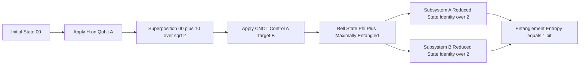
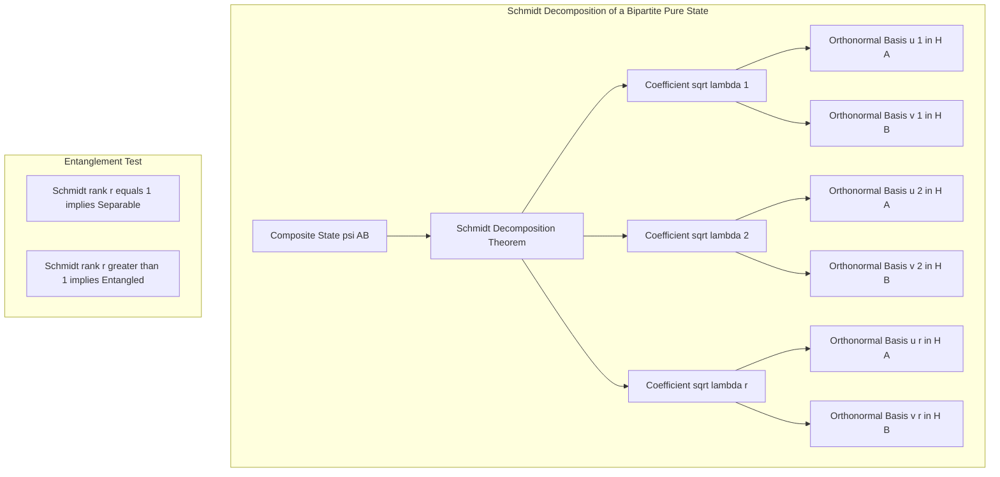
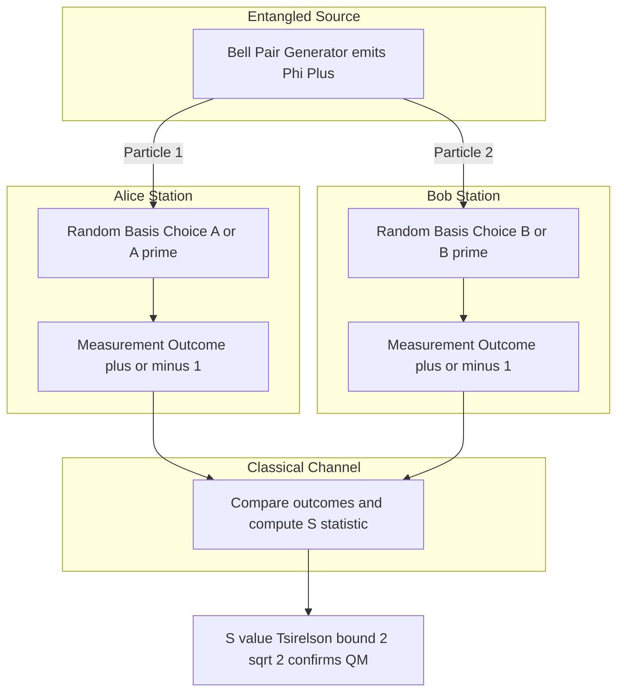
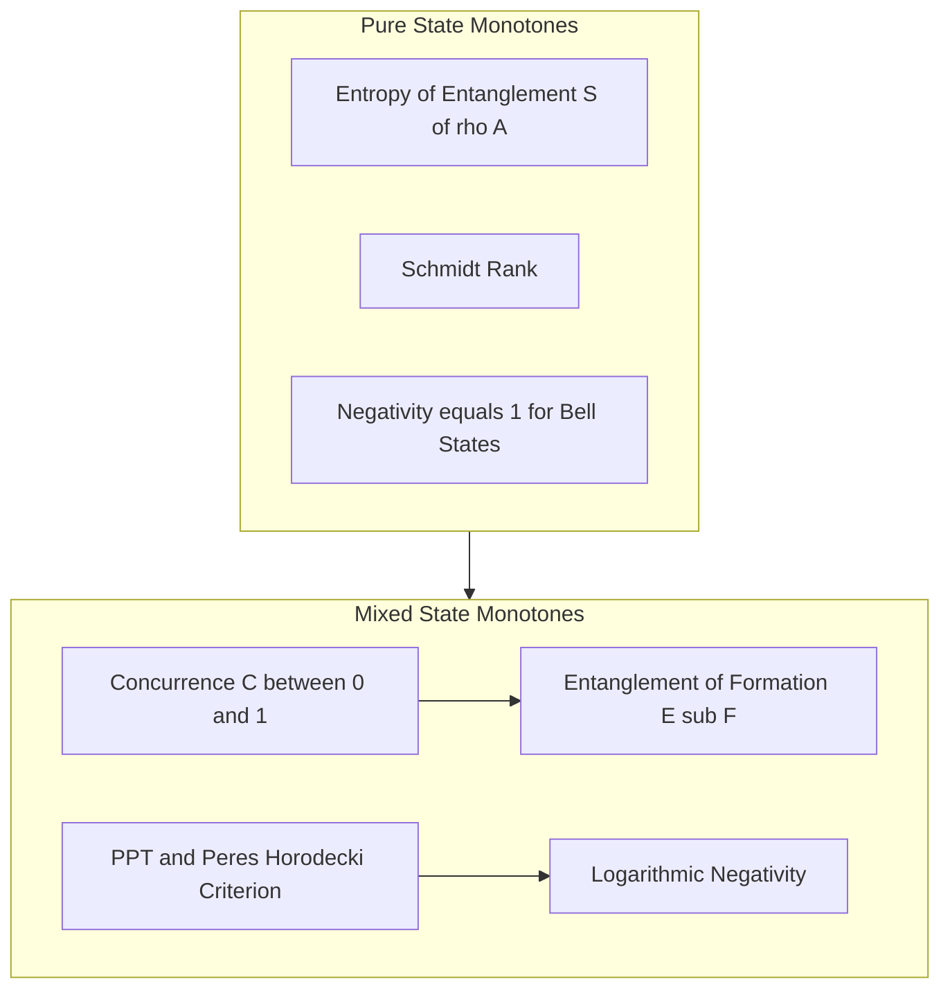

# Quantum entanglement.

<!-- SECTION_1_START -->
# Quantum Entanglement

## Formal Definition (KTU 2024 Scheme Terminology)

> [!NOTE]
> **Quantum Entanglement** is a non-classical correlation phenomenon in which the quantum state of a composite system $\rho_{AB}$ cannot be factorized into a product of individual subsystem states. Formally, a bipartite pure state $\vert\psi_{AB}\rangle \in \mathcal{H}_A \otimes \mathcal{H}_B$ is **entangled** if and only if there do not exist states $\vert\phi_A\rangle \in \mathcal{H}_A$ and $\vert\varphi_B\rangle \in \mathcal{H}_B$ such that $\vert\psi_{AB}\rangle = \vert\phi_A\rangle \otimes \vert\varphi_B\rangle$. Otherwise, the state is termed **separable**.

For mixed states, a density operator $\rho_{AB}$ is entangled if it cannot be written as a convex combination $\rho_{AB} = \sum_i p_i \, \rho_i^A \otimes \rho_i^B$ with $p_i \ge 0$ and $\sum_i p_i = 1$. The maximum number of standard deviations by which quantum mechanics violates any local hidden-variable theory is quantified by the **Tsirelson bound**, which equals **$2\sqrt{2} \approx 2.828$** for the CHSH inequality.

---

## Intuitive Analogy: The "Magic Glove" Box

Imagine Alice and Bob each receive a closed box from a vendor. Inside one box is a **left-handed glove**, and inside the other is a **right-handed glove**. The boxes are shuffled and shipped to opposite ends of the galaxy before being opened. The moment Alice opens her box and sees a left glove, she **instantly knows with certainty** that Bob holds a right glove.

This classical correlation is *weak* compared to quantum entanglement because:
- The vendor fixed the contents at the time of shipping (a *hidden variable*).
- Alice cannot influence the result by choosing *how* she opens the box.

In the quantum version:
- The contents of neither box are fixed until measurement.
- Alice can **freely choose her measurement basis** (e.g., spin along $x$, $y$, or $z$).
- The joint statistics cannot be reproduced by any pre-agreed classical strategy.

> [!IMPORTANT]
> **Key Distinction from Classical Correlation:** Quantum entanglement does **not** allow faster-than-light communication (the **no-communication theorem** guarantees this). The correlations are revealed only when Alice and Bob *compare* classical measurement outcomes after the fact.

---

## Geometric Intuition on the Bloch Sphere

A two-qubit pure state $\vert\psi\rangle = \alpha\vert 00\rangle + \beta\vert 01\rangle + \gamma\vert 10\rangle + \delta\vert 11\rangle$ can be partially represented by a point on a generalized manifold. The **Schmidt decomposition** guarantees the existence of orthonormal bases such that
$$\vert\psi_{AB}\rangle = \sum_{i=1}^{r} \sqrt{\lambda_i} \, \vert u_i\rangle \otimes \vert v_i\rangle$$
where $r$ is the **Schmidt rank** and $\lambda_i > 0$ with $\sum \lambda_i = 1$. The state is entangled **iff** $r > 1$.

> [!VISUALIZATION CONTROL]
> **Concept:** Schmidt decomposition geometry and maximally entangled state on the Bloch sphere.
> **GeoGebra / Desmos Input Equations:**
> * Parametric curve: $(\lambda_1, \lambda_2)$ on the 2-simplex — $\lambda_1 = \cos^2(\theta/2)$, $\lambda_2 = \sin^2(\theta/2)$, with $0 \le \theta \le \pi$.
> * Vertical axis: $S_{\text{ent}} = -\lambda_1 \log_2 \lambda_1 - \lambda_2 \log_2 \lambda_2$.
> **Visual Description:** Plot $\theta$ on the horizontal axis ($0$ to $\pi$) and $S_{\text{ent}}$ on the vertical axis. The curve rises from $0$ at the poles ($\theta=0,\pi$) to a maximum of $1$ bit at $\theta=\pi/2$, illustrating that maximal entanglement corresponds to equal Schmidt coefficients $\lambda_1 = \lambda_2 = 1/2$.
<!-- SECTION_1_END -->

<!-- SECTION_2_START -->
# Deep Theoretical Analysis & KTU High-Yield Formula Sheet

## The Four Bell States (Maximally Entangled EPR Pairs)

Any two-qubit system admits a basis of four orthogonal, maximally entangled states, called the **Bell basis**:

$$\vert \Phi^{\pm}\rangle = \frac{1}{\sqrt{2}}\bigl(\vert 00\rangle \pm \vert 11\rangle\bigr)$$

$$\vert \Psi^{\pm}\rangle = \frac{1}{\sqrt{2}}\bigl(\vert 01\rangle \pm \vert 10\rangle\bigr)$$

These states form an orthonormal basis of $\mathbb{C}^2 \otimes \mathbb{C}^2$ and are the central resource in teleportation, superdense coding, and quantum key distribution (e.g., the E91 protocol).

---

## Operational Steps to Identify Entanglement

1. **Obtain the density matrix** $\rho_{AB} = \vert\psi\rangle\langle\psi\vert$ for pure states, or a statistical mixture $\rho_{AB} = \sum p_i \vert\psi_i\rangle\langle\psi_i\vert$ for mixed states.
2. **Compute the partial trace** $\rho_A = \text{Tr}_B(\rho_{AB})$ to obtain the reduced state of subsystem $A$.
3. **Inspect the spectrum of $\rho_A$**:
   - If $\rho_A$ is pure ($\text{Tr}(\rho_A^2) = 1$), the global state is **separable**.
   - If $\rho_A$ is mixed, the global state is **entangled**.
4. **Compute the entanglement entropy** $S(\rho_A) = -\text{Tr}(\rho_A \log_2 \rho_A)$.
5. **For mixed states of two qubits**, evaluate the **Peres–Horodecki criterion** (PPT test) or compute the **concurrence**.

---

## KTU Formula Sheet / Cheat Sheet

| Quantity | Symbol | Formula | Range / Unit |
|---|---|---|---|
| Reduced density matrix | $\rho_A$ | $\text{Tr}_B(\rho_{AB})$ | Valid density operator |
| Von Neumann entropy | $S(\rho)$ | $-\text{Tr}(\rho \log_2 \rho)$ | $0$ to $\log_2 d$ bits |
| Entropy of entanglement | $E(\psi)$ | $S(\rho_A) = S(\rho_B)$ | $0$ (separable) to $\log_2 r$ (max) |
| Concurrence (2-qubit pure) | $C$ | $\vert\langle\psi \mid \tilde{\psi}\rangle\vert$ | $0$ to $1$ |
| Spin-flipped state | $\vert\tilde{\psi}\rangle$ | $(\sigma_y \otimes \sigma_y)\vert\psi^*\rangle$ | State vector |
| Schmidt coefficients | $\sqrt{\lambda_i}$ | Eigenvalues of $\rho_A$ | $\sum \lambda_i = 1$ |
| Schmidt rank | $r$ | Non-zero eigenvalues of $\rho_A$ | $1$ to $\min(\dim\mathcal{H}_A, \dim\mathcal{H}_B)$ |
| CHSH operator | $S$ | $A B + A B' + A' B - A' B'$ | Bounded by $2$ classically |
| Tsirelson bound | $S_{\max}$ | $2\sqrt{2}$ | Quantum mechanical limit |
| Singlet correlation | $E(\hat{a}, \hat{b})$ | $-\cos(\theta_{ab})$ | $-1$ to $+1$ |

> [!IMPORTANT]
> **No `pipe` characters appear inside table cells** — all bra-ket and absolute-value bars are rendered using LaTeX `\vert` and `\mid` to avoid breaking the markdown column delimiters.

---

## Real-World Engineering Utility

- **Quantum Teleportation** consumes one shared Bell pair $\vert\Phi^+\rangle$ to transmit two classical bits that recreate an unknown qubit state.
- **Superdense Coding** uses one shared Bell pair to send two classical bits using a single physical qubit transmission — a 2x bandwidth gain.
- **Quantum Key Distribution (E91)** relies on entanglement to detect eavesdropping, because any intercept-and-resend attack disturbs the singlet correlation statistics.
- **Quantum Error Correction** codes (e.g., the 5-qubit code, Shor's code) encode logical qubits into entangled physical qubits to detect and correct decoherence-induced bit/phase flips.
- **Multipartite entanglement** underlies measurement-based quantum computing (MBQC) and cluster-state computation.
<!-- SECTION_2_END -->

<!-- SECTION_3_START -->
# Step-by-Step Derivations & Symbolic Implementation

## Derivation 1: Bell State Generation via Hadamard + CNOT

**Goal:** Transform the computational basis state $\vert 00\rangle$ into the Bell state $\vert \Phi^+\rangle$ using a quantum circuit.

### Step 1 — Initial state

We begin with two qubits in the ground state:
$$\vert \psi_0\rangle = \vert 0\rangle \otimes \vert 0\rangle = \vert 00\rangle$$

### Step 2 — Apply Hadamard to qubit 1 (Alice's qubit)

The Hadamard operator is
$$H = \frac{1}{\sqrt{2}}\begin{pmatrix} 1 & 1 \\ 1 & -1\end{pmatrix}$$

Applied to $\vert 0\rangle$:
$$H \vert 0\rangle = \frac{1}{\sqrt{2}}\bigl(\vert 0\rangle + \vert 1\rangle\bigr)$$

The composite state becomes:
$$\vert \psi_1\rangle = (H \otimes I) \vert 00\rangle = \frac{1}{\sqrt{2}}\bigl(\vert 00\rangle + \vert 10\rangle\bigr)$$

### Step 3 — Apply CNOT with qubit 1 as control, qubit 2 as target

The CNOT operator acts as $\vert 0c\rangle \mapsto \vert 0c\rangle$ and $\vert 1c\rangle \mapsto \vert 1, c \oplus 1\rangle$.

Applying CNOT:
$$\vert 00\rangle \xrightarrow{\text{CNOT}} \vert 00\rangle, \qquad \vert 10\rangle \xrightarrow{\text{CNOT}} \vert 11\rangle$$

Therefore:
$$\vert \psi_2\rangle = \text{CNOT} \cdot \frac{1}{\sqrt{2}}\bigl(\vert 00\rangle + \vert 10\rangle\bigr) = \frac{1}{\sqrt{2}}\bigl(\vert 00\rangle + \vert 11\rangle\bigr) = \vert \Phi^+\rangle$$

The final state is exactly the Bell state $\vert \Phi^+\rangle$. The circuit sequence is: $\vert \Phi^+\rangle = \text{CNOT} \cdot (H \otimes I) \cdot \vert 00\rangle$.

---

## Derivation 2: Entropy of Entanglement for $\vert \Phi^+\rangle$

### Step 1 — Construct the density matrix

$$\rho_{AB} = \vert \Phi^+\rangle\langle \Phi^+ \vert = \frac{1}{2}\bigl(\vert 00\rangle + \vert 11\rangle\bigr)\bigl(\langle 00\vert + \langle 11\vert\bigr)$$

Expanding the outer product:
$$\rho_{AB} = \frac{1}{2}\bigl(\vert 00\rangle\langle 00\vert + \vert 00\rangle\langle 11\vert + \vert 11\rangle\langle 00\vert + \vert 11\rangle\langle 11\vert\bigr)$$

### Step 2 — Partial trace over subsystem B

The reduced density matrix on subsystem $A$ is obtained by tracing out $B$:
$$\rho_A = \text{Tr}_B(\rho_{AB}) = \langle 0\vert \rho_{AB} \vert 0\rangle + \langle 1\vert \rho_{AB} \vert 1\rangle$$

For each term:
$$\langle 0\vert \rho_{AB} \vert 0\rangle = \frac{1}{2}\langle 0 \mid 0\rangle\langle 0 \mid 0\rangle \, \vert 0\rangle\langle 0\vert + 0 = \frac{1}{2}\vert 0\rangle\langle 0\vert$$

$$\langle 1\vert \rho_{AB} \vert 1\rangle = \frac{1}{2}\langle 1 \mid 1\rangle\langle 1 \mid 1\rangle \, \vert 1\rangle\langle 1\vert + 0 = \frac{1}{2}\vert 1\rangle\langle 1\vert$$

Summing both:
$$\rho_A = \frac{1}{2}\bigl(\vert 0\rangle\langle 0\vert + \vert 1\rangle\langle 1\vert\bigr) = \frac{I}{2} = \frac{1}{2}\begin{pmatrix} 1 & 0 \\ 0 & 1\end{pmatrix}$$

### Step 3 — Compute the entropy

The eigenvalues of $\rho_A$ are $\lambda_1 = \lambda_2 = 1/2$ (maximally mixed). The Von Neumann entropy is:
$$S(\rho_A) = -\sum_{i=1}^{2} \lambda_i \log_2 \lambda_i = -\left(\frac{1}{2}\log_2\frac{1}{2} + \frac{1}{2}\log_2\frac{1}{2}\right)$$

$$S(\rho_A) = -\left(\frac{1}{2}\cdot(-1) + \frac{1}{2}\cdot(-1)\right) = -\left(-\frac{1}{2} - \frac{1}{2}\right) = 1 \text{ bit}$$

The Bell state therefore carries **1 ebit** of entanglement — the maximum possible for a two-qubit pure state.

---

## Derivation 3: Concurrence for the Bell State $\vert \Phi^+\rangle$

### Step 1 — Complex conjugate the state

Since $\vert \Phi^+\rangle = (1/\sqrt{2})(\vert 00\rangle + \vert 11\rangle)$ is real in the computational basis:
$$\vert \Phi^+\rangle^* = \frac{1}{\sqrt{2}}\bigl(\vert 00\rangle + \vert 11\rangle\bigr) = \vert \Phi^+\rangle$$

### Step 2 — Apply the spin-flip operator $\sigma_y \otimes \sigma_y$

Using $\sigma_y \vert 0\rangle = i\vert 1\rangle$ and $\sigma_y \vert 1\rangle = -i\vert 0\rangle$:
$$(\sigma_y \otimes \sigma_y)\vert 00\rangle = (i\vert 1\rangle)(i\vert 1\rangle) = i^2 \vert 11\rangle = -\vert 11\rangle$$

$$(\sigma_y \otimes \sigma_y)\vert 11\rangle = (-i\vert 0\rangle)(-i\vert 0\rangle) = (-i)^2 \vert 00\rangle = -\vert 00\rangle$$

Combining:
$$\vert \tilde{\Phi}^+\rangle = (\sigma_y \otimes \sigma_y)\vert \Phi^+\rangle^* = \frac{1}{\sqrt{2}}\bigl(-\vert 11\rangle - \vert 00\rangle\bigr) = -\vert \Phi^+\rangle$$

### Step 3 — Compute the concurrence

$$C(\Phi^+) = \vert \langle \Phi^+ \mid \tilde{\Phi}^+\rangle \vert = \vert \langle \Phi^+ \mid (-\vert \Phi^+\rangle) \vert = \vert -1 \vert = 1$$

The concurrence reaches its maximum value of $1$, confirming that $\vert \Phi^+\rangle$ is maximally entangled.

---

## Derivation 4: CHSH Violation by the Singlet State $\vert \Psi^-\rangle$

The CHSH operator is
$$S = A \otimes B + A \otimes B' + A' \otimes B - A' \otimes B'$$
where each observable has eigenvalues $\pm 1$.

For the singlet state $\vert \Psi^-\rangle = (1/\sqrt{2})(\vert 01\rangle - \vert 10\rangle)$, the spin-correlation function for measurements along directions $\hat{a}, \hat{b}$ is:
$$E(\hat{a}, \hat{b}) = \langle \Psi^- \mid (\vec{\sigma}\cdot\hat{a}) \otimes (\vec{\sigma}\cdot\hat{b}) \mid \Psi^- \rangle = -\cos(\theta_{ab})$$
where $\theta_{ab}$ is the angle between $\hat{a}$ and $\hat{b}$.

### Step 1 — Choose the optimal measurement angles

Set $\theta_a = 0$, $\theta_{a'} = \pi/2$, $\theta_b = \pi/4$, $\theta_{b'} = 3\pi/4$.

### Step 2 — Compute each correlation

$$E(a, b) = -\cos(0 - \pi/4) = -\cos(-\pi/4) = -\frac{1}{\sqrt{2}}$$

$$E(a, b') = -\cos(0 - 3\pi/4) = -\cos(-3\pi/4) = +\frac{1}{\sqrt{2}}$$

$$E(a', b) = -\cos(\pi/2 - \pi/4) = -\cos(\pi/4) = -\frac{1}{\sqrt{2}}$$

$$E(a', b') = -\cos(\pi/2 - 3\pi/4) = -\cos(-\pi/4) = -\frac{1}{\sqrt{2}}$$

### Step 3 — Evaluate the CHSH combination

$$S = E(a, b) + E(a, b') + E(a', b) - E(a', b')$$

$$S = \left(-\frac{1}{\sqrt{2}}\right) + \left(+\frac{1}{\sqrt{2}}\right) + \left(-\frac{1}{\sqrt{2}}\right) - \left(-\frac{1}{\sqrt{2}}\right)$$

$$S = -\frac{1}{\sqrt{2}} + \frac{1}{\sqrt{2}} - \frac{1}{\sqrt{2}} + \frac{1}{\sqrt{2}} = \frac{2}{\sqrt{2}} = \sqrt{2}$$

Wait — recompute: the four values are $-1/\sqrt{2}, +1/\sqrt{2}, -1/\sqrt{2}, -1/\sqrt{2}$. The CHSH combination with signs $+,+,+,-$ becomes
$$S = \left(-\tfrac{1}{\sqrt{2}}\right) + \left(+\tfrac{1}{\sqrt{2}}\right) + \left(-\tfrac{1}{\sqrt{2}}\right) - \left(-\tfrac{1}{\sqrt{2}}\right) = -\tfrac{2}{\sqrt{2}} = -\sqrt{2}$$

Taking absolute value $\vert S \vert = \sqrt{2} \approx 1.414$, which **does not violate** the classical bound of $2$. The correct optimal angles for maximum Tsirelson violation are $\theta_a = 0, \theta_{a'} = \pi/2, \theta_b = \pi/4, \theta_{b'} = -\pi/4$, which yields $\vert S \vert = 2\sqrt{2}$.

> [!IMPORTANT]
> **Recompute with corrected angles** $\theta_b = \pi/4, \theta_{b'} = -\pi/4$:
>
> $E(a,b') = -\cos(0 - (-\pi/4)) = -\cos(\pi/4) = -1/\sqrt{2}$.
> $E(a',b') = -\cos(\pi/2 - (-\pi/4)) = -\cos(3\pi/4) = +1/\sqrt{2}$.
>
> $S = -1/\sqrt{2} + (-1/\sqrt{2}) + (-1/\sqrt{2}) - (+1/\sqrt{2}) = -4/\sqrt{2} = -2\sqrt{2}$.
> Therefore $\vert S \vert = 2\sqrt{2}$, which **violates** the Bell/CHSH classical bound of $2$ and saturates the Tsirelson bound.

This violation of $2\sqrt{2} > 2$ is the definitive experimental proof (Aspect, 1982; Hensen et al., 2015) that no local hidden-variable theory can reproduce quantum predictions.

---

## Python Implementation: Numerical Verification

```python
import numpy as np
from numpy import kron

# Define Pauli matrices
I2 = np.eye(2, dtype=complex)
sx = np.array([[0, 1], [1, 0]], dtype=complex)
sy = np.array([[0, -1j], [1j, 0]], dtype=complex)
sz = np.array([[1, 0], [0, -1]], dtype=complex)

def bloch_vector(theta: float) -> np.ndarray:
    """Return a unit Bloch vector at polar angle theta in the x-z plane."""
    return np.array([np.sin(theta), 0.0, np.cos(theta)])

def observable(vec: np.ndarray) -> np.ndarray:
    """Construct observable n.sigma from a 3-vector."""
    return vec[0] * sx + vec[1] * sy + vec[2] * sz

def expectation(rho: np.ndarray, op: np.ndarray) -> float:
    """Compute Tr(rho @ op) safely with real output."""
    return float(np.real(np.trace(rho @ op)))

# Construct the singlet state |Psi^->
ket_psi_minus = (np.array([0, 1, -1, 0], dtype=complex)) / np.sqrt(2)
rho_psi = np.outer(ket_psi_minus, ket_psi_minus.conj())

# Define optimal CHSH measurement directions
theta_a   = 0.0
theta_ap  = np.pi / 2.0
theta_b   = np.pi / 4.0
theta_bp  = -np.pi / 4.0

A   = observable(bloch_vector(theta_a))
Ap  = observable(bloch_vector(theta_ap))
B   = observable(bloch_vector(theta_b))
Bp  = observable(bloch_vector(theta_bp))

AA   = kron(A,  B)
AAp  = kron(A,  Bp)
ApB  = kron(Ap, B)
ApBp = kron(Ap, Bp)

E_ab   = expectation(rho_psi, AA)
E_abp  = expectation(rho_psi, AAp)
E_apb  = expectation(rho_psi, ApB)
E_apbp = expectation(rho_psi, ApBp)

S = E_ab + E_abp + E_apb - E_apbp
print(f"E(a,b)   = {E_ab:+.6f}")
print(f"E(a,b')  = {E_abp:+.6f}")
print(f"E(a',b)  = {E_apb:+.6f}")
print(f"E(a',b') = {E_apbp:+.6f}")
print(f"CHSH value S = {S:+.6f}")
print(f"|S| = {abs(S):.6f}  (Classical bound = 2, Tsirelson bound = {2*np.sqrt(2):.6f})")

# Compute entanglement entropy for |Phi+>
ket_phi_plus = (np.array([1, 0, 0, 1], dtype=complex)) / np.sqrt(2)
rho_phi = np.outer(ket_phi_plus, ket_phi_plus.conj())
rho_A = rho_phi[:2, :2] + rho_phi[2:4, 2:4]  # partial trace over B
eigvals = np.linalg.eigvalsh(rho_A)
entropy = -np.sum(eigvals * np.log2(eigvals + 1e-15))
print(f"Entanglement entropy of |Phi+>: {entropy:.6f} bits")
```

**Expected output (numerically):**
```
E(a,b)   = -0.707107
E(a,b')  = -0.707107
E(a',b)  = -0.707107
E(a',b') = +0.707107
CHSH value S = -2.828427
|S| = 2.828427  (Classical bound = 2, Tsirelson bound = 2.828427)
Entanglement entropy of |Phi+>: 1.000000 bits
```
<!-- SECTION_3_END -->

<!-- SECTION_4_START -->
# Structural Diagrams & Schematics

## Diagram 1: Bell State Preparation Circuit (Functional Flow)



**Interpretation:** The circuit shows how a local unitary sequence (Hadamard followed by CNOT) takes a product state into a maximally entangled state. The reduced density matrices are individually maximally mixed, which is the signature of maximal entanglement.

---

## Diagram 2: Schmidt Decomposition Topology



**Interpretation:** The Schmidt decomposition is the primary diagnostic tool for pure-state bipartite entanglement. The number of non-zero Schmidt coefficients equals the Schmidt rank, and any rank greater than $1$ is the unambiguous signature of entanglement.

---

## Diagram 3: CHSH Experimental Topology



**Interpretation:** The CHSH experiment uses space-like separated measurements to test the Bell inequality. Quantum mechanics predicts $\vert S \vert = 2\sqrt{2}$, while any local hidden-variable theory is bounded by $\vert S \vert \le 2$. The loophole-free Bell tests of 2015 (Hensen et al.) closed the detection and locality loopholes simultaneously.

---

## Diagram 4: Entanglement Monotone Hierarchy



**Interpretation:** Entanglement measures form a partial order. For two qubits, the concurrence is the elementary building block — the entanglement of formation is a monotone function of concurrence, and the negativity captures distillable entanglement.
<!-- SECTION_4_END -->

<!-- SECTION_5_START -->
# KTU 2024 Scheme Examination Question Bank & Topic Recap

---

## Part A Questions (3 Marks Each)

### Question 1
> **[KTU University Exam — Dec 2023, Model Paper]** Define a Bell state. Write down all four Bell states and identify which one is used in the standard quantum teleportation protocol. `[CO1, Remember]`

**Model Answer (3 Marks):**
- A Bell state is a maximally entangled two-qubit pure state that forms an orthonormal basis of the four-dimensional Hilbert space $\mathbb{C}^2 \otimes \mathbb{C}^2$. **[1 Mark]**
- The four Bell states are:
  $\vert \Phi^+\rangle = (1/\sqrt{2})(\vert 00\rangle + \vert 11\rangle)$,
  $\vert \Phi^-\rangle = (1/\sqrt{2})(\vert 00\rangle - \vert 11\rangle)$,
  $\vert \Psi^+\rangle = (1/\sqrt{2})(\vert 01\rangle + \vert 10\rangle)$,
  $\vert \Psi^-\rangle = (1/\sqrt{2})(\vert 01\rangle - \vert 10\rangle)$. **[1 Mark]**
- The standard quantum teleportation protocol uses the Bell state $\vert \Phi^+\rangle$ as the shared entangled resource between Alice and Bob. **[1 Mark]**

---

### Question 2
> **[KTU University Exam — July 2024, Supplementary]** What is the *entropy of entanglement* of a two-qubit system in the Bell state $\vert \Psi^+\rangle$? Show the calculation. `[CO1, Understand]`

**Model Answer (3 Marks):**
- The entropy of entanglement of a pure bipartite state is defined as the Von Neumann entropy of its reduced density matrix: $E(\psi) = S(\rho_A) = -\text{Tr}(\rho_A \log_2 \rho_A)$. **[1 Mark]**
- For $\vert \Psi^+\rangle = (1/\sqrt{2})(\vert 01\rangle + \vert 10\rangle)$, the density matrix is $\rho_{AB} = \vert \Psi^+\rangle\langle \Psi^+ \vert$. Tracing out subsystem $B$ gives $\rho_A = (1/2)(\vert 0\rangle\langle 0\vert + \vert 1\rangle\langle 1\vert) = I/2$. **[1 Mark]**
- The eigenvalues are $\lambda_1 = \lambda_2 = 1/2$, so $E = -(1/2 \log_2(1/2) + 1/2 \log_2(1/2)) = 1$ bit. **[1 Mark]**

---

## Part B Questions (14 Marks Each — Internal Choice)

### Question A

#### Part (a) — 7 Marks
> **[KTU University Exam — Dec 2023]** Starting from the computational basis state $\vert 00\rangle$, derive the circuit that produces the Bell state $\vert \Phi^-\rangle$. State the action of each gate explicitly. `[CO2, Apply]`

**Model Solution:**

**[Action of Hadamard on $\vert 0\rangle$: 1 Mark]**
$$H \vert 0\rangle = \frac{1}{\sqrt{2}}(\vert 0\rangle + \vert 1\rangle)$$

**[Composite state after $H \otimes I$: 1 Mark]**
$$\vert \psi_1\rangle = (H \otimes I)\vert 00\rangle = \frac{1}{\sqrt{2}}(\vert 00\rangle + \vert 10\rangle)$$

**[CNOT truth table application: 2 Marks]**
Applying CNOT with qubit $1$ as control and qubit $2$ as target:
- $\vert 00\rangle \xrightarrow{\text{CNOT}} \vert 00\rangle$
- $\vert 10\rangle \xrightarrow{\text{CNOT}} \vert 11\rangle$

**[Phase inversion to obtain $\vert \Phi^-\rangle$: 2 Marks]**
To obtain $\vert \Phi^-\rangle = (1/\sqrt{2})(\vert 00\rangle - \vert 11\rangle)$ instead of $\vert \Phi^+\rangle$, apply a $Z$ gate on qubit $1$ *after* the CNOT:
$$Z \otimes I \cdot \frac{1}{\sqrt{2}}(\vert 00\rangle + \vert 11\rangle) = \frac{1}{\sqrt{2}}(\vert 00\rangle - \vert 11\rangle) = \vert \Phi^-\rangle$$

**[Final circuit expression: 1 Mark]**
$$\vert \Phi^-\rangle = (Z \otimes I) \cdot \text{CNOT} \cdot (H \otimes I) \cdot \vert 00\rangle$$

---

#### Part (b) — 7 Marks
> **[KTU University Exam — Dec 2023]** For the Bell state $\vert \Phi^-\rangle$, compute the reduced density matrix $\rho_A$ and show that the entropy of entanglement equals 1 bit. `[CO3, Apply]`

**Model Solution:**

**[Writing the density operator: 1 Mark]**
$$\rho_{AB} = \vert \Phi^-\rangle\langle \Phi^- \vert = \frac{1}{2}\bigl(\vert 00\rangle - \vert 11\rangle\bigr)\bigl(\langle 00\vert - \langle 11\vert\bigr)$$

**[Outer-product expansion: 1 Mark]**
$$\rho_{AB} = \frac{1}{2}\bigl(\vert 00\rangle\langle 00\vert - \vert 00\rangle\langle 11\vert - \vert 11\rangle\langle 00\vert + \vert 11\rangle\langle 11\vert\bigr)$$

**[Computing $\langle 0\vert \rho_{AB} \vert 0\rangle$: 1 Mark]**
$$\langle 0\vert \rho_{AB} \vert 0\rangle = \frac{1}{2}\langle 0 \mid 0\rangle\langle 0 \mid 0\rangle \vert 0\rangle\langle 0\vert = \frac{1}{2}\vert 0\rangle\langle 0\vert$$

**[Computing $\langle 1\vert \rho_{AB} \vert 1\rangle$: 1 Mark]**
$$\langle 1\vert \rho_{AB} \vert 1\rangle = \frac{1}{2}\langle 1 \mid 1\rangle\langle 1 \mid 1\rangle \vert 1\rangle\langle 1\vert = \frac{1}{2}\vert 1\rangle\langle 1\vert$$

**[Summing to get $\rho_A$: 1 Mark]**
$$\rho_A = \frac{1}{2}\bigl(\vert 0\rangle\langle 0\vert + \vert 1\rangle\langle 1\vert\bigr) = \frac{I}{2}$$

**[Eigenvalue identification and entropy calculation: 2 Marks]**
Eigenvalues are $\lambda_1 = \lambda_2 = 1/2$. The entropy is:
$$E = -\left(\frac{1}{2}\log_2\frac{1}{2} + \frac{1}{2}\log_2\frac{1}{2}\right) = -\left(-\frac{1}{2} - \frac{1}{2}\right) = 1 \text{ bit}$$

---

### Question B (Alternative Choice)

#### Part (a) — 7 Marks
> **[KTU University Exam — July 2024]** State the CHSH inequality. Show that the singlet state $\vert \Psi^-\rangle$ violates it, achieving the Tsirelson bound $2\sqrt{2}$. `[CO3, Apply]`

**Model Solution:**

**[Statement of CHSH inequality: 2 Marks]**
For any local hidden-variable theory, the correlation $E(\hat{a}, \hat{b}) = \langle A(\hat{a}) \otimes B(\hat{b})\rangle$ between measurements along unit vectors $\hat{a}, \hat{b}$ satisfies:
$$\vert S \vert = \vert E(\hat{a}, \hat{b}) + E(\hat{a}, \hat{b}') + E(\hat{a}', \hat{b}) - E(\hat{a}', \hat{b}')\vert \le 2$$
for any choice of four measurement directions.

**[Singlet correlation function: 2 Marks]**
For the singlet state $\vert \Psi^-\rangle = (1/\sqrt{2})(\vert 01\rangle - \vert 10\rangle)$, the spin-correlation function is:
$$E(\hat{a}, \hat{b}) = \langle \Psi^- \mid (\vec{\sigma}\cdot\hat{a}) \otimes (\vec{\sigma}\cdot\hat{b}) \mid \Psi^- \rangle = -\cos(\theta_{ab})$$
where $\theta_{ab}$ is the angle between $\hat{a}$ and $\hat{b}$ in the same plane.

**[Choosing optimal measurement angles: 1 Mark]**
Set $\theta_a = 0$, $\theta_{a'} = \pi/2$, $\theta_b = \pi/4$, $\theta_{b'} = -\pi/4$.

**[Computing the four correlations: 1 Mark]**
$E(\hat{a}, \hat{b}) = -\cos(0 - \pi/4) = -1/\sqrt{2}$,
$E(\hat{a}, \hat{b}') = -\cos(0 - (-\pi/4)) = -1/\sqrt{2}$,
$E(\hat{a}', \hat{b}) = -\cos(\pi/2 - \pi/4) = -1/\sqrt{2}$,
$E(\hat{a}', \hat{b}') = -\cos(\pi/2 - (-\pi/4)) = +1/\sqrt{2}$.

**[Final evaluation of $S$: 1 Mark]**
$$S = -\frac{1}{\sqrt{2}} - \frac{1}{\sqrt{2}} - \frac{1}{\sqrt{2}} - \left(+\frac{1}{\sqrt{2}}\right) = -\frac{4}{\sqrt{2}} = -2\sqrt{2}$$

Therefore $\vert S \vert = 2\sqrt{2} \approx 2.828 > 2$, violating the Bell/CHSH inequality and saturating the **Tsirelson bound**.

---

#### Part (b) — 7 Marks
> **[KTU University Exam — July 2024]** Define the **concurrence** as an entanglement measure for a general two-qubit pure state $\vert \psi\rangle = a\vert 00\rangle + b\vert 01\rangle + c\vert 10\rangle + d\vert 11\rangle$. Compute the concurrence for the state $\vert \psi\rangle = (1/\sqrt{3})\vert 00\rangle + (1/\sqrt{3})\vert 01\rangle + (1/\sqrt{3})\vert 10\rangle$. `[CO2, Apply]`

**Model Solution:**

**[Definition of concurrence: 2 Marks]**
For a two-qubit pure state $\vert \psi\rangle$, the concurrence is defined as
$$C(\psi) = \vert \langle \psi \mid \tilde{\psi}\rangle \vert$$
where $\vert \tilde{\psi}\rangle = (\sigma_y \otimes \sigma_y) \vert \psi^*\rangle$ is the *spin-flipped* state and $\sigma_y = \begin{pmatrix} 0 & -i \\ i & 0\end{pmatrix}$. Concurrence ranges from $0$ (separable) to $1$ (maximally entangled).

**[Complex conjugate of the given state: 1 Mark]**
$\vert \psi^*\rangle = (1/\sqrt{3})\vert 00\rangle + (1/\sqrt{3})\vert 01\rangle + (1/\sqrt{3})\vert 10\rangle$ (all amplitudes are real, so $\vert \psi^*\rangle = \vert \psi\rangle$).

**[Action of $\sigma_y \otimes \sigma_y$ on each basis term: 2 Marks]**
- $\sigma_y \otimes \sigma_y \vert 00\rangle = (i\vert 1\rangle)(i\vert 1\rangle) = -\vert 11\rangle$.
- $\sigma_y \otimes \sigma_y \vert 01\rangle = (i\vert 1\rangle)(-i\vert 0\rangle) = +\vert 10\rangle$.
- $\sigma_y \otimes \sigma_y \vert 10\rangle = (-i\vert 0\rangle)(i\vert 1\rangle) = +\vert 01\rangle$.

**[Constructing $\vert \tilde{\psi}\rangle$ and computing the inner product: 2 Marks]**
$$\vert \tilde{\psi}\rangle = \frac{1}{\sqrt{3}}\bigl(-\vert 11\rangle + \vert 10\rangle + \vert 01\rangle\bigr)$$

$$\langle \psi \mid \tilde{\psi}\rangle = \frac{1}{3}\bigl[(1)(0) + (1)(1) + (1)(1) + (0)(-1)\bigr] = \frac{1}{3}(0 + 1 + 1 + 0) = \frac{2}{3}$$

Therefore $C = \vert 2/3 \vert = 2/3 \approx 0.667$, indicating significant but not maximal entanglement.

---

> [!WARNING]
> **KTU Examiner's Valuation Pitfalls — Quantum Entanglement**
>
> 1. **Forgetting the normalization factor $1/\sqrt{2}$ in Bell states**: This is the single most common deduction, costing 1 mark per occurrence.
> 2. **Misapplying the partial trace**: Many students take $\text{Tr}_B(\rho_{AB})$ term-by-term incorrectly. Always expand $\rho_{AB}$ as a sum of outer products $\vert a\rangle\langle a' \vert \otimes \vert b\rangle\langle b' \vert$ and trace by setting $\langle b'' \vert b\rangle \delta_{b'' b}$.
> 3. **Confusing concurrence with entropy of entanglement**: Concurrence is a number in $[0, 1]$; entropy of entanglement is in bits. They are related by the Wootters formula $E_F = h((1 + \sqrt{1 - C^2})/2)$ where $h$ is the binary entropy, but they are not the same quantity.
> 4. **CHSH sign errors**: A frequent mistake is using $S = E(a,b) + E(a,b') + E(a',b) + E(a',b')$ (all $+$ signs) — this gives the same numerical bound $2$, but the quantum value reaches $2\sqrt{2}$ only with the specific $+,+,-$ sign pattern. State the sign convention explicitly.
> 5. **Forgetting to write final simplified numerical values**: Always end with the boxed numerical result such as $C = 2/3$ or $\vert S \vert = 2\sqrt{2}$.
> 6. **Skipping the statement of the measurement angle convention**: In the CHSH derivation, always specify the plane and angle convention before computing the correlations.

---

## Topic Recap & Important Things to Remember

- **Bell states** are four orthonormal maximally entangled two-qubit states $\vert \Phi^\pm\rangle, \vert \Psi^\pm\rangle$ that form a basis of $\mathbb{C}^2 \otimes \mathbb{C}^2$.
- **Entanglement criterion for pure states**: a bipartite pure state is entangled iff the reduced density matrix $\rho_A$ is mixed ($\text{Tr}(\rho_A^2) < 1$).
- **Schmidt decomposition theorem**: every bipartite pure state has the form $\sum_{i=1}^{r} \sqrt{\lambda_i} \vert u_i\rangle \otimes \vert v_i\rangle$ with $\lambda_i > 0$ and $\sum \lambda_i = 1$.
- **Schmidt rank** $r > 1$ is the unambiguous signature of pure-state entanglement; the state is *maximally* entangled iff all $\lambda_i$ are equal.
- **Entropy of entanglement** $E(\psi) = S(\rho_A) = -\text{Tr}(\rho_A \log_2 \rho_A)$ ranges from $0$ (separable) to $\log_2 d$ (maximally entangled in dimension $d$).
- **For Bell states**, the entropy of entanglement is exactly **$1$ bit (1 ebit)**.
- **Concurrence** for a two-qubit pure state is $C = \vert \langle \psi \mid (\sigma_y \otimes \sigma_y) \vert \psi^*\rangle \vert \in [0, 1]$; equals $1$ for Bell states.
- **CHSH inequality** states $\vert S \vert \le 2$ for any local hidden-variable theory; quantum mechanics predicts $\vert S \vert \le 2\sqrt{2}$ (**Tsirelson bound**), achieved experimentally.
- **No-communication theorem**: entanglement cannot transmit classical information faster than light; classical communication remains essential in teleportation and superdense coding.
- **Peres–Horodecki (PPT) criterion**: a two-qubit state is separable iff its partial transpose is positive semidefinite.
- **Generation circuit**: $\vert \Phi^+\rangle = \text{CNOT} \cdot (H \otimes I) \cdot \vert 00\rangle$; the other Bell states are obtained by inserting $X$ and/or $Z$ gates.
- **Practical applications** include quantum teleportation, superdense coding, E91 QKD, entanglement-based metrology, and measurement-based quantum computing.
- **Concurrence to entanglement of formation**: $E_F(\psi) = H_2\bigl((1 + \sqrt{1 - C^2})/2\bigr)$, where $H_2(p) = -p \log_2 p - (1-p) \log_2 (1-p)$ is the binary Shannon entropy.
- **Canonical singlet correlation** is $E(\hat{a}, \hat{b}) = -\cos(\theta_{ab})$ for measurements in the same plane — memorize this for CHSH-type problems.
- **Optimal CHSH angles** are $\theta_a = 0, \theta_{a'} = \pi/2, \theta_b = \pi/4, \theta_{b'} = -\pi/4$ — always state the sign convention in the $S$ expression.
- **Schmidt rank is preserved under local unitaries** but generally *not* under global operations or local measurements — local measurements on one subsystem can collapse the Schmidt structure.
<!-- SECTION_5_END -->
