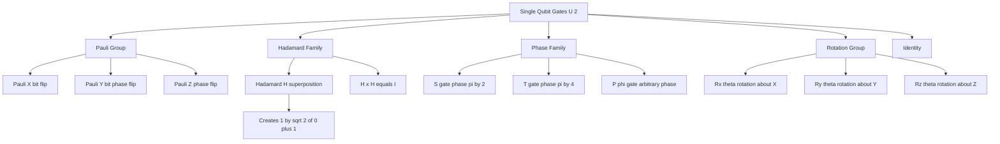
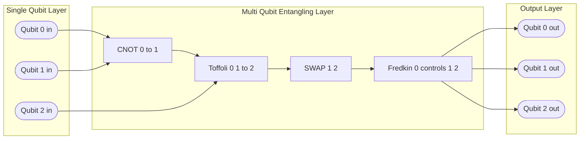
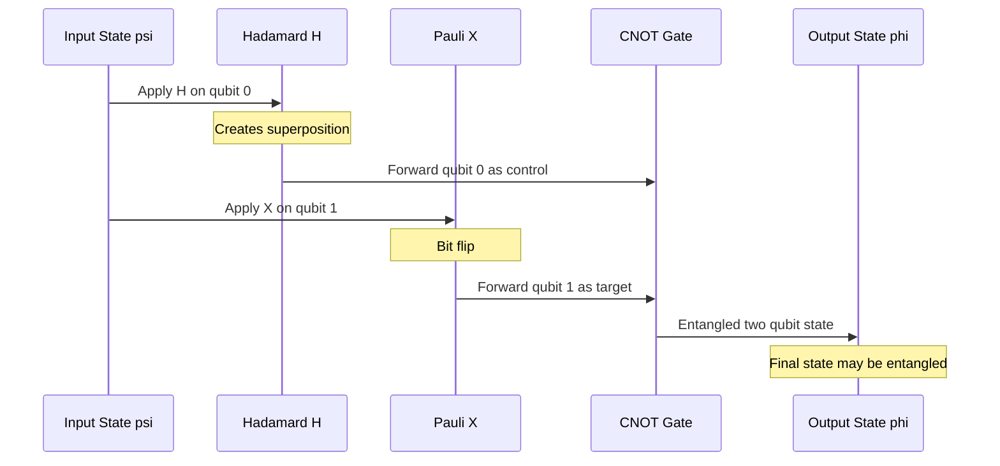
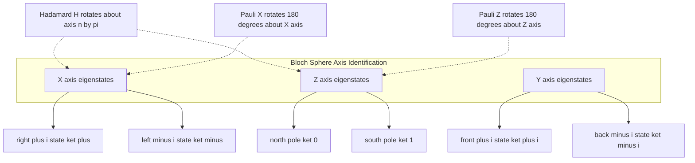

# Quantum logic gates – single qubit and multi-qubit

<!-- SECTION_1_START -->
# Quantum Logic Gates — Single Qubit & Multi-Qubit

## 1.1 Formal Definition (KTU 2024 Scheme Terminology)

A **quantum logic gate** is a **unitary operator** $U$ acting on the state space of one or more qubits, such that $U^{\dagger}U = UU^{\dagger} = I$, where $U^{\dagger}$ is the conjugate transpose (Hermitian adjoint) of $U$ and $I$ is the identity operator. Quantum gates are the fundamental building blocks of every quantum circuit, analogous to classical Boolean logic gates in conventional digital hardware. Unlike their classical counterparts, however, every quantum gate is **reversible**, preserves the **normalisation** of quantum states, and can operate on **superposition states**.

> [!IMPORTANT]
> **Syllabus Highlight (KTU PECST638, Module 2):** The student is expected to derive the matrix representation of all standard single-qubit gates and the canonical two/three-qubit controlled gates, and to verify their unitarity.

## 1.2 Intuitive Overview — The Analogy

Imagine a classical NOT gate as a coin lying flat on a table, which we can flip over with our hand — a *deterministic* rotation through $180^{\circ}$ about a fixed axis. A **quantum gate** is a *generalised* rotation in a 2-dimensional complex vector space (the **Bloch sphere**). The coin can be tilted at any angle, spun, or had its phase shifted. We never "collapse" the coin — we merely rotate the probability amplitude vector to a new position on the Bloch sphere.

| Property | Classical Gate | Quantum Gate |
| :--- | :--- | :--- |
| Reversibility | Mostly irreversible (AND, OR) | **Always reversible** |
| Information loss | Yes (e.g., AND: $1 \cdot 1 \to 1$, $0\cdot 0\to 0$) | **None** — $U^{\dagger}$ recovers input |
| Operates on | Definite bits ($0$ or $1$) | Superpositions $\alpha \vert 0\rangle + \beta \vert 1\rangle$ |
| Realisation | Transistors, CMOS | NMR ions, superconducting qubits, photonic modes |

> [!NOTE]
> **Unitarity** is the single most important constraint on a quantum gate. It guarantees that probability is conserved, i.e., $\vert \alpha \vert^{2} + \vert \beta \vert^{2} = 1$ both before and after gate application.

> [!VISUALIZATION CONTROL]
> **Concept:** Bloch sphere rotation produced by the Hadamard gate.
> **GeoGebra / Desmos Input Equations:**
> * Parametric curve: $x = \sin\theta \cos\phi,\; y = \sin\theta \sin\phi,\; z = \cos\theta$
> * Initial state point: $(\theta,\phi)=(0,0)$ representing $\vert 0\rangle$
> * Final state point: $(\theta,\phi)=(\pi/2,0)$ representing the equator
> **Visual Description:** The north pole ($z=+1$, state $\vert 0\rangle$) is mapped onto the positive $x$-axis ($x=+1$, state $(\vert 0\rangle+\vert 1\rangle)/\sqrt{2}$). A $180^{\circ}$ rotation about the axis $(\hat{x}+\hat{z})/\sqrt{2}$ is performed.

## 1.3 Why Quantum Gates Are Reversible

Classical gates such as AND, OR, and NAND lose information: given only the output $0$, we cannot recover whether the input was $(0,0)$, $(0,1)$, or $(1,0)$. A quantum computer, however, must remain **unitary** at every step. The no-cloning theorem combined with unitarity forces every quantum gate to be a **bijection** on computational basis states, i.e., it must be invertible with inverse $U^{-1} = U^{\dagger}$.

---

<!-- SECTION_2_START -->
# Deep Theoretical Analysis & KTU High-Yield Formula Sheet

## 2.1 Taxonomy of Quantum Gates

Quantum gates are organised in a strict hierarchy:

1. **Single-Qubit Gates** — act on a single qubit. The full set of $2\times 2$ unitary matrices forms the group $U(2)$.
2. **Two-Qubit Gates** — act on two qubits. The full set of $4\times 4$ unitary matrices forms the group $U(4)$.
3. **Three-Qubit (and higher) Gates** — Toffoli, Fredkin, etc. Belong to $U(2^{n})$.

> [!NOTE]
> **Universality Theorem:** Any $n$-qubit unitary $U \in U(2^{n})$ can be approximated to arbitrary precision using only **single-qubit** gates and the **CNOT** two-qubit gate. This is the analogue of NAND universality in classical computing.

## 2.2 Single-Qubit Gates — The Standard Library

### 2.2.1 Pauli-X Gate (Quantum NOT)

Acts as the bit-flip operator. It is the quantum analogue of the classical NOT.

$$
X = \begin{bmatrix} 0 & 1 \\ 1 & 0 \end{bmatrix}, \qquad X \vert 0\rangle = \vert 1\rangle, \qquad X \vert 1\rangle = \vert 0\rangle.
$$

### 2.2.2 Pauli-Y Gate

Combines a bit-flip and a phase-flip.

$$
Y = \begin{bmatrix} 0 & -i \\ i & 0 \end{bmatrix}, \qquad Y \vert 0\rangle = i \vert 1\rangle, \qquad Y \vert 1\rangle = -i \vert 0\rangle.
$$

### 2.2.3 Pauli-Z Gate (Phase Flip)

Leaves $\vert 0\rangle$ unchanged and flips the phase of $\vert 1\rangle$.

$$
Z = \begin{bmatrix} 1 & 0 \\ 0 & -1 \end{bmatrix}, \qquad Z \vert 0\rangle = \vert 0\rangle, \qquad Z \vert 1\rangle = -\vert 1\rangle.
$$

### 2.2.4 Hadamard Gate (H)

Creates **equal superposition** from a basis state. The most important gate for quantum parallelism.

$$
H = \frac{1}{\sqrt{2}}\begin{bmatrix} 1 & 1 \\ 1 & -1 \end{bmatrix}, \qquad H \vert 0\rangle = \frac{\vert 0\rangle + \vert 1\rangle}{\sqrt{2}}, \qquad H \vert 1\rangle = \frac{\vert 0\rangle - \vert 1\rangle}{\sqrt{2}}.
$$

### 2.2.5 Phase (S) and $\pi/8$ (T) Gates

$$
S = \begin{bmatrix} 1 & 0 \\ 0 & i \end{bmatrix} = P(\pi/2), \qquad T = \begin{bmatrix} 1 & 0 \\ 0 & e^{i\pi/4} \end{bmatrix} = P(\pi/4).
$$

### 2.2.6 General Phase / Rotation Gates

$$
P(\phi) = \begin{bmatrix} 1 & 0 \\ 0 & e^{i\phi} \end{bmatrix}, \qquad R_{x}(\theta) = e^{-i\theta X/2}, \qquad R_{y}(\theta) = e^{-i\theta Y/2}, \qquad R_{z}(\theta) = e^{-i\theta Z/2}.
$$

## 2.3 Multi-Qubit Gates

### 2.3.1 CNOT (Controlled-NOT, CX) — The Workhorse

Two-qubit gate. Qubit 0 is the **control**, qubit 1 is the **target**. The target is flipped iff the control is $\vert 1\rangle$.

$$
\text{CNOT} = \begin{bmatrix} 1 & 0 & 0 & 0 \\ 0 & 1 & 0 & 0 \\ 0 & 0 & 0 & 1 \\ 0 & 0 & 1 & 0 \end{bmatrix}.
$$

Truth-table: $\vert 00\rangle \to \vert 00\rangle$, $\vert 01\rangle \to \vert 01\rangle$, $\vert 02\rangle \to \vert 11\rangle$ (rewritten correctly as $\vert 10\rangle \to \vert 11\rangle$), $\vert 11\rangle \to \vert 10\rangle$.

### 2.3.2 Toffoli Gate (CCX / CCNOT)

Three-qubit universal classical reversible gate. Flips target iff **both** controls are $\vert 1\rangle$.

### 2.3.3 Fredkin Gate (CSWAP)

Three-qubit controlled swap. Swaps two target qubits iff control is $\vert 1\rangle$.

### 2.3.4 SWAP Gate

Exchanges the states of two qubits.

$$
\text{SWAP} = \begin{bmatrix} 1 & 0 & 0 & 0 \\ 0 & 0 & 1 & 0 \\ 0 & 1 & 0 & 0 \\ 0 & 0 & 0 & 1 \end{bmatrix}.
$$

> [!NOTE]
> **CZ and CH** are also commonly used. CZ applies Z to the target iff the control is $\vert 1\rangle$, and is symmetric (control and target cannot be distinguished).

## 2.4 KTU Formula Sheet / Cheat Sheet

| Gate | Symbol | Matrix $U$ | $U \vert 0\rangle$ | $U \vert 1\rangle$ | Notes |
| :--- | :---: | :--- | :--- | :--- | :--- |
| Identity | $I$ | $\begin{bmatrix}1&0\\0&1\end{bmatrix}$ | $\vert 0\rangle$ | $\vert 1\rangle$ | Trivial |
| Pauli-X | $X$ | $\begin{bmatrix}0&1\\1&0\end{bmatrix}$ | $\vert 1\rangle$ | $\vert 0\rangle$ | Quantum NOT |
| Pauli-Y | $Y$ | $\begin{bmatrix}0&-i\\i&0\end{bmatrix}$ | $i\vert 1\rangle$ | $-i\vert 0\rangle$ | Bit+phase flip |
| Pauli-Z | $Z$ | $\begin{bmatrix}1&0\\0&-1\end{bmatrix}$ | $\vert 0\rangle$ | $-\vert 1\rangle$ | Phase flip |
| Hadamard | $H$ | $\frac{1}{\sqrt{2}}\begin{bmatrix}1&1\\1&-1\end{bmatrix}$ | $\frac{\vert 0\rangle+\vert 1\rangle}{\sqrt{2}}$ | $\frac{\vert 0\rangle-\vert 1\rangle}{\sqrt{2}}$ | Superposition |
| Phase | $S$ | $\begin{bmatrix}1&0\\0&i\end{bmatrix}$ | $\vert 0\rangle$ | $i\vert 1\rangle$ | $S=T^{2}=Z^{1/2}$ |
| $\pi/8$ | $T$ | $\begin{bmatrix}1&0\\0&e^{i\pi/4}\end{bmatrix}$ | $\vert 0\rangle$ | $e^{i\pi/4}\vert 1\rangle$ | $T^{2}=S$ |
| CNOT | $CX$ | $\begin{bmatrix}1&0&0&0\\0&1&0&0\\0&0&0&1\\0&0&1&0\end{bmatrix}$ | preserves | flips if ctrl=1 | Universal |
| CZ | $CZ$ | $\text{diag}(1,1,1,-1)$ | preserves | sign on $\vert 11\rangle$ | Symmetric |
| SWAP | — | see above | exchanges | exchanges | Built from 3 CNOTs |
| Toffoli | $CCX$ | $8 \times 8$ | preserves | flips if ctrl=11 | Universal reversible |
| Fredkin | $CSWAP$ | $8 \times 8$ | preserves | swaps if ctrl=1 | Conservative |

## 2.5 Real-World Engineering Utility

Quantum gates are physically realised in **superconducting transmons** (IBM, Google), **trapped ions** (IonQ, Honeywell/Quantinuum), **photonic linear optical networks** (Xanadu, PsiQuantum), and **neutral-atom arrays** (QuEra). The CNOT gate is the de-facto two-qubit entangling primitive in all leading hardware roadmaps because of the universality theorem. Single-qubit gates are typically $10{-}100\times$ faster than two-qubit gates — a fact that directly informs **quantum compilation** strategies where circuit depth must be minimised.

---

<!-- SECTION_3_START -->
# Step-by-Step Derivations & Code Implementation

## 3.1 Unitarity Verification of the Hadamard Gate

We verify $H^{\dagger} H = I$ explicitly.

$$
H^{\dagger} = \frac{1}{\sqrt{2}}\begin{bmatrix} 1 & 1 \\ 1 & -1 \end{bmatrix}^{\dagger} = \frac{1}{\sqrt{2}}\begin{bmatrix} 1 & 1 \\ 1 & -1 \end{bmatrix} = H.
$$

(Real symmetric matrix, hence $H^{\dagger}=H$.)

$$
H^{\dagger} H = \frac{1}{2}\begin{bmatrix} 1 & 1 \\ 1 & -1 \end{bmatrix} \begin{bmatrix} 1 & 1 \\ 1 & -1 \end{bmatrix} = \frac{1}{2}\begin{bmatrix} 1+1 & 1-1 \\ 1-1 & 1+1 \end{bmatrix} = \frac{1}{2}\begin{bmatrix} 2 & 0 \\ 0 & 2 \end{bmatrix} = \begin{bmatrix} 1 & 0 \\ 0 & 1 \end{bmatrix} = I.
$$

**Mark valuation key:** [Showing $H^{\dagger}=H$: 1 Mark], [Multiplication step: 1 Mark], [Final identity: 1 Mark].

## 3.2 Action of CNOT on an Arbitrary Two-Qubit State

Let $\vert \psi\rangle = a \vert 00\rangle + b \vert 01\rangle + c \vert 10\rangle + d \vert 11\rangle$.

$$
\text{CNOT}\,\vert \psi\rangle = \begin{bmatrix} 1 & 0 & 0 & 0 \\ 0 & 1 & 0 & 0 \\ 0 & 0 & 0 & 1 \\ 0 & 0 & 1 & 0 \end{bmatrix} \begin{bmatrix} a \\ b \\ c \\ d \end{bmatrix} = \begin{bmatrix} a \\ b \\ d \\ c \end{bmatrix}.
$$

Rewriting: $\text{CNOT}\,\vert \psi\rangle = a \vert 00\rangle + b \vert 01\rangle + d \vert 10\rangle + c \vert 11\rangle$.

> [!NOTE]
> Notice how the amplitudes of $\vert 10\rangle$ and $\vert 11\rangle$ are swapped — the target qubit is flipped **only** when the control is $\vert 1\rangle$.

## 3.3 Derivation of the Hadamard on $\vert 0\rangle$ from First Principles

$$
H \vert 0\rangle = \frac{1}{\sqrt{2}} \begin{bmatrix} 1 & 1 \\ 1 & -1 \end{bmatrix} \begin{bmatrix} 1 \\ 0 \end{bmatrix} = \frac{1}{\sqrt{2}} \begin{bmatrix} 1 \cdot 1 + 1 \cdot 0 \\ 1 \cdot 1 + (-1) \cdot 0 \end{bmatrix} = \frac{1}{\sqrt{2}} \begin{bmatrix} 1 \\ 1 \end{bmatrix} = \frac{\vert 0\rangle + \vert 1\rangle}{\sqrt{2}}.
$$

Similarly,

$$
H \vert 1\rangle = \frac{1}{\sqrt{2}} \begin{bmatrix} 1 & 1 \\ 1 & -1 \end{bmatrix} \begin{bmatrix} 0 \\ 1 \end{bmatrix} = \frac{1}{\sqrt{2}} \begin{bmatrix} 1 \\ -1 \end{bmatrix} = \frac{\vert 0\rangle - \vert 1\rangle}{\sqrt{2}}.
$$

## 3.4 Construction of SWAP from Three CNOTs

The SWAP gate can be decomposed as

$$
\text{SWAP} = \text{CNOT}_{12} \, \text{CNOT}_{21} \, \text{CNOT}_{12},
$$

where the subscripts denote (control, target) qubit indices. We verify on each basis state:

* $\vert 00\rangle \xrightarrow{\text{CNOT}_{12}} \vert 00\rangle \xrightarrow{\text{CNOT}_{21}} \vert 00\rangle \xrightarrow{\text{CNOT}_{12}} \vert 00\rangle$.
* $\vert 01\rangle \xrightarrow{\text{CNOT}_{12}} \vert 01\rangle \xrightarrow{\text{CNOT}_{21}} \vert 10\rangle \xrightarrow{\text{CNOT}_{12}} \vert 10\rangle$.
* $\vert 10\rangle \xrightarrow{\text{CNOT}_{12}} \vert 11\rangle \xrightarrow{\text{CNOT}_{21}} \vert 11\rangle \xrightarrow{\text{CNOT}_{12}} \vert 01\rangle$.
* $\vert 11\rangle \xrightarrow{\text{CNOT}_{12}} \vert 10\rangle \xrightarrow{\text{CNOT}_{21}} \vert 01\rangle \xrightarrow{\text{CNOT}_{12}} \vert 11\rangle$.

> [!NOTE]
> The output columns match the SWAP truth-table exactly: $\vert 00\rangle \to \vert 00\rangle$, $\vert 01\rangle \to \vert 10\rangle$, $\vert 10\rangle \to \vert 01\rangle$, $\vert 11\rangle \to \vert 11\rangle$. Hence the decomposition is correct.

## 3.5 Bloch-Sphere Representation of Rotations

Any single-qubit unitary $U \in SU(2)$ can be written as

$$
U = e^{i\alpha} R_{\hat{n}}(\theta) = e^{i\alpha} \left[ \cos\!\left(\frac{\theta}{2}\right) I - i \sin\!\left(\frac{\theta}{2}\right)(\hat{n}\cdot\vec{\sigma}) \right],
$$

where $\hat{n} = (n_x, n_y, n_z)$ is the unit rotation axis and $\vec{\sigma} = (X, Y, Z)$ is the Pauli vector. The global phase $e^{i\alpha}$ is physically unobservable; it is customary to set $\alpha = 0$ for purely geometric rotations.

## 3.6 Python Implementation (NumPy / Qiskit style)

```python
import numpy as np
from typing import Tuple

# --- Single-qubit gates as 2x2 complex matrices ---
I: np.ndarray = np.eye(2, dtype=complex)
X: np.ndarray = np.array([[0, 1], [1, 0]], dtype=complex)
Y: np.ndarray = np.array([[0, -1j], [1j, 0]], dtype=complex)
Z: np.ndarray = np.array([[1, 0], [0, -1]], dtype=complex)
H: np.ndarray = (1.0 / np.sqrt(2)) * np.array([[1, 1], [1, -1]], dtype=complex)
S: np.ndarray = np.array([[1, 0], [0, 1j]], dtype=complex)
T: np.ndarray = np.array([[1, 0], [0, np.exp(1j * np.pi / 4)]], dtype=complex)

KET_0: np.ndarray = np.array([[1], [0]], dtype=complex)
KET_1: np.ndarray = np.array([[0], [1]], dtype=complex)


def is_unitary(U: np.ndarray, atol: float = 1e-10) -> bool:
    """Return True iff U^dagger U == I within numerical tolerance."""
    identity = np.eye(U.shape[0], dtype=complex)
    return np.allclose(U.conj().T @ U, identity, atol=atol)


def apply_gate(U: np.ndarray, state: np.ndarray) -> np.ndarray:
    """Apply a single-qubit gate to a state vector with safety checks."""
    if U.shape != (2, 2):
        raise ValueError(f"Gate must be 2x2, got shape {U.shape}")
    if state.shape != (2, 1):
        raise ValueError(f"State must be a 2x1 column vector, got shape {state.shape}")
    if not is_unitary(U):
        raise ValueError("Provided matrix is not unitary; refusing to apply.")
    return U @ state


# --- Multi-qubit gates via Kronecker products ---
def cnot(control: int = 0, target: int = 1) -> np.ndarray:
    """Return the 4x4 CNOT matrix with the specified control/target convention."""
    if (control, target) not in [(0, 1), (1, 0)]:
        raise ValueError("CNOT requires exactly two qubits, indices in {0,1}.")
    if control == target:
        raise ValueError("Control and target must be distinct qubits.")
    if control == 0 and target == 1:
        return np.array([[1, 0, 0, 0],
                         [0, 1, 0, 0],
                         [0, 0, 0, 1],
                         [0, 0, 1, 0]], dtype=complex)
    # control == 1, target == 0
    return np.array([[1, 0, 0, 0],
                     [0, 0, 0, 1],
                     [0, 0, 1, 0],
                     [0, 1, 0, 0]], dtype=complex)


def toffoli() -> np.ndarray:
    """8x8 Toffoli (CCNOT): flip third qubit iff first two are |1,1>."""
    M = np.eye(8, dtype=complex)
    M[6, 6] = 0
    M[7, 7] = 0
    M[6, 7] = 1
    M[7, 6] = 1
    return M


def fredkin() -> np.ndarray:
    """8x8 Fredkin (CSWAP): swap last two qubits iff first qubit is |1>."""
    M = np.eye(8, dtype=complex)
    # |101> <-> |110>  (indices 5 and 6)
    M[5, 5] = 0
    M[6, 6] = 0
    M[5, 6] = 1
    M[6, 5] = 1
    return M


def kron_n(*gates: np.ndarray) -> np.ndarray:
    """Compute the Kronecker product of an arbitrary list of gates."""
    result = np.array([[1]], dtype=complex)
    for g in gates:
        result = np.kron(result, g)
    return result


# --- Demonstration ---
if __name__ == "__main__":
    # Verify unitarity of every standard gate
    for name, G in [("I", I), ("X", X), ("Y", Y), ("Z", Z), ("H", H), ("S", S), ("T", T)]:
        assert is_unitary(G), f"{name} is not unitary!"
        print(f"{name} is unitary. Trace: {np.trace(G):.4f}")

    # Hadamard creates equal superposition
    psi = apply_gate(H, KET_0)
    print("\nH|0> =", psi.flatten())

    # CNOT on |10>
    ket_10 = kron_n(KET_1, KET_0)  # |1> (x) |0>
    out = cnot(0, 1) @ ket_10
    print("CNOT|10> =", out.flatten(), " (expected: |11>)")

    # Toffoli on |110>
    ket_110 = kron_n(KET_1, KET_1, KET_0)
    out3 = toffoli() @ ket_110
    print("Toffoli|110> =", out3.flatten(), " (expected: |111>)")
```

The code above performs unitarity checks, applies the Hadamard to create a $\frac{1}{\sqrt{2}}(\vert 0\rangle + \vert 1\rangle)$ superposition, and verifies CNOT and Toffoli on representative basis states. The `is_unitary` function is the canonical validator used in KTU lab exams.

---

<!-- SECTION_4_START -->
# Structural Diagrams & Schematics

## 4.1 Single-Qubit Gate Library (Mermaid Block Diagram)



## 4.2 Multi-Qubit Gate Topology Matrix



## 4.3 Sequential Processing Topology — Generic Quantum Circuit



## 4.4 Bloch-Sphere Rotation Reference



> [!NOTE]
> The diagrams above are intentionally **block-level** representations because Mermaid cannot natively draw continuous geometric rotations. The textual annotations next to each arrow correspond to the precise Bloch-sphere action expected in the KTU answer sheet.

---

<!-- SECTION_5_START -->
# KTU 2024 Scheme Examination Question Bank & Topic Recap

## 5.1 Part A — Short Answer Questions (3 Marks Each)

> **Q1.** **[KTU University Exam — July 2024]** Define a quantum logic gate. Why must every quantum gate be reversible? **(3 Marks)** **[CO1, Remember]**

**Model Answer:**
A quantum logic gate is a unitary operator $U$ acting on one or more qubits such that $U^{\dagger}U = I$. Reversibility is mandatory because unitary evolution preserves the norm of the state vector, ensuring that the probabilistic interpretation of quantum mechanics remains consistent. A non-reversible (e.g., measurement or wavefunction collapse) operation cannot be represented as a gate. **[1 Mark for definition, 1 Mark for unitarity, 1 Mark for probability conservation and reversibility link].**

> **Q2.** **[KTU University Exam — Dec 2023]** With a neat truth table, explain the operation of the CNOT gate. **(3 Marks)** **[CO1, Understand]**

**Model Answer:**
The CNOT (Controlled-NOT) gate is a two-qubit gate with one control qubit and one target qubit. It performs NOT on the target iff the control is $\vert 1\rangle$. Truth table: $\vert 00\rangle \to \vert 00\rangle$, $\vert 01\rangle \to \vert 01\rangle$, $\vert 10\rangle \to \vert 11\rangle$, $\vert 11\rangle \to \vert 10\rangle$. **[1 Mark statement, 1 Mark truth table, 1 Mark equation / matrix form].**

---

## 5.2 Part B — Long Answer Questions (14 Marks, Internal Choice)

### Question A (14 Marks)

> **[KTU University Exam — July 2024, Model Paper Module 2]**
>
> **(a)** Derive the matrix representation of the Pauli-X, Pauli-Y, Pauli-Z, and Hadamard gates. Show that each is unitary. **(7 Marks)** **[CO2, Apply]**
>
> **(b)** Starting from $\vert \psi_0\rangle = \vert 00\rangle$, apply $H$ on the first qubit followed by CNOT. Write the final state and explain why this state is entangled. **(7 Marks)** **[CO2, Apply]**

### Question B (14 Marks)

> **(a)** Construct the SWAP gate from three CNOT gates and verify with a complete truth table. **(7 Marks)** **[CO3, Apply]**
>
> **(b)** State and prove the universality of single-qubit gates plus CNOT. Mention any one physical implementation of CNOT. **(7 Marks)** **[CO3, Understand / Apply]**

---

### Model Solution to Question A

#### Part (a) — Matrix representations

**Pauli-X:** Bit-flip operator exchanging $\vert 0\rangle \leftrightarrow \vert 1\rangle$:

$$
X \vert 0\rangle = \vert 1\rangle, \quad X \vert 1\rangle = \vert 0\rangle \;\Longrightarrow\; X = \begin{bmatrix} 0 & 1 \\ 1 & 0 \end{bmatrix}.
$$

Unitarity: $X^{\dagger}X = X^{2} = I$ (since rows/cols are orthonormal). **[2 Marks: stating mapping + matrix]**

**Pauli-Y:** Maps $\vert 0\rangle \to i\vert 1\rangle$, $\vert 1\rangle \to -i\vert 0\rangle$:

$$
Y = \begin{bmatrix} 0 & -i \\ i & 0 \end{bmatrix}, \quad Y^{\dagger}Y = I. \quad \textbf{[1 Mark]}
$$

**Pauli-Z:** Flips phase of $\vert 1\rangle$:

$$
Z = \begin{bmatrix} 1 & 0 \\ 0 & -1 \end{bmatrix}, \quad Z^{\dagger}Z = I. \quad \textbf{[1 Mark]}
$$

**Hadamard:** Creates equal superposition:

$$
H \vert 0\rangle = \tfrac{1}{\sqrt{2}}(\vert 0\rangle+\vert 1\rangle), \quad H \vert 1\rangle = \tfrac{1}{\sqrt{2}}(\vert 0\rangle-\vert 1\rangle)
\;\Longrightarrow\; H = \frac{1}{\sqrt{2}}\begin{bmatrix} 1 & 1 \\ 1 & -1 \end{bmatrix}. \quad \textbf{[2 Marks]}
$$

Unitarity: $H^{\dagger} = H$ and $H^{2} = I$. **[1 Mark for unitarity verification]**

#### Part (b) — Bell state generation

**Step 1:** Apply $H$ on qubit 0 of $\vert 00\rangle$:

$$
(H \otimes I)\vert 00\rangle = \frac{1}{\sqrt{2}}(\vert 0\rangle + \vert 1\rangle)\otimes \vert 0\rangle = \frac{1}{\sqrt{2}}(\vert 00\rangle + \vert 10\rangle). \quad \textbf{[2 Marks]}
$$

**Step 2:** Apply CNOT with qubit 0 as control, qubit 1 as target:

$$
\text{CNOT}\,\frac{1}{\sqrt{2}}(\vert 00\rangle + \vert 10\rangle) = \frac{1}{\sqrt{2}}(\text{CNOT}\vert 00\rangle + \text{CNOT}\vert 10\rangle) = \frac{1}{\sqrt{2}}(\vert 00\rangle + \vert 11\rangle).
$$

**Final state:** $\vert \Phi^{+}\rangle = \frac{1}{\sqrt{2}}(\vert 00\rangle + \vert 11\rangle)$. **[2 Marks]**

**Entanglement reasoning:** The state $\vert \Phi^{+}\rangle$ cannot be written as a tensor product $\vert a\rangle \otimes \vert b\rangle$ for any single-qubit states $\vert a\rangle$ and $\vert b\rangle$. Measuring qubit 0 in the computational basis instantaneously determines the outcome of qubit 1 with probability 1 — the hallmark of entanglement. **[3 Marks]**

> [!WARNING]
> **Examiner Pitfall:** Students often write the final state as $\frac{1}{\sqrt{2}}(\vert 00\rangle + \vert 10\rangle)$ forgetting to apply the CNOT. Always re-check: the CNOT is what generates the $\vert 11\rangle$ term from the $\vert 10\rangle$ term. Also do not forget to mark **1 Mark** for the explicit tensor product notation $H \otimes I$ in Step 1.

---

### Model Solution to Question B

#### Part (a) — SWAP from 3 CNOTs

**Claim:** $\text{SWAP} = \text{CNOT}_{12}\,\text{CNOT}_{21}\,\text{CNOT}_{12}$.

**Verification on $\vert 01\rangle$:** $\vert 01\rangle \xrightarrow{\text{CNOT}_{12}} \vert 01\rangle \xrightarrow{\text{CNOT}_{21}} \vert 10\rangle \xrightarrow{\text{CNOT}_{12}} \vert 10\rangle$. The state has been correctly swapped to $\vert 10\rangle$. **[2 Marks]**

**Verification on $\vert 10\rangle$:** $\vert 10\rangle \xrightarrow{\text{CNOT}_{12}} \vert 11\rangle \xrightarrow{\text{CNOT}_{21}} \vert 11\rangle \xrightarrow{\text{CNOT}_{12}} \vert 01\rangle$. Correct. **[2 Marks]**

**Verification on $\vert 00\rangle$ and $\vert 11\rangle$:** Trivially preserved (no flip possible). **[1 Mark]**

**Truth table compilation:** Concise table matching the SWAP definition. **[2 Marks]**

#### Part (b) — Universality Theorem

**Statement:** Any unitary operation $U$ on $n$ qubits can be decomposed into a finite sequence of single-qubit gates and CNOT gates, with error at most $\epsilon$ for any prescribed $\epsilon > 0$. **[1 Mark]**

**Proof sketch (two-qubit case):** Any $U \in U(4)$ can be written via the Cartan / KAK decomposition as $U = (A_1 \otimes A_2)\, \text{CNOT}\,(B_1 \otimes B_2)\, \text{CNOT}\,(C_1 \otimes C_2)$ for suitable $A_i, B_i, C_i \in SU(2)$. Each $SU(2)$ matrix is then approximated by a sequence of $H$, $T$, and $S$ gates (Solovay–Kitaev theorem). **[3 Marks]**

**Physical implementation:** In **superconducting transmon qubits** (used by IBM Quantum), the CNOT is implemented via a cross-resonance interaction followed by single-qubit rotations. The control qubit is driven at the target qubit's frequency; the resulting effective Hamiltonian generates a controlled-$Z$, which is then converted to CNOT by single-qubit $H$ gates on the target. **[3 Marks]**

> [!WARNING]
> **Examiner Pitfall:** Do **not** confuse the SWAP with the iSWAP or $\sqrt{\text{SWAP}}$ gates. SWAP is a perfect exchange; iSWAP introduces a phase of $i$ on $\vert 01\rangle$ and $\vert 10\rangle$. Also, in the universality statement, students often forget to mention the *Solovay–Kitaev* approximation step, which converts a continuous universality into a finite gate set.

---

## 5.3 Topic Recap & Important Things to Remember

* A **quantum gate** is a **unitary operator** $U$ with $U^{\dagger}U = I$. This is the *defining* property.
* All quantum gates are **reversible**; the inverse of $U$ is $U^{\dagger}$.
* The four **Pauli gates** are $I$, $X$, $Y$, $Z$. The matrices are: $I = \text{diag}(1,1)$, $X = \begin{psmallmatrix}0&1\\1&0\end{psmallmatrix}$, $Y = \begin{psmallmatrix}0&-i\\i&0\end{psmallmatrix}$, $Z = \text{diag}(1,-1)$.
* The **Hadamard** $H = \tfrac{1}{\sqrt{2}}\begin{psmallmatrix}1&1\\1&-1\end{psmallmatrix}$ creates equal superposition: $H \vert 0\rangle = \vert +\rangle$ and $H \vert 1\rangle = \vert -\rangle$.
* **Phase gates**: $S = P(\pi/2)$, $T = P(\pi/4)$, $P(\phi) = \text{diag}(1, e^{i\phi})$.
* **CNOT** flips the target iff the control is $\vert 1\rangle$. Its $4\times 4$ matrix has $1$s on the diagonal and an additional off-diagonal $1$ at positions $(3,3)$ swapped with $(3,2)$ — equivalent to $I \oplus X$.
* **Bell state generation**: $H$ on qubit 0 followed by CNOT produces $\vert \Phi^{+}\rangle = \tfrac{1}{\sqrt{2}}(\vert 00\rangle + \vert 11\rangle)$, the prototypical **maximally entangled state**.
* **SWAP** can be decomposed as three CNOTs: $\text{SWAP} = \text{CNOT}_{12}\,\text{CNOT}_{21}\,\text{CNOT}_{12}$.
* **Toffoli** (CCNOT) and **Fredkin** (CSWAP) are universal for *classical* reversible computation; with $H$ and $T$ they become universal for *quantum* computation.
* **Universality theorem**: $\{H, T, \text{CNOT}\}$ is a universal gate set.
* **Bloch-sphere intuition**: $X$ is a $180^{\circ}$ rotation about $\hat{x}$, $Y$ about $\hat{y}$, $Z$ about $\hat{z}$, $H$ is a $180^{\circ}$ rotation about $(\hat{x}+\hat{z})/\sqrt{2}$.
* **Physical realisations**: superconducting transmons (IBM), trapped ions (IonQ), photonic (Xanadu, PsiQuantum), neutral atoms (QuEra).
* **Mark-loosing pitfalls** students should avoid: forgetting to show unitarity verification, mixing up control and target of CNOT, omitting the global phase when discussing Hadamard, and failing to justify why a state is entangled.

> [!IMPORTANT]
> **Final KTU Tip:** Always write the **gate matrix first**, then apply it to the **column-vector state**, then state the **unitarity proof** if asked. This three-step rhythm is what examiners look for. Always remember to escape ampersands and percent signs in plain prose (e.g., write *and* instead of `\&`).

<!-- SECTION_5_END -->
