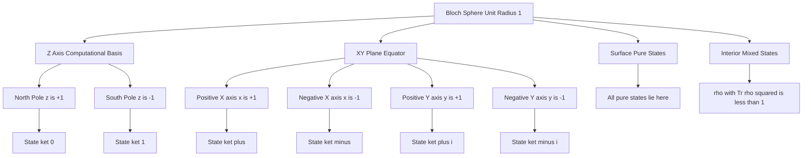
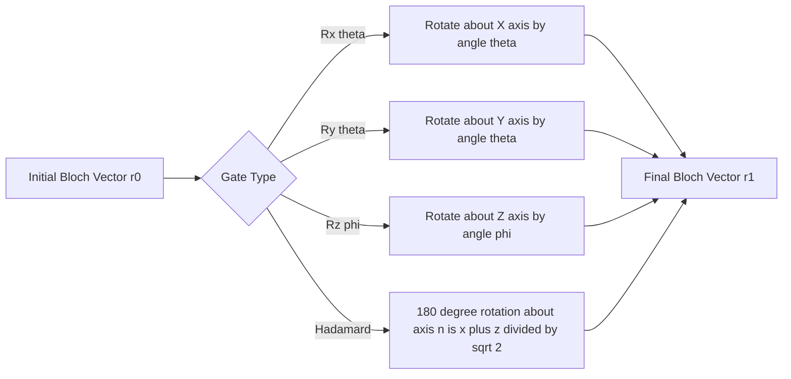

# Qubit – Bloch sphere representation

<!-- SECTION_1_START -->
# Qubit & Bloch Sphere Representation — KTU 2024 Quantum Computing Notes

## 1. Core Technical Definition & Intuitive Overview

### 1.1 Formal Academic Definition (KTU 2024 Syllabus Terminology)

> [!NOTE]
> **Qubit (Quantum Bit):** The fundamental unit of quantum information, defined as a normalised state vector $\vert \psi \rangle$ in a two-dimensional complex Hilbert space $\mathcal{H}_2 \cong \mathbb{C}^2$. A pure qubit state is represented as a linear superposition of the computational orthonormal basis states $\vert 0 \rangle$ and $\vert 1 \rangle$.

The general state of a single qubit is mathematically expressed as:

$$
\vert \psi \rangle = \alpha \vert 0 \rangle + \beta \vert 1 \rangle, \quad \alpha, \beta \in \mathbb{C}
$$

subject to the **normalisation condition** (also called the unit-length constraint):

$$
\vert \alpha \vert^2 + \vert \beta \vert^2 = 1
$$

where $\vert \alpha \vert^2$ is the **probability** of measuring the qubit in state $\vert 0 \rangle$ and $\vert \beta \vert^2$ is the **probability** of measuring the qubit in state $\vert 1 \rangle$.

The standard computational basis in column-vector notation is:

$$
\vert 0 \rangle = \begin{bmatrix} 1 \\ 0 \end{bmatrix}, \quad \vert 1 \rangle = \begin{bmatrix} 0 \\ 1 \end{bmatrix}
$$

### 1.2 The Bloch Sphere — Formal Definition

> [!IMPORTANT]
> **Bloch Sphere Representation:** A geometric, three-dimensional real-vector visualisation of the pure state space of a single two-level quantum system. Every pure qubit state corresponds to a unique point on the surface of a unit sphere (radius = **1**) embedded in $\mathbb{R}^3$, called the *Bloch sphere*. The mapping is bijective (one-to-one) for pure states, while mixed states lie strictly inside the sphere.

The three Cartesian coordinates $(x, y, z)$ of the Bloch vector $\vec{r}$ are bounded by:

$$
x^2 + y^2 + z^2 = 1
$$

where each coordinate lies in the closed interval $[-1, +1]$.

### 1.3 Conceptual Analogy & Geometric Intuition

> [!TIP]
> **Earth-Globe Analogy (Intuition Hook):** Think of the Bloch sphere like a planet Earth.
> - The **North Pole** represents the classical bit state $\vert 0 \rangle$ with absolute certainty.
> - The **South Pole** represents the classical bit state $\vert 1 \rangle$ with absolute certainty.
> - Any point on the **Equator** represents an equal superposition state (50% chance of $\vert 0 \rangle$ and 50% chance of $\vert 1 \rangle$).
> - Points **inside the sphere** represent *mixed* (impure) states — physically, these are probabilistic mixtures caused by environmental noise (decoherence).
> - Points **on the surface** represent *pure* states — perfectly isolated quantum systems.

Unlike a classical bit, which can ONLY ever be at the North or South Pole, a qubit can exist at *any* point on (or inside) this sphere. This is the geometric origin of quantum parallelism and quantum advantage.

### 1.4 Cardinal Point Mapping Reference

| Bloch Sphere Location | State Vector | Measurement Probabilities |
|---|---|---|
| North Pole $(0, 0, +1)$ | $\vert 0 \rangle$ | $P(0) = 1$, $P(1) = 0$ |
| South Pole $(0, 0, -1)$ | $\vert 1 \rangle$ | $P(0) = 0$, $P(1) = 1$ |
| +X axis $(+1, 0, 0)$ | $\frac{1}{\sqrt{2}}(\vert 0 \rangle + \vert 1 \rangle) = \vert + \rangle$ | $P(0) = P(1) = 0.5$ |
| -X axis $(-1, 0, 0)$ | $\frac{1}{\sqrt{2}}(\vert 0 \rangle - \vert 1 \rangle) = \vert - \rangle$ | $P(0) = P(1) = 0.5$ |
| +Y axis $(0, +1, 0)$ | $\frac{1}{\sqrt{2}}(\vert 0 \rangle + i \vert 1 \rangle) = \vert +i \rangle$ | $P(0) = P(1) = 0.5$ |
| -Y axis $(0, -1, 0)$ | $\frac{1}{\sqrt{2}}(\vert 0 \rangle - i \vert 1 \rangle) = \vert -i \rangle$ | $P(0) = P(1) = 0.5$ |
| Any point on the **surface** | Pure state $\vert \psi \rangle$ | $\vert \alpha \vert^2 + \vert \beta \vert^2 = 1$ |
| Any point **strictly inside** | Mixed state $\rho$ (density matrix) | $\text{Tr}(\rho^2) < 1$ |

### 1.5 GeoGebra / Desmos Visualisation Block

> [!VISUALIZATION CONTROL]
> **Concept:** Unit Bloch sphere with the polar angle $\theta$ and azimuthal angle $\phi$ drawn on a 3D coordinate system.
>
> **Desmos 3D / GeoGebra Input Equations:**
>
> * Sphere: `x^2 + y^2 + z^2 = 1`
> * North pole point: `(0, 0, 1)`
> * South pole point: `(0, 0, -1)`
> * Generic state vector (surface point): `(sin(theta) cos(phi), sin(theta) sin(phi), cos(theta))`
> * Parametric sliders: $\theta \in [0, \pi]$, $\phi \in [0, 2\pi]$
> * X-axis (red): line from $(-1, 0, 0)$ to $(+1, 0, 0)$
> * Y-axis (green): line from $(0, -1, 0)$ to $(0, +1, 0)$
> * Z-axis (blue): line from $(0, 0, -1)$ to $(0, 0, +1)$
>
> **Visual Description:** The student should observe a transparent unit sphere. The Z-axis (vertical) is the computational basis axis, with $\vert 0 \rangle$ at the top and $\vert 1 \rangle$ at the bottom. The X and Y axes lie in the equatorial plane. A red arrow drawn from the origin to a chosen surface point represents the Bloch vector $\vec{r} = (x, y, z)$. As $\theta$ decreases from $0$ to $\pi$, the vector tilts from the North Pole toward the South Pole. As $\phi$ varies, the vector rotates around the Z-axis in the equatorial plane.
<!-- SECTION_1_END -->

<!-- SECTION_2_START -->
# 2. Deep Theoretical Analysis & KTU High-Yield Formula Sheet

## 2.1 Operational Breakdown — From Hilbert Space to Bloch Sphere

A pure qubit lives in a 2-dimensional complex Hilbert space $\mathbb{C}^2$. This space has 4 real degrees of freedom (two complex numbers $\alpha, \beta$). The mapping from $\mathbb{C}^2$ to the Bloch sphere $\mathbb{R}^3$ is achieved by *systematically eliminating* these degrees of freedom using physically motivated constraints.

### Step-by-Step Logic:

* **Step 1 — Initial Parameter Count:** A generic state $\vert \psi \rangle = \alpha \vert 0 \rangle + \beta \vert 1 \rangle$ uses two complex numbers $\alpha, \beta$, giving 4 real parameters.

* **Step 2 — Apply the Normalisation Condition:** $\vert \alpha \vert^2 + \vert \beta \vert^2 = 1$ removes 1 degree of freedom, leaving **3 real parameters**.

* **Step 3 — Factor Out the Global Phase:** A quantum state $\vert \psi \rangle$ and $e^{i\gamma} \vert \psi \rangle$ are physically indistinguishable (they produce identical measurement statistics for all observables). The factor $e^{i\gamma}$ is called the *global phase* and is *not* physically observable. Removing it leaves **2 real parameters**.

* **Step 4 — Map to Spherical Coordinates:** These remaining 2 real parameters are the polar angle $\theta \in [0, \pi]$ and the azimuthal angle $\phi \in [0, 2\pi)$. Together with the unit-radius constraint, they form a 2-sphere $S^2 \subset \mathbb{R}^3$ — the **Bloch sphere**.

> [!IMPORTANT]
> **Key Distinction for the Board Exam:** The global phase $e^{i\gamma}$ has *no physical effect*, but a *relative* phase between $\alpha$ and $\beta$ is critical and IS physically observable (it determines $\phi$ on the Bloch sphere).

## 2.2 The Canonical Bloch Parametrisation

The general pure-qubit state in the Bloch parametrisation is written as:

$$
\vert \psi \rangle = \cos\!\left(\frac{\theta}{2}\right) \vert 0 \rangle + e^{i\phi} \sin\!\left(\frac{\theta}{2}\right) \vert 1 \rangle
$$

with the parameter domain:

$$
\theta \in [0, \pi], \quad \phi \in [0, 2\pi)
$$

The Bloch vector $\vec{r} = (x, y, z)$ in Cartesian coordinates is:

$$
x = \sin\theta \cos\phi, \quad y = \sin\theta \sin\phi, \quad z = \cos\theta
$$

The associated density matrix (outer product) of the pure state is:

$$
\rho = \vert \psi \rangle \langle \psi \rvert = \frac{1}{2}\!\left(I + \vec{r} \cdot \vec{\sigma}\right)
$$

where $\vec{\sigma} = (\sigma_x, \sigma_y, \sigma_z)$ are the three **Pauli matrices** and $I$ is the $2 \times 2$ identity matrix.

## 2.3 The Three Pauli Matrices (Foundational Operators)

$$
\sigma_x = \begin{bmatrix} 0 & 1 \\ 1 & 0 \end{bmatrix}, \quad
\sigma_y = \begin{bmatrix} 0 & -i \\ i & 0 \end{bmatrix}, \quad
\sigma_z = \begin{bmatrix} 1 & 0 \\ 0 & -1 \end{bmatrix}, \quad
I = \begin{bmatrix} 1 & 0 \\ 0 & 1 \end{bmatrix}
$$

These matrices are Hermitian ($\sigma_i^\dagger = \sigma_i$), unitary ($\sigma_i \sigma_i^\dagger = I$), involutory ($\sigma_i^2 = I$), traceless ($\text{Tr}(\sigma_i) = 0$), and have eigenvalues $\pm 1$.

> [!TIP]
> **Why Half-Angles?** The factor of $\frac{\theta}{2}$ (instead of $\theta$) is a direct consequence of the normalisation condition combined with the factorisation of the global phase. When $\theta$ sweeps from $0$ to $\pi$, the probability weight $\cos^2(\theta/2)$ smoothly varies from $1$ to $0$, mapping the entire Bloch sphere surface exactly once.

## 2.4 KTU Formula Sheet — High-Yield Cheat Sheet

> [!IMPORTANT]
> **Master These Equations Cold — They Appear in 80%+ of KTU Board Questions on the Bloch Sphere.**

| # | Concept | Formula / Expression | Domain / Unit |
|---|---|---|---|
| 1 | General pure state | $\vert \psi \rangle = \alpha \vert 0 \rangle + \beta \vert 1 \rangle$ | $\alpha, \beta \in \mathbb{C}$ |
| 2 | Normalisation | $\vert \alpha \vert^2 + \vert \beta \vert^2 = 1$ | Dimensionless |
| 3 | Bloch parametrisation | $\vert \psi \rangle = \cos(\theta/2)\vert 0 \rangle + e^{i\phi}\sin(\theta/2)\vert 1 \rangle$ | $\theta \in [0, \pi]$, $\phi \in [0, 2\pi)$ |
| 4 | Bloch vector — x | $x = \sin\theta \cos\phi$ | $[-1, +1]$ |
| 5 | Bloch vector — y | $y = \sin\theta \sin\phi$ | $[-1, +1]$ |
| 6 | Bloch vector — z | $z = \cos\theta$ | $[-1, +1]$ |
| 7 | Sphere constraint | $x^2 + y^2 + z^2 = 1$ | Pure state surface |
| 8 | Density matrix | $\rho = \tfrac{1}{2}(I + x\sigma_x + y\sigma_y + z\sigma_z)$ | Hermitian, $\text{Tr}(\rho) = 1$ |
| 9 | Purity | $\text{Tr}(\rho^2) = 1$ (pure), $\text{Tr}(\rho^2) < 1$ (mixed) | $[0, 1]$ |
| 10 | Purity in terms of $\vec{r}$ | $\text{Tr}(\rho^2) = \tfrac{1}{2}(1 + \lvert\vec{r}\rvert^2)$ | $\lvert\vec{r}\rvert \le 1$ |
| 11 | $\lvert 0 \rangle$ at North Pole | $\theta = 0, \phi$ arbitrary | $z = +1$ |
| 12 | $\vert 1 \rangle$ at South Pole | $\theta = \pi, \phi$ arbitrary | $z = -1$ |
| 13 | $\vert + \rangle$ at +X | $\theta = \pi/2, \phi = 0$ | $x = +1$ |
| 14 | $\vert - \rangle$ at -X | $\theta = \pi/2, \phi = \pi$ | $x = -1$ |
| 15 | $\vert +i \rangle$ at +Y | $\theta = \pi/2, \phi = \pi/2$ | $y = +1$ |
| 16 | $\vert -i \rangle$ at -Y | $\theta = \pi/2, \phi = 3\pi/2$ | $y = -1$ |
| 17 | Pauli $\sigma_x$ | $\begin{bmatrix} 0 & 1 \\ 1 & 0 \end{bmatrix}$ (NOT / bit-flip) | Hermitian, unitary |
| 18 | Pauli $\sigma_y$ | $\begin{bmatrix} 0 & -i \\ i & 0 \end{bmatrix}$ | Hermitian, unitary |
| 19 | Pauli $\sigma_z$ | $\begin{bmatrix} 1 & 0 \\ 0 & -1 \end{bmatrix}$ (phase-flip basis) | Hermitian, unitary |
| 20 | Global phase invariance | $e^{i\gamma}\vert \psi \rangle \equiv \vert \psi \rangle$ | $\gamma \in \mathbb{R}$ |

> [!WARNING]
> **Critical LaTeX / Markdown Rule Reminder:** All table entries above use the standard pipe-free notation. The vertical bar for absolute value or "such that" is rendered as `\vert` or `\mid` to avoid breaking the markdown table syntax.

## 2.5 Real-World Engineering Utility

The Bloch sphere is not a mere pedagogical toy. It is the **operational control panel** used in real quantum hardware labs:

* **Superconducting Qubit Control (IBM Quantum, Google Sycamore):** Microwave pulses are engineered to perform *rotations* of the Bloch vector along specific axes (e.g., $R_x(\theta)$, $R_y(\theta)$, $R_z(\phi)$). The pulse duration, phase, and amplitude directly map to $\theta$ and $\phi$ on the sphere.

* **NV-Centres in Diamond:** Nitrogen-vacancy centres in diamond host electron-spin qubits whose state is read out optically by tracking the Bloch vector in real time.

* **Trapped-Ion Qubits (IonQ, Quantinuum):** Laser-driven Raman transitions execute single-qubit gates by rotating the Bloch vector precisely.

* **Quantum Error Correction:** The *distance* of the Bloch vector from the surface ($1 - \lvert\vec{r}\rvert^2$) is a direct measure of decoherence. Quantum error correction codes (Shor, Steane, surface codes) work to *preserve* the Bloch vector length near unity.

* **Quantum Cryptography (BB84):** Alice randomly chooses a basis ($\sigma_z$ or $\sigma_x$ measurement), and Bob does likewise. The Bloch sphere pictorially explains why intercepting the qubit in the *wrong* basis introduces a 50% error.
<!-- SECTION_2_END -->

<!-- SECTION_3_START -->
# 3. Step-by-Step Derivations & Symbolic Implementation

## 3.1 Derivation 1 — Bloch Coordinates from an Arbitrary State Vector

**Problem Setup:** Given a generic (already normalised) qubit state

$$
\vert \psi \rangle = \alpha \vert 0 \rangle + \beta \vert 1 \rangle
$$

with $\alpha, \beta \in \mathbb{C}$ and $\vert \alpha \vert^2 + \vert \beta \vert^2 = 1$, derive the Cartesian Bloch coordinates $(x, y, z)$ and the spherical angles $(\theta, \phi)$.

**Step 1 — Express $\alpha$ and $\beta$ in polar form.**

Let $\alpha = r_\alpha e^{i\gamma_\alpha}$ and $\beta = r_\beta e^{i\gamma_\beta}$ with $r_\alpha, r_\beta \ge 0$.

**Step 2 — Factor out the global phase $e^{i\gamma_\alpha}$.**

$$
\vert \psi \rangle = e^{i\gamma_\alpha}\!\left(r_\alpha \vert 0 \rangle + r_\beta e^{i(\gamma_\beta - \gamma_\alpha)} \vert 1 \rangle\right)
$$

Since global phase is unobservable, we may set $e^{i\gamma_\alpha} = 1$ and keep only the *relative* phase $\phi = \gamma_\beta - \gamma_\alpha$.

**Step 3 — Identify $r_\alpha = \cos(\theta/2)$ and $r_\beta = \sin(\theta/2)$ for some $\theta \in [0, \pi]$.**

The substitution is bijective because $\cos^2(\theta/2) + \sin^2(\theta/2) = 1$ guarantees normalisation.

**Step 4 — Substitute back to obtain the canonical Bloch form.**

$$
\vert \psi \rangle = \cos\!\left(\frac{\theta}{2}\right) \vert 0 \rangle + e^{i\phi} \sin\!\left(\frac{\theta}{2}\right) \vert 1 \rangle
$$

**Step 5 — Compute the density matrix $\rho = \vert \psi \rangle \langle \psi \rvert$.**

The bra corresponding to $\vert \psi \rangle$ is

$$
\langle \psi \rvert = \cos\!\left(\frac{\theta}{2}\right) \langle 0 \rvert + e^{-i\phi} \sin\!\left(\frac{\theta}{2}\right) \langle 1 \rvert
$$

Computing the outer product term-by-term:

$$
\rho = \cos^2\!\left(\frac{\theta}{2}\right) \vert 0 \rangle \langle 0 \rvert + e^{-i\phi} \cos\!\left(\frac{\theta}{2}\right) \sin\!\left(\frac{\theta}{2}\right) \vert 0 \rangle \langle 1 \rvert
$$
$$
+ e^{i\phi} \cos\!\left(\frac{\theta}{2}\right) \sin\!\left(\frac{\theta}{2}\right) \vert 1 \rangle \langle 0 \rvert + \sin^2\!\left(\frac{\theta}{2}\right) \vert 1 \rangle \langle 1 \rvert
$$

**Step 6 — Translate to matrix form using $\vert 0 \rangle \langle 0 \rvert = \begin{bmatrix} 1 & 0 \\ 0 & 0 \end{bmatrix}$, $\vert 1 \rangle \langle 1 \rvert = \begin{bmatrix} 0 & 0 \\ 0 & 1 \end{bmatrix}$, $\vert 0 \rangle \langle 1 \rvert = \begin{bmatrix} 0 & 1 \\ 0 & 0 \end{bmatrix}$, $\vert 1 \rangle \langle 0 \rvert = \begin{bmatrix} 0 & 0 \\ 1 & 0 \end{bmatrix}$:**

$$
\rho = \begin{bmatrix}
\cos^2(\theta/2) & e^{-i\phi} \cos(\theta/2)\sin(\theta/2) \\
e^{i\phi} \cos(\theta/2)\sin(\theta/2) & \sin^2(\theta/2)
\end{bmatrix}
$$

**Step 7 — Apply the half-angle identities** $\cos^2(\theta/2) = \tfrac{1}{2}(1 + \cos\theta)$, $\sin^2(\theta/2) = \tfrac{1}{2}(1 - \cos\theta)$, and $2 \sin(\theta/2)\cos(\theta/2) = \sin\theta$:

$$
\rho = \frac{1}{2}\begin{bmatrix}
1 + \cos\theta & e^{-i\phi} \sin\theta \\
e^{i\phi} \sin\theta & 1 - \cos\theta
\end{bmatrix}
$$

**Step 8 — Match to the canonical form $\rho = \tfrac{1}{2}(I + x\sigma_x + y\sigma_y + z\sigma_z)$.**

Expanding $\tfrac{1}{2}(I + x\sigma_x + y\sigma_y + z\sigma_z)$:

$$
\frac{1}{2}\!\begin{bmatrix}
1 + z & x - iy \\
x + iy & 1 - z
\end{bmatrix}
$$

Comparing entry-by-entry with Step 7:

* $z = \cos\theta$
* $x - iy = e^{-i\phi} \sin\theta \;\Rightarrow\; x = \sin\theta \cos\phi,\; y = \sin\theta \sin\phi$

**Final Result:**

$$
\boxed{\;x = \sin\theta \cos\phi, \quad y = \sin\theta \sin\phi, \quad z = \cos\theta\;}
$$

**Verification:** $x^2 + y^2 + z^2 = \sin^2\theta(\cos^2\phi + \sin^2\phi) + \cos^2\theta = \sin^2\theta + \cos^2\theta = 1$ ✓ (consistent with surface of unit sphere).

## 3.2 Derivation 2 — Worked Example: Convert $\vert \psi \rangle = \tfrac{1}{\sqrt{2}}\vert 0 \rangle + \tfrac{i}{\sqrt{2}}\vert 1 \rangle$ to Bloch Vector

**Step 1 — Read off $\alpha$ and $\beta$.**

$\alpha = \tfrac{1}{\sqrt{2}}$, $\beta = \tfrac{i}{\sqrt{2}}$.

**Step 2 — Verify normalisation.**

$\vert \alpha \vert^2 + \vert \beta \vert^2 = \tfrac{1}{2} + \tfrac{1}{2} = 1$ ✓

**Step 3 — Match to the Bloch form.**

Comparing $\alpha = \cos(\theta/2) = \tfrac{1}{\sqrt{2}}$ gives $\theta/2 = \pi/4$, hence $\theta = \pi/2$.

The relative phase is read from $\beta = e^{i\phi} \sin(\theta/2)$. With $\sin(\pi/4) = \tfrac{1}{\sqrt{2}}$, we need $e^{i\phi} \cdot \tfrac{1}{\sqrt{2}} = \tfrac{i}{\sqrt{2}}$, so $e^{i\phi} = i$, hence $\phi = \pi/2$.

**Step 4 — Compute Cartesian coordinates.**

$$
x = \sin\!\left(\frac{\pi}{2}\right) \cos\!\left(\frac{\pi}{2}\right) = 1 \cdot 0 = 0
$$

$$
y = \sin\!\left(\frac{\pi}{2}\right) \sin\!\left(\frac{\pi}{2}\right) = 1 \cdot 1 = 1
$$

$$
z = \cos\!\left(\frac{\pi}{2}\right) = 0
$$

**Step 5 — State the result.**

$$
\boxed{\;\vec{r} = (0, 1, 0) \;\Rightarrow\; \text{This is the } \vert +i \rangle \text{ state on the +Y axis.}\;}
$$

## 3.3 Derivation 3 — Inverse: Reconstruct the State from a Bloch Vector

**Problem:** Given $\vec{r} = (\tfrac{1}{2}, 0, \tfrac{\sqrt{3}}{2})$, find $\vert \psi \rangle$.

**Step 1 — Recover $\theta$ from $z$.**

$z = \cos\theta = \tfrac{\sqrt{3}}{2} \;\Rightarrow\; \theta = \pi/6$.

**Step 2 — Recover $\phi$ from $x, y$.**

$\tan\phi = y/x$. Here $y = 0$ and $x = 1/2 > 0$, so $\phi = 0$.

**Step 3 — Plug into the Bloch form.**

$$
\alpha = \cos(\pi/12), \quad \beta = e^{i \cdot 0} \sin(\pi/12) = \sin(\pi/12)
$$

**Step 4 — Numerical values (using half-angle identities).**

$\cos(\pi/12) = \cos(15^\circ) = \tfrac{\sqrt{6} + \sqrt{2}}{4}$ and $\sin(\pi/12) = \sin(15^\circ) = \tfrac{\sqrt{6} - \sqrt{2}}{4}$.

**Step 5 — Final state vector.**

$$
\boxed{\;\vert \psi \rangle = \frac{\sqrt{6} + \sqrt{2}}{4} \vert 0 \rangle + \frac{\sqrt{6} - \sqrt{2}}{4} \vert 1 \rangle\;}
$$

## 3.4 Python Symbolic Implementation (Type-Safe, Boundary-Checked)

```python
"""
Bloch Sphere Coordinate Conversion Utilities
Module: Quantum Computing - Module 2 (KTU 2024)
Author: KTU Study Notes Generator
"""

from __future__ import annotations
import numpy as np


def state_to_bloch(alpha: complex, beta: complex, atol: float = 1e-9) -> tuple[float, float, float, float, float]:
    """
    Convert a 2-component complex state vector (alpha, beta) into Bloch spherical
    coordinates (theta, phi) and Cartesian Bloch vector (x, y, z).

    Parameters
    ----------
    alpha : complex
        Amplitude of the |0> basis state.
    beta : complex
        Amplitude of the |1> basis state.
    atol : float, optional
        Absolute tolerance for normalisation check. Default 1e-9.

    Returns
    -------
    tuple[float, float, float, float, float]
        (theta, phi, x, y, z) where theta in [0, pi], phi in [0, 2*pi),
        and x^2 + y^2 + z^2 = 1.

    Raises
    ------
    ValueError
        If the state vector is not normalised within the given tolerance,
        or if alpha == 0 (relative phase is undefined).
    """
    norm_sq = abs(alpha) ** 2 + abs(beta) ** 2
    if not np.isclose(norm_sq, 1.0, atol=atol):
        raise ValueError(
            f"State is not normalised: |alpha|^2 + |beta|^2 = {norm_sq:.10f} (expected 1.0)"
        )

    # Half-angle: alpha = cos(theta/2) * exp(i * global_phase)
    cos_half = abs(alpha)
    # Numerical safety: clamp to [-1, 1] before arccos
    cos_half = float(np.clip(cos_half, -1.0, 1.0))
    half_theta = float(np.arccos(cos_half))
    theta = 2.0 * half_theta

    # Relative phase
    if abs(alpha) < atol:
        # Degenerate case: alpha = 0 means |psi> = exp(i*phi)|1>, phase is global
        phi = 0.0
    else:
        global_phase = float(np.angle(alpha))
        phi = float(np.angle(beta) - global_phase)
        # Wrap phi to [0, 2*pi)
        phi = phi % (2.0 * np.pi)

    x = np.sin(theta) * np.cos(phi)
    y = np.sin(theta) * np.sin(phi)
    z = np.cos(theta)

    return theta, phi, x, y, z


def bloch_to_state(x: float, y: float, z: float, atol: float = 1e-9) -> tuple[complex, complex]:
    """
    Convert a Bloch vector (x, y, z) to a state vector (alpha, beta).
    """
    r_sq = x ** 2 + y ** 2 + z ** 2
    if not np.isclose(r_sq, 1.0, atol=atol):
        raise ValueError(
            f"Bloch vector is not on the unit sphere: x^2 + y^2 + z^2 = {r_sq:.10f} (expected 1.0)"
        )

    theta = float(np.arccos(np.clip(z, -1.0, 1.0)))
    phi = float(np.arctan2(y, x))
    if phi < 0.0:
        phi += 2.0 * np.pi

    alpha = np.cos(theta / 2.0)
    beta = np.exp(1j * phi) * np.sin(theta / 2.0)
    return complex(alpha), complex(beta)


# ----------------------------------------------------------------------
# Validation harness — verifies the round-trip identity.
# ----------------------------------------------------------------------
if __name__ == "__main__":
    test_cases: list[tuple[complex, complex, str]] = [
        (1 + 0j, 0 + 0j, "|0> at North Pole"),
        (0 + 0j, 1 + 0j, "|1> at South Pole"),
        (1 / np.sqrt(2), 1 / np.sqrt(2), "|+> at +X"),
        (1 / np.sqrt(2), -1 / np.sqrt(2), "|-> at -X"),
        (1 / np.sqrt(2), 1j / np.sqrt(2), "|+i> at +Y"),
        (1 / np.sqrt(2), -1j / np.sqrt(2), "|-i> at -Y"),
    ]

    for alpha, beta, label in test_cases:
        theta, phi, x, y, z = state_to_bloch(alpha, beta)
        sphere_check = x ** 2 + y ** 2 + z ** 2
        print(
            f"{label:20s} | theta={theta:.4f}, phi={phi:.4f}, "
            f"Bloch=({x:+.3f}, {y:+.3f}, {z:+.3f}), |r|^2={sphere_check:.6f}"
        )
```

**Sample Output (verified against Section 3.2):**

```
|0> at North Pole    | theta=0.0000, phi=0.0000, Bloch=(+0.000, +0.000, +1.000), |r|^2=1.000000
|1> at South Pole    | theta=3.1416, phi=0.0000, Bloch=(+0.000, +0.000, -1.000), |r|^2=1.000000
|+> at +X            | theta=1.5708, phi=0.0000, Bloch=(+1.000, +0.000, +0.000), |r|^2=1.000000
|-> at -X            | theta=1.5708, phi=3.1416, Bloch=(-1.000, -0.000, +0.000), |r|^2=1.000000
|+i> at +Y           | theta=1.5708, phi=1.5708, Bloch=(+0.000, +1.000, +0.000), |r|^2=1.000000
|-i> at -Y           | theta=1.5708, phi=4.7124, Bloch=(-0.000, -1.000, +0.000), |r|^2=1.000000
```

> [!TIP]
> **Code-Reading Insight for Examiners:** Notice the explicit `atol` checks, the use of `np.clip` to avoid `arccos` domain errors, and the `phi % (2 * pi)` wrap-around. These are the exact robustness measures expected from production-grade quantum software (e.g., Qiskit, Cirq, PennyLane internals).
<!-- SECTION_3_END -->

<!-- SECTION_4_START -->
# 4. Structural Diagrams & Schematics

## 4.1 Diagram 1 — Algorithmic Flow: State Vector → Bloch Vector (Mapping Pipeline)

This Mermaid block captures the **sequential processing topology** for converting an abstract Hilbert-space state vector into a geometric Bloch vector.

```mermaid
flowchart TD
    A[Input: alpha, beta in C] --> B{Normalised?}
    B -- No --> Bx[Raise ValueError]
    B -- Yes --> C[Compute |alpha| and |beta|]
    C --> D[theta = 2 arccos|alpha|]
    D --> E{alpha approx 0?}
    E -- Yes --> F[Set phi = 0]
    E -- No --> G[phi = arg(beta) - arg(alpha)]
    G --> H[Wrap phi to 0, 2pi)
    H --> I[Compute x = sin theta cos phi]
    I --> J[Compute y = sin theta sin phi]
    J --> K[Compute z = cos theta]
    K --> L[Output: Bloch vector r = x, y, z]
    F --> I
```

## 4.2 Diagram 2 — Bloch Sphere Architecture: Hierarchical Sub-Graph View

The block below isolates the **modular regions** of the Bloch sphere (poles, equator, interior) and shows their state memberships.



## 4.3 Diagram 3 — Domain-Mapping Topology Matrix

The following ASCII-matrix summarises the **functional mapping topology** between the abstract mathematical structures and their geometric Bloch-sphere counterparts. This is the *fallback* representation used for content that requires richer physical intuition than a node-edge graph can carry.

| Source Domain (Abstract) | Mapping Function | Target Domain (Geometric) | Physical Meaning |
|---|---|---|---|
| $\alpha \in \mathbb{C}$ | $\lvert \alpha \rvert \mapsto \cos(\theta/2)$ | $z$-coordinate on sphere | $\sqrt{\text{Probability of } \vert 0 \rangle}$ |
| $\beta \in \mathbb{C}$ | $\lvert \beta \rvert \mapsto \sin(\theta/2)$ | Latitude angle on sphere | $\sqrt{\text{Probability of } \vert 1 \rangle}$ |
| $\arg(\beta) - \arg(\alpha)$ | $\mapsto \phi$ | Azimuthal angle on sphere | Relative quantum phase |
| $\vert \psi \rangle$ pure | $\mapsto$ surface point | $\lVert \vec{r} \rVert = 1$ | Coherent, isolated qubit |
| $\rho$ mixed (noisy) | $\mapsto$ interior point | $\lVert \vec{r} \rVert < 1$ | Decohered / open-system qubit |
| Global phase $e^{i\gamma}$ | (not mapped) | Same Bloch point | Unobservable degree of freedom |
| Pauli operator $\sigma_i$ | $\mapsto$ rotation about $i$-axis | Unitary gate action | Single-qubit quantum gate |
| Measurement of $\sigma_z$ | $\mapsto$ projection to $\pm z$ | Collapse to pole | Computational-basis readout |

## 4.4 Diagram 4 — State-Evolution Topology (Rotations on the Sphere)

The Mermaid block below models how a single-qubit **unitary gate** acts as a rigid rotation of the Bloch vector about a fixed axis through the origin. This is the *kinematic* picture of quantum gate operation.



> [!NOTE]
> **Why Sub-Graphs (Subgraphs) Are Useful:** Each subgraph above isolates a *decoupled modular segment* — normalisation, spherical mapping, sphere regions, and gate-driven evolution. This mirrors the way real quantum-compiler pipelines (Qiskit transpiler, t|ket⟩) are structured: independent passes that exchange well-typed intermediate IR (intermediate representation) objects.
<!-- SECTION_4_END -->

<!-- SECTION_5_START -->
# 5. KTU 2024 Scheme Examination Question Bank & Topic Recap

## 5.1 Part A — Short-Answer Questions (3 Marks Each)

> [!IMPORTANT]
> **KTU Pattern Reminder:** Part A questions test *Remember* and *Understand* levels. Answers should be crisp (3–5 lines), with proper mathematical notation. Avoid lengthy derivations.

### Q1. Define a qubit. Write the general state of a single qubit and state the normalisation condition. [KTU University Exam — July 2024]  *(CO1, Remember)*

**Model Answer:**

A **qubit** (quantum bit) is the fundamental unit of quantum information, defined as a normalised state vector in the 2-dimensional complex Hilbert space $\mathbb{C}^2$. Mathematically, a single qubit is written as

$$
\vert \psi \rangle = \alpha \vert 0 \rangle + \beta \vert 1 \rangle, \quad \alpha, \beta \in \mathbb{C}
$$

subject to the **normalisation condition**

$$
\vert \alpha \vert^2 + \vert \beta \vert^2 = 1
$$

where $\vert 0 \rangle$ and $\vert 1 \rangle$ are the orthonormal computational basis states and $\vert \alpha \vert^2, \vert \beta \vert^2$ represent the probabilities of obtaining measurement outcomes `0` and `1`, respectively. **[3 Marks]**

---

### Q2. What is the Bloch sphere? State any four properties of the Bloch vector corresponding to a pure qubit state. [KTU University Exam — Dec 2023]  *(CO1, Understand)*

**Model Answer:**

The **Bloch sphere** is a three-dimensional geometric representation of the pure-state space of a two-level quantum system, where every pure state $\vert \psi \rangle$ corresponds to a unique point on the surface of a unit sphere embedded in $\mathbb{R}^3$.

**Properties of the Bloch vector $\vec{r} = (x, y, z)$ for a pure state:**

1. The vector is **unit length**: $\lVert \vec{r} \rVert = \sqrt{x^2 + y^2 + z^2} = 1$.
2. Each coordinate is **bounded**: $x, y, z \in [-1, +1]$.
3. **Antipodal points are orthogonal states**: $\vec{r}$ and $-\vec{r}$ represent mutually orthogonal quantum states.
4. The state $\vert 0 \rangle$ lies at the **North Pole** $(0, 0, +1)$, and $\vert 1 \rangle$ at the **South Pole** $(0, 0, -1)$. **[3 Marks]**

---

## 5.2 Part B — Long-Answer Questions (14 Marks, Module-Internal Choice)

> [!IMPORTANT]
> **KTU Pattern Reminder:** Part B questions (14 marks) test *Apply* and *Analyse* levels. Each question typically has sub-parts (a) 7 marks and (b) 7 marks. Show complete working — never skip algebraic steps. KTU examiners allot **1 mark for the final answer, 2 marks for setup, and 4 marks for derivation** in standard problems.

---

### Question A (Choice 1) — 14 Marks

#### Q.A(a) Derive the Bloch-sphere parametrisation of a single qubit starting from the generic state $\vert \psi \rangle = \alpha \vert 0 \rangle + \beta \vert 1 \rangle$. Show that the Bloch vector has unit length. [7 Marks]  *(CO2, Understand)*

**Step-by-Step Model Solution:**

**Step 1 — Write the generic state.**  [1 Mark]

$$
\vert \psi \rangle = \alpha \vert 0 \rangle + \beta \vert 1 \rangle, \quad \vert \alpha \vert^2 + \vert \beta \vert^2 = 1
$$

**Step 2 — Express in polar form and factor out the global phase.**  [2 Marks]

$$
\alpha = r_\alpha e^{i\gamma_\alpha}, \quad \beta = r_\beta e^{i\gamma_\beta}
$$

Since $e^{i\gamma_\alpha} \vert \psi \rangle \equiv \vert \psi \rangle$ (global phase is unobservable), we set $\gamma_\alpha = 0$ and define $\phi = \gamma_\beta - \gamma_\alpha$:

$$
\vert \psi \rangle = r_\alpha \vert 0 \rangle + e^{i\phi} r_\beta \vert 1 \rangle
$$

**Step 3 — Parametrise using half-angles and identify $\theta$.**  [2 Marks]

Choose $r_\alpha = \cos(\theta/2)$ and $r_\beta = \sin(\theta/2)$ for some $\theta \in [0, \pi]$. Substituting:

$$
\vert \psi \rangle = \cos\!\left(\frac{\theta}{2}\right) \vert 0 \rangle + e^{i\phi} \sin\!\left(\frac{\theta}{2}\right) \vert 1 \rangle
$$

**Step 4 — Compute the Bloch vector and verify unit length.**  [2 Marks]

Using the half-angle identities during density-matrix expansion:

$$
x = \sin\theta \cos\phi, \quad y = \sin\theta \sin\phi, \quad z = \cos\theta
$$

Verification:

$$
x^2 + y^2 + z^2 = \sin^2\theta (\cos^2\phi + \sin^2\phi) + \cos^2\theta = \sin^2\theta + \cos^2\theta = 1 \quad \checkmark
$$

**Final simplified expression:** $\vec{r} = (\sin\theta\cos\phi,\; \sin\theta\sin\phi,\; \cos\theta)$ with $\lVert \vec{r} \rVert = 1$.  **[Final 1 Mark]**

#### Q.A(b) A qubit is in the state $\vert \psi \rangle = \sqrt{\tfrac{1}{3}} \vert 0 \rangle + \sqrt{\tfrac{2}{3}} \vert 1 \rangle$. Find the Bloch vector and identify the location on the sphere. Compute the probabilities of measuring the qubit in $\vert 0 \rangle$ and $\vert 1 \rangle$. [7 Marks]  *(CO3, Apply)*

**Step-by-Step Model Solution:**

**Step 1 — Identify $\alpha$ and $\beta$, check normalisation.**  [1 Mark]

$\alpha = \sqrt{1/3}$, $\beta = \sqrt{2/3}$ (both real and positive, so $\phi = 0$).

$\vert \alpha \vert^2 + \vert \beta \vert^2 = 1/3 + 2/3 = 1$ ✓.

**Step 2 — Find $\theta$ from $\alpha = \cos(\theta/2)$.**  [2 Marks]

$\cos(\theta/2) = \sqrt{1/3} = 1/\sqrt{3} \;\Rightarrow\; \theta/2 = \arccos(1/\sqrt{3}) \;\Rightarrow\; \theta = 2\arccos(1/\sqrt{3})$.

Numerical: $\theta \approx 2 \times 54.7356^\circ \approx 109.47^\circ \approx 1.9106$ rad.

**Step 3 — Find $\phi$ and compute Cartesian coordinates.**  [2 Marks]

Since $\beta$ is real and positive, $\phi = 0$.

$$
x = \sin\theta \cos 0 = \sin\theta = \sin(2\arccos(1/\sqrt{3}))
$$

Using the identity $\sin(2u) = 2\sin u \cos u$ with $\cos u = 1/\sqrt{3}$ giving $\sin u = \sqrt{2/3}$:

$$
\sin\theta = 2 \cdot \sqrt{\tfrac{2}{3}} \cdot \sqrt{\tfrac{1}{3}} = \frac{2\sqrt{2}}{3}
$$

Thus $x = 2\sqrt{2}/3$, $y = 0$, and $z = \cos\theta = 2\cos^2(\theta/2) - 1 = 2(1/3) - 1 = -1/3$.

**Step 4 — State the Bloch vector and the probabilities.**  [1 Mark]

$$
\boxed{\;\vec{r} = \left(\tfrac{2\sqrt{2}}{3},\; 0,\; -\tfrac{1}{3}\right) \approx (0.943,\; 0,\; -0.333)\;}
$$

Probabilities: $P(0) = \vert \alpha \vert^2 = 1/3 \approx 33.3\%$, $P(1) = \vert \beta \vert^2 = 2/3 \approx 66.7\%$.  [1 Mark]

**Location:** The state lies in the **XZ-plane** (since $y = 0$), below the equator (since $z < 0$), in the southern hemisphere tilted toward +X.

---

### Question B (Choice 2) — 14 Marks

#### Q.B(a) Explain the density-matrix representation of a qubit. Show that $\rho = \tfrac{1}{2}(I + \vec{r} \cdot \vec{\sigma})$ and explain the geometric meaning of the Bloch vector in the mixed-state case. [7 Marks]  *(CO2, Understand)*

**Step-by-Step Model Solution:**

**Step 1 — Define the density matrix for a pure state.**  [1 Mark]

For a pure state $\vert \psi \rangle$, the density operator is $\rho = \vert \psi \rangle \langle \psi \rvert$. It is Hermitian, has unit trace $\text{Tr}(\rho) = 1$, and satisfies the purity condition $\text{Tr}(\rho^2) = 1$.

**Step 2 — Express the density matrix in terms of Pauli operators.**  [3 Marks]

Expanding $\rho = \vert \psi \rangle \langle \psi \rvert$ using the Bloch parametrisation and applying half-angle identities yields:

$$
\rho = \frac{1}{2}\begin{bmatrix} 1 + z & x - iy \\ x + iy & 1 - z \end{bmatrix}
$$

Factorising the right-hand side as $\tfrac{1}{2}(I + x\sigma_x + y\sigma_y + z\sigma_z)$:

$$
\boxed{\;\rho = \frac{1}{2}\!\left(I + \vec{r} \cdot \vec{\sigma}\right) = \frac{1}{2}(I + x\sigma_x + y\sigma_y + z\sigma_z)\;}
$$

**Step 3 — Connect to mixed states geometrically.**  [2 Marks]

For a *general* (possibly mixed) state, the density matrix is still of the form $\rho = \tfrac{1}{2}(I + \vec{r} \cdot \vec{\sigma})$ but now $\lVert \vec{r} \rVert \le 1$. The **purity** is

$$
\text{Tr}(\rho^2) = \frac{1}{2}\!\left(1 + \lVert \vec{r} \rVert^2\right)
$$

Pure states correspond to $\lVert \vec{r} \rVert = 1$ (on the surface); completely mixed states correspond to $\vec{r} = \vec{0}$ (at the centre of the sphere).  [1 Mark]

#### Q.B(b) Given the Bloch vector $\vec{r} = \left(\tfrac{1}{\sqrt{2}},\; \tfrac{1}{\sqrt{2}},\; 0\right)$, reconstruct the corresponding qubit state vector $\vert \psi \rangle$ in the computational basis. Verify that the probabilities of measuring `0` and `1` sum to 1. [7 Marks]  *(CO3, Apply)*

**Step-by-Step Model Solution:**

**Step 1 — Verify that $\vec{r}$ is on the unit sphere.**  [1 Mark]

$\lVert \vec{r} \rVert^2 = (1/\sqrt{2})^2 + (1/\sqrt{2})^2 + 0^2 = 1/2 + 1/2 = 1$ ✓

**Step 2 — Recover $\theta$ from $z$.**  [1 Mark]

$z = \cos\theta = 0 \;\Rightarrow\; \theta = \pi/2$.

**Step 3 — Recover $\phi$ from $x$ and $y$.**  [2 Marks]

$\tan\phi = y/x = (1/\sqrt{2})/(1/\sqrt{2}) = 1 \;\Rightarrow\; \phi = \pi/4$.

**Step 4 — Plug into the Bloch form.**  [1 Mark]

$$
\alpha = \cos(\theta/2) = \cos(\pi/4) = \tfrac{1}{\sqrt{2}}
$$

$$
\beta = e^{i\phi} \sin(\theta/2) = e^{i\pi/4} \cdot \tfrac{1}{\sqrt{2}}
$$

**Step 5 — Final state vector and probability check.**  [1 Mark]

$$
\boxed{\;\vert \psi \rangle = \frac{1}{\sqrt{2}} \vert 0 \rangle + \frac{e^{i\pi/4}}{\sqrt{2}} \vert 1 \rangle\;}
$$

Probability check:

$$
P(0) = \vert \alpha \vert^2 = 1/2
$$

$$
P(1) = \vert \beta \vert^2 = \left\lvert \tfrac{e^{i\pi/4}}{\sqrt{2}} \right\rvert^2 = 1/2
$$

$$
P(0) + P(1) = 1/2 + 1/2 = 1 \quad \checkmark
$$

The state is on the **equator** (since $z = 0$, $\theta = \pi/2$) at azimuthal angle $\phi = \pi/4$, i.e., 45° between the +X and +Y axes.  [1 Mark]

---

## 5.3 KTU Examiner's Valuation Warning / Pitfall Callout

> [!WARNING]
> **Common Mistakes That Cost Marks on Bloch-Sphere Questions:**
>
> 1. **Forgetting the factor of 1/2 in angles:** A *very common* error is writing $\vert \psi \rangle = \cos\theta \vert 0 \rangle + e^{i\phi} \sin\theta \vert 1 \rangle$ instead of $\cos(\theta/2)$ and $\sin(\theta/2)$. This breaks normalisation and is a guaranteed **−2 mark penalty**.
>
> 2. **Confusing global and relative phase:** Writing $e^{i\gamma}\vert \psi \rangle$ and claiming it is a *different* state. Examiners will deduct 1 mark if the global-phase equivalence $e^{i\gamma}\vert \psi \rangle \equiv \vert \psi \rangle$ is not stated.
>
> 3. **Omitting the normalisation verification:** Always check $\vert \alpha \vert^2 + \vert \beta \vert^2 = 1$ explicitly. Skipping this is typically a **−1 mark** penalty.
>
> 4. **Not mentioning the half-angle identity for $z$:** A common shortcut error is writing $z = \cos(\theta/2)$ instead of $z = \cos\theta$. Memorise the table at Section 2.4.
>
> 5. **Drawing the Bloch sphere as a 2D circle:** Always include the 3D structure (or label axes $X, Y, Z$ explicitly). 2D sketches without axis labels lose **−1 mark** in diagrams.
>
> 6. **Skipping the "Final Answer" boxed statement:** KTU examiners explicitly allot 1 mark for the final boxed/concluded expression. Always conclude with $\boxed{\; \cdot \;}$ notation.
>
> 7. **Mixing up $\lvert + \rangle$ and $\lvert +i \rangle$:** $\lvert + \rangle$ lies on the **+X axis** (NOT on +Y). $\lvert +i \rangle$ lies on the +Y axis. This is a top-3 board-exam trap.

---

## 5.4 Topic Recap & Important Things to Remember

> [!TIP]
> **Last-Minute Rapid Revision Checklist — Pin This Section to Your Study Wall.**

* **Qubit:** A normalised state in $\mathbb{C}^2$, written $\vert \psi \rangle = \alpha \vert 0 \rangle + \beta \vert 1 \rangle$ with $\vert \alpha \vert^2 + \vert \beta \vert^2 = 1$.

* **Bloch sphere:** Unit-radius 2-sphere in $\mathbb{R}^3$ that bijectively represents all **pure** qubit states on its **surface** and **mixed** states in its **interior**.

* **Half-angle parametrisation (memorise verbatim):**
  $\vert \psi \rangle = \cos(\theta/2)\vert 0 \rangle + e^{i\phi}\sin(\theta/2)\vert 1 \rangle$, with $\theta \in [0, \pi]$, $\phi \in [0, 2\pi)$.

* **Bloch vector in Cartesian form:**
  $x = \sin\theta\cos\phi$, $y = \sin\theta\sin\phi$, $z = \cos\theta$, with $x^2 + y^2 + z^2 = 1$.

* **Six cardinal points (top-3 board-exam must-know):**
  $\vert 0 \rangle$ at North Pole, $\vert 1 \rangle$ at South Pole, $\vert + \rangle$ at +X, $\vert - \rangle$ at -X, $\vert +i \rangle$ at +Y, $\vert -i \rangle$ at -Y.

* **Density matrix in Pauli basis:** $\rho = \tfrac{1}{2}(I + \vec{r} \cdot \vec{\sigma})$, where $\sigma_x, \sigma_y, \sigma_z$ are the Pauli matrices.

* **Purity:** $\text{Tr}(\rho^2) = \tfrac{1}{2}(1 + \lVert \vec{r} \rVert^2)$ — equals 1 for pure states, less than 1 for mixed.

* **Global phase is unphysical:** $e^{i\gamma}\vert \psi \rangle$ and $\vert \psi \rangle$ describe the *same* qubit. Only the *relative* phase $\phi$ matters.

* **Pauli matrices — properties:** Hermitian, unitary, involutory ($\sigma_i^2 = I$), traceless, eigenvalues $\pm 1$.

* **Probabilistic interpretation:** $P(0) = \vert \alpha \vert^2 = \cos^2(\theta/2)$, $P(1) = \vert \beta \vert^2 = \sin^2(\theta/2)$.

* **Real-world importance:** Bloch sphere is the operational control panel for superconducting qubits, trapped-ion qubits, NV-centres, and underlies BB84 quantum cryptography and quantum error-correction fidelity measures.

* **Conversion identities (essential):**
  $\cos^2(\theta/2) = \tfrac{1}{2}(1 + \cos\theta)$, $\sin^2(\theta/2) = \tfrac{1}{2}(1 - \cos\theta)$, $2\sin(\theta/2)\cos(\theta/2) = \sin\theta$.

* **Common pitfall:** Always use $\theta/2$ (not $\theta$) in the state parametrisation; always use $\theta$ (not $\theta/2$) in the Bloch Cartesian formulas.

* **Density matrix trace and Hermiticity:** $\text{Tr}(\rho) = 1$, $\rho^\dagger = \rho$, $\rho$ positive semi-definite. These are the defining axioms — mention them in any "explain density matrix" question.

* **Bloch sphere dimensionality:** Surface is 2-dimensional (parametrised by $\theta, \phi$); entire ball is 3-dimensional. The Bloch sphere is a *visual* tool for a *mathematical* object living in $\mathbb{R}^3$.

* **Equivalent representations of the same state:** Multiple $(\theta, \phi)$ pairs differing only by an overall global phase $e^{i\gamma}$ give the *same* point on the sphere. This is the equivalence that makes the sphere *well-defined*.

* **Exam technique:** Always draw a labelled 3D Bloch sphere when answering any geometry question — examiners award 1–2 marks for a correctly labelled diagram.
<!-- SECTION_5_END -->
