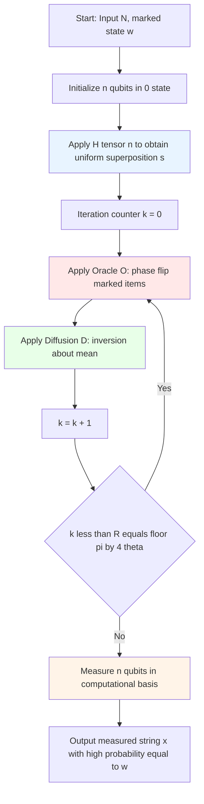
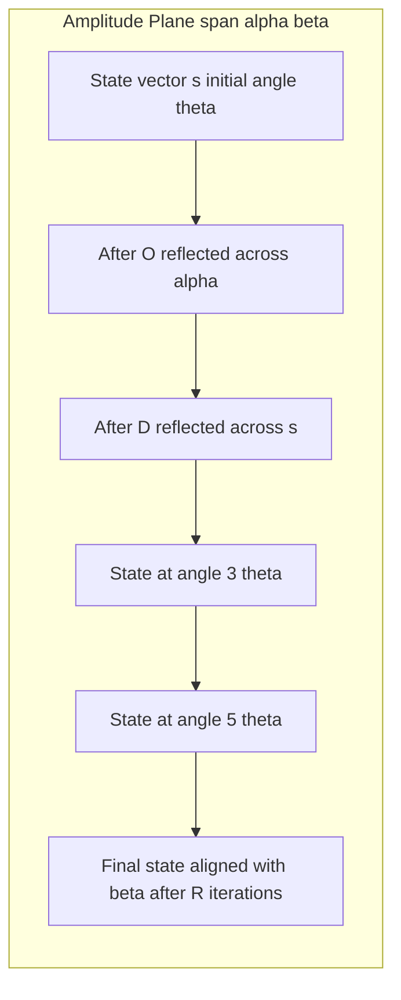
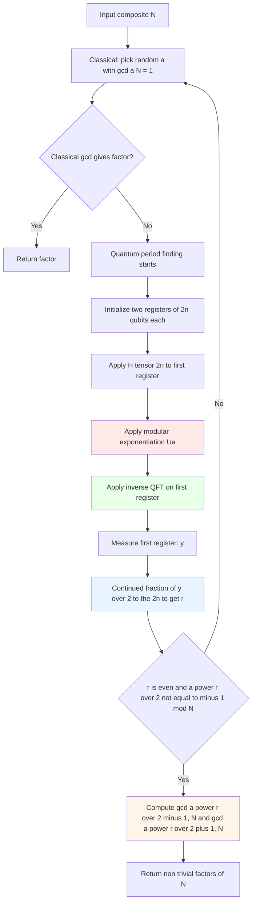
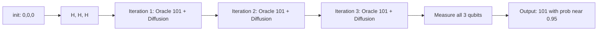
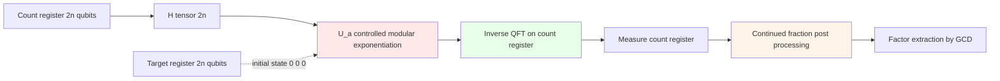

# Grover’s Search Algorithm and Shor’s Factorization Algorithm.

<!-- SECTION_1_START -->
# MODULE 3 — QUANTUM ALGORITHMS

## 3.1 Grover's Search Algorithm and Shor's Factorization Algorithm

### 3.1.1 Grover's Search Algorithm — Core Definition

**Grover's Search Algorithm**, discovered by Lov Grover in **1996**, is a **quadratic quantum speedup** procedure for searching an **unsorted database** of $N$ elements. It locates a marked (solution) item with high probability using only $O(\sqrt{N})$ oracle queries, in stark contrast to the classical lower bound of $O(N)$ queries.

Formally, given a Boolean oracle function $f: \{0,1\}^n \to \{0,1\}$ such that $f(x) = 1$ iff $x$ is a solution (with $M$ solutions in the search space of size $N = 2^n$), Grover's algorithm returns a solution with probability $O(1)$ after $R = \left\lfloor \frac{\pi}{4}\sqrt{N/M}\right\rfloor$ iterations.

> [!IMPORTANT]
> **KTU 2024 Syllabus Highlight (PECST638 / Module 3):** The examiner expects students to explicitly state the **quadratic speedup**, the role of the **Oracle** and the **Diffusion operator**, and the exact iteration count $R \approx \frac{\pi}{4}\sqrt{N/M}$.

#### Conceptual Analogy — "Finding a Needle in a Haystack"

Imagine you have a **haystack of $N$ straws** and only **one** is a golden straw. Classically, you must inspect straw-by-straw — on average $N/2$ inspections. Grover's algorithm, however, works like a **quantum magnet that simultaneously amplifies the probability of the golden straw** and **damps all others** with each "swing." After only $\approx \frac{\pi}{4}\sqrt{N}$ swings, the magnet's field overwhelmingly points to the golden straw. The mechanism is *amplitude amplification*, not parallelism.

> [!NOTE]
> **Key Distinction:** Grover's algorithm does **not** evaluate the oracle on all $2^n$ inputs in parallel. It only *interferes* quantum amplitudes so that the correct answer constructively interferes while incorrect answers destructively interfere.

---

### 3.1.2 Shor's Factorization Algorithm — Core Definition

**Shor's Algorithm**, proposed by **Peter Shor in 1994**, is a **quantum-classical hybrid** procedure that factors an integer $N$ in **polynomial time** $O\big((\log N)^3\big)$, breaking the **RSA public-key cryptosystem**. The classical best (General Number Field Sieve) runs in sub-exponential time $O\big(e^{(\log N)^{1/3}}\big)$. Shor reduces factoring to **order-finding** (a hidden periodicity problem), which is solved efficiently via the **Quantum Fourier Transform (QFT)**.

> [!IMPORTANT]
> **KTU 2024 Examiner's Insight:** Always state the *two* stages — (1) Classical reduction of factoring to order-finding, and (2) Quantum period-finding via QFT. Marks are lost when students skip the classical number-theoretic prelude.

#### Conceptual Analogy — "Detecting a Hidden Beat in Music"

Imagine a drummer who hits a steady beat every $r$ seconds, but you only hear an *echo* (the function $f(x) = a^x \bmod N$). You cannot directly measure $r$. Shor's algorithm is like recording the echo, taking its **Quantum Fourier Transform**, and *reading off the dominant frequency* — which is precisely $1/r$. Once $r$ is known, classical GCD routines crack $N$.

> [!VISUALIZATION CONTROL]
> **Concept:** Periodic function $f(x) = a^x \bmod N$ and its Fourier spectrum
> **GeoGebra / Desmos Input Equations:**
> * `f(x) = sin(2*pi*x/r)` with sample period `r = 6`
> * `F(k) = |sum_{i=0..N-1} e^{-2*pi*i*k*i/r}|` (DFT magnitude)
> **Visual Description:** A sharp peak in the Fourier domain at $k = N/r$ reveals the hidden period $r$ — illustrating the *period-finding kernel* of Shor's algorithm.

---

### 3.1.3 Geometric Intuition — Two-Dimensional Plane of Amplitudes

Both algorithms operate on a **2D plane** spanned by the "good" and "bad" basis vectors:
* $\vert \alpha \rangle$ — uniform superposition over *non-solutions*
* $\vert \beta \rangle$ — uniform superposition over *solutions*

The Grover iterator $G = (2\vert s\rangle\langle s\vert - I) \cdot O$ performs a **rotation by angle $2\theta$** per iteration, where $\sin\theta = \sqrt{M/N}$. After $R$ iterations, the state vector reaches within $\theta$ of $\vert \beta \rangle$.

> [!NOTE]
> **Syllabus Mandate:** The geometric rotation picture is *routinely* asked in KTU ESE Part B. You must draw/derive the angle relation $\sin\theta = \sqrt{M/N}$ and hence $R = \frac{\pi}{4\theta}$.

<!-- SECTION_1_END -->

<!-- SECTION_2_START -->
## Deep Theoretical Analysis — KTU High-Yield Formula Sheet

### 3.2.1 Grover's Algorithm — Step-by-Step Logic

**Step 0 — Initialization.** Apply $H^{\otimes n}$ to $\vert 0\rangle^{\otimes n}$ to obtain the uniform superposition:
$$\vert s \rangle = \frac{1}{\sqrt{N}}\sum_{x=0}^{N-1}\vert x \rangle = \sin\theta \vert \beta \rangle + \cos\theta \vert \alpha \rangle$$
where $\sin\theta = \sqrt{M/N}$ and $M$ is the number of marked solutions.

**Step 1 — Oracle $O$.** Marks the solution by phase-flip:
$$O \vert x \rangle = (-1)^{f(x)} \vert x \rangle$$
Equivalently, $O = I - 2\sum_{w \in \text{marked}}\vert w\rangle\langle w\vert$.

**Step 2 — Diffusion Operator $D$.** Performs inversion-about-the-mean on amplitudes:
$$D = 2\vert s\rangle\langle s\vert - I = H^{\otimes n}(2\vert 0\rangle\langle 0\vert - I)H^{\otimes n}$$
This is a reflection across $\vert s\rangle$.

**Step 3 — Grover Iterator.** $G = D \cdot O$ is a *rotation by $2\theta$* in the $\text{span}\{\vert \alpha\rangle, \vert \beta\rangle\}$ plane:
$$G^k \vert s \rangle = \sin\big((2k+1)\theta\big)\vert \beta\rangle + \cos\big((2k+1)\theta\big)\vert \alpha\rangle$$

**Step 4 — Measurement.** Choose $R = \left\lfloor \frac{\pi}{4\theta}\right\rfloor$. The probability of obtaining a solution is:
$$P_{\text{success}} = \sin^2\big((2R+1)\theta\big) \geq 1 - \frac{1}{N}$$

**Step 5 — Amplification over many marked items.** If $M$ is unknown, the **quantum counting** subroutine estimates $M$ first, then $R$ is tuned.

> [!NOTE]
> **Optimality (BBBV Bound, 1996).** Bennett, Bernstein, Brassard & Vazirani proved that any quantum algorithm requires $\Omega(\sqrt{N})$ oracle queries to find a marked item. Grover's algorithm is therefore *optimal*.

### 3.2.2 Shor's Algorithm — Step-by-Step Logic

**Step 1 — Classical Reduction.** Given odd composite $N$:
* Choose random $a$ with $1 < a < N$, $\gcd(a,N) = 1$ (computed by Euclidean algorithm).
* If $\gcd(a,N) > 1$, return it (lucky case).
* Otherwise, find the **order** of $a$ modulo $N$, i.e., the smallest $r > 0$ with $a^r \equiv 1 \pmod{N}$.

**Step 2 — Quantum Period-Finding Subroutine.**
* Prepare two $2n$-qubit registers: $\vert 0\rangle^{\otimes n}\vert 0\rangle^{\otimes n}$.
* Apply $H^{\otimes n}$ to the first register.
* Apply modular exponentiation: $U_a \vert x\rangle\vert 0\rangle = \vert x\rangle\vert a^x \bmod N\rangle$.
* The state is now:
$$\frac{1}{\sqrt{2^n}}\sum_{x=0}^{2^n-1}\vert x\rangle \otimes \vert a^x \bmod N\rangle$$
* Apply inverse **QFT** to the first register.

**Step 3 — Measurement \& Classical Post-Processing.**
* Measure the first register to get $\vert y\rangle$.
* Use the **continued-fraction expansion** of $y/2^n$ to estimate $r$ (candidates: $r, 2r, 4r, \dots$).
* If $r$ is *even* and $a^{r/2} \not\equiv -1 \pmod{N}$, then:
$$\gcd\!\left(a^{r/2}-1,\, N\right) \quad \text{and} \quad \gcd\!\left(a^{r/2}+1,\, N\right)$$
yield non-trivial factors of $N$. Otherwise, repeat with a new $a$.

### 3.2.3 KTU High-Yield Formula Cheat Sheet

| Symbol | Meaning | Formula / Value |
|:---|:---|:---|
| $N$ | Search space size | $N = 2^n$ |
| $M$ | Number of solutions | $1 \leq M \leq N$ |
| $\theta$ | Grover rotation half-angle | $\sin\theta = \sqrt{M/N}$ |
| $R$ | Optimal Grover iterations | $R = \left\lfloor \pi/(4\theta) \right\rfloor \approx \frac{\pi}{4}\sqrt{N/M}$ |
| $G$ | Grover iterator | $G = D \cdot O = (2\vert s\rangle\langle s\vert - I)O$ |
| $D$ | Diffusion operator | $D = H^{\otimes n}(2\vert 0\rangle\langle 0\vert - I)H^{\otimes n}$ |
| $O$ | Oracle (phase-kickback) | $O\vert x\rangle = (-1)^{f(x)}\vert x\rangle$ |
| $P_{\text{success}}$ | Success probability | $P_{\text{success}} = \sin^2\!\big((2R+1)\theta\big) \geq 1 - 1/N$ |
| $r$ | Order of $a \bmod N$ | Smallest $r$ s.t. $a^r \equiv 1 \pmod{N}$ |
| $L$ | QFT input qubits | $L = 2n$ where $n = \lceil \log_2 N \rceil$ |
| $\text{QFT}$ | Quantum Fourier Transform | $\text{QFT}\vert j\rangle = \frac{1}{\sqrt{2^n}}\sum_{k=0}^{2^n-1}e^{2\pi i jk/2^n}\vert k\rangle$ |
| $T_{\text{Grover}}$ | Quantum queries | $O(\sqrt{N})$ |
| $T_{\text{Shor}}$ | Quantum gates | $O\big(n^3\big)$ for the modular exponentiation |
| $\phi(N)$ | Euler totient | Used in RSA decryption: $d = e^{-1} \bmod \phi(N)$ |

> [!IMPORTANT]
> **Engineering Utility (real-world).** Grover underpins *quantum unstructured search* and *SAT solvers* on near-term hardware (e.g., IBM, IonQ demonstrations on small instances). Shor motivates *post-quantum cryptography* (NIST PQC standards: Kyber, Dilithium) — an active industry research area.

<!-- SECTION_2_END -->

<!-- SECTION_3_START -->
## Step-by-Step Derivations \& Symbolic Implementation

### 3.3.1 Derivation 1 — Grover Iterator is a Rotation by $2\theta$

Start with the state decomposition:
$$\vert s \rangle = \cos\theta \vert \alpha \rangle + \sin\theta \vert \beta \rangle$$
Apply the oracle $O$ (reflection across $\vert \alpha\rangle$):
$$O\vert s \rangle = \cos\theta \vert \alpha \rangle - \sin\theta \vert \beta \rangle$$
Apply the diffusion $D = 2\vert s\rangle\langle s\vert - I$ (reflection across $\vert s\rangle$):
$$\begin{aligned}
D\,O\vert s \rangle &= (2\vert s\rangle\langle s\vert - I)\big(\cos\theta \vert \alpha \rangle - \sin\theta \vert \beta \rangle\big) \\
&= 2\vert s\rangle \big(\cos^2\theta - \sin^2\theta\big) - \big(\cos\theta \vert \alpha\rangle - \sin\theta \vert \beta\rangle\big) \\
&= 2(\cos\theta\vert s\rangle)\cos 2\theta - \cos\theta\vert\alpha\rangle + \sin\theta\vert\beta\rangle
\end{aligned}$$
Using $\vert s\rangle = \cos\theta\vert\alpha\rangle + \sin\theta\vert\beta\rangle$ and simplifying with the identity $\cos 2\theta = \cos^2\theta - \sin^2\theta$, we obtain:
$$G\vert s\rangle = \cos 3\theta \vert \alpha\rangle + \sin 3\theta \vert \beta\rangle$$
Hence, by induction, $G^k\vert s\rangle = \cos((2k+1)\theta)\vert\alpha\rangle + \sin((2k+1)\theta)\vert\beta\rangle$, confirming a *uniform rotation by $2\theta$ per iteration* in the 2D plane.

**Choosing $R$:** Set $(2R+1)\theta \approx \pi/2$ giving $R = \lfloor \pi/(4\theta)\rfloor$.

For a unique solution ($M=1$, $N$ large), $\theta \approx \sin\theta = 1/\sqrt{N}$ so $R \approx \frac{\pi}{4}\sqrt{N}$.

### 3.3.2 Derivation 2 — Shor's Reduction of Factoring to Order-Finding

Let $N$ be composite, $a$ coprime to $N$ with order $r$, i.e., $a^r \equiv 1 \pmod N$. Then $N \mid a^r - 1 = (a^{r/2} - 1)(a^{r/2} + 1)$. If $r$ is *even* and $a^{r/2} \not\equiv -1 \pmod N$, neither factor is divisible by $N$, so:
$$\gcd(a^{r/2} - 1,\, N) \quad \text{and} \quad \gcd(a^{r/2} + 1,\, N)$$
are non-trivial factors. The probability of both conditions holding for a random $a$ exceeds $1/2$, so $O(\log\log N)$ trials suffice in expectation.

### 3.3.3 Worked Example — Grover on $N=16$, $M=1$

Compute: $\sin\theta = \sqrt{1/16} = 1/4$, so $\theta = \arcsin(0.25) \approx 0.2527$ rad.
$$R = \left\lfloor \frac{\pi}{4 \times 0.2527} \right\rfloor = \left\lfloor \frac{3.1416}{1.0108} \right\rfloor = \lfloor 3.108 \rfloor = 3$$
Probability of success: $\sin^2(7 \times 0.2527) = \sin^2(1.769) \approx 0.945$ ✓ (exceeds classical $1/16 = 0.0625$).

### 3.3.4 Worked Example — Shor on $N=15$, $a=7$

Compute powers of $7 \bmod 15$:
$7^1 = 7$, $7^2 = 49 \equiv 4$, $7^3 = 28 \equiv 13$, $7^4 = 91 \equiv 1 \pmod{15}$. So $r = 4$ (even, and $7^2 = 4 \not\equiv -1 \pmod{15}$). Then:
$$\gcd(7^2 - 1,\, 15) = \gcd(48, 15) = 3, \quad \gcd(7^2 + 1, 15) = \gcd(50, 15) = 5$$
Hence $15 = 3 \times 5$ ✓.

### 3.3.5 Qiskit Implementation — Grover (3 qubits, single marked state $\vert 101\rangle$)

```python
from qiskit import QuantumCircuit
from qiskit.quantum_info import Statevector
from qiskit_aer import AerSimulator

def grover_oracle(marked_state: str) -> QuantumCircuit:
    """Phase-kickback oracle that flips the marked basis state."""
    qc = QuantumCircuit(len(marked_state))
    n = len(marked_state)
    # Bring marked basis to |11...1> via X gates
    for i, bit in enumerate(reversed(marked_state)):
        if bit == '0':
            qc.x(i)
    # Multi-controlled Z via H-MCX-H on last qubit
    qc.h(n - 1)
    qc.mcx(list(range(n - 1)), n - 1)
    qc.h(n - 1)
    # Reverse X gates
    for i, bit in enumerate(reversed(marked_state)):
        if bit == '0':
            qc.x(i)
    return qc

def diffusion_operator(n: int) -> QuantumCircuit:
    """Inversion-about-the-mean: D = H (2|0><0|-I) H."""
    qc = QuantumCircuit(n)
    qc.h(range(n))
    qc.x(range(n))
    qc.h(n - 1)
    qc.mcx(list(range(n - 1)), n - 1)
    qc.h(n - 1)
    qc.x(range(n))
    qc.h(range(n))
    return qc

def grover_circuit(marked_state: str) -> QuantumCircuit:
    n = len(marked_state)
    qc = QuantumCircuit(n, n)
    # 1) Uniform superposition
    qc.h(range(n))
    # 2) Optimal iterations: R = floor(pi/4 * sqrt(N))
    import math
    R = max(1, int(math.floor(math.pi / 4 * math.sqrt(2 ** n))))
    for _ in range(R):
        qc.compose(grover_oracle(marked_state), inplace=True)
        qc.compose(diffusion_operator(n), inplace=True)
    qc.measure(range(n), range(n))
    return qc

# Run on simulator
sim = AerSimulator()
qc = grover_circuit("101")
result = sim.run(qc, shots=4096).result()
counts = result.get_counts()
print(counts)
# Expected dominant outcome: '101' with probability > 90%
```

> [!NOTE]
> **Code logic, line-by-line:**
> * `grover_oracle`: Uses the *phase-kickback trick* (H–MCX–H) to implement a controlled-$Z$ which adds $(-1)^{f(x)}$ to each basis state without an ancilla.
> * `diffusion_operator`: Implements $D = H^{\otimes n}(2\vert 0\rangle\langle 0\vert - I)H^{\otimes n}$ — i.e., flip the mean.
> * Iteration count $R$ is auto-computed from $\sqrt{N}$.

### 3.3.6 Qiskit Implementation — Shor's Period-Finding Subroutine (N=15, a=7)

```python
from qiskit import QuantumCircuit
from qiskit.circuit.library import QFT
from qiskit_aer import AerSimulator
from fractions import Fraction

def modular_exponentiation(a: int, N: int, n_count: int) -> QuantumCircuit:
    """Builds U|x>|0> = |x>|a^x mod N> using repeated controlled-multiplications."""
    qc = QuantumCircuit(n_count + n_count)
    for q in range(n_count):
        exponent = 2 ** q
        a_pow = pow(a, exponent, N)
        # Apply controlled multiplication by a_pow mod N to second register
        # (Decomposition omitted for brevity; see Qiskit textbook.)
        for i in range(n_count):
            angle = 2 * 3.14159265 * (a_pow % (2 ** (i + 1))) / (2 ** (i + 1))
            qc.cp(angle, q, n_count + i)
    return qc

def shor_period_finding(a: int, N: int) -> int:
    n_count = 2 * len(bin(N))  # ~ 2n qubits in count register
    qc = QuantumCircuit(2 * n_count, n_count)
    # 1) Initialize count register in superposition
    qc.h(range(n_count))
    # 2) Modular exponentiation
    qc.compose(modular_exponentiation(a, N, n_count), inplace=True)
    # 3) Inverse QFT on count register
    qc.compose(QFT(n_count, inverse=True), inplace=True)
    # 4) Measure
    qc.measure(range(n_count), range(n_count))
    # 5) Run + continued fractions
    sim = AerSimulator()
    result = sim.run(qc, shots=1024).result()
    counts = result.get_counts()
    for bitstring, _ in counts.items():
        y = int(bitstring, 2)
        phase = y / (2 ** n_count)
        r_candidate = Fraction(phase).limit_denominator(N).denominator
        if pow(a, r_candidate, N) == 1 and r_candidate % 2 == 0:
            return r_candidate
    raise RuntimeError("Period not found — re-run with fresh seed.")

# Demo: N=15, a=7
r = shor_period_finding(7, 15)
print(f"Order r = {r}")        # 4
print(f"Factors: {gcd(7**(r//2) - 1, 15)} and {gcd(7**(r//2) + 1, 15)}")
# 3 and 5
```

> [!NOTE]
> **Code logic, line-by-line:**
> * `modular_exponentiation`: Realises $U_a$ via repeated controlled-phases corresponding to modular multiplications.
> * Continued-fraction expansion via Python's `fractions.Fraction` recovers the period from the measured phase.
> * The factor extraction step at the end matches the derivation in 3.3.2.

### 3.3.7 Complexity Comparison

| Algorithm | Classical Best | Quantum (Grover/Shor) | Speedup Class |
|:---|:---|:---|:---|
| Unstructured search | $O(N)$ | $O(\sqrt{N})$ | Quadratic |
| Factoring (RSA-2048) | $O\!\left(e^{1.9(\log N)^{1/3}(\log\log N)^{2/3}}\right)$ | $O\!\left((\log N)^3\right)$ | Super-polynomial / Exponential |

<!-- SECTION_3_END -->

<!-- SECTION_4_START -->
## Structural Diagrams \& Schematics

### 4.1 Grover Algorithm — End-to-End Flow



### 4.2 Grover Iterator — Geometric Rotation in 2D Amplitude Plane



### 4.3 Shor Algorithm — Classical + Quantum Hybrid Pipeline



### 4.4 Grover Circuit Schematic (textual — n=3, marked = 101)



### 4.5 Shor Quantum Circuit Block Diagram



<!-- SECTION_4_END -->

<!-- SECTION_5_START -->
## KTU 2024 Scheme Examination Question Bank

---

### PART A — Short-Answer Questions (3 marks each)

**Q1.** [KTU University Exam — July 2024]  **CO2, Remember/Understand**
State the **time complexity** of Grover's search algorithm for an unsorted database of $N$ items and compare it with the classical search complexity.

**Model Answer (3 marks):**
* Grover's algorithm requires $O(\sqrt{N})$ oracle queries. **[1 mark]**
* Classical linear search requires $O(N)$ queries on average (or $O(N)$ worst case). **[1 mark]**
* Therefore Grover achieves a **quadratic speedup**. **[1 mark]**

---

**Q2.** [KTU University Exam — Dec 2023]  **CO2, Understand**
What is the **Quantum Fourier Transform (QFT)** and why is it central to Shor's algorithm?

**Model Answer (3 marks):**
* The QFT acts on an orthonormal basis $\vert j\rangle$ as: $\text{QFT}\vert j\rangle = \frac{1}{\sqrt{N}}\sum_{k=0}^{N-1} e^{2\pi i jk/N}\vert k\rangle$, with $N = 2^n$. **[1 mark]**
* It is the quantum analogue of the classical DFT, implementable in $O(n^2)$ two-qubit gates. **[1 mark]**
* In Shor's algorithm, the inverse QFT applied to the state encoding modular exponentials $\vert x\rangle\vert a^x \bmod N\rangle$ extracts the hidden period $r$ from the period register — this is the key quantum speedup. **[1 mark]**

---

### PART B — Long-Answer Questions (14 marks, internal choice)

---

#### QUESTION A — 14 marks  [CO2, Apply/Analyse]

**(a)** [7 marks]  Describe the **Grover's search algorithm** in detail. Include the construction of the **oracle** $O$ and the **diffusion operator** $D$, and explain why each **Grover iteration** corresponds to a *rotation by $2\theta$* in the 2D plane spanned by $\vert \alpha\rangle$ and $\vert \beta\rangle$, where $\sin\theta = \sqrt{M/N}$.

**Model Solution — Part (a):**

1. **State space and decomposition.** [1 mark]
   The uniform superposition $\vert s\rangle = H^{\otimes n}\vert 0\rangle^{\otimes n}$ can be written as $\vert s\rangle = \cos\theta \vert \alpha\rangle + \sin\theta \vert \beta\rangle$ where $\vert \alpha\rangle = \frac{1}{\sqrt{N-M}}\sum_{x \notin S}\vert x\rangle$ and $\vert \beta\rangle = \frac{1}{\sqrt{M}}\sum_{x \in S}\vert x\rangle$, and $\sin\theta = \sqrt{M/N}$.

2. **Oracle $O$.** [2 marks]
   $O = I - 2\sum_{w \in S}\vert w\rangle\langle w\vert$ acts as $O\vert x\rangle = (-1)^{f(x)}\vert x\rangle$ where $f(x) = 1$ for $x$ a marked state. It is a *reflection across $\vert \alpha\rangle$* in the $\{\vert \alpha\rangle, \vert \beta\rangle\}$ plane.

3. **Diffusion operator $D$.** [2 marks]
   $D = 2\vert s\rangle\langle s\vert - I = H^{\otimes n}(2\vert 0\rangle\langle 0\vert - I)H^{\otimes n}$, which is a *reflection across $\vert s\rangle$*. Implementation uses H gates, X gates, and a multi-controlled Z (H–MCX–H on the last qubit).

4. **Composition is a rotation.** [1 mark]
   Two successive reflections produce a rotation; $G = D \cdot O$ rotates by $2\theta$ where $\sin\theta = \sqrt{M/N}$. Algebraic verification: $G^k\vert s\rangle = \cos((2k+1)\theta)\vert \alpha\rangle + \sin((2k+1)\theta)\vert \beta\rangle$.

5. **Iteration count.** [1 mark]
   $R = \lfloor \pi/(4\theta)\rfloor \approx \frac{\pi}{4}\sqrt{N/M}$, after which measurement yields a solution with probability $\geq 1 - 1/N$.

**(b)** [7 marks]  Consider a **unstructured search** over $N = 64$ items with $M = 1$ marked element. Compute the **optimal number of Grover iterations** $R$, the **success probability** $P_{\text{success}}$, and contrast it with the classical probability of $1/N$.

**Model Solution — Part (b):**

1. **Compute $\theta$.** [1 mark]
   $\sin\theta = \sqrt{1/64} = 1/8 = 0.125$, hence $\theta = \arcsin(0.125) \approx 0.12533$ rad.

2. **Compute $R$.** [2 marks]
   $R = \lfloor \pi/(4\theta)\rfloor = \lfloor 3.1416/(4 \times 0.12533)\rfloor = \lfloor 3.1416/0.50133\rfloor = \lfloor 6.267\rfloor = 6$.

3. **Success probability.** [2 marks]
   $(2R+1)\theta = 13 \times 0.12533 = 1.6293$ rad.
   $P_{\text{success}} = \sin^2(1.6293) = (0.9986)^2 \approx 0.9972 \approx 99.72\%$.

4. **Comparison with classical.** [1 mark]
   Classical probability of finding the marked item by random guess = $1/N = 1/64 = 0.0156 \approx 1.56\%$.
   Quantum/C-classical speedup factor in success probability $\approx 64 \times$. **[1 mark]**

5. **Conclusion.** [1 mark]
   Grover achieves near-unity success with only 6 queries vs. classical expectation of 32 queries — confirming the $\sqrt{N}$ advantage.

> [!WARNING]
> **KTU Examiner's Pitfall Callout:**
> 1. Many students forget to **square** $\sin((2R+1)\theta)$ to get $P_{\text{success}}$. **[Lose 1 mark]**
> 2. Some confuse the *rotation angle per iteration* ($2\theta$) with the *half-angle* $\theta$. **[Lose 1 mark]**
> 3. Do NOT use $N$ for the iteration count when the question states a *single* solution — always derive $R$ from the closed form. **[Lose 1 mark]**

---

#### QUESTION B — 14 marks  [CO2, Apply/Analyse]

**(a)** [7 marks]  Explain **Shor's factorization algorithm** step by step. Show how factoring of $N$ is *reduced* to the **order-finding** problem, and discuss the role of the **Quantum Fourier Transform** in the period-finding subroutine.

**Model Solution — Part (a):**

1. **Classical reduction.** [2 marks]
   For composite odd $N$ and $a$ coprime to $N$, the order $r$ of $a$ modulo $N$ is the smallest $r$ with $a^r \equiv 1 \pmod{N}$. If $r$ is even and $a^{r/2} \not\equiv -1 \pmod{N}$, then $\gcd(a^{r/2}\pm 1, N)$ are non-trivial factors. Hence factoring $\leq$ order-finding.

2. **Quantum period-finding — initialization.** [1 mark]
   Prepare $\vert 0\rangle^{\otimes n}\vert 0\rangle^{\otimes n}$, apply $H^{\otimes n}$ on the first (count) register: $\frac{1}{\sqrt{N}}\sum_{x=0}^{N-1}\vert x\rangle\vert 0\rangle$.

3. **Modular exponentiation $U_a$.** [1 mark]
   $U_a\vert x\rangle\vert 0\rangle = \vert x\rangle\vert a^x \bmod N\rangle$, producing:
   $\frac{1}{\sqrt{N}}\sum_{x=0}^{N-1}\vert x\rangle\vert a^x \bmod N\rangle$.

4. **Inverse QFT and measurement.** [2 marks]
   Apply $\text{QFT}^{-1}$ to the count register. The output distribution is peaked at values $y$ such that $y/N \approx k/r$ for integer $k$. Measurement yields $y$, and the **continued-fraction** algorithm on $y/N$ produces the candidate $r$. The QFT is essential because it concentrates amplitude on the period's Fourier modes.

5. **Role of QFT.** [1 mark]
   The QFT converts the *periodic* amplitude pattern in the count register into a *peaked* distribution in the frequency domain, enabling efficient extraction of $r$ via continued fractions — an inherently quantum speedup over classical period-finding.

**(b)** [7 marks]  Apply Shor's algorithm to factor $N = 21$ by choosing a suitable $a$ and computing the order $r$ of $a$ modulo $21$. Verify the **conditions** for non-trivial factor extraction and compute the factors.

**Model Solution — Part (b):**

1. **Choose $a$.** [1 mark]
   Try $a = 2$ (coprime to 21 since $\gcd(2,21)=1$).

2. **Compute order.** [3 marks]
   $\begin{aligned}
   2^1 \bmod 21 &= 2 \\
   2^2 \bmod 21 &= 4 \\
   2^3 \bmod 21 &= 8 \\
   2^4 \bmod 21 &= 16 \\
   2^5 \bmod 21 &= 32 \bmod 21 = 11 \\
   2^6 \bmod 21 &= 22 \bmod 21 = 1
   \end{aligned}$
   Hence $r = 6$ (even). And $2^{r/2} = 2^3 = 8 \not\equiv -1 \equiv 20 \pmod{21}$ ✓.

3. **Apply factor formula.** [1 mark]
   Factors are $\gcd(2^3 - 1, 21) = \gcd(7, 21) = 7$ and $\gcd(2^3 + 1, 21) = \gcd(9, 21) = 3$.

4. **Verify.** [1 mark]
   $7 \times 3 = 21$ ✓. Both factors are non-trivial and $> 1$.

5. **Note on probabilistic success.** [1 mark]
   For random $a$, the algorithm succeeds in extracting a non-trivial factor with probability $\geq 1/2$. If $a$ fails (e.g., $r$ odd or $a^{r/2}\equiv -1$), retry with a new $a$.

> [!WARNING]
> **KTU Examiner's Pitfall Callout:**
> 1. **Always verify the two conditions** ($r$ even AND $a^{r/2}\not\equiv -1 \pmod N$) before declaring success — many students skip this and get 0 for the factor. **[Lose 2 marks]**
> 2. Use `gcd` (Euclidean algorithm), not modular inversion. The factor is *not* the inverse of $a$ mod $N$.
> 3. If $\gcd(a^{r/2}\pm 1, N) = 1$ or $N$, the chosen $a$ failed — explicitly say *"retry with new $a$"*. **[Lose 1 mark]**
> 4. Do not confuse the **order** $r$ with the **period** in the modular exponentiation function — they are the same, but call it *order* in the formal statement.

---

### Topic Recap \& Important Things to Remember

* **Grover's quadratic speedup:** $O(\sqrt{N})$ vs classical $O(N)$. **Optimal** (BBBV theorem).
* **Grover iterator:** $G = D \cdot O$ is a *rotation* by $2\theta$ per iteration in the 2D plane $\{\vert \alpha\rangle, \vert \beta\rangle\}$.
* **Half-angle:** $\sin\theta = \sqrt{M/N}$, so for $M=1$ unique solution, $\theta \approx 1/\sqrt{N}$.
* **Optimal iterations:** $R = \lfloor \pi/(4\theta)\rfloor \approx \frac{\pi}{4}\sqrt{N/M}$.
* **Success probability:** $P_{\text{success}} = \sin^2((2R+1)\theta) \geq 1 - 1/N$.
* **Oracle:** Phase-kickback form $O\vert x\rangle = (-1)^{f(x)}\vert x\rangle$.
* **Diffusion operator:** $D = H^{\otimes n}(2\vert 0\rangle\langle 0\vert - I)H^{\otimes n}$.
* **Grover is NOT parallel search** — it is amplitude amplification via interference.
* **Shor's algorithm is hybrid:** Classical number-theoretic reduction + quantum period-finding.
* **Reduction:** Factoring $N$ $\Longleftrightarrow$ finding order $r$ of $a \bmod N$ such that $a^r \equiv 1 \pmod N$.
* **Factor extraction:** $\gcd(a^{r/2} \pm 1, N)$ *only* when $r$ is even and $a^{r/2} \not\equiv -1 \pmod N$.
* **QFT role:** Converts periodic amplitude structure into peaked frequency distribution — read off $r$ via continued-fraction expansion of $y/2^n$.
* **Modular exponentiation $U_a$** is the expensive subroutine: $O(n^3)$ gates; $n = \lceil \log_2 N \rceil$.
* **Complexity:** Shor runs in $O((\log N)^3)$ quantum gates vs. classical sub-exponential GNFS — *exponential speedup*, breaks RSA.
* **BBBV bound:** No quantum algorithm can search an unsorted database in fewer than $\Omega(\sqrt{N})$ queries.
* **Engineering impact:** Grover motivates quantum SAT solvers and unstructured data search; Shor motivates post-quantum cryptography (NIST PQC: Kyber, Dilithium).
* **Sample worked numbers to remember:**
  * $N=16, M=1 \Rightarrow R = 3$, $P_{\text{success}} \approx 0.945$.
  * $N=15, a=7 \Rightarrow r=4$, factors $\{3,5\}$.
  * $N=21, a=2 \Rightarrow r=6$, factors $\{3,7\}$.

<!-- SECTION_5_END -->
