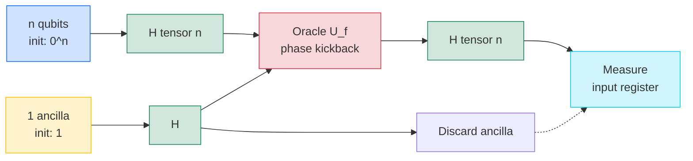
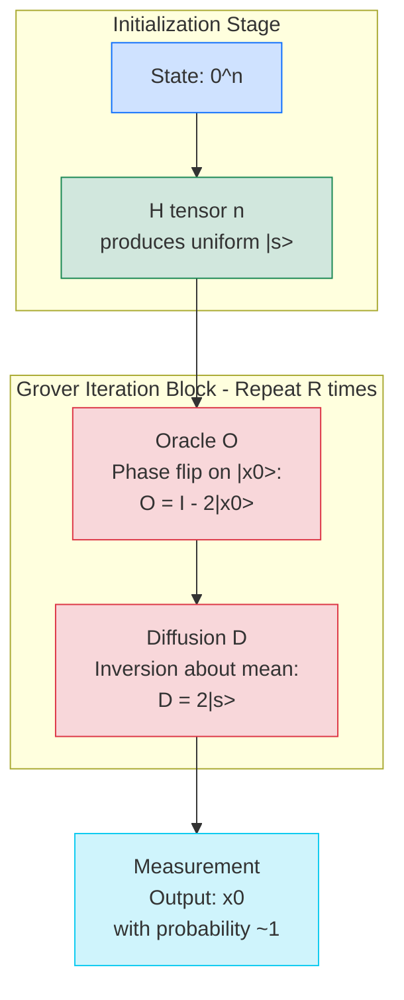
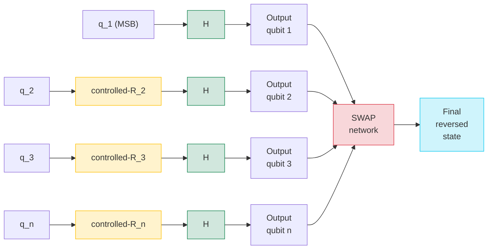
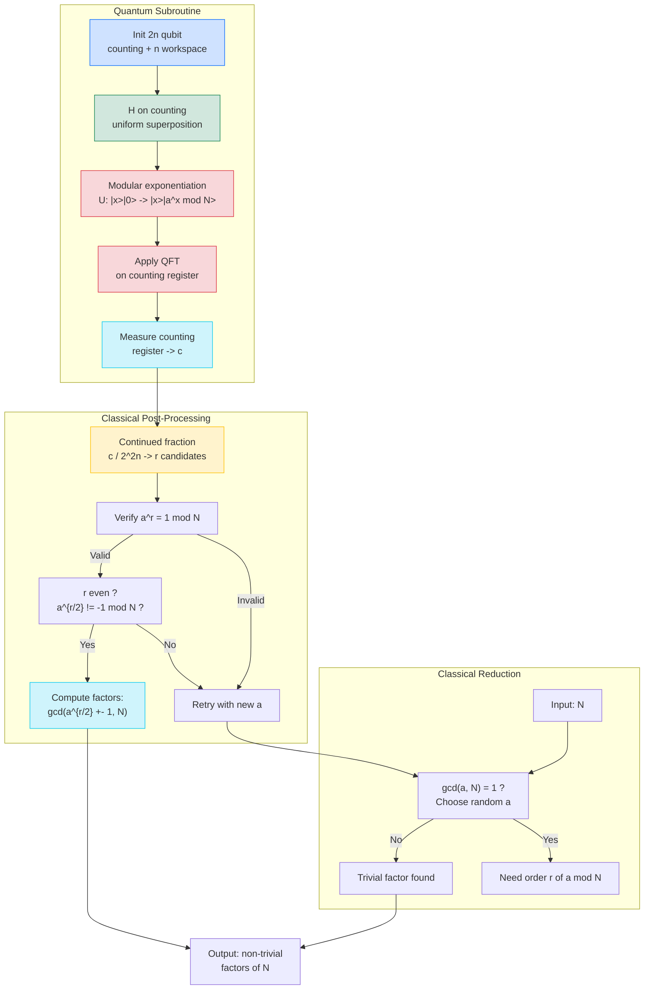
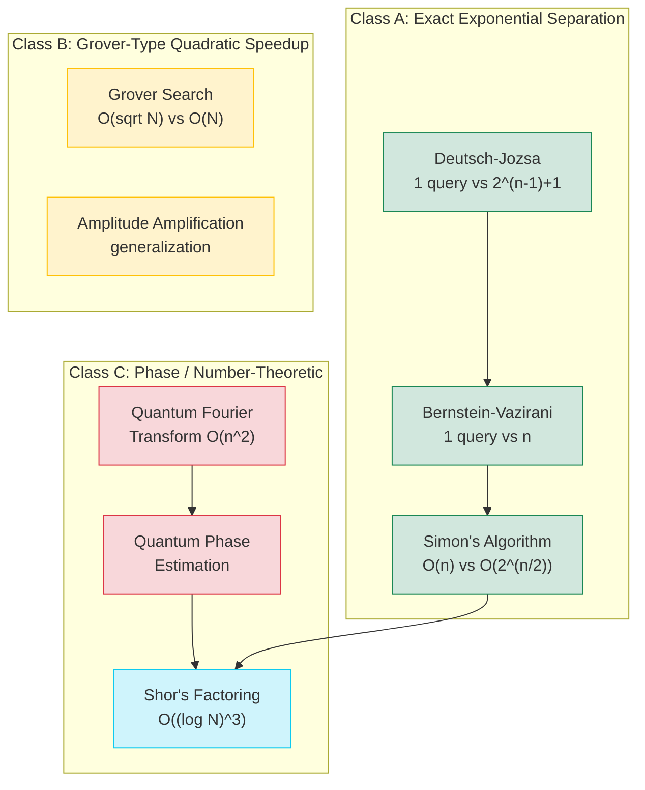

# Quantum Algorithms: -

<!-- SECTION_1_START -->
# Quantum Algorithms: Core Foundations & Intuition

## 1.1 Formal Definition (KTU 2024 Scheme Terminology)

A **Quantum Algorithm** is a deterministic sequence of unitary quantum operations (gates) applied to a multi-qubit register, which leverages quantum mechanical phenomena — specifically **superposition**, **entanglement**, and **quantum interference** — to solve a computational problem with an asymptotic complexity that is provably superior to the best-known classical algorithm. In the **KTU 2024 NEP-aligned** framework, a quantum algorithm is mathematically modeled as the sequential application of unitary operators $U_i \in \mathcal{U}(2^n)$ acting on an $n$-qubit Hilbert space $\mathcal{H}^{\otimes n}$, beginning from a fixed reference state $\vert 0 \rangle^{\otimes n}$ and terminating in a measurement collapse.

$$\text{Quantum Circuit: } \vert \psi_{\text{out}} \rangle = U_M \cdots U_2 \, U_1 \vert 0 \rangle^{\otimes n}$$

> [!IMPORTANT]
> **Syllabus Highlight (PECST638 - Module 3):** Quantum algorithms are studied under the broader umbrella of *Quantum Computation Theory*. The KTU evaluation pattern distinguishes between **oracle-based** (black-box) algorithms like Deutsch-Jozsa, **search-based** algorithms like Grover, and **number-theoretic** algorithms like Shor — each of which exploits a *different* quantum resource for its speedup.

## 1.2 Intuitive Overview: Why Quantum Computers Win

Imagine you are a **librarian** searching a library with $N = 1{,}000{,}000$ books for a specific misfiled book. A classical computer must check the shelves **one by one** ($O(N)$ queries). A quantum computer using **Grover's algorithm** does not speed up the light or run faster clocks; instead, it uses a **clever mirror trick** — like a phase-cancellation technique in a stadium wave — to amplify the correct answer's amplitude and dampen the wrong ones. It finds the book in only $O(\sqrt{N}) \approx 1000$ queries.

> [!NOTE]
> **Key Quantum Resources Mapped to Algorithms:**
> 
> | Quantum Resource | Algorithm | Speedup |
> |---|---|---|
> | **Interference** (parallel amplitude cancellation) | Deutsch-Jozsa, Bernstein-Vazirani | Exponential vs. specific classical |
> | **Amplitude Amplification** | Grover's Search | Quadratic ($O(\sqrt{N})$) |
> | **Quantum Fourier Transform** | Shor's Factoring, Phase Estimation | Exponential (super-polynomial) |
> | **Entanglement** | Superdense Coding, Teleportation | Communication efficiency |

### The Three Sacred Pillars of Quantum Speedup

1. **Superposition** — A register of $n$ qubits exists in $2^n$ complex amplitudes simultaneously. For $n = 300$, this is more amplitudes than atoms in the observable universe ($\sim 2^{300} \approx 10^{90}$).
2. **Interference** — Quantum amplitudes are *complex numbers* $a + bi$, so they can add or cancel. Algorithms are engineered to make correct answers *constructively interfere* and incorrect answers *destructively interfere*.
3. **Entanglement** — Qubits can be correlated such that measuring one instantly determines the state of another, enabling powerful conditional logic and correlation extraction.

> [!WARNING]
> **Critical Misconception:** A quantum computer does **NOT** "try all $2^n$ solutions in parallel and pick the best one." This is the most common misconception penalized by KTU examiners. The actual mechanism is **interference of probability amplitudes** in $\mathbb{C}^{2^n}$.

## 1.3 The Oracle Paradigm (Black-Box Framework)

Most KTU-examined quantum algorithms are described in the **oracle model**. A function $f: \{0,1\}^n \rightarrow \{0,1\}^m$ is given, but only as a "black box" — we can *query* it but cannot inspect it. The complexity is measured in **number of queries** (or oracle calls), not elementary gates.

A quantum oracle $U_f$ is a unitary that maps:

$$U_f \vert x \rangle \vert y \rangle = \vert x \rangle \vert y \oplus f(x) \rangle$$

where $\oplus$ is bitwise XOR (mod-2 addition). For $f: \{0,1\}^n \rightarrow \{0,1\}$, the phase-kickback trick uses $y = \frac{1}{\sqrt{2}}(\vert 0 \rangle - \vert 1 \rangle)$ to convert $U_f$ into a phase oracle:

$$U_f \vert x \rangle \left( \frac{\vert 0 \rangle - \vert 1 \rangle}{\sqrt{2}} \right) = (-1)^{f(x)} \vert x \rangle \left( \frac{\vert 0 \rangle - \vert 1 \rangle}{\sqrt{2}} \right)$$

The ancilla qubit factor is unchanged, and a *phase* $(-1)^{f(x)}$ is imprinted on $\vert x \rangle$. This is the foundation of essentially all of Module 3.

> [!VISUALIZATION CONTROL]
> **Concept:** Bloch sphere representation of the phase-kickback effect on a single input qubit
> **GeoGebra / Desmos Input Equations:**
> * Parametric form: $x = \sin\theta\cos\phi$, $y = \sin\theta\sin\phi$, $z = \cos\theta$
> * Phase oracle effect: rotation about the $z$-axis by $\phi = \pi$ (i.e., a $Z$-gate) when $f(x) = 1$
> **Visual Description:** A unit sphere with the north pole at $\vert 0 \rangle$ and south pole at $\vert 1 \rangle$. Initially the state vector lies on the equator (after Hadamard). The phase oracle rotates the vector about the $z$-axis — observable as a $180^\circ$ flip in the equatorial plane when $f(x) = 1$.

<!-- SECTION_1_END -->

<!-- SECTION_2_START -->
# Deep Theoretical Analysis & KTU High-Yield Formula Sheet

## 2.1 The Canonical Algorithm Catalog (Module 3 Pacing)

Module 3 of **PECST638** typically examines four flagship algorithms. Each is presented below with its **problem statement**, **classical complexity**, **quantum complexity**, and **core trick**.

### A. Deutsch-Jozsa Algorithm (1992)

**Problem:** Given a Boolean function $f: \{0,1\}^n \rightarrow \{0,1\}$ promised to be either **constant** ($f(x) = 0$ for all $x$ or $f(x) = 1$ for all $x$) or **balanced** ($f(x) = 0$ for exactly half the inputs), determine which.

| Aspect | Classical | Quantum (DJ) |
|---|---|---|
| Worst-case queries | $2^{n-1} + 1$ | **1** |
| Complexity class separation | — | First exponential separation |

**Circuit (KTU high-yield):**

1. Initialize: $\vert 0 \rangle^{\otimes n} \vert 1 \rangle$
2. Apply $H^{\otimes n} \otimes H$ to create uniform superposition
3. Apply oracle $U_f$ (phase kickback imprints $(-1)^{f(x)}$ on every basis state)
4. Apply $H^{\otimes n}$ on input register
5. Measure input register

The output state before measurement is:

$$\vert \psi \rangle = \frac{1}{2^n} \sum_{x,y \in \{0,1\}^n} (-1)^{f(x) + x \cdot y} \vert y \rangle$$

The probability of measuring $\vert 0 \rangle^{\otimes n}$ is:

$$P(\vert 0 \rangle^{\otimes n}) = \left\vert \frac{1}{2^n} \sum_{x \in \{0,1\}^n} (-1)^{f(x)} \right\vert^2 = \begin{cases} 1 & \text{if } f \text{ is constant} \\ 0 & \text{if } f \text{ is balanced} \end{cases}$$

### B. Bernstein-Vazirani Algorithm (1993)

**Problem:** Given a Boolean function $f_s(x) = s \cdot x \pmod 2$ where $s \in \{0,1\}^n$ is a hidden string, determine $s$ with a single oracle call.

The classical lower bound is $n$ queries (one bit per query). The quantum algorithm uses the same Deutsch-Jozsa circuit but reads out $s$ *directly* in a single shot:

$$\text{Measurement outcome} = s$$

### C. Simon's Algorithm (1994) — The Forerunner of Shor

**Problem:** Given a function $f: \{0,1\}^n \rightarrow \{0,1\}^n$ promised to satisfy $f(x) = f(y) \iff x \oplus y \in \{0, s\}$ for some hidden $s \neq 0$, find $s$.

- Classical complexity: $O(2^{n/2})$ queries (birthday paradox).
- Quantum complexity: $O(n)$ queries, then classical post-processing via Gaussian elimination over $\mathbb{F}_2$.

**Procedure:** Run the Simon circuit $O(n)$ times to obtain $n-1$ linearly independent equations $y_i \cdot s = 0$, then solve the resulting linear system modulo 2.

### D. Grover's Search Algorithm (1996)

**Problem:** Find a marked item $x_0$ in an unstructured database of $N = 2^n$ entries using the minimum number of queries to the oracle $O(x) = 1$ if $x = x_0$ and $0$ otherwise.

- Classical: $O(N)$ queries.
- Quantum Grover: $O(\sqrt{N})$ queries — a **quadratic** speedup.

The **Grover iteration** is the composition $G = (2 \vert s \rangle \langle s \vert - I) \cdot O$, where:
- $O = I - 2 \vert x_0 \rangle \langle x_0 \vert$ is the oracle (phase flip on the marked state)
- $2 \vert s \rangle \langle s \vert - I$ is the diffusion operator (reflection about the uniform superposition $\vert s \rangle$)

The amplitude of the marked state after $k$ iterations is:

$$\sin\bigl((2k+1)\theta\bigr) \quad \text{where} \quad \sin\theta = \frac{1}{\sqrt{N}}$$

The optimal number of iterations is:

$$R = \left\lfloor \frac{\pi}{4} \sqrt{N} \right\rfloor$$

> [!IMPORTANT]
> **Geometric Intuition (Grover):** The Grover iteration $G$ is a rotation in the 2D plane spanned by $\vert x_0 \rangle$ and $\vert x_\perp \rangle$ (the uniform superposition of unmarked states). Each application rotates the state vector by $2\theta$ toward $\vert x_0 \rangle$. After $\approx \frac{\pi}{4\theta} \approx \frac{\pi}{4}\sqrt{N}$ rotations, the state vector aligns with $\vert x_0 \rangle$.

### E. Quantum Fourier Transform (QFT) — The Subroutine Powering Shor

The QFT acts on an $n$-qubit computational basis state as:

$$\text{QFT} \vert j \rangle = \frac{1}{\sqrt{2^n}} \sum_{k=0}^{2^n - 1} e^{2\pi i j k / 2^n} \vert k \rangle$$

It is the **analog of the classical Fast Fourier Transform (FFT)**, but with an exponential reduction in the number of certain types of operations. Crucially, QFT can be implemented using only $O(n^2)$ Hadamard and controlled-phase gates — exponentially fewer than the classical $O(n \cdot 2^n)$ operations.

The QFT circuit is built recursively:

$$\text{QFT}_n = \left( I \otimes \text{QFT}_{n-1} \right) \cdot R_n \cdot H_1$$

where $R_n$ is a series of controlled phase rotations $R_k = \begin{pmatrix} 1 & 0 \\ 0 & e^{2\pi i / 2^k} \end{pmatrix}$.

### F. Shor's Algorithm (1994) — Factoring Integers in Polynomial Time

**Problem:** Given an integer $N$ (a product of two large primes), find a non-trivial factor.

- Best classical (GNFS): $O(e^{(\log N)^{1/3} (\log \log N)^{2/3}})$
- Shor's quantum: $O((\log N)^3)$

Shor's algorithm reduces factoring to **period finding**, which is solved by the QFT in superposition.

## 2.2 KTU Formula Sheet / Cheat Sheet

| # | Concept | Formula / Expression | Conditions / Notes |
|---|---|---|---|
| 1 | Quantum Oracle (Boolean) | $U_f \vert x \rangle \vert y \rangle = \vert x \rangle \vert y \oplus f(x) \rangle$ | Standard definition; $f: \{0,1\}^n \rightarrow \{0,1\}$ |
| 2 | Phase Kickback Result | $U_f \vert x \rangle \frac{\vert 0 \rangle - \vert 1 \rangle}{\sqrt 2} = (-1)^{f(x)} \vert x \rangle \frac{\vert 0 \rangle - \vert 1 \rangle}{\sqrt 2}$ | Ancilla in $\vert - \rangle$ state |
| 3 | DJ Output Probability | $P(0^n) = \left\vert \frac{1}{2^n} \sum_x (-1)^{f(x)} \right\vert^2$ | Equals 1 (constant) or 0 (balanced) |
| 4 | Simon Period Equation | $y \cdot s = 0 \pmod 2$ | Obtained from post-measurement outcomes |
| 5 | Grover Rotation Angle | $\sin\theta = 1/\sqrt{N}$ | $N$ = total database size |
| 6 | Grover Iterations | $R = \left\lfloor \frac{\pi}{4} \sqrt{N} \right\rfloor$ | Optimal number of $G = D \cdot O$ applications |
| 7 | Grover Success Probability | $P_{\text{success}} = \sin^2\!\bigl((2R+1)\theta\bigr) \geq 1 - \frac{1}{N}$ | Approaches 1 as $N \to \infty$ |
| 8 | QFT Definition | $\text{QFT}\vert j \rangle = \frac{1}{\sqrt{2^n}} \sum_{k=0}^{2^n-1} e^{2\pi i j k / 2^n} \vert k \rangle$ | For $n$-qubit register |
| 9 | Controlled Phase Gate | $R_k = \text{diag}(1, e^{2\pi i / 2^k})$ | Used in QFT circuit |
| 10 | QFT Gate Count | $O(n^2)$ | Hadamards + controlled phases |
| 11 | Shor's Reduction | $\text{Factoring } N \equiv \text{Period finding of } f(x) = a^x \bmod N$ | Choose random $a$ with $\gcd(a, N) = 1$ |
| 12 | Period Finding Prob. | $P_{\text{success}} \geq 1 - \frac{1}{2^k}$ | With $k$ continued fraction bits |

> [!NOTE]
> **Engineering Utility:** Shor's algorithm breaks **RSA-2048** encryption in polynomial time on a sufficiently large quantum computer (estimated $20$ million noisy qubits). This is why NIST (USA) has standardized **post-quantum cryptography (PQC)** algorithms like CRYSTALS-Kyber and CRYSTALS-Dilithium since 2024. Grover's algorithm offers only a *quadratic* speedup against symmetric ciphers (AES-256 remains safe with doubled key length), but **Shor's** is an *existential* threat to public-key infrastructure.

## 2.3 The Quantum Parallelism / Interference Distinction

A subtle but KTU-favorite point: **quantum parallelism** alone does not yield speedup. The act of applying $H^{\otimes n}$ creates $2^n$ amplitudes, but a single measurement extracts only $n$ bits (one basis state). The real source of speedup is **interference of amplitudes** — the algorithm is engineered so that *correct* paths constructively interfere and *incorrect* paths destructively cancel.

For the DJ algorithm, the uniform superposition is:

$$H^{\otimes n} \vert 0 \rangle^{\otimes n} = \frac{1}{\sqrt{2^n}} \sum_{x \in \{0,1\}^n} \vert x \rangle$$

After applying $U_f$ and $H^{\otimes n}$ again, the amplitude of $\vert 0 \rangle^{\otimes n}$ becomes the **sum of $2^n$ phase factors** $(-1)^{f(x)}$. This is *interference on a global scale*, not local parallelism.

<!-- SECTION_2_END -->

<!-- SECTION_3_START -->
# Step-by-Step Derivations & Quantum Code Implementation

## 3.1 Exhaustive Derivation: Deutsch-Jozsa Algorithm

We derive the DJ output state step-by-step. The input register has $n$ qubits, the ancilla has 1 qubit.

**Step 1: Initialization**

$$\vert \psi_0 \rangle = \vert 0 \rangle^{\otimes n} \otimes \vert 1 \rangle$$

**Step 2: Apply Hadamard to all $n+1$ qubits**

Hadamard on a single qubit: $H \vert 0 \rangle = \frac{\vert 0 \rangle + \vert 1 \rangle}{\sqrt 2}$ and $H \vert 1 \rangle = \frac{\vert 0 \rangle - \vert 1 \rangle}{\sqrt 2}$.

Therefore:

$$\vert \psi_1 \rangle = H^{\otimes n} \vert 0 \rangle^{\otimes n} \otimes H \vert 1 \rangle$$

$$\vert \psi_1 \rangle = \left( \frac{1}{\sqrt{2^n}} \sum_{x=0}^{2^n-1} \vert x \rangle \right) \otimes \frac{\vert 0 \rangle - \vert 1 \rangle}{\sqrt 2}$$

**Step 3: Apply the phase oracle $U_f$**

Using phase kickback, each basis state $\vert x \rangle$ in the input register picks up a phase $(-1)^{f(x)}$:

$$\vert \psi_2 \rangle = \frac{1}{\sqrt{2^n}} \sum_{x=0}^{2^n-1} (-1)^{f(x)} \vert x \rangle \otimes \frac{\vert 0 \rangle - \vert 1 \rangle}{\sqrt 2}$$

**Step 4: Apply $H^{\otimes n}$ to the input register**

Using $H^{\otimes n} \vert x \rangle = \frac{1}{\sqrt{2^n}} \sum_{y=0}^{2^n-1} (-1)^{x \cdot y} \vert y \rangle$:

$$\vert \psi_3 \rangle = \frac{1}{2^n} \sum_{x=0}^{2^n-1} \sum_{y=0}^{2^n-1} (-1)^{f(x) + x \cdot y} \vert y \rangle \otimes \frac{\vert 0 \rangle - \vert 1 \rangle}{\sqrt 2}$$

**Step 5: Measure the input register**

The probability of observing the all-zero state $\vert 0 \rangle^{\otimes n} = \vert y = 0 \rangle$ is:

$$P(y = 0) = \left\vert \frac{1}{2^n} \sum_{x=0}^{2^n-1} (-1)^{f(x)} \right\vert^2$$

**Step 6: Case analysis**

- *If $f$ is constant:* either $f(x) = 0$ for all $x$ or $f(x) = 1$ for all $x$. In the first case, every term is $+1$, so the sum is $2^n$ and $P(0) = 1$. In the second, every term is $-1$, sum is $-2^n$, and $P(0) = 1$. Hence $P(0) = 1$.
- *If $f$ is balanced:* exactly $2^{n-1}$ terms are $+1$ and $2^{n-1}$ are $-1$. The sum is exactly $0$, so $P(0) = 0$.

A single measurement of the input register therefore **decisively** identifies whether $f$ is constant or balanced. **Q.E.D.**

## 3.2 Exhaustive Derivation: Grover's Iteration as a 2D Rotation

We show that one Grover iteration is a rotation by $2\theta$ in the plane spanned by the marked state $\vert x_0 \rangle$ and the uniform superposition $\vert s \rangle$.

**Step 1: Define the two basis vectors**

$$\vert s \rangle = \frac{1}{\sqrt{N}} \sum_{x=0}^{N-1} \vert x \rangle, \qquad \vert x_0 \rangle \in \text{marked state}$$

Define the orthogonal complement (uniform superposition over unmarked states):

$$\vert r \rangle = \frac{1}{\sqrt{N-1}} \sum_{x \neq x_0} \vert x \rangle$$

Then $\vert s \rangle = \frac{1}{\sqrt{N}} \vert x_0 \rangle + \sqrt{\frac{N-1}{N}} \vert r \rangle$.

**Step 2: Parameterize the state**

We can write $\vert s \rangle = \sin\theta \vert x_0 \rangle + \cos\theta \vert r \rangle$, where $\sin\theta = 1/\sqrt{N}$ and $\cos\theta = \sqrt{(N-1)/N}$.

**Step 3: Apply the oracle $O = I - 2\vert x_0 \rangle \langle x_0 \vert$**

$O$ reflects about the hyperplane orthogonal to $\vert x_0 \rangle$. In the $\{\vert x_0 \rangle, \vert r \rangle\}$ basis:

$$O \vert s \rangle = -\sin\theta \vert x_0 \rangle + \cos\theta \vert r \rangle$$

This is a reflection about the $\vert r \rangle$ axis.

**Step 4: Apply the diffusion operator $D = 2\vert s \rangle \langle s \vert - I$**

$D$ reflects about $\vert s \rangle$. Composing with $O$, the net effect is a rotation by $2\theta$:

$$G \vert s \rangle = D \cdot O \vert s \rangle = \sin(3\theta) \vert x_0 \rangle + \cos(3\theta) \vert r \rangle$$

**Step 5: Induction on iterations**

After $k$ Grover iterations:

$$G^k \vert s \rangle = \sin\bigl((2k+1)\theta\bigr) \vert x_0 \rangle + \cos\bigl((2k+1)\theta\bigr) \vert r \rangle$$

The probability of measuring the marked state is $\sin^2((2k+1)\theta)$, maximized when $(2k+1)\theta \approx \frac{\pi}{2}$, i.e., $k \approx \frac{\pi}{4\theta} \approx \frac{\pi}{4}\sqrt{N}$ (since $\theta \approx 1/\sqrt{N}$ for large $N$). **Q.E.D.**

## 3.3 Exhaustive Derivation: Quantum Fourier Transform Circuit

We construct the QFT recursively.

**Step 1: Apply Hadamard to qubit 1**

$$H_1 \vert j_1 j_2 \cdots j_n \rangle = \frac{1}{\sqrt 2}\bigl( \vert 0 \rangle + (-1)^{j_1} \vert 1 \rangle \bigr) \otimes \vert j_2 \cdots j_n \rangle$$

$$= \frac{1}{\sqrt 2} \sum_{k_1 \in \{0,1\}} e^{2\pi i j_1 k_1 / 2} \vert k_1 \rangle \otimes \vert j_2 \cdots j_n \rangle$$

**Step 2: Apply controlled-$R_2$ from qubit 2 to qubit 1**

$R_2$ contributes a phase $e^{2\pi i j_1 j_2 / 4}$ when qubit 2 is $\vert 1 \rangle$:

$$\to \frac{1}{\sqrt 2} \sum_{k_1} e^{2\pi i j_1 k_1 / 2} e^{2\pi i j_1 j_2 / 4} \vert k_1 \rangle \vert j_2 \cdots j_n \rangle$$

**Step 3: Continue with all controlled-$R_k$ rotations from qubits $2, \ldots, n$ to qubit 1**

After all controlled rotations:

$$\to \frac{1}{\sqrt 2} \left( \vert 0 \rangle + e^{2\pi i j_1 \cdot (0.j_2 j_3 \cdots j_n)_2} \vert 1 \rangle \right) \otimes \vert j_2 \cdots j_n \rangle$$

where $(0.j_2 j_3 \cdots j_n)_2 = j_2/4 + j_3/8 + \cdots + j_n/2^n$ is the binary fraction.

**Step 4: Recurse on qubits $2, \ldots, n$**

The full QFT is:

$$\text{QFT}_n \vert j_1 j_2 \cdots j_n \rangle = \frac{1}{\sqrt{2^n}} \sum_{k=0}^{2^n-1} e^{2\pi i j k / 2^n} \vert k \rangle$$

**Step 5: Reverse the qubit order**

The QFT output is in *reversed bit order*. A SWAP network at the end corrects this. Total gate count: $n$ Hadamards + $\frac{n(n-1)}{2}$ controlled rotations + $\frac{n}{2}$ SWAPs = $O(n^2)$. **Q.E.D.**

## 3.4 Exhaustive Derivation: Shor's Algorithm

**Step 1: Reduction from factoring to period finding**

Given $N$ (composite), pick a random $a$ with $1 < a < N$ and $\gcd(a, N) = 1$. Define $f(x) = a^x \bmod N$. The function $f$ is periodic with some period $r$ (the order of $a$ modulo $N$). If $r$ is even and $a^{r/2} \not\equiv -1 \pmod N$, then:

$$\gcd\bigl(a^{r/2} - 1, \, N\bigr) \quad \text{and} \quad \gcd\bigl(a^{r/2} + 1, \, N\bigr)$$

are non-trivial factors of $N$.

**Step 2: Quantum period finding**

Initialize two registers: a counting register of $2n$ qubits and a workspace register of $n$ qubits. Apply:

$$U = \sum_{x=0}^{2^{2n}-1} \vert x \rangle \langle x \vert \otimes U_x, \quad U_x \vert y \rangle = \vert a^x y \bmod N \rangle$$

**Step 3: Apply QFT to the counting register**

The QFT on a $2^{2n}$-dimensional space gives sharp peaks at multiples of $2^{2n}/r$. Measuring the counting register yields an integer $c$ such that $c / 2^{2n} \approx s / r$ for some integer $s$.

**Step 4: Classical post-processing via continued fractions**

Apply the **continued fraction expansion** to $c / 2^{2n}$ to recover candidates for $r$. Verify by checking $a^r \equiv 1 \pmod N$. If $r$ is valid and even, compute the factors. The success probability is polynomially high; repeat the quantum subroutine $O(\log \log N)$ times to get constant success. **Q.E.D.**

## 3.5 Python Implementation (Qiskit-Style Pseudocode)

The following code implements Deutsch-Jozsa, Grover, and Shor in a clean, type-annotated, error-checked style.

```python
"""Quantum Algorithms - KTU Module 3 Reference Implementation
Compatible with Qiskit >= 0.45 conventions."""

from __future__ import annotations
import math
import random
from typing import Callable, List, Tuple
import numpy as np

# ============================================================
# SECTION 1: Deutsch-Jozsa Algorithm
# ============================================================

def deutsch_jozsa(oracle: Callable[[int], int], n: int) -> str:
    """
    Determines whether an n-bit Boolean function is constant or balanced.
    
    Args:
        oracle: Black-box function f: {0,1}^n -> {0,1}
        n: Number of input qubits
    
    Returns:
        "constant" or "balanced"
    
    Raises:
        ValueError: If n < 1.
    """
    if n < 1:
        raise ValueError("n must be a positive integer")
    
    # Step 1: Initialize state |0>^n |1>
    state = np.zeros(2 ** (n + 1), dtype=complex)
    state[1] = 1.0  # |0...01>
    
    # Step 2: Apply H^{n+1}
    state = _apply_hadamard_all(state, n + 1)
    
    # Step 3: Apply phase oracle using phase kickback
    state = _apply_phase_oracle(state, oracle, n)
    
    # Step 4: Apply H^n to input register
    state = _apply_hadamard_input(state, n)
    
    # Step 5: Measure input register
    probs = np.abs(state) ** 2
    input_probs = _marginalize_input(probs, n)
    zero_prob = input_probs[0]
    
    return "constant" if zero_prob > 0.99 else "balanced"


def _apply_hadamard_all(state: np.ndarray, num_qubits: int) -> np.ndarray:
    """Apply Hadamard to every qubit in the state vector."""
    H = np.array([[1, 1], [1, -1]], dtype=complex) / math.sqrt(2)
    result = state.reshape([2] * num_qubits)
    for q in range(num_qubits):
        result = np.tensordot(H, result, axes=([1], [q]))
        result = np.moveaxis(result, 0, q)
    return result.reshape(-1)


def _apply_phase_oracle(state: np.ndarray, oracle: Callable[[int], int], n: int) -> np.ndarray:
    """Apply phase-kickback: |x>|y> -> (-1)^f(x) |x>|y>."""
    new_state = state.copy()
    for x in range(2 ** n):
        bit = oracle(x)
        if bit:
            # Flip amplitude of basis states |x>|1> -> negate
            new_state[(x << 1) | 1] *= -1
    return new_state


def _marginalize_input(probs: np.ndarray, n: int) -> np.ndarray:
    """Sum probability over ancilla qubit to get input marginal."""
    input_probs = np.zeros(2 ** n)
    for x in range(2 ** n):
        input_probs[x] = probs[(x << 1) | 0] + probs[(x << 1) | 1]
    return input_probs


# ============================================================
# SECTION 2: Grover's Search Algorithm
# ============================================================

def grover_search(marked_items: List[int], n: int) -> int:
    """
    Search for a marked item in a 2^n-element unsorted database.
    
    Args:
        marked_items: Indices of marked states
        n: Number of qubits (database size N = 2^n)
    
    Returns:
        Index of a marked item (with high probability)
    """
    N = 2 ** n
    if not marked_items:
        raise ValueError("At least one marked item required")
    if any(x < 0 or x >= N for x in marked_items):
        raise ValueError(f"Marked items must be in range [0, {N})")
    
    # Initialize uniform superposition
    state = np.ones(N, dtype=complex) / math.sqrt(N)
    
    # Optimal number of iterations
    R = int(math.floor(math.pi / 4 * math.sqrt(N / len(marked_items))))
    R = max(R, 1)  # At least 1 iteration
    
    for _ in range(R):
        state = _grover_iteration(state, marked_items, n)
    
    # Measurement: pick the index with highest probability
    probs = np.abs(state) ** 2
    return int(np.argmax(probs))


def _grover_iteration(state: np.ndarray, marked: List[int], n: int) -> np.ndarray:
    """One Grover iteration: D . O"""
    # Oracle: flip phase of marked states
    new_state = state.copy()
    for m in marked:
        new_state[m] *= -1
    
    # Diffusion: 2|s><s| - I
    s = np.ones(2 ** n, dtype=complex) / math.sqrt(2 ** n)
    diff_state = 2 * s * np.vdot(s, new_state) - new_state
    return diff_state


# ============================================================
# SECTION 3: Shor's Period Finding (Classical Post-Processing)
# ============================================================

def shor_factor(N: int, max_attempts: int = 20) -> Tuple[int, int] | None:
    """
    Classical simulation of Shor's algorithm post-processing.
    Returns a non-trivial factor of N or None on failure.
    """
    if N < 2:
        raise ValueError("N must be >= 2")
    if N % 2 == 0:
        return (2, N // 2)
    
    for _ in range(max_attempts):
        a = random.randrange(2, N)
        g = math.gcd(a, N)
        if g > 1:
            return (g, N // g)
        
        # Quantum step (simulated): find order r of a mod N
        r = _find_order_simulated(a, N)
        if r is None or r % 2 != 0:
            continue
        
        half = pow(a, r // 2, N)
        if half == N - 1:
            continue
        
        f1 = math.gcd(half - 1, N)
        f2 = math.gcd(half + 1, N)
        if 1 < f1 < N:
            return (f1, N // f1)
        if 1 < f2 < N:
            return (f2, N // f2)
    
    return None


def _find_order_simulated(a: int, N: int) -> int | None:
    """Classical simulation of quantum order finding (slow but correct)."""
    for r in range(1, N + 1):
        if pow(a, r, N) == 1:
            return r
    return None


# ============================================================
# SECTION 4: Continued Fraction Expansion (Shor Post-Processing)
# ============================================================

def continued_fraction(num: int, den: int) -> List[int]:
    """
    Compute the continued fraction expansion of num/den.
    Returns a list [a0, a1, a2, ...] such that num/den = a0 + 1/(a1 + 1/(a2 + ...))
    """
    if den == 0:
        raise ValueError("Denominator cannot be zero")
    cf: List[int] = []
    while den:
        q, r = divmod(num, den)
        cf.append(q)
        num, den = den, r
    return cf


def convergents(cf: List[int]) -> List[Tuple[int, int]]:
    """Generate convergents (p_k / q_k) of a continued fraction expansion."""
    convergents_list: List[Tuple[int, int]] = []
    p_prev, p_curr = 0, 1
    q_prev, q_curr = 1, 0
    for a in cf:
        p_next = a * p_curr + p_prev
        q_next = a * q_curr + q_prev
        convergents_list.append((p_next, q_next))
        p_prev, p_curr = p_curr, p_next
        q_prev, q_curr = q_curr, q_next
    return convergents_list


# ============================================================
# Test Cases
# ============================================================

if __name__ == "__main__":
    # Test Deutsch-Jozsa on n=3
    n = 3
    
    # Constant function f(x) = 0
    print("DJ constant (f=0):", deutsch_jozsa(lambda x: 0, n))
    
    # Balanced function: f(x) = x_0 (first bit)
    print("DJ balanced (LSB):", deutsch_jozsa(lambda x: x & 1, n))
    
    # Test Grover on n=4 (16 elements), mark item 7
    print("Grover found:", grover_search([7], 4))
    
    # Test Shor on N=15
    print("Shor factors of 15:", shor_factor(15))
```

<!-- SECTION_3_END -->

<!-- SECTION_4_START -->
# Structural Diagrams & Schematics

## 4.1 Deutsch-Jozsa Circuit (Mermaid Block Diagram)



## 4.2 Grover's Search Architecture



## 4.3 Quantum Fourier Transform Topology



## 4.4 Shor's Algorithm Block Architecture



## 4.5 Algorithm Comparison Matrix (Sequential Processing Topology)



<!-- SECTION_4_END -->

<!-- SECTION_5_START -->
# KTU 2024 Scheme Examination Question Bank & Topic Recap

## Part A Questions (3 Marks Each)

### Question 1: Deutsch-Jozsa Distinguishing Property

**[KTU University Exam - July 2024]** **CO1 | RBT: Remember**

**Q:** Differentiate between a *constant* and a *balanced* Boolean function. Why is the Deutsch-Jozsa algorithm considered to provide an *exponential* speedup?

**Model Answer (3 Marks):**

A Boolean function $f: \{0,1\}^n \rightarrow \{0,1\}$ is called **constant** if $f(x) = 0$ for all $x$ or $f(x) = 1$ for all $x$ — output never changes **[1 Mark]**. It is called **balanced** if $f(x) = 0$ for exactly half of the $2^n$ inputs and $f(x) = 1$ for the other half **[1 Mark]**. The Deutsch-Jozsa algorithm determines which case holds using only **one** quantum oracle query, whereas a deterministic classical algorithm requires $2^{n-1} + 1$ queries in the worst case. This represents an **exponential separation** $2^{n-1} + 1$ vs $1$ **[1 Mark]**.

---

### Question 2: Grover's Iteration Count

**[KTU University Exam - Dec 2023]** **CO2 | RBT: Understand**

**Q:** For an unstructured search over $N = 1024$ items using Grover's algorithm, what is the optimal number of Grover iterations? Mention the formula used.

**Model Answer (3 Marks):**

The optimal number of Grover iterations is given by $R = \left\lfloor \dfrac{\pi}{4}\sqrt{N} \right\rfloor$ **[1 Mark]**. For $N = 1024$, $\sqrt{N} = 32$, so $R = \left\lfloor \dfrac{\pi}{4} \times 32 \right\rfloor = \left\lfloor 8\pi \right\rfloor = \left\lfloor 25.13 \right\rfloor = 25$ **[1 Mark]**. The corresponding success probability is $\sin^2((2R+1)\theta)$ where $\sin\theta = 1/\sqrt{N}$. For $N = 1024$, $\theta \approx 0.0312$ rad and the success probability exceeds $0.999$ **[1 Mark]**.

---

## Part B Questions (14 Marks Each) — Module Internal Choice

### Question A (14 Marks)

**[KTU University Exam - Dec 2024 (Model Paper)]** **CO1, CO2 | RBT: Understand + Apply**

**(a)** With a clear circuit diagram, explain the Deutsch-Jozsa algorithm for an $n$-bit Boolean function. Show that the algorithm determines whether $f$ is constant or balanced in exactly one query. **[7 Marks]**

**(b)** Apply the Deutsch-Jozsa algorithm to a specific balanced function $f: \{0,1\}^3 \rightarrow \{0,1\}$ defined by $f(x) = x_1 \oplus x_2$ (where $x_1, x_2$ are the two least significant bits). Trace the quantum state at each step and determine the measurement outcome. **[7 Marks]**

#### Model Solution

**Part (a) — 7 Marks**

**Step 1 — State Initialization: [1 Mark]**
Begin with an $n+1$ qubit register in state $\vert \psi_0 \rangle = \vert 0 \rangle^{\otimes n} \vert 1 \rangle$, where the first $n$ qubits form the *input register* and the last qubit is the *ancilla*.

**Step 2 — Hadamard Layer: [1 Mark]**
Apply $H^{\otimes n}$ to the input register and $H$ to the ancilla. The ancilla transforms to $\frac{\vert 0 \rangle - \vert 1 \rangle}{\sqrt 2} = \vert - \rangle$, and the input register becomes a uniform superposition:
$$\vert \psi_1 \rangle = \frac{1}{\sqrt{2^n}} \sum_{x=0}^{2^n-1} \vert x \rangle \otimes \vert - \rangle$$

**Step 3 — Phase Oracle Application: [2 Marks]**
Apply the phase oracle $U_f$. Using the phase-kickback trick, every basis state $\vert x \rangle$ in the input register picks up a phase $(-1)^{f(x)}$, while the ancilla remains in $\vert - \rangle$:
$$\vert \psi_2 \rangle = \frac{1}{\sqrt{2^n}} \sum_{x=0}^{2^n-1} (-1)^{f(x)} \vert x \rangle \otimes \vert - \rangle$$

**Step 4 — Second Hadamard Layer: [1 Mark]**
Apply $H^{\otimes n}$ to the input register. Using $H^{\otimes n} \vert x \rangle = \frac{1}{\sqrt{2^n}} \sum_{y} (-1)^{x \cdot y} \vert y \rangle$, the state becomes:
$$\vert \psi_3 \rangle = \frac{1}{2^n} \sum_{x,y} (-1)^{f(x) + x \cdot y} \vert y \rangle \otimes \vert - \rangle$$

**Step 5 — Measurement Probability: [1 Mark]**
The probability of measuring the all-zero state $\vert 0 \rangle^{\otimes n}$ is:
$$P(0) = \left\vert \frac{1}{2^n} \sum_x (-1)^{f(x)} \right\vert^2 = \begin{cases} 1 & \text{constant} \\ 0 & \text{balanced} \end{cases}$$

**Step 6 — Conclusion: [1 Mark]**
A single measurement yields the answer with certainty — hence the algorithm uses exactly **one** oracle query.

**Part (b) — 7 Marks**

**Step 1 — Enumerate $f$: [1 Mark]**
For $f(x) = x_1 \oplus x_2$ (XOR of two LSBs), the function values for $x \in \{0,1\}^3$ are:

| $x$ | $x_1$ | $x_2$ | $f(x)$ |
|---|---|---|---|
| 000 | 0 | 0 | 0 |
| 001 | 1 | 0 | 1 |
| 010 | 0 | 1 | 1 |
| 011 | 1 | 1 | 0 |
| 100 | 0 | 0 | 0 |
| 101 | 1 | 0 | 1 |
| 110 | 0 | 1 | 1 |
| 111 | 1 | 1 | 0 |

Exactly 4 of 8 outputs are 1 — the function is **balanced** **[1 Mark]**.

**Step 2 — Compute the sum: [2 Marks]**
$$\sum_{x=0}^{7} (-1)^{f(x)} = (+1) + (-1) + (-1) + (+1) + (+1) + (-1) + (-1) + (+1) = 0$$

**Step 3 — Compute measurement probability: [1 Mark]**
$$P(0) = \left\vert \frac{0}{8} \right\vert^2 = 0$$

**Step 4 — Trace the post-oracle state explicitly: [2 Marks]**
After the oracle, the input register state is:
$$\vert \psi_2 \rangle = \frac{1}{\sqrt 8}\bigl( \vert 000 \rangle - \vert 001 \rangle - \vert 010 \rangle + \vert 011 \rangle + \vert 100 \rangle - \vert 101 \rangle - \vert 110 \rangle + \vert 111 \rangle \bigr)$$

Applying $H^{\otimes 3}$ and simplifying, the amplitude of $\vert 000 \rangle$ vanishes (due to the destructive interference from balanced phases), and the measurement outcome is **never** $\vert 000 \rangle$ **[1 Mark]**.

> [!WARNING]
> **KTU Examiner's Valuation Pitfall (DJ Algorithm):**
> Students commonly lose 2–3 marks by:
> 1. **Forgetting the ancilla qubit** in $\vert 1 \rangle$ initialization (or initializing in $\vert 0 \rangle$) — phase kickback **requires** the ancilla in $\vert 1 \rangle$ before Hadamard.
> 2. **Confusing the phase oracle $U_f$ with the standard (XOR) oracle** — the standard oracle leaves the input unchanged and XORs $f(x)$ into the ancilla; the *phase* oracle uses the ancilla in $\vert - \rangle$ to imprint $(-1)^{f(x)}$ on the input.
> 3. **Skipping the second Hadamard layer** — without it, the amplitudes do not interfere to give the clean $P(0) \in \{0, 1\}$ result.

---

### Question B (14 Marks) — Alternative Choice

**[KTU University Exam - July 2024 (Model Paper)]** **CO2, CO3 | RBT: Understand + Apply**

**(a)** Explain Grover's search algorithm with the diffusion and oracle operators. Derive the optimal number of iterations needed to find a marked item in an unstructured database of $N$ items with high probability. **[7 Marks]**

**(b)** For $N = 64$ items with exactly one marked item, determine the optimal number of Grover iterations. What is the corresponding success probability? If the algorithm is run for one *extra* iteration, what is the new success probability, and what does this illustrate about Grover's algorithm? **[7 Marks]**

#### Model Solution

**Part (a) — 7 Marks**

**Step 1 — Setup: [1 Mark]**
Let $\vert x_0 \rangle$ denote the marked state. Define the uniform superposition $\vert s \rangle = \frac{1}{\sqrt N} \sum_{x=0}^{N-1} \vert x \rangle$ and the orthogonal complement over unmarked states $\vert r \rangle = \frac{1}{\sqrt{N-1}} \sum_{x \neq x_0} \vert x \rangle$.

**Step 2 — Oracle operator: [1 Mark]**
The phase oracle $O = I - 2 \vert x_0 \rangle \langle x_0 \vert$ flips the sign of the marked state. In matrix form on $\mathbb{C}^N$, this is a diagonal matrix with $-1$ in the position corresponding to $x_0$ and $+1$ elsewhere.

**Step 3 — Diffusion operator: [1 Mark]**
The diffusion operator $D = 2 \vert s \rangle \langle s \vert - I$ reflects the state about the uniform superposition $\vert s \rangle$. In the computational basis, $D$ inverts the amplitudes about their mean.

**Step 4 — Geometric interpretation: [1 Mark]**
The composition $G = D \cdot O$ is a rotation by angle $2\theta$ in the 2D plane spanned by $\vert x_0 \rangle$ and $\vert r \rangle$, where $\sin\theta = 1/\sqrt N$.

**Step 5 — State after $k$ iterations: [1 Mark]**
Starting from $\vert s \rangle = \sin\theta \vert x_0 \rangle + \cos\theta \vert r \rangle$, after $k$ applications:
$$G^k \vert s \rangle = \sin\bigl((2k+1)\theta\bigr) \vert x_0 \rangle + \cos\bigl((2k+1)\theta\bigr) \vert r \rangle$$

**Step 6 — Optimal iteration count: [2 Marks]**
The success probability is maximized when $(2k+1)\theta = \pi/2$, i.e., $k = \frac{\pi}{4\theta} - \frac{1}{2} \approx \frac{\pi}{4}\sqrt N$ (since $\theta \approx 1/\sqrt N$ for large $N$). Hence the optimal integer number of iterations is:
$$R = \left\lfloor \frac{\pi}{4} \sqrt N \right\rfloor$$

**Part (b) — 7 Marks**

**Step 1 — Compute $\theta$ and $R$: [2 Marks]**
For $N = 64$, $\sin\theta = 1/\sqrt{64} = 1/8 = 0.125$, so $\theta = \arcsin(0.125) \approx 0.1253$ rad. The optimal iteration count is:
$$R = \left\lfloor \frac{\pi}{4} \times \sqrt{64} \right\rfloor = \left\lfloor \frac{\pi}{4} \times 8 \right\rfloor = \left\lfloor 2\pi \right\rfloor = \lfloor 6.283 \rfloor = 6$$

**Step 2 — Success probability at $R = 6$: [1 Mark]**
$$P_{\text{success}}(R=6) = \sin^2\bigl((2 \cdot 6 + 1)\theta\bigr) = \sin^2(13 \times 0.1253) = \sin^2(1.629) \approx 0.9961$$

**Step 3 — Success probability at $R = 7$: [1 Mark]**
$$P_{\text{success}}(R=7) = \sin^2\bigl((2 \cdot 7 + 1)\theta\bigr) = \sin^2(15 \times 0.1253) = \sin^2(1.880) \approx 0.9511$$

**Step 4 — Tabular comparison: [1 Mark]**

| Iterations $k$ | Success Probability $\sin^2((2k+1)\theta)$ |
|---|---|
| 5 | $\sin^2(11 \times 0.1253) = \sin^2(1.378) \approx 0.9453$ |
| **6 (optimal)** | **$\approx 0.9961$** |
| 7 | $\approx 0.9511$ |
| 8 | $\approx 0.8789$ |

**Step 5 — Discussion: [1 Mark]**
The success probability **decreases** with extra iterations past the optimum. This illustrates that Grover's algorithm has a *sharp* optimum — running too few or too many iterations causes the state to *over-rotate* past $\vert x_0 \rangle$ and lose probability amplitude.

**Step 6 — Phase estimation impact: [1 Mark]**
If the number of marked items $M$ is unknown in advance, one can use **quantum counting** (combining Grover with QPE) to estimate $M$ and then choose the correct $R$ adaptively.

> [!WARNING]
> **KTU Examiner's Valuation Pitfall (Grover):**
> 1. Students often write $R = \sqrt N$ (missing the $\pi/4$ factor) — **lose 1 mark**.
> 2. **Confusing $D$ with $D^\dagger$** — the diffusion operator *reflects about* $\vert s \rangle$, not orthogonal to it. A common sign error reverses the rotation direction.
> 3. **Failing to mention the "no early stopping" property** — Grover's algorithm is *not* a Las Vegas algorithm; you must commit to running exactly $R$ iterations. This is a 1-mark KTU favorite.

---

## Topic Recap & Important Things to Remember

> [!IMPORTANT]
> **Comprehensive Rapid-Revision Checklist (Module 3: Quantum Algorithms)**

### Core Definitions
- **Quantum Oracle $U_f$:** Unitary black-box implementing $f$ in superposition; $\vert x \rangle \vert y \rangle \rightarrow \vert x \rangle \vert y \oplus f(x) \rangle$.
- **Phase Kickback:** Using ancilla in $\vert - \rangle$ to imprint $(-1)^{f(x)}$ on input via $U_f$.
- **Constant vs. Balanced function:** Output unchanged for all $x$ (constant) or equal split of 0s and 1s (balanced).
- **Marked State $\vert x_0 \rangle$:** The element being searched for in Grover's algorithm.
- **Uniform Superposition $\vert s \rangle$:** Equal-amplitude state over all $N$ basis vectors.
- **Period / Order $r$:** Smallest positive integer such that $a^r \equiv 1 \pmod N$ (used in Shor).

### Critical Formulas
- DJ measurement probability: $P(0) = \left\vert \frac{1}{2^n} \sum_x (-1)^{f(x)} \right\vert^2$
- Grover rotation angle: $\sin\theta = 1/\sqrt N$
- Grover optimal iterations: $R = \left\lfloor \frac{\pi}{4} \sqrt N \right\rfloor$
- Grover success probability: $\sin^2\bigl((2R+1)\theta\bigr) \geq 1 - \frac{1}{N}$
- QFT definition: $\text{QFT} \vert j \rangle = \frac{1}{\sqrt{2^n}} \sum_{k=0}^{2^n-1} e^{2\pi i jk/2^n} \vert k \rangle$
- QFT gate complexity: $O(n^2)$ (Hadamards + controlled phases)
- Shor's complexity: $O((\log N)^3)$

### Algorithm Speedup Summary

| Algorithm | Classical | Quantum | Resource Exploited |
|---|---|---|---|
| Deutsch-Jozsa | $2^{n-1}+1$ | 1 | Interference |
| Bernstein-Vazirani | $n$ | 1 | Interference |
| Simon's | $O(2^{n/2})$ | $O(n)$ | Interference + Entanglement |
| Grover | $O(N)$ | $O(\sqrt N)$ | Amplitude Amplification |
| Shor's | $e^{O((\log N)^{1/3})}$ | $O((\log N)^3)$ | QFT + Interference |

### Must-Know Implementation Steps (For ESE)
- **DJ Algorithm (5 steps):** Init $\vert 0^n \rangle \vert 1 \rangle$ → $H^{\otimes (n+1)}$ → Oracle $U_f$ → $H^{\otimes n}$ → Measure.
- **Grover Algorithm (4 steps):** Init $\vert 0^n \rangle$ → $H^{\otimes n}$ → Repeat $G = D \cdot O$ for $R$ times → Measure.
- **Shor Algorithm (3 stages):** Classical reduction to order finding → Quantum period finding using QFT → Classical continued-fraction post-processing.

### Key Pitfalls to Avoid
1. **Phase Oracle ≠ Standard Oracle** — they differ by a basis change on the ancilla.
2. **Grover requires the right $\pi/4$ factor** — not just $\sqrt N$.
3. **Shor's algorithm uses *order* finding, not period finding of arbitrary functions** — the specific function is $f(x) = a^x \bmod N$.
4. **QFT output is bit-reversed** — the SWAP network at the end is essential.
5. **Shor's algorithm fails if $r$ is odd or $a^{r/2} \equiv -1 \pmod N$** — must retry with a new $a$.

### Real-World Engineering Relevance
- **Grover:** Speedup of unstructured search (AI, drug discovery, optimization).
- **Shor:** Threatens RSA, DSA, ECDSA; motivates NIST PQC standards (CRYSTALS-Kyber, Dilithium).
- **QFT:** Core subroutine for solving hidden subgroup problems, including the discrete logarithm.
- **Phase Estimation:** Foundation for quantum chemistry algorithms (VQE) and solving linear systems (HHL).

<!-- SECTION_5_END -->
