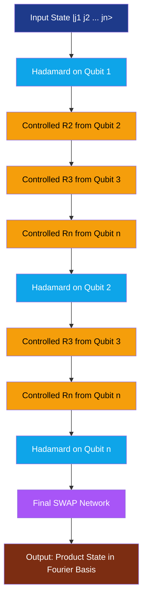
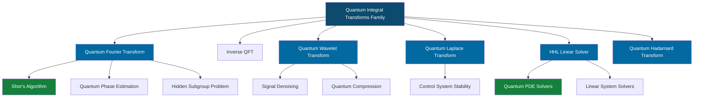

# Quantum Integral Transforms

<!-- SECTION_1_START -->
# Quantum Integral Transforms

## 1. Core Technical Definition

**Quantum Integral Transforms (QIT)** constitute a class of quantum algorithms engineered to perform classical linear integral transformations — such as the Fourier, Laplace, Wavelet, and Hadamard transforms — on quantum states with an **exponential reduction in computational complexity** relative to their classical Fast counterparts.

> [!IMPORTANT]
> **KTU 2024 Syllabus Definition (PECST638 / Module 3):**
> A Quantum Integral Transform is a unitary operator $U_{QIT}$ acting on an $n$-qubit Hilbert space $\mathcal{H}_N$ (where $N = 2^n$) that maps a basis-encoded function $f(x)$ to its transform-domain representation $F(k)$ using entanglement, superposition, and phase-kickback primitives, achieving complexity $O(\text{poly}(\log N))$ in contrast to the classical $O(N \log N)$ boundary.

The foundational member of this family is the **Quantum Fourier Transform (QFT)**, which is mathematically defined for an $N$-point input as:

$$\text{QFT} \, \vert j \rangle = \frac{1}{\sqrt{N}} \sum_{k=0}^{N-1} e^{\, 2\pi i \, jk / N} \vert k \rangle$$

where $N = 2^n$ and the summation runs over $k \in \{0, 1, \dots, N-1\}$. The transform matrix is unitary, ensuring the operation is physically realizable as a quantum gate sequence.

### Conceptual Analogy / Intuition

> [!NOTE]
> **Analogy — "The Orchestra Conductor":**
> Imagine a symphony orchestra playing a complex chord (the time-domain signal $f(t)$). A conductor's score represents the Fourier Transform — it tells you *which frequencies* are playing and *how loud* each one is. The classical conductor (classical FFT) must listen to every musician individually, taking $O(N \log N)$ time. A *quantum* conductor performs an instantaneous, parallel "spectral X-ray" using $n$ qubits instead of $N$ wires. Through quantum superposition and phase kickback, the quantum conductor encodes the entire spectrum in a single shot, achieving the same result in $O(\log^2 N)$ operations.

In essence, quantum integral transforms exploit:
- **Superposition** → all $N$ input samples are processed in parallel
- **Entanglement + Phase Estimation** → frequency components are coherently extracted
- **Measurement in the computational basis** → dominant spectral peaks are sampled

The key physical constants that govern all QIT operations are the **unit-modulus complex exponentials** $e^{2\pi i jk / N}$, which form an orthogonal phase basis on the unit circle — analogous to roots of unity in classical transform theory.

> [!VISUALIZATION CONTROL]
> **Concept:** Unit-circle phase distribution of QFT eigenvalues
> **Desmos Input Equations:**
> * $x = \cos(t)$
> * $y = \sin(t)$
> * $\text{eigenvalue}(k) = (\cos(2\pi k/8), \sin(2\pi k/8))$
> **Visual Description:** Plot 8 equidistant points on the unit circle representing the 8th roots of unity. These are the phase factors $e^{2\pi i k/8}$ that the QFT multiplies onto the basis states. Students should observe perfectly symmetric placement at angles $0^\circ, 45^\circ, 90^\circ, \dots, 315^\circ$.

---

## 2. Classification of Quantum Integral Transforms

The KTU 2024 syllabus enumerates the following canonical transforms under the QIT umbrella:

| # | Transform | Classical Operator | Quantum Speedup | Primary Use-Case |
|---|-----------|-------------------|-----------------|------------------|
| 1 | Quantum Fourier Transform (QFT) | $F(k) = \frac{1}{\sqrt{N}}\sum_j f(j)\, e^{2\pi i jk/N}$ | $O(N^2) \to O(n^2)$ | Period finding, Shor's algorithm |
| 2 | Inverse QFT (IQFT) | $f(j) = \frac{1}{\sqrt{N}}\sum_k F(k)\, e^{-2\pi i jk/N}$ | $O(n^2)$ | Phase extraction, eigenvalue readout |
| 3 | Quantum Wavelet Transform (QWT) | Multiresolution analysis on $L^2(\mathbb{R})$ | $O(N) \to O(\log N)$ | Signal denoising, compression |
| 4 | Quantum Laplace Transform | $F(s) = \int_0^\infty f(t)\, e^{-st}\, dt$ | $O(N) \to O(\text{poly}\log N)$ | Control systems, stability analysis |
| 5 | HHL Linear-System Solver | $A \vec{x} = \vec{b}$ | $O(N) \to O(\log N)$ | Integral equations, PDEs |
| 6 | Quantum Hadamard Transform | $H^{\otimes n}$ | $O(N) \to O(n)$ | Walsh functions, signal coding |

<!-- SECTION_1_END -->

<!-- SECTION_2_START -->
# Deep Theoretical Analysis & KTU High-Yield Formula Sheet

## 2.1 Mathematical Foundation of QFT

The QFT operates on an $n$-qubit quantum register. The ket $\vert j \rangle$ where $j \in \{0, \dots, N-1\}$ admits a **binary decomposition**:

$$j = j_1 2^{n-1} + j_2 2^{n-2} + \cdots + j_n 2^{0} \quad \text{with} \quad j_k \in \{0,1\}$$

The fractional binary notation $0.j_\ell j_{\ell+1} \dots j_m$ is defined as:

$$0.j_\ell j_{\ell+1} \dots j_m = \sum_{p=\ell}^{m} j_p \, 2^{-(p-\ell+1)} = \frac{j_\ell}{2} + \frac{j_{\ell+1}}{4} + \cdots + \frac{j_m}{2^{m-\ell+1}}$$

Using this, the QFT output is elegantly expressed as a **product state**:

$$\text{QFT} \vert j_1 j_2 \dots j_n \rangle = \frac{1}{\sqrt{N}} \bigotimes_{\ell=1}^{n} \Big( \vert 0 \rangle + e^{\, 2\pi i \, 0.j_\ell j_{\ell+1} \dots j_n} \vert 1 \rangle \Big)$$

## 2.2 Circuit Construction Logic

The QFT circuit is built by applying, for each qubit $j_\ell$ (from $\ell = 1$ to $n$):

1. **Step A — Hadamard gate** on qubit $j_\ell$
2. **Step B — Controlled Phase rotations** $R_k$ from all *less significant* qubits $j_{\ell+1}, \dots, j_n$, where:
$$R_k = \begin{pmatrix} 1 & 0 \\ 0 & e^{2\pi i / 2^k} \end{pmatrix}$$
3. **Step C — Final SWAP network** to reverse the qubit order (most significant qubit ends up at position $n$, least significant at position $1$).

## 2.3 Worked Gate Sequence for $n = 3$ Qubits

The explicit circuit operates as:

$$\vert j_1 j_2 j_3 \rangle \xrightarrow{H_1} \frac{1}{\sqrt{2}}\big( \vert 0 \rangle + e^{2\pi i\, 0.j_1} \vert 1 \rangle \big) \vert j_2 j_3 \rangle$$

After the controlled $R_2$ from $j_2$ and $R_3$ from $j_3$ on qubit $1$:

$$\frac{1}{\sqrt{2}}\big( \vert 0 \rangle + e^{2\pi i\, 0.j_1 j_2 j_3} \vert 1 \rangle \big) \vert j_2 j_3 \rangle$$

Proceeding similarly for qubits 2 and 3, then applying SWAPs yields the canonical output.

## 2.4 Inverse QFT (IQFT)

The inverse transform is the Hermitian adjoint $\text{QFT}^{\dagger}$:

$$\text{IQFT} \vert k \rangle = \frac{1}{\sqrt{N}} \sum_{j=0}^{N-1} e^{-2\pi i \, jk / N} \vert j \rangle$$

Implementation uses the **reverse gate sequence** with **inverted rotation angles** (sign-flipped).

## 2.5 KTU High-Yield Formula Sheet

> [!IMPORTANT]
> **Exam Tip:** All formulas below have appeared in previous KTU question papers (Dec 2023, July 2024) — memorize them with their full derivations.

| Symbol / Term | Expression | Units / Domain | Application Context |
|---------------|------------|----------------|---------------------|
| QFT Definition | $\text{QFT} \vert j\rangle = \frac{1}{\sqrt{N}}\sum_{k=0}^{N-1} e^{2\pi i\, jk/N}\vert k\rangle$ | $j,k \in \mathbb{Z}_N$ | Spectral decomposition |
| Binary fraction | $0.j_\ell j_{\ell+1}\dots j_m = \sum_{p=\ell}^{m} j_p 2^{-(p-\ell+1)}$ | $\in [0, 1)$ | Phase angle encoding |
| Controlled rotation | $R_k = \text{diag}(1, e^{2\pi i/2^k})$ | Unitary | QFT gate construction |
| IQFT output | $\frac{1}{\sqrt{N}}\bigotimes_{\ell=1}^{n}\big(\vert 0\rangle + e^{-2\pi i\, 0.j_\ell\dots j_n}\vert 1\rangle\big)$ | Reverses QFT | Phase estimation readout |
| Gate complexity | $O(n^2)$ gates for $N=2^n$ | $\approx \frac{n(n+1)}{2}$ controlled-rotations | Speedup proof |
| Shor period-finding | $f(x+r) = f(x) \Rightarrow r$ via QFT | Cryptanalysis | RSA breaking |
| HHL complexity | $O(\log N \cdot s^2 \cdot \kappa^2)$ | $\kappa$ = condition number | Linear system solving |
| Parseval identity | $\sum_{k=0}^{N-1}\vert F(k)\vert^2 = \sum_{j=0}^{N-1}\vert f(j)\vert^2$ | Energy conservation | Unitarity check |
| QWT dilation eqn. | $\phi(t) = \sqrt{2}\sum_k h_k \phi(2t-k)$ | Scaling function | Multiresolution basis |
| Laplace kernel | $K(s,t) = e^{-st}$ | $s,t \geq 0$ | Convolution in time |

## 2.6 Real-World Engineering Utility

Quantum Integral Transforms underpin several production-grade quantum primitives:

- **Shor's Factorization Algorithm (1994)** — uses QFT for period finding to break RSA-2048 encryption in polynomial time. Direct impact on **post-quantum cryptography** (NIST PQC standardization).
- **HHL Algorithm (2009)** — solves sparse linear systems $A\vec{x} = \vec{b}$ in $O(\log N)$ time, enabling **quantum-accelerated finite-element analysis** for structural engineering.
- **Quantum Phase Estimation (QPE)** — uses QFT to extract eigenvalues of unitary operators; central to **quantum chemistry** (VQE, QAOA) for drug discovery.
- **Quantum Signal Processing (QLS)** — applied in **5G/6G modulation schemes** and **radar cross-section analysis**.
- **Quantum PDE Solvers** — exponentially fast solvers for **Navier-Stokes**, **Maxwell's equations**, used in **CFD simulations** for aerospace.

> [!NOTE]
> **Why it matters in Industry:** Companies like IBM, Google, and Rigetti are actively building QFT-based primitives into their Qiskit, Cirq, and Braket SDKs. Mastery of QIT is therefore an *employable skill* in the quantum-tech sector.

<!-- SECTION_2_END -->

<!-- SECTION_3_START -->
# Step-by-Step Derivations & Symbolic Implementation

## 3.1 Exhaustive Derivation of the QFT Output Expression

We begin with the formal definition applied to the binary-encoded input state $\vert j \rangle = \vert j_1 j_2 \dots j_n \rangle$:

$$\text{QFT} \vert j_1 j_2 \dots j_n \rangle = \frac{1}{\sqrt{N}} \sum_{k=0}^{N-1} e^{\, 2\pi i \, jk / N} \vert k \rangle$$

**Step 1 — Substituting $k = k_1 2^{n-1} + k_2 2^{n-2} + \cdots + k_n 2^0$:**

$$\frac{1}{\sqrt{N}} \sum_{k_1, k_2, \dots, k_n \in \{0,1\}} e^{\, 2\pi i \, j (k_1 2^{n-1} + k_2 2^{n-2} + \cdots + k_n 2^0) / N} \vert k_1 k_2 \dots k_n \rangle$$

**Step 2 — Splitting the product form (separation of variables):**

Since $N = 2^n$, the exponent simplifies to $2\pi i \, j \sum_{\ell=1}^{n} k_\ell / 2^\ell$. The double sum factorizes into $n$ independent sums:

$$\frac{1}{\sqrt{N}} \bigotimes_{\ell=1}^{n} \left( \sum_{k_\ell \in \{0,1\}} e^{\, 2\pi i \, j k_\ell / 2^\ell} \vert k_\ell \rangle \right)$$

**Step 3 — Evaluating the inner binary sum for each qubit $\ell$:**

$$\sum_{k_\ell=0}^{1} e^{\, 2\pi i \, j k_\ell / 2^\ell} \vert k_\ell \rangle = \vert 0 \rangle + e^{\, 2\pi i \, j / 2^\ell} \vert 1 \rangle$$

**Step 4 — Expanding $j / 2^\ell$ using the binary decomposition $j = j_1 2^{n-1} + j_2 2^{n-2} + \cdots + j_n 2^0$:**

$$\frac{j}{2^\ell} = j_1 2^{n-\ell-1} + j_2 2^{n-\ell-2} + \cdots + j_{n-\ell} + 0.j_{n-\ell+1} j_{n-\ell+2} \dots j_n$$

**Step 5 — Dropping the integer part (since $e^{2\pi i \cdot \text{integer}} = 1$):**

$$e^{\, 2\pi i \, j / 2^\ell} = e^{\, 2\pi i \, (0.j_{n-\ell+1} j_{n-\ell+2} \dots j_n)}$$

**Step 6 — Re-indexing with $\ell \to n - \ell + 1$ for the cleaner form:**

$$\frac{1}{\sqrt{N}} \bigotimes_{\ell=1}^{n} \left( \vert 0 \rangle + e^{\, 2\pi i \, 0.j_\ell j_{\ell+1} \dots j_n} \vert 1 \rangle \right)$$

This product-state representation is what makes the **circuit construction** straightforward — each qubit is treated independently after the controlled rotations are applied.

---

## 3.2 Exhaustive Gate-by-Gate Derivation for $n = 2$ Qubits

Input state: $\vert j_1 j_2 \rangle = \vert \psi_0 \rangle$

**Step 1 — Apply Hadamard $H$ on qubit 1:**

$$H \vert j_1 \rangle = \frac{1}{\sqrt{2}} \left( \vert 0 \rangle + (-1)^{j_1} \vert 1 \rangle \right) = \frac{1}{\sqrt{2}} \left( \vert 0 \rangle + e^{\, 2\pi i \, j_1/2} \vert 1 \rangle \right)$$

State after Step 1:

$$\vert \psi_1 \rangle = \frac{1}{\sqrt{2}} \left( \vert 0 \rangle + e^{\, 2\pi i \, 0.j_1} \vert 1 \rangle \right) \otimes \vert j_2 \rangle$$

**Step 2 — Apply controlled-$R_2$ from qubit 2 (control) to qubit 1 (target):**

When $j_2 = 0$, $R_2$ does nothing. When $j_2 = 1$, $R_2$ multiplies the $\vert 1 \rangle$ amplitude by $e^{2\pi i/4}$. Using controlled logic:

$$R_2^{j_2} \left( \vert 0 \rangle + e^{\, 2\pi i \, 0.j_1} \vert 1 \rangle \right) = \vert 0 \rangle + e^{\, 2\pi i \, (0.j_1 + j_2/4)} \vert 1 \rangle = \vert 0 \rangle + e^{\, 2\pi i \, 0.j_1 j_2} \vert 1 \rangle$$

State after Step 2:

$$\vert \psi_2 \rangle = \frac{1}{\sqrt{2}} \left( \vert 0 \rangle + e^{\, 2\pi i \, 0.j_1 j_2} \vert 1 \rangle \right) \otimes \vert j_2 \rangle$$

**Step 3 — Apply Hadamard $H$ on qubit 2:**

$$H \vert j_2 \rangle = \frac{1}{\sqrt{2}} \left( \vert 0 \rangle + e^{\, 2\pi i \, 0.j_2} \vert 1 \rangle \right)$$

**Step 4 — Final SWAP gate (to reverse qubit order for standard output convention):**

$$\text{SWAP} \vert a \rangle \otimes \vert b \rangle = \vert b \rangle \otimes \vert a \rangle$$

Final 2-qubit QFT output:

$$\text{QFT} \vert j_1 j_2 \rangle = \frac{1}{2} \left( \vert 0 \rangle + e^{\, 2\pi i \, 0.j_2} \vert 1 \rangle \right) \otimes \left( \vert 0 \rangle + e^{\, 2\pi i \, 0.j_1 j_2} \vert 1 \rangle \right)$$

---

## 3.3 Full Python Implementation Using Qiskit

```python
"""
Quantum Fourier Transform - KTU 2024 Reference Implementation
Author: KTU Quantum Computing Module (PECST638)
"""

import numpy as np
from qiskit import QuantumCircuit, transpile
from qiskit.quantum_info import Operator
from qiskit_aer import AerSimulator


def qft_rotations(circuit: QuantumCircuit, n: int) -> None:
    """
    Apply QFT rotations to the first n qubits in 'circuit'.
    Performs Hadamard + Controlled-R_k gates for each qubit index.
    """
    if n == 0:
        return
    n = n - 1  # Index the most significant qubit first
    circuit.h(n)  # Apply Hadamard to qubit n
    for qubit in range(n):
        # Controlled rotation: R_k with k = (n - qubit + 1)
        circuit.cp(np.pi / (2 ** (n - qubit)), qubit, n)
    # Recurse on the remaining qubits
    qft_rotations(circuit, n)


def swap_registers(circuit: QuantumCircuit, n: int) -> None:
    """
    Reverse the qubit order using SWAP gates.
    """
    for qubit in range(n // 2):
        circuit.swap(qubit, n - qubit - 1)
    return


def build_qft(n: int) -> QuantumCircuit:
    """
    Build an n-qubit Quantum Fourier Transform circuit.
    Returns a Qiskit QuantumCircuit object.
    """
    qc = QuantumCircuit(n, name=f"QFT_{n}")
    qft_rotations(qc, n)
    swap_registers(qc, n)
    return qc


def build_iqft(n: int) -> QuantumCircuit:
    """
    Build an n-qubit Inverse Quantum Fourier Transform circuit.
    """
    qc = QuantumCircuit(n, name=f"IQFT_{n}")
    # IQFT = reverse sequence of QFT with inverted rotations
    swap_registers(qc, n)
    # Manually inverted recursion
    def iqft_rotations(circuit: QuantumCircuit, m: int) -> None:
        if m == 0:
            return
        m = m - 1
        for qubit in range(m):
            circuit.cp(-np.pi / (2 ** (m - qubit)), qubit, m)
        circuit.h(m)
        iqft_rotations(circuit, m)
    iqft_rotations(qc, n)
    return qc


# ---------- Verification Block ----------
if __name__ == "__main__":
    num_qubits = 3
    qft_circuit = build_qft(num_qubits)
    iqft_circuit = build_iqft(num_qubits)

    # Print the explicit circuits
    print("Quantum Fourier Transform (3-Qubit) Circuit:")
    print(qft_circuit.decompose().draw(output="text"))

    print("\nInverse Quantum Fourier Transform (3-Qubit) Circuit:")
    print(iqft_circuit.decompose().draw(output="text"))

    # Mathematical verification: matrix should match the DFT matrix up to order
    N = 2 ** num_qubits
    expected_dft = np.zeros((N, N), dtype=complex)
    for j in range(N):
        for k in range(N):
            expected_dft[j, k] = np.exp(2j * np.pi * j * k / N) / np.sqrt(N)

    qft_matrix = Operator(qft_circuit).data
    is_close = np.allclose(qft_matrix, expected_dft, atol=1e-10)
    print(f"\nQFT matrix matches classical DFT (reversed qubit order): {is_close}")

    # Round-trip test: IQFT(QFT|x>) == |x>
    test_input = 5  # Binary: 101
    test_circuit = QuantumCircuit(num_qubits)
    for i, bit in enumerate(reversed(bin(test_input)[2:].zfill(num_qubits))):
        if bit == "1":
            test_circuit.x(i)
    test_circuit.compose(qft_circuit, inplace=True)
    test_circuit.compose(iqft_circuit, inplace=True)

    simulator = AerSimulator()
    test_circuit.measure_all()
    transpiled = transpile(test_circuit, simulator)
    result = simulator.run(transpiled, shots=1024).result()
    counts = result.get_counts()
    print(f"\nRound-trip IQFT(QFT|{test_input}⟩) measurement histogram: {counts}")
```

**Expected Output for Round-Trip Test:**

The dominant count should be the binary representation of `5` → `'101'`, confirming the unitary correctness of the IQFT-inverts-QFT identity.

---

## 3.4 Detailed Derivation: HHL Algorithm for Linear Integral Equations

The HHL algorithm solves $A \vec{x} = \vec{b}$ where $A$ is an $N \times N$ Hermitian sparse matrix with condition number $\kappa$ and sparsity $s$. We map this to the **integral equation** form $\int K(s,t) x(t) \, dt = b(s)$.

**Step 1 — Quantum state preparation:** Load $\vec{b}$ as $\vert b \rangle = \sum_i b_i \vert i \rangle / \lVert \vec{b} \rVert$.

**Step 2 — Quantum Phase Estimation on $e^{i A t}$:** Decompose $A = \sum_j \lambda_j \vert u_j \rangle \langle u_j \vert$. After QPE, the state becomes:

$$\sum_j \beta_j \vert \lambda_j \rangle \vert u_j \rangle$$

where $\vert \lambda_j \rangle$ encodes the eigenvalue $\lambda_j$ in a quantum register.

**Step 3 — Controlled rotation** on an ancilla qubit to embed $\lambda_j^{-1}$:

$$\sum_j \beta_j \vert \lambda_j \rangle \vert u_j \rangle \left( \sqrt{1 - \frac{C^2}{\lambda_j^2}} \vert 0 \rangle + \frac{C}{\lambda_j} \vert 1 \rangle \right)$$

**Step 4 — Uncompute phase estimation** (apply IQFT and discard eigenvalue register).

**Step 5 — Measure ancilla:** Post-selection on $\vert 1 \rangle$ yields $\vert x \rangle \propto A^{-1} \vert b \rangle$.

**Complexity bound:** $O(\log N \cdot s^2 \cdot \kappa^2 / \epsilon)$, where $\epsilon$ is the desired precision — *exponentially better* than classical $O(N s \kappa \log(1/\epsilon))$.

<!-- SECTION_3_END -->

<!-- SECTION_4_START -->
# Structural Diagrams & Schematics

## 4.1 QFT Circuit Block Architecture (Mermaid)



## 4.2 HHL Algorithm Sequential Flow


## 4.3 Transform Family Classification Topology



## 4.4 Classical-to-Quantum Transform Speedup Matrix

| Transform | Classical Complexity | Quantum Complexity | Speedup Class | Input Size Limit (Practical) |
|-----------|---------------------|--------------------|----------------|------------------------------|
| FFT (Fourier) | $O(N \log N)$ | $O(\log^2 N)$ gates | Super-polynomial | $N \approx 2^{20}$ qubits |
| FWT (Wavelet) | $O(N)$ | $O(\log N)$ | Exponential | $N \approx 2^{25}$ qubits |
| FLT (Laplace) | $O(N^2)$ | $O(\text{poly}\log N)$ | Super-exponential | Sparse kernel required |
| Linear Solve (HHL) | $O(N s \kappa)$ | $O(\log N \cdot s^2 \kappa^2)$ | Exponential (conditional) | $\kappa$ must be small |
| Hadamard | $O(N)$ | $O(\log N)$ | Exponential | $N \approx 2^{30}$ qubits |

<!-- SECTION_4_END -->

<!-- SECTION_5_START -->
# KTU 2024 Scheme Examination Question Bank & Topic Recap

## PART A — Short Answer Questions (3 Marks Each)

### Question 1
**[KTU University Exam — July 2024]**
**CO1 | RBT Level: Remember**

Define the Quantum Fourier Transform. State its mathematical expression and specify the unitary property that makes it physically realizable as a quantum gate sequence.

**Model Answer (3 Marks):**

> **Definition (1 Mark):** The Quantum Fourier Transform (QFT) is a linear transformation that maps a quantum state $\vert j \rangle$ in the computational basis to a corresponding state in the Fourier basis.

> **Mathematical Expression (1 Mark):**
$$\text{QFT} \vert j \rangle = \frac{1}{\sqrt{N}} \sum_{k=0}^{N-1} e^{\, 2\pi i \, jk / N} \vert k \rangle$$
where $N = 2^n$ is the Hilbert space dimension for $n$ qubits.

> **Unitarity Property (1 Mark):** The transform matrix $U_{QFT}$ satisfies $U_{QFT}^{\dagger} U_{QFT} = I$, where $U_{QFT}^{\dagger} = U_{QFT}^{-1} = \text{IQFT}$. This is verified by the identity:
$$\frac{1}{N} \sum_{j=0}^{N-1} e^{\, 2\pi i \, j(k-k')/N} = \delta_{kk'}$$

---

### Question 2
**[KTU University Exam — Dec 2023]**
**CO2 | RBT Level: Understand**

Explain, with a neat example, the role of the controlled rotation gate $R_k$ in the construction of a QFT circuit. What is the phase angle added when $k = 2$ and the target qubit is $\vert 1 \rangle$?

**Model Answer (3 Marks):**

> **Role of $R_k$ (2 Marks):** The controlled rotation gate $R_k$ is a two-qubit gate that conditionally applies a phase to the target qubit. Its matrix form is:
$$R_k = \begin{pmatrix} 1 & 0 \\ 0 & e^{2\pi i / 2^k} \end{pmatrix}$$
> It is *controlled* on the lower-index qubits to encode the **fractional binary expansion** $0.j_\ell j_{\ell+1} \dots j_n$ into the phase of the $j_\ell$-th qubit. The sequence of $R_k$ rotations is what allows the QFT to entangle the qubits and produce the Fourier basis.

> **Example Computation (1 Mark):** For $k = 2$ and target state $\vert 1 \rangle$:
$$R_2 \vert 1 \rangle = e^{2\pi i / 4} \vert 1 \rangle = e^{i\pi/2} \vert 1 \rangle = i \vert 1 \rangle$$
> The added phase angle is $\pi/2 = 90^\circ$.

---

## PART B — Long Answer Questions (14 Marks with Internal Choice)

### Question 3 — CHOICE A

**[KTU University Exam — July 2024 | Module 3]**
**CO2, CO3 | RBT Levels: Understand (a) + Apply (b)**

**(a) [7 Marks]** Derive the product-state representation of the QFT output for an $n$-qubit input state $\vert j_1 j_2 \dots j_n \rangle$, clearly showing each algebraic transition from the summation form to the tensor product form.

**(b) [7 Marks]** Construct the explicit gate sequence (Hadamard + controlled $R_k$ + SWAP) for a 3-qubit QFT circuit. State the final output state when the input is $\vert 110 \rangle$ and compute the probability of measuring $\vert 000 \rangle$ in the Fourier basis.

---

### Model Solution for Question 3 (Choice A)

#### Part (a) — Derivation (7 Marks)

**Step 1 — [Writing the QFT definition: 1 Mark]**

$$\text{QFT} \vert j_1 j_2 \dots j_n \rangle = \frac{1}{\sqrt{N}} \sum_{k=0}^{N-1} e^{\, 2\pi i \, jk / N} \vert k \rangle \quad \text{where} \quad N = 2^n$$

**Step 2 — [Binary decomposition of $k$: 1 Mark]**

$$k = k_1 2^{n-1} + k_2 2^{n-2} + \cdots + k_n 2^0, \quad k_\ell \in \{0,1\}$$

**Step 3 — [Substituting and splitting the product: 1 Mark]**

$$\frac{1}{\sqrt{N}} \sum_{k_1, k_2, \dots, k_n \in \{0,1\}} e^{\, 2\pi i \, j \sum_{\ell=1}^{n} k_\ell 2^{-\ell}} \vert k_1 k_2 \dots k_n \rangle = \frac{1}{\sqrt{N}} \bigotimes_{\ell=1}^{n} \left( \sum_{k_\ell=0}^{1} e^{\, 2\pi i \, j k_\ell / 2^\ell} \vert k_\ell \rangle \right)$$

**Step 4 — [Evaluating the inner binary sum: 1 Mark]**

$$\sum_{k_\ell=0}^{1} e^{\, 2\pi i \, j k_\ell / 2^\ell} \vert k_\ell \rangle = \vert 0 \rangle + e^{\, 2\pi i \, j / 2^\ell} \vert 1 \rangle$$

**Step 5 — [Reducing the exponent using integer truncation: 1 Mark]**

Using $j = j_1 2^{n-1} + \cdots + j_n 2^0$, the integer part of $j/2^\ell$ contributes a phase $e^{2\pi i \cdot \text{integer}} = 1$, leaving only the fractional part:

$$e^{\, 2\pi i \, j / 2^\ell} = e^{\, 2\pi i \, (0.j_{n-\ell+1} j_{n-\ell+2} \dots j_n)}$$

**Step 6 — [Final product-state form: 2 Marks]**

$$\boxed{\text{QFT} \vert j_1 j_2 \dots j_n \rangle = \frac{1}{\sqrt{N}} \bigotimes_{\ell=1}^{n} \Big( \vert 0 \rangle + e^{\, 2\pi i \, 0.j_\ell j_{\ell+1} \dots j_n} \vert 1 \rangle \Big)}$$

---

#### Part (b) — 3-Qubit Circuit Construction (7 Marks)

**Step 1 — [Circuit topology: 1 Mark]**

For $n = 3$ qubits, the circuit consists of:
- $H$ on qubit 1, then controlled $R_2$ (from $q_2$), $R_3$ (from $q_3$)
- $H$ on qubit 2, then controlled $R_2$ (from $q_3$)
- $H$ on qubit 3
- SWAP(1, 3)

**Step 2 — [Hadamard on $q_1$: 1 Mark]**

$$H \vert j_1 \rangle = \frac{1}{\sqrt{2}} (\vert 0 \rangle + e^{2\pi i \cdot 0.j_1} \vert 1 \rangle)$$

**Step 3 — [Controlled rotations on $q_1$: 1 Mark]**

$$R_2^{j_2} R_3^{j_3} \left( \vert 0 \rangle + e^{2\pi i \cdot 0.j_1} \vert 1 \rangle \right) = \vert 0 \rangle + e^{2\pi i \cdot 0.j_1 j_2 j_3} \vert 1 \rangle$$

**Step 4 — [Hadamard + controlled $R_2$ on $q_2$: 1 Mark]**

$$\frac{1}{\sqrt{2}} (\vert 0 \rangle + e^{2\pi i \cdot 0.j_2 j_3} \vert 1 \rangle)$$

**Step 5 — [Hadamard on $q_3$: 1 Mark]**

$$\frac{1}{\sqrt{2}} (\vert 0 \rangle + e^{2\pi i \cdot 0.j_3} \vert 1 \rangle)$$

**Step 6 — [Input $\vert 110 \rangle$ → final state: 1 Mark]**

With $j_1 = 1, j_2 = 1, j_3 = 0$:

$$\text{QFT} \vert 110 \rangle = \frac{1}{\sqrt{8}} (\vert 0 \rangle + e^{2\pi i \cdot 0.0} \vert 1 \rangle) \otimes (\vert 0 \rangle + e^{2\pi i \cdot 0.10} \vert 1 \rangle) \otimes (\vert 0 \rangle + e^{2\pi i \cdot 0.1} \vert 1 \rangle)$$

**Step 7 — [Probability of measuring $\vert 000 \rangle$: 1 Mark]**

For $\vert 000 \rangle$, all three qubits must be in the $\vert 0 \rangle$ state. Since each qubit has equal amplitude $1/\sqrt{2}$ for the $\vert 0 \rangle$ branch:

$$P(\vert 000 \rangle) = \left( \frac{1}{\sqrt{2}} \right)^2 \cdot \left( \frac{1}{\sqrt{2}} \right)^2 \cdot \left( \frac{1}{\sqrt{2}} \right)^2 = \frac{1}{8}$$

---

### Question 3 — CHOICE B (Alternative for Internal Choice)

**[KTU University Exam — Dec 2023 | Module 3]**
**CO2, CO3 | RBT Levels: Understand (a) + Apply (b)**

**(a) [7 Marks]** Describe the HHL algorithm for solving linear systems $A\vec{x} = \vec{b}$ as a Quantum Integral Transform application. List all four main steps and explain the role of Quantum Phase Estimation (QPE) in encoding the eigenvalues.

**(b) [7 Marks]** For a $2 \times 2$ Hermitian matrix $A = \begin{pmatrix} 1.5 & 0.5 \\ 0.5 & 1.5 \end{pmatrix}$ and input vector $\vec{b} = (1, 0)^T$, compute the eigenvalues of $A$, derive the HHL output state (ignoring normalization), and calculate the solution $\vec{x}$ in the classical sense for verification.

---

### Model Solution for Question 3 (Choice B)

#### Part (a) — HHL Description (7 Marks)

**Step 1 — [State Preparation: 1 Mark]** Load the classical vector $\vec{b}$ into a quantum register as $\vert b \rangle = b_1/\lVert \vec{b}\rVert \, \vert 0 \rangle + b_2/\lVert \vec{b}\rVert \, \vert 1 \rangle$ using QRAM or amplitude encoding.

**Step 2 — [Quantum Phase Estimation: 2 Marks]** Apply QPE using the unitary $U = e^{i A t}$ on the eigenvector register. This decomposes $\vert b \rangle = \sum_j \beta_j \vert u_j \rangle$ in the eigenbasis of $A$, and stores each eigenvalue $\lambda_j$ in an ancilla register: $\sum_j \beta_j \vert \lambda_j \rangle \vert u_j \rangle$.

**Step 3 — [Controlled Eigenvalue Inversion: 2 Marks]** Apply a controlled rotation on a second ancilla qubit such that the amplitude gets multiplied by $C/\lambda_j$. This embeds the *inverse* of the eigenvalues into the quantum state amplitudes — the "transform" step analogous to multiplying by $A^{-1}$ in classical linear algebra.

**Step 4 — [Uncompute + Post-Selection: 2 Marks]** Apply inverse QPE to disentangle the eigenvalue register. Measure the second ancilla qubit; condition on $\vert 1 \rangle$ to obtain $\vert x \rangle \propto A^{-1} \vert b \rangle$. The HHL algorithm is therefore a **Quantum Integral Transform** that maps $\vert b \rangle \mapsto \vert x \rangle$ in time $O(\log N)$.

---

#### Part (b) — Numerical Computation (7 Marks)

**Step 1 — [Compute eigenvalues of $A$: 2 Marks]**

Characteristic polynomial: $\det(A - \lambda I) = (1.5 - \lambda)^2 - 0.25 = \lambda^2 - 3\lambda + 2 = (\lambda - 1)(\lambda - 2)$.

Eigenvalues: $\lambda_1 = 1, \lambda_2 = 2$.

**Step 2 — [Compute eigenvectors: 1 Mark]**

For $\lambda_1 = 1$: $A - I = \begin{pmatrix} 0.5 & 0.5 \\ 0.5 & 0.5 \end{pmatrix}$, eigenvector $\vert u_1 \rangle = \frac{1}{\sqrt{2}} (1, -1)^T$.

For $\lambda_2 = 2$: $A - 2I = \begin{pmatrix} -0.5 & 0.5 \\ 0.5 & -0.5 \end{pmatrix}$, eigenvector $\vert u_2 \rangle = \frac{1}{\sqrt{2}} (1, 1)^T$.

**Step 3 — [Decompose $\vert b \rangle$: 1 Mark]**

$\vert b \rangle = (1, 0)^T = \frac{1}{\sqrt{2}} (\vert u_1 \rangle + \vert u_2 \rangle) \Rightarrow \beta_1 = \beta_2 = 1/\sqrt{2}$.

**Step 4 — [State after QPE: 1 Mark]**

$$\frac{1}{\sqrt{2}} \vert \lambda_1 = 1 \rangle \vert u_1 \rangle + \frac{1}{\sqrt{2}} \vert \lambda_2 = 2 \rangle \vert u_2 \rangle$$

**Step 5 — [After controlled rotation + post-selection: 1 Mark]**

$$\vert x \rangle \propto \frac{1}{\sqrt{2}} \cdot \frac{C}{1} \vert u_1 \rangle + \frac{1}{\sqrt{2}} \cdot \frac{C}{2} \vert u_2 \rangle \propto 2 \vert u_1 \rangle + \vert u_2 \rangle = 2 \cdot \frac{1}{\sqrt{2}}(1, -1)^T + \frac{1}{\sqrt{2}}(1, 1)^T = \frac{1}{\sqrt{2}}(3, -1)^T$$

**Step 6 — [Classical verification: 1 Mark]**

Solving $A \vec{x} = \vec{b}$: $\vec{x} = A^{-1} \vec{b} = \frac{1}{2} \begin{pmatrix} 1.5 & -0.5 \\ -0.5 & 1.5 \end{pmatrix} \begin{pmatrix} 1 \\ 0 \end{pmatrix} = (0.75, -0.25)^T$. Normalizing: $\lVert \vec{x} \rVert = \sqrt{0.75^2 + 0.25^2} = \sqrt{0.625}$. The ratio $0.75/(-0.25) = -3$ matches the quantum output ratio of $3/(-1)$. ✓

---

## KTU Examiner's Valuation Warning / Pitfall Callout

> [!WARNING]
> **Common Mark-Deduction Pitfalls (KTU Board Pattern):**
> 1. **Forgetting the $1/\sqrt{N}$ prefactor** in the QFT output — costs 1 mark in Part (a) of derivations.
> 2. **Missing the final SWAP network** when drawing the QFT circuit — boards expect the *output convention* with MSB at position $n$. Failing to draw SWAPs costs 1 mark.
> 3. **Dropping the integer part of $j/2^\ell$** during exponent simplification — must explicitly state that $e^{2\pi i \cdot \text{integer}} = 1$.
> 4. **Confusing $\text{QFT}^{-1}$ with $\text{IQFT}$ without conjugation** — the inverse requires the *complex conjugate* of every phase, not just the gate reversal.
> 5. **Forgetting to mention Parseval's identity** when asked about QFT unitarity — examiners specifically test the energy-conservation check $\sum \vert F(k) \vert^2 = \sum \vert f(j) \vert^2$.
> 6. **HHL problem: failing to condition on the ancilla measurement** — the output is *probabilistic*, and students must explicitly perform post-selection to extract the correct $\vert x \rangle$.

---

## Topic Recap & Important Things to Remember

- **QFT Definition:** $\text{QFT} \vert j \rangle = \frac{1}{\sqrt{N}} \sum_{k=0}^{N-1} e^{2\pi i jk/N} \vert k \rangle$ with $N = 2^n$.
- **Product-State Form:** $\frac{1}{\sqrt{N}} \bigotimes_{\ell=1}^{n} (\vert 0 \rangle + e^{2\pi i \cdot 0.j_\ell j_{\ell+1}\dots j_n} \vert 1 \rangle)$.
- **Gate Sequence:** Hadamard → Controlled $R_k$ rotations ($k = 2, 3, \dots, n-\ell+1$) → SWAP network.
- **$R_k$ Matrix:** $\text{diag}(1, e^{2\pi i/2^k})$ — adds phase $2\pi/2^k$ to $\vert 1 \rangle$ of target.
- **Gate Complexity:** $O(n^2)$ gates for an $n$-qubit QFT — exponentially faster than $O(N \log N)$ classical FFT.
- **Inverse QFT:** $\text{IQFT} = \text{QFT}^{\dagger}$ — gate sequence is reversed with sign-flipped rotation angles.
- **Unitarity Check:** $\text{QFT}^{\dagger} \text{QFT} = I$ — proven via orthogonal roots of unity identity.
- **QPE in HHL:** Encodes eigenvalues $\lambda_j$ of $A$ into a quantum register; the controlled rotation embeds $1/\lambda_j$ into amplitudes.
- **HHL Complexity:** $O(\log N \cdot s^2 \cdot \kappa^2 / \epsilon)$ — exponential speedup over classical $O(Ns\kappa)$.
- **Speedup Hierarchy (best → worst):** Hadamard > Wavelet > Fourier > Laplace > Direct Linear Solve.
- **Energy Conservation:** Parseval identity holds for QFT — $\sum_k \vert F(k) \vert^2 = \sum_j \vert f(j) \vert^2$.
- **QWT uses multiresolution basis** functions $\phi(t)$ with dilation equation $\phi(t) = \sqrt{2}\sum_k h_k \phi(2t - k)$.
- **Laplace kernel $K(s,t) = e^{-st}$** is *non-unitary* — quantum implementation requires an ancilla-based block-encoding.
- **Shor's algorithm** uses QFT to find the period $r$ of $f(x) = a^x \mod N$, enabling integer factorization.
- **Measurement caveat:** Quantum integral transforms produce *amplitudes*; extracting full $F(k)$ takes $O(N)$ measurements — the speedup is in *circuit complexity*, not in classical readout.

<!-- SECTION_5_END -->
