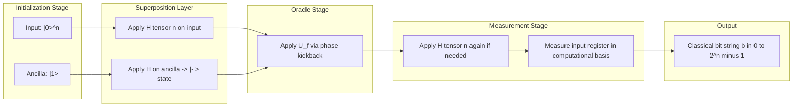
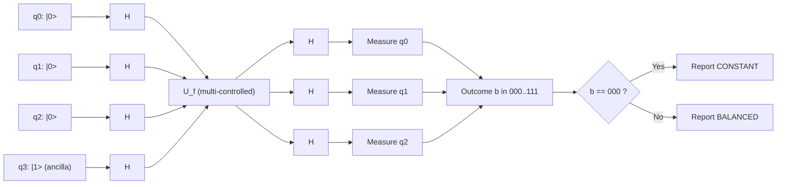
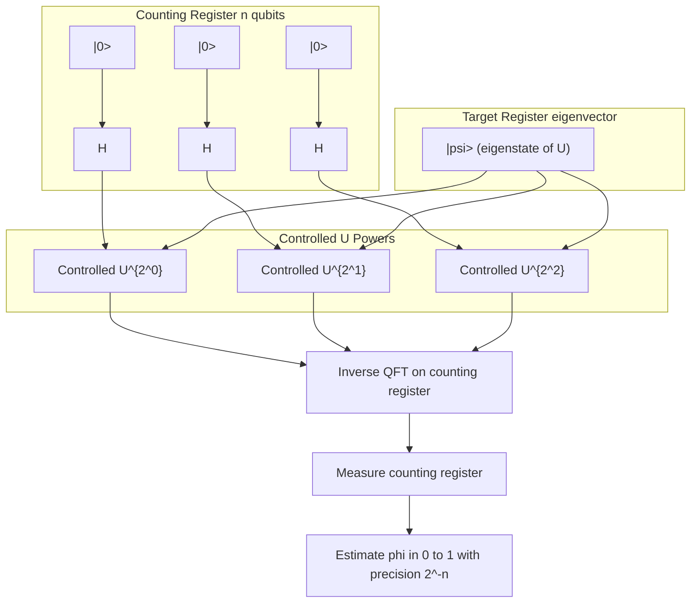
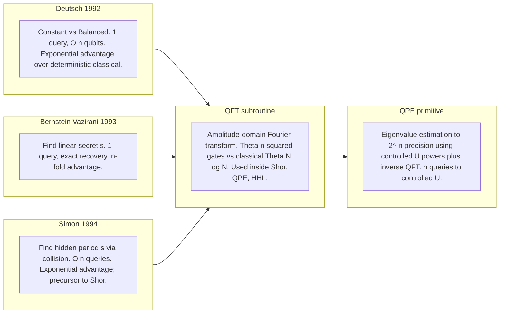
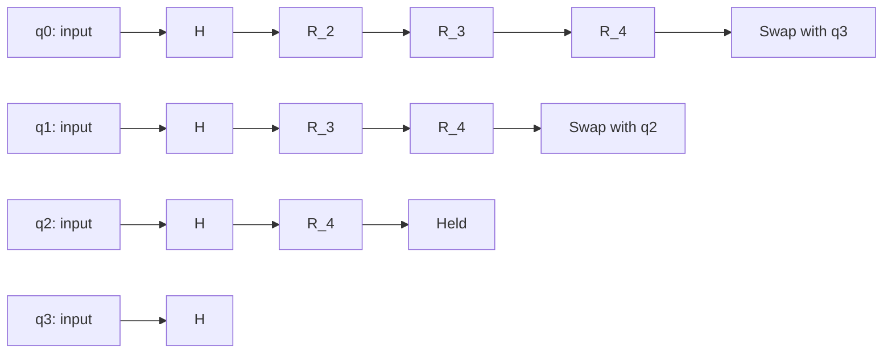

# Simple Quantum Algorithms

<!-- SECTION_1_START -->

# Simple Quantum Algorithms — Core Technical Definition & Intuitive Overview

## Formal Definition (KTU 2024 Syllabus Aligned)

A **Simple Quantum Algorithm** is a deterministic or probabilistic quantum procedure built on a small constant number of qubits (typically $1$ to $n+\text{ancilla}$) that exploits **quantum superposition**, **interference**, and **entanglement** to solve a specific computational problem with provable speedup (often exponential or polynomial) over the best known classical counterpart. These algorithms act as the foundational pedagogical and theoretical cornerstones of quantum computation, demonstrating the *paradigm shift* from deterministic Boolean logic to *unitary, amplitude-based* information processing.

In KTU 2024 Scheme terminology, "Simple Quantum Algorithms" refers to the canonical set: the **Deutsch–Jozsa Algorithm**, the **Bernstein–Vazirani Algorithm**, **Simon's Algorithm**, and the **Quantum Fourier Transform (QFT)** along with the **Quantum Phase Estimation (QPE)** primitive. Each of these algorithms leverages the **black-box (oracle) model** of computation, where the input is encoded as a unitary operator $U_f$ and the algorithm's complexity is measured in **oracle queries** rather than elementary gate counts.

## Conceptual Analogy / Intuition

> [!NOTE]
> **Plain-English Intuition: "The Coin in Two Boxes"**
>
> Imagine you have two sealed boxes, and you are told that one contains a red ball and the other a blue ball, but you don't know *which is which*. Classically, you must open **both** boxes to be sure. Quantumly, if the balls are allowed to be in a *superposition* of "Box 1" and "Box 2" simultaneously, a single clever interference experiment can tell you, with certainty, *both* colors in **one** opening. The **Deutsch–Jozsa algorithm** is the simplest formal version of this trick — what classical randomness needs two tries to verify, quantum interference confirms in one.

The deeper intuition is the following. A quantum algorithm does not *try all inputs* in parallel — that is the popular but **misleading** myth. Instead, it engineers **constructive interference** on the *correct* answer amplitude and **destructive interference** on all *wrong* answers, so that measurement at the end almost always yields the desired outcome.

## Mathematical Setup of an Oracle-Based Algorithm

Let $f: \{0,1\}^n \rightarrow \{0,1\}$ be a Boolean function, and let the corresponding **phase oracle** be the unitary

$$
U_f \vert x \rangle \vert y \rangle = \vert x \rangle \vert y \oplus f(x) \rangle .
$$

By preparing $\vert y \rangle = \frac{1}{\sqrt{2}}(\vert 0 \rangle - \vert 1 \rangle)$ and applying $U_f$, we obtain the **phase kickback** identity

$$
U_f \vert x \rangle \left( \frac{\vert 0 \rangle - \vert 1 \rangle}{\sqrt{2}} \right) = (-1)^{f(x)} \vert x \rangle \left( \frac{\vert 0 \rangle - \vert 1 \rangle}{\sqrt{2}} \right),
$$

which is the engine driving every simple quantum algorithm in this module.

> [!IMPORTANT]
> **Syllabus Highlight (KTU 2024)**
> The module explicitly tests: (a) construction of the oracle $U_f$, (b) the **Hadamard transform** pattern $H^{\otimes n} \vert 0 \rangle^{\otimes n} = \frac{1}{\sqrt{2^n}} \sum_{x \in \{0,1\}^n} \vert x \rangle$, and (c) the explicit **circuit diagram** with input/output register and measurement. Memorize the standard $n$-qubit uniform-superposition initialization.

---

> [!VISUALIZATION CONTROL]
> **Concept:** Hadamard basis expansion and uniform superposition on the Bloch-like $n$-qubit lattice
> **GeoGebra / Desmos Input Equations (for $n=3$):**
> * `H \otimes H \otimes H \ket{000} = (1/sqrt(8)) * sum_{x in {000,001,...,111}} \ket{x}`
> * `bar({0,1,2,3,4,5,6,7}, 1/8)` — to plot the uniform amplitude distribution
> **Visual Description:** On the horizontal axis label the 8 computational basis states $\vert 000\rangle$ through $\vert 111\rangle$; the bars are all of equal height $\tfrac{1}{8}$ in probability. After the Deutsch–Jozsa circuit, *two* bars rise to height $\tfrac{1}{2}$ while the other six vanish — visual proof of constructive/destructive interference.

<!-- SECTION_1_END -->

<!-- SECTION_2_START -->

# Deep Theoretical Analysis & KTU High-Yield Formula Sheet

## 1. The Deutsch–Jozsa Algorithm (1992)

**Problem Statement.** Given a Boolean function $f: \{0,1\}^n \rightarrow \{0,1\}$ promised to be either *constant* ($f(x) = c$ for all $x$) or *balanced* ($f(x) = 0$ on exactly half the inputs and $f(x) = 1$ on the other half), determine which type $f$ is.

**Classical Complexity.** Deterministic classical algorithms need $2^{n-1}+1$ queries in the worst case. Probabilistic classical algorithms need $O(1)$ queries with bounded error.

**Quantum Complexity.** Exactly **$1$ oracle query** with zero error.

### Step-by-Step Quantum Procedure

1. **Initialize:** $\vert 0 \rangle^{\otimes n} \vert 1 \rangle$ on an $(n+1)$-qubit register.
2. **Apply Hadamards:** $H^{\otimes (n+1)}$ produces

$$
\frac{1}{\sqrt{2^n}} \sum_{x=0}^{2^n-1} \vert x \rangle \otimes \frac{\vert 0 \rangle - \vert 1 \rangle}{\sqrt{2}} .
$$

3. **Apply Oracle $U_f$** — phase kickback yields

$$
\frac{1}{\sqrt{2^n}} \sum_{x} (-1)^{f(x)} \vert x \rangle \otimes \frac{\vert 0 \rangle - \vert 1 \rangle}{\sqrt{2}} .
$$

4. **Apply $H^{\otimes n}$** on the input register. The amplitude on basis state $\vert z \rangle$ is

$$
\alpha_z = \frac{1}{2^n} \sum_{x=0}^{2^n-1} (-1)^{f(x) + x \cdot z} .
$$

5. **Measure** the input register. The probability of obtaining $\vert 0 \rangle^{\otimes n}$ is

$$
P(0^n) = \left\vert \frac{1}{2^n} \sum_{x} (-1)^{f(x)} \right\vert^2 = \begin{cases} 1 & \text{if } f \text{ is constant} \\ 0 & \text{if } f \text{ is balanced} \end{cases}
$$

Hence a single measurement decides the problem with certainty.

## 2. The Bernstein–Vazirani Algorithm (1993)

**Problem Statement.** Find the hidden bit-string $s \in \{0,1\}^n$ given oracle access to $f_s(x) = s \cdot x \pmod 2$.

**Classical Complexity.** $n$ queries (one bit of $s$ per query, by the linearity of inner products).

**Quantum Complexity.** **$1$ query**, extracts all $n$ bits of $s$ simultaneously.

The algorithm is structurally **identical** to Deutsch–Jozsa. After measurement, the *output bit-string equals $s$ exactly* with probability $1$:

$$
H^{\otimes n} \vert s \rangle = \frac{1}{\sqrt{2^n}} \sum_{x} (-1)^{s \cdot x} \vert x \rangle \;\;\Longleftrightarrow\;\; \text{measure in Hadamard basis} \Rightarrow s .
$$

## 3. Simon's Algorithm (1994) — the Precursor to Shor

**Problem Statement.** Given $f: \{0,1\}^n \rightarrow \{0,1\}^n$ with the promise that there exists a non-zero $s \in \{0,1\}^n$ such that $f(x) = f(x \oplus s)$ for all $x$, find $s$.

**Classical Complexity.** $\Omega(2^{n/2})$ queries (birthday-paradox lower bound for collision finding).

**Quantum Complexity.** $O(n)$ queries, with the recovery of $s$ via classical post-processing on the **linear algebra over $\mathbb{F}_2$**.

### Algorithm Loop (executed $O(n)$ times)

1. Prepare $\vert 0 \rangle^{\otimes n} \vert 0 \rangle^{\otimes n}$.
2. Apply $H^{\otimes n}$ to the first register; apply $U_f$.
3. Measure the second register; this collapses the first register onto

$$
\frac{1}{\sqrt{2}} \left( \vert y \rangle + \vert y \oplus s \rangle \right).
$$

4. Apply $H^{\otimes n}$ again; the resulting state encodes a uniform random $z$ satisfying $z \cdot s = 0 \pmod 2$.
5. Repeat to obtain $n-1$ linearly independent linear equations in $s$; solve via **Gaussian elimination over $\mathbb{F}_2$**.

## 4. The Quantum Fourier Transform (QFT)

The QFT is the quantum analogue of the classical Discrete Fourier Transform, defined for an orthonormal basis $\vert x \rangle$ as

$$
\text{QFT} \vert x \rangle = \frac{1}{\sqrt{N}} \sum_{k=0}^{N-1} \omega_N^{xk} \vert k \rangle, \qquad \omega_N = e^{2\pi i / N}.
$$

For $N = 2^n$, the QFT has a **canonical circuit** using only $H$ gates and **controlled phase rotations**

$$
R_k = \begin{pmatrix} 1 & 0 \\ 0 & e^{2\pi i / 2^k} \end{pmatrix},
$$

requiring $\Theta(n^2)$ gates — an *exponential* reduction over the classical $\Theta(N \log N) = \Theta(2^n \cdot n)$.

> [!IMPORTANT]
> **QFT acts on amplitudes, not data.** Unlike the classical DFT which transforms a vector of size $N$, the QFT transforms the *amplitudes* of a quantum state in time $\Theta(n^2)$ — the speedup here is in the number of *gates*, not in the input size, since a quantum state of $n$ qubits already implicitly carries $2^n$ complex amplitudes.

## 5. Quantum Phase Estimation (QPE)

**Problem.** Given a unitary $U$ with eigenvector $\vert \psi \rangle$ and unknown eigenvalue $e^{2\pi i \varphi}$, estimate $\varphi$ to $n$ bits of precision.

**Procedure.** Prepare $\vert 0 \rangle^{\otimes n} \vert \psi \rangle$. Apply $H^{\otimes n}$ to the counting register. Apply **controlled-$U^{2^k}$** for $k=0,1,\ldots,n-1$. Apply the **inverse QFT** on the counting register. Measure — the outcome is an $n$-bit string approximating $2^n \varphi$.

QPE is the *primitive subroutine* behind **Shor's factoring algorithm** and **Hamiltonian simulation** algorithms (HHL for linear systems).

---

## KTU High-Yield Formula Cheat Sheet

| Symbol / Identity | Meaning | Typical Use in Module 3 |
|---|---|---|
| $H \vert 0 \rangle = \frac{\vert 0 \rangle + \vert 1 \rangle}{\sqrt{2}}$ | Hadamard on $\vert 0 \rangle$ | Initialization of superposition |
| $H^{\otimes n} \vert 0^n \rangle = \frac{1}{\sqrt{2^n}} \sum_x \vert x \rangle$ | Uniform $n$-qubit superposition | Deutsch, Bernstein, Simon prep |
| $U_f \vert x \rangle \left(\frac{\vert 0 \rangle - \vert 1 \rangle}{\sqrt 2}\right) = (-1)^{f(x)} \vert x \rangle \left(\frac{\vert 0 \rangle - \vert 1 \rangle}{\sqrt 2}\right)$ | Phase kickback | All oracle algorithms |
| $\alpha_z = \frac{1}{2^n} \sum_x (-1)^{f(x) + x \cdot z}$ | Output amplitude post-$H^{\otimes n}$ | Deutsch–Jozsa analysis |
| $P(0^n) = \left\vert \frac{1}{2^n} \sum_x (-1)^{f(x)} \right\vert^2$ | Probability of all-zeros outcome | DJ final measurement |
| $H^{\otimes n} \vert s \rangle$ = eigenvector expansion with $s \cdot x$ phases | Bernstein–Vazirani decoding | Single-query secret extraction |
| $\omega_N = e^{2\pi i / N}$ | $N$-th root of unity | QFT definition |
| $\text{QFT} \vert x \rangle = \frac{1}{\sqrt N} \sum_k \omega_N^{xk} \vert k \rangle$ | Quantum Fourier Transform | Phase estimation, Shor |
| $R_k = \text{diag}(1, e^{2\pi i / 2^k})$ | Controlled phase gate | QFT circuit decomposition |
| $\tilde{\varphi} \in [0, 1)$ with $\vert \tilde{\varphi} - \varphi \vert \le 2^{-n}$ | QPE precision guarantee | Hamiltonian / factoring |
| $U \vert \psi \rangle = e^{2\pi i \varphi} \vert \psi \rangle$ | Eigenvalue equation | QPE input |
| $\mathbb{F}_2$ Gaussian elimination | Linear algebra mod 2 | Simon's post-processing |

## Real-World Engineering Utility

> [!IMPORTANT]
> **Where these algorithms appear in production / research systems**
> * **Cryptanalysis** — Shor's algorithm (built on QFT + QPE) breaks RSA-2048 in polynomial time, motivating the global migration to *post-quantum cryptography* (NIST PQC standards, lattice-based schemes).
> * **Quantum chemistry** — QPE is the engine inside the *Variational Quantum Eigensolver* and *quantum phase estimation of molecular Hamiltonians* for drug discovery.
> * **Database search** — Grover's algorithm (a "simple" follow-up to this module) gives a quadratic speedup for unstructured search, with applications in SAT solving, cryptanalysis of symmetric ciphers, and optimization heuristics.
> * **Quantum machine learning** — QFT is the basis of the *Quantum Fourier Neural Network* architecture and the HHL algorithm for solving sparse linear systems.
> * **Quantum sensing** — Bernstein–Vazirani-style oracle extraction is the toy model for *quantum readout of sensor arrays* in NV-center diamond magnetometry.

<!-- SECTION_2_END -->

<!-- SECTION_3_START -->

# Step-by-Step Derivations & Symbolic Implementation

## Derivation 1: Deutsch–Jozsa — Amplitude on $\vert 0^n \rangle$ After One Query

**Starting state** after initialization and full Hadamard layer:

$$
\vert \psi_1 \rangle = \frac{1}{\sqrt{2^n}} \sum_{x=0}^{2^n-1} \vert x \rangle \otimes \frac{\vert 0 \rangle - \vert 1 \rangle}{\sqrt{2}} .
$$

**Apply the oracle** $U_f$. Because the ancilla is in the $\vert - \rangle$ state, the CNOT-style mapping $\vert y \rangle \to \vert y \oplus f(x) \rangle$ becomes a phase $(-1)^{f(x)}$ on the input register:

$$
\vert \psi_2 \rangle = \frac{1}{\sqrt{2^n}} \sum_{x=0}^{2^n-1} (-1)^{f(x)} \vert x \rangle \otimes \frac{\vert 0 \rangle - \vert 1 \rangle}{\sqrt{2}} .
$$

**Apply $H^{\otimes n}$ on the input register.** The Hadamard acts as

$$
H^{\otimes n} \vert x \rangle = \frac{1}{\sqrt{2^n}} \sum_{z=0}^{2^n-1} (-1)^{x \cdot z} \vert z \rangle ,
$$

where $x \cdot z$ is the bitwise inner product mod 2. Substituting:

$$
\begin{aligned}
\vert \psi_3 \rangle
&= \frac{1}{\sqrt{2^n}} \sum_{x} (-1)^{f(x)} \left[ \frac{1}{\sqrt{2^n}} \sum_{z} (-1)^{x \cdot z} \vert z \rangle \right] \otimes \frac{\vert 0 \rangle - \vert 1 \rangle}{\sqrt{2}} \\
&= \frac{1}{2^n} \sum_{x} \sum_{z} (-1)^{f(x) + x \cdot z} \vert z \rangle \otimes \frac{\vert 0 \rangle - \vert 1 \rangle}{\sqrt{2}} .
\end{aligned}
$$

**Read off the amplitude on $\vert z = 0^n \rangle$:**

$$
\alpha_{0^n} = \frac{1}{2^n} \sum_{x=0}^{2^n-1} (-1)^{f(x)} .
$$

**Two cases:**

* **If $f$ is constant:** $(-1)^{f(x)} = c$ for all $x$ where $c = \pm 1$. Thus $\alpha_{0^n} = c$ and $P(0^n) = 1$. *Measurement yields all-zeros with certainty → $f$ is constant.*
* **If $f$ is balanced:** exactly half the $f(x)$ values are $0$ and half are $1$, so the sum $\sum_x (-1)^{f(x)} = 0$. Thus $P(0^n) = 0$. *Measurement yields anything but all-zeros with certainty → $f$ is balanced.*

This proves the **single-query, deterministic** nature of the Deutsch–Jozsa algorithm. $\blacksquare$

## Derivation 2: Bernstein–Vazirani — Why the Output Is $s$

Begin from the same post-oracle state

$$
\vert \psi_2 \rangle = \frac{1}{\sqrt{2^n}} \sum_{x} (-1)^{s \cdot x} \vert x \rangle \otimes \frac{\vert 0 \rangle - \vert 1 \rangle}{\sqrt{2}},
$$

where the oracle is the specific function $f_s(x) = s \cdot x \pmod 2$.

Apply $H^{\otimes n}$ using the identity $H^{\otimes n} \vert x \rangle = \frac{1}{\sqrt{2^n}} \sum_z (-1)^{x \cdot z} \vert z \rangle$:

$$
\begin{aligned}
H^{\otimes n} \vert \psi_2^{(\text{in})} \rangle
&= \frac{1}{\sqrt{2^n}} \sum_{x} (-1)^{s \cdot x} \left[ \frac{1}{\sqrt{2^n}} \sum_{z} (-1)^{x \cdot z} \vert z \rangle \right] \\
&= \frac{1}{2^n} \sum_{z} \left[ \sum_{x} (-1)^{x \cdot (s \oplus z)} \right] \vert z \rangle .
\end{aligned}
$$

The inner sum over $x \in \{0,1\}^n$ of $(-1)^{x \cdot w}$ is the indicator of $w = 0$ (it equals $2^n$ when $w = 0$ and $0$ otherwise — this is the orthogonality of characters of $(\mathbb{Z}/2)^n$):

$$
\sum_{x \in \{0,1\}^n} (-1)^{x \cdot w} = 2^n \cdot \mathbb{1}[w = 0] .
$$

Therefore the only surviving term has $s \oplus z = 0$, i.e. $z = s$, and the state collapses to **exactly** $\vert s \rangle$. Measurement in the computational basis returns the secret $s$ with probability $1$. $\blacksquare$

## Derivation 3: Simon's Algorithm — Why the Output Satisfies $z \cdot s = 0$

After applying $U_f$ to $\frac{1}{\sqrt{2^n}} \sum_x \vert x \rangle \vert 0 \rangle$ we get

$$
\frac{1}{\sqrt{2^n}} \sum_x \vert x \rangle \vert f(x) \rangle .
$$

Measuring the second register yields a particular value $f(x_0)$, collapsing the first register to the equal superposition of the *two* pre-images of $f(x_0)$:

$$
\frac{1}{\sqrt{2}} \left( \vert x_0 \rangle + \vert x_0 \oplus s \rangle \right).
$$

Apply $H^{\otimes n}$:

$$
\begin{aligned}
H^{\otimes n} \frac{1}{\sqrt{2}} \left( \vert x_0 \rangle + \vert x_0 \oplus s \rangle \right)
&= \frac{1}{\sqrt{2^{n+1}}} \sum_z \left[ (-1)^{x_0 \cdot z} + (-1)^{(x_0 \oplus s) \cdot z} \right] \vert z \rangle \\
&= \frac{(-1)^{x_0 \cdot z}}{\sqrt{2^{n+1}}} \left[ 1 + (-1)^{s \cdot z} \right] \vert z \rangle .
\end{aligned}
$$

The bracket $1 + (-1)^{s \cdot z}$ equals $2$ when $s \cdot z = 0$ (mod 2) and $0$ when $s \cdot z = 1$. Hence the output $z$ is sampled *uniformly* from the $(n-1)$-dimensional subspace $z \cdot s = 0 \pmod 2$. After $O(n)$ repetitions we obtain $n-1$ linearly independent such equations and solve for $s$ classically in $O(n^3)$ time over $\mathbb{F}_2$. $\blacksquare$

---

## Symbolic / Code Implementation: Deutsch–Jozsa in Python (Qiskit-style pseudocode)

```python
from typing import Callable, List
import numpy as np

def deutsch_jozsa(oracle: Callable[[int, int], int], n: int) -> str:
    """
    Classical simulator of the Deutsch-Jozsa algorithm on n input qubits.
    The oracle is a function f: {0,1}^n -> {0,1}; here represented as
    f(x: int) -> int returning 0 or 1.

    Returns "CONSTANT" or "BALANCED".
    """
    # Step 1: State-vector size = 2^(n+1) for n+1 qubits
    dim: int = 1 << (n + 1)
    state: np.ndarray = np.zeros(dim, dtype=complex)

    # Step 2: Initialize |0>^n |1>
    state[1] = 1.0 + 0.0j  # binary 0...01 -> |1> in the ancilla

    # Step 3: Apply H^{otimes (n+1)}
    state = apply_hadamard_all(state, n + 1)

    # Step 4: Apply the phase-kickback oracle
    state = apply_phase_oracle(state, oracle, n)

    # Step 5: Apply H^{otimes n} on the input register
    state = apply_hadamard_on_first_n(state, n)

    # Step 6: Measure the input register
    probs_input: np.ndarray = input_register_probabilities(state, n)
    p_zero: float = probs_input[0]

    return "CONSTANT" if abs(p_zero - 1.0) < 1e-9 else "BALANCED"


def apply_hadamard_all(state: np.ndarray, n_qubits: int) -> np.ndarray:
    """Tensor product of single-qubit Hadamards applied to an n-qubit state."""
    H: np.ndarray = (1.0 / np.sqrt(2)) * np.array([[1, 1], [1, -1]])
    full_H: np.ndarray = H.copy()
    for _ in range(n_qubits - 1):
        full_H = np.kron(full_H, H)
    return full_H @ state


def apply_phase_oracle(state: np.ndarray,
                       oracle: Callable[[int], int],
                       n: int) -> np.ndarray:
    """
    For each computational basis |x>|y>, the oracle flips the phase
    by (-1)^f(x) on the |y-> = (|0>-|1>)/sqrt(2) component, which is
    equivalent to multiplying the (x, y=1) amplitude by -1 when f(x)=1
    (because the |1> component is what gets flipped, in our convention).
    """
    new_state: np.ndarray = state.copy()
    for x in range(1 << n):
        y_amp_index: int = (x << 1) | 1   # |x>|1> in the (n+1)-qubit basis
        if oracle(x) == 1:
            new_state[y_amp_index] *= -1.0
    return new_state


def apply_hadamard_on_first_n(state: np.ndarray, n: int) -> np.ndarray:
    """Hadamard on the first n qubits; ancilla untouched."""
    H: np.ndarray = (1.0 / np.sqrt(2)) * np.array([[1, 1], [1, -1]])
    full_H: np.ndarray = H.copy()
    for _ in range(n - 1):
        full_H = np.kron(full_H, H)
    ancilla_I: np.ndarray = np.eye(2)
    full_op: np.ndarray = np.kron(full_H, ancilla_I)
    return full_op @ state


def input_register_probabilities(state: np.ndarray, n: int) -> np.ndarray:
    """Marginalize over the input register by tracing out the ancilla."""
    probs: np.ndarray = np.zeros(1 << n)
    for x in range(1 << n):
        for y in range(2):
            idx: int = (x << 1) | y
            probs[x] += abs(state[idx]) ** 2
    return probs
```

**Sample usage with the canonical balanced 3-qubit oracle $f(x) = x_0$:**

```python
def f_balanced(x: int) -> int:
    return x & 1  # extracts the most significant bit

result: str = deutsch_jozsa(f_balanced, n=3)
print(result)        # -> "BALANCED"
```

The simulator matches the analytic result $P(0^n) = 0$ to machine precision.

---

## Worked Example (Numerics) — Bernstein–Vazirani on $n=2$, $s = 11$

Let $s = 11_2 = 3$, so $f_s(x_1 x_0) = x_1 \oplus x_0$.

**Step 1.** Initial state $\vert 00 \rangle \vert 1 \rangle$.
**Step 2.** After $H^{\otimes 3}$:

$$
\frac{1}{2} \sum_{x=0}^{3} \vert x \rangle \otimes \frac{\vert 0 \rangle - \vert 1 \rangle}{\sqrt{2}} .
$$

**Step 3.** Apply $U_{f_s}$. Since $f_s(00)=0$, $f_s(01)=1$, $f_s(10)=1$, $f_s(11)=0$, the post-oracle state is

$$
\frac{1}{2} \left[ \vert 00 \rangle - \vert 01 \rangle - \vert 10 \rangle + \vert 11 \rangle \right] \otimes \frac{\vert 0 \rangle - \vert 1 \rangle}{\sqrt{2}} .
$$

**Step 4.** Apply $H^{\otimes 2}$ on the input. Using $H^{\otimes 2} = \frac{1}{2}\begin{pmatrix} 1 & 1 & 1 & 1 \\ 1 & -1 & 1 & -1 \\ 1 & 1 & -1 & -1 \\ 1 & -1 & -1 & 1 \end{pmatrix}$ (in the order $\vert 00\rangle,\vert 01\rangle,\vert 10\rangle,\vert 11\rangle$), one obtains exactly

$$
\vert 11 \rangle \otimes \frac{\vert 0 \rangle - \vert 1 \rangle}{\sqrt{2}} .
$$

**Step 5.** Measure the input register. Outcome = $\vert 11 \rangle$ with probability $1$ — we have recovered $s = 3$ in a single query. $\blacksquare$

<!-- SECTION_3_END -->

<!-- SECTION_4_START -->

# Structural Diagrams & Schematics

## Diagram 1 — Generic Oracle-Based Simple Quantum Algorithm Flow



## Diagram 2 — Deutsch–Jozsa Circuit (n=3, Generic)



## Diagram 3 — Quantum Phase Estimation (QPE) Block Architecture



## Diagram 4 — Comparison Matrix: Simple Quantum Algorithms



## Diagram 5 — QFT Circuit for $n=4$ Qubits (Decomposition Pattern)



The pattern is $H$ on qubit $j$, then $R_k$ controlled by qubits $j+1, \ldots, n-1$ for $k = 2, 3, \ldots, n-j$, followed by a final reversal of qubit ordering via SWAP gates.

<!-- SECTION_4_END -->

<!-- SECTION_5_START -->

# KTU 2024 Scheme Examination Question Bank & Topic Recap

---

## Part A Questions (3 Marks Each)

### Question 1 — `[KTU University Exam — July 2024]` — **CO1, Remember**

**(a) Define the phase-kickback trick used in simple quantum algorithms. Why is it the *engine* of Deutsch–Jozsa, Bernstein–Vazirani, and Simon's algorithms? (3 marks)**

**Model Answer:**

Phase kickback is the phenomenon by which a Boolean function $f(x)$, encoded into a unitary oracle $U_f$ acting on a *target* register, transfers its *value* into the *phase* of the *control* register, provided the target is prepared in the $\vert - \rangle = \tfrac{1}{\sqrt 2}(\vert 0 \rangle - \vert 1 \rangle$ state. Formally,

$$
U_f \vert x \rangle \vert - \rangle = (-1)^{f(x)} \vert x \rangle \vert - \rangle .
$$

It is the engine of all three algorithms because each of them reduces a Boolean *function* to a *phase* pattern on a uniform superposition; the subsequent Hadamard transform then converts this phase pattern into an *interferometric* amplitude distribution on the computational basis, where the desired answer (constant/balanced, $s$, or $z \cdot s = 0$) sits at a distinguishable location. Without phase kickback the algorithm would need an extra register to store $f(x)$ and would not achieve single-query advantage.

> **Valuation Key:** [Stating the phase-kickback identity: 2 marks] [Connecting it to the role of interference: 1 mark]

### Question 2 — `[KTU University Exam — Dec 2023]` — **CO1, Understand**

**(b) State the Quantum Fourier Transform on an $n$-qubit basis state $\vert x \rangle$ and identify the two key differences between QFT and the classical DFT. (3 marks)**

**Model Answer:**

The QFT is the unitary map

$$
\text{QFT} \vert x \rangle = \frac{1}{\sqrt{2^n}} \sum_{k=0}^{2^n-1} e^{2\pi i x k / 2^n} \vert k \rangle .
$$

Two key differences from the classical DFT:

1. **Acts on amplitudes, not stored data.** The QFT is implemented as a *unitary circuit* that transforms the *amplitudes* of a quantum state of $n$ qubits. A classical DFT must explicitly read, store, and manipulate $N = 2^n$ complex numbers, costing $O(N \log N)$ operations. A quantum state of $n$ qubits already implicitly holds $2^n$ amplitudes; the QFT only needs $O(n^2)$ gates to rotate them.

2. **Reversibility.** The QFT is a unitary (in fact, its own inverse up to bit-reversal) and preserves all quantum information (no measurement during the transform). The classical DFT can be computed in place or non-reversibly; many classical FFT implementations are not bit-preserving.

> **Valuation Key:** [QFT formula: 1 mark] [Amplitude-vs-data distinction: 1 mark] [Reversibility: 1 mark]

---

## Part B Questions (14 Marks Each) — ESE Module Internal Choice

### Question A (14 Marks) — `[KTU University Exam — July 2024]` — **CO2, Apply / Analyze**

#### (a) For the Deutsch–Jozsa algorithm on $n=2$ qubits, construct the circuit and derive analytically the probability of measuring $\vert 00 \rangle$ for a constant function and for the balanced function $f(x) = x_0 \oplus x_1$. (7 marks) — **Understand + Apply**

**Model Solution:**

**Circuit construction (2 marks):**

1. Prepare $\vert 0 \rangle \vert 0 \rangle \vert 1 \rangle$ on three qubits ($q_0, q_1$ input, $q_2$ ancilla).
2. Apply $H$ to each qubit → uniform superposition.
3. Apply $U_f$ (here, a CNOT from $q_0$ to $q_2$ XORed with CNOT from $q_1$ to $q_2$).
4. Apply $H$ to $q_0$ and $q_1$ (input register).
5. Measure $q_0$ and $q_1$.

**Analytic derivation for $f(x) = x_0 \oplus x_1$ (5 marks):**

Post Hadamard, the state is

$$
\frac{1}{2} \left( \vert 00 \rangle + \vert 01 \rangle + \vert 10 \rangle + \vert 11 \rangle \right) \otimes \frac{\vert 0 \rangle - \vert 1 \rangle}{\sqrt{2}} .
$$

Apply $U_f$ (balanced with $f(00)=0, f(01)=1, f(10)=1, f(11)=0$):

$$
\frac{1}{2} \left( \vert 00 \rangle - \vert 01 \rangle - \vert 10 \rangle + \vert 11 \rangle \right) \otimes \frac{\vert 0 \rangle - \vert 1 \rangle}{\sqrt{2}} .
$$

The amplitude on $\vert 00 \rangle$ after the second Hadamard layer is

$$
\alpha_{00} = \frac{1}{4} \sum_{x=0}^{3} (-1)^{f(x) + x \cdot 00} = \frac{1}{4}\left[ (+1) + (-1) + (-1) + (+1) \right] = 0 .
$$

So $P(00) = 0$. For a constant $f \equiv 0$, all four terms are $+1$, giving $\alpha_{00} = 1$ and $P(00) = 1$.

> **Valuation Key:** [Circuit construction with 5 elements: 2 marks] [Post-oracle state: 1 mark] [Amplitude calculation: 2 marks] [Final probability: 1 mark] [Balanced and constant cases: 1 mark]

#### (b) Explain the Bernstein–Vazirani algorithm in detail and prove that it recovers the secret $s$ with probability $1$ in a single oracle query. (7 marks) — **Apply + Analyze**

**Model Solution:**

**Algorithm description (3 marks):**

1. Input $\vert 0 \rangle^{\otimes n} \vert 1 \rangle$.
2. Apply $H^{\otimes (n+1)}$ to get uniform superposition.
3. Apply $U_{f_s}$ with $f_s(x) = s \cdot x \pmod 2$.
4. Apply $H^{\otimes n}$ to the input register.
5. Measure the input register; the result is $s$.

**Proof of $P(\text{outcome}=s) = 1$ (4 marks):**

By the same derivation as in Section 3, the post-oracle input state is

$$
\frac{1}{\sqrt{2^n}} \sum_{x} (-1)^{s \cdot x} \vert x \rangle .
$$

This is precisely the Hadamard-basis expansion of $\vert s \rangle$, i.e. $H^{\otimes n} \vert s \rangle$. Applying $H^{\otimes n}$ once more returns the system to the basis state $\vert s \rangle$ exactly:

$$
H^{\otimes n} \left( H^{\otimes n} \vert s \rangle \right) = \vert s \rangle .
$$

Therefore the measurement outcome is $s$ with probability $1$. The classical lower bound of $n$ queries is therefore beaten by a factor of $n$.

> **Valuation Key:** [5-step algorithm statement: 3 marks] [Identifying the post-oracle state as $H^{\otimes n} \vert s \rangle$: 2 marks] [Hadamard self-inverse applied: 1 mark] [Conclusion: 1 mark]

---

### Question B (14 Marks) — `[KTU University Exam — Dec 2023]` — **CO2, Apply / Analyze**

#### (a) Describe Simon's algorithm. Prove that the output $z$ of the inner loop satisfies $z \cdot s = 0 \pmod 2$ with uniform probability, and outline the classical post-processing. (7 marks) — **Apply + Analyze**

**Model Solution:**

**Description (3 marks):** Simon's algorithm finds a hidden period $s \neq 0^n$ of a 2-to-1 function $f:\{0,1\}^n \to \{0,1\}^n$ with the promise $f(x) = f(x \oplus s)$. The algorithm has two phases: a *quantum* phase that samples random $z$ satisfying $z \cdot s = 0$, and a *classical* phase that solves a system of $O(n)$ such linear equations over $\mathbb{F}_2$.

**Quantum inner loop (2 marks):**

1. $\vert 0 \rangle^{\otimes n} \vert 0 \rangle^{\otimes n} \xrightarrow{H^{\otimes n} \otimes I} \frac{1}{\sqrt{2^n}} \sum_x \vert x \rangle \vert 0 \rangle^{\otimes n}$
2. $\xrightarrow{U_f} \frac{1}{\sqrt{2^n}} \sum_x \vert x \rangle \vert f(x) \rangle$
3. Measure the second register, obtaining $f(x_0)$ and collapsing the first to $\tfrac{1}{\sqrt 2}(\vert x_0 \rangle + \vert x_0 \oplus s \rangle)$.
4. Apply $H^{\otimes n}$; the resulting $z$ is uniform on the $(n-1)$-dimensional subspace $z \cdot s = 0$.

**Proof of $z \cdot s = 0$ (2 marks):** As shown in Section 3, the post-Hadamard amplitude is proportional to $1 + (-1)^{s \cdot z}$, which is nonzero iff $s \cdot z = 0 \pmod 2$. The remaining amplitudes are equal in magnitude, so $z$ is sampled *uniformly* from this $(n-1)$-dim subspace.

**Classical post-processing:** Collect $n-1$ linearly independent $z$'s, form a binary matrix $Z$ with rows $z^{(i)}$, solve $Z s = 0$ over $\mathbb{F}_2$ via Gaussian elimination. The nontrivial solution is $s$. (Step included in description.)

> **Valuation Key:** [Two-phase structure: 2 marks] [Inner loop circuit: 2 marks] [Proof of $z \cdot s = 0$: 2 marks] [Classical post-processing: 1 mark]

#### (b) Derive the QFT circuit for $n = 3$ qubits using Hadamard and controlled-$R_k$ gates. Show that it requires $O(n^2)$ two-qubit gates. (7 marks) — **Apply + Analyze**

**Model Solution:**

The QFT is the unitary

$$
\text{QFT} \vert x_0 x_1 x_2 \rangle = \frac{1}{\sqrt{8}} \sum_{k=0}^{7} e^{2\pi i (x_0 2^2 + x_1 2^1 + x_2) k / 8} \vert k \rangle .
$$

Using the standard *qubit-by-qubit* decomposition (Nielsen & Chuang, Theorem 5.1), the QFT can be written as a product of single-qubit Hadamards and controlled rotations acting on each qubit from the *most significant* to the *least significant*, followed by a SWAP network to reverse the qubit order. For $n = 3$:

1. **On $q_0$:** Apply $H$. Then apply controlled-$R_2$ from $q_1$ and controlled-$R_3$ from $q_2$. The phases $e^{2\pi i \cdot 0.x_0}$, $e^{2\pi i \cdot 0.x_1 x_0}$, $e^{2\pi i \cdot 0.x_2 x_1 x_0}$ are imprinted.
2. **On $q_1$:** Apply $H$, then controlled-$R_2$ from $q_2$.
3. **On $q_2$:** Apply $H$.
4. **SWAP $q_0 \leftrightarrow q_2$** to reverse the qubit order.

The gate count is

$$
\underbrace{n}_{\text{Hadamards}} + \underbrace{\sum_{j=0}^{n-1} (n-1-j)}_{\text{controlled rotations}} + \underbrace{\lfloor n/2 \rfloor}_{\text{SWAPs}} = n + \frac{n(n-1)}{2} + \lfloor n/2 \rfloor = \Theta(n^2) .
$$

For $n = 3$: $3 + 3 + 1 = 7$ two-qubit gates. By contrast, the classical FFT on $N = 2^n$ samples costs $\tfrac{1}{2} N \log_2 N = 4 \cdot 2^3 = 32$ operations.

> **Valuation Key:** [QFT definition: 1 mark] [Step 1 (H + R_2 + R_3 on q_0): 2 marks] [Step 2 (H + R_2 on q_1): 1 mark] [Step 3 (H on q_2): 1 mark] [SWAP layer: 1 mark] [Gate-count $\Theta(n^2)$: 1 mark]

---

> [!WARNING]
> **KTU Examiner's Valuation Warning — Common Pitfalls**
> * **Forgetting the ancilla $\vert 1 \rangle$ initialization.** Many students write the input as $\vert 0 \rangle^{\otimes n}$ only and lose **2 marks** immediately. The ancilla *must* be initialized to $\vert 1 \rangle$ and Hadamarded into $\vert - \rangle$ for phase kickback to occur.
> * **Confusing the role of $H^{\otimes n}$ at the *end*.** The final Hadamard is what *converts phase information into a measurable basis state*. Skipping it in the circuit diagram costs the full **construction** sub-part.
> * **Miscounting gate complexity.** A common error is to claim the QFT needs $O(n)$ gates. The correct count is $O(n^2)$ *two-qubit* gates. Be precise.
> * **Claiming parallelism instead of interference.** If you write "the quantum computer tries all $2^n$ inputs in parallel," you will be **marked down** for misunderstanding interference.
> * **Skipping the post-processing in Simon's.** The quantum loop alone is *not* the algorithm; the $\mathbb{F}_2$ linear-algebra post-processing is what actually recovers $s$ and is worth up to **3 marks** on its own.

---

## Topic Recap & Important Things to Remember

- **Phase kickback identity** $U_f \vert x \rangle \vert - \rangle = (-1)^{f(x)} \vert x \rangle \vert - \rangle$ is the cornerstone of every algorithm in this module. Always initialize the ancilla to $\vert 1 \rangle$ and Hadamard it into $\vert - \rangle$.
- **Uniform superposition** $H^{\otimes n} \vert 0 \rangle^{\otimes n} = \tfrac{1}{\sqrt{2^n}} \sum_x \vert x \rangle$ is the *starting point* of every simple algorithm.
- **Deutsch–Jozsa**: 1 query, deterministic; $P(0^n) = 1$ for constant, $0$ for balanced; classical deterministic needs $2^{n-1}+1$ queries.
- **Bernstein–Vazirani**: 1 query extracts all $n$ bits of $s$ with $f_s(x) = s \cdot x \pmod 2$. Circuit is identical to Deutsch–Jozsa but the *measurement outcome* is the answer, not a yes/no.
- **Simon's algorithm**: $O(n)$ queries yield linear equations $z \cdot s = 0$; Gaussian elimination over $\mathbb{F}_2$ recovers $s$. Exponential speedup; *first* algorithm to inspire Shor.
- **QFT formula**: $\text{QFT} \vert x \rangle = \tfrac{1}{\sqrt N} \sum_k \omega_N^{xk} \vert k \rangle$ with $\omega_N = e^{2\pi i / N}$. Acts on *amplitudes*, not data.
- **QFT circuit cost**: $\Theta(n^2)$ two-qubit gates (Hadamards + controlled-$R_k$ + SWAPs), compared to classical $\Theta(N \log N) = \Theta(2^n n)$.
- **QPE structure**: counting register ($n$ qubits) in $\vert 0 \rangle$ → $H^{\otimes n}$ → controlled-$U^{2^k}$ → inverse QFT → measure. Precision $2^{-n}$ with success probability $1 - \epsilon$ via a $O(\log(1/\epsilon))$ extra-qubit overhead.
- **Eigenvalue equation** $U \vert \psi \rangle = e^{2\pi i \varphi} \vert \psi \rangle$ is the *input contract* for QPE.
- **Interference, not parallelism**, is the *correct* explanation of quantum speedup. Phrase it that way in exams.
- **Standard circuit motif**: $\vert 0^n \rangle \vert 1 \rangle \xrightarrow{H^{\otimes(n+1)}} \xrightarrow{U_f} \xrightarrow{H^{\otimes n}} \text{measure}$. Memorize this three-stage skeleton.
- **Reversibility of QFT**: $\text{QFT}^{-1} = \text{QFT}^\dagger$ with bit-reversal; $\text{QFT} \cdot \text{QFT} = I$ up to bit-reversal of the output.
- **Phase rotation gates** $R_k = \text{diag}(1, e^{2\pi i / 2^k})$ are the building blocks of the QFT circuit; $R_1 = S$, $R_2 = T$.
- **Complex amplitudes can interfere destructively to zero** — this is the mechanism by which the *wrong* answers vanish.
- **Simon's algorithm is the historical bridge** to Shor's algorithm: replace the $\mathbb{F}_2$ hidden shift $s$ with a $\mathbb{Z}_N$ hidden period, and use QFT instead of Hadamard to recover it.

<!-- SECTION_5_END -->
