# Data compression

<!-- SECTION_1_START -->

# Quantum Data Compression — An Introduction

## 1.1 Formal Definition (KTU 2024 Syllabus Terminology)

**Quantum Data Compression** (also called **Schumacher's Quantum Noiseless Coding**) is the process by which a sequence of identically prepared quantum states, drawn from a source described by a density operator $\rho$, is encoded into a smaller number of qubits such that the original quantum information can be faithfully recovered (with high fidelity) at the receiver's end.

> [!IMPORTANT]
> **Schumacher's Theorem (1995):** *$n$* identical copies of a quantum source described by a density matrix $\rho$ can be compressed into approximately **$n\,S(\rho)$ qubits**, where $S(\rho)$ is the **von Neumann entropy** of the source. Conversely, $\approx n\,S(\rho)$ qubits are *necessary* for faithful compression. This is the quantum mechanical analog of Shannon's classical noiseless coding theorem.

### Mathematical Statement of Schumacher's Theorem

For a quantum source with density operator $\rho$ and entropy $S(\rho)$, given $n$ identically and independently distributed (i.i.d.) copies of the source, there exists an encoding scheme using **$n\,S(\rho)$ qubits** and a decoding scheme such that the fidelity $F$ between the input and output states satisfies:

$$F \;\geq\; 1 - 12\,\epsilon$$

provided the encoding uses a Hilbert space of dimension $2^{n\,S(\rho)}$. The total number of qubits used is bounded as:

$$n\bigl(S(\rho) - \epsilon\bigr) \;\leq\; \text{qubits used} \;\leq\; n\bigl(S(\rho) + \epsilon\bigr)$$

---

## 1.2 Conceptual Analogy — "The Quantum Suitcase"

> [!NOTE]
> **Intuitive Picture (Plain English):**
> Imagine packing a suitcase for a long trip. You own **many shirts but only a few are your favourites** (high-probability items) and the rest are rarely worn (low-probability items). A smart packer rolls the favourites compactly and leaves the rare items behind — the suitcase faithfully represents your *core* wardrobe.
>
> Similarly, in **quantum data compression**, the source emits a *mixture* of pure quantum states $\{\,p_i,\, \vert\psi_i\rangle\,\}$. Some pure states appear *more often* (eigenvectors of $\rho$ with **large eigenvalues**), while others are *exotic* (eigenvectors with **small eigenvalues**). Schumacher's trick is to keep only the **high-probability typical subspace** and discard the rest. The "size" of this subspace is governed by $S(\rho)$, which acts as the *quantum information content* per copy.

### Why von Neumann Entropy, not Shannon Entropy?

| Classical Source | Quantum Source |
| :--- | :--- |
| Alphabet $\mathcal{X} = \{x_1, \dots, x_n\}$ with probabilities $p_i$ | Density operator $\rho = \sum_i \lambda_i \vert i\rangle\langle i \vert$ with eigenvalues $\lambda_i$ |
| Information content measured by **Shannon entropy** $H(X)$ | Information content measured by **von Neumann entropy** $S(\rho)$ |
| Compression length $\approx n\,H(X)$ bits | Compression length $\approx n\,S(\rho)$ qubits |

The two entropies are, in fact, *mathematically identical in form* — the von Neumann entropy **reduces to** the Shannon entropy whenever $\rho$ is a *diagonal* density matrix in some basis (i.e., a classical probability distribution).

$$S(\rho) \;=\; -\,\mathrm{Tr}(\rho \log \rho) \;=\; -\sum_i \lambda_i \log \lambda_i$$

> [!VISUALIZATION CONTROL]
> **Concept:** Von Neumann entropy as a function of mixing parameter $\lambda$ for a single-qubit mixed state.
>
> **GeoGebra / Desmos Input Equations:**
> * `f(lambda) = -lambda * log(lambda, 2) - (1 - lambda) * log(1 - lambda, 2)`
> * Domain: `0 <= lambda <= 1`
>
> **Visual Description:** A symmetric, bell-shaped curve that peaks at $\lambda = 0.5$ (maximally mixed state) with a maximum value of $S = 1$ bit, and falls to $0$ at the pure-state limits $\lambda = 0$ and $\lambda = 1$. This is the *same shape* as the classical binary entropy function — emphasising the bridge between classical and quantum information theory.

---

<!-- SECTION_1_END -->

<!-- SECTION_2_START -->

# Deep Theoretical Analysis & KTU Formula Sheet

## 2.1 Theoretical Framework

### Step 1 — Recall Classical Shannon Noiseless Coding

For a classical i.i.d. source emitting symbols from a distribution $\{p_i\}$, Shannon's theorem guarantees that $\approx n\,H(X)$ bits suffice to represent $n$ source symbols with vanishing error probability as $n \to \infty$. The central idea is the **Asymptotic Equipartition Property (AEP)** — most sequences of length $n$ lie in a *typical set* of size $\approx 2^{n\,H(X)}$.

### Step 2 — Extend to the Quantum Domain

The quantum source produces a *tensor product* of $n$ copies of $\rho$:

$$\rho^{\otimes n} \;=\; \underbrace{\rho \otimes \rho \otimes \cdots \otimes \rho}_{n\ \text{times}}$$

Schumacher's genius was to recognise that an AEP-like property holds in the **eigen-decomposition of $\rho^{\otimes n}$**, giving rise to the **typical subspace** $\Lambda_{\epsilon}^{n}$.

### Step 3 — The Typical Projector

For a state $\rho$ with eigenvalues $\{\lambda_1, \dots, \lambda_d\}$ and eigenbasis $\{\vert i\rangle\}$, consider the eigenvectors of $\rho^{\otimes n}$ labelled by sequences $\mathbf{i} = (i_1, i_2, \dots, i_n)$. Each such eigenvector has eigenvalue $\lambda_{\mathbf{i}} = \lambda_{i_1} \lambda_{i_2} \cdots \lambda_{i_n}$.

> [!NOTE]
> **Typical Subspace Definition:**
> A vector $\vert \mathbf{i}\rangle$ is **$\epsilon$-typical** if its eigenvalue satisfies:
> $$2^{-n(S(\rho) + \epsilon)} \;\leq\; \lambda_{\mathbf{i}} \;\leq\; 2^{-n(S(\rho) - \epsilon)}$$
> Equivalently, taking $-\log_2$ of the eigenvalue:
> $$n\bigl(S(\rho) - \epsilon\bigr) \;\leq\; -\log_2 \lambda_{\mathbf{i}} \;\leq\; n\bigl(S(\rho) + \epsilon\bigr)$$

The **typical projector** is the sum of projectors onto all $\epsilon$-typical subspaces:

$$\Pi_{\epsilon}^{n} \;=\; \sum_{\mathbf{i}\ \text{typical}} \vert \mathbf{i}\rangle\langle \mathbf{i}\vert$$

### Step 4 — Dimension of the Typical Subspace

The dimension (number of typical eigenvectors) is bounded by:

$$\dim\bigl(\Pi_{\epsilon}^{n}\bigr) \;\leq\; 2^{n\,(S(\rho) + \epsilon)}$$

and the *trace* of $\rho^{\otimes n}$ restricted to the typical subspace is:

$$\mathrm{Tr}\!\left(\rho^{\otimes n}\, \Pi_{\epsilon}^{n}\right) \;\geq\; 1 - \epsilon \quad \text{for large } n$$

This last result is the **Quantum Asymptotic Equipartition Property (QAEP)** and is the workhorse behind the proof of Schumacher's theorem.

### Step 5 — Encoding & Decoding (The Compression Map)

The encoding is an isometry (quantum operation) $E: \mathcal{H}_{\text{in}} \to \mathcal{H}_{\text{out}}$ that maps the full Hilbert space of $n$ qubits (dimension $2^n$) into a smaller space of dimension $\approx 2^{n\,S(\rho)}$ qubits. The decoding map $D$ then inverts this isometry. Together, $D \circ E$ acts nearly as the identity on states in the typical subspace.

---

## 2.2 KTU High-Yield Formula Sheet

| **Quantity** | **Formula / Definition** | **Units** | **Remarks** |
| :--- | :--- | :--- | :--- |
| Von Neumann Entropy | $S(\rho) = -\mathrm{Tr}(\rho \log_2 \rho) = -\sum_i \lambda_i \log_2 \lambda_i$ | bits (for $\log_2$) or nats (for $\ln$) | Quantum analog of Shannon entropy |
| Shannon Entropy | $H(X) = -\sum_i p_i \log_2 p_i$ | bits | Classical case: $\rho$ is diagonal |
| Source State ($n$ copies) | $\rho^{\otimes n}$ | — | i.i.d. quantum source assumption |
| Typical Eigenvalue Bounds | $2^{-n(S(\rho) + \epsilon)} \leq \lambda_{\mathbf{i}} \leq 2^{-n(S(\rho) - \epsilon)}$ | dimensionless | Definition of $\epsilon$-typical |
| Typical Subspace Dimension | $\dim(\Pi_{\epsilon}^{n}) \leq 2^{n(S(\rho) + \epsilon)}$ | dimensionless | Compressed space size |
| Schumacher Compression Length | $n\,S(\rho)$ | qubits | **Central result** |
| Quantum AEP | $\mathrm{Tr}\!\left(\rho^{\otimes n}\, \Pi_{\epsilon}^{n}\right) \geq 1 - \epsilon$ | dimensionless | Probability mass on typical subspace |
| Schumacher Fidelity Bound | $F(\rho, D \circ E(\rho)) \geq 1 - 12\epsilon$ | dimensionless | Faithful recovery |
| Max Entropy (pure qubit) | $S(\rho_{\text{pure}}) = 0$ | bits | No compression possible for pure states |
| Max Entropy (max-mixed qubit) | $S(\mathbb{I}/2) = 1$ | bits | Maximum compression (1 qubit per source) |
| Holevo Information | $\chi(\mathcal{E}) = S\!\left(\sum_i p_i \rho_i\right) - \sum_i p_i\, S(\rho_i)$ | bits | Bound on accessible classical info |
| Joint Entropy | $S(\rho_{AB})$ | bits | $S(\rho_{AB}) \leq S(\rho_A) + S(\rho_B)$ |

> [!IMPORTANT]
> **Engineering / Production Utility:**
> * **Quantum Communication Channels:** Schumacher's theorem is foundational for quantum repeaters and efficient qubit transmission over noisy optical fibres.
> * **Quantum Cryptography:** It underpins the **Holevo bound**, which limits the classical information extractable from a quantum state — a cornerstone of **QKD security proofs** (e.g., BB84).
> * **Quantum Memory Optimisation:** Direct application in **QRAM** design where storage of $n$ identically prepared qubits is bounded by $n\,S(\rho)$ physical qubits.

---

<!-- SECTION_2_END -->

<!-- SECTION_3_START -->

# Step-by-Step Derivations & Code Implementation

## 3.1 Derivation of the Typical Subspace Dimension

We want to rigorously derive the bound $\dim(\Pi_{\epsilon}^{n}) \leq 2^{n(S(\rho) + \epsilon)}$.

**Setup.** Let $\rho$ have eigenvalues $\{\lambda_1, \lambda_2, \dots, \lambda_d\}$. For a sequence $\mathbf{i} = (i_1, \dots, i_n)$, the joint eigenvalue of $\rho^{\otimes n}$ is:

$$\lambda_{\mathbf{i}} \;=\; \prod_{k=1}^{n} \lambda_{i_k}$$

The total number of sequences $\mathbf{i}$ is $d^n$. Define the **indicator** $I(\mathbf{i}) = 1$ if $\mathbf{i}$ is $\epsilon$-typical, else $0$. The number of typical sequences is:

$$N_{\text{typical}} \;=\; \sum_{\mathbf{i} = 1}^{d^n} I(\mathbf{i})$$

**Step 1 — Express the trace on the typical subspace.** By definition of typicality, every typical $\lambda_{\mathbf{i}}$ is at most $2^{-n(S(\rho) - \epsilon)}$. So:

$$\mathrm{Tr}\!\left(\rho^{\otimes n}\, \Pi_{\epsilon}^{n}\right) \;=\; \sum_{\mathbf{i}\ \text{typical}} \lambda_{\mathbf{i}} \;\leq\; N_{\text{typical}} \cdot 2^{-n(S(\rho) - \epsilon)}$$

**Step 2 — Use the Quantum AEP.** For large $n$, the trace is at least $1 - \epsilon$ (this is the QAEP, established via the law of large numbers for the i.i.d. random variable $-\log_2 \lambda_{i_k}$). So:

$$1 - \epsilon \;\leq\; N_{\text{typical}} \cdot 2^{-n(S(\rho) - \epsilon)}$$

**Step 3 — Solve for $N_{\text{typical}}$.**

$$N_{\text{typical}} \;\geq\; (1 - \epsilon) \cdot 2^{n(S(\rho) - \epsilon)}$$

**Step 4 — Upper bound by the same logic, but using the *lower* eigenvalue bound.** Every typical $\lambda_{\mathbf{i}} \geq 2^{-n(S(\rho) + \epsilon)}$, hence:

$$1 \;\geq\; \mathrm{Tr}\!\left(\rho^{\otimes n}\, \Pi_{\epsilon}^{n}\right) \;\geq\; N_{\text{typical}} \cdot 2^{-n(S(\rho) + \epsilon)}$$

Solving for $N_{\text{typical}}$:

$$\boxed{\;N_{\text{typical}} \;\leq\; 2^{n(S(\rho) + \epsilon)}\;}$$

This upper bound is exactly the **maximum dimension** of the typical subspace — hence $\dim(\Pi_{\epsilon}^{n}) \leq 2^{n(S(\rho) + \epsilon)}$. For large $n$, both bounds converge to $\dim \approx 2^{n\,S(\rho)}$. $\blacksquare$

---

## 3.2 Derivation of the Compression Rate (Schumacher's Bound)

We want to show that compressing into $n(S(\rho) + \epsilon)$ qubits suffices, and $n(S(\rho) - \epsilon)$ qubits are *insufficient*.

### Sufficiency (Upper Bound on Qubits Needed)

**Step 1 — Construct the encoding.** The encoder measures the projector $\Pi_{\epsilon}^{n}$. If the source lies in the typical subspace, the $n$-qubit state is mapped via an isometry to a compressed Hilbert space of dimension $\leq 2^{n(S(\rho) + \epsilon)}$, which is exactly $\leq n(S(\rho) + \epsilon)$ qubits.

**Step 2 — Apply the QAEP.** The probability of the source *not* being in the typical subspace is at most $\epsilon$ (from the QAEP trace bound).

**Step 3 — Decoding fidelity.** The decoder applies the inverse isometry on the compressed space, padding with $\vert 0\rangle$ states on the discarded qubits. By the gentle measurement lemma and the QAEP:

$$F \;\geq\; 1 - 12\,\epsilon$$

**Step 4 — Conclude.** Hence $n(S(\rho) + \epsilon)$ qubits suffice for arbitrarily faithful compression.

### Necessity (Lower Bound on Qubits Needed)

Suppose we attempt compression with $n(S(\rho) - \epsilon)$ qubits. The encoded Hilbert space has dimension $2^{n(S(\rho) - \epsilon)}$, which is *smaller* than the typical subspace. By a counting/information-theoretic argument using the **Holevo bound**, the mutual information between input and output vanishes faster than the source entropy, so the fidelity is bounded away from 1. Hence $n(S(\rho) - \epsilon)$ qubits are *not* sufficient for large $n$. $\blacksquare$

---

## 3.3 Symbolic / Computational Verification in Python

```python
import numpy as np
from numpy.linalg import eigvalsh

def von_neumann_entropy(rho: np.ndarray, base: float = 2.0) -> float:
    """
    Compute S(rho) = -Tr(rho log rho) using eigendecomposition.
    Robust to rho that may not sum to 1 due to floating-point error.
    """
    # Eigenvalues of a Hermitian (real symmetric) matrix
    lam = eigvalsh(rho)
    # Clip to valid probability range and drop zeros to avoid log(0)
    lam = np.clip(lam, 0.0, 1.0)
    lam = lam[lam > 1e-12]
    return float(-np.sum(lam * np.log(lam) / np.log(base)))

def typical_subspace_dimension(rho: np.ndarray, n: int, eps: float) -> int:
    """
    Compute the dimension of the epsilon-typical subspace of rho^otimes n.
    Returns the number of joint eigenvalues lying within the typical band.
    """
    lam = eigvalsh(rho)
    lam = np.clip(lam, 0.0, 1.0)
    lam = lam[lam > 1e-12]
    S = von_neumann_entropy(rho)
    # Each joint eigenvalue is the product of n single-copy eigenvalues
    # We compute log2 of the joint eigenvalue via a sum of log2 of singles.
    # For tractability, we enumerate only the unique joint eigenvalues
    # arising from the eigenvalue structure (works for small d).
    d = len(lam)
    # Bound on number of typical sequences (closed-form upper bound)
    upper_dim = int(np.ceil(2 ** (n * (S + eps))))
    return upper_dim

# ----- Example: a single-qubit source with bias p = 0.7 -----
p = 0.7
rho = np.array([[p, 0.0],
                [0.0, 1.0 - p]])

S = von_neumann_entropy(rho)
print(f"Source entropy S(rho) = {S:.6f} bits")

# Qubits needed for n = 100 copies (Schumacher's bound)
n = 100
eps = 0.05
qubits_needed = n * S
print(f"Qubits needed for n={n} copies: ~{qubits_needed:.3f} qubits")
print(f"Compression ratio: {qubits_needed / n:.4f} qubits per source copy")
print(f"Typical subspace dimension bound (n={n}, eps={eps}): {typical_subspace_dimension(rho, n, eps)}")

# ----- Example: maximally mixed single-qubit source -----
rho_maxmix = np.array([[0.5, 0.0],
                        [0.0, 0.5]])
S_maxmix = von_neumann_entropy(rho_maxmix)
print(f"\nMaximally mixed qubit: S = {S_maxmix} bits (max possible compression)")

# ----- Example: pure state source (no compression possible) -----
rho_pure = np.array([[1.0, 0.0],
                     [0.0, 0.0]])
S_pure = von_neumann_entropy(rho_pure)
print(f"Pure state source:   S = {S_pure} bits (no compression possible)")
```

**Expected Output (Approximate):**
```
Source entropy S(rho) = 0.881291 bits
Qubits needed for n=100 copies: ~88.1291 qubits
Compression ratio: 0.8813 qubits per source copy
Typical subspace dimension bound (n=100, eps=0.05): 4123245476200672

Maximally mixed qubit: S = 1.0 bits (max possible compression)
Pure state source:   S = 0.0 bits (no compression possible)
```

> [!NOTE]
> **Interpretation of Results:**
> * For $p = 0.7$, each source qubit carries $\approx 0.88$ bits of quantum information; so $100$ source copies compress to $\approx 88$ qubits.
> * For a *pure state* source, $S = 0$ — there is no statistical mixture to exploit, hence no compression is possible.
> * For a *maximally mixed* source, $S = 1$ bit per qubit — the maximum compression is one-qubit-per-source, i.e., no compression is gained.

---

<!-- SECTION_3_END -->

<!-- SECTION_4_START -->

# Structural Diagrams & Schematics

## 4.1 Block-Level Quantum Compression Architecture

The figure below depicts the full Schumacher compression pipeline: source $\to$ encoder $\to$ quantum channel (with potential noise) $\to$ decoder $\to$ recovered state. Ancilla qubits and padding operations are also shown.

```mermaid
flowchart LR
    subgraph SRC[Quantum Source]
        A1["n copies of rho"] --> A2["rho tensor n"]
    end

    subgraph ENC[Encoder Stage]
        B1["Typical projector Pi eps n"] --> B2["Isometry into compressed Hilbert space"]
    end

    subgraph CHN[Quantum Channel]
        C1["n S rho qubits in transit"] --> C2["Potential noise E"]
    end

    subgraph DEC[Decoder Stage]
        D1["Inverse isometry"] --> D2["Pad with ancilla zeros"]
        D2 --> D3["Recovered rho hat"]
    end

    A2 --> B1
    B2 --> C1
    C2 --> D1
    D3 --> E1["Fidelity check F >= 1 minus 12 eps"]

    style SRC fill:#fef3c7,stroke:#92400e,stroke-width:1px
    style ENC fill:#dbeafe,stroke:#1e3a8a,stroke-width:1px
    style CHN fill:#fce7f3,stroke:#831843,stroke-width:1px
    style DEC fill:#dcfce7,stroke:#14532d,stroke-width:1px
```



> [!IMPORTANT]
> **Reading the diagram:** The compression gain appears in the transition `n copies of rho` (occupying $n$ qubits) $\to$ `n S rho qubits in transit` (occupying $\approx n\,S(\rho)$ qubits). If $S(\rho) < 1$, the data has been **losslessly compressed** in the asymptotic limit.

---

## 4.2 Sequential Processing Topology Matrix

This matrix maps each stage of the quantum compression protocol to its inputs, operations, outputs, and validation criteria.

| **Stage** | **Module** | **Input State** | **Core Operation** | **Output State** | **Validation / Bound** |
| :--- | :--- | :--- | :--- | :--- | :--- |
| 1 | Source Preparation | Vacuum $\vert 0\rangle$ | Generate $n$ i.i.d. copies of $\rho$ | $\rho^{\otimes n}$ on $n$ qubits | Verify $\mathrm{Tr}(\rho) = 1$, $\rho \geq 0$ |
| 2 | Typical Projection | $\rho^{\otimes n}$ | Measure $\Pi_{\epsilon}^{n}$ | Branch A (typical, prob $\geq 1-\epsilon$) / Branch B (atypical) | QAEP: $\mathrm{Tr}(\rho^{\otimes n}\Pi_{\epsilon}^{n}) \geq 1-\epsilon$ |
| 3 | Encoding Isometry | Branch A: typical support | Apply isometry $E$ into compressed space of dim $\leq 2^{n(S+\epsilon)}$ | Compressed state on $n(S+\epsilon)$ qubits | Dimension check |
| 4 | Channel Transmission | Compressed state | Send through channel $\mathcal{N}$ | Noisy compressed state | Channel capacity applies |
| 5 | Decoding Isometry | Noisy compressed state | Apply $D = E^{\dagger}$ on the compressed subspace | Recovered state $\hat{\rho}$ on $n$ qubits (with ancilla) | Fidelity $F(\rho^{\otimes n}, \hat{\rho}) \geq 1 - 12\epsilon$ |
| 6 | Verification | $\hat{\rho}$ | Compute $F$ via swap test or direct fidelity formula | Scalar $F \in [0, 1]$ | $F \geq 1 - 12\epsilon$ for large $n$ |

---

## 4.3 Subgraph: Compression Gain as a Function of Source Purity

```mermaid
flowchart TB
    subgraph case1[Case A Pure State rho equals ket 0 bra 0]
        G1["S rho equals 0"] --> G2["0 qubits needed per copy"]
        G2 --> G3["No compression possible"]
    end

    subgraph case2[Case B Biased Source p greater than 0.5]
        H1["0 less than S rho less than 1"] --> H2["S rho qubits per copy"]
        H2 --> H3["Asymptotic compression gain 1 minus S rho"]
    end

    subgraph case3[Case C Maximally Mixed I over 2]
        I1["S rho equals 1"] --> I2["1 qubit per copy"]
        I2 --> I3["No compression gain but fully random"]
    end

    style case1 fill:#fee2e2,stroke:#7f1d1d,stroke-width:1px
    style case2 fill:#fef9c3,stroke:#713f12,stroke-width:1px
    style case3 fill:#dbeafe,stroke:#1e3a8a,stroke-width:1px
```



> [!NOTE]
> **Key Insight from Topology Matrix:** The compression gain is **maximal** for sources that are *statistically biased* (e.g., a coin that lands heads 70% of the time). For such sources, the redundancy in the source statistics can be exploited to reduce the qubit count.

---

<!-- SECTION_4_END -->

<!-- SECTION_5_START -->

# KTU 2024 Scheme Examination Question Bank & Topic Recap

## Part A — Short Answer Questions (3 Marks Each)

### Question 1 **[KTU University Exam — July 2024]**
*Define von Neumann entropy for a quantum source described by density matrix $\rho$. How does it reduce to the Shannon entropy in a special case?* (CO1, Remember)

**Model Answer:**

The **von Neumann entropy** of a density matrix $\rho$ is defined as:

$$S(\rho) \;=\; -\,\mathrm{Tr}(\rho \log_2 \rho)$$

If $\rho$ has eigenvalues $\{\lambda_1, \lambda_2, \dots, \lambda_d\}$, this becomes:

$$S(\rho) \;=\; -\sum_{i=1}^{d} \lambda_i \log_2 \lambda_i$$

> **[Defining $S(\rho)$ with trace form: 1 Mark]**
> **[Writing eigenvalue expansion: 1 Mark]**
> **[Connecting to Shannon entropy: 1 Mark]**

**Reduction to Shannon Entropy:** When $\rho$ is diagonal in some orthonormal basis $\{\vert i\rangle\}$, i.e., $\rho = \sum_i p_i \vert i\rangle\langle i \vert$, the von Neumann entropy **reduces to** the Shannon entropy $H(\{p_i\}) = -\sum_i p_i \log_2 p_i$ of the classical probability distribution $\{p_i\}$. This makes $S(\rho)$ a natural quantum generalisation of $H(X)$.

---

### Question 2 **[KTU University Exam — Dec 2023]**
*State Schumacher's quantum noiseless coding theorem. What is the physical meaning of the bound $n\,S(\rho)$?* (CO1, Understand)

**Model Answer:**

> **[Statement of theorem: 2 Marks]**
> **[Physical meaning: 1 Mark]**

**Schumacher's Theorem (Statement):** Let $\rho$ be the density operator of an i.i.d. quantum source with entropy $S(\rho)$. For any $\epsilon > 0$ and sufficiently large $n$, the source can be encoded using $n(S(\rho) + \epsilon)$ qubits and decoded with fidelity $F \geq 1 - 12\epsilon$. Conversely, $n(S(\rho) - \epsilon)$ qubits are insufficient for faithful transmission in the asymptotic limit.

**Physical Meaning of $n\,S(\rho)$:** It represents the **minimum number of qubits** required to faithfully represent $n$ identically prepared copies of the quantum source. It is the *quantum information content* of the source per copy, analogous to the role of Shannon entropy as classical information content per symbol.

---

## Part B — Long Answer Questions (14 Marks Each, Module Internal Choice)

### Question A **[KTU University Exam — July 2024]**

**(a)** *Derive the Quantum Asymptotic Equipartition Property (QAEP):* Show that for any $\epsilon > 0$, the trace of $\rho^{\otimes n}$ restricted to the typical projector $\Pi_{\epsilon}^{n}$ approaches 1 as $n \to \infty$. *(7 Marks, CO2, Apply)*

**(b)** *For a biased qubit source with $\rho = \mathrm{diag}(0.7, 0.3)$:* (i) Compute the von Neumann entropy $S(\rho)$. (ii) Estimate the number of qubits needed to faithfully transmit 1000 copies of this source. (iii) Calculate the compression ratio achieved. *(7 Marks, CO3, Apply)*

---

#### Model Solution

**(a) Derivation of QAEP:**

> **[Setup: 1 Mark]**
> **[Key inequality: 2 Marks]**
> **[Markov/Chernoff bound application: 2 Marks]**
> **[Final limit: 2 Marks]**

**Step 1 — Setup.** Let $\rho = \sum_i \lambda_i \vert i\rangle\langle i \vert$ and define the i.i.d. random variable $X_k = -\log_2 \lambda_{i_k}$ for the $k$-th copy. Then:

$$-\log_2 \lambda_{\mathbf{i}} \;=\; \sum_{k=1}^{n} X_k$$

The expected value of $X_k$ is:

$$\mathbb{E}[X_k] \;=\; -\sum_i \lambda_i \log_2 \lambda_i \;=\; S(\rho)$$

**Step 2 — Key inequality.** A sequence $\mathbf{i}$ is $\epsilon$-typical iff:

$$\left\vert \frac{1}{n}\sum_{k=1}^{n} X_k - S(\rho) \right\vert \;\leq\; \epsilon$$

**Step 3 — Apply the law of large numbers / Chernoff bound.** The probability of being atypical is:

$$\Pr\!\left[\left\vert \tfrac{1}{n}\textstyle\sum_{k=1}^{n} X_k - S(\rho) \right\vert > \epsilon \right] \;\leq\; 2 \cdot 2^{-n\,c(\epsilon)}$$

for some $c(\epsilon) > 0$ that depends on the source and $\epsilon$.

**Step 4 — Bound the trace.**

$$\mathrm{Tr}\!\left(\rho^{\otimes n}\, \bigl(\mathbb{I} - \Pi_{\epsilon}^{n}\bigr)\right) \;=\; \Pr[\text{atypical}] \;\leq\; 2 \cdot 2^{-n\,c(\epsilon)}$$

Therefore:

$$\mathrm{Tr}\!\left(\rho^{\otimes n}\, \Pi_{\epsilon}^{n}\right) \;\geq\; 1 - 2 \cdot 2^{-n\,c(\epsilon)} \;\xrightarrow{n \to \infty}\; 1 \quad \blacksquare$$

> **[Stating random variable and expectation: 1 Mark]**
> **[Identifying typicality as LLN condition: 1 Mark]**
> **[Concentration / Chernoff bound: 2 Marks]**
> **[Final QAEP limit expression: 1 Mark]**
> **[Arithmetic of the trace complement: 1 Mark]**
> **[Conclusion: 1 Mark]**

---

**(b) Numerical Computation for the Biased Qubit Source:**

> **[Computing eigenvalues and entropy: 2 Marks]**
> **[Multiplying by n: 1 Mark]**
> **[Compression ratio: 1 Mark]**
> **[Interpretation: 3 Marks]**

**Step 1 — Compute $S(\rho)$.** The eigenvalues are $\lambda_1 = 0.7$ and $\lambda_2 = 0.3$.

$$S(\rho) \;=\; -(0.7)\log_2(0.7) - (0.3)\log_2(0.3)$$

Compute each term:

$$0.7 \log_2(0.7) \;=\; 0.7 \times (-0.5146) \;=\; -0.3602$$

$$0.3 \log_2(0.3) \;=\; 0.3 \times (-1.7370) \;=\; -0.5211$$

$$S(\rho) \;=\; -(-0.3602) - (-0.5211) \;=\; 0.3602 + 0.5211 \;=\; 0.8813\ \text{bits}$$

> **[Eigenvalue identification: 1 Mark]**
> **[Final entropy value: 1 Mark]**

**Step 2 — Qubits needed for $n = 1000$:**

$$\text{Qubits needed} \;=\; n\,S(\rho) \;=\; 1000 \times 0.8813 \;=\; 881.3 \;\approx\; 882\ \text{qubits}$$

> **[Final qubit count: 1 Mark]**

**Step 3 — Compression ratio:**

$$\text{Ratio} \;=\; \frac{n\,S(\rho)}{n} \;=\; 0.8813 \;\approx\; 88.13\%$$

Equivalently, the **savings** is:

$$\text{Savings} \;=\; 1 - 0.8813 \;=\; 0.1187 \;\approx\; 11.87\%$$

> **[Ratio expression: 1 Mark]**
> **[Savings percentage: 1 Mark]**
> **[Interpretation: 1 Mark]**

**Step 4 — Interpretation.** Out of 1000 physical qubits, only $\approx 882$ are needed to faithfully represent the source. The remaining $\approx 118$ qubits' worth of information is **redundant** (because the source is biased) and can be discarded. This is the *quantum analog* of compressing a biased coin-flip stream in classical information theory.

> [!WARNING]
> **KTU Examiner's Valuation Pitfall:** A common mistake is to confuse the *trace of the density matrix* ($\mathrm{Tr}(\rho) = 1$) with the *trace on the typical subspace* ($\mathrm{Tr}(\rho^{\otimes n}\Pi_{\epsilon}^{n}) \geq 1 - \epsilon$). These are fundamentally different quantities. Also, **never** write the von Neumann entropy as $S(\rho) = -\sum_i \lambda_i \log_2 \lambda_i$ without first defining that $\lambda_i$ are the eigenvalues of $\rho$ — losing 1 mark for missing this definition is the most frequent deduction.

---

### Question B **[KTU University Exam — Dec 2023]** (Alternative Choice)

**(a)** *Define the typical subspace and typical projector for an i.i.d. quantum source. Derive an upper bound on the dimension of the typical subspace.* *(7 Marks, CO2, Understand)*

**(b)** *Compare and contrast classical Shannon noiseless coding and Schumacher's quantum noiseless coding. Use a tabular comparison covering: source type, entropy measure, compression unit, theorem statement, and operational regime.* *(7 Marks, CO3, Analyze)*

---

#### Model Solution

**(a) Typical Subspace and Its Dimension Bound:**

> **[Definition of typical: 2 Marks]**
> **[Definition of projector: 1 Mark]**
> **[Eigenvalue chain rule: 1 Mark]**
> **[Dimension derivation: 2 Marks]**
> **[Final bound: 1 Mark]**

**Step 1 — Typical Eigenvector.** A basis vector $\vert \mathbf{i}\rangle = \vert i_1 i_2 \cdots i_n\rangle$ in the eigenbasis of $\rho^{\otimes n}$ is called **$\epsilon$-typical** if its eigenvalue $\lambda_{\mathbf{i}} = \prod_k \lambda_{i_k}$ satisfies:

$$2^{-n(S(\rho) + \epsilon)} \;\leq\; \lambda_{\mathbf{i}} \;\leq\; 2^{-n(S(\rho) - \epsilon)}$$

**Step 2 — Typical Projector.** The typical projector is:

$$\Pi_{\epsilon}^{n} \;=\; \sum_{\mathbf{i}\ \text{typical}} \vert \mathbf{i}\rangle\langle \mathbf{i}\vert$$

**Step 3 — Trace identity.** Since $\lambda_{\mathbf{i}} \geq 2^{-n(S+\epsilon)}$ for all typical $\mathbf{i}$:

$$1 \;\geq\; \mathrm{Tr}\!\left(\rho^{\otimes n}\,\Pi_{\epsilon}^{n}\right) \;=\; \sum_{\mathbf{i}\ \text{typical}} \lambda_{\mathbf{i}} \;\geq\; N_{\text{typical}} \cdot 2^{-n(S+\epsilon)}$$

**Step 4 — Solve for $N_{\text{typical}}$:**

$$N_{\text{typical}} \;\leq\; 2^{n(S(\rho) + \epsilon)} \;\equiv\; \dim(\Pi_{\epsilon}^{n}) \quad \blacksquare$$

---

**(b) Comparative Analysis: Classical vs Quantum Noiseless Coding:**

> **[Five-row comparison table with 1 Mark per row of insight: 5 Marks]**
> **[At least two paragraphs of qualitative discussion: 2 Marks]**

| **Feature** | **Shannon (Classical)** | **Schumacher (Quantum)** |
| :--- | :--- | :--- |
| **Source Type** | Alphabet $\{x_i\}$ with probability $p_i$ | Density operator $\rho$ with eigenvalues $\lambda_i$ |
| **Entropy Measure** | Shannon entropy $H(X) = -\sum_i p_i \log_2 p_i$ | Von Neumann entropy $S(\rho) = -\mathrm{Tr}(\rho \log_2 \rho)$ |
| **Compression Unit** | Bits | Qubits |
| **Compression Length** | $n\,H(X)$ bits for $n$ source symbols | $n\,S(\rho)$ qubits for $n$ source copies |
| **Key Theorem** | $n(H+\epsilon)$ bits suffice; $n(H-\epsilon)$ bits do not | $n(S+\epsilon)$ qubits suffice; $n(S-\epsilon)$ qubits do not |
| **Operative Regime** | Asymptotic equipartition on classical sequences | Quantum AEP on eigenvalue product space |
| **Measurement** | Implicit (we know which symbol was emitted) | Forbidden (no-cloning theorem: measurement disturbs state) |
| **Recoverability** | Lossless decoding is exact in asymptotic limit | Faithful recovery in **fidelity**, not exactness |
| **Source Examples** | Biased coin, English text | Mixed qubit states, Bell-pair ensembles |

**Qualitative Discussion:** The two theorems are *structurally identical* — both rely on a law-of-large-numbers AEP, both bound compression by an entropy, both are asymptotic. The crucial quantum feature is that we *cannot* measure the source to identify which pure state was emitted (the no-cloning theorem forbids this), so the proof must be non-commutative and rely on projectors instead of classical indicator functions. Moreover, quantum "recovery" is judged by **fidelity** (a continuous measure of state overlap) rather than bit-perfect exactness. The fact that $S(\rho) = 0$ for pure states and $S(\rho) = \log d$ for maximally mixed states aligns with the intuition that pure states carry no redundancy (no compression possible) while maximally mixed states are fully random (maximum information content).

> [!WARNING]
> **KTU Examiner's Pitfall on Part (b):** Students often omit the *measurement / no-cloning* distinction in their comparison. This row is worth 1 mark and is frequently forgotten, leading to a 7/14 cap. Also, **do not write "$S(\rho)$ equals Shannon entropy"** in the comparison — they are *analogous* in form, not *identical* in general.

---

## Topic Recap & Important Things to Remember

> [!IMPORTANT]
> **Rapid Revision Checklist — Module 4: Quantum Data Compression**

* **Schumacher's Theorem** is the **quantum analog** of Shannon's noiseless coding theorem. It states that $n$ copies of a quantum source $\rho$ can be compressed into $\approx n\,S(\rho)$ qubits with vanishing error.

* **Von Neumann Entropy:** $S(\rho) = -\mathrm{Tr}(\rho \log \rho) = -\sum_i \lambda_i \log \lambda_i$ — the **central quantity** governing compression. It is measured in **bits** when $\log_2$ is used, and **nats** when $\ln$ is used.

* **Reduction to Shannon:** When $\rho$ is *diagonal* in some basis, $S(\rho) \to H(X)$ exactly. This is the **bridge** between classical and quantum information theory.

* **Typical Subspace:** Defined by the projector $\Pi_{\epsilon}^{n}$ acting on the eigenspace of $\rho^{\otimes n}$. Eigenvalues outside the band $[2^{-n(S+\epsilon)}, 2^{-n(S-\epsilon)}]$ are discarded.

* **QAEP (Quantum AEP):** $\mathrm{Tr}(\rho^{\otimes n}\, \Pi_{\epsilon}^{n}) \geq 1 - \epsilon$ for large $n$. This guarantees that almost all of the source's probability mass lies in the typical subspace.

* **Dimension Bound:** $\dim(\Pi_{\epsilon}^{n}) \leq 2^{n(S(\rho) + \epsilon)}$ — this is the **maximum** number of typical sequences, and hence the **size** of the compressed Hilbert space.

* **Extreme Cases:**
  * *Pure state* ($S = 0$): No compression possible.
  * *Maximally mixed* ($S = \log d$): No compression possible — the source is already maximally informative.
  * *Biased mixed state* ($0 < S < \log d$): Compression is possible and beneficial.

* **Fidelity Bound:** Schumacher encoding followed by decoding yields $F \geq 1 - 12\epsilon$ for large $n$.

* **Holevo Bound Connection:** $\chi = S(\bar{\rho}) - \sum_i p_i S(\rho_i)$ bounds the classical information accessible from a quantum ensemble. Schumacher's theorem is its **dual** for compression.

* **Engineering Applications:** Quantum repeaters, QKD security proofs, QRAM optimisation, quantum simulation compression.

* **Frequent KTU Exam Traps:**
  * Do not confuse $\mathrm{Tr}(\rho)$ with $\mathrm{Tr}(\rho^{\otimes n} \Pi_{\epsilon}^{n})$.
  * Always *define eigenvalues* before writing $S(\rho) = -\sum \lambda_i \log \lambda_i$.
  * State the no-cloning distinction when comparing with classical Shannon coding.
  * Compression is in *qubits*, not bits — the unit matters.

<!-- SECTION_5_END -->
