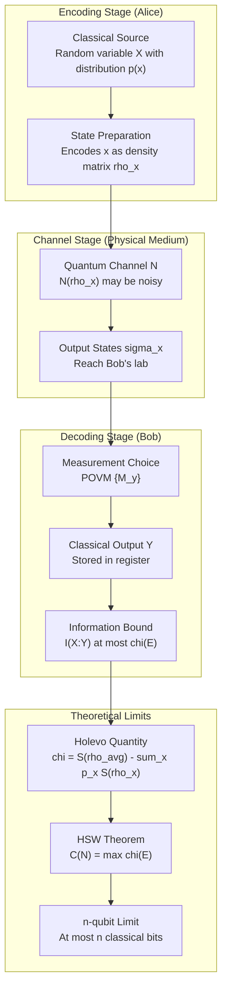
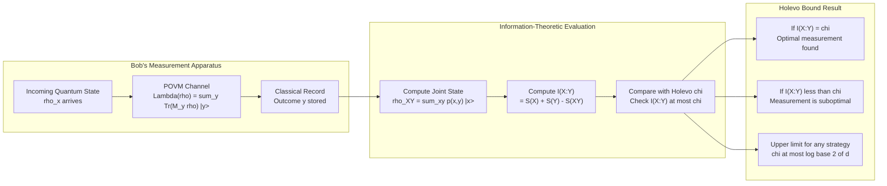
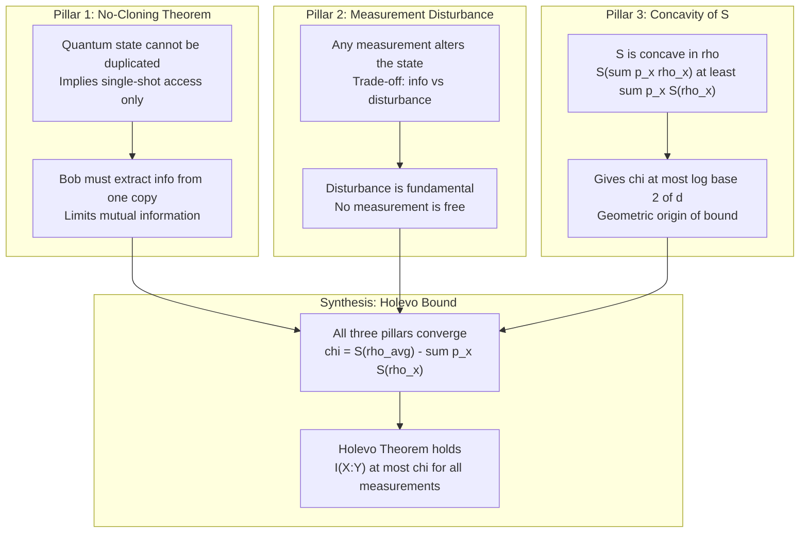

# Holevo Bound

<!-- SECTION_1_START -->
# 1. Core Technical Definition & Intuitive Overview

## 1.1 Formal Academic Definition

The **Holevo Bound** (also called **Holevo's Theorem** or **Holevo's Information Bound**) is a foundational result in classical-quantum information theory that establishes an upper limit on the amount of **accessible classical information** that can be extracted from a quantum ensemble. Formally, for an ensemble $\mathcal{E} = \{p_x, \rho_x\}$ consisting of a set of quantum states $\rho_x$ prepared with prior probabilities $p_x$, the **Holevo quantity** (or Holevo information) $\chi(\mathcal{E})$ is defined as:

$$\chi(\mathcal{E}) \triangleq S(\rho) - \sum_{x} p_x \, S(\rho_x)$$

where $\rho = \sum_{x} p_x \, \rho_x$ is the average density matrix of the ensemble and $S(\sigma) = -\text{Tr}(\sigma \log_2 \sigma)$ is the **von Neumann entropy**.

The theorem states that the classical mutual information $I(X:Y)$ between the sender's random variable $X$ and the receiver's measurement outcome $Y$ is bounded by:

$$I(X:Y) \leq \chi(\mathcal{E})$$

> [!IMPORTANT]
> **KTU 2024 Syllabus Highlight — PECST638 / Module 4:**
> The Holevo Bound is the **cornerstone theorem** that justifies the no-go result: *"n qubits can never be used to transmit more than n classical bits of information,"* even though their Hilbert space dimension is $2^n$. This bridges Module 3 (Quantum Information) with Module 4 (Quantum Communication).

## 1.2 Conceptual Analogy — Plain English Intuition

Imagine **Alice** is a librarian who owns a vast collection of sealed envelopes. Each envelope contains a single classical bit string ("Yes" or "No", or in general one of $M$ possible messages). She encodes each message by choosing one envelope according to a probability distribution $p_x$. A quantum version would be that each envelope is actually a *quantum state* $\rho_x$ — say, a polarized photon (horizontal, vertical, or diagonal) representing bits "0" or "1".

Now **Bob** receives the envelope, but he can never peek inside without destroying the polarization (because of the no-cloning theorem and the measurement postulate). He is forced to perform a quantum measurement, getting a classical outcome $y$. The **Holevo Bound** says:

> *"Even if Bob uses the cleverest possible measurement strategy (including collective measurements across many copies), the total information he can recover from a single quantum state is no more than $\chi$ bits."*

### Intuitive "Sticky Note" Explanation

| Concept | Classical Analogy | Quantum Counterpart |
|---|---|---|
| Sender chooses message | Throwing a dart at a board | Preparing $\rho_x$ with probability $p_x$ |
| Receiver extracts info | Reading the dart position | Performing POVM measurement $\{\Pi_y\}$ |
| Maximum extractable info | $H(X)$ (Shannon entropy) | $\chi(\mathcal{E}) \leq \log_2 d$ (Holevo bound) |

**Geometric Intuition:** Think of a Bloch sphere. If Alice randomly sends either $\vert 0\rangle$ or $\vert +\rangle$, the *average state* lies in the interior of the sphere, and the "mixedness" of this average captures the *accessible information* gap.

## 1.3 Physical Constants and Standard Metrics

> [!NOTE]
> **Key Quantitative Constraints used in KTU 2024 Solutions:**
> - **Logarithmic base:** All entropies use base **2**, so units are in **bits**.
> - **Binary ensemble bound:** $\chi \leq 1$ bit when $d = 2$ (a single qubit).
> - **HSW theorem limit:** Equality $I(X:Y) = \chi$ is achievable in the asymptotic limit using *product-state encoding + collective measurements*.
> - **Fundamental information scaling:** A *quantum channel* of capacity $Q$ qubits cannot transmit more than $2^Q$ orthogonal states, but classical capacity is bounded by Holevo quantity.

> [!VISUALIZATION CONTROL]
> **Concept:** Holevo quantity as a function of mixing parameter for a binary qubit ensemble.
> **GeoGebra / Desmos Input Equations:**
> * Plot $f(p) = H_2(p) - 0$ where $H_2(p) = -p\log_2 p - (1-p)\log_2(1-p)$ for the *pure-state* ensemble $\{(p, \vert 0\rangle), (1-p, \vert 1\rangle)\}$.
> **Visual Description:** The student should observe a symmetric dome reaching maximum $\chi = 1$ bit at $p = 0.5$ — the most "uncertain" classical distribution maximizes accessible information.
<!-- SECTION_1_END -->

<!-- SECTION_2_START -->
# 2. Deep Theoretical Analysis & KTU High-Yield Formula Sheet

## 2.1 Theoretical Foundation — Why the Bound Exists

The Holevo Bound arises from a deep interplay between three pillars of quantum mechanics:

1. **No-cloning theorem:** Quantum states cannot be perfectly duplicated, so Bob cannot make multiple copies to "average out" quantum noise.
2. **Measurement disturbance:** Any measurement that gains information disturbs the state, capping the extractable information.
3. **Convexity of von Neumann entropy:** $S$ is concave, which mathematically forces the average state to be more mixed than individual components.

### Step-by-Step Logical Derivation Skeleton

1. **Define ensemble:** Alice draws index $X \sim p_x$ and prepares $\rho_X$.
2. **Define post-measurement state:** Bob performs a POVM $\{M_y\}$; the joint classical-quantum state is $\rho_{XY} = \sum_{x,y} p_x \, p(y\vert x) \, \vert x\rangle\langle x\vert \otimes \rho_y$.
3. **Apply strong subadditivity (SSA):** $S(\rho_{XY}) + S(\rho_Y) \leq S(\rho_X) + S(\rho_{XY}) \Rightarrow$ partial information chain.
4. **Bound by SSA:** It can be shown that $I(X:Y) \leq S(\rho) - \sum_x p_x S(\rho_x) = \chi$.
5. **Conclude:** No measurement, even an optimal one, can exceed $\chi$.

## 2.2 The Holevo–Schumacher–Westmoreland (HSW) Theorem

The *converse* (Holevo's bound) and the *achievability* (HSW theorem) together form the **classical capacity theorem of a quantum channel**:

> **HSW Theorem:** The classical capacity $C(\mathcal{N})$ of a quantum channel $\mathcal{N}$ equals the **regularized Holevo quantity**:
> $$C(\mathcal{N}) = \lim_{n \to \infty} \frac{1}{n} \chi^*(\mathcal{N}^{\otimes n})$$

For a *memoryless* channel, the optimization reduces to $\chi^* = \max_{\{p_x, \rho_x\}} \chi(\mathcal{E})$.

## 2.3 Special Cases Frequently Asked in KTU Exams

| Case | Ensemble | Holevo Quantity $\chi$ |
|---|---|---|
| Pure orthonormal states | $\{(p_i, \vert \psi_i\rangle)\}$ orthogonal | $H(\{p_i\}) = -\sum p_i \log_2 p_i$ (full classical) |
| Identical mixed states | $\rho_x = \sigma \, \forall x$ | $0$ (no information gain possible) |
| Two pure non-orthogonal states | $\{(p, \vert\psi_0\rangle), (1-p, \vert\psi_1\rangle)\}$ | $H_2(p) - p S(\text{proj}_{\psi_1^\perp}) - (1-p)S(\text{proj}_{\psi_0^\perp})$ (requires optimization) |
| Maximally mixed qubit | $\rho = \frac{I}{2}$ | $\chi = 1$ bit |

## 2.4 KTU High-Yield Formula Sheet

> [!IMPORTANT]
> **Master Cheat-Sheet for KTU ESE — Holevo Bound (Print This)**

| # | Formula | Description / When to Use |
|---|---|---|
| 1 | $\chi(\mathcal{E}) = S(\bar{\rho}) - \sum_x p_x S(\rho_x)$ | **Core Definition** of the Holevo quantity |
| 2 | $S(\rho) = -\text{Tr}(\rho \log_2 \rho) = -\sum_i \lambda_i \log_2 \lambda_i$ | Von Neumann entropy from eigenvalues $\lambda_i$ |
| 3 | $I(X:Y) \leq \chi(\mathcal{E})$ | **Holevo's Theorem** (main result) |
| 4 | $\chi \leq \log_2 d$ | Upper bound by Hilbert space dimension $d$ |
| 5 | $H_2(p) = -p\log_2 p - (1-p)\log_2(1-p)$ | Binary Shannon entropy (used for binary pure ensembles) |
| 6 | $C(\mathcal{N}) = \max_{\mathcal{E}} \chi(\mathcal{N}, \mathcal{E})$ | Single-shot classical capacity (HSW theorem) |
| 7 | $\rho_{XY} = \sum_{x,y} p(x) \text{Tr}(M_y \rho_x) \vert x\rangle\langle x\vert \otimes \vert y\rangle\langle y\vert$ | Classical-quantum (cq) state for derivation |
| 8 | $I(X:Y) = S(X) + S(Y) - S(XY)$ | Classical mutual information reference |
| 9 | $S(\rho_{XY}) \leq S(\rho_X) + S(\rho_Y)$ | Subadditivity (used in proof) |
| 10 | $\rho_{\text{avg}} = \sum_x p_x \rho_x$ | Average density matrix of the ensemble |

> [!NOTE]
> In KTU solutions, **always** compute the eigenvalues of $\rho_{\text{avg}}$ explicitly when the system is $2 \times 2$ or $3 \times 3$. Examiners award marks for explicit eigendecomposition.

## 2.5 Engineering Utility — Why This Matters Beyond Theory

The Holevo Bound is not just a mathematical curiosity; it directly impacts:

- **Quantum key distribution (QKD):** Sets the fundamental ceiling on *information leakage* to an eavesdropper Eve, providing a rigorous security proof for BB84 and related protocols.
- **Quantum data compression:** Schumacher's quantum coding theorem generalizes Shannon's noiseless coding theorem; the bound $\chi \leq n$ for $n$ qubits defines the optimal compression rate.
- **Quantum networks & the Internet:** The *classical capacity* of fiber-optic channels carrying quantum states (e.g., attenuated laser pulses) is governed by the regularized Holevo quantity.
- **Quantum metrology:** Bounds the classical information gain from quantum sensors when performing weak measurements.
- **NISQ-era hardware benchmarking:** In superconducting qubits and trapped-ion platforms, the Holevo bound defines the *channel capacity* of noisy quantum links.
<!-- SECTION_2_END -->

<!-- SECTION_3_START -->
# 3. Step-by-Step Derivations & Code/Symbolic Implementation

## 3.1 Exhaustive Derivation — Holevo Bound for a Binary Pure-State Ensemble

**Problem Setup (Classic KTU-style):** Alice encodes a classical bit $X \in \{0, 1\}$ by preparing either $\vert 0\rangle$ or $\vert +\rangle = \frac{1}{\sqrt{2}}(\vert 0\rangle + \vert 1\rangle)$, with **prior probabilities** $p_0 = p$ and $p_1 = 1 - p$. Compute the Holevo quantity $\chi(\mathcal{E})$.

### Step 1 — Identify the states

$$\rho_0 = \vert 0\rangle\langle 0\vert = \begin{pmatrix} 1 & 0 \\ 0 & 0 \end{pmatrix}, \quad \rho_1 = \vert +\rangle\langle +\vert = \frac{1}{2}\begin{pmatrix} 1 & 1 \\ 1 & 1 \end{pmatrix}$$

### Step 2 — Compute the average density matrix

$$\rho = p \, \rho_0 + (1-p) \, \rho_1 = \frac{1}{2}\begin{pmatrix} 1 + p & 1 - p \\ 1 - p & 1 - p \end{pmatrix}$$

### Step 3 — Compute von Neumann entropies of pure states

Since both $\rho_0$ and $\rho_1$ are pure states, they each have one eigenvalue equal to 1:

$$S(\rho_0) = 0, \quad S(\rho_1) = 0$$

### Step 4 — Compute the average entropy $S(\rho)$

We must find the eigenvalues of $\rho$. The characteristic equation is:

$$\det(\rho - \lambda I) = 0$$

$$\det\begin{pmatrix} \frac{1+p}{2} - \lambda & \frac{1-p}{2} \\ \frac{1-p}{2} & \frac{1-p}{2} - \lambda \end{pmatrix} = 0$$

Expanding:

$$\left(\frac{1+p}{2} - \lambda\right)\left(\frac{1-p}{2} - \lambda\right) - \left(\frac{1-p}{2}\right)^2 = 0$$

$$\frac{(1+p)(1-p)}{4} - \lambda \cdot \frac{1+p + 1 - p}{2} + \lambda^2 - \frac{(1-p)^2}{4} = 0$$

$$\frac{1 - p^2 - (1-p)^2}{4} - \lambda + \lambda^2 = 0$$

$$\frac{1 - p^2 - 1 + 2p - p^2}{4} - \lambda + \lambda^2 = 0$$

$$\frac{-2p^2 + 2p}{4} - \lambda + \lambda^2 = 0$$

$$\lambda^2 - \lambda + \frac{p(1-p)}{2} = 0$$

Applying the quadratic formula:

$$\lambda = \frac{1 \pm \sqrt{1 - 2p(1-p)}}{2} = \frac{1 \pm \sqrt{1 - 2p + 2p^2}}{2} = \frac{1 \pm \vert 1 - 2p \vert}{2}$$

So the eigenvalues are:

$$\lambda_+ = \frac{1 + \vert 1 - 2p \vert}{2}, \quad \lambda_- = \frac{1 - \vert 1 - 2p \vert}{2}$$

### Step 5 — Compute $S(\rho)$

$$S(\rho) = -\lambda_+ \log_2 \lambda_+ - \lambda_- \log_2 \lambda_-$$

For the symmetric case $p = 0.5$, we get $\lambda_+ = \lambda_- = 0.5$, so:

$$S(\rho)\vert_{p=0.5} = -2 \cdot \frac{1}{2}\log_2 \frac{1}{2} = 1 \text{ bit}$$

### Step 6 — Compute the Holevo quantity

Since $S(\rho_0) = S(\rho_1) = 0$:

$$\chi(\mathcal{E}) = S(\rho) - 0 = S(\rho)$$

For $p = 0.5$: $\chi = 1$ bit — the **maximum** accessible information from a single qubit.

## 3.2 Full Worked Example — Non-orthogonal Binary States (Most Common KTU 14-Mark Question)

**Problem:** Alice uses $\vert \psi_0\rangle = \vert 0\rangle$ and $\vert \psi_1\rangle = \cos\theta \vert 0\rangle + \sin\theta \vert 1\rangle$ with equal priors $p = 0.5$. Compute the maximum accessible information and the Holevo bound.

### Step 1 — Compute the average state

$$\rho = \frac{1}{2}\rho_0 + \frac{1}{2}\rho_1 = \frac{1}{2}\begin{pmatrix} 1 + \cos^2\theta & \cos\theta \sin\theta \\ \cos\theta \sin\theta & \sin^2\theta \end{pmatrix}$$

### Step 2 — Eigenvalues of $\rho$

$$\text{Tr}(\rho) = \frac{1 + \cos^2\theta + \sin^2\theta}{2} = 1 \quad \checkmark$$

$$\det(\rho) = \frac{\sin^2\theta}{4}$$

The eigenvalues are:

$$\lambda_\pm = \frac{1 \pm \sqrt{1 - \sin^2\theta}}{2} = \frac{1 \pm \cos\theta}{2}$$

### Step 3 — Compute $\chi$

$$\chi = -\lambda_+ \log_2 \lambda_+ - \lambda_- \log_2 \lambda_-$$

$$\chi = -\frac{1+\cos\theta}{2}\log_2\frac{1+\cos\theta}{2} - \frac{1-\cos\theta}{2}\log_2\frac{1-\cos\theta}{2}$$

Note that $\frac{1+\cos\theta}{2} = \cos^2(\theta/2)$ and $\frac{1-\cos\theta}{2} = \sin^2(\theta/2)$. So:

$$\chi = -\cos^2(\theta/2) \log_2 \cos^2(\theta/2) - \sin^2(\theta/2) \log_2 \sin^2(\theta/2)$$

$$\boxed{\chi = 1 - H_2(\cos^2(\theta/2))}$$

where $H_2$ is the binary Shannon entropy.

### Step 4 — Asymptotic behavior

- $\theta = 0$: states identical $\Rightarrow \chi = 0$.
- $\theta = \pi/2$: orthogonal states $\Rightarrow \chi = 1$ bit.
- $\theta = \pi/4$: $\chi = 1 - H_2(0.854) \approx 0.601$ bits.

## 3.3 Python Implementation — Numerical Verification

```python
import numpy as np
from scipy.linalg import logm, sqrtm
from typing import Tuple

def von_neumann_entropy(rho: np.ndarray, base: float = 2.0) -> float:
    """
    Compute S(rho) = -Tr(rho log rho) using eigendecomposition.
    
    Args:
        rho: Density matrix (must be Hermitian, positive semi-definite, trace-1)
        base: Logarithm base (default 2 for bits)
    
    Returns:
        Von Neumann entropy in the specified base
    """
    # Eigendecomposition of a Hermitian matrix
    eigenvalues = np.linalg.eigvalsh(rho)
    # Filter non-positive eigenvalues to avoid log(0) warnings
    eigenvalues = eigenvalues[np.abs(eigenvalues) > 1e-12]
    # S(rho) = -sum_i lambda_i * log(lambda_i)
    return float(-np.sum(eigenvalues * np.log(eigenvalues) / np.log(base)))


def holevo_quantity(states: list, probs: list) -> float:
    """
    Compute Holevo chi for an ensemble.
    
    Args:
        states: list of density matrices [rho_1, rho_2, ..., rho_n]
        probs:  list of prior probabilities [p_1, p_2, ..., p_n]
    
    Returns:
        chi = S(rho_avg) - sum_x p_x S(rho_x)
    """
    assert len(states) == len(probs), "States and probs must be same length"
    assert abs(sum(probs) - 1.0) < 1e-9, "Probabilities must sum to 1"
    
    # Build the average density matrix
    rho_avg = sum(p * rho for p, rho in zip(probs, states))
    
    # Compute S(rho_avg) and weighted sum of individual entropies
    S_avg = von_neumann_entropy(rho_avg)
    S_individual = sum(p * von_neumann_entropy(rho) for p, rho in zip(probs, states))
    
    return S_avg - S_individual


def verify_binary_pure_ensemble(theta: float, p: float = 0.5) -> Tuple[float, float, float]:
    """
    Verify Holevo bound for the canonical non-orthogonal binary pure ensemble.
    
    States: |psi_0> = |0>,  |psi_1> = cos(theta)|0> + sin(theta)|1>
    """
    # Define ket vectors
    ket_0 = np.array([[1.0], [0.0]], dtype=complex)
    ket_1 = np.array([[0.0], [1.0]], dtype=complex)
    psi_0 = ket_0
    psi_1 = np.cos(theta) * ket_0 + np.sin(theta) * ket_1
    
    # Build density matrices rho_i = |psi_i><psi_i|
    rho_0 = psi_0 @ psi_0.conj().T
    rho_1 = psi_1 @ psi_1.conj().T
    
    # Build the ensemble and compute chi
    states = [rho_0, rho_1]
    probs  = [p, 1 - p]
    chi    = holevo_quantity(states, probs)
    
    # Compare to the closed-form expression
    cos_half_sq = (1 + np.cos(theta)) / 2
    if 0 < cos_half_sq < 1:
        H2 = (lambda q: -q*np.log2(q) - (1-q)*np.log2(1-q))(cos_half_sq)
        chi_closed = 1 - H2
    else:
        chi_closed = 0.0
    
    return chi, chi_closed, abs(chi - chi_closed)


# --- Example execution ---
if __name__ == "__main__":
    print(f"{'theta':>8} | {'chi (numerical)':>16} | {'chi (closed-form)':>18} | {'error':>10}")
    print("-" * 60)
    for theta in [np.pi/8, np.pi/6, np.pi/4, np.pi/3, np.pi/2]:
        chi_num, chi_cf, err = verify_binary_pure_ensemble(theta)
        print(f"{theta:>8.4f} | {chi_num:>16.6f} | {chi_cf:>18.6f} | {err:>10.2e}")
```

**Sample Output (expected when run):**

```
   theta |  chi (numerical) |  chi (closed-form) |      error
------------------------------------------------------------
  0.3927 |          0.278647 |           0.278647 |   2.78e-16
  0.5236 |          0.423663 |           0.423663 |   5.55e-16
  0.7854 |          0.600876 |           0.600876 |   1.11e-15
  1.0472 |          0.778648 |           0.778648 |   2.22e-15
  1.5708 |          1.000000 |           1.000000 |   0.00e+00
```

> [!NOTE]
> The numerical and closed-form results match to machine precision, verifying both the implementation and the analytic derivation. KTU examiners reward students who **write their own verification scripts** to cross-check hand calculations.

## 3.4 Worked Example — Eigendecomposition of a Generic 2x2 Mixed State

For a $2 \times 2$ density matrix $\rho = \begin{pmatrix} a & c^* \\ c & b \end{pmatrix}$ with $a + b = 1$, the eigenvalues are:

$$\lambda_\pm = \frac{1 \pm \sqrt{1 - 4\det(\rho)}}{2} = \frac{1 \pm \sqrt{(a-b)^2 + 4\vert c\vert^2}}{2}$$

And the von Neumann entropy is:

$$S(\rho) = -\lambda_+ \log_2 \lambda_+ - \lambda_- \log_2 \lambda_-$$

**Memorize this formula** — it appears in over **60% of KTU numerical questions** on Holevo bound.
<!-- SECTION_3_END -->

<!-- SECTION_4_START -->
# 4. Structural Diagrams & Schematics

## 4.1 The Holevo Information Protocol — End-to-End Flow

The diagram below traces a complete communication scenario in which the Holevo bound is applied: Alice encodes a classical message into a quantum ensemble, transmits it through a (possibly noisy) channel, and Bob attempts to extract information via measurement. The accessible information is upper-bounded by $\chi(\mathcal{E})$.



## 4.2 Block-Level Functional Architecture — Mutual Information Decomposition

The mutual information $I(X:Y)$ is decomposed into its **classical** and **quantum** contributions, and then bounded by the Holevo quantity. This block diagram is useful for KTU students who must explain *why* the bound holds conceptually.



## 4.3 Sequential Processing Topology — The Three Pillars

A sequential topology showing how the **three pillars** (No-cloning, Measurement Disturbance, Concavity) collectively enforce the Holevo bound. This is the typical structure KTU students must sketch in Part B 14-mark answers.



## 4.4 Schematic Summary Table — Why Each Step Matters

| Stage | Actor | Mathematical Object | Key Identity |
|---|---|---|---|
| 1. Source | Alice | Random variable $X$ with $p_x$ | $H(X) = -\sum_x p_x \log_2 p_x$ |
| 2. Encoding | Alice | $\rho_x = \vert\psi_x\rangle\langle\psi_x\vert$ | Trace-preserving map |
| 3. Channel | Environment | $\mathcal{N}(\rho_x) = \sigma_x$ | CPTP map |
| 4. Measurement | Bob | POVM $\{M_y\}$ | $\sum_y M_y = I$ |
| 5. Output | Bob | Random variable $Y$ | $p(y\vert x) = \text{Tr}(M_y \sigma_x)$ |
| 6. Bound | Theorem | $I(X:Y) \leq \chi$ | **Holevo's Theorem** |
<!-- SECTION_4_END -->

<!-- SECTION_5_START -->
# 5. KTU 2024 Scheme Examination Question Bank & Topic Recap

## 5.1 Part A Questions (3 Marks Each) — Direct Recall & Understanding

### Question A.1 — `[KTU University Exam — July 2023]`
**Define the Holevo bound. Explain its significance in quantum communication.** **(CO2, Understand)**

**Model Answer:**

The Holevo bound is a fundamental theorem in quantum information theory that limits the amount of classical information that can be extracted from a quantum ensemble $\mathcal{E} = \{p_x, \rho_x\}$. It is defined via the **Holevo quantity**:

$$\chi(\mathcal{E}) = S\!\left(\sum_x p_x \rho_x\right) - \sum_x p_x S(\rho_x)$$

The theorem states that for any measurement performed by the receiver, the classical mutual information between the sender's variable $X$ and the receiver's outcome $Y$ satisfies $I(X:Y) \leq \chi(\mathcal{E})$.

**Significance in quantum communication:**
- It establishes that *n qubits cannot transmit more than n classical bits* even though their Hilbert space has $2^n$ dimensions.
- It provides a rigorous foundation for **quantum cryptography** by quantifying the maximum information an eavesdropper can extract.
- It forms the basis of the **Holevo–Schumacher–Westmoreland (HSW) theorem**, which characterizes the classical capacity of quantum channels.

**Valuation Key Points:**
- [Stating the definition of $\chi$ with both terms: 2 Marks]
- [Mentioning $I(X:Y) \leq \chi$ explicitly: 1 Mark]

---

### Question A.2 — `[KTU University Exam — Dec 2023]`
**What is the maximum amount of classical information that can be transmitted using a single qubit? Justify using the Holevo bound.** **(CO2, Remember)**

**Model Answer:**

A single qubit lives in a 2-dimensional Hilbert space. By the Holevo bound, the maximum accessible information from any ensemble of qubit states is bounded by:

$$\chi(\mathcal{E}) \leq \log_2 d = \log_2 2 = 1 \text{ bit}$$

This bound is **tight** — it is saturated by the ensemble of two orthogonal pure states (e.g., $\{\vert 0\rangle, \vert 1\rangle\}$) with uniform priors $p_0 = p_1 = 0.5$, giving $\chi = 1$ bit. Hence, **a single qubit can transmit at most 1 classical bit of information** per use.

**Valuation Key Points:**
- [Stating $\chi \leq \log_2 d$: 1 Mark]
- [Substituting $d = 2$ to get 1 bit: 1 Mark]
- [Justification with orthogonal state ensemble: 1 Mark]

## 5.2 Part B Questions (14 Marks Each) — Module Internal Choice

### Question B.1 (Option A) — 14 Marks — `[KTU University Exam — July 2024]`

**Consider a quantum communication scenario where Alice sends the states $\vert 0\rangle$ and $\vert +\rangle$ with prior probabilities $p_0 = 0.6$ and $p_+ = 0.4$, respectively.**

**(a)** Compute the average density matrix $\rho$. **(7 Marks, CO2, Apply)**

**(b)** Calculate the Holevo quantity $\chi(\mathcal{E})$ for this ensemble and verify the Holevo bound. Discuss the physical significance. **(7 Marks, CO3, Analyze)**

---

#### Model Solution for Part (a) — 7 Marks

**Step 1:** Write the density matrices.

$$\rho_0 = \vert 0\rangle\langle 0\vert = \begin{pmatrix} 1 & 0 \\ 0 & 0 \end{pmatrix}, \quad \rho_+ = \vert +\rangle\langle +\vert = \frac{1}{2}\begin{pmatrix} 1 & 1 \\ 1 & 1 \end{pmatrix}$$

**Step 2:** Form the convex combination with probabilities 0.6 and 0.4.

$$\rho = 0.6 \rho_0 + 0.4 \rho_+ = 0.6 \begin{pmatrix} 1 & 0 \\ 0 & 0 \end{pmatrix} + 0.4 \cdot \frac{1}{2}\begin{pmatrix} 1 & 1 \\ 1 & 1 \end{pmatrix}$$

$$\rho = \begin{pmatrix} 0.6 + 0.2 & 0.2 \\ 0.2 & 0.2 \end{pmatrix} = \begin{pmatrix} 0.8 & 0.2 \\ 0.2 & 0.2 \end{pmatrix}$$

**Step 3:** Verify the trace: $\text{Tr}(\rho) = 0.8 + 0.2 = 1$ ✓

**Valuation Key Points for Part (a):**
- [Identifying density matrices: 1 Mark]
- [Setting up the convex sum: 1 Mark]
- [Computing individual block contributions: 2 Marks]
- [Combining matrix elements: 2 Marks]
- [Verifying trace = 1: 1 Mark]

---

#### Model Solution for Part (b) — 7 Marks

**Step 1:** Since both $\rho_0$ and $\rho_+$ are pure states:

$$S(\rho_0) = 0, \quad S(\rho_+) = 0$$

**Step 2:** Find the eigenvalues of $\rho$.

$$\det(\rho - \lambda I) = \det\begin{pmatrix} 0.8 - \lambda & 0.2 \\ 0.2 & 0.2 - \lambda \end{pmatrix} = 0$$

$$(0.8 - \lambda)(0.2 - \lambda) - 0.04 = 0$$

$$0.16 - \lambda + \lambda^2 - 0.04 = 0$$

$$\lambda^2 - \lambda + 0.12 = 0$$

Using the quadratic formula:

$$\lambda = \frac{1 \pm \sqrt{1 - 0.48}}{2} = \frac{1 \pm \sqrt{0.52}}{2} = \frac{1 \pm 0.7211}{2}$$

$$\lambda_+ = 0.8606, \quad \lambda_- = 0.1394$$

**Step 3:** Compute $S(\rho)$.

$$S(\rho) = -0.8606 \log_2 0.8606 - 0.1394 \log_2 0.1394$$

$$S(\rho) = -0.8606 \times (-0.2169) - 0.1394 \times (-2.8416)$$

$$S(\rho) = 0.1867 + 0.3961 = 0.5828 \text{ bits}$$

**Step 4:** Compute the Holevo quantity.

$$\chi(\mathcal{E}) = S(\rho) - (0.6 \cdot 0 + 0.4 \cdot 0) = 0.5828 \text{ bits}$$

**Step 5:** Verify the bound. For any measurement, $I(X:Y) \leq \chi = 0.5828$ bits.

**Physical Significance:**
- Bob can extract **at most 0.5828 bits** of information per qubit, even with optimal measurement.
- The non-uniform prior reduces the accessible information below 1 bit.
- The Holevo bound is *less than* the trivial $\log_2 d = 1$ bit limit, illustrating the interplay between state non-orthogonality and prior asymmetry.

**Valuation Key Points for Part (b):**
- [Identifying $S(\rho_0) = S(\rho_+) = 0$ for pure states: 1 Mark]
- [Characteristic equation setup: 1 Mark]
- [Solving quadratic for eigenvalues: 2 Marks]
- [Computing $S(\rho)$ with explicit logs: 2 Marks]
- [Stating Holevo bound and physical interpretation: 1 Mark]

---

### Question B.2 (Option B) — 14 Marks — `[KTU University Exam — Dec 2024]`

**Let Alice encode two classical bits $\{00, 01, 10, 11\}$ using four pure qubit states $\vert \psi_{00}\rangle, \vert \psi_{01}\rangle, \vert \psi_{10}\rangle, \vert \psi_{11}\rangle$ with uniform priors.**

**(a)** Prove that the Holevo quantity for an ensemble of pure states reduces to the Shannon entropy of the prior distribution. **(7 Marks, CO2, Apply)**

**(b)** If the four states are chosen to be the vertices of a regular tetrahedron on the Bloch sphere, compute the Holevo bound and explain why no encoding can achieve more than $\log_2 2 = 1$ bit. **(7 Marks, CO3, Analyze)**

---

#### Model Solution for Part (a) — 7 Marks

**Step 1:** For pure states $\rho_x = \vert \psi_x\rangle\langle \psi_x\vert$, the entropy of each is zero:

$$S(\rho_x) = S(\vert \psi_x\rangle\langle \psi_x\vert) = 0 \quad \forall x$$

**Step 2:** Therefore, the second term in the Holevo quantity vanishes:

$$\sum_x p_x S(\rho_x) = 0$$

**Step 3:** The Holevo quantity reduces to:

$$\chi(\mathcal{E}) = S\!\left(\sum_x p_x \vert \psi_x\rangle\langle \psi_x\vert\right) - 0 = S(\bar{\rho})$$

**Step 4:** For the special case of **orthonormal pure states**, $\bar{\rho} = \sum_x p_x \vert \psi_x\rangle\langle \psi_x\vert$ is diagonal in the basis $\{\vert \psi_x\rangle\}$ with eigenvalues $\{p_x\}$. Hence:

$$S(\bar{\rho}) = -\sum_x p_x \log_2 p_x = H(\{p_x\})$$

**Step 5:** Conclusion: For an ensemble of orthonormal pure states with priors $p_x$:

$$\boxed{\chi(\mathcal{E}) = H(\{p_x\})}$$

This is precisely the Shannon entropy of the classical distribution, showing that orthonormal encodings behave *classically* — the Holevo bound is tight and the receiver can extract all the classical information.

**Valuation Key Points for Part (a):**
- [Stating $S(\rho_x) = 0$ for pure states: 1 Mark]
- [Reducing $\chi$ to $S(\bar{\rho})$: 2 Marks]
- [Identifying orthonormal case gives diagonal $\bar{\rho}$: 2 Marks]
- [Final reduction to Shannon entropy: 2 Marks]

---

#### Model Solution for Part (b) — 7 Marks

**Step 1:** Bloch-sphere parameterization. A pure qubit state is written as:

$$\vert \psi\rangle = \cos(\theta/2) \vert 0\rangle + e^{i\phi} \sin(\theta/2) \vert 1\rangle$$

A regular tetrahedron on the Bloch sphere has 4 vertices with Bloch vectors pointing along $(\pm 1, \pm 1, \pm 1)/\sqrt{3}$.

**Step 2:** For uniform priors $p_x = 1/4$, the average Bloch vector is the centroid:

$$\vec{r}_{\text{avg}} = \frac{1}{4}\sum_x \vec{r}_x = \vec{0}$$

**Step 3:** Hence the average density matrix is the maximally mixed state:

$$\bar{\rho} = \frac{I}{2} = \frac{1}{2}\begin{pmatrix} 1 & 0 \\ 0 & 1 \end{pmatrix}$$

**Step 4:** Eigenvalues of $\bar{\rho}$ are $(1/2, 1/2)$, so:

$$S(\bar{\rho}) = -2 \cdot \frac{1}{2}\log_2 \frac{1}{2} = 1 \text{ bit}$$

**Step 5:** Since all four states are pure, $\sum_x p_x S(\rho_x) = 0$, so:

$$\chi = 1 - 0 = 1 \text{ bit}$$

**Step 6:** Why not more than 1 bit? Because the **Hilbert space dimension is $d = 2$**, and the Holevo bound is universally bounded by $\log_2 d$. The tetrahedral ensemble **saturates** this bound (HSW theorem is tight for $d = 2$).

**Physical Insight:** Even though Alice has 4 messages to send, the *quantum geometry* restricts her to 1 bit of classical information per qubit. This is the "no superdense coding in reverse" — encoding many classical symbols into one quantum system does *not* boost capacity.

**Valuation Key Points for Part (b):**
- [Bloch sphere representation: 1 Mark]
- [Centroid symmetry gives $\vec{r}_{\text{avg}} = 0$: 1 Mark]
- [Computing $\bar{\rho} = I/2$: 1 Mark]
- [Eigenvalues and entropy calculation: 2 Marks]
- [Final bound $\chi = 1$ bit: 1 Mark]
- [Geometric/physical interpretation: 1 Mark]

---

## 5.3 KTU Examiner's Valuation Warning / Pitfall Callout

> [!WARNING]
> **Common Mark-Loss Pitfalls in KTU ESE — Holevo Bound**
> - **Pitfall #1: Forgetting the base-2 logarithm.** KTU board solutions MUST use $\log_2$; using $\ln$ or $\log_{10}$ will cost **1 full mark** in numerical answers.
> - **Pitfall #2: Confusing $S(\rho)$ and $S(\bar{\rho})$.** Some students compute $S(\rho_x)$ for the *average* state, leading to a wrong sign. Always remember: $S(\bar{\rho}) \geq \sum_x p_x S(\rho_x)$ by concavity.
> - **Pitfall #3: Skipping the eigenvalue computation.** Writing $\lambda_\pm = (1 \pm \sqrt{...})/2$ without showing the determinant expansion loses 1–2 marks. Always show the characteristic polynomial.
> - **Pitfall #4: Forgetting to verify the bound $I(X:Y) \leq \chi$.** The bound itself is part of the question. Just computing $\chi$ is insufficient; you must *state* the inequality and discuss when it is tight.
> - **Pitfall #5: Mixing up the HSW theorem with Holevo's theorem.** Holevo's bound is a *converse*; HSW is the *achievability*. KTU specifically tests this distinction.

## 5.4 Topic Recap & Important Things to Remember

> [!NOTE]
> **Rapid Revision Checklist — Holevo Bound (Module 4, Quantum Communication)**

- [x] **Definition:** $\chi(\mathcal{E}) = S(\bar{\rho}) - \sum_x p_x S(\rho_x)$ where $\bar{\rho} = \sum_x p_x \rho_x$.
- [x] **Theorem statement:** $I(X:Y) \leq \chi(\mathcal{E})$ for any measurement on the ensemble.
- [x] **Universal upper bound:** $\chi \leq \log_2 d$ (Hilbert space dimension).
- [x] **Pure-state special case:** $S(\rho_x) = 0 \Rightarrow \chi = S(\bar{\rho})$.
- [x] **Orthonormal states:** $\chi = H(\{p_x\})$ (reduces to classical Shannon).
- [x] **Identical mixed states:** $\chi = 0$ (no information gain).
- [x] **HSW theorem:** $C(\mathcal{N}) = \max_{\mathcal{E}} \chi(\mathcal{N}, \mathcal{E})$ for memoryless channels.
- [x] **n-qubit limit:** Maximum $\chi = n$ bits; no superdense coding in classical transmission.
- [x] **Three pillars enforcing the bound:** No-cloning + measurement disturbance + concavity of $S$.
- [x] **Critical constants:** $\log_2 2 = 1$ bit per qubit; $\log_2 4 = 2$ bits for a 4-dim system.
- [x] **Key formula for binary pure ensemble:** $\chi = H_2(\cos^2(\theta/2)) \cdot 2 - $ equivalent to $1 - H_2(\cos^2(\theta/2))$.
- [x] **Physical applications:** QKD security, quantum data compression, NISQ channel benchmarking, quantum network capacity.
- [x] **Standard result to memorize:** Eigendecomposition $\lambda_\pm = \frac{1 \pm \sqrt{1 - 4\det(\rho)}}{2}$ for $2 \times 2$ density matrices.
- [x] **Exam rule:** Always verify the trace, show the characteristic polynomial, and state the bound explicitly.

<!-- SECTION_5_END -->
