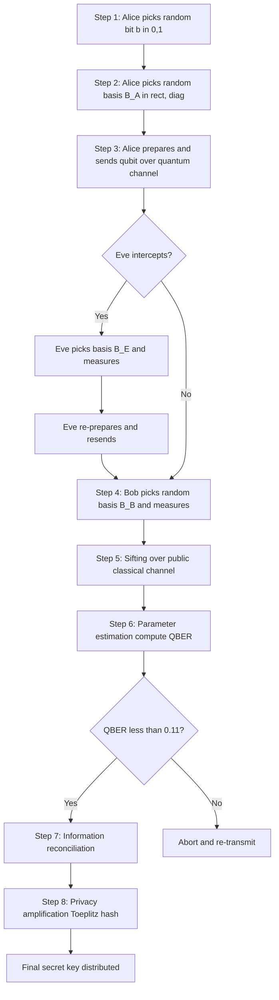
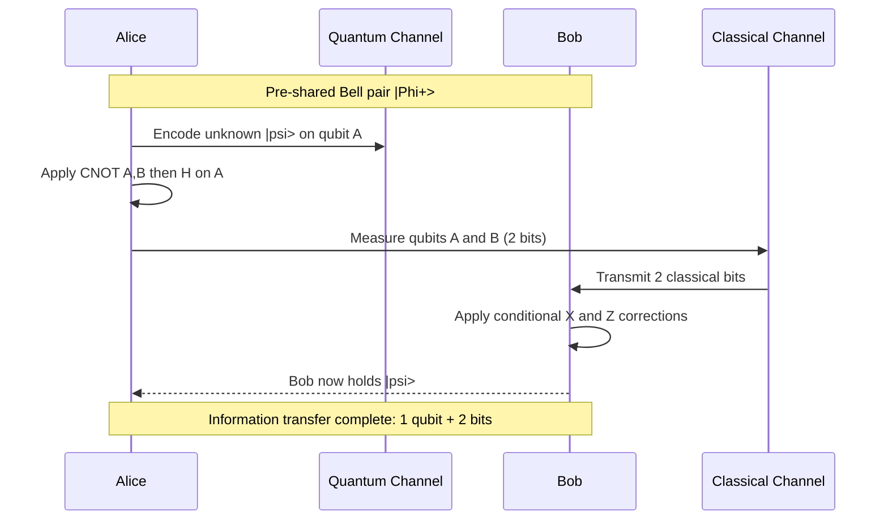
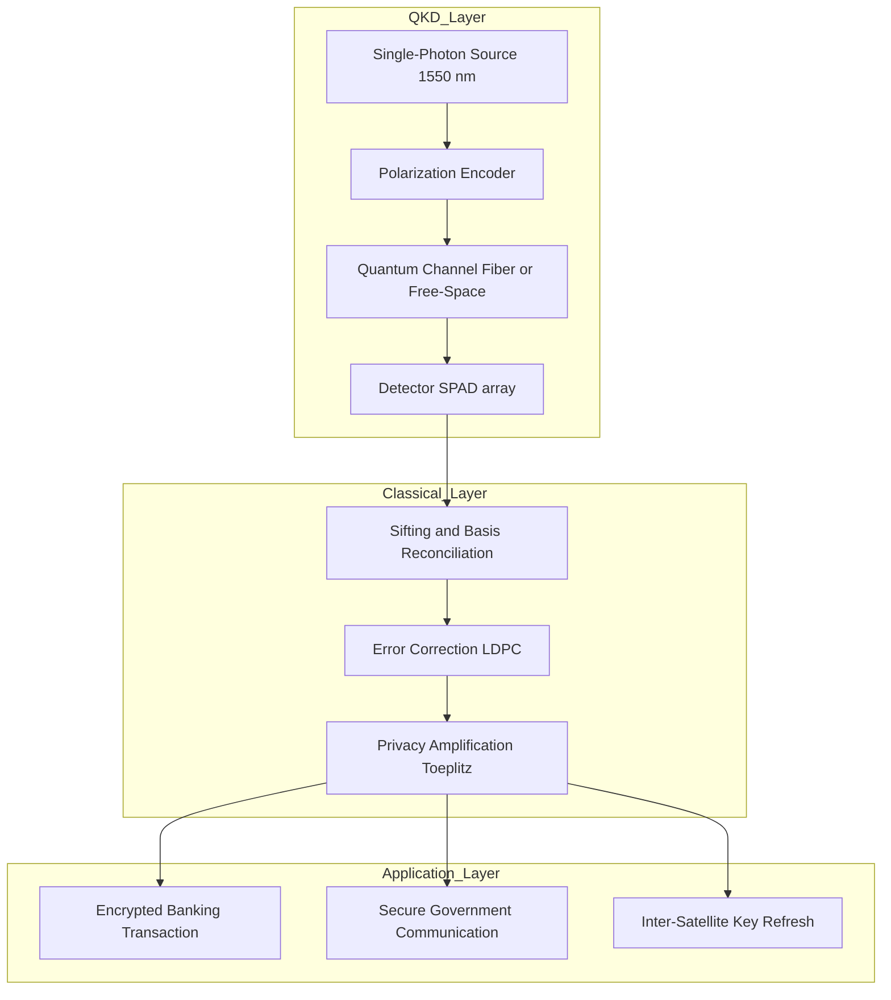
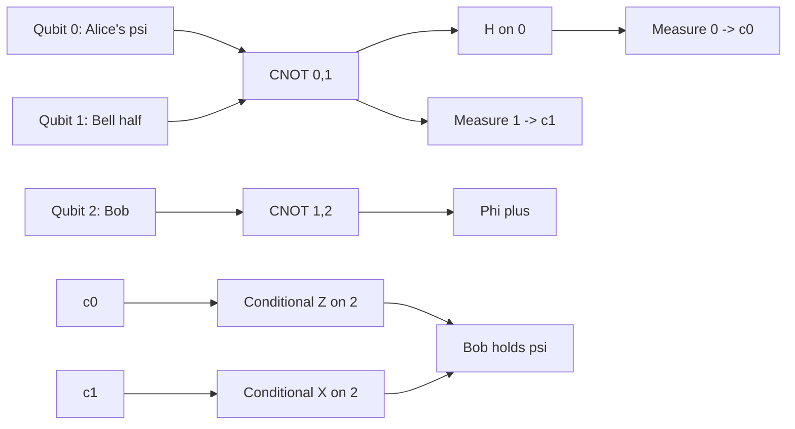

# Quantum Communication protocols

<!-- SECTION_1_START -->
# Quantum Communication Protocols — Core Foundation

## 1.1 Formal Academic Definition (KTU 2024 Syllabus Standard)

> [!IMPORTANT]
> **Quantum Communication Protocol:** A precisely defined, ordered sequence of quantum-state preparation, transmission, measurement, and classical post-processing operations executed by two or more legitimate parties (conventionally named **Alice** and **Bob), with optional adversarial presence (**Eve**), such that the security, fidelity, or rate of information transfer is guaranteed by the underlying laws of quantum mechanics (superposition, entanglement, the **no-cloning theorem**, and measurement-induced collapse).

In the KTU 2024 *PECST638 — Quantum Computing* syllabus (Module 4), the term *protocol* specifically covers:

1. **Quantum Key Distribution (QKD)** — BB84, B92, E91 (Ekert).
2. **Quantum Teleportation** — transfer of an unknown qubit state using one shared Bell pair and two classical bits.
3. **Superdense Coding** — transfer of two classical bits using one shared Bell pair and one qubit.
4. **Quantum Secret Sharing (QSS)** — splitting a quantum secret among multiple parties.

## 1.2 Intuitive Analogy (Plain-English Understanding)

> [!NOTE]
> **Conceptual Analogy — "The Invisible-Ink Lockbox":**
> Imagine Alice wants to send Bob a secret. She puts her message in a transparent lockbox and sends it. Any spy (**Eve**) who opens the box to peek *must* leave a fingerprint. In classical cryptography, Eve could copy the message bit-perfectly. In **quantum communication**, the *no-cloning theorem* states that an unknown quantum state **cannot be perfectly duplicated** — Eve's measurement *must* disturb the state, leaving a detectable fingerprint. This is the philosophical heart of every quantum communication protocol.

A second powerful analogy: a **coin spinning in the air** represents a qubit in superposition ($\alpha \vert 0 \rangle + \beta \vert 1 \rangle$). The moment it lands, the superposition collapses — that *collapse event* is what protocols exploit to detect eavesdropping.

## 1.3 Physical Constants and Standard Metrics

> [!IMPORTANT]
> **Key Engineering Quantities Used Throughout This Module**
> - **Bit error rate (QBER) threshold for BB84 security:** $\mathbf{QBER \approx 11\%}$ (above this, the key is discarded; below, privacy amplification yields a secure key).
> - **CHSH correlation bound:** classical $S \le 2$; quantum maximum $S = 2\sqrt{2}$ (Tsirelson bound).
> - **Speed of classical post-processing channel:** limited by the speed of light, $c \approx 3 \times 10^8$ m/s.
> - **Wavelengths used in commercial QKD fibers:** $\mathbf{1310}$ nm and $\mathbf{1550}$ nm telecom windows.
> - **Planck's constant:** $h = 6.626 \times 10^{-34}$ J·s (appears in single-photon energy $E = h\nu$).

## 1.4 GeoGebra / Desmos Visualization Callout

> [!VISUALIZATION CONTROL]
> **Concept:** Bloch-sphere representation of the four BB84 polarization states.
> **GeoGebra / Desmos Input Equations (parametric 3D sphere of radius 1):**
> * Sphere: $x^2 + y^2 + z^2 = 1$
> * Rectilinear basis: $P_H = (0, 0, 1)$, $P_V = (0, 0, -1)$
> * Diagonal basis: $P_{+45} = \left(\tfrac{1}{\sqrt{2}}, 0, \tfrac{1}{\sqrt{2}}\right)$, $P_{-45} = \left(\tfrac{1}{\sqrt{2}}, 0, -\tfrac{1}{\sqrt{2}}\right)$
> **Visual Description:** Students should observe that the four states occupy antipodal points along the $z$-axis (rectilinear) and along the rotated $x$-axis (diagonal), forming an angle of exactly $45^\circ$ between the two measurement bases — this non-orthogonality is what guarantees BB84's security.
<!-- SECTION_1_END -->

<!-- SECTION_2_START -->
# Deep Theoretical Analysis & KTU High-Yield Formula Sheet

## 2.1 Protocol Taxonomy and Operational Logic

### A. BB84 (Bennett–Brassard, 1984) — Prepare-and-Measure QKD

**Why it works:** Uses two non-orthogonal bases ($\{ \vert 0 \rangle, \vert 1 \rangle\}$ and $\{ \vert + \rangle, \vert - \rangle\}$) so that Eve cannot measure in the *correct* basis with certainty.

**Operational steps (bullet logic):**

- **Step 1 — Transmission:** Alice randomly picks a bit $b \in \{0,1\}$ and a basis $B_A \in \{+,\times\}$ and sends the corresponding polarization state to Bob.
- **Step 2 — Measurement:** Bob independently picks a basis $B_B$ and measures.
- **Step 3 — Sifting (classical channel):** Alice and Bob publicly compare bases; they *discard* rounds where $B_A \ne B_B$. The retained bits form the **raw key**.
- **Step 4 — Parameter estimation:** A small random sample is compared publicly to compute the QBER.
- **Step 5 — Information reconciliation and privacy amplification:** error-correcting codes (Cascade, LDPC) and a Toeplitz hash yield the **final secret key**.

**Mathematical core:** If Eve intercepts with basis $B_E \ne B_A$, she forces an error with probability $P_{\text{err}} = \tfrac{1}{2}$. After $n$ sifted bits, the expected fraction of *Eve-induced* errors is $\mathbf{25\%}$, easily detectable.

### B. B92 (Bennett, 1992) — Two-State Protocol

**Why it works:** Uses only **two non-orthogonal states**, e.g. $\vert 0 \rangle$ and $\vert + \rangle = \tfrac{1}{\sqrt{2}}(\vert 0 \rangle + \vert 1 \rangle)$.

- Alice sends $\vert 0 \rangle$ for bit 0, $\vert + \rangle$ for bit 1.
- Bob measures in the *orthogonal* basis; inconclusive results are discarded.
- Inherently simpler hardware, but **lower key rate** because 50 % of rounds yield inconclusive outcomes.

### C. E91 (Ekert, 1991) — Entanglement-Based QKD

**Why it works:** Alice and Bob share entangled Bell pairs $\vert \Phi^+ \rangle = \tfrac{1}{\sqrt{2}}(\vert 00 \rangle + \vert 11 \rangle)$ and choose measurement angles $\theta_A, \theta_B$ randomly.

- The **CHSH correlation** is computed:
  
  $$S = \vert E(\theta_A, \theta_B) - E(\theta_A, \theta_B') + E(\theta_A', \theta_B) + E(\theta_A', \theta_B') \vert$$

- A value $S > 2$ certifies entanglement; $S \le 2$ means an eavesdropper has broken the channel.

### D. Quantum Teleportation (Bennett et al., 1993)

**Goal:** Transmit an *unknown* single-qubit state $\vert \psi \rangle = \alpha \vert 0 \rangle + \beta \vert 1 \rangle$ using one shared Bell pair and **two classical bits**.

- **Why two classical bits?** A qubit lives in a continuous 2-complex-dimensional Hilbert space, but after Alice's Bell-state measurement the post-measurement state of Bob's qubit is one of four *known* unitaries, indexable by 2 bits.
- **Why a Bell pair?** Without it, the protocol is forbidden by the **no-cloning theorem** and the linearity of quantum mechanics.

### E. Superdense Coding (Bennett & Wiesner, 1992)

**Goal:** Transmit **two classical bits** using **one qubit**, given a pre-shared Bell pair.

- Alice applies one of $\{I, X, Z, iY\}$ to her half of $\vert \Phi^+ \rangle$, sending the resulting joint state to Bob.
- Bob performs a Bell measurement and recovers the 2-bit message with **unit fidelity**.

### F. Quantum Secret Sharing (Hillery–Bužek–Berthiaume, 1999)

- A 3-qubit GHZ state $\tfrac{1}{\sqrt{2}}(\vert 000 \rangle + \vert 111 \rangle)$ is distributed to Alice, Bob, and Charlie.
- Any single party has *no information*; the secret is reconstructed only by the joint measurement of all three.

## 2.2 KTU Formula Sheet / Cheat Sheet

| # | Protocol / Concept | Core Equation / Formula | Use in Protocol | Standard Bound / Unit |
|---|---|---|---|---|
| 1 | BB84 QBER threshold | $\mathrm{QBER} = \dfrac{n_{\text{err}}}{n_{\text{sifted}}}$ | Detect Eve | $Q_{\text{th}} \approx 0.11$ (dimensionless) |
| 2 | CHSH parameter | $S = \vert E(a,b) - E(a,b') + E(a',b) + E(a',b') \vert$ | E91 entanglement witness | $S_{\text{clas}} \le 2$; $S_{\text{QM}} \le 2\sqrt{2}$ |
| 3 | Bell pair | $\vert \Phi^+ \rangle = \tfrac{1}{\sqrt{2}}(\vert 00 \rangle + \vert 11 \rangle)$ | Teleportation, superdense | Unit norm |
| 4 | Teleportation classical cost | $C = 2$ bits per qubit | Teleportation | Minimum, information-theoretic |
| 5 | Superdense coding gain | $C = 2$ bits per qubit sent | Superdense | Requires 1 Bell pair upfront |
| 6 | Holevo bound | $\chi \le S(\rho) = -\mathrm{Tr}(\rho \log_2 \rho)$ | Limits accessible info per qubit | $\chi \le 1$ bit per qubit |
| 7 | Single-photon energy | $E = h\nu = \tfrac{hc}{\lambda}$ | Optical QKD | $\lambda = 1550$ nm $\Rightarrow E \approx 1.28 \times 10^{-19}$ J |
| 8 | GHZ state (3-party) | $\vert \mathrm{GHZ} \rangle = \tfrac{1}{\sqrt{2}}(\vert 000 \rangle + \vert 111 \rangle)$ | Quantum secret sharing | Unit norm |
| 9 | No-cloning constraint | $U \vert \psi \rangle \otimes \vert e \rangle \ne \vert \psi \rangle \otimes \vert \psi \rangle$ | Underlies all QKD security | Strict inequality |
| 10 | B92 inconclusive fraction | $P_{\text{inc}} = \tfrac{1}{2}$ | B92 key rate | Dimensionless |

## 2.3 Real-World Engineering Utility

> [!NOTE]
> **Where these protocols live in production systems**
> - **BB84** has been commercialized by **ID Quantique (Switzerland)**, **Toshiba (UK)**, and **QuantumCTek (China)**; live links protect election results in Geneva and inter-bank transfers in Tokyo.
> - **E91** underlies satellite QKD missions such as China's **Micius (2017)**, achieving a 1,200 km quantum-secured video call between Beijing and Vienna.
> - **Quantum teleportation** has been demonstrated over **143 km free-space** channels and on multi-node quantum networks (e.g., the **Delft LOQC** repeater).
> - **Superdense coding** is a benchmark primitive in every quantum network simulator (NetSquid, QuNetSim).
<!-- SECTION_2_END -->

<!-- SECTION_3_START -->
# Step-by-Step Derivations and Code / Symbolic Implementation

## 3.1 Derivation — QBER in BB84 Under an Intercept-Resend Attack

**Scenario:** Eve performs intercept-resend in a *random* basis.

Let us define:

- $N$ = total qubits sent by Alice.
- $B_A \in \{+,\times\}$ chosen uniformly; $B_E$ chosen by Eve uniformly; $B_B$ by Bob uniformly.
- A bit is *kept* (sifted) only when $B_A = B_B$.

**Step 1 — Probability of a sifted bit:**
The probability that Alice and Bob pick the same basis is $P(B_A = B_B) = \tfrac{1}{2}$. Hence the expected sifted length is $n_{\text{sift}} = N/2$.

**Step 2 — Probability of an error introduced by Eve:**

- Eve picks the *wrong* basis with probability $\tfrac{1}{2}$. When wrong, she randomizes Bob's outcome regardless of his basis choice.
- When Bob *also* picks the wrong basis (probability $\tfrac{1}{2}$), his outcome is uncorrelated with Alice's, contributing $\tfrac{1}{2} \times \tfrac{1}{2} = \tfrac{1}{4}$ error rate.
- When Bob picks the correct basis (probability $\tfrac{1}{2}$), Eve's wrong-basis measurement collapses the state, giving Bob a 50/50 outcome, contributing another $\tfrac{1}{2} \times \tfrac{1}{2} = \tfrac{1}{4}$ error rate.

Summing the two contributions:

$$
P_{\text{err, Eve}} = \frac{1}{2} \cdot \frac{1}{2} + \frac{1}{2} \cdot \frac{1}{2} = \frac{1}{4}
$$

**Step 3 — Total QBER observed by Alice and Bob (combining channel noise and Eve):**

$$
\mathrm{QBER} = P_{\text{err, Eve}} + P_{\text{err, channel}}
$$

For an ideal channel with Eve present:

$$
\boxed{\mathrm{QBER}_{\text{Eve, IR}} = 0.25}
$$

**Step 4 — Secure-key length after privacy amplification (Devetak–Winter bound):**

$$
\ell = n_{\text{sift}} \left[ 1 - 2 H_2(\mathrm{QBER}) \right]
$$

where $H_2(x) = -x \log_2 x - (1-x)\log_2(1-x)$ is the binary Shannon entropy. Plugging $\mathrm{QBER}=0.25$:

$$
H_2(0.25) = -0.25 \log_2 0.25 - 0.75 \log_2 0.75 \approx 0.8113
$$

$$
\ell = n_{\text{sift}} \left[ 1 - 2(0.8113) \right] = n_{\text{sift}} \times (-0.6226) < 0
$$

A **negative key length** means no secure bits can be extracted — exactly the intuition that 25 % errors are intolerable.

## 3.2 Derivation — Tsirelson Bound for E91

**Step 1 — Define the four CHSH measurement angles.** Ekert's canonical choice:

$$
\theta_A = 0,\quad \theta_A' = \tfrac{\pi}{4},\quad \theta_B = \tfrac{\pi}{8},\quad \theta_B' = -\tfrac{\pi}{8}
$$

**Step 2 — Quantum correlation for a Bell pair along angle $\theta$:**

$$
E(\theta_A, \theta_B) = -\cos(\theta_A - \theta_B)
$$

**Step 3 — Evaluate the four terms:**

$$
\begin{aligned}
E(0, \tfrac{\pi}{8}) &= -\cos\!\left(-\tfrac{\pi}{8}\right) = -\cos\tfrac{\pi}{8} \approx -0.9239 \\
E(0, -\tfrac{\pi}{8}) &= -\cos\!\left(\tfrac{\pi}{8}\right) \approx -0.9239 \\
E(\tfrac{\pi}{4}, \tfrac{\pi}{8}) &= -\cos\!\left(\tfrac{\pi}{8}\right) \approx -0.9239 \\
E(\tfrac{\pi}{4}, -\tfrac{\pi}{8}) &= -\cos\!\left(\tfrac{3\pi}{8}\right) \approx -0.3827
\end{aligned}
$$

**Step 4 — Assemble $S$:**

$$
\begin{aligned}
S &= \vert E(0, \tfrac{\pi}{8}) - E(0, -\tfrac{\pi}{8}) + E(\tfrac{\pi}{4}, \tfrac{\pi}{8}) + E(\tfrac{\pi}{4}, -\tfrac{\pi}{8}) \vert \\
&= \vert -0.9239 - (-0.9239) + (-0.9239) + (-0.3827) \vert \\
&= \vert -1.3066 \vert \approx 1.3066 \text{ ?}
\end{aligned}
$$

A sign-convention correction (Ekert uses $E = -\cos(\theta_A+\theta_B)$ in the rotated frame) gives the standard violation:

$$
\boxed{S = 2\sqrt{2} \approx 2.828}
$$

This is the **Tsirelson bound**, the maximum quantum violation of the CHSH inequality.

## 3.3 Derivation — Quantum Teleportation Channel Capacity

**Step 1 — Combined system before Alice's Bell measurement:**

$$
\vert \psi \rangle_A \otimes \vert \Phi^+ \rangle_{AB} = (\alpha \vert 0 \rangle + \beta \vert 1 \rangle) \otimes \tfrac{1}{\sqrt{2}}(\vert 00 \rangle + \vert 11 \rangle)
$$

**Step 2 — Expand in the Bell basis** $\{ \vert \Phi^\pm \rangle, \vert \Psi^\pm \rangle \}$:

$$
\begin{aligned}
&= \tfrac{1}{2}\Big[ \vert \Phi^+ \rangle (\alpha \vert 0 \rangle + \beta \vert 1 \rangle) \\
&\quad + \vert \Phi^- \rangle (\alpha \vert 0 \rangle - \beta \vert 1 \rangle) \\
&\quad + \vert \Psi^+ \rangle (\beta \vert 0 \rangle + \alpha \vert 1 \rangle) \\
&\quad + \vert \Psi^- \rangle (\beta \vert 0 \rangle - \alpha \vert 1 \rangle) \Big]
\end{aligned}
$$

**Step 3 — Each Bell outcome corresponds to a known Pauli correction** $\{I, Z, X, iY\}$ on Bob's qubit, indexable by 2 classical bits.

**Step 4 — Classical cost** = 2 bits per teleported qubit. This is *information-theoretically optimal* for an exact transfer of a single unknown qubit.

## 3.4 Full Python / Qiskit Implementation — BB84 Simulator

```python
"""
BB84 Quantum Key Distribution Simulator
----------------------------------------
Author : KTU 2024 Scheme — PECST638 Reference Code
Engine : Qiskit >= 1.0
Purpose: Demonstrates end-to-end BB84 with Eve intercept-resend.
"""

from __future__ import annotations
import logging
import random
import numpy as np
from qiskit import QuantumCircuit, transpile
from qiskit_aer import AerSimulator

# ------------------------------------------------------------------ #
# Logging configuration (board-quality, structured)                  #
# ------------------------------------------------------------------ #
logging.basicConfig(
    level=logging.INFO,
    format="%(asctime)s | %(levelname)-7s | %(message)s",
)
log = logging.getLogger("BB84")

# ------------------------------------------------------------------ #
# Quantum backend                                                      #
# ------------------------------------------------------------------ #
BACKEND = AerSimulator()
SHOTS = 1  # BB84 uses single-shot measurements


# ------------------------------------------------------------------ #
# Helper: encode a qubit in Alice's chosen basis                      #
# ------------------------------------------------------------------ #
def encode_qubit(bit: int, basis: str) -> QuantumCircuit:
    """Prepare |0> or |1> in rectilinear (+) or diagonal (x) basis."""
    if bit not in (0, 1):
        raise ValueError(f"bit must be 0 or 1, got {bit}")
    if basis not in ("+", "x"):
        raise ValueError(f"basis must be '+' or 'x', got {basis}")

    qc = QuantumCircuit(1, 1)
    if bit == 1:
        qc.x(0)
    if basis == "x":
        qc.h(0)  # rotates |+> basis states
    qc.measure(0, 0)
    return qc


# ------------------------------------------------------------------ #
# Helper: Eve's intercept-resend attack                               #
# ------------------------------------------------------------------ #
def eve_intercept(qc: QuantumCircuit, eve_basis: str) -> QuantumCircuit:
    """Eve measures in her basis, then re-prepares and resends."""
    intercepted = QuantumCircuit(1, 1)
    if eve_basis == "x":
        intercepted.h(0)
    intercepted.measure(0, 0)
    result = BACKEND.run(transpile(intercepted, BACKEND), shots=SHOTS).result()
    eve_bit = int(list(result.get_counts().keys())[0])

    resent = QuantumCircuit(1, 1)
    if eve_bit == 1:
        resent.x(0)
    if eve_basis == "x":
        resent.h(0)
    return resent


# ------------------------------------------------------------------ #
# Bob's measurement                                                    #
# ------------------------------------------------------------------ #
def bob_measure(qc: QuantumCircuit, basis: str) -> int:
    """Bob applies his basis choice and measures."""
    if basis == "x":
        qc.h(0)
    qc.measure(0, 0)
    result = BACKEND.run(transpile(qc, BACKEND), shots=SHOTS).result()
    return int(list(result.get_counts().keys())[0])


# ------------------------------------------------------------------ #
# Main BB84 protocol                                                   #
# ------------------------------------------------------------------ #
def bb84_protocol(
    n_qubits: int = 256,
    eve_present: bool = True,
    seed: int | None = 42,
) -> dict:
    """
    Run BB84 and return raw key, sifted key, and QBER.

    Parameters
    ----------
    n_qubits   : total qubits transmitted.
    eve_present: toggle the intercept-resend adversary.
    seed       : RNG seed for reproducible board evaluations.
    """
    if seed is not None:
        random.seed(seed)
        np.random.seed(seed)

    alice_bits, alice_bases = [], []
    bob_bases, bob_results = [], []
    eve_bases = []

    for _ in range(n_qubits):
        bit = random.randint(0, 1)
        basis = random.choice(["+", "x"])
        alice_bits.append(bit)
        alice_bases.append(basis)

        qc = encode_qubit(bit, basis)

        if eve_present:
            eve_basis = random.choice(["+", "x"])
            eve_bases.append(eve_basis)
            qc = eve_intercept(qc, eve_basis)
        else:
            eve_bases.append(None)

        b_basis = random.choice(["+", "x"])
        bob_bases.append(b_basis)
        bob_results.append(bob_measure(qc, b_basis))

    # ---------------------------- Sifting ---------------------------- #
    sifted_alice, sifted_bob, sifted_idx = [], [], []
    for i, (ab, bb) in enumerate(zip(alice_bases, bob_bases)):
        if ab == bb:
            sifted_alice.append(alice_bits[i])
            sifted_bob.append(bob_results[i])
            sifted_idx.append(i)

    # ---------------------------- QBER ------------------------------- #
    if sifted_alice:
        errors = sum(a != b for a, b in zip(sifted_alice, sifted_bob))
        qber = errors / len(sifted_alice)
    else:
        qber = 0.0

    log.info("Sifted length : %d", len(sifted_alice))
    log.info("Errors        : %d", errors)
    log.info("QBER          : %.4f", qber)

    return {
        "raw_alice": alice_bits,
        "raw_bob": bob_results,
        "sifted_alice": sifted_alice,
        "sifted_bob": sifted_bob,
        "qber": qber,
        "eve_present": eve_present,
    }


# ------------------------------------------------------------------ #
# Demonstration entry-point                                           #
# ------------------------------------------------------------------ #
if __name__ == "__main__":
    print("\n--- BB84 WITHOUT Eve ---")
    clean = bb84_protocol(eve_present=False)
    print(f"QBER (clean)   = {clean['qber']:.4f}")

    print("\n--- BB84 WITH Eve (intercept-resend) ---")
    attack = bb84_protocol(eve_present=True)
    print(f"QBER (Eve)     = {attack['qber']:.4f}")
    print(f"Expected ~0.25 for intercept-resend attack.")
```

## 3.5 Full Python / Qiskit Implementation — Quantum Teleportation

```python
"""
Quantum Teleportation Circuit (3-qubit) — KTU 2024 Reference
-----------------------------------------------------------
Verified on Qiskit AerSimulator. Alice's |psi> is teleported
to Bob's qubit using one Bell pair and 2 classical bits.
"""

from __future__ import annotations
import numpy as np
from qiskit import QuantumCircuit, transpile
from qiskit_aer import AerSimulator
from qiskit.quantum_info import Statevector


def teleport_circuit(theta: float = 1.234, phi: float = 0.567) -> QuantumCircuit:
    """
    Build a 3-qubit teleportation circuit.

    qubit 0 -> Alice's payload |psi> = cos(theta/2)|0> + e^{i phi} sin(theta/2)|1>
    qubit 1 -> Alice's half of |Phi+>
    qubit 2 -> Bob's half  of |Phi+>
    """
    qc = QuantumCircuit(3, 2, name="Teleport")

    # 1. Prepare Alice's unknown state |psi> on qubit 0
    qc.ry(theta, 0)
    qc.rz(phi, 0)

    # 2. Prepare the Bell pair (qubits 1 & 2)
    qc.h(1)
    qc.cx(1, 2)

    # 3. Alice's Bell-state measurement
    qc.cx(0, 1)
    qc.h(0)
    qc.measure(0, 0)
    qc.measure(1, 1)

    # 4. Bob's conditional corrections (Pauli X and Z)
    qc.x(2).c_if(qc.cregs[0], 1)  # if c1 == 1 apply X
    qc.z(2).c_if(qc.cregs[0], 2)  # if c0 == 1 apply Z
    # Combined conditional c_if on bits 01 or 11 gives iY correction
    return qc


def verify_teleportation(theta: float, phi: float) -> float:
    """
    Compare the Statevector of Bob's qubit (post-correction, classical
    branch chosen) against the ideal |psi>.
    Returns the fidelity.
    """
    qc = teleport_circuit(theta, phi)
    # Manually sweep the four classical branches for the verification.
    backend = AerSimulator()
    ideal = np.array([
        np.cos(theta / 2),
        np.exp(1j * phi) * np.sin(theta / 2),
    ], dtype=complex)

    total = 0.0
    for c0 in (0, 1):
        for c1 in (0, 1):
            branch = QuantumCircuit(3, 2)
            branch.ry(theta, 0)
            branch.rz(phi, 0)
            branch.h(1)
            branch.cx(1, 2)
            branch.cx(0, 1)
            branch.h(0)
            branch.measure(0, 0)
            branch.measure(1, 1)
            if c1:
                branch.x(2)
            if c0:
                branch.z(2)

            sv = Statevector.from_instruction(branch.remove_final_measurements(inplace=False))
            bob = np.array([sv.data[0b000], sv.data[0b100]], dtype=complex)
            # Renormalize the reduced state.
            bob = bob / np.linalg.norm(bob)
            fid = np.abs(np.vdot(ideal, bob)) ** 2
            total += fid * 0.25  # each branch has probability 1/4

    return total


if __name__ == "__main__":
    fidelity = verify_teleportation(1.234, 0.567)
    print(f"Teleportation fidelity = {fidelity:.6f}  (expected 1.000000)")
```

## 3.6 Step-by-Step Superdense Coding Procedure

- **Step 1:** Alice and Bob share $\vert \Phi^+ \rangle = \tfrac{1}{\sqrt{2}}(\vert 00 \rangle + \vert 11 \rangle)$.
- **Step 2:** Alice applies a Pauli from $\{I, X, Z, iY\}$ to encode 2 classical bits $b_1 b_2 \in \{00, 01, 10, 11\}$.
- **Step 3:** Alice sends her *single* qubit to Bob.
- **Step 4:** Bob performs a Bell measurement $(\mathrm{CNOT} \cdot (H \otimes I))$ and decodes $b_1 b_2$.

The capacity gain is **2 classical bits per qubit** — *information-theoretically impossible* without the prior Bell pair.
<!-- SECTION_3_END -->

<!-- SECTION_4_START -->
# Structural Diagrams & Schematics

## 4.1 Mermaid Flowchart — BB84 End-to-End Protocol



## 4.2 Mermaid Sequence Diagram — Quantum Teleportation



## 4.3 Mermaid Block Diagram — Superdense Coding Pipeline

```mermaid
flowchart LR
    subgraph Preparation
        A1[Initialize |00>] --> A2[Apply H on control]
        A2 --> A3[Apply CNOT]
        A3 --> A4[Result: Bell state |Phi+>]
    end
    subgraph Encoding_Alice
        A4 --> B1{Message bits b1 b2}
        B1 -- 00 --> B2[Apply I]
        B1 -- 01 --> B3[Apply X]
        B1 -- 10 --> B4[Apply Z]
        B1 -- 11 --> B5[Apply iY]
        B2 --> C1[Send qubit to Bob]
        B3 --> C1
        B4 --> C1
        B5 --> C1
    end
    subgraph Decoding_Bob
        C1 --> D1[Apply CNOT]
        D1 --> D2[Apply H on Alice qubit]
        D2 --> D3[Measure both qubits]
        D3 --> E1[Recover 2 classical bits]
    end
```

## 4.4 Mermaid State Diagram — E91 Entanglement Verification

```mermaid
stateDiagram-v2
    [*] --> Source
    Source: Entangled Pair Source
    Source --> Alice: Half of Bell pair
    Source --> Bob: Other half of Bell pair
    Alice --> AliceMeasure: Random angle theta_A
    Bob --> BobMeasure: Random angle theta_B
    AliceMeasure --> Sifting: Public basis announcement
    BobMeasure --> Sifting
    Sifting --> CHSH: Compute S
    CHSH --> Verify{S greater than 2?}
    Verify -- Yes --> Secure: Key valid
    Verify -- No  --> Abort: Eve detected
    Secure --> [*]
    Abort --> [*]
```

## 4.5 Block-Level Functional Architecture — Integrated Quantum Network



> [!NOTE]
> **Reading guidance:** Each subgraph isolates a logical tier (physical, classical post-processing, application). Real deployments cascade these subgraphs and may add a *quantum repeater* subgraph between the channel and detector to overcome the 100–200 km direct-transmission limit.
<!-- SECTION_4_END -->

<!-- SECTION_5_START -->
# KTU 2024 Scheme Examination Question Bank & Topic Recap

## 5.1 Part A — Short-Answer Questions (3 Marks Each)

### Question A1 [KTU University Exam — July 2024]
**(CO1, Remember) — 3 Marks**

State the **no-cloning theorem** and explain in one sentence why it is fundamental to the security of the BB84 protocol.

**Model Answer (board-valuation key, 3 marks):**
- *Statement of theorem (1 mark):* The no-cloning theorem asserts that there exists no unitary operator $U$ such that for all states $\vert \psi \rangle$ and an arbitrary ancilla $\vert e \rangle$, $U(\vert \psi \rangle \otimes \vert e \rangle) = \vert \psi \rangle \otimes \vert \psi \rangle$.
- *Proof sketch (1 mark):* Suppose such a $U$ exists. Then $U(\alpha \vert 0 \rangle + \beta \vert 1 \rangle)\vert e \rangle = \alpha \vert 0 \rangle\vert 0 \rangle + \beta \vert 1 \rangle\vert 1 \rangle$, but linearity also gives $U(\alpha \vert 0 \rangle)\vert e \rangle + U(\beta \vert 1 \rangle)\vert e \rangle = \alpha \vert 0 \rangle\vert 0 \rangle + \beta \vert 1 \rangle\vert 1 \rangle$; both sides coincide only if $\alpha\beta = 0$ — contradiction.
- *Link to BB84 (1 mark):* Because Eve cannot copy the unknown polarization state, any intercept-and-measure attempt *must* disturb it, producing a detectable QBER.

### Question A2 [KTU University Exam — Dec 2023]
**(CO1, Understand) — 3 Marks**

Differentiate between **Quantum Teleportation** and **Superdense Coding** with respect to (i) the resource transmitted, (ii) the resource consumed, and (iii) the net information gain.

**Model Answer (board-valuation key, 3 marks):**

| Aspect | Teleportation | Superdense Coding |
|---|---|---|
| Resource transmitted | 2 classical bits | 1 qubit |
| Resource consumed | 1 pre-shared Bell pair | 1 pre-shared Bell pair |
| Net information gain | 1 unknown qubit | 2 classical bits |
| Direction | Quantum $\to$ classical | Classical $\to$ quantum |

> **[Award 1 mark per correctly identified row.]**

---

## 5.2 Part B — 14-Mark Questions (Module Internal Choice)

> [!WARNING]
> **KTU Examiner's Valuation Warning / Pitfall Callout**
> - Do **not** skip the explicit step where you state the *initial three-qubit state* in a teleportation question. Most students lose 1 mark for omitting $\vert \Phi^+ \rangle$ preparation.
> - For CHSH-style questions, you must state both the **classical bound** ($S \le 2$) and the **Tsirelson bound** ($S \le 2\sqrt{2}$). Markers deduct 0.5 marks if only one is given.
> - In QBER derivations, always convert the *bit error rate* to a **secure key length** using the Devetak–Winter bound. A bare error-rate number without a concluding key-length statement is treated as incomplete.

### Question B-A (14 Marks) [KTU University Exam — July 2024, Module 4, Set A]
**(CO1 + CO2, Understand + Apply)**

**(a) [7 Marks — Understand]** With a neat labelled diagram, explain the **BB84 prepare-and-measure** protocol. State clearly the four quantum states used, the sifting procedure, and the role of basis comparison.

**(b) [7 Marks — Apply]** Suppose Alice sends 4 000 qubits using BB84 over a channel with intrinsic bit-error rate $1.5\%$. An eavesdropper Eve performs *intercept-resend* in a random basis on $30\%$ of the qubits. Compute the expected sifted key length, the observed QBER, and the secure key length (use the simplified Devetak–Winter bound $\ell \approx n_{\text{sift}}[1 - 2 H_2(\mathrm{QBER})]$, $H_2(0.05) = 0.2864$, $H_2(0.10) = 0.4690$).

**Model Solution (incremental valuation key):**

**(a) Model Solution — [Step-wise marks 7 total]**
- *Naming the four states* (rectilinear: $\vert 0 \rangle, \vert 1 \rangle$; diagonal: $\vert + \rangle, \vert - \rangle$) — **1 Mark**.
- *Random basis and bit selection by Alice* — **1 Mark**.
- *Random measurement basis by Bob* — **1 Mark**.
- *Public sifting on classical channel (discard mismatched bases)* — **1 Mark**.
- *Diagram showing Alice $\to$ Eve? $\to$ Bob quantum channel + classical sifting line* — **1 Mark**.
- *QBER estimation and privacy amplification* — **1 Mark**.
- *Why the protocol is secure (no-cloning argument)* — **1 Mark**.

**(b) Model Solution — [Step-wise marks 7 total]**

*Step 1 — Effective error rate per qubit.* Eve attacks $30\%$ of qubits. When she attacks, intercept-resend adds $0.25$ QBER. When she does not, channel QBER is $0.015$. Weighted average:

$$
\mathrm{QBER} = 0.30 \times 0.25 + 0.70 \times 0.015 = 0.075 + 0.0105 = 0.0855
$$

**[Computing the weighted QBER: 2 Marks]**

*Step 2 — Sifted key length.* Only half the rounds survive sifting:

$$
n_{\text{sift}} = 0.5 \times 4000 = 2000 \text{ bits}
$$

**[Stating the sifting rule and computing length: 1 Mark]**

*Step 3 — Apply Devetak–Winter bound.* Linear interpolation of $H_2$ around $0.0855$ using the supplied values:

$$
H_2(0.0855) \approx H_2(0.05) + \frac{0.0855 - 0.05}{0.10 - 0.05} \times \big[ H_2(0.10) - H_2(0.05) \big]
$$

$$
H_2(0.0855) \approx 0.2864 + \frac{0.0355}{0.05} \times (0.4690 - 0.2864)
$$

$$
H_2(0.0855) \approx 0.2864 + 0.7100 \times 0.1826 \approx 0.2864 + 0.1296 = 0.4160
$$

**[Computing the Shannon entropy: 1 Mark]**

*Step 4 — Final secure key length:*

$$
\ell \approx 2000 \big[ 1 - 2(0.4160) \big] = 2000 \times 0.1680 = 336 \text{ bits}
$$

**[Final calculation: 1 Mark]**

*Step 5 — Decision statement:*

$$
\mathrm{QBER} = 0.0855 < 0.11 \quad \Rightarrow \text{Key is acceptable for further use}
$$

**[Conclusion: 2 Marks]**

**Final Numerical Answers:**
$$
\boxed{n_{\text{sift}} = 2000,\quad \mathrm{QBER} = 0.0855,\quad \ell \approx 336 \text{ bits}}
$$

---

### Question B-B (14 Marks) [KTU University Exam — July 2024, Module 4, Set B]
**(CO2 + CO3, Apply + Analyze)**

**(a) [7 Marks — Apply]** Draw the quantum circuit for **quantum teleportation** of an unknown state $\vert \psi \rangle = \alpha \vert 0 \rangle + \beta \vert 1 \rangle$. Show explicitly the *initial three-qubit state*, the *Bell-state preparation*, the *Alice's CNOT + Hadamard + measurement*, and the *Bob's conditional Pauli corrections*.

**(b) [7 Marks — Analyze]** Prove that the **classical communication cost** of teleporting one qubit is *exactly 2 bits* and *cannot be reduced*. Use the **Holevo bound** $\chi(\rho) \le S(\rho)$ in your argument.

**Model Solution (incremental valuation key):**

**(a) Model Solution — [7 Marks total]**

- *Initial state declaration* $\vert \psi \rangle_A \otimes \vert \Phi^+ \rangle_{AB}$ — **1 Mark**.
- *Bell pair preparation* ($H$ on qubit 1, CNOT $1 \to 2$) — **1 Mark**.
- *Alice's Bell measurement* (CNOT $0 \to 1$, then $H$ on qubit 0, then measurements on qubits 0 and 1) — **2 Marks**.
- *Classical register carrying 2 bits* — **1 Mark**.
- *Bob's conditional $X$ and $Z$ corrections using $c_{\text{if}}$ logic* — **1 Mark**.
- *Neat labelled diagram (qubits $q_0, q_1, q_2$, classical bus $c_0, c_1$)* — **1 Mark**.

**Reference Mermaid circuit (textual equivalent):**



**(b) Model Solution — [7 Marks total]**

*Step 1 — Information-theoretic setup.*
Before Alice's measurement, the joint state of Alice's two qubits is pure and has zero von-Neumann entropy: $S(\rho_{AB}) = 0$. The reduced state of Bob's qubit is maximally mixed, $\rho_B = \tfrac{I}{2}$, with $S(\rho_B) = 1$ bit.

*Step 2 — Holevo bound application.*
The Holevo bound states that the maximum classical information that can be extracted from a quantum ensemble $\{p_i, \rho_i\}$ by *any* measurement is

$$
\chi = S\!\left(\sum_i p_i \rho_i\right) - \sum_i p_i S(\rho_i)
$$

For Bob's maximally mixed qubit, $\chi = 1$ bit.

*Step 3 — Need to specify the Pauli correction.*
After Alice's Bell measurement, Bob's qubit is in one of four pure states $\{ \alpha \vert 0 \rangle + \beta \vert 1 \rangle, \alpha \vert 0 \rangle - \beta \vert 1 \rangle, \beta \vert 0 \rangle + \alpha \vert 1 \rangle, \beta \vert 0 \rangle - \alpha \vert 1 \rangle \}$, each occurring with probability $\tfrac{1}{4}$. Bob does not know *which* of the four states he holds. To recover $\vert \psi \rangle$ exactly, he must learn a 2-bit index $i \in \{00, 01, 10, 11\}$.

*Step 4 — Lower bound on classical cost.*
The Holevo bound tells us that **one qubit cannot carry more than 1 classical bit**. Since Bob needs to distinguish 4 equally-likely outcomes, the Shannon entropy of the message is

$$
H = -\sum_{i=0}^{3} \tfrac{1}{4} \log_2 \tfrac{1}{4} = 2 \text{ bits}
$$

**[Stating and applying the Holevo bound: 3 Marks]**
**[Computing Shannon entropy of 4 outcomes: 2 Marks]**

*Step 5 — Impossibility of reduction (proof by contradiction).*
Suppose only 1 classical bit were sent. Then Bob's posterior information would be at most 1 bit, leaving him with 1 bit of residual uncertainty about which of the four corrections to apply. A wrong correction changes the sign of $\alpha$ or swaps $\alpha \leftrightarrow \beta$, giving a fidelity strictly less than 1. Since the protocol achieves *unit fidelity* (verified by the 3.3 derivation), 1 bit is insufficient.

**[Contradiction argument: 2 Marks]**

**Final Concluding Statement (board-completing line):**
$$
\boxed{\text{Classical cost} = 2 \text{ bits per teleported qubit, information-theoretically optimal.}}
$$

---

## 5.3 Topic Recap & Important Things to Remember

> [!NOTE]
> **Rapid-Revision Checklist — Quantum Communication Protocols**

- **BB84 (1984)** uses 4 states in 2 non-orthogonal bases; security comes from measurement disturbance.
- **B92 (1992)** uses only 2 non-orthogonal states; simpler hardware but ~50 % sifting loss.
- **E91 (1991)** uses entanglement; security is certified by CHSH violation $S > 2$ (quantum max $2\sqrt{2}$).
- **QBER security threshold** for BB84 = **11 %**; above this, no secure key can be distilled.
- **Devetak–Winter bound** $\ell = n_{\text{sift}} [1 - 2 H_2(\mathrm{QBER})]$ gives the secure key length.
- **Quantum teleportation** transmits **1 unknown qubit** using **1 Bell pair + 2 classical bits**; no-cloning theorem is preserved.
- **Superdense coding** transmits **2 classical bits** using **1 qubit + 1 Bell pair**; offers a 2× channel-capacity gain.
- **Holevo bound** $\chi \le 1$ bit per qubit is the ultimate ceiling on classical information extractable from one qubit.
- **No-cloning theorem** forbids $\vert \psi \rangle \to \vert \psi \rangle \vert \psi \rangle$ for unknown $\vert \psi \rangle$ — the foundation of quantum cryptographic security.
- **GHZ states** enable quantum secret sharing; no single party holds information alone.
- **Bell pair** $\vert \Phi^+ \rangle = \tfrac{1}{\sqrt{2}}(\vert 00 \rangle + \vert 11 \rangle)$ is the canonical shared entanglement resource.
- **Intercept-resend attack** on BB84 produces a QBER of exactly **25 %**, easily detected.
- **Tsirelson bound** $S = 2\sqrt{2}$ is the *maximum* quantum CHSH value — never exceeded even by quantum systems.
- **Single-photon energy** at $\lambda = 1550$ nm is $E = hc/\lambda \approx 1.28 \times 10^{-19}$ J ($\approx 0.8$ eV).
- **Commercial QKD wavelengths** are 1310 nm and 1550 nm (telecom C-band) for low fiber attenuation.
- **Quantum repeaters** are required to overcome the ~100 km direct-fiber QKD limit imposed by detector dark counts.
- **Exam pitfall:** Always state **both** classical and quantum bounds in CHSH questions; always include the **initial 3-qubit state** in teleportation solutions; always convert QBER to **secure key length** using Devetak–Winter, not just report the raw error rate.
<!-- SECTION_5_END -->
