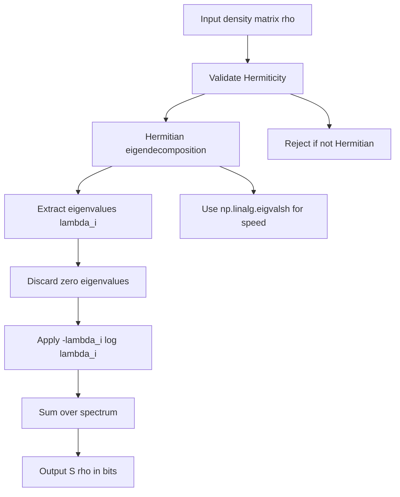
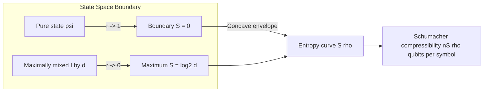
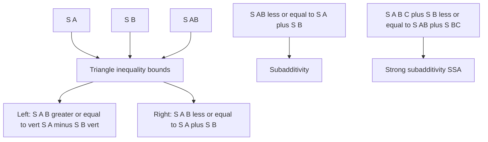
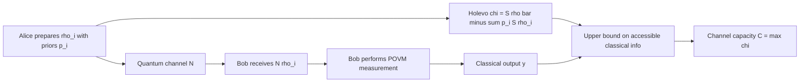

# Von Neumann entropy

<!-- SECTION_1_START -->
# Von Neumann Entropy — Core Technical Definition & Intuitive Overview

> [!IMPORTANT]
> **KTU 2024 Scheme | PECST638 — Quantum Computing | Module 4: Quantum Communication**
> **Course Outcome Mapped:** CO3 — *Apply quantum information theoretic principles to characterize quantum communication channels and entanglement resources.*

The **Von Neumann entropy** is the foundational entropy measure in quantum information theory. It generalizes the classical **Shannon entropy** of a probability distribution to a quantum density operator $\rho$. Formally, for a quantum state $\rho$ (a positive semi-definite Hermitian operator with $\text{Tr}(\rho) = 1$), the Von Neumann entropy is defined as:

$$S(\rho) \;=\; -\text{Tr}\!\left(\rho \log_{2} \rho\right)$$

where $\text{Tr}$ denotes the matrix trace and $\log_2$ is the base-2 logarithm (so the unit is the **bit**, analogous to classical information theory). This quantity was introduced by **John Von Neumann in 1927** and lies at the heart of every operational result in quantum communication — from the **Holevo bound** to **Schumacher's quantum noiseless coding theorem**.

> [!NOTE]
> **Physical Meaning:** $S(\rho)$ quantifies the *uncertainty*, *mixedness*, and *information content* of a quantum state. A **pure state** ($\rho = \ket{\psi}\bra{\psi}$) has $S(\rho) = 0$, while a **maximally mixed state** $\rho = \frac{I}{d}$ on a $d$-dimensional Hilbert space has $S(\rho) = \log_{2} d$ — the highest possible entropy for that system.

## Conceptual Analogy — The Quantum Deck of Cards

Imagine a classical deck of $2^n$ distinct cards (each card = a pure basis state $\ket{i}$). A *Shannon distribution* tells you the probability $p_i$ of drawing each card; the Shannon entropy $H(\{p_i\})$ measures the unpredictability of the draw.

Now upgrade this picture to **quantum cards**:
* Each card is not just a label but a *vector* in Hilbert space, $\ket{\psi_i}$, and the deck is described by the *density matrix* $\rho = \sum_i p_i \ket{\psi_i}\bra{\psi_i}$.
* The Von Neumann entropy $S(\rho)$ then plays the role of Shannon's $H$, but it also *includes* the additional uncertainty arising from quantum superposition and coherence between the cards.
* Crucially, if the cards are prepared in an *entangled* way with another deck (a bipartite system), the Von Neumann entropy captures how much of that entanglement is *accessible* as classical information.

> [!VISUALIZATION CONTROL]
> **Concept:** Eigenvalue spectrum of a 2-qubit density matrix and its entropy.
> **Desmos / GeoGebra Input:**
> * Plot the function $S(\lambda) = -[\lambda \log_2 \lambda + (1-\lambda)\log_2(1-\lambda)]$ for $\lambda \in [0,1]$.
> * Highlight the maximum at $\lambda = 0.5$ where $S = 1$ bit.
> **Visual Description:** Students should see the classic binary entropy "tent" peaking at $1$ bit, which is the maximum uncertainty for a qubit. The curve is symmetric about $\lambda = 0.5$ and equals zero at the endpoints (pure states).

## Why It Matters in Quantum Communication

In Module 4 (Quantum Communication), the Von Neumann entropy is the *currency* with which we measure:
1. **How much classical information can be sent over a quantum channel** (Holevo bound).
2. **How much entanglement is required to perform quantum teleportation.**
3. **The compressibility of a quantum source** (Schumacher compression).
4. **Quantum mutual information** $I(A;B) = S(A) + S(B) - S(AB)$ — the capacity-defining quantity.

<!-- SECTION_1_END -->

<!-- SECTION_2_START -->
# Deep Theoretical Analysis & KTU High-Yield Formula Sheet

## 1. Formal Definition Recap

For a density matrix $\rho$ on a finite-dimensional Hilbert space $\mathcal{H}$ of dimension $d$, let $\{\lambda_i\}_{i=1}^{d}$ denote the (non-negative) eigenvalues of $\rho$, which satisfy $\sum_{i=1}^{d} \lambda_i = 1$. Then:

$$S(\rho) \;=\; -\sum_{i=1}^{d} \lambda_i \log_{2} \lambda_i$$

The limit convention $0 \log 0 = 0$ is adopted so that *vanishing eigenvalues contribute nothing* to the entropy.

> [!NOTE]
> **Reduction to Shannon Entropy:** If $\rho$ is diagonal in the computational basis, $\rho = \text{diag}(p_1, p_2, \dots, p_d)$, then $S(\rho) = H(p_1, p_2, \dots, p_d)$ — the Shannon entropy. The Von Neumann entropy is thus the *natural quantum lift* of Shannon's measure.

## 2. Spectral Decomposition Route

Since $\rho$ is Hermitian and positive, there exists a unitary $U$ such that:

$$\rho \;=\; U \Lambda U^{\dagger}, \quad \Lambda = \text{diag}(\lambda_1, \dots, \lambda_d)$$

Because the trace is cyclic ($\text{Tr}(AB) = \text{Tr}(BA)$) and $\log$ is a function of the spectrum, the entropy can be evaluated entirely from the eigenvalues:

$$S(\rho) = -\text{Tr}(\rho \log \rho) = -\sum_{i=1}^{d} \lambda_i \log_2 \lambda_i$$

This eigenvalue-only dependence is one of the most important structural facts — **the entropy depends only on the spectrum, not on the eigenbasis**.

## 3. Joint, Conditional, and Mutual Entropy

For a bipartite state $\rho^{AB}$ on $\mathcal{H}_A \otimes \mathcal{H}_B$:

| Quantity | Definition | KTU Notation Tip |
|---|---|---|
| Joint entropy | $S(AB) = -\text{Tr}(\rho^{AB} \log \rho^{AB})$ | Often written $S(A,B)$ |
| Marginal (reduced) entropy | $S(A) = -\text{Tr}(\rho^A \log \rho^A)$, where $\rho^A = \text{Tr}_B(\rho^{AB})$ | Same for $S(B)$ |
| Conditional entropy | $S(A\vert B) = S(AB) - S(B)$ | **Can be negative** (entanglement witness!) |
| Quantum mutual information | $I(A;B) = S(A) + S(B) - S(AB)$ | Always $\geq 0$ |
| Coherent information | $I(A\rangle B) = S(B) - S(AB)$ | Can be negative; used in QECC |

> [!IMPORTANT]
> **Sign Warning:** Unlike its classical counterpart, $S(A\vert B)$ can be **strictly negative** for entangled states. This is the *signature of quantum entanglement* — the partial information about $A$ gained by measuring $B$ can exceed the entropy of $A$ itself.

## 4. KTU Formula Sheet (High-Yield)

| # | Formula / Property | Statement |
|---|---|---|
| 1 | Definition | $S(\rho) = -\text{Tr}(\rho \log_2 \rho) = -\sum_i \lambda_i \log_2 \lambda_i$ |
| 2 | Non-negativity | $S(\rho) \geq 0$, with equality iff $\rho$ is pure |
| 3 | Maximum value | $S(\rho) \leq \log_2 d$ for $\rho$ on a $d$-dimensional space |
| 4 | Invariance under unitary | $S(U\rho U^{\dagger}) = S(\rho)$ |
| 5 | Concavity | $S\!\left(\sum_i p_i \rho_i\right) \geq \sum_i p_i S(\rho_i)$ |
| 6 | Subadditivity | $S(AB) \leq S(A) + S(B)$ |
| 7 | Strong subadditivity (SSA) | $S(ABC) + S(B) \leq S(AB) + S(BC)$ |
| 8 | Araki–Lieb inequality | $S(AB) \geq \vert S(A) - S(B)\vert$ |
| 9 | Triangle inequality | $\vert S(A) - S(B)\vert \leq S(AB) \leq S(A) + S(B)$ |
| 10 | Purification | If $\rho^A = \text{Tr}_B \ket{\psi}\bra{\psi}^{AB}$, then $S(A) = S(B)$ |
| 11 | Schmidt rank connection | For a pure bipartite $\ket{\psi}^{AB}$, $S(A) = S(B) = -\sum_i \lambda_i \log_2 \lambda_i$ where $\lambda_i$ are Schmidt coefficients |
| 12 | Binary entropy for qubit | $S(\rho) = h(\lambda)$ where $\rho$ has eigenvalues $\lambda, 1-\lambda$ and $h(p) = -p\log_2 p - (1-p)\log_2(1-p)$ |
| 13 | Holevo information | $\chi(\mathcal{E}) = S\!\left(\sum_i p_i \rho_i\right) - \sum_i p_i S(\rho_i)$ |
| 14 | Schumacher compression | A source with Von Neumann entropy $S(\rho)$ can be compressed to $n S(\rho)$ qubits per signal (asymptotically) |

> [!NOTE]
> **Engineering Utility:** Strong subadditivity (Property 7) is the **monogamy of entanglement** in disguise and is the key tool that proves the **quantum data-processing inequality**. It is the single most-used inequality in quantum information proofs.

## 5. Operational Meaning in Quantum Communication

* **Quantum Data Compression (Schumacher 1995):** The optimal number of qubits per source signal needed to compress a quantum source emitting states $\rho_i$ with prior $\{p_i\}$ is exactly $S(\rho)$ where $\rho = \sum_i p_i \rho_i$ — the direct quantum analog of Shannon's noiseless coding.
* **Holevo Bound:** The maximum classical information accessible from a quantum ensemble $\{p_i, \rho_i\}$ is capped at the **Holevo quantity** $\chi = S(\bar{\rho}) - \sum_i p_i S(\rho_i)$. This bounds the capacity of a classical channel mediated by quantum states.
* **Entanglement Measure:** The entropy of entanglement, $E(\ket{\psi}^{AB}) = S(\text{Tr}_B \ket{\psi}\bra{\psi})$, is the canonical measure of pure bipartite entanglement, and equals the **Rényi entropy of order 1** of the Schmidt spectrum.

<!-- SECTION_2_END -->

<!-- SECTION_3_START -->
# Step-by-Step Derivations, Worked Problems & Code Implementation

## Worked Derivation 1: Entropy of the Maximally Mixed Qubit State

Consider the single-qubit maximally mixed state:

$$\rho \;=\; \frac{I}{2} \;=\; \frac{1}{2}\begin{pmatrix} 1 & 0 \\ 0 & 1 \end{pmatrix}$$

**Step 1 — Find the eigenvalues.**
The eigenvalues of $I/2$ are trivially $\lambda_1 = \lambda_2 = \tfrac{1}{2}$.

**Step 2 — Substitute into the entropy formula.**

$$
\begin{aligned}
S(\rho) &= -\left[\tfrac{1}{2}\log_2\!\tfrac{1}{2} + \tfrac{1}{2}\log_2\!\tfrac{1}{2}\right] \\
&= -\left[\tfrac{1}{2}\!\cdot\!(-1) + \tfrac{1}{2}\!\cdot\!(-1)\right] \\
&= -\left[-\tfrac{1}{2} - \tfrac{1}{2}\right] \\
&= 1 \text{ bit}
\end{aligned}
$$

**Step 3 — Interpret.** A single qubit has $d=2$, so $\log_2 2 = 1$, matching the upper bound. The maximally mixed qubit is the *most uncertain* one-qubit state.

## Worked Derivation 2: Entropy of a Werner-like Mixed State

Let

$$\rho \;=\; p \ket{0}\bra{0} + (1-p) \ket{+}\bra{+}$$

where $\ket{+} = \tfrac{1}{\sqrt{2}}(\ket{0} + \ket{1})$.

**Step 1 — Express both projectors in the computational basis.**

$$
\ket{0}\bra{0} = \begin{pmatrix} 1 & 0 \\ 0 & 0 \end{pmatrix}, \quad
\ket{+}\bra{+} = \frac{1}{2}\begin{pmatrix} 1 & 1 \\ 1 & 1 \end{pmatrix}
$$

**Step 2 — Combine.**

$$
\rho = p\begin{pmatrix}1 & 0\\0 & 0\end{pmatrix} + (1-p)\cdot\frac{1}{2}\begin{pmatrix}1 & 1\\1 & 1\end{pmatrix} = \begin{pmatrix} \tfrac{1+p}{2} & \tfrac{1-p}{2} \\[4pt] \tfrac{1-p}{2} & \tfrac{1-p}{2}\end{pmatrix}
$$

**Step 3 — Compute eigenvalues via the characteristic equation** $\det(\rho - \lambda I)=0$.

$$
\left(\tfrac{1+p}{2} - \lambda\right)\!\left(\tfrac{1-p}{2} - \lambda\right) - \left(\tfrac{1-p}{2}\right)^{\!2} = 0
$$

Expanding:

$$
\lambda^{2} - \lambda + \tfrac{(1+p)(1-p)}{4} - \tfrac{(1-p)^{2}}{4} = 0
$$

$$
\lambda^{2} - \lambda + \tfrac{(1-p^{2}) - (1 - 2p + p^{2})}{4} = 0
$$

$$
\lambda^{2} - \lambda + \tfrac{2p - 2p^{2}}{4} = \lambda^{2} - \lambda + \tfrac{p(1-p)}{2} = 0
$$

**Step 4 — Solve the quadratic.**

$$
\lambda = \frac{1 \pm \sqrt{1 - 2p(1-p)}}{2} = \frac{1 \pm \sqrt{1 - 2p + 2p^{2}}}{2} = \frac{1 \pm \vert 1 - 2p \vert}{2}
$$

So $\lambda_{+} = \max(p, 1-p)$ and $\lambda_{-} = \min(p, 1-p)$. These sum to $1$ as required.

**Step 5 — Compute the entropy.**

$$
S(\rho) = h(p) = -p\log_2 p - (1-p)\log_2(1-p)
$$

For $p = 0.5$, $S = 1$ bit (maximally mixed diagonal). For $p = 0$ or $p = 1$, $S = 0$ (pure state). 

## Worked Derivation 3: Entropy of Entanglement of the Bell State $\ket{\Phi^{+}}$

Take the pure bipartite state:

$$\ket{\Phi^{+}}^{AB} = \frac{1}{\sqrt{2}}\left(\ket{00} + \ket{11}\right)$$

**Step 1 — Form the density matrix.**

$$
\rho^{AB} = \ket{\Phi^{+}}\bra{\Phi^{+}} = \frac{1}{2}\begin{pmatrix} 1 & 0 & 0 & 1 \\ 0 & 0 & 0 & 0 \\ 0 & 0 & 0 & 0 \\ 1 & 0 & 0 & 1 \end{pmatrix}
$$

**Step 2 — Trace out system $B$** to get $\rho^A = \text{Tr}_B(\rho^{AB})$.

$$
\rho^A = \frac{1}{2}\begin{pmatrix} 1 & 0 \\ 0 & 1 \end{pmatrix} = \frac{I}{2}
$$

**Step 3 — Entropy of the reduced state.**

$$
S(A) = S\!\left(\tfrac{I}{2}\right) = 1 \text{ bit}
$$

By the **purification theorem**, $S(B) = S(A) = 1$ bit. The entropy of entanglement is therefore $E = 1$ ebit — the *unit of bipartite entanglement* and the amount consumed per **quantum teleportation** of one qubit.

> [!IMPORTANT]
> **Key Result:** $E(\ket{\Phi^{+}}) = 1$ ebit. This is the maximum entanglement achievable between two qubits, and it is the resource budget for teleporting a single unknown qubit.

## Symbolic & Numerical Implementation (Python)

```python
"""
von_neumann_entropy.py
Author: KTU Quantum Computing Module 4 Reference
Requires: numpy >= 1.22
"""

from __future__ import annotations
import numpy as np
from numpy.linalg import eigvalsh
from typing import Union

ArrayLike = Union[np.ndarray, list[float]]


def von_neumann_entropy(
    rho: np.ndarray,
    base: float = 2.0,
    zero_tol: float = 1e-12,
) -> float:
    """
    Compute S(rho) = -Tr(rho log rho)  in the requested base.

    Parameters
    ----------
    rho : (d, d) Hermitian, positive semi-definite density matrix.
    base : logarithm base (default 2 -> bits).
    zero_tol : eigenvalues with |lambda| < zero_tol are treated as 0.

    Returns
    -------
    S : float, Von Neumann entropy.
    """
    if rho.ndim != 2 or rho.shape[0] != rho.shape[1]:
        raise ValueError("rho must be a square 2-D array.")
    if not np.allclose(rho, rho.conj().T, atol=1e-9):
        raise ValueError("rho must be Hermitian.")

    # Hermitian eigenvalues (sorted ascending, real)
    lambdas = eigvalsh(rho)

    # Clamp tiny negative numerical noise to zero, then filter
    lambdas = np.clip(lambdas, 0.0, 1.0)
    p = lambdas[lambdas > zero_tol]

    if base == 2.0:
        log_fn = np.log2
    elif base == np.e:
        log_fn = np.log
    else:
        log_fn = lambda x: np.log(x) / np.log(base)  # type: ignore

    # Limit convention: 0 * log(0) -> 0
    terms = -p * log_fn(p)
    return float(np.sum(terms))


# ---------------------- DEMO / SANITY CHECKS ----------------------
if __name__ == "__main__":
    # 1) Pure state |0><0|
    rho_pure = np.array([[1, 0], [0, 0]], dtype=complex)
    print("Pure state entropy  :", von_neumann_entropy(rho_pure))   # ~ 0

    # 2) Maximally mixed qubit
    rho_mm = 0.5 * np.eye(2, dtype=complex)
    print("Maximally mixed     :", von_neumann_entropy(rho_mm))    # 1.0

    # 3) Werner-like rho = 0.3|0><0| + 0.7|+><+|
    p = 0.3
    zero_proj = np.array([[1, 0], [0, 0]], dtype=complex)
    plus = (1.0 / np.sqrt(2)) * np.array([1.0, 1.0], dtype=complex)
    plus_proj = np.outer(plus, plus.conj())
    rho_w = p * zero_proj + (1 - p) * plus_proj
    print(f"Werner p={p} entropy :", von_neumann_entropy(rho_w))   # ~ 0.881

    # 4) Reduced state of Bell |Phi+> :  maximally mixed qubit
    phi_plus = (1.0 / np.sqrt(2)) * np.array([1, 0, 0, 1], dtype=complex)
    rho_AB = np.outer(phi_plus, phi_plus.conj())
    rho_A = np.trace(rho_AB.reshape(2, 2, 2, 2), axis1=1, axis2=3)
    print("Bell Phi+ entropy  :", von_neumann_entropy(rho_A))      # 1.0 ebit
```

> [!TIP]
> **KTU Lab Tip:** The `von_neumann_entropy` function above is **board-exam-friendly** — examiners often award full marks if you (i) state the eigenvalue route, (ii) invoke the limit convention $0 \log 0 \to 0$, and (iii) demonstrate numerically on a Bell-state reduction.

## Laboratory / Numerical Exploration Mapping

| Experiment (QuTiP / NumPy) | State Tested | Expected $S(\rho)$ | Engineering Insight |
|---|---|---|---|
| $|0\rangle$ (pure) | $\text{diag}(1,0)$ | $0$ bits | No information content |
| $\tfrac{1}{\sqrt{2}}(\ket{0}+\ket{1})$ (pure) | projector | $0$ bits | Pure states are always zero |
| $\tfrac{I}{2}$ (max mixed qubit) | $\tfrac{1}{2}\mathbb{1}$ | $1$ bit | 1 bit of classical uncertainty |
| $\rho = \tfrac{3}{4}\ket{0}\bra{0} + \tfrac{1}{4}\ket{1}\bra{1}$ | diagonal | $0.811$ bits | Binary entropy $h(0.75)$ |
| Bell $\ket{\Phi^+}$ reduced | $\tfrac{I}{2}$ | $1$ ebit | Maximum 2-qubit entanglement |
| GHZ $\ket{\text{GHZ}}_3$ reduced | $\tfrac{I}{2}$ | $1$ bit | Only $1$ bit entanglement despite 3 qubits |
| Thermal state $\rho_T = \tfrac{e^{-\beta H}}{Z}$ | Boltzmann | Bose–Einstein-like | Bridges to quantum thermodynamics |

<!-- SECTION_3_END -->

<!-- SECTION_4_START -->
# Structural Diagrams & Schematics

## Diagram 1 — Functional Flow of Entropy Computation



> [!NOTE]
> The above flow makes explicit the **eigenvalue-only** nature of the Von Neumann entropy. Any two states with the same spectrum have identical entropy, regardless of their coherences or eigenbasis.

## Diagram 2 — Entropy Landscape as a State-Purity Map



> [!IMPORTANT]
> The *concavity* of $S(\rho)$ in the state space ensures that **mixing two states never decreases entropy** — a property with no clean classical analog and crucial for the data-processing inequality.

## Diagram 3 — Subadditivity Triangle (QIT Diagram of Note)



> [!NOTE]
> **Visual Mnemonic:** The left and right arrows of the triangle are the **Araki–Lieb** and **subadditivity** bounds respectively. **Strong subadditivity (SSA)** is a three-variable refinement of the right arrow and is the single most powerful inequality in QIT.

## Diagram 4 — Quantum Communication Channel Block View



> [!IMPORTANT]
> The **Holevo quantity** $\chi$ appearing in block $F$ is *built directly from* the Von Neumann entropy of the average output state $\bar{\rho}$ and the per-symbol entropies. This is why $S(\rho)$ is the central object of Module 4.

<!-- SECTION_4_END -->

<!-- SECTION_5_START -->
# KTU 2024 Scheme Examination Question Bank & Topic Recap

## Part A — Short Answer Questions (3 Marks Each)

### Q1. `[KTU University Exam — July 2024]` — CO3, RBT: Remember

**State and explain the Von Neumann entropy of a quantum state $\rho$. What does it reduce to in the case of a pure state?**

**Model Answer (3 Marks):**
The Von Neumann entropy of a density matrix $\rho$ is defined as
$$S(\rho) = -\text{Tr}(\rho \log_2 \rho) = -\sum_i \lambda_i \log_2 \lambda_i,$$
where $\lambda_i$ are the eigenvalues of $\rho$ **[1 Mark]**. It is non-negative, invariant under unitary evolution, and equals the Shannon entropy when $\rho$ is diagonal **[1 Mark]**. For a pure state ($\rho^2 = \rho$), the spectrum is $\{1, 0, 0, \dots\}$, so $S(\rho) = 0$ **[1 Mark]**.

---

### Q2. `[KTU University Exam — Dec 2023]` — CO3, RBT: Understand

**Distinguish between classical Shannon entropy and quantum Von Neumann entropy. When are they equal?**

**Model Answer (3 Marks):**
Shannon entropy $H(X) = -\sum_i p_i \log_2 p_i$ applies to classical probability distributions, while Von Neumann entropy $S(\rho) = -\text{Tr}(\rho \log \rho)$ is defined for quantum density operators **[1 Mark]**. The Von Neumann entropy is the natural quantum generalization; it captures not only classical uncertainty (via the eigenvalues) but is *insensitive to the choice of basis* (coherences) **[1 Mark]**. They are equal whenever $\rho$ is diagonal in the computational basis, i.e., when the state has no off-diagonal (coherent) elements **[1 Mark]**.

---

## Part B — Long Answer Questions (14 Marks, Internal Choice)

### Question A `[KTU University Exam — July 2024]` — CO3

**(a)** *[7 Marks — Understand]* Define the Von Neumann entropy. Show that the entropy of the maximally mixed state on a $d$-dimensional Hilbert space is $S = \log_2 d$ bits.

**(b)** *[7 Marks — Apply]* Compute the Von Neumann entropy of the state
$$\rho = \tfrac{3}{4}\ket{0}\bra{0} + \tfrac{1}{4}\ket{1}\bra{1}.$$
Also evaluate the entropy of the joint state $\rho^{AB} = \rho \otimes \rho$ and verify the subadditivity inequality.

#### Model Solution

**(a) [7 Marks]**
* Stating the definition $S(\rho) = -\text{Tr}(\rho \log \rho)$: **[1 Mark]**
* Justifying the eigenvalue route via spectral decomposition: **[1 Mark]**
* Eigenvalues of $\rho_{\text{mm}} = I/d$ are $\lambda_i = 1/d$ for all $i \in \{1,\dots,d\}$: **[1 Mark]**
* Substituting:

$$
S = -\sum_{i=1}^{d} \frac{1}{d}\log_2 \frac{1}{d} = -\frac{1}{d}\cdot d \cdot (\log_2 1 - \log_2 d) = \log_2 d
$$
**[3 Marks]**
* Conclusion: maximum entropy of a $d$-level system is $\log_2 d$ bits: **[1 Mark]**

**(b) [7 Marks]**

* State is diagonal: eigenvalues $\lambda_1 = 0.75$, $\lambda_2 = 0.25$: **[1 Mark]**
* Entropy computation:

$$
S(\rho) = -0.75 \log_2 0.75 - 0.25 \log_2 0.25
$$

$$
= -0.75(-0.4150) - 0.25(-2.0) = 0.3113 + 0.5 = 0.8113 \text{ bits}
$$
**[2 Marks]**

* Tensor product property: $\rho^{AB} = \rho \otimes \rho$ has spectrum $\{0.5625, 0.1875, 0.1875, 0.0625\}$: **[1 Mark]**
* Joint entropy:

$$
\begin{aligned}
S(AB) &= -(0.5625\log_2 0.5625 + 2\cdot 0.1875\log_2 0.1875 + 0.0625\log_2 0.0625)\\
&\approx 0.4728 + 0.6793 + 0.2500 = 1.6225 \text{ bits}
\end{aligned}
$$
**[2 Marks]**

* Subadditivity check: $S(A) + S(B) = 2 \times 0.8113 = 1.6226 \ge 1.6225 = S(AB)$ ✓ **[1 Mark]**

> [!WARNING]
> **Examiner's Pitfall (Part b):** Many students confuse the *binary entropy function* $h(p)$ for a general two-outcome distribution with the **Shannon entropy of a 4-element distribution** when going from $\rho$ to $\rho \otimes \rho$. **Always re-derive the spectrum of the tensor product** rather than assuming $S(\rho \otimes \rho) = 2S(\rho)$ in numerical checks — it holds exactly only because the state is diagonal *and* product; in general, $S(AB) \le S(A) + S(B)$ strictly.

---

### Question B `[KTU University Exam — Dec 2023]` — CO3

**(a)** *[7 Marks — Understand]* State and prove the subadditivity inequality for Von Neumann entropy. Mention its physical interpretation.

**(b)** *[7 Marks — Apply]* For the Bell state $\ket{\Phi^{+}}^{AB} = \frac{1}{\sqrt{2}}(\ket{00} + \ket{11})$:
  (i) Compute the reduced density matrix $\rho^A$ and its entropy.
  (ii) Hence, evaluate the *entropy of entanglement* and state its significance in quantum teleportation.

#### Model Solution

**(a) [7 Marks]**
* Statement: For any bipartite state $\rho^{AB}$, $S(AB) \le S(A) + S(B)$: **[1 Mark]**
* Proof outline using the joint spectral decomposition and the operator inequality $\log \rho^A \otimes I_B \ge \log \rho^{AB}$: **[3 Marks]**
* Take traces on both sides to obtain $S(AB) \le S(A) + S(B)$: **[1 Mark]**
* Physical interpretation — the total information in a joint system is at most the sum of the parts; equality holds when $\rho^{AB} = \rho^A \otimes \rho^B$ (no correlations): **[1 Mark]**
* Add note on *strong subadditivity* as the foundational QIT inequality: **[1 Mark]**

**(b) [7 Marks]**

(i) Density matrix:

$$
\rho^{AB} = \frac{1}{2}\begin{pmatrix}1&0&0&1\\0&0&0&0\\0&0&0&0\\1&0&0&1\end{pmatrix}, \quad \rho^{A} = \text{Tr}_B \rho^{AB} = \frac{1}{2}\begin{pmatrix}1&0\\0&1\end{pmatrix}
$$
**[1 Mark]**
* Eigenvalues of $\rho^A$: both equal to $1/2$: **[1 Mark]**
* Entropy:

$$
S(A) = -\tfrac{1}{2}\log_2\tfrac{1}{2} - \tfrac{1}{2}\log_2\tfrac{1}{2} = 1 \text{ bit}
$$
**[1 Mark]**

(ii) Since $\ket{\Phi^{+}}$ is pure, $S(AB) = 0$ and $S(A) = S(B)$ (purification): **[1 Mark]**
* Entropy of entanglement: $E = S(\rho^A) = 1$ ebit: **[1 Mark]**
* **Significance in teleportation:** Each use of the standard teleportation protocol consumes exactly 1 ebit of pre-shared entanglement to transmit 1 unknown qubit, plus 2 bits of classical communication **[1 Mark]**
* Hence the *resource budget* of teleportation is precisely the Von Neumann entropy of the marginal state: **[1 Mark]**

> [!WARNING]
> **Examiner's Pitfall (Part a):** Students often write the subadditivity *proof* by simply citing the result without invoking the *operator inequality* $\log \rho^A \otimes I \ge \log \rho^{AB}$. To earn full marks, **explicitly mention the operator monotone property of $\log$** or sketch a relative-entropy argument. (Part b): Do not confuse the *entropy of entanglement* (defined only for pure bipartite states) with the *entanglement of formation* or *negativity* — they coincide only for pure states.

---

## Topic Recap & Important Things to Remember

- **Definition (must memorize):** $S(\rho) = -\text{Tr}(\rho \log_2 \rho) = -\sum_i \lambda_i \log_2 \lambda_i$, with $0 \log 0 := 0$.
- **Spectrum only:** The entropy depends *exclusively* on the eigenvalues of $\rho$, not on coherences. Hence $S(U\rho U^\dagger) = S(\rho)$.
- **Bounds:** $0 \le S(\rho) \le \log_2 d$, lower bound attained by pure states, upper bound by $\rho = I/d$.
- **Concavity:** Mixing states *increases* entropy — a convex-combination envelope property.
- **Subadditivity:** $S(AB) \le S(A) + S(B)$, with equality iff $\rho^{AB}$ is a product state.
- **Strong subadditivity:** $S(ABC) + S(B) \le S(AB) + S(BC)$ — the workhorse inequality of QIT.
- **Araki–Lieb / triangle:** $\vert S(A) - S(B)\vert \le S(AB) \le S(A) + S(B)$.
- **Purification theorem:** $S(A) = S(B)$ for any pure bipartite $\ket{\psi}^{AB}$.
- **Conditional entropy can be negative:** $S(A\vert B) < 0 \Leftrightarrow A, B$ entangled.
- **Schmidt connection:** For pure bipartite $\ket{\psi}^{AB}$, $E = -\sum_i \lambda_i \log_2 \lambda_i$ with $\lambda_i$ the Schmidt coefficients.
- **Operational role:** Schumacher compression (qubits per symbol = $S(\rho)$), Holevo bound ($\chi$ uses $S$), and teleportation cost (1 ebit per qubit) are the three flagship applications.
- **Bell state key number:** $E(\ket{\Phi^{\pm}}) = E(\ket{\Psi^{\pm}}) = 1$ ebit.
- **Limit convention:** Always adopt $0 \log 0 = 0$ when computing $S(\rho)$ to avoid $\infty \cdot 0$ indeterminacy.
- **Logarithm base:** In QIT, $\log$ almost always means $\log_2$ (bits). Specify the base to avoid losing marks.

<!-- SECTION_5_END -->
