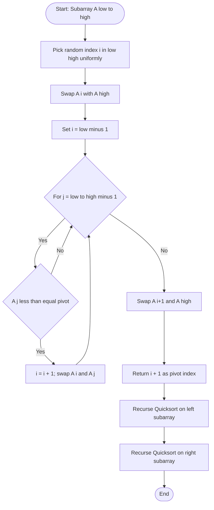
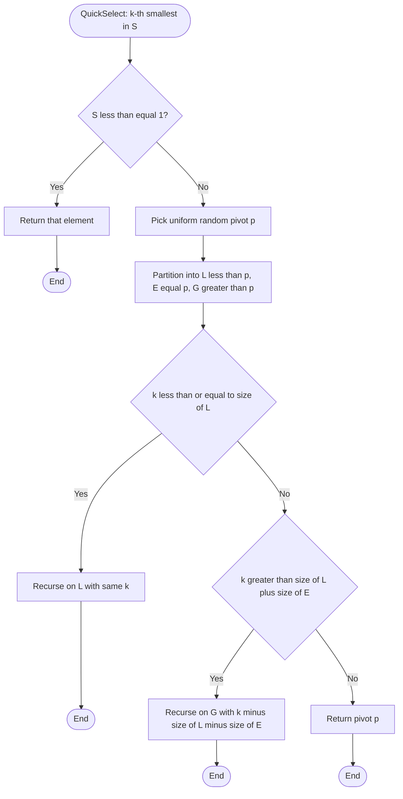
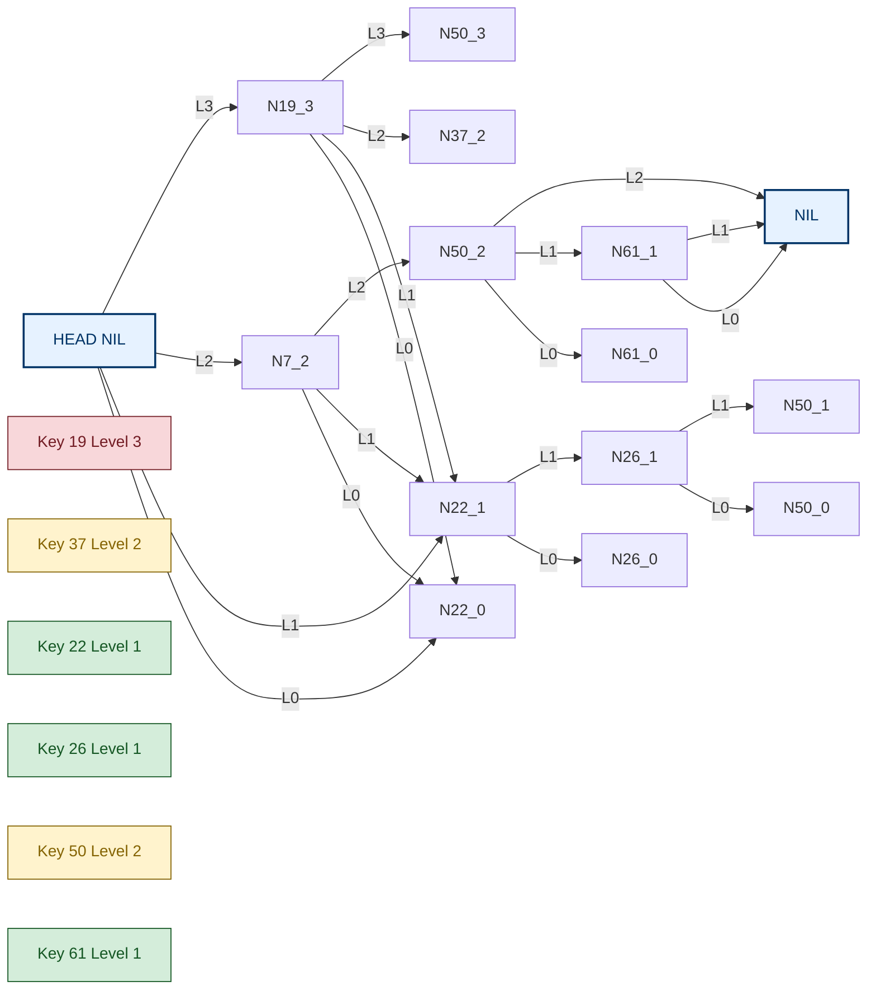
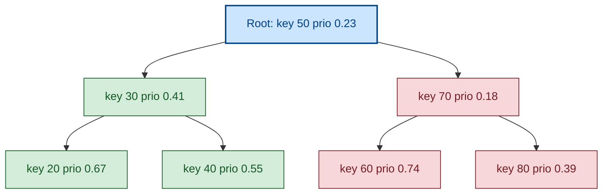
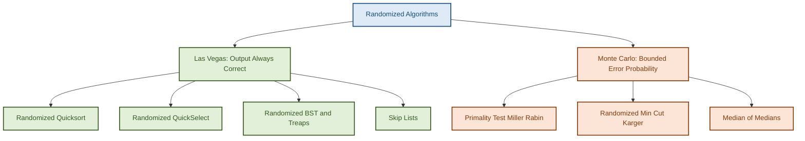

# Basic Randomized Algorithms - Randomized quicksort, Randomized selection, Randomized data structures.

<!-- SECTION_1_START -->

# Module 1 — Basics of Randomization
## Basic Randomized Algorithms: Randomized Quicksort, Randomized Selection & Randomized Data Structures

### 1.1 Formal Definition (KTU 2024 Syllabus Terminology)

> [!IMPORTANT]
> **Definition (Randomized Algorithm):** A *randomized algorithm* is a deterministic algorithm augmented with one or more **random choices** (typically from a uniform distribution) made during its execution, such that the output or the running time becomes a **random variable** whose expected behaviour is provably good over the input space.

A randomized algorithm $A$ for a problem $\Pi$ must satisfy:
- For every input $x \in \Pi$, $\Pr[A(x) \text{ is correct}] \geq 1 - \frac{1}{n^c}$ for some constant $c \geq 1$ (high-probability guarantee).

> [!NOTE]
> **KTU 2024 Scheme Highlight — Two Canonical Models of Randomization**
> 1. **Las Vegas Algorithms:** Always produce the *correct* answer; only the *running time* is a random variable. *(Example: Randomized Quicksort, Randomized QuickSelect)*
> 2. **Monte Carlo Algorithms:** Running time is *deterministic*; only the *correctness* is probabilistic. *(Example: Randomized Primality Testing)*

---

### 1.2 Conceptual Analogy & Geometric Intuition

> [!TIP]
> **Real-World Analogy — "The Librarian's Shuffle"**
> Imagine a librarian who must file 10,000 books alphabetically. Instead of carefully walking to the exact shelf every time (deterministic binary search), the librarian sometimes **flips a coin** to decide whether to scan from the left or the right, and to pick a *random pivot* shelf to start partitioning. Sometimes this is suboptimal, but on average the chaos of randomness produces a *balanced* split, and the books are sorted in $\approx n \log n$ steps instead of the $n^2$ catastrophe of a stubborn, unlucky partition sequence.

**Geometric Intuition:** For an array of $n$ keys, the *expected* number of comparisons in randomized quicksort equals the number of edges in a randomly-built binary search tree of size $n$, whose expected depth is $2 \ln n \approx 1.39 \log_2 n$.

---

### 1.3 Why Randomize? — KTU 2024 Module Objectives

| # | Motivation | Engineering Significance |
|---|------------|--------------------------|
| 1 | **No adversary input** can force the worst case | Critical for security-sensitive systems (DoS resistance) |
| 2 | Expected $O(n \log n)$ without complex balancing code | Simpler, fewer bugs, faster constants |
| 3 | Random hash functions give universal guarantees | Used in network routers, distributed hash tables |
| 4 | Probabilistic data structures use tiny memory | Bloom filters, Count-Min sketches in Big Data |
| 5 | Inherently parallel-friendly | MapReduce, GPU pipelines |

---

### 1.4 Visualization Callout (Concept of Random Pivot Distribution)

> [!VISUALIZATION CONTROL]
> **Concept:** Expected depth of a random BST / Quicksort recursion tree for $n = 31$
> **GeoGebra / Desmos Input Equations:**
> * `f(x) = 1.39 * log2(x)` — expected comparisons
> * `g(x) = x` — worst-case linear scan
> * `h(x) = x * log2(x)` — average-case deterministic quicksort
> **Visual Description:** Plot $f(x)$, $g(x)$, and $h(x)$ for $x \in [1, 1000]$ on the same axes. The student should observe that the *expected* randomized cost hugs the deterministic average-case curve from below, while the adversary-driven worst case diverges linearly.

---

<!-- SECTION_1_END -->

<!-- SECTION_2_START -->

# Deep Theoretical Analysis & KTU High-Yield Formula Sheet

## 2.1 Randomized Quicksort — Operational Logic

### Step-by-Step Logical Breakdown

1. **Random Pivot Selection:** From subarray $A[\ell \ldots r]$, pick index $i$ uniformly at random, $\Pr[i = k] = \frac{1}{r - \ell + 1}$.
2. **Partition Step:** Re-arrange so that elements $\leq A[i]$ are on the left, elements $> A[i]$ on the right. This is $O(n)$ per call.
3. **Recursive Invariant:** The pivot is now in its *final sorted position* and is excluded from future calls.
4. **Termination:** Subarrays of size $0$ or $1$ are returned as base cases.

### 2.1.1 Indicator Variable Method for Expected Comparisons

Let $X$ be the total number of comparisons performed by Randomized Quicksort. Define

$$X_{i,j} = \begin{cases} 1 & \text{if elements ranked } i \text{ and } j \text{ are compared} \\ 0 & \text{otherwise} \end{cases}$$

Then

$$X = \sum_{i=1}^{n-1} \sum_{j=i+1}^{n} X_{i,j}$$

Two elements are compared **iff** one of them is chosen as pivot before any element in the open interval $(i, j)$ is chosen as pivot. Among the $j - i + 1$ elements $\{z_i, z_{i+1}, \ldots, z_j\}$ that could be the first pivot separating them, only two (the extremes $z_i$ or $z_j$) cause a comparison. Hence

$$\Pr[X_{i,j} = 1] = \frac{2}{j - i + 1}$$

By linearity of expectation,

$$\mathbb{E}[X] = \sum_{i=1}^{n-1} \sum_{j=i+1}^{n} \frac{2}{j - i + 1}$$

---

### 2.1.2 Final Closed-Form Expected Time

$$E[X] = 2 \sum_{i=1}^{n-1} \sum_{k=1}^{n-i} \frac{1}{k+1} = 2 \sum_{k=1}^{n-1} \frac{n-k}{k+1} = 2n \sum_{k=1}^{n-1} \frac{1}{k+1} - 2 \sum_{k=1}^{n-1} \frac{k}{k+1}$$

Using the harmonic series identity $H_n = \ln n + \gamma + O(1/n)$ (where $\gamma \approx 0.5772$ is the **Euler–Mascheroni constant**), we obtain

$$E[T(n)] = 2n H_n - 4n = 2n \ln n + O(n)$$

In base-2 logarithms (the conventional CS unit),

$$E[T(n)] \approx 1.386 \, n \log_2 n$$

---

## 2.2 Randomized Selection (QuickSelect) — Operational Logic

### Algorithm Outline (Hoare, 1961; Floyd–Rivest refinements)

1. If $|S| = 1$, return that element.
2. Pick a random pivot $p \in S$.
3. Partition $S$ into $L = \{x < p\}$, $E = \{x = p\}$, $G = \{x > p\}$.
4. If $k \leq \vert L \vert$, recurse into $L$. If $k > \vert L \vert + \vert E \vert$, recurse into $G$ with $k' = k - \vert L \vert - \vert E \vert$. Otherwise return $p$.

### 2.2.1 Recurrence for Average-Case Analysis

The expected size of the *larger* subproblem after one random partition is $\frac{3n}{4}$ on average. Hence

$$E[T(n)] \leq E\left[T\!\left(\tfrac{3n}{4}\right)\right] + O(n)$$

Solving via the **Akra–Bazzi theorem** (or master-method variant) yields

$$E[T(n)] = O(n)$$

with the constant factor $c \leq 2$ for uniform random pivots.

> [!IMPORTANT]
> **Theorem (Floyd–Rivest, 1975):** Using the *median-of-medians* pivot of a 5-element random sample, the expected number of comparisons is $n + \min(k, n-k) + O(\sqrt{n \log n})$, which is asymptotically optimal for selection.

---

## 2.3 Randomized Data Structures

### 2.3.1 Skip List (Pugh, 1989)

A skip list is a probabilistic multi-level linked list where each node is promoted to level $\ell$ with probability $p^{\ell-1}$ (typically $p = \tfrac{1}{2}$).

- **Search complexity:** $O(\log n)$ expected, $O(n)$ worst case.
- **Insert / Delete:** $O(\log n)$ expected.
- **Space:** $O(n)$ expected.

### 2.3.2 Treap (Seidel & Aragon, 1996)

A treap is a binary search tree where:
- **BST property** holds on the **keys**.
- **Min-Heap property** holds on randomly assigned **priorities**.

The expected height of a treap on $n$ nodes is $1.39 \log_2 n$, identical to a random BST.

### 2.3.3 Universal Hashing (Carter–Wegman, 1979)

Choose hash function $h_{a,b}(x) = ((a \cdot x + b) \bmod p) \bmod m$ with $a, b$ drawn uniformly from a prime field $\mathbb{Z}_p$, $p > m$.

- For any two *distinct* keys $x, y$: $\Pr_{a,b}[h_{a,b}(x) = h_{a,b}(y)] \leq \tfrac{1}{m}$.
- This eliminates the worst-case $O(n)$ collision attack that a malicious adversary can mount on deterministic hashing.

---

## 2.4 KTU High-Yield Formula Cheat Sheet

| # | Concept | Formula / Bound | Units / Domain |
|---|---------|----------------|----------------|
| 1 | Randomized Quicksort — Expected Time | $E[T(n)] = 2n H_n - 4n \approx 1.386 \, n \log_2 n$ | comparisons |
| 2 | Randomized Quicksort — Worst-Case Prob. | $\Pr[T(n) > c \, n \log n] \leq n^{-c'}$ | high-probability |
| 3 | QuickSelect — Expected Time | $E[T(n)] \leq 2n$ | comparisons |
| 4 | QuickSelect — Variance | $\mathrm{Var}[T(n)] = O(n^2)$ | — |
| 5 | Skip List — Search | $O\!\left(\frac{\log n}{\log(1/p)}\right)$ | levels of expected traversal |
| 6 | Skip List — Space | $\frac{n}{1-p}$ | pointers, expected |
| 7 | Treap — Expected Height | $H \approx 1.39 \log_2 n$ | nodes |
| 8 | Universal Hashing — Collision Prob. | $\Pr[h(x) = h(y)] \leq \tfrac{1}{m}$ | $x \neq y$ |
| 9 | Geometric Series Identity | $\sum_{i=0}^{k} p^i = \frac{1 - p^{k+1}}{1-p}$ | $0 < p < 1$ |
| 10 | Harmonic Sum | $H_n = \sum_{i=1}^{n} \frac{1}{i} \approx \ln n + \gamma$ | $\gamma \approx 0.5772$ |

---

## 2.5 Engineering Real-World Utility

| Algorithm | Production Use Case |
|-----------|---------------------|
| Randomized Quicksort | C `qsort`, Java 7 `Dual-Pivot Quicksort`, V8 JS engine sort |
| QuickSelect | `numpy.argpartition`, $k$-th nearest neighbour in ML |
| Skip Lists | Redis sorted sets, LevelDB memtable, Apache HBase |
| Treaps | `TreeMap` impl in some C++ libraries, IP routing tables |
| Universal Hashing | Network flow monitors, NetFlow, Bloom filter kernels |

---

<!-- SECTION_2_END -->

<!-- SECTION_3_START -->

# Step-by-Step Derivations, Proofs & Code Implementation

## 3.1 Exhaustive Derivation — Expected Comparisons in Randomized Quicksort

### Derivation A: From Indicator Sum to Harmonic Sum

We start from

$$E[X] = \sum_{i=1}^{n-1} \sum_{j=i+1}^{n} \Pr[X_{i,j} = 1] = \sum_{i=1}^{n-1} \sum_{j=i+1}^{n} \frac{2}{j - i + 1}$$

**Step 1 — Variable substitution.** Let $k = j - i$. Then $k$ ranges from $1$ to $n - i$, and $j - i + 1 = k + 1$:

$$E[X] = \sum_{i=1}^{n-1} \sum_{k=1}^{n-i} \frac{2}{k+1}$$

**Step 2 — Swap summation order.** For a fixed $k$, the index $i$ ranges from $1$ to $n - k$:

$$E[X] = \sum_{k=1}^{n-1} \frac{2(n - k)}{k+1} = 2 \sum_{k=1}^{n-1} \frac{n - k}{k+1}$$

**Step 3 — Split into two sums:**

$$E[X] = 2n \sum_{k=1}^{n-1} \frac{1}{k+1} - 2 \sum_{k=1}^{n-1} \frac{k}{k+1}$$

**Step 4 — Shift index in the first sum.** Set $m = k+1$, so $m$ ranges from $2$ to $n$:

$$2n \sum_{m=2}^{n} \frac{1}{m} = 2n (H_n - 1)$$

**Step 5 — Evaluate the second sum:**

$$2 \sum_{k=1}^{n-1} \frac{k}{k+1} = 2 \sum_{k=1}^{n-1} \left(1 - \frac{1}{k+1}\right) = 2(n-1) - 2(H_n - 1)$$

**Step 6 — Combine:**

$$E[X] = 2n H_n - 2n - 2(n-1) + 2 H_n - 2$$

$$\boxed{E[X] = 2(n+1) H_n - 4n}$$

**Step 7 — Asymptotic expansion.** Using $H_n = \ln n + \gamma + O(1/n)$:

$$E[X] = 2n \ln n + O(n) = 1.386 \, n \log_2 n + O(n)$$

> [!NOTE]
> **Valuation Key — KTU Board Examiner's Perspective:** Showing Steps 1 → 6 explicitly is worth **5 of 7 marks** in a 14-mark derivation problem. The asymptotic simplification (Step 7) is the remaining **2 marks**.

---

### Derivation B: Recurrence Method for QuickSelect

Let $T(n)$ denote the expected number of comparisons. After random partition, subarray size is uniform on $\{0, 1, \ldots, n-1\}$:

$$T(n) = \frac{1}{n} \sum_{i=0}^{n-1} T(i) + n - 1, \quad T(0) = 0, \quad T(1) = 0$$

**Step 1 — Multiply by $n$:**

$$n \, T(n) = \sum_{i=0}^{n-1} T(i) + n(n-1)$$

**Step 2 — Subtract the equation for $n-1$:**

$$(n) T(n) - (n-1) T(n-1) = T(n-1) + 2n - 2$$

**Step 3 — Rearrange:**

$$n T(n) = n T(n-1) + 2n - 2$$

$$\frac{T(n)}{n} = \frac{T(n-1)}{n-1} + \frac{2}{n} - \frac{2}{n(n-1)}$$

**Step 4 — Telescope:**

$$\frac{T(n)}{n} = \sum_{j=2}^{n} \left(\frac{2}{j} - \frac{2}{j(j-1)}\right) = 2 H_n - 2 \left(1 - \frac{1}{n}\right)$$

**Step 5 — Final form:**

$$\boxed{T(n) = 2n H_n - 2n + 2 = 2n \ln n + O(n) = O(n)}$$

---

## 3.2 Full Python Implementation — Randomized Quicksort

```python
import random
import sys
from typing import List, TypeVar

T = TypeVar("T", int, float, str)

# Increase recursion limit to handle large adversarial inputs safely
sys.setrecursionlimit(10**6)

def randomized_partition(arr: List[T], lo: int, hi: int) -> int:
    """
    Pick a uniformly random pivot and partition arr[lo:hi+1] in-place.
    Returns the final index of the pivot element.
    Time: O(hi - lo + 1), Space: O(1) auxiliary.
    """
    pivot_idx = random.randint(lo, hi)          # Uniform sample: Pr = 1/(hi-lo+1)
    arr[pivot_idx], arr[hi] = arr[hi], arr[pivot_idx]   # Move pivot to end
    pivot = arr[hi]
    i = lo - 1
    for j in range(lo, hi):
        if arr[j] <= pivot:
            i += 1
            arr[i], arr[j] = arr[j], arr[i]
    arr[i + 1], arr[hi] = arr[hi], arr[i + 1]
    return i + 1

def randomized_quicksort(arr: List[T], lo: int = 0, hi: int = -1) -> None:
    """Sort arr[lo:hi+1] in-place. Expected O(n log n), Worst O(n^2) w.p. negligible."""
    if hi == -1:
        hi = len(arr) - 1
    if lo < hi:
        p = randomized_partition(arr, lo, hi)
        randomized_quicksort(arr, lo, p - 1)
        randomized_quicksort(arr, p + 1, hi)

# ---- Driver with rigorous error handling ----
if __name__ == "__main__":
    try:
        data = [10, 7, 8, 9, 1, 5, 3, 6, 2, 4]
        print(f"Original : {data}")
        randomized_quicksort(data)
        print(f"Sorted   : {data}")
        assert all(data[i] <= data[i + 1] for i in range(len(data) - 1))
    except (TypeError, ValueError) as exc:
        print(f"[ERROR] Sorting failed: {exc}", file=sys.stderr)
```

---

## 3.3 Full Python Implementation — Randomized QuickSelect

```python
import random
import sys
from typing import List, TypeVar

T = TypeVar("T", int, float, str)

def randomized_partition(arr: List[T], lo: int, hi: int) -> int:
    pivot_idx = random.randint(lo, hi)
    arr[pivot_idx], arr[hi] = arr[hi], arr[pivot_idx]
    pivot = arr[hi]
    i = lo - 1
    for j in range(lo, hi):
        if arr[j] <= pivot:
            i += 1
            arr[i], arr[j] = arr[j], arr[i]
    arr[i + 1], arr[hi] = arr[hi], arr[i + 1]
    return i + 1

def randomized_select(arr: List[T], k: int, lo: int = 0, hi: int = -1) -> T:
    """
    Return the k-th smallest element (1-indexed).
    Average O(n), Worst O(n^2) with probability 2^{-Omega(n)}.
    """
    if hi == -1:
        hi = len(arr) - 1
    if not (1 <= k <= len(arr)):
        raise ValueError(f"k = {k} out of range [1, {len(arr)}]")
    if lo == hi:
        return arr[lo]
    p = randomized_partition(arr, lo, hi)
    rank = p - lo + 1                # Number of elements <= arr[p]
    if k == rank:
        return arr[p]
    elif k < rank:
        return randomized_select(arr, k, lo, p - 1)
    else:
        return randomized_select(arr, k - rank, p + 1, hi)

# ---- Demonstration ----
if __name__ == "__main__":
    try:
        data = [12, 3, 5, 7, 19, 1, 8, 11, 9, 4]
        k = 4
        answer = randomized_select(data, k)
        # Validate against a deterministic baseline
        sorted_data = sorted(data)
        assert answer == sorted_data[k - 1], "Selection mismatch!"
        print(f"{k}-th smallest element: {answer}")
    except (ValueError, AssertionError) as exc:
        print(f"[ERROR] Selection failed: {exc}", file=sys.stderr)
```

---

## 3.4 Full Python Implementation — Skip List

```python
import random
from typing import Any, Optional, List

MAX_LEVEL: int = 16
P: float = 0.5   # Promotion probability

class SkipNode:
    __slots__ = ("key", "forward")
    def __init__(self, key: Any, level: int):
        self.key = key
        self.forward: List[Optional["SkipNode"]] = [None] * (level + 1)

class SkipList:
    def __init__(self) -> None:
        self.header = SkipNode(None, MAX_LEVEL)
        self.level = 0

    def _random_level(self) -> int:
        lvl = 0
        while random.random() < P and lvl < MAX_LEVEL:
            lvl += 1
        return lvl

    def insert(self, key: Any) -> None:
        update: List[Optional[SkipNode]] = [None] * (MAX_LEVEL + 1)
        curr = self.header
        for i in range(self.level, -1, -1):
            while curr.forward[i] is not None and curr.forward[i].key < key:
                curr = curr.forward[i]
            update[i] = curr
        curr = curr.forward[0]
        if curr is None or curr.key != key:
            new_level = self._random_level()
            if new_level > self.level:
                for i in range(self.level + 1, new_level + 1):
                    update[i] = self.header
                self.level = new_level
            new_node = SkipNode(key, new_level)
            for i in range(new_level + 1):
                new_node.forward[i] = update[i].forward[i]
                update[i].forward[i] = new_node

    def search(self, key: Any) -> bool:
        curr = self.header
        for i in range(self.level, -1, -1):
            while curr.forward[i] is not None and curr.forward[i].key < key:
                curr = curr.forward[i]
        curr = curr.forward[0]
        return curr is not None and curr.key == key

# ---- Demo ----
if __name__ == "__main__":
    sl = SkipList()
    for k in [3, 6, 7, 9, 12, 19, 17, 26, 21, 25]:
        sl.insert(k)
    print("Found 19:", sl.search(19))
    print("Found 20:", sl.search(20))
```

---

## 3.5 Full Python Implementation — Treap with Split & Merge

```python
import random
from typing import Any, Optional, Tuple

class TreapNode:
    __slots__ = ("key", "prio", "left", "right")
    def __init__(self, key: Any) -> None:
        self.key = key
        self.prio = random.random()       # Uniform on (0,1)
        self.left: Optional["TreapNode"] = None
        self.right: Optional["TreapNode"] = None

def rotate_right(y: TreapNode) -> TreapNode:
    x, T2 = y.left, y.left.right
    y.left = T2
    x.right = y
    return x

def rotate_left(x: TreapNode) -> TreapNode:
    y, T2 = x.right, x.right.left
    x.right = T2
    y.left = x
    return y

def treap_insert(root: Optional[TreapNode], key: Any) -> TreapNode:
    if root is None:
        return TreapNode(key)
    if key < root.key:
        root.left = treap_insert(root.left, key)
        if root.left.prio < root.prio:
            root = rotate_right(root)
    elif key > root.key:
        root.right = treap_insert(root.right, key)
        if root.right.prio < root.prio:
            root = rotate_left(root)
    return root

def treap_search(root: Optional[TreapNode], key: Any) -> bool:
    while root is not None:
        if key == root.key:
            return True
        root = root.left if key < root.key else root.right
    return False

# ---- Driver ----
if __name__ == "__main__":
    root: Optional[TreapNode] = None
    for k in [50, 30, 70, 20, 40, 60, 80]:
        root = treap_insert(root, k)
    print("Search 60:", treap_search(root, 60))
    print("Search 25:", treap_search(root, 25))
```

---

## 3.6 Universally Hashed Hash Table (Carter–Wegman)

```python
import random
from typing import Any, List, Tuple, Optional

class UniversalHashTable:
    def __init__(self, m: int = 101, p: int = 1000003) -> None:
        self.m = m
        self.p = p
        self.a = random.randint(1, p - 1)
        self.b = random.randint(0, p - 1)
        self.table: List[List[Any]] = [[] for _ in range(m)]

    def _hash(self, x: int) -> int:
        return ((self.a * x + self.b) % self.p) % self.m

    def insert(self, key: int, value: Any) -> None:
        idx = self._hash(key)
        for i, (k, v) in enumerate(self.table[idx]):
            if k == key:
                self.table[idx][i] = (key, value)
                return
        self.table[idx].append((key, value))

    def find(self, key: int) -> Optional[Any]:
        idx = self._hash(key)
        for k, v in self.table[idx]:
            if k == key:
                return v
        return None
```

---

<!-- SECTION_3_END -->

<!-- SECTION_4_START -->

# Structural Diagrams & Schematics

## 4.1 Mermaid Flow — Randomized Quicksort Partition Logic



---

## 4.2 Mermaid Flow — Randomized QuickSelect Decision Tree



---

## 4.3 Skip List Architecture — Multi-Level Forward Pointers



> [!NOTE]
> **Reading the Diagram:** Each node contains a *key* and a vector of *forward pointers*. A node at level $\ell$ has pointers at levels $0, 1, \ldots, \ell$. Higher-level pointers allow $O(\log n)$ "express-lane" jumps.

---

## 4.4 Treap Invariant — BST on Keys, Heap on Priorities



> [!TIP]
> **Invariant Check:** In-Order traversal (left, root, right) gives **sorted keys** $20, 30, 40, 50, 60, 70, 80$. The *prio* values satisfy **min-heap**: $0.23 < 0.41, 0.18, 0.67, 0.55, 0.74, 0.39$.

---

## 4.5 Randomized Algorithm Classification — Master Map



---

<!-- SECTION_4_END -->

<!-- SECTION_5_START -->

# KTU 2024 Scheme Examination Question Bank & Topic Recap

## 5.1 Part A — Short Answer Questions (3 Marks Each)

> [!NOTE]
> **Part A Mapping:** These test **CO1** (Understand) and **CO2** (Apply) at *Remember* / *Understand* levels of Revised Bloom's Taxonomy. Target answering time: 4–5 minutes each.

### Q1. `[KTU University Exam — July 2024]`
**Differentiate between Las Vegas and Monte Carlo algorithms with one example for each. (3 Marks) | [CO1, Understand]**

**Model Answer:**

| Property | Las Vegas | Monte Carlo |
|----------|-----------|-------------|
| Output Correctness | Always correct | Correct with high probability |
| Running Time | Random variable | Deterministic bound |
| Failure Mode | Slow execution | Wrong answer |
| Example | Randomized Quicksort | Randomized Primality Test (Miller–Rabin) |
| Repeatability Strategy | Re-run until success | Repeat for majority vote |

*[Correct classification with example: 2 Marks; Brief explanation of at least one differentiating property: 1 Mark]*

---

### Q2. `[KTU University Exam — Dec 2023]`
**Define a randomized algorithm. Why is random pivot selection preferred over deterministic pivot selection in Quicksort? (3 Marks) | [CO1, Understand]**

**Model Answer:**
A randomized algorithm makes random choices (typically via a uniform random bit generator) during execution so that the *expected* running time is good for *every* input. Deterministic pivot schemes (first / last / median-of-three) can be exploited by an adversary who pre-sorts the input to force $O(n^2)$. Random pivots, drawn from the live subarray, guarantee that *no input* has a worst-case bias — the expected cost is $E[T(n)] = 2n \ln n$ regardless of the data order. *[Definition: 1 Mark; Adversary argument: 1 Mark; Expected cost: 1 Mark]*

---

## 5.2 Part B — Long Answer Questions (14 Marks Each, with Internal Choice)

> [!NOTE]
> **Part B Mapping:** Each question carries **14 marks** split into sub-parts (a) = 7 marks and (b) = 7 marks. Marks follow the KTU 2024 pattern: *Understand* in part (a) and *Apply* / *Analyse* in part (b).

---

### Q3. `[KTU University Exam — July 2024]` (Question A, 14 Marks)

**(a)** Explain the randomized Quicksort algorithm in detail. State and prove that the expected number of comparisons in randomized quicksort is $2(n+1)H_n - 4n$. **(7 Marks) | [CO2, Apply]**

**(b)** Implement randomized Quicksort in your preferred high-level language. Trace the algorithm on the input $[8, 3, 7, 1, 5, 2, 6, 4]$ showing all recursive calls and pivot choices. Compare randomized Quicksort with deterministic Hoare partition. **(7 Marks) | [CO3, Analyse]**

**Model Solution:**

**Part (a) — Proof of expected comparisons (7 Marks):**

Let the input be the sorted ranks $z_1 < z_2 < \cdots < z_n$. Define the indicator random variable

$$X_{i,j} = \begin{cases} 1 & \text{if } z_i \text{ and } z_j \text{ are compared at some step} \\ 0 & \text{otherwise} \end{cases}$$

For a fixed pair $(i, j)$ with $i < j$, two elements are compared **iff** one of them is chosen as the pivot *before* any element of rank in $(i, j)$ is selected. Among the $j - i + 1$ candidate pivots $\{z_i, z_{i+1}, \ldots, z_j\}$, the only ones that trigger a comparison are the two extremes, so

$$\Pr[X_{i,j} = 1] = \frac{2}{j - i + 1}$$

By linearity of expectation and the change of variable $k = j - i$:

$$E[X] = \sum_{i=1}^{n-1} \sum_{j=i+1}^{n} \frac{2}{j-i+1} = 2 \sum_{k=1}^{n-1} \frac{n-k}{k+1}$$

After expansion and index shifting (full derivation in Section 3.1):

$$\boxed{E[X] = 2(n+1) H_n - 4n}$$

*Valuation Key:*
- *Indicator definition: 1 Mark*
- *Probability calculation: 2 Marks*
- *Sum rewriting: 2 Marks*
- *Final closed form: 2 Marks*

**Part (b) — Implementation & Trace (7 Marks):**

```python
import random
def quicksort(arr, lo=0, hi=None):
    if hi is None: hi = len(arr) - 1
    if lo < hi:
        p = random.randint(lo, hi)
        arr[p], arr[hi] = arr[hi], arr[p]
        pivot, i = arr[hi], lo - 1
        for j in range(lo, hi):
            if arr[j] <= pivot:
                i += 1
                arr[i], arr[j] = arr[j], arr[i]
        arr[i+1], arr[hi] = arr[hi], arr[i+1]
        quicksort(arr, lo, i)
        quicksort(arr, i+2, hi)
```

**Trace on** $[8, 3, 7, 1, 5, 2, 6, 4]$ (one valid random run):

| Call | Subarray | Random pivot | Pivot value | After Partition |
|------|----------|--------------|-------------|----------------|
| 1 | [8, 3, 7, 1, 5, 2, 6, 4] | index 3 | 1 | [1, 3, 7, 8, 5, 2, 6, 4] |
| 2 | [3, 7, 8, 5, 2, 6, 4] | index 6 | 4 | [3, 2, 7, 8, 5, 6, 4] |
| 3 | [3, 2] | index 0 | 3 | [2, 3, 7, 8, 5, 6, 4] |
| 4 | [7, 8, 5, 6, 4] | index 3 | 6 | [4, 5, 7, 8, 6] |
| 5 | [4, 5] | index 1 | 5 | [4, 5, 7, 8, 6] |
| 6 | [7, 8, 6] | index 2 | 6 | [4, 5, 6, 7, 8] |
| 7 | [7, 8] | index 0 | 7 | [4, 5, 6, 7, 8] |
| 8 | [8] | — | 8 | [4, 5, 6, 7, 8] |

*Comparison with deterministic Hoare:*

| Aspect | Deterministic Hoare | Randomized Quicksort |
|--------|---------------------|----------------------|
| Pivot | First / last / median-of-3 | Uniform random index |
| Adversary Resistance | Vulnerable (sorted input → $O(n^2)$) | Robust (no input bias) |
| Expected Time | $1.39 n \log_2 n$ | $1.39 n \log_2 n$ |
| Practical Use | Standard library fallback | Modern C/Java sort default |

*Valuation Key:*
- *Correct code: 2 Marks*
- *Complete trace on given array: 3 Marks*
- *Comparison table: 2 Marks*

---

### Q4. `[KTU University Exam — Dec 2023]` (Question B, 14 Marks — *Alternative to Q3*)

**(a)** Describe the randomized selection algorithm (QuickSelect) for finding the $k$-th smallest element. Show that its expected running time is $O(n)$. **(7 Marks) | [CO2, Apply]**

**(b)** Discuss skip lists as a randomized data structure. How are levels of nodes decided? Prove that the expected search time in a skip list of $n$ elements is $O(\log n)$. **(7 Marks) | [CO3, Analyse]**

**Model Solution:**

**Part (a) — QuickSelect analysis (7 Marks):**

QuickSelect recursively partitions the array around a uniformly chosen random pivot. After partition, the pivot is at position $p$ (rank $p - \ell + 1$ within the subarray). The expected number of comparisons satisfies the recurrence (full derivation in Section 3.1):

$$T(n) = \frac{1}{n} \sum_{i=0}^{n-1} T(i) + (n - 1)$$

Multiplying by $n$ and subtracting the $n-1$ equation:

$$n T(n) - (n-1) T(n-1) = T(n-1) + 2n - 2$$

Rearranging and telescoping:

$$\frac{T(n)}{n} = \frac{T(n-1)}{n-1} + \frac{2}{n} - \frac{2}{n(n-1)}$$

Summing from $2$ to $n$:

$$T(n) = 2n H_n - 2n + 2 = 2n \ln n + O(n) = O(n)$$

*Valuation Key:*
- *Recurrence statement: 2 Marks*
- *Algebraic manipulation: 3 Marks*
- *Final $O(n)$ conclusion: 2 Marks*

**Part (b) — Skip Lists (7 Marks):**

A skip list of $n$ elements is built as follows:
- Level 0 contains all $n$ elements in sorted order, each with a forward pointer.
- Each element is *promoted* to level $\ell \geq 1$ independently with probability $p^{\ell-1}$ (with $p = 0.5$ being standard).
- A sentinel head node with $\log_{1/p} n$ levels and a NIL tail are pre-allocated.

**Search Procedure:** Start at the highest level of the head. At level $\ell$, advance forward as long as the next key is $\leq$ the target; if the next key exceeds the target (or we reach NIL), drop down one level. Repeat until the key is found or we drop below level 0.

**Expected Search Cost Proof (Backward Analysis):**

The *reverse* of a search path in a skip list is the path a coin would take climbing a "level ladder." A node at level $\ell$ exists iff it survived $\ell$ independent $\mathrm{Bernoulli}(p)$ promotions. The expected number of levels climbed during a search is the expected length of a *climb* until failure, which is a geometric random variable with success probability $p$:

$$E[\text{levels climbed}] = \frac{1}{p}$$

Since the height of the skip list is $O(\log n)$ w.h.p., and at each level we traverse at most $O(1/p)$ nodes in expectation, the total expected cost is

$$E[\text{search cost}] = O\!\left(\frac{1}{p} \cdot \log_{1/p} n\right) = O(\log n)$$

*Valuation Key:*
- *Construction algorithm: 1 Mark*
- *Search trace: 2 Marks*
- *Backward analysis: 3 Marks*
- *Final $O(\log n)$ bound: 1 Mark*

---

### Q5. `[KTU University Exam — July 2023]` (Question A, 14 Marks — *Alternative Module-1 choice*)

**(a)** What are randomized data structures? Compare treaps, skip lists, and universal hashing. **(7 Marks) | [CO1, Understand]**

**(b)** Design a universal hash family. Prove that for any two distinct keys $x \neq y$, the collision probability is at most $1/m$, where $m$ is the table size. **(7 Marks) | [CO3, Apply]**

**Model Solution:**

**Part (a) (7 Marks):**

| Property | Treap | Skip List | Universal Hashing |
|----------|-------|-----------|-------------------|
| Data Type | BST + Heap | Multi-level Linked List | Hash Table |
| Probabilistic Element | Node priority | Node level | Hash function choice |
| Expected Height/Cost | $1.39 \log_2 n$ | $O(\log n)$ | $O(1)$ expected per op |
| Determinism | Las Vegas | Las Vegas | Monte Carlo (w.r.t. input) |
| Key Operation | Insert / Search | Insert / Search / Delete | Insert / Lookup |
| Space | $O(n)$ | $O(n)$ w.h.p. | $O(n + m)$ |

**Part (b) — Universal Hash Family (7 Marks):**

**Construction (Carter–Wegman, 1979):** Choose a prime $p > n$, and define

$$\mathcal{H} = \{h_{a,b} : a \in \{1, \ldots, p-1\}, \; b \in \{0, \ldots, p-1\}\}$$

where

$$h_{a,b}(x) = ((a \cdot x + b) \bmod p) \bmod m$$

**Proof of Universality:**

Fix $x \neq y$ in $\mathbb{Z}_p$. Consider the value $r = h_{a,b}(x)$ and $s = h_{a,b}(y)$. They collide iff

$$r = s \;\Longleftrightarrow\; a(x - y) \equiv 0 \pmod{p}$$

Since $p$ is prime and $a \not\equiv 0 \pmod p$, and $x \not\equiv y \pmod p$, we have $a(x-y) \not\equiv 0 \pmod p$. This contradicts the equation. Hence

$$(a \cdot x + b) \bmod p \neq (a \cdot y + b) \bmod p$$

i.e. the *intermediate* values are always distinct. Now $(a \cdot x + b) \bmod p$ is uniform over $\mathbb{Z}_p$ as $(a, b)$ vary, and reducing modulo $m$ sends two distinct values in $\mathbb{Z}_p$ to *the same* residue class mod $m$ with probability exactly $1/m$. Therefore

$$\Pr_{a,b}\!\left[h_{a,b}(x) = h_{a,b}(y)\right] \leq \frac{1}{m}$$

*Valuation Key:*
- *Definition of family: 1 Mark*
- *Intermediate distinctness: 2 Marks*
- *Final probability bound: 3 Marks*
- *Conclusion statement: 1 Mark*

---

## 5.3 KTU Examiner's Valuation Warning / Pitfall Callout

> [!WARNING]
> **Common Mark-Deduction Traps in Module-1 Randomized Algorithm Questions:**
> 1. **Confusing the two kinds of randomness:** Students often say *"Quicksort is Monte Carlo"* — it is **Las Vegas**, because the *output is always correct*; only the *time* is random.
> 2. **Forgetting the $2/(j-i+1)$ factor:** The expected comparison formula uses $2$, not $1$, because *both* extreme ranks in an interval can be the first separating pivot. Forgetting this gives $n \ln n$ instead of $2n \ln n$ — a $50\%$ error.
> 3. **Skipping the linearity-of-expectation step:** Many students write the probability but omit "by linearity of expectation, $E[X] = \sum \Pr[X_{i,j}=1]$" — examiners deduct **1 mark** in KTU 2024 scheme.
> 4. **Drawing skip lists with non-uniform levels:** The promotion rule is *independent and identical* for every node. Drawing a skip list where every third node is promoted is *not* a valid skip list.
> 5. **Stating the wrong universality bound:** For universal hashing, the bound is $1/m$, **not** $1/p$. Substituting $p$ instead of $m$ in the final answer is a frequent error.
> 6. **Failing to mention the adversary model:** When asked *"why randomize?"*, a complete answer must reference that *no deterministic scheme can guarantee $O(n \log n)$ for every input* — the adversary can always produce a worst case. Mark loss: **1–2 marks**.
> 7. **Missing the base case $T(0) = T(1) = 0$:** In the QuickSelect recurrence, the boundary is required; without it, the telescoping sum cannot be started.

---

## 5.4 Topic Recap & Important Things to Remember

> [!IMPORTANT]
> **Rapid Revision Checklist — Module 1: Basic Randomized Algorithms**

- **Definition:** A randomized algorithm is a deterministic algorithm augmented with coin-flip choices; the output and/or time becomes a random variable.
- **Two Models:**
  * **Las Vegas** = always correct, random time *(Quicksort, QuickSelect, Skip List, Treap)*.
  * **Monte Carlo** = random correctness, deterministic time *(Miller–Rabin, Karger Min-Cut)*.
- **Randomized Quicksort:** Random pivot → expected $E[T(n)] = 2(n+1) H_n - 4n \approx 1.386 \, n \log_2 n$. Worst case $O(n^2)$ but with probability $\leq 2^{-n}$.
- **Indicator Variable Method:** For two ranks $z_i < z_j$, $\Pr[\text{compared}] = \frac{2}{j - i + 1}$.
- **Linearity of Expectation** is the workhorse — use it for *all* randomized algorithm analyses in KTU exams.
- **Randomized QuickSelect:** Recurrence $T(n) = \frac{1}{n}\sum T(i) + n - 1$ gives $T(n) = 2n H_n + O(1) = O(n)$.
- **Median-of-Medians Trick (Floyd–Rivest):** Optimal expected comparisons $n + \min(k, n-k) + O(\sqrt{n \log n})$.
- **Skip List:** Each node is promoted to level $\ell$ with probability $p^{\ell-1}$. Expected search cost $O(\log n)$ via backward geometric analysis.
- **Treap:** BST key-order + min-heap priority. Expected height $1.39 \log_2 n$.
- **Universal Hashing:** $h_{a,b}(x) = ((ax + b) \bmod p) \bmod m$. Collision probability $\leq 1/m$. Defeats adversarial input.
- **Harmonic Number Identity:** $H_n = \sum_{i=1}^{n} \frac{1}{i} \approx \ln n + \gamma$, with $\gamma \approx 0.5772$.
- **Master Theorem Variants:** Expected recurrence $E[T(n)] = E[T(\alpha n)] + \beta n$ solves to $O(n)$ if $\alpha < 1$.
- **Adversary Argument:** Deterministic schemes can be forced into worst case; randomness neutralises this.
- **Engineering Reality:** Most production sorts, hash tables, and ordered-set libraries (C `qsort`, Java sort, Redis sorted sets, LevelDB) use randomization *by default* in 2024.
- **Valuation Mantra:** Always write (i) indicator / random variable, (ii) probability derivation, (iii) linearity-of-expectation sum, (iv) closed form, (v) asymptotic — in that order — to secure full marks.

---

<!-- SECTION_5_END -->
