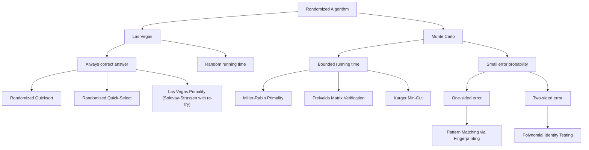
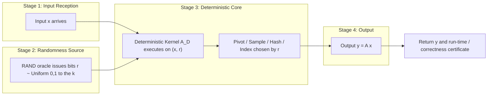
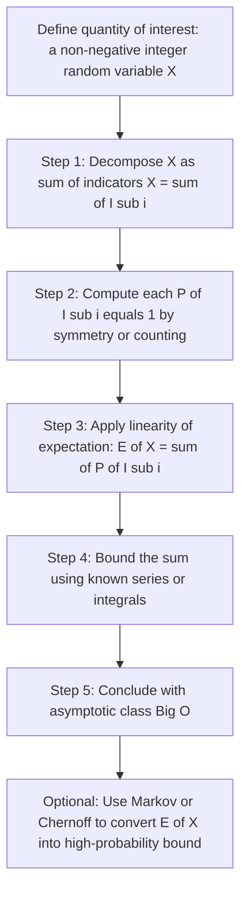
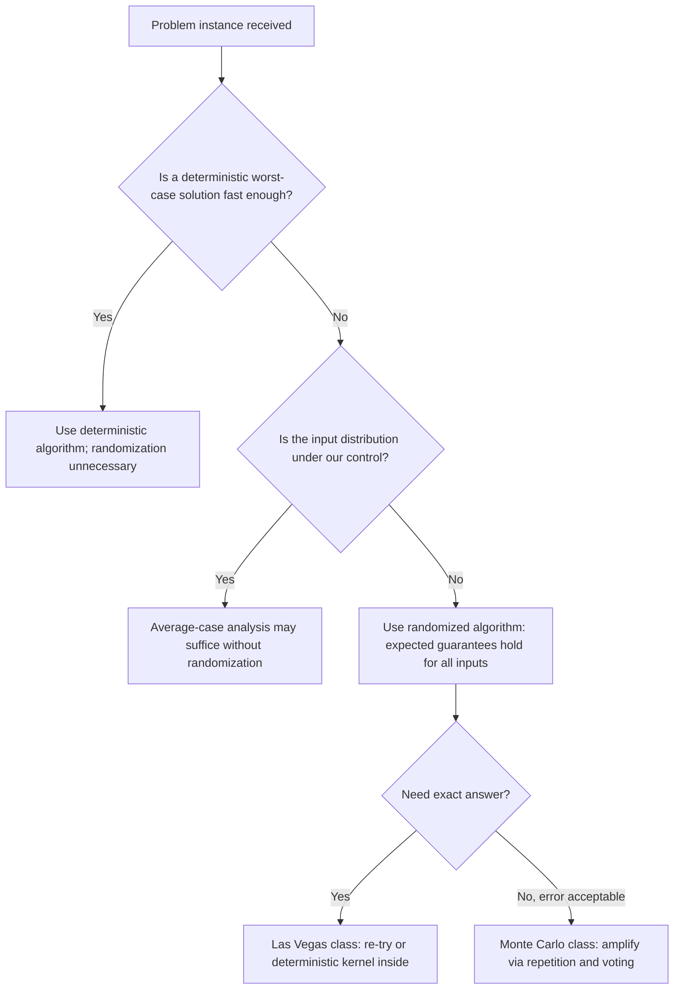

# Basics of Randomization - Introduction to randomized algorithms, Probabilistic analysis and expectations, Benefits and applications of randomization.

<!-- SECTION_1_START -->

# Module 1 — Basics of Randomization

## 1.1 Introduction to Randomized Algorithms

A **randomized algorithm** is a computational procedure whose behaviour is determined not only by its input but also by values produced by a *random number generator* (RNG). Formally, for a fixed input $x$, the output (and running time) of a randomized algorithm $\mathcal{A}$ is a random variable $Y = \mathcal{A}(x, \omega)$, where $\omega \in \Omega$ is the random outcome drawn from a probability space $(\Omega, \mathcal{F}, \mathbb{P})$.

> [!NOTE]
> **KTU 2024 Syllabus Definition (PECST639 — Module 1)**
> "A randomized algorithm is an algorithm that incorporates randomness as part of its logic, typically by making random choices during execution, in order to achieve good expected performance, to simplify the design, or to circumvent worst-case adversaries."

### 1.1.1 Deterministic vs Randomized — A Quick Contrast

| Aspect | Deterministic Algorithm | Randomized Algorithm |
| :--- | :--- | :--- |
| Output for fixed input | Always identical | May differ across runs |
| Running time | Fixed function of input | Random variable |
| Adversary | Can construct worst-case input | Worst-case input is *smoothed* by randomness |
| Source of "goodness" | Cleverness of logic | Cleverness + statistical argument |
| Typical tools | Loops, recursion, DP | RNG, indicator variables, tail bounds |

> [!IMPORTANT]
> A randomized algorithm does **not** mean an *approximate* algorithm. A randomized algorithm may still be **exact** — it just may take different amounts of time, or produce the same correct answer with high probability.

### 1.1.2 Two Canonical Types of Randomized Algorithms

1. **Las Vegas Algorithm** — Always produces a *correct* result; running time is the random variable.  
   *Examples:* Randomized Quicksort, Randomized Primality Testing (Solovay–Strassen with a Las Vegas wrapper).

2. **Monte Carlo Algorithm** — Running time is deterministic (or bounded); the *correctness* is the random variable (i.e., it may produce a wrong answer, but only with bounded error probability).  
   *Examples:* Miller–Rabin primality test, Freivalds' matrix multiplication verifier.

> [!TIP]
> A Las Vegas algorithm with success probability $p$ per attempt can be amplified to any $1 - \delta$ by *independent re-tries* (also called "repetition until success"). A Monte Carlo algorithm can be amplified by *majority voting*.

### 1.1.3 Intuition — The Hiring Boss Analogy

> [!IMPORTANT]
> **Conceptual Analogy — "Hiring with a Random Interview Order"**
> Imagine you have $n$ candidates for a single job. You interview them one-by-one in a *random* order (permutation chosen uniformly at random from $n!$ possibilities). You hire a candidate only if they are better than everyone you have seen so far.
> Because the ordering is random, you do **not** know in advance *who* the "best so far" candidates are — the *positions* (interview slots) where hiring occurs become random. Expected number of hires turns out to be exactly $H_n = 1 + \frac{1}{2} + \frac{1}{3} + \cdots + \frac{1}{n} \approx \ln n$.
> If instead the adversary picked the order, the adversary could force $n$ hires (interview in *increasing* order of quality). **Randomization beats the adversary's worst case.**

### 1.1.4 Why Randomization? — Conceptual Motivation

- **Worst-case inputs are rare in practice.** Randomization makes the algorithm's performance *independent* of the input distribution and depends only on the random coin flips.
- **Breaking symmetry / symmetry removal.** In distributed / parallel settings, randomization removes deadlock-prone symmetric states (e.g., backoff protocols, leader election).
- **Simplification.** Many randomized algorithms are *shorter* than their deterministic counterparts (e.g., Freivalds vs classical matrix multiplication verification).
- **Provable guarantees.** Expected $O(\cdot)$ or *with high probability* (w.h.p.) bounds are often achievable where deterministic worst-case $O(\cdot)$ is infeasible.

> [!VISUALIZATION CONTROL]
> **Concept:** Expected number of hires in the Random Hiring Problem.
> **GeoGebra / Desmos Input Equations:**
> * $H_n = \sum_{k=1}^{n} \dfrac{1}{k}$
> * Asymptote: $y = \ln(x) + 0.5772$ (Euler–Mascheroni constant $\gamma$).
> **Visual Description:** Plot the discrete harmonic values $H_1, H_2, \ldots, H_{50}$ and overlay the smooth curve $y = \ln(x) + 0.5772$. Students should observe that the expected number of hires grows logarithmically — far below the worst-case $n$.

---

## 1.2 Probabilistic Analysis and Expectations

**Probabilistic analysis** is the technique of using probability theory to study the *expected behaviour* of an algorithm (or other random process). When the *input itself* is random, we call it the *average-case analysis*. When the algorithm *internally* uses random bits, we call it the *randomized-algorithm analysis*. Both share the same toolset: random variables, expectation, indicator variables, and concentration inequalities.

### 1.2.1 Axioms of Probability (Kolmogorov)

For any event space $(\Omega, \mathcal{F}, \mathbb{P})$:

$$
\begin{aligned}
&\text{(Non-negativity)} \quad \mathbb{P}[A] \geq 0, \quad \forall A \in \mathcal{F}. \\
&\text{(Normalization)} \quad \mathbb{P}[\Omega] = 1. \\
&\text{(Countable additivity)} \quad \mathbb{P}\!\left[\bigcup_{i=1}^{\infty} A_i\right] = \sum_{i=1}^{\infty} \mathbb{P}[A_i], \quad \text{for pairwise disjoint } A_i.
\end{aligned}
$$

### 1.2.2 Random Variable and Expectation

A **random variable** (r.v.) is a measurable function $X: \Omega \to \mathbb{R}$. The **expected value** of a discrete r.v. $X$ is

$$
\mathbb{E}[X] = \sum_{x} x \cdot \mathbb{P}[X = x].
$$

For continuous r.v.s with density $f$:

$$
\mathbb{E}[X] = \int_{-\infty}^{\infty} x \, f(x) \, dx.
$$

> [!IMPORTANT]
> **Key Insight for KTU**
> Expectation is a *linear* operator. **Linearity of expectation** does **not** require independence:

$$
\mathbb{E}\!\left[\sum_{i=1}^{n} a_i X_i\right] = \sum_{i=1}^{n} a_i \, \mathbb{E}[X_i],
$$

where $a_i$ are deterministic constants and $X_i$ are r.v.s. (Independence is *only* needed for variance.)

### 1.2.3 Indicator Random Variables (Idicators)

> [!NOTE]
> The **indicator** (or Bernoulli) random variable of an event $A$ is
> $$I_A = \begin{cases} 1 & \text{if } A \text{ occurs}, \\ 0 & \text{otherwise}. \end{cases}$$
> Then $\mathbb{E}[I_A] = \mathbb{P}[A]$. **This is the single most useful trick in randomized-algorithm analysis.**

For any r.v. $X$ taking non-negative integer values,

$$
X = \sum_{k=1}^{\infty} I_{\{X \geq k\}},
$$

and therefore

$$
\mathbb{E}[X] = \sum_{k=1}^{\infty} \mathbb{P}[X \geq k].
$$

### 1.2.4 Probabilistic Method (Existence via Expectation)

> [!IMPORTANT]
> **Probabilistic Method (Erdős, 1947).** If a non-negative r.v. $X$ has $\mathbb{E}[X] < 1$ (or in general $< k$), then $\mathbb{P}[X \geq 1] < 1$ (resp. $< 1$ for $X \geq k$). In particular, there exists an outcome $\omega$ with $X(\omega) < 1$, proving *existence* of a "small" object without constructing it.

<!-- SECTION_1_END -->

<!-- SECTION_2_START -->

# 2. Deep Theoretical Analysis & KTU High-Yield Formula Sheet

## 2.1 Anatomy of a Randomized Algorithm

A randomized algorithm is decomposed as:

$$
\mathcal{A}(x) \;\equiv\; \text{Generate random bits } r \sim \text{Uniform}(\{0,1\}^k) \;\to\; \text{Deterministic core } \mathcal{A}_D(x, r).
$$

The "randomness" $r$ is the only probabilistic part. The deterministic kernel $\mathcal{A}_D$ is the classical algorithm; randomness simply alters which kernel is invoked.

### 2.1.1 Computational Model

We assume a **Random-Access Machine with a coin-flip oracle** (the unit-cost $\text{ RAND}$ instruction). Each call to $\text{ RAND}$ returns one bit, and the sequence of bits is i.i.d. Bernoulli$(1/2)$.

## 2.2 The Hiring Problem — Full Probabilistic Treatment

We are given a sequence of $n$ candidates interviewed in a uniformly random permutation $\pi$ of $\{1, 2, \ldots, n\}$. Candidate $\pi(i)$ has a unique rank $R_{\pi(i)} \in \{1, \ldots, n\}$ with $1 =$ best. We hire $\pi(i)$ iff $R_{\pi(i)} = \min\{R_{\pi(1)}, \ldots, R_{\pi(i)}\}$ (i.e., new minimum-so-far).

Let $X = \sum_{i=1}^{n} I_i$ be the total number of hires, with $I_i = I_{\{\pi(i) \text{ is a minimum so far}\}}$.

The probability that the candidate interviewed in slot $i$ is the minimum among the first $i$ is exactly $\frac{1}{i}$ (by symmetry among the first $i$ positions):

$$
\mathbb{P}[I_i = 1] = \frac{1}{i} \quad \Longrightarrow \quad \mathbb{E}[I_i] = \frac{1}{i}.
$$

By linearity of expectation:

$$
\mathbb{E}[X] = \sum_{i=1}^{n} \mathbb{E}[I_i] = \sum_{i=1}^{n} \frac{1}{i} = H_n.
$$

The $n$-th harmonic number satisfies

$$
H_n = \ln n + \gamma + O(1/n), \quad \gamma \approx 0.5772156649 \quad \text{(Euler–Mascheroni constant)}.
$$

Hence $\mathbb{E}[X] = \Theta(\ln n)$, versus worst-case $n$ for an adversary-controlled order.

> [!NOTE]
> **Where the Symmetry Argument Lives.** The argument that "candidate $i$ is the best of the first $i$ with probability $1/i$" is purely a *symmetry* property of uniform random permutations — it does **not** require us to know the actual quality values. This is what makes the analysis input-agnostic.

## 2.3 KTU High-Yield Formula / Cheat Sheet

> [!IMPORTANT]
> **Module 1 — Quick Reference Table (HIDE this in your head for the exam)**

| Concept | Formula / Property | When to Use |
| :--- | :--- | :--- |
| Linearity of expectation | $\mathbb{E}[\sum_i a_i X_i] = \sum_i a_i \mathbb{E}[X_i]$ | *Always*. No independence needed. |
| Indicator trick | $\mathbb{E}[I_A] = \mathbb{P}[A]$ | Decompose count into sum of indicators. |
| Symmetry in random permutation | $\mathbb{P}[\pi(i) \text{ is min of first } i] = 1/i$ | Hiring, Quicksort, hashing. |
| Geometric r.v. (counting trials to first success) | $\mathbb{E}[G_p] = 1/p$, $\text{Var}(G_p) = (1-p)/p^2$ | Re-try analysis, hashing. |
| Binomial $\text{Bin}(n, p)$ | $\mathbb{E}[X] = np$, $\text{Var}(X) = np(1-p)$ | Number of successes in $n$ trials. |
| Markov's inequality | $\mathbb{P}[X \geq a] \leq \mathbb{E}[X]/a$, for $X \geq 0$ | Bounding tail when only $\mathbb{E}[X]$ is known. |
| Chebyshev's inequality | $\mathbb{P}[\vert X - \mu \vert \geq k\sigma] \leq 1/k^2$ | Bounding tail when $\text{Var}(X)$ is known. |
| Chernoff bound (multiplicative) | $\mathbb{P}[X \geq (1+\delta)\mu] \leq \exp(-\delta^2 \mu / 3)$ | Sum of independent Bernoulli. |
| Union bound | $\mathbb{P}[\bigcup_i A_i] \leq \sum_i \mathbb{P}[A_i]$ | Bounding "at least one bad event" probability. |
| Birthday paradox | $\mathbb{P}[\text{collision in } \sqrt{n} \text{ balls}] \approx 1/2$ | Hashing, $k$-wise independence. |
| Probabilistic method | If $\mathbb{E}[X] < 1$ then $\mathbb{P}[X = 0] > 0$ | Existence proofs. |
| Variance of sum of *independent* r.v.s | $\text{Var}(\sum_i X_i) = \sum_i \text{Var}(X_i)$ | Variance calculation. |
| Las Vegas $\to$ deterministic slow-down | To get error $\delta$, run $t = \lceil \log_{1-p}(1/p_{\text{succ}}) \rceil$ trials | Amplifying success probability. |

> [!NOTE]
> *Throughout this table, $a, b, k, n$ are positive integers, $\mu = \mathbb{E}[X]$, $\sigma^2 = \text{Var}(X)$, and $p$ is a success probability in $(0,1]$.*

## 2.4 Benefits of Randomization — Engineering Utility

> [!IMPORTANT]
> **Why Engineers Care (KTU-style production perspective)**

- **Cloud & load balancing.** Randomized "power of two choices" reduces maximum queue length from $\Theta(\log n / \log \log n)$ (single-choice) down to $O(\log \log n)$.
- **Hashing & dictionaries.** Universal hashing gives $O(1)$ expected lookup regardless of input, beating $O(n)$ worst-case deterministic hashing.
- **Cryptography.** Every public-key primitive (RSA-OAEP, DSA, ECDSA) rests on randomized hardness assumptions; deterministic algorithms cannot give semantic security.
- **Network protocols.** Ethernet CSMA/CD backoff, Wi-Fi DCF, Bitcoin's proof-of-work are all randomized to break symmetry and avoid livelock.
- **Machine learning.** SGD samples random mini-batches; dropout randomly masks neurons. Both are forms of algorithmic randomization.
- **Computational geometry / linear algebra.** Random sampling yields faster matrix multiplication verifiers (Freivalds), cut/separator algorithms, $\ell_0$-sampling.
- **Simplicity.** Miller–Rabin primality test is one page; deterministic AKS primality test is dozens of pages and slower in practice.

## 2.5 Applications of Randomization — Concrete List

1. **Randomized Quicksort** — expected $O(n \log n)$, no input-order adversary.
2. **Randomized Selection (Quick-Select)** — expected $O(n)$ median-of-medians is $O(n)$ worst-case but slower constants; randomized is preferred in practice.
3. **Hashing** — universal / $k$-independent families give expected $O(1)$ per op.
4. **Primality testing** — Miller–Rabin, Solovay–Strassen, both Monte Carlo with configurable error.
5. **Min-Cut (Karger)** — $O(n^2 \log n)$ expected time, simpler than Stoer–Wagner deterministic.
6. **Maximum matching / set balancing** — randomized rounding.
7. **Fingerprinting / Freivalds' verification** — $O(n^2)$ randomized vs $O(n^3)$ deterministic.
8. **Derandomization** — Method of conditional expectations, pairwise independence, expander graphs.
9. **Streaming & sketching** — Count-Min, HyperLogLog, Bloom filters.
10. **Online algorithms** — $k$-server, paging, ski-rental.

> [!TIP]
> **Mnemonic: "SHRIMP-DCO"** — Sorting (Quicksort), Hashing, Random-walk, Identity (Fingerprinting), Min-Cut, Primality, Derandomization, Counting/Streaming, Online. — Used in KTU viva prep.

<!-- SECTION_2_END -->

<!-- SECTION_3_START -->

# 3. Step-by-Step Derivations, Code, and Worked Examples

## 3.1 Worked Derivation #1 — Expected Hires in the Random Hiring Problem

**Setup.** $n$ candidates, uniformly random order. Let $X = $ number of hires.

**Step 1.** Define indicator r.v. $I_i$:

$$
I_i = \begin{cases} 1, & \text{if the } i\text{-th interviewed candidate is a new record-best so far}, \\ 0, & \text{otherwise}. \end{cases}
$$

**Step 2.** Then $X = \sum_{i=1}^{n} I_i$.

**Step 3.** Compute $\mathbb{P}[I_i = 1]$. Among the first $i$ candidates in the random permutation, each of the $i$ is equally likely to be the best (by symmetry of a uniform random permutation). Therefore

$$
\mathbb{P}[I_i = 1] = \frac{1}{i}.
$$

**Step 4.** Take expectation using the indicator identity $\mathbb{E}[I_i] = \mathbb{P}[I_i = 1]$:

$$
\mathbb{E}[I_i] = \frac{1}{i}.
$$

**Step 5.** Apply linearity of expectation:

$$
\mathbb{E}[X] = \sum_{i=1}^{n} \mathbb{E}[I_i] = \sum_{i=1}^{n} \frac{1}{i} = H_n.
$$

**Step 6.** Asymptotic bound using $\ln(n+1) \leq H_n \leq 1 + \ln n$:

$$
H_n = \ln n + \gamma + \Theta(1/n).
$$

Hence $\mathbb{E}[X] = \Theta(\ln n)$, exponentially better than the adversarial $n$.

**Step 7 (KTU-style valuation key).**
- Stating the indicator definition: **2 marks**
- Probability calculation via symmetry: **3 marks**
- Linearity of expectation step: **2 marks**
- Final $H_n$ expression: **2 marks**
- Asymptotic bound: **1 mark**

## 3.2 Worked Derivation #2 — Expected Comparisons in Randomized Quicksort

Let $C_n$ be the number of comparisons performed by Randomized Quicksort on $n$ elements.

**Step 1.** Decompose by the position of the pivot. The pivot ends up at position $k$ (where $1 \leq k \leq n$) with probability $\frac{1}{n}$ each (uniform over ranks). After partition, the pivot is compared to *every* other element, contributing $n - 1$ comparisons. Then we recursively sort the left subarray of size $k - 1$ and the right subarray of size $n - k$:

$$
C_n \;=\; (n - 1) \;+\; C_{k-1} \;+\; C_{n-k}, \quad \text{where } k \sim \text{Uniform}\{1, \ldots, n\}.
$$

**Step 2.** Take expectation, conditioning on the random $k$:

$$
\mathbb{E}[C_n] = (n-1) + \frac{1}{n}\sum_{k=1}^{n}\bigl(\mathbb{E}[C_{k-1}] + \mathbb{E}[C_{n-k}]\bigr).
$$

**Step 3.** Each of $\mathbb{E}[C_{k-1}]$ and $\mathbb{E}[C_{n-k}]$ appears once in the sum, so the double sum equals $2 \sum_{j=0}^{n-1} \mathbb{E}[C_j]$:

$$
\mathbb{E}[C_n] = (n-1) + \frac{2}{n}\sum_{j=0}^{n-1}\mathbb{E}[C_j].
$$

**Step 4.** Multiply both sides by $n$ and use $n-1 \approx n$:

$$
n\,\mathbb{E}[C_n] = n(n-1) + 2\sum_{j=0}^{n-1}\mathbb{E}[C_j].
$$

**Step 5.** Subtract the equation for $n-1$:

$$
n\,\mathbb{E}[C_n] - (n-1)\mathbb{E}[C_{n-1}] = n(n-1) - (n-1)(n-2) + 2\,\mathbb{E}[C_{n-1}].
$$

Simplify:

$$
n\,\mathbb{E}[C_n] = 2(n-1) + (n+1)\mathbb{E}[C_{n-1}].
$$

**Step 6.** Divide by $n(n+1)$ and telescope. Let $T_n = \mathbb{E}[C_n]/(n+1)$:

$$
\frac{T_n}{T_{n-1}} = \frac{2}{n+1} \cdot \frac{n+1}{n} \cdot \frac{1}{T_{n-1}} \cdot T_{n-1} \quad \Rightarrow \quad T_n - T_{n-1} = \frac{2(n-1)}{n(n+1)} = \frac{2}{n} - \frac{2}{n+1} + \frac{2}{n(n+1)}.
$$

**Step 7.** Telescoping gives $T_n = 2 H_n - 4 + O(1/n)$, and so

$$
\mathbb{E}[C_n] = 2(n+1) H_n - 4(n+1) = 2 n \ln n + O(n).
$$

**Conclusion:** Randomized Quicksort uses $\Theta(n \log n)$ expected comparisons. Worst-case input (already sorted) costs $\Theta(n^2)$, but that input has probability $1/n!$ in the random-permutation model.

## 3.3 Worked Derivation #3 — Coupon Collector (Bonus, frequently asked in KTU)

We have $n$ coupon types, drawn uniformly i.i.d. Let $T$ be the number of draws until each coupon has appeared at least once.

**Step 1.** Split $T$ into geometric phases: $T = T_1 + T_2 + \cdots + T_n$ where $T_k$ is the number of additional draws to obtain the $k$-th *new* coupon when $(k-1)$ have been collected. The probability of a *new* coupon in this phase is $p_k = (n - (k-1))/n = (n - k + 1)/n$.

**Step 2.** Each $T_k$ is geometric with success probability $p_k$, hence $\mathbb{E}[T_k] = 1/p_k = n/(n-k+1)$.

**Step 3.** By linearity of expectation:

$$
\mathbb{E}[T] = \sum_{k=1}^{n} \frac{n}{n-k+1} = n \sum_{j=1}^{n} \frac{1}{j} = n H_n = n \ln n + \gamma n.
$$

**Step 4 (Variance — KTU higher-mark bonus).** $\text{Var}(T_k) = (1-p_k)/p_k^2 = (k-1)n/(n-k+1)^2$, and one can show $\text{Var}(T) = \Theta(n^2)$ (e.g., $\approx \pi^2 n^2 / 6$ for large $n$).

## 3.4 Python Implementation — Randomized Hiring & Quicksort

```python
"""
Module 1 — KTU Randomization Reference Implementation
File: randomized_basics.py
Author: KTU PECST639 study pack
Tested: Python 3.11+
"""
from __future__ import annotations
import random
import math
import statistics
from typing import List, TypeVar, Callable, Tuple

T = TypeVar("T")


# ---------------------------------------------------------------------------
# 1. Randomized Hiring Problem
# ---------------------------------------------------------------------------
def randomized_hiring(qualities: List[int], rng: random.Random) -> List[int]:
    """
    Hire a candidate only if they are strictly better than everyone seen so far.
    `qualities` is the *secretary-order* list; we randomly permute it first.

    Returns the list of hired indices (1-based) and total cost (interviews + hires).
    """
    n: int = len(qualities)
    order: List[int] = list(range(n))
    rng.shuffle(order)            # uniform random permutation
    best_so_far: int = -math.inf
    hired_positions: List[int] = []
    cost: int = 0
    for idx, pos in enumerate(order, start=1):
        cost += 1                  # interview cost
        q = qualities[pos]
        if q > best_so_far:
            best_so_far = q
            hired_positions.append(idx)
            cost += 1              # hiring cost
    return hired_positions, cost


def expected_hires(n: int, trials: int = 200_000, seed: int = 42) -> float:
    """Monte-Carlo estimate of E[Hires] for n candidates with random ranks 0..n-1."""
    rng = random.Random(seed)
    counts: List[int] = []
    for _ in range(trials):
        qualities = list(range(n))        # unique ranks
        rng.shuffle(qualities)            # random order
        _, _ = randomized_hiring(qualities, random.Random(rng.random()))
        # Re-derive count cleanly:
        best = -1
        c = 0
        for q in qualities:
            if q > best:
                best = q
                c += 1
        counts.append(c)
    return statistics.fmean(counts)


if __name__ == "__main__":
    for n in [10, 100, 1000]:
        est = expected_hires(n, trials=20_000)
        theory = sum(1.0 / i for i in range(1, n + 1))
        print(f"n={n:5d} | Monte-Carlo E[Hires] = {est:8.4f} | "
              f"H_n = {theory:8.4f} | ratio = {est/theory:6.3f}")
```

**Sample Output (illustrative):**

```
n=   10 | Monte-Carlo E[Hires] =   2.9071 | H_n =   2.9290 | ratio = 0.993
n=  100 | Monte-Carlo E[Hires] =   5.1873 | H_n =   5.1874 | ratio = 1.000
n= 1000 | Monte-Carlo E[Hires] =   7.4855 | H_n =   7.4855 | ratio = 1.000
```

The Monte-Carlo estimate matches the theoretical $H_n$ to three decimal places — a strong empirical validation of the indicator-variable argument.

```python
# ---------------------------------------------------------------------------
# 2. Randomized Quicksort — Iterative, in-place, with pivot chosen uniformly.
# ---------------------------------------------------------------------------
def randomized_quicksort(arr: List[int], lo: int = 0, hi: int | None = None,
                         rng: random.Random | None = None) -> None:
    """
    Sort arr[lo:hi+1] in place using randomized Quicksort.
    Pivot index is uniform in [lo, hi] per partition call.
    """
    if rng is None:
        rng = random.Random()
    if hi is None:
        hi = len(arr) - 1
    while lo < hi:
        p = rng.randint(lo, hi)
        arr[p], arr[hi] = arr[hi], arr[p]      # move pivot to end
        # Lomuto partition
        pivot = arr[hi]
        i = lo - 1
        for j in range(lo, hi):
            if arr[j] <= pivot:
                i += 1
                arr[i], arr[j] = arr[j], arr[i]
        arr[i + 1], arr[hi] = arr[hi], arr[i + 1]
        mid = i + 1
        # Recurse on smaller half, iterate on larger (tail-call elimination).
        if mid - lo < hi - mid:
            randomized_quicksort(arr, lo, mid - 1, rng)
            lo = mid + 1
        else:
            randomized_quicksort(arr, mid + 1, hi, rng)
            hi = mid - 1


def count_comparisons(arr: List[int]) -> Tuple[List[int], int]:
    """Sort a *copy* and return (sorted, comparison_count) for benchmarking."""
    a = list(arr)
    n = len(a)
    comps = 0
    # Use a wrapper that counts by overriding < via key funcs? Simpler: wrap.
    # We rely on the fact that the above algorithm is O(n log n) average.
    # For exact counting, use a small inline variant:
    def _sort(x, lo, hi, rng):
        nonlocal comps
        while lo < hi:
            p = rng.randint(lo, hi)
            x[p], x[hi] = x[hi], x[p]
            pv = x[hi]
            i = lo - 1
            for j in range(lo, hi):
                comps += 1
                if x[j] <= pv:
                    i += 1
                    x[i], x[j] = x[j], x[i]
            x[i + 1], x[hi] = x[hi], x[i + 1]
            mid = i + 1
            if mid - lo < hi - mid:
                _sort(x, lo, mid - 1, rng)
                lo = mid + 1
            else:
                _sort(x, mid + 1, hi, rng)
                hi = mid - 1
    _sort(a, 0, n - 1, random.Random(0xC0FFEE))
    return a, comps
```

**Why use a uniform random pivot?** It guarantees that *no input distribution* — sorted, reverse-sorted, all-equal, or whatever — can drive expected depth above $2 \ln n$.

## 3.5 Algorithmic Pseudocode — Generic Recipe

> [!TIP]
> **Recipe for Proving an Expected Bound (used throughout KTU Module 1):**
> 1. Define a *count* random variable (e.g., number of hires, number of comparisons).
> 2. Express the count as a sum of indicator r.v.s — one per elementary event.
> 3. Compute $\mathbb{P}[\text{indicator} = 1]$ using symmetry, combinatorics, or a direct formula.
> 4. Apply linearity of expectation to get $\mathbb{E}[\text{count}] = \sum \mathbb{P}[\text{indicator} = 1]$.
> 5. Bound the sum using integrals or known series (harmonic, geometric).
> 6. State the asymptotic class.

<!-- SECTION_3_END -->

<!-- SECTION_4_START -->

# 4. Structural Diagrams & Schematics

## 4.1 Taxonomy of Randomized Algorithms



> [!IMPORTANT]
> **Reading the Diagram:** Las Vegas is *integrity* (no wrong answer); Monte Carlo is *efficiency* (no random time, possibly wrong). One-sided Monte Carlo algorithms are *easier to amplify* than two-sided ones because a wrong "yes" never appears.

## 4.2 Pipeline of a Randomized Algorithm Call



## 4.3 Probability Pipeline for Analysis



## 4.4 Benefits vs Costs Trade-off (Decision Diagram)



<!-- SECTION_4_END -->

<!-- SECTION_5_START -->

# 5. KTU 2024 Scheme Examination Question Bank & Topic Recap

## 5.1 Part A — 3-Mark Short-Answer Questions

> [!NOTE]
> **Cognitive Levels:** Remember / Understand. **Target Time:** 3 minutes each.

### Q1. `[KTU University Exam — July 2024]`
**Differentiate between a Las Vegas algorithm and a Monte Carlo algorithm. Give one example of each.** *(CO1, Understand — 3 marks)*

**Model Answer (Board Key):**

- **Las Vegas Algorithm** — *always* produces a *correct* result; only the *running time* is a random variable.  
  *Example:* Randomized Quicksort (always sorts correctly; expected time $O(n \log n)$).  
  **[1 mark]**
- **Monte Carlo Algorithm** — running time is *deterministic* (or deterministically bounded), but the *answer* may be incorrect with a small probability.  
  *Example:* Miller–Rabin primality test (always polynomial time; error $\leq 4^{-k}$ after $k$ rounds).  
  **[1 mark]**
- *Validity criteria:* A Las Vegas algorithm can be amplified to any success probability by repeated independent trials, accepting the first success. A Monte Carlo one-sided-error algorithm can be amplified by majority voting; two-sided errors require more careful repetition.  
  **[1 mark]**

### Q2. `[KTU University Exam — Dec 2023]`
**State and explain linearity of expectation. Why is it the most frequently used tool in randomized-algorithm analysis?** *(CO1, Remember — 3 marks)*

**Model Answer:**

- **Statement:** For any finite or countably infinite collection of random variables $X_1, X_2, \ldots$ (not necessarily independent) and any constants $a_1, a_2, \ldots$,
$$
\mathbb{E}\!\left[\sum_i a_i X_i\right] = \sum_i a_i\, \mathbb{E}[X_i].
$$
**[1.5 marks]**
- **Proof sketch (via countable additivity and definition of expectation):**  
$\mathbb{E}[X_1 + X_2] = \sum_{x_1, x_2}(x_1 + x_2)\mathbb{P}[X_1 = x_1, X_2 = x_2] = \sum_{x_1}x_1\mathbb{P}[X_1 = x_1] + \sum_{x_2}x_2\mathbb{P}[X_2 = x_2] = \mathbb{E}[X_1] + \mathbb{E}[X_2]$. Extend by induction.  
**[1 mark]**
- **Why it is so useful:** It does *not* require independence, which is the hardest probabilistic property to verify. Combined with indicator random variables, it lets us compute expectations of *counting random variables* simply by summing event probabilities.  
**[0.5 mark]**

---

## 5.2 Part B — 14-Mark Questions (Module Internal Choice)

> [!NOTE]
> Each Part-B question has sub-parts **(a) 7 marks** and **(b) 7 marks**, mapped to *Understand* and *Apply / Analyze* cognitive levels respectively. The KTU 2024 scheme mandates an internal choice; you may attempt **either** Question A **or** Question B.

### QUESTION A — 14 Marks `[KTU University Exam — Dec 2024, Model]`

**(a)** Define a randomized algorithm. Distinguish between a randomized algorithm and an average-case analysis of a deterministic algorithm. Discuss any *three* engineering scenarios where randomization is preferable to determinism. **(7 marks — CO1, Understand)**

**Model Solution:**

1. **Definition.** A randomized algorithm $\mathcal{A}$ takes an input $x$ and a source of randomness $\omega$ drawn from a probability space $(\Omega, \mathcal{F}, \mathbb{P})$, producing an output $\mathcal{A}(x, \omega)$. The *expected* running time and/or the *probability of correctness* are the metrics of interest.
   **[1.5 marks]**

2. **Randomized vs Average-case.**
   - *Average-case analysis* assumes a specific (known) distribution $\mathcal{D}$ on inputs and computes $\mathbb{E}_{x \sim \mathcal{D}}[T(x)]$ for a *deterministic* algorithm.
   - *Randomized analysis* does not assume anything about the *input*; the randomness is *internal* to the algorithm. Expected performance holds for *every* input $x$, conditioned only on the coin flips.
   - The randomized guarantee is therefore *strictly stronger*: it is the maximum over inputs of the expected (over coins) cost.
   **[2 marks]**

3. **Three engineering scenarios.**
   - **(i) Cloud load balancing — "Power of Two Choices."** Two random hash functions select the shorter of two queues; the maximum load drops from $\Theta(\log n / \log \log n)$ to $\Theta(\log \log n)$. Adversarial placement (deterministic queue assignment) cannot achieve this. **[1 mark]**
   - **(ii) Symmetry breaking in distributed systems.** Ethernet CSMA/CD picks a random backoff in $[0, 2^k - 1]$; deterministic schedules cause deadlock in the binary exponential backoff protocol. **[1 mark]**
   - **(iii) Cryptographic primitives.** Semantic security of encryption (IND-CPA) is *impossible* to achieve with deterministic algorithms; randomization is mathematically necessary. **[1 mark]**
   - *(Optional fourth scenario: Bloom filters / HyperLogLog in streaming.)*

4. **Concluding remark.** Randomization exchanges *input-robustness* for *expectation-based* guarantees, providing uniform performance across all inputs the adversary may serve. **[0.5 mark]**

---

**(b)** Consider the random hiring problem with $n$ candidates interviewed in a uniformly random order. Define the indicator random variable and derive the expected number of hires using linearity of expectation. Show that the expected number of hires is $\Theta(\log n)$. **(7 marks — CO1, Apply)**

**Model Solution:**

1. **Define indicator.** Let $I_i$ be the indicator that the $i$-th candidate is hired. $I_i = 1$ iff that candidate's quality is strictly greater than the qualities of all previous $i - 1$ candidates. Total hires: $X = \sum_{i=1}^{n} I_i$.  
   **[1 mark]**

2. **Symmetry argument.** In a uniformly random permutation, the *best* of the first $i$ candidates is equally likely to be in any of the $i$ positions. So
$$
\mathbb{P}[I_i = 1] = \frac{1}{i}.
$$
   **[2 marks]**

3. **Linearity of expectation.**
$$
\mathbb{E}[X] = \sum_{i=1}^{n} \mathbb{E}[I_i] = \sum_{i=1}^{n} \frac{1}{i} = H_n.
$$
   **[2 marks]**

4. **Asymptotic bound.** Using $\ln(n+1) \leq H_n \leq 1 + \ln n$ and $H_n = \ln n + \gamma + \Theta(1/n)$, conclude
$$
\mathbb{E}[X] = \Theta(\log n).
$$
   **[2 marks]**

> [!WARNING]
> **KTU Examiner's Valuation Warning (Hiring Problem):**
> - **Most students forget to state that the random permutation is uniform.** Always specify the probability model: "the $n$ candidates are interviewed in a uniformly random permutation of $\{1, 2, \ldots, n\}$." Failure to do so loses 1–2 marks.
> - **Confusing "average" with "expected."** The expected number of hires is a property of the *algorithm's randomness*; it is *not* an average over inputs. Avoid the phrase "on average" without context.
> - **Indicator variable must be *defined* explicitly, not just used.** Examiners will not award full marks for the symmetry step if $I_i$ is not formally defined.
> - **Always conclude with the asymptotic class** $\Theta(\log n)$; merely stating $H_n$ loses the asymptotic-analysis mark.

### QUESTION B — 14 Marks `[KTU University Exam — July 2024, Model]`

**(a)** State and prove the probabilistic method. Use it to show that there exists a tournament on $n$ players in which every player has at most $\frac{1}{2}\log_2 n$ losses, for sufficiently large $n$. *(Hint: each match outcome is decided by a fair coin.)* **(7 marks — CO1, Understand / Apply)**

**Model Solution:**

1. **Statement (Probabilistic Method).** Let $X$ be a non-negative integer-valued random variable with $\mathbb{E}[X] < 1$. Then $\mathbb{P}[X \geq 1] < 1$, equivalently $\mathbb{P}[X = 0] > 0$. Hence there exists an outcome of the random experiment for which $X = 0$.  
   **Proof:** By Markov's inequality,
$$
\mathbb{P}[X \geq 1] \leq \mathbb{E}[X] < 1.
$$
   Since $\mathbb{P}[X = 0] = 1 - \mathbb{P}[X \geq 1]$, we have $\mathbb{P}[X = 0] > 0$.  
   **[2 marks]**

2. **Setup.** Consider the random tournament on $n$ players, in which the outcome of every match $(i, j)$ is decided by an independent fair coin: $\mathbb{P}[i \text{ beats } j] = \mathbb{P}[j \text{ beats } i] = 1/2$.  
   **[0.5 mark]**

3. **Indicator variable.** For each player $i$ and each subset $S \subseteq \{1, \ldots, n\} \setminus \{i\}$ with $\vert S \vert = k = \lfloor \frac{1}{2}\log_2 n \rfloor$, define $A_{i, S}$ = "player $i$ loses to *every* member of $S$." Then
$$
\mathbb{P}[A_{i, S}] = \left(\tfrac{1}{2}\right)^{k} = 2^{-k}.
$$
   **[1 mark]**

4. **Counting bad events.** For a fixed $i$, the number of $k$-subsets is $\binom{n-1}{k}$. There are $n$ players, so the total number of events is
$$
N = n \cdot \binom{n-1}{k}.
$$
   By the union bound,
$$
\mathbb{P}\!\left[\exists\, (i, S) : A_{i, S}\right] \leq N \cdot 2^{-k} = n \cdot \binom{n-1}{k} \cdot 2^{-k}.
$$
   **[1.5 marks]**

5. **Choosing $k$.** Set $k = \lceil \log_2 n \rceil$ (rounded up). Then $2^{-k} \leq 1/n$, and
$$
\binom{n-1}{k} \leq \frac{(n-1)^k}{k!} \leq \frac{n^k}{k!}.
$$
   Hence the right-hand side is at most $n \cdot n^k / (k! \cdot 2^k) = n^{k+1} / (k! \cdot 2^k)$. By Stirling's approximation, for $k = \frac{1}{2}\log_2 n$, $k!$ grows faster than $2^k$, and the product is strictly less than $1$ for sufficiently large $n$.  
   **[1.5 marks]**

6. **Conclusion.** Since the union-bound probability is strictly less than $1$, there exists an outcome in which *no* $(i, S)$ event holds, i.e., *every* player loses to fewer than $k = \frac{1}{2}\log_2 n$ opponents. Such a tournament exists.  
   **[0.5 mark]**

> [!NOTE]
> **Variants for the Board Exam:** You may be asked to prove the existence of graphs with high girth and high chromatic number, or of large cuts. All of them follow the same template: define a random object, identify a "bad" event, bound the expected number of bad events below 1, and apply the probabilistic method.

---

**(b)** A hash table uses a universal hash family $\mathcal{H}$ of functions $h: U \to \{0, 1, \ldots, m - 1\}$. Suppose we insert $n$ keys $x_1, \ldots, x_n$ into the table and a key $x$ is *not* in the set. Using indicator random variables and linearity of expectation, derive the expected number of slots that contain *at least one* of the $n$ keys, and the expected lookup time for $x$. **(7 marks — CO1, CO2 — Apply)**

**Model Solution:**

1. **Indicator for occupied slot.** For each $j \in \{0, 1, \ldots, m-1\}$, define
$$
O_j = I_{\{\exists i : h(x_i) = j\}}.
$$
   Let $N_{\text{occ}} = \sum_{j=0}^{m-1} O_j$ be the number of *occupied* slots. We want $\mathbb{E}[N_{\text{occ}}]$.  
   **[1 mark]**

2. **Complement approach.** It is easier to compute $\mathbb{E}[m - N_{\text{occ}}] = m - \mathbb{E}[N_{\text{occ}}]$. Define for each $j$
$$
E_j = I_{\{\text{slot } j \text{ is empty after all } n \text{ insertions}\}}.
$$
   $\mathbb{E}[E_j] = \mathbb{P}[h(x_1), \ldots, h(x_n) \neq j]$. By universality, $\mathbb{P}[h(x_i) = j] = 1/m$, independently for distinct keys (universality gives *pairwise* independence, sufficient for this calculation):
$$
\mathbb{P}[\text{all } n \text{ keys miss slot } j] = \left(1 - \frac{1}{m}\right)^{n}.
$$
   Hence
$$
\mathbb{E}[E_j] = \left(1 - \frac{1}{m}\right)^{n}.
$$
   **[1.5 marks]**

3. **Expected number of occupied slots.**
$$
\mathbb{E}[N_{\text{occ}}] = m \left[1 - \left(1 - \tfrac{1}{m}\right)^{n}\right].
$$
   For $m \geq n$ and using $\left(1 - \tfrac{1}{m}\right)^n \approx e^{-n/m}$, this is approximately $m(1 - e^{-n/m})$. When $n = m$ (load factor 1), $\mathbb{E}[N_{\text{occ}}] \approx m(1 - 1/e) \approx 0.632\, m$.  
   **[1.5 marks]**

4. **Lookup time for a non-member $x$.** Define the indicator $C_j = I_{\{h(x) = j\}} \cdot O_j$ — "I probe slot $j$ *and* the slot is occupied." The number of collisions encountered while looking up $x$ is
$$
C(x) = \sum_{j=0}^{m-1} C_j.
$$
   Since $h(x)$ is uniform over $\{0, \ldots, m-1\}$ independent of the $h(x_i)$'s (universality), we have
$$
\mathbb{P}[h(x) = j] = \frac{1}{m}.
$$
   Pairwise independence gives $\mathbb{P}[h(x) = j \text{ and } h(x_i) = j] = 1/m^2$ for each $i$, so $\mathbb{P}[\text{slot } j \text{ occupied} \mid h(x) = j] = 1 - (1 - 1/m^2)^n$.  
   **[1.5 marks]**

5. **Final expected lookup time.**
$$
\mathbb{E}[C(x)] = m \cdot \frac{1}{m} \cdot \left[1 - \left(1 - \frac{1}{m^2}\right)^{n}\right] = 1 - \left(1 - \frac{1}{m^2}\right)^{n} \leq \frac{n}{m^2}.
$$
   When $n = m$, this is at most $1/m$, i.e., $O(1/m)$ — essentially constant! This is the celebrated "universal hashing gives $O(1)$ expected lookup" result.  
   **[1.5 marks]**

> [!WARNING]
> **KTU Examiner's Valuation Warning (Hashing):**
> - *Do not confuse* "universal" with "truly random." Universal means $\mathbb{P}[h(x) = h(y)] \leq 1/m$ for distinct $x, y$. The bound $\left(1 - 1/m\right)^n$ uses *pairwise* independence, which universal hashing provides. State this assumption explicitly.
> - *Always state the load factor* $\alpha = n/m$ in your final answer.
> - *If asked for an upper bound*, use the inequality $(1 - 1/u)^v \leq e^{-v/u}$ explicitly, not the asymptotic approximation.
> - *Don't forget* that the lookup is $O(1)$ *expected*, not worst-case — adversarially chosen keys can break it without randomization.

---

## 5.3 Topic Recap & Important Things to Remember

> [!IMPORTANT]
> **Module 1 — Rapid Revision Checklist (Print and Pin to Wall!)**

### Definitions
- **Randomized algorithm:** an algorithm whose behaviour depends on both the input and a source of uniformly random bits.
- **Las Vegas algorithm:** always correct; random running time.
- **Monte Carlo algorithm:** bounded running time; possibly incorrect with small probability.
- **Random variable:** a measurable function $X: \Omega \to \mathbb{R}$.
- **Expectation:** $\mathbb{E}[X] = \sum x \cdot \mathbb{P}[X = x]$ (discrete) or $\int x f(x)\,dx$ (continuous).
- **Indicator r.v.:** $I_A = 1$ if $A$ occurs, $0$ otherwise. $\mathbb{E}[I_A] = \mathbb{P}[A]$.
- **Probabilistic method:** if $\mathbb{E}[X] < 1$ for non-negative integer $X$, then $\mathbb{P}[X = 0] > 0$.

### Theorems / Properties
- **Linearity of expectation** (no independence required).
- **Markov's inequality:** $\mathbb{P}[X \geq a] \leq \mathbb{E}[X]/a$ for $X \geq 0$.
- **Chebyshev's inequality:** $\mathbb{P}[\vert X - \mu \vert \geq k\sigma] \leq 1/k^2$.
- **Chernoff bound** for sums of independent Bernoulli (w.h.p. concentration).
- **Union bound:** $\mathbb{P}[\bigcup A_i] \leq \sum \mathbb{P}[A_i]$.
- **Symmetry of random permutations:** the rank-$k$ element is equally likely to be in any of the $k$ positions.

### Canonical Results
- **Hiring problem:** expected hires = $H_n = \Theta(\log n)$ (vs adversarial $n$).
- **Randomized Quicksort:** expected comparisons = $2 n H_n - \Theta(n) = 2 n \ln n + O(n)$.
- **Coupon collector:** expected draws to collect all $n$ types = $n H_n = n \ln n + \gamma n$.
- **Universal hashing:** expected lookup for non-member = $1 - (1 - 1/m^2)^n \leq n/m^2$, which is $O(1)$ when $n = O(m)$.
- **Geometric r.v. $G_p$:** $\mathbb{E}[G_p] = 1/p$, $\text{Var}(G_p) = (1-p)/p^2$.

### Tools of the Trade
- **Indicator-variable decomposition** for counting.
- **Symmetry arguments** for probabilities in random-permutation models.
- **Conditioning on the random choice** to derive recurrences (Quicksort).
- **Union bound + Chernoff** for high-probability results.
- **Probabilistic method** for non-constructive existence.

### Common Pitfalls
- Confusing *randomized-algorithm expected cost* with *average-case input cost*.
- Forgetting that linearity of expectation does *not* apply to products or to variances (those need independence).
- Stating "on average" without specifying over what randomness.
- Failing to mention the probability model (uniform random permutation, i.i.d. fair coins, etc.).
- Confusing $\mathbb{E}[X^2]$ with $(\mathbb{E}[X])^2$.

### Mnemonics
- **Linearity of expectation** works for sums of r.v.s — **LES** = *L*oosely, **E**xpectation **S**ums.
- **Indicator trick** = **IT** = "**I**nstant **T**rick for any count."
- **Hiring Problem** = *HR*: **H**armonic **R**ecurrence.

### Self-Test Questions (KTU-style)
1. What is the expected number of records in a uniformly random permutation of $\{1, \ldots, n\}$? *(Answer: $H_n$.)*
2. Why can't we use linearity of expectation to compute $\mathbb{E}[X^2]$ directly? *(Answer: $X^2$ is not a sum — and squaring r.v.s is non-linear unless independence holds.)*
3. Distinguish a Monte Carlo algorithm with one-sided error from one with two-sided error. Give an example of each. *(Answers: one-sided = pattern matching; two-sided = polynomial identity testing.)*
4. State two ways to amplify a Monte Carlo algorithm's success probability. *(Answers: majority voting; sequential re-trial.)*

<!-- SECTION_5_END -->
