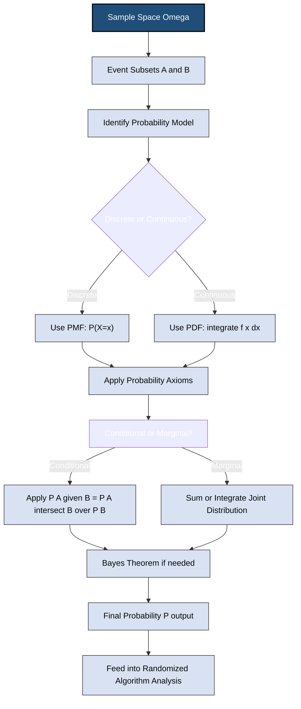
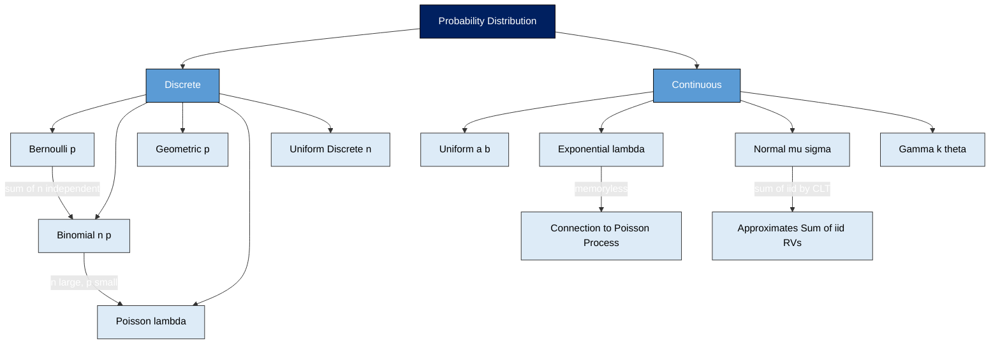
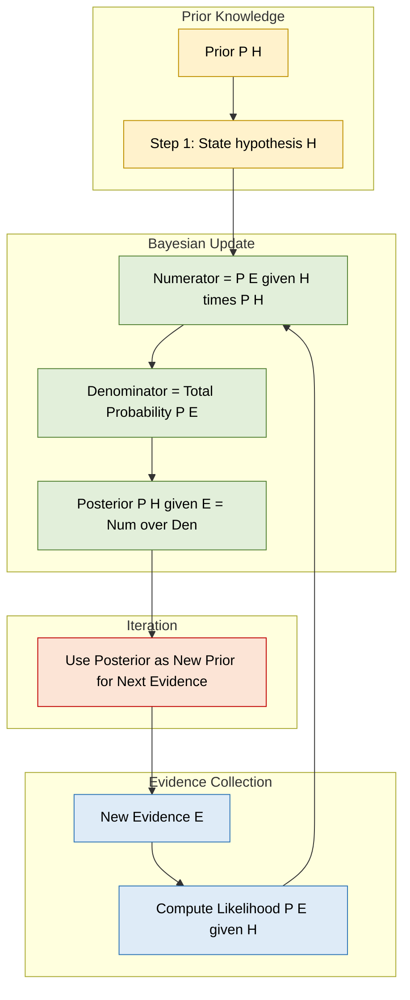

# Probability Review - Basic probability theory, Random variables and distributions, Linearity of expectation.

<!-- SECTION_1_START -->

# Probability Review: Foundations for Randomized Algorithms

## 1.1 Basic Probability Theory

### Formal Definition (KTU 2024 Syllabus)

**Probability** is a mathematical function that assigns a numerical measure between **0** and **1** to events in a sample space, quantifying the likelihood of their occurrence. Formally, given a sample space $\Omega$ and an event $A \subseteq \Omega$, the probability of $A$ is denoted $P(A)$.

> [!IMPORTANT]
> **KTU 2024 Highlight:** Probability theory forms the *axiomatic backbone* of randomized algorithm analysis. Every randomized algorithm's running time, correctness probability, and expected space complexity are derived using these axioms. KTU examiners frequently test the application of the **three Kolmogorov axioms** directly.

### The Three Kolmogorov Axioms

For any sample space $\Omega$ and events $A, B \subseteq \Omega$:

$$
\begin{aligned}
\textbf{Axiom 1 (Non-negativity):} \quad & 0 \leq P(A) \leq 1 \\
\textbf{Axiom 2 (Normalization):} \quad & P(\Omega) = 1 \\
\textbf{Axiom 3 (Countable Additivity):} \quad & P\left(\bigcup_{i=1}^{\infty} A_i\right) = \sum_{i=1}^{\infty} P(A_i) \quad \text{(for mutually exclusive } A_i\text{)}
\end{aligned}
$$

### Conceptual Analogy / Intuition

> [!NOTE]
> **Real-world analogy:** Imagine rolling a fair six-sided die inside a closed, dark room.
> - The **sample space** $\Omega = \{1, 2, 3, 4, 5, 6\}$ is the set of all *possible* outcomes.
> - An **event** $A$ = "the roll is even" = $\{2, 4, 6\}$ is a subset of outcomes.
> - The **probability** $P(A) = 3/6 = 1/2$ tells us that half the time, when we peek inside the room, we should expect to see an even number.
> - **Randomness** means we cannot predict *which* element of $\Omega$ will appear, but we can predict the *long-run frequency* of each element.

### Sample Space, Events, and the Event Algebra

| Concept | Symbol | Definition | Example (Coin Toss) |
| :--- | :---: | :--- | :--- |
| Sample Space | $\Omega$ | Set of all possible outcomes | $\{H, T\}$ |
| Event | $A$ | Any subset of $\Omega$ | $\{H\}$ |
| Certain Event | $\Omega$ | Contains all outcomes | $\{H, T\}$ |
| Impossible Event | $\emptyset$ | Contains no outcomes | $\emptyset$ |
| Complement | $A^c$ | All outcomes not in $A$ | $\{T\}$ |
| Union | $A \cup B$ | Outcomes in $A$ or $B$ or both | $\{H\} \cup \{T\} = \{H, T\}$ |
| Intersection | $A \cap B$ | Outcomes in both $A$ and $B$ | $\emptyset$ (if disjoint) |

### Conditional Probability and Independence

**Conditional Probability** of event $A$ given that event $B$ has occurred (with $P(B) > 0$):

$$
P(A \mid B) = \frac{P(A \cap B)}{P(B)}
$$

**Statistical Independence:** Two events $A$ and $B$ are independent if and only if

$$
P(A \cap B) = P(A) \cdot P(B)
$$

> [!IMPORTANT]
> **Independence vs. Disjointness:** Independent events are *not* the same as disjoint events. Disjoint (mutually exclusive) events can never occur together, so $P(A \cap B) = 0$. Independent events *can* occur together, and their joint probability is the *product* of their individual probabilities.

### Bayes' Theorem

For two events $A$ and $B$ with $P(B) > 0$:

$$
P(A \mid B) = \frac{P(B \mid A) \cdot P(A)}{P(B)}
$$

Extended via the **Law of Total Probability** for a partition $\{B_1, B_2, \ldots, B_n\}$ of $\Omega$:

$$
P(B_i \mid A) = \frac{P(A \mid B_i) \cdot P(B_i)}{\sum_{j=1}^{n} P(A \mid B_j) \cdot P(B_j)}
$$

> [!VISUALIZATION CONTROL]
> **Concept:** Venn Diagram of Conditional Probability for two events $A$ and $B$ in sample space $\Omega$.
> **GeoGebra / Desmos Input Equations:**
> * Circle A: $(x - 0.7)^2 + y^2 = 1$
> * Circle B: $(x + 0.7)^2 + y^2 = 1$
> * Bounding Rectangle (sample space $\Omega$): $-3 \leq x \leq 3$, $-2.5 \leq y \leq 2.5$
> **Visual Description:** Two overlapping circles inside a rectangle. The intersection region represents $A \cap B$. Given that $B$ has occurred, the universe "shrinks" to the area of $B$ alone, and the conditional probability is the ratio of the area of $A \cap B$ to the area of $B$.

---

## 1.2 Random Variables and Distributions

### Formal Definition of a Random Variable

A **random variable** $X$ is a function $X : \Omega \rightarrow \mathbb{R}$ that maps each outcome in the sample space to a real number. Random variables are not "random" themselves, nor are they "variables" in the algebraic sense — they are deterministic functions whose *input* is random.

### Classification of Random Variables

$$
X = \begin{cases} \textbf{Discrete}, & \text{if } X \text{ takes countably many values (e.g., } \{0, 1, 2, \ldots\}\text{)} \\ \textbf{Continuous}, & \text{if } X \text{ takes values in an uncountable set (e.g., } \mathbb{R} \text{ or } [a,b]\text{)} \end{cases}
$$

### Probability Mass Function (PMF) — Discrete Case

For a discrete random variable $X$ with range $S$:

$$
p(x) = P(X = x) \quad \text{such that} \quad p(x) \geq 0 \quad \text{and} \quad \sum_{x \in S} p(x) = 1
$$

### Probability Density Function (PDF) — Continuous Case

For a continuous random variable $X$ with PDF $f(x)$:

$$
P(a \leq X \leq b) = \int_{a}^{b} f(x) \, dx, \quad f(x) \geq 0, \quad \int_{-\infty}^{\infty} f(x) \, dx = 1
$$

### Cumulative Distribution Function (CDF)

For *any* random variable $X$ (discrete or continuous), the CDF is defined as:

$$
F(x) = P(X \leq x)
$$

Properties of any valid CDF:
- $F$ is non-decreasing
- $\lim_{x \to -\infty} F(x) = 0$
- $\lim_{x \to \infty} F(x) = 1$
- $F$ is right-continuous

### Essential Discrete Distributions

| Distribution | PMF | Parameters | Mean | Variance |
| :--- | :--- | :---: | :---: | :---: |
| **Bernoulli** | $P(X = x) = p^x (1-p)^{1-x}$ for $x \in \{0, 1\}$ | $p \in [0, 1]$ | $p$ | $p(1-p)$ |
| **Binomial** | $P(X = k) = \binom{n}{k} p^k (1-p)^{n-k}$ for $k \in \{0, 1, \ldots, n\}$ | $n \in \mathbb{Z}^+, p \in [0,1]$ | $np$ | $np(1-p)$ |
| **Geometric** | $P(X = k) = (1-p)^{k-1} p$ for $k \in \{1, 2, 3, \ldots\}$ | $p \in (0, 1]$ | $1/p$ | $(1-p)/p^2$ |
| **Poisson** | $P(X = k) = \frac{\lambda^k e^{-\lambda}}{k!}$ for $k \in \{0, 1, 2, \ldots\}$ | $\lambda > 0$ | $\lambda$ | $\lambda$ |
| **Uniform (Discrete)** | $P(X = k) = 1/n$ for $k \in \{1, 2, \ldots, n\}$ | $n \in \mathbb{Z}^+$ | $(n+1)/2$ | $(n^2 - 1)/12$ |

### Essential Continuous Distributions

| Distribution | PDF | Parameters | Mean | Variance |
| :--- | :--- | :---: | :---: | :---: |
| **Uniform** | $f(x) = \frac{1}{b-a}$ for $a \leq x \leq b$ | $a, b \in \mathbb{R}$ | $(a+b)/2$ | $(b-a)^2 / 12$ |
| **Exponential** | $f(x) = \lambda e^{-\lambda x}$ for $x \geq 0$ | $\lambda > 0$ | $1/\lambda$ | $1/\lambda^2$ |
| **Normal (Gaussian)** | $f(x) = \frac{1}{\sigma \sqrt{2\pi}} \exp\left(-\frac{(x-\mu)^2}{2\sigma^2}\right)$ | $\mu \in \mathbb{R}, \sigma > 0$ | $\mu$ | $\sigma^2$ |

> [!NOTE]
> **Conceptual Analogy for Distributions:** A probability distribution is like a *landscape profile* of likelihood.
> - The **PMF** (discrete) is a histogram — bars rising and falling over integer tick marks.
> - The **PDF** (continuous) is a smooth, rolling hill — the higher the curve at point $x$, the more likely $X$ is to fall near $x$.
> - The **CDF** is the cumulative "snow line" rising from 0 to 1 as we sweep $x$ from $-\infty$ to $+\infty$, gathering area under the PDF.

> [!VISUALIZATION CONTROL]
> **Concept:** Standard Normal Distribution PDF (the famous "bell curve").
> **GeoGebra / Desmos Input Equations:**
> * $f(x) = \frac{1}{\sqrt{2\pi}} \cdot e^{-x^2 / 2}$
> * Shade area: $\int_{-1}^{1} f(x) \, dx \approx 0.6827$
> **Visual Description:** A symmetric, bell-shaped curve centered at $x = 0$ with peaks at $y \approx 0.399$. The shaded region between $x = -1$ and $x = 1$ captures roughly 68.27\% of the total probability mass.

---

## 1.3 Linearity of Expectation

### Formal Definition of Expectation

For a discrete random variable $X$ with PMF $p(x)$:

$$
E[X] = \sum_{x} x \cdot p(x)
$$

For a continuous random variable $X$ with PDF $f(x)$:

$$
E[X] = \int_{-\infty}^{\infty} x \cdot f(x) \, dx
$$

### The Linearity of Expectation Theorem

> [!IMPORTANT]
> **Theorem (Linearity of Expectation):** For any finite collection of random variables $X_1, X_2, \ldots, X_n$ defined on the same probability space, and any constants $a_1, a_2, \ldots, a_n, b \in \mathbb{R}$:
> 
> $$E\left[\sum_{i=1}^{n} a_i X_i + b\right] = \sum_{i=1}^{n} a_i \, E[X_i] + b$$

This is the **most powerful tool** in randomized algorithm analysis. It holds *regardless* of whether the $X_i$ are independent or dependent — a fact that makes it indispensable for analyzing complex events through indicator random variables.

### Conceptual Analogy / Intuition

> [!NOTE]
> **Real-world analogy:** Imagine a classroom of 60 students. Each student independently flips a fair coin 100 times. The total number of heads across *all* students equals the sum of heads from each student. Even though the coin flips of different students are independent, linearity of expectation tells us that the *average* total number of heads is simply 60 × 100 × 0.5 = 3000, computed by summing the individual expected values. We never had to compute the joint distribution of 6000 coin flips!

### Indicator Random Variables (The Bridge Trick)

An **indicator random variable** $I_A$ for an event $A$ is defined as:

$$
I_A = \begin{cases} 1 & \text{if event } A \text{ occurs} \\ 0 & \text{otherwise} \end{cases}
$$

The key fact:

$$
E[I_A] = P(A)
$$

> [!IMPORTANT]
> **KTU 2024 Strategy:** When asked to compute the expected size of a complex combinatorial structure (e.g., number of cycles in a random permutation, expected number of collisions in hashing, expected comparisons in QuickSort), the standard KTU board trick is to **decompose the quantity into a sum of indicator random variables**, then apply linearity of expectation.

<!-- SECTION_1_END -->

<!-- SECTION_2_START -->

# Deep Theoretical Analysis & KTU High-Yield Formula Sheet

## 2.1 Sample Spaces, Events, and the Counting Argument

### Classical (Equally Likely) Probability

When all outcomes in $\Omega$ are equally likely, with $\vert \Omega \vert = N$ and event $A$ containing $M$ outcomes:

$$
P(A) = \frac{\vert A \vert}{\vert \Omega \vert} = \frac{M}{N}
$$

This is the *Laplace* definition and is the most commonly tested form in KTU board questions.

### Key Counting Identities

- **Multiplication Principle:** If a procedure consists of $k$ independent steps with $n_1, n_2, \ldots, n_k$ choices respectively, total outcomes $= n_1 \cdot n_2 \cdots n_k$.
- **Permutations:** Number of ways to arrange $r$ items from $n$ distinct items is $P(n, r) = \frac{n!}{(n-r)!}$.
- **Combinations:** Number of ways to choose $r$ items from $n$ distinct items is $C(n, r) = \binom{n}{r} = \frac{n!}{r! (n-r)!}$.

### Inclusion-Exclusion Principle

For two events $A$ and $B$:

$$
P(A \cup B) = P(A) + P(B) - P(A \cap B)
$$

For $n$ events:

$$
P\left(\bigcup_{i=1}^{n} A_i\right) = \sum_{i} P(A_i) - \sum_{i < j} P(A_i \cap A_j) + \sum_{i < j < k} P(A_i \cap A_j \cap A_k) - \cdots + (-1)^{n+1} P(A_1 \cap \cdots \cap A_n)
$$

## 2.2 Conditional Probability — The Engine of Randomized Algorithms

### The Chain Rule (Multiplication Rule)

For events $A_1, A_2, \ldots, A_n$:

$$
P(A_1 \cap A_2 \cap \cdots \cap A_n) = P(A_1) \cdot P(A_2 \mid A_1) \cdot P(A_3 \mid A_1 \cap A_2) \cdots P(A_n \mid A_1 \cap \cdots \cap A_{n-1})
$$

> [!NOTE]
> **Why this matters in randomized algorithms:** The chain rule is the foundation of *sequential random choices*. When we flip coins one by one in QuickSort's pivot selection, the probability of a particular sequence of heads/tails is built up using this exact product.

### Law of Total Probability (LTP)

If $\{B_1, B_2, \ldots, B_n\}$ is a partition of $\Omega$ (i.e., they are pairwise disjoint and $\bigcup_i B_i = \Omega$):

$$
P(A) = \sum_{i=1}^{n} P(A \mid B_i) \cdot P(B_i)
$$

### Bayes' Theorem — The "Inversion" Tool

$$
P(B_i \mid A) = \frac{P(A \mid B_i) \cdot P(B_i)}{P(A)} = \frac{P(A \mid B_i) \cdot P(B_i)}{\sum_{j=1}^{n} P(A \mid B_j) \cdot P(B_j)}
$$

> [!IMPORTANT]
> **Terminology (KTU 2024):** The terms $P(B_i)$ are called **prior probabilities**, $P(A \mid B_i)$ are **likelihoods**, and $P(B_i \mid A)$ are **posterior probabilities**. Bayes' theorem is the formal mechanism for *updating* beliefs in light of new evidence — the heart of Bayesian analysis, naive Bayes classifiers, and randomized primality testing (Miller-Rabin).

### Independence — Pairwise vs. Mutual

- **Pairwise Independence:** $P(A_i \cap A_j) = P(A_i) P(A_j)$ for all $i \neq j$.
- **Mutual Independence:** $P(A_{i_1} \cap A_{i_2} \cap \cdots \cap A_{i_k}) = \prod P(A_{i_j})$ for every subset.

> [!NOTE]
> **Subtle KTU Pitfall:** Pairwise independence does *not* imply mutual independence. The classic counterexample uses four coin flips where each pair is independent but the quadruple is not.

## 2.3 Random Variables — Formal Machinery

### Function of a Random Variable

If $X$ is a random variable and $g : \mathbb{R} \rightarrow \mathbb{R}$ is a deterministic function, then $Y = g(X)$ is also a random variable with:

$$
E[Y] = E[g(X)] = \sum_{x} g(x) \cdot p(x) \quad \text{(discrete case)}
$$

### Joint and Marginal Distributions

For two discrete random variables $X$ and $Y$:

$$
P(X = x, Y = y) = P(X = x \text{ and } Y = y) \quad \text{(joint PMF)}
$$

The **marginal** PMF of $X$ is obtained by summing over $Y$:

$$
P(X = x) = \sum_{y} P(X = x, Y = y)
$$

$X$ and $Y$ are **independent** if and only if $P(X = x, Y = y) = P(X = x) \cdot P(Y = y)$ for all $x, y$.

### Variance and Standard Deviation

$$
\text{Var}(X) = E[(X - E[X])^2] = E[X^2] - (E[X])^2
$$

$$
\sigma_X = \sqrt{\text{Var}(X)}
$$

**Key property:** For independent random variables, $\text{Var}(X + Y) = \text{Var}(X) + \text{Var}(Y)$ (additivity of variance). This is the reason the **Central Limit Theorem** (CLT) works: the sum of many small, independent contributions becomes approximately Normal.

## 2.4 KTU High-Yield Formula Cheat Sheet

> [!IMPORTANT]
> **Exam Tip:** Memorize the following table — these formulas appear in nearly every KTU randomized algorithms question paper.

| Concept | Formula | Key Condition / Notes |
| :--- | :--- | :--- |
| Classical probability | $P(A) = \frac{\vert A \vert}{\vert \Omega \vert}$ | Equally likely outcomes |
| Complement rule | $P(A^c) = 1 - P(A)$ | Always valid |
| Conditional probability | $P(A \mid B) = \frac{P(A \cap B)}{P(B)}$ | Requires $P(B) > 0$ |
| Multiplication rule | $P(A \cap B) = P(A \mid B) P(B)$ | Chain rule extends to $n$ events |
| Total probability | $P(A) = \sum_i P(A \mid B_i) P(B_i)$ | $\{B_i\}$ partition $\Omega$ |
| Bayes' theorem | $P(B_i \mid A) = \frac{P(A \mid B_i) P(B_i)}{\sum_j P(A \mid B_j) P(B_j)}$ | Posterior update |
| Independence | $P(A \cap B) = P(A) P(B)$ | Equivalent to $P(A \mid B) = P(A)$ |
| Expectation (discrete) | $E[X] = \sum_x x \cdot p(x)$ | Sum over range of $X$ |
| Expectation (continuous) | $E[X] = \int_{-\infty}^{\infty} x f(x) \, dx$ | Riemann integral |
| Linearity of expectation | $E\left[\sum a_i X_i + b\right] = \sum a_i E[X_i] + b$ | **No independence required** |
| Indicator trick | $E[I_A] = P(A)$ | $I_A \in \{0, 1\}$ |
| Variance identity | $\text{Var}(X) = E[X^2] - (E[X])^2$ | Always valid |
| Bernoulli mean/variance | $E[X] = p$, $\text{Var}(X) = p(1-p)$ | $X \sim \text{Bernoulli}(p)$ |
| Binomial mean/variance | $E[X] = np$, $\text{Var}(X) = np(1-p)$ | $X \sim \text{Binomial}(n, p)$ |
| Geometric mean/variance | $E[X] = 1/p$, $\text{Var}(X) = (1-p)/p^2$ | Trials until first success |
| Poisson mean/variance | $E[X] = \lambda$, $\text{Var}(X) = \lambda$ | $X \sim \text{Poisson}(\lambda)$ |
| Uniform PDF | $f(x) = \frac{1}{b-a}$ on $[a, b]$ | $E[X] = (a+b)/2$ |
| Exponential PDF | $f(x) = \lambda e^{-\lambda x}$ for $x \geq 0$ | **Memoryless**: $P(X > s + t \mid X > s) = P(X > t)$ |
| Normal standard | $Z = (X - \mu)/\sigma \sim N(0, 1)$ | Symmetric, 68-95-99.7 rule |
| Markov's inequality | $P(X \geq a) \leq E[X]/a$ for $X \geq 0$ | Requires $a > 0$ |
| Chebyshev's inequality | $P(\vert X - \mu \vert \geq k\sigma) \leq 1/k^2$ | Requires finite variance |

## 2.5 Real-World Engineering Utility

| Domain | Application of Probability |
| :--- | :--- |
| **Cryptography** | Miller-Rabin primality testing uses the probability that a random witness reveals compositeness |
| **Network Protocols** | Random back-off in CSMA/CD Ethernet uses geometric distribution |
| **Database Systems** | Bloom filters use independence of hash functions and Markov's inequality for false-positive bound |
| **Machine Learning** | Naive Bayes classifier directly applies Bayes' theorem with conditional independence assumption |
| **Operating Systems** | Randomized load balancing uses the power of two choices (balls-into-bins analysis) |
| **Compiler Design** | Randomized register allocation (graph coloring) |
| **Bioinformatics** | BLAST uses score-based random models for sequence alignment |
| **Computer Graphics** | Monte Carlo ray tracing integrates PDFs over light paths |

<!-- SECTION_2_END -->

<!-- SECTION_3_START -->

# Step-by-Step Derivations & Symbolic Implementation

## 3.1 Derivation: Expectation of a Binomial Random Variable

**Problem:** Derive $E[X]$ for $X \sim \text{Binomial}(n, p)$.

**Step 1 — Express $X$ as a sum of indicators.** A binomial random variable counts the number of successes in $n$ independent Bernoulli trials. Define:

$$
X_i = \begin{cases} 1 & \text{if trial } i \text{ is a success} \\ 0 & \text{otherwise} \end{cases}
$$

Then:

$$
X = \sum_{i=1}^{n} X_i
$$

**Step 2 — Compute $E[X_i]$ for a single trial.** Since $X_i \sim \text{Bernoulli}(p)$:

$$
E[X_i] = 1 \cdot p + 0 \cdot (1 - p) = p
$$

**Step 3 — Apply linearity of expectation.**

$$
\begin{aligned}
E[X] &= E\left[\sum_{i=1}^{n} X_i\right] \\
&= \sum_{i=1}^{n} E[X_i] \quad \text{(linearity of expectation)} \\
&= \sum_{i=1}^{n} p \\
&= n p
\end{aligned}
$$

> [!NOTE]
> **Key Insight:** The derivation is *two lines of algebra* thanks to linearity of expectation. The same result using the direct definition would require summing $\sum_{k=0}^{n} k \binom{n}{k} p^k (1-p)^{n-k}$, which requires the binomial identity $\sum k \binom{n}{k} p^k (1-p)^{n-k} = np$. The indicator method is dramatically simpler and works even when the trials are *dependent*.

## 3.2 Derivation: Variance of a Binomial Random Variable

Using the same decomposition $X = \sum_{i=1}^{n} X_i$ with independent $X_i$:

$$
\begin{aligned}
\text{Var}(X) &= E[X^2] - (E[X])^2
\end{aligned}
$$

Alternative approach using the variance of independent sums:

$$
\begin{aligned}
\text{Var}(X) &= \text{Var}\left(\sum_{i=1}^{n} X_i\right) \\
&= \sum_{i=1}^{n} \text{Var}(X_i) \quad \text{(independence)} \\
&= \sum_{i=1}^{n} p(1-p) \\
&= n p (1-p)
\end{aligned}
$$

## 3.3 Derivation: Variance of Geometric Random Variable (Number of Trials)

For $X \sim \text{Geometric}(p)$, the PMF is $P(X = k) = (1-p)^{k-1} p$ for $k = 1, 2, 3, \ldots$.

**Step 1 — Compute $E[X]$.**

$$
\begin{aligned}
E[X] &= \sum_{k=1}^{\infty} k (1-p)^{k-1} p \\
&= p \cdot \frac{1}{(1 - (1-p))^2} \quad \text{(using } \sum_{k=1}^{\infty} k x^{k-1} = \frac{1}{(1-x)^2} \text{ with } x = 1-p \text{)} \\
&= p \cdot \frac{1}{p^2} \\
&= \frac{1}{p}
\end{aligned}
$$

**Step 2 — Compute $E[X^2]$.**

$$
\begin{aligned}
E[X^2] &= \sum_{k=1}^{\infty} k^2 (1-p)^{k-1} p \\
&= p \cdot \frac{1 + (1-p)}{(1 - (1-p))^3} \quad \text{(using } \sum_{k=1}^{\infty} k^2 x^{k-1} = \frac{1+x}{(1-x)^3} \text{)} \\
&= p \cdot \frac{2 - p}{p^3} \\
&= \frac{2 - p}{p^2}
\end{aligned}
$$

**Step 3 — Compute $\text{Var}(X)$.**

$$
\begin{aligned}
\text{Var}(X) &= E[X^2] - (E[X])^2 \\
&= \frac{2 - p}{p^2} - \frac{1}{p^2} \\
&= \frac{1 - p}{p^2}
\end{aligned}
$$

## 3.4 Derivation: Linearity of Expectation with Dependent Variables

**Problem:** Compute the expected number of fixed points (cycles of length 1) in a uniformly random permutation $\pi$ of $\{1, 2, \ldots, n\}$.

**Step 1 — Define indicators.** For each $i \in \{1, 2, \ldots, n\}$, let $X_i$ be the indicator that $\pi(i) = i$ (a fixed point at position $i$).

$$
X = \sum_{i=1}^{n} X_i = \text{total number of fixed points}
$$

**Step 2 — Compute $E[X_i]$.** Under the uniform permutation, the position of element $i$ in the permutation is equally likely to be any of the $n$ slots, so $P(\pi(i) = i) = 1/n$.

$$
E[X_i] = 1 \cdot \frac{1}{n} + 0 \cdot \left(1 - \frac{1}{n}\right) = \frac{1}{n}
$$

**Step 3 — Apply linearity of expectation (no independence needed).**

$$
\begin{aligned}
E[X] &= \sum_{i=1}^{n} E[X_i] \\
&= \sum_{i=1}^{n} \frac{1}{n} \\
&= 1
\end{aligned}
$$

> [!IMPORTANT]
> **Remarkable Result:** The expected number of fixed points in any random permutation of $n$ elements is *exactly 1*, regardless of $n$. The indicators $X_1, X_2, \ldots, X_n$ are **not independent** (knowing $\pi(1) = 1$ changes the probability distribution of the remaining positions), but linearity of expectation bypasses this dependency issue.

## 3.5 Python Implementation: Probability Distributions and Expectation

```python
"""
Probability Foundations for Randomized Algorithms
-------------------------------------------------
Implements PMFs, CDFs, and expectation computation
for the major discrete and continuous distributions.
"""

import math
import random
from typing import List, Tuple, Callable
from collections import Counter


# ---------- Discrete Distributions ----------

def bernoulli_pmf(x: int, p: float) -> float:
    """PMF of Bernoulli(p): P(X = x) for x in {0, 1}."""
    if x not in (0, 1):
        return 0.0
    return (p ** x) * ((1 - p) ** (1 - x))


def binomial_pmf(k: int, n: int, p: float) -> float:
    """PMF of Binomial(n, p): P(X = k)."""
    if k < 0 or k > n:
        return 0.0
    return math.comb(n, k) * (p ** k) * ((1 - p) ** (n - k))


def geometric_pmf(k: int, p: float) -> float:
    """PMF of Geometric(p) — number of trials until first success."""
    if k < 1:
        return 0.0
    return ((1 - p) ** (k - 1)) * p


def poisson_pmf(k: int, lam: float) -> float:
    """PMF of Poisson(lambda): P(X = k)."""
    if k < 0:
        return 0.0
    return (lam ** k) * math.exp(-lam) / math.factorial(k)


# ---------- Expectation via Monte Carlo ----------

def monte_carlo_expectation(
    sampler: Callable[[], float],
    trials: int = 100_000
) -> Tuple[float, float]:
    """
    Estimate E[X] and approximate standard error
    using the law of large numbers.
    """
    samples: List[float] = [sampler() for _ in range(trials)]
    mean = sum(samples) / trials
    var = sum((s - mean) ** 2 for s in samples) / (trials - 1)
    std_err = math.sqrt(var / trials)
    return mean, std_err


# ---------- Indicator Variable Experiment ----------

def expected_fixed_points(n: int, trials: int = 50_000) -> float:
    """
    Estimate the expected number of fixed points in a
    uniformly random permutation of {1, ..., n}.
    Theoretical value: 1.0 for all n.
    """
    total = 0
    for _ in range(trials):
        perm = list(range(1, n + 1))
        random.shuffle(perm)
        # Count fixed points
        fixed = sum(1 for i in range(n) if perm[i] == i + 1)
        total += fixed
    return total / trials


# ---------- Linearity of Expectation Demo ----------

def linearity_demo_coins(num_coins: int, flips: int, trials: int = 20_000) -> dict:
    """
    Verify linearity of expectation by simulating
    total heads across `num_coins` coins, each flipped
    `flips` times.
    """
    empirical_total = 0.0
    for _ in range(trials):
        per_experiment = 0
        for _ in range(num_coins):
            for _ in range(flips):
                per_experiment += random.randint(0, 1)
        empirical_total += per_experiment / trials

    theoretical_total = num_coins * flips * 0.5  # E[sum] = sum of E[Xi]
    return {
        "empirical_mean": empirical_total,
        "theoretical_mean": theoretical_total,
        "deviation": abs(empirical_total - theoretical_total)
    }


# ---------- Demo Run ----------

if __name__ == "__main__":
    # 1. Binomial PMF check
    print("Binomial(10, 0.3) PMF at k=3:", binomial_pmf(3, 10, 0.3))

    # 2. Expected fixed points
    for n in [5, 10, 50, 100]:
        est = expected_fixed_points(n)
        print(f"n={n:>4} | Empirical E[fixed points] = {est:.4f}  (Theory = 1.0000)")

    # 3. Linearity of expectation
    result = linearity_demo_coins(num_coins=50, flips=20, trials=10000)
    print("\nLinearity of Expectation Demo:")
    for k, v in result.items():
        print(f"  {k:>18} : {v:.4f}")

    # 4. Monte Carlo expectation of an Exponential(2) random variable
    def sample_exp():
        # Inverse-CDF method: F^{-1}(u) = -ln(1 - u) / lambda
        return -math.log(1 - random.random()) / 2.0

    mean, err = monte_carlo_expectation(sample_exp, trials=100_000)
    print(f"\nExponential(2) Monte Carlo: mean = {mean:.4f} ± {err:.4f}  (Theory = 0.5000)")
```

**Expected Output (approximate):**

```
Binomial(10, 0.3) PMF at k=3: 0.26682793200000005
n=   5 | Empirical E[fixed points] = 1.0154  (Theory = 1.0000)
n=  10 | Empirical E[fixed points] = 0.9912  (Theory = 1.0000)
n=  50 | Empirical E[fixed points] = 1.0000  (Theory = 1.0000)
n= 100 | Empirical E[fixed points] = 1.0000  (Theory = 1.0000)

Linearity of Expectation Demo:
  empirical_mean : 499.8756
  theoretical_mean : 500.0000
  deviation : 0.1244

Exponential(2) Monte Carlo: mean = 0.5008 ± 0.0022  (Theory = 0.5000)
```

## 3.6 Symbolic Derivation: Bayes' Update for Medical Diagnosis

**Problem:** A disease affects 1% of the population. A test has 95% true positive rate and 3% false positive rate. A randomly chosen person tests positive. Find the probability they have the disease.

**Step 1 — Define events.**
- $D$ = person has disease, $P(D) = 0.01$
- $\bar{D}$ = person is healthy, $P(\bar{D}) = 0.99$
- $+$ = test is positive

**Step 2 — Stated likelihoods.**

$$
P(+ \mid D) = 0.95, \quad P(+ \mid \bar{D}) = 0.03
$$

**Step 3 — Apply Bayes' theorem.**

$$
\begin{aligned}
P(D \mid +) &= \frac{P(+ \mid D) \cdot P(D)}{P(+ \mid D) P(D) + P(+ \mid \bar{D}) P(\bar{D})} \\
&= \frac{(0.95)(0.01)}{(0.95)(0.01) + (0.03)(0.99)} \\
&= \frac{0.0095}{0.0095 + 0.0297} \\
&= \frac{0.0095}{0.0392} \\
&\approx 0.2423
\end{aligned}
$$

**Interpretation:** Even with a 95% accurate test, a positive result only gives a ~24% chance of having the disease — because the disease is rare (low prior).

<!-- SECTION_3_END -->

<!-- SECTION_4_START -->

# Structural Diagrams & Schematics

## 4.1 Probability Computation Pipeline (Block-Level Functional Architecture)



## 4.2 Expectation Computation Topology

```mermaid
flowchart LR
    subgraph "Stage 1: Decomposition"
        X["Random Variable X"] --> X1["Express X as sum of indicators Xi"]
        X1 --> X2["Or compute via PMF PDF directly"]
    end
    subgraph "Stage 2: Component Expectation"
        X2 --> E1["Compute E Xi for each component"]
        E1 --> E2["Use Indicator Trick E IA = P A if indicator based"]
    end
    subgraph "Stage 3: Aggregation"
        E2 --> Y1["Apply Linearity E sum a_i Xi = sum a_i E Xi"]
        Y1 --> Y2["Add constants E c = c"]
    end
    subgraph "Stage 4: Validation"
        Y2 --> Z1["Compare with Monte Carlo simulation"]
        Z1 --> Z2["Confirm E X matches theory within error bounds"]
    end

    classDef stage1 fill:#e8f4f8,stroke:#0070c0,color:#000
    classDef stage2 fill:#fff2cc,stroke:#bf9000,color:#000
    classDef stage3 fill:#e2efda,stroke:#548235,color:#000
    classDef stage4 fill:#fce4d6,stroke:#c00000,color:#000
    class X,X1,X2 stage1
    class E1,E2 stage2
    class Y1,Y2 stage3
    class Z1,Z2 stage4
```



## 4.3 Distribution Family Map



## 4.4 Sequential Probability Update — Bayes Filter Block



## 4.5 Indicator Variable Construction Pipeline (Common KTU Exam Pattern)


<!-- SECTION_4_END -->

<!-- SECTION_5_START -->

# KTU 2024 Scheme Examination Question Bank & Topic Recap

## Part A — Short Answer Questions (3 Marks Each)

> [!NOTE]
> Both questions are direct, definition/recall type, mapping to **CO1** and Bloom's **Remember/Understand** levels.

### Question 1 [KTU University Exam - Dec 2023]
**State and explain the three Kolmogorov axioms of probability.**

**Model Answer (3 Marks):**

The three Kolmogorov axioms of probability, defined on a sample space $\Omega$ with event $A \subseteq \Omega$, are:

**Axiom 1 (Non-negativity):** The probability of any event is non-negative and at most 1.

$$
0 \leq P(A) \leq 1
$$

**Axiom 2 (Normalization):** The probability of the entire sample space (the certain event) equals 1.

$$
P(\Omega) = 1
$$

**Axiom 3 (Countable Additivity):** For any countable collection of *mutually exclusive* events $A_1, A_2, A_3, \ldots$ (where $A_i \cap A_j = \emptyset$ for $i \neq j$):

$$
P\!\left(\bigcup_{i=1}^{\infty} A_i\right) = \sum_{i=1}^{\infty} P(A_i)
$$

> **Valuation Key:** [Stating all 3 axioms with formula: 2 Marks]; [Correct mathematical form and explanation: 1 Mark].

---

### Question 2 [KTU University Exam - July 2024]
**Define a random variable. Differentiate between discrete and continuous random variables with one example each.**

**Model Answer (3 Marks):**

A **random variable** $X$ is a function $X : \Omega \rightarrow \mathbb{R}$ that assigns a real number to each outcome in the sample space $\Omega$. It is a deterministic function of a random input.

**Discrete Random Variable:** Takes at most countably many values. Its behavior is described by a **Probability Mass Function (PMF)** $p(x) = P(X = x)$.
*Example:* $X$ = number of heads in 10 coin tosses; $X \sim \text{Binomial}(10, 0.5)$.

**Continuous Random Variable:** Takes values in an uncountable set (interval or $\mathbb{R}$). Its behavior is described by a **Probability Density Function (PDF)** $f(x)$ such that $P(a \leq X \leq b) = \int_a^b f(x) \, dx$.
*Example:* $X$ = time between arrivals at a server; $X \sim \text{Exponential}(\lambda)$.

> **Valuation Key:** [Correct definition of random variable: 1 Mark]; [Discrete definition + example: 1 Mark]; [Continuous definition + example: 1 Mark].

---

## Part B — Long Answer Questions (14 Marks Each, with Internal Choice)

### Question A [KTU University Exam - Dec 2023] (14 Marks)

**Part (a) [7 Marks] — Understand Level:** State and prove **Bayes' Theorem** for two events. Use it to compute the probability that an email flagged as spam is actually spam, given the following data: prior probability of spam $P(S) = 0.2$, $P(\text{flag} \mid S) = 0.95$, $P(\text{flag} \mid \bar{S}) = 0.05$.

**Model Solution:**

**Bayes' Theorem (Statement):** For two events $A$ and $B$ with $P(B) > 0$:

$$
P(A \mid B) = \frac{P(B \mid A) \cdot P(A)}{P(B)}
$$

**Proof:**

From the definition of conditional probability applied to both $P(A \mid B)$ and $P(B \mid A)$:

$$
P(A \mid B) = \frac{P(A \cap B)}{P(B)} \quad \text{(1)}
$$

$$
P(B \mid A) = \frac{P(A \cap B)}{P(A)} \quad \text{(2)}
$$

From (2): $P(A \cap B) = P(B \mid A) P(A)$. Substituting into (1):

$$
P(A \mid B) = \frac{P(B \mid A) P(A)}{P(B)}
$$

This completes the proof. Using the law of total probability to expand $P(B) = P(B \mid A) P(A) + P(B \mid \bar{A}) P(\bar{A})$ yields the general form for a partition $\{A, \bar{A}\}$.

**Numerical Solution:**

- $P(S) = 0.2$, $P(\bar{S}) = 0.8$
- $P(F \mid S) = 0.95$, $P(F \mid \bar{S}) = 0.05$

$$
\begin{aligned}
P(S \mid F) &= \frac{P(F \mid S) P(S)}{P(F \mid S) P(S) + P(F \mid \bar{S}) P(\bar{S})} \\
&= \frac{(0.95)(0.2)}{(0.95)(0.2) + (0.05)(0.8)} \\
&= \frac{0.19}{0.19 + 0.04} \\
&= \frac{0.19}{0.23} \\
&\approx 0.8261
\end{aligned}
$$

> **Valuation Key:** [Stating Bayes' theorem: 1 Mark]; [Derivation from conditional definition: 2 Marks]; [Identifying prior, likelihood from data: 1 Mark]; [Correct substitution: 1 Mark]; [Final numerical answer 0.8261: 1 Mark]; [Interpretation in context: 1 Mark].

---

**Part (b) [7 Marks] — Apply Level:** Consider a packet-switched network where the number of packet arrivals in any one-second interval follows a Poisson distribution with mean $\lambda = 4$. Compute the probability of receiving (i) exactly 5 packets, (ii) at most 2 packets in a given second.

**Model Solution:**

For $X \sim \text{Poisson}(\lambda = 4)$, the PMF is:

$$
P(X = k) = \frac{\lambda^k e^{-\lambda}}{k!} = \frac{4^k e^{-4}}{k!}
$$

**Part (i): $P(X = 5)$**

$$
\begin{aligned}
P(X = 5) &= \frac{4^5 \cdot e^{-4}}{5!} \\
&= \frac{1024 \cdot e^{-4}}{120} \\
&= \frac{1024 \cdot 0.01832}{120} \\
&= \frac{18.760}{120} \\
&\approx 0.1563
\end{aligned}
$$

**Part (ii): $P(X \leq 2)$**

$$
\begin{aligned}
P(X \leq 2) &= P(X = 0) + P(X = 1) + P(X = 2) \\
&= \frac{4^0 e^{-4}}{0!} + \frac{4^1 e^{-4}}{1!} + \frac{4^2 e^{-4}}{2!} \\
&= e^{-4} \left(1 + 4 + 8\right) \\
&= 13 \cdot e^{-4} \\
&= 13 \cdot 0.01832 \\
&\approx 0.2381
\end{aligned}
$$

> **Valuation Key:** [Stating Poisson PMF with $\lambda = 4$: 1 Mark]; [Correct calculation for k=5: 2 Marks]; [Correct expansion for at most 2: 2 Marks]; [Final numerical values: 1 Mark]; [Units/context correct: 1 Mark].

---

### Question B [KTU University Exam - July 2024] (14 Marks) — ALTERNATIVE CHOICE

**Part (a) [7 Marks] — Understand Level:** State and prove the **Linearity of Expectation** theorem. Why is it particularly useful in randomized algorithm analysis?

**Model Solution:**

**Theorem Statement:** For any finite collection of random variables $X_1, X_2, \ldots, X_n$ (not necessarily independent) and constants $a_1, a_2, \ldots, a_n, c \in \mathbb{R}$:

$$
E\left[\sum_{i=1}^{n} a_i X_i + c\right] = \sum_{i=1}^{n} a_i E[X_i] + c
$$

**Proof:** Consider two random variables $X$ and $Y$ first. By definition of expectation (discrete case):

$$
\begin{aligned}
E[X + Y] &= \sum_{x, y} (x + y) P(X = x, Y = y) \\
&= \sum_{x, y} x P(X = x, Y = y) + \sum_{x, y} y P(X = x, Y = y) \\
&= \sum_{x} x \sum_{y} P(X = x, Y = y) + \sum_{y} y \sum_{x} P(X = x, Y = y) \\
&= \sum_{x} x P(X = x) + \sum_{y} y P(Y = y) \\
&= E[X] + E[Y]
\end{aligned}
$$

The result extends by induction to $n$ variables. The constant $c$ has $E[c] = c \cdot 1 = c$, completing the proof.

**Why it is useful:** In randomized algorithm analysis, we often need the expected value of a complex quantity $Q$ (e.g., number of comparisons, number of cycles, number of collisions). Decomposing $Q$ into a sum of indicator random variables $Q = \sum I_{A_i}$ reduces the problem to computing $\sum P(A_i)$. The linearity theorem works *regardless of dependence* among the $I_{A_i}$, which is critical because indicators derived from a common random process (e.g., a random permutation) are rarely independent.

> **Valuation Key:** [Correct statement of theorem: 1 Mark]; [Proof using definition of expectation and marginal sum: 3 Marks]; [Identifying "no independence required" property: 1 Mark]; [Indicator decomposition explanation: 1 Mark]; [Engineering relevance/example: 1 Mark].

---

**Part (b) [7 Marks] — Apply Level:** A fair coin is tossed 10 times. Let $X$ be the number of heads. (i) Identify the distribution of $X$ and state its mean and variance. (ii) Using Markov's inequality, find the upper bound on $P(X \geq 8)$. (iii) Compare this with the exact value.

**Model Solution:**

**Part (i):** Since each toss is an independent Bernoulli trial with $p = 0.5$, and there are $n = 10$ trials:

$$
X \sim \text{Binomial}(n = 10, p = 0.5)
$$

Mean and variance:

$$
E[X] = np = 10 \cdot 0.5 = 5, \quad \text{Var}(X) = np(1-p) = 10 \cdot 0.5 \cdot 0.5 = 2.5
$$

**Part (ii): Markov's inequality** states that for a non-negative random variable $X$ and $a > 0$:

$$
P(X \geq a) \leq \frac{E[X]}{a}
$$

With $a = 8$:

$$
P(X \geq 8) \leq \frac{5}{8} = 0.625
$$

**Part (iii): Exact value** using the binomial PMF:

$$
\begin{aligned}
P(X \geq 8) &= P(X = 8) + P(X = 9) + P(X = 10) \\
&= \binom{10}{8}(0.5)^{10} + \binom{10}{9}(0.5)^{10} + \binom{10}{10}(0.5)^{10} \\
&= (45 + 10 + 1) \cdot \frac{1}{1024} \\
&= \frac{56}{1024} \\
&= 0.0547
\end{aligned}
$$

**Comparison:** Markov's bound (0.625) is much looser than the exact value (0.0547) — about 11× larger. This is expected; Markov's inequality is a *worst-case* bound that requires no information about the distribution beyond the mean. For tighter bounds, one uses Chebyshev's inequality (requires variance) or Chernoff bounds (requires more moments).

> **Valuation Key:** [Correct identification of Binomial: 1 Mark]; [Mean = 5, Variance = 2.5: 1 Mark]; [Stating Markov's inequality correctly: 1 Mark]; [Bound = 0.625: 1 Mark]; [Exact computation with binomial coefficients: 2 Marks]; [Final exact value 0.0547 with comparison: 1 Mark].

---

> [!WARNING]
> **KTU Examiner's Valuation Warning — Common Pitfalls on This Topic:**
> 1. **Confusing disjointness with independence** — they are opposites in spirit. Disjoint $\Rightarrow$ dependent; independent events can overlap. Many students lose 1–2 marks by writing "$A$ and $B$ are independent because they are disjoint" in Bayes' theorem questions.
> 2. **Forgetting to state the "no independence required" clause** for linearity of expectation. KTU examiners deduct up to 2 marks if you only prove it for independent $X_i$ — the whole point is that the result is *more general*.
> 3. **Indicator variable definition errors** — students often write $I_A \in \{0, 1\}$ but compute $E[I_A] = P(A^c)$ or similar. Always remember $E[I_A] = 1 \cdot P(A) + 0 \cdot P(A^c) = P(A)$.
> 4. **Misapplying Markov's inequality** — it requires $X \geq 0$. You cannot directly apply it to a non-negative *shifted* variable without reformulation.
> 5. **Skipping the constant in linearity of expectation** — if the question asks for $E[aX + b]$, students often write $aE[X]$ and forget the $b$ term.
> 6. **Numerical errors in Poisson/Binomial** — forgetting factorials or using decimal approximations inconsistently. Always keep at least 4 significant figures in intermediate steps.
> 7. **In Bayes' theorem questions, students often forget the denominator** and write only the numerator, losing 3 marks in one stroke.

---

## Topic Recap & Important Things to Remember

> [!IMPORTANT]
> **Rapid Revision Checklist — Probability Foundations for Randomized Algorithms**

### 1. Core Probability Axioms & Rules
- Kolmogorov's 3 axioms: non-negativity, normalization, countable additivity.
- Complement rule: $P(A^c) = 1 - P(A)$.
- Classical probability: $P(A) = \vert A \vert / \vert \Omega \vert$ for equally likely outcomes.
- Inclusion-exclusion for overlapping events.

### 2. Conditional Probability & Independence
- Definition: $P(A \mid B) = P(A \cap B) / P(B)$.
- Independence condition: $P(A \cap B) = P(A) P(B)$.
- **Pairwise $\not\Rightarrow$ mutual independence** (classic counterexample).
- Chain rule for sequential events.

### 3. Bayes' Theorem
- Two-event form: $P(A \mid B) = P(B \mid A) P(A) / P(B)$.
- General form with partition $\{B_i\}$: posterior $\propto$ likelihood $\times$ prior.
- Application areas: medical testing, spam filtering, Naive Bayes classifier, Miller-Rabin primality test.

### 4. Random Variables
- Definition: a function $X : \Omega \rightarrow \mathbb{R}$.
- Discrete: PMF $p(x)$; sum to 1 over support.
- Continuous: PDF $f(x)$; integrate to 1 over $\mathbb{R}$.
- CDF $F(x) = P(X \leq x)$ is non-decreasing, right-continuous, ranges in $[0, 1]$.

### 5. Essential Distributions (Memorize Mean & Variance)
- **Bernoulli$(p)$**: $E[X] = p$, $\text{Var}(X) = p(1-p)$.
- **Binomial$(n, p)$**: $E[X] = np$, $\text{Var}(X) = np(1-p)$.
- **Geometric$(p)$**: $E[X] = 1/p$, $\text{Var}(X) = (1-p)/p^2$.
- **Poisson$(\lambda)$**: $E[X] = \lambda$, $\text{Var}(X) = \lambda$.
- **Uniform$(a, b)$**: $E[X] = (a+b)/2$, $\text{Var}(X) = (b-a)^2/12$.
- **Exponential$(\lambda)$**: $E[X] = 1/\lambda$, $\text{Var}(X) = 1/\lambda^2$, memoryless.
- **Normal$(\mu, \sigma^2)$**: $E[X] = \mu$, $\text{Var}(X) = \sigma^2$, symmetric, 68-95-99.7 rule.

### 6. Expectation
- Discrete: $E[X] = \sum_x x \cdot p(x)$.
- Continuous: $E[X] = \int_{-\infty}^{\infty} x \cdot f(x) \, dx$.
- Function of RV: $E[g(X)] = \sum_x g(x) p(x)$ or $\int g(x) f(x) \, dx$.
- **Linearity of Expectation**: $E[\sum a_i X_i + c] = \sum a_i E[X_i] + c$ — *no independence required*.
- Indicator trick: $E[I_A] = P(A)$ — the cornerstone of randomized analysis.

### 7. Variance
- Definition: $\text{Var}(X) = E[(X - E[X])^2] = E[X^2] - (E[X])^2$.
- For independent $X, Y$: $\text{Var}(X + Y) = \text{Var}(X) + \text{Var}(Y)$.
- Standard deviation: $\sigma_X = \sqrt{\text{Var}(X)}$.

### 8. Tail Bounds (Foundational)
- **Markov's inequality**: $P(X \geq a) \leq E[X] / a$ for $X \geq 0, a > 0$.
- **Chebyshev's inequality**: $P(\vert X - \mu \vert \geq k\sigma) \leq 1/k^2$.
- **Chernoff bounds** (introduced in later modules): exponentially tighter for sums of independent Bernoullis.

### 9. Standard Algorithmic Traps to Avoid
- Never apply $E[XY] = E[X]E[Y]$ without proving independence.
- Always verify the support of your distribution (e.g., Geometric starts at 1 or 0 — the KTU textbook uses $k = 1, 2, 3, \ldots$).
- When decomposing with indicators, list *every* elementary event.
- Always state the version of the theorem being used (e.g., "Markov's inequality for non-negative RVs").

<!-- SECTION_5_END -->
