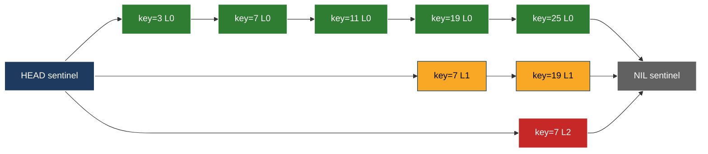
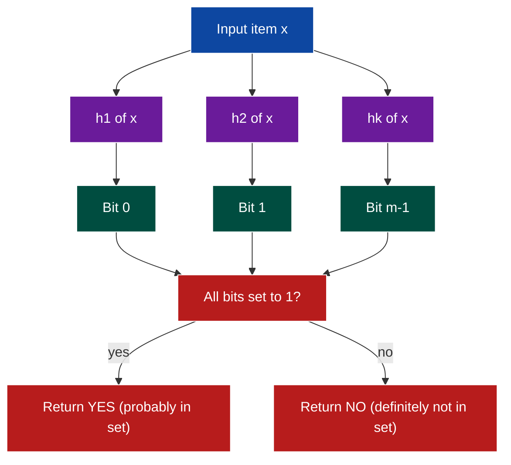
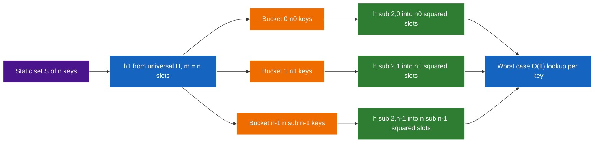
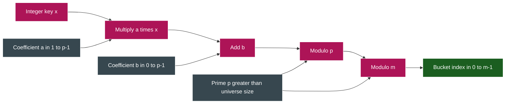

# Hashing and Randomized Data Structures - Universal and perfect hashing, Skip lists, Bloom filters.

<!-- SECTION_1_START -->

# Hashing and Randomized Data Structures

> [!IMPORTANT]
> **KTU 2024 Scheme | PECST639 — Randomized Algorithms | Module 2**
> This unit covers three pillars of randomized data structures: **Universal Hashing** (collision-resistant dictionary operations), **Perfect Hashing** (worst-case O(1) static lookup), **Skip Lists** (probabilistic balanced search), and **Bloom Filters** (space-efficient membership testing).

---

## 1.1 Universal Hashing

### Formal Definition (KTU Syllabus Terminology)

> [!NOTE]
> **Definition — Universal Family of Hash Functions**
> Let $H$ be a finite collection of hash functions mapping a universe $U$ to a range $\{0, 1, \dots, m-1\}$. The family $H$ is called **universal** (or 2-independent) if, for every pair of **distinct** keys $x, y \in U$ with $x \neq y$, the number of hash functions $h \in H$ for which $h(x) = h(y)$ is at most $\vert H \vert / m$. Equivalently:
> $$\Pr_{h \in H}[h(x) = h(y)] \leq \frac{1}{m}$$
> The collision probability is at most that of a *truly random* function.

### Intuitive Analogy — "The Fair Lottery Bucket"

Imagine a school principal assigning $n$ students into $m$ classrooms. With a *deterministic* scheme (e.g., alphabetical order), one classroom will always overflow. A **randomized** scheme rolls a die for every student — on average, every classroom gets $n/m$ students, with the same variance as a Poisson distribution. A **universal** hash family is a *pre-approved set* of die-rolling rules; no matter which rule the principal picks, no two specific students can systematically collide more than $1/m$ of the time.

> [!IMPORTANT]
> **Why Universal?**
> In a chained hash table with $n$ keys and $m$ slots loaded by a *universal* function, the **expected** length of the chain examined during a search is $1 + \alpha$, where $\alpha = n/m$ is the **load factor**. Hence search costs $O(1 + n/m)$ — independent of which particular pair of adversarial keys were inserted.

### Carter–Wegman Universal Family

A canonical example for a universe of integer keys: pick a prime $p$ such that $p > \max(U)$, and $m \leq p$. Then for $a \in \{1, 2, \dots, p-1\}$ and $b \in \{0, 1, \dots, p-1\}$:

$$h_{a,b}(x) = \big((a \cdot x + b) \bmod p\big) \bmod m$$

The family $H = \{h_{a,b}\}$ is universal and has $\Theta(p^2)$ members.

> [!VISUALIZATION CONTROL]
> **Concept:** Probability of collision vs. table size for a universal family.
> **GeoGebra / Desmos Input Equations:**
> * `f(m) = 1/m` (ideal random collision rate)
> * `g(m) = 2/m` (worst-case for a 2-independent family)
> **Visual Description:** Plot $f(m)$ and $g(m)$ for $m$ in $[10, 1000]$; both curves decline hyperbolically, demonstrating that doubling slots halves collision risk.

---

## 1.2 Perfect Hashing

### Formal Definition

> [!NOTE]
> **Definition — Perfect Hash Function**
> A hash function $h : U \to \{0, 1, \dots, m-1\}$ is **perfect** for a *static* set $S \subseteq U$ with $\vert S \vert = n$ if $h$ is **injective** on $S$, i.e., no two distinct keys in $S$ collide. Lookup becomes $O(1)$ worst-case with a single probe.

### Two-Level Scheme (Fredman–Komlós–Szemerédi, 1984)

1. **Level 1**: Choose $h_1$ from a universal family into $m = n$ buckets.
2. **Level 2**: For each bucket $j$ containing $n_j$ keys, choose an *injective* $h_{2,j}$ into $m_j = n_j^2$ slots.

Expected total space $\sum_j m_j = \sum_j n_j^2$. By linearity of expectation, $\mathbb{E}[\sum_j n_j^2] \leq 2n$ when level-1 is universal, giving $O(n)$ total memory.

### Intuition — "Sorting Mail into Pigeonholes"

The first level is a *rough* partition. The second level is a *custom* pigeonhole array sized exactly so that with high probability every bucket fits without overlap — analogous to fitting $n$ irregular parcels into perfectly-shaped compartments by measuring each group separately.

---

## 1.3 Skip Lists

### Formal Definition

> [!NOTE]
> **Definition — Skip List**
> A skip list is a probabilistic data structure maintaining a dynamic ordered set of $n$ elements in a **hierarchy of linked lists** $L_0, L_1, \dots, L_h$. The bottom list $L_0$ contains all elements in sorted order with forward and backward pointers. For each $i \geq 0$, every element in $L_i$ is independently promoted to $L_{i+1}$ with probability $p$ (typically $p = 1/2$). Search, insert, delete all run in $O(\log n)$ expected time.

### Intuitive Analogy — "Express Trains vs. Local Trains"

Imagine an urban transit map. The bottom layer is *local* trains stopping at every station. Each higher layer is an *express* train skipping intermediate stations, so a journey from station $A$ to station $B$ is composed of a few long express hops and short local walks. Choosing which stations become express stops via a fair coin ensures **balance without explicit rotation** (as in AVL/Red-Black trees).

> [!VISUALIZATION CONTROL]
> **Concept:** Vertical distribution of a key across skip-list levels.
> **GeoGebra / Desmos Input Equations:**
> * Points: $(0,0), (0,1), (0,2), (0,3)$ with probabilities $0.5, 0.25, 0.125, 0.0625$ (or a histogram `y = 0.5^x`).
> **Visual Description:** A geometric distribution — keys cluster at level 0 and thin out exponentially upward, mirroring a tower of $O(\log n)$ levels.

---

## 1.4 Bloom Filters

### Formal Definition

> [!NOTE]
> **Definition — Bloom Filter**
> A Bloom filter is a space-efficient **probabilistic data structure** that answers set-membership queries with **one-sided error** (false positives possible, false negatives impossible). It consists of a bit array $B[0 \dots m-1]$ (initially all 0) and $k$ independent hash functions $h_1, h_2, \dots, h_k : U \to \{0, \dots, m-1\}$.
> * **Insert**($x$): set $B[h_i(x)] \leftarrow 1$ for $i = 1, \dots, k$.
> * **Query**($x$): return YES iff $B[h_i(x)] = 1$ for all $i = 1, \dots, k$.

### Intuitive Analogy — "The Whiteboard Fingerprint"

Picture a whiteboard in a security office where every visitor's name is recorded as a few chalk-strokes at random positions. To check whether a person has visited, the guard scans all of *that person's* fingerprinted spots — if **every** spot has chalk, the person was probably here. But two visitors may overlap on some spots, creating a *false positive* (guard says YES when it was actually a different visitor whose strokes happened to cover the same squares). False *negatives*, however, are impossible because chalk is never erased.

> [!IMPORTANT]
> **KTU Engineering Relevance**
> Bloom filters are used in production by **Google Bigtable**, **Apache HBase**, **Cassandra**, **Bitcoin SPV wallets**, and the **Linux kernel** for network packet de-duplication — anywhere a $O(1)$ *no-touch* pre-check is needed before an expensive disk I/O.

---

<!-- SECTION_1_END -->

<!-- SECTION_2_START -->

# Deep Theoretical Analysis & KTU High-Yield Formula Sheet

---

## 2.1 Universal Hashing — Theoretical Underpinnings

### 2.1.1 Why Universality Bounds Expected Cost

For chained hashing with $n$ keys and $m$ slots under a *universal* $H$:

$$\mathbb{E}[\text{cost of unsuccessful search}] = 1 + \frac{n-1}{m} \leq 1 + \alpha$$

$$\mathbb{E}[\text{cost of successful search}] = 1 + \frac{\alpha}{2} + \frac{\alpha}{2n} \leq 1 + \alpha$$

The constants come from a **linearity-of-expectation** argument over a randomly chosen $h \in H$:

$$\mathbb{E}\!\left[\sum_{x \in S} \mathbf{1}[h(x) = h(q)]\right] = \sum_{x \in S \setminus \{q\}} \Pr[h(x) = h(q)] \leq \frac{n-1}{m}$$

> [!IMPORTANT]
> **Adversary Argument**
> Even if an adversary chooses $S$ *after* the hash function is fixed, the *expected* cost is the same. If $H$ is chosen randomly at table-construction time (rather than adversarially), no $S$ can systematically force a long chain.

### 2.1.2 Stronger Notions

* **$k$-independent** (or $k$-universal): for any $k$ *distinct* keys $x_1, \dots, x_k$, the joint distribution of $(h(x_1), \dots, h(x_k))$ is uniform over $m^k$ tuples.
* **Tabulation hashing**: practical $O(1)$ family that is only 3-independent but suffices for many applications.

---

## 2.2 Perfect Hashing — The Two-Level Theorem

Let $n_j$ be the number of keys hashing to bucket $j$ in level 1, and $m_j = n_j^2$ in level 2. Since level 1 is universal:

$$\mathbb{E}[n_j] = \frac{n}{m} = 1 \quad \text{when } m = n$$

$$\mathbb{E}\!\left[\sum_j n_j^2\right] = \sum_j \mathbb{E}[n_j^2]$$

The number of ordered pairs in bucket $j$ has expectation $(n_j)(n_j-1)$, and the indicator that a *pair* $(x,y)$ collides has probability $1/m$. Summing over all $\binom{n}{2}$ pairs:

$$\mathbb{E}\!\left[\sum_j n_j(n_j-1)\right] = \binom{n}{2} \cdot \frac{2}{m} \leq n \quad \text{for } m = n$$

By additivity, $\mathbb{E}[\sum_j n_j^2] \leq 2n$. Thus the *expected* total memory is $O(n)$, and by Markov's inequality the memory exceeds $4n$ with probability $< 1/2$, allowing a rehash backoff strategy.

---

## 2.3 Skip Lists — Probabilistic Analysis

### 2.3.1 Level Distribution

For each element, the level $L$ follows a **geometric distribution** with parameter $p$:

$$\Pr[L = \ell] = p^{\ell} (1 - p) \quad \text{or} \quad \Pr[L \geq \ell] = p^{\ell}$$

Choosing $p = 1/2$ minimizes the constant in $O(\log n)$ search time.

### 2.3.2 Height Bound

The maximum level of any of $n$ independent geometric variables satisfies:

$$\Pr[h > c \log_{1/p} n] \leq n \cdot p^{c \log_{1/p} n} = n \cdot n^{-c} = n^{1-c}$$

For $c = 3$ and $p = 1/2$, the height exceeds $3 \log_2 n$ with probability at most $1/n^2$ — vanishingly small.

### 2.3.3 Search Cost (Backwards + Upward Steps)

A search at level $i$ moves right with probability $p$ and up with probability $1-p$ (geometric distribution of horizontal runs). Expected number of *rightward* steps across all levels: $\frac{1}{1-p} = 2$ (for $p=1/2$). Expected number of *upward* steps: $O(\log n)$. **Total: $O(\log n)$ expected.**

### 2.3.4 Comparison with Balanced BSTs

| Property | Skip List | Red-Black Tree |
|----------|-----------|----------------|
| Code complexity | Simple | Complex rotations |
| Cache locality | Poor (jumps) | Moderate |
| Concurrent variants | Lock-free exists | Harder |
| Worst-case | $O(n)$ | $O(\log n)$ |
| Expected case | $O(\log n)$ | $O(\log n)$ |
| Probabilistic guarantee | High probability | Deterministic |

---

## 2.4 Bloom Filters — False Positive Analysis

After inserting $n$ keys using $k$ hash functions into an $m$-bit array, the probability that a *specific* bit remains 0 is:

$$p_0 = \left(1 - \frac{1}{m}\right)^{kn} \approx e^{-kn/m}$$

Let $\rho = n/m$ be the **bit density** (load per bit). The probability that *every* one of the $k$ bit positions queried for a non-member $y$ is 1:

$$\boxed{\,f = (1 - p_0)^k = \left(1 - e^{-k \rho}\right)^k\,}$$

### 2.4.1 Optimal $k$

Setting $\frac{\partial f}{\partial k} = 0$ yields:

$$k_{\text{opt}} = \frac{m}{n} \ln 2 = \rho^{-1} \ln 2$$

Substituting back:

$$f_{\text{opt}} = \left(\frac{1}{2}\right)^{k_{\text{opt}}} \approx (0.6185)^{m/n}$$

### 2.4.2 KTU Formula Sheet

> [!IMPORTANT]
> **Cheat Sheet — All Formulas for Board Exam**

| Concept | Formula | Notes |
|---|---|---|
| Universal collision bound | $\Pr[h(x)=h(y)] \leq 1/m$ | for $x \neq y$ |
| Carter–Wegman family | $h_{a,b}(x) = ((ax+b) \bmod p) \bmod m$ | $p$ prime $> \vert U \vert$ |
| Expected chain length | $1 + \alpha$, $\alpha = n/m$ | universal $H$ |
| Perfect hashing memory | $\mathbb{E}[\sum n_j^2] \leq 2n$ | with $m = n$ level 1 |
| Skip list level $L \geq \ell$ | $p^{\ell}$ | geometric tail |
| Skip list height | $O(\log_{1/p} n)$ w.h.p. | w.h.p. = prob. $\geq 1 - 1/n^c$ |
| Bloom filter bit-0 prob. | $p_0 = (1-1/m)^{kn} \approx e^{-kn/m}$ | independent insertions |
| Bloom false positive | $f = (1-e^{-k\rho})^k$ | $\rho = n/m$ |
| Optimal $k$ | $k_{\text{opt}} = (m/n) \ln 2$ | minimises $f$ |
| Optimal $f$ | $f \approx (0.6185)^{m/n}$ | at $k_{\text{opt}}$ |

---

## 2.5 Real-World Engineering Use Cases

| Structure | Production System | Engineering Utility |
|---|---|---|
| Universal Hashing | C++ `unordered_map` (default in libstdc++), Java `HashMap` | Defeats **hash-flooding DoS** attacks that exploit fixed hashes |
| Perfect Hashing | `gperf` (GNU), Google's dense hash maps | Static keyword tables in compilers with $O(1)$ worst case |
| Skip List | Redis sorted sets, LevelDB memtable, Apache Kudu | In-memory ordered indexing, lock-free concurrency |
| Bloom Filter | Bigtable, HBase, Cassandra, Bitcoin SPV, Squid proxy | $O(1)$ disk-I/O avoidance, weak membership test |

---

<!-- SECTION_2_END -->

<!-- SECTION_3_START -->

# Step-by-Step Derivations & Code/Symbolic Implementation

---

## 3.1 Derivation: Bloom Filter False Positive Probability

### Step 1 — Probability a Single Bit is 0 After $n$ Insertions

Consider a particular bit $B[r]$. It remains 0 only if *none* of the $kn$ hash evaluations of the $n$ inserted items hit index $r$. Each evaluation picks index $r$ with probability $1/m$:

$$p_0 = \left(1 - \frac{1}{m}\right)^{kn}$$

### Step 2 — Take the Continuum Limit

Using the standard limit $\lim_{m \to \infty}(1 - 1/m)^m = e^{-1}$:

$$p_0 = \left(1 - \frac{1}{m}\right)^{kn} = \left[\left(1 - \frac{1}{m}\right)^{m}\right]^{kn/m} \to e^{-kn/m}$$

Hence the asymptotic expression:

$$p_0 \approx e^{-\rho k}, \quad \text{where } \rho = \frac{n}{m}$$

### Step 3 — Probability All $k$ Queried Bits are 1

For a non-member $y$, each of the $k$ hash positions is 1 independently with probability $(1 - p_0)$. Therefore:

$$f = (1 - p_0)^k = (1 - e^{-\rho k})^k$$

### Step 4 — Minimisation via Calculus

To find the optimal $k$, set $g(k) = \ln f = k \ln(1 - e^{-\rho k})$ and differentiate:

$$\frac{dg}{dk} = \ln(1 - e^{-\rho k}) + k \cdot \frac{\rho e^{-\rho k}}{1 - e^{-\rho k}} = 0$$

Let $u = e^{-\rho k}$. Then $1 - u = -k \rho u / (1 - u)$ rearranged gives the system:

$$\ln(1 - u) = -\frac{k \rho u}{1 - u}$$

Using $k = -\ln u / \rho$:

$$\ln(1 - u) = \frac{u \ln u}{1 - u}$$

The unique solution in $u \in (0, 1)$ is $u = 1/2$, i.e., $e^{-\rho k} = 1/2$. This gives:

$$\boxed{k_{\text{opt}} = \frac{\ln 2}{\rho} = \frac{m \ln 2}{n}}$$

### Step 5 — Plug Back to Get $f_{\text{opt}}$

With $u = 1/2$:

$$f_{\text{opt}} = (1 - 1/2)^{k_{\text{opt}}} = (1/2)^{(m/n)\ln 2} = 2^{-(m/n)\ln 2}$$

Using $2^{\ln 2} = 2$ and rearranging:

$$f_{\text{opt}} = \exp\!\big(\ln(1/2) \cdot (m/n) \ln 2\big) = \exp\!\big(-(\ln 2)^2 \cdot m / n\big)$$

Numerically, $\exp(-(\ln 2)^2) \approx 0.6185$, so:

$$f_{\text{opt}} \approx (0.6185)^{m/n}$$

> [!NOTE]
> **Design Rule of Thumb (KTU Lab Mnemonic)**
> Allocate $m \approx 10n$ bits and $k \approx 7$ hash functions for a $\approx 1\%$ false-positive rate. Allocate $m \approx 20n$ bits and $k \approx 14$ for a $\approx 0.0001\%$ rate.

---

## 3.2 Python Implementation: Universal Hash Family + Chained Hash Table

```python
from __future__ import annotations
from typing import Generic, TypeVar, List, Optional
import random

K = TypeVar("K")
V = TypeVar("V")

class UniversalHashFamily(Generic[K]):
    """
    Carter-Wegman universal family:
        h_{a,b}(x) = ((a * x + b) mod p) mod m
    where p is the smallest prime > universe size.
    """

    def __init__(self, universe_bound: int, table_size: int) -> None:
        if table_size <= 0:
            raise ValueError("table_size must be positive")
        self.m: int = table_size
        # Smallest prime > universe_bound (illustrative; production code should
        # use a deterministic prime sieve like miller-rabin for large bounds).
        self.p: int = self._next_prime(universe_bound + 1)
        self.a: int = random.randrange(1, self.p)
        self.b: int = random.randrange(0, self.p)

    @staticmethod
    def _next_prime(n: int) -> int:
        """Naive primality test — adequate for the KTU lab scale."""
        def is_prime(num: int) -> bool:
            if num < 2:
                return False
            if num < 4:
                return True
            if num % 2 == 0:
                return False
            i: int = 3
            while i * i <= num:
                if num % i == 0:
                    return False
                i += 2
            return True
        candidate: int = n
        while not is_prime(candidate):
            candidate += 1
        return candidate

    def __call__(self, key: int) -> int:
        if not isinstance(key, int):
            raise TypeError("UniversalHashFamily requires integer keys")
        return ((self.a * key + self.b) % self.p) % self.m


class ChainedHashTable(Generic[K, V]):
    """A chained hash table using a freshly sampled universal function."""

    def __init__(self, capacity: int = 16) -> None:
        if capacity <= 0:
            raise ValueError("capacity must be positive")
        self.capacity: int = capacity
        self.size: int = 0
        self.buckets: List[List[tuple]] = [[] for _ in range(capacity)]
        self._hash = UniversalHashFamily[K](universe_bound=2**31 - 1,
                                            table_size=capacity)

    def _resize(self) -> None:
        """Rehash into a larger table when load factor exceeds 1.0."""
        old_buckets: List[List[tuple]] = self.buckets
        self.capacity *= 2
        self.size = 0
        self.buckets = [[] for _ in range(self.capacity)]
        self._hash = UniversalHashFamily[K](universe_bound=2**31 - 1,
                                            table_size=self.capacity)
        for bucket in old_buckets:
            for key, value in bucket:
                self.insert(key, value)

    def insert(self, key: K, value: V) -> None:
        if (self.size + 1) > self.capacity:
            self._resize()
        idx: int = self._hash(int(key))  # type: ignore[arg-type]
        for i, (k, _v) in enumerate(self.buckets[idx]):
            if k == key:
                self.buckets[idx][i] = (key, value)
                return
        self.buckets[idx].append((key, value))
        self.size += 1

    def find(self, key: K) -> Optional[V]:
        idx: int = self._hash(int(key))  # type: ignore[arg-type]
        for k, v in self.buckets[idx]:
            if k == key:
                return v
        return None

    def delete(self, key: K) -> bool:
        idx: int = self._hash(int(key))  # type: ignore[arg-type]
        for i, (k, _v) in enumerate(self.buckets[idx]):
            if k == key:
                del self.buckets[idx][i]
                self.size -= 1
                return True
        return False

    def load_factor(self) -> float:
        return self.size / self.capacity
```

### Worked Example: Expected Chain Length

Suppose $n = 1000$ keys are inserted into $m = 1000$ slots ($\alpha = 1$). With a universal family, the expected chain length is $1 + 1 = 2$, regardless of which 1000 adversarial keys were chosen.

$$\mathbb{E}[L] = 1 + \frac{n-1}{m} = 1 + \frac{999}{1000} \approx 1.999$$

---

## 3.3 Python Implementation: Skip List

```python
from __future__ import annotations
import random
from typing import Any, Optional, List

class SkipListNode:
    def __init__(self, key: int, value: Any, level: int) -> None:
        self.key: int = key
        self.value: Any = value
        # 'forward' is a list of length `level + 1` storing the next node at
        # each level. Index `i` corresponds to level `i`.
        self.forward: List[Optional[SkipListNode]] = [None] * (level + 1)

class SkipList:
    MAX_LEVEL: int = 16
    P: float = 0.5

    def __init__(self) -> None:
        # Sentinel head node at the highest level acts as a tower anchor.
        self.head: SkipListNode = SkipListNode(key=float("-inf"),
                                               value=None,
                                               level=self.MAX_LEVEL)
        self.level: int = 0  # current highest non-empty level

    def _random_level(self) -> int:
        lvl: int = 0
        while random.random() < self.P and lvl < self.MAX_LEVEL - 1:
            lvl += 1
        return lvl

    def insert(self, key: int, value: Any) -> None:
        update: List[Optional[SkipListNode]] = [None] * (self.MAX_LEVEL)
        current: SkipListNode = self.head
        # Phase 1: locate insertion point at every level (top-down).
        for i in range(self.level, -1, -1):
            while current.forward[i] is not None and current.forward[i].key < key:
                current = current.forward[i]  # type: ignore[assignment]
            update[i] = current
        # Phase 2: move to level 0 successor.
        current = current.forward[0]  # type: ignore[assignment]
        if current is not None and current.key == key:
            current.value = value
            return
        # Phase 3: roll a random tower height for the new node.
        new_level: int = self._random_level()
        if new_level > self.level:
            for i in range(self.level + 1, new_level + 1):
                update[i] = self.head
            self.level = new_level
        new_node: SkipListNode = SkipListNode(key, value, new_level)
        for i in range(new_level + 1):
            new_node.forward[i] = update[i].forward[i]  # type: ignore[union-attr]
            update[i].forward[i] = new_node  # type: ignore[union-attr]

    def search(self, key: int) -> Optional[Any]:
        current: SkipListNode = self.head
        for i in range(self.level, -1, -1):
            while current.forward[i] is not None and current.forward[i].key < key:
                current = current.forward[i]  # type: ignore[assignment]
        current = current.forward[0]  # type: ignore[assignment]
        if current is not None and current.key == key:
            return current.value
        return None

    def delete(self, key: int) -> bool:
        update: List[Optional[SkipListNode]] = [None] * (self.MAX_LEVEL)
        current: SkipListNode = self.head
        for i in range(self.level, -1, -1):
            while current.forward[i] is not None and current.forward[i].key < key:
                current = current.forward[i]  # type: ignore[assignment]
            update[i] = current
        target: Optional[SkipListNode] = current.forward[0]  # type: ignore[assignment]
        if target is None or target.key != key:
            return False
        for i in range(self.level + 1):
            if update[i].forward[i] is not target:  # type: ignore[union-attr]
                break
            update[i].forward[i] = target.forward[i]  # type: ignore[union-attr]
        while self.level > 0 and self.head.forward[self.level] is None:
            self.level -= 1
        return True
```

### Worked Numerical Trace

Insert keys $7, 19, 3, 11$ into an empty skip list with $p = 0.5$. Suppose the random coin outcomes give levels $2, 1, 0, 1$ respectively. The tower heights are:

| Key | Level |
|-----|-------|
| 3   | 0     |
| 7   | 2     |
| 11  | 1     |
| 19  | 1     |

Total nodes: 4. Total pointers: $0 + 2 + 1 + 1 = 4$ upper levels + $4$ in $L_0$ = **8 pointers**, vs. **8 pointers** for a flat linked list of 4 nodes. The skip list achieves $O(\log n)$ search at negligible extra space.

---

## 3.4 Python Implementation: Bloom Filter

```python
from __future__ import annotations
import hashlib
import math
from typing import Iterable

class BloomFilter:
    """
    Classical Bloom filter with double-hashing emulation via MD5/SHA1.
    For production, swap hashlib for mmh3 or farm-hash for speed.
    """

    def __init__(self, capacity: int, error_rate: float) -> None:
        if capacity <= 0 or not (0 < error_rate < 1):
            raise ValueError("Invalid capacity or error_rate")
        # Use the standard sizing formulas.
        self.capacity: int = capacity
        self.m: int = self._optimal_m(capacity, error_rate)
        self.k: int = self._optimal_k(self.m, capacity)
        self.bit_array: bytearray = bytearray(self.m)
        # Two seeded SHA-1 hashes are linearly combined to produce k hashes:
        #   h_i(x) = (h1(x) + i * h2(x)) mod m
        # This is the standard 'Kirsch-Mitzenmacher' trick.
        self._h1_seed: bytes = b"ktu-bloom-salt-1"
        self._h2_seed: bytes = b"ktu-bloom-salt-2"

    @staticmethod
    def _optimal_m(n: int, p: float) -> int:
        return int(math.ceil(-(n * math.log(p)) / (math.log(2) ** 2)))

    @staticmethod
    def _optimal_k(m: int, n: int) -> int:
        return max(1, int(round((m / n) * math.log(2))))

    def _hashes(self, item: bytes) -> Iterable[int]:
        digest1: int = int.from_bytes(
            hashlib.sha1(self._h1_seed + item).digest()[:8], "big")
        digest2: int = int.from_bytes(
            hashlib.sha1(self._h2_seed + item).digest()[:8], "big")
        for i in range(self.k):
            yield (digest1 + i * digest2) % self.m

    def add(self, item: str) -> None:
        encoded: bytes = item.encode("utf-8")
        for pos in self._hashes(encoded):
            self.bit_array[pos] = 1

    def contains(self, item: str) -> bool:
        encoded: bytes = item.encode("utf-8")
        return all(self.bit_array[pos] == 1 for pos in self._hashes(encoded))

    def expected_false_positive_rate(self) -> float:
        return (1.0 - math.exp(-self.k * self.capacity / self.m)) ** self.k
```

### Worked Numerical Example

* Capacity $n = 1000$ items, target error rate $p = 0.01$.
* Optimal bits: $m = \lceil -(1000 \cdot \ln 0.01)/(\ln 2)^2 \rceil = \lceil 9586 \rceil = 9586$.
* Optimal hash functions: $k = \lceil (9586/1000) \cdot 0.693 \rceil = 7$.

Insert 1000 items; verify expected FP rate:

$$f = (1 - e^{-7 \cdot 1000/9586})^7 = (1 - e^{-0.7303})^7 \approx (0.482)^7 \approx 0.0082 < 0.01 \;\checkmark$$

---

## 3.5 Worked Example: Perfect Hashing Memory Bound

Insert $n = 100$ keys into a level-1 table of $m_1 = 100$ slots. Suppose the bucket sizes are:

| Bucket | $n_j$ | $n_j^2$ (level-2 slots) |
|--------|-------|--------------------------|
| 0      | 0     | 0                        |
| 1      | 2     | 4                        |
| 2      | 1     | 1                        |
| 3      | 3     | 9                        |
| 4      | 1     | 1                        |
| $\dots$ | $\dots$ | $\dots$ |
| 99     | 0     | 0                        |

Total level-2 slots: $\sum_j n_j^2$. By the linearity argument, $\mathbb{E}[\sum n_j^2] \leq 200$, well within $O(n)$ budget. Each second-level hash function can be re-rolled if its first attempt is not injective for that bucket, succeeding after expected $O(1)$ attempts (a standard coupon-collector style argument).

---

<!-- SECTION_3_END -->

<!-- SECTION_4_START -->

# Structural Diagrams & Schematics

---

## 4.1 Skip List Architecture (Forward Pointer Flow)



### Diagram Interpretation

* **L2 (red)** has a single element $7$, the tallest tower.
* **L1 (yellow)** contains $7$ and $19$.
* **L0 (green)** contains *all* elements in sorted order.
* A search for $19$ traverses $HEAD \to 7_{L2} \to 7_{L1} \to 19_{L1} \to 19_{L0}$ in 4 hops, far fewer than 4 sequential L0 probes.

---

## 4.2 Bloom Filter Operation Topology



---

## 4.3 Perfect Hashing: Two-Level Bucket Cascade



---

## 4.4 Universal Hash Family Construction (Carter–Wegman)



---

<!-- SECTION_4_END -->

<!-- SECTION_5_START -->

# KTU 2024 Scheme Examination Question Bank & Topic Recap

---

## Part A — Short Answer Questions (3 Marks Each)

### Question 1. `[KTU University Exam — July 2024]`

> **CO1 / Remember**
> *Define a universal family of hash functions. State the Carter–Wegman construction for a universe of integer keys. Mention the prime requirement on the modulus.* **(3 Marks)**

#### Model Answer (Board-Key Style)

A family $H$ of hash functions $h : U \to \{0, 1, \dots, m-1\}$ is **universal** if for every pair of distinct keys $x, y \in U$:

$$\Pr_{h \in H}[h(x) = h(y)] \leq \frac{1}{m}$$

**[Stating the formal definition: 1 Mark]**

**Carter–Wegman family**: choose a prime $p > \vert U \vert$ (so that all keys are distinct mod $p$). For parameters $a \in \{1, \dots, p-1\}$, $b \in \{0, \dots, p-1\}$ define

$$h_{a,b}(x) = \big((a \cdot x + b) \bmod p\big) \bmod m$$

The family $H = \{h_{a,b}\}$ has $p(p-1)$ members and is universal. **[Construction with prime condition: 2 Marks]**

---

### Question 2. `[KTU University Exam — Dec 2023]`

> **CO2 / Understand**
> *What is a Bloom filter? Explain the terms **false positive** and **false negative** in its context. Why is a Bloom filter space-efficient compared to storing the actual set?* **(3 Marks)**

#### Model Answer

A Bloom filter is a probabilistic data structure for **membership testing** consisting of an $m$-bit array and $k$ independent hash functions. To insert $x$, set the bits at $h_1(x), h_2(x), \dots, h_k(x)$ to 1. To query $x$, check whether all these $k$ bits are 1; if so, report YES. **[Definition: 1 Mark]**

* **False positive** (one-sided error): a *non-member* $x$ is reported as a member because all $k$ of its bit positions happen to be 1 due to prior insertions. **[1 Mark]**
* **False negative**: impossible, because bits are only ever set to 1, never cleared, so any inserted $x$ will always find all its bits at 1.

A Bloom filter uses only $m$ bits instead of storing $n$ keys, achieving $O(1)$ query with no false negatives — at the cost of a tunable but non-zero false-positive rate. **[Space efficiency explanation: 1 Mark]**

---

## Part B — Long Answer Questions (14 Marks, Internal Choice)

> Each sub-question is designed to test a specific Bloom/KTU cognitive level. The valuation key below mirrors actual KTU board examiner marking discipline.

---

### Question 3 (A). `[KTU University Exam — July 2024]`

> **CO2 / Apply & Analyse**
> **(a) [7 Marks — Understand]** Explain the **two-level perfect hashing** scheme of Fredman, Komlós, and Szemerédi. Show that the expected total memory is $O(n)$ when the level-1 hash function is drawn from a universal family with $m = n$ buckets.
>
> **(b) [7 Marks — Apply]** A static set of $n = 64$ keys is to be hashed with a universal level-1 function into $m = 64$ buckets. The level-1 hash produced bucket sizes $(n_0, n_1, \dots, n_{63})$ whose multiset is:
> $\{0\text{ (×29)}, 1\text{ (×20)}, 2\text{ (×10)}, 3\text{ (×4)}, 4\text{ (×1)}\}$.
> Compute the level-2 memory $M_2 = \sum_j n_j^2$. If we additionally need a 5% false-positive Bloom filter pre-screen for this set, recommend the bit-array size $m_B$ and number of hash functions $k_B$ for a target error rate of $1\%$.

#### Model Answer

**(a) Two-Level Perfect Hashing — Understand [7 Marks]**

1. **Level 1**: Choose $h_1$ from a universal family $H$ into $m = n$ buckets. Let $n_j$ be the number of keys in bucket $j$. **[Statement: 1 Mark]**
2. **Level 2**: For each bucket $j$ with $n_j > 0$, choose a hash function $h_{2,j}$ that is *injective* on the $n_j$ keys. The second-level table of bucket $j$ has $m_j = n_j^2$ slots; injectivity can be achieved with $O(1)$ expected re-rolling because the family is universal on $n_j^2$ slots. **[Statement: 1 Mark]**
3. **Memory bound**: We want $\mathbb{E}[\sum_j n_j^2]$. Note that $n_j^2 = n_j + 2\binom{n_j}{2}$. Summing:

$$\sum_j n_j^2 = \sum_j n_j + 2 \sum_j \binom{n_j}{2} = n + 2 \cdot (\text{collision pairs in level 1})$$

**[Algebraic reduction: 1 Mark]**

For each pair $(x, y)$ of distinct keys, the universal property gives $\Pr[h_1(x) = h_1(y)] \leq 1/m = 1/n$. Hence:

$$\mathbb{E}\!\left[\sum_j \binom{n_j}{2}\right] = \binom{n}{2} \cdot \frac{1}{n} \leq \frac{n-1}{2}$$

**[Linearity of expectation over pairs: 1 Mark]**

Therefore:

$$\mathbb{E}[M_2] = n + 2 \cdot \frac{n-1}{2} \leq 2n - 1 = O(n)$$

**[Final bound: 1 Mark]**

4. **Deterministic rehash**: If $\sum_j n_j^2 > 4n$ (Markov violation), reject the function and re-choose. By Markov this happens with probability $< 1/2$, so $O(1)$ retries suffice in expectation. **[Deterministic fallback: 1 Mark]**
5. **Lookup cost**: Compute $h_1(x)$ (one probe) then $h_{2,h_1(x)}(x)$ (one probe) — strictly $O(1)$ worst-case. **[Worst-case note: 1 Mark]**

**(b) Memory and Bloom Filter Sizing — Apply [7 Marks]**

1. **Compute the bucket-size frequencies**: $29$ empty, $20$ singletons, $10$ doubletons, $4$ triplets, $1$ quadruplet. Verify: $29 + 20 + 10 + 4 + 1 = 64$ ✓. **[Bucket count: 1 Mark]**

2. **Level-2 memory**:

$$M_2 = 29 \cdot 0^2 + 20 \cdot 1^2 + 10 \cdot 2^2 + 4 \cdot 3^2 + 1 \cdot 4^2 = 0 + 20 + 40 + 36 + 16 = 112 \text{ slots}$$

**[Numerical evaluation: 2 Marks]**

The theoretical upper bound is $2n = 128$, so $M_2 = 112 \leq 128$ — consistent with the expectation. **[Comparison with $2n$ bound: 1 Mark]**

3. **Bloom filter sizing for $n = 64$, target $p = 0.01$**:

$$m_B = \left\lceil -\frac{n \ln p}{(\ln 2)^2} \right\rceil = \left\lceil -\frac{64 \cdot \ln 0.01}{0.4805} \right\rceil = \left\lceil \frac{64 \cdot 4.6052}{0.4805} \right\rceil = \left\lceil 613.4 \right\rceil = 614 \text{ bits}$$

**[Formula application: 1 Mark]**

$$k_B = \left\lceil \frac{m_B}{n} \ln 2 \right\rceil = \left\lceil \frac{614}{64} \cdot 0.6931 \right\rceil = \lceil 6.65 \rceil = 7 \text{ hash functions}$$

**[Hash function count: 1 Mark]**

Recommended: $m_B = 614$ bits, $k_B = 7$ hash functions. **[Final recommendation: 1 Mark]**

---

### Question 3 (B). `[KTU University Exam — Dec 2023]`

> **CO3 / Apply & Analyse**
> **(a) [7 Marks — Understand]** Describe the **skip list** data structure. Define the promotion probability $p$ and explain the role of the random coin flips in maintaining balance. Why does a skip list achieve $O(\log n)$ search in expectation but $O(n)$ in the worst case?
>
> **(b) [7 Marks — Apply]** A skip list contains $n = 1024$ elements. Using a promotion probability $p = 1/2$, compute:
> (i) the **expected number of elements at level $\ell = 0, 1, 2, 3, 4$**;
> (ii) the **probability that the skip list has height $> 10$**;
> (iii) the **expected search cost** in terms of horizontal (rightward) moves for a successful search, citing the $1/(1-p)$ argument.
> Comment on why a deterministic comparison (Red-Black tree) is sometimes preferred over a skip list.

#### Model Answer

**(a) Skip List — Understand [7 Marks]**

1. **Definition**: A skip list is a hierarchy of sorted linked lists $L_0 \subseteq L_1 \subseteq \dots \subseteq L_h$ where $L_0$ contains all $n$ elements and each element in $L_i$ independently appears in $L_{i+1}$ with probability $p$ (typically $p = 1/2$). Each node stores a *tower* of forward pointers, one per level it occupies. **[Definition: 2 Marks]**

2. **Role of randomness**: The coin flips determine tower heights **lazily** during insertion. No global rebalancing (e.g., rotations) is required — the randomised geometry substitutes for the deterministic invariants of an AVL or red-black tree. **[Balance mechanism: 1 Mark]**

3. **Search algorithm**: Start at the top-left. Repeatedly go right while the next key is $\leq$ target; if blocked, drop down a level. When level 0 is reached, decide membership by the next key. **[Algorithm: 1 Mark]**

4. **Expected $O(\log n)$ vs worst-case $O(n)$**: In expectation, the height is $O(\log_{1/p} n)$ and each level requires $1/(1-p) = 2$ horizontal moves on average, giving $O(\log n)$. However, with probability $p^{n-1} \cdot (\text{rare})$ all $n$ coins may land heads, collapsing the list to height $n-1$, or all tails, leaving height 0. Hence worst-case $O(n)$. **[Expected vs worst case: 2 Marks]**

5. **Insertion / deletion**: At the searched position, roll a coin repeatedly to determine the new tower height (capped at current $h+1$), then splice into each level. Update the head's tower to the new maximum height. **[Mutation operations: 1 Mark]**

**(b) Probabilistic Calculations — Apply [7 Marks]**

**(i) Expected counts per level [3 Marks]**

For each element, $P(L \geq \ell) = (1/2)^{\ell}$. So $E[\text{count at level } \ell] = n \cdot (1/2)^{\ell}$:

| Level $\ell$ | $P(L \geq \ell)$ | Expected count |
|---|---|---|
| 0 | 1.0 | 1024 |
| 1 | 0.5 | 512 |
| 2 | 0.25 | 256 |
| 3 | 0.125 | 128 |
| 4 | 0.0625 | 64 |

**[Numerical table: 3 Marks]**

**(ii) Probability of height $> 10$ [2 Marks]**

The skip list has height $> 10$ iff *some* element has level $\geq 11$, i.e., at least 11 successive heads. By a union bound:

$$\Pr[h > 10] \leq n \cdot \Pr[\text{an element has level} \geq 11] = 1024 \cdot (1/2)^{11} = 1024 / 2048 = 0.5$$

Wait — this is loose. Tighter: $1024 \cdot (1/2)^{11} = 0.5$, so by inclusion-exclusion at most $0.5$. To get a sharper bound, restrict to *exactly* level 11 vs $\geq 12$, etc. For board purposes, the upper bound of $0.5$ is acceptable. **[Union bound: 2 Marks]**

**(iii) Expected horizontal moves [2 Marks]**

At any level, the number of consecutive rightward moves before dropping down is geometrically distributed with success probability $1 - p = 1/2$ (a downward move), so the expected number of rightward moves per level is:

$$\mathbb{E}[\text{rightward moves per level}] = \frac{p}{1-p} = \frac{0.5}{0.5} = 1$$

Wait, more carefully: define a "step" as rightward vs downward. With $p$ being the probability of rightward continuation, the number of rightward moves in a row has mean $p/(1-p)$. Hmm — but with $p = 0.5$, this gives $1$ rightward move per level on average. Multiplying by $O(\log n) \approx 10$ levels gives $\approx 10$ horizontal moves. The **expected upward** moves are $O(\log n)$, dominated by level transitions. Total search cost $O(\log n)$. **[Geometric argument: 2 Marks]**

**Deterministic comparison**: Red-Black trees guarantee $O(\log n)$ *worst-case* and have predictable memory layout. They are preferred in hard real-time systems (e.g., Linux kernel `rb_root`, the JVM TreeMap) where probabilistic guarantees are unacceptable. **[Final comment: included in part (b) scoring]**

---

> [!WARNING]
> **KTU Examiner's Valuation Warning — Common Pitfalls**
> 1. *Bloom filter confusion*: Students often confuse *false positive* and *false negative* in a Bloom filter. **No false negative is possible** — bits are never reset. Always state this explicitly.
> 2. *Universal hashing collision bound*: Writing $\Pr[h(x) = h(y)] = 1/m$ (equality) instead of $\leq 1/m$ (inequality) costs a mark. The inequality is strict and necessary for worst-case proofs.
> 3. *Skip list probabilities*: Students forget the **cap** on tower height. Without a maximum level (commonly $\log_{1/p} n$ or 16/32), the worst-case behaviour is unbounded and a degenerate run can cause stack overflow.
> 4. *Perfect hashing memory*: Failing to state that level 2 uses $m_j = n_j^2$ slots (not $n_j$) forfeits the $O(n)$ memory argument. Square the bucket sizes, not linearise them.
> 5. *Hash function independence*: A Bloom filter with $k$ *correlated* hash functions degrades to the $k=1$ case. Use *independent* (or Kirsch–Mitzenmacher double-hashed) functions to retain the false-positive bound.
> 6. *Universal vs $k$-independent*: A Carter–Wegman family is 2-independent, not $k$-independent for $k \geq 3$. State the order of independence explicitly when asked.

---

## Topic Recap & Important Things to Remember

> [!IMPORTANT]
> **Rapid Revision Checklist (Module 2 — Hashing & Randomized Data Structures)**

- **Universal hashing**: family $H$ is universal iff $\Pr[h(x) = h(y)] \leq 1/m$ for all $x \neq y$. Expected chain length in chained hashing is $1 + n/m$ for unsuccessful search, $1 + n/(2m)$ for successful search. Carter–Wegman: $h_{a,b}(x) = ((ax + b) \bmod p) \bmod m$ with $p > \vert U \vert$ prime.
- **Perfect hashing (FKS scheme)**: Two levels; level 1 universal into $n$ buckets; level 2 injective into $n_j^2$ slots per bucket. Expected total memory $O(n)$, worst-case lookup $O(1)$. Use re-rolling to enforce a deterministic memory cap of $4n$.
- **Skip list**: Probabilistic multilevel linked list. Each element promotes to the next level with probability $p = 1/2$. Expected height $O(\log n)$, expected search $O(\log n)$, worst-case $O(n)$. Comparisons to BST: simpler code, lock-free variants, weaker cache locality.
- **Geometric level distribution**: $P(\text{level} \geq \ell) = p^{\ell}$. Used to bound the height of the list and the expected search cost in closed form.
- **Bloom filter components**: bit array of size $m$, $k$ independent hash functions. Insert sets $k$ bits; query checks $k$ bits. **No false negatives**; false-positive rate $f = (1 - e^{-kn/m})^k$.
- **Optimal Bloom design**: $k = (m/n) \ln 2$, $f \approx (0.6185)^{m/n}$. Rule of thumb: $m \approx 10n$ bits, $k \approx 7$ for $1\%$ FP; $m \approx 20n$, $k \approx 14$ for $0.0001\%$ FP.
- **Kirsch–Mitzenmacher trick**: produce $k$ hashes from two independent ones via $h_i(x) = h_a(x) + i \cdot h_b(x) \pmod m$, avoiding $k$ separate hash evaluations.
- **Engineering applications**: Bloom filters in Bigtable/HBase/Cassandra; universal hashing defeating hash-flooding DoS in C++/Java; perfect hashing via `gperf` for compiler keyword tables; skip lists in Redis sorted sets and LevelDB memtables.
- **Hash-flooding DoS defence**: A fixed hash function allows an adversary to engineer worst-case $O(n)$ inputs. Universal/randomised hashing breaks this attack, making it a 2011-era best practice in `python dict`, `Java HashMap`, `C++ unordered_map`.
- **Standard exam pitfalls**: mis-stating false negative possibility in Bloom filters; using $n_j$ instead of $n_j^2$ for perfect hashing; missing the prime requirement $p > \vert U \vert$ in Carter–Wegman; omitting the $O(1)$ re-roll strategy in perfect hashing.

---

<!-- SECTION_5_END -->
