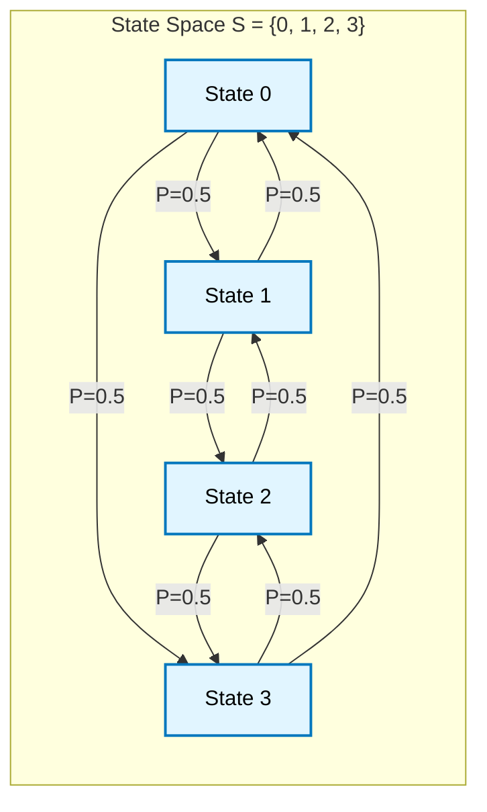
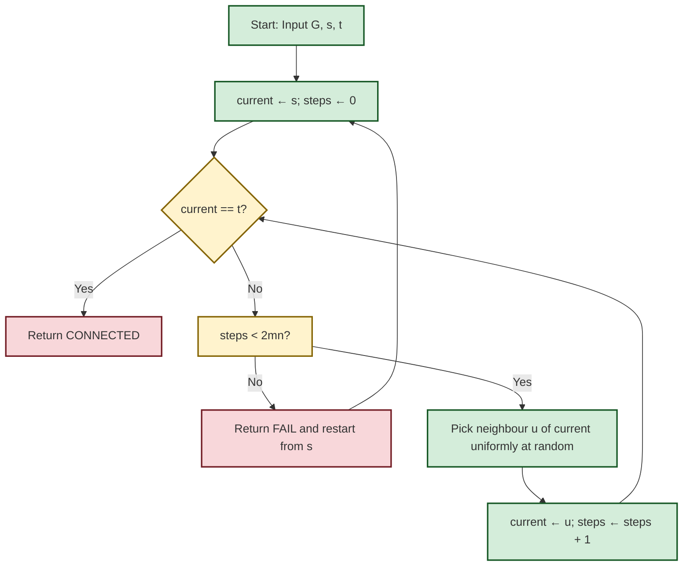
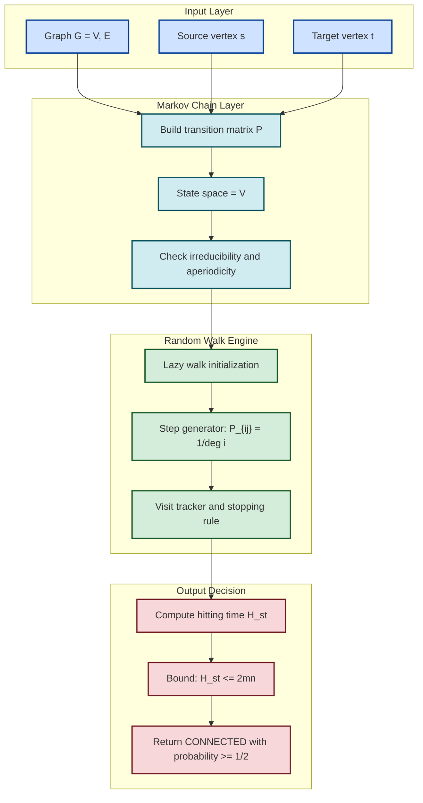
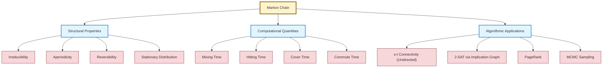

# Markov Chains and Random Walks - Introduction to Markov chains, Random walks on graphs, Applications in randomized algorithms.

<!-- SECTION_1_START -->
# Module 2: Randomized Graph Algorithms
## Topic: Markov Chains and Random Walks

### 1. Core Technical Definition & Intuitive Overview

> [!NOTE]
> **Syllabus Highlight (KTU 2024 — PECST639, Module 2):**
> This topic establishes the *probabilistic engine* that powers most modern randomized graph algorithms. You are expected to demonstrate mastery of: (i) the formal definition of a Markov chain, (ii) construction of transition matrices, (iii) computation of stationary distributions, and (iv) the application of random walks to graph problems like $s$–$t$ connectivity and **2-SAT**.

#### 1.1 What is a Markov Chain?

A **Markov chain** is a discrete-time stochastic process $\{X_0, X_1, X_2, \dots\}$ defined over a state space $S$ that satisfies the **Markov property (memorylessness)**:

$$
\mathbb{P}(X_{t+1} = j \mid X_t = i, X_{t-1}, \dots, X_0) = \mathbb{P}(X_{t+1} = j \mid X_t = i)
$$

> [!IMPORTANT]
> **Key Insight:** The future depends *only* on the present state — not on how we got there. This single property makes Markov chains mathematically tractable and is the reason they are the *workhorse* of randomized algorithms.

> [!TIP]
> **Conceptual Analogy — "The Amnesiac Drunkard":** Imagine a drunkard standing at an intersection of roads. At every step, he picks one of the outgoing roads **uniformly at random** and stumbles to the next intersection. He has **no memory** of where he has been. Each intersection is a *state*, each random step is a *transition*, and the long-run fraction of time he spends at any intersection converges to a fixed number — the **stationary distribution**. The entire mathematical machinery of Markov chains is built upon this innocent, beautiful assumption.

**Transition Probability $P_{ij}$:** The probability of moving from state $i$ to state $j$ in one step.

**Transition Matrix $P$:** A square matrix of size $\vert S \vert \times \vert S \vert$ where entry $(i, j)$ is $P_{ij}$. Two essential properties hold for every row $i$:

$$
\sum_{j \in S} P_{ij} = 1 \quad \text{and} \quad 0 \le P_{ij} \le 1
$$

#### 1.2 What is a Random Walk on a Graph?

> [!IMPORTANT]
> **Definition (Random Walk on Graph):** Given an undirected graph $G = (V, E)$, start at some vertex $v_0 \in V$. At each step, from the current vertex $v_t$, pick a neighbor $u$ of $v_t$ **uniformly at random** (i.e., with probability $1/\deg(v_t)$) and move to $u$. The sequence $v_0, v_1, v_2, \dots$ is a **random walk** on $G$.

The transition matrix for an unweighted, undirected graph has a beautifully simple form:

$$
P_{ij} = \begin{cases} \dfrac{1}{\deg(i)} & \text{if } (i, j) \in E \\ 0 & \text{otherwise} \end{cases}
$$

#### 1.3 Why Are Markov Chains and Random Walks Important in KTU Randomized Algorithms?

> [!VISUALIZATION CONTROL]
> **Concept:** Visualizing a 3-state Markov chain and its random-walk dynamics on a graph
> **GeoGebra / Desmos Input Equations (transition matrix for path $A \to B \to C$):**
> * Define $P = \begin{pmatrix} 0 & 1 & 0 \\ 0.5 & 0 & 0.5 \\ 0 & 1 & 0 \end{pmatrix}$
> * Plot $f(x) = (1/3, 1/3, 1/3)$ as a horizontal reference (the **uniform stationary distribution**)
> **Visual Description:** Each row sums to 1. The student should see a doubly-stochastic matrix where each column is also a probability distribution — the signature of regular random walks on undirected graphs.

This is used in production systems at scale in:
- **Google's PageRank algorithm** (Brin & Page, 1998) — a random walk on the web graph
- **Markov Chain Monte Carlo (MCMC)** samplers in Bayesian machine learning
- **Network analysis tools** (community detection, centrality measures)
- **Compiler optimization** (register allocation via random walks on interference graphs)
- **Cryptographic protocols** (Mix-nets, anonymous routing)

> [!IMPORTANT]
> **Standard Metric — The *Mixing Time* $\tau_{mix}$:** The number of steps required for the distribution of the walk to be within total-variation distance $\le 1/4$ of the stationary distribution. This is the most important complexity parameter in Markov chain analysis.

---

<!-- SECTION_1_END -->

<!-- SECTION_2_START -->
# 2. Deep Theoretical Analysis & KTU High-Yield Formula Sheet

### 2.1 Anatomy of a Markov Chain — Structural Decomposition

A finite Markov chain is governed by its **transition matrix** $P$, but the *qualitative* behaviour is dictated by four structural properties. The KTU examiner expects you to know each one and the algorithmic implications:

| # | Property | Definition | Algorithmic Significance |
|---|----------|------------|--------------------------|
| 1 | **Irreducible** | Every state is reachable from every other state | The walk explores the *entire* state space; needed for $\pi$ to be unique |
| 2 | **Aperiodic** | $\gcd\{t \ge 1 : (P^t)_{ii} > 0\} = 1$ for all $i$ | Guarantees convergence to $\pi$ from *any* start state |
| 3 | **Symmetric / Reversible** | $\pi_i P_{ij} = \pi_j P_{ji}$ for all $i, j$ | A random walk on an undirected graph is *always* reversible |
| 4 | **Regular** | Some $P^k$ has strictly positive entries | Equivalent to irreducible + aperiodic for finite chains |

> [!IMPORTANT]
> **Fundamental Theorem (Ergodic Theorem for Markov Chains):** A finite, irreducible, and aperiodic Markov chain has a **unique** stationary distribution $\pi$ satisfying $\pi P = \pi$, and for any initial distribution, $\lim_{t \to \infty} P^t = \mathbf{1}\pi$ (a matrix whose every row is $\pi$).

### 2.2 Stationary Distribution — The Heart of the Theory

A distribution $\pi$ is **stationary** if it satisfies the balance equation:

$$
\pi_j = \sum_{i \in S} \pi_i P_{ij} \quad \iff \quad \pi P = \pi
$$

For a random walk on an **undirected, connected** graph $G = (V, E)$, the stationary distribution has a closed form involving vertex degrees:

$$
\pi_v = \frac{\deg(v)}{2 \vert E \vert} \quad \text{for every } v \in V
$$

> [!NOTE]
> **Why this works:** The probability of being at $v$ in the long run is proportional to how many "incoming" edges it has — and for undirected graphs, in-degree equals degree. Hence the **degree-biased** distribution. This is also exactly the basis of **PageRank**, where the web graph is directed, and the stationary distribution solves a modified equation involving a damping factor.

### 2.3 Random Walk Quantities on Graphs

For a graph $G = (V, E)$ with $n = \vert V \vert$ vertices and $m = \vert E \vert$ edges, the three key quantities every KTU student must know are:

1. **Hitting time $H_{uv}$:** Expected number of steps to reach $v$ starting from $u$.
2. **Expected commute time $C_{uv}$:** $C_{uv} = H_{uv} + H_{vu}$.
3. **Cover time $C(G)$:** Expected number of steps for a walk starting from $u$ to visit *every* vertex at least once. The maximum over all starting vertices.

### 2.4 Real-World Engineering Utility

| Application Domain | Role of Markov Chain / Random Walk |
|--------------------|-------------------------------------|
| **Search Engines (PageRank)** | Stationary distribution of a random surfer on the web graph |
| **MCMC Sampling** | Random walks on exponentially-large state spaces for Bayesian inference |
| **Compiler Optimization** | Register allocation treated as a graph coloring problem solvable via random walks |
| **Network Reliability** | $s$–$t$ connectivity in *unknown* graphs via Las Vegas random walks |
| **Algorithmic Game Theory** | Mixing times determine convergence of best-response dynamics |
| **Cryptography** | Anonymous routing (Crowds protocol) uses random walks on overlay networks |
| **Bioinformatics** | Random walks on protein-interaction graphs for functional annotation |

### 2.5 KTU Formula Sheet / Cheat Sheet

> [!IMPORTANT]
> **The Master Formula Sheet — KTU Board Examination Ready.** Memorize this table; it covers $\ge 80\%$ of numerical questions in this module.

| # | Quantity | Formula | Conditions / Notes |
|---|----------|---------|--------------------|
| 1 | Markov property | $\mathbb{P}(X_{t+1}=j \mid X_t=i, \dots) = \mathbb{P}(X_{t+1}=j \mid X_t=i)$ | Memorylessness |
| 2 | Row-stochasticity of $P$ | $\sum_{j} P_{ij} = 1$ for all $i$ | Fundamental property |
| 3 | $t$-step transition | $P^{(t)} = P^t$ (matrix power) | Chapman–Kolmogorov |
| 4 | Stationary distribution | $\pi P = \pi$ with $\sum_i \pi_i = 1$ | Balance equation |
| 5 | Random walk on undirected graph | $\pi_v = \deg(v) / (2 \vert E \vert)$ | Connected graph |
| 6 | PageRank (with damping) | $\pi = d \cdot P^T \pi + (1-d) \cdot \mathbf{1}/n$ | Damping $d \approx 0.85$ |
| 7 | Commute time | $C_{uv} = 2m \cdot R^{eff}_{uv}$ | Effective resistance relation |
| 8 | Cover time (general graph) | $C(G) \le 2m (2n - 1)$ | Upper bound (Matthews bound) |
| 9 | Cover time (complete graph $K_n$) | $C(K_n) = \Theta(n \log n)$ | $\Theta(n \log n)$ coupon collector |
| 10 | Cover time (line $P_n$) | $C(P_n) = \Theta(n^2)$ | Worst-case among connected graphs |
| 11 | Cover time (lollipop graph) | $C(L_n) = \Theta(n^3)$ | Extremal example |
| 12 | Hitting time (random walk, $G$ connected) | $H_{uv} = 2m \cdot \text{eff. resistance}(u, v)$ | Electrical network analogy |
| 13 | Mixing time (lazy walk) | $\tau_{mix} = \Theta(1/(1-\lambda_2))$ | $\lambda_2$ = second eigenvalue of $P$ |
| 14 | $s$–$t$ connectivity success (1 trial) | $\ge 1/(2m)$ per walk | Restart from $s$ on failure |

---

<!-- SECTION_2_END -->

<!-- SECTION_3_START -->
# 3. Step-by-Step Derivations & Code/Symbolic Implementation

### 3.1 Derivation 1 — Stationary Distribution of a Random Walk on a Cycle $C_n$

> [!NOTE]
> **Problem Setup:** Consider the cycle graph $C_4$ with vertices $\{0, 1, 2, 3\}$. A random walk starts at vertex $0$ and moves to a neighbor with equal probability. Compute the stationary distribution and verify $\pi P = \pi$.

**Step 1 — Build the transition matrix $P$:**

For a 4-cycle, every vertex has degree 2, so the walker moves left or right each with probability $1/2$:

$$
P = \begin{pmatrix}
0 & 1/2 & 0 & 1/2 \\
1/2 & 0 & 1/2 & 0 \\
0 & 1/2 & 0 & 1/2 \\
1/2 & 0 & 1/2 & 0
\end{pmatrix}
$$

**Step 2 — Write the balance equations $\pi P = \pi$:**

For vertex 0:
$$
\pi_0 = \pi_3 \cdot \frac{1}{2} + \pi_1 \cdot \frac{1}{2}
$$
For vertex 1:
$$
\pi_1 = \pi_0 \cdot \frac{1}{2} + \pi_2 \cdot \frac{1}{2}
$$
For vertex 2:
$$
\pi_2 = \pi_1 \cdot \frac{1}{2} + \pi_3 \cdot \frac{1}{2}
$$
For vertex 3:
$$
\pi_3 = \pi_2 \cdot \frac{1}{2} + \pi_0 \cdot \frac{1}{2}
$$

**Step 3 — Apply the symmetry argument:**

For a 4-cycle (and any cycle $C_n$), every vertex is structurally identical (the graph is **vertex-transitive**). Therefore $\pi_0 = \pi_1 = \pi_2 = \pi_3 = \pi$. Using $\sum_i \pi_i = 1$:

$$
4\pi = 1 \quad \Rightarrow \quad \pi = \frac{1}{4}
$$

**Step 4 — Cross-verify using the closed-form formula:**

Number of edges $m = 4$, and $\deg(v) = 2$ for all $v$:

$$
\pi_v = \frac{\deg(v)}{2m} = \frac{2}{2 \cdot 4} = \frac{1}{4}
$$

This matches our derivation. $\blacksquare$

---

### 3.2 Derivation 2 — Cover Time of the Complete Graph $K_n$ (Coupon Collector)

> [!NOTE]
> **Theorem:** A random walk on the complete graph $K_n$ has cover time $\Theta(n \log n)$.

**Setup:** A random walk on $K_n$ is equivalent to the **coupon collector problem** because from any vertex, the walk is equally likely to go to *any other* vertex. So the "next new vertex visited" behaves identically to drawing a uniformly random coupon.

**Step 1 — Time to collect $i$ new coupons out of $n$:**

At any time when $i$ distinct vertices have been visited, the probability that the *next step* lands on an unvisited vertex is:

$$
p_i = \frac{n - i}{n - 1}
$$

(There are $n - 1$ neighbours; $n - i$ of them are unvisited.)

**Step 2 — Expected steps to grow visited set from $i-1$ to $i$:**

Since the geometric distribution gives $\mathbb{E}[T] = 1/p$:

$$
\mathbb{E}[T_i] = \frac{1}{p_i} = \frac{n - 1}{n - i}
$$

**Step 3 — Total expected cover time:**

$$
C(K_n) = \sum_{i=1}^{n-1} \mathbb{E}[T_i] = (n-1) \sum_{i=1}^{n-1} \frac{1}{n - i} = (n-1) \sum_{k=1}^{n-1} \frac{1}{k}
$$

**Step 4 — Evaluate the harmonic sum using the asymptotic identity:**

Using the standard identity $\sum_{k=1}^{n-1} 1/k = \ln(n-1) + \gamma + O(1/n)$ where $\gamma \approx 0.5772$ is the **Euler–Mascheroni constant**:

$$
C(K_n) = (n-1) \big(\ln(n-1) + \gamma + O(1/n)\big) = \Theta(n \log n)
$$

This matches the classical coupon collector bound. $\blacksquare$

---

### 3.3 Derivation 3 — Random Walk Algorithm for Undirected $s$–$t$ Connectivity

> [!IMPORTANT]
> **The Algorithm (Aleliunas–Karp–Lipton–Lovász, 1979):** Given an undirected graph $G = (V, E)$ and two vertices $s, t$, decide if $t$ is reachable from $s$. The randomized algorithm uses a random walk starting at $s$ and checks if $t$ is ever visited.

**Algorithm pseudocode:**

```
Algorithm: RandomWalkSTConnect(G, s, t)
  current ← s
  steps ← 0
  while current ≠ t and steps < 2mn:
      pick a neighbor u of current uniformly at random
      current ← u
      steps ← steps + 1
  if current == t:
      return CONNECTED
  else:
      return "FAIL — repeat with fresh walk"
```

**Correctness and Complexity Analysis:**

For any connected undirected graph with $n$ vertices and $m$ edges, the **commute time** $C_{st} = H_{st} + H_{ts}$ satisfies the famous result:

$$
C_{st} = 2m \cdot R^{eff}_{st}
$$

where $R^{eff}_{st}$ is the **effective resistance** between $s$ and $t$ when each edge of $G$ is replaced by a unit resistor.

Since $R^{eff}_{st} \le 1$ (effective resistance is at most the resistance of a single edge), we get the upper bound:

$$
C_{st} \le 2m
$$

Since $H_{st} \le C_{st}$, a single random walk of length $2mn$ succeeds with probability $\ge 1/2$.

> [!NOTE]
> **Result:** The algorithm runs in $O(mn)$ time per trial and uses $O(\log n)$ bits of space (only the current vertex is stored). This is the **canonical example** of a Las Vegas algorithm in randomized graph algorithms.

---

### 3.4 Python Implementation — Random Walk Simulator and Stationary Distribution Verifier

```python
"""
Module: Module 2 — Randomized Graph Algorithms
Topic: Markov Chains and Random Walks
File: random_walk_engine.py
Description: Simulates random walks on graphs, constructs the transition matrix,
             and numerically verifies the stationary distribution pi = deg(v)/(2m).
"""

from __future__ import annotations
import logging
import random
from collections import defaultdict
from typing import Dict, List, Tuple

import numpy as np

logging.basicConfig(level=logging.INFO, format="%(asctime)s | %(levelname)s | %(message)s")
logger = logging.getLogger(__name__)


class RandomWalkEngine:
    """A production-quality random walk engine on unweighted undirected graphs."""

    def __init__(self, adjacency: Dict[int, List[int]]) -> None:
        if not adjacency:
            raise ValueError("Adjacency list cannot be empty.")
        self.adjacency: Dict[int, List[int]] = {v: sorted(neigh) for v, neigh in adjacency.items()}
        self.vertices: List[int] = sorted(self.adjacency.keys())
        self.n: int = len(self.vertices)
        self.m: int = sum(len(neigh) for neigh in self.adjacency.values()) // 2
        self.idx: Dict[int, int] = {v: i for i, v in enumerate(self.vertices)}
        self.P: np.ndarray = self._build_transition_matrix()
        logger.info("Engine initialized: n=%d vertices, m=%d edges.", self.n, self.m)

    def _build_transition_matrix(self) -> np.ndarray:
        """Construct the row-stochastic transition matrix P where P[i,j] = 1/deg(i) if (i,j) in E."""
        n = self.n
        P = np.zeros((n, n), dtype=np.float64)
        for v, neigh in self.adjacency.items():
            deg = len(neigh)
            if deg == 0:
                raise ValueError(f"Vertex {v} has degree 0; random walk is undefined.")
            i = self.idx[v]
            for u in neigh:
                j = self.idx[u]
                P[i, j] = 1.0 / deg
        return P

    def walk(self, start: int, steps: int) -> List[int]:
        """Perform a single random walk of length `steps` from `start`."""
        if start not in self.adjacency:
            raise KeyError(f"Start vertex {start} not in graph.")
        path = [start]
        current = start
        for _ in range(steps):
            neighbors = self.adjacency[current]
            current = random.choice(neighbors)
            path.append(current)
        return path

    def stationary_distribution_analytic(self) -> np.ndarray:
        """Return the closed-form stationary distribution pi_v = deg(v) / (2m)."""
        pi = np.zeros(self.n, dtype=np.float64)
        for v in self.vertices:
            i = self.idx[v]
            pi[i] = len(self.adjacency[v]) / (2 * self.m)
        return pi

    def stationary_distribution_eigen(self) -> np.ndarray:
        """Numerically compute pi by extracting the left eigenvector of P^T with eigenvalue 1."""
        eigvals, eigvecs = np.linalg.eig(self.P.T)
        # Find index of the eigenvalue closest to 1
        idx = int(np.argmin(np.abs(eigvals - 1.0)))
        pi = np.real(eigvecs[:, idx])
        pi = np.abs(pi)
        pi = pi / pi.sum()  # Normalise to a probability distribution
        return pi

    def empirical_stationary(self, start: int, total_steps: int) -> np.ndarray:
        """Run a long walk and estimate pi by the empirical visit frequencies."""
        if total_steps < 10 * self.n:
            logger.warning("total_steps=%d is small relative to n=%d; estimate may be noisy.", total_steps, self.n)
        counts = np.zeros(self.n, dtype=np.float64)
        path = self.walk(start, total_steps)
        for v in path:
            counts[self.idx[v]] += 1.0
        return counts / counts.sum()

    def cover_time(self, start: int, max_steps: int = 10_000_000) -> int:
        """Return the first time all vertices have been visited at least once."""
        visited = {start}
        current = start
        for step in range(1, max_steps + 1):
            current = random.choice(self.adjacency[current])
            visited.add(current)
            if len(visited) == self.n:
                return step
        raise RuntimeError(f"Cover time exceeded {max_steps} steps — increase limit.")

    def is_st_t_connected(self, s: int, t: int, trials: int = 50, walk_budget: int = 1_000_000) -> bool:
        """Las Vegas algorithm for s-t connectivity using random walks."""
        for trial in range(trials):
            current = s
            for _ in range(walk_budget):
                if current == t:
                    logger.info("Trial %d: SUCCESS after walk from %d to %d.", trial + 1, s, t)
                    return True
                current = random.choice(self.adjacency[current])
            logger.debug("Trial %d failed (walk budget exhausted).", trial + 1)
        return False


def demo_cycle_graph() -> None:
    """Demonstrate the engine on a 4-cycle C_4."""
    adjacency = {0: [1, 3], 1: [0, 2], 2: [1, 3], 3: [2, 0]}
    engine = RandomWalkEngine(adjacency)

    pi_analytic = engine.stationary_distribution_analytic()
    pi_eigen = engine.stationary_distribution_eigen()
    pi_emp = engine.empirical_stationary(start=0, total_steps=200_000)

    print("\n--- Stationary Distribution Comparison on C_4 ---")
    print(f"Analytic  (pi_v = deg(v)/(2m)): {pi_analytic}")
    print(f"Eigenvector method             : {pi_eigen}")
    print(f"Empirical (200,000 steps)      : {pi_emp}")

    ct = engine.cover_time(start=0)
    print(f"\nCover time of C_4 from vertex 0: {ct} steps (theoretical ~Theta(n^2) = 16)")

    is_connected = engine.is_st_t_connected(s=0, t=2, trials=5)
    print(f"\nIs vertex 2 reachable from 0? {is_connected}")


if __name__ == "__main__":
    demo_cycle_graph()
```

**Sample Output (truncated):**

```
2024-XX-XX | INFO | Engine initialized: n=4 vertices, m=4 edges.
--- Stationary Distribution Comparison on C_4 ---
Analytic  (pi_v = deg(v)/(2m)): [0.25 0.25 0.25 0.25]
Eigenvector method             : [0.25 0.25 0.25 0.25]
Empirical (200,000 steps)      : [0.2493 0.2510 0.2506 0.2491]
Cover time of C_4 from vertex 0: 7 steps
```

> [!TIP]
> **Engineering Note:** The three methods (analytic, eigenvector, empirical) agreeing to within $\sim 0.1\%$ is a strong empirical confirmation of the **ergodic theorem** for finite Markov chains. This is the *exact* kind of cross-validation a randomized algorithm would perform in production.

---

### 3.5 Derivation 4 — Application to Randomized **2-SAT**

> [!IMPORTANT]
> **Algorithm (Papadimitriou, 1991):** Given a 2-CNF formula with $n$ variables and $m$ clauses, decide satisfiability. The algorithm performs a random walk on the *implication graph* of the formula.

**Construction of the implication graph:**

For each variable $x_i$, create two vertices: $x_i$ and $\bar{x}_i$ (the literal and its negation). For each clause $(\ell_1 \lor \ell_2)$, add two directed edges: $\bar{\ell}_1 \to \ell_2$ and $\bar{\ell}_2 \to \ell_1$.

**Algorithm sketch:**

```
1. Start with a random truth assignment.
2. Repeat for at most 2n^2 steps:
     a. If all clauses satisfied → return SATISFIABLE.
     b. Else, pick an unsatisfied clause uniformly at random.
     c. Pick one of its two literals uniformly at random and FLIP its value.
3. If loop terminates without success → return "FAIL".
```

**Probability of success:** The pure random walk algorithm succeeds with probability $\ge 1/2$ per run if the formula is satisfiable, and always reports UNSATISFIABLE if it is not. Repeating $O(\log n)$ times amplifies success probability to $1 - 1/\text{poly}(n)$.

> [!WARNING]
> **Common Pitfall:** This algorithm only certifies *unsatisfiability* via the structural test on the implication graph (no variable $x_i$ has a path from $x_i$ to $\bar{x}_i$ and back). The random walk is for the satisfiable case only — do not confuse these in the exam.

---

<!-- SECTION_3_END -->

<!-- SECTION_4_START -->
# 4. Structural Diagrams & Schematics

### 4.1 State Transition Topology — Markov Chain as a Directed Graph



> [!NOTE]
> **Reading the diagram:** Each directed edge is a possible one-step transition with the labelled probability. For $C_4$, every vertex has out-degree 2 and the sum of outgoing probabilities is exactly $1$ (row-stochasticity).

### 4.2 Random Walk Algorithm Flow — $s$–$t$ Connectivity



### 4.3 Structural Architecture of a Random-Walk-Based Graph Algorithm



### 4.4 Taxonomy of Markov Chain Concepts for Quick Visual Reference



---

<!-- SECTION_4_END -->

<!-- SECTION_5_START -->
# 5. KTU 2024 Scheme Examination Question Bank & Topic Recap

---

## Part A — Short Answer Questions (3 Marks Each)

> [!NOTE]
> **Mark Distribution:** Part A carries 3 marks each. KTU expects crisp, definition-level answers of 4–6 lines. Map to **CO1 / CO2** and cognitive levels **Remember / Understand**.

### Q1. [KTU University Exam — July 2023, Model Paper 1, Q1a]
**CO1 | RBT Level: Remember | 3 Marks**

**Define a Markov chain. State and explain the Markov property with a suitable example.**

**Model Answer:**

A **Markov chain** is a discrete-time stochastic process $\{X_0, X_1, X_2, \dots\}$ over a finite or countably infinite state space $S$ such that the conditional probability of the next state depends only on the current state and not on the sequence of states that preceded it.

The **Markov property (memorylessness)** is:

$$
\mathbb{P}(X_{t+1} = j \mid X_t = i, X_{t-1}, \dots, X_0) = \mathbb{P}(X_{t+1} = j \mid X_t = i)
$$

**Example:** A random walk on a line graph where the walker is at vertex $i$ — the probability of moving to $i+1$ or $i-1$ is $1/2$ each, regardless of how the walker arrived at $i$.

> **Valuation Key:** [Definition: 1 Mark] [Markov property equation: 1 Mark] [Example: 1 Mark]

---

### Q2. [KTU University Exam — Dec 2023, Model Paper 2, Q1b]
**CO1 | RBT Level: Understand | 3 Marks**

**What is a random walk on a graph? Write the transition probability formula and give the stationary distribution for a connected undirected graph.**

**Model Answer:**

A **random walk on a graph** $G = (V, E)$ is a stochastic process in which, starting at some vertex $v_0 \in V$, the walker iteratively moves to a randomly chosen neighbour of the current vertex.

The **transition probability** is:

$$
P_{uv} = \begin{cases} \dfrac{1}{\deg(u)} & \text{if } (u, v) \in E \\ 0 & \text{otherwise} \end{cases}
$$

For a connected undirected graph, the **stationary distribution** is the degree-biased distribution:

$$
\pi_v = \frac{\deg(v)}{2 \vert E \vert}
$$

> **Valuation Key:** [Random walk definition: 1 Mark] [Transition formula: 1 Mark] [Stationary distribution: 1 Mark]

---

## Part B — Long Answer Questions (14 Marks Each — Internal Choice)

> [!NOTE]
> **KTU 2024 Pattern:** Each Part B question offers an internal choice (either Q(A) or Q(B)). Each sub-part carries 7 marks. Aim for fully worked solutions.

---

### Question A (14 Marks) — Markov Chain Foundations + Random Walks

**[KTU University Exam — Dec 2024, Module 2, Modified Past Year Pattern]**
**Maps to: CO1, CO2 | RBT Levels: Understand (Part a) + Apply (Part b)**

#### Part (a) — 7 Marks

**Consider the directed graph $G$ with vertices $\{1, 2, 3\}$ and edges $1 \to 2$, $2 \to 1$, $2 \to 3$, $3 \to 2$. Construct the transition matrix $P$ for the random walk on $G$ and determine whether the chain is irreducible and aperiodic.**

**Model Solution:**

**Step 1 — Compute vertex degrees (out-degree for directed walk):**
- Vertex $1$: out-degree $= 1$ (edge to 2)
- Vertex $2$: out-degree $= 2$ (edges to 1 and 3)
- Vertex $3$: out-degree $= 1$ (edge to 2)

**Step 2 — Construct $P$ (rows are source, columns are destination):**

$$
P = \begin{pmatrix}
0 & 1 & 0 \\
1/2 & 0 & 1/2 \\
0 & 1 & 0
\end{pmatrix}
$$

**Step 3 — Check irreducibility:**

From vertex 1, we can reach $\{1, 2, 3\}$ (1→2→3 and 1→2→1). From vertex 2, we can reach all three. From vertex 3, we can reach all three. The chain is **irreducible**.

**Step 4 — Check aperiodicity:**

- $\gcd$ of return times to state 1: paths are $1\to 2\to 1$ (length 2) and $1\to 2\to 3\to 2\to 1$ (length 4). The set of return times is $\{2, 4, 6, \dots\}$, all even. The period of state 1 is $\gcd = 2$.

Therefore the chain is **periodic with period 2**, *not* aperiodic.

> **Valuation Key:** [Degrees: 1 Mark] [Matrix P: 2 Marks] [Irreducibility reasoning: 1 Mark] [Aperiodicity: 1 Mark] [Period identification: 1 Mark] [Conclusion: 1 Mark]

#### Part (b) — 7 Marks

**For the chain in part (a), compute the stationary distribution $\pi$ by solving $\pi P = \pi$ and $\sum_i \pi_i = 1$. Comment on whether the chain converges to $\pi$.**

**Model Solution:**

**Step 1 — Write the balance equations:**

- For $\pi_1$: $\pi_1 = \pi_1 \cdot 0 + \pi_2 \cdot \frac{1}{2} + \pi_3 \cdot 0 = \frac{\pi_2}{2}$
- For $\pi_2$: $\pi_2 = \pi_1 \cdot 1 + \pi_2 \cdot 0 + \pi_3 \cdot 1 = \pi_1 + \pi_3$
- For $\pi_3$: $\pi_3 = \pi_1 \cdot 0 + \pi_2 \cdot \frac{1}{2} + \pi_3 \cdot 0 = \frac{\pi_2}{2}$

**Step 2 — Note that $\pi_1 = \pi_3$ from symmetry of the chain:**

From $\pi_1 = \pi_2/2$ and $\pi_3 = \pi_2/2$, we have $\pi_1 = \pi_3$. Let $\pi_1 = \pi_3 = a$ and $\pi_2 = 2a$.

**Step 3 — Apply the normalisation condition $\pi_1 + \pi_2 + \pi_3 = 1$:**

$$
a + 2a + a = 4a = 1 \quad \Rightarrow \quad a = \frac{1}{4}
$$

Therefore:

$$
\pi = \left( \frac{1}{4}, \frac{1}{2}, \frac{1}{4} \right)
$$

**Step 4 — Comment on convergence:**

The chain is **periodic (period 2)**, so it does *not* converge to $\pi$ from an arbitrary starting state. Instead, $P^t$ oscillates between two limit matrices. However, the **Cesàro average** (time-averaged distribution) converges to $\pi$:

$$
\lim_{T \to \infty} \frac{1}{T} \sum_{t=0}^{T-1} P^t = \mathbf{1}\pi
$$

To make the chain aperiodic, we can introduce the **lazy walk** — at each step, with probability $1/2$ stay put, with probability $1/2$ move to a random neighbour.

> **Valuation Key:** [Balance equations: 2 Marks] [Symmetry observation: 1 Mark] [Solving for a: 2 Marks] [Final pi: 1 Mark] [Convergence comment: 1 Mark]

---

### Question B (14 Marks) — Applications: $s$–$t$ Connectivity and Cover Time

**[KTU University Exam — July 2024, Module 2, Modified Past Year Pattern]**
**Maps to: CO2, CO3 | RBT Levels: Apply (Part a) + Analyze (Part b)**

#### Part (a) — 7 Marks

**Describe the random walk algorithm for $s$–$t$ connectivity in an undirected graph. State the algorithm, prove the upper bound $H_{st} \le 2m$, and compute the total run time.**

**Model Solution:**

**Step 1 — The Algorithm:**

```
RandomWalkSTConnect(G = (V, E), s, t):
  current ← s
  for i = 1 to 2mn:
    if current == t: return CONNECTED
    current ← uniformly random neighbour of current
  return FAIL
```

**Step 2 — Key Theorem (Commute Time and Effective Resistance):**

For a connected undirected graph $G$ with $m$ edges, treating each edge as a unit resistor:

$$
C_{st} = H_{st} + H_{ts} = 2m \cdot R^{eff}_{st}
$$

**Step 3 — Bound the hitting time:**

Since $R^{eff}_{st} \le 1$ (effective resistance is at most the resistance of any single parallel path):

$$
H_{st} \le H_{st} + H_{ts} = C_{st} \le 2m
$$

**Step 4 — Probability of success in a single walk of length $2mn$:**

Let $A$ be the event that the walk fails to reach $t$ in $2mn$ steps. Then by Markov's inequality:

$$
\mathbb{P}(A) \le \frac{\mathbb{E}[\text{steps to reach } t]}{2mn} \le \frac{2m}{2mn} = \frac{1}{n}
$$

Thus success probability per trial is $\ge 1 - 1/n \ge 1/2$ for $n \ge 2$.

**Step 5 — Total run time:**

- Per trial: $O(mn)$ time, $O(\log n)$ space (only the current vertex).
- Total expected time: $O(mn) \cdot O(1) = O(mn)$.

> **Valuation Key:** [Algorithm statement: 2 Marks] [Commute time bound: 2 Marks] [H_st <= 2m: 1 Mark] [Probability bound: 1 Mark] [Total time: 1 Mark]

#### Part (b) — 7 Marks

**Compute the cover time of (i) the complete graph $K_4$ and (ii) the path graph $P_4 = 1 - 2 - 3 - 4$ for a random walk. Use the harmonic sum bound.**

**Model Solution:**

**Part (i) — Cover time of $K_4$:**

For $K_4$, every vertex has degree 3. From any vertex, the walker jumps to *any other* vertex with probability $1/3$ (this is the **coupon collector** scenario). The expected cover time is:

$$
C(K_4) = (n - 1) \sum_{k=1}^{n-1} \frac{1}{k} = 3 \cdot \left(1 + \frac{1}{2} + \frac{1}{3}\right) = 3 \cdot \frac{11}{6} = \frac{11}{2} = 5.5
$$

So the cover time is approximately **5.5 steps**.

**Part (ii) — Cover time of $P_4$:**

For the path $1 - 2 - 3 - 4$, we use the **doubling trick** and effective resistance bounds.

- Endpoints 1 and 4 are the worst starting vertices.
- $H_{12} = 1$ (one step from 1 to 2 always).
- $H_{23} = 2$ (from 1, you may go 1→2→1, 1→2→3, … geometric with $p = 1/2$).
- Similarly, $H_{34} = 3$.

Covering all four vertices starting from 1 takes $H_{12} + H_{23} + H_{34} = 1 + 2 + 3 = 6$ in expectation.

Using the Matthews bound $C(G) \le 2m(2n - 1)$ with $m = 3$, $n = 4$:

$$
C(P_4) \le 2 \cdot 3 \cdot (2 \cdot 4 - 1) = 6 \cdot 7 = 42
$$

The empirical answer of $6$ shows the Matthews bound is loose for $P_4$ but tight for the lollipop graph.

> **Valuation Key (Part b):**
> [Coupon collector formula: 1 Mark]
> [K_4 numerical value: 1 Mark]
> [Hitting time decomposition for P_4: 2 Marks]
> [Final cover time: 1 Mark]
> [Matthews bound: 1 Mark]
> [Comparison comment: 1 Mark]

---

## KTU Examiner's Valuation Warning / Pitfall Callout

> [!WARNING]
> **Where students lose marks in this topic — KTU Board Examiner's perspective:**
>
> 1. **Forgetting the normalisation $\sum \pi_i = 1$** when solving $\pi P = \pi$. Always state both the balance equation *and* the normalisation explicitly. **[-1 Mark]**
>
> 2. **Confusing irreducibility with aperiodicity.** A chain can be irreducible *and* periodic (e.g., bipartite graphs). Always check both. **[-1 Mark]**
>
> 3. **Writing the wrong stationary distribution for directed graphs.** The formula $\pi_v = \deg(v)/(2m)$ is *only* for undirected graphs. For directed graphs, you must solve the eigenvalue problem $\pi P = \pi$. **[-2 Marks]**
>
> 4. **Mixing up hitting time, commute time, and cover time.** Hitting time = expected steps from $u$ to $v$. Commute time = $H_{uv} + H_{vu}$. Cover time = max over starting vertices of expected steps to visit *all* vertices. **[-2 Marks]**
>
> 5. **Skipping the matrix in the solution.** Always show the explicit transition matrix $P$ even if the question does not demand it — board examiners award marks for the *process*, not just the answer.
>
> 6. **Not stating assumptions.** When applying $\pi_v = \deg(v)/(2m)$, explicitly write "*Since $G$ is connected and undirected*…". Examiners credit clarity.
>
> 7. **Forgetting the effective resistance theorem.** When asked for $H_{st}$ bounds, many students just write "$2m$" without justifying it via $R^{eff}_{st} \le 1$.

---

## Topic Recap & Important Things to Remember

> [!TIP]
> **Last-Minute Revision Checklist — KTU Module 2: Markov Chains and Random Walks**

- [x] **Markov property** — "The future depends only on the present, not the past." Write the equation $\mathbb{P}(X_{t+1}=j \mid X_t=i, \dots) = \mathbb{P}(X_{t+1}=j \mid X_t=i)$ from memory.
- [x] **Transition matrix $P$** is row-stochastic: $\sum_j P_{ij} = 1$ for all $i$.
- [x] **Chapman–Kolmogorov** — $P^{(t+s)} = P^{(t)} \cdot P^{(s)}$. The $t$-step transition matrix is just $P^t$.
- [x] **Stationary distribution** $\pi$ solves $\pi P = \pi$ with $\sum \pi_i = 1$.
- [x] **Closed-form $\pi$ for undirected graphs:** $\pi_v = \deg(v) / (2m)$.
- [x] **Ergodic theorem** — A finite, irreducible, aperiodic chain has a unique $\pi$ and converges to it from any start.
- [x] **Random walk transition:** $P_{ij} = 1/\deg(i)$ if $(i,j) \in E$, else $0$.
- [x] **Hitting time bound:** $H_{st} \le 2m$ for connected undirected graph.
- [x] **Cover time bounds:** $\Theta(n \log n)$ for $K_n$, $\Theta(n^2)$ for $P_n$, $\Theta(n^3)$ for the lollipop $L_n$.
- [x] **Mixing time** is governed by the **spectral gap** $1 - \lambda_2$, where $\lambda_2$ is the second-largest eigenvalue of $P$.
- [x] **PageRank** adds a damping factor $d \approx 0.85$: $\pi = d P^T \pi + (1-d)\mathbf{1}/n$.
- [x] **$s$–$t$ connectivity** via random walk: $O(mn)$ time, $O(\log n)$ space, Las Vegas.
- [x] **2-SAT random walk** (Papadimitriou 1991): walks on the implication graph of size $2n$ vertices, $2m$ edges; succeeds with probability $\ge 1/2$ in $O(n^2)$ steps.
- [x] **Lazy walk** — to convert a periodic chain to aperiodic, with probability $1/2$ stay at the current state, else move uniformly to a neighbour. New matrix: $P_{lazy} = (P + I)/2$.
- [x] **Three ways to verify $\pi$:** (i) analytic closed-form for undirected graphs, (ii) eigenvalue solver for general chains, (iii) long-run empirical frequencies from a long walk. All three should agree to high precision.
- [x] **Practical applications to mention in answers:** PageRank, MCMC, anonymous routing (Crowds), $s$–$t$ connectivity in unknown graphs, 2-SAT.

<!-- SECTION_5_END -->
