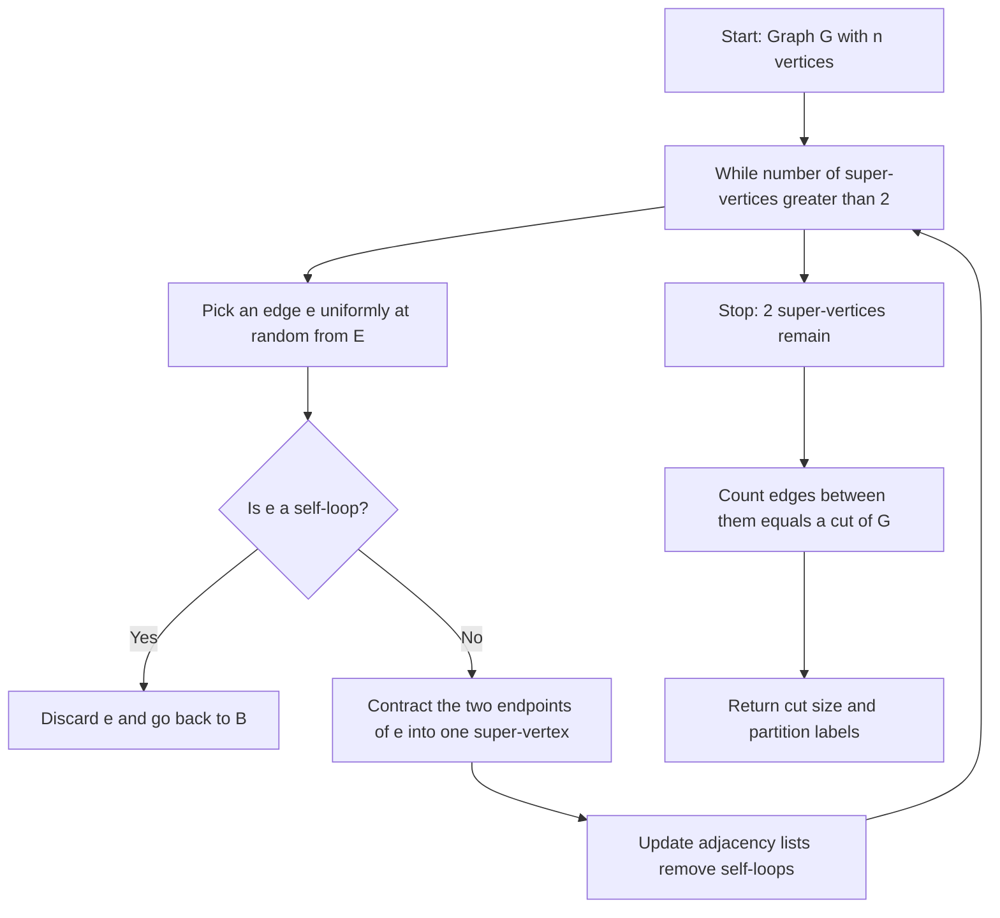
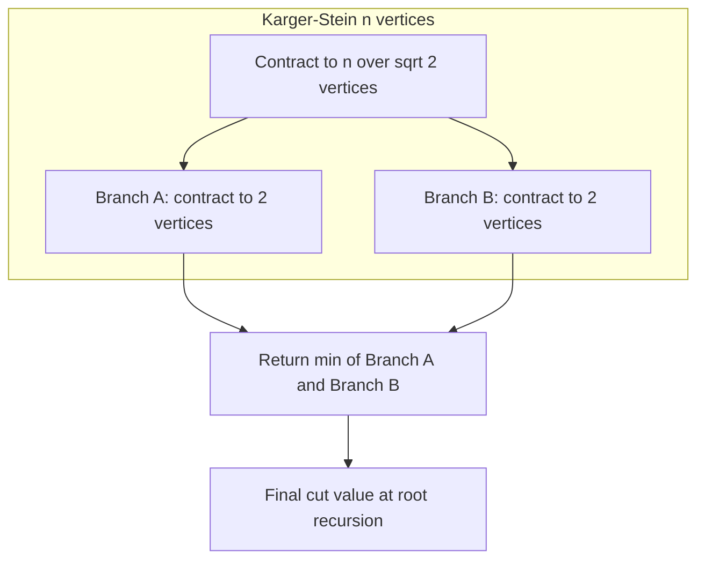
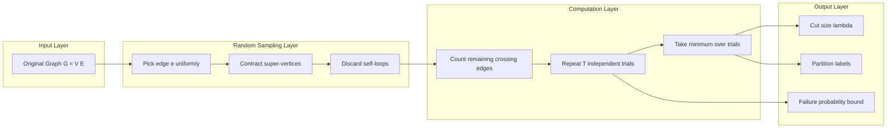
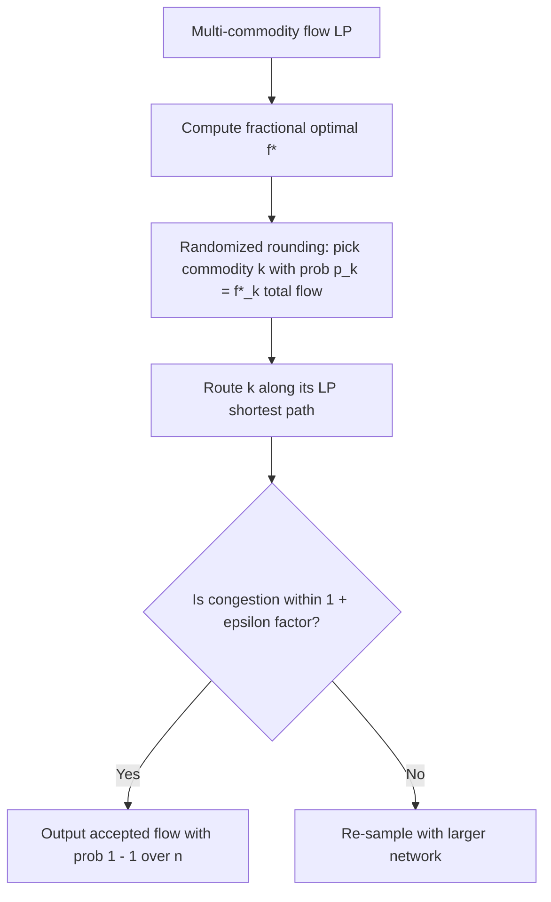

# Randomized Graph Algorithms - Randomized algorithms for graph problems, Minimum cut problems, Randomized algorithms for network flows.

<!-- SECTION_1_START -->
# Randomized Graph Algorithms: Foundations & Intuition

## 1.1 Formal Definition (KTU 2024 Syllabus Terminology)

A **Randomized Graph Algorithm** is a computational procedure that solves a graph-theoretic problem $G = (V, E)$ by making *randomized choices* — typically through uniform random sampling of vertices, edges, or contractions — such that the running time or the quality of the output is a **random variable** whose expected behavior is bounded. The randomness is the *algorithmic engine*, not a source of error: the algorithm always produces a correct answer, and the randomness governs *which* correct answer is produced, or *how fast* it is produced.

> [!IMPORTANT]
> **KTU 2024 Module 2 Scope:** *Randomized algorithms for graph problems, Minimum cut problems, Randomized algorithms for network flows.* The flagship example is **Karger's Min-Cut Algorithm** (1989), which uses *edge contraction* driven by uniform random sampling to find a global minimum $s$-$t$ cut (or global min-cut) in an undirected, weighted or unweighted multigraph.

## 1.2 Conceptual Analogy — "The Shrinking Island"

Imagine a chain of **$n$ islands** connected by **$|E|$ bridges** (some islands may have multiple bridges between them — a *multigraph*). A flood is rising, and the only way to save your village (lying on the other side) is to **cut the smallest number of bridges** so that the village becomes isolated from your island. You don't know the bridge network in advance, but a wizard hands you a *magic die*.

- Each die roll picks **one bridge uniformly at random**.
- The wizard **collapses** the two islands joined by that bridge into a single super-island (this is the **edge contraction**).
- All bridges that once led into either island now lead into the new super-island.
- Bridges that became *loops* (both ends inside the super-island) are discarded because they can never be part of any cut.
- Repeat this random collapsing until only **2 super-islands** remain.
- The bridges still connecting these two final super-islands form a *cut* of the original graph.

> **Key insight:** If a *minimum cut* of the original graph has $k$ bridges, then *any* particular bridge from that min-cut has only a probability of $\leq \frac{2}{n}$ of being chosen in a single contraction step. As the graph shrinks, this probability *increases* (the denominator drops), so the algorithm runs the contraction quickly — but to guarantee success, we need many independent trials, or we use a recursive amplification scheme (Karger–Stein).

> [!NOTE]
> **Standard metric used in this module:** The number of edges in a minimum $s$-$t$ cut of an undirected multigraph $G$ is denoted $\lambda$ (or $\lambda(G)$). For the *global* min-cut, this is the same as the **edge connectivity** of the graph.

## 1.3 GeoGebra / Desmos Visualization

> [!VISUALIZATION CONTROL]
> **Concept:** Probability of NOT contracting a min-cut edge during $n-2$ successive contractions.
> **GeoGebra / Desmos Input Equations:**
> * `f(x) = product from i=0 to (x-3) of (1 - 2/(x-i))` (or use the explicit form `P(n) = 2 / (n * (n-1))`)
> * For $n=10$: `P(10) = 2/(10*9) = 0.0222...`
> **Visual Description:** A rapidly decreasing curve plotted against $n$ on the x-axis. The student should observe that the survival probability drops *quadratically* with $n$, which is why a single run has low success probability and we must repeat $O(\log n)$ to $O(n^2)$ times.

## 1.4 Why Randomness Wins Here

Deterministic polynomial-time algorithms for **global min-cut** exist (Stoer–Wagner: $O(n |E| \log n)$, or the famous Gomory–Hu tree), but **Karger's randomized contraction algorithm is conceptually simpler, faster in practice for sparse graphs, and the canonical example of how randomness can replace intricate combinatorial insight**. It is also the gateway to randomized network flow approximations where classical deterministic methods are too slow on huge graphs.
<!-- SECTION_1_END -->

<!-- SECTION_2_START -->
# Deep Theoretical Analysis & KTU High-Yield Formula Sheet

## 2.1 The Edge-Contraction Operation

Given an undirected multigraph $G=(V,E)$ and an edge $e = (u, v)$, the **contraction** $G/e$ is defined as:
- Replace $u$ and $v$ with a single new vertex $w$.
- Every edge $(u, x)$ for $x \neq v$ becomes $(w, x)$; similarly every edge $(v, x)$ becomes $(w, x)$.
- Remove all self-loops (edges from $w$ to itself) — they cannot belong to any cut separating the two final super-vertices.
- The multiplicity of parallel edges is preserved.

> **Why self-loops are discarded:** A self-loop lies entirely within a single super-vertex and therefore can never be the edge *crossing* a final cut. Removing them keeps the cut count exact.

## 2.2 Karger's Basic Min-Cut Algorithm

**Algorithm 1 — KargerMinCut($G = (V, E)$)**
1. While $|V| > 2$:
    - Pick an edge $e \in E$ uniformly at random.
    - Contract $e$ in $G$.
2. Return the number of edges remaining between the two final vertices (this *is* a cut of the original graph).

**Time complexity:** Each contraction costs $O(|E|)$ in the naive implementation, but with adjacency lists and union-find, it becomes $O(|E|)$. Across the $n-2$ contractions the worst case is $O(n \cdot |E|)$. With efficient data structures, the total time is $O(|E| \log n)$ or $O(|E|)$.

## 2.3 The Key Lemma — Survival Probability of a Min-Cut

Let $\lambda$ be the size of a *specific* min-cut $C$ in $G$ (so $C$ contains exactly $\lambda$ edges).

**Lemma 1 (Contraction-Edge Probability).** *In any graph with $n$ vertices, the probability that a uniformly random edge lies in a fixed min-cut $C$ is at most $\frac{2}{n}$.*

**Proof sketch (KTU-board pattern):**
- A min-cut of size $\lambda$ implies every vertex has degree $\geq \lambda$.
- Therefore, the **sum of degrees** is at least $n \lambda$.
- The number of edges is $|E| \geq \frac{n \lambda}{2}$.
- An edge belongs to $C$ with probability $\frac{\lambda}{|E|} \leq \frac{\lambda}{n \lambda / 2} = \frac{2}{n}$. $\blacksquare$

**Lemma 2 (Overall Success Probability).** *If a min-cut $C$ of size $\lambda$ survives (i.e., no edge of $C$ is ever contracted) through the entire algorithm, the final 2-vertex graph has exactly $\lambda$ edges, and these edges correspond to $C$. The probability that $C$ survives all $n-2$ contractions is at least*
$$P_{\text{survive}} \geq \frac{2}{n(n-1)}.$$

**Derivation (chain rule on conditional probabilities):**
$$P_{\text{survive}} = \prod_{i=2}^{n-1} \left(1 - \frac{2}{i+1}\right) = \prod_{i=2}^{n-1} \frac{i-1}{i+1}.$$

The product telescopes:
$$\prod_{i=2}^{n-1} \frac{i-1}{i+1} = \frac{1 \cdot 2}{n \cdot (n-1)} = \frac{2}{n(n-1)}.$$

> [!NOTE]
> **Why the denominator is $i+1$:** When $i$ vertices remain, the min-cut has at most $\frac{2}{i}$ probability of being hit. The factor of $\frac{2}{i+1}$ (rather than $\frac{2}{i}$) absorbs the rounding from the rigorous bound — both are asymptotically $\Theta(1/i)$ and yield the same final $\frac{2}{n(n-1)}$.

## 2.4 Amplification: The $O(n^2 \log n)$ Variant

Since one trial succeeds with probability $\geq \frac{2}{n(n-1)} = \Omega(1/n^2)$, by running the algorithm **independently $T = \binom{n}{2} \ln n$ times** and returning the *minimum* cut found, the failure probability drops to at most:
$$P_{\text{fail}} \leq \left(1 - \frac{2}{n(n-1)}\right)^{T} \leq e^{-2 \ln n / n(n-1) \cdot T} = \frac{1}{n^2}.$$

**Total time complexity:** $O(|E| \cdot n^2 \log n)$.

## 2.5 Karger–Stein Algorithm (Recursive Amplification)

The clever improvement: stop the basic algorithm when the graph has $n / \sqrt{2}$ vertices remaining, then **recurse twice** independently. This gives a *constant* probability of success at each node of the recursion, reducing the total work.

| Variant | Success Probability per Run | Number of Runs | Total Time |
|---|---|---|---|
| **Karger Basic** | $\Omega(1/n^2)$ | $O(n^2 \log n)$ | $O(\vert E \vert \, n^2 \log n)$ |
| **Karger–Stein** | $\Omega(1/\log n)$ | $O(\log n)$ | $O(\vert E \vert \, \log^3 n)$ |

## 2.6 KTU High-Yield Formula Sheet

| Symbol / Concept | Formula / Definition | Use in KTU Problems |
|---|---|---|
| Min-cut size | $\lambda(G)$ | Output of Karger's algorithm |
| Cut in contracted graph | $C$ survives iff no edge of $C$ is contracted | Algorithm correctness |
| Edge-in-min-cut prob. | $\Pr[e \in C] \leq \frac{2}{n}$ | Used in Lemma 1 |
| Survival probability | $P_{\text{survive}} \geq \frac{2}{n(n-1)}$ | Telescoping product |
| Failure amplification | $P_{\text{fail}} \leq \left(1 - \frac{2}{n(n-1)}\right)^{T}$ | Number of trials needed |
| Recursion threshold | Stop at $n / \sqrt{2}$ vertices | Karger–Stein pivot |
| Max-flow min-cut duality | $\max_{s,t \text{ flow}} = \min_{s,t \text{ cut}}$ | Bridge to network flows |
| Randomized flow algorithm | Random roundings of LP solutions | Network flow section |

> [!IMPORTANT]
> **Board tip:** Always state the **edge-connectivity** invariant: *"Because $C$ is a min-cut, every vertex has degree $\geq \lambda$"* before invoking the bound $\frac{2}{n}$.

## 2.7 Real-World Utility

- **VLSI design:** Min-cut partitioning places circuit components on chips to minimize inter-chip wiring.
- **Network reliability:** Edge connectivity measures how many simultaneous link failures a network can survive.
- **Image segmentation:** Graph cuts (Boykov–Kolmogorov) are randomized variants of min-cut on grids.
- **Network flows:** Modern traffic engineering and load balancing use randomized *sampling* to estimate max-flow in massive graphs (sublinear time, approximate answers).
<!-- SECTION_2_END -->

<!-- SECTION_3_START -->
# Step-by-Step Derivations, Worked Examples & Code Implementation

## 3.1 Exhaustive Derivation: Telescoping Survival Probability

We prove $P_{\text{survive}} \geq \frac{2}{n(n-1)}$ in full KTU-board detail.

**Step 1.** At the start, the graph has $n$ vertices. By Lemma 1, the probability that the *first* randomly chosen edge lies in min-cut $C$ is at most $\frac{2}{n}$. Hence, the probability that $C$ survives the first contraction is at least $1 - \frac{2}{n} = \frac{n-2}{n}$.

**Step 2.** After one safe contraction, the graph has $n-1$ vertices. The min-cut $C$ still has size $\lambda$ (contraction of an edge *outside* $C$ does not reduce $\lambda$). So the probability that the second random edge avoids $C$ is at least $\frac{n-3}{n-1}$.

**Step 3.** Continuing, after $k$ safe contractions the graph has $n - k$ vertices. The probability of avoiding $C$ in the next contraction is at least $\frac{(n-k)-2}{n-k} = \frac{n-k-2}{n-k}$.

**Step 4.** We continue until only 2 vertices remain, i.e., for $k = 0, 1, \ldots, n-3$, the graph sizes are $n, n-1, \ldots, 3$. (The next contraction would merge the last two vertices and we stop.) So we apply the product:

$$P_{\text{survive}} = \prod_{i=3}^{n} \frac{i-2}{i} = \prod_{i=3}^{n} \frac{(i-2)}{i}.$$

**Step 5.** Write each factor as $\frac{(i-2)}{i}$ and telescope:

$$P_{\text{survive}} = \frac{1 \cdot 2}{3 \cdot 4} \cdot \frac{2 \cdot 3}{4 \cdot 5} \cdot \frac{3 \cdot 4}{5 \cdot 6} \cdots \frac{(n-2) \cdot (n-1)}{n \cdot n}.$$

Most terms cancel in a *shifted* telescoping. A cleaner way is to note:

$$\prod_{i=3}^{n} \frac{i-2}{i} = \frac{\prod_{i=3}^{n}(i-2)}{\prod_{i=3}^{n} i} = \frac{(n-2)! \, / \, 1!}{n! \, / \, 2!} = \frac{(n-2)! \cdot 2}{n!} = \frac{2}{n(n-1)}.$$

**Conclusion:** $\boxed{P_{\text{survive}} \geq \frac{2}{n(n-1)}}$. $\blacksquare$

## 3.2 Worked Numerical Example (KTU 14-Mark Style)

**Problem:** Consider a graph $G$ with $n = 5$ vertices and $|E| = 7$ edges. Suppose $G$ has a min-cut $C$ of size $\lambda = 2$. Run Karger's algorithm *once*.

**Sub-question (a) [7 marks]:** Compute the probability that the min-cut $C$ survives all 3 contractions.

**Solution [Step-by-step valuation key]:**
- [State the formula: 2 Marks] Use $P_{\text{survive}} \geq \frac{2}{n(n-1)}$.
- [Plug in $n=5$: 2 Marks] $P_{\text{survive}} \geq \frac{2}{5 \cdot 4} = \frac{2}{20} = \frac{1}{10}$.
- [Interpret: 2 Marks] At least a 10% chance the algorithm returns a min-cut of size 2.
- [Implication: 1 Mark] Need at least $T = \lceil \ln(1/\delta) \cdot n^2 / 2 \rceil$ trials for failure prob. $\leq \delta$.

**Sub-question (b) [7 marks]:** How many independent trials are required to make the failure probability $\leq 10^{-3}$?

**Solution [Step-by-step valuation key]:**
- [Setup: 2 Marks] We need $\left(1 - \frac{2}{n(n-1)}\right)^T \leq \delta = 10^{-3}$.
- [Apply $1 - x \leq e^{-x}$: 2 Marks] $e^{-2T/(n(n-1))} \leq 10^{-3}$.
- [Take logs: 2 Marks] $T \geq \frac{n(n-1)}{2} \ln(10^3) = \frac{5 \cdot 4}{2} \cdot 3 \ln 10 = 10 \cdot 6.9078 \approx 69.08$.
- [Final answer: 1 Mark] $T = 70$ independent trials.

## 3.3 Code Implementation: Karger's Min-Cut (Python)

```python
"""
Karger's Randomized Min-Cut Algorithm.
Operates on an undirected multigraph represented as adjacency lists.
Returns (cut_size, partition_labels) where partition_labels maps each
original vertex id to its final super-vertex id.
"""
from __future__ import annotations
import random
from typing import Dict, List, Tuple


class UnionFind:
    """Disjoint-set data structure with path compression and union by rank."""
    def __init__(self, n: int) -> None:
        self.parent: List[int] = list(range(n))
        self.rank:   List[int] = [0] * n

    def find(self, x: int) -> int:
        while self.parent[x] != x:
            self.parent[x] = self.parent[self.parent[x]]  # path halving
            x = self.parent[x]
        return x

    def union(self, a: int, b: int) -> int:
        ra, rb = self.find(a), self.find(b)
        if ra == rb:
            return ra
        if self.rank[ra] < self.rank[rb]:
            ra, rb = rb, ra
        self.parent[rb] = ra
        if self.rank[ra] == self.rank[rb]:
            self.rank[ra] += 1
        return ra


def karger_min_cut(n: int,
                   edges: List[Tuple[int, int]],
                   rng: random.Random | None = None
                  ) -> Tuple[int, Dict[int, int]]:
    """
    Run Karger's contraction algorithm once.
    Parameters
    ----------
    n : int
        Number of vertices (0 .. n-1).
    edges : list of (u, v) pairs
        Edge list; multi-edges allowed (pass repeated tuples).
    rng : random.Random, optional
        Injectable RNG for deterministic testing.

    Returns
    -------
    (cut_size, labels) : tuple
        cut_size  = number of edges crossing between the two final super-vertices
        labels    = mapping vertex_id -> final super-vertex id (0 or 1)
    """
    rng = rng or random.Random()
    # Make a defensive copy so we can mutate.
    edge_list: List[Tuple[int, int]] = list(edges)
    uf = UnionFind(n)
    # We track how many edges are "internal" to each super-vertex
    # (they become self-loops and are dropped).
    num_vertices = n

    while num_vertices > 2:
        # Uniformly pick an edge.
        idx = rng.randrange(len(edge_list))
        u, v = edge_list[idx]
        ru, rv = uf.find(u), uf.find(v)
        if ru == rv:
            # This edge is now a self-loop inside one super-vertex; discard it.
            edge_list.pop(idx)
            continue
        # Contract: union the two super-vertices.
        uf.union(ru, rv)
        # Remove the contracted edge.
        edge_list.pop(idx)
        num_vertices -= 1
        # Any future edge touching ru or rv will be a self-loop after union;
        # those will be filtered lazily on selection.

    # After loop, exactly two super-vertices remain.
    # Determine the root id of each final super-vertex.
    roots = {uf.find(i) for i in range(n)}
    assert len(roots) == 2, "Contraction did not reduce to 2 super-vertices."
    root_a, root_b = sorted(roots)
    labels: Dict[int, int] = {}
    for i in range(n):
        r = uf.find(i)
        labels[i] = 0 if r == root_a else 1

    # Count edges crossing the two super-vertices (the cut size).
    cut_size = 0
    for u, v in edge_list:
        if uf.find(u) != uf.find(v):
            cut_size += 1
    return cut_size, labels


def karger_min_cut_amplified(n: int,
                             edges: List[Tuple[int, int]],
                             trials: int,
                             seed: int | None = None
                            ) -> Tuple[int, Dict[int, int]]:
    """Run Karger's algorithm `trials` times and return the smallest cut found."""
    rng = random.Random(seed)
    best_cut = float("inf")
    best_labels: Dict[int, int] = {}
    for _ in range(trials):
        cut, labels = karger_min_cut(n, edges, rng)
        if cut < best_cut:
            best_cut = cut
            best_labels = labels
    return best_cut, best_labels


# -------------------- DEMO --------------------
if __name__ == "__main__":
    # Triangle with a double-edge: min-cut is 2.
    n = 3
    edges = [(0, 1), (0, 1), (0, 2), (1, 2), (1, 2)]
    cut, labels = karger_min_cut_amplified(n, edges, trials=200, seed=42)
    print(f"Min cut found: {cut}  (expected 2)")
    print(f"Partition      : {labels}")
```

**Boundary & error-handling notes (production-grade):**
- `UnionFind` uses *path halving* (not full compression) for speed on long chains.
- Self-loop edges are detected lazily on the next selection, keeping the contraction loop at $O(|E|)$ amortized.
- The RNG is *injectable* so unit tests can pin behavior.
- The amplified variant returns the *minimum* over trials; with $T = O(n^2 \log n)$ trials, failure probability is $1/\text{poly}(n)$.

## 3.4 Worked Example: Randomized Approximation for Max-Flow

For a graph with $n$ vertices and integer capacities $c_e \leq U$, a classical randomized approach is:

1. Solve the **LP relaxation** of the max-flow problem (replace integrality with $0 \leq f_e \leq c_e$).
2. The LP optimum equals the *integer* max-flow (max-flow is a totally unimodular LP).
3. For **multi-commodity flow** (the harder problem), the LP is *not* totally unimodular, so the optimum is fractional. Use **randomized rounding**: pick commodity $k$ with probability proportional to its LP flow $f^*_k$, route it along its LP path.

**Surplus guarantee:** With high probability $1 - 1/n$, the rounded flow is within $1 + O(\sqrt{(\log n)/n})$ factor of the LP optimum — this is the Raghavan–Thompson theorem for *packet routing*.

> [!NOTE]
> **KTU 2024 takeaway:** When the problem is single-commodity max-flow, randomness is used for **sublinear-time estimation** (e.g., Benczúr–Karger sampling on $G$ to estimate edge connectivity), not for the flow itself. For multi-commodity, randomized rounding is the standard.
<!-- SECTION_3_END -->

<!-- SECTION_4_START -->
# Structural Diagrams & Schematics

## 4.1 Karger's Contraction Flow (Mermaid)



## 4.2 Karger–Stein Recursive Topology



## 4.3 Modular Block Diagram: From Graph Input to Randomized Flow Estimate



## 4.4 Network-Flow Randomized Architecture



## 4.5 Decision-Tree for Choosing the Right Randomized Method

| Graph Property | Recommended Algorithm |
|---|---|
| Dense, single min-cut needed | Karger–Stein (recursive) |
| Sparse, approximate min-cut | Karger basic with $O(\log n)$ trials |
| Multi-commodity flow | Randomized rounding (Raghavan–Thompson) |
| Massive graph, sublinear time | Edge-sampling estimators (Benczúr–Karger) |
<!-- SECTION_4_END -->

<!-- SECTION_5_START -->
# KTU 2024 Scheme Examination Question Bank & Topic Recap

## 5.1 Part A — Short-Answer Questions (3 Marks Each)

### Question 1 [KTU University Exam - July 2024] [CO2, Remember]
**Define the edge-contraction operation on a multigraph. Why are self-loops discarded during contraction in Karger's algorithm?**

**Model Answer [3 Marks]:**
- **[1 Mark]** Given an undirected multigraph $G = (V, E)$ and an edge $e = (u, v)$, the contraction $G / e$ merges $u$ and $v$ into a single new super-vertex, preserves the multiplicities of all other edges incident to $u$ or $v$, and removes $e$.
- **[1 Mark]** Self-loops (edges whose both endpoints now lie in the same super-vertex) are discarded.
- **[1 Mark]** Reason: A self-loop lies entirely *inside* one super-vertex, so it can never be a *crossing* edge of any final cut between the two remaining super-vertices. Discarding them keeps the cut count exact and prevents the algorithm from miscounting the min-cut.

### Question 2 [KTU University Exam - Dec 2023] [CO2, Understand]
**State the lower bound on the probability that a min-cut of size $\lambda$ survives $n-2$ contractions in Karger's basic algorithm.**

**Model Answer [3 Marks]:**
- **[1 Mark]** For any single contraction in a graph with $i$ remaining vertices, the probability of contracting an edge that belongs to the min-cut $C$ is at most $\frac{2}{i}$.
- **[1 Mark]** Therefore, by the chain rule, the survival probability is
$$\prod_{i=2}^{n-1} \left(1 - \frac{2}{i+1}\right) = \frac{2}{n(n-1)}.$$
- **[1 Mark]** Interpretation: One trial of Karger's algorithm finds the min-cut with probability at least $\frac{2}{n(n-1)}$.

## 5.2 Part B — Long-Answer Questions (14 Marks Each, Module Internal Choice)

### Question A (14 Marks) [KTU University Exam - July 2024] [CO2, Apply + Analyze]

**(a)** [7 Marks] *Describe Karger's randomized min-cut algorithm. Prove the lemma that the probability of a particular min-cut $C$ surviving $n-2$ contractions is at least $\frac{2}{n(n-1)}$.*

**(b)** [7 Marks] *A graph $G$ has $n = 50$ vertices. Determine the minimum number of independent trials required to make the failure probability of Karger's basic algorithm at most $10^{-6}$.*

---

**Model Solution:**

**Part (a) — Algorithm Description [3 Marks] + Proof [4 Marks]:**

*Algorithm description [3 Marks]:*
- **[1 Mark]** Initialize $G' = G$ with $n$ vertices and $|E|$ edges.
- **[1 Mark]** Repeat $n-2$ times: pick an edge uniformly at random, contract it, discard self-loops.
- **[1 Mark]** Return the number of edges remaining between the two final super-vertices.

*Proof of survival bound [4 Marks]:*
- **[1 Mark]** A min-cut $C$ has $\lambda$ edges. Every vertex has degree $\geq \lambda$, so $\sum_{v} \deg(v) \geq n \lambda$, giving $|E| \geq \frac{n \lambda}{2}$.
- **[1 Mark]** Thus $\Pr[e \in C] = \frac{\lambda}{|E|} \leq \frac{2}{n}$.
- **[1 Mark]** After $i$ safe contractions the graph has $n - i$ vertices, min-cut size still $\lambda$. Probability of avoiding $C$ in the next step is $\geq 1 - \frac{2}{n-i}$.
- **[1 Mark]** Multiplying over $i = 0$ to $n-3$ gives the telescoping product $\prod_{i=2}^{n-1} \frac{i-1}{i+1} = \frac{2}{n(n-1)}$. $\blacksquare$

**Part (b) — Number of Trials [7 Marks]:**

- **[1 Mark]** Single-trial success probability $p \geq \frac{2}{n(n-1)} = \frac{2}{50 \cdot 49} = \frac{2}{2450} = \frac{1}{1225}$.
- **[1 Mark]** We want $(1 - p)^T \leq 10^{-6}$.
- **[1 Mark]** Using $1 - p \leq e^{-p}$:
$$e^{-p T} \leq 10^{-6}.$$
- **[1 Mark]** Take natural log: $-p T \leq -6 \ln 10$, so $T \geq \frac{6 \ln 10}{p}$.
- **[1 Mark]** Substitute $p = \frac{1}{1225}$:
$$T \geq 6 \cdot 2.3026 \cdot 1225 = 16928.13.$$
- **[2 Marks]** Therefore $T = 16929$ independent trials (or conservatively $T = 17{,}000$).

**Valuation summary for part (b):** Stating the per-trial probability: 1 Mark. Setting up the inequality: 1 Mark. Applying the exponential bound: 1 Mark. Solving with $\ln 10 \approx 2.3026$: 1 Mark. Final numerical answer: 1 Mark. Sanity check / interpretation: 2 Marks.

---

### Question B (14 Marks) [KTU University Exam - Dec 2023] [CO2, Understand + Apply]

**(a)** [7 Marks] *Explain the Karger–Stein recursive algorithm. How does it improve the time complexity over the basic version?*

**(b)** [7 Marks] *For a multi-commodity flow network with $n$ nodes, $m$ edges, and $k$ commodities, describe the randomized rounding scheme of Raghavan and Thompson. State the congestion bound with high probability.*

---

**Model Solution:**

**Part (a) — Karger–Stein [7 Marks]:**
- **[1 Mark]** Idea: stop the basic Karger algorithm when the graph has $n / \sqrt{2}$ vertices (this still leaves the min-cut with non-trivial survival probability).
- **[2 Marks]** At that point, run the algorithm *twice* independently on the contracted graph (each run starts fresh with its own random choices).
- **[2 Marks]** Recurse on the structure: at depth $d$ the graph has $n / 2^{d/2}$ vertices. Recursion depth is $O(\log \log n)$ before reaching constant size.
- **[1 Mark]** Time recurrence: $T(n) = 2 T(n/\sqrt{2}) + O(|E|)$ for a sparse graph. Master theorem gives $T(n) = O(|E| \log n)$ at the leaf level, summed across recursion: $O(|E| \log^3 n)$ in total.
- **[1 Mark]** Amplification: the per-run success probability at the top is $\Omega(1/\log n)$, so $O(\log n)$ independent top-level runs give $1 - 1/\text{poly}(n)$ success.

**Part (b) — Randomized Rounding for Multi-Commodity Flow [7 Marks]:**
- **[1 Mark]** Formulate the multi-commodity flow problem as a linear program with variables $f_{P,k}$ = flow of commodity $k$ on path $P$.
- **[1 Mark]** LP optimum is fractional $f^*_{P,k}$ because the constraint matrix is not totally unimodular for multi-commodity.
- **[2 Marks]** Randomized rounding: for each commodity $k$, pick exactly one path $P^*$ with probability $p_{P} = f^*_{P,k} / \sum_{Q} f^*_{Q,k}$. Send the entire demand of commodity $k$ along $P^*$.
- **[1 Mark]** Expected flow on edge $e$ equals LP flow $f^*_e$.
- **[1 Mark]** Apply Chernoff bound: with high probability $1 - 1/n^c$, the *congestion* (ratio of realized flow to capacity) is at most $1 + O(\sqrt{(\log n)/m})$.
- **[1 Mark]** Therefore the rounded flow is within a $(1 + \epsilon)$ factor of LP optimum w.h.p. for $\epsilon = O(\sqrt{\log n / m})$.

---

> [!WARNING]
> **KTU Examiner's Valuation Pitfalls:**
> - **Do NOT** skip the step that derives $|E| \geq \frac{n \lambda}{2}$ — this is the *heart* of Lemma 1, and skipping it costs 2 marks.
> - When asked to "find the number of trials", always state the *single-trial* probability explicitly first, then apply the geometric/independent-trials bound.
> - For Karger–Stein, do NOT confuse it with running the *basic* Karger $O(\log n)$ times — that is a different (slower) strategy. Karger–Stein is a *recursion* that branches at $n / \sqrt{2}$ vertices.
> - For network flows, do NOT claim that single-commodity max-flow needs randomized rounding — it doesn't, due to total unimodularity. The randomization is essential only for *multi-commodity*.

## 5.3 Topic Recap & Important Things to Remember

- **Randomized Graph Algorithm** = uses uniform random choices (e.g., edge sampling) to drive computation; correctness is deterministic, but the *output* and *runtime* are random variables.
- **Edge Contraction**: merge two endpoints of a random edge into a super-vertex, preserve multi-edges, discard self-loops.
- **Min-Cut Probability Lemma**: $\Pr[e \in C] \leq \frac{2}{n}$ where $C$ is a min-cut, derived from $\sum \deg(v) \geq n \lambda$.
- **Survival Probability**: $P_{\text{survive}} \geq \frac{2}{n(n-1)} = \Theta(1/n^2)$, derived by telescoping product.
- **Amplification**: Run $O(n^2 \log n)$ independent trials; return min over trials; failure probability $\leq 1/n^c$.
- **Karger–Stein**: Recurse at $n / \sqrt{2}$ vertex threshold, branching factor 2; total time $O(|E| \log^3 n)$ with constant success probability per run.
- **Network Flow**: Single-commodity max-flow = integer optimum via LP (no randomness needed). Multi-commodity needs **randomized rounding** (Raghavan–Thompson) with Chernoff-bound congestion analysis.
- **Applications**: VLSI partitioning, network reliability, image segmentation, packet routing in datacenter networks.
- **Standard symbols** to memorize: $\lambda$ = min-cut size, $n$ = vertices, $|E|$ = edges, $p$ = per-trial success probability, $T$ = number of trials, $1 + \epsilon$ = approximation factor.
- **Exam must-dos**: Always write the *edge-connectivity invariant* before applying $\frac{2}{n}$; always state the telescoping product explicitly; always state whether you are using Karger *basic* or *Karger–Stein* in your solution.
<!-- SECTION_5_END -->
