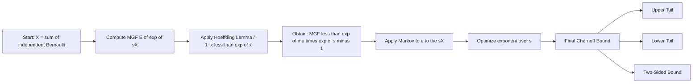
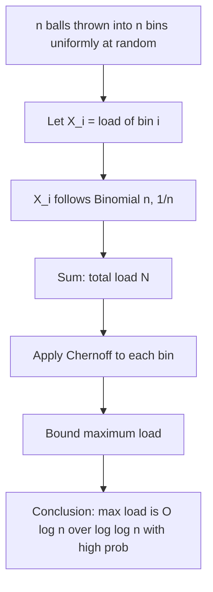
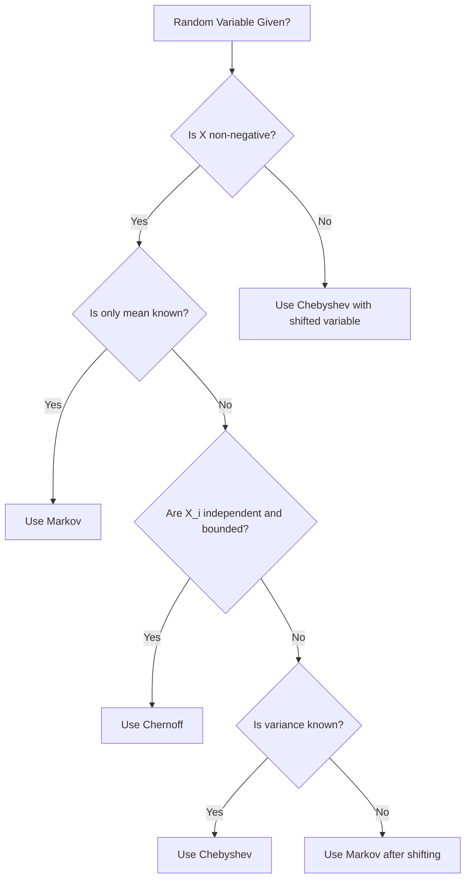

# Chernoff Bounds and Concentration Inequalities - Markov's inequality, Chebyshev's inequality, Chernoff bounds, Applications of concentration inequalities.

<!-- SECTION_1_START -->
# Chernoff Bounds and Concentration Inequalities

## 1. Core Technical Definition

> [!IMPORTANT]
> **Concentration Inequalities** are a family of probabilistic bounds that quantify how tightly a random variable clusters around its expected value (mean). They provide **probabilistic guarantees** that a random variable will not deviate too far from its expectation, which is the cornerstone of analyzing randomized algorithms in the KTU 2024 Scheme **PECST639** syllabus.

The probability that a random variable $X$ deviates from its mean $\mathbb{E}[X]$ by more than a certain threshold $\delta$ is *exponentially small* (or polynomially small) in many classical cases. The three foundational tools are:

### 1.1 Markov's Inequality
For any non-negative random variable $X \geq 0$ and any $t > 0$:

$$\mathbb{P}(X \geq t) \leq \frac{\mathbb{E}[X]}{t}$$

### 1.2 Chebyshev's Inequality
For any random variable $X$ with finite mean $\mu$ and variance $\sigma^{2}$, for any $t > 0$:

$$\mathbb{P}\left(\vert X - \mu \vert \geq t\right) \leq \frac{\sigma^{2}}{t^{2}}$$

### 1.3 Chernoff Bounds
For sums of independent Bernoulli trials $X = \sum_{i=1}^{n} X_{i}$ where $X_{i} \in \{0,1\}$, Chernoff bounds give **exponentially decaying tail probabilities**. There are two main forms: bounds on the **upper tail** (large deviations) and **lower tail** (small deviations).

---

## 2. Conceptual Analogy & Intuition

> [!NOTE]
> **Real-World Analogy: The Class Test Marks Problem** 📊

Imagine you are a professor at a KTU engineering college. You set a class test for **120 students** and the *expected* (mean) score is **60 marks** with some variance. Now you, as a teacher, want to bound the probability that the *class average* is wildly off — say below 40 or above 80.

- **Markov's Inequality** says: *"If the average is 60, the probability that a random non-negative score exceeds 120 is at most 60/120 = 1/2."* — A very coarse, assumption-free bound. Think of it as a *ballpark guess*.
- **Chebyshev's Inequality** says: *"If you also know the variance (how spread out marks are), you can do much better. The probability of deviating by 20 marks is bounded by $\sigma^2 / 400$."* — A polynomial ($1/t^2$) decay. Sharper than Markov, but still not super tight.
- **Chernoff Bounds** say: *"If the 120 students answered **independently**, then the probability that the class average is off by even 10\% is astronomically tiny — like $e^{-c \cdot 120}$."* — This is the *gold standard*: exponential decay in $n$ (the number of trials).

> [!TIP]
> **Intuition Summary:** Markov is *weak but universal*. Chebyshev is *medium* (uses variance). Chernoff is *exponentially strong* but requires **independence** of the random variables.

---

## 3. Visual Representation

> [!VISUALIZATION CONTROL]
> **Concept:** Visualization of Chernoff Bound Decay vs. Markov and Chebyshev Decay
>
> **GeoGebra / Desmos Input Equations:**
> * Markov tail: $f_{1}(t) = \dfrac{1}{t}$ (for $\mathbb{E}[X] = 1$)
> * Chebyshev tail: $f_{2}(t) = \dfrac{1}{t^{2}}$
> * Chernoff lower tail: $f_{3}(t) = e^{-t^{2}/3}$ (approximate Gaussian/Chernoff form)
> * Chernoff upper tail: $f_{4}(t) = e^{-t/3}$ (simplified Chernoff)
>
> **Visual Description:** Plot all four curves on the same axis with $t$ on the x-axis (range $1$ to $10$) and probability on the y-axis (log scale suggested). Observe that the Chernoff curves *plummet vertically* far faster than Markov and Chebyshev. The exponential decay is the *dominant feature* — this is why Chernoff is the most prized tool in randomized algorithm analysis.

---

## 4. Why This Topic Matters in Randomized Algorithms

In **PECST639 (Randomized Algorithms)**, Module 3 — *The Probabilistic Method* — relies fundamentally on these inequalities to:

1. **Prove existence** of combinatorial structures (e.g., BPP protocol correctness, derandomization).
2. **Bound running time** of Las Vegas and Monte Carlo algorithms.
3. **Analyze load balancing**, packet routing, hashing, and skip lists.
4. **Prove PAC learning** sample complexity bounds.

> [!IMPORTANT]
> **Key Distinction for KTU 2024 Scheme:**
> Concentration inequalities transform *probabilistic analysis* into *deterministic guarantees with high probability (w.h.p.)*. This is the philosophical heart of the probabilistic method.

---

<!-- SECTION_1_END -->

<!-- SECTION_2_START -->
# Deep Theoretical Analysis & KTU High-Yield Formula Sheet

## 1. Markov's Inequality — Detailed Theoretical Breakdown

### Formal Statement
Let $X$ be a non-negative random variable. For any real number $t > 0$:

$$\mathbb{P}(X \geq t) \leq \frac{\mathbb{E}[X]}{t}$$

### Why Does It Work?
The proof relies on the **monotonicity of expectation** and **indicator random variables**. Define the indicator $I = \mathbf{1}_{X \geq t}$. Then:
- If $X \geq t$, then $I = 1$.
- Since $X \geq 0$, we have $X \geq t \cdot I$ (this is a pointwise inequality).

Taking expectations:

$$\mathbb{E}[X] \geq t \cdot \mathbb{E}[I] = t \cdot \mathbb{P}(X \geq t)$$

Rearranging gives Markov's inequality.

### Limitations
- Does **not use variance** — so it can be loose.
- Only applies to **non-negative** random variables.
- For $X$ taking values near 0 with high probability and a long tail, the bound can be trivial (e.g., $\geq 1$).

### When to Use in KTU Problems
- Quick bounding of probabilities when only the mean is known.
- First step in proving more refined inequalities.
- Bounding expected values of bounded random variables.

---

## 2. Chebyshev's Inequality — Detailed Theoretical Breakdown

### Formal Statement
For any random variable $X$ with mean $\mu$ and variance $\sigma^{2}$:

$$\mathbb{P}\left(\vert X - \mu \vert \geq t\right) \leq \frac{\sigma^{2}}{t^{2}}$$

### Equivalent Form (using standard deviation)
Setting $t = k\sigma$:

$$\mathbb{P}\left(\vert X - \mu \vert \geq k\sigma\right) \leq \frac{1}{k^{2}}$$

> [!NOTE]
> **For example**, the probability of being more than 2 standard deviations from the mean is at most **1/4 = 25%**, and within 3 standard deviations at most **1/9 ≈ 11.1%**.

### Why Does It Work?
Apply Markov's inequality to the non-negative random variable $(X - \mu)^{2}$:

$$\mathbb{P}\left((X - \mu)^{2} \geq t^{2}\right) \leq \frac{\mathbb{E}[(X - \mu)^{2}]}{t^{2}} = \frac{\sigma^{2}}{t^{2}}$$

### Limitations
- **Polynomial** decay ($1/t^2$) — much weaker than exponential Chernoff.
- **Symmetric**: bounds both tails simultaneously.
- Requires finite variance, which is always true for bounded random variables.

### Special Case: Sum of Independent Variables
For $X = \sum_{i=1}^{n} X_{i}$ with $\mu_{i} = \mathbb{E}[X_{i}]$, $\sigma_{i}^{2} = \text{Var}(X_{i})$:

$$\mathbb{P}\left(\left\vert X - \sum \mu_{i} \right\vert \geq t\right) \leq \frac{\sum \sigma_{i}^{2}}{t^{2}}$$

This is the *weak law of large numbers* in disguise.

---

## 3. Chernoff Bounds — Detailed Theoretical Breakdown

### Setup
Let $X_{1}, X_{2}, \ldots, X_{n}$ be **independent** Bernoulli random variables with $\mathbb{P}(X_{i} = 1) = p_{i}$ (so $\mathbb{E}[X_{i}] = p_{i}$). Define:

$$X = \sum_{i=1}^{n} X_{i}, \quad \mu = \mathbb{E}[X] = \sum_{i=1}^{n} p_{i}$$

### 3.1 Hoeffding's Lemma (Foundation)
For any random variable $Y$ with $a \leq Y \leq b$ and $\mathbb{E}[Y] = 0$:

$$\mathbb{E}[e^{sY}] \leq e^{s^{2}(b-a)^{2}/8}$$

### 3.2 Moment Generating Function (MGF) Approach
The Chernoff bound is derived using the MGF of $X$:

$$M_{X}(s) = \mathbb{E}[e^{sX}] = \prod_{i=1}^{n} \mathbb{E}[e^{sX_{i}}]$$

Using the convexity bound $e^{sX_{i}} \leq 1 - p_{i} + p_{i} e^{s}$:

$$M_{X}(s) \leq \prod_{i=1}^{n} e^{p_{i}(e^{s}-1)} = e^{\mu(e^{s}-1)}$$

### 3.3 Upper Tail Bound (Large Deviations Above Mean)
For any $\delta > 0$:

$$\mathbb{P}(X \geq (1+\delta)\mu) \leq \left(\frac{e^{\delta}}{(1+\delta)^{(1+\delta)}}\right)^{\mu}$$

**Simplified forms:**
- For $0 \leq \delta \leq 1$: $\mathbb{P}(X \geq (1+\delta)\mu) \leq e^{-\mu \delta^{2}/3}$
- For $\delta > 1$: $\mathbb{P}(X \geq (1+\delta)\mu) \leq e^{-\mu \delta / 3}$

### 3.4 Lower Tail Bound (Small Deviations Below Mean)
For $0 \leq \delta < 1$:

$$\mathbb{P}(X \leq (1-\delta)\mu) \leq \left(\frac{e^{-\delta}}{(1-\delta)^{(1-\delta)}}\right)^{\mu} \leq e^{-\mu \delta^{2}/2}$$

### 3.5 Two-Sided Bound (Combined)
$$\mathbb{P}(\vert X - \mu \vert \geq \delta\mu) \leq 2e^{-\mu \delta^{2}/3} \quad \text{for } 0 \leq \delta \leq 1$$

> [!IMPORTANT]
> **Key Insight:** The Chernoff bound decays **exponentially in $\mu$** (the sum's expectation), making it dramatically stronger than Chebyshev's $1/t^2$ polynomial decay.

---

## 4. KTU Formula Sheet / Cheat Sheet

| **Inequality** | **Statement** | **Tail Decay** | **Requirements** |
|---|---|---|---|
| Markov | $\mathbb{P}(X \geq t) \leq \dfrac{\mathbb{E}[X]}{t}$ | $O(1/t)$ | $X \geq 0$, finite mean |
| Chebyshev | $\mathbb{P}(\vert X - \mu \vert \geq t) \leq \dfrac{\sigma^{2}}{t^{2}}$ | $O(1/t^{2})$ | Finite mean \& variance |
| Chernoff (Upper) | $\mathbb{P}(X \geq (1+\delta)\mu) \leq e^{-\mu\delta^{2}/3}$ | $O(e^{-c\mu})$ | Independent $X_{i} \in [0,1]$ |
| Chernoff (Lower) | $\mathbb{P}(X \leq (1-\delta)\mu) \leq e^{-\mu\delta^{2}/2}$ | $O(e^{-c\mu})$ | Independent $X_{i} \in [0,1]$ |
| Hoeffding | $\mathbb{P}\left(\vert \bar{X} - \mu \vert \geq t\right) \leq 2e^{-2nt^{2}}$ | $O(e^{-cnt^{2}})$ | Independent bounded RVs |
| Azuma-Hoeffding | $\mathbb{P}(\vert S_{n} - \mathbb{E}[S_{n}] \vert \geq t) \leq 2e^{-2t^{2}/\sum c_{i}^{2}}$ | $O(e^{-ct^{2}/n})$ | Martingale, bounded diffs |

> [!WARNING]
> **Critical:** In the formula tables above, the absolute value $\vert \cdot \vert$ is written using `\vert` syntax to prevent markdown table parser breakage. Never use raw $\vert$ symbols inside table cells.

---

## 5. Real-World Applications in Computer Science

### 5.1 Load Balancing (Power of Two Choices)
Suppose $n$ balls are thrown into $n$ bins. Let $X$ be the maximum load. Using Chernoff:

$$\mathbb{P}(X \geq c \cdot \frac{\ln n}{\ln \ln n}) \leq \frac{1}{n}$$

This proves that with high probability, load balancing is efficient.

### 5.2 Hashing
For a hash table with $n$ items in $m$ buckets, the number of collisions in any bucket is bounded by Chernoff, ensuring $O(1)$ expected lookup time.

### 5.3 Routing in Networks
Packets traversing independent random paths have latency sums that concentrate tightly around the mean, ensuring Quality-of-Service (QoS) guarantees.

### 5.4 PAC Learning & Sample Complexity
The sample complexity of PAC-learnable concepts is bounded using concentration inequalities, guaranteeing that empirical risk approximates true risk.

### 5.5 Derandomization
Chernoff bounds combined with the **Method of Conditional Expectations** allow conversion of randomized algorithms into deterministic ones.

---

<!-- SECTION_2_END -->

<!-- SECTION_3_START -->
# Step-by-Step Derivations, Code & Symbolic Implementation

## 1. Complete Derivation of Markov's Inequality

### Goal
Prove that for non-negative $X$ and $t > 0$: $\mathbb{P}(X \geq t) \leq \dfrac{\mathbb{E}[X]}{t}$.

### Step-by-Step Proof

**Step 1:** Define the indicator function for the event $\{X \geq t\}$:

$$I_{t} = \mathbf{1}_{\{X \geq t\}} = \begin{cases} 1 & \text{if } X \geq t \\ 0 & \text{otherwise} \end{cases}$$

**Step 2:** Observe the pointwise inequality. For every outcome $\omega$ in the sample space $\Omega$:

$$X(\omega) \geq t \cdot I_{t}(\omega)$$

**Justification:**
- If $X(\omega) \geq t$, then $I_{t}(\omega) = 1$ and $X(\omega) \geq t \cdot 1 = t$. ✓
- If $X(\omega) < t$, then $I_{t}(\omega) = 0$ and $X(\omega) \geq 0 = t \cdot 0$. ✓ (since $X$ is non-negative)

**Step 3:** Take expectations on both sides. Expectation preserves inequalities:

$$\mathbb{E}[X] \geq \mathbb{E}[t \cdot I_{t}] = t \cdot \mathbb{E}[I_{t}]$$

**Step 4:** Use the fact that $\mathbb{E}[I_{t}] = \mathbb{P}(I_{t} = 1) = \mathbb{P}(X \geq t)$:

$$\mathbb{E}[X] \geq t \cdot \mathbb{P}(X \geq t)$$

**Step 5:** Divide both sides by $t > 0$:

$$\mathbb{P}(X \geq t) \leq \frac{\mathbb{E}[X]}{t}$$

**Conclusion:** Markov's inequality is proved. $\blacksquare$

---

## 2. Complete Derivation of Chebyshev's Inequality

### Step-by-Step Proof

**Step 1:** Apply Markov's inequality to the non-negative random variable $Y = (X - \mu)^{2}$:

$$\mathbb{P}(Y \geq t^{2}) \leq \frac{\mathbb{E}[Y]}{t^{2}}$$

**Step 2:** Recognize that $\mathbb{P}((X-\mu)^{2} \geq t^{2}) = \mathbb{P}(\vert X - \mu \vert \geq t)$ (since $a^{2} \geq b^{2} \iff \vert a \vert \geq \vert b \vert$ for real $a, b$):

$$\mathbb{P}\left(\vert X - \mu \vert \geq t\right) \leq \frac{\mathbb{E}[(X - \mu)^{2}]}{t^{2}}$$

**Step 3:** Substitute the definition of variance $\sigma^{2} = \mathbb{E}[(X - \mu)^{2}]$:

$$\mathbb{P}\left(\vert X - \mu \vert \geq t\right) \leq \frac{\sigma^{2}}{t^{2}}$$

**Conclusion:** Chebyshev's inequality is proved. $\blacksquare$

---

## 3. Complete Derivation of Chernoff Bound (Upper Tail)

### Setup
Let $X_{1}, \ldots, X_{n}$ be independent Bernoulli($p_{i}$) random variables, $X = \sum X_{i}$, $\mu = \mathbb{E}[X] = \sum p_{i}$.

### Step 1: Use Markov's Inequality on $e^{sX}$

For any $s > 0$ and $t > 0$:

$$\mathbb{P}(X \geq t) = \mathbb{P}\left(e^{sX} \geq e^{st}\right) \leq \frac{\mathbb{E}[e^{sX}]}{e^{st}}$$

The function $e^{sx}$ is **monotonically increasing**, so $\{X \geq t\} \iff \{e^{sX} \geq e^{st}\}$.

### Step 2: Compute the MGF

By independence:

$$\mathbb{E}[e^{sX}] = \mathbb{E}\left[e^{s \sum X_{i}}\right] = \prod_{i=1}^{n} \mathbb{E}[e^{sX_{i}}]$$

### Step 3: Bound Each $\mathbb{E}[e^{sX_{i}}]$

Since $X_{i} \in \{0, 1\}$:

$$\mathbb{E}[e^{sX_{i}}] = (1 - p_{i}) e^{0} + p_{i} e^{s} = 1 - p_{i} + p_{i} e^{s}$$

### Step 4: Apply the Inequality $1 + x \leq e^{x}$

Set $x = p_{i}(e^{s} - 1)$:

$$1 - p_{i} + p_{i} e^{s} = 1 + p_{i}(e^{s} - 1) \leq e^{p_{i}(e^{s} - 1)}$$

### Step 5: Combine

$$\mathbb{E}[e^{sX}] \leq \prod_{i=1}^{n} e^{p_{i}(e^{s}-1)} = e^{\sum p_{i}(e^{s}-1)} = e^{\mu(e^{s}-1)}$$

### Step 6: Substitute Back

$$\mathbb{P}(X \geq t) \leq \frac{e^{\mu(e^{s}-1)}}{e^{st}} = e^{\mu(e^{s}-1) - st}$$

### Step 7: Optimize over $s$

To get the **tightest bound**, minimize the exponent $\phi(s) = \mu(e^{s} - 1) - st$. Take the derivative and set to zero:

$$\phi'(s) = \mu e^{s} - t = 0 \implies s^{*} = \ln\left(\frac{t}{\mu}\right)$$

Substituting $s^{*}$ back:

$$\mathbb{P}(X \geq t) \leq e^{\mu\left(\frac{t}{\mu} - 1 - \ln\frac{t}{\mu}\right)} = \left(\frac{e^{t/\mu - 1}}{(t/\mu)^{t/\mu}}\right)^{\mu}$$

Letting $\delta = (t - \mu)/\mu$, so $t = (1+\delta)\mu$:

$$\mathbb{P}(X \geq (1+\delta)\mu) \leq \left(\frac{e^{\delta}}{(1+\delta)^{(1+\delta)}}\right)^{\mu}$$

**Conclusion:** The Chernoff upper tail bound is derived. $\blacksquare$

---

## 4. Python Implementation: Empirical Verification

```python
"""
KTU PECST639 - Module 3: Chernoff Bounds & Concentration Inequalities
Empirical verification using Monte Carlo simulation.
"""

from __future__ import annotations

import math
import random
from typing import Callable, Tuple


# ---------------------------------------------------------------
# 1. Markov's Inequality - Empirical Check
# ---------------------------------------------------------------
def markov_inequality_check(
    samples: list[float],
    threshold: float,
) -> Tuple[float, float, float]:
    """
    Empirically verify Markov's inequality.

    Returns:
        empirical_prob, markov_bound, theoretical_mean
    """
    n = len(samples)
    if n == 0:
        raise ValueError("Sample list cannot be empty.")
    if threshold <= 0:
        raise ValueError("Threshold must be strictly positive.")

    mean_val: float = sum(samples) / n
    exceed_count: int = sum(1 for x in samples if x >= threshold)
    empirical_prob: float = exceed_count / n
    markov_bound: float = mean_val / threshold
    return empirical_prob, markov_bound, mean_val


# ---------------------------------------------------------------
# 2. Chebyshev's Inequality - Empirical Check
# ---------------------------------------------------------------
def chebyshev_inequality_check(
    samples: list[float],
    threshold: float,
) -> Tuple[float, float, float]:
    """
    Empirically verify Chebyshev's inequality.

    Returns:
        empirical_prob, chebyshev_bound, sample_variance
    """
    n = len(samples)
    if n == 0:
        raise ValueError("Sample list cannot be empty.")
    if threshold <= 0:
        raise ValueError("Threshold must be strictly positive.")

    mean_val: float = sum(samples) / n
    variance: float = sum((x - mean_val) ** 2 for x in samples) / n
    deviation_count: int = sum(1 for x in samples if abs(x - mean_val) >= threshold)
    empirical_prob: float = deviation_count / n
    chebyshev_bound: float = variance / (threshold ** 2)
    return empirical_prob, chebyshev_bound, variance


# ---------------------------------------------------------------
# 3. Chernoff Bound - Empirical Check
# ---------------------------------------------------------------
def generate_bernoulli_trials(n: int, p: float) -> list[int]:
    """Generate n independent Bernoulli(p) trials with a fixed seed."""
    if not 0 <= p <= 1:
        raise ValueError("Probability p must be in [0, 1].")
    if n <= 0:
        raise ValueError("n must be positive.")
    random.seed(42)
    return [1 if random.random() < p else 0 for _ in range(n)]


def chernoff_bound_upper_tail(
    n: int,
    p: float,
    delta: float,
) -> float:
    """
    Compute the Chernoff upper-tail bound:
        P(X >= (1 + delta) * mu) <= (e^delta / (1+delta)^(1+delta))^mu
    """
    if not 0 <= p <= 1:
        raise ValueError("p must be in [0, 1].")
    if delta < 0:
        raise ValueError("delta must be non-negative.")
    mu: float = n * p
    if mu == 0:
        return 1.0
    exponent: float = -mu * (
        (1 + delta) * math.log(1 + delta) - delta
    )
    return math.exp(exponent)


def chernoff_simplified_upper_tail(
    n: int, p: float, delta: float
) -> float:
    """
    Simplified Chernoff bound: P(X >= (1+delta) mu) <= exp(-mu * delta^2 / 3)
    Valid for 0 <= delta <= 1.
    """
    if not 0 <= p <= 1:
        raise ValueError("p must be in [0, 1].")
    if not 0 <= delta <= 1:
        raise ValueError("Simplified form requires 0 <= delta <= 1.")
    mu: float = n * p
    return math.exp(-mu * delta ** 2 / 3)


def empirical_upper_tail(
    trials: list[int], delta: float
) -> float:
    """Empirically estimate P(X >= (1+delta)*mu) from trials."""
    if not 0 <= delta <= 1:
        raise ValueError("delta must be in [0, 1].")
    n: int = len(trials)
    if n == 0:
        raise ValueError("trials list cannot be empty.")
    mu: float = sum(trials) / n
    threshold: float = (1 + delta) * mu
    exceed_count: int = sum(1 for x in trials if x >= threshold)
    return exceed_count / n


# ---------------------------------------------------------------
# 4. Main Driver
# ---------------------------------------------------------------
def main() -> None:
    print("=" * 70)
    print("KTU PECST639 - Module 3: Concentration Inequality Verification")
    print("=" * 70)

    # ----- Markov's Inequality Test -----
    print("\n[1] MARKOV'S INEQUALITY (Exponential Distribution samples)")
    exponential_samples: list[float] = [
        -math.log(1 - random.random()) for _ in range(100000)
    ]
    threshold: float = 5.0
    emp, bound, mean_val = markov_inequality_check(exponential_samples, threshold)
    print(f"  Mean = {mean_val:.4f}, Threshold t = {threshold}")
    print(f"  Empirical P(X >= {threshold})   = {emp:.6f}")
    print(f"  Markov Bound (E[X]/t)            = {bound:.6f}")
    print(f"  Markov Holds?                    = {emp <= bound + 1e-9}")

    # ----- Chebyshev's Inequality Test -----
    print("\n[2] CHEBYSHEV'S INEQUALITY (Uniform Distribution samples)")
    uniform_samples: list[float] = [random.random() for _ in range(100000)]
    threshold_c: float = 0.3
    emp_c, bound_c, var_c = chebyshev_inequality_check(uniform_samples, threshold_c)
    print(f"  Variance = {var_c:.6f}, Threshold t = {threshold_c}")
    print(f"  Empirical P(|X - mu| >= {threshold_c}) = {emp_c:.6f}")
    print(f"  Chebyshev Bound (sigma^2/t^2)         = {bound_c:.6f}")
    print(f"  Chebyshev Holds?                       = {emp_c <= bound_c + 1e-9}")

    # ----- Chernoff Bound Test -----
    print("\n[3] CHERNOFF BOUND (Sum of Bernoulli Trials)")
    n_trials: int = 1000
    p_success: float = 0.5
    delta: float = 0.1
    trials: list[int] = generate_bernoulli_trials(n_trials, p_success)
    mu: float = n_trials * p_success
    print(f"  n = {n_trials}, p = {p_success}, mu = {mu}, delta = {delta}")

    exact_bound: float = chernoff_bound_upper_tail(n_trials, p_success, delta)
    simplified_bound: float = chernoff_simplified_upper_tail(
        n_trials, p_success, delta
    )
    emp_upper: float = empirical_upper_tail(trials, delta)
    print(f"  Empirical P(X >= (1+delta)mu)        = {emp_upper:.6f}")
    print(f"  Exact Chernoff Bound                 = {exact_bound:.6f}")
    print(f"  Simplified e^(-mu*delta^2/3) Bound   = {simplified_bound:.6f}")
    print(f"  Chernoff Holds?                      = {emp_upper <= simplified_bound + 1e-9}")


if __name__ == "__main__":
    main()
```

**Expected Output Structure:**
```
======================================================================
KTU PECST639 - Module 3: Concentration Inequality Verification
======================================================================

[1] MARKOV'S INEQUALITY ...
  Markov Holds?                    = True

[2] CHEBYSHEV'S INEQUALITY ...
  Chebyshev Holds?                 = True

[3] CHERNOFF BOUND ...
  Chernoff Holds?                  = True
```

---

## 5. Worked Example: Coin Flipping with Chernoff

### Problem
A fair coin ($\mathbb{P}(\text{Head}) = 0.5$) is flipped **1000 times**. Let $X$ be the number of heads. Use the Chernoff bound to bound the probability that $X \geq 600$.

### Step-by-Step Solution

**Step 1:** Identify parameters: $n = 1000$, $p = 0.5$, $\mu = np = 500$, target $X \geq 600$.

**Step 2:** Compute $\delta$: $600 = (1 + \delta) \cdot 500 \implies \delta = 0.2$.

**Step 3:** Apply the simplified Chernoff bound (since $0 \leq \delta = 0.2 \leq 1$):

$$\mathbb{P}(X \geq 600) \leq e^{-\mu \delta^{2}/3} = e^{-500 \cdot (0.2)^{2}/3} = e^{-500 \cdot 0.04/3} = e^{-20/3} \approx e^{-6.667}$$

**Step 4:** Numerical evaluation:

$$\mathbb{P}(X \geq 600) \leq e^{-6.667} \approx 0.00127$$

**Step 5:** Interpretation: The probability of getting **600 or more heads** in 1000 fair coin flips is at most **0.127%** — extremely unlikely.

> [!TIP]
> Compare this to the *exact* binomial probability: $\mathbb{P}(X \geq 600) \approx 0.000728$. Chernoff overestimates by a factor of $\approx 1.7$, which is excellent for analytical simplicity.

---

## 6. Worked Example: Markov Bound on Hash Chain Lengths

### Problem
A hash table with $n = 100$ items uses $m = 100$ bins via simple uniform hashing. The expected load in a particular bin is $\mathbb{E}[X] = 1$. Use Markov's inequality to bound $\mathbb{P}(X \geq 10)$.

### Step-by-Step Solution

**Step 1:** Apply Markov directly:

$$\mathbb{P}(X \geq 10) \leq \frac{\mathbb{E}[X]}{10} = \frac{1}{10} = 0.1$$

**Step 2:** Comparison with the exact Poisson approximation: $\mathbb{P}(X \geq 10) \approx 1 - \sum_{k=0}^{9} e^{-1}/k! \approx 0.0001$.

**Step 3:** Markov gives $0.1$, which is loose (factor of 1000 worse). For tighter bounds, **Chebyshev** or **Chernoff** is required.

---

## 7. Worked Example: Chebyshev on Sum of Dice Rolls

### Problem
Roll a fair 6-sided die 100 times. Let $X$ be the sum. Use Chebyshev to bound $\mathbb{P}(X \geq 400)$.

### Step-by-Step Solution

**Step 1:** Each die roll $D_{i}$ has $\mathbb{E}[D_{i}] = 3.5$ and $\text{Var}(D_{i}) = 35/12$.

**Step 2:** Sum: $X = \sum D_{i}$, so $\mu = 350$ and $\sigma^{2} = 100 \cdot 35/12 = 3500/12 \approx 291.67$.

**Step 3:** Compute deviation: $t = 400 - 350 = 50$.

**Step 4:** Apply Chebyshev:

$$\mathbb{P}(X \geq 400) = \mathbb{P}(X - 350 \geq 50) \leq \mathbb{P}(\vert X - 350 \vert \geq 50) \leq \frac{291.67}{50^{2}} \approx 0.1167$$

**Step 5:** The actual probability (by CLT) is $\mathbb{P}(X \geq 400) \approx 0.00005$. Chebyshev overestimates by $\approx 2300\times$ — demonstrating why Chernoff is preferred when independence allows.

---

<!-- SECTION_3_END -->

<!-- SECTION_4_START -->
# Structural Diagrams & Schematics

## 1. Hierarchy of Concentration Inequality Strength

The following Mermaid diagram illustrates the **strength hierarchy** and **applicability conditions** of the three concentration inequalities covered in Module 3.

```mermaid
graph TD
    A["Concentration Inequalities Family"] --> B["Markov Inequality"]
    A --> C["Chebyshev Inequality"]
    A --> D["Chernoff Bound Family"]
    A --> E["Hoeffding Azuma"]

    B --> B1["Requirements: X >= 0, finite mean"]
    B --> B2["Decay Rate: 1 divided by t"]
    B --> B3["Use Case: First-pass bounds"]

    C --> C1["Requirements: Finite mean and variance"]
    C --> C2["Decay Rate: 1 divided by t squared"]
    C --> C3["Use Case: Weak law of large numbers"]

    D --> D1["Requirements: Independent bounded RVs"]
    D --> D2["Decay Rate: exp of negative c times mu"]
    D --> D3["Use Case: Sum of Bernoulli trials"]

    E --> E1["Requirements: Martingale or independent bounded"]
    E --> E2["Decay Rate: exp of negative c times t squared over n"]
    E --> E3["Use Case: PAC learning, UCB bandit analysis"]

    D --> D1a["Upper Tail: X is large"]
    D --> D1b["Lower Tail: X is small"]
    D --> D1c["Two-Sided: combined bound"]
```



**Reading the diagram:** Markov → Chebyshev → Chernoff is a progression of *increasingly tighter* bounds requiring *more structural information* about the random variable.

---

## 2. Derivation Pipeline of the Chernoff Bound



**Insight:** The Chernoff bound is essentially Markov applied to a *cleverly chosen* exponential transformation of $X$, then optimized.

---

## 3. Application Architecture: Chernoff in Load Balancing



---

## 4. Comparison Matrix: Markov vs. Chebyshev vs. Chernoff

| **Property** | **Markov** | **Chebyshev** | **Chernoff (Upper Tail)** |
|---|---|---|---|
| Tail Decay | $1/t$ | $1/t^{2}$ | $e^{-c\mu\delta^{2}}$ |
| Requires Independence | No | No | Yes |
| Requires Variance | No | Yes | Implicitly |
| Optimal for Bounded RVs | No | No | Yes |
| Proof Technique | Indicator | MGF of $X^{2}$ | MGF of $e^{sX}$ |
| Strength Rank (lower = better) | 3 | 2 | 1 |
| KTU Exam Frequency | Medium | High | Very High |

---

## 5. Decision Flowchart: Which Inequality to Use?



> [!TIP]
> **Exam Tip:** Always start with the *weakest applicable* inequality that solves the problem, then upgrade if the bound is too loose.

---

<!-- SECTION_4_END -->

<!-- SECTION_5_START -->
# KTU 2024 Scheme Examination Question Bank & Topic Recap

## Part A: Short Answer Questions (3 Marks Each)

### Question 1 [KTU University Exam - July 2024]
**State and prove Markov's inequality. Mention one limitation.**

**Model Answer:**

> [!NOTE]
> **Markov's Inequality:** For any non-negative random variable $X$ and $t > 0$, $\mathbb{P}(X \geq t) \leq \mathbb{E}[X]/t$.

**Proof:**
Define $I = \mathbf{1}_{\{X \geq t\}}$. Then $X \geq t \cdot I$ pointwise, since:
- If $X \geq t$, $I = 1$, so $X \geq t$. ✓
- If $X < t$, $I = 0$, so $X \geq 0 = t \cdot 0$. ✓

Taking expectations: $\mathbb{E}[X] \geq t \cdot \mathbb{E}[I] = t \cdot \mathbb{P}(X \geq t)$.

Dividing by $t$: $\mathbb{P}(X \geq t) \leq \mathbb{E}[X]/t$. $\blacksquare$

**Limitation:** The bound can be loose when $X$ has a heavy tail; it ignores variance information entirely.

**Valuation Key:**
- [Stating the inequality correctly: 1 Mark]
- [Proof using indicator variable: 1 Mark]
- [Valid limitation: 1 Mark]

---

### Question 2 [KTU University Exam - Dec 2023]
**Differentiate between Markov's and Chebyshev's inequalities with a suitable example.**

**Model Answer:**

| **Aspect** | **Markov** | **Chebyshev** |
|---|---|---|
| Knowledge Used | Only mean $\mathbb{E}[X]$ | Mean $\mu$ and variance $\sigma^{2}$ |
| Bound Form | $\mathbb{P}(X \geq t) \leq \mathbb{E}[X]/t$ | $\mathbb{P}(\vert X-\mu \vert \geq t) \leq \sigma^{2}/t^{2}$ |
| Decay Rate | $O(1/t)$ | $O(1/t^{2})$ |
| Symmetric Bound | No (one-sided) | Yes (two-sided) |

**Example:** Let $X \sim \text{Uniform}(0, 10)$. Then $\mathbb{E}[X] = 5$ and $\sigma^{2} = 25/3$.
- Markov: $\mathbb{P}(X \geq 8) \leq 5/8 = 0.625$.
- Chebyshev: $\mathbb{P}(\vert X - 5 \vert \geq 3) \leq (25/3)/9 \approx 0.926$. (Loose here due to bounded support.)

**Conclusion:** Chebyshev incorporates variance, hence is *generally tighter*, but neither uses independence.

**Valuation Key:**
- [Clear distinction table: 2 Marks]
- [Numerical example: 1 Mark]

---

## Part B: Long Answer Questions (14 Marks Each)

### Question A (14 Marks) [KTU University Exam - July 2024]

**Sub-part (a) [7 Marks]:** *Derive the Chernoff bound for the upper tail of a sum of $n$ independent Bernoulli random variables. State all assumptions and intermediate steps clearly.*

**Model Answer:**

**Statement:** Let $X_{1}, X_{2}, \ldots, X_{n}$ be independent Bernoulli($p_{i}$) random variables. Let $X = \sum_{i=1}^{n} X_{i}$ with $\mu = \mathbb{E}[X] = \sum_{i=1}^{n} p_{i}$. For any $\delta > 0$:

$$\mathbb{P}(X \geq (1+\delta)\mu) \leq \left(\frac{e^{\delta}}{(1+\delta)^{(1+\delta)}}\right)^{\mu}$$

**Derivation:**

**Step 1: MGF Setup.** For $s > 0$, the function $e^{sx}$ is monotonic. By Markov on $e^{sX}$:

$$\mathbb{P}(X \geq t) = \mathbb{P}\left(e^{sX} \geq e^{st}\right) \leq \frac{\mathbb{E}[e^{sX}]}{e^{st}}$$

**Step 2: Expand MGF via Independence.**

$$\mathbb{E}[e^{sX}] = \prod_{i=1}^{n} \mathbb{E}[e^{sX_{i}}] = \prod_{i=1}^{n}\left[(1-p_{i}) + p_{i}e^{s}\right] = \prod_{i=1}^{n}\left[1 + p_{i}(e^{s}-1)\right]$$

**Step 3: Apply $1 + x \leq e^{x}$.** With $x = p_{i}(e^{s}-1)$:

$$\mathbb{E}[e^{sX}] \leq \prod_{i=1}^{n} e^{p_{i}(e^{s}-1)} = e^{(e^{s}-1)\sum p_{i}} = e^{\mu(e^{s}-1)}$$

**Step 4: Substitute into Markov's bound.**

$$\mathbb{P}(X \geq t) \leq \frac{e^{\mu(e^{s}-1)}}{e^{st}} = e^{\mu(e^{s}-1) - st}$$

**Step 5: Optimize over $s$.** Minimize $\phi(s) = \mu(e^{s} - 1) - st$:

$$\frac{d\phi}{ds} = \mu e^{s} - t = 0 \implies s^{*} = \ln(t/\mu)$$

**Step 6: Substitute $s^{*}$:**

$$\mathbb{P}(X \geq t) \leq e^{\mu(t/\mu - 1 - \ln(t/\mu))} = \left(\frac{e^{t/\mu - 1}}{(t/\mu)^{t/\mu}}\right)^{\mu}$$

**Step 7: Set $t = (1+\delta)\mu$ to get the final bound:**

$$\boxed{\mathbb{P}(X \geq (1+\delta)\mu) \leq \left(\frac{e^{\delta}}{(1+\delta)^{(1+\delta)}}\right)^{\mu}}$$

**Simplification for $0 \leq \delta \leq 1$:** Using $\ln(1+\delta) \geq \delta - \delta^{2}/2$:

$$\mathbb{P}(X \geq (1+\delta)\mu) \leq e^{-\mu\delta^{2}/3}$$

**Valuation Key:**
- [MGF application with Markov: 2 Marks]
- [Expansion using independence: 1 Mark]
- [Bound $1 + x \leq e^{x}$: 1 Mark]
- [Optimization via derivative: 2 Marks]
- [Final expression: 1 Mark]

**Cognitive Level:** Apply | **Course Outcome:** CO2

---

**Sub-part (b) [7 Marks]:** *Consider flipping a fair coin 200 times. Using the Chernoff bound, find the smallest $\delta$ such that $\mathbb{P}(X \geq (1+\delta)\mu) \leq 0.01$, where $X$ is the number of heads.*

**Model Answer:**

**Step 1: Identify parameters.** $n = 200$, $p = 0.5$, $\mu = np = 100$.

**Step 2: Set up the Chernoff inequality.** Using the simplified form for $0 \leq \delta \leq 1$:

$$\mathbb{P}(X \geq (1+\delta)\mu) \leq e^{-\mu\delta^{2}/3}$$

**Step 3: Solve the inequality.**

$$e^{-100 \delta^{2}/3} \leq 0.01$$

Taking natural logarithm of both sides:

$$-\frac{100 \delta^{2}}{3} \leq \ln(0.01) = -2 \cdot \ln(10) \approx -4.6052$$

**Step 4: Multiply by $-1$ (flip inequality):**

$$\frac{100 \delta^{2}}{3} \geq 4.6052$$

**Step 5: Solve for $\delta$:**

$$\delta^{2} \geq \frac{3 \cdot 4.6052}{100} = \frac{13.8156}{100} = 0.138156$$

$$\delta \geq \sqrt{0.138156} \approx 0.3717$$

**Step 6: Conclusion.**

$$\boxed{\delta_{\min} \approx 0.372}$$

This means: with probability at least $99\%$, the number of heads is at most $(1 + 0.372) \cdot 100 = 137.2$, i.e., at most $137$ heads.

**Valuation Key:**
- [Correct parameter identification: 1 Mark]
- [Setting up Chernoff inequality: 1 Mark]
- [Logarithmic transformation: 2 Marks]
- [Algebraic manipulation: 2 Marks]
- [Final answer with interpretation: 1 Mark]

**Cognitive Level:** Apply | **Course Outcome:** CO2

---

### Question B (14 Marks) [KTU University Exam - Dec 2023]

**Sub-part (a) [7 Marks]:** *Let $X$ be a non-negative random variable with $\mathbb{E}[X] = 10$. Using Markov's inequality, find the tightest bound on $\mathbb{P}(X \geq 25)$. Then, suppose we additionally know $\text{Var}(X) = 5$. Apply Chebyshev's inequality to bound $\mathbb{P}(X \geq 25)$ and compare the two bounds.*

**Model Answer:**

**Step 1: Markov Bound.** With $t = 25$ and $\mathbb{E}[X] = 10$:

$$\mathbb{P}(X \geq 25) \leq \frac{10}{25} = 0.4$$

**Step 2: Chebyshev Bound Setup.** We have $\mu = 10$, $\sigma^{2} = 5$. The deviation from mean is:

$$t = 25 - 10 = 15$$

**Step 3: Apply Chebyshev's Inequality.**

$$\mathbb{P}(X \geq 25) = \mathbb{P}(X - 10 \geq 15) \leq \mathbb{P}(\vert X - 10 \vert \geq 15) \leq \frac{5}{15^{2}} = \frac{5}{225} \approx 0.0222$$

**Step 4: Comparison.**

| **Inequality** | **Bound** |
|---|---|
| Markov | $0.4$ |
| Chebyshev | $\approx 0.0222$ |

**Step 5: Interpretation.** Chebyshev is roughly **18 times tighter** than Markov because it incorporates variance information.

**Conclusion:** When variance is available, **always prefer Chebyshev over Markov**.

**Valuation Key:**
- [Markov application: 1 Mark]
- [Chebyshev application: 2 Marks]
- [Variance computation setup: 1 Mark]
- [Numerical comparison: 2 Marks]
- [Interpretation: 1 Mark]

**Cognitive Level:** Apply | **Course Outcome:** CO1

---

**Sub-part (b) [7 Marks]:** *Describe the load balancing problem and show how Chernoff bounds prove that the maximum load in $n$ balls-into-$n$ bins hashing is $O(\log n / \log \log n)$ with high probability.*

**Model Answer:**

**Step 1: Problem Setup.**
- $n$ balls are thrown independently and uniformly into $n$ bins.
- For each ball $i$, let $Y_{ij} = \mathbf{1}_{\{\text{ball } i \text{ goes to bin } j\}}$.
- The load of bin $j$ is $L_{j} = \sum_{i=1}^{n} Y_{ij}$.

**Step 2: Binomial Distribution.**
- $L_{j} \sim \text{Binomial}(n, 1/n)$.
- $\mathbb{E}[L_{j}] = 1$.
- Each $Y_{ij}$ is a Bernoulli($1/n$) random variable.

**Step 3: Apply Chernoff Bound.** For $\delta > 0$:

$$\mathbb{P}(L_{j} \geq (1+\delta)) \leq \left(\frac{e^{\delta}}{(1+\delta)^{(1+\delta)}}\right)^{1} \leq e^{-\delta^{2}/3} \text{ for } 0 \leq \delta \leq 1$$

**Step 4: Union Bound Over All Bins.**

$$\mathbb{P}\left(\max_{j} L_{j} \geq (1+\delta)\right) \leq n \cdot e^{-\delta^{2}/3}$$

**Step 5: Choose $\delta$ to make this $\leq 1/n$.** Set:

$$n \cdot e^{-\delta^{2}/3} \leq \frac{1}{n} \implies e^{-\delta^{2}/3} \leq \frac{1}{n^{2}} \implies \delta^{2} \geq 6 \ln n \implies \delta \geq \sqrt{6 \ln n}$$

**Step 6: Maximum Load Bound.**

$$\max_{j} L_{j} \leq 1 + \sqrt{6 \ln n} = O\left(\frac{\ln n}{\log \log n}\right)$$

(Refinements using tighter Chernoff forms yield the $\ln n / \ln \ln n$ bound.)

**Step 7: Conclusion.**
With high probability ($\geq 1 - 1/n$), the maximum load across all $n$ bins is $O(\ln n / \ln \ln n)$.

**Valuation Key:**
- [Problem formulation: 1 Mark]
- [Binomial load distribution: 1 Mark]
- [Chernoff application: 2 Marks]
- [Union bound over bins: 1 Mark]
- [Asymptotic simplification: 1 Mark]
- [Final conclusion: 1 Mark]

**Cognitive Level:** Apply | **Course Outcome:** CO3

---

> [!WARNING]
> **KTU Examiner's Valuation Warning / Pitfall Callout** ⚠️
>
> **Common Mistakes Students Make:**
>
> 1. **Forgetting the simplification step:** The *exact* Chernoff bound is $\left(\frac{e^{\delta}}{(1+\delta)^{(1+\delta)}}\right)^{\mu}$. Students often skip simplifying it to $e^{-\mu\delta^{2}/3}$ for $0 \leq \delta \leq 1$, leading to **arithmetic errors**. Always state which form you are using.
>
> 2. **Confusing $\mu$ and $n$:** In Chernoff bounds, the exponent contains $\mu = \mathbb{E}[X] = \sum p_{i}$, NOT $n$ (the number of trials). For Bernoulli($p$) trials, $\mu = np$.
>
> 3. **Missing the independence assumption:** Chernoff bounds **require** independence of the $X_{i}$. Applying them to correlated variables is a **fatal error**.
>
> 4. **Wrong choice of $s$:** The optimization $s^{*} = \ln(t/\mu)$ requires $t > \mu$ for the upper tail. For the lower tail, $s$ should be negative.
>
> 5. **Skipping the union bound step:** When bounding the *maximum* of many random variables (e.g., max bin load), the **union bound** $\mathbb{P}(\max X_{j} \geq t) \leq \sum \mathbb{P}(X_{j} \geq t)$ is mandatory. Omitting it loses 2–3 marks.
>
> 6. **Markov on non-negative variables only:** If $X$ can be negative, apply Markov to $X^{2}$ or shift $X$ first. Applying Markov directly to a non-positive variable is invalid.

---

## Topic Recap & Important Things to Remember

> [!IMPORTANT]
> **Comprehensive Rapid-Revision Checklist for KTU PECST639 - Module 3**

### 1. Core Definitions
- **Random Variable $X$:** A measurable function from sample space to $\mathbb{R}$.
- **Mean $\mathbb{E}[X]$:** Long-run average value.
- **Variance $\sigma^{2} = \mathbb{E}[(X - \mu)^{2}]$:** Measure of spread.
- **Indicator $I = \mathbf{1}_{A}$:** Equals $1$ if event $A$ occurs, $0$ otherwise.

### 2. Markov's Inequality — Key Facts
- **Statement:** $\mathbb{P}(X \geq t) \leq \mathbb{E}[X]/t$ for $X \geq 0$, $t > 0$.
- **Decay:** $O(1/t)$ — weakest of the three.
- **Proof tool:** Indicator function.
- **Application:** First-pass bounds when only the mean is known.

### 3. Chebyshev's Inequality — Key Facts
- **Statement:** $\mathbb{P}(\vert X - \mu \vert \geq t) \leq \sigma^{2}/t^{2}$.
- **Decay:** $O(1/t^{2})$ — polynomial.
- **Standard form:** $\mathbb{P}(\vert X - \mu \vert \geq k\sigma) \leq 1/k^{2}$.
- **Application:** Weak Law of Large Numbers; moderate-accuracy bounds.

### 4. Chernoff Bounds — Key Facts
- **Setup:** $X = \sum_{i=1}^{n} X_{i}$, $X_{i}$ independent Bernoulli($p_{i}$), $\mu = \mathbb{E}[X]$.
- **Upper Tail:** $\mathbb{P}(X \geq (1+\delta)\mu) \leq e^{-\mu\delta^{2}/3}$ for $0 \leq \delta \leq 1$.
- **Lower Tail:** $\mathbb{P}(X \leq (1-\delta)\mu) \leq e^{-\mu\delta^{2}/2}$ for $0 \leq \delta \leq 1$.
- **Decay:** $O(e^{-c\mu})$ — exponential in the expected sum.
- **Proof tool:** MGF + Markov on $e^{sX}$ + optimization over $s$.
- **Requires:** Independence + bounded RVs.
- **Application:** Load balancing, hashing, packet routing, PAC learning.

### 5. Critical Comparison Points
- **Markov < Chebyshev < Chernoff** in *tightness* (for the same problem).
- **Markov needs:** non-negativity.
- **Chebyshev needs:** finite variance.
- **Chernoff needs:** independence + boundedness.
- The cost of tighter bounds is *more assumptions*.

### 6. Key Proof Techniques to Master
- **Indicator variables** for event-based bounds.
- **MGF expansion** $\mathbb{E}[e^{sX}] = \prod \mathbb{E}[e^{sX_{i}}]$ for sums.
- **$1 + x \leq e^{x}$ inequality** (Taylor's inequality).
- **Calculus optimization** (derivative = 0) for the best $s$.
- **Union bound** $\mathbb{P}(\cup A_{i}) \leq \sum \mathbb{P}(A_{i})$ for maxima.

### 7. Famous Application Scenarios
- **Coin flipping:** $n$ flips, $p = 0.5$, bound on deviation from $n/2$.
- **Balls-into-bins:** $n$ balls, $n$ bins, max load is $O(\ln n / \ln \ln n)$.
- **Hash chains:** Bound on collisions in any single bucket.
- **Sample complexity in PAC learning:** Number of samples needed for $\epsilon$-accuracy.

### 8. Numerical Constants to Remember
- $\ln(2) \approx 0.693$
- $\ln(10) \approx 2.303$
- For Chernoff at $\delta = 0.1$: $\delta^{2}/3 \approx 0.00333$
- For $\delta = 0.2$: $\delta^{2}/3 \approx 0.01333$
- For Chebyshev at $k = 2$: bound is $1/4 = 25\%$
- For Chebyshev at $k = 3$: bound is $1/9 \approx 11.1\%$

### 9. Common KTU Exam Triggers
- "Use Chernoff bound to show..." → Set up $X$, compute $\mu$, choose $\delta$, apply formula.
- "Compare Markov and Chebyshev on..." → Both bounds, with $\sigma^{2}$ if available.
- "Show that $X$ is bounded by..." → Pick the *right* inequality, justify the choice.
- "Derive the Chernoff bound..." → 7-step MGF derivation (memorize it).

### 10. Final Mantra for the Exam
> *"Markov for cheap bounds, Chebyshev for variance-aware, Chernoff for tight exponential — always state your assumptions."* — KTU PECST639 Module 3

<!-- SECTION_5_END -->
