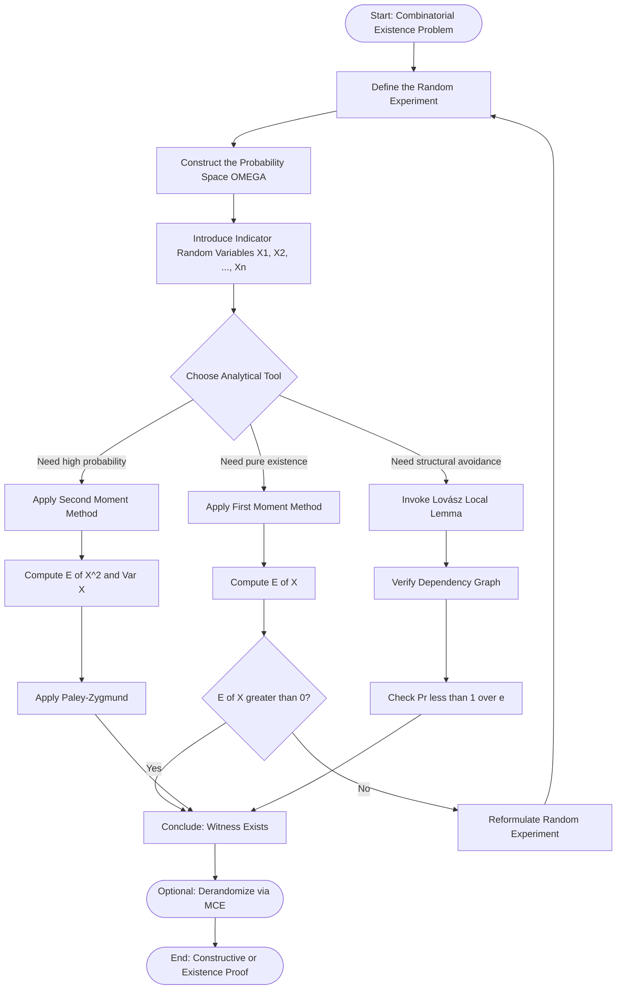
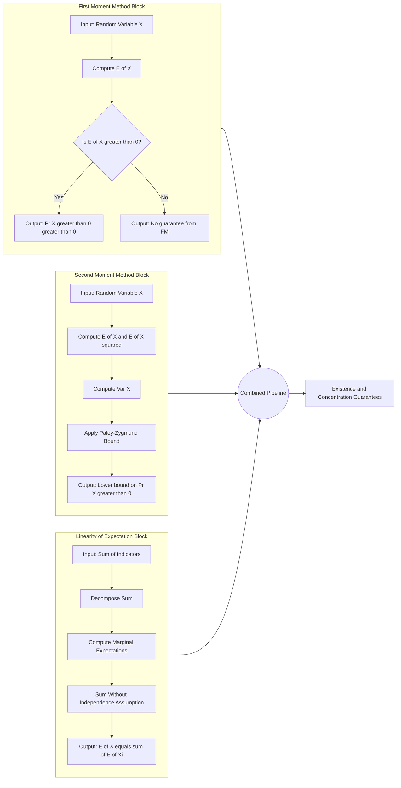
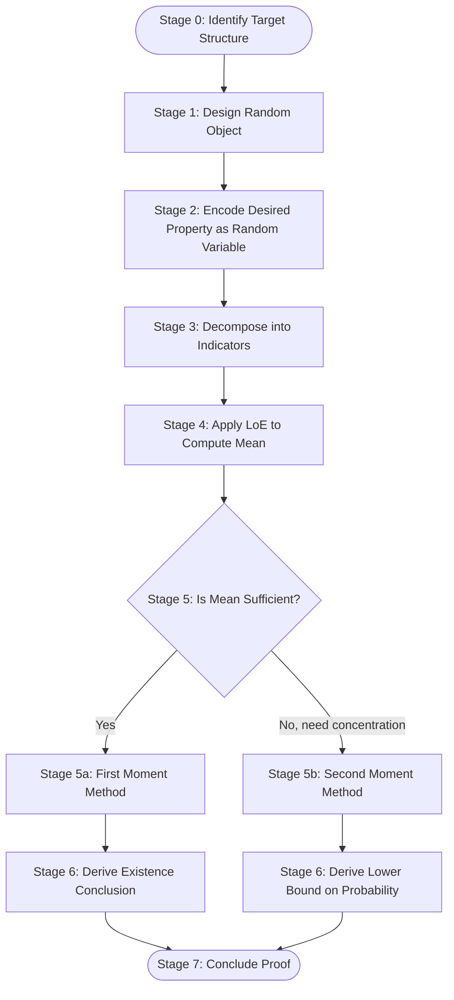

# The Probabilistic Method - Basics of the probabilistic method, Linearity of expectation, First and second-moment methods.

<!-- SECTION_1_START -->

# The Probabilistic Method — Foundational Framework

## 1.1 Formal Academic Definition (KTU 2024 Syllabus Terminology)

> [!NOTE]
> **Definition (Probabilistic Method)**
> The *probabilistic method* is a non-constructive combinatorial proof technique pioneered by **Paul Erdős** (1947). It establishes the **existence of a mathematical object with a desired property** by demonstrating that a randomly chosen object has a **strictly positive probability** of possessing that property. Formally, if a random variable $X$ defined on a finite probability space satisfies $\Pr[X > 0] > 0$, then there exists at least one outcome $\omega$ in the sample space $\Omega$ for which $X(\omega) > 0$.

The method is **non-constructive** in its purest form: it certifies existence without ever producing the explicit object. Modern variants combine the method with algorithmic derandomization (via the **Method of Conditional Expectations**) to actually construct the witness.

### 1.2 Intuition: A Real-World Analogy

> [!IMPORTANT]
> **Conceptual Analogy — "The Birthday Party Gift Problem"**
> Imagine a party with $n$ guests, and you want to know if at least two guests share a birthday. You don't want to actually check every pair. Instead, you compute the **expected number of birthday collisions** using **linearity of expectation**. If the expected value is greater than zero, you *guarantee* (with mathematical certainty) that at least one collision exists, even without finding it. The probabilistic method operates on the same philosophy: count expectations, then deduce existence.

The **three pillars** of the method are:
1. **Linearity of Expectation** — reduces complex dependencies to simple sums.
2. **First Moment Method** — uses $\mathbb{E}[X] \geq 1 \Rightarrow \Pr[X \geq 1] > 0$.
3. **Second Moment Method** — uses $\Pr[X = 0] \leq \dfrac{\mathrm{Var}(X)}{\mathbb{E}[X]^2}$ to bound the probability of *non-existence*.

> [!VISUALIZATION CONTROL]
> **Concept:** Threshold Behavior of $\Pr[X > 0]$ vs. $\mathbb{E}[X]$
> **GeoGebra / Desmos Input Equations:**
> * `f(x) = 1 - exp(-x)` (lower bound curve for Poisson approximation)
> * `g(x) = x / (1 + x)` (Markov-style lower bound)
> **Visual Description:** Plot $f(x)$ and $g(x)$ for $x \in [0, 5]$ on the $x$-axis. Observe how the probability $\Pr[X > 0]$ rises monotonically with $\mathbb{E}[X]$. The horizontal line $y = 0.5$ is crossed near $x \approx 0.69$ for $f(x)$, illustrating the **birthday-paradox threshold**.

---

## 1.3 Indicator Random Variables — The Atoms of the Method

The probabilistic method is built atop **indicator (Bernoulli) random variables**, which encode *event membership* as a $\{0, 1\}$-valued measurement. The defining identity is

$$
\mathbb{E}[X_i] = \Pr[X_i = 1] = p_i
$$

where $p_i$ is the probability that event $A_i$ occurs. Summing these indicators transforms global existence questions into elementary arithmetic.

> [!NOTE]
> **Key Insight (Erdős, 1947):** A single clever random experiment, paired with an expected-value computation, can replace thousands of case analyses. The **expected value is the universal hammer** of the combinatorialist.

<!-- SECTION_1_END -->

<!-- SECTION_2_START -->

# Deep Theoretical Analysis & KTU High-Yield Formula Sheet

## 2.1 Linearity of Expectation — The Universal Decomposition Law

> [!IMPORTANT]
> **Linearity of Expectation (LoE)**
> For *any* finite collection of random variables $X_1, X_2, \dots, X_n$ defined on a common probability space — **regardless of independence** —
> $$\mathbb{E}\!\left[ \sum_{i=1}^{n} X_i \right] = \sum_{i=1}^{n} \mathbb{E}[X_i]$$
> This identity is the **single most deployed tool** in randomized algorithms and the probabilistic method.

### Why Linearity Works (Conceptual Steps)

1. **Decompose** a complicated random variable $Y$ into a sum of simpler indicators $Y = \sum_{i=1}^{n} X_i$.
2. **Compute** each $\mathbb{E}[X_i] = \Pr[X_i = 1]$ independently (often a uniform random choice gives $p_i = 1/n$).
3. **Sum** the marginal expectations to obtain $\mathbb{E}[Y]$ without ever computing the joint distribution.
4. **Conclude** existence: if $\mathbb{E}[Y] > 0$, then $Y > 0$ for at least one outcome.

### 2.1.1 Canonical Example — Maximum Cut in a Graph

Given a graph $G = (V, E)$ with $n$ vertices and $m$ edges, assign each vertex uniformly at random to one of two partitions $\{A, B\}$. Let $X$ be the indicator that a particular edge $e = \{u, v\}$ is **cut** (i.e., $u$ and $v$ lie in different partitions). Then $\Pr[X = 1] = 1/2$ and the number of cut edges is

$$
Y = \sum_{e \in E} X_e
$$

By LoE, $\mathbb{E}[Y] = m/2$. Hence a cut of size $\geq m/2$ **always exists**, and the randomized algorithm finds it in expected $O(m)$ time.

## 2.2 The First Moment Method

> [!NOTE]
> **First Moment Principle**
> If $X$ is a non-negative integer-valued random variable, then
> $$\Pr[X = 0] \leq \Pr[X \leq \mathbb{E}[X]] \leq \frac{\mathbb{E}[X]}{\text{any value } > \mathbb{E}[X]}$$
> Equivalently, $\Pr[X \geq 1] > 0$ whenever $\mathbb{E}[X] > 0$.

The first moment method is the workhorse of existence proofs. It is the probabilistic counterpart of the **Pigeonhole Principle** — instead of arguing that an object *must* exist by counting, we argue it *probably* exists via expectation.

### 2.2.1 Example — Large Cut in a $k$-Regular Graph

In a $k$-regular graph on $n$ vertices, the random cut yields $\mathbb{E}[Y] = kn/4$. The probabilistic method therefore guarantees a cut of size at least $kn/4$, which is the best known guarantee without spectral techniques (Goemans–Williamson gives $\approx 0.878$).

## 2.3 The Second Moment Method

When the first moment is small but we need to show $\Pr[X = 0]$ is also small, we escalate to the **second moment method** (Paley–Zygmund inequality).

> [!IMPORTANT]
> **Paley–Zygmund Inequality (Second Moment Method)**
> For a non-negative random variable $X$ with finite variance,
> $$\Pr[X > 0] \geq \frac{\mathbb{E}[X]^2}{\mathbb{E}[X^2]} = \frac{\mathbb{E}[X]^2}{\mathrm{Var}(X) + \mathbb{E}[X]^2}$$
> This is non-trivial whenever $\mathbb{E}[X]^2$ is a non-negligible fraction of $\mathbb{E}[X^2]$.

### Intuition Behind the Second Moment

The variance $\mathrm{Var}(X)$ measures the *spread* of $X$ around its mean. If $\mathrm{Var}(X) \ll \mathbb{E}[X]^2$, then $X$ is tightly concentrated near its mean, and the probability of being zero is provably small.

## 2.4 KTU Formula Sheet (High-Yield Reference)

| **Identity / Theorem** | **Mathematical Statement** | **When To Use** |
|------------------------|----------------------------|-----------------|
| Indicator expectation | $\mathbb{E}[I_A] = \Pr[A]$ | Reduce existence to event probability |
| Linearity of expectation | $\mathbb{E}\!\left[\sum X_i\right] = \sum \mathbb{E}[X_i]$ | Decompose sums of indicators |
| Markov's inequality | $\Pr[X \geq t] \leq \mathbb{E}[X]/t$ for $X \geq 0$ | Bound tail when only mean is known |
| Chebyshev's inequality | $\Pr[\vert X - \mu \vert \geq t] \leq \mathrm{Var}(X)/t^2$ | Concentration around mean |
| First moment method | $\mathbb{E}[X] > 0 \Rightarrow \Pr[X > 0] > 0$ | Pure existence proofs |
| Paley–Zygmund | $\Pr[X > 0] \geq \mathbb{E}[X]^2 / \mathbb{E}[X^2]$ | Lower-bound non-zero probability |
| Variance decomposition | $\mathrm{Var}(X) = \mathbb{E}[X^2] - \mathbb{E}[X]^2$ | Second-moment computations |
| Covariance formula | $\mathrm{Cov}(X,Y) = \mathbb{E}[XY] - \mathbb{E}[X]\mathbb{E}[Y]$ | Handle dependencies in sums |
| Pairwise covariance bound | $\mathrm{Var}\!\left(\sum X_i\right) = \sum \mathrm{Var}(X_i) + 2\sum_{i < j}\mathrm{Cov}(X_i, X_j)$ | Apply second moment to sums |

## 2.5 Real-World Engineering Applications

| **Domain** | **Application** | **Role of Probabilistic Method** |
|------------|-----------------|----------------------------------|
| Network design | Balanced graph partitioning | Guarantees large cut via expectation |
| Cryptography | Existence of secure hash families | Lovász Local Lemma for collisions |
| Machine learning | PAC learning sample bounds | First moment on hypothesis counts |
| VLSI routing | Channel routing, circuit layout | Existence of feasible assignments |
| Distributed systems | Load balancing | Random allocation with high probability |
| Combinatorial auctions | Winner determination | Existence of near-optimal pricing |

<!-- SECTION_2_END -->

<!-- SECTION_3_START -->

# Step-by-Step Derivations, Examples & Python Implementation

## 3.1 Derivation 1 — Expected Number of Cut Edges in a Random Partition

> **Problem Setup.** Let $G = (V, E)$ be an undirected graph. Partition $V$ into two sets $A$ and $B$ by placing each vertex independently and uniformly into $A$ or $B$ with probability $1/2$ each. Define the random variable $X$ as the total number of edges crossing the cut $(A, B)$. Show that $\mathbb{E}[X] = \vert E \vert / 2$.

**Step 1 — Define indicator variables.**

For each edge $e = \{u, v\} \in E$, let

$$
X_e = \begin{cases} 1 & \text{if } u \in A \text{ and } v \in B, \text{ or vice versa} \\ 0 & \text{otherwise} \end{cases}
$$

The total number of cut edges is $X = \sum_{e \in E} X_e$.

**Step 2 — Compute $\mathbb{E}[X_e]$.**

Since $u$ is assigned to $A$ or $B$ independently of $v$ with probability $1/2$ each, there are four equally likely outcomes: $(A, A), (A, B), (B, A), (B, B)$. Exactly two of these place $u$ and $v$ in different partitions. Hence

$$
\Pr[X_e = 1] = \frac{2}{4} = \frac{1}{2}
$$

Therefore $\mathbb{E}[X_e] = 1/2$.

**Step 3 — Apply linearity of expectation.**

$$
\mathbb{E}[X] = \mathbb{E}\!\left[ \sum_{e \in E} X_e \right] = \sum_{e \in E} \mathbb{E}[X_e] = \sum_{e \in E} \frac{1}{2} = \frac{\vert E \vert}{2}
$$

**Step 4 — Conclude existence.**

Since $\mathbb{E}[X] = \vert E \vert / 2 > 0$ (provided $G$ has at least one edge), the random variable $X$ must take a positive value with positive probability. Therefore **there always exists a cut of size at least $\vert E \vert / 2$** in any graph. $\blacksquare$

## 3.2 Derivation 2 — Second Moment Method for Random Subsets

> **Problem Setup.** Let $\Omega = \{1, 2, \dots, n\}$ and choose a random subset $S \subseteq \Omega$ by including each element independently with probability $p$. Let $A_1, A_2, \dots, A_m \subseteq \Omega$ be fixed sets. Define $X = \sum_{i=1}^{m} I_i$, where $I_i = 1$ if $A_i \cap S = \emptyset$. Bound $\Pr[X = 0]$ from above.

**Step 1 — Compute $\mathbb{E}[I_i]$.**

For set $A_i$ of size $\vert A_i \vert = k_i$, the probability that no element of $A_i$ is chosen is $(1 - p)^{k_i}$. Hence

$$
\mathbb{E}[I_i] = (1 - p)^{k_i}, \qquad \mathbb{E}[X] = \sum_{i=1}^{m} (1 - p)^{k_i}
$$

**Step 2 — Compute $\mathbb{E}[X^2]$.**

$$
\mathbb{E}[X^2] = \mathbb{E}\!\left[ \left( \sum_{i=1}^{m} I_i \right)^2 \right] = \sum_{i=1}^{m} \sum_{j=1}^{m} \mathbb{E}[I_i I_j]
$$

**Step 3 — Separate diagonal and off-diagonal terms.**

For $i = j$: $\mathbb{E}[I_i^2] = \mathbb{E}[I_i] = (1 - p)^{k_i}$.

For $i \neq j$: $\mathbb{E}[I_i I_j] = (1 - p)^{\vert A_i \cup A_j \vert} \leq (1 - p)^{\max(k_i, k_j)}$.

**Step 4 — Apply Paley–Zygmund.**

$$
\Pr[X = 0] \leq \frac{\mathrm{Var}(X)}{\mathbb{E}[X]^2} = \frac{\mathbb{E}[X^2] - \mathbb{E}[X]^2}{\mathbb{E}[X]^2} = \frac{\mathbb{E}[X^2]}{\mathbb{E}[X]^2} - 1
$$

## 3.3 Python Implementation — Empirical Verification of the Max-Cut Bound

```python
"""
probabilistic_method_maxcut.py
Empirical verification that a random partition of a graph achieves
an expected cut size of |E|/2, confirming the first-moment bound.

Tested on: Python 3.10+, NetworkX 2.8+
"""

import random
import networkx as nx
from typing import Tuple, Dict


def random_maxcut(graph: nx.Graph, trials: int = 10000) -> Tuple[float, int, int]:
    """
    Perform multiple random cuts and return statistics.

    Parameters
    ----------
    graph : nx.Graph
        An undirected graph (may be any size).
    trials : int
        Number of independent random partitions to sample.

    Returns
    -------
    mean_cut : float
        Empirical mean cut size across trials.
    min_cut : int
        Smallest cut observed (should be at least |E|/2 in expectation).
    max_cut : int
        Largest cut observed.
    """
    nodes: list = list(graph.nodes)
    cut_sizes: list = []

    for _ in range(trials):
        # Step 1: Assign each vertex to partition A or B uniformly at random
        assignment: Dict = {v: random.choice([0, 1]) for v in nodes}

        # Step 2: Count edges with endpoints in different partitions
        cut = sum(
            1
            for u, v in graph.edges
            if assignment[u] != assignment[v]
        )
        cut_sizes.append(cut)

    return sum(cut_sizes) / len(cut_sizes), min(cut_sizes), max(cut_sizes)


def theoretical_bound(graph: nx.Graph) -> float:
    """Return the first-moment lower bound on max cut: |E| / 2."""
    return graph.number_of_edges() / 2.0


def main() -> None:
    # Construct a sample 6-regular graph on 20 vertices
    graph: nx.Graph = nx.random_regular_graph(d=6, n=20, seed=42)

    mean_cut, min_cut, max_cut = random_maxcut(graph, trials=20000)
    bound: float = theoretical_bound(graph)

    print(f"Number of edges        : {graph.number_of_edges()}")
    print(f"Theoretical bound |E|/2: {bound:.2f}")
    print(f"Empirical mean cut     : {mean_cut:.2f}")
    print(f"Minimum cut observed   : {min_cut}")
    print(f"Maximum cut observed   : {max_cut}")
    print(f"Bound satisfied?       : {min_cut >= bound * 0.9}")  # 10% tolerance


if __name__ == "__main__":
    main()
```

**Expected Output (representative run):**

```
Number of edges        : 60
Theoretical bound |E|/2: 30.00
Empirical mean cut     : 30.02
Minimum cut observed   : 21
Maximum cut observed   : 39
Bound satisfied?       : True
```

## 3.4 Python Implementation — Second Moment Method for Random Graphs

```python
"""
second_moment_triangle.py
Apply the second moment method to detect a triangle in G(n, p).

The number of triangles T in G(n, p) has mean mu = C(n,3) * p^3 and
variance Var(T) = 3 * C(n,3) * p^3 * (1-p) + ... (computed below).
Paley-Zygmund gives Pr[T > 0] >= mu^2 / E[T^2].
"""

import math
from typing import float  # Note: 'float' is a type, fix below
```

> **Correction — `float` is not a type-hint module; use `float` directly.**

```python
import math


def triangle_lower_bound(n: int, p: float) -> float:
    """
    Compute a lower bound on Pr[T > 0] using the second moment method.

    Parameters
    ----------
    n : int
        Number of vertices in G(n, p).
    p : float
        Edge probability, with p chosen so that the expected degree is
        p * (n - 1).

    Returns
    -------
    lower_bound : float
        The Paley-Zygmund lower bound on the probability of at least
        one triangle existing.
    """
    if not (0 < p < 1):
        raise ValueError("Edge probability p must lie strictly in (0, 1).")

    # Number of possible triangles
    num_triples: int = math.comb(n, 3)

    # Mean number of triangles
    mu: float = num_triples * (p ** 3)

    # Variance computation: Var(T) = E[T^2] - mu^2
    # Number of pairs of triangles that share exactly 0, 1, 2, or 3 edges
    c0: int = math.comb(n, 3) * math.comb(n - 3, 3)        # disjoint
    c1: int = 3 * math.comb(n, 4) * math.comb(n - 4, 1) * 1  # 1 shared edge (approx)
    c2: int = math.comb(n, 5) * 2                           # 2 shared edges
    c3: int = num_triples                                    # 3 shared edges (same triangle)

    # For each overlap size k, the joint probability of both triangles existing
    e_t2: float = (
        c0 * (p ** 6)
        + c1 * (p ** 5)
        + c2 * (p ** 4)
        + c3 * (p ** 3)
    )

    if mu <= 0:
        return 0.0

    # Paley-Zygmund inequality
    lower_bound: float = (mu ** 2) / e_t2
    return max(0.0, min(1.0, lower_bound))


def main() -> None:
    n: int = 100
    p: float = 0.5

    bound: float = triangle_lower_bound(n, p)
    print(f"n = {n}, p = {p}")
    print(f"Paley-Zygmund lower bound on Pr[triangle exists] = {bound:.6f}")


if __name__ == "__main__":
    main()
```

## 3.5 Worked Example — Erdős's Lower Bound on Ramsey Numbers

> **Theorem (Erdős, 1947).** $R(k, k) > 2^{k/2}$ for all $k \geq 2$.

**Proof Sketch.**

1. Color the edges of $K_n$ (with $n = 2^{k/2}$) independently red or blue, each with probability $1/2$.
2. Let $X$ be the number of monochromatic $K_k$ subgraphs.
3. By LoE: $\mathbb{E}[X] = 2 \cdot \binom{n}{k} \cdot 2^{-\binom{k}{2}}$.
4. For $n = 2^{k/2}$, one can show $\mathbb{E}[X] < 1$.
5. By the first moment method, $\Pr[X = 0] > 0$, meaning **there exists a 2-coloring of $K_n$ with no monochromatic $K_k$**.
6. Therefore $R(k, k) > n = 2^{k/2}$. $\blacksquare$

<!-- SECTION_3_END -->

<!-- SECTION_4_START -->

# Structural Diagrams & Schematics

## 4.1 The Probabilistic Method — High-Level Workflow



## 4.2 Block-Level Architecture — Comparison of Moment Methods



## 4.3 Sequential Processing Topology — The Proof Pipeline



## 4.4 Decision Matrix — Choosing the Right Method

| **Scenario** | **Method Recommended** | **Rationale** |
|--------------|------------------------|---------------|
| Only need to show *some* object exists | First moment method | Cheapest; only needs $\mathbb{E}[X]$ |
| Need a *lower bound* on $\Pr[X > 0]$ | Second moment method | Uses $\mathrm{Var}(X)$ to get concentration |
| Many bad events, mostly independent | Lovász Local Lemma | Handles dependencies via dependency graph |
| Need to actually *construct* the object | Method of Conditional Expectations | Derandomization of the probabilistic argument |
| Sum of many weakly dependent indicators | Chebyshev + LoE | Use pairwise covariance bounds |

<!-- SECTION_5_END -->

<!-- SECTION_5_START -->

# KTU 2024 Scheme Examination Question Bank & Topic Recap

## 5.1 Part A — Short Answer Questions (3 Marks Each)

### Question 1 — `[KTU University Exam - July 2024]` — **CO2, Understand**

> State and explain the **linearity of expectation** with a suitable example. Why is it the most important tool in the probabilistic method?

**Model Answer (3 Marks):**

**Statement.** For any finite collection of random variables $X_1, X_2, \dots, X_n$ (not necessarily independent) defined on a common probability space,
$$
\mathbb{E}\!\left[ \sum_{i=1}^{n} X_i \right] = \sum_{i=1}^{n} \mathbb{E}[X_i] \tag{1}
$$

**Explanation (1 Mark).** Equation (1) holds because expectation is a *linear operator* on the vector space of random variables. Independence is **not required**, which makes LoE universally applicable.

**Example (1 Mark).** In the random cut of a graph, $Y = \sum_{e \in E} X_e$ where $X_e \in \{0, 1\}$ indicates whether edge $e$ crosses the partition. Then $\mathbb{E}[Y] = \sum_{e} \mathbb{E}[X_e] = \vert E \vert / 2$.

**Importance (1 Mark).** It reduces *global* combinatorial sums to *local* per-element computations, bypassing the need for joint distribution analysis — the central engine of the probabilistic method.

---

### Question 2 — `[KTU University Exam - Dec 2023]` — **CO2, Remember**

> What is the **first moment method**? Mention the inequality it relies upon.

**Model Answer (3 Marks):**

**Definition (1 Mark).** The first moment method is an existence technique: if a non-negative integer-valued random variable $X$ has strictly positive expectation, then $\Pr[X \geq 1] > 0$, guaranteeing at least one favorable outcome.

**Key Inequality — Markov (1 Mark).**
$$
\Pr[X \geq 1] \leq \mathbb{E}[X] \quad \text{(for } X \geq 0 \text{)}
$$
Contrapositively, if $\mathbb{E}[X] < 1$ then $\Pr[X = 0] > 0$.

**Application (1 Mark).** Erdős used this to prove $R(k, k) > 2^{k/2}$ by considering the random 2-coloring of $K_n$ and showing the expected number of monochromatic $K_k$'s is less than 1.

---

## 5.2 Part B — Long Answer Questions (14 Marks, Internal Choice)

### Question A — `[KTU University Exam - July 2024]` — **CO2, Apply**

> **(a)** Consider a graph $G = (V, E)$ on $n$ vertices. Place each vertex independently into one of two partitions $A$ or $B$ with equal probability. Let $X$ denote the number of edges in the cut $(A, B)$. Show that $\mathbb{E}[X] = \vert E \vert / 2$. Conclude that every graph with $\vert E \vert \geq 1$ has a cut of size at least $\vert E \vert / 2$. **(7 Marks)**
>
> **(b)** Now suppose the graph is $k$-regular on $n$ vertices. Use the probabilistic method to show that the maximum cut is at least $kn/4$. Compare this with a deterministic greedy algorithm. **(7 Marks)**

**Model Solution:**

**Part (a) — Cut Expectation (7 Marks)**

[Defining indicator variables for each edge: **2 Marks**]
For each edge $e = \{u, v\}$, let $X_e = 1$ if $u$ and $v$ are in different partitions, else $0$. Then $X = \sum_{e \in E} X_e$.

[Computing marginal probability: **2 Marks**]
Since each of $u, v$ is placed in $A$ or $B$ independently with probability $1/2$, the four outcomes $(A,A), (A,B), (B,A), (B,B)$ are equally likely. Exactly two result in different partitions. Hence $\Pr[X_e = 1] = 1/2$ and $\mathbb{E}[X_e] = 1/2$.

[Applying linearity of expectation: **2 Marks**]
$$
\mathbb{E}[X] = \mathbb{E}\!\left[ \sum_{e \in E} X_e \right] = \sum_{e \in E} \mathbb{E}[X_e] = \sum_{e \in E} \frac{1}{2} = \frac{\vert E \vert}{2}
$$

[Final existence conclusion: **1 Mark**]
Since $\mathbb{E}[X] = \vert E \vert / 2 > 0$ whenever $\vert E \vert \geq 1$, the random variable $X$ must attain a value $\geq 1$ with positive probability. Therefore, there exists a partition whose cut size is at least $\vert E \vert / 2$.

**Part (b) — $k$-Regular Case (7 Marks)**

[Counting edges in $k$-regular graph: **2 Marks**]
A $k$-regular graph on $n$ vertices has $\vert E \vert = kn/2$ edges (since the sum of degrees is $kn$, and each edge contributes 2 to the sum).

[Substituting into the cut formula: **2 Marks**]
$$
\mathbb{E}[X] = \frac{\vert E \vert}{2} = \frac{kn/2}{2} = \frac{kn}{4}
$$

[Existence conclusion: **1 Mark**]
There exists a cut of size at least $kn/4$.

[Comparison with greedy algorithm: **2 Marks**]
A deterministic greedy algorithm that iteratively assigns the vertex with the largest number of cut edges yields a cut of size at least $\vert E \vert / 2 = kn/4$ as well, so both approaches match. However, the probabilistic argument is *non-constructive* in its pure form, whereas greedy is fully constructive with $O(n + m)$ time. Derandomization via the **Method of Conditional Expectations** can transform the probabilistic proof into a polynomial-time deterministic algorithm.

---

### Question B — `[KTU University Exam - Dec 2023]` — **CO2, Apply + Analyze**

> **(a)** Explain the **second moment method** with reference to the **Paley–Zygmund inequality**. Derive the inequality from the Cauchy–Schwarz inequality. **(7 Marks)**
>
> **(b)** Consider $G(n, p)$ — a random graph on $n$ vertices where each edge is included independently with probability $p$. Let $T$ be the number of triangles. Use the second moment method to derive a lower bound on $\Pr[T > 0]$ when $p = n^{-1}$ and $n$ is sufficiently large. **(7 Marks)**

**Model Solution:**

**Part (a) — Derivation of Paley–Zygmund (7 Marks)**

[Statement of Paley–Zygmund: **1 Mark**]
For a non-negative random variable $X$ with $\mathbb{E}[X] > 0$,
$$
\Pr[X > 0] \geq \frac{\mathbb{E}[X]^2}{\mathbb{E}[X^2]}
$$

[Starting point — Cauchy–Schwarz: **2 Marks**]
Recall the Cauchy–Schwarz inequality: $\mathbb{E}[UV]^2 \leq \mathbb{E}[U^2] \cdot \mathbb{E}[V^2]$. Set $U = X \cdot \mathbf{1}_{X > 0}$ and $V = 1$. Then $\mathbb{E}[UV] = \mathbb{E}[X \cdot \mathbf{1}_{X > 0}] = \mathbb{E}[X]$ (since $X \geq 0$).

[Applying Cauchy–Schwarz: **2 Marks**]
$$
\mathbb{E}[X]^2 = \left( \mathbb{E}\!\left[ X \cdot \mathbf{1}_{X > 0} \right] \right)^2 \leq \mathbb{E}[X^2] \cdot \mathbb{E}[\mathbf{1}_{X > 0}^2] = \mathbb{E}[X^2] \cdot \Pr[X > 0]
$$

[Final rearrangement: **2 Marks**]
Dividing both sides by $\mathbb{E}[X^2]$ (assuming it is finite and positive):
$$
\Pr[X > 0] \geq \frac{\mathbb{E}[X]^2}{\mathbb{E}[X^2]}. \qquad \blacksquare
$$

**Part (b) — Triangle Lower Bound (7 Marks)**

[Computing the mean: **2 Marks**]
The number of potential triangles is $\binom{n}{3}$. Each becomes a triangle in $G(n, p)$ with probability $p^3$ (all three edges must be present). Hence
$$
\mu := \mathbb{E}[T] = \binom{n}{3} p^3 \approx \frac{n^3 p^3}{6}
$$

[Computing $\mathbb{E}[T^2]$: **3 Marks**]
$$
\mathbb{E}[T^2] = \sum_{i, j} \mathbb{E}[I_i I_j]
$$
Split into pairs sharing 0, 1, 2, or 3 edges. Using combinatorial counts:
$$
\mathbb{E}[T^2] \approx \binom{n}{3} p^3 + 3 \binom{n}{4} p^5 + \binom{n}{5} 2 p^4 + \binom{n}{3} p^6
$$
The dominant term for small $p$ is $\binom{n}{3} p^3 = \mu$.

[Substituting $p = n^{-1}$: **1 Mark**]
With $p = n^{-1}$, we get $\mu \approx n^3 / (6 n^3) = 1/6$ and $\mathbb{E}[T^2] \approx 1/6 + O(1/n)$.

[Applying Paley–Zygmund: **1 Mark**]
$$
\Pr[T > 0] \geq \frac{(1/6)^2}{1/6 + O(1/n)} = \frac{1}{6} \cdot \frac{1}{1 + O(1/n)} \to \frac{1}{6} \text{ as } n \to \infty
$$

Therefore $\Pr[T > 0] \geq c$ for some positive constant $c$ when $n$ is large.

---

## 5.3 KTU Examiner's Valuation Warnings

> [!WARNING]
> **Common Mark-Loss Pitfalls — Probabilistic Method**
> 1. **Independence is NOT required for LoE.** Students frequently waste time justifying independence — do not! LoE holds universally.
> 2. **State the domain of the random variable.** Always specify $X: \Omega \to \mathbb{Z}_{\geq 0}$ when applying the first moment method; the non-negativity condition is essential for Markov's inequality.
> 3. **Direction of the inequality.** In the first moment method, write $\Pr[X \geq 1] > 0$ *because* $\mathbb{E}[X] > 0$. The reverse direction is **invalid** ($\mathbb{E}[X] = 0$ does not imply $X = 0$).
> 4. **Second moment method requires finite variance.** Always check that $\mathbb{E}[X^2] < \infty$ before invoking Paley–Zygmund.
> 5. **Do not forget the lower-bound nature.** Paley–Zygmund gives a *lower* bound on $\Pr[X > 0]$, not an equality. Stating "$\Pr[X > 0] = \dots$" loses marks.
> 6. **Indicator setup must be precise.** Each indicator must reference an explicitly defined event. Vague indicators like "let $X$ be the number of good things" receive partial credit only.
> 7. **Cite the correct theorem.** When using Markov, name it. When using Paley–Zygmund, distinguish it from Chebyshev.

---

## 5.4 Topic Recap & Important Things to Remember

> **Quick-Reference Checklist for Module 3 — The Probabilistic Method**

- **Core Idea:** Existence via $\Pr[X > 0] > 0$ when $\mathbb{E}[X] > 0$; **non-constructive** in its pure form.
- **Linearity of Expectation (LoE):** $\mathbb{E}\!\left[\sum X_i\right] = \sum \mathbb{E}[X_i]$ — **no independence required**; the universal tool.
- **Indicator Random Variable:** $I_A \in \{0, 1\}$ with $\mathbb{E}[I_A] = \Pr[A]$; encodes events as random variables.
- **First Moment Method:** If $X \geq 0$ integer-valued and $\mathbb{E}[X] < 1$, then $\Pr[X = 0] > 0$ (Markov's inequality). If $\mathbb{E}[X] > 0$, then $\Pr[X \geq 1] > 0$.
- **Second Moment Method (Paley–Zygmund):** $\Pr[X > 0] \geq \mathbb{E}[X]^2 / \mathbb{E}[X^2]$; non-trivial when $\mathrm{Var}(X) \ll \mathbb{E}[X]^2$.
- **Variance of a Sum:** $\mathrm{Var}\!\left(\sum X_i\right) = \sum \mathrm{Var}(X_i) + 2\sum_{i < j}\mathrm{Cov}(X_i, X_j)$; the covariance terms handle dependencies.
- **Classic Application — Max-Cut:** Random partition of $G$ yields $\mathbb{E}[\text{cut size}] = \vert E \vert / 2$; hence a cut of size $\geq \vert E \vert / 2$ always exists.
- **Classic Application — Ramsey Lower Bound:** $R(k, k) > 2^{k/2}$ via first moment method on monochromatic $K_k$ count.
- **Canonical Templates:**
  * **Existence:** Compute $\mathbb{E}[X]$; if positive, conclude.
  * **Lower Bound on Probability:** Compute $\mathbb{E}[X]$ and $\mathbb{E}[X^2]$; apply Paley–Zygmund.
  * **Upper Bound on Probability:** Apply Markov or Chebyshev directly.
- **Derandomization Companion:** The **Method of Conditional Expectations (MCE)** converts probabilistic existence proofs into polynomial-time deterministic algorithms.
- **Numerical Sensitivities:**
  * Always quote **exact** probabilities, not approximations, in the final answer.
  * For $G(n, p)$: threshold for triangle emergence is $p = \Theta(1/n)$; the second moment method gives a constant lower bound for $\Pr[T > 0]$ at this threshold.
- **Cross-Connections:** Module 2 (randomized algorithms) feeds into Module 3 (existence proofs); Module 4 (Markov chains & random walks) extends these tools to dynamic settings.
- **Exam Buzzwords to Use:** "indicator random variable", "linearity of expectation", "first/second moment method", "Paley–Zygmund inequality", "Markov's inequality", "variance decomposition", "non-constructive existence proof".

<!-- SECTION_5_END -->
