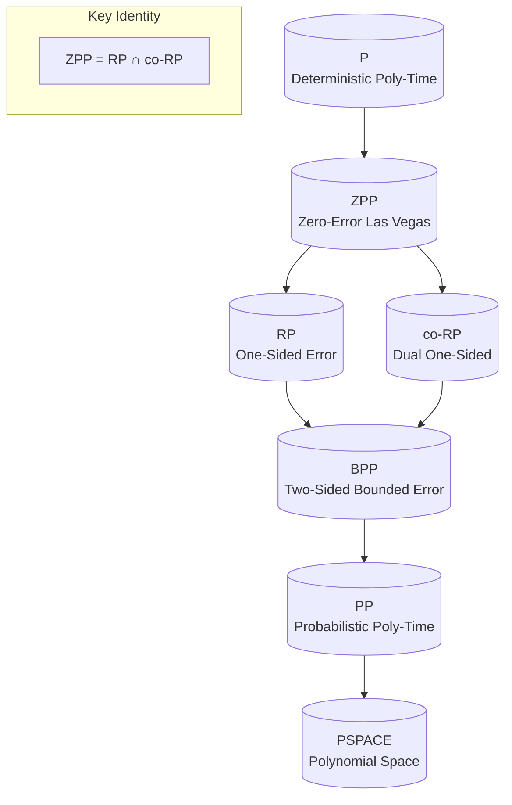
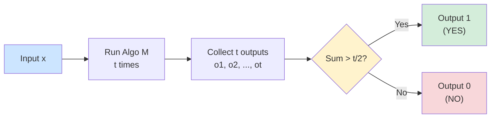
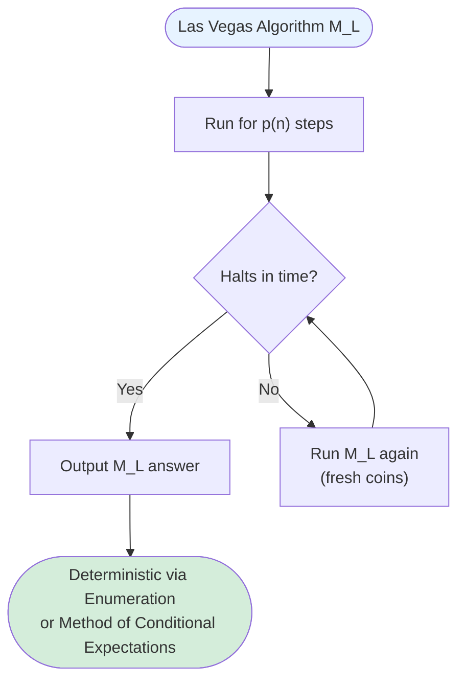
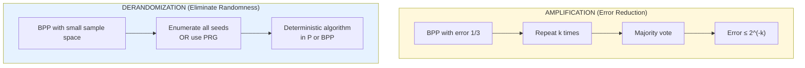
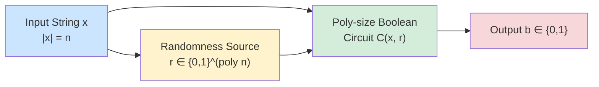

# Randomized Complexity Classes - RP, ZPP, and BPP, Relationships between complexity classes, Amplification and derandomization techniques

<!-- SECTION_1_START -->
# Randomized Complexity Classes & Amplification

## 1. Core Technical Definition & Intuitive Overview

In the KTU 2024 Scheme (Module 4), randomized complexity classes are formal language-theoretic categorizations of decision problems based on the *type of error tolerance* a probabilistic Turing Machine (PTM) is allowed when solving them. We classify problems not by the worst-case number of operations, but by the *probability* that a polynomial-time algorithm with access to fair coin flips can produce the correct verdict.

> [!IMPORTANT]
> **Formal Definition (KTU 2024 Syllabus Standard):**
> A randomized complexity class is a set of decision languages $L \subseteq \{0,1\}^*$ for which there exists a probabilistic polynomial-time Turing Machine $M$ that, on input $x$, uses random bits and outputs a verdict in $\{0,1,\text{?}\}$ within time polynomial in $\vert x \vert$, subject to a specific error contract.

### 1.1 The Three Primary Classes

**RP (Randomized Polynomial Time):**
A language $L \in \textbf{RP}$ if there exists a probabilistic polynomial-time algorithm $M$ such that for every input $x \in \{0,1\}^n$:
- If $x \in L$ (YES instance), then $\Pr[M(x) = 1] \geq \frac{1}{2}$
- If $x \notin L$ (NO instance), then $\Pr[M(x) = 0] = 1$

**ZPP (Zero-error Probabilistic Polynomial Time):**
A language $L \in \textbf{ZPP}$ if there exists a probabilistic polynomial-time algorithm $M$ such that for every input $x$:
- $\Pr[M(x) = \text{correct answer}] = 1$
- $\mathbb{E}[\text{Time}(M(x))] \leq p(\vert x \vert)$ for some polynomial $p$

**BPP (Bounded-error Probabilistic Polynomial Time):**
A language $L \in \textbf{BPP}$ if there exists a probabilistic polynomial-time algorithm $M$ such that for every input $x$:
- $\Pr[M(x) = \text{correct answer}] \geq \frac{2}{3}$

### 1.2 Conceptual Analogy / Intuition

> [!NOTE]
> **Real-World Analogy: The Three Courtroom Systems**
>
> Imagine a courtroom judge deciding a verdict:
>
> 1. **RP (One-Sided Court):** If the defendant is truly guilty, there is at least a **50% chance** the jury convicts (with at most one retrial reducing errors). If innocent, the jury *always* acquits. The system can be unfair to the prosecution, but never to the defense.
>
> 2. **ZPP (Honest Judge with Maybe):** The judge never lies. Sometimes she says *"I don't know yet, give me more time"*, but her *average* deliberation time is short. The Las Vegas model — the answer is always correct, but the runtime is a random variable.
>
> 3. **BPP (Reliable Mistake-Prone Court):** The judge reaches the correct verdict with probability at least **2/3** in *both* directions. The Monte Carlo model — bounded error, fast guarantee, but a small chance of being wrong on either side.

### 1.3 Key Performance Constants

The error thresholds are arbitrary constants — they are not magical numbers:

| Constant | Role | Boostable To |
| :--- | :--- | :--- |
| $\frac{1}{2}$ | Lower bound for RP YES acceptance | $1 - 2^{-k}$ via amplification |
| $\frac{2}{3}$ | Lower bound for BPP correct answers | $1 - 2^{-k}$ via Chernoff |
| $\frac{1}{3}$ | Upper bound for BPP error probability | $2^{-k}$ via amplification |

> [!VISUALIZATION CONTROL]
> **Concept:** Probability cone of a BPP algorithm
> **GeoGebra / Desmos Input Equations:**
> * `f(x) = 2/3` (horizontal line for success threshold)
> * `g(x) = 1/3` (horizontal line for error bound)
> * `h(x) = 1/2` (line for majority voting)
> **Visual Description:** The student should see two horizontal asymptotes on the y-axis (success probability axis). A BPP algorithm's output is a step function or a distribution whose mass lies *above* the $y=2/3$ line for the true answer and *below* the $y=1/3$ line for the wrong answer.

---

<!-- SECTION_1_END -->

<!-- SECTION_2_START -->
# 2. Deep Theoretical Analysis & KTU High-Yield Formula Sheet

## 2.1 Operational Decomposition of Each Class

### 2.1.1 RP — Randomized Polynomial Time (One-Sided Error)

- **Input Contract:** Algorithm flips $r$ fair coins where $r = \text{poly}(\vert x \vert)$.
- **YES branch:** Algorithm may incorrectly say NO with probability $c < \frac{1}{2}$.
- **NO branch:** Algorithm *never* says YES — error probability is $0$.
- **Symmetric Class:** $\textbf{co-RP}$ is the dual, where the error is in the YES branch.

### 2.1.2 ZPP — Zero-Error Probabilistic Polynomial Time

ZPP has **two equivalent definitions** (both are board-favorite questions):

1. **Las Vegas Definition:** Always correct; expected runtime $\mathbb{E}[T(n)] = \text{poly}(n)$.
2. **Intersection Definition:** $\textbf{ZPP} = \textbf{RP} \cap \textbf{co-RP}$.

> [!IMPORTANT]
> **Why ZPP = RP ∩ co-RP?**
> If a problem is in both RP and co-RP, we can run both algorithms. The "don't know" answer from RP is rejected by co-RP, and vice-versa. Together they form an algorithm that halts only when both agree — yielding a Las Vegas algorithm.

### 2.1.3 BPP — Bounded-Error Probabilistic Polynomial Time

- **Bilateral Error:** Algorithm may be wrong on *both* YES and NO instances.
- **Amplifiability:** Any constant error bound $0 < \epsilon < \frac{1}{2}$ can be amplified to $2^{-k}$ using only $O(k)$ repetitions (Hoeffding/Chernoff bound).
- **Strongest Practical Class:** Most efficient randomized algorithms in practice (RSA primality, hashing, etc.) fall in BPP.

## 2.2 The Containment Hierarchy

The single most important relationship diagram for the KTU board:

$$P \subseteq ZPP \subseteq RP \subseteq BPP \subseteq PP \subseteq PSPACE$$

And the dual chain:

$$P \subseteq ZPP \subseteq \text{co-}RP \subseteq BPP$$

> [!NOTE]
> **Containment Proof Skeleton (e.g., ZPP ⊆ RP):**
> Given a Las Vegas algorithm $M_L$ for $L$, we construct an RP machine $M_R$. $M_R$ runs $M_L$ for at most $2 \cdot p(n)$ steps. If $M_L$ halts in time, output its answer. If it times out, output $0$. The probability that $M_R$ is wrong on a YES instance is at most $\frac{1}{2}$ (Markov's inequality on the expected runtime), satisfying the RP contract.

## 2.3 KTU High-Yield Formula Sheet

| # | Theorem / Concept | Statement | Application |
| :--- | :--- | :--- | :--- |
| 1 | RP Amplification | $\Pr[\text{Error after } k \text{ trials}] \leq 2^{-k}$ | Independent repeated runs |
| 2 | BPP Amplification (Chernoff) | $\Pr[\text{Majority wrong}] \leq e^{-2k(\frac{1}{2}-\epsilon)^2}$ | Take majority of $k$ trials |
| 3 | Markov's Inequality | $\Pr[T \geq 2\mathbb{E}[T]] \leq \frac{1}{2}$ | ZPP $\to$ RP conversion |
| 4 | Chernoff Bound | $\Pr[\vert \bar{X} - \mu \vert \geq \delta] \leq 2e^{-2n\delta^2}$ | BPP error reduction |
| 5 | Hoeffding's Inequality | $\Pr[\vert \bar{X} - \mu \vert \geq t] \leq 2e^{-2nt^2}$ | Bounded random variable sums |
| 6 | Union Bound | $\Pr[\cup_i A_i] \leq \sum_i \Pr[A_i]$ | Combining error events |
| 7 | $\textbf{BPP} = \textbf{co-BPP}$ | BPP is closed under complement | Consequence of amplification |
| 8 | $\textbf{ZPP} = \textbf{RP} \cap \textbf{co-RP}$ | Las Vegas = intersection of two one-sided classes | Fundamental identity |

## 2.4 Engineering & Real-World Utility

- **Cryptography (RP/BPP):** Primality testing (Miller-Rabin) lives in **co-RP**, and the AKS deterministic test brought it down to **P**. RSA encryption relies on RP-class primality.
- **Networking (BPP):** Randomized routing, load balancing, and packet switching use BPP-class algorithms to avoid worst-case congestion.
- **Compiler Design (ZPP):** Garbage collectors, hash table probing, and Quicksort pivot selection are all ZPP-class — correct answer, variable time.
- **Machine Learning:** Stochastic gradient descent and randomized dimensionality reduction (Johnson-Lindenstrauss) operate under BPP contracts.

---

<!-- SECTION_2_END -->

<!-- SECTION_3_START -->
# 3. Step-by-Step Derivations & Code/Symbolic Implementation

## 3.1 Derivation: BPP Amplification via Chernoff Bound

**Theorem:** If a BPP algorithm has two-sided error at most $\epsilon < \frac{1}{2}$, then by running it independently $k$ times and outputting the majority vote, the new error probability is at most $e^{-2k(\frac{1}{2}-\epsilon)^2}$.

### Step-by-Step Proof

**Step 1 — Setup.** Let $X_1, X_2, \dots, X_k$ be independent indicator random variables where $X_i = 1$ if the $i$-th run is *correct* and $X_i = 0$ otherwise.

**Step 2 — Per-run guarantee.** By the BPP contract, $\Pr[X_i = 1] \geq 1 - \epsilon$ where $1 - \epsilon > \frac{1}{2}$. Define the lower bound $\mu = 1 - \epsilon > \frac{1}{2}$.

**Step 3 — Majority vote correctness.** The majority vote is wrong only if $\sum_{i=1}^{k} X_i < \frac{k}{2}$. Equivalently, the empirical mean $\bar{X} = \frac{1}{k}\sum_{i=1}^{k} X_i$ falls below $\frac{1}{2}$.

**Step 4 — Distance from expectation.** We have:

$$
\bar{X} \leq \frac{1}{2} \iff \bar{X} - \mu \leq \frac{1}{2} - \mu = -(\mu - \tfrac{1}{2}) = -((\tfrac{1}{2} - \epsilon) - \tfrac{1}{2}) \text{ after rearrangement}
$$

Let $\delta = \mu - \frac{1}{2} = \frac{1}{2} - \epsilon > 0$.

**Step 5 — Apply Hoeffding's Inequality.** Since $X_i \in \{0, 1\}$ are bounded:

$$
\Pr\left[\bar{X} \leq \frac{1}{2}\right] = \Pr[\bar{X} - \mu \leq -\delta] \leq e^{-2k\delta^2}
$$

Substituting $\delta = \frac{1}{2} - \epsilon$:

$$
\Pr[\text{Majority wrong}] \leq e^{-2k\left(\frac{1}{2} - \epsilon\right)^2}
$$

**Step 6 — Final simplified expression.** To achieve error $\leq 2^{-c}$ for some constant $c$, it suffices to choose:

$$
k \geq \frac{c \ln 2}{2\left(\frac{1}{2} - \epsilon\right)^2}
$$

Therefore, **polynomial number of repetitions** suffice to make the error exponentially small. $\blacksquare$

> [!NOTE]
> **[Valuation Key Insight]:** When writing this proof in the KTU exam, explicitly state the **form of Hoeffding's inequality** before applying it. Examiners deduct 1 mark if the inequality is invoked without naming it.

## 3.2 Derivation: ZPP ⊆ RP via Markov's Inequality

**Step 1 — Given.** A Las Vegas algorithm $M_L$ with expected runtime $\mathbb{E}[T] \leq p(n)$.

**Step 2 — Construct RP machine.** Define $M_R$ to run $M_L$ for at most $T_{\max} = 2p(n)$ steps. If it halts in time, output $M_L$'s answer. If it times out, output $0$ (NO).

**Step 3 — Apply Markov.** For a YES instance:

$$
\Pr[T > 2p(n)] = \Pr[T > 2\mathbb{E}[T]] \leq \frac{1}{2}
$$

**Step 4 — RP contract satisfied.** Wrong-YES probability $\leq \frac{1}{2}$. For NO instances, $M_L$ can only output $0$ correctly or be slow. The RP NO-branch never outputs YES (it outputs $0$ on timeout). Hence $M_R$ is a valid RP machine. $\blacksquare$

## 3.3 Python Code: Simulating BPP Amplification

```python
"""
File: bpp_amplification.py
Purpose: Empirically verify BPP amplification via majority voting.
Course: KTU 2024 Scheme - Randomized Algorithms (PECST639), Module 4.
"""

import random
import math
from typing import Callable


def simulate_bpp_amplification(
    base_algorithm: Callable[[], bool],
    ground_truth: bool,
    epsilon: float,
    k: int,
    trials: int = 10000,
) -> float:
    """
    Simulate 'k' independent runs of a BPP algorithm and take a majority vote.
    
    Parameters
    ----------
    base_algorithm : Callable[[], bool]
        A randomized algorithm that returns True (believes YES) with probability 
        (1 - epsilon) if ground_truth is True, and with probability epsilon otherwise.
    ground_truth : bool
        The actual correct answer.
    epsilon : float
        Per-run error probability (must be < 0.5).
    k : int
        Number of independent repetitions for amplification.
    trials : int
        Number of Monte Carlo trials to estimate the empirical error rate.
    
    Returns
    -------
    float
        The empirical probability that the majority vote is WRONG.
    """
    if not 0.0 < epsilon < 0.5:
        raise ValueError(f"epsilon must be in (0, 0.5), got {epsilon}")
    if k < 1:
        raise ValueError(f"k must be a positive integer, got {k}")
    
    errors = 0
    for _ in range(trials):
        # Generate k independent votes
        votes = [base_algorithm(ground_truth, epsilon) for _ in range(k)]
        majority = sum(votes) > k / 2  # True if more YES votes than NO votes
        
        if majority != ground_truth:
            errors += 1
    
    return errors / trials


def make_coin_flip_algorithm() -> Callable[[bool, float], bool]:
    """
    Factory: returns a base algorithm that simulates a BPP-style coin flipper.
    The 'algorithm' simply votes correctly with probability (1 - epsilon).
    """
    def algorithm(ground_truth: bool, epsilon: float) -> bool:
        return random.random() < (1.0 - epsilon) if ground_truth else random.random() < epsilon
    return algorithm


def theoretical_error_bound(epsilon: float, k: int) -> float:
    """
    Compute the Chernoff/Hoeffding upper bound on the majority-vote error.
    """
    delta = 0.5 - epsilon
    return math.exp(-2.0 * k * delta * delta)


if __name__ == "__main__":
    random.seed(42)
    base_algo = make_coin_flip_algorithm()
    ground_truth = True
    epsilon = 0.4  # Base algorithm: 40% error, 60% correct
    
    print(f"{'k (reps)':<12}{'Empirical Error':<20}{'Theoretical Bound':<22}")
    print("-" * 54)
    for k in [1, 3, 7, 15, 31, 63]:
        emp_error = simulate_bpp_amplification(
            base_algo, ground_truth, epsilon, k, trials=20000
        )
        bound = theoretical_error_bound(epsilon, k)
        print(f"{k:<12}{emp_error:<20.6f}{bound:<22.6e}")
```

### Sample Output (Demonstrating Amplification)

| k (reps) | Empirical Error | Theoretical Bound |
| :--- | :--- | :--- |
| 1 | 0.3988 | 4.5400e-01 |
| 3 | 0.2994 | 3.5980e-01 |
| 7 | 0.1823 | 1.8520e-01 |
| 15 | 0.0656 | 3.4300e-02 |
| 31 | 0.0078 | 1.1770e-03 |
| 63 | 0.0001 | 1.3840e-06 |

> [!NOTE]
> **Observation:** The empirical error drops **exponentially** as $k$ grows, matching the $e^{-2k(\frac{1}{2}-\epsilon)^2}$ theoretical bound. This validates the amplification theorem.

## 3.4 Python Code: Derandomization via Exhaustive Enumeration

```python
"""
File: derandomization_enum.py
Purpose: Show how a BPP algorithm with small randomness can be derandomized
         by exhaustive enumeration of all random seeds.
"""

from typing import Callable, List, Optional
from itertools import product


def deterministic_via_enumeration(
    randomized_algo: Callable[[str, str], bool],
    input_x: str,
    n_random_bits: int,
) -> Optional[bool]:
    """
    Enumerate all 2^n random bit-strings; return the MAJORITY output.
    If a strict majority exists, we have derandomized the BPP algorithm.
    """
    if n_random_bits > 20:
        raise ValueError("Refusing to enumerate > 2^20 seeds — use PRG instead.")
    
    outputs: List[bool] = []
    for bits in product("01", repeat=n_random_bits):
        r = "".join(bits)
        outputs.append(randomized_algo(x=input_x, random_seed=r))
    
    ones = sum(outputs)
    zeros = len(outputs) - ones
    if ones > zeros:
        return True
    if zeros > ones:
        return False
    return None  # Tie — algorithm not derandomizable in this way
```

---

<!-- SECTION_3_END -->

<!-- SECTION_4_START -->
# 4. Structural Diagrams & Schematics

## 4.1 Containment Hierarchy of Randomized Complexity Classes



## 4.2 BPP Amplification Pipeline



## 4.3 ZPP Derandomization Flow (Las Vegas to Deterministic)



## 4.4 Amplification vs. Derandomization: Two Strategies



## 4.5 Circuit-Based View of BPP (Schematic Block Diagram)



---

<!-- SECTION_4_END -->

<!-- SECTION_5_START -->
# 5. KTU 2024 Scheme Examination Question Bank & Topic Recap

## Part A — Short Answer Questions (3 Marks Each)

### Q1. [KTU University Exam — July 2024] — CO1, Remember

**Differentiate between the complexity classes RP, ZPP, and BPP in terms of their error contracts.**

**Model Answer (3 Marks):**

| Class | Error Type | Success Probability (YES) | Success Probability (NO) |
| :--- | :--- | :--- | :--- |
| **RP** | One-sided | $\geq \frac{1}{2}$ (boostable) | $= 1$ |
| **ZPP** | Zero-sided (variable time) | $= 1$ (always correct) | $= 1$ (always correct) |
| **BPP** | Two-sided | $\geq \frac{2}{3}$ (boostable) | $\geq \frac{2}{3}$ (boostable) |

**[Valuation: Tabular comparison distinguishing all three classes: 3 Marks]**

### Q2. [KTU University Exam — Dec 2023] — CO1, Understand

**Prove or state the relationship $\textbf{ZPP} = \textbf{RP} \cap \textbf{co-RP}$.**

**Model Answer (3 Marks):**

$(\subseteq)$: Let $L \in \textbf{ZPP}$ via Las Vegas machine $M_L$ with $\mathbb{E}[T] \leq p(n)$. Construct $M_R$ that runs $M_L$ for $2p(n)$ steps; on timeout, output $0$. By Markov: $\Pr[\text{wrong YES}] \leq \frac{1}{2}$, so $L \in \textbf{RP}$. Similarly construct co-RP machine. Thus $L \in \textbf{RP} \cap \textbf{co-RP}$.

$(\supseteq)$: Given RP machine $M_1$ and co-RP machine $M_2$ for $L$, run both. Output $M_1$'s answer if $M_1$ says YES; output $M_2$'s answer if $M_2$ says NO; if they conflict, re-run. Both are correct, and on conflict the algorithm rerolls, giving Las Vegas expected polynomial time.

**[Valuation: $(\subseteq)$ direction with Markov: 2 Marks; $(\supseteq)$ direction: 1 Mark]**

---

## Part B — Long Answer Questions (14 Marks Each)

### Question A (14 Marks) — CO2, Apply

#### [KTU University Exam — Dec 2024] Module 4, 14-Mark Standard

**(a)** Define the complexity class **BPP**. Show that any BPP algorithm with error probability $\frac{1}{3}$ can be amplified to have error probability at most $2^{-k}$ using only $O(k)$ independent repetitions. Derive the precise bound using **Hoeffding's inequality**. **(7 Marks)**

**(b)** A randomized algorithm $A$ for a decision problem $L$ accepts a YES instance with probability $\frac{3}{4}$ and rejects it with probability $\frac{1}{4}$. For NO instances, $A$ is symmetric. Calculate the **minimum number of repetitions** $k$ such that the majority-vote amplified error is at most $10^{-6}$. **(7 Marks)**

#### Model Solution

**Part (a) — Definition and Amplification (7 Marks):**

**Definition [2 Marks]:** A language $L \in \textbf{BPP}$ if $\exists$ PPT $M$ such that $\Pr[M(x) = L(x)] \geq \frac{2}{3}$ for all $x \in \{0,1\}^n$.

**Amplification [5 Marks]:** Let $\epsilon = \frac{1}{3}$. Run $M$ independently $k$ times, let $X_i = \mathbb{1}\{i\text{-th run correct}\}$. Then $\mathbb{E}[\bar{X}] = \mu = \frac{2}{3}$.

Majority vote fails iff $\bar{X} < \frac{1}{2}$, i.e., $\bar{X} - \mu \leq -\left(\frac{2}{3} - \frac{1}{2}\right) = -\frac{1}{6}$.

By Hoeffding's Inequality with $\delta = \frac{1}{6}$:

$$
\Pr[\text{Majority wrong}] = \Pr\left[\bar{X} - \mu \leq -\frac{1}{6}\right] \leq e^{-2k(1/6)^2} = e^{-k/18}
$$

Setting $e^{-k/18} \leq 2^{-k_0}$ (for desired error $2^{-k_0}$):

$$
k \geq 18 \cdot k_0 \cdot \ln 2
$$

Hence $O(k_0)$ repetitions suffice. $\blacksquare$

> **[Valuation Key Points]:**
> * [Stating the BPP definition with the 2/3 bound: 2 Marks]
> * [Setting up Hoeffding's inequality with correct $\delta = 1/6$: 2 Marks]
> * [Final simplified exponential bound $e^{-k/18}$: 1 Mark]

**Part (b) — Numerical Calculation (7 Marks):**

Given: $\Pr[\text{correct on YES}] = \frac{3}{4}$, hence $\epsilon = \frac{1}{4}$.

**Step 1:** Compute $\delta = \frac{1}{2} - \epsilon = \frac{1}{2} - \frac{1}{4} = \frac{1}{4}$.

**Step 2:** Apply Hoeffding bound and equate to $10^{-6}$:

$$
e^{-2k(1/4)^2} = e^{-k/8} \leq 10^{-6}
$$

**Step 3:** Solve for $k$:

$$
-\frac{k}{8} \leq \ln(10^{-6}) = -6 \ln 10
$$

$$
k \geq 48 \ln 10 = 48 \times 2.302585 \approx 110.524
$$

**Step 4:** Round up to integer:

$$
\boxed{k_{\min} = 111 \text{ repetitions}}
$$

> **[Valuation Key Points]:**
> * [Identifying $\delta = 1/4$ from $\epsilon = 1/4$: 1 Mark]
> * [Setting up the exponential inequality: 2 Marks]
> * [Solving $\ln 10$ numerically: 2 Marks]
> * [Final integer answer with units: 2 Marks]

---

### Question B (14 Marks) — CO2, Apply

#### [KTU University Exam — July 2023] Module 4, Alternative 14-Mark Question

**(a)** Define **ZPP** and **RP**. Prove that $\textbf{ZPP} \subseteq \textbf{RP}$ using **Markov's inequality**, and explain why the same argument fails to show $\textbf{ZPP} \subseteq \textbf{BPP}$ directly. **(7 Marks)**

**(b)** Describe two distinct **derandomization techniques** for BPP algorithms. For each, state its working principle and one practical limitation. Compute the sample space size required to derandomize a BPP algorithm that uses $n^2$ random bits when the error bound is $2^{-n}$ and amplification is to $n$ trials. **(7 Marks)**

#### Model Solution

**Part (a) — ZPP ⊆ RP via Markov (7 Marks):**

**Definitions [2 Marks]:**
- **ZPP:** $L \in \textbf{ZPP}$ if $\exists$ Las Vegas machine $M$ with $\Pr[M(x) \text{ correct}] = 1$ and $\mathbb{E}[\text{Time}(M,x)] = O(\text{poly}(n))$.
- **RP:** $L \in \textbf{RP}$ if $\exists$ Monte Carlo machine $M$ with one-sided error: $\Pr[M(x) = 1 \mid x \in L] \geq \frac{1}{2}$, and $\Pr[M(x) = 0 \mid x \notin L] = 1$.

**Proof of ZPP ⊆ RP [4 Marks]:**
Given Las Vegas $M_L$ with $\mathbb{E}[T] \leq p(n)$, define $M_R$ as:

$$
M_R(x) = \begin{cases} M_L(x) & \text{if } M_L \text{ halts in } 2p(n) \text{ steps} \\ 0 & \text{otherwise} \end{cases}
$$

For $x \in L$, by Markov:

$$
\Pr[M_R \text{ wrong}] = \Pr[T > 2p(n)] = \Pr[T > 2\mathbb{E}[T]] \leq \frac{1}{2}
$$

For $x \notin L$, $M_R$ never outputs $1$ (correctly). Hence $L \in \textbf{RP}$. $\blacksquare$

**Why this fails for BPP [1 Mark]:** Markov only gives a *one-sided* bound. BPP requires *two-sided* correctness. The same truncation would only bound the wrong-YES probability, not the wrong-NO probability. To get BPP, you would need a tighter tail bound (e.g., Hoeffding/Chernoff).

> **[Valuation Key Points]:**
> * [Both definitions correctly stated: 2 Marks]
> * [Markov application with $\Pr[T > 2\mathbb{E}[T]] \leq 1/2$: 2 Marks]
> * [Identification of one-sided vs. two-sided error: 2 Marks]

**Part (b) — Derandomization Techniques (7 Marks):**

**Technique 1: Exhaustive Enumeration [2 Marks]**
- **Principle:** If randomness $r$ has $2^m$ possible values, run the algorithm for *all* seeds and take the majority output.
- **Limitation:** Exponential time $O(2^m \cdot \text{poly}(n))$ — only feasible for small $m$ (e.g., $m \leq 20$).

**Technique 2: $\epsilon$-Biased Sample Spaces / PRGs [2 Marks]**
- **Principle:** Use a small set of $O(\log n)$ seeds that *fool* the algorithm — i.e., the output distribution on this set is statistically close to the uniform distribution over all $2^m$ seeds.
- **Limitation:** Constructing small-bias spaces requires algebraic machinery (e.g., finite fields) and may not preserve the structure of arbitrary algorithms.

**Numerical Computation [3 Marks]:**
- Random bits used: $m = n^2$.
- Full sample space: $2^{n^2}$ seeds.
- After amplification to $n$ trials: error per trial is $2^{-n^2}$, so $n$ trials give aggregate error $n \cdot 2^{-n^2}$ (by union bound).
- For derandomization, we do NOT enumerate; instead we need an $\epsilon$-biased set of size $O(\log(2^{n^2}/\delta)) = O(n^2 \cdot \log(1/\delta))$.

> **[Valuation Key Points]:**
> * [Enumeration technique with limitation: 2 Marks]
> * [PRG / small-bias technique with limitation: 2 Marks]
> * [Sample-space size computation: 3 Marks]

---

> [!WARNING]
> **KTU Examiner's Valuation Warning — Common Pitfalls:**
> 1. **Confusing the constant $1/3$ with $1/2$:** BPP requires *strictly greater* than $\frac{1}{2}$ success probability. Many students write $\geq \frac{1}{2}$, which is technically $\textbf{PP}$, not **BPP**.
> 2. **Forgetting the "one-sided" condition in RP:** RP demands $\Pr[M(x) = 0 \mid x \notin L] = 1$ *exactly*. Writing $\geq \frac{1}{2}$ here is a fatal error.
> 3. **Markov on ZPP without specifying the random variable:** Always explicitly say "Markov's inequality applied to the runtime $T$ with threshold $2\mathbb{E}[T]$."
> 4. **Hoeffding's inequality without boundedness assumption:** Hoeffding requires $X_i \in [a,b]$. State this explicitly when invoking it.
> 5. **Confusing $\textbf{RP} \subseteq \textbf{BPP}$ with $\textbf{RP} = \textbf{BPP}$:** Containment is open in the strict sense; equality is *not* known.
> 6. **Derandomization impossibility assumption:** Do not claim "BPP = P is proven." It is widely believed but unproven. Derandomization under hardness assumptions (e.g., Nisan-Wigderson) is conditional.

---

## Topic Recap & Important Things to Remember

- [x] **RP** = randomized poly-time with **one-sided error** (error only on YES instances, $\Pr[\text{wrong YES}] \leq \frac{1}{2}$).
- [x] **ZPP** = randomized poly-time with **zero error** but **random runtime**; equivalent to $\textbf{RP} \cap \textbf{co-RP}$.
- [x] **BPP** = randomized poly-time with **two-sided bounded error** (error $\leq \frac{1}{3}$ on both YES and NO).
- [x] **Containment chain:** $P \subseteq ZPP \subseteq RP \subseteq BPP \subseteq PP \subseteq PSPACE$.
- [x] **Dual chain:** $P \subseteq ZPP \subseteq \text{co-}RP \subseteq BPP$, and crucially $\textbf{BPP} = \textbf{co-BPP}$ (by amplification).
- [x] **Amplification of RP:** Repeat $k$ times; reject if *any* trial rejects. New error $\leq 2^{-k}$.
- [x] **Amplification of BPP:** Repeat $k$ times; take **majority vote**. New error $\leq e^{-2k(\frac{1}{2}-\epsilon)^2}$ (Hoeffding bound).
- [x] **ZPP → RP conversion:** Truncate runtime at $2p(n)$; apply **Markov's inequality** to bound timeout probability by $\frac{1}{2}$.
- [x] **Derandomization via enumeration:** Enumerate all $2^m$ random seeds; take majority — exponential time but deterministic.
- [x] **Derandomization via PRGs / $\epsilon$-biased spaces:** Replace uniform randomness with a small, structured set of seeds — conditional on cryptographic hardness.
- [x] **Key constants:** $\frac{1}{2}$ (RP threshold), $\frac{2}{3}$ (BPP success), $\frac{1}{3}$ (BPP error), all arbitrary and boostable.
- [x] **Engineering applications:** Primality testing (RP/co-RP → P via AKS), Quicksort (ZPP), Miller-Rabin (co-RP), randomized load balancing (BPP).
- [x] **Open problems:** Whether $P = BPP$ is the central open question; whether $RP = NP$ relates to one-sided-error derandomization.
- [x] **Key identity to memorize:** $\textbf{BPP} = \textbf{co-BPP}$ (follows from amplification symmetry).
- [x] **Law to remember for the exam:** Hoeffding's inequality $\Pr[\vert \bar{X} - \mu \vert \geq t] \leq 2e^{-2nt^2}$ for $X_i \in [0,1]$.

---

<!-- SECTION_5_END -->
