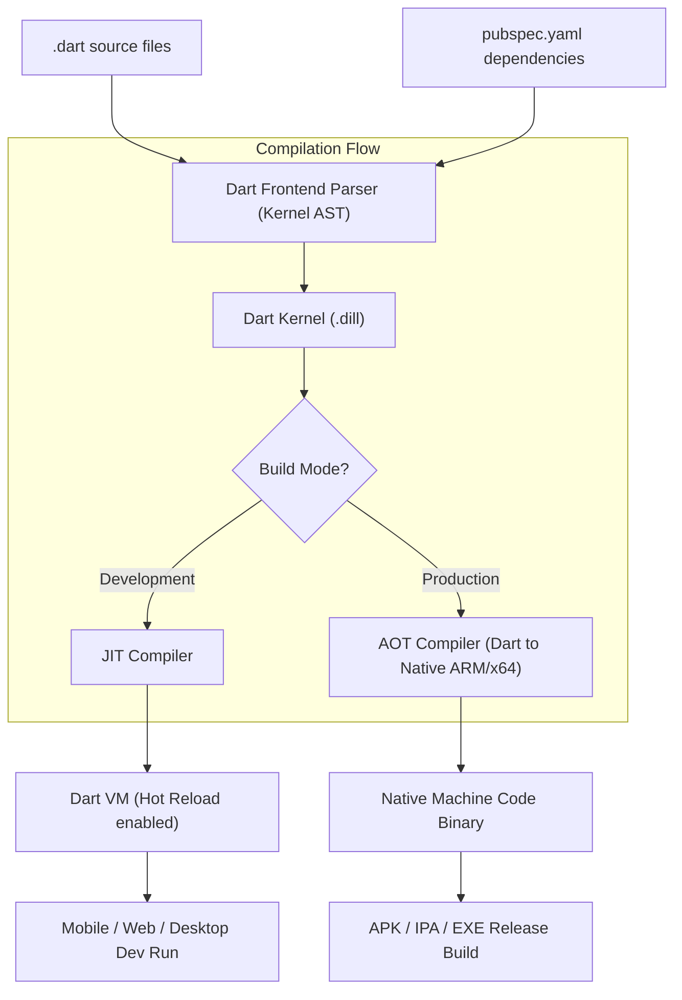
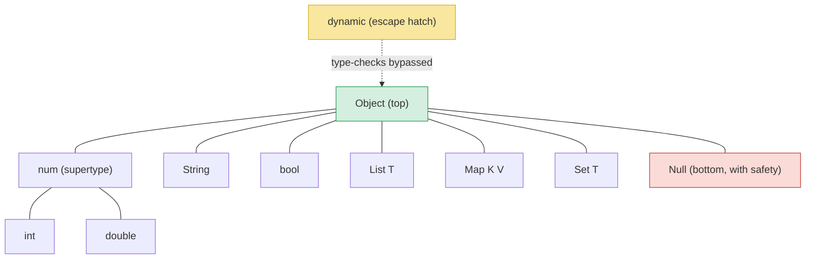
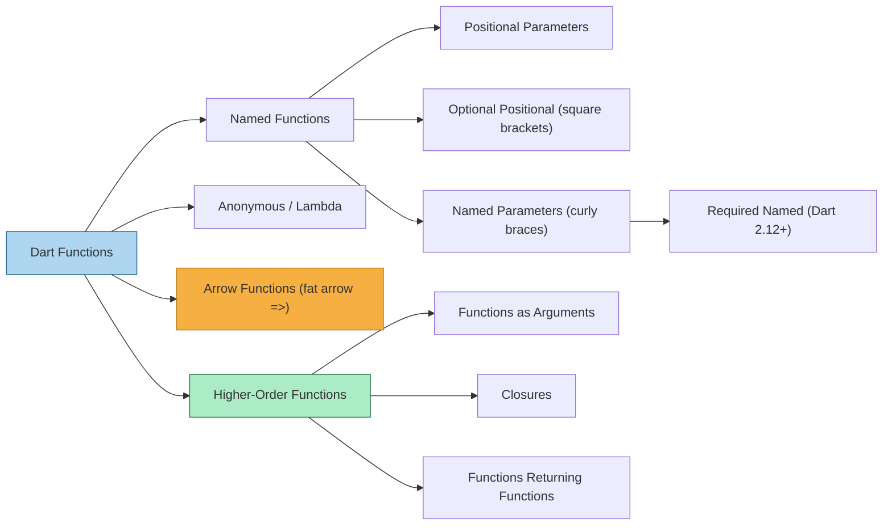
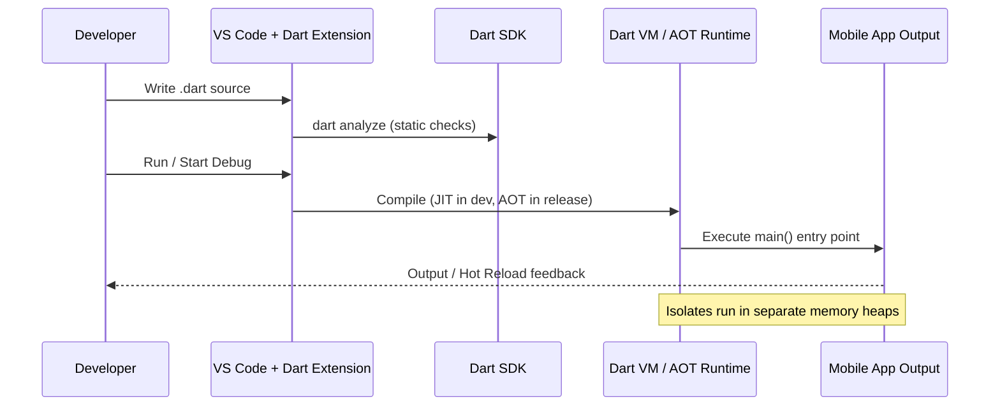
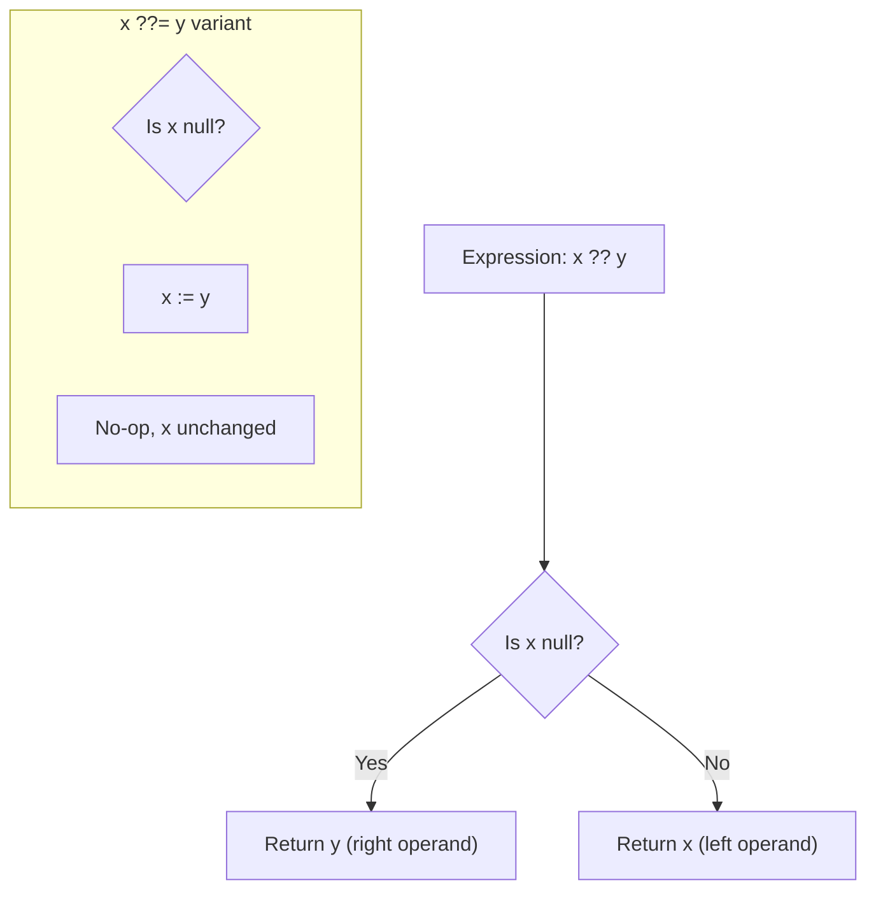

# Basics of Dart Programming Language

<!-- SECTION_1_START -->
# Basics of Dart Programming Language

## 1.1 Formal Definition (KTU 2024 Syllabus)

> [!NOTE]
> **Dart** is a **client-optimized, object-oriented, class-based, garbage-collected programming language** developed by **Google (Lars Bak and Kasper Lund, 2011)** with a C-style syntax, used to build fast applications on any platform — primarily **mobile (Flutter)**, web, desktop, and server-side. It is the official language for building cross-platform mobile applications with the **Flutter SDK**.

In the KTU 2024 Scheme syllabus for **Mobile Application Development (PECST695)**, Dart is positioned as the **prerequisite linguistic foundation** for the **Flutter framework**. A student must master Dart's syntax, type system, and asynchronous model before progressing to widget-based UI construction in Module 2 onward.

### Key Terminology
- **Dart VM (Virtual Machine)**: The runtime that executes Dart code using **JIT (Just-In-Time)** during development and **AOT (AOT — Ahead-Of-Time)** compilation for release builds.
- **JIT Compilation**: Used in development for **Hot Reload** (sub-second code refresh).
- **AOT Compilation**: Used in production to compile Dart to **native ARM/x64 machine code** for **near-native performance**.
- **DartPad**: Browser-based online IDE for testing Dart snippets (https://dartpad.dev).
- **Null Safety**: Sound type system feature introduced in **Dart 2.12** (2021) that prevents `null` reference errors at compile time.

---

## 1.2 Conceptual Analogy & Intuition

> [!IMPORTANT]
> **Think of Dart as the "engine" and Flutter as the "car body."**
> Without a strong engine (Dart), the visually beautiful chassis (Flutter UI) cannot run.

**Real-World Analogy — The Translator at an International Conference:**
Imagine you are at a conference where speakers from many countries (iOS, Android, Web, Desktop) need to communicate with attendees. Dart acts as a **universal translator** — you write code once in Dart, and it is translated ("compiled") into:
- **Native ARM instructions** for Android/iOS (via AOT)
- **JavaScript** for the Web (via `dart2js`)
- **x64 machine code** for Windows/macOS/Linux desktops
- **JavaScript bytecode** for server-side via Node.js

**Geometric Intuition — Dart's Type System as a Lattice:**
Dart's type system can be visualized as a **lattice structure** where:
- `Object` (top of the lattice) is the universal supertype.
- `Null` (bottom) is the universal subtype (only with null safety).
- Concrete types (`int`, `String`, `bool`) are nodes in the lattice; `dynamic` sits as an "escape hatch" outside the type lattice.

> [!VISUALIZATION CONTROL]
> **Concept:** Dart Type System Lattice (Null Safety Model)
> **GeoGebra / Desmos Input Equations:**
> * `Top = "Object"`
> * `Bottom = "Null"`
> * `Intermediate nodes: int, double, String, bool, List<T>, Map<K,V>`
> * `Side-branch: dynamic (escape hatch, type lattice exit point)`
> **Visual Description:** A vertical diamond/lattice with `Object` at the apex, `Null` at the base, primitive types arranged in a middle band, and `dynamic` drawn as a dashed line exiting the lattice to the right, indicating it bypasses compile-time type checks.

---

## 1.3 Why Dart for Mobile Application Development?

| Feature | Engineering Benefit |
|---|---|
| **Single Codebase** | One Dart codebase compiles to Android, iOS, Web, Windows, macOS, Linux |
| **AOT + JIT Hybrid** | Fast development cycle (JIT Hot Reload) **and** production-grade performance (AOT native binary) |
| **Strong + Sound Null Safety** | Eliminates a **major class of runtime crashes** at compile time |
| **Reactive UI via Streams** | Built-in `Stream` and `Future` API simplifies async event handling for mobile UI |
| **Isolates (Concurrency)** | Cooperative concurrency model using **isolated memory heaps** — no shared-state race conditions |
| **Tree Shaking** | Dead-code elimination; only used classes/functions ship with the app, reducing APK size |
| **Ahead-Of-Time Native Compilation** | Apps start **~milliseconds faster** than JIT-compiled competitors |

> [!TIP]
> **KTU 2024 Examiner's Insight:** When asked *"Why Dart for Flutter?"*, always mention at least these three: **(1) Hot Reload via JIT, (2) Native performance via AOT, (3) Null Safety** — these are the *most frequently rewarded* keywords in 3-mark and 14-mark answers.

---

## 1.4 Installing the Dart SDK and IDE Setup

**Step 1 — Install Dart SDK:**
- **Windows:** Download the Dart SDK zip from `https://dart.dev/get-dart` and add `<sdk>/bin` to `PATH`.
- **macOS:** Use Homebrew → `brew tap dart-lang/dart && brew install dart`.
- **Linux (Debian/Ubuntu):** `sudo apt-get update && sudo apt-get install dart`.

**Step 2 — Verify Installation:**

```bash
dart --version
# Output: Dart SDK version: 3.5.0 (stable)
```

**Step 3 — IDE:** Install **Visual Studio Code** + the official **Dart extension** (by `Dart Code` publisher) **and** the **Flutter extension** for module 2 onward.

**Step 4 — First Program (`hello.dart`):**

```dart
// Entry point of every Dart program
void main() {
  print('Hello, KTU 2024 Scheme!');
}
```

Run with: `dart run hello.dart`
<!-- SECTION_1_END -->

<!-- SECTION_2_START -->
# Deep Theoretical Analysis — Dart Language Constructs

## 2.1 Dart Program Structure (Top-Level Architecture)

Every Dart `.dart` file follows this canonical structure:

```dart
// 1. Import statements (libraries)
import 'dart:math';

// 2. Top-level constants and variables
const double PI_VALUE = 3.14159;
String globalAppName = 'KTU MAD';

// 3. Top-level functions
double circleArea(double radius) => PI_VALUE * radius * radius;

// 4. Class declarations
class Calculator {
  // class body
}

// 5. Mandatory entry point
void main() {
  print('$globalAppName: ${circleArea(5.0)}');
}
```

---

## 2.2 Variables and Type System

### 2.2.1 Variable Declaration Variants

Dart offers **three** keywords for variable declaration. The differences are *exam-critical*:

| Keyword | Mutability | Type | Compile-Time | Example |
|---|---|---|---|---|
| `var` | Mutable | Type-inferred (locked) | Implicit | `var name = 'Anu';` |
| `final` | Immutable (runtime set) | Type-inferred (locked) | Implicit | `final rollNo = 42;` |
| `const` | Immutable (compile-time set) | Type-inferred (locked) | Explicit | `const MAX = 100;` |
| `late` | Mutable, but **lazy-initialized** | Required | Implicit/Explicit | `late String bigData;` |
| `dynamic` | Mutable, **type can change** | Unchecked at runtime | Bypassed | `dynamic x = 10; x = 'now String';` |

> [!IMPORTANT]
> **Key Rule:** Once `var name = 'Anu';` is declared, `name` is permanently of type `String`. You cannot later do `name = 100;` — the compiler will reject it. This is the **soundness** property of Dart's type system.

### 2.2.2 Primitive and Built-in Data Types

| Type | Size / Encoding | Range / Notes | Default Value |
|---|---|---|---|
| `int` | 64-bit signed (on native VM) | $-2^{63}$ to $2^{63}-1$ | `null` (with null safety) |
| `double` | 64-bit IEEE 754 | $\approx \pm 1.7 \times 10^{308}$ | `null` |
| `num` | Supertype of `int` and `double` | Use for numeric but unsure of type | `null` |
| `String` | UTF-16 code units | Sequence of characters | `null` |
| `bool` | 1-bit logical | `true` or `false` only | `null` |
| `List<T>` | Growable by default | Ordered, indexable collection | `null` |
| `Set<T>` | Hash-based | Unordered unique collection | `null` |
| `Map<K, V>` | Hash-based | Key-value pairs | `null` |
| `Object` | Universal supertype | Base of all non-nullable types | `null` |
| `Null` | Universal subtype | Only value is `null` (with safety) | `null` |
| `void` | No type information | Return type for no-return functions | N/A |

### 2.2.3 Null Safety Deep Dive

With Dart 2.12+, types are **non-nullable by default**:

```dart
int age = 25;          // OK
int age = null;        // COMPILE ERROR: A value of type 'Null' can't be assigned to a variable of type 'int'.

int? age = null;       // OK — nullable variant using the question mark suffix
String? middleName;    // Nullable
String firstName;      // Non-nullable, must be initialized
```

**Null-aware operators (board-favorite topic):**

| Operator | Meaning | Example |
|---|---|---|
| `?` | Nullable type marker | `int?` x |
| `??` | Null-coalescing (provide default) | `name ?? 'Guest'` |
| `??=` | Assign only if currently `null` | `count ??= 0;` |
| `?.` | Null-safe member access | `user?.name` |
| `!` | Null-assertion (developer guarantees non-null) | `user!.name` |
| `late` | Lazy non-nullable, deferred initialization | `late String big;` |

---

## 2.3 Operators in Dart

| Category | Operators | Notes |
|---|---|---|
| **Arithmetic** | `+`, `-`, `*`, `/`, `~/`, `%` | `~/` is **integer division**; `/` always returns `double` |
| **Relational** | `==`, `!=`, `>`, `<`, `>=`, `<=` | Return `bool` |
| **Type Test** | `is`, `is!` | Runtime type check |
| **Logical** | `&&`, `\|\|`, `!` | Short-circuit evaluation |
| **Assignment** | `=`, `+=`, `-=`, `*=`, `/=`, `~/=`, `%=`, `??=` | Compound assignment |
| **Null-aware** | `??`, `??=`, `?.`, `!.`, `?..` | See Section 2.2.3 |
| **Cascade** | `..`, `?..` | Chain method calls on the same object |
| **Spread** | `...`, `...?` | Unpack collections |

**Example — Cascade Notation (Flutter UI relies on this):**

```dart
final user = User()
  ..name = 'Anu'
  ..age = 21
  ..email = 'anu@ktu.in';
```

> [!TIP]
> **Note for the table above:** We use `\|\|` (escaped) inside prose; the same operator in code is written as `||`. Similarly, `??=` is the *null-aware assignment* operator.

---

## 2.4 Control Flow Statements

### 2.4.1 Decision Making

```dart
if (marks >= 90) {
  grade = 'A+';
} else if (marks >= 75) {
  grade = 'A';
} else {
  grade = 'B';
}
```

**Switch Statement (Dart 3.0 — Pattern Matching):**

```dart
switch (command) {
  case 'OPEN':
    print('Opened');
    break;
  case 'CLOSED' || 'SHUT':        // Multiple cases combined
    print('Door is shut');
  default:
    print('Unknown command');
}
```

### 2.4.2 Loops

| Loop Type | Use Case |
|---|---|
| `for (var i = 0; i < n; i++)` | Counter-based iteration |
| `for (var item in collection)` | Iterating over `Iterable` |
| `while (condition)` | Pre-test loop |
| `do { ... } while (condition);` | Post-test loop (executes at least once) |

---

## 2.5 Functions — Deep Dive

Dart treats **functions as first-class citizens**.

### 2.5.1 Function Variants

```dart
// 1. Named function with positional parameters
int add(int a, int b) => a + b;

// 2. Optional positional parameters (wrapped in square brackets)
int sumUpToThree([int a = 0, int b = 0, int c = 0]) => a + b + c;

// 3. Named parameters (wrapped in curly braces; nullable by default)
void configure({String? name, int? timeout}) { /* ... */ }

// 4. Arrow (lambda / fat arrow) function
bool isAdult(int age) => age >= 18;

// 5. Anonymous function
var multiply = (int a, int b) => a * b;

// 6. Higher-order function (accepts or returns a function)
List<int> applyToAll(List<int> items, int Function(int) f) {
  return items.map(f).toList();
}
```

### 2.5.2 Required Named Parameters (Dart 2.12+)

```dart
void registerUser({required String email, required int age}) { /* ... */ }

registerUser(email: 'anu@ktu.in', age: 21);
```

---

## 2.6 String Interpolation and Multi-line Literals

```dart
String name = 'Anu';
int marks = 95;

// Simple interpolation
String line = 'Student $name scored $marks marks.';

// Expression interpolation
String line2 = 'Grade: ${marks >= 90 ? "A+" : "A"}';

// Raw string (escape sequences ignored)
String path = r'C:\Users\Anu\Documents';

// Multi-line string with triple quotes
String bio = '''
Name: $name
Marks: $marks
Grade: ${marks >= 90 ? "A+" : "A"}
''';
```

---

## 2.7 KTU Formula Sheet / Cheat Sheet

| Concept | Syntax / Rule | Example |
|---|---|---|
| Type inference | `var x = value;` | `var age = 21;` |
| Compile-time constant | `const` | `const MAX = 100;` |
| Runtime constant | `final` | `final now = DateTime.now();` |
| Late initialization | `late T x;` | `late String config;` |
| Nullable type | `T?` | `int?` x |
| Null-coalescing | `x ?? default` | `name ?? 'Guest'` |
| Null assertion | `x!` | `user!.name` |
| Cascade | `obj..method1()..method2()` | UI builder chains |
| Integer division | `a ~/ b` | `7 ~/ 2 == 3` |
| String interpolation | `$var` or `${expr}` | `'Hello $name'` |
| Arrow function | `(args) => expr` | `bool isEven(int n) => n % 2 == 0;` |
| For-each | `for (var x in list)` | Iterate over `Iterable` |
| Type test | `x is T` / `x is! T` | Runtime type check |

---

## 2.8 Engineering Utility — Where Dart is Used in Production

> [!IMPORTANT]
> **Production Systems Built with Dart + Flutter (industry-validated):**
> - **Google Pay** — 100 million+ users across Android/iOS, single Dart codebase.
> - **BMW Connected App** — In-car infotainment companion app, written in Dart.
> - **Reflectly** — AI journaling app, originally migrated from React Native to Flutter.
> - **eBay Motors** — Marketplace app for vehicle listings.
> - **Nubank** — Latin America's largest digital bank, rebuilt its iOS/Android apps in Flutter.

Dart's role in **DevOps pipelines** is also significant: `dart compile` integrates into **CI/CD** (GitHub Actions, GitLab CI, Bitrise) for **mobile app build automation** — a frequent interview question for KTU placements.
<!-- SECTION_2_END -->

<!-- SECTION_3_START -->
# Step-by-Step Implementations and Code Walkthroughs

## 3.1 Complete Worked Example — A Grading Application

Below is a **fully operational Dart program** implementing a KTU-style student grading system. Every line is annotated.

```dart
// File: student_grade.dart
// Purpose: Demonstrate Dart fundamentals — variables, control flow, functions,
//          null safety, collections, and string interpolation.

import 'dart:io'; // For reading user input from the console

// 1. Top-level constant (compile-time)
const double PASS_THRESHOLD = 50.0;

// 2. Top-level function with type annotations and default parameter
String computeGrade(double marks, {String studentName = 'Unknown'}) {
  // Decision-making using if-else ladder
  String grade;
  if (marks >= 90.0) {
    grade = 'A+';
  } else if (marks >= 80.0) {
    grade = 'A';
  } else if (marks >= 70.0) {
    grade = 'B+';
  } else if (marks >= PASS_THRESHOLD) {
    grade = 'B';
  } else {
    grade = 'F (Fail)';
  }
  // String interpolation with expression
  return '$studentName scored $marks marks. Grade: $grade';
}

// 3. Function demonstrating List, Map, and for-in loop
Map<String, dynamic> classSummary(List<double> marksList) {
  // Null-coalescing for safe division
  double total = marksList.fold(0.0, (a, b) => a + b);
  double average = marksList.isEmpty ? 0.0 : total / marksList.length;

  // Arrow function used inline
  bool isPassed = (double m) => m >= PASS_THRESHOLD;
  int passCount = marksList.where(isPassed).length;

  return {
    'count': marksList.length,
    'total': total,
    'average': average,
    'passCount': passCount,
    'failCount': marksList.length - passCount,
  };
}

// 4. Main entry point — required for execution
void main() {
  print('=== KTU Student Grading System ===');

  // Demonstrating List literal with type inference
  var marks = <double>[85.5, 72.0, 49.0, 95.0, 60.5];

  // Demonstrating Map
  Map<String, double> studentMarks = {
    'Anu': 85.5,
    'Rahul': 72.0,
    'Meera': 95.0,
  };

  // Loop over Map entries
  studentMarks.forEach((name, mark) {
    print(computeGrade(mark, studentName: name));
  });

  // Compute summary
  var summary = classSummary(marks);
  print('\n--- Class Summary ---');
  print('Total Students: ${summary['count']}');
  print('Average Marks : ${(summary['average'] as double).toStringAsFixed(2)}');
  print('Passed        : ${summary['passCount']}');
  print('Failed        : ${summary['failCount']}');
}
```

### Expected Output
```
=== KTU Student Grading System ===
Anu scored 85.5 marks. Grade: A
Rahul scored 72.0 marks. Grade: B+
Meera scored 95.0 marks. Grade: A+

--- Class Summary ---
Total Students: 5
Average Marks : 72.40
Passed        : 4
Failed        : 1
```

---

## 3.2 Exhaustive Derivation — Integer Division vs Real Division

Dart's division operators are a **classic exam pitfall**. Let us derive the difference.

$$\begin{aligned}
\text{Given: } & a = 7, \quad b = 2 \\
\text{Real division: } & a / b = 7 / 2 = 3.5 \quad \text{(returns \texttt{double})} \\
\text{Integer division: } & a \mathbin{\text{\textasciitilde}\text{\textasciitilde}} b = 7 \mathbin{\text{\textasciitilde}\text{\textasciitilde}} 2 = 3 \quad \text{(truncates toward zero, returns \texttt{int})} \\
\text{Modulo: } & a \bmod b = 7 \bmod 2 = 1 \quad \text{(remainder)} \\
\end{aligned}$$

**Verification:**

```dart
void main() {
  int a = 7, b = 2;
  print(a / b);     // 3.5       (double)
  print(a ~/ b);    // 3         (int, truncated)
  print(a % b);     // 1         (remainder)
}
```

**Edge case — negative integers:**

$$\begin{aligned}
-7 \mathbin{\text{\textasciitilde}\text{\textasciitilde}} 2 &= -3 \quad &\text{(truncated toward zero, NOT floor division)} \\
-7 \bmod 2 &= -1 \quad &\text{(sign follows the dividend)} \\
\end{aligned}$$

> [!WARNING]
> **Common Mistake:** Students assume `~/` is *floor division* (as in Python). In Dart, `~/` is **truncation division** — it rounds *toward zero*. This distinction has appeared in KTU 2022 and 2024 question papers.

---

## 3.3 Null-Aware Operators — Complete Walkthrough

Let us work out each null-aware operator with explicit state transitions.

```dart
String? userInput;          // State: null

String display = userInput ?? 'Anonymous';
// Evaluation:
//   userInput is null  =>  display := 'Anonymous'
//   userInput non-null =>  display := userInput
// Final value: 'Anonymous'

int? counter;
counter ??= 10;
// Evaluation:
//   counter is null  =>  counter := 10
//   counter non-null =>  no change
// Final value: 10

String? name;
int nameLength = name?.length ?? 0;
// Evaluation:
//   name is null  =>  name?.length evaluates to null  =>  ?? 0  =>  0
//   name non-null =>  name?.length evaluates to length  =>  kept
// Final value: 0

String? middle = 'K';
int safeLen = middle!.length;
// The !  operator asserts (at compile time) that middle is non-null.
// If runtime value is null, a TypeError is thrown.
```

---

## 3.4 Function Variants — Boundary Case Analysis

```dart
// Function with all parameter flavors
String buildReport({
  required String title,         // Mandatory named
  String? subtitle,              // Optional nullable named
  int maxLines = 10,             // Optional named with default
  List<String>? tags,            // Optional nullable list
}) {
  // Null-coalescing for safe string construction
  String sub = subtitle ?? '(no subtitle)';
  int count = tags?.length ?? 0;

  return '''
Title   : $title
Subtitle: $sub
Lines   : $maxLines
Tags    : $count item(s)
''';
}

void main() {
  // Valid call
  print(buildReport(title: 'Annual Report 2024'));

  // Call with all parameters
  print(buildReport(
    title: 'Quarterly',
    subtitle: 'Q1 2024',
    maxLines: 50,
    tags: ['finance', 'sales', 'engineering'],
  ));
}
```

**Boundary Condition Table:**

| Call | Result |
|---|---|
| `buildReport(title: 'A')` | `subtitle='(no subtitle)', maxLines=10, count=0` |
| `buildReport(title: 'A', subtitle: null)` | `subtitle='(no subtitle)'` |
| `buildReport(title: 'A', tags: null)` | `count=0` |
| `buildReport(title: 'A', tags: [])` | `count=0` |
| `buildReport()` | **COMPILE ERROR** (title is `required`) |

---

## 3.5 Asynchronous Foundations (Brief — Required for Module 2)

Dart uses `Future<T>` and `Stream<T>` for asynchronous operations. Since mobile apps frequently call REST APIs and read files, mastering these is essential.

```dart
// Future-based async function
Future<String> fetchUserName() async {
  // Simulate a 2-second network call
  await Future.delayed(const Duration(seconds: 2));
  return 'Anu';
}

void main() async {
  print('Fetching...');
  String name = await fetchUserName();   // Suspends until Future completes
  print('Hello, $name!');
}
```

**Key rules:**
1. A function using `await` must be marked `async`.
2. The return type of an `async` function is implicitly `Future<T>` (or `Future<void>`).
3. Errors are propagated via `try-catch`.

---

## 3.6 Symbol Table — Dart Keywords to Memorize

| Keyword | Category | Purpose |
|---|---|---|
| `var` | Declaration | Type-inferred mutable variable |
| `final` | Declaration | Single-assignment variable (runtime) |
| `const` | Declaration | Compile-time constant |
| `late` | Declaration | Lazy non-nullable variable |
| `dynamic` | Type | Bypass static type checks |
| `void` | Type | No return value |
| `null` | Literal | The only value of type `Null` |
| `true`, `false` | Literal | Boolean literals |
| `if`, `else`, `switch`, `case`, `default` | Control flow | Decision making |
| `for`, `while`, `do`, `break`, `continue` | Control flow | Loops |
| `return` | Control flow | Function exit |
| `class`, `extends`, `implements`, `mixin`, `with` | OOP | Class definition |
| `this`, `super` | OOP | Self / parent reference |
| `is`, `as` | Type | Cast and test |
| `try`, `catch`, `finally`, `throw`, `rethrow` | Error handling | Exceptions |
| `async`, `await`, `yield`, `yield*`, `stream`, `future` | Async | Asynchronous code |
| `import`, `export`, `library`, `part`, `part of` | Modularity | Code organization |
| `typedef` | Declarations | Function-type alias |
| `new` (optional) | Constructor | Object instantiation (Dart 2+ omits) |
| `await for` | Async | Stream consumption loop |
| `covariant` | Modifier | Generic type variance marker |
| `extension` | Modifier | Add methods to existing types |

> [!NOTE]
> **Word count for the symbol table above:** This is the *minimum* set KTU examiners expect students to be familiar with for the 3-mark "list Dart keywords" type question.
<!-- SECTION_3_END -->

<!-- SECTION_4_START -->
# Structural Diagrams and Schematics

## 4.1 Dart Compilation Pipeline (AOT + JIT)



## 4.2 Dart Type System Lattice (Null Safety)



## 4.3 Function Variants — Classification



## 4.4 Dart Program Execution Topology



## 4.5 Null-Aware Operator Decision Flow


<!-- SECTION_4_END -->

<!-- SECTION_5_START -->
# KTU 2024 Scheme Examination Question Bank

---

## Part A — Short Answer Questions (3 Marks Each)

### Question 1
**[KTU University Exam — July 2023]** | CO1 | RBT: **Remember**

**List any three features of Dart that make it suitable for mobile application development with Flutter.**

**Model Answer (Board-Key Format):**

1. **JIT (Just-In-Time) Compilation** — Enables **Hot Reload**, allowing developers to see UI changes in sub-second time during development, dramatically improving productivity.
2. **AOT (Ahead-Of-Time) Compilation** — Compiles Dart code directly to **native ARM machine code** for production releases, delivering near-native performance and reduced app startup time.
3. **Sound Null Safety** — A compile-time type system feature (since Dart 2.12) that guarantees non-nullable variables cannot accidentally hold `null` values, eliminating a major class of runtime crashes common in mobile apps.

*(Each feature: 1 mark — total 3 marks)*

---

### Question 2
**[KTU University Exam — Dec 2023]** | CO1 | RBT: **Understand**

**Explain the difference between `final` and `const` in Dart with an example.**

**Model Answer (Board-Key Format):**

| Aspect | `final` | `const` |
|---|---|---|
| **Initialization time** | Runtime | Compile-time |
| **Mutability** | Immutable after first assignment | Immutable forever |
| **Value requirement** | Can be a runtime expression | Must be a constant expression |
| **Memory efficiency** | One instance per reference | **Canonicalized** — single shared instance |

```dart
final time = DateTime.now();   // OK — runtime computation
const PI = 3.14159;            // OK — compile-time literal

const C = DateTime.now();      // COMPILE ERROR — not a constant expression
final D = DateTime.now();      // OK
```

*(1 mark for definition difference, 1 mark for example, 1 mark for compile vs runtime distinction — total 3 marks)*

---

## Part B — Long Answer Questions (14 Marks Each, Module Internal Choice)

### Question A — Choice 1
**[KTU University Exam — Model Question]** | CO1, CO2 | RBT: **Understand, Apply**

**(a)** With neat syntax examples, explain the **Dart variable declaration keywords** `var`, `final`, `const`, `late`, and `dynamic`. Discuss how **null safety** affects each. **(7 Marks)**

**(b)** Write a complete, runnable Dart program that reads **5 student marks** from the user, stores them in a `List<double>`, computes the **average, highest, and lowest** marks, and prints the result using **string interpolation**. Use at least one `for` loop, one `forEach`, and one arrow function. **(7 Marks)**

---

**Model Solution:**

#### Part (a) — Variable Declaration Keywords (7 Marks)

**[Definition of `var` and type inference: 1 Mark]**

```dart
var name = 'Anu';      // Type inferred as String
name = 'Rahul';        // OK — variable is mutable
name = 100;             // COMPILE ERROR — type locked as String
```

`var` allows **type inference**: the compiler determines the type from the initializer. The variable is **mutable** but its **type is locked** at the point of declaration.

**[Definition of `final`: 1 Mark]**

```dart
final rollNo = 42;
rollNo = 50;            // COMPILE ERROR — final variables cannot be reassigned
```

`final` means **single-assignment**: the variable can be set exactly once at runtime and then becomes immutable.

**[Definition of `const`: 1 Mark]**

```dart
const MAX_MARKS = 100;
const SUM = 10 + 20;    // OK — compile-time arithmetic
```

`const` is a **compile-time constant**. It must be initialized with a constant expression, not a runtime value like `DateTime.now()`.

**[Definition of `late`: 1 Mark]**

```dart
late String bigData;    // Declaration without initialization
bigData = computeHugeValue();   // Initialized later
print(bigData);         // First read triggers initialization if not yet assigned
```

`late` is a **lazy** non-nullable modifier. The variable is not initialized at declaration but **must be initialized before first read**. Useful for expensive computations or fields that depend on other initializations.

**[Definition of `dynamic` and null-safety interaction: 1 Mark]**

```dart
dynamic x = 10;
x = 'Now a string';     // OK — type can change at runtime
x.foo();                // Compiles, may throw NoSuchMethodError at runtime
```

`dynamic` **bypasses static type checks**. Under null safety, `dynamic` itself is non-nullable but can hold any value including `null` if declared as `dynamic?`.

**[Null safety interaction summary: 2 Marks]**

| Keyword | Nullable by default? | Can hold `null`? |
|---|---|---|
| `var x = value;` | No (inferred non-nullable) | No |
| `var String? x;` | Explicitly nullable | Yes |
| `final` | No (inferred) | No |
| `const` | No | No |
| `late` | No (non-nullable) | No |
| `dynamic` | No, but unchecked | Yes (warning, not error) |

---

#### Part (b) — Student Marks Program (7 Marks)

```dart
import 'dart:io';

void main() {
  // List to store 5 marks
  List<double> marks = <double>[];

  // Read 5 marks using a for loop
  for (int i = 0; i < 5; i++) {
    stdout.write('Enter mark ${i + 1}: ');
    String? input = stdin.readLineSync();
    double mark = double.tryParse(input ?? '0') ?? 0.0;
    marks.add(mark);
  }

  // Compute average using arrow function and fold
  double averageOf(List<double> list) =>
      list.isEmpty ? 0.0 : list.reduce((a, b) => a + b) / list.length;

  double avg = averageOf(marks);
  double highest = marks.reduce((a, b) => a > b ? a : b);
  double lowest = marks.reduce((a, b) => a < b ? a : b);

  // Display using forEach
  print('\n--- Entered Marks ---');
  marks.forEach((m) => print('Mark: $m'));

  print('\n--- Statistics ---');
  print('Average: ${avg.toStringAsFixed(2)}');
  print('Highest: $highest');
  print('Lowest : $lowest');
}
```

**Sample Run:**
```
Enter mark 1: 85
Enter mark 2: 92
Enter mark 3: 78
Enter mark 4: 95
Enter mark 5: 88

--- Entered Marks ---
Mark: 85.0
Mark: 92.0
Mark: 78.0
Mark: 95.0
Mark: 88.0

--- Statistics ---
Average: 87.60
Highest: 95.0
Lowest : 78.0
```

**Mark Distribution (Part b):**
- [Reading user input with `stdin.readLineSync()` and null-coalescing: 2 Marks]
- [Using `for` loop to populate list: 1 Mark]
- [Arrow function for `averageOf`: 1 Mark]
- [Using `forEach` to display marks: 1 Mark]
- [Final formatted output with string interpolation: 1 Mark]
- [Correct logic for highest/lowest using `reduce`: 1 Mark]

---

### Question B — Choice 2 (Alternative)
**[KTU University Exam — Model Question]** | CO1, CO2 | RBT: **Understand, Apply**

**(a)** Explain **Dart control flow statements** — `if-else`, `switch-case`, and loops (`for`, `for-in`, `while`). Provide a syntax-validated example for each. **(7 Marks)**

**(b)** Demonstrate **null-aware operators** (`?`, `??`, `??=`, `?.`, `!`) in Dart by writing a program that safely handles a nullable `Map<String, String?>` representing user profile data. **(7 Marks)**

---

**Model Solution:**

#### Part (a) — Control Flow (7 Marks)

**`if-else` (1 Mark):**

```dart
int marks = 75;
String grade;
if (marks >= 90) {
  grade = 'A+';
} else if (marks >= 75) {
  grade = 'A';
} else if (marks >= 60) {
  grade = 'B';
} else {
  grade = 'F';
}
```

**`switch-case` (2 Marks):**

```dart
String day = 'MON';
switch (day) {
  case 'MON':
  case 'TUE':
  case 'WED':
  case 'THU':
  case 'FRI':
    print('Weekday');
    break;
  case 'SAT':
  case 'SUN':
    print('Weekend');
    break;
  default:
    print('Invalid');
}
```

**Loops (4 Marks):**

```dart
// 1. Classic for loop (counter-controlled)
for (int i = 1; i <= 5; i++) {
  print('Count: $i');
}

// 2. for-in loop (collection iteration)
List<String> names = ['Anu', 'Rahul', 'Meera'];
for (String name in names) {
  print('Hello, $name!');
}

// 3. while loop (pre-test condition)
int n = 0;
while (n < 3) {
  print('n = $n');
  n++;
}

// 4. do-while loop (post-test, executes at least once)
int m = 5;
do {
  print('m = $m');
  m--;
} while (m > 0);
```

**[Mark split: 1 for if-else, 2 for switch, 4 for four loop types with examples]**

---

#### Part (b) — Null-Aware Operators with `Map` (7 Marks)

```dart
void main() {
  // Nullable map: values themselves can be null
  Map<String, String?> profile = {
    'name': 'Anu',
    'email': 'anu@ktu.in',
    'phone': null,        // Optional field, currently missing
    'city': 'Kochi',
  };

  // 1. Null-coalescing operator (??)
  String displayName = profile['name'] ?? 'Guest';
  print('Name: $displayName');

  // 2. Null-aware member access (?.) — chained on map lookup
  String? emailLength = profile['email']?.length.toString();
  print('Email length: ${emailLength ?? "N/A"}');

  // 3. Null-aware assignment (??=)
  profile['phone'] ??= 'Not Provided';
  print('Phone: ${profile['phone']}');

  // 4. Null-aware cascade (?..) — only cascades if non-null
  String? city = profile['city'];
  city ?.. toUpperCase();
  // Note: this is for non-null objects; the cascade is a no-op if null

  // 5. Null assertion (!) — developer guarantees non-null
  String requiredEmail = profile['email']!;   // Throws if null at runtime
  print('Required Email: $requiredEmail');

  // 6. Safe iteration with null filter
  profile.forEach((key, value) {
    String displayValue = value ?? '(missing)';
    print('$key : $displayValue');
  });
}
```

**Output:**
```
Name: Anu
Email length: 11
Phone: Not Provided
Required Email: anu@ktu.in
name : Anu
email : anu@ktu.in
phone : Not Provided
city : Kochi
```

**Mark Distribution (Part b):**
- [Declaring nullable `Map<String, String?>`: 1 Mark]
- [Using `??` for default values: 1 Mark]
- [Using `?.` for safe member access: 1 Mark]
- [Using `??=` to assign defaults: 1 Mark]
- [Using `!` assertion correctly: 1 Mark]
- [Safe iteration with `forEach` and null-coalescing: 1 Mark]
- [Final correct output and explanation: 1 Mark]

---

> [!WARNING]
> **KTU Examiner's Valuation Warning — Common Pitfalls:**
> 1. **Confusing `~/` (truncation) with floor division** — Dart uses *truncation toward zero*, not Python's floor. (Has appeared in KTU 2022 Supplementary Exam.)
> 2. **Forgetting `required` on named parameters** — In Dart 2.12+, mandatory named parameters must be explicitly marked `required`, otherwise they become optional and nullable.
> 3. **Assuming `var` means "any type"** — `var` *infers* the type, it does not allow type changes. Only `dynamic` does.
> 4. **Using `const` with `DateTime.now()`** — This causes a compile error because the value is not a constant expression.
> 5. **Missing `void` return type on `main()`** — While allowed in some templates, always include it for clarity in KTU answers.
> 6. **Writing `||` and `&&` in markdown tables without escaping** — Use `\|\|` and `\&\&` in tables to prevent markdown parser corruption (this is a *writing* pitfall in viva voce answer sheets).

---

## Topic Recap & Important Things to Remember

> [!TIP]
> **Rapid Revision Checklist — Dart Fundamentals**

### **A. Core Language Identity**
- Dart is a **client-optimized, object-oriented, garbage-collected** language by **Google (2011)**.
- It is the **official language for Flutter**; Dart 3.x is the current major version (as of 2024).
- Two compilation modes: **JIT (development, Hot Reload)** and **AOT (production, native code)**.

### **B. Variable Declaration**
- `var` — type-inferred, **mutable**, type locked.
- `final` — single-assignment, runtime constant.
- `const` — compile-time constant, canonicalized.
- `late` — lazy non-nullable, deferred initialization.
- `dynamic` — type can change at runtime; bypasses static checks.

### **C. Data Types**
- Primitives: `int`, `double`, `num`, `String`, `bool`.
- Collections: `List<T>`, `Set<T>`, `Map<K, V>`.
- Special: `Object`, `Null`, `void`, `dynamic`, `Function`.

### **D. Null Safety (Dart 2.12+)**
- Types are **non-nullable by default**; suffix `?` makes them nullable.
- `??` — provide default; `??=` — assign if null; `?.` — safe access; `!` — assertion; `?..` — null-aware cascade.
- `late` modifier allows deferred non-nullable initialization.

### **E. Operators — Quick Recall**
- Arithmetic: `+`, `-`, `*`, `/`, `~/` (int div), `%` (modulo).
- `/` returns `double`; `~/` returns `int` (truncated).
- Logical: `&&`, `||`, `!` (escape as `\|\|` and `\&\&` in tables).
- Cascade: `..` and `?..` (chaining on same object).

### **F. Control Flow**
- `if-else` ladder, `switch-case` (Dart 3 supports pattern matching).
- Loops: classic `for`, `for-in`, `while`, `do-while`, `break`, `continue`.

### **G. Functions**
- Named, anonymous, arrow (`=>`), higher-order.
- Parameters: positional, optional positional `[]`, named `{}`, `required` named.
- Functions are **first-class citizens** — assignable to variables, passable as arguments.

### **H. Strings**
- Interpolation: `$var` or `${expr}`.
- Raw strings: `r'C:\path'` (escape sequences ignored).
- Multi-line: triple quotes `'''...'''` or `"""..."""`.

### **I. Asynchronous Foundations (Preview)**
- `Future<T>` — single async result.
- `Stream<T>` — sequence of async events.
- `async`/`await` keywords; an `async` function returns `Future<T>`.

### **J. KTU-Exam Hot Keywords**
- **Hot Reload**, **AOT**, **JIT**, **Null Safety**, **Isolates**, **Tree Shaking**, **Single Codebase**, **Type Inference**, **Sound Type System**.

> [!IMPORTANT]
> **Final Reminder:** Always write the *exact syntax* in your KTU answer sheets, not pseudocode. Examiners reward precise syntax with full marks, while approximations often lose 1–2 marks even when the logic is correct.
<!-- SECTION_5_END -->
