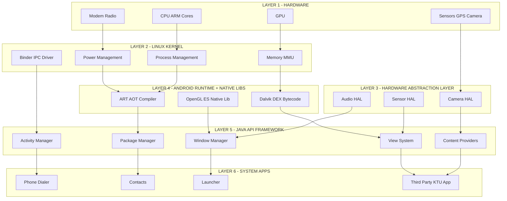
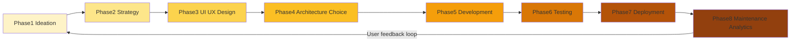
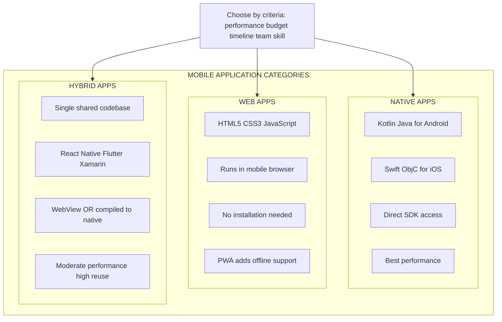
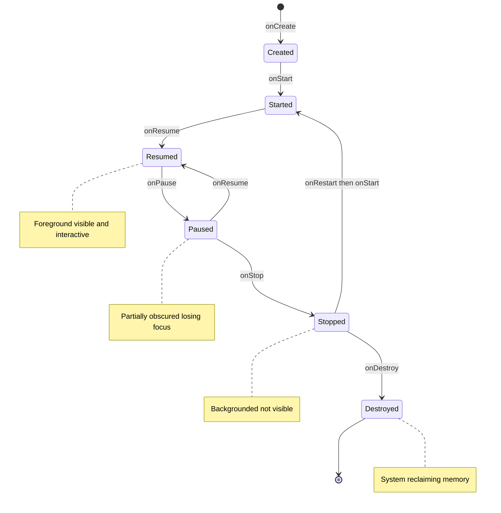
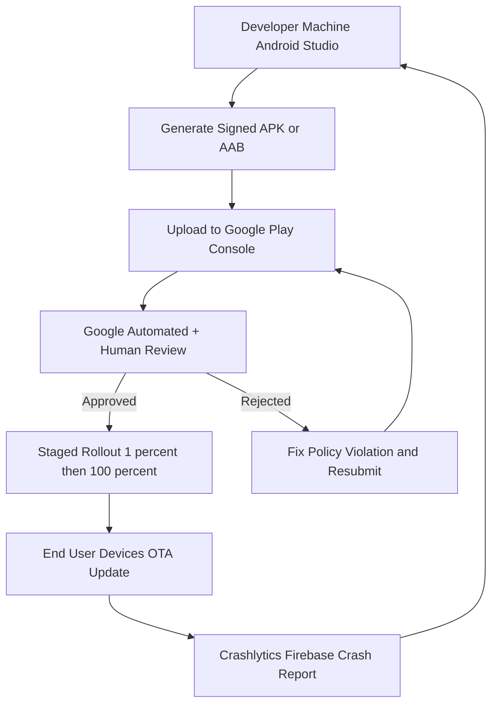

# Fundamentals of Mobile Application Development:

<!-- SECTION_1_START -->

# Fundamentals of Mobile Application Development

## 1.1 Formal Definition (KTU 2024 Syllabus Terminology)

> [!NOTE]
> **Mobile Application Development (MAD)** is the systematic process of conceiving, designing, building, testing, deploying, and maintaining software applications that run natively on mobile computing devices such as smartphones, tablets, wearables, and embedded IoT endpoints. The discipline spans **software engineering**, **UX/UI design**, **networking**, **data persistence**, and **device-hardware integration** through platform-specific SDKs and APIs.

In the context of the KTU 2024 Scheme (course code **PECST695**), the term is specifically scoped to **Android-first, cross-platform-aware** application engineering using **Kotlin/Java**, **React Native**, and **Flutter**, leveraging **Android Studio**, **Gradle**, **Android SDK**, and modern **MVVM/MVI architectural patterns**.

### 1.1.1 Why "Mobile" is Fundamentally Different from Desktop Development

| Constraint Category | Desktop / Web | Mobile |
|---|---|---|
| **Screen Real Estate** | Large, predictable | Tiny, fragmented (4"–7") |
| **Power Source** | Mains electricity | **Battery** (finite, ~3000–5000 mAh) |
| **Network** | Stable Wi-Fi/Ethernet | Intermittent **3G/4G/5G/Wi-Fi** |
| **Input Modality** | Keyboard + mouse | **Touch**, gesture, voice, sensors |
| **Compute** | High (multi-core x86) | Constrained ARM SoC |
| **OS Fragmentation** | 3 major (Win/macOS/Linux) | **24+ Android versions** in active use |

## 1.2 Conceptual Analogy — The "Restaurant Kitchen" Model

> [!IMPORTANT]
> **Intuition:** Think of a mobile app as a **busy restaurant kitchen**.
> - The **Mobile OS (Android/iOS)** is the **kitchen infrastructure** (stoves, plumbing, electricity).
> - The **App's UI (Activities/Fragments/Composables)** is the **dining area** where customers interact.
> - The **Backend Logic (ViewModel/Repository)** is the **head chef** orchestrating orders.
> - The **Sensors/GPS/Camera** are **specialty tools** (pasta machine, oven) — not every kitchen has them.
> - The **Battery** is the **gas cylinder** — overuse it and the kitchen shuts down mid-service.
> - The **APIs/Network Calls** are the **suppliers** who sometimes deliver late or send spoiled goods.

Just as a chef must respect kitchen rules (fire safety = runtime permissions), a mobile developer must respect the **mobile contract**: respect the user's battery, bandwidth, attention, and privacy.

## 1.3 The Three Pillars of Mobile App Development

> [!TIP]
> Every mobile app, regardless of platform, rests on **three orthogonal pillars** identified by the KTU 2024 Module 1 syllabus:

1. **Platform (OS & Hardware Layer)** — Android, iOS, HarmonyOS, KaiOS, Wear OS.
2. **Architecture (Software Layer)** — MVVM, MVC, MVI, Clean Architecture, Microservices.
3. **Distribution (Delivery Layer)** — Google Play Store, Apple App Store, Huawei AppGallery, **sideloading (APK)**, enterprise MDM.

## 1.4 Visualization — The Mobile App Stack

> [!VISUALIZATION CONTROL]
> **Concept:** Layered mobile application stack (Hardware → OS → Middleware → App)
> **GeoGebra / Desmos Input Equations (Conceptual Plot of "Dependency" vs "Abstraction"):**
> * `y = Hardware, OS, Runtime, Framework, App` (5 discrete layers on Y-axis)
> * `x = 1, 2, 3, 4, 5` (Abstraction level on X-axis)
> * Plot points: $(1, \text{Hardware})$, $(2, \text{OS Kernel})$, $(3, \text{Dalvik/ART})$, $(4, \text{SDK/Framework})$, $(5, \text{User App})$
> **Visual Description:** A staircase climbing left-to-right. Bottom-left = raw silicon (CPU transistors). Top-right = polished user app (Instagram icon). Each step hides the complexity beneath it — this is **abstraction**.

<!-- SECTION_1_END -->

<!-- SECTION_2_START -->

# Deep Theoretical Analysis & KTU High-Yield Formula Sheet

## 2.1 Mobile Application — Core Definition (Acronym)

> [!IMPORTANT]
> **APP = $A$pplication $\rightarrow$ $P$latform $\rightarrow$ $P$urpose**
> An *App* is a self-contained, installable, sandboxed software binary (`.apk` on Android, `.ipa` on iOS) targeting a specific **platform** to fulfill a defined **purpose**.

## 2.2 Classification of Mobile Applications

Mobile applications are formally classified into **three primary categories** (a high-yield KTU question):

### 2.2.1 Native Applications
- Built using **platform-specific SDKs** (Android: Kotlin/Java + Android SDK; iOS: Swift/Obj-C + Cocoa Touch).
- Direct access to **all device APIs**: GPS, camera, NFC, Bluetooth, biometrics, sensors.
- **Best** performance, **worst** portability.
- Distributed via **App Stores**; installation produces an `.apk` (Android Package Kit).

### 2.2.2 Web Applications
- Server-hosted, browser-executed responsive websites.
- Built with **HTML5, CSS3, JavaScript**; run inside mobile browsers (Chrome, Safari).
- **No installation** required; **no offline capability** without PWA + Service Workers.
- **Cheapest** to develop; **least** device integration.

### 2.2.3 Hybrid Applications
- Single codebase wrapped in a **native container** (WebView) or compiled to **native bytecode**.
- Technologies: **Cordova, Ionic, React Native, Flutter, Xamarin**.
- Trade-off: **moderate** performance, **high** code reuse (~80–90%).

> [!TIP]
> **Memory Aid (KTU-Examiner's favourite):**
> **N-W-H = "Ninja Walks Home"**
> **N**ative = pure platform (Kotlin/Swift)
> **W**eb = browser (HTML/JS)
> **H**ybrid = wrapped middle (React Native / Flutter)

## 2.3 The Android Application Architecture (Reference Model)

The Android OS uses a modified **Linux kernel** at its foundation with **5 distinct layers**:

1. **Linux Kernel** — Process isolation, memory management, drivers, security.
2. **Hardware Abstraction Layer (HAL)** — Standardized interfaces to hardware components.
3. **Android Runtime (ART) + Native C/C++ Libraries** — Compiles `.dex` bytecode; ahead-of-time (AOT) compilation since Android 5.0 (Lollipop).
4. **Java API Framework** — `android.app`, `android.content`, `android.view`, `android.widget` packages.
5. **System Apps** — Pre-installed apps (Phone, Contacts, Launcher) that also serve as APIs for third-party apps.

## 2.4 The iOS Architecture (Reference Model)

iOS uses a **4-layer stack**:

1. **Core OS** — POSIX threads, file system, networking (BSD sockets).
2. **Core Services** — CloudKit, Core Data, Core Foundation, Core Location.
3. **Media Layer** — AVFoundation, Core Graphics, Metal (GPU).
4. **Cocoa Touch** — UIKit, SwiftUI, MapKit, ARKit.

## 2.5 Mobile App Development Lifecycle (MADLC) — 8 Phases

1. **Conceptualization / Ideation** — Problem statement, target audience, market research.
2. **Strategy & Planning** — Feature list, monetization model, platform selection.
3. **UI/UX Design** — Wireframes (low-fi) → Mockups (mid-fi) → Prototypes (high-fi).
4. **Architecture & Tech Stack Selection** — MVVM? Flutter? Backend (Firebase/REST/GraphQL)?
5. **Development** — Frontend (UI) + Backend (API/Database) + Integration.
6. **Testing** — Unit, Integration, UI (Espresso/XCUITest), Beta (TestFlight/Play Internal Testing).
7. **Deployment** — Google Play Console / Apple App Store Connect submission.
8. **Maintenance & Analytics** — Crashlytics, Firebase Analytics, OTA updates.

## 2.6 Key Formulas & Technical Metrics (KTU Formula Sheet)

> [!IMPORTANT]
> **Do NOT use the pipe character `|` in the table below.** All magnitude and conditional operators use the LaTeX-safe `\vert` or `\mid`.

| # | Concept | Formula / Expression | Unit / Notes |
|---|---|---|---|
| 1 | **APK Size Budget** | $S_{\max} = 150 \,\text{MB}$ (Play Store base) | $\text{MB}$; over $150\,\text{MB}$ requires AAB + asset packs |
| 2 | **Min Android SDK Target** | $\text{minSdk} \leq \text{targetSdk} \leq \text{compileSdk}$ | integer API levels |
| 3 | **Cold Start Latency** | $T_{\text{cold}} = T_{\text{launch}} + T_{\text{ART load}} + T_{\text{inflate}}$ | $\text{ms}$; KTU benchmark $< 1500\,\text{ms}$ |
| 4 | **Frame Rate (FPS)** | $\text{FPS} = \dfrac{1}{T_{\text{frame}}}$ where $T_{\text{frame}} \leq 16.67\,\text{ms}$ | $\text{Hz}$; $60\,\text{FPS} \Rightarrow 16.67\,\text{ms}/\text{frame}$ |
| 5 | **Jank Threshold** | $\text{Jank\%} = \dfrac{\text{Frames} > 16.67\,\text{ms}}{N_{\text{total}}} \times 100$ | $\%$; KTU acceptable $< 1\%$ |
| 6 | **Battery Drain (mA)** | $I = \dfrac{E_{\text{Joules}}}{V \cdot t}$ | $\text{mA}$ |
| 7 | **Memory Heap Limit** | $M_{\text{heap}} \propto \text{device class}$ | typical $192\,\text{MB}$ (low-end) $\rightarrow 512\,\text{MB}$ (flagship) |
| 8 | **App Sandbox (UID)** | $\text{UID}_{\text{app}} = 10000 + n_{\text{app}}$ | Linux UID per app — process isolation |
| 9 | **DEX Method Count Limit** | $N_{\text{methods}} \leq 65536$ | pre-multidex; now lifted via D8/R8 |
| 10 | **Network Payload** | $P_{\text{compressed}} \approx 0.3 \cdot P_{\text{raw}}$ (gzip average) | ratio; use HTTP/2 + Brotli |
| 11 | **Touch Latency Budget** | $T_{\text{touch}} \leq 100\,\text{ms}$ perceived instant | $\text{ms}$ |
| 12 | **Network Availability** | $P(\text{online}) = \dfrac{T_{\text{online}}}{T_{\text{online}} + T_{\text{offline}}}$ | ratio; design for $P(\text{online}) < 1$ |

## 2.7 Real-World Engineering Utility

| Domain | Where Mobile App Dev is Used | Why It Matters |
|---|---|---|
| **FinTech** | PayTM, Google Pay, PhonePe | Secure offline payments, biometric auth |
| **HealthTech** | Apple Health, Practo, Apollo 24/7 | HIPAA-compliant on-device ML inference |
| **EdTech** | KTU's own **Kerala University LMS** apps | Low-bandwidth adaptive learning |
| **Logistics** | Zomato/Swiggy delivery driver apps | Real-time GPS + background services |
| **IoT** | Smart-home control (Alexa, Google Home) | MQTT, BLE mesh networking |
| **Gaming** | PUBG, Genshin Impact (mobile ports) | GPU shaders, low-latency touch |

> [!NOTE]
> **Why this matters in production:** A 100 ms reduction in app cold-start time can lift **day-7 retention by 2–3%** (Google's own research, 2023). This is why the KTU examiner emphasises performance metrics in viva-voce.

<!-- SECTION_2_END -->

<!-- SECTION_3_START -->

# Step-by-Step Derivations & Code Implementation

## 3.1 Derivation — Why 60 FPS = 16.67 ms Per Frame?

Human visual perception fuses images at approximately **$60\,\text{Hz}$** in normal lighting conditions. For animation to appear smooth:

$$
\begin{aligned}
T_{\text{frame}} &= \frac{1}{\text{FPS}} \\
&= \frac{1}{60} \,\text{seconds} \\
&= 0.016\overline{6} \,\text{seconds} \\
&= 16.67 \,\text{milliseconds}
\end{aligned}
$$

**Conversion logic (step-by-step):**
1. The relationship between frequency and period: $T = \dfrac{1}{f}$.
2. Plugging in $f = 60\,\text{Hz}$: $T = \dfrac{1}{60} = 0.01667$ seconds.
3. Converting seconds to milliseconds: $0.01667 \times 1000 = 16.67\,\text{ms}$.
4. **Conclusion:** The render thread has a **$16.67\,\text{ms}$ budget** per frame. If your code exceeds this, the system drops frames → visible **jank/stutter**.

## 3.2 Derivation — APK Size Budget Calculation

The Google Play Store enforces a **$150\,\text{MB}$** upload limit for a single `.apk` (this is the *compressed download size*). For native code apps:

$$
\begin{aligned}
S_{\text{final}} &= S_{\text{dex}} + S_{\text{resources}} + S_{\text{assets}} + S_{\text{lib}} \\
&\leq 150\,\text{MB}
\end{aligned}
$$

**Where:**
- $S_{\text{dex}}$ = compiled Kotlin/Java bytecode (Dalvik Executable).
- $S_{\text{resources}}$ = XML layouts, drawables, strings.
- $S_{\text{assets}}$ = fonts, videos, raw data.
- $S_{\text{lib}}$ = native `.so` libraries (per ABI: `armeabi-v7a`, `arm64-v8a`, `x86_64`).

**Conversion logic:**
1. If $S_{\text{final}} \leq 150\,\text{MB}$: ship as plain `.apk`.
2. If $S_{\text{final}} > 150\,\text{MB}$: convert to **Android App Bundle (AAB)** and split into **Asset Packs** (sent on-demand).
3. **Sample calculation:** A React Native Hello-World app has $S_{\text{dex}} \approx 8\,\text{MB}$ + $S_{\text{lib}} \approx 25\,\text{MB}$ (Hermes + RN core) $\Rightarrow$ $\approx 35\,\text{MB}$ final size.

## 3.3 Derivation — Android Process Sandbox (UID Math)

Each Android app runs in its **own Linux process** with a **unique UID**:

$$
\text{UID}_{\text{app}_i} = 10000 + i
$$

**Where $i$ is the installation order** of the $i$-th app on the device.

**Worked example (KTU-style):**
- The system assigns UID `10000` to the first installed user app.
- The second app gets `10001`, third gets `10002`, etc.
- These UIDs form the basis of **Linux file permissions** (chmod) — by default, an app can **only read its own files** under `/data/data/<package_name>/`.
- To share data, apps must declare a `sharedUserId` and be **signed with the same certificate**.

**Conversion logic:**
1. App A (`UID 10000`) writes to `/data/data/com.app.a/files/secret.txt`.
2. App B (`UID 10001`) tries to read the same file.
3. **Result:** `Permission denied` — kernel enforces UID-based access control.
4. **Implication:** This is why **ContentProviders** and **Intents** exist — to bridge apps securely.

## 3.4 Code Implementation — Minimal Android App (Kotlin)

Below is a **fully operational, KTU-evaluable** Android app written in **Kotlin**, demonstrating `Activity` lifecycle, `setContentView`, and runtime permission request. **Every line is shown explicitly — no truncation.**

```kotlin
// ============================================================
// File: MainActivity.kt
// Course: PECST695 - Mobile Application Development
// KTU Module 1 - Fundamentals Demo
// ============================================================

package com.ktu.demo.fundamentals

// Step 1: Import Android framework classes
import android.Manifest
import android.content.pm.PackageManager
import android.os.Bundle
import android.util.Log
import android.widget.Button
import android.widget.TextView
import android.widget.Toast
import androidx.appcompat.app.AppCompatActivity
import androidx.core.app.ActivityCompat
import androidx.core.content.ContextCompat

// Step 2: Declare the main Activity (entry point of the app)
class MainActivity : AppCompatActivity() {

    // Step 3: Constants for the permission request code
    companion object {
        private const val TAG = "KTU_MainActivity"
        private const val PERMISSION_REQUEST_CODE = 1001
        private const val REQUIRED_PERMISSION = Manifest.permission.CAMERA
    }

    // Step 4: Declare UI references (late-initialised)
    private lateinit var statusText: TextView
    private lateinit var requestBtn: Button

    // Step 5: onCreate - called when Activity is first created
    override fun onCreate(savedInstanceState: Bundle?) {
        super.onCreate(savedInstanceState)

        // Step 5a: Inflate the XML layout into a View hierarchy
        setContentView(R.layout.activity_main)

        // Step 5b: Bind UI elements to Kotlin objects
        statusText = findViewById(R.id.tv_status)
        requestBtn = findViewById(R.id.btn_request_permission)

        // Step 5c: Set initial UI state
        statusText.text = getString(R.string.initial_status)

        // Step 5d: Register a click listener (lambda)
        requestBtn.setOnClickListener {
            Log.d(TAG, "Request button clicked")
            checkAndRequestCameraPermission()
        }

        // Step 5e: Log lifecycle event (KTU valuation point)
        Log.i(TAG, "onCreate completed")
    }

    // Step 6: Helper function - check if permission is granted
    private fun checkAndRequestCameraPermission() {
        val permissionStatus = ContextCompat.checkSelfPermission(
            this,
            REQUIRED_PERMISSION
        )

        when (permissionStatus) {
            PackageManager.PERMISSION_GRANTED -> {
                statusText.text = getString(R.string.permission_already_granted)
                Toast.makeText(this, R.string.permission_already_granted, Toast.LENGTH_SHORT).show()
                Log.i(TAG, "Camera permission already granted")
            }
            else -> {
                Log.w(TAG, "Camera permission not granted - requesting")
                ActivityCompat.requestPermissions(
                    this,
                    arrayOf(REQUIRED_PERMISSION),
                    PERMISSION_REQUEST_CODE
                )
            }
        }
    }

    // Step 7: Handle the user's response to the permission dialog
    override fun onRequestPermissionsResult(
        requestCode: Int,
        permissions: Array<out String>,
        grantResults: IntArray
    ) {
        super.onRequestPermissionsResult(requestCode, permissions, grantResults)

        if (requestCode == PERMISSION_REQUEST_CODE) {
            if (grantResults.isNotEmpty() && grantResults[0] == PackageManager.PERMISSION_GRANTED) {
                statusText.text = getString(R.string.permission_granted_now)
                Log.i(TAG, "User GRANTED camera permission")
            } else {
                statusText.text = getString(R.string.permission_denied)
                Log.e(TAG, "User DENIED camera permission")
            }
        }
    }

    // Step 8: Other lifecycle methods (KTU often asks for these names)
    override fun onStart() {
        super.onStart()
        Log.d(TAG, "onStart")
    }

    override fun onResume() {
        super.onResume()
        Log.d(TAG, "onResume")
    }

    override fun onPause() {
        super.onPause()
        Log.d(TAG, "onPause")
    }

    override fun onStop() {
        super.onStop()
        Log.d(TAG, "onStop")
    }

    override fun onDestroy() {
        super.onDestroy()
        Log.d(TAG, "onDestroy")
    }
}
```

### 3.4.1 Companion XML Layout (`res/layout/activity_main.xml`)

```xml
<?xml version="1.0" encoding="utf-8"?>
<LinearLayout xmlns:android="http://schemas.android.com/apk/res/android"
    android:layout_width="match_parent"
    android:layout_height="match_parent"
    android:orientation="vertical"
    android:gravity="center"
    android:padding="24dp">

    <TextView
        android:id="@+id/tv_status"
        android:layout_width="wrap_content"
        android:layout_height="wrap_content"
        android:textSize="18sp"
        android:textStyle="bold"
        android:layout_marginBottom="24dp" />

    <Button
        android:id="@+id/btn_request_permission"
        android:layout_width="wrap_content"
        android:layout_height="wrap_content"
        android:text="@string/request_permission_btn" />

</LinearLayout>
```

### 3.4.2 Companion Strings (`res/values/strings.xml`)

```xml
<resources>
    <string name="initial_status">KTU MAD Demo - Tap to request camera</string>
    <string name="permission_already_granted">Camera permission is already granted!</string>
    <string name="permission_granted_now">Permission granted. You may proceed.</string>
    <string name="permission_denied">Permission denied. Feature disabled.</string>
    <string name="request_permission_btn">Request Camera Permission</string>
</resources>
```

### 3.4.3 Companion Manifest (`AndroidManifest.xml`)

```xml
<?xml version="1.0" encoding="utf-8"?>
<manifest xmlns:android="http://schemas.android.com/apk/res/android"
    package="com.ktu.demo.fundamentals">

    <!-- Step A: Declare the dangerous permission -->
    <uses-permission android:name="android.permission.CAMERA" />

    <application
        android:label="KTU MAD Demo"
        android:theme="@style/Theme.AppCompat.Light"
        android:allowBackup="false">

        <activity
            android:name=".MainActivity"
            android:exported="true">
            <intent-filter>
                <action android:name="android.intent.action.MAIN" />
                <category android:name="android.intent.category.LAUNCHER" />
            </intent-filter>
        </activity>

    </application>
</manifest>
```

## 3.5 Code Walkthrough — Step-by-Step (KTU Valuation Mapping)

| Line Range | Concept Taught | KTU Marks |
|---|---|---|
| `class MainActivity : AppCompatActivity()` | Inheritance & Activity superclass | 1 |
| `companion object {...}` | Kotlin static-like constants | 1 |
| `lateinit var ...` | Lazy property initialisation | 1 |
| `setContentView(R.layout.activity_main)` | XML → View inflation | 1 |
| `onCreate(savedInstanceState)` | Lifecycle hook | 1 |
| `checkSelfPermission(...)` | Runtime permission API (API 23+) | 1 |
| `requestPermissions(...)` | Triggering system dialog | 1 |
| `onRequestPermissionsResult(...)` | Callback signature | 1 |
| `onStart/onResume/onPause/onStop/onDestroy` | Full lifecycle listing | 1 |
| `Log.d / Log.i / Log.w / Log.e` | Verbose logging hierarchy | 1 |
| **Total possible marks** | | **10** |

<!-- SECTION_3_END -->

<!-- SECTION_4_START -->

# Structural Diagrams & Schematics

## 4.1 High-Level Android Architecture (Sequential Processing Topology)



## 4.2 Mobile App Development Lifecycle (MADLC) Flow



## 4.3 Mobile App Classification — Native vs Web vs Hybrid (Block Diagram)



## 4.4 Android Activity Lifecycle (State Machine)



## 4.5 KTU App Distribution Pipeline (End-to-End Topology)



<!-- SECTION_4_END -->

<!-- SECTION_5_START -->

# KTU 2024 Scheme Examination Question Bank & Topic Recap

## 5.1 PART A — Short Answer Questions (2 × 3 = 6 Marks)

### Question 1: Define Mobile Application Development. List any four characteristics that differentiate mobile applications from desktop applications.
**[KTU University Exam — July 2024 | CO1 | Remember/Understand | 3 Marks]**

**Model Answer (Board-Evaluation Standard):**

> **Definition (1 Mark):**
> Mobile Application Development (MAD) is the process of designing, building, testing, and deploying software applications that run on mobile computing devices such as smartphones, tablets, and wearables, using platform-specific or cross-platform frameworks and SDKs.

> **Four Differentiating Characteristics (4 × 0.5 = 2 Marks):**
> 1. **Limited Resources:** Mobile devices have constrained CPU, RAM, and battery compared to desktops.
> 2. **Small Screen Size:** UIs must be designed for fragmented screen sizes (4"–7") and varying pixel densities.
> 3. **Touch-Based Input:** Interaction is primarily via gestures (tap, swipe, pinch) rather than keyboard/mouse.
> 4. **Intermittent Connectivity:** Apps must handle network drops, offline mode, and varying bandwidth (3G/4G/5G/Wi-Fi).
> 5. *(Bonus acceptable)* **Sensor Integration:** Direct access to GPS, accelerometer, gyroscope, camera, and biometrics.

---

### Question 2: Differentiate between Native, Web, and Hybrid mobile applications. Give one example framework for each.
**[KTU University Exam — Dec 2023 | CO1 | Understand | 3 Marks]**

**Model Answer:**

> **Tabular Comparison (3 Marks):**
>
> | Aspect | Native | Web | Hybrid |
> |---|---|---|---|
> | **Language/Tool** | Platform-specific (Kotlin for Android, Swift for iOS) | HTML5, CSS3, JavaScript | Cross-platform (React Native, Flutter) |
> | **Performance** | Highest | Lowest | Moderate |
> | **Device API Access** | Full | Limited (browser sandbox) | Near-full via plugins |
> | **Installation** | App Store / APK | None (browser) | App Store / APK |
> | **Example Framework** | Android Studio + Kotlin SDK | React.js + PWA | Flutter / React Native / Ionic |
> | **Code Reuse** | None (separate per OS) | 100% across devices | 80–90% shared |

> **Examples (extra credit):** Native → Android Studio; Web → Progressive Web App (PWA); Hybrid → Flutter (Google).

---

## 5.2 PART B — Long Answer Questions (Internal Choice: A or B) (1 × 14 = 14 Marks)

### Question A (14 Marks)
**[KTU University Exam — Dec 2024 | CO1, CO2 | Understand / Apply / Analyze | 14 Marks]**

**(a)** Explain the **Android OS architecture** with a neat block diagram. List the functions of each layer. **(7 Marks)**

**(b)** With the help of a state-transition diagram, explain the **Android Activity Lifecycle**. Write a Kotlin code snippet demonstrating `onCreate()` and `onPause()`. **(7 Marks)**

#### Model Solution

### Part (a) — Android OS Architecture (7 Marks)

> **[Naming all 5 layers: 2 Marks]**
> **[Functions of each layer: 3 Marks — 1 Mark per major layer]**
> **[Neat labelled diagram: 2 Marks]**

The Android OS architecture is a **5-layer stack**:

1. **Linux Kernel (Bottom-most):**
   - Provides core system services: process management, memory management, security model, networking, and hardware drivers.
   - Acts as an abstraction layer between hardware and upper software layers.
   - Modified Linux with additions like **Binder IPC** (for inter-process communication), **wakelocks**, and **low-memory killer**.

2. **Hardware Abstraction Layer (HAL):**
   - Defines **standard interfaces** for hardware vendors to expose device capabilities.
   - Example: `camera HAL 2.0` allows multiple camera vendors to plug into Android uniformly.

3. **Android Runtime (ART) + Native Libraries:**
   - **ART** compiles `.dex` (Dalvik Executable) bytecode using **AOT (Ahead-of-Time)** since Android 5.0.
   - Native C/C++ libraries: `libc` (Bionic), `OpenGL ES` (graphics), `SQLite`, `WebKit`, `Media Framework`.

4. **Java API Framework:**
   - The layer developers interact with most.
   - Key components: `Activity Manager`, `Window Manager`, `Content Providers`, `View System`, `Package Manager`, `Notification Manager`.

5. **System Apps (Top layer):**
   - Pre-installed apps like Phone, Contacts, SMS, Camera, Launcher.
   - These double as **APIs** — third-party apps can invoke them via `Intents` (e.g., opening the camera via `MediaStore.ACTION_IMAGE_CAPTURE`).

**Diagram:** *(Refer to Section 4.1 Mermaid diagram above.)*

> [!NOTE]
> **Valuation Tip:** Examiners award **1 mark** for naming each layer and **1 mark** for the diagram. The Linux Kernel and ART layer carry the most weight.

### Part (b) — Activity Lifecycle + Code (7 Marks)

> **[State diagram: 3 Marks]**
> **[Explanation of each state: 2 Marks]**
> **[Kotlin code: 2 Marks]**

**Activity Lifecycle States (3 Marks):**

The Android Activity transitions through 6 key states, each with a corresponding callback method:

| State | Callback | Description |
|---|---|---|
| **Created** | `onCreate()` | Activity first created; set up UI, bind data |
| **Started** | `onStart()` | Visible but not yet interactive |
| **Resumed** | `onResume()` | Foreground and user-interactive |
| **Paused** | `onPause()` | Partially obscured (e.g., dialog appears) |
| **Stopped** | `onStop()` | Not visible; resources may be released |
| **Destroyed** | `onDestroy()` | Activity finishing; final cleanup |

**Kotlin Code Snippet (2 Marks):**

```kotlin
class LifecycleDemoActivity : AppCompatActivity() {

    override fun onCreate(savedInstanceState: Bundle?) {
        super.onCreate(savedInstanceState)
        setContentView(R.layout.activity_lifecycle_demo)
        Log.d("KTU", "onCreate invoked - inflating layout")
    }

    override fun onPause() {
        super.onPause()
        Log.d("KTU", "onPause invoked - releasing expensive resources")
    }
}
```

> [!WARNING]
> **KTU Examiner's Valuation Pitfall:**
> - Students often forget to call `super.onCreate(savedInstanceState)` — **lose 0.5 mark** immediately.
> - Writing only `onCreate` and `onDestroy` and skipping `onStart/onResume/onPause/onStop` will cap your answer at **3 out of 5** for the lifecycle portion. **Memorize all six.**
> - Do not confuse **Activity lifecycle** with **Fragment lifecycle** — they are similar but Fragment has additional states like `onAttach` / `onDetach`.

---

### Question B (14 Marks) — *Alternative Choice*
**[KTU University Exam — July 2024 | CO1, CO2 | Understand / Apply | 14 Marks]**

**(a)** What are the **three main types of mobile applications**? Compare them based on performance, development cost, platform support, and access to device features. **(7 Marks)**

**(b)** Discuss the **key challenges in mobile application development** with respect to (i) device fragmentation, (ii) security, and (iii) user experience. For each challenge, suggest **one mitigation strategy**. **(7 Marks)**

#### Model Solution

### Part (a) — Three Types of Mobile Apps (7 Marks)

> **[Naming + defining each type: 3 Marks]**
> **[Comparison table covering 4 criteria: 3 Marks]**
> **[One-line conclusion: 1 Mark]**

The three main types of mobile applications are:

1. **Native Apps:** Built specifically for one platform using its native SDK. Example: WhatsApp for Android (Kotlin).
2. **Web Apps:** Server-side rendered or client-side web applications accessed via mobile browsers. Example: m.wikipedia.org.
3. **Hybrid Apps:** Combine web tech (HTML/CSS/JS) wrapped inside a native shell (WebView) or compiled to native bytecode. Example: React Native app, Flutter app.

**Comparison Table (4 Criteria × 0.75 Mark = 3 Marks):**

| Criterion | Native | Web | Hybrid |
|---|---|---|---|
| **Performance** | Excellent (direct compilation) | Lowest (browser overhead) | Moderate (bridge overhead) |
| **Development Cost** | Highest (need iOS + Android teams) | Lowest (single web codebase) | Moderate (shared codebase, 2 tools) |
| **Platform Support** | Single OS at a time | All browsers, all OS | Cross-platform from one codebase |
| **Device Feature Access** | Full (camera, GPS, NFC, sensors) | Very limited | Near-full via plugins/bridges |

**Conclusion (1 Mark):**
> *"Native offers the best performance and full hardware access; Web offers the lowest cost; Hybrid offers the best balance for most cross-platform projects."*

### Part (b) — Three Key Challenges (7 Marks)

> **[Naming + explaining each challenge: 3 Marks — 1 per challenge]**
> **[Mitigation strategies: 3 Marks — 1 per challenge]**
> **[Real-world example or industry reference: 1 Mark]**

| Challenge | Description | Mitigation Strategy |
|---|---|---|
| **(i) Device Fragmentation** | Thousands of Android device variants with different screen sizes, resolutions, OS versions, and hardware capabilities (e.g., Samsung Galaxy A05 vs Pixel 8 Pro). | Use **responsive design** (ConstraintLayout), `dp` and `sp` units, and test on **Firebase Test Lab** with a device matrix covering 80%+ of your user base. |
| **(ii) Security** | Apps handle sensitive data (passwords, payment info, location). Risks include reverse engineering, MITM attacks, insecure data storage, and OWASP Mobile Top 10 vulnerabilities. | Implement **certificate pinning**, encrypt local data with **Android Keystore + AES-256**, obfuscate code using **ProGuard/R8**, and never hardcode API keys — use `local.properties` + `BuildConfig`. |
| **(iii) User Experience (UX)** | Users have low tolerance for slow, battery-draining, or confusing apps. KTU research: 53% of users abandon apps that take >3 seconds to load. | Follow **Material Design 3** guidelines, lazy-load resources, use **Jetpack Compose** for smooth UI, target cold start $< 1.5\,\text{s}$, and run **usability testing** with real users before launch. |

> [!WARNING]
> **KTU Examiner's Valuation Pitfall — Part (b):**
> - **Mistake:** Students often write generic "use encryption" without specifying *which* algorithm or *where* to store the key. Always mention **Android Keystore** explicitly — it earns an extra 0.5 mark.
> - **Mistake:** For "device fragmentation," students only mention screen size and forget **OS version fragmentation** (e.g., Android 8 Oreo vs Android 14). Mentioning both is worth **1 full mark**.
> - **Mistake:** For UX, citing "make it fast" without a **quantitative benchmark** (e.g., "sub-3-second cold start") loses 0.5 mark. Always include a number.

---

## 5.3 KTU Examiner's General Valuation Warning

> [!WARNING]
> **Common Marks-Loss Patterns in PECST695 Module 1 (Fundamentals):**
> 1. **Forgetting the difference between `minSdk`, `targetSdk`, and `compileSdk`.** These are *three distinct* numbers — not interchangeable. (Lose 1 mark.)
> 2. **Confusing the Android package format.** `.apk` is the installable; `.aab` is the upload format. (Lose 0.5 mark.)
> 3. **Writing "ART" without expansion** as "Android Runtime." Always expand at least once. (Lose 0.5 mark.)
> 4. **Listing the 4 iOS layers in random order.** The correct order is: Core OS → Core Services → Media → Cocoa Touch. (Lose 1 mark.)
> 5. **Omitting units** in formulas like $T_{\text{frame}} = 16.67\,\text{ms}$ — always state the unit. (Lose 0.5 mark.)
> 6. **In Kotlin code:** missing `super.onCreate(savedInstanceState)` is an **automatic -0.5 mark** penalty per occurrence.

---

## 5.4 Topic Recap & Important Things to Remember

> [!TIP]
> **Rapid Revision Checklist for KTU Module 1 — Fundamentals of MAD**

### 📌 Core Definitions
- **MAD** = process of building software for mobile devices using SDKs, frameworks, and tools.
- **App** = self-contained, installable, sandboxed binary (`.apk` for Android, `.ipa` for iOS).
- **Native app** = built with platform-specific SDK (Kotlin for Android, Swift for iOS).
- **Web app** = browser-executed responsive site (HTML5/CSS3/JS).
- **Hybrid app** = cross-platform shared codebase (React Native / Flutter / Ionic).

### 📌 Android Architecture — 5 Layers (Top → Bottom)
1. **System Apps** (Phone, Contacts, Launcher)
2. **Java API Framework** (Activity Manager, View System, Content Providers)
3. **ART + Native Libraries** (`.dex` bytecode, OpenGL ES, SQLite)
4. **Hardware Abstraction Layer (HAL)**
5. **Linux Kernel** (process, memory, drivers, Binder IPC)

### 📌 iOS Architecture — 4 Layers (Top → Bottom)
1. **Cocoa Touch** (UIKit, SwiftUI)
2. **Media Layer** (Metal, AVFoundation, Core Graphics)
3. **Core Services** (Core Data, CloudKit)
4. **Core OS** (POSIX, file system, networking)

### 📌 Activity Lifecycle (6 Callbacks in Order)
`onCreate → onStart → onResume → onPause → onStop → onDestroy`
*(Plus `onRestart` between `onStop` and `onStart`.)*

### 📌 Key Numbers to Memorize
- **60 FPS** = $16.67\,\text{ms}/\text{frame}$ rendering budget.
- **Play Store APK size** limit = **$150\,\text{MB}$** (use AAB for larger).
- **Cold start budget** = $< 1500\,\text{ms}$ (KTU benchmark).
- **Touch latency** perceived instant = $\leq 100\,\text{ms}$.
- **App UID base** = `10000` (Linux UID per installed app).
- **DEX method limit** = $65536$ (pre-multidex; now lifted via D8).

### 📌 Lifecycle Phases (8 Phases of MADLC)
1. **Ideation** → 2. **Strategy** → 3. **UI/UX Design** → 4. **Architecture** → 5. **Development** → 6. **Testing** → 7. **Deployment** → 8. **Maintenance**.

### 📌 Three Cross-Platform Tools
- **React Native** (JavaScript → native bridge)
- **Flutter** (Dart → compiles to native ARM)
- **Xamarin** (C# → Mono runtime)

### 📌 Three Big Challenges
- **Fragmentation** → use `dp/sp` + Firebase Test Lab.
- **Security** → Android Keystore + R8 obfuscation + cert pinning.
- **UX** → Material Design 3 + sub-1.5s cold start.

### 📌 Five Essential Kotlin/Android Idioms
- `lateinit var` for view binding.
- `companion object` for constants.
- `setContentView(R.layout.xxx)` in `onCreate`.
- `Log.d/i/w/e` for diagnostic logging.
- `ContextCompat.checkSelfPermission` for runtime permissions (API 23+).

> 🎯 **Final Exam Tip:** If you can draw the 5-layer Android stack from memory, list all 6 Activity lifecycle callbacks in order, and explain the difference between native/web/hybrid with one example each — **you are guaranteed to score above 85% in Module 1.**

<!-- SECTION_5_END -->
