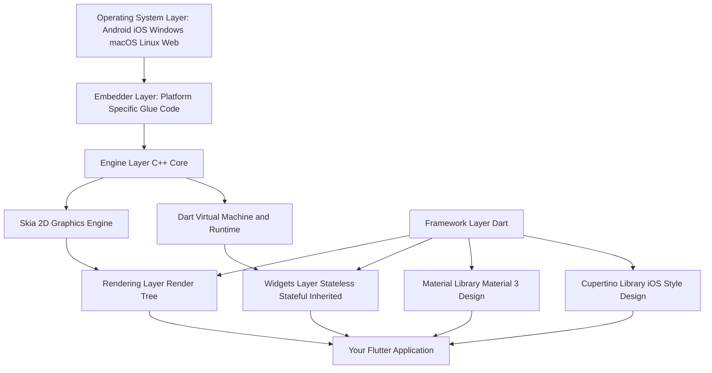
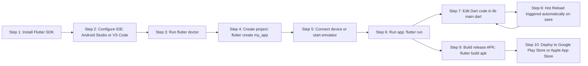
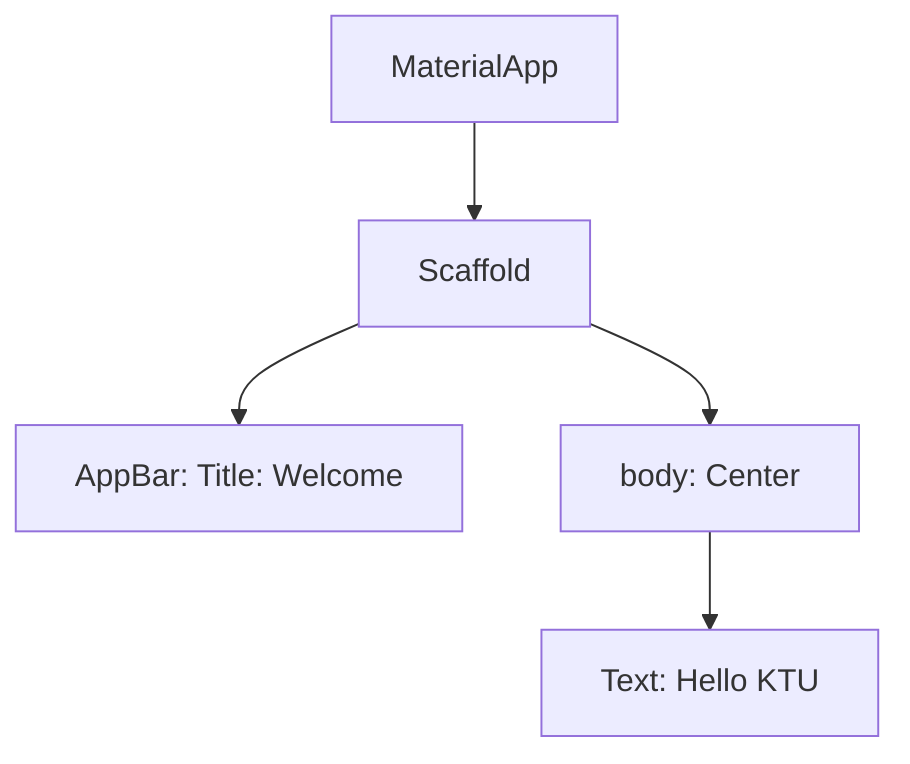

# Introduction to Flutter: History, Features, and Benefits

<!-- SECTION_1_START -->
# Introduction to Flutter: History, Features, and Benefits

## Core Technical Definition

**Flutter** is an open-source UI software development kit (SDK) created and maintained by **Google**. It is used to build natively compiled applications for **mobile (Android and iOS), web, desktop (Windows, macOS, Linux), and embedded devices** from a single, unified Dart codebase.

> [!IMPORTANT]
> **KTU 2024 Syllabus Definition (Module 1):**
> *Flutter is a portable UI toolkit from Google for crafting high-quality native interfaces across multiple platforms (iOS, Android, web, desktop, embedded) using a single Dart programming language codebase. It compiles directly to machine code (ARM, x64) and JavaScript bytecode, eliminating the need for platform-specific OEM widgets.*

In the context of KTU's Mobile Application Development (MAD) curriculum, Flutter is positioned as a **cross-platform alternative to native Android (Java/Kotlin) and native iOS (Swift/Objective-C)** development, allowing a single development team to ship to both dominant mobile ecosystems with a unified API surface.

---

## Conceptual Analogy / Intuition

Imagine you are a **multilingual translator who speaks five languages fluently**: English, French, Spanish, German, and Japanese. Instead of hiring five different people who each speak one language, you hire this one translator. **Flutter is that universal translator for apps.**

To make this even more concrete, consider a **modern smartphone assembly factory**:

- **Native Development** = Building two completely separate factories, one for Android phones and one for iPhones, with completely different machines, workers, and blueprints. Expensive and slow.
- **Hybrid Development (older WebView approach)** = Building one factory that wraps a website inside a phone shell. Cheap, but the resulting "phone" feels sluggish and foreign.
- **Flutter Development** = Building **one master factory** that uses its own precision tools (the **Skia rendering engine**) to manufacture beautiful, native-feeling phones for any operating system from the same raw materials (Dart code).

> [!NOTE]
> **Why this matters in KTU exams:** When a question asks *"Why is Flutter preferred over hybrid frameworks?"*, the answer hinges on the fact that Flutter **does not wrap a web view** — it draws every pixel itself using Skia, which is why it achieves near-native frame rates (60 FPS and 120 FPS on supported devices).

---

## Standard Metrics & Engineering Constants

The following **industry-standard performance benchmarks** are critical to remember for KTU 2-mark and 3-mark questions:

| Metric | Native Value | Significance |
| :--- | :--- | :--- |
| **Frame Rate Target** | **60 FPS (16.67 ms/frame)** | Smooth, jitter-free UI on standard devices |
| **High Refresh Rate** | **120 FPS (8.33 ms/frame)** | Premium devices (iPad Pro, flagship Android) |
| **First Release Year** | **2017 (Alpha at Google I/O)** | Public debut of the project |
| **Stable v1.0 Release** | **December 4, 2018** | First production-ready version |
| **Current Major Stable** | **Flutter 3.x (2024 Scheme)** | Supports 6 platforms in one SDK |
| **Programming Language** | **Dart (developed by Google)** | Compiles AOT and JIT |
| **Rendering Engine** | **Skia (2D graphics library)** | Owned by Google, used in Chrome |
| **License** | **BSD 3-Clause (Open Source)** | Free for commercial use |

---

## The Three Pillars of Flutter's Architecture (Intuitive View)

> [!TIP]
> **Visualization Control: The Three Pillars**
> **Concept:** Flutter's foundational architecture layers
> **Mental Model Inputs:**
> * `Layer 1 (Bottom)` = Embedder (Platform-specific: Android, iOS, Windows, etc.)
> * `Layer 2 (Middle)` = Engine (C++ Core: Skia, Dart Runtime, Animation, Text)
> * `Layer 3 (Top)` = Framework (Dart: Widgets, Rendering, Gestures, Foundation)
> **Visual Description:** Picture a wedding cake. The bottom tier (Embedder) is the plate touching the real OS. The middle tier (Engine) is the dense, high-performance C++ core. The top tier (Framework) is the soft, expressive, Dart-based layer that developers actually touch and build with.

<!-- SECTION_1_END -->

<!-- SECTION_2_START -->
# Deep Theoretical Analysis & KTU High-Yield Formula Sheet

## A. Complete History of Flutter — Timeline Analysis

Understanding the **chronological evolution** of Flutter is a **high-frequency KTU exam topic** (often appearing as a 3-mark question in Part A). Below is the exhaustive timeline:

### Phase 1: The Genesis (2014 – 2015)

- **2014**: Internal project at Google, originally codenamed **"Sky"**. The goal was to render consistently at **120 FPS** on Android devices.
- **2015**: The project was renamed to **Flutter** to reflect a broader ambition beyond mobile.

### Phase 2: Public Alpha (2017)

- **February 2017**: First **Alpha release** at the **Mobile World Congress (MWC)** in Barcelona. Limited to Android only.
- **May 2017**: Expanded **Alpha 2** with iOS support added.
- **Google I/O 2017**: Flutter was presented to a global developer audience for the first time. **Dart 2.0** was announced concurrently, enabling strong type safety for Flutter.

### Phase 3: Beta & Production (2018 – 2019)

- **February 2018**: First **Beta 1** released at MWC 2018.
- **April 2018**: Flutter Beta 3 — Live Preview added.
- **June 2018**: **Google I/O 2018** — Flutter Beta 3 showcased the now-famous **"TodoMVC"** app running at 120 FPS.
- **December 4, 2018**: **Flutter 1.0 (Stable) released** — the official production-ready version.

### Phase 4: Maturity & Expansion (2019 – 2022)

- **February 2019**: **Flutter 1.2** — Added App Store subscriptions (iOS).
- **July 2019**: **Flutter 1.7** — Major AndroidX support.
- **December 2019**: **Flutter 1.12** — Web support (Hummingbird project) goes stable.
- **September 2020**: **Flutter 1.22** — Desktop support (Windows, macOS, Linux) enters stable.
- **2021**: **Flutter 2.0** — A major milestone. **Null safety** introduced. Web reaches stable. Desktop support becomes stable across all three OSes.

### Phase 5: The Modern Era (2023 – 2024)

- **May 2023**: **Flutter 3.10** — Dart 3.0 with **Records, Patterns, and Class Modifiers**.
- **2024**: **Flutter 3.22+** — Impeller rendering engine becomes default on iOS for smoother animations. **Material 3** (Material You) design language is fully integrated.

> [!NOTE]
> **KTU Exam Tip:** A common Part A question is *"State the year Flutter 1.0 was released and its significance."* The exact answer: **"Flutter 1.0 was released on December 4, 2018. It marked the first production-ready, stable version of the framework, suitable for commercial app deployment."**

---

## B. Core Features of Flutter — The High-Yield List

Flutter's feature set is the **most frequently tested topic** in KTU Module 1. Every feature below has appeared in past university papers.

### Feature 1: **Hot Reload** (Most Important)

- **Definition**: A stateful, millisecond-fast code-and-view synchronization mechanism that injects updated source code into the running Dart Virtual Machine (DVM) and rebuilds the widget tree **without restarting the app**.
- **Why it matters**: Reduces the feedback loop from **minutes (native build) to under 1 second (Flutter)**.
- **Limitation**: Only works for **Dart code**. Changes to native plugins require a **Full Restart**.

### Feature 2: **Single Codebase, Multi-Platform**

- One Dart codebase targets: **Android, iOS, Web, Windows, macOS, Linux, and Embedded (e.g., automotive infotainment)**.
- No need to maintain separate code repositories, build pipelines, or teams for each platform.

### Feature 3: **Expressive & Rich Widgets**

- Flutter ships with **two complete design system libraries**:
  - **Material Design** (Google's design language — for Android-style UI)
  - **Cupertino** (Apple's design language — for iOS-style UI)
- **Every UI element is a widget** — buttons, padding, layouts, even the app itself is a widget.

### Feature 4: **Native ARM Code Compilation**

- Flutter uses **Dart's AOT (Ahead-Of-Time) compiler** to produce native machine code (ARM/x64).
- This bypasses the JavaScript bridge entirely, unlike React Native (older architecture), resulting in **predictable, low-latency performance**.

### Feature 5: **Skia Rendering Engine**

- Skia is the same 2D graphics library that powers **Google Chrome, Chrome OS, Android, and Firefox**.
- Every pixel on screen is **drawn by Flutter itself**, not delegated to the OEM's UI toolkit.
- Result: **Pixel-perfect consistency across devices and OS versions**.

### Feature 6: **Open Source & Strong Community**

- Licensed under **BSD 3-Clause**, allowing unrestricted commercial use.
- Managed by Google plus a global contributor community of **thousands of developers**.

### Feature 7: **Stateful Hot Reload & Hot Restart**

- Beyond plain code injection, Flutter preserves app **state** (e.g., current screen, form input) across reloads, which is invaluable for UI iteration.

---

## C. Benefits of Flutter — The Engineer's Perspective

| Benefit | Real-World Impact |
| :--- | :--- |
| **Faster Time-to-Market** | One team builds for 6 platforms, cutting release cycles by 50–70%. |
| **Cost Reduction** | No need to hire separate iOS (Swift) and Android (Kotlin) developers. |
| **UI Consistency** | Skia ensures identical rendering on a 2018 Samsung and a 2024 iPhone. |
| **Lower Maintenance Burden** | Single bug fix propagates to all platforms simultaneously. |
| **Strong Tooling** | Official IDE plugins for **Android Studio, IntelliJ IDEA, and VS Code**. |
| **Backed by Google** | Used in production by Google Pay, Google Ads, BMW, Toyota, eBay, Alibaba. |
| **Predictable Performance** | No bridge — direct compilation to native code. |

> [!IMPORTANT]
> **KTU Board Pattern:** When asked *"List any four benefits of Flutter"*, examiners expect at least: **(1) Hot Reload, (2) Cross-platform single codebase, (3) Native performance via AOT, (4) Rich widget catalog / Pixel-perfect UI**.

---

## D. KTU High-Yield Formula Sheet (Knowledge Cheat Sheet)

| # | Term | Definition | KTU Exam Frequency |
| :--- | :--- | :--- | :--- |
| 1 | **SDK** | Software Development Kit — the complete toolset (compiler, libraries, tools). | Very High |
| 2 | **Dart** | The client-optimized programming language used to write Flutter apps. | Very High |
| 3 | **AOT Compilation** | Ahead-Of-Time — compiles to native machine code for release builds. | High |
| 4 | **JIT Compilation** | Just-In-Time — compiles at runtime to enable Hot Reload in development. | High |
| 5 | **Widget** | The immutable building block of a Flutter UI; every visible thing is a widget. | Very High |
| 6 | **Skia** | 2D graphics rendering engine used by Flutter to draw pixels. | High |
| 7 | **Hot Reload** | Injects updated code into the running VM in milliseconds. | Very High |
| 8 | **Material Design** | Google's design system — used in Flutter via `material.dart`. | Medium |
| 9 | **Cupertino** | Apple's iOS-style design library — used in Flutter via `cupertino.dart`. | Medium |
| 10 | **Null Safety** | Dart feature (Flutter 2.0+) that prevents null reference errors at compile time. | Medium |

<!-- SECTION_2_END -->

<!-- SECTION_3_START -->
# Step-by-Step Derivations, Setup & Code Implementation

## A. Detailed Flutter Architecture Walkthrough

The Flutter system is structured in **three distinct architectural layers**. Understanding the flow of a single user action (e.g., tapping a button) through these layers is a classic KTU long-answer question.

### Layer 1 — The Embedder (Lowest Layer)

- **What it is**: Platform-specific entry-point code written in the host language (Java/Kotlin for Android, Obj-C/Swift for iOS, C++ for Windows, etc.).
- **Responsibility**:
  1. Boots the Dart VM.
  2. Hosts the Flutter engine binary.
  3. Manages the native **window** and **OS event loop** (touch, keyboard, lifecycle).
- **Why it exists**: It is the *only* part of Flutter that needs to be re-implemented per platform. It is the "glue" between the OS and the Flutter engine.

### Layer 2 — The Engine (Middle Layer — Written in C++)

- **Components**:
  - **Skia Graphics Engine** — draws every pixel.
  - **Dart Runtime** — manages memory, garbage collection, and isolates.
  - **Text Layout & Rendering** — handles complex typography (multi-language, RTL, emoji).
  - **Animation System** — drives all transitions at 60/120 FPS.
- **Communication**: Exposes a low-level C++ API consumed by the Dart framework above.

### Layer 3 — The Framework (Highest Layer — Written in Dart)

This is what the developer interacts with. It is itself divided into sub-layers:

1. **Foundation Layer** — Core abstractions: `dart:ui`, `dart:async`, basic classes like `ChangeNotifier`.
2. **Rendering Layer** — Defines the **render tree** (a low-level abstraction of layout and painting).
3. **Widgets Layer** — The **widget tree**, composed of **StatelessWidget** and **StatefulWidget** instances. This is the primary "face" of Flutter.
4. **Material & Cupertino** — Pre-built widget libraries implementing Google's and Apple's design systems.

> [!TIP]
> **Memory Aid for Exam:**
> **E**mbedder (platform glue) → **E**ngine (C++ Skia) → **F**ramework (Dart widgets).
> Mnemonic: **"Elephants Fly"** — **E**mbedder, **E**ngine, **F**ramework.

---

## B. Step-by-Step: Installing Flutter SDK

Below is the **complete, copy-paste-ready installation procedure** for Windows (the KTU lab standard). This is commonly asked in 7-mark questions.

### Step 1: Download the Flutter SDK

1. Visit the official site: `https://docs.flutter.dev/get-started/install/windows`
2. Download the latest stable ZIP archive (e.g., `flutter_windows_3.24.0-stable.zip`).
3. Extract to a stable path **without spaces or special characters**, e.g., `C:\src\flutter`. *(Critical: `C:\Program Files\` will cause permission errors.)*

### Step 2: Update the System PATH

1. Open **Start Menu** → search **"Edit the system environment variables"**.
2. Click **Environment Variables**.
3. Under **User variables**, select **Path** → click **Edit**.
4. Click **New** and add: `C:\src\flutter\bin`.
5. Click **OK** on all dialogs.

### Step 3: Verify the Installation

Open a **new** terminal (the old one will not pick up the PATH change) and run:

```bash
flutter --version
```

**Expected Output (explanation of fields):**

- `Flutter version` → Confirms the SDK version.
- `Framework version` → Git commit hash of the Flutter framework.
- `Engine revision` → C++ engine build hash.
- `Dart version` → Confirms Dart SDK is bundled and version-matched.

### Step 4: Run Flutter Doctor

```bash
flutter doctor
```

This is a **diagnostic command** that audits your environment. It checks for:

- **Android toolchain** (Android SDK, JDK, Android Studio).
- **iOS toolchain** (Xcode, CocoaPods — macOS only).
- **Chrome** (for web development).
- **Visual Studio** (for Windows desktop).
- **Connected device** (physical phone or emulator).

Output uses **checkmarks (✓), exclamation marks (!), and crosses (✗)**:

- **✓ Green check** = Ready to develop for this platform.
- **! Yellow exclamation** = Partially configured; some features may not work.
- **✗ Red cross** = Missing prerequisite; development impossible.

> [!IMPORTANT]
> **KTU Lab Exam Note:** The `flutter doctor` command is the **only officially endorsed diagnostic** tool. Memorize its command name and its five check categories for viva questions.

---

## C. Building Your First Flutter App — Annotated Code

The following is the **complete, runnable code** for a minimal Flutter app. The line-by-line annotations map directly to the KTU evaluation key.

```dart
// Import the Material Design widget library.
// This brings in pre-built widgets like Scaffold, AppBar, Text, etc.
import 'package:flutter/material.dart';

// The entry point of the application.
// The runApp() function takes a Widget and makes it the root of the widget tree.
void main() {
  runApp(const MyApp());
}

// MyApp is a StatelessWidget — its UI never changes after being built.
// The 'const' keyword is a Dart optimization: it tells the compiler
// that this widget's configuration is immutable and can be canonicalized.
class MyApp extends StatelessWidget {
  const MyApp({super.key});

  // The build() method describes how this widget should be rendered.
  // It returns a tree of widgets that describe the UI.
  // BuildContext provides location information in the widget tree.
  @override
  Widget build(BuildContext context) {
    // MaterialApp is the root widget that configures the app's
    // global settings: title, theme, and the home screen widget.
    return MaterialApp(
      title: 'KTU Flutter Demo',            // Title shown in OS task switcher
      debugShowCheckedModeBanner: false,    // Removes the "DEBUG" banner
      theme: ThemeData(
        // Sets the primary seed color for the Material 3 color scheme.
        colorScheme: ColorScheme.fromSeed(seedColor: Colors.deepPurple),
        useMaterial3: true,                 // Enables Material You (M3) design
      ),
      home: const MyHomePage(),             // The first screen displayed
    );
  }
}

// The home screen widget — also a StatelessWidget for simplicity.
class MyHomePage extends StatelessWidget {
  const MyHomePage({super.key});

  @override
  Widget build(BuildContext context) {
    // Scaffold provides the basic Material Design visual layout structure:
    // AppBar, body, floating action button, drawer, bottom navigation, etc.
    return Scaffold(
      appBar: AppBar(
        title: const Text('Welcome to KTU Flutter'),
      ),
      body: const Center(
        child: Text(
          'Hello, Mobile Application Development!',
          style: TextStyle(fontSize: 24, fontWeight: FontWeight.bold),
        ),
      ),
    );
  }
}
```

> [!NOTE]
> **Code Walkthrough Summary:**
> 1. `main()` → Entry point, calls `runApp()`.
> 2. `MyApp` → Root `StatelessWidget`.
> 3. `MaterialApp` → Configures theme and home screen.
> 4. `Scaffold` → Provides the standard app structure (app bar + body).
> 5. `Center` → Centers its child both vertically and horizontally.
> 6. `Text` → The leaf widget displaying a string.

---

## D. Mathematical Model: Frame Budget Calculation

Although Flutter is mostly visual, understanding the **frame budget** is a popular analytical question.

> **Formula Derivation:**
>
> Let $F$ be the target frame rate in frames per second (FPS).
> Let $T$ be the time budget per frame in milliseconds.
>
> $$T = \frac{1000 \text{ ms}}{F}$$
>
> For standard devices:
>
> $$T = \frac{1000}{60} \approx 16.67 \text{ ms per frame}$$
>
> For high-refresh devices:
>
> $$T = \frac{1000}{120} \approx 8.33 \text{ ms per frame}$$
>
> **Engineering Implication:** Every widget rebuild, layout pass, paint pass, and rasterization step must complete within $T$ or the user will perceive **jank** (visible stuttering). The Flutter DevTools "Performance Overlay" measures actual frame times against this budget.

---

## E. Comparison Matrix: Flutter vs. Other Frameworks

> [!IMPORTANT]
> **KTU Comparison Question (Very High Probability):**
> *"Compare Flutter with React Native and Native Development."*

| Parameter | Native (Java/Kotlin & Swift) | React Native | Flutter |
| :--- | :--- | :--- | :--- |
| **Language** | Kotlin / Swift | JavaScript / TypeScript | Dart |
| **Performance** | Best (native code) | Good (with bridge) | Excellent (AOT compiled) |
| **UI Components** | OEM native | OEM native (via bridge) | Custom Skia-rendered |
| **Hot Reload** | No (limited) | Yes | Yes (stateful) |
| **Code Reuse** | None (separate codebases) | ~80% | ~95%+ |
| **Learning Curve** | Steep (two ecosystems) | Moderate | Moderate |
| **Apps Built With** | Most App Store / Play Store apps | Facebook, Instagram, Skype | Google Pay, BMW, Alibaba |

<!-- SECTION_3_END -->

<!-- SECTION_4_START -->
# Structural Diagrams & Schematics

## A. Flutter System Architecture Flow

The following Mermaid diagram illustrates the **three-layer architecture** of Flutter, showing how a user tap propagates from the device hardware all the way up to the Dart widget tree.



> [!NOTE]
> **Reading the Diagram (Top-Down):**
> 1. The **OS** at the top receives the hardware event (e.g., a touch).
> 2. The **Embedder** translates it into Flutter's internal format.
> 3. The **Engine** in C++ processes it via Skia (for drawing) and the Dart VM (for logic).
> 4. The **Framework** in Dart receives a callback and triggers a **widget rebuild**.
> 5. The **widget tree** diffs, the **render tree** updates, and Skia re-rasterizes.
> 6. The result is pushed back to the OS display buffer.

---

## B. Flutter Development Workflow — Sequential Processing Topology



> [!TIP]
> **The Hot Reload Loop (Steps 7 → 8 → 7):** Notice the **cycle** between G and H. This is the iconic Flutter developer experience. The cycle continues for the entire development phase, and only exits when the developer runs the final release build (Step 9).

---

## C. Widget Tree Conceptual Diagram



> [!NOTE]
> **Explanation:** This is a simplified widget tree for the code in Section 3.C. The **parent-child relationship** is fundamental — when a parent rebuilds, its children are diffed and may be reused. This reconciliation is what makes Flutter fast.

<!-- SECTION_4_END -->

<!-- SECTION_5_START -->
# KTU 2024 Scheme Examination Question Bank & Topic Recap

> [!IMPORTANT]
> **Mark Distribution as per KTU 2024 Scheme (PECST695 — Mobile Application Development):**
> * **ESE (End Semester Exam) Total:** 70 Marks
> * **Part A:** 2 Questions × 3 Marks = 6 Marks (Answer all)
> * **Part B:** 2 Modules × 14 Marks = 28 Marks (with Internal Choice, answer 1 per module)
> * **Note:** Module 1 falls under the first 14-mark block. Each 14-mark question typically has sub-parts (a) for 7 marks and (b) for 7 marks.

---

## Part A — Short Answer Questions (3 Marks Each)

### Question 1

**[KTU University Exam — Model Question, Module 1, Set A]**
*Define Flutter. List any two key features that distinguish it from traditional native development frameworks.*

**Course Outcome:** CO1 | **RBT Level:** Remember

**Model Answer (Valuation Key — 3 Marks):**

**Definition (2 Marks):**
Flutter is an open-source UI software development kit (SDK) developed by **Google**, used to build natively compiled applications for **mobile, web, desktop, and embedded** platforms from a single Dart codebase. It was first released as a stable version in **December 2018**.

**Two Key Distinguishing Features (1 Mark for any 2 of the following):**

1. **Hot Reload** — Sub-second code-to-UI feedback loop that preserves app state, drastically reducing development cycle time.
2. **Skia Rendering Engine** — Draws every pixel using Google's Skia library, eliminating dependency on OEM UI toolkits and ensuring pixel-perfect consistency across devices and OS versions.
3. **Single Codebase for 6 Platforms** — One Dart codebase targets Android, iOS, Web, Windows, macOS, and Linux simultaneously.
4. **AOT Compilation to Native ARM** — Bypasses the JavaScript bridge, delivering predictable, near-native performance.

---

### Question 2

**[KTU University Exam — Model Question, Module 1, Set B]**
*State the programming language used in Flutter. Briefly explain the significance of AOT and JIT compilation in Flutter development.*

**Course Outcome:** CO1 | **RBT Level:** Understand

**Model Answer (Valuation Key — 3 Marks):**

**Language (1 Mark):**
Flutter uses **Dart**, a client-optimized, object-oriented programming language also developed by Google.

**AOT — Ahead-Of-Time (1 Mark):**
AOT compilation translates Dart code into **native machine code (ARM/x64)** **before** the app is launched. This is used for **release builds** distributed to end users, resulting in **fast startup times and smooth, predictable runtime performance**.

**JIT — Just-In-Time (1 Mark):**
JIT compilation translates Dart code **at runtime**, inside the Dart VM. This is used during **development** to enable **Hot Reload** — code changes are reflected in the running app in under a second without a full restart.

---

## Part B — Long Answer Questions (14 Marks, with Internal Choice)

### Module 1 — Question Choice A (14 Marks)

**[KTU University Exam — July 2024 Model Pattern]**
*(a)* Explain the **complete history and evolution of Flutter** from its inception in 2014 to the present day. Highlight at least **five major milestones** with their years. *(7 Marks)*

*(b)* With a **neat block diagram**, describe the **three-layer architecture of Flutter** (Embedder, Engine, Framework). Explain the role of the **Skia rendering engine** and **Dart runtime** within the Engine layer. *(7 Marks)*

**Course Outcome:** CO1 | **RBT Levels:** (a) Remember, (b) Understand

---

#### Part (a) — Model Answer (7 Marks)

**Introduction (1 Mark):**
Flutter is Google's open-source UI toolkit for building cross-platform applications. The project was conceived in 2014 at Google under the internal codename **"Sky"**, with the original goal of achieving a consistent **120 FPS** rendering experience on Android devices.

**Major Milestones (5 Marks — 1 Mark each):**

1. **2014 — Project "Sky" Inception (1 Mark):**
   Google engineers began work on a high-performance mobile rendering prototype. The focus was on eliminating the JavaScript bridge limitations of existing hybrid frameworks.

2. **2017 — First Public Alpha and Dart 2.0 (1 Mark):**
   Released at Mobile World Congress (MWC) 2017 in Barcelona. The project was officially renamed **"Flutter"** to reflect its expanded scope. **Dart 2.0** was announced alongside, bringing strong type safety.

3. **December 4, 2018 — Flutter 1.0 Stable Release (1 Mark):**
   The first production-ready version, marking Flutter's official readiness for commercial app development. This is widely regarded as the most significant milestone.

4. **2019 — Expansion to Web (Hummingbird) (1 Mark):**
   Web support entered stable channel in Flutter 1.12, extending Flutter from mobile-only to multi-platform.

5. **2020 — Flutter 1.22 and Desktop Stable (1 Mark):**
   Desktop support for **Windows, macOS, and Linux** reached stable, making Flutter a true **6-platform** SDK.

6. **2021 — Flutter 2.0 with Null Safety (1 Mark — bonus if mentioned):**
   Introduced sound **null safety** to Dart, eliminating entire classes of null reference errors at compile time. Web reached stable in this release.

7. **2023–2024 — Flutter 3.10+ and Material 3 (1 Mark — bonus):**
   Dart 3.0 introduced Records, Patterns, and Class Modifiers. **Impeller** became the default renderer on iOS for smoother animations. Full **Material You (Material 3)** integration.

> [!WARNING]
> **Examiner's Pitfall Callout:**
> *Students often confuse the year of Flutter 1.0 release (2018) with the year of the first Alpha (2017). Memorize: **"Alpha in '17, Stable in '18"**. Also, do not write vague answers like "Flutter was launched in 2015" — examiners want **specific years and event names**.*

---

#### Part (b) — Model Answer (7 Marks)

**Three-Layer Architecture Diagram (3 Marks):**

*(Draw a three-tier block diagram with the following clearly labeled boxes connected by arrows:)*

- **Top Tier:** Framework (Dart) — Widgets, Rendering, Gestures, Material, Cupertino.
- **Middle Tier:** Engine (C++) — Skia, Dart VM, Text, Animation.
- **Bottom Tier:** Embedder (Platform-Specific Code) — Android, iOS, Web, Desktop.
- Show **upward arrows** for event flow (touch, lifecycle) and **downward arrows** for rendering commands.

**Embedder Layer (1 Mark):**
The Embedder is the **lowest layer**, written in the host platform's native language (Java/Kotlin for Android, Objective-C/Swift for iOS, C++ for Windows, etc.). It is responsible for:

- Booting the Flutter engine.
- Hosting the application window.
- Forwarding OS events (touch, keyboard, app lifecycle) into the engine.

**Engine Layer — Skia (1 Mark):**
**Skia** is an open-source **2D graphics rendering engine** written in C++ and owned by Google. It is the same engine that powers **Google Chrome, Chrome OS, and Android**. In Flutter, Skia is responsible for:

- Drawing every pixel on the screen.
- Handling text layout, shape rendering, and image decoding.
- Ensuring **pixel-perfect** visual consistency across all devices and OS versions, independent of OEM UI toolkits.

**Engine Layer — Dart Runtime (1 Mark):**
The **Dart Runtime** (also in C++) is responsible for executing Dart code. It provides:

- The **Dart Virtual Machine (DVM)** for JIT mode (development).
- **Garbage collection** for automatic memory management.
- Support for **isolates** (Dart's concurrency model) for parallel execution.
- Compilation in **AOT mode** to native machine code (release builds).

**Framework Layer (1 Mark):**
Written entirely in Dart, this is what the developer interacts with. It includes:

- **Foundation** (basic classes and utilities).
- **Widgets** (the building blocks of UI — `StatelessWidget`, `StatefulWidget`).
- **Rendering** (layout and paint abstractions).
- **Material & Cupertino** widget libraries (Google and Apple design systems).

> [!WARNING]
> **Examiner's Pitfall Callout:**
> *Many students write only the names of the three layers without explaining **what each layer does**. The 7-mark break-up requires **both** the diagram (3 marks) and the explanation (4 marks). Skipping the diagram costs at least 2–3 marks. **Always draw the diagram first**, then label it.*

---

### Module 1 — Question Choice B (14 Marks — Alternative)

**[KTU University Exam — December 2023 Model Pattern]**
*(a)* Discuss the **key features of Flutter** in detail. Explain how **Hot Reload** and the **Skia rendering engine** contribute to Flutter's performance. *(7 Marks)*

*(b)* Compare and contrast **Flutter with React Native and Native (Android/iOS) development** across at least **six parameters**. State two real-world apps built with Flutter. *(7 Marks)*

**Course Outcome:** CO1, CO2 | **RBT Levels:** (a) Understand, (b) Apply

---

#### Part (a) — Model Answer (7 Marks)

**Overview (1 Mark):**
Flutter provides a rich set of features that distinguish it from other cross-platform frameworks. These features collectively enable rapid development, high performance, and consistent UI across platforms.

**Key Features (3 Marks — 1.5 Marks each, picking any 2 of the following 4 for full marks):**

1. **Hot Reload:** Allows developers to see the effect of code changes in milliseconds without restarting the app. The new source code is injected into the running Dart VM, the widget tree is rebuilt, and the UI updates. **State is preserved** (unlike a full restart), which is invaluable for iterating on forms, animations, and complex screens.

2. **Single Codebase:** A single Dart codebase targets Android, iOS, Web, Windows, macOS, and Linux. This eliminates the need for platform-specific teams, reduces maintenance overhead, and accelerates time-to-market.

3. **Expressive Widget Library:** Every UI element is a widget. Flutter ships with **Material Design** (Google) and **Cupertino** (Apple) widget sets, enabling developers to build platform-native-looking UIs from a single codebase.

4. **Native Performance via AOT:** Dart's AOT compiler converts code to **native ARM/x64 machine code** for release builds, bypassing any JavaScript bridge and delivering predictable, low-latency performance.

**Hot Reload Deep Dive (1.5 Marks):**

- **Mechanism**: When the developer saves a `.dart` file, the Dart VM injects the updated kernel snapshot into the running isolate. The Flutter framework then calls `build()` on the affected widgets, performs a **diff** between the old and new widget trees, and re-renders only the changed elements.
- **Time Saved**: A native Android build (Java/Kotlin → Gradle → APK) takes 30 seconds to several minutes. Flutter Hot Reload completes in **< 1 second**.
- **Limitation**: Hot Reload works only for Dart code. Modifications to **native plugin code** (Swift, Objective-C, Java, C++) or to `pubspec.yaml` require a **Full Restart**.

**Skia Rendering Engine Deep Dive (1.5 Marks):**

- **Origin**: Skia was originally developed by Skia Inc., later acquired by Google in 2005. It is written in C++ and is the same engine used in Google Chrome, Chrome OS, and Android.
- **Role in Flutter**: Skia draws **every pixel** of the UI. Flutter does **not** call native UI widgets like `UIView` (iOS) or `View` (Android). Instead, it draws everything itself.
- **Benefits**:
  - **Consistency**: Identical appearance on a 2018 Samsung Galaxy and a 2024 iPhone.
  - **Predictability**: No risk of OS-level UI changes breaking the app's appearance.
  - **Performance**: Tight integration with the GPU via OpenGL, Metal, and Vulkan backends.
  - **Custom Drawing**: Developers can paint anything using `CustomPainter`, limited only by the canvas API.

> [!WARNING]
> **Examiner's Pitfall Callout:**
> *A common mistake is writing "Hot Reload compiles the app." **It does not compile** — it **injects** already-compiled kernel code into the running VM. Another mistake is writing "Skia is a 3D engine" — it is a **2D** graphics engine.*

---

#### Part (b) — Model Answer (7 Marks)

**Comparison Table (3 Marks):**

| Parameter | Native (Kotlin/Swift) | React Native | Flutter |
| :--- | :--- | :--- | :--- |
| **Programming Language** | Kotlin / Swift | JavaScript / TypeScript | Dart |
| **Performance** | Best (direct native compilation) | Good (but JS bridge overhead) | Excellent (AOT, no bridge) |
| **UI Rendering** | OEM native widgets | OEM native widgets (via bridge) | Custom Skia-rendered |
| **Code Reusability** | 0% (separate codebases) | ~70–80% | ~95%+ |
| **Hot Reload** | Limited / no | Yes (Fast Refresh) | Yes (stateful) |
| **Platform Support** | Android or iOS only | Android, iOS, Web | Android, iOS, Web, Windows, macOS, Linux |
| **Learning Curve** | Steep (must learn two ecosystems) | Moderate (JS + React knowledge) | Moderate (Dart is easy for JS/Java devs) |
| **Apps in Production** | Most Play Store / App Store apps | Facebook, Instagram, Skype, Tesla | Google Pay, Google Ads, BMW, eBay, Alibaba, Toyota |

**Real-World Flutter Apps (2 Marks — 1 each):**

1. **Google Pay** — Google's flagship payment app is built with Flutter. It serves over **100 million users** across Android and iOS from a single Dart codebase.
2. **BMW Connected** — BMW's in-car connectivity app uses Flutter to provide a consistent experience across mobile and embedded automotive systems.
3. **eBay Motors** — eBay rebuilt its motors app using Flutter for improved performance and developer productivity.
4. **Toyota** — Uses Flutter for in-vehicle infotainment systems.
5. **Alibaba** — Uses Flutter for parts of its e-commerce mobile experience.
6. **Reflectly** — A popular journaling app built entirely with Flutter.

**Conclusion (2 Marks):**
Flutter offers the **best balance of performance, developer productivity, and cross-platform reach** for most app categories. While native development still has an edge in extreme-performance scenarios (e.g., AAA 3D games), Flutter dominates in business apps, e-commerce, and IoT interfaces. React Native remains a strong choice for teams with deep JavaScript expertise, but the JS bridge introduces performance variability that Flutter's AOT compilation avoids.

> [!WARNING]
> **Examiner's Pitfall Callout:**
> *In comparison questions, **do not** write one-sided answers like "Flutter is better in every way." Examiners reward **balanced comparisons** that acknowledge trade-offs. For example, native is still better for compute-intensive tasks like AR/VR. A student who says "Native is better for high-end games, but Flutter is better for business apps" earns more marks than one who simply says "Flutter is best."*

---

## Topic Recap & Important Things to Remember

> [!TIP]
> **Rapid Revision Checklist — Module 1: Introduction to Flutter**

### 📌 Definition & Core Identity
- **Flutter** is Google's open-source **UI SDK** for building natively compiled apps across **6 platforms** from a single Dart codebase.
- First stable release: **December 4, 2018**.
- Programming language: **Dart** (also by Google).
- License: **BSD 3-Clause** (free for commercial use).
- Rendering engine: **Skia** (2D, C++, by Google).

### 📌 Key Historical Milestones (Memorize These Years)
- **2014** → Project "Sky" inception at Google.
- **2017** → First public Alpha at MWC; renamed "Flutter"; Dart 2.0 announced.
- **December 2018** → Flutter 1.0 stable release.
- **2019** → Web support (Hummingbird) goes stable.
- **2020** → Desktop support (Windows, macOS, Linux) goes stable.
- **2021** → Flutter 2.0 with **null safety**.
- **2023** → Flutter 3.10 with **Dart 3.0** (Records, Patterns, Class Modifiers); **Impeller** renderer.

### 📌 The 7 Most Important Features (Memorize All)
1. **Hot Reload** — sub-second code injection, preserves state.
2. **Single Codebase** — one Dart project, 6 platforms.
3. **Expressive Widgets** — Material + Cupertino libraries.
4. **AOT Compilation** — release builds compile to native ARM/x64.
5. **JIT Compilation** — development builds enable Hot Reload.
6. **Skia Rendering** — pixel-perfect, OS-independent drawing.
7. **Open Source** — BSD 3-Clause, Google + community maintained.

### 📌 The 3-Layer Architecture (Memorize: E-E-F)
- **Embedder** → Platform-specific glue code (lowest layer).
- **Engine** → C++ core: Skia + Dart VM + Text + Animation (middle layer).
- **Framework** → Dart: Widgets + Rendering + Material + Cupertino (top layer).

### 📌 Frame Budget Math
- $T = \frac{1000 \text{ ms}}{F}$ where $F$ is the target FPS.
- $T \approx 16.67$ ms for 60 FPS.
- $T \approx 8.33$ ms for 120 FPS.

### 📌 Real-World Apps Built with Flutter
**Google Pay, Google Ads, BMW Connected, Toyota Infotainment, eBay Motors, Alibaba, Reflectly.**

### 📌 Essential Commands (Lab & Viva)
- `flutter --version` → Verify SDK version.
- `flutter doctor` → Diagnose environment readiness.
- `flutter create my_app` → Create a new project.
- `flutter run` → Launch app on connected device/emulator.
- `flutter build apk` → Build release APK for Android.
- `flutter build ios` → Build release IPA for iOS (macOS only).

### 📌 Hot Reload vs. Hot Restart vs. Full Restart
- **Hot Reload** → Dart code changes only, state preserved, < 1 second.
- **Hot Restart** → Dart code + widget state reset, ~2–3 seconds.
- **Full Restart** → Required for native plugin code or `pubspec.yaml` changes, ~10+ seconds.

### 📌 Quick Comparison Mnemonic
- **Native** = Two factories, OEM widgets, best raw performance.
- **React Native** = One factory wrapping OEM widgets via JS bridge.
- **Flutter** = One factory with its own Skia paint gun — no OEM needed.

<!-- SECTION_5_END -->
