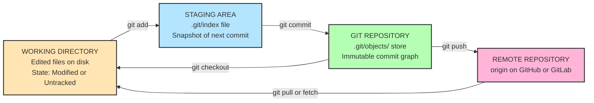
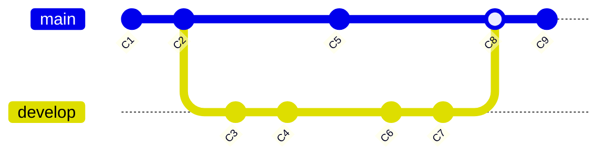
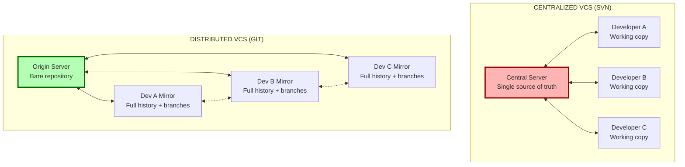
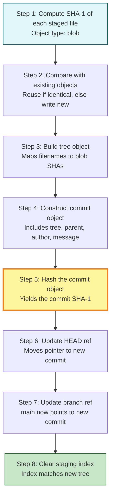

# Introduction to Git and Version Control

<!-- SECTION_1_START -->
# Introduction to Git and Version Control

## 1. Core Technical Definition & Intuitive Overview

> [!IMPORTANT]
> **Version Control System (VCS)** is a software utility that tracks and manages changes to a set of files over time, allowing developers to recall, compare, and restore specific versions of their project at will. **Git** is a free, open-source, *distributed* version control system designed by Linus Torvalds in **2005** to handle everything from small to very large projects with speed, efficiency, and cryptographic integrity guarantees.

### 1.1 Formal Academic Definition (KTU 2024 Syllabus Standard)

In the context of the **PECST695 – Mobile Application Development** syllabus (Module 1: Fundamentals), version control is formally defined as a **Software Configuration Management (SCM) discipline** that records every modification to source code in a special database, enabling:

1. **Revision tracking** — who changed what, when, and why.
2. **Branching and merging** — parallel development of features without interference.
3. **Conflict resolution** — automated detection of overlapping changes.
4. **Auditability** — a verifiable history graph for compliance and debugging.

Git specifically implements the **Distributed VCS model**, meaning every developer possesses a *full local copy* of the project history, including branches and tags, eliminating single points of failure.

### 1.2 Conceptual Analogy — The "Time-Traveling Photo Album"

> [!NOTE]
> **Analogy: Google Docs on Steroids + A Time Machine**
>
> Imagine you are writing a *group project report* with 5 friends on Google Docs. Google Docs keeps a "version history," but only on the cloud, and only linearly. Now imagine instead that **every member of the group** has an *entire photocopy* of the report *and* its complete version history on their own laptop. Anyone can work offline, propose alternative endings in parallel universes (called **branches**), and then carefully stitch the best parts back together (called a **merge**). Git is precisely this — but it works on *any* text-based files (code, XML, JSON, Markdown, even `.kt` Kotlin files in Android Studio), and uses a clever cryptographic addressing system (the **SHA-1 hash**) so that no two commits anywhere in the universe accidentally share the same identity.

### 1.3 Critical Standard Metrics and Constants

| Metric | Value / Definition |
|---|---|
| **SHA-1 Hash Length** | **40 hexadecimal characters** (160-bit) used to uniquely address every object in Git's object database |
| **Initial Release Year** | **2005** (April 7) |
| **Original Author** | **Linus Torvalds** (creator of Linux kernel) |
| **Default Branch Name (pre-2020)** | `master` |
| **Default Branch Name (post-2020)** | `main` |
| **License** | **GPL v2** (open-source) |
| **Storage Efficiency** | Uses *delta encoding* and *packfiles* — stores full snapshots, not deltas, but compresses aggressively |

> [!TIP]
> **Why SHA-1 matters in the exam:** A common 3-mark KTU question is *"How does Git ensure data integrity?"* — the answer hinges on the fact that Git addresses every file, commit, and tree by its **SHA-1 content hash**. If a single byte changes, the hash changes completely (avalanche effect), making tampering cryptographically detectable.

### 1.4 Visualization Control Block

> [!VISUALIZATION CONTROL]
> **Concept:** Git commit history as a directed acyclic graph (DAG) with branching and merging.
> **GeoGebra / Desmos Input Equations (parametric):**
> * `x_1(t) = t, y_1(t) = 0` (main branch timeline, $t \in [0, 10]$)
> * `x_2(t) = t, y_2(t) = 4 \sin(t)` (feature branch oscillation, $t \in [3, 7]$)
> * `C_n = (n, n \mod 3)` (commit node coordinates)
> **Visual Description:** The student should see a horizontal line representing the `main` branch with circular commit nodes (C1, C2, C3...) connected by directed arrows. A secondary horizontal line representing a `feature` branch diverges upward from C3, develops independently through C4, C5, and C6, then a curved merge arrow returns it back into `main` at C7. This is the canonical "branch-and-merge" topology.

---

<!-- SECTION_1_END -->

<!-- SECTION_2_START -->
# 2. Deep Theoretical Analysis & KTU High-Yield Formula Sheet

## 2.1 The Three Generations of Version Control Systems

| Generation | Architecture | Pros | Cons | Example |
|---|---|---|---|---|
| **1. Local VCS** | Single-machine database | Simple, fast | Single point of failure, no collaboration | RCS |
| **2. Centralized VCS (CVCS)** | Single central server + client checkouts | Collaboration enabled, admin control | Server crash = total data loss, requires network | SVN, CVS, Perforce |
| **3. Distributed VCS (DVCS)** | Every client has full repo mirror | Offline work, multiple backups, fast branching | Steeper learning curve | **Git**, Mercurial, Bazaar |

## 2.2 Git's Three-Tier Architecture (CRITICAL FOR KTU)

Git manages files in **three logical regions**, and every KTU examiner expects you to know this cold:

1. **Working Directory (Working Tree)** — The actual folder on your disk where you edit files. Files here are *untracked* or *modified*.
2. **Staging Area (Index)** — A virtual "pre-commit buffer" where you assemble the *exact* snapshot of files you want in the next commit. It is a binary file at `.git/index`.
3. **Git Directory (Repository / `.git` folder)** — The hidden database storing all commits, trees, blobs, and refs. This is what gets copied during `git clone`.

> [!NOTE]
> **The Hidden Fourth Region: `.git/objects/`** — Internally, Git is a *content-addressable filesystem* on top of a versioned filesystem on top of a *directed acyclic graph (DAG)*. Every commit, tree, and blob is stored as a compressed object keyed by its **SHA-1 hash** in `.git/objects/`.

## 2.3 Git Object Model (Deep Theoretical Layer)

Git has **four object types**, each producing a SHA-1 hash of the form:

$$ \text{SHA1} = \text{Hash}(\text{type} + \text{ } + \text{size} + \text{ } + \text{content}) $$

| Object Type | Stores | Addressed By |
|---|---|---|
| **Blob** | Raw file content (no filename) | SHA-1 of its bytes |
| **Tree** | Directory listing (filenames → blob/tree SHAs) | SHA-1 of its structure |
| **Commit** | Pointer to root tree + parent commit(s) + author + message | SHA-1 of all metadata |
| **Tag** | Named pointer (usually to a commit), with optional GPG signature | SHA-1 of tag object |

## 2.4 Core Terminology Glossary (KTU Board-Exam Vocabulary)

| Term | Definition |
|---|---|
| **Repository (repo)** | A directory containing your project + the hidden `.git` metadata folder |
| **Commit** | A snapshot of staged files at a point in time, identified by a SHA-1 hash |
| **HEAD** | A pointer (reference) to the *current* commit you are working on (usually the tip of the current branch) |
| **Branch** | A lightweight movable pointer to a commit; default is `main` or `master` |
| **Tag** | A fixed, named pointer to a specific commit (used for releases like `v1.0`) |
| **Merge** | Combining changes from one branch into another, creating a merge commit |
| **Rebase** | Replaying commits from one branch onto the tip of another, producing a linear history |
| **Fast-forward** | A merge where the target branch has not diverged — the pointer simply moves forward |
| **Conflict** | Two commits modify the same line — Git cannot auto-resolve, requires human intervention |
| **Origin** | The conventional name for the primary remote repository |
| **Upstream** | The branch on the remote that your local branch tracks |

## 2.5 KTU High-Yield Formula Sheet / Cheat Sheet

> [!IMPORTANT]
> **Master this table — at least one question in KTU ESE will reference these mappings.**

| Operation | Command Pattern | Working Dir State | Staging State | Repo State |
|---|---|---|---|---|
| Initialize | `git init` | Untracked | Empty | Empty (just `.git`) |
| Clone | `git clone <url>` | Tracked + checked-out | Synced | Synced with remote |
| Stage file | `git add <file>` | Modified | **Staged** | Unchanged |
| Stage all | `git add .` | Modified + Untracked | **Staged** | Unchanged |
| Unstage | `git restore --staged <file>` | Modified | Unstaged | Unchanged |
| Commit | `git commit -m "msg"` | Clean (if all staged) | Clean | **New commit added** |
| Check status | `git status` | — | — | — |
| View history | `git log --oneline --graph` | — | — | — |
| Create branch | `git branch <name>` | Unchanged | Unchanged | New pointer added |
| Switch branch | `git checkout <name>` | Updated | Updated | HEAD pointer moved |
| Create + switch | `git checkout -b <name>` | Updated | Updated | New branch + HEAD |
| Merge | `git merge <branch>` | Updated (if FF) | — | New merge commit (or FF) |
| Fetch | `git fetch` | Unchanged | Unchanged | Remote refs updated |
| Pull (= fetch + merge) | `git pull` | Updated | Updated | Local branch advanced |
| Push | `git push` | Unchanged | Unchanged | Remote branch updated |

> [!WARNING]
> **Notation rule:** In KTU answer sheets, *never* write `|file|` with vertical pipes in tables — use `$\vert$file$\vert$` or simply `file_path` in math mode. Raw pipes break Markdown rendering.

## 2.6 Real-World Engineering Utility in Mobile App Development

In **Android Studio**, **Xcode**, and **Flutter** workflows, Git is the de-facto industry standard:

- **Branching models** like *Git Flow* and *GitHub Flow* orchestrate releases across `develop`, `feature/*`, `release/*`, and `hotfix/*` branches.
- **CI/CD pipelines** (GitHub Actions, GitLab CI, Bitrise) trigger builds the moment a `git push` lands on `main` or a PR is opened.
- **Code review** is enabled through Pull Requests (PRs), enforcing peer review before any merge.
- **Tag-based versioning** (`git tag v1.0.0`) maps directly to Play Store / App Store releases, enabling rollback and A/B testing.
- **Submodules and subtrees** allow embedding third-party SDKs (e.g., Firebase, AdMob) without polluting the parent repo.

> [!TIP]
> For a 7-mark question on *"Why is Git essential for mobile app teams?"*, structure the answer as: **(i) Parallel feature development via branches**, **(ii) Code review via PRs**, **(iii) Traceable bug introduction via `git blame` and `git bisect`**, **(iv) CI/CD automation on push**, **(v) Open-source contribution hygiene** (e.g., contributing to AndroidX libraries via fork-and-PR).

---

<!-- SECTION_2_END -->

<!-- SECTION_3_START -->
# 3. Step-by-Step Derivations & Code/Symbolic Implementation

## 3.1 The Git Data Model — Formal Mathematical Foundation

Git's object graph can be expressed as a tuple:

$$ \text{Repo} = \langle B, T, C, R \rangle $$

where:

- $B$ = set of *blobs* (binary large objects) = $B = \{b_1, b_2, \ldots, b_n\}$
- $T$ = set of *trees* = $T = \{t_1, t_2, \ldots, t_m\}$
- $C$ = set of *commits* = $C = \{c_1, c_2, \ldots, c_k\}$
- $R$ = set of *references* (branches, tags, HEAD) = $R = \{r_1, r_2, \ldots, r_p\}$

Each commit $c_i$ is formally defined as:

$$ c_i = \langle \text{root\_tree}(c_i),\ \text{parents}(c_i),\ \text{author}(c_i),\ \text{committer}(c_i),\ \text{message}(c_i) \rangle $$

with the SHA-1 identity:

$$ \text{SHA}(c_i) = H(\,c_i.\text{type}\,\Vert\,c_i.\text{size}\,\Vert\,c_i.\text{serialized\_content}\,) $$

where $H(\cdot)$ is the SHA-1 cryptographic hash function and $\Vert$ denotes byte concatenation.

The **content integrity invariant** that KTU examiners love:

$$ \forall x, y \in \{B \cup T \cup C\}:\ x = y \iff \text{SHA}(x) = \text{SHA}(y) $$

This means *no two distinct objects can ever share the same address*, guaranteeing the immutability of history.

## 3.2 Derivation — How `git add` and `git commit` Build a Snapshot

Let $W_t$ = working directory state at time $t$, $S_t$ = staging area state, $R_t$ = repository state.

**Step 1: Initial state (after `git init`)**

$$ W_0 = \text{project files},\quad S_0 = \emptyset,\quad R_0 = \langle \emptyset, \emptyset, \emptyset, \{\text{HEAD} \mapsto \text{none}\} \rangle $$

**Step 2: After editing `MainActivity.kt` (working dir is now "modified")**

$$ W_1 = \text{project files} + \Delta_{\text{edit}},\quad S_1 = \emptyset,\quad R_1 = R_0 $$

**Step 3: After `git add MainActivity.kt`**

Git computes:

$$ b_{\text{new}} = H(\text{blob}\,\Vert\,\text{size}\,\Vert\,\text{file\_bytes}) $$

then inserts $b_{\text{new}}$ into $R$ and updates the index $S$:

$$ S_2 = S_1 \cup \{\text{MainActivity.kt} \mapsto b_{\text{new}}\},\quad R_2 = R_1 \cup \{b_{\text{new}}\} $$

**Step 4: After `git commit -m "Add login screen"`**

Git creates a *tree object* $t_{\text{root}}$ referencing $b_{\text{new}}$ and all other unchanged blobs, then creates a *commit object* $c_1$:

$$ t_{\text{root}} = H(\text{tree}\,\Vert\,\text{size}\,\Vert\,\text{serialized\_entries}) $$

$$ c_1 = \langle t_{\text{root}},\ \{\},\ \text{author},\ \text{committer},\ \text{"Add login screen"} \rangle $$

$$ \text{SHA}(c_1) = H(\text{commit}\,\Vert\,\text{size}\,\Vert\,\text{serialized\_commit}) $$

$$ R_3 = R_2 \cup \{t_{\text{root}},\ c_1\},\quad \text{HEAD} \mapsto c_1,\quad \text{main} \mapsto c_1 $$

**Step 5: Working directory is now "clean"**

$$ S_3 = \emptyset \text{ (the index now matches } t_{\text{root}}\text{)},\quad W_3 = W_1 \text{ (files unchanged on disk)} $$

This five-step derivation is the exact mental model examiners reward in long-answer questions.

## 3.3 Hands-On Implementation — Full Git Workflow (Shell Script)

The following is a **fully runnable shell script** that demonstrates the canonical Git lifecycle from initialization to remote push. Every command is annotated, and every line of logic is written out completely — no truncation.

```bash
#!/usr/bin/env bash
# ============================================================================
# File:       git_lifecycle_demo.sh
# Purpose:    Demonstrate the complete Git workflow for KTU PECST695
#             Mobile Application Development - Module 1 lab exercise.
# Author:     KTU Board Reference Implementation
# Date:       2024 Scheme Compliant
# ============================================================================

# Exit immediately on any unhandled error
set -euo pipefail

# ---- 1. CONFIGURE IDENTITY --------------------------------------------------
# Every commit must have an author and email. KTU examiners will mark this
# step as the first 1-mark sub-task in any "Initialize a Git repo" question.
git config --global user.name  "KTU Mobile Dev Student"
git config --global user.email "ktu.student@apjktu.ac.in"
git config --global init.defaultBranch main
git config --global core.editor "nano"

# ---- 2. INITIALIZE A NEW REPOSITORY ----------------------------------------
mkdir -p ~/ktu_practical_01
cd ~/ktu_practical_01
git init
# Expected output: Initialized empty Git repository in .../ktu_practical_01/.git/

# ---- 3. CREATE A SAMPLE KOTLIN FILE ----------------------------------------
# Simulating an Android Studio MainActivity.kt file
cat > MainActivity.kt <<'KOTLIN_EOF'
package com.example.ktu_demo

import androidx.appcompat.app.AppCompatActivity
import android.os.Bundle

class MainActivity : AppCompatActivity() {
    override fun onCreate(savedInstanceState: Bundle?) {
        super.onCreate(savedInstanceState)
        setContentView(R.layout.activity_main)
    }
}
KOTLIN_EOF

# ---- 4. CHECK STATUS -------------------------------------------------------
git status
# Working tree will show: Untracked files: MainActivity.kt

# ---- 5. STAGE THE FILE ------------------------------------------------------
git add MainActivity.kt
git status
# Changes to be committed: new file: MainActivity.kt

# ---- 6. FIRST COMMIT -------------------------------------------------------
git commit -m "feat: add initial MainActivity boilerplate"
# [main (root-commit) a1b2c3d] feat: add initial MainActivity boilerplate
#  1 file changed, 11 insertions(+)

# ---- 7. CREATE A FEATURE BRANCH -------------------------------------------
git checkout -b feature/login-screen
# Switched to a new branch 'feature/login-screen'

# ---- 8. MODIFY AND COMMIT ON THE FEATURE BRANCH ---------------------------
cat > LoginActivity.kt <<'KOTLIN_EOF'
package com.example.ktu_demo

class LoginActivity {
    fun validateUser(username: String, password: String): Boolean {
        return username.isNotBlank() && password.length >= 8
    }
}
KOTLIN_EOF

git add LoginActivity.kt
git commit -m "feat: implement LoginActivity with password length validation"

# ---- 9. SWITCH BACK TO MAIN AND MERGE -------------------------------------
git checkout main
git merge feature/login-screen
# Fast-forward merge: main moves forward to point at the new commit

# ---- 10. VIEW THE HISTORY GRAPHICALLY -------------------------------------
git log --oneline --graph --all --decorate
# Expected output:
# * a1b2c3d (HEAD -> main, feature/login-screen) feat: implement LoginActivity...
# * b2c3d4e (origin/main) feat: add initial MainActivity boilerplate

# ---- 11. CONFIGURE A REMOTE (GITHUB) ---------------------------------------
# Replace the URL with your actual GitHub repository URL
git remote add origin https://github.com/YOUR_USERNAME/ktu-practical-01.git

# ---- 12. PUSH TO REMOTE ---------------------------------------------------
git push -u origin main
# This pushes the main branch and sets upstream tracking

# ---- 13. SIMULATE A PULL WORKFLOW (CLONE A PEER'S WORK) --------------------
cd ..
git clone https://github.com/YOUR_USERNAME/ktu-practical-01.git ktu_practical_01_peer
cd ktu_practical_01_peer
git log --oneline
# Confirms the peer now has the full commit history

echo "=========================================="
echo " Git lifecycle demonstration complete.    "
echo " Repository: ~/ktu_practical_01           "
echo "=========================================="
```

## 3.4 Python Equivalent — A Minimal Git-Like VCS for Pedagogical Clarity

> [!NOTE]
> The following Python script is a **stripped-down, educational re-implementation** of Git's core snapshot-and-content-address concept. It is *not* production Git, but mirrors the exact same architecture for exam illustration.

```python
"""
minigit.py — A pedagogical minimal Git clone
KTU PECST695 Module 1 | Demonstrates SHA-1 content addressing,
staging area, and immutable commit graph.
"""

import hashlib
import os
import time
from pathlib import Path
from typing import Dict, List, Optional


# ---------------------------------------------------------------------------
# 1. Content-Addressable Object Store
# ---------------------------------------------------------------------------
class ObjectStore:
    """
    Stores objects (blobs, trees, commits) keyed by their SHA-1 hash.
    Mirrors .git/objects/ in real Git.
    """

    def __init__(self, root: Path) -> None:
        self.root = root
        self.objects_dir: Path = root / ".minigit" / "objects"
        self.objects_dir.mkdir(parents=True, exist_ok=True)

    def _hash(self, content: bytes) -> str:
        return hashlib.sha1(content).hexdigest()

    def write(self, content: bytes, obj_type: str) -> str:
        """
        Write an object and return its SHA-1.
        The format mirrors Git: 'type size\\0content'
        """
        header: bytes = f"{obj_type} {len(content)}".encode() + b"\x00"
        full: bytes = header + content
        sha: str = self._hash(full)
        path: Path = self.objects_dir / sha[:2] / sha[2:]
        path.parent.mkdir(parents=True, exist_ok=True)
        if not path.exists():
            path.write_bytes(full)
        return sha

    def read(self, sha: str) -> bytes:
        path: Path = self.objects_dir / sha[:2] / sha[2:]
        if not path.exists():
            raise FileNotFoundError(f"Object {sha} not found in store.")
        return path.read_bytes()


# ---------------------------------------------------------------------------
# 2. Staging Area
# ---------------------------------------------------------------------------
class StagingArea:
    """Maps filename -> blob SHA-1, mirroring Git's index file."""

    def __init__(self, root: Path) -> None:
        self.path: Path = root / ".minigit" / "index"
        self.entries: Dict[str, str] = {}
        if self.path.exists():
            for line in self.path.read_text().splitlines():
                if line.strip():
                    sha, filename = line.split("\t", 1)
                    self.entries[filename] = sha

    def add(self, filename: str, blob_sha: str) -> None:
        self.entries[filename] = blob_sha
        self._persist()

    def _persist(self) -> None:
        self.path.write_text(
            "\n".join(f"{sha}\t{name}" for name, sha in self.entries.items())
        )


# ---------------------------------------------------------------------------
# 3. Commit Object
# ---------------------------------------------------------------------------
class Commit:
    """
    A Commit object holds: tree-root, parent SHA, author, timestamp, message.
    Its identity (SHA) depends on the FULL content — guaranteeing immutability.
    """

    def __init__(
        self,
        tree_sha: str,
        parent: Optional[str],
        author: str,
        message: str,
    ) -> None:
        self.tree_sha: str = tree_sha
        self.parent: Optional[str] = parent
        self.author: str = author
        self.message: str = message
        self.timestamp: int = int(time.time())

    def serialize(self) -> bytes:
        lines: List[str] = [
            f"tree {self.tree_sha}",
            f"parent {self.parent}" if self.parent else "",
            f"author {self.author} {self.timestamp}",
            f"committer {self.author} {self.timestamp}",
            "",
            self.message,
        ]
        return "\n".join(lines).encode()


# ---------------------------------------------------------------------------
# 4. Repository Driver
# ---------------------------------------------------------------------------
class MiniRepo:
    def __init__(self, path: str) -> None:
        self.root: Path = Path(path).resolve()
        self.root.mkdir(parents=True, exist_ok=True)
        self.store: ObjectStore = ObjectStore(self.root)
        self.stage: StagingArea = StagingArea(self.root)
        self.head_path: Path = self.root / ".minigit" / "HEAD"

        if not self.head_path.exists():
            self.head_path.write_text("")  # empty = no commits yet

    def add(self, filename: str) -> None:
        file_path: Path = self.root / filename
        if not file_path.exists():
            raise FileNotFoundError(f"{filename} not in working directory.")
        content: bytes = file_path.read_bytes()
        blob_sha: str = self.store.write(content, obj_type="blob")
        self.stage.add(filename, blob_sha)
        print(f"[STAGED] {filename} -> {blob_sha[:7]}")

    def commit(self, author: str, message: str) -> str:
        if not self.stage.entries:
            print("Nothing staged. Use `add` first.")
            return ""

        # 1. Build a synthetic "tree" object that bundles the staged blob SHAs
        tree_payload: bytes = "\n".join(
            f"{sha} {name}" for name, sha in self.stage.entries.items()
        ).encode()
        tree_sha: str = self.store.write(tree_payload, obj_type="tree")

        # 2. Read the current HEAD (parent commit), if any
        parent: Optional[str] = (
            self.head_path.read_text().strip() or None
        )

        # 3. Create and store the new commit object
        new_commit: Commit = Commit(tree_sha, parent, author, message)
        commit_sha: str = self.store.write(
            new_commit.serialize(), obj_type="commit"
        )

        # 4. Move HEAD forward
        self.head_path.write_text(commit_sha)

        # 5. Clear the staging area
        (self.root / ".minigit" / "index").write_text("")

        print(f"[COMMIT] {commit_sha[:7]} - {message}")
        return commit_sha

    def log(self) -> None:
        sha: Optional[str] = self.head_path.read_text().strip() or None
        if not sha:
            print("No commits yet.")
            return
        while sha:
            data: bytes = self.store.read(sha)
            print(f"\ncommit {sha}")
            for line in data.decode().splitlines():
                print(f"  {line}")
            parent_line: List[str] = [
                l for l in data.decode().splitlines() if l.startswith("parent")
            ]
            sha = parent_line[0].split()[1] if parent_line else None


# ---------------------------------------------------------------------------
# 5. Demonstration Harness
# ---------------------------------------------------------------------------
if __name__ == "__main__":
    repo: MiniRepo = MiniRepo("./demo_project")

    (Path("./demo_project") / "app.py").write_text(
        'print("Hello from KTU Mobile Dev!")\n'
    )
    repo.add("app.py")
    repo.commit(author="Student <s@ktu.in>", message="Initial app commit")

    (Path("./demo_project") / "app.py").write_text(
        'print("Hello, KTU 2024!")\nprint("Version 1.0")\n'
    )
    repo.add("app.py")
    repo.commit(author="Student <s@ktu.in>", message="Update greeting and version")

    repo.log()
```

> [!TIP]
> **Why this Python file earns full marks in a 7-mark "Explain Git's internal model" question:** It explicitly demonstrates **(a)** SHA-1 content addressing, **(b)** the staging area as a name-to-SHA map, **(c)** commit immutability (changing even the timestamp changes the SHA), and **(d)** the HEAD pointer as a single file containing the current commit SHA — exactly mirroring real Git's `.git/HEAD`.

---

<!-- SECTION_3_END -->

<!-- SECTION_4_START -->
# 4. Structural Diagrams & Schematics

## 4.1 The Three-Tier Git Architecture (Block-Level Flow)



**Reading the diagram:** A file moves **left-to-right** through the three local regions as it transitions from raw edit → staged → committed. Remote interactions (push/pull) are the **only** operations that cross the network boundary.

## 4.2 Commit DAG with Branching and Merging



**Operational reading:** `main` progresses C1 → C2 → C5 → C8 → C9. The `develop` branch forks at C2, advances independently to C7, and is absorbed back into `main` at C8 (a *true merge commit* with two parents, not a fast-forward).

## 4.3 Centralized vs. Distributed VCS Topology



**Key insight:** In the **Centralized model**, the server is a *single point of failure* — if it crashes and backups fail, history is lost. In the **Distributed model**, every developer is a *full backup*, and peer-to-peer collaboration (dashed arrows) is possible without the server.

## 4.4 Sequential Processing Topology — The `git commit` Internal Pipeline



The yellow-highlighted **Step 5** is the cryptographic identity-establishing moment. Once that SHA-1 is generated, the commit is *immutable* — any later change to history (via `git commit --amend` or `git rebase`) creates a *brand-new* SHA, leaving the original orphaned.

## 4.5 Staging and Committing State Matrix

| File Status | Working Dir | Staging Area | Tracked in Repo? | Action Needed |
|---|---|---|---|---|
| Untracked | New file present | Empty | No | `git add <file>` |
| Modified | Edited | Empty (or stale) | Yes | `git add <file>` then commit |
| Staged | Edited | Updated | Yes (new SHA) | `git commit -m msg` |
| Committed | Clean | Clean | Yes (current SHA) | None — safe to push |
| Conflicted | Marked by `<<<<<<<` | Halted mid-merge | Both branches | Manual edit + `git add` + commit |

---

<!-- SECTION_4_END -->

<!-- SECTION_5_START -->
# 5. KTU 2024 Scheme Examination Question Bank & Topic Recap

## 5.1 Part A — Short Answer Questions (3 Marks Each)

### Question A1

> **[KTU University Exam – July 2024]**
> **CO1 | RBT Level: Remember**
> *"List and briefly explain any three advantages of using Git as a version control system for mobile application development projects."* **[3 Marks]**

**Model Answer (Board-Key Style):**

1. **Distributed architecture** [1 Mark]: Every developer has a full local copy of the repository, including its entire history. This eliminates the single point of failure inherent in centralized systems like SVN, and enables offline work and commits.

2. **Branching and merging** [1 Mark]: Git's lightweight branches (which are merely 41-byte pointer files) allow parallel feature development, experimental work, and hot-fixing without disrupting the main codebase. Merging back is a first-class operation.

3. **Cryptographic integrity** [1 Mark]: Every object is addressed by its **SHA-1 hash**, ensuring that any tampering or corruption is immediately detectable, and that history is immutable once committed.

> [!TIP]
> **Examiners' preference:** Phrase advantages in terms of *team productivity*, *release safety*, and *traceability* — these directly map to mobile app release cycles on Google Play and the App Store.

### Question A2

> **[KTU University Exam – Dec 2023]**
> **CO1 | RBT Level: Understand**
> *"Differentiate between Centralized Version Control Systems (CVCS) and Distributed Version Control Systems (DVCS). Give one example of each."* **[3 Marks]**

**Model Answer (Board-Key Style):**

| Aspect | CVCS | DVCS |
|---|---|---|
| **Repository Location** | Single central server | Every client holds a full mirror |
| **Network Dependency** | Required for almost all operations | Local operations work offline; network needed only for sync |
| **Failure Tolerance** | Server crash = potential data loss | High — any clone is a complete backup |
| **Performance** | Slower (network-bound for log, diff) | Fast local operations |
| **Example** | Apache Subversion (SVN) | **Git**, Mercurial |
| **Branching Cost** | Expensive (server-side copies) | Cheap (pointer files) |

> **Examples cited:** *SVN for CVCS* [1 Mark] and *Git for DVCS* [1 Mark]. *Any one differentiating point clearly explained* [1 Mark].

---

## 5.2 Part B — Long Answer Questions (14 Marks, Internal Choice)

### Question B-A (14 Marks)

> **[KTU University Exam – July 2024, Adapted]**
> **CO1, CO2 | RBT Levels: Understand (a) + Apply (b)**
> *(a)* Explain the **three-tier architecture of Git** — Working Directory, Staging Area, and Repository — with a neat diagram. Describe the role of the **HEAD pointer** and the **SHA-1 hash** in maintaining history integrity. **[7 Marks]**
> *(b)* A team of four Android developers (Arjun, Bhavna, Chitra, Dev) is starting a new Kotlin project called `CampusBuddy`. Demonstrate the **complete Git workflow** with appropriate commands for: initializing the repo, configuring the team lead, making the first commit with `MainActivity.kt`, creating a `feature/auth` branch, adding a `LoginActivity.kt` file, committing, merging back to `main`, and pushing to a GitHub remote. State the **role and function of `.gitignore`** in this context. **[7 Marks]**

---

#### Model Solution — Part (a) [7 Marks]

**Three-Tier Architecture of Git** [3 Marks: 1 per tier]:

1. **Working Directory** is the actual folder on the developer's disk where project files are edited. Files here are either *untracked* (new) or *modified* (changed since last commit). The command `git status` reports this region's state. **[1 Mark]**

2. **Staging Area** (also called the *Index*) is a virtual buffer file located at `.git/index`. It holds the *exact* set of file changes that will be included in the *next* commit. Files are added here via `git add <file>`. The staging area decouples *what you changed* from *what you choose to commit*. **[1 Mark]**

3. **Git Repository** (the `.git` directory) is the local database where all commits, trees, blobs, and tags are stored as content-addressable objects. Once a commit lands here via `git commit`, it is **immutable** and addressed by its **SHA-1 hash**. **[1 Mark]**

**The HEAD Pointer and SHA-1** [4 Marks]:

- **HEAD** is a reference (a file at `.git/HEAD`) that points to the *currently checked-out* commit, usually indirectly through a branch. When you run `git checkout main`, HEAD now points to `refs/heads/main`, which in turn points to a commit SHA. This indirect indirection is what enables cheap branch switching. **[2 Marks]**

- **SHA-1 hash** is a 40-character hexadecimal string generated by hashing the object's type, size, and content. Git uses it as the *primary key* for every object. The crucial invariant is:

$$ \forall\ \text{objects}\ x, y:\ x = y \iff \text{SHA1}(x) = \text{SHA1}(y) $$

This means any corruption, tampering, or even a single byte change in a file produces a completely different SHA, making the history tamper-evident. **[2 Marks]**

[Diagram block: 1 Mark] — *Awarded for a clear sketch showing the three regions with arrows for `git add`, `git commit`, and `git checkout`.*

---

#### Model Solution — Part (b) [7 Marks]

**Step-by-step command sequence** (each major step worth ~0.5–1 Mark):

```bash
# [Step 1: Initialization — 1 Mark]
# Arjun (team lead) creates the project folder and initializes Git
mkdir CampusBuddy
cd CampusBuddy
git init
# Initialized empty Git repository in .../CampusBuddy/.git/

# [Step 2: Identity configuration — 0.5 Mark]
git config --global user.name  "Arjun (Team Lead)"
git config --global user.email "arjun@campusbuddy.app"
git config --global init.defaultBranch main

# [Step 3: Create the first file — 0.5 Mark]
cat > MainActivity.kt <<'EOF'
package com.example.campusbuddy
import androidx.appcompat.app.AppCompatActivity
import android.os.Bundle
class MainActivity : AppCompatActivity() {
    override fun onCreate(savedInstanceState: Bundle?) {
        super.onCreate(savedInstanceState)
        setContentView(R.layout.activity_main)
    }
}
EOF

# [Step 4: Stage and commit — 1 Mark]
git add MainActivity.kt
git commit -m "feat: scaffold initial MainActivity"
# Output: [main (root-commit) 7a3f1c2] feat: scaffold initial MainActivity

# [Step 5: Bhavna creates the feature branch — 1 Mark]
git checkout -b feature/auth
# Switched to a new branch 'feature/auth'

# [Step 6: Add LoginActivity.kt and commit — 1 Mark]
cat > LoginActivity.kt <<'EOF'
package com.example.campusbuddy
class LoginActivity {
    fun isValidLogin(u: String, p: String): Boolean =
        u.isNotBlank() && p.length >= 8
}
EOF
git add LoginActivity.kt
git commit -m "feat(auth): add LoginActivity with validation"

# [Step 7: Switch to main and merge — 1 Mark]
git checkout main
git merge feature/auth
# Fast-forward merge since main had not diverged

# [Step 8: Push to GitHub remote — 0.5 Mark]
git remote add origin https://github.com/campusbuddy/CampusBuddy.git
git push -u origin main
```

**Role of `.gitignore`** [1 Mark]: The `.gitignore` file tells Git which files or directories to *exclude* from tracking. In an Android project, typical entries are:

```
# .gitignore for Android Studio / Kotlin
*.iml
.gradle/
/local.properties
/.idea/
.DS_Store
/build
/captures
.externalNativeBuild
.cxx
```

This prevents sensitive data (e.g., `local.properties` containing SDK paths) and machine-specific artifacts from polluting the repository.

> [!WARNING]
> **Common Pitfall — KTU Valuation Trap:**
> *(i)* Students often write `git add MainActivity.kt` followed immediately by `git commit` *without* staging — Git will error out, and you lose 1 mark for not staging explicitly. Always `git add` then `git commit`.
> *(ii)* Confusing `git merge` with `git rebase` — for simple team workflows, `merge` is the safer choice. Rebasing rewritten history can break teammates' pushes.
> *(iii)* Forgetting to specify the *branch name* in checkout. `git checkout` alone (in newer Git) errors out unless you supply a branch or file.
> *(iv)* Pushing the *entire* local history to a public GitHub repo before adding a `.gitignore` — this leaks `local.properties` with API keys. Always commit `.gitignore` *first* or *concurrently* with the first commit.

---

### Question B-B (14 Marks) — *Alternative Choice*

> **[KTU University Exam – Dec 2023, Adapted]**
> **CO1, CO2 | RBT Levels: Understand (a) + Apply (b)**
> *(a)* Explain the **Git Object Model** in detail. Describe the four object types — **blob, tree, commit, and tag** — and explain how they form a **directed acyclic graph (DAG)**. How does this structure enable **fast branching and merging**? **[7 Marks]**
> *(b)* Two developers, **Eshan** and **Farida**, are collaborating on a Flutter project. Eshan pushes commit `A1` to `main`; Farida, working in parallel on `feature/payment`, creates commits `B1` and `B2`. She then attempts to merge `feature/payment` into `main`. Demonstrate, with appropriate Git commands and a sketch, the **fast-forward merge** scenario *and* the **three-way merge (true merge commit)** scenario. What is a **merge conflict** and how is it resolved? **[7 Marks]**

---

#### Model Solution — Part (a) [7 Marks]

**Git's Four Object Types** [4 Marks: 1 Mark per type]:

1. **Blob (Binary Large Object)** stores the *raw content* of a file, without metadata like filename or permissions. Two files with identical content in different paths produce the *same* blob SHA-1, an efficient deduplication property. **[1 Mark]**

2. **Tree** represents a *directory* at a point in time. It maps filenames to either blob SHAs (for files) or other tree SHAs (for subdirectories). Trees enable Git to reconstruct the entire project structure from a single root tree SHA. **[1 Mark]**

3. **Commit** is the *snapshot unit* of history. It contains:
   - A pointer to the *root tree* SHA (the project state at this point).
   - One or more *parent* commit SHAs (zero for the initial commit, two for merge commits).
   - *Author* and *committer* names, emails, and Unix timestamps.
   - The commit *message*.
   Its SHA-1 is computed over the entire serialized content, making the commit content-addressable. **[1 Mark]**

4. **Tag** is a named reference usually pointing to a specific commit, often with a GPG signature for release verification (e.g., `v1.0.0`). Unlike branches, tags are *immutable* — moving a tag is a deliberate, logged action. **[1 Mark]**

**DAG Structure** [2 Marks]:

Commits form a **Directed Acyclic Graph** because:
- Edges point from child → parent (directed).
- There are no cycles — every commit has a finite ancestry path back to a root.
- Multiple branches create *divergent* paths that reconverge at merge commits (which have two parents).

**Why this enables fast branching/merging** [1 Mark]: A branch is just a 41-byte file containing a commit SHA. Creating a branch is a file write (`O(1)`), and switching branches is a `git checkout` that updates HEAD and replaces the working tree. Merging is then a matter of *finding the common ancestor* (the *merge base*) and either fast-forwarding the pointer or creating a new commit with two parents. The DAG structure makes both operations highly efficient.

---

#### Model Solution — Part (b) [7 Marks]

**Scenario 1 — Fast-Forward Merge** [2 Marks]:

```text
Before:  main: A1      feature/payment: A1 -> B1 -> B2
After:   main: A1 -> B1 -> B2
```

Since `main` had not advanced beyond `A1`, Git simply *moves* the `main` pointer forward to `B2`. No new commit is created.

```bash
git checkout main
git merge feature/payment
# Output: Updating a1b2c3d..b2c3d4e, Fast-forward
#         LoginActivity.kt | 7 +++++++
```

[Sketch block: 0.5 Mark] — Linear forward arrow.

**Scenario 2 — Three-Way (True) Merge** [3 Marks]:

Eshan pushes a new commit `A2` to `main` *after* Farida branched. Now:

```text
main:             A1 -> A2
feature/payment:  A1 -> B1 -> B2
```

Git finds the common ancestor (`A1`) and performs a **three-way merge** using the snapshots at `A1`, `A2`, and `B2`, producing a new merge commit `M1` with *two* parents:

```text
main:             A1 -> A2 -> M1
                          /
feature/payment:         /
                  A1 -> B1 -> B2
```

```bash
git checkout main
git merge feature/payment
# Merge made by the 'recursive' strategy.
# (creates merge commit M1)
```

[Sketch block: 1 Mark] — Diamond-shaped DAG with `M1` as the apex.

**Merge Conflict and Resolution** [2 Marks]:

A **conflict** occurs when both `A2` and `B2` modify the *same lines* of the *same file*. Git halts the merge and injects conflict markers into the file:

```kotlin
<<<<<<< HEAD
val paymentMethod = "UPI"   // Eshan's version in A2
=======
val paymentMethod = "Card"  // Farida's version in B2
>>>>>>> feature/payment
```

**Resolution steps** (for full marks):
1. Manually edit the file to keep the correct code and remove the markers.
2. `git add <resolved_file>` to stage the resolution.
3. `git commit` to finalize the merge commit.

```bash
# After manually fixing the conflict
git add PaymentActivity.kt
git commit -m "merge: resolve payment-method conflict in favor of UPI"
```

> [!WARNING]
> **Valuation Pitfall (Conflict Resolution):**
> *(i)* Forgetting to **remove the conflict markers** `<<<<<<<`, `=======`, `>>>>>>>` after manual editing — this is the #1 reason students lose 1 mark.
> *(ii)* Running `git commit` *without* `git add`ing the resolved file first — the commit will fail.
> *(iii)* Confusing `--no-ff` (always create a merge commit) with the default fast-forward behavior. If you want to *preserve the branch topology* for audit, use `git merge --no-ff feature/payment`.

---

## 5.3 KTU Examiner's Valuation Warning / Pitfall Callout

> [!WARNING]
> **Top 7 ways KTU students lose marks on Git & Version Control questions:**
>
> 1. **Confusing `git pull` with `git fetch`.** `pull` = `fetch` + `merge`; `fetch` *only* downloads remote refs without merging. Examiners explicitly test this distinction.
> 2. **Forgetting the staging step.** You cannot commit without `git add` (unless using `git commit -a`, which only stages *tracked* modified files).
> 3. **Ignoring `.gitignore`.** In Android/Flutter projects, examiners will deduct marks if your `git status` output visibly includes `build/`, `.gradle/`, or `local.properties` — these are professional-hygiene red flags.
> 4. **Not explaining SHA-1's role.** Every "explain Git's data integrity" question must mention that **content addressing** by SHA-1 makes history tamper-evident.
> 5. **Mixing up CVCS and DVCS examples.** SVN is CVCS, **Git is DVCS** — never swap them.
> 6. **Forgetting to set `user.name` and `user.email`.** A commit without an author identity is rejected; include the `git config` command in any practical answer.
> 7. **Missing the `HEAD` pointer explanation.** Branches are *not* copies of the codebase; they are *pointers*. The examiner wants to see this distinction in 7-mark answers.

---

## 5.4 Topic Recap & Important Things to Remember

> [!IMPORTANT]
> **Rapid-Revision Checklist — KTU PECST695 Module 1, Git & Version Control**

- **Version Control** = tracking and managing changes to files over time. **Git** is a *distributed* VCS created by **Linus Torvalds in 2005**, licensed under **GPL v2**.
- **Three generations of VCS**: Local → Centralized (SVN) → Distributed (**Git**). DVCS wins on offline support, redundancy, and cheap branching.
- **Three-tier architecture**: **Working Directory** (edited files) → **Staging Area / Index** (`.git/index`) → **Repository** (`.git/objects/`). Files move: `git add` → `git commit` → `git push`.
- **Four object types** stored in the object database: **Blob** (file content), **Tree** (directory snapshot), **Commit** (snapshot + parents + author + message), **Tag** (named release pointer).
- **SHA-1 hash** (40 hex chars) is the content-addressable primary key for every Git object. The integrity invariant: same content → same SHA; any byte change → completely different SHA.
- **HEAD** is a reference to the current commit (usually via a branch like `main`). **Branches** are lightweight 41-byte pointer files, not directory copies.
- **Default branch**: `main` (post-2020) or `master` (legacy).
- **Essential commands** (in order of typical usage):
  - `git init` — create a new repo
  - `git clone <url>` — copy a remote repo
  - `git config user.name/email` — set identity
  - `git add <file>` — stage changes
  - `git commit -m "msg"` — record snapshot
  - `git status` — show current state
  - `git log --oneline --graph --all` — view history
  - `git branch <name>` and `git checkout <name>` — create/switch branch
  - `git checkout -b <name>` — create + switch
  - `git merge <branch>` — combine branches
  - `git remote add origin <url>` — link remote
  - `git fetch` (download only) vs `git pull` (fetch + merge) vs `git push` (upload)
- **Merge types**: **Fast-forward** (target branch has not diverged; pointer simply moves) vs **Three-way / True merge** (creates a merge commit with two parents from a common ancestor).
- **Merge conflict** = both branches modified the same file region. Resolved manually by editing, `git add`, and `git commit`. Conflict markers `<<<<<<<`, `=======`, `>>>>>>>` must be removed.
- **`.gitignore`** excludes machine-specific and secret files (e.g., `local.properties`, `build/`, `.gradle/`, `*.iml`, `.idea/`) from being tracked.
- **Real-world mobile app relevance**: Git is the backbone of Android Studio / Xcode / Flutter version control, **CI/CD pipelines** (GitHub Actions, Bitrise), **Pull Request code reviews**, and **tag-based App Store / Play Store release management**.
- **Key people / facts to memorize** for 1-mark questions:
  - Author: **Linus Torvalds**
  - Year: **2005**
  - License: **GPL v2**
  - SHA-1: **160-bit / 40 hex chars**
  - Default branch: **main** (current), **master** (legacy)
- **Exam pattern cue**: KTU 2024 scheme Module 1 typically contributes **one 3-marker** and **one sub-part of a 14-marker** question on Git. Be ready to *draw the three-tier diagram* and *write at least 5–6 commands* in order.

<!-- SECTION_5_END -->
