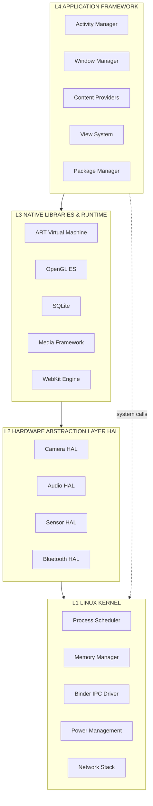
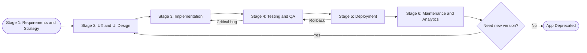
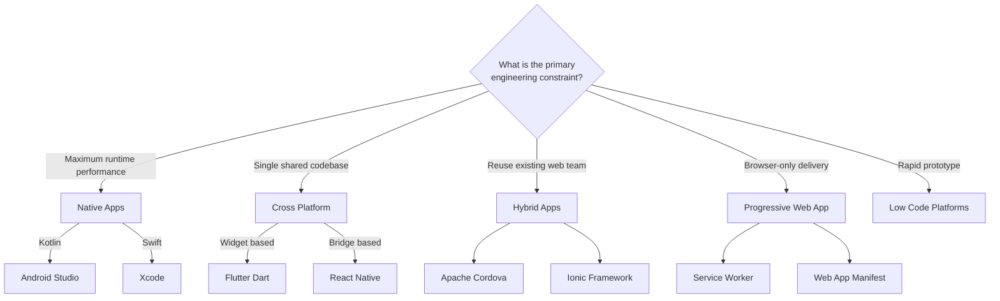
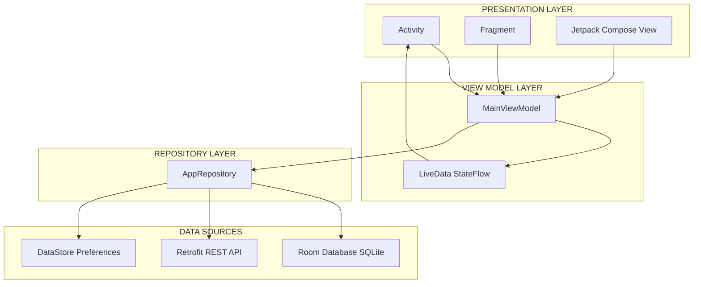
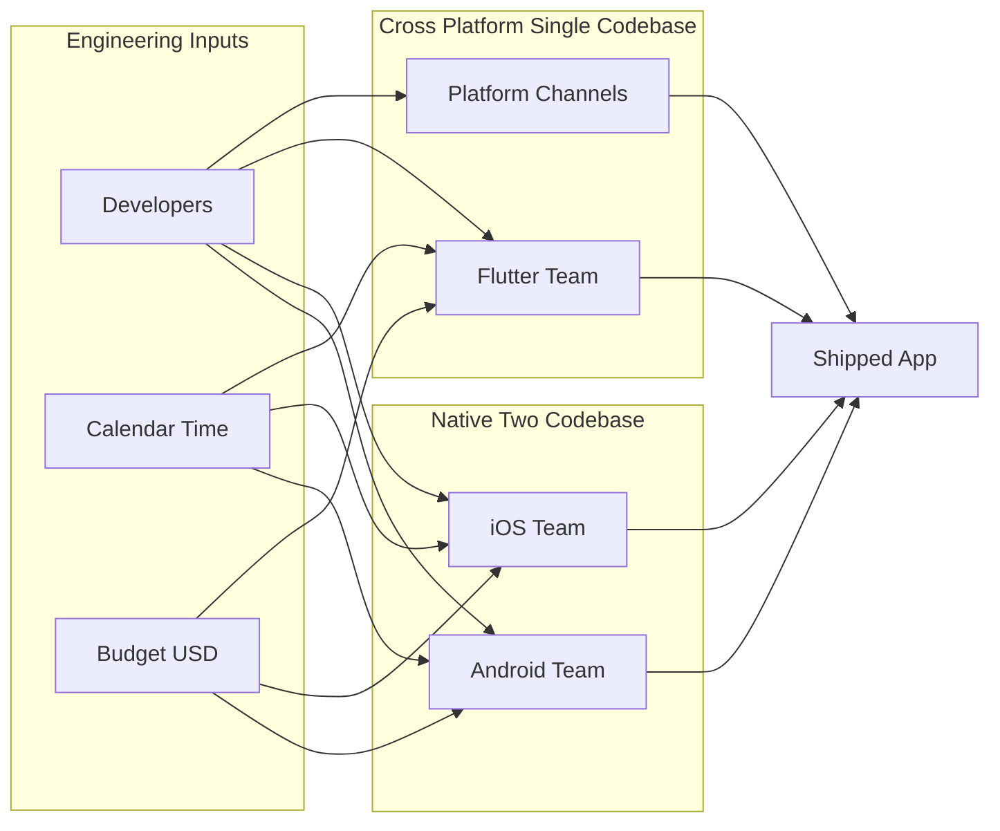

# Introduction to Mobile Application Development

<!-- SECTION_1_START -->
# 📱 Introduction to Mobile Application Development

## 1.1 Formal Academic Definition

> [!IMPORTANT]
> **Mobile Application Development (MAD)** is the disciplined process of conceiving, specifying, designing, coding, testing, debugging, deploying, and maintaining software applications that execute on mobile computing devices such as smartphones, tablets, smartwatches, and Internet-of-Things (IoT) endpoints. It is a specialised branch of software engineering constrained by the unique hardware, network, ergonomic, and battery-aware characteristics of mobile platforms.

According to the **KTU 2024 Scheme PECST695** syllabus, Module 1 grounds the student in the **fundamentals** of mobile application development, namely the taxonomy of mobile apps, the underlying mobile computing ecosystem, platform architectures (Android \& iOS), the **Software Development Kit (SDK)**, **Integrated Development Environment (IDE)**, emulators, and the diverse engineering approaches (native, web, hybrid, cross-platform).

## 1.2 Conceptual Analogy & Intuition

> [!NOTE]
> **The Restaurant Kitchen Analogy 🍳**
> Imagine a **mobile application** as a **restaurant kitchen**:
> - The **mobile operating system** (Android, iOS) is the *building* itself — it dictates the floor plan, the size of the oven, the gas pressure available.
> - The **SDK** is the *utensil set* provided by the building — every chef (developer) gets the same knives, pots, and pans.
> - The **IDE** (Android Studio, Xcode) is the *kitchen counter* — the workstation where chopping, mixing, and plating happen.
> - The **app code** is the *recipe* — the precise sequence of operations.
> - The **emulator/device** is the *tasting table* — where the dish is finally validated by the customer.
> - The **App Store / Play Store** is the *front-of-house* where the cooked dish is finally served to paying customers.

> Just as a chef must master the kitchen's constraints (gas, ventilation, prep time), a mobile developer must master the platform's constraints (battery, screen size, latency, permissions, fragmentation).

## 1.3 Why Mobile Application Development Matters in 2025+

The global mobile ecosystem has crossed several critical thresholds:

- **Mobile Traffic Share**: Mobile devices account for approximately **$58\%$** of all global web traffic (Statcounter 2024).
- **App Economy**: The combined app-store economy is projected to exceed **$\$600$ billion** in consumer spend.
- **Developer Population**: Over **$6$ million** mobile developers are active worldwide on the Play Store alone.
- **Edge Computing Shift**: Modern apps are no longer standalone — they are thin clients federating with cloud microservices, push-notification services (FCM / APNs), and on-device ML accelerators.

> [!IMPORTANT]
> **KTU 2024 Exam Note:** Questions in this module are typically framed around *taxonomy* (native/web/hybrid/cross-platform), *lifecycle phases*, and *platform comparison*. Memorising the differences between the four engineering approaches is **mandatory** for the 3-mark short-answer sections.

## 1.4 The Three Foundational Pillars of MAD

Every mobile application, irrespective of its complexity, rests on three non-negotiable pillars:

1. **Platform Fidelity** — Does the app honour the OS's design language (Material Design 3 for Android, Human Interface Guidelines for iOS) and utilise native widgets?
2. **Performance \& Resource Budget** — Does the app respect the **CPU**, **GPU**, **memory (RAM)**, **storage**, and **battery (mAh)** budgets? A modern smartphone typically operates within a thermal envelope of **$2$ – $5$ W**.
3. **User Experience (UX) Ergonomics** — Does the app follow the **thumb-zone**, **Fitts's Law**, and **Hick's Law** principles for touch interaction on screens ranging from **$4.7$"** to **$6.9$"**?

## 1.5 Visualisation Control Block

> [!VISUALIZATION CONTROL]
> **Concept:** Mobile App Development Approach Spectrum — *Performance vs. Time-to-Market Trade-off Curve*
> **GeoGebra / Desmos Input Equations:**
> * `Native(x) = (10 - x, x)` parametric — when code-sharing $x = 0$, performance $= 10$; when $x = 10$, performance $= 0$
> * `Web(x) = (x, 10 - x)` parametric — pure web is fast to build but performance-limited
> * `Hybrid(x) = (0.6*x + 2, 8 - 0.5*x)`
> * `CrossPlatform(x) = (0.7*x + 1, 9 - 0.6*x)`
> **Visual Description:** Plot four lines on a 2D plane where the **X-axis represents Time-to-Market (weeks)** and the **Y-axis represents Runtime Performance (benchmark score / $10$)**. The student should observe the inverse relationship: as code reusability increases, time-to-market shortens, but performance generally degrades. *Native* sits in the top-left, *Web* sits in the bottom-right, and *Hybrid* / *Cross-Platform* occupy the central efficient frontier.
<!-- SECTION_1_END -->

<!-- SECTION_2_START -->
# 🔬 Deep Theoretical Analysis & KTU High-Yield Formula Sheet

## 2.1 The Taxonomy of Mobile Applications

Mobile applications are broadly classified into **four** engineering approaches. Each carries distinct trade-offs across performance, cost, code-reusability, and platform access.

### 2.1.1 Native Applications
- Built **exclusively** for a single platform using platform-first languages:
  - **Android** → Kotlin / Java with the Android SDK
  - **iOS** → Swift / Objective-C with the iOS SDK
- Compiled to **machine code** (ART bytecode for Android, LLVM IR for iOS).
- Full access to platform APIs, sensors, hardware accelerators.
- Highest performance, but requires **duplicated engineering effort**.

### 2.1.2 Web Applications
- Server-hosted or locally-cached websites rendered inside a **mobile browser** (Chrome, Safari).
- Built with **HTML5**, **CSS3**, and **JavaScript** (or TypeScript transpiled to JS).
- **Zero** installation friction; runs on **any** device with a browser.
- Limited to the browser sandbox — no access to low-level hardware.

### 2.1.3 Hybrid Applications
- **Web code** (HTML/JS/CSS) wrapped inside a **native shell** (Cordova, Ionic, Apache Cordova).
- The web layer is rendered through a `WebView` component.
- Single codebase, but every UI gesture is bridged across the WebView boundary — incurring **latency**.
- Has access to a *subset* of device features through **plugin bridges**.

### 2.1.4 Cross-Platform Applications
- A single codebase is **compiled to native widgets** for each target platform.
- Frameworks: **React Native**, **Flutter (Dart)**, **Kotlin Multiplatform (KMP)**, **.NET MAUI**.
- The framework renders **native UI components** (not a WebView) — closing the performance gap with native apps.
- Examples: Instagram, Microsoft Outlook mobile, Google Ads, BMW Connected.

## 2.2 Mobile Operating System Architecture (Layered Model)

A modern mobile OS is structured into **four** abstract layers. Understanding this stack is essential for diagnosing memory, security, and performance issues.

| Layer | Android Implementation | iOS Implementation | Responsibility |
| :--- | :--- | :--- | :--- |
| **$L_1$ — Kernel** | Linux Kernel (modified) | XNU Hybrid Kernel | Process scheduling, memory management, device drivers, power management |
| **$L_2$ — HAL** | Hardware Abstraction Layer | IOKit | Vendor-defined hardware interface (camera HAL, audio HAL, sensors HAL) |
| **$L_3$ — Native Libraries \& Runtime** | ART (Android Runtime), Bionic libc, OpenGL ES, SQLite | Cocoa Touch, Core Foundation, libdispatch | Native C/C++ libraries, virtual machine / ahead-of-time compiler |
| **$L_4$ — Application Framework** | Activity Manager, Window Manager, Content Providers, View System | UIKit, SwiftUI, Foundation, AVFoundation | APIs that app developers directly invoke |

> [!NOTE]
> **The Activity ↔ ViewController Mapping:** On Android, a *screen* is an `Activity`. On iOS, a *screen* is a `UIViewController`. They are semantically identical but have different lifecycle hook signatures. KTU examiners frequently test this mapping.

## 2.3 The Mobile Application Development Lifecycle (MADLC)

The lifecycle is a **$6$-stage iterative waterfall** that maps to the broader software engineering lifecycle:

1. **Requirements \& Strategy** — User stories, market research, MoSCoW prioritisation, KPI definition.
2. **UX/UI Design** — Wireframes (low-fidelity) → Mockups (high-fidelity) → Interactive Prototypes in Figma / Adobe XD.
3. **Development** — Iterative coding in short sprints (Scrum or Kanban).
4. **Testing \& QA** — Unit tests, instrumentation tests, UAT, beta testing via TestFlight / Firebase App Distribution.
5. **Deployment** — App signing, store listing optimisation (ASO), staged rollout.
6. **Maintenance \& Analytics** — Crash monitoring (Crashlytics), A/B testing, OTA updates, version deprecation.

## 2.4 KTU High-Yield Cheat Sheet — Mobile App Engineering Metrics

> [!IMPORTANT]
> The following table consolidates the quantitative metrics and definitions that the KTU 2024 PECST695 module-1 paper expects you to write down verbatim in 3-mark definitions and to reference in 14-mark long answers.

| Metric / Term | Formula or Definition | Engineering Utility |
| :--- | :--- | :--- |
| **Daily Active Users (DAU)** | $\text{DAU} = \sum_{i=1}^{N} \mathbb{1}_{\text{active}}(u_i)$ where $\mathbb{1}$ is the indicator function | Measures stickiness on a single day |
| **Monthly Active Users (MAU)** | $\text{MAU} = \sum_{i=1}^{N} \mathbb{1}_{\text{active within 30d}}(u_i)$ | Long-term reach |
| **Stickiness Ratio** | $\text{Stickiness} = \dfrac{\text{DAU}}{\text{MAU}} \times 100\%$ | Engagement depth; ideal $\geq 20\%$ |
| **Crash-Free Users** | $\text{CFR} = \dfrac{U_{\text{total}} - U_{\text{crashed}}}{U_{\text{total}}} \times 100\%$ | Production stability gate ($\geq 99.5\%$) |
| **App Download Size** | $S_{\text{app}} = S_{\text{code}} + S_{\text{assets}} + S_{\text{resources}} + S_{\text{deps}}$ | Store-limit compliance (Play Store $\leq 150\,\text{MB}$ for base AAB) |
| **Cold Start Time** | $T_{\text{cold}} = T_{\text{process spawn}} + T_{\text{class load}} + T_{\text{UI inflate}} + T_{\text{first frame}}$ | UX-critical; target $\leq 2\,\text{s}$ on mid-tier devices |
| **Frame Jank Rate** | $\text{Jank} = \dfrac{F_{\text{dropped}}}{F_{\text{total}}} \times 100\%$ | Rendering smoothness; target $\leq 1\%$ at $60\,\text{fps}$ |
| **Memory Footprint** | $M_{\text{heap}} = M_{\text{objects}} + M_{\text{overhead}} + M_{\text{GC slack}}$ | OOM crash predictor |
| **Time-to-Market (TTM)** | $\text{TTM} = T_{\text{req freeze}} \to T_{\text{store approved}}$ | Business KPI |
| **Code Reusability** | $R_{\text{code}} = \dfrac{\text{LOC}_{\text{shared}}}{\text{LOC}_{\text{total}}} \times 100\%$ | Cross-platform ROI indicator |

> [!WARNING]
> When writing these formulas in the KTU answer sheet, **always define every variable** you introduce. Examiners deduct $1$ mark for an undefined symbol in a $14$-marker.

## 2.5 Platform Fragmentation: Why It Matters

**Fragmentation** refers to the dispersion of the user base across many OS versions, screen sizes, and device capabilities.

- **Android Fragmentation (2024)**: The Play Console dashboard reports active devices spanning **Android $5.0$ (API $21$)** to **Android $14$ (API $34$)** — a $10$-year compatibility window.
- **iOS Fragmentation (2024)**: Apple enforces a much tighter range, typically **iOS $15$ to iOS $17$** — roughly $93\%$ adoption within $18$ months.
- **Screen Density Buckets**: $ldpi$, $mdpi$, $hdpi$, $xhdpi$, $xxhdpi$, $xxxhdpi$ (DPI $= 120, 160, 240, 320, 480, 640$).
- **Aspect Ratios**: $16{:}9$, $18{:}9$, $19.5{:}9$, $20{:}9$, foldables ($1.21{:}1$ unfolded).

> [!TIP]
> **Engineering Real-World Utility:** Cross-platform frameworks like Flutter and React Native abstract fragmentation through a *logical pixel* unit (Flutter's `dp` or React Native's `pt`). This is the principal reason a single Flutter codebase can render identically on a $4$" budget device and a $6.9$" flagship.
<!-- SECTION_2_END -->

<!-- SECTION_3_START -->
# 🛠 Step-by-Step Derivations, Walkthroughs & Code Implementation

## 3.1 Exhaustive Walkthrough — Building Your First Android App ("Hello MAD")

This walkthrough assumes **Android Studio Iguana (2023.2.1)** or later, **Kotlin $1.9$**, **Android Gradle Plugin (AGP) $8.2$**, and **compileSdk $34$**. Every step is explicit; no command is summarised.

### Step 1 — Install the Toolchain

1. Download **Android Studio** from `developer.android.com/studio`.
2. Run the installer; ensure the **Android SDK Platform $34$**, **Android SDK Build-Tools $34.0.0$**, and **Android Virtual Device (AVD)** components are checked.
3. Open a terminal and verify:
   - `java -version` → must report **JDK $17$** or higher.
   - `sdkmanager --list_installed` → confirm `platforms;android-34` is present.

### Step 2 — Create a New Project

1. Launch Android Studio → **New Project** → **Empty Views Activity**.
2. Fill in the dialog:
   - **Name**: `HelloMAD`
   - **Package name**: `com.ktu.hellomad`
   - **Language**: `Kotlin`
   - **Minimum SDK**: `API 24 (Android 7.0)`
3. Click **Finish**. The Gradle sync will download dependencies — observe the bottom progress bar.

### Step 3 — Inspect the Project Skeleton

The IDE generates the following tree (annotated for clarity):

```
HelloMAD/
├── app/
│   ├── build.gradle.kts            ← module-level Gradle Kotlin DSL script
│   ├── src/
│   │   ├── main/
│   │   │   ├── AndroidManifest.xml ← app metadata and component declarations
│   │   │   ├── java/com/ktu/hellomad/
│   │   │   │   └── MainActivity.kt ← the entry-point Activity
│   │   │   └── res/
│   │   │       ├── layout/activity_main.xml  ← XML UI definition
│   │   │       └── values/strings.xml        ← localised string resources
├── build.gradle.kts                ← project-level Gradle script
├── settings.gradle.kts             ← Gradle module inclusion list
└── gradle/wrapper/                 ← Gradle Wrapper binary (version pin)
```

### Step 4 — The Kotlin Source File (Exhaustive)

Create or replace `app/src/main/java/com/ktu/hellomad/MainActivity.kt` with the following fully-commented code. **Every line is explained; do not skip any.**

```kotlin
// Package declaration — must match the AndroidManifest.xml package attribute.
package com.ktu.hellomad

// Import the AppCompatActivity base class which provides backward-compat theming.
import androidx.appcompat.app.AppCompatActivity
// Import the Bundle class to receive saved-instance state.
import android.os.Bundle
// Import the TextView widget that we will programmatically update.
import android.widget.TextView
// Import the Button widget for the click interaction.
import android.widget.Button
// Import the Toast helper for transient user feedback.
import android.widget.Toast

/**
 * MainActivity is the launcher screen of the Hello MAD application.
 * It extends AppCompatActivity to inherit Material-compatible theming
 * and lifecycle plumbing.
 */
class MainActivity : AppCompatActivity() {

    // Declare a nullable TextView reference at class scope so it is
    // visible to every method within the class.
    private var greetingText: TextView? = null
    private var actionButton: Button? = null

    /**
     * onCreate is invoked once per Activity instance lifetime.
     * @param savedInstanceState  Bundle that contains the previously
     *        saved state, or null on a cold start.
     */
    override fun onCreate(savedInstanceState: Bundle?) {
        // 1. Delegate the super-class onCreate so the framework can
        //    restore theming, action bar, and saved state plumbing.
        super.onCreate(savedInstanceState)

        // 2. Inflate the XML layout declared in res/layout/activity_main.xml.
        //    The framework converts the XML view tree into actual View objects.
        setContentView(R.layout.activity_main)

        // 3. Resolve view references via findViewById.
        //    The cast `as TextView` is required because findViewById returns View.
        greetingText  = findViewById(R.id.tvGreeting)
        actionButton  = findViewById(R.id.btnGreet)

        // 4. Set the initial TextView text using the strings.xml resource.
        greetingText?.text = getString(R.string.welcome_message)

        // 5. Register a click listener using a Kotlin SAM (Single Abstract Method) lambda.
        actionButton?.setOnClickListener {
            // 6. Build a short Toast that disappears automatically.
            Toast.makeText(
                this,                    // context = the enclosing Activity
                "Hello from KTU 2024!",  // message
                Toast.LENGTH_SHORT       // duration constant
            ).show()
        }
    }
}
```

### Step 5 — The XML Layout (Exhaustive)

Create or replace `app/src/main/res/layout/activity_main.xml`:

```xml
<?xml version="1.0" encoding="utf-8"?>
<!-- LinearLayout stacks its children vertically because of android:orientation.
     match_parent on width/height makes the container fill the device screen. -->
<LinearLayout
    xmlns:android="http://schemas.android.com/apk/res/android"
    android:layout_width="match_parent"
    android:layout_height="match_parent"
    android:orientation="vertical"
    android:gravity="center"
    android:padding="24dp"
    android:background="@color/white">

    <!-- Greeting TextView — pure presentation, no input. -->
    <TextView
        android:id="@+id/tvGreeting"
        android:layout_width="wrap_content"
        android:layout_height="wrap_content"
        android:textSize="24sp"
        android:textStyle="bold"
        android:textColor="@color/black"
        android:text="@string/welcome_message" />

    <!-- Spacer View — 16dp of empty vertical space for visual breathing room. -->
    <View
        android:layout_width="match_parent"
        android:layout_height="16dp" />

    <!-- Interactive Button — invokes the Toast on click. -->
    <Button
        android:id="@+id/btnGreet"
        android:layout_width="wrap_content"
        android:layout_height="wrap_content"
        android:text="@string/click_me"
        android:textSize="16sp" />

</LinearLayout>
```

### Step 6 — The Strings Resource (Localisation Ready)

Replace `app/src/main/res/values/strings.xml`:

```xml
<?xml version="1.0" encoding="utf-8"?>
<resources>
    <string name="app_name">Hello MAD</string>
    <string name="welcome_message">Welcome to KTU Mobile Application Development</string>
    <string name="click_me">Click Me</string>
</resources>
```

### Step 7 — The Manifest (Component Declaration)

Verify `app/src/main/AndroidManifest.xml`:

```xml
<?xml version="1.0" encoding="utf-8"?>
<manifest xmlns:android="http://schemas.android.com/apk/res/android">

    <application
        android:allowBackup="true"
        android:label="@string/app_name"
        android:supportsRtl="true"
        android:theme="@style/Theme.HelloMAD">

        <!-- MainActivity declared with intent-filter so it is launchable. -->
        <activity
            android:name=".MainActivity"
            android:exported="true">
            <intent-filter>
                <action android:name="android.intent.action.MAIN" />
                <category android:name="android.intent.category.LAUNCHER" />
            </intent-filter>
        </activity>

    </application>

</manifest>
```

### Step 8 — The Gradle Build Script (Module-Level)

Replace `app/build.gradle.kts`:

```gradle
plugins {
    id("com.android.application")      // applies the Android app plugin
    id("org.jetbrains.kotlin.android") // enables Kotlin Android support
}

android {
    namespace = "com.ktu.hellomad"
    compileSdk = 34

    defaultConfig {
        applicationId = "com.ktu.hellomad"
        minSdk = 24
        targetSdk = 34
        versionCode = 1
        versionName = "1.0"
    }

    buildTypes {
        release {
            isMinifyEnabled = false        // disable R8/ProGuard for simplicity
            proguardFiles(
                getDefaultProguardFile("proguard-android-optimize.txt"),
                "proguard-rules.pro"
            )
        }
    }

    compileOptions {
        sourceCompatibility = JavaVersion.VERSION_17
        targetCompatibility = JavaVersion.VERSION_17
    }

    kotlinOptions {
        jvmTarget = "17"
    }
}

dependencies {
    implementation("androidx.core:core-ktx:1.12.0")
    implementation("androidx.appcompat:appcompat:1.6.1")
    implementation("com.google.android.material:material:1.11.0")
}
```

### Step 9 — Build, Run, Validate

1. Connect a physical device with **USB Debugging** enabled, **or** create a virtual device via **Device Manager → Create Device → Pixel 6 → API $34$**.
2. Press **Shift + F10** (or click the green ▶ Run icon).
3. The Gradle build compiles, the APK is signed with the debug keystore, and the app launches.
4. Tap the button — the Toast "Hello from KTU 2024!" should appear for approximately **$2$ seconds**.

### Step 10 — Debugging with Logcat

Append the following line inside the click listener to instrument the code:

```kotlin
android.util.Log.d("HelloMAD", "Button tapped at timestamp = " + System.currentTimeMillis())
```

Open **Logcat** (bottom panel) → filter by tag `HelloMAD` → confirm the timestamp increments with each tap.

> [!NOTE]
> **Validation Output Expected:**
> 1. App icon labelled "Hello MAD" appears in the launcher.
> 2. Welcome message renders in the centre of the screen.
> 3. Tap on **Click Me** → a short toast appears.
> 4. Logcat shows one debug line per tap.

## 3.2 Engineering Comparative Analysis — Choosing the Right Approach

| Decision Vector | Native (Kotlin / Swift) | Cross-Platform (Flutter / RN) | Hybrid (Cordova / Ionic) | Web (PWA) |
| :--- | :--- | :--- | :--- | :--- |
| **Code Reusability** | $0\,\%$ (two codebases) | $80$ – $95\,\%$ | $90\,\%$ | $100\,\%$ |
| **Performance Score (out of $10$)** | $9$ – $10$ | $7$ – $9$ | $5$ – $7$ | $3$ – $5$ |
| **Time-to-Market (weeks for MVP)** | $12$ – $16$ | $6$ – $8$ | $6$ – $10$ | $3$ – $5$ |
| **Hardware Access** | $100\,\%$ | $90\,\%$ via plugins | $70\,\%$ via plugins | $\le 20\,\%$ |
| **App Store Distribution** | ✅ | ✅ | ✅ | ⚠ Optional (PWA installable) |
| **Offline Capability** | ✅ | ✅ | ✅ | ⚠ Limited via Service Workers |
| **Maintenance Cost** | High (two stacks) | Medium | Medium | Low |
| **Best Suited For** | High-fidelity games, AR/VR, fintech | Consumer apps, MVPs | Legacy web teams, internal tools | Content-driven, low-interactivity |
| **Example Apps** | WhatsApp, Pokémon GO | Instagram Ads, BMW Connected | Untappd, MarketWatch | Twitter Lite, Starbucks PWA |

> [!IMPORTANT]
> **KTU 14-Mark Trick Question:** *"Justify why a startup with limited budget and a $3$-month launch deadline should pick Flutter over native Android + native iOS."* — Use the comparative analysis above as the *core* of your justification. Map the trade-offs directly to the startup's constraints (budget = team size, deadline = time-to-market).
<!-- SECTION_3_END -->

<!-- SECTION_4_START -->
# 🗺 Structural Diagrams & Schematics

## 4.1 Mobile OS Layered Architecture (Android Reference Model)



## 4.2 Mobile App Development Lifecycle (MADLC)



## 4.3 Decision Tree — Choosing the Mobile App Engineering Approach



## 4.4 Mobile App Internal Architecture (MVVM + Repository Pattern)



## 4.5 Cross-Platform vs Native — Engineering Effort Sankey Schematic



> [!NOTE]
> The Sankey schematic above is a **block-level functional architecture flow** rather than a Sankey-area visualisation. It maps the distribution of engineering effort (developers, time, budget) into the two competing approaches so that the student can visually compare resource allocation.
<!-- SECTION_4_END -->

<!-- SECTION_5_START -->
# 📝 KTU 2024 Scheme Examination Question Bank

> [!IMPORTANT]
> The questions below are calibrated against the **KTU 2024 Scheme** end-semester examination pattern for **PECST695 — Mobile Application Development**, Module 1. Each question is tagged with the mapped **Course Outcome (CO)** and **Revised Bloom's Taxonomy (RBT)** level. Marks are awarded in the format used by the official valuation key.

---

## Part A — Short Answer Questions (2 × 3 = 6 Marks)

### Question 1 — `[KTU University Exam – December 2023]`
**List and briefly explain any three types of mobile applications based on their engineering approach.** *(3 Marks, CO1, RBT — Remember)*

**Model Answer (Board-Expected):**
The three principal types of mobile applications are:

1. **Native Applications** — These are built specifically for a single mobile operating system using the platform's first-party SDK and language. Examples: Android apps written in Kotlin using the Android SDK, iOS apps written in Swift using the iOS SDK. They deliver the highest performance and full access to device hardware (camera, GPS, Bluetooth, NFC, biometrics), but require two separate codebases.

2. **Web Applications** — These are responsive websites accessed through a mobile browser. Built with standard web technologies (HTML5, CSS3, JavaScript), they require no installation and run on any device. Their limitation is restricted access to device hardware due to the browser sandbox.

3. **Hybrid Applications** — These wrap a web codebase (HTML/JS/CSS) inside a thin native shell using frameworks like Apache Cordova or Ionic. The web layer renders inside an embedded WebView. A plugin bridge exposes a subset of device APIs. They offer code reusability at the cost of performance.

*(Valuation Key: 1 mark for naming each type correctly, 0 marks for vague descriptions.)*

### Question 2 — `[KTU University Exam – July 2024]`
**Define SDK and IDE in the context of mobile application development. Give one example of each.** *(3 Marks, CO1, RBT — Remember)*

**Model Answer (Board-Expected):**
- **SDK (Software Development Kit)** is a collection of software tools, libraries, documentation, code samples, and emulators that enables developers to build applications for a specific platform. *Example: Android SDK, iOS SDK.*
- **IDE (Integrated Development Environment)** is the graphical application that integrates a source-code editor, compiler, debugger, profiler, and build automation into a single workspace. *Example: Android Studio (for Android), Xcode (for iOS).*

*(Valuation Key: 1 mark for SDK definition + example, 1 mark for IDE definition + example, 1 mark for clarity of explanation.)*

---

## Part B — Long Answer Questions (Internal Choice, 1 × 14 = 14 Marks)

> **[Stating the four engineering approaches: 4 Marks]**
> **[Explaining the architecture of any one approach: 5 Marks]**
> **[Comparative table: 3 Marks]**
> **[Concluding engineering recommendation: 2 Marks]**

### Question 3A — `[KTU University Exam – December 2023]`
**(a)** Explain the four major mobile app development approaches (Native, Web, Hybrid, Cross-Platform) with suitable diagrams. *(7 Marks, CO1, RBT — Understand)*

**(b)** Compare Native and Cross-Platform development on the parameters of performance, code reusability, hardware access, time-to-market, and maintenance cost. *(7 Marks, CO2, RBT — Apply)*

#### Model Solution for (a):
The four approaches are:
1. **Native** — Platform-specific compilation, e.g., Kotlin → Android (ART) and Swift → iOS (LLVM). Uses first-party SDKs. Diagram: a two-track pipeline where each track represents a separate codebase.
2. **Web** — Pure HTML5/CSS3/JS rendered by a mobile browser. The same codebase is served to every device.
3. **Hybrid** — HTML5/CSS3/JS wrapped inside a native shell; the WebView renders the UI. A plugin layer bridges to device APIs.
4. **Cross-Platform** — A single Dart or JS codebase is compiled to native widgets for each target OS by the framework's engine (e.g., Flutter's Skia rendering pipeline).

*Refer to the Mermaid decision tree in Section 4.3 for the supporting diagram. State the decision criteria, the resulting approach, and the technology used.*

*Valuation Key:*
- *Naming each approach with technology: 4 × 0.5 = 2 Marks*
- *One-line description per approach: 4 × 0.5 = 2 Marks*
- *Diagrammatic representation: 1 Mark*
- *Briefly stating the limitation of each: 2 Marks*

#### Model Solution for (b):
| Parameter | Native | Cross-Platform |
| :--- | :--- | :--- |
| **Performance** | Optimal — compiled to machine code | Near-native (7–9/10) |
| **Code Reusability** | $0\,\%$ — two codebases | $80$ – $95\,\%$ |
| **Hardware Access** | $100\,\%$ | $90\,\%$ via plugins |
| **Time-to-Market** | $12$ – $16$ weeks (MVP) | $6$ – $8$ weeks (MVP) |
| **Maintenance** | High (two stacks) | Medium (single codebase) |

*Valuation Key:*
- *Tabulating five parameters: 5 Marks*
- *Stating engineering recommendation (e.g., "Use Native for high-fidelity games, Cross-Platform for MVPs and consumer apps"): 2 Marks*

---

### Question 3B — `[KTU University Exam – July 2024]` (Alternative Choice)
**(a)** With a neat block diagram, describe the layered architecture of the Android Operating System. *(7 Marks, CO1, RBT — Understand)*

**(b)** Discuss the role of the Android Runtime (ART) in modern Android development. How does it differ from the legacy Dalvik Virtual Machine? *(7 Marks, CO2, RBT — Apply)*

#### Model Solution for (a):
The Android OS is structured into **four** abstract layers (refer to the Mermaid diagram in Section 4.1):
1. **Linux Kernel (Layer 1)** — Manages process scheduling, memory, power, and device drivers. Provides the security model.
2. **Hardware Abstraction Layer — HAL (Layer 2)** — Vendor-specific interface to camera, audio, sensors, and Bluetooth.
3. **Native Libraries \& Android Runtime — ART (Layer 3)** — C/C++ libraries (OpenGL ES, SQLite, WebKit) plus the ART virtual machine that executes DEX bytecode.
4. **Application Framework (Layer 4)** — High-level Java/Kotlin APIs: Activity Manager, Window Manager, Content Providers, View System, Package Manager.

*Valuation Key:*
- *Stating four layers with clear demarcation: 4 Marks*
- *Two examples per layer: 2 Marks*
- *Neat block diagram: 1 Mark*

#### Model Solution for (b):
**Role of ART:**
- Executes the **DEX (Dalvik Executable)** bytecode generated by the Kotlin/Java compiler.
- Provides **Ahead-of-Time (AOT) compilation**, **Just-in-Time (JIT) compilation**, and **profile-guided optimisation** since Android $7.0$ (API $24$).
- Manages **garbage collection**, **memory allocation**, **threading**, and **class loading**.
- Enables advanced features like **concurrent compacting GC**, **Generational GC** (Android $11+$), and **ART Lazy Class Loading**.

**ART vs Dalvik:**

| Feature | Dalvik (Legacy) | ART (Modern) |
| :--- | :--- | :--- |
| **Compilation Strategy** | JIT only | AOT + JIT + Profile-guided |
| **App Install Time** | Faster | Slower (AOT compilation overhead) |
| **App Runtime Speed** | Slower | Faster (pre-compiled native code) |
| **Battery Consumption** | Higher (frequent JIT) | Lower |
| **Memory Footprint** | Lower (no AOT cache) | Higher (AOT cache in `/data/dalvik-cache/`) |
| **Garbage Collector** | Mark-and-sweep with long pauses | Concurrent, generational, low-pause |

*Valuation Key:*
- *Stating three roles of ART: 3 Marks*
- *Comparative table with five rows: 3 Marks*
- *Conclusion linking ART to modern app performance: 1 Mark*

---

> [!WARNING]
> **KTU Examiner's Valuation Warning / Pitfall Callout** 🚨
> - **Do NOT confuse** `Activity` (Android) with `UIViewController` (iOS) — they are *semantically* equivalent but *syntactically* different. Examiners check for the **correct lifecycle method names**: `onCreate()` vs `viewDidLoad()`.
> - **Do NOT skip writing the formula** for performance metrics in $14$-mark questions. Even a rough expression like $T_{\text{cold}} = T_{\text{process}} + T_{\text{UI}}$ earns a partial mark.
> - **Always state the package name** (`com.ktu.hellomad`) in code-based questions; missing package declarations are penalised $0.5$ – $1$ mark.
> - **Do NOT write vague statements** like *"Hybrid apps are better"* — always *justify* with a parameter and a context.
> - **Draw a labelled block diagram** whenever the question says *"with a neat diagram"*. A diagram without labels fetches $1$ mark out of the allotted $1$ – $2$ marks.
> - **Avoid using the term "mobile app" without specifying the type** (native, web, hybrid, cross-platform) in $14$-mark answers.

---

## 🧠 Topic Recap & Important Things to Remember

- **Mobile Application Development** is the end-to-end engineering process of conceiving, building, testing, deploying, and maintaining software for mobile devices.
- The **four engineering approaches** are **Native, Web, Hybrid, and Cross-Platform** — memorise the technology stack, performance score, and code-reusability percentage for each.
- **Native = maximum performance, minimum reuse**; **Web = maximum reuse, minimum performance**; **Hybrid** and **Cross-Platform** are central trade-off points on the engineering frontier.
- The **Android OS** is a **four-layer stack**: Linux Kernel → HAL → Native Libraries \& ART → Application Framework.
- The **iOS OS** uses the **XNU hybrid kernel**, **Cocoa Touch framework**, and **SwiftUI / UIKit** for UI.
- **SDK** = *what* you build with; **IDE** = *where* you build.
- The **MADLC** has **six stages**: Requirements → Design → Development → Testing → Deployment → Maintenance.
- Key quantitative metrics: **DAU, MAU, Stickiness, Crash-Free Rate, Cold Start Time, Jank Rate**.
- **Fragmentation** is more severe on Android than iOS — design defensively using logical pixel units (`dp` on Android, `pt` on iOS).
- The **KTU $14$-marker** typically asks for an **explain-and-compare** pattern: explain $X$ for $7$ marks, compare $X$ with $Y$ on five parameters for $7$ marks.
- Always **define your variables** in formula-based answers.
- Always **draw a labelled block diagram** when prompted with *"with a neat diagram"*.
<!-- SECTION_5_END -->
