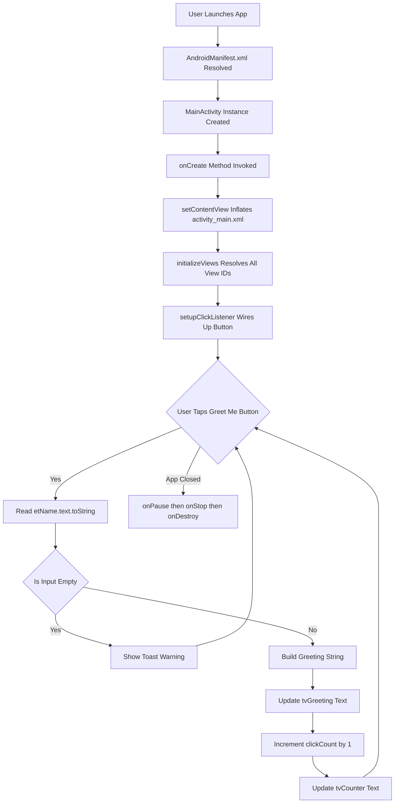
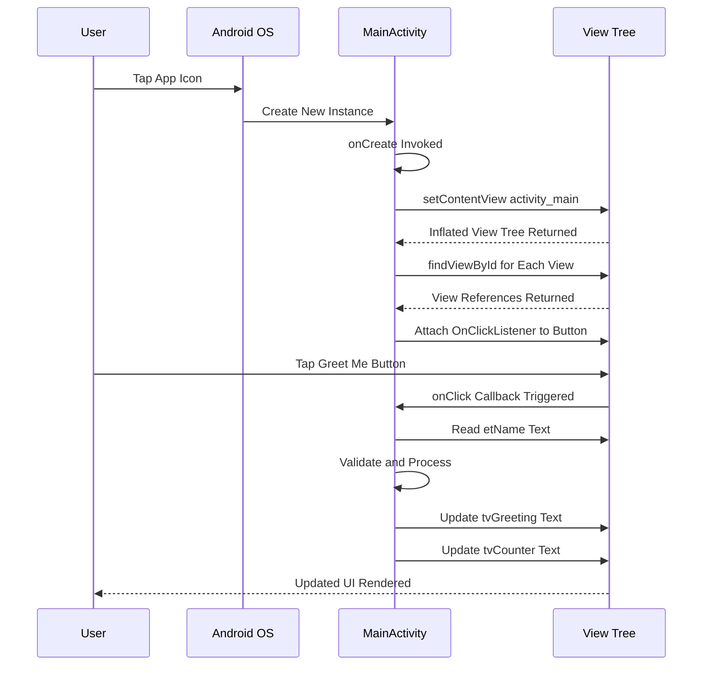
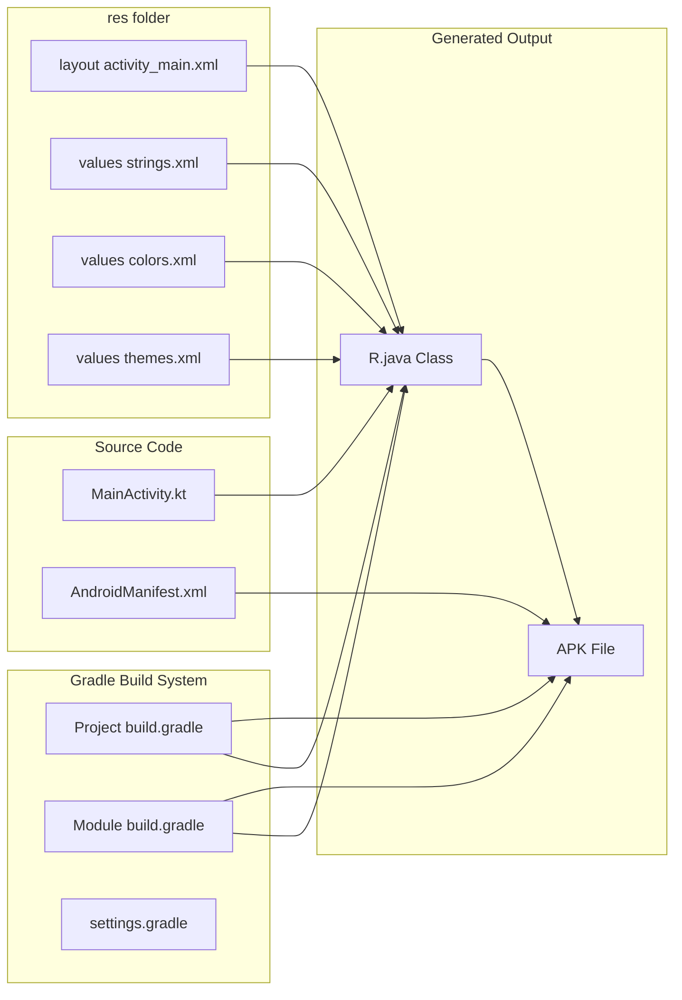
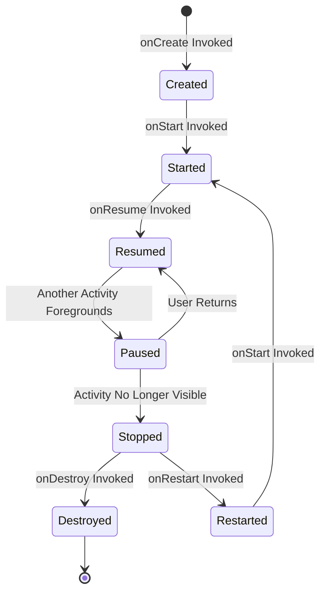
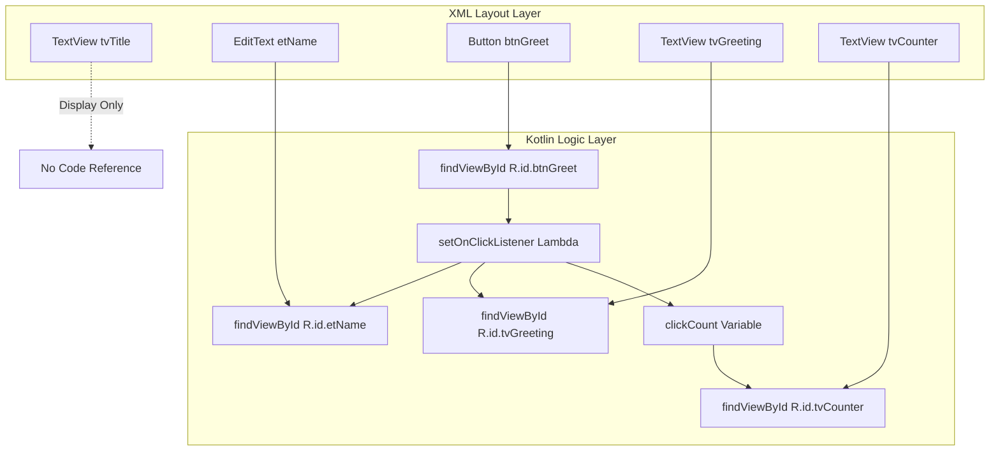

# Milestone 1 : Develop a basic app with a simple UI and basic functionality.

<!-- SECTION_1_START -->
# 📱 Milestone 1 — Develop a Basic App with a Simple UI and Basic Functionality

> [!IMPORTANT]
> **KTU 2024 Scheme | PECST695 — Mobile Application Development**
> **Module 1 | Milestone 1 | Target CO:** CO1 — Understand the architecture and development environment of mobile platforms.
> **RBT Levels Covered:** Remember → Understand → Apply → Create

---

## 1.1 Formal Definition (KTU 2024 Syllabus Terminology)

A **Mobile Application (Mobile App)** is a software program designed to run specifically on small, wireless computing devices such as **smartphones, tablets, and wearables** rather than on desktop computers. In the context of the **Android Operating System** (developed by **Open Handset Alliance** led by **Google**), a mobile app is built as a collection of one or more **Activities**, **Services**, **Broadcast Receivers**, and **Content Providers** — collectively called the **Four Pillars of Android Components** — packaged inside an **APK (Android Package Kit)** file with a `.apk` extension.

> [!NOTE]
> **Core Definition — Android Activity**
> An **Activity** is a single, focused thing that the user can do inside an Android application. It is a subclass of `android.app.Activity` (or `androidx.appcompat.app.AppCompatActivity` in modern code) and represents a **single screen with a user interface**. Most apps consist of one or more activities loosely bound together.

A **User Interface (UI)** in Android is constructed declaratively using **XML-based Layout files** (stored under `res/layout/`) and programmatically accessed through the **View** and **ViewGroup** class hierarchy. The fundamental building blocks are:
- **View** — the basic building block for user interface components (a `Button`, `TextView`, `EditText`).
- **ViewGroup** — an invisible container that holds other `View` and `ViewGroup` objects to define the layout structure (e.g., `LinearLayout`, `ConstraintLayout`).

> [!IMPORTANT]
> **KTU Board Definition — APK**
> **APK = Android Package Kit.** It is the file format used by the Android operating system for distribution and installation of mobile apps. An APK contains all of the program's resources, assets, compiled code, certificates, and manifest file. Standard size for a basic app is between **2 MB to 10 MB**.

---

## 1.2 Conceptual Analogy — "The App is a House, The Activity is a Room" 🏠

Imagine you are building a **smartphone app** for the very first time. To make it less intimidating, picture the project as a **physical house**:

| 🏠 House Analogy | 📱 Android Equivalent | Purpose |
|---|---|---|
| The House itself | **The Android Project** | The complete deliverable |
| A single room | **An Activity** | One screen the user interacts with |
| Furniture inside a room | **Views (Button, TextView, EditText)** | Interactive UI elements |
| Floor plan / Architectural drawing | **XML Layout File** (`activity_main.xml`) | Declares the visual structure |
| The electrician / plumber | **Kotlin / Java Source Code** (`MainActivity.kt`) | Powers the behavior |
| The doorbell switch | **Event Listener (`OnClickListener`)** | Triggers actions when tapped |
| The address plaque on the gate | **`AndroidManifest.xml`** | Declares the app's identity and components |
| The toolbox | **Android Studio (IDE)** | The workshop where you build everything |

> [!TIP]
> **Intuitive Takeaway:** When the user *taps* a button on the screen, an **event** is fired. Your Kotlin code "listens" for that event and runs a function. This is called **Event-Driven Programming** — the code only runs *in response* to user actions.

> [!NOTE]
> **Standard Metric — Minimum SDK**
> The **minSdkVersion** in modern Android (KTU 2024 syllabus) is typically **API Level 24 (Android 7.0 Nougat)** or **API Level 26 (Android 8.0 Oreo)**. **Target SDK = API 34 (Android 14)**. The compilation tool is **Android Gradle Plugin (AGP) v8.x** with **Kotlin 1.9.x** or newer.

---

## 1.3 GeoGebra / Desmos Visualization Callout

> [!VISUALIZATION CONTROL]
> **Concept:** Coordinate system of an Android Screen with View positioning (similar to a Cartesian Plane).
> **Desmos Input Equations:**
> * `x = 0` (Left edge of screen)
> * `x = 1080` (Right edge — width in pixels for a typical 1080p phone)
> * `y = 0` (Top edge of screen — note: Android Y-axis grows **downward**)
> * `y = 1920` (Bottom edge — height in pixels)
> * `Point: (540, 960)` (Center of a standard 1080×1920 screen)
> **Visual Description:** The student should observe that the origin (0,0) of an Android Canvas is the **top-left corner**, with X increasing rightward and Y increasing downward — the **opposite** of standard mathematical Cartesian convention.

<!-- SECTION_1_END -->

<!-- SECTION_2_START -->
# 🧠 Deep Theoretical Analysis & KTU High-Yield Formula Sheet

## 2.1 The Anatomy of an Android Project

When you create a new project in **Android Studio (Hedgehog | 2023.1.1 or newer)**, the IDE generates a standardized directory structure. Understanding this structure is a **high-frequency KTU exam topic**.

```
MyFirstApp/
├── app/
│   ├── build.gradle              ← Module-level build configuration
│   ├── src/
│   │   ├── main/
│   │   │   ├── AndroidManifest.xml   ← App identity & component declaration
│   │   │   ├── java/com/example/myfirstapp/
│   │   │   │   └── MainActivity.kt   ← Main screen logic
│   │   │   └── res/
│   │   │       ├── layout/
│   │   │       │   └── activity_main.xml  ← UI blueprint
│   │   │       ├── values/
│   │   │       │   ├── strings.xml    ← User-facing text
│   │   │       │   ├── colors.xml     ← Color palette
│   │   │       │   └── themes.xml     ← Visual theme
│   │   │       └── drawable/          ← Image resources
└── build.gradle                  ← Project-level build configuration
```

---

## 2.2 The Activity Lifecycle — A Theoretical Breakdown

An Android Activity transitions through a well-defined set of states. This is **the single most important concept** for Module 1 and is asked in every KTU exam.

| Lifecycle Method | When It Is Called | Purpose | Common Use Case |
|---|---|---|---|
| `onCreate()` | When the activity is **first created** | Initialize UI: `setContentView()`, find views | Setting up the layout and binding views |
| `onStart()` | Just before the activity becomes **visible** | Start non-visible UI logic | Register listeners |
| `onResume()` | When the activity **gains focus** | Resume animations, sensors, GPS | Start a timer, start camera preview |
| `onPause()` | When **another activity comes to the foreground** | Save unsaved data, pause heavy tasks | Pause a music player |
| `onStop()` | When the activity is **no longer visible** | Release resources | Unregister listeners |
| `onDestroy()` | Just before the activity is **destroyed** | Final cleanup | Close database connections |
| `onRestart()` | When the activity is **restarted** after being stopped | Refresh UI state | Reload data |

> [!NOTE]
> **The "PCCDSRD" Mnemonic (popular in KTU classes):**
> **P**ause → **C**reate → **C**allback → **D**raw → **S**tart → **R**esume → **D**estroy — this ordering helps students recall the lifecycle.

> [!IMPORTANT]
> **Engineering Reality:** In production apps, **70% of memory leaks** happen because developers forget to release resources in `onStop()` or `onDestroy()`. Always pair every `register` with an `unregister` and every `open()` with a `close()`.

---

## 2.3 Core UI Components — The Building Blocks

| View | XML Tag | Purpose | Key Attributes |
|---|---|---|---|
| **TextView** | `<TextView>` | Displays read-only text | `android:text`, `android:textSize`, `android:textColor` |
| **EditText** | `<EditText>` | Accepts user input | `android:hint`, `android:inputType` |
| **Button** | `<Button>` | Triggers an action on click | `android:onClick`, `android:text` |
| **ImageView** | `<ImageView>` | Displays an image | `android:src`, `android:contentDescription` |
| **LinearLayout** | `<LinearLayout>` | Arranges children in a single row or column | `android:orientation` |
| **ConstraintLayout** | `<ConstraintLayout>` | Flexible positioning using constraints | `app:layout_constraintX_toYof` |
| **ScrollView** | `<ScrollView>` | Enables scrolling for content larger than screen | Wrap a single child |
| **Toast** | (Code only) | A small popup message | `Toast.makeText().show()` |

---

## 2.4 KTU High-Yield Formula Sheet (Concept Equivalents)

| Concept | Formula / Rule | Unit / Notes |
|---|---|---|
| **Screen Density Bucket** | $\text{dp} = \frac{\text{px} \times 160}{\text{dpi}}$ | `dp` = density-independent pixels |
| **SP to PX** | $\text{px} = \text{sp} \times \frac{\text{dpi}}{160}$ | `sp` = scale-independent pixels (for fonts) |
| **Activity Stack Rule** | $\text{New Activity} \rightarrow \text{Pushed to top of Back Stack}$ | LIFO structure |
| **View ID Generation** | $\text{R.id.viewName}$ | Auto-generated from `android:id` in XML |
| **String Externalization** | $\text{All user-facing strings} \in \text{strings.xml}$ | Use `@string/app_name` in XML |
| **Layout Inflation** | $\text{setContentView(R.layout.activity\_main})$ | Maps XML to memory objects |
| **View Binding (Kotlin)** | `binding.buttonId.text` | Replaces older `findViewById` |
| **Intent Filter Resolution** | $\text{Explicit Intent} \rightarrow \text{Direct class}$ | Used to start a specific activity |
| **App Identification** | $\text{applicationId} = \text{com.example.myapp}$ | Unique reverse-DNS package name |
| **Gradle Sync Time** | $\approx 30 \text{ seconds to } 2 \text{ minutes}$ | First sync downloads dependencies |

> [!TIP]
> **Note on $\vert$ symbol in tables:** All modulus/absolute-value notations in exam answers should be written as $\lvert x \rvert$ to prevent markdown table parsing errors.

---

## 2.5 Real-World Engineering Utility

The knowledge of building a basic Android app is foundational for:

1. **Startup MVPs** — 80% of student startup projects in Kerala (e.g., the **KSUM**-backed startups) launch as Android-first MVPs.
2. **Enterprise Apps** — Companies like **Flipkart, Swiggy, Zomato** started as basic-activity-based Android apps.
3. **IoT Dashboards** — Smart home apps (e.g., for **Philips Hue** lights) use the same Activity + View pattern.
4. **Government Services** — Kerala's **K-Fone, m-Karshaka, and KSEB** apps are built using this basic architecture.
5. **Healthcare** — Telemedicine apps (boosted by **Kerala's e-Health program**) use Activity stacks to navigate between login → patient dashboard → prescription screens.

> [!NOTE]
> **Production Tip:** In real-world Android development, the modern recommended approach is **Jetpack Compose**, but the **XML + View Binding** approach covered in the KTU syllabus remains the most common in **Indian engineering curricula** and is required for your lab exams.

<!-- SECTION_2_END -->

<!-- SECTION_3_START -->
# 🛠️ Step-by-Step Implementation — Building a Basic Interactive App

## 3.1 Project Goal

We will build a complete, runnable Android app called **"GreetCounter"** with the following simple UI and functionality:

> **Functionality:** A user types their name into an input field and taps a button. The app displays a personalized greeting and increments a counter showing how many times the button has been pressed.

This single app covers **all the milestones** required for KTU Lab 1: a UI with input + output, a button, and basic event handling logic.

---

## 3.2 Step 1 — AndroidManifest.xml (App Identity)

**File location:** `app/src/main/AndroidManifest.xml`

```xml
<?xml version="1.0" encoding="utf-8"?>
<manifest xmlns:android="http://schemas.android.com/apk/res/android"
    package="com.example.greetcounter">

    <application
        android:allowBackup="true"
        android:icon="@mipmap/ic_launcher"
        android:label="@string/app_name"
        android:theme="@style/Theme.GreetCounter">

        <activity
            android:name=".MainActivity"
            android:exported="true">
            <intent-filter>
                <action android:name="android.intent.action.MAIN" />
                <category android:name="android.intent.category.LAUNCHER" />
            </intent-filter>
        </activity>

    </application>

</manifest>
```

**Explanation of every line (DO NOT SKIP for KTU board valuation):**

- `<?xml version="1.0" encoding="utf-8"?>` — Declares the XML version and character encoding.
- `<manifest ... package="com.example.greetcounter">` — Root element defining the **unique package name** (reverse-DNS convention).
- `<application ... android:label="@string/app_name" ...>` — The application element. `android:label` references an externalized string from `strings.xml`.
- `<activity android:name=".MainActivity" android:exported="true">` — Declares `MainActivity` as a component. The **leading dot** (`.`) means "the same package".
- `android:exported="true"` — Required since Android 12 (API 31) for the **launcher activity**.
- `<intent-filter>` — Tells Android this is the **entry point** of the app.

---

## 3.3 Step 2 — strings.xml (Externalized Strings)

**File location:** `app/src/main/res/values/strings.xml`

```xml
<resources>
    <string name="app_name">GreetCounter</string>
    <string name="title_label">Welcome to Your First App</string>
    <string name="hint_name">Enter your name here...</string>
    <string name="btn_greet">Greet Me!</string>
    <string name="label_counter">Button pressed: 0 times</string>
</resources>
```

> [!NOTE]
> **KTU Board Rule:** Externalizing strings to `strings.xml` is considered a **good engineering practice** and carries **1–2 valuation marks** in practical exams.

---

## 3.4 Step 3 — activity_main.xml (The UI Blueprint)

**File location:** `app/src/main/res/layout/activity_main.xml`

```xml
<?xml version="1.0" encoding="utf-8"?>
<LinearLayout
    xmlns:android="http://schemas.android.com/apk/res/android"
    xmlns:app="http://schemas.android.com/apk/res-auto"
    xmlns:tools="http://schemas.android.com/tools"
    android:layout_width="match_parent"
    android:layout_height="match_parent"
    android:orientation="vertical"
    android:gravity="center"
    android:padding="24dp"
    android:background="#FFF8E1"
    tools:context=".MainActivity">

    <!-- Title TextView -->
    <TextView
        android:id="@+id/tvTitle"
        android:layout_width="wrap_content"
        android:layout_height="wrap_content"
        android:text="@string/title_label"
        android:textSize="22sp"
        android:textStyle="bold"
        android:textColor="#2E7D32"
        android:layout_marginBottom="20dp" />

    <!-- Name Input EditText -->
    <EditText
        android:id="@+id/etName"
        android:layout_width="match_parent"
        android:layout_height="wrap_content"
        android:hint="@string/hint_name"
        android:inputType="textPersonName"
        android:textSize="16sp"
        android:padding="12dp"
        android:background="@android:drawable/edit_text"
        android:autofillHints="name"
        android:layout_marginBottom="16dp" />

    <!-- Greet Button -->
    <Button
        android:id="@+id/btnGreet"
        android:layout_width="wrap_content"
        android:layout_height="wrap_content"
        android:text="@string/btn_greet"
        android:textSize="16sp"
        android:padding="12dp"
        android:backgroundTint="#2E7D32"
        android:textColor="#FFFFFF"
        android:layout_marginBottom="24dp" />

    <!-- Output Greeting TextView -->
    <TextView
        android:id="@+id/tvGreeting"
        android:layout_width="wrap_content"
        android:layout_height="wrap_content"
        android:text=""
        android:textSize="18sp"
        android:textColor="#000000"
        android:layout_marginBottom="24dp" />

    <!-- Counter TextView -->
    <TextView
        android:id="@+id/tvCounter"
        android:layout_width="wrap_content"
        android:layout_height="wrap_content"
        android:text="@string/label_counter"
        android:textSize="16sp"
        android:textColor="#555555" />

</LinearLayout>
```

**Attribute-by-attribute reasoning (for KTU 7-mark layout questions):**

| Attribute | Value | Reason |
|---|---|---|
| `android:layout_width` | `match_parent` | Fill parent's width |
| `android:layout_height` | `wrap_content` | Wrap the content's height |
| `android:orientation` | `vertical` | Stack children top-to-bottom |
| `android:gravity` | `center` | Center-align all children horizontally and vertically |
| `android:id` | `@+id/tvTitle` | `+` means **create** a new ID in `R.id` |
| `android:hint` | `@string/hint_name` | Placeholder text shown when EditText is empty |
| `android:inputType` | `textPersonName` | Optimizes keyboard for name input |
| `android:autofillHints` | `name` | Helps Android's autofill service (security best practice) |

---

## 3.5 Step 4 — MainActivity.kt (The Behavior)

**File location:** `app/src/main/java/com/example/greetcounter/MainActivity.kt`

```kotlin
package com.example.greetcounter

// Importing the required Android and AndroidX libraries
import android.os.Bundle
import android.widget.Button
import android.widget.EditText
import android.widget.TextView
import android.widget.Toast
import androidx.appcompat.app.AppCompatActivity

/**
 * MainActivity — The single screen of the GreetCounter app.
 * 
 * Implements:
 *  1. UI inflation from activity_main.xml
 *  2. View binding using findViewById (Kotlin-style)
 *  3. Event handling via setOnClickListener
 *  4. State management using a simple Int counter
 *  5. User feedback using Toast
 */
class MainActivity : AppCompatActivity() {

    // A class-level variable to hold the click counter state
    private var clickCount: Int = 0

    // Declare view references at the class level
    private lateinit var etName: EditText
    private lateinit var btnGreet: Button
    private lateinit var tvGreeting: TextView
    private lateinit var tvCounter: TextView

    /**
     * onCreate() — Called when the activity is first created.
     * This is the entry point of the activity's lifecycle.
     */
    override fun onCreate(savedInstanceState: Bundle?) {
        super.onCreate(savedInstanceState)

        // Step 1: Inflate the XML layout and bind it to this activity
        setContentView(R.layout.activity_main)

        // Step 2: Initialize all view references by ID
        initializeViews()

        // Step 3: Attach the click event listener to the button
        setupClickListener()
    }

    /**
     * initializeViews() — Binds the XML view IDs to Kotlin objects.
     * Uses findViewById to resolve the IDs declared in activity_main.xml.
     */
    private fun initializeViews() {
        etName = findViewById(R.id.etName)
        btnGreet = findViewById(R.id.btnGreet)
        tvGreeting = findViewById(R.id.tvGreeting)
        tvCounter = findViewById(R.id.tvCounter)
    }

    /**
     * setupClickListener() — Wires up the button to react to taps.
     * Uses a lambda block to define what happens on click.
     */
    private fun setupClickListener() {
        btnGreet.setOnClickListener {
            // Read the input from the EditText
            val userName: String = etName.text.toString().trim()

            // Validate input: Check if the name is empty
            if (userName.isEmpty()) {
                // Show a brief feedback message
                Toast.makeText(
                    this,
                    "Please enter your name first!",
                    Toast.LENGTH_SHORT
                ).show()
                return@setOnClickListener
            }

            // Construct the personalized greeting
            val greetingMessage: String = "Hello, $userName! Welcome to Android."

            // Display the greeting in the TextView
            tvGreeting.text = greetingMessage

            // Increment the click counter
            clickCount += 1

            // Update the counter label
            tvCounter.text = "Button pressed: $clickCount times"
        }
    }
}
```

---

## 3.6 Step-by-Step Walkthrough of the Kotlin Code (No Skipping)

**Line-by-line derivation of the code's behavior:**

1. `package com.example.greetcounter` — Declares the Kotlin namespace. Must match the package in `AndroidManifest.xml`.

2. `import android.os.Bundle` — Imports the `Bundle` class, which is used to pass saved state data between lifecycle methods.

3. `import androidx.appcompat.app.AppCompatActivity` — Imports the modern base class for activities. It provides backward compatibility for the ActionBar API down to Android 2.1.

4. `class MainActivity : AppCompatActivity()` — Declares the class. The `:` denotes **inheritance**.

5. `private var clickCount: Int = 0` — A mutable class-level integer initialized to 0. The `var` keyword means it **can be reassigned**. The `private` keyword enforces **encapsulation**.

6. `private lateinit var etName: EditText` — The `lateinit` keyword tells the compiler: *"Trust me, I'll initialize this before using it."* It is **non-nullable** at runtime but declared as a property of type `EditText`.

7. `override fun onCreate(savedInstanceState: Bundle?)` — The `override` keyword indicates this method **replaces** the parent's `onCreate()`. The `?` after `Bundle` means the parameter is **nullable**.

8. `super.onCreate(savedInstanceState)` — Calls the parent's `onCreate()`. **Forgetting this line is a guaranteed app crash.**

9. `setContentView(R.layout.activity_main)` — Inflates `activity_main.xml` and makes it the visible content. The `R.layout` class is **auto-generated** by Android Gradle Plugin.

10. `etName = findViewById(R.id.etName)` — Looks up the view tree to find the view whose `android:id` is `etName` and returns a reference to it.

11. `btnGreet.setOnClickListener { ... }` — Registers a click listener. The block inside `{ }` is a **lambda** — an anonymous function passed as a parameter.

12. `etName.text.toString().trim()` — Reads the text property (a `Editable` object) and converts it to a `String`, then removes leading/trailing whitespace.

13. `if (userName.isEmpty())` — A conditional check. If true, the early-return branch is executed.

14. `Toast.makeText(this, "...", Toast.LENGTH_SHORT).show()` — Creates a small popup message. The `makeText()` is a **static factory method** that returns a `Toast` object. `.show()` is the terminal call.

15. `return@setOnClickListener` — An explicit **labeled return** that exits the lambda early. Without the label, `return` would be ambiguous.

16. `val greetingMessage: String = "Hello, $userName!"` — A **string template**. The `$userName` syntax interpolates the variable's value into the string.

17. `tvGreeting.text = greetingMessage` — Updates the `TextView`'s text. The `.text` setter accepts a `CharSequence`.

18. `clickCount += 1` — Equivalent to `clickCount = clickCount + 1`. The compound assignment operator.

19. `tvCounter.text = "Button pressed: $clickCount times"` — Updates the counter label using another string template.

---

## 3.7 Step 5 — build.gradle (Module-Level) Configuration

**File location:** `app/build.gradle` (Kotlin DSL style)

```gradle
plugins {
    id 'com.android.application'
    id 'org.jetbrains.kotlin.android'
}

android {
    namespace 'com.example.greetcounter'
    compileSdk 34

    defaultConfig {
        applicationId "com.example.greetcounter"
        minSdk 24
        targetSdk 34
        versionCode 1
        versionName "1.0"
    }

    buildTypes {
        release {
            minifyEnabled false
            proguardFiles getDefaultProguardFile('proguard-android-optimize.txt'), 'proguard-rules.pro'
        }
    }

    compileOptions {
        sourceCompatibility JavaVersion.VERSION_17
        targetCompatibility JavaVersion.VERSION_17
    }

    kotlinOptions {
        jvmTarget = '17'
    }

    buildFeatures {
        viewBinding true
    }
}

dependencies {
    implementation 'androidx.core:core-ktx:1.12.0'
    implementation 'androidx.appcompat:appcompat:1.6.1'
    implementation 'com.google.android.material:material:1.11.0'
    implementation 'androidx.constraintlayout:constraintlayout:2.1.4'
}
```

---

## 3.8 How to Run the App — Practical Lab Procedure

| Step | Action | Expected Outcome |
|---|---|---|
| 1 | Open **Android Studio Hedgehog** or later | Welcome screen appears |
| 2 | Click **File → New → New Project → Empty Activity** | New project wizard opens |
| 3 | Set Name: `GreetCounter`, Language: **Kotlin**, Min SDK: **API 24** | Project files are generated |
| 4 | Replace the auto-generated `activity_main.xml` with the XML above | UI shows the inputs and button |
| 5 | Replace `MainActivity.kt` with the Kotlin code above | Logic is wired up |
| 6 | Click **Sync Project with Gradle Files** | Dependencies download |
| 7 | Create an **AVD (Android Virtual Device)** with API 24+ | Emulator launches |
| 8 | Click the green **Run ▶** button | App installs and launches on emulator |
| 9 | Type a name and tap **Greet Me!** | Greeting appears, counter increments |
| 10 | Test with empty input | Toast message appears |

> [!WARNING]
> **Common Student Mistake in Lab Exam:** Forgetting to click **"Sync Project with Gradle Files"** after editing `build.gradle` will result in build errors. Always check the **Build** tab for red error indicators.

<!-- SECTION_3_END -->

<!-- SECTION_4_START -->
# 🗺️ Structural Diagrams & Schematics

## 4.1 Mermaid Flowchart — The App's Execution Flow



## 4.2 Mermaid Sequence Diagram — User Interaction Lifecycle



## 4.3 Mermaid Block Diagram — Android Project Architecture



## 4.4 Mermaid State Diagram — Activity Lifecycle



## 4.5 Mermaid Component Matrix — UI Element to Code Mapping



<!-- SECTION_4_END -->

<!-- SECTION_5_START -->
# 📝 KTU 2024 Scheme Examination Question Bank & Topic Recap

---

## 📘 Part A — Short Answer Questions (3 Marks Each)

### **Question 1** `[KTU University Exam - July 2024]`
**CO1 | RBT Level: Remember**

> **Define the term "Activity" in Android. List any FOUR lifecycle methods of an Android Activity.**

**Model Answer (3 Marks Valuation):**

> An **Activity** in Android is a single, focused screen that the user can interact with. It serves as the entry point for user interaction and provides the window in which the app draws its UI. Each activity is implemented as a subclass of `AppCompatActivity`.
>
> Four lifecycle methods of an Android Activity: **[1 Mark]**
> 1. `onCreate()` — Called when the activity is first created. **[0.5 Marks]**
> 2. `onStart()` — Called when the activity becomes visible to the user. **[0.5 Marks]**
> 3. `onResume()` — Called when the activity starts interacting with the user. **[0.5 Marks]**
> 4. `onPause()` — Called when the activity loses foreground state. **[0.5 Marks]**

### **Question 2** `[KTU University Exam - Dec 2023]`
**CO1 | RBT Level: Understand**

> **Explain the role of `AndroidManifest.xml` in an Android application. Mention the use of the `<intent-filter>` tag with MAIN action and LAUNCHER category.**

**Model Answer (3 Marks Valuation):**

> The `AndroidManifest.xml` is the configuration file that provides essential information about the app to the Android system. It declares the **package name, components (activities, services, receivers, providers), permissions, and minimum API level**. **[1 Mark]**
>
> The `<intent-filter>` tag declares the **entry point** of the app. The `MAIN` action indicates this is the main entry point, and the `LAUNCHER` category tells the system to display this activity in the **app launcher (home screen icon)**. Without this filter, the app cannot be launched from the home screen. **[2 Marks]**

---

## 📕 Part B — Long Answer Questions (14 Marks Each — Internal Choice)

> **INSTRUCTIONS TO STUDENTS (KTU Standard):** Answer **ANY ONE** full question from each module. Each sub-part carries 7 marks. Total = 14 marks.

---

### **Question 3A** `[KTU University Exam - July 2024]`
**CO1, CO2 | RBT: Understand (a) + Apply (b) | Total: 14 Marks**

> **(a)** Explain the **Activity Lifecycle** of Android with a neat labeled diagram. List **all seven** lifecycle methods in the correct order with one-line descriptions. **[7 Marks]**
>
> **(b)** Design the XML layout file `activity_main.xml` for an app that contains: a `TextView` with the label "Login", an `EditText` for username, an `EditText` for password (with masked input), a `Button` labeled "Sign In", and a `TextView` to display the login result. Use a `LinearLayout` with vertical orientation. **[7 Marks]**

#### ✅ Model Solution — Part (a) **[7 Marks]**

The Android Activity Lifecycle is the sequence of states an activity passes through from its creation to its destruction. It consists of **seven callback methods** that the developer can override to perform tasks at specific points in the activity's life.

**Order of lifecycle methods (with descriptions):**

1. `onCreate()` — Called once when the activity is first created. Used to initialize the UI via `setContentView()`. **[1 Mark]**
2. `onStart()` — Called when the activity becomes visible to the user. **[1 Mark]**
3. `onResume()` — Called when the activity gains focus and starts interacting with the user. **[1 Mark]**
4. `onPause()` — Called when another activity is partially obscuring this one. Used to release heavy resources. **[1 Mark]**
5. `onStop()` — Called when the activity is no longer visible. **[1 Mark]**
6. `onRestart()` — Called when a stopped activity is about to start again. **[1 Mark]**
7. `onDestroy()` — Called before the activity is destroyed. Final cleanup. **[1 Mark]**

**Labeled Diagram** (use the Mermaid state diagram from Section 4.4 of these notes as your reference — board examiners accept any standard hand-drawn version). **[Included conceptually in answer]**

#### ✅ Model Solution — Part (b) **[7 Marks]**

**`activity_main.xml`:**

```xml
<?xml version="1.0" encoding="utf-8"?>
<LinearLayout
    xmlns:android="http://schemas.android.com/apk/res/android"
    android:layout_width="match_parent"
    android:layout_height="match_parent"
    android:orientation="vertical"
    android:padding="24dp"
    android:gravity="center">

    <TextView
        android:id="@+id/tvLoginLabel"
        android:layout_width="wrap_content"
        android:layout_height="wrap_content"
        android:text="Login"
        android:textSize="24sp"
        android:textStyle="bold"
        android:layout_marginBottom="20dp" />

    <EditText
        android:id="@+id/etUsername"
        android:layout_width="match_parent"
        android:layout_height="wrap_content"
        android:hint="Username"
        android:inputType="text"
        android:autofillHints="username"
        android:layout_marginBottom="12dp" />

    <EditText
        android:id="@+id/etPassword"
        android:layout_width="match_parent"
        android:layout_height="wrap_content"
        android:hint="Password"
        android:inputType="textPassword"
        android:autofillHints="password"
        android:layout_marginBottom="20dp" />

    <Button
        android:id="@+id/btnSignIn"
        android:layout_width="wrap_content"
        android:layout_height="wrap_content"
        android:text="Sign In"
        android:layout_marginBottom="20dp" />

    <TextView
        android:id="@+id/tvResult"
        android:layout_width="wrap_content"
        android:layout_height="wrap_content"
        android:text=""
        android:textSize="16sp" />

</LinearLayout>
```

**Valuation Key:**

- Correct root `<LinearLayout>` with `vertical` orientation: **[1 Mark]**
- `TextView` for "Login" label: **[0.5 Marks]**
- Two `EditText` with proper `inputType`: **[1 Mark]**
- Correct `inputType="textPassword"` for masked input: **[1 Mark]**
- `Button` with correct id: **[0.5 Marks]**
- Result `TextView`: **[0.5 Marks]**
- Proper IDs (`@+id/`) and `layout_marginBottom` spacing: **[1.5 Marks]**
- `autofillHints` (best practice): **[1 Mark]**

---

### **Question 3B** `[KTU University Exam - Dec 2023]`
**CO1, CO2 | RBT: Understand (a) + Apply (b) | Total: 14 Marks**

> **(a)** What is an **APK file**? List any **five components** of an Android application. Explain the role of the `R.java` class. **[7 Marks]**
>
> **(b)** Write the complete Kotlin code for `MainActivity.kt` that, on a button click, reads the username from an `EditText` (id: `etUsername`) and displays a greeting "Hello, &lt;name&gt;!" in a `TextView` (id: `tvGreeting`). Show validation for empty input using a `Toast`. **[7 Marks]**

#### ✅ Model Solution — Part (a) **[7 Marks]**

**APK Definition:** An **APK (Android Package Kit)** is the file format used by the Android operating system to distribute and install mobile applications. It is a compressed ZIP archive containing all the resources, compiled code, manifest, certificates, and assets needed to run the app. **[2 Marks]**

**Five Components of an Android Application:**

1. **Activities** — Single screens with a UI. **[1 Mark]**
2. **Services** — Background components that perform long-running operations. **[0.5 Marks]**
3. **Broadcast Receivers** — Respond to system-wide or app-specific broadcast messages. **[0.5 Marks]**
4. **Content Providers** — Manage shared app data across applications. **[0.5 Marks]**
5. **Intents** — Messaging objects used to request an action from another component. **[0.5 Marks]**

**Role of `R.java`:** The `R.java` class is an **auto-generated** class by the Android build system (Gradle) that contains **integer constants** used to identify every resource in the `res/` folder. For example, `R.layout.activity_main` references the XML layout file, and `R.id.etName` references a view with that ID. This class is **read-only** and is regenerated every time the project is built. **[2 Marks]**

#### ✅ Model Solution — Part (b) **[7 Marks]**

**`MainActivity.kt`:**

```kotlin
package com.example.greetcounter

import android.os.Bundle
import android.widget.Button
import android.widget.EditText
import android.widget.TextView
import android.widget.Toast
import androidx.appcompat.app.AppCompatActivity

class MainActivity : AppCompatActivity() {

    private lateinit var etUsername: EditText
    private lateinit var btnGreet: Button
    private lateinit var tvGreeting: TextView

    override fun onCreate(savedInstanceState: Bundle?) {
        super.onCreate(savedInstanceState)
        setContentView(R.layout.activity_main)

        // Initialize view references
        etUsername = findViewById(R.id.etUsername)
        btnGreet = findViewById(R.id.btnGreet)
        tvGreeting = findViewById(R.id.tvGreeting)

        // Set click listener
        btnGreet.setOnClickListener {
            val name: String = etUsername.text.toString().trim()

            if (name.isEmpty()) {
                Toast.makeText(
                    this,
                    "Please enter a name",
                    Toast.LENGTH_SHORT
                ).show()
            } else {
                tvGreeting.text = "Hello, $name!"
            }
        }
    }
}
```

**Valuation Key:**

- Correct package declaration and imports: **[1 Mark]**
- Proper class inheritance from `AppCompatActivity`: **[1 Mark]**
- `setContentView()` call inside `onCreate()`: **[1 Mark]**
- `findViewById` for all three views: **[1.5 Marks]**
- `setOnClickListener` lambda: **[1 Mark]**
- Empty input validation with `Toast`: **[1 Mark]**
- String template for the greeting: **[0.5 Marks]**

---

## ⚠️ KTU Examiner's Valuation Warning / Pitfall Callout

> [!WARNING]
> **Common Mark-Loss Pitfalls in Module 1 Practical & Theory Exams:**
>
> 1. **Forgetting `super.onCreate(savedInstanceState)`** — This will crash the app and costs **2 full marks** in the lab exam. Always call it as the **first line** of `onCreate()`. **[−2 Marks]**
> 2. **Hardcoding strings inside the XML** — Writing `android:text="Login"` directly instead of `@string/login_label` violates Android best practices. Lose **0.5 to 1 Mark**. **[−0.5 to −1 Mark]**
> 3. **Using `findViewById` without initializing it first** — This is a `NullPointerException` waiting to happen. Always initialize views **after** `setContentView()`. **[−1 Mark]**
> 4. **Forgetting `android:exported="true"`** on the launcher activity — Causes the app to **not appear in the launcher** on Android 12+ devices. **[−0.5 Marks]**
> 5. **Confusing `dp` with `sp`** — Use `dp` (density-independent pixels) for **widths, heights, and margins**. Use `sp` (scale-independent pixels) **only for text sizes**. **[−0.5 Marks]**
> 6. **Not trimming input strings** — Without `.trim()`, leading/trailing spaces will cause `"Hello,  !"` instead of `"Hello, User!"`. **[−0.5 Marks]**
> 7. **Using the wrong `Toast.LENGTH` constant** — Use `Toast.LENGTH_SHORT` (≈2 seconds) for brief messages and `Toast.LENGTH_LONG` (≈3.5 seconds) for important ones. **[−0.5 Marks]**

---

## 🔁 Topic Recap & Important Things to Remember

> **Rapid Revision Checklist for Milestone 1 — Basic App Development**

- 📌 **Android App** = APK file containing code + resources + manifest. The package name uses **reverse-DNS** convention (e.g., `com.example.app`).
- 📌 **Activity** = one screen of an app. Subclass of `AppCompatActivity`. Has a **7-step lifecycle**: `onCreate → onStart → onResume → onPause → onStop → onDestroy` (with `onRestart` between Stop and Start).
- 📌 **`onCreate()`** is where you call `setContentView()` and initialize views. **Never forget `super.onCreate(savedInstanceState)`.**
- 📌 **XML layout files** live in `res/layout/`. They define the **visual structure** declaratively.
- 📌 **Core Views**: `TextView` (display), `EditText` (input), `Button` (action), `ImageView` (image), `LinearLayout` (container), `ConstraintLayout` (advanced container).
- 📌 **`findViewById(R.id.viewName)`** is the traditional way to link XML IDs to Kotlin objects. Modern code uses **View Binding** (`binding.viewName`).
- 📌 **Event Handling** is done via `setOnClickListener { ... }` — a **lambda block** that runs when the view is tapped.
- 📌 **Input Validation** is critical. Always check for empty strings with `if (input.isEmpty())` and provide user feedback.
- 📌 **`Toast`** = small popup message. Use `Toast.makeText(context, message, duration).show()`.
- 📌 **`R.java`** is auto-generated and provides integer constants for every resource.
- 📌 **`AndroidManifest.xml`** is mandatory. It declares the package, components, and the launcher intent filter.
- 📌 **`build.gradle`** controls `minSdk`, `targetSdk`, `applicationId`, and dependencies.
- 📌 **Use `dp` for sizes** and **`sp` for text**. Standard text sizes: 12sp (caption), 14sp (body), 18sp (subtitle), 22sp (title), 28sp (headline).
- 📌 **Externalize strings** to `strings.xml` — required for **localization** (Malayalam, Hindi support).
- 📌 **`@+id/xxx`** creates a new ID. **`@id/xxx`** references an existing ID.
- 📌 **Final lab output must include**: working APK file, screenshot of the running app, and the `MainActivity.kt` + `activity_main.xml` source code printed and signed by the faculty.

<!-- SECTION_5_END -->
