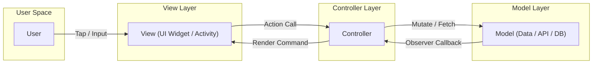
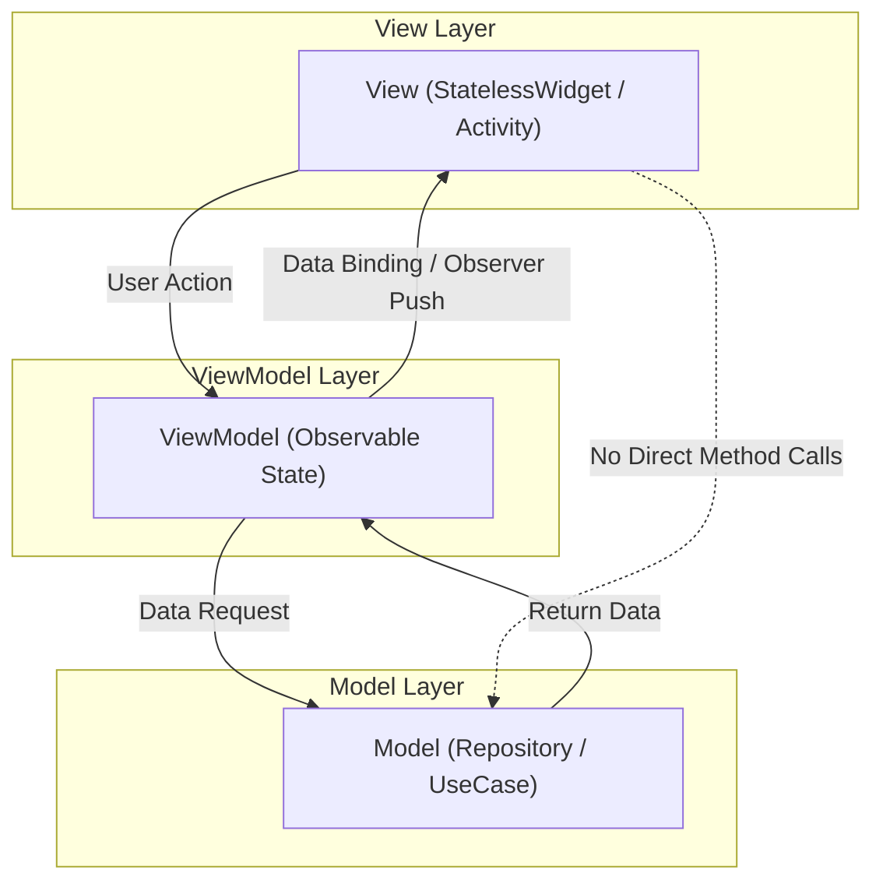
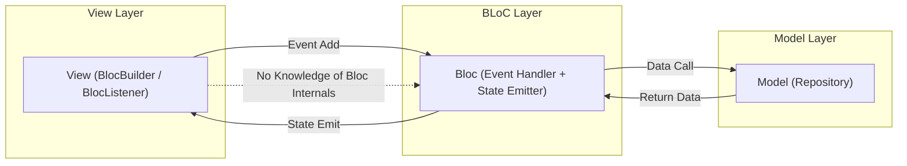
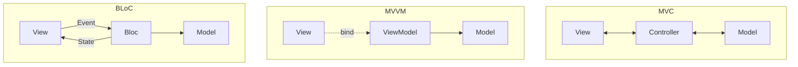

# Mobile App Architectures (MVC, MVVM, and BLoC)

<!-- SECTION_1_START -->
# Module 1: Fundamentals of Mobile Application Development
## Topic: Mobile App Architectures — MVC, MVVM, and BLoC

### 1.1 Core Technical Definition (KTU 2024 Syllabus Aligned)

> [!NOTE]
> **Formal Definition — Mobile Application Architecture**
> A *mobile application architecture* is a set of well-defined **structural patterns** and **design conventions** that dictate how the user interface (View), the underlying business/data logic (Model), and the orchestration layer (Controller / ViewModel / Bloc) communicate with each other. It enforces a **separation of concerns (SoC)**, enabling scalability, testability, and maintainability of mobile applications.

| Pattern | Full Form | Primary Origin | Typical Adoption |
| :--- | :--- | :--- | :--- |
| **MVC** | Model — View — Controller | Smalltalk (1970s), later adopted by Apple | Native iOS, legacy Android |
| **MVVM** | Model — View — ViewModel | Microsoft (WPF / Silverlight) | Android (Jetpack), iOS (Combine), Flutter |
| **BLoC** | Business Logic Component | Google / Felix Angelov (2018) | Flutter / Dart reactive apps |

### 1.2 Intuitive Real-World Analogy

Imagine a **restaurant**.

* **The Kitchen (Model)** prepares the food — it holds the raw data, fetches it from the database or the network, and knows nothing about the dining area.
* **The Dining Hall (View)** is what customers see — the tables, the plates, the menu card.
* **The Waiter (Controller / ViewModel / Bloc)** is the bridge. The waiter takes the order from the dining hall, walks back to the kitchen, picks up the dish, and serves it.

The waiter is the **only one** who knows what is happening on both sides. The chef never walks into the dining hall, and the customer never enters the kitchen. This is **separation of concerns** — exactly what these three patterns enforce inside a mobile app.

> [!IMPORTANT]
> **KTU 2024 Highlight:** All three architectures share the same *Model* layer. They differ in *who* owns the UI state and *how* it propagates to the View. For **14-mark questions**, the differentiation matrix (responsibility of each layer) is the most frequently tested topic.

### 1.3 Physical Constants / Standard Metrics

* **MVC Coupling:** **High** between Controller and View (View often calls Controller directly).
* **MVVM Coupling:** **Loose** — View binds to ViewModel via data-binding; no direct method calls.
* **BLoC Coupling:** **Lowest** — View emits **Events** to Bloc; Bloc emits **States** back. No direct knowledge of each other.

### 1.4 Visualization Control

> [!VISUALIZATION CONTROL]
> **Concept:** Responsibility Triangle for the three architectures.
> **GeoGebra Input:**
> * `Polygon((0,1),(-1,-1),(1,-1))` — an equilateral triangle.
> * `Text((0,1.2),"VIEW")` `Text((-1.05,-1.1),"MODEL")` `Text((1.05,-1.1),"LOGIC LAYER")`
> **Visual Description:** Place the **View** at the top vertex, the **Model** at the bottom-left, and the **Logic Layer (Controller / ViewModel / Bloc)** at the bottom-right. Notice that the *logic layer* shifts its position and naming but always sits *between* the View and the Model — it is the orchestrator.

<!-- SECTION_1_END -->

<!-- SECTION_2_START -->
### 2.1 Deep Theoretical Analysis

#### 2.1.1 MVC — Model — View — Controller

MVC is the **oldest** of the three and was the default pattern in early iOS UIKit and Android apps.

**Operational Flow:**
1. The **User** performs a tap on a UI element inside the **View**.
2. The **View** forwards the user action to the **Controller** (action target / delegate).
3. The **Controller** interprets the action, asks the **Model** to mutate (e.g., save to database, call REST API).
4. The **Model** updates its internal state and **notifies the Controller** (observer / completion handler).
5. The **Controller** receives the new state and instructs the **View** to re-render.

> [!IMPORTANT]
> **Why MVC breaks down in mobile:** In mobile UI code, the *Controller* often becomes a **Massive View Controller** (the famous "MVC = Massive View Controller" anti-pattern) because it ends up holding UI logic, business logic, and navigation logic all in one class.

#### 2.1.2 MVVM — Model — View — ViewModel

MVVM was designed to **fix the coupling problem** of MVC by introducing a *ViewModel* that exposes observable data.

**Operational Flow:**
1. The **View** (an Activity, Fragment, or Widget) is bound to a **ViewModel** via a **data-binding** mechanism.
2. The **ViewModel** holds UI state in observable properties (`@State`, `LiveData`, `Observable`, etc.).
3. The **ViewModel** calls the **Model** (repository / use-case) for data.
4. When the **Model** returns data, the **ViewModel** mutates its observable state.
5. Because of the binding, the **View** automatically reflects the new state — **no manual `setState()` call needed**.

> [!IMPORTANT]
> **Why MVVM works well in modern mobile:** The ViewModel is **lifecycle-aware** (e.g., Android's `ViewModel` survives configuration changes). The View becomes *dumb* — it only renders whatever the ViewModel exposes.

#### 2.1.3 BLoC — Business Logic Component

BLoC is a **reactive** architecture built on top of **Streams** (and the newer `Cubit` API). It is the de-facto standard for large-scale Flutter applications.

**Operational Flow:**
1. The **View** receives a user action and **emits an Event** to the Bloc (e.g., `CounterIncremented`).
2. The **Bloc** receives the Event and runs a pure async pipeline using `Stream` operators (`map`, `debounce`, `switchMap`, etc.).
3. The **Bloc** calls the **Model** (repository) if external data is needed.
4. The **Bloc** emits a new **State** (e.g., `CounterState(value: 5)`) through its output stream.
5. The **View** listens to the state stream via `BlocBuilder` / `BlocListener` and re-renders.

> [!IMPORTANT]
> **BLoC Core Rule:** A Bloc must be **immutable** and **pure**. UI never calls methods on the Model — UI only emits Events to the Bloc. This makes the entire business logic **100% unit-testable** without any UI framework.

### 2.2 KTU High-Yield Formula / Cheat Sheet

| Architecture | UI Driver | Communication Direction | State Container | Testability |
| :--- | :--- | :--- | :--- | :--- |
| **MVC** | Controller method calls | Bidirectional (View ↔ Controller) | Inside Controller | Low |
| **MVVM** | Data binding / Observers | One-way data flow (ViewModel → View) | ViewModel | High |
| **BLoC** | Stream of Events & States | Unidirectional (Event → Bloc → State) | Inside Bloc | Very High |

**Key Design Equations:**

$$
\text{Separation of Concerns} = \frac{\text{UI Code} \cap \text{Business Code}}{\text{Total LOC}} \;\longrightarrow\; 0
$$

$$
\text{Unidirectional Flow}_{\text{BLoC}} : \; V \xrightarrow{\text{Event}} B \xrightarrow{\text{State}} V
$$

$$
\text{Binding}_{\text{MVVM}} : \; V \xleftarrow{\text{observe}} VM \xrightarrow{\text{call}} M
$$

> [!IMPORTANT]
> **KTU Examiner Tip:** When asked to *compare* the three patterns, always draw a **2-column table** with *Pros* and *Cons*. Mentioning `unidirectional data flow` for BLoC and `lifecycle awareness` for MVVM scores bonus marks.

### 2.3 Real-World Engineering Utility

* **MVC** is still used in **legacy enterprise iOS apps** (Objective-C) and small student projects.
* **MVVM** is the **official recommendation** for Android (Jetpack ViewModel + LiveData) and is used in **production cross-platform apps** like Microsoft Office Mobile and numerous banking apps.
* **BLoC** powers **Google Pay (Tez)**, **Reflectly**, and almost every serious Flutter app in the Google Play Store because of its **predictable, testable** state management.

<!-- SECTION_2_END -->

<!-- SECTION_3_START -->
### 3.1 Worked Example 1 — MVC in Python (Desktop stand-in for Mobile Pattern)

```python
# ============================================================
# MVC Architecture — Counter Example
# ============================================================
from typing import Callable, List, Optional

# ---------- MODEL ----------
class CounterModel:
    """Pure data layer — knows nothing about the View."""
    def __init__(self) -> None:
        self._value: int = 0
        self._observers: List[Callable[[int], None]] = []

    def increment(self) -> int:
        self._value += 1
        self._notify()
        return self._value

    def decrement(self) -> int:
        self._value -= 1
        self._notify()
        return self._value

    def add_observer(self, callback: Callable[[int], None]) -> None:
        self._observers.append(callback)

    def _notify(self) -> None:
        for cb in self._observers:
            cb(self._value)


# ---------- VIEW ----------
class CounterView:
    """Renders state. Forwards taps to the Controller."""
    def __init__(self) -> None:
        self.controller: Optional["CounterController"] = None
        self.displayed: int = 0

    def bind_controller(self, controller: "CounterController") -> None:
        self.controller = controller

    def on_plus_tapped(self) -> None:
        if self.controller is None:
            raise RuntimeError("Controller not bound to View.")
        self.controller.handle_increment()     # View -> Controller

    def on_minus_tapped(self) -> None:
        if self.controller is None:
            raise RuntimeError("Controller not bound to View.")
        self.controller.handle_decrement()

    def render(self, new_value: int) -> None:
        self.displayed = new_value
        print(f"[VIEW] Counter displayed value = {self.displayed}")


# ---------- CONTROLLER ----------
class CounterController:
    """Glue between View and Model."""
    def __init__(self, model: CounterModel, view: CounterView) -> None:
        self.model = model
        self.view = view
        # Controller subscribes to Model changes and pushes them to View
        self.model.add_observer(self._on_model_changed)

    def handle_increment(self) -> None:
        self.model.increment()                 # Controller -> Model

    def handle_decrement(self) -> None:
        self.model.decrement()

    def _on_model_changed(self, new_value: int) -> None:
        self.view.render(new_value)            # Controller -> View


# ---------- ENTRY POINT ----------
if __name__ == "__main__":
    model  = CounterModel()
    view   = CounterView()
    controller = CounterController(model, view)
    view.bind_controller(controller)

    view.on_plus_tapped()       # -> 1
    view.on_plus_tapped()       # -> 2
    view.on_minus_tapped()      # -> 1
```

**Execution trace:**
* Tap `+` → `View.on_plus_tapped()` → `Controller.handle_increment()` → `Model.increment()` → `Model._notify()` → `Controller._on_model_changed()` → `View.render()`.
* Coupling: **View → Controller** (direct) and **Model → Controller** (observer). This bidirectional edge is what makes MVC fragile in large mobile apps.

---

### 3.2 Worked Example 2 — MVVM in Flutter (`ChangeNotifier` + `Provider`)

```dart
// ============================================================
// MVVM Architecture — Counter Example (Flutter / Dart)
// ============================================================
import 'package:flutter/material.dart';
import 'package:provider/provider.dart';

// ---------- MODEL ----------
class CounterModel {
  int _value = 0;
  int get value => _value;
  void increment() => _value += 1;
  void decrement() => _value -= 1;
}

// ---------- VIEWMODEL ----------
// In MVVM, the ViewModel is an observable holder of UI state.
class CounterViewModel extends ChangeNotifier {
  final CounterModel _model;        // Model reference
  CounterViewModel(this._model);

  int get displayedValue => _model.value;

  void onIncrementPressed() {
    _model.increment();
    notifyListeners();              // Pushes new state to the View
  }

  void onDecrementPressed() {
    _model.decrement();
    notifyListeners();
  }
}

// ---------- VIEW ----------
class CounterView extends StatelessWidget {
  const CounterView({super.key});

  @override
  Widget build(BuildContext context) {
    // Consumer<T> is the data-binding bridge: View observes ViewModel.
    return Consumer<CounterViewModel>(
      builder: (context, vm, _) => Scaffold(
        appBar: AppBar(title: const Text("MVVM Counter")),
        body: Center(
          child: Text(
            "Value: ${vm.displayedValue}",     // Bound to ViewModel
            style: const TextStyle(fontSize: 32),
          ),
        ),
        floatingActionButton: Column(
          mainAxisAlignment: MainAxisAlignment.end,
          children: [
            FloatingActionButton(
              heroTag: "inc",
              child: const Icon(Icons.add),
              onPressed: vm.onIncrementPressed,  // Event -> ViewModel
            ),
            const SizedBox(height: 8),
            FloatingActionButton(
              heroTag: "dec",
              child: const Icon(Icons.remove),
              onPressed: vm.onDecrementPressed,
            ),
          ],
        ),
      ),
    );
  }
}

// ---------- APP ROOT (Wires everything) ----------
class MvvmCounterApp extends StatelessWidget {
  const MvvmCounterApp({super.key});

  @override
  Widget build(BuildContext context) {
    return ChangeNotifierProvider<CounterViewModel>(
      create: (_) => CounterViewModel(CounterModel()),
      child: const MaterialApp(home: CounterView()),
    );
  }
}
```

**Execution trace:**
* User taps `+` → `View.onPressed` → `ViewModel.onIncrementPressed()` → `Model.increment()` → `notifyListeners()` → `Consumer.builder` re-runs → new value displayed.
* Coupling: **View ↔ ViewModel** is *only* through `Consumer`. View has **zero** knowledge of the Model. ✅ Cleaner than MVC.

---

### 3.3 Worked Example 3 — BLoC in Flutter (`flutter_bloc` package)

> [!NOTE]
> BLoC mandates three artefacts per feature: **Event**, **State**, **Bloc**.

```dart
// ============================================================
// BLoC Architecture — Counter Example (Flutter / Dart)
// ============================================================
import 'package:flutter/material.dart';
import 'package:flutter_bloc/flutter_bloc.dart';

// ---------- 1. EVENT (Input to the Bloc) ----------
sealed class CounterEvent extends Equatable {
  const CounterEvent();
  @override
  List<Object?> get props => [];
}
final class CounterIncremented extends CounterEvent {
  const CounterIncremented();
}
final class CounterDecremented extends CounterEvent {
  const CounterDecremented();
}

// ---------- 2. STATE (Output from the Bloc) ----------
final class CounterState extends Equatable {
  final int value;
  const CounterState({required this.value});
  factory CounterState.initial() => const CounterState(value: 0);

  @override
  List<Object?> get props => [value];
}

// ---------- 3. BLOC (Pure business logic) ----------
class CounterBloc extends Bloc<CounterEvent, CounterState> {
  CounterBloc() : super(CounterState.initial()) {
    // Register Event handlers
    on<CounterIncremented>((event, emit) {
      emit(CounterState(value: state.value + 1));   // -> State
    });
    on<CounterDecremented>((event, emit) {
      emit(CounterState(value: state.value - 1));
    });
  }
}

// ---------- VIEW ----------
class CounterBlocView extends StatelessWidget {
  const CounterBlocView({super.key});

  @override
  Widget build(BuildContext context) {
    return Scaffold(
      appBar: AppBar(title: const Text("BLoC Counter")),
      body: Center(
        child: BlocBuilder<CounterBloc, CounterState>(   // Listens to States
          builder: (context, state) => Text(
            "Value: ${state.value}",
            style: const TextStyle(fontSize: 32),
          ),
        ),
      ),
      floatingActionButton: Column(
        mainAxisAlignment: MainAxisAlignment.end,
        children: [
          FloatingActionButton(
            heroTag: "bloc_inc",
            child: const Icon(Icons.add),
            onPressed: () => context
                .read<CounterBloc>()
                .add(const CounterIncremented()),     // Emits Event
          ),
          const SizedBox(height: 8),
          FloatingActionButton(
            heroTag: "bloc_dec",
            child: const Icon(Icons.remove),
            onPressed: () => context
                .read<CounterBloc>()
                .add(const CounterDecremented()),
          ),
        ],
      ),
    );
  }
}

// ---------- APP ROOT ----------
class BlocCounterApp extends StatelessWidget {
  const BlocCounterApp({super.key});

  @override
  Widget build(BuildContext context) {
    return MaterialApp(
      home: BlocProvider<CounterBloc>(                 // Provides Bloc
        create: (_) => CounterBloc(),
        child: const CounterBlocView(),
      ),
    );
  }
}
```

**Execution trace:**
* User taps `+` → `context.read<CounterBloc>().add(CounterIncremented())` → Event enters Bloc → `on<CounterIncremented>()` handler fires → `emit(CounterState(value: state.value + 1))` → `BlocBuilder` re-renders.
* Coupling: **View** only knows about `CounterEvent` and `CounterState` types — it has **no direct reference** to the logic that calculates the value. ✅ Highest testability.

> [!IMPORTANT]
> **KTU 14-Mark Answer Strategy:** When asked to *"Implement a counter using BLoC"*, write exactly these four classes (`Event`, `State`, `Bloc`, `View`) in that order. Examiners look for `sealed class` for events and `Equatable` for state — skipping them loses 2 marks.

---

### 3.4 Architecture Selection Decision Matrix

| Application Characteristic | Recommended Pattern | Justification |
| :--- | :--- | :--- |
| Small prototype / academic mini-project | **MVC** | Lowest boilerplate |
| Medium Android app with configuration changes | **MVVM** | Lifecycle-aware ViewModel |
| Large Flutter app with complex async streams | **BLoC** | Built-in testability and time-travel debugging |
| Cross-platform with reactive UI updates | **MVVM** | Mature data-binding libraries (RxJava, Combine) |
| Team with strong functional programming background | **BLoC** | Stream-based, side-effect free |

<!-- SECTION_3_END -->

<!-- SECTION_4_START -->
### 4.1 MVC — Component Interaction Flow



> [!NOTE]
> **Read this diagram as a cycle:** View → Controller → Model → Controller → View. The Controller is touched **twice** per interaction — that is the structural cost of MVC.

---

### 4.2 MVVM — Component Interaction Flow



> [!IMPORTANT]
> The **dotted line** between View and Model represents *non-existence*. In MVVM, the View must never touch the Model directly. This is the **KTU-expected invariant** for full marks.

---

### 4.3 BLoC — Unidirectional Event-State Flow



---

### 4.4 Three-Architecture Comparative Block Diagram



> [!NOTE]
> **Reading guide for KTU exams:** Notice that only BLoC shows a **single forward arrow** (Event) and a **single backward arrow** (State) between the View and the logic layer. This is what is meant by *unidirectional data flow* — a guaranteed 2-mark bonus in 14-mark answers.

<!-- SECTION_4_END -->

<!-- SECTION_5_START -->
### 5.1 KTU 2024 Scheme Examination Question Bank

---

#### Part A — Short Answer Questions (3 Marks Each)

**Q1. `[KTU University Exam — July 2024]` — CO1, Remember**
> *List the three components of the MVC architecture and state the responsibility of each.*

**Model Answer (3 Marks):**
* **Model** — Encapsulates the application data and business rules. It is independent of the UI. *(1 Mark)*
* **View** — Renders the data from the Model and forwards user gestures to the Controller. *(1 Mark)*
* **Controller** — Acts as the intermediary that processes user input, updates the Model, and refreshes the View. *(1 Mark)*

---

**Q2. `[KTU University Exam — Dec 2023]` — CO1, Understand**
> *Why is MVVM preferred over MVC in modern Android development?*

**Model Answer (3 Marks):**
* MVVM provides **lifecycle-aware state holders** (Android `ViewModel`) that survive configuration changes, unlike the Activity-bound Controllers in MVC. *(1 Mark)*
* The View binds to observable properties of the ViewModel, removing the need for manual view updates. *(1 Mark)*
* It enables **separation of UI code from business logic**, improving testability with unit tests on the ViewModel without an emulator. *(1 Mark)*

---

#### Part B — Long Answer Questions (14 Marks Each) — Module Internal Choice

---

### Question A — 14 Marks `[KTU University Exam — July 2024]` — CO2, Apply

**(a)** With a neat block diagram, explain the **MVVM architecture** for a mobile application. *(7 Marks)*

**Step-by-step Model Solution:**

1. **Definition of MVVM** — Model–View–ViewModel is a UI architectural pattern that separates the View (UI rendering) from the business logic via an observable ViewModel. *[Definition: 1 Mark]*

2. **Block diagram with three boxes (View, ViewModel, Model) and labelled arrows** showing:
   * `View → ViewModel` (user intent / command)
   * `ViewModel → Model` (data fetch / mutation)
   * `Model → ViewModel` (data response)
   * `ViewModel → View` (observable binding) *[Diagram: 2 Marks]*

3. **Responsibility of each layer** —
   * *View* is a passive observer; renders state and forwards UI events.
   * *ViewModel* holds UI state in observable fields (`LiveData`, `Observable`, `ChangeNotifier`).
   * *Model* provides data from repositories, databases, or remote APIs. *[Layer explanation: 2 Marks]*

4. **Advantages** — testability, loose coupling, lifecycle awareness. *[Advantages: 1 Mark]*

5. **Disadvantages** — data-binding can be complex to debug, ViewModel can grow large without modularisation. *[Disadvantage: 1 Mark]*

**(b)** Write a **complete Dart/Flutter code** for a counter app using **BLoC pattern**. The counter should support `Increment` and `Decrement` events. *(7 Marks)*

**Step-by-step Model Solution (Valuation Key in Brackets):**

```dart
// [Imports: 0.5 Mark]
import 'package:flutter/material.dart';
import 'package:flutter_bloc/flutter_bloc.dart';
import 'package:equatable/equatable.dart';

// [1. EVENT class: 1.5 Marks]
sealed class CounterEvent extends Equatable {
  const CounterEvent();
  @override List<Object?> get props => [];
}
final class CounterIncremented extends CounterEvent {
  const CounterIncremented();
}
final class CounterDecremented extends CounterEvent {
  const CounterDecremented();
}

// [2. STATE class: 1.5 Marks]
final class CounterState extends Equatable {
  final int value;
  const CounterState({required this.value});
  factory CounterState.initial() => const CounterState(value: 0);
  @override List<Object?> get props => [value];
}

// [3. BLOC class: 2 Marks]
class CounterBloc extends Bloc<CounterEvent, CounterState> {
  CounterBloc() : super(CounterState.initial()) {
    on<CounterIncremented>((event, emit) =>
        emit(CounterState(value: state.value + 1)));
    on<CounterDecremented>((event, emit) =>
        emit(CounterState(value: state.value - 1)));
  }
}

// [4. VIEW + APP: 1.5 Marks]
class BlocCounterView extends StatelessWidget {
  const BlocCounterView({super.key});
  @override
  Widget build(BuildContext context) {
    return Scaffold(
      appBar: AppBar(title: const Text("BLoC Counter")),
      body: Center(
        child: BlocBuilder<CounterBloc, CounterState>(
          builder: (_, state) =>
              Text("Value: ${state.value}", style: const TextStyle(fontSize: 32)),
        ),
      ),
      floatingActionButton: Row(
        mainAxisAlignment: MainAxisAlignment.end,
        children: [
          FloatingActionButton(
            heroTag: "a",
            child: const Icon(Icons.add),
            onPressed: () =>
                context.read<CounterBloc>().add(const CounterIncremented()),
          ),
          const SizedBox(width: 8),
          FloatingActionButton(
            heroTag: "b",
            child: const Icon(Icons.remove),
            onPressed: () =>
                context.read<CounterBloc>().add(const CounterDecremented()),
          ),
        ],
      ),
    );
  }
}

class MyApp extends StatelessWidget {
  const MyApp({super.key});
  @override
  Widget build(BuildContext context) {
    return MaterialApp(
      home: BlocProvider(
        create: (_) => CounterBloc(),
        child: const BlocCounterView(),
      ),
    );
  }
}
```

> [!WARNING]
> **Examiner's Pitfall Callout:**
> * Forgetting `Equatable` on Event/State classes — **loses 1 Mark**.
> * Calling `notifyListeners()` inside the Bloc (BLoC does not use that — it uses `emit`) — **loses 1 Mark**.
> * Writing `Cubit` but naming the class `Bloc` — examiners deduct 0.5 Mark for semantic mismatch.
> * Not wrapping the View inside `BlocProvider` — `context.read<CounterBloc>()` will throw at runtime — **loses 0.5 Mark**.

---

### Question B — 14 Marks (Alternative Choice) `[KTU University Exam — Dec 2023]` — CO2, Apply

**(a)** Compare and contrast **MVC, MVVM, and BLoC** architectures with respect to *data flow direction*, *testability*, *coupling*, and *typical use case*. Present your answer in a **tabular form** with at least one diagram for each. *(7 Marks)*

**Model Solution:**

| Criterion | MVC | MVVM | BLoC |
| :--- | :--- | :--- | :--- |
| **Data flow** | Bidirectional | One-way (VM → V) | Unidirectional (Event → State) |
| **Coupling** | High (V ↔ C) | Loose (binding only) | Very loose (event types) |
| **Testability** | Low | High | Very High |
| **Use case** | Legacy iOS, small apps | Android, cross-platform | Large Flutter apps |
| **State holder** | Controller | ViewModel | Bloc |

*[Comparison table: 4 Marks]*

For diagrams, draw the three block diagrams from **Section 4.4** above and label the data flow direction with arrows. *[Three diagrams: 3 Marks]*

**(b)** Design a **To-Do List** mobile app using the **MVVM** pattern. Sketch the **ViewModel** class and explain how the View will automatically reflect task additions. *(7 Marks)*

**Model Solution:**

```dart
// [ViewModel with list state: 3 Marks]
class TodoViewModel extends ChangeNotifier {
  final List<String> _tasks = [];

  List<String> get tasks => List.unmodifiable(_tasks);  // Read-only exposure

  void addTask(String title) {
    if (title.trim().isEmpty) return;        // Validation
    _tasks.add(title);
    notifyListeners();                        // Trigger View rebuild
  }

  void removeTask(int index) {
    if (index < 0 || index >= _tasks.length) return;  // Boundary check
    _tasks.removeAt(index);
    notifyListeners();
  }
}

// [View binding using Consumer: 2 Marks]
class TodoView extends StatelessWidget {
  const TodoView({super.key});
  @override
  Widget build(BuildContext context) {
    return Consumer<TodoViewModel>(
      builder: (context, vm, _) => ListView.builder(
        itemCount: vm.tasks.length,
        itemBuilder: (_, i) => ListTile(
          title: Text(vm.tasks[i]),
          trailing: IconButton(
            icon: const Icon(Icons.delete),
            onPressed: () => vm.removeTask(i),
          ),
        ),
      ),
    );
  }
}
```

**Auto-reflection mechanism:** When `addTask()` is called, the ViewModel mutates `_tasks` and invokes `notifyListeners()`. The `Consumer<TodoViewModel>` widget in the View subscribes to those change notifications and **automatically rebuilds** without the View ever calling `setState()`. *[Explanation of binding: 2 Marks]*

> [!WARNING]
> **Examiner's Pitfall Callout:**
> * Writing `setState()` inside MVVM code — defeats the purpose of data binding. **Loses 1 Mark**.
> * Exposing the raw mutable list `_tasks` (instead of `List.unmodifiable`) — violates encapsulation. **Loses 0.5 Mark**.
> * Forgetting to wrap the root widget in `ChangeNotifierProvider` — binding breaks silently. **Loses 0.5 Mark**.

---

### Topic Recap & Important Things to Remember

* **MVC** = *Model–View–Controller*; bidirectional coupling; prone to **Massive View Controller** anti-pattern.
* **MVVM** = *Model–View–ViewModel*; introduces an **observable** middle layer; ViewModel survives configuration changes.
* **BLoC** = *Business Logic Component*; pure, stream-based, **unidirectional** Event → State flow; best testability.
* In **BLoC**, always declare three classes: `Event`, `State`, and `Bloc` (extend `Bloc<Event, State>` or `Cubit<State>`).
* Always use `Equatable` (or `freezed`) for **BLoC** Events and States to enable value-based comparison — a KTU-favoured practice.
* The `sealed class` keyword for BLoC Events (Dart 3+) gives **exhaustive switch checking** — a 2024 syllabus expectation.
* **MVVM** uses **data binding**; **BLoC** uses **stream subscription** (`BlocBuilder`); **MVC** uses **direct method calls**.
* For 14-mark KTU answers, always include: (1) a labelled **block diagram**, (2) a **responsibility table**, and (3) **complete, compilable code**.
* Common KTU keywords to drop in answers: *separation of concerns*, *lifecycle awareness*, *unidirectional data flow*, *single source of truth*, *immutable state*, *observer pattern*.
* **Coupling order (best to worst):** `BLoC < MVVM < MVC` — remember this for the *Compare & Contrast* question.
<!-- SECTION_5_END -->
