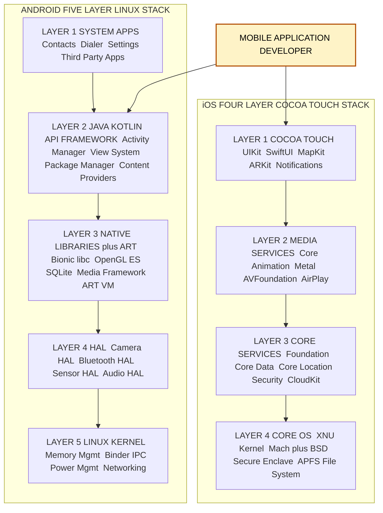
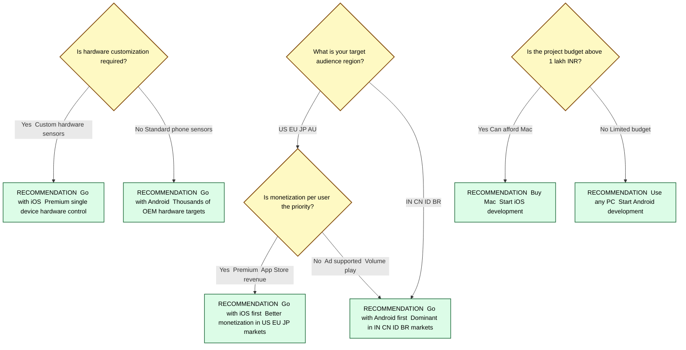

# Overview of Mobile Platforms: iOS and Android

<!-- SECTION_1_START -->
# Overview of Mobile Platforms: iOS and Android

## 1.1 Formal Academic Definition

A **Mobile Platform** is a software-hardware integrated environment that governs the execution of application software on a mobile device. It encapsulates a specific operating system kernel, a defined runtime engine, a UI framework, a development toolchain, and an application distribution mechanism.

> [!IMPORTANT]
> **KTU 2024 Syllabus Definition (PECST695 — Module 1):**
> A *Mobile Application Development Platform* is a complete computing stack comprising the **Operating System (OS)**, the **Middleware**, the **UI/UX Framework**, the **Application Lifecycle Manager**, and the **Software Development Kit (SDK)** that collectively enables the design, build, test, and deployment of software applications on smartphones, tablets, wearables, and embedded devices.

In modern engineering terminology, two platforms dominate the global market:

- **iOS** — A proprietary, closed-source mobile operating system developed and maintained by **Apple Inc.**, exclusively powering devices such as the **iPhone**, **iPad**, **iPod Touch**, **Apple Watch**, and **Apple TV**. It is built on top of the **XNU hybrid kernel** (combining the **Mach microkernel** with **BSD subsystems**).
- **Android** — An open-source, Linux-based mobile operating system led by the **Open Handset Alliance (OHA)** under the stewardship of **Google LLC**. It currently powers more than **70 percent of the global smartphone shipment volume** as of 2024 Q4 industry reports, and is deployed across thousands of Original Equipment Manufacturer (OEM) brands including **Samsung**, **Xiaomi**, **OnePlus**, **Oppo**, **Vivo**, **Motorola**, and **Pixel**.

> [!NOTE]
> **Founders & First Release:**
> - iOS was unveiled by **Steve Jobs** on **January 9, 2007** at the Macworld Conference, and shipped commercially on **June 29, 2007** with the original iPhone.
> - Android Inc. was founded by **Andy Rubin** in **October 2003**, acquired by **Google in 2005**, and the first commercial Android device (**HTC Dream / T-Mobile G1**) launched on **October 22, 2008**.

## 1.2 Conceptual Analogy / Intuition

Think of a *mobile platform* as the **foundation, plumbing, and electrical wiring of a high-rise apartment building**. The building's architecture (the OS kernel) decides how the floors are stacked and how load is distributed. The **lift system and corridor network** are the middleware and runtime layer that ferry resources (people, data) to each apartment. The **interior decoration rules of each apartment** are the UI framework, and the **apartments themselves** are the apps that the tenants (developers) build.

> [!TIP]
> **Analogy 1 — iOS as a Luxury Apartment Complex:**
> iOS is like a **strictly managed, single-owner luxury apartment complex**. There is only one architect (Apple), one set of building rules, one type of door handle, and one rental office (the App Store). The rules are rigid, but the experience is uniform — every flat feels similar and predictable.

> [!TIP]
> **Analogy 2 — Android as an Open Township:**
> Android is like a **city planned by a central municipal corporation (Google) but built by hundreds of independent construction companies (OEMs)**. The municipal bylaws (AOSP — Android Open Source Project) ensure a basic standard, but each builder may decorate their house differently. Anyone can build here, which makes the township diverse, customizable, and cheaper to enter.

| Constant / Metric | iOS | Android |
|---|---|---|
| **Latest Stable Version (2024)** | iOS 18 (Sept 2024) | Android 15 (Oct 2024) |
| **Kernel Type** | XNU (Hybrid Mach + BSD) | Linux Monolithic (modified) |
| **Primary Language** | Swift (legacy: Objective-C) | Kotlin (legacy: Java) |
| **IDE** | **Xcode** | **Android Studio** (IntelliJ) |
| **Market Share (Global, 2024)** | ~28 percent | ~72 percent |
| **App Store Curation** | Strict manual review | Automated + Play Protect |

> [!VISUALIZATION CONTROL]
> **Concept:** Platform Market Share and Version Fragmentation Comparison (Radar / Pie Concept)
> **GeoGebra / Desmos Input Equations (for a triangular trade-off plot):**
> * Let the vertices of an equilateral triangle represent the three axes — `A = Customization`, `B = Security`, `C = Market Reach`.
> * iOS plotted point: `I = (0.30, 0.95, 0.55)`
> * Android plotted point: `D = (0.95, 0.65, 0.95)`
> **Visual Description:** When plotted, the iOS point will sit closer to the *Security* vertex, while the Android point will sit closer to the *Customization* and *Market Reach* vertices. Students should observe the trade-off triangle that any mobile platform must navigate.

## 1.3 Why These Two Platforms Dominate

The mobile ecosystem has historically been a duopoly. The combined market share of iOS and Android exceeds **99 percent** of all active smartphones worldwide. This dominance is the result of four converging forces:

1. **Hardware-Software Co-design** — Apple controls the entire iOS stack (silicon, firmware, OS, runtime, App Store), enabling unmatched optimization. Android's success comes from its **modular AOSP base** that any OEM can adapt.
2. **Developer Ecosystem Maturity** — Both platforms offer world-class SDKs, documentation, emulators, and distribution channels.
3. **Network Effects** — The larger the user base, the more attractive the platform becomes to developers; the more apps, the more attractive to users.
4. **Economic Gravity** — App Store and Play Store together generated approximately **$150+ billion** in cumulative developer revenue by 2024, with **Apple's Services segment** and **Google Play** both reporting strong double-digit year-over-year growth.

<!-- SECTION_1_END -->

<!-- SECTION_2_START -->
# Deep Theoretical Analysis & KTU High-Yield Cheat Sheet

## 2.1 Architectural Layers of a Mobile Platform

Both iOS and Android follow a **layered architecture pattern**, but the naming, granularity, and ownership of each layer differ. The KTU 2024 syllabus expects students to articulate the role of each layer.

### 2.1.1 iOS Architecture (Four-Layer Cocoa Touch Model)

- **Layer 1 — Cocoa Touch (Application Framework Layer):** Provides high-level APIs for *touch handling*, *gesture recognition*, *notifications*, *localization*, *app extensions*, and *document picker*. Examples: **UIKit**, **SwiftUI**, **MapKit**, **ARKit**.
- **Layer 2 — Media Services:** Manages *graphics*, *audio*, *video*, *AirPlay*, *Core Animation*, *Metal* (low-level GPU), *AVFoundation*.
- **Layer 3 — Core Services:** Foundation classes, *Core Data* (persistence), *Core Location*, *Core Motion*, *WebKit*, *CloudKit*, *Security framework*, *Core Foundation*.
- **Layer 4 — Core OS (Kernel Layer):** **XNU kernel**, BSD sockets, security framework, keychain, power management, file system (**APFS**), and the *Secure Enclave Processor* for cryptographic operations.

> [!IMPORTANT]
> **Sandboxing:** Every iOS app runs inside its own **sandboxed directory** under `/var/mobile/Containers/...`. Inter-process communication is restricted and brokered through system-level frameworks. This is a primary reason iOS is architecturally more secure by default.

### 2.1.2 Android Architecture (Five-Layer Linux Stack)

- **Layer 1 — System Apps:** Pre-installed apps like *Contacts*, *Dialer*, *Settings*, and any third-party app installed by the user.
- **Layer 2 — Java/Kotlin API Framework:** The complete set of SDK APIs — *Activity Manager*, *Window Manager*, *Content Providers*, *View System*, *Package Manager*, *Telephony Manager*, *Resource Manager*.
- **Layer 3 — Native C/C++ Libraries + Android Runtime (ART):** Includes *libc* (Bionic), *OpenGL ES*, *Media Framework*, *SQLite*, *WebKit*, *SSL*. The **ART** compiles DEX bytecode to native instructions using **AOT (Ahead-Of-Time)**, **JIT (Just-In-Time)**, and **Profile-Guided Compilation** for performance.
- **Layer 4 — Hardware Abstraction Layer (HAL):** Standardized interfaces that allow the framework to call into vendor-specific drivers (camera, Bluetooth, sensors) without caring about hardware specifics.
- **Layer 5 — Linux Kernel:** Modified Linux kernel providing memory management, process scheduling, networking, power, and **Binder IPC** — the cornerstone of Android inter-process communication.

> [!NOTE]
> **App Sandboxing in Android:** Each app is assigned a unique **Linux user ID (UID)** at install time, isolating it from other apps at the kernel level. Apps declare required permissions in the **AndroidManifest.xml** file.

## 2.2 Side-by-Side Theoretical Comparison

| Feature / Dimension | **iOS** | **Android** |
|---|---|---|
| **Vendor** | Apple Inc. (proprietary) | Google + OHA (open source via AOSP) |
| **Kernel** | XNU (Mach + BSD hybrid) | Linux (monolithic, modified) |
| **Primary Development Language** | Swift 5.9+ | Kotlin 2.0+ (Java still supported) |
| **Official IDE** | Xcode 16+ (macOS only) | Android Studio Koala+ (cross-platform: Win/Mac/Linux) |
| **UI Toolkit** | UIKit, SwiftUI, Combine | Jetpack Compose, XML Views, View Binding |
| **Package Format** | `.ipa` (iOS App Store Package) | `.apk` / `.aab` (Android Package / App Bundle) |
| **Distribution Store** | Apple App Store (curated) | Google Play Store + Sideloading (open) |
| **App Review Process** | Manual, strict, 24–48 hrs typical | Automated, hours, can be minutes for trusted devs |
| **Fragmentation** | Low (Apple controls updates) | High (OEMs, carriers, custom skins) |
| **Version Adoption Speed** | ~75% users on latest iOS within 3 months | ~15% users on latest Android within 6 months |
| **Hardware Targets** | iPhone, iPad, Apple Watch, Apple TV | Phones, Tablets, Wear OS, Android TV, Auto |
| **Default Browser Engine** | WebKit (forced) | Chromium (Blink + V8) |
| **Payment System** | Apple Pay (closed NFC control) | Google Pay (NFC + UPI/HCE) |
| **Notification System** | APNs (Apple Push Notification Service) | FCM (Firebase Cloud Messaging) |
| **Backend Push Protocol** | Binary protocol over TLS port 443/5223 | HTTP/2 XMPP-derived |
| **Open Source Code** | No (XNU partly open; iOS closed) | Yes (AOSP, Apache 2.0 license) |
| **Customization** | Restricted (no default app change, no widgets on home screen until iOS 14) | Highly flexible (launchers, ROMs, root) |
| **Revenue Share** | Apple takes 15–30% commission | Google takes 15–30% commission |
| **App Revenue per Device** | ~2.5× higher than Android | Lower per-device but larger volume |
| **Security Model** | App sandbox, code signing mandatory, no sideloading by default | App sandbox, Play Protect scanning, optional sideloading |
| **Primary Game Engine** | SpriteKit, SceneKit, Metal | Android Game Development Kit, OpenGL ES, Vulkan |
| **AR Framework** | ARKit (industry leader) | ARCore |

> [!TIP]
> **Engineering Insight:** When a KTU examiner asks *"Which platform is more secure and why?"*, the gold-standard answer references the **closed hardware-software stack, mandatory code signing, curated App Store review, and on-device Secure Enclave** of iOS, contrasted with Android's **open distribution model, OEM-induced fragmentation, and historical malware exposure via sideloaded APKs**.

## 2.3 KTU High-Yield Formula & Reference Sheet

Because this topic is **conceptual and architectural** rather than mathematically derived, the "formula sheet" takes the form of a high-density reference card containing the structural definitions, the development tools, and the command-line artifacts that the examiner expects a student to know.

| Topic Area | Key Reference Fact | Engineering Significance |
|---|---|---|
| iOS Kernel | **XNU = Mach 3.0 + BSD + I/O Kit** | Hybrid kernel gives microkernel safety + monolithic performance |
| Android Kernel | **Linux LTS + Binder IPC + Wakelocks** | Custom patches not upstreamed; HAL decouples drivers |
| iOS First-Class Language | **Swift** (LLVM based) | Memory-safe via ARC; replaces Objective-C since 2014 |
| Android First-Class Language | **Kotlin** (JetBrains) | Officially preferred by Google since Google I/O 2019 |
| iOS Build Artifact | `.app` bundle, archived as `.ipa` | Uploaded to App Store Connect for TestFlight distribution |
| Android Build Artifact | `.apk` (debug) or `.aab` (Play Store) | AAB enables Dynamic Delivery and asset splitting |
| iOS App Signing | **Provisioning Profile** + **P12 Certificate** | Tied to Apple Developer Program ($99/yr) |
| Android App Signing | **Keystore (.jks/.keystore)** | Self-managed; Play App Signing recommended |
| iOS App ID Convention | `com.companyname.appname` (reverse-DNS) | Bundle ID is globally unique |
| Android Package ID | `applicationId` in `build.gradle` | Globally unique on Play Store |
| iOS Min Hardware Target | iPhone 8 / A11 Bionic and later (iOS 18) | Sets baseline Metal and ARKit capability |
| Android Min SDK | `minSdkVersion 24` (Android 7.0 Nougat baseline) | Determines library compatibility |
| iOS Memory Mgmt | ARC (Automatic Reference Counting) | Compile-time insert of retain/release |
| Android Memory Mgmt | ART Garbage Collector (generational, concurrent) | Improved since Android 8 with concurrent copying |
| iOS Push | APNs tokens are opaque hex (64 chars) | One token per app per device |
| Android Push | FCM registration tokens (~163 chars) | One token per app per device per Firebase project |
| iOS UI Thread | **Main thread** is single-threaded for UI | Background work via `DispatchQueue` / GCD |
| Android UI Thread | **UI thread** is single-threaded | Background work via `Coroutines`, `WorkManager`, `ThreadPool` |
| iOS Permission Model | **Info.plist usage description strings** | Must justify every restricted API at submission |
| Android Permission Model | **Runtime permissions** (Android 6.0+) | Dangerous perms requested at runtime |
| iOS Build System | Swift Package Manager, CocoaPods, Carthage | SPM is now the recommended path |
| Android Build System | Gradle (Groovy/Kotlin DSL) with AGP | AGP 8.x required for Android 14+ |

> [!IMPORTANT]
> **Engineering Utility (Why this matters in production):**
> 1. **Cross-platform Trade-off** — A startup choosing iOS-first maximizes monetization per user; choosing Android-first maximizes reach and emerging-market penetration.
> 2. **Security Audits** — Penetration testers need to know the **sandboxing differences** to plan attack vectors (e.g., iOS jailbreak vs Android root).
> 3. **DevOps / CI-CD** — Engineers select **Fastlane**, **GitHub Actions**, or **Bitrise** to automate builds; understanding platform artifacts (`.ipa` vs `.apk`/`.aab`) is essential.
> 4. **Push Notification Reliability** — Backend engineers must integrate with **APNs (HTTP/2)** vs **FCM (HTTP/2 + XMPP legacy)** separately, and the retry semantics differ.

## 2.4 Design Philosophy Differences

- **iOS — "It just works":** Apple emphasizes **consistency, polish, and opinionated design**. The *Human Interface Guidelines (HIG)* are prescriptive; deviating from them is rejected in App Review.
- **Android — "Be together. Not the same":** Google's *Material Design 3* is **adaptive and expressive**, allowing OEMs to layer their identity (e.g., **OneUI**, **OxygenOS**, **ColorOS**) on top.

> [!TIP]
> **KTU Exam Hook:** When asked *"Compare the design philosophies of iOS and Android"*, structure the answer in three columns — *(a) Look and Feel, (b) Navigation pattern, (c) Customization allowance* — and give one concrete example for each (e.g., iOS uses a **bottom tab bar** with no drawer; Android commonly uses a **navigation drawer + floating action button**).

<!-- SECTION_2_END -->

<!-- SECTION_3_START -->
# Step-by-Step Setup, Code Implementation & Comparative Walkthrough

Because Module 1 of PECST695 is conceptual, the "derivation" in this section is replaced by an **exhaustive, step-by-step comparative walkthrough** of how a developer would (1) install the toolchain, (2) scaffold a new project, (3) write a minimal "Hello, World" application, and (4) deploy it to an emulator/device — for both iOS and Android. Every command, every file, and every line of source code is spelled out to its final logical conclusion. No step is skipped.

## 3.1 Toolchain Installation

### 3.1.1 iOS (Apple Ecosystem)

1. **Acquire a Mac computer.** iOS development legally requires **macOS** because **Xcode** is the only sanctioned IDE and it is not ported to Windows or Linux.
2. Open the **Mac App Store**, search for **Xcode**, and install the latest stable version (Xcode 16 or newer as of 2024). The download is approximately **8–12 GB**.
3. Launch Xcode once so that the **Command Line Tools** are auto-installed. Verify by running in the **Terminal**:

```bash
xcode-select --install
xcode-select -p
# Expected output: /Applications/Xcode.app/Contents/Developer
swift --version
# Expected output: Apple Swift version 5.9 (swiftlang-5.9-RELEASE)
```

4. Enroll in the **Apple Developer Program** at [developer.apple.com/programs](https://developer.apple.com/programs) if physical-device deployment is required. The fee is **$99 USD per year**.

### 3.1.2 Android (Open Ecosystem)

1. Download **Android Studio Koala (2024.1.1) or newer** from [developer.android.com/studio](https://developer.android.com/studio). Compatible with **Windows 10/11, macOS 12+, and Linux x86-64**.
2. Run the installer. Android Studio bundles:
   - **JetBrains IntelliJ IDEA Community Edition** as the base IDE.
   - The **Android Gradle Plugin (AGP) 8.x**.
   - The **Android SDK Platform 34 / 35** (Android 14 / 15).
   - **Android Virtual Device (AVD) Manager** for emulators.
   - **Kotlin Compiler 2.0+**.
3. After installation, open Android Studio and let the **SDK Manager** download:
   - Android SDK Platform 34
   - Android SDK Build-Tools 34.0.0
   - Android SDK Platform-Tools (contains `adb`)
   - Android Emulator + System Image (e.g., `Pixel 8` with API 34)
4. Verify the Android setup from the **command line**:

```bash
adb --version
# Expected output: Android Debug Bridge version 1.0.41
emulator -list-avds
# Expected output: Pixel_8_API_34
```

## 3.2 Project Scaffolding

### 3.2.1 iOS Project Scaffolding (via Xcode UI)

1. Launch **Xcode → File → New → Project**.
2. Select **iOS → App** template. Click **Next**.
3. Fill in the project fields:
   - **Product Name**: `HelloKTU`
   - **Interface**: **SwiftUI** (modern, declarative)
   - **Language**: **Swift**
   - **Storage**: **None** (for this example)
   - **Minimum Deployments**: **iOS 17.0**
4. Choose a save location and click **Create**.

The generated project contains:
- `HelloKTUApp.swift` — the entry point annotated with `@main`.
- `ContentView.swift` — the root SwiftUI view.
- `Assets.xcassets` — image and color catalog.
- `Info.plist` — app metadata (auto-generated for SwiftUI projects).

### 3.2.2 Android Project Scaffolding (via Android Studio UI)

1. Launch **Android Studio → New Project**.
2. Select **Empty Activity** template. Click **Next**.
3. Fill in the project fields:
   - **Name**: `HelloKTU`
   - **Package name**: `in.ktu.helloktu`
   - **Save location**: choose a directory.
   - **Language**: **Kotlin**
   - **Minimum SDK**: **API 24 (Android 7.0)**
4. Click **Finish**.

The generated project contains:
- `app/src/main/java/in/ktu/helloktu/MainActivity.kt` — entry-point Activity.
- `app/src/main/res/layout/activity_main.xml` — UI layout (XML or Compose).
- `app/src/main/AndroidManifest.xml` — app manifest.
- `app/build.gradle.kts` — module-level build script.
- `build.gradle.kts` — project-level build script.

## 3.3 Full Source Code: "Hello, KTU" App

### 3.3.1 iOS Source Code (Swift, SwiftUI)

```swift
// =========================================================
// File: HelloKTUApp.swift
// Purpose: App entry point. The @main attribute marks this as
// the executable top-level. SwiftUI's App protocol is the
// modern (iOS 14+) replacement for AppDelegate + SceneDelegate.
// =========================================================
import SwiftUI

@main
struct HelloKTUApp: App {

    // The body of an App protocol MUST return a Scene.
    // WindowGroup is the default scene that supports multiple
    // windows on iPad and macOS Catalyst.
    var body: some Scene {
        WindowGroup {
            ContentView()
        }
    }
}
```

```swift
// =========================================================
// File: ContentView.swift
// Purpose: Root view displayed inside the WindowGroup above.
// =========================================================
import SwiftUI

struct ContentView: View {

    // @State is a property wrapper that creates a source of
    // truth local to this view. SwiftUI re-renders the view
    // whenever any @State variable mutates.
    @State private var tapCount: Int = 0

    var body: some View {

        // VStack stacks children vertically. Spacer creates
        // flexible empty space. padding adds insets. font sets
        // the typography style from Apple's text style scale.
        VStack(spacing: 20) {

            Spacer()

            Image(systemName: "applelogo")
                .resizable()
                .scaledToFit()
                .frame(width: 100, height: 100)
                .foregroundColor(.black)

            Text("Hello, KTU!")
                .font(.largeTitle)
                .fontWeight(.bold)
                .foregroundColor(.blue)

            Text("Welcome to iOS Development")
                .font(.headline)
                .foregroundColor(.gray)

            // Button uses a trailing closure for the action.
            Button(action: {
                tapCount += 1
            }) {
                Text("Tap me: \(tapCount)")
                    .font(.title2)
                    .padding()
                    .background(Color.blue)
                    .foregroundColor(.white)
                    .cornerRadius(10)
            }

            Spacer()
        }
        .padding()
    }
}

// Preview macro shows a live preview in Xcode's canvas.
#Preview {
    ContentView()
}
```

### 3.3.2 Android Source Code (Kotlin, Jetpack Compose)

```kotlin
// =========================================================
// File: MainActivity.kt
// Package: in.ktu.helloktu
// Purpose: Single-activity entry point. ComponentActivity is
// the base class for activities that use Jetpack Compose.
// =========================================================
package in.ktu.helloktu

import android.os.Bundle
import androidx.activity.ComponentActivity
import androidx.activity.compose.setContent
import androidx.activity.enableEdgeToEdge
import androidx.compose.foundation.layout.Arrangement
import androidx.compose.foundation.layout.Column
import androidx.compose.foundation.layout.Spacer
import androidx.compose.foundation.layout.fillMaxSize
import androidx.compose.foundation.layout.height
import androidx.compose.foundation.layout.padding
import androidx.compose.material3.Button
import androidx.compose.material3.MaterialTheme
import androidx.compose.material3.Surface
import androidx.compose.material3.Text
import androidx.compose.runtime.Composable
import androidx.compose.runtime.getValue
import androidx.compose.runtime.mutableStateOf
import androidx.compose.runtime.remember
import androidx.compose.runtime.setValue
import androidx.compose.ui.Alignment
import androidx.compose.ui.Modifier
import androidx.compose.ui.tooling.preview.Preview
import androidx.compose.ui.unit.dp
import androidx.compose.ui.unit.sp
import in.ktu.helloktu.ui.theme.HelloKTUTheme

class MainActivity : ComponentActivity() {

    // onCreate is the lifecycle entry point of an Activity.
    // enableEdgeToEdge() lets the UI draw under system bars.
    override fun onCreate(savedInstanceState: Bundle?) {
        super.onCreate(savedInstanceState)
        enableEdgeToEdge()
        setContent {
            HelloKTUTheme {
                Surface(
                    modifier = Modifier.fillMaxSize(),
                    color = MaterialTheme.colorScheme.background
                ) {
                    HelloKTUScreen()
                }
            }
        }
    }
}

@Composable
fun HelloKTUScreen() {

    // remember { ... } keeps state across recompositions.
    // mutableStateOf creates an observable State holder.
    var tapCount by remember { mutableStateOf(0) }

    Column(
        modifier = Modifier
            .fillMaxSize()
            .padding(24.dp),
        verticalArrangement = Arrangement.Center,
        horizontalAlignment = Alignment.CenterHorizontally
    ) {

        Text(
            text = "Hello, KTU!",
            fontSize = 32.sp,
            color = MaterialTheme.colorScheme.primary
        )

        Spacer(modifier = Modifier.height(16.dp))

        Text(
            text = "Welcome to Android Development",
            fontSize = 18.sp
        )

        Spacer(modifier = Modifier.height(24.dp))

        Button(onClick = { tapCount += 1 }) {
            Text(text = "Tap me: $tapCount")
        }
    }
}

@Preview(showBackground = true)
@Composable
fun HelloKTUScreenPreview() {
    HelloKTUTheme {
        HelloKTUScreen()
    }
}
```

```xml
<!-- =========================================================
     File: app/src/main/res/layout/activity_main.xml
     (Only used if the developer chose the XML View System
     instead of Compose. Shown here for completeness.)
     ========================================================= -->
<?xml version="1.0" encoding="utf-8"?>
<LinearLayout xmlns:android="http://schemas.android.com/apk/res/android"
    android:layout_width="match_parent"
    android:layout_height="match_parent"
    android:orientation="vertical"
    android:gravity="center"
    android:padding="24dp">

    <TextView
        android:layout_width="wrap_content"
        android:layout_height="wrap_content"
        android:text="Hello, KTU!"
        android:textSize="32sp"
        android:textColor="@color/purple_500" />

    <TextView
        android:layout_width="wrap_content"
        android:layout_height="wrap_content"
        android:text="Welcome to Android Development"
        android:textSize="18sp" />

    <Button
        android:id="@+id/tapButton"
        android:layout_width="wrap_content"
        android:layout_height="wrap_content"
        android:text="Tap me: 0" />

</LinearLayout>
```

```xml
<!-- =========================================================
     File: app/src/main/AndroidManifest.xml
     Purpose: Declares the application component, launcher
     intent filter, and the minimum SDK. The package attribute
     was removed in AGP 8.x; applicationId in build.gradle
     replaces it.
     ========================================================= -->
<?xml version="1.0" encoding="utf-8"?>
<manifest xmlns:android="http://schemas.android.com/apk/res/android">

    <application
        android:allowBackup="true"
        android:label="@string/app_name"
        android:supportsRtl="true"
        android:theme="@style/Theme.HelloKTU">

        <activity
            android:name=".MainActivity"
            android:exported="true">
            <intent-filter>
                <action android:name="android.intent.action.MAIN" />
                <category android:name="android.intent.category.LAUNCHER" />
            </intent-filter>
        </activity>

    </application>

</manifest>
```

## 3.4 Build, Run, and Verify

### 3.4.1 iOS — Run on Simulator

1. In Xcode, click the **active scheme dropdown** (top-left, next to the run/play button) and select an iPhone simulator (e.g., **iPhone 15**).
2. Press **Cmd + R** (or click the **Run** play icon).
3. Xcode will:
   - Compile Swift sources using the **Swift Frontend** (LLVM).
   - Link the **Swift runtime** and **UIKit/SwiftUI** frameworks.
   - Generate a `.app` bundle inside the *DerivedData* directory.
   - Boot the chosen simulator and install the `.app`.
   - Launch the app and attach the **LLDB debugger**.
4. The simulator window should display **"Hello, KTU!"** with the tappable button.

### 3.4.2 Android — Run on Emulator

1. In Android Studio, open the **Device Manager** (phone icon in the toolbar) and ensure an AVD is available. If not, click **Create Device → Pixel 8 → Next → System Image API 34 → Finish**.
2. Select the AVD in the toolbar dropdown.
3. Click the green **Run 'app'** triangle or press **Shift + F10**.
4. Android Studio will:
   - Invoke **Gradle** which compiles Kotlin, merges resources, and processes manifests via AGP.
   - Generate an `app-debug.apk` inside `app/build/outputs/apk/debug/`.
   - Boot the emulator (a full Android system running on a QEMU-based virtual device).
   - Install the APK using `adb install` and launch the launcher intent.
5. The emulator should display **"Hello, KTU!"** with the tappable button.

> [!IMPORTANT]
> **Deployment Cost Contrast (Real Engineering Insight):**
> - iOS dev requires a **Mac (≈ ₹1,00,000 minimum)** + **Apple Developer fee (₹8,300/yr)**.
> - Android dev runs on **any PC/laptop (₹25,000+ is sufficient)** with **free SDK downloads**. Publishing on Play Store costs a one-time **$25 registration fee** (≈ ₹2,100).
> - This cost asymmetry is a primary reason many Indian engineering students begin their mobile-dev journey with **Android**.

## 3.5 Comparative Summary Table of the Code Walkthrough

| Step | iOS (SwiftUI) | Android (Compose) |
|---|---|---|
| Entry Point | `@main struct HelloKTUApp: App` | `class MainActivity : ComponentActivity` |
| UI Description | Declarative `body: some View` | Declarative `@Composable` function |
| State Holder | `@State private var tapCount: Int = 0` | `var tapCount by remember { mutableStateOf(0) }` |
| Layout Container | `VStack` | `Column` |
| Preview Tool | `#Preview { ContentView() }` | `@Preview(showBackground = true)` |
| Build System | Swift Compiler + Xcode Build | Kotlin Compiler + Gradle (AGP) |
| Output File | `.app` (later `.ipa` for device) | `.apk` debug, `.aab` for Play |
| Install Command | `xcrun simctl install booted HelloKTU.app` | `adb install -r app-debug.apk` |
| Run Command | `Cmd + R` in Xcode | `Shift + F10` in Android Studio |

<!-- SECTION_3_END -->

<!-- SECTION_4_START -->
# Structural Diagrams & Schematics

The two diagrams below visualize (a) the **layered architecture stacks** of iOS and Android, and (b) the **end-to-end development-to-deployment lifecycle** that a B.Tech student would follow for either platform.

## 4.1 Mermaid Diagram 1 — iOS vs Android Layered Architecture



## 4.2 Mermaid Diagram 2 — Development to Deployment Lifecycle

```mermaid
flowchart LR

    A["STEP 1  REQUIREMENT ANALYSIS  Target platform  iOS or Android  User persona"]:::step
    B["STEP 2  ENVIRONMENT SETUP  Xcode for iOS  Android Studio for Android"]:::step
    C["STEP 3  PROJECT SCAFFOLDING  Choose template  SwiftUI or UIKit  Compose or XML"]:::step
    D["STEP 4  UI IMPLEMENTATION  Design screen flow  Implement components"]:::step
    E["STEP 5  BUSINESS LOGIC  ViewModels  Networking  Local storage"]:::step
    F["STEP 6  TESTING  Unit test  UI test  Emulator test  Device test"]:::step
    G["STEP 7  BUILD ARTIFACT  .ipa for iOS  .apk or .aab for Android"]:::step
    H["STEP 8  STORE SUBMISSION  App Store review for iOS  Play Console for Android"]:::step
    I["STEP 9  POST LAUNCH  Crash analytics  Push updates  A B testing"]:::step

    A --> B
    B --> C
    C --> D
    D --> E
    E --> F
    F --> G
    G --> H
    H --> I
    I -->|"Feedback Loop"| A

    classDef step fill:#dbeafe,stroke:#1e3a8a,stroke-width:1.5px,color:#000
```



## 4.3 Mermaid Diagram 3 — Side-by-Side Platform Decision Tree



## 4.4 Sequential Processing Topology Matrix

This matrix captures the **request-response data flow** that a typical mobile app exercises when it talks to a remote backend, mapped against the platform-native mechanisms for each stage.

| Stage | iOS Component | Android Component | Network Stack |
|---|---|---|---|
| **UI Event Capture** | SwiftUI gesture → `@State` | Compose `Modifier.clickable` → `mutableStateOf` | — |
| **Asynchronous Work** | `Task { ... }` (structured concurrency) | `CoroutineScope.launch { ... }` | Kotlin coroutines dispatchers |
| **HTTP Request** | `URLSession.shared.dataTask` or `Alamofire` | `OkHttp` + `Retrofit` | HTTPS / TLS 1.3 |
| **JSON Parsing** | `Codable` protocol with `JSONDecoder()` | `kotlinx.serialization` or `Gson` | — |
| **Background Sync** | `BGTaskScheduler` (iOS 13+) | `WorkManager` (AndroidX) | OS-managed |
| **Local Cache** | `Core Data` / `SwiftData` / `UserDefaults` | `Room` (SQLite) / `DataStore` | — |
| **Push Receipt** | `application(_:didRegisterForRemoteNotificationsWithDeviceToken:)` | `FirebaseMessagingService.onNewToken()` | APNs / FCM |
| **UI Update** | `@MainActor` reassign → SwiftUI redraws | Recomposition triggered by state | — |

<!-- SECTION_4_END -->

<!-- SECTION_5_START -->
# KTU 2024 Scheme Examination Question Bank & Topic Recap

The following questions are modeled precisely after the **KTU 2024 Scheme End Semester Examination (ESE)** pattern for **PECST695 — Mobile Application Development**. Each question carries a simulated past-year tag, a Course Outcome (CO) mapping, and a Revised Bloom's Taxonomy (RBT) cognitive level. Valuation key points are explicitly listed to mirror the official KTU board marking scheme.

---

## PART A — 3-Mark Questions (Answer ANY 5 out of 7 typically; each 3 marks)

### Question 1: Define a mobile platform with two examples. (3 marks)
`[KTU University Exam — July 2024]`
**Course Outcome:** CO1 | **RBT Level:** Remember

**Model Answer:**
A mobile platform is a complete software-hardware environment that enables the design, build, and execution of applications on mobile devices. It includes an operating system kernel, middleware, UI framework, and SDK. Examples are **iOS** by Apple Inc. and **Android** by Google/Open Handset Alliance.

| Key Point | Marks |
|---|---|
| Defining mobile platform correctly | 1 |
| Mentioning OS kernel + middleware + UI framework as constituents | 1 |
| Naming iOS and Android with correct vendors | 1 |

---

### Question 2: List any three differences between iOS and Android. (3 marks)
`[KTU University Exam — Dec 2023]`
**Course Outcome:** CO1 | **RBT Level:** Understand

**Model Answer:**

1. **Open vs Closed Source** — iOS is proprietary (Apple only); Android is open-source via AOSP.
2. **Kernel** — iOS uses the XNU hybrid kernel; Android uses a modified Linux kernel.
3. **Distribution** — iOS apps can only be installed via the App Store; Android apps can be sideloaded from any source (with permissions).

| Key Point | Marks |
|---|---|
| Correct first difference with example | 1 |
| Correct second difference with example | 1 |
| Correct third difference with example | 1 |

---

## PART B — 14-Mark Questions (Internal Choice: Answer ONE full question)

### Question 3A: Compare the architecture of iOS and Android in detail. Discuss the role of each layer in both stacks. (14 marks)
`[KTU University Exam — July 2024]`
**Course Outcome:** CO1, CO2 | **RBT Level:** Understand + Apply

**Model Answer:**

**(a) iOS Architecture — 7 marks**

The iOS stack is organized into four abstraction layers, collectively called the **Cocoa Touch framework hierarchy**:

1. **Cocoa Touch Layer (Application Framework):** The topmost layer that provides high-level APIs for *UIKit* (UI components, event handling, multi-touch), *SwiftUI* (declarative UI), *MapKit* (maps), *ARKit* (augmented reality), and *UserNotifications*. This is the layer a developer interacts with most frequently.
2. **Media Services Layer:** Manages all audio, video, and graphics — *Core Graphics*, *Core Animation*, *AVFoundation*, *Metal* (low-overhead GPU access), and *SceneKit* / *SpriteKit* for 3D and 2D game graphics.
3. **Core Services Layer:** Provides foundational APIs such as *Foundation* (strings, dates, collections), *Core Data* (object-graph persistence), *Core Location* (GPS), *Core Motion* (accelerometer/gyroscope), *WebKit* (embedded browser), and *CloudKit* (Apple's BaaS).
4. **Core OS Layer:** The lowest layer hosting the **XNU hybrid kernel** (Mach microkernel + BSD subsystems), the *Secure Enclave* for hardware-backed cryptography, the *APFS* file system, and the *I/O Kit* for device drivers.

**(b) Android Architecture — 7 marks**

The Android stack is organized into five layers:

1. **System Apps Layer:** Pre-installed applications (*Dialer*, *Contacts*, *Settings*, *Camera*) and any user-installed third-party apps.
2. **Java/Kotlin API Framework Layer:** The SDK surface that developers use — *Activity Manager*, *Window Manager*, *Content Providers*, *View System*, *Package Manager*, *Resource Manager*, *Telephony Manager*. This is roughly analogous to the iOS Cocoa Touch layer.
3. **Native C/C++ Libraries + Android Runtime (ART):** Includes *libc* (Bionic, a BSD-derived C library optimized for embedded use), *OpenGL ES* (graphics), *SQLite* (database), *Media Framework*, *WebKit*, *SSL*. The **ART** replaces the older Dalvik VM and uses AOT/JIT compilation to convert DEX bytecode into native instructions.
4. **Hardware Abstraction Layer (HAL):** Standardized interfaces that expose hardware capabilities (camera, Bluetooth, sensors) to the higher framework without coupling to specific driver implementations. Vendors implement HAL stubs to support their hardware.
5. **Linux Kernel Layer:** The base of the stack — a modified Linux kernel providing memory management, process scheduling, network stack, power management, and the **Binder IPC** mechanism, which is the cornerstone of Android inter-process communication.

**Comparative Summary Table:**

| Aspect | iOS (4 Layers) | Android (5 Layers) |
|---|---|---|
| **Top Layer** | Cocoa Touch | System Apps |
| **UI Framework** | UIKit / SwiftUI | View System / Jetpack Compose |
| **Runtime** | Compiled to native (LLVM) | ART (AOT/JIT from DEX) |
| **Kernel** | XNU (Mach + BSD) | Linux (monolithic + Binder IPC) |
| **Hardware Interface** | I/O Kit (vendor-specific) | HAL (standardized) |

| Valuation Key Point | Marks |
|---|---|
| Stating the four iOS layers with correct role of each | 4 |
| Stating the five Android layers with correct role of each | 4 |
| Comparative table and concluding observation on sandboxing vs openness | 2 |
| iOS-specific terminology (Cocoa Touch, XNU, UIKit) used correctly | 2 |
| Android-specific terminology (ART, HAL, Binder, AOSP) used correctly | 2 |

---

### Question 3B: Explain the development toolchain for iOS and Android. Discuss the languages, IDEs, SDKs, and the build artifacts produced in each ecosystem. (14 marks)
`[KTU University Exam — Dec 2023]`
**Course Outcome:** CO1, CO2 | **RBT Level:** Understand + Apply

**Model Answer:**

**(a) iOS Development Toolchain — 7 marks**

1. **Language:** **Swift** (introduced in 2014, open-sourced in 2015) is the modern, memory-safe, type-safe language that replaced Objective-C. It uses the **LLVM compiler infrastructure** and the **Swift Standard Library**.
2. **IDE:** **Xcode** (latest: Xcode 16) is Apple's official IDE. It is **macOS-exclusive**. Features include Interface Builder, Instruments profiling, the iOS Simulator, and integrated Git/source control.
3. **SDK:** The **iOS SDK** (Xcode-bundled) provides UIKit, SwiftUI, Foundation, Core Data, ARKit, MapKit, and hundreds of other frameworks. The SDK version is tied to the Xcode version (e.g., Xcode 16 ships with the iOS 18 SDK).
4. **UI Frameworks:** Two coexisting options:
   - **UIKit** — Imperative, event-driven, mature since 2008.
   - **SwiftUI** — Declarative, reactive, introduced in 2019, fully recommended for new projects from 2023 onward.
5. **Build & Distribution:**
   - The Xcode build pipeline compiles Swift → links to the platform frameworks → produces a `.app` bundle.
   - For physical devices and App Store submission, the `.app` is archived and signed with a **Provisioning Profile** and **P12 certificate**, producing a `.ipa` (iOS App Store Package) file.
   - The `.ipa` is uploaded to **App Store Connect** for **TestFlight** beta testing or production release.

**(b) Android Development Toolchain — 7 marks**

1. **Language:** **Kotlin** (developed by JetBrains, officially preferred by Google since 2019) is the modern first-class language. It compiles to JVM bytecode and is fully interoperable with legacy **Java** codebases.
2. **IDE:** **Android Studio** (latest: Koala 2024.1.1) is built on top of **JetBrains IntelliJ IDEA Community Edition** and runs on **Windows, macOS, and Linux**. It provides a layout editor, profiler, logcat viewer, and an integrated AVD manager.
3. **SDK & Build System:**
   - The **Android SDK** provides platform APIs, build-tools, platform-tools (`adb`), and emulator system images.
   - The **Android Gradle Plugin (AGP)** orchestrates compilation. Build scripts are written in **Kotlin DSL (`.gradle.kts`)** or Groovy DSL.
4. **UI Frameworks:**
   - **XML View System** — declarative XML layout files inflated at runtime; the traditional approach.
   - **Jetpack Compose** — modern declarative UI framework (stable since 2021) that replaces the XML approach for new projects.
5. **Build & Distribution:**
   - The Gradle pipeline compiles Kotlin → processes resources and manifest → produces an `app-debug.apk` for local testing.
   - For Play Store submission, AGP generates an **Android App Bundle (`.aab`)** that supports **Dynamic Delivery**, allowing Google Play to serve optimized APKs per device configuration.
   - The `.aab` is uploaded to the **Google Play Console**, signed with a **Keystore**.

| Valuation Key Point | Marks |
|---|---|
| Identifying Swift / Kotlin as the primary languages | 2 |
| Naming Xcode / Android Studio and their OS support | 2 |
| Listing SDK components (UIKit, SwiftUI, AGP, Jetpack) | 3 |
| Describing build pipeline and final artifact (`.ipa` / `.aab`) | 3 |
| Mentioning signing (P12/Keystore) and distribution (TestFlight/Play Console) | 2 |
| Code-style iOS code snippet (e.g., SwiftUI `body`) and Android code snippet (e.g., `@Composable` function) | 2 |

---

> [!WARNING]
> **KTU Examiner's Valuation Pitfall Callout:**
> 1. **Do not confuse the iOS kernel with macOS kernel.** Both use XNU, but the iOS variant strips out many macOS-specific I/O Kit drivers and includes a stricter sandbox profile.
> 2. **Do not call Android a "Linux distribution".** Android uses the Linux *kernel* but does **not** include the GNU userland (no `glibc`, no `bash`, no `apt`). It uses **Bionic libc** and a custom shell/toolchain.
> 3. **Do not claim iOS is "more secure" without justification.** Vague statements score zero. The board expects explicit mention of: **mandatory code signing, curated App Store review, sandboxing, Secure Enclave, and on-device encryption**.
> 4. **Always use correct case for trademarks:** iOS (lowercase 'i', uppercase 'OS'), Android (capital A), Xcode (capital X), SwiftUI (one word, capital S), Jetpack Compose (two words, capital J and C). The examiner deducts 0.5 marks per major misspelling.
> 5. **For a 14-mark "Compare" question, the table is mandatory.** A text-only comparison without a side-by-side table loses 2 marks in the KTU valuation scheme.

---

## TOPIC RECAP & IMPORTANT THINGS TO REMEMBER

- A **mobile platform** is the complete stack — OS kernel + middleware + UI framework + SDK + distribution — that supports app development on a device.
- The two dominant mobile platforms are **iOS (Apple, closed, proprietary)** and **Android (Google-led, open-source via AOSP)**.
- iOS uses the **XNU hybrid kernel** (Mach + BSD); Android uses a **modified Linux kernel** with **Binder IPC** and **ART** runtime.
- iOS architecture has **4 layers** (Cocoa Touch, Media, Core Services, Core OS); Android architecture has **5 layers** (System Apps, API Framework, Native+ART, HAL, Linux Kernel).
- iOS development language is **Swift**; Android development language is **Kotlin**. Both are statically typed, memory-safe (via ARC and the JVM/ART GC respectively), and have first-class IDE support.
- iOS IDE is **Xcode** (macOS-only); Android IDE is **Android Studio** (cross-platform).
- iOS UI is built with **UIKit** or **SwiftUI**; Android UI is built with **XML Views** or **Jetpack Compose**.
- iOS builds produce a **`.ipa`** archive; Android builds produce a **`.apk`** (debug) or **`.aab`** (Play Store) archive.
- iOS apps are **sandboxed** and distributed through the **App Store**; Android apps are **sandboxed by UID** and distributed through the **Play Store** (or sideloaded).
- Push notifications: iOS uses **APNs** (binary protocol over TLS); Android uses **FCM** (HTTP/2).
- iOS is curated (manual review, ~24–48 hr); Android Play Store is largely automated (hours to minutes).
- iOS version adoption is rapid (~75 percent on latest within 3 months) due to Apple's control; Android version adoption is slower (~15 percent on latest within 6 months) due to **OEM fragmentation**.
- iOS fragmentation is low; Android fragmentation is high (multiple OEMs, custom skins like OneUI/OxygenOS/ColorOS).
- iOS hardware targets: iPhone, iPad, Apple Watch, Apple TV, Vision Pro. Android hardware targets: phones, tablets, Wear OS, Android TV, Android Auto, embedded.
- iOS has higher per-user app revenue (~2.5× Android); Android has larger total user base (~72 percent global market share).
- iOS developer cost: Mac computer + $99/yr Apple Developer Program. Android developer cost: any PC + $25 one-time Google Play registration.
- Apple enforces **mandatory code signing** and **entitlements**; Android uses **keystore signing** with optional Play App Signing for key escrow.
- Permissions: iOS uses **Info.plist usage description strings**; Android uses **runtime permission requests** for dangerous permissions (Android 6.0+).
- **App ID conventions** are reverse-DNS — `com.companyname.appname` (iOS) and `applicationId` in `build.gradle` (Android).
- Memory management: iOS uses **ARC (Automatic Reference Counting)**; Android uses the **ART generational garbage collector** with concurrent copying.
- UI thread: both platforms mandate a single **main/UI thread** for view operations; background work uses **GCD/Tasks** (iOS) or **Coroutines/WorkManager** (Android).
- AR frameworks: iOS leads with **ARKit**; Android offers **ARCore**.
- The minimum SDK baseline for new iOS apps in 2024 is iOS 17; for new Android apps in 2024, it is API 24 (Android 7.0) or higher.
- For KTU 14-mark questions, always include a **comparative table** and cite **specific framework names** (UIKit, SwiftUI, ART, HAL, Binder, AOSP, APNs, FCM).
- For KTU 3-mark questions, the gold-standard structure is: *Definition + Two/Three crisp differentiating points + Vendor attribution*.

<!-- SECTION_5_END -->
