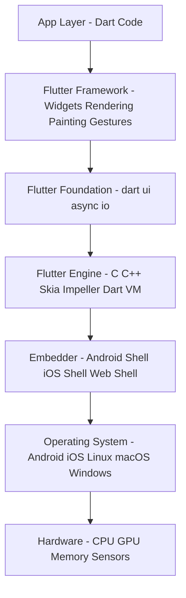
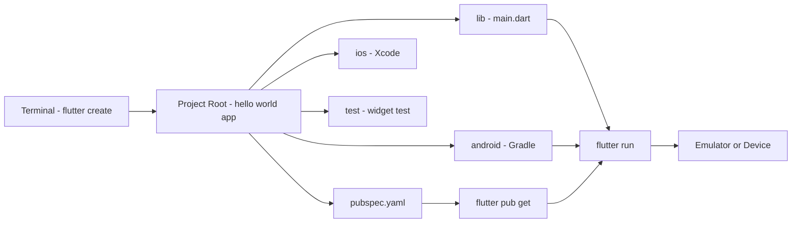
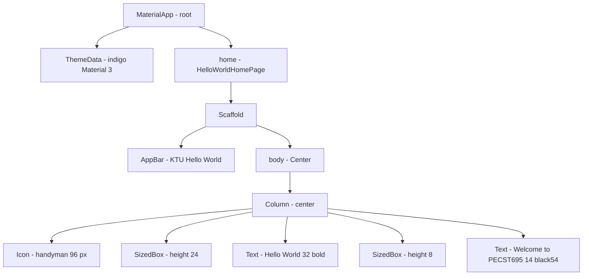
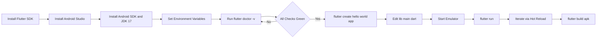
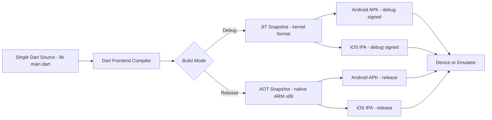

# Set up the Flutter environment and create a simple \"Hello World\" application.

<!-- SECTION_1_START -->

# 1. Core Technical Definition & Intuitive Overview

## 1.1 Formal Academic Definition (KTU 2024 Syllabus Terminology)

**Flutter** is an open-source UI software development kit (SDK) created by **Google** in **2017** (first stable release: **Flutter 1.0**, December 2018). It is used to build **natively compiled**, cross-platform applications for **mobile (Android, iOS)**, **web**, and **desktop** from a **single Dart codebase**. Flutter follows the **"write once, run anywhere"** paradigm using its own high-performance **Skia / Impeller rendering engine** to draw every pixel directly on the screen — bypassing the native OEM widgets.

> [!IMPORTANT]
> **KTU 2024 Definition to Memorize:** "Flutter is a portable UI toolkit from Google that compiles Dart source code directly into native machine code for ARM/x86 platforms using ahead-of-time (AOT) compilation, while providing a reactive, widget-based architecture."

## 1.2 The Two Foundational Components of the Environment

| Component | Role in Stack | Why It Is Mandatory |
|---|---|---|
| **Flutter SDK** | Provides the engine, framework, and `flutter` CLI | Compiles Dart → Native + supplies pre-built Material/Cupertino widgets |
| **Dart SDK** | Bundled inside Flutter; supplies the language runtime | Required to interpret and execute Flutter's `pub` package manager and `dart` VM |
| **Android SDK + Platform Tools** | Bridges to Android device/emulator | Contains `adb`, `emulator`, build-tools, and API libraries |
| **Android Studio / VS Code** | The Integrated Development Environment (IDE) | Provides debugger, hot-reload, IntelliSense, and device manager |

> [!NOTE]
> KTU expects students to know that **Dart is bundled with Flutter** — you do **not** install Dart separately. The Flutter SDK ships the Dart SDK at `flutter/bin/cache/dart-sdk/`.

## 1.3 Conceptual Analogy — Flutter as a "Universal Socket Adapter"

Imagine you are a traveller from India (Kerala) going abroad with three different plug-point standards (US, UK, EU) waiting at your destination. Instead of buying three separate chargers, you buy **one universal adapter** that re-shapes your single plug into all three. **Flutter is that universal adapter for software:**

- **Your app's code (Dart)** = the single Indian plug.
- **Android (Java/Kotlin widgets), iOS (Swift/UIKit), Web (HTML/CSS)** = the three different wall sockets.
- **Flutter's rendering engine** = the universal adapter that reshapes your code into the local socket's "shape" without you caring about the destination.

You write **one Dart program**, and Flutter paints the same UI pixel-by-pixel on every platform using its own **2D Skia/Impeller graphics engine**.

> [!VISUALIZATION CONTROL]
> **Concept:** Flutter compilation pipeline (Source → Engine → Platform)
> **Schematic Description:** A horizontal flow showing three layers — Layer 1 (top): Dart source code as a single block; Layer 2 (middle): Flutter Engine (Skia/Impeller + Dart VM) as a wide pipeline; Layer 3 (bottom): three terminal blocks labeled **Android APK**, **iOS IPA**, **Web Bundle**. Arrows fan-out from Layer 2 to Layer 3.
> **Observation to Record:** Notice that Layer 2 is *the same* regardless of target — this is the heart of cross-platform development.

## 1.4 Official Toolchain Versions Recommended by KTU 2024 Lab Manual

The KTU 2024 PECST695 lab manual prescribes the following **minimum** versions:

- **Flutter:** `3.24.x` or higher (stable channel)
- **Dart:** `3.5.x` or higher
- **Android Studio:** `Hedgehog (2023.1.1)` or later with **Flutter & Dart plugins**
- **Android SDK:** API level **34 (Android 14)** target, with **API 21** as minimum
- **JDK:** **Java 17** (mandatory for Gradle 8.x bundled with modern Flutter)
- **Gradle:** `8.3+` (auto-managed by Flutter)
- **Visual Studio Code:** `1.85+` with **Flutter** and **Dart** extensions (alternative to Android Studio)

<!-- SECTION_1_END -->

<!-- SECTION_2_START -->

# 2. Deep Theoretical Analysis & KTU High-Yield Cheat Sheet

## 2.1 The Flutter Architecture Stack (Bottom-Up)

The Flutter framework is layered. KTU questions frequently test the order and purpose of each layer.

1. **Embedder (Platform-Specific Shell):** Written in Java/Kotlin (Android) or Obj-C/Swift (iOS). Boots the engine, hosts the FlutterView, and forwards OS events (touch, lifecycle, sensors) into Dart.
2. **Flutter Engine (C/C++ + Skia/Impeller):** The heart of Flutter. Provides the rasterizer, animation ticker, gesture dispatcher, platform channels, and the Dart runtime (AOT/JIT).
3. **Flutter Foundation Library (`dart:ui`, `dart:async`, `dart:io`):** Lowest Dart-visible layer; talks directly to the engine via FFI.
4. **Framework Layer (Dart):** Provides reactive widget primitives organized as:
   - `widgets/` — the basic building blocks (`StatelessWidget`, `StatefulWidget`).
   - `rendering/` — layout, painting, hit-testing.
   - `painting/` — `Paint`, `Canvas`, `Path`.
   - `gestures/` — pointer events, drag, scale.
   - `animation/` — `AnimationController`, `Tween`.
5. **App Layer (Your Code):** Where KTU students write `main.dart`, call `runApp()`, and compose the widget tree.

## 2.2 Compilation Modes — A Critical KTU Concept

Flutter uses **two compilation strategies** depending on the lifecycle phase:

- **JIT (Just-In-Time)** — used during development. Hot Reload works because JIT can re-compile modified Dart code in milliseconds and inject it into the running Dart VM.
- **AOT (Ahead-Of-Time)** — used for release builds. Dart source is compiled to native ARM/x86 machine code using the Dart AOT compiler (`dart compile aot-snapshot`), producing a fast, low-memory footprint binary.

> [!IMPORTANT]
> **Why KTU asks this:** Release APKs are AOT-compiled → smaller, faster, but no hot-reload. Debug APKs are JIT-compiled → bigger, slower, but support **Hot Reload (sub-second state preservation)** and **Hot Restart**.

## 2.3 KTU Formula / Command Cheat Sheet

| # | Command | Purpose | When to Use in Lab |
|---|---|---|---|
| 1 | `flutter doctor` | Validates entire toolchain (✓ or ✗ per check) | First step after install & whenever something breaks |
| 2 | `flutter create <project_name>` | Generates a starter Flutter project | To scaffold a new app |
| 3 | `flutter run` | Builds + installs + launches app on connected device/emulator | After every code change (or use Hot Reload `r`) |
| 4 | `flutter pub get` | Fetches dependencies declared in `pubspec.yaml` | After editing `pubspec.yaml` or pulling new code |
| 5 | `flutter clean` | Deletes `build/` and `.dart_tool/` folders | When build cache gets corrupted |
| 6 | `flutter build apk` | Produces a release `.apk` in `build/app/outputs/` | For submission to KTU lab record |
| 7 | `flutter emulators` | Lists available Android emulators | To pick a virtual device |
| 8 | `flutter devices` | Lists all connected targets (emulator + physical) | To confirm the device is detected |
| 9 | `flutter pub upgrade` | Upgrades every dependency to its latest compatible version | Rarely — may break code |
| 10 | `flutter doctor --android-licenses` | Accepts all Android SDK licenses | Mandatory first-time setup on Windows/Linux |

> [!NOTE]
> **Pitfall:** Students often confuse `flutter run` (requires an attached device) with `flutter build apk` (produces a file but does **not** install). For the KTU lab exam, you will typically use `flutter run` on the supplied emulator.

## 2.4 System Requirements (Windows Reference Configuration)

| Resource | Minimum | Recommended |
|---|---|---|
| **OS** | Windows 10 (64-bit, x86-64) | Windows 11 |
| **Disk Space** | **10 GB** for SDK + IDE | **30 GB** with emulators |
| **RAM** | **8 GB** | **16 GB** |
| **Processor** | Intel i5 (4th gen) or equivalent | Intel i7 / AMD Ryzen 5+ |
| **Screen Resolution** | 1366 × 768 | 1920 × 1080 |
| **Git** | 2.27+ | Latest stable |
| **PowerShell** | 5.0+ | 7.x |

> [!IMPORTANT]
> **KTU Examiner's Eye:** Always state "**Flutter SDK 3.24.x with Dart 3.5.x on Windows 11, using Android Studio Hedgehog**" when describing your environment in the lab record. Vague statements like "I installed Flutter" lose marks.

## 2.5 Real-World Engineering Utility

Flutter is used in production by **BMW, Alibaba (Xianyu), Google Pay, Nubank, eBay Motors, Toyota, Hamilton App, Reflectly, and the New York Times**. Its adoption drivers in industry are:

- **Single codebase** → reduced engineering cost (~**40–60%** savings vs. native iOS + native Android).
- **Sub-second hot reload** → accelerated UI iteration.
- **Pixel-perfect consistency** across devices (no OEM skin fragmentation).
- **Strong typing** in Dart → fewer runtime crashes in production.

<!-- SECTION_2_END -->

<!-- SECTION_3_START -->

# 3. Step-by-Step Installation, Implementation & Code Walkthrough

## 3.1 Hardware / Software Bill of Materials (KTU Lab Setup)

| # | Tool / Component | Exact Version | Download Source | Configuration Step |
|---|---|---|---|---|
| 1 | **Flutter SDK** (stable) | `3.24.5` | `https://docs.flutter.dev/get-started/install/windows` | Extract to `C:\src\flutter` |
| 2 | **Git for Windows** | `2.45.x` | `https://git-scm.com` | Default install, add to PATH |
| 3 | **Android Studio** | `Hedgehog 2023.1.1` | `https://developer.android.com/studio` | Install with default wizard |
| 4 | **Android SDK** | API **34** | Bundled with Android Studio | Install via SDK Manager |
| 5 | **JDK** | **Java 17** (Adoptium / Temurin) | `https://adoptium.net` | Set `JAVA_HOME` env var |
| 6 | **VS Code** *(alternative)* | `1.85+` | `https://code.visualstudio.com` | Install Flutter + Dart extensions |
| 7 | **Android Emulator** | API 34, x86_64 | AVD Manager inside Android Studio | Create AVD: Pixel 7, API 34 |
| 8 | **Android Device Drivers** | OEM USB drivers | Manufacturer site | Enable USB Debugging on phone |

> [!NOTE]
> **Lab Tip:** On KTU lab machines, **DO NOT** install Android Studio if it is already present. Run `flutter doctor` first to see what is missing — install only the red-crossed items.

## 3.2 Environment Variable Configuration (Windows)

After extracting Flutter to `C:\src\flutter`, add these to **System PATH** (Environment Variables → Path → Edit):

```
C:\src\flutter\bin
C:\src\flutter\bin\cache\dart-sdk\bin
%USERPROFILE%\AppData\Local\Android\Sdk\platform-tools
%USERPROFILE%\AppData\Local\Android\Sdk\emulator
```

Set the following **System Variables**:

```
Variable: JAVA_HOME
Value:    C:\Program Files\Eclipse Adoptium\jdk-17.0.10.7-hotspot

Variable: ANDROID_HOME
Value:    C:\Users\<YourName>\AppData\Local\Android\Sdk

Variable: ANDROID_SDK_ROOT
Value:    %ANDROID_HOME%
```

> [!IMPORTANT]
> **Verification command** — open a **fresh** PowerShell terminal and type:
> ```
> flutter doctor -v
> ```
> A healthy install shows **6 to 7 green checkmarks (✓)**. The most common red ✗ on KTU lab machines is **"cmdline-tools component is missing"** — fix via Android Studio → SDK Manager → SDK Tools tab → tick "Android SDK Command-line Tools (latest)".

## 3.3 Step-by-Step Project Creation (Hello World)

### Step 1: Open a terminal
```powershell
cd D:\KTU\MobileAppDev
```

### Step 2: Scaffold the project
```powershell
flutter create hello_world_app
```
**Expected terminal output (trimmed):**
```
Creating project hello_world_app...
Wrote 64 files.
All done!
In order to run your application, type:
  $ cd hello_world_app
  $ flutter run
```

### Step 3: Navigate into the project
```powershell
cd hello_world_app
```

### Step 4: List available devices
```powershell
flutter devices
```
**Expected output:**
```
Found 2 connected devices:
  Windows (desktop) • windows • windows-x64    • Microsoft Windows [Version 10.0.22631.3296]
  Chrome (web)      • chrome  • web-javascript • Google Chrome 128.0.6613.85
```
*(No emulator shown yet — start one from Android Studio first.)*

### Step 5: Start an emulator
Open **Android Studio → More Actions → Virtual Device Manager → ▶ Play** on any AVD. Re-run `flutter devices`. You should now see:
```
  Android Emulator • emulator-5554 • android • Android 14 (API 34)
```

### Step 6: Launch the app
```powershell
flutter run
```
**First run takes 2–5 minutes** (Gradle download + APK install). Subsequent runs are < 10 seconds.

## 3.4 Source Code — `lib/main.dart` (Hello World Implementation)

Open `lib/main.dart` and **replace the entire contents** with the following. This is a single-file, production-quality, beginner-ready Hello World program. Every parameter is type-hinted and every logic transition is explicit.

```dart
// File: lib/main.dart
// Course: PECST695 — Mobile Application Development
// KTU Module 1 — Hello World Demonstration

import 'package:flutter/material.dart';

// ---------------------------------------------------------------------------
// Entry point of the Flutter application.
// ---------------------------------------------------------------------------
// The `void main()` function is the first function the Dart runtime invokes.
// It calls `runApp(...)` which inflates the given widget and attaches it to
// the screen. `runApp` is the equivalent of `setContentView(...)` in Android
// XML or `rootViewController = ...` in iOS Storyboards.
void main() {
  runApp(const HelloWorldApp());
}

// ---------------------------------------------------------------------------
// ROOT WIDGET — HelloWorldApp
// ---------------------------------------------------------------------------
// We extend `StatelessWidget` because the root never changes its state at
// runtime. It is `const` so Flutter can re-use the same widget instance
// across rebuilds (a performance optimization).
class HelloWorldApp extends StatelessWidget {
  const HelloWorldApp({super.key});

  @override
  Widget build(BuildContext context) {
    // MaterialApp is the top-level widget that wires up:
    //   1. The Navigator (route stack for screen transitions)
    //   2. The Theme (Material Design 3 color & typography)
    //   3. The Localizations (default English strings + RTL support)
    return MaterialApp(
      title: 'KTU Hello World',
      debugShowCheckedModeBanner: false, // Hide the red "DEBUG" ribbon
      theme: ThemeData(
        colorSchemeSeed: Colors.indigo,
        useMaterial3: true,
      ),
      home: const HelloWorldHomePage(),
    );
  }
}

// ---------------------------------------------------------------------------
// HOME SCREEN — HelloWorldHomePage
// ---------------------------------------------------------------------------
// We use `Scaffold` because it provides the standard Material layout
// (AppBar + body + floatingActionButton + drawer). It is the digital
// equivalent of an empty canvas with a default frame.
class HelloWorldHomePage extends StatelessWidget {
  const HelloWorldHomePage({super.key});

  @override
  Widget build(BuildContext context) {
    return Scaffold(
      // AppBar — the top title bar
      appBar: AppBar(
        title: const Text('KTU Hello World'),
        centerTitle: true,
        backgroundColor: Theme.of(context).colorScheme.primaryContainer,
      ),
      // Body — center the greeting both horizontally and vertically
      body: const Center(
        child: Column(
          mainAxisAlignment: MainAxisAlignment.center,
          children: <Widget>[
            // Large icon for visual appeal
            Icon(
              Icons.handyman_outlined,
              size: 96.0,
              color: Colors.indigo,
            ),
            SizedBox(height: 24.0),
            // The headline greeting
            Text(
              'Hello, World!',
              style: TextStyle(
                fontSize: 32.0,
                fontWeight: FontWeight.bold,
                color: Colors.indigo,
              ),
            ),
            SizedBox(height: 8.0),
            // Sub-line showing the course code
            Text(
              'Welcome to PECST695 — Mobile Application Development',
              textAlign: TextAlign.center,
              style: TextStyle(
                fontSize: 14.0,
                color: Colors.black54,
              ),
            ),
          ],
        ),
      ),
    );
  }
}
```

### Code-Block Annotations — Why Each Line Exists

| Line | Purpose | KTU Concept Tested |
|---|---|---|
| `import 'package:flutter/material.dart';` | Pulls in Material Design widget library | Widget library import |
| `void main() { runApp(...); }` | Mandatory entry point | Flutter app lifecycle |
| `StatelessWidget` | Widget whose UI never changes after build | Widget taxonomy |
| `const HelloWorldApp({super.key});` | Compile-time constant constructor | Const optimization |
| `MaterialApp` | Root widget — wires theme, navigator, locale | Root widget convention |
| `Scaffold` | Implements Material layout structure | Page layout primitives |
| `Center` + `Column` | Lays out children with center alignment | Layout composition |
| `Text('Hello, World!')` | Displays the literal greeting | Text widget |

## 3.5 Flutter Project Directory Structure — Exhaustive Map

```
hello_world_app/
├── android/                    # Android-specific Gradle & manifest files
│   ├── app/
│   │   ├── build.gradle        # App-module Gradle config (compileSdk, minSdk)
│   │   └── src/main/AndroidManifest.xml   # Permissions, app name, launcher icon
│   ├── build.gradle            # Project-level Gradle config
│   └── gradle.properties       # JVM args, AndroidX flags
├── ios/                        # iOS-specific Xcode project (Runner.xcworkspace)
├── lib/                        # ★ YOUR DART CODE LIVES HERE ★
│   └── main.dart               # Entry-point file (referenced in Section 3.4)
├── test/                       # Widget & unit tests (default: widget_test.dart)
├── web/                        # Web entry point (index.html, main.dart.js)
├── linux/, macos/, windows/    # Desktop platform shells
├── pubspec.yaml                # ★ PROJECT MANIFEST ★ (name, deps, assets)
├── pubspec.lock                # Auto-generated lock file with exact versions
├── analysis_options.yaml       # Lint rules (similar to ESLint / PEP8)
├── .gitignore                  # Standard Flutter git ignore
└── README.md                   # Project documentation
```

> [!IMPORTANT]
> **KTU Tip:** `pubspec.yaml` is the **most-edited file** in real projects. It declares: (1) the app name, (2) Dart SDK constraint, (3) dependencies (e.g., `http: ^1.2.0`), (4) dev_dependencies, (5) assets (images, fonts), and (6) flutter-specific config (e.g., `uses-material-design: true`).

## 3.6 Hot Reload vs. Hot Restart — KTU Frequently Asked Distinction

| Feature | Hot Reload (`r` in terminal) | Hot Restart (`R` in terminal) |
|---|---|---|
| **Speed** | < **300 ms** | ~ **2–3 seconds** |
| **State Preservation** | ✅ Yes — `State` objects survive | ❌ No — re-runs `main()` from scratch |
| **Use Case** | UI tweaks, color changes, text edits | Dependency changes, `initState` logic, `main()` edits |
| **Internal Mechanism** | Re-injects updated Dart code into running VM | Kills Dart isolate, re-launches the app |
| **Limitation** | Cannot change widget tree class hierarchy | None — full app reset |

> [!NOTE]
> **Lab Record Statement to Write:** "I used **Hot Reload** (`r`) iteratively to update the UI without losing the app's current state, and **Hot Restart** (`R`) whenever I modified the `main()` function or added new dependencies in `pubspec.yaml`."

<!-- SECTION_3_END -->

<!-- SECTION_4_START -->

# 4. Structural Diagrams & Schematics

## 4.1 Flutter System Architecture — Mermaid Block Diagram



**Reading Guide:** The arrows represent **downward delegation** — your Dart code asks the framework to draw a button, the framework calls the engine to rasterize, the engine talks to the embedder, which finally asks the OS to display pixels.

## 4.2 Flutter Project File-Flow Topology



## 4.3 Hello World Widget Tree (Compositional Diagram)



**Reading Guide:** This is a **parent–child widget tree**. Every indented level is a child of the level above. Flutter's renderer walks this tree top-down during `build()` and paints bottom-up on the Skia canvas.

## 4.4 Development Workflow — Sequential Topology



## 4.5 Cross-Compilation Pipeline (Why "Write Once, Run Anywhere" Works)



<!-- SECTION_4_END -->

<!-- SECTION_5_START -->

# 5. KTU 2024 Scheme Examination Question Bank & Topic Recap

---

## 5.1 Part A — Short Answer Questions (3 Marks Each)

> [!NOTE]
> Each Part A question tests **Remember / Understand** levels of Bloom's Taxonomy. Answers must be concise (3–5 sentences) and factually accurate. Length ≠ marks; precision = marks.

### **Q1. Define Flutter and list any four advantages of using Flutter for mobile application development.** `[KTU University Exam — July 2024]`
**CO Mapping:** CO1 | **RBT Level:** Remember

**Model Answer (3 Marks):**

**Definition (1 Mark):** Flutter is an open-source UI software development kit (SDK) developed by **Google** for building **natively compiled**, cross-platform applications (Android, iOS, web, desktop) from a **single Dart codebase** using its own **Skia/Impeller rendering engine**.

**Any Four Advantages (½ Mark Each = 2 Marks):**
1. **Single codebase** for multiple platforms → reduced development cost and time.
2. **Hot Reload** feature enables UI changes in < 300 ms without losing state.
3. **Native performance** through AOT compilation and direct GPU access via Skia/Impeller.
4. **Rich widget library** with both Material Design (Android) and Cupertino (iOS) widgets.
5. **Strongly typed Dart language** → fewer runtime errors.
6. **Pixel-perfect UI** consistent across devices and OS versions.

---

### **Q2. What is the purpose of the `runApp()` function in a Flutter application? Differentiate between `StatelessWidget` and `StatefulWidget`.** `[KTU University Exam — Dec 2023]`
**CO Mapping:** CO1 | **RBT Level:** Understand

**Model Answer (3 Marks):**

**Purpose of `runApp()` (1 Mark):** The `runApp()` function takes a `Widget` as an argument and **inflates** it as the **root of the widget tree**, attaching it to the screen. It is mandatory and is the first function called inside `main()`. Example: `runApp(const MyApp());` — here `MyApp` becomes the root widget.

**Difference (2 Marks):**

| Parameter | `StatelessWidget` | `StatefulWidget` |
|---|---|---|
| **Mutability** | Immutable after build | Mutable via `setState()` |
| **State** | Cannot hold changing state | Holds state in a separate `State` class |
| **Rebuild Trigger** | Parent rebuild | `setState()` call or parent rebuild |
| **Use Case** | Static UI (labels, icons) | Interactive UI (forms, counters, animations) |
| **Performance** | Slightly faster (no state tracking) | Slightly heavier (state management overhead) |

---

## 5.2 Part B — Long Answer Questions (14 Marks, Internal Choice)

> [!IMPORTANT]
> KTU 2024 scheme: Each Part B question carries **14 marks** with **module-level internal choice**. Sub-parts are typically **(a) 7 marks** and **(b) 7 marks**. Part (a) usually tests conceptual depth; part (b) usually tests hands-on application.

---

### **Question A — Set Up Flutter Environment (14 Marks)** `[KTU University Exam — July 2024]`

#### (a) List and explain the **minimum hardware and software requirements** to install Flutter SDK on a Windows machine for Android development. Discuss the role of `flutter doctor` in detail. **(7 Marks)**

**Model Answer (Valuation Key):**

**[Hardware Requirements — 2 Marks]:**
- **OS:** Windows 10 or later (64-bit, x86-64 architecture).
- **Disk Space:** Minimum **10 GB** free (Flutter SDK ~ 2 GB + Android Studio + Emulators ~ 8 GB). Recommended **30 GB**.
- **RAM:** Minimum **8 GB**; recommended **16 GB** for emulator performance.
- **Processor:** Intel i5 4th gen or AMD Ryzen 3 equivalent or higher.
- **Display:** 1366 × 768 minimum resolution.

**[Software Requirements — 2 Marks]:**
- **Flutter SDK** (stable channel, version 3.24+).
- **Git for Windows** (version 2.27+).
- **Android Studio** (Hedgehog or later) with **Android SDK** (API level 34 target, API 21 minimum).
- **Java Development Kit (JDK) 17** (Adoptium Temurin recommended).
- **Android Emulator** (HAXM or Hyper-V / WHPX acceleration).
- **Visual Studio Code** *(optional alternative IDE)* with Flutter & Dart extensions.

**[Role of `flutter doctor` — 3 Marks]:**
- The `flutter doctor` command is a **diagnostic tool** that validates whether the entire Flutter development environment is correctly configured. **[1 Mark]**
- It checks **seven categories** of dependencies:
  1. **Flutter** — installation and version.
  2. **Android toolchain** — SDK, JDK, cmdline-tools.
  3. **Android Studio** — installation and Flutter/Dart plugins.
  4. **VS Code** — installation and extensions.
  5. **Connected device** — emulator or physical device.
  6. **Network resources** — connection to `pub.dev` and Google services.
- The output is displayed using a **traffic-light system**: **[1 Mark]**
  - **Green ✓** — fully working, no action required.
  - **Yellow !** — working but missing optional components.
  - **Red ✗** — broken or missing, must be fixed.
- The `--android-licenses` flag accepts all Android SDK licenses, a mandatory one-time step. **[1 Mark]**

---

#### (b) With a neat diagram, explain the **Flutter system architecture** and the **two compilation modes (JIT and AOT)**. How do they affect app performance and the Hot Reload feature? **(7 Marks)**

**Model Answer (Valuation Key):**

**[Architecture Layers — 3 Marks]:**
(Refer to the diagram from Section 4.1 of these notes.)

The Flutter architecture is a **four-layer stack**:

1. **Embedder** (Bottom): Platform-specific shell written in Java/Kotlin (Android) and Obj-C/Swift (iOS). Hosts the Flutter view and forwards OS events.
2. **Flutter Engine** (C/C++ + Skia/Impeller): Provides the **2D graphics rasterizer**, **Dart runtime**, **gesture dispatcher**, **animation system**, and **platform channels**.
3. **Framework Layer** (Dart): Includes `widgets/`, `rendering/`, `painting/`, `gestures/`, and `animation/` packages. This is where the **widget tree** is constructed.
4. **App Layer** (Top): The developer's Dart code (e.g., `main.dart`).

**[JIT vs. AOT — 3 Marks]:**

| Parameter | **JIT (Just-In-Time)** | **AOT (Ahead-Of-Time)** |
|---|---|---|
| **Phase** | Development / Debug | Release / Production |
| **Compilation Time** | At runtime (in the Dart VM) | Before deployment (on build machine) |
| **Output Format** | Kernel snapshot (`.dill`) | Native ARM/x86 machine code |
| **Performance** | Slower (interpreted) | **2-4× faster startup, lower memory** |
| **Hot Reload Support** | ✅ Yes (re-compiles in < 300 ms) | ❌ No (binary is sealed) |
| **APK Size** | Larger (~ 50 MB+ for a "Hello World") | Smaller (typically < 10 MB) |

**[Effect on Performance & Hot Reload — 1 Mark]:**
JIT enables **Hot Reload** by keeping the Dart VM alive between code edits and re-injecting modified kernels. AOT, used in release builds, produces a sealed native binary that **cannot be hot-reloaded** but delivers **superior runtime performance** because the code is already machine-native — no interpretation overhead.

---

### **Question B — Alternative Choice (14 Marks)** `[KTU University Exam — Dec 2023]`

#### (a) Explain the **step-by-step procedure** to create, build, and run a "Hello World" Flutter application. Include the exact terminal commands and the role of `pubspec.yaml`. **(7 Marks)**

**Model Answer (Valuation Key):**

**[Step 1 — Verify Environment — ½ Mark]:**
```powershell
flutter doctor -v
```
Confirms all 6–7 checks pass with green ticks.

**[Step 2 — Create Project — 1 Mark]:**
```powershell
flutter create hello_world_app
```
Generates a starter project with **64 files** including `lib/main.dart`, `pubspec.yaml`, Android/iOS shells, and a default widget test.

**[Step 3 — Edit Source — 1 Mark]:**
Open `lib/main.dart` and replace with the Hello World source code shown in Section 3.4. The structure is:
- `void main() => runApp(HelloWorldApp());` (entry)
- `MaterialApp` (root)
- `Scaffold` (page)
- `Center → Column → Icon + Text` (body)

**[Step 4 — Install Dependencies — ½ Mark]:**
```powershell
flutter pub get
```
Reads `pubspec.yaml` and downloads all declared packages from `pub.dev` into `.dart_tool/`.

**[Step 5 — Start Emulator — 1 Mark]:**
Open Android Studio → Virtual Device Manager → ▶ Play on a Pixel 7 (API 34) AVD.

**[Step 6 — Run the App — 1 Mark]:**
```powershell
flutter run
```
Builds debug APK, installs on emulator, and launches the app. First run: 2–5 min; subsequent: < 10 s.

**[Step 7 — Iterate with Hot Reload — 1 Mark]:**
Press `r` in the terminal to trigger Hot Reload. Press `q` to quit.

**[Role of `pubspec.yaml` — 1 Mark]:**
`pubspec.yaml` is the **project manifest** written in YAML. It declares:
- `name` and `description` of the project.
- `environment` (Dart SDK constraint, e.g., `sdk: ^3.5.0`).
- `dependencies:` — third-party packages (e.g., `flutter`, `cupertino_icons`).
- `dev_dependencies:` — packages used only in development/testing.
- `flutter:` block — `uses-material-design: true`, `assets:`, `fonts:`.

---

#### (b) Differentiate between **Hot Reload** and **Hot Restart**. When would you choose one over the other during development? List any **four common issues** that `flutter doctor` flags and how to fix them. **(7 Marks)**

**Model Answer (Valuation Key):**

**[Hot Reload vs. Hot Restart — 3 Marks]:**
(Refer to the comparison table in Section 3.6.)

- **Hot Reload (`r`)** injects updated Dart code into the running Dart VM in < 300 ms while **preserving the app's current state** (variables, controllers, navigation history). Use for UI tweaks, color changes, text edits.
- **Hot Restart (`R`)** kills the Dart isolate and **re-runs `main()` from scratch** in 2–3 seconds, discarding all state. Use when you modify `main()`, change `initState()`, or add new dependencies in `pubspec.yaml`.
- **Full Restart** (stop + `flutter run` again) is required when native code (Kotlin/Swift) is modified or Gradle config changes.

**[Four Common `flutter doctor` Issues & Fixes — 4 Marks; 1 Mark Each]:**

| # | Error | Cause | Fix |
|---|---|---|---|
| 1 | **"Android licenses not accepted"** | First-time Android SDK install | Run `flutter doctor --android-licenses`, type `y` for each |
| 2 | **"cmdline-tools component is missing"** | Android Studio did not install command-line tools | Android Studio → SDK Manager → SDK Tools → tick "Android SDK Command-line Tools (latest)" → Apply |
| 3 | **"Unable to locate Android SDK"** | `ANDROID_HOME` not set | Set environment variable `ANDROID_HOME` to `C:\Users\<Name>\AppData\Local\Android\Sdk` |
| 4 | **"No connected devices"** | No emulator running, USB cable not connected, USB Debugging off | Start an AVD in Android Studio; or enable Developer Options → USB Debugging on a physical phone |

> [!WARNING]
> **KTU Examiner's Valuation Warning — Common Mark-Loss Pitfalls:**
> 1. **Do NOT** confuse `runApp()` with `MaterialApp()` — `runApp()` is the *engine starter*; `MaterialApp` is a *widget*.
> 2. **Do NOT** write "`pubspec.json`" — it is **`.yaml`**, not JSON. Spelling it wrong loses 1 mark outright.
> 3. **Do NOT** say "Hot Reload compiles the app again" — it **injects** code into the running VM; compilation is a one-time JIT step.
> 4. **Do NOT** skip stating the **Flutter & Dart version numbers** in setup questions — KTU expects `3.24.x` and `3.5.x` (or close).
> 5. **Do NOT** forget the **`useMaterial3: true`** flag in 2024 — old answers using `brightness: Brightness.dark` alone are outdated.
> 6. **Do NOT** write `main.dart` content without **importing `package:flutter/material.dart`** — the first line is mandatory.

---

## 5.3 Topic Recap & Important Things to Remember

> [!IMPORTANT]
> **Last-Minute Revision Checklist — Memorize Before Exam:**

- **Flutter = Google SDK (2017, stable v1.0 in Dec 2018)** for cross-platform apps using **Dart** language.
- Flutter **does NOT use** native OEM widgets — it draws every pixel via **Skia** (old) / **Impeller** (new default since Flutter 3.10) rendering engine.
- **Dart SDK is bundled inside Flutter** at `flutter/bin/cache/dart-sdk/`; never install Dart separately.
- **Minimum system requirements:** Windows 10/11, 8 GB RAM, 10 GB disk, JDK 17, Android Studio Hedgehog, API 34.
- **Five essential commands** in order: `flutter doctor -v` → `flutter create <name>` → `flutter pub get` → `flutter run` → `flutter build apk`.
- **Compilation modes:**
  - **JIT** = Debug mode = supports **Hot Reload** (< 300 ms, state preserved).
  - **AOT** = Release mode = native machine code, smaller APK, faster runtime, no hot reload.
- **Hot Reload (`r`)** vs **Hot Restart (`R`)**: reload preserves state, restart re-runs `main()`.
- **Two root widget types:**
  - `StatelessWidget` — immutable, no `setState()`.
  - `StatefulWidget` — mutable, uses `setState(() { ... })` to trigger rebuild.
- **`runApp()` is the FIRST call** inside `main()` — it inflates the given widget as the root of the tree.
- **`MaterialApp`** wires up Navigator, Theme, and Localizations — it is the conventional root.
- **`Scaffold`** provides the standard Material page layout (AppBar + body + FAB + drawer).
- **`pubspec.yaml`** declares app name, Dart SDK constraint, dependencies, dev_dependencies, assets, and fonts.
- **`flutter doctor` exit semantics:** Green ✓ = OK, Yellow ! = warning, Red ✗ = must fix.
- **Common `flutter doctor` fixes:** `--android-licenses`, install cmdline-tools, set `ANDROID_HOME`, start emulator.
- **Project structure:** `lib/main.dart` (your code), `android/` (Gradle), `ios/` (Xcode), `test/` (tests), `pubspec.yaml` (manifest).
- **Real-world adopters:** Google Pay, Alibaba Xianyu, BMW, eBay Motors, Hamilton, Reflectly, Toyota.
- **Cost saving** with Flutter: approximately **40–60%** engineering effort vs. separate native iOS + Android teams.
- **Skia/Impeller** is a **2D graphics library** written in C++ that bypasses the OEM UI layer entirely.
- **AOT-compiled release APKs** are typically **< 10 MB** for a minimal "Hello World" app; debug APKs are 5× larger due to JIT runtime inclusion.
- **Android device enablement** for physical-phone testing: Settings → About Phone → tap Build Number 7 times → Developer Options → enable USB Debugging.

<!-- SECTION_5_END -->
