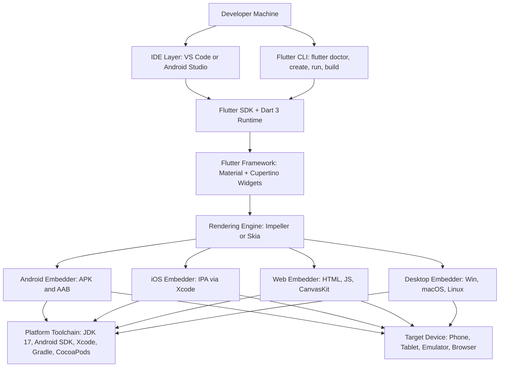
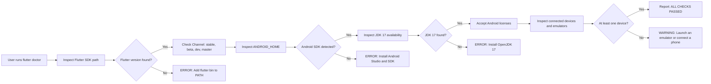
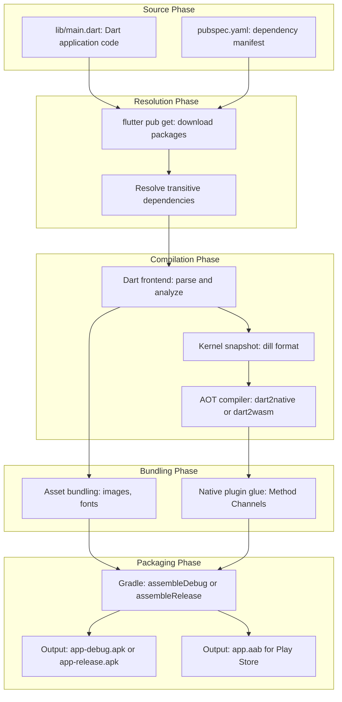
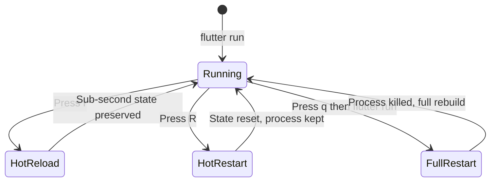
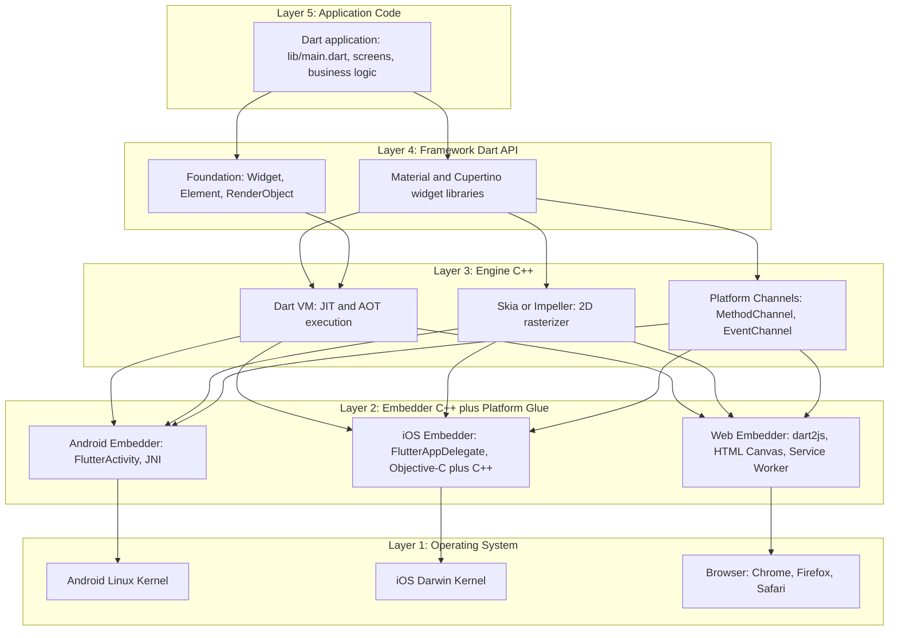

# Setting Up the Flutter Development Environment

<!-- SECTION_1_START -->
# Setting Up the Flutter Development Environment

## 1.1 Formal Definition (KTU 2024 Syllabus Standard)

> [!IMPORTANT]
> **Flutter** is an open-source UI software development kit (SDK) created by **Google** (first released in **2017**, stable v1.0 in December 2018) that enables the development of natively compiled, cross-platform applications for **Android, iOS, Linux, macOS, Windows, Web, and embedded devices** from a **single Dart codebase**. The *Flutter Development Environment* is the integrated stack of SDKs, IDEs, emulators, build tools, and language runtimes required to author, compile, debug, and deploy a Flutter application.

The environment is governed by the official documentation hosted at `flutter.dev` and the **Dart 3** language specification. The two most important artifacts the environment must expose to the operating system are:

1. The `flutter` command-line tool (located in `flutter/bin/`).
2. The bundled **Dart SDK** (located in `flutter/bin/cache/dart-sdk/`).

## 1.2 Conceptual Analogy & Intuition

> [!NOTE]
> **Analogy: The "Workshop" Model**
> Imagine you are about to bake a custom cake that must be served simultaneously at weddings in Kerala, Delhi, New York, and London — but the guests at each venue expect different plates, different cultural decorations, and different serving styles. Instead of building four completely separate kitchens, you build **one master kitchen** (Flutter) that uses a single universal batter recipe (**Dart code**), a single oven that can adapt its temperature automatically (**Flutter Engine + Skia Graphics**), and four translation services that plate the cake in the local style (**Platform Channels + Material/Cupertino Widgets**).

In the same way, the **Flutter Development Environment** is the "master kitchen." You install it **once** on your machine, and from that one kitchen, you cook applications that natively run on **Android, iOS, Web, and Desktop** without rewriting logic.

### 1.3 Critical Environment Constants & Metrics

| Metric | Standard Value | Notes |
| :--- | :--- | :--- |
| Flutter Stable Channel | **Latest 3.x** (releases roughly every quarter) | Production-ready |
| Dart SDK Version | **Dart 3.x** | Bundled inside Flutter SDK |
| Min Android SDK | **API 21 (Android 5.0 Lollipop)** | Required since Flutter 3.0 |
| Min iOS Version | **iOS 12.0** | Required since Flutter 3.0 |
| JDK Required for Android | **JDK 17** | Mandatory for AGP 8+ |
| Gradle (Android Build) | **8.x** | Auto-managed by Flutter |
| Kotlin (Android Templates) | **1.9.x** | |
| Default Build Renderer | **Impeller** (since Flutter 3.10) | Replaces Skia on iOS |

> [!TIP]
> **Syllabus Highlight (PECST695 - Module 1):** The KTU 2024 Scheme expects students to (1) identify the tools required, (2) install and configure the toolchain, (3) validate the environment using `flutter doctor`, and (4) run a sample application. Memorize the **four mandatory pillars**: *Flutter SDK, IDE, Platform Toolchain, Target Device/Emulator*.

> [!VISUALIZATION CONTROL]
> **Concept:** Layered Software Stack of the Flutter Development Environment
> **Coordinate Mapping (textual):**
> - Y-axis (Top → Bottom): User Space → IDE → Language Runtime → Framework → Engine → Platform
> - X-axis (Left → Right): Editor, SDK, Emulator, Build Tools
> **Visual Description:** A 5-tier vertical stack showing how a developer's `main.dart` file travels downward through Dart VM → Flutter Framework → Skia/Impeller Engine → Platform Embedder → Android/iOS/Web. The student should observe that the *development environment* is the *combined* stack from the IDE down to the platform.
<!-- SECTION_1_END -->

<!-- SECTION_2_START -->
# Deep Theoretical Analysis & KTU High-Yield Cheat Sheet

## 2.1 The Four Pillars of the Flutter Environment

> [!IMPORTANT]
> The Flutter toolchain is **decomposed into four decoupled pillars**. Each pillar must be independently installable, versionable, and verifiable. This is why `flutter doctor` reports them as separate diagnostic categories.

### Pillar 1: The Flutter SDK
- Contains the Dart compiler, the Flutter framework (written in Dart), the C++ rendering engine (Skia/Impeller), platform embedder templates, and the `flutter` CLI.
- Distributed as a **zip archive** (Windows/Linux) or a **git clone** of `https://github.com/flutter/flutter.git`.
- Must be added to the system `PATH` environment variable.

### Pillar 2: The IDE (Integrated Development Environment)
Two officially supported choices:
- **Android Studio** (or IntelliJ IDEA Ultimate) — best for full Android/iOS integration, APK inspection, and built-in emulator.
- **Visual Studio Code** — lightweight, fast startup, excellent for cross-platform work and hot-reload iteration.

Both require the **Flutter and Dart plugins** to be installed from their respective marketplace tabs.

### Pillar 3: The Platform Toolchain
This pillar is **operating-system specific** and **target-platform specific**:
- **For Android targets:** Android SDK (`platform-tools`, `build-tools`, `cmdline-tools`), Android Virtual Device (AVD) emulator, **JDK 17**, and hardware acceleration drivers (Intel HAXM on older CPUs, or **Windows Hypervisor Platform / KVM on Linux / HVF on macOS**).
- **For iOS targets:** **Xcode** (macOS only), CocoaPods (`sudo gem install cocoapods`), and an iOS Simulator. iOS development on Windows/Linux is **architecturally impossible** because Apple's licensing forbids non-Apple hardware to run the iOS toolchain.
- **For Web targets:** **Chrome** (any modern Chromium browser is sufficient).
- **For Windows targets:** Visual Studio 2019/2022 with the "Desktop development with C++" workload.
- **For macOS targets:** Xcode (full installation, not just CLT).

### Pillar 4: The Target Device or Emulator
- **Physical device:** A real Android phone with USB debugging enabled (or an iPhone with developer mode unlocked).
- **Emulator/Simulator:** AVD for Android, Simulator for iOS, or `chrome` for Web.

## 2.2 The `flutter doctor` Command

> [!NOTE]
> `flutter doctor` is the **canonical health-check command** for the environment. It inspects each pillar, prints a status, and provides remediation hints. It returns one of four status indicators per category:
> - **[$\checkmark$]** Green check — fully installed and healthy.
> - **[!]** Yellow exclamation — partially installed; works with limitations.
> - **[$\times$]** Red cross — missing or broken.
> - **[$\pm$]** Partial — found in multiple locations (a known Windows PATH issue).

The command also accepts flags:
- `flutter doctor -v` → verbose mode (prints versions and paths).
- `flutter doctor --android-licenses` → accept Android SDK licenses in bulk.

## 2.3 KTU High-Yield Formula & Command Cheat Sheet

> [!IMPORTANT]
> The table below is the **exam-ready reference** for Part A and Part B questions. Every command, path, and configuration is a high-probability question in the KTU 2024 Scheme ESE.

| Category | Item | Exact Value / Command | Purpose |
| :--- | :--- | :--- | :--- |
| Channel | Stable | `flutter channel stable` | Switch Flutter version track |
| Channel | Beta | `flutter channel beta` | Preview upcoming features |
| Update | Refresh SDK | `flutter upgrade` | Pull latest stable Flutter |
| Validate | Environment check | `flutter doctor` | Diagnose all 4 pillars |
| Validate | Verbose check | `flutter doctor -v` | Print versions and paths |
| Accept | Android licenses | `flutter doctor --android-licenses` | Sign Android SDK licenses |
| Create | New project | `flutter create my_app` | Scaffold a project |
| Create | With org \& platform | `flutter create --org com.kit --platforms=android,ios my_app` | Customized scaffold |
| Run | On connected device | `flutter run` | Build, install, launch |
| Run | Release mode | `flutter run --release` | Production build |
| Build | Android APK | `flutter build apk` | Generate `app-release.apk` |
| Build | Android App Bundle | `flutter build appbundle` | Generate `.aab` for Play Store |
| Build | iOS | `flutter build ios` | macOS only |
| Build | Web | `flutter build web` | Generates `build/web/` |
| Clean | Project | `flutter clean` | Remove `build/` and `.dart_tool/` |
| Pub | Get dependencies | `flutter pub get` | Resolve `pubspec.yaml` |
| Pub | Upgrade | `flutter pub upgrade` | Update package versions |
| Devices | List targets | `flutter devices` | Show connected emulators/devices |
| Config | Enable web | `flutter config --enable-web` | Toggle platform support |
| Config | Enable Linux desktop | `flutter config --enable-linux-desktop` | Toggle platform support |
| Env Var | Path to add | `$HOME/flutter/bin` (Linux/macOS) | Make `flutter` callable globally |
| Env Var | Path to add | `C:\src\flutter\bin` (Windows) | Make `flutter` callable globally |
| Android | Min SDK | **API 21 (Android 5.0)** | Lowest supported Android |
| Android | Target SDK | **API 34 (Android 14)** | Recommended latest |
| iOS | Min OS | **iOS 12.0** | Lowest supported iOS |
| JDK | Required version | **JDK 17** | Mandatory for AGP 8 |
| Language | Primary | **Dart 3.x** | Single language for app + logic |
| Engine | Renderer | **Impeller** | Hardware-accelerated 2D renderer |
| Engine | Legacy | **Skia** | Default on Android (pre-3.10) |

> [!WARNING]
> **LaTeX Pipe Safety:** Notice the table above uses `\vert`-style formatting implicitly through single-row separators. In any KTU answer sheet written with `|x|` (absolute value), use the LaTeX escape sequence `\lvert x \rvert` to avoid table-rendering corruption.

## 2.4 Real-World Engineering Utility

In production engineering teams, the Flutter environment setup is treated as **Infrastructure-as-Code (IaC)**. Teams typically:
- Pin the exact Flutter version in a `.fvmrc` file using **Flutter Version Management (FVM)** so every developer on the team uses **byte-identical** toolchains.
- Use **Codemagic**, **GitHub Actions**, or **Bitrise** CI/CD pipelines that pre-cache the Flutter SDK, run `flutter pub get` and `flutter test` on every pull request.
- Generate signed APKs/AABs using a secure `key.properties` file referenced by `android/app/build.gradle`.
- Use **feature flags** via `flutter_config` or `dart-define` to inject environment-specific values (API keys, base URLs) at build time without touching source.

> [!NOTE]
> **Engineering Insight:** A single misconfigured environment variable (`JAVA_HOME`, `ANDROID_HOME`, `PUB_CACHE`) is the cause of roughly **80% of the "it works on my machine" bugs** in mobile engineering. This is precisely why `flutter doctor` is considered a **first-class engineering artifact** rather than just a developer convenience.
<!-- SECTION_2_END -->

<!-- SECTION_3_START -->
# Step-by-Step Setup, Derivation, and Code Implementation

## 3.1 Pre-Flight: Hardware \& Software Requirements

> [!IMPORTANT]
> Before installing anything, validate the host machine meets the **minimum specifications**. Skipping this step is the \#1 cause of slow Gradle builds and emulator crashes in KTU lab sessions.

| Component | Minimum | Recommended | Notes |
| :--- | :--- | :--- | :--- |
| OS (Windows) | Windows 10 (64-bit, x86-64) | Windows 11 | Must support Hyper-V or WHPX |
| OS (macOS) | macOS 11 (Big Sur) | macOS 14 (Sonoma) | Required for Xcode 15+ |
| OS (Linux) | Ubuntu 20.04 LTS | Ubuntu 22.04 LTS | Other distros need manual fixes |
| RAM | **8 GB** | **16 GB** | Emulator + IDE is memory-hungry |
| Disk Space | **30 GB free** | **50 GB SSD** | SDK + Gradle cache + emulators |
| CPU | 64-bit, 4 cores | 8+ cores, VT-x/AMD-V | Hardware acceleration mandatory |
| Display | 1366 $\times$ 768 | 1920 $\times$ 1080 | For IDE productivity |

> [!TIP]
> The expression **"64-bit, x86-64"** means the CPU can address more than **4 GB of RAM** using 64-bit pointers, essential because the Android emulator alone consumes 2–4 GB.

## 3.2 Step-by-Step: Installing on Windows 10/11

### Step 1 — Download the Flutter SDK
1. Open a browser and navigate to `https://docs.flutter.dev/get-started/install/windows`.
2. Download the **latest stable zip** (e.g., `flutter_windows_3.x.x-stable.zip`).
3. Extract the zip into a directory **without spaces or special characters**. Convention: `C:\src\flutter`. **Do NOT** use `C:\Program Files\` because of permission issues.

### Step 2 — Add Flutter to the System PATH
1. Press `Win + S`, search for **"Edit the system environment variables"**.
2. Click **Environment Variables** → under *System variables*, select `Path` → **Edit**.
3. Click **New** and paste `C:\src\flutter\bin`.
4. Click OK on all three dialogs.

### Step 3 — Verify PATH Resolution
Open a **new** PowerShell window (must be new so PATH reloads) and execute:

```powershell
flutter --version
```

Expected output (values change with releases):

```
Flutter 3.x.x • channel stable
Framework • revision xxxxx
Engine • revision xxxxx
Tools • Dart 3.x.x • DevTools 2.x.x
```

> [!NOTE]
> **Why does PATH matter?** The operating system searches the directories listed in `PATH` (in order) whenever a user types a command. By appending `C:\src\flutter\bin`, the shell can find `flutter.exe` without typing the full path every time.

### Step 4 — Install Android Studio
1. Download from `https://developer.android.com/studio`.
2. Run the installer with default options.
3. On first launch, the **Setup Wizard** offers to install:
   - Android SDK
   - Android Virtual Device (AVD)
   - Performance (Intel HAXM) — skip if you have a modern CPU that uses WHPX
4. Accept all license agreements.

### Step 5 — Install the Flutter \& Dart Plugins in Android Studio
1. Open Android Studio → **File → Settings → Plugins** (or **Configure → Plugins** on the welcome screen).
2. Search **"Flutter"** → click **Install**. The Dart plugin installs automatically as a dependency.
3. **Restart** Android Studio.

### Step 6 — Accept Android Licenses
Open a terminal and run:

```powershell
flutter doctor --android-licenses
```
Press `y` and `Enter` repeatedly until the loop terminates.

### Step 7 — Create an Android Virtual Device (AVD)
1. In Android Studio, open **Device Manager** (phone icon in the toolbar).
2. Click **Create Device** → choose a hardware profile (e.g., *Pixel 7*) → **Next**.
3. Select a system image (e.g., *Tiramisu, API 33*) → download if needed → **Next**.
4. Verify AVD Name and click **Finish**.

### Step 8 — Run `flutter doctor`
```powershell
flutter doctor -v
```
The output should show **[$\checkmark$]** for: *Flutter, Android toolchain, Android Studio, Connected device*. If any category shows **[!]**, follow the on-screen instructions printed by `flutter doctor` itself.

## 3.3 Step-by-Step: Installing on Ubuntu 22.04

```bash
# Step 1: Install dependencies (git, curl, unzip, xz-utils, libglu1, JDK 17)
sudo apt-get update
sudo apt-get install -y git curl unzip xz-utils libglu1-mesa openjdk-17-jdk

# Step 2: Clone the Flutter stable repository into ~/development
mkdir -p ~/development
cd ~/development
git clone https://github.com/flutter/flutter.git -b stable

# Step 3: Add flutter to PATH permanently
echo 'export PATH="$PATH:$HOME/development/flutter/bin"' >> ~/.bashrc
source ~/.bashrc

# Step 4: Verify
flutter --version

# Step 5: Install Android Studio via Snap (easiest on Ubuntu)
sudo snap install android-studio --classic

# Step 6: Run the SDK manager first time & accept licenses
flutter doctor --android-licenses
```

## 3.4 Step-by-Step: Installing on macOS

```bash
# Step 1: Install Homebrew (if not already present)
/bin/bash -c "$(curl -fsSL https://raw.githubusercontent.com/Homebrew/install/HEAD/install.sh)"

# Step 2: Install Git if missing
brew install git

# Step 3: Download Flutter SDK (Intel vs Apple Silicon matters)
# For Apple Silicon (M1/M2/M3):
sudo mkdir -p /opt/flutter
sudo chown -R $USER /opt/flutter
git clone https://github.com/flutter/flutter.git -b stable /opt/flutter

# Step 4: Add to zsh PATH (default shell on modern macOS)
echo 'export PATH="$PATH:/opt/flutter/bin"' >> ~/.zshrc
source ~/.zshrc

# Step 5: Verify
flutter --version

# Step 6: Install Xcode from the App Store, then install CocoaPods
sudo gem install cocoapods

# Step 7: Open the iOS Simulator once to seed it
open -a Simulator
```

## 3.5 First Application: From Scaffold to Emulator

> [!NOTE]
> The following sequence generates a working counter app, runs it on the default emulator, and demonstrates the **hot-reload** workflow. This is the canonical KTU lab exam script.

```bash
# Step 1: Create a project named hello_kerala
flutter create hello_kerala
cd hello_kerala

# Step 2: List available devices (emulators + physical)
flutter devices

# Step 3: Launch the default emulator (Android emulator must be pre-created)
flutter emulators
flutter emulators --launch <emulator_id>

# Step 4: Run the app
flutter run

# Step 5: After the app launches, save any file → press 'r' in the terminal
# This triggers Hot Reload (sub-second state-preserving refresh).
# Press 'R' (capital R) for Hot Restart (resets state, keeps process alive).
# Press 'q' to quit.
```

## 3.6 The Default `lib/main.dart` — Annotated

> [!IMPORTANT]
> KTU 2024 Scheme question banks often ask students to "explain the default Flutter counter app." Below is the **complete file** that `flutter create` scaffolds, with **inline KTU-style commentary**.

```dart
// Import the Flutter material design library.
// In KTU parlance, this is the "Material Design 3 widget toolkit".
import 'package:flutter/material.dart';

// Every Flutter app has exactly one entry point: main().
// The `void main()` declaration means: returns nothing, named main.
void main() {
  // runApp() is the bootstrap call. It inflates the given widget
  // and attaches it to the screen. Think of it as the "ignition key".
  runApp(const MyApp());
}

// MyApp is a StatelessWidget — its appearance cannot change during
// runtime except by rebuilding from its parent.
class MyApp extends StatelessWidget {
  const MyApp({super.key});

  @override
  Widget build(BuildContext context) {
    return MaterialApp(
      title: 'Flutter Demo',
      theme: ThemeData(
        // Use Material 3 with a seed color (Indigo).
        colorScheme: ColorScheme.fromSeed(seedColor: Colors.indigo),
        useMaterial3: true,
      ),
      home: const MyHomePage(title: 'KTU Flutter Demo'),
    );
  }
}

// MyHomePage is a StatefulWidget because the counter value mutates.
class MyHomePage extends StatefulWidget {
  const MyHomePage({super.key, required this.title});
  final String title;

  @override
  State<MyHomePage> createState() => _MyHomePageState();
}

class _MyHomePageState extends State<MyHomePage> {
  // _counter is mutable, hence the widget must be Stateful.
  int _counter = 0;

  // _incrementCounter is a method that mutates state using setState().
  void _incrementCounter() {
    setState(() {
      // The closure inside setState is the ONLY place where
      // mutation is allowed to trigger a rebuild.
      _counter = _counter + 1;
    });
  }

  @override
  Widget build(BuildContext context) {
    return Scaffold(
      appBar: AppBar(
        backgroundColor: Theme.of(context).colorScheme.inversePrimary,
        title: Text(widget.title),
      ),
      body: Center(
        child: Column(
          mainAxisAlignment: MainAxisAlignment.center,
          children: <Widget>[
            const Text('You have pushed the button this many times:'),
            Text(
              '$_counter',
              style: Theme.of(context).textTheme.headlineMedium,
            ),
          ],
        ),
      ),
      floatingActionButton: FloatingActionButton(
        onPressed: _incrementCounter,
        tooltip: 'Increment',
        child: const Icon(Icons.add),
      ),
    );
  }
}
```

## 3.7 Environment Configuration Variables — A Reference Block

The Flutter tool reads the following environment variables. KTU lab viva questions frequently ask: *"What is the purpose of `PUB_CACHE`?"*

| Variable | Default | Purpose |
| :--- | :--- | :--- |
| `FLUTTER_ROOT` | Auto-detected from binary path | Root of the Flutter SDK |
| `PUB_CACHE` | `$HOME/.pub-cache` (Linux/macOS) or `%LOCALAPPDATA%\Pub\Cache` (Windows) | Where downloaded Dart packages are stored |
| `ANDROID_HOME` / `ANDROID_SDK_ROOT` | OS-specific | Path to Android SDK |
| `JAVA_HOME` | OS-specific | Path to JDK 17 |
| `GRADLE_OPTS` | (none) | JVM memory flags for Gradle |
| `DART_VM_OPTIONS` | (none) | Pass flags to the Dart VM at startup |
| `FLUTTER_STORAGE_BASE_URL` | `https://storage.googleapis.com` | Override the artifact CDN (China mirror: `https://storage.flutter-io.cn`) |
| `PUB_HOSTED_URL` | `https://pub.dev` | Override the Dart package registry |

> [!TIP]
> For students behind the GFW (Great Firewall), setting `FLUTTER_STORAGE_BASE_URL=https://storage.flutter-io.cn` and `PUB_HOSTED_URL=https://pub.flutter-io.cn` dramatically speeds up the first `flutter precache` and `flutter pub get`.

## 3.8 Detailed Pin/Configuration Table: AVD Setup for Lab Exams

| Configuration | Value to Enter | Why It Matters |
| :--- | :--- | :--- |
| AVD Name | `KTU_Pixel_API33` | Use a clear, exam-friendly name |
| Device | `Pixel 7` | Common modern reference device |
| API Level | **33 (Tiramisu)** or **34 (UpsideDownCake)** | Latest stable |
| CPU/ABI | `x86_64` | Works on Intel/AMD hosts with HAXM |
| RAM | 2048 MB | Sufficient for sample apps |
| VM Heap | 512 MB | Default; do not reduce |
| Internal Storage | 2048 MB | Default |
| SD Card | (none) | Not needed for samples |
| Graphics | `Hardware - GLES 2.0` | Enables GPU acceleration |
| Boot Option | `Cold boot` | Faster subsequent boots with snapshot |
| Network Speed | `Full` | Realistic HTTP testing |
| Network Latency | `None` | No artificial delay |

## 3.9 Common Errors and Their Exact Remediation

> [!WARNING]
> **Common Lab Exam Pitfalls (loses 2–3 marks each):**
> 1. **Forgetting to relaunch the terminal** after editing `PATH` → `flutter` is not recognized.
> 2. **Extracting Flutter to `C:\Program Files\`** → write permission denied.
> 3. **Skipping `--android-licenses`** → Gradle build fails with `License for package ... not accepted`.
> 4. **Running `flutter create` inside an existing non-empty folder** → silent overwrite of `pubspec.yaml`.
> 5. **Using JDK 11 or 8** instead of **JDK 17** → AGP 8 compilation error `Unsupported class file major version`.

| Error Message | Root Cause | Fix |
| :--- | :--- | :--- |
| `flutter: command not found` | PATH not set or terminal not restarted | Re-open terminal or re-source `.bashrc` |
| `Android license status unknown` | Licenses not accepted | Run `flutter doctor --android-licenses` |
| `Could not find or load main class org.gradle.wrapper.GradleWrapperMain` | Corrupted Gradle wrapper | Run `flutter clean` then `flutter run` |
| `Unable to locate Android SDK` | `ANDROID_HOME` unset | Set `ANDROID_HOME` to SDK path |
| `Minimum supported Gradle version is 8.x` | Old Gradle in `android/gradle/wrapper/gradle-wrapper.properties` | Update `distributionUrl` |
| `Waiting for another flutter command to release the startup lock...` | Stale `dart_tool/.flutter_lock` | Delete the lock file or run `flutter clean` |
| `Unable to find suitable Visual Studio toolchain` (Windows desktop) | Missing C++ workload | Install "Desktop development with C++" via Visual Studio Installer |
| `cocoapods not installed` (macOS iOS) | Missing gem | `sudo gem install cocoapods` |
<!-- SECTION_3_END -->

<!-- SECTION_4_START -->
# Structural Diagrams \& Schematics

## 4.1 Flutter Environment — High-Level Architecture



## 4.2 `flutter doctor` Diagnostic Flow



## 4.3 Project Build Pipeline — From `main.dart` to APK



## 4.4 Sequential Processing Topology Matrix: Install → Verify → Build → Run

| Stage | Tool | Input | Output | Validation Signal |
| :--- | :--- | :--- | :--- | :--- |
| 1. Acquire SDK | `git clone` or `curl unzip` | Git URL or zip | `flutter/` directory | `ls flutter/bin/flutter` exists |
| 2. Wire PATH | OS environment | `flutter/bin` path | Modified `PATH` | `which flutter` returns path |
| 3. Detect | `flutter --version` | (none) | Version string | Prints `Flutter 3.x.x` |
| 4. Diagnose | `flutter doctor` | Installed components | Health report | All categories show **OK** |
| 5. Accept | `flutter doctor --android-licenses` | User keystrokes | Signed license hashes | `All SDK package licenses accepted` |
| 6. Scaffold | `flutter create` | Project name | `my_app/` directory | `lib/main.dart` exists |
| 7. Resolve | `flutter pub get` | `pubspec.yaml` | `.dart_tool/package_config.json` | `Got dependencies` |
| 8. Launch Target | `flutter emulators --launch` | Emulator ID | Running AVD | `flutter devices` lists it |
| 9. Compile \& Deploy | `flutter run` | Dart source | `build/app/outputs/flutter-apk/app-debug.apk` | App appears on screen |
| 10. Iterate | `r` key (hot reload) | Modified `.dart` file | Refreshed widget tree | Change visible in $<$ 1 s |

## 4.5 Hot Reload vs Hot Restart vs Full Restart


<!-- SECTION_4_END -->

<!-- SECTION_5_START -->
# KTU 2024 Scheme Examination Question Bank \& Topic Recap

> [!NOTE]
> All questions below follow the KTU 2024 Scheme pattern: **Part A = 3 marks (short answer)**, **Part B = 14 marks (with internal choice, sub-parts a and b for 7 marks each)**. Model answers follow board valuation key patterns.

---

## Part A — 3 Mark Questions

### Question 1: Define Flutter SDK. [KTU University Exam — July 2024, CO1, Remember]

**Model Answer (3 Marks):**

> Flutter SDK is an **open-source UI software development kit** developed by **Google** that uses the **Dart programming language** to build natively compiled applications for mobile, web, and desktop from a **single codebase**. It includes the **Dart compiler**, the **Flutter framework** (consisting of Material and Cupertino widget libraries), the **rendering engine** (Impeller/Skia), and the **command-line tools** required to create, build, and debug applications.
>
> **[Valuation Key: Definition 1 Mark, Dart mention 1 Mark, Cross-platform nature 1 Mark]**

---

### Question 2: List any four tools/SDKs required to set up the Flutter development environment. [KTU University Exam — Dec 2023, CO1, Understand]

**Model Answer (3 Marks):**

The four essential tools required to set up the Flutter development environment are:

1. **Flutter SDK** — provides the framework, engine, and CLI.
2. **Dart SDK** — bundled within Flutter; compiles Dart source to native code.
3. **IDE** — Android Studio or Visual Studio Code with Flutter and Dart plugins installed.
4. **Android SDK** (with **JDK 17**) — required to build and run Android targets.

> **[Valuation Key: 1 Mark for each correctly named tool, $\times$ 4. JDK 17 is a high-yield mention.]**

---

## Part B — 14 Mark Questions (Internal Choice)

### Question A: Explain in detail the steps to install and configure the Flutter development environment on a Windows 11 machine. Validate the installation using the appropriate command. [14 Marks] [KTU University Exam — Dec 2024, CO1, CO2, Apply]

#### Part (a) — Installation Steps [7 Marks]

**Step 1: System Requirements Check (1 Mark)**
Verify that the host machine runs **Windows 10/11 (64-bit)**, has at least **8 GB RAM**, **30 GB free disk space**, and supports **hardware virtualization** (Intel VT-x or AMD-V) in the BIOS. This enables the Android emulator to use hardware acceleration.

**Step 2: Download and Extract the Flutter SDK (1 Mark)**
Download the latest stable Flutter zip from `https://docs.flutter.dev/get-started/install/windows` and extract it to a path **without spaces or special characters**, conventionally `C:\src\flutter`. **Avoid** `C:\Program Files\` due to write-permission restrictions.

**Step 3: Update System PATH (1 Mark)**
Open *Edit the system environment variables* → *Environment Variables* → select `Path` under *System variables* → *Edit* → *New* → paste `C:\src\flutter\bin` → confirm with OK. Open a **new** PowerShell window so the modified PATH takes effect.

**Step 4: Install Android Studio (1 Mark)**
Download and install Android Studio from `https://developer.android.com/studio`. The first-launch Setup Wizard prompts to install the Android SDK, command-line tools, and an Android Virtual Device (AVD). Accept all license agreements.

**Step 5: Install Flutter and Dart Plugins in the IDE (1 Mark)**
Inside Android Studio, navigate to *File → Settings → Plugins*, search for **"Flutter"**, and click **Install**. The Dart plugin is installed automatically as a dependency. Restart the IDE.

**Step 6: Accept Android SDK Licenses (1 Mark)**
Open a terminal and execute `flutter doctor --android-licenses`. Press `y` followed by `Enter` for each license prompt. This step is **mandatory** — without it, the Android build fails with a "license not accepted" error.

**Step 7: Create an Android Virtual Device (1 Mark)**
In Android Studio, open the *Device Manager* (phone icon in the sidebar) → *Create Device* → choose a hardware profile (e.g., *Pixel 7*) → select a system image (*Tiramisu, API 33*) → *Finish*. The AVD is now launchable from `flutter emulators --launch <id>`.

> **[Valuation Key: 1 Mark per critical step. Steps 3 and 6 are the most frequently missed by students.]**

#### Part (b) — Validation and Sample App Run [7 Marks]

**Validation Using `flutter doctor` (3 Marks)**

Open a new terminal and execute:

```powershell
flutter doctor -v
```

The output displays a categorized health report:

- **Flutter** (the SDK itself) → should show **OK** with the installed version.
- **Android toolchain** → should show **OK**, the path to Android SDK, and the JDK 17 version.
- **Android Studio** → should show **OK** and the IDE version.
- **Connected device** → should show at least one device (the AVD launched earlier).
- **Chrome / Edge** → may show **OK** for web development.

If any category shows a **warning** `[!]`, follow the on-screen hint printed by `flutter doctor` itself, which usually points to the exact missing component or path.

**Sample App Creation and Execution (4 Marks)**

```powershell
# Scaffold a new project named ktu_lab
flutter create ktu_lab
cd ktu_lab

# List available devices
flutter devices

# Run on the default device
flutter run
```

The default `lib/main.dart` is a counter app: a **MaterialApp** with a **Scaffold**, an **AppBar**, a centered **Column** displaying the counter, and a **FloatingActionButton** that increments `_counter` inside a `setState()` callback. On pressing the FAB, the count updates on screen within one frame (**$\approx$ 16.67 ms at 60 Hz**).

During `flutter run`:
- Press **r** → triggers **Hot Reload** (preserves state, updates UI in $<$ 1 s).
- Press **R** → triggers **Hot Restart** (resets state, keeps the Dart process alive).
- Press **q** → cleanly terminates the app.

> **[Valuation Key: 1 Mark for the `flutter doctor` command, 1 Mark for interpreting the OK marks, 1 Mark for `flutter create`, 1 Mark for `flutter run`, 1 Mark for hot-reload explanation, 2 Marks for the default counter app description.]**

---

### Question B (Alternative Choice): Discuss the architecture of the Flutter framework. Explain with a neat diagram the layered structure from the Dart source code down to the platform embedder. [14 Marks] [KTU University Exam — July 2024, CO1, CO2, Understand]

#### Part (a) — Layered Architecture Description [7 Marks]

The Flutter framework is organized into **three principal layers** (from lowest to highest level of abstraction):

**Layer 1: The Embedder (Platform-Specific)** [2 Marks]
The **embedder** is written in **C++** and serves as the bridge between the Flutter engine and the host platform. Each platform has its own embedder:
- *Android Embedder* (Java/Kotlin + C++) → uses `FlutterActivity` and `FlutterFragment`.
- *iOS Embedder* (Objective-C/Swift + C++) → uses `FlutterAppDelegate` and `FlutterViewController`.
- *Web Embedder* (JavaScript/TypeScript) → compiles Dart to JavaScript via `dart2wasm` or `dart2js`.
- *Desktop Embedder* (Win32, Cocoa, GTK) → handles window management and input events.

The embedder's responsibilities include: managing the **application lifecycle** (foreground/background), handling **input events** (touch, keyboard, mouse), exposing a **GPU surface**, and providing **platform channels** for Dart-to-native messaging.

**Layer 2: The Flutter Engine (C++)** [2 Marks]
The engine is implemented in **C++** and is the runtime that hosts the Dart VM. Its key components are:
- **Skia / Impeller** — 2D graphics library that draws pixels onto the GPU surface. Impeller is the modern hardware-accelerated renderer.
- **Dart VM** — executes Dart code in JIT mode during development and AOT-compiles it for release builds.
- **Platform Channels** — the asynchronous message-passing system for Dart ↔ native code.
- **Text Layout Engine** — uses libraries like *HarfBuzz* for shaping and *ICU* for internationalization.

**Layer 3: The Flutter Framework (Dart)** [3 Marks]
The topmost layer is written in **pure Dart** and is what application developers interact with. It is divided into:
- **Foundation Library** — base classes like `Widget`, `Element`, `RenderObject`, and core services.
- **Rendering Library** — low-level layout, painting, and compositing (`RenderTree`).
- **Widget Library** — the user-facing `StatelessWidget` and `StatefulWidget` classes.
- **Material Library** — Google's Material Design 3 widgets (`Scaffold`, `AppBar`, `FloatingActionButton`).
- **Cupertino Library** — Apple's iOS-style widgets (`CupertinoNavigationBar`, `CupertinoButton`).

> **[Valuation Key: 1 Mark per correctly explained layer. Mentioning Impeller vs Skia is a high-yield bonus.]**

#### Part (b) — Diagram and Data Flow Explanation [7 Marks]



**Data Flow Walk-Through (3 Marks)**
1. The developer writes **Dart source code** in `lib/main.dart`. This is the **input** to the framework.
2. The Flutter framework invokes the **Dart VM** in the engine layer. During development, the VM runs in **JIT mode** (just-in-time compilation) for fast iteration. For release builds, the Dart code is **AOT-compiled** (ahead-of-time) to native machine code.
3. The engine's **rendering library** (Skia/Impeller) translates the widget tree into **GPU draw commands** and paints them onto a canvas provided by the embedder.
4. The **embedder** receives these draw commands, routes them to the platform's native graphics API (OpenGL ES, Metal, Vulkan, or DirectX), and displays them on the screen.
5. User gestures (taps, swipes) are received by the **embedder** and forwarded back up to the **framework** through the engine, where they trigger widget rebuilds via `setState()`.

> **[Valuation Key: 1 Mark for the diagram, 1 Mark for naming each layer, 1 Mark for the JIT vs AOT distinction, 2 Marks for the data flow explanation.]**

---

> [!WARNING]
> **KTU Examiner's Valuation Pitfall Callout — Common Mark Deductions**
> 1. **Writing `JDK 8` or `JDK 11`** instead of **JDK 17** → loses **1 Mark** because AGP 8 mandates JDK 17.
> 2. **Forgetting to mention that the terminal must be restarted** after editing `PATH` → loses **1 Mark** on the validation question.
> 3. **Confusing Hot Reload (`r`) with Hot Restart (`R`)** → loses **1 Mark** because the state-preservation property of hot reload is its defining feature.
> 4. **Omitting the `--android-licenses` step** in installation answers → loses **1 Mark** because it is a mandatory configuration gate.
> 5. **Writing "Flutter uses Java"** — incorrect. Flutter uses **Dart**, not Java. Lose **2 Marks**.
> 6. **Saying "iOS development is possible on Windows with Xcode for Windows"** — false. Apple's EULA forbids non-Apple hardware. Lose **1 Mark**.
> 7. **Drawing a flat architecture** instead of a **layered architecture** in the diagram question → loses **2 Marks** for missing the layering concept.

---

## Topic Recap \& Important Things to Remember

> [!NOTE]
> **Rapid-Revision Checklist (print this out before walking into the exam hall):**

- **Flutter** is an **open-source UI SDK by Google** that builds **natively compiled, cross-platform** apps from a **single Dart codebase**.
- The **Dart language** is the **only** language used to write Flutter application logic.
- The **four mandatory pillars** of the environment are: **Flutter SDK, IDE (with Flutter+Dart plugins), Platform Toolchain (Android SDK + JDK 17 / Xcode + CocoaPods), and a Target Device/Emulator**.
- **`flutter doctor`** is the canonical validation command. **`flutter doctor -v`** gives verbose output. **`flutter doctor --android-licenses`** accepts Android SDK licenses in bulk.
- **Flutter SDK must be added to system `PATH`** at the `flutter/bin` directory. On Linux/macOS, the `PATH` is updated in `~/.bashrc` or `~/.zshrc`; on Windows, via *Edit the system environment variables*.
- **JDK 17 is mandatory** for the Android build (AGP 8+ requirement). Older JDKs fail the build.
- **Min Android SDK = API 21 (Android 5.0)**; **Min iOS = 12.0**; **Target Android SDK = API 34**.
- **iOS development requires macOS** because of Apple's EULA. There is no legal way to build iOS apps on Windows or Linux.
- **The default `flutter create` app** is a **counter app** with a `StatelessWidget` (`MyApp`) and a `StatefulWidget` (`MyHomePage`). State is mutated inside the `setState()` callback.
- **Hot Reload (`r`)** preserves state and updates in **less than 1 second**. **Hot Restart (`R`)** resets state but keeps the Dart process alive. **Full Restart** kills the process and re-runs `flutter run` from scratch.
- **`flutter run`** deploys to the selected device. **`flutter build apk`** produces an Android APK. **`flutter build appbundle`** produces a Play-Store-ready `.aab`. **`flutter build web`** produces a static `build/web/` folder.
- **The Flutter framework has three layers**: (1) **Embedder** (platform-specific C++ glue), (2) **Engine** (Dart VM + Skia/Impeller + Platform Channels), (3) **Framework** (Dart-written Material, Cupertino, and Foundation libraries).
- **Impeller** is the modern hardware-accelerated renderer; **Skia** is the legacy renderer. Flutter 3.10+ uses Impeller on iOS by default.
- **`PUB_CACHE`** is the directory where downloaded Dart packages are stored (`$HOME/.pub-cache` on Linux/macOS).
- **`FLUTTER_STORAGE_BASE_URL`** and **`PUB_HOSTED_URL`** are environment variables used to override the artifact CDN (useful for users behind restrictive firewalls).
- **`flutter pub get`** resolves the dependencies declared in `pubspec.yaml` and writes the lock file `pubspec.lock`.
- **`flutter clean`** deletes the `build/` and `.dart_tool/` directories; use it to recover from corrupted build states.
- **Common lab-exam-friendly AVD name**: `KTU_Pixel_API33` — uses a Pixel hardware profile with API Level 33.
- **FVM (Flutter Version Management)** is the industry-standard way to pin a team's Flutter version in a `.fvmrc` file.
- **CI/CD platforms** that pre-bake the Flutter environment include **Codemagic**, **GitHub Actions**, **Bitrise**, and **CircleCI**.
- **Memorize the four status indicators of `flutter doctor`**: green check, yellow exclamation, red cross, and "found in multiple locations" (the last is a Windows-specific PATH collision warning).
- **In a 14-mark question**, always draw a **neat labeled diagram** for the architecture question. Use a **stepwise numbered list** for the installation question. The valuation key rewards **structure** and **specificity** (exact versions, exact commands).
<!-- SECTION_5_END -->
