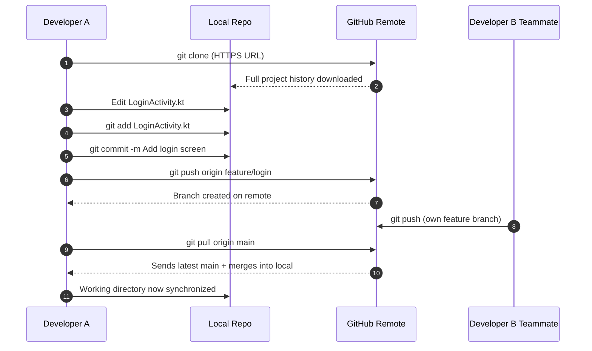
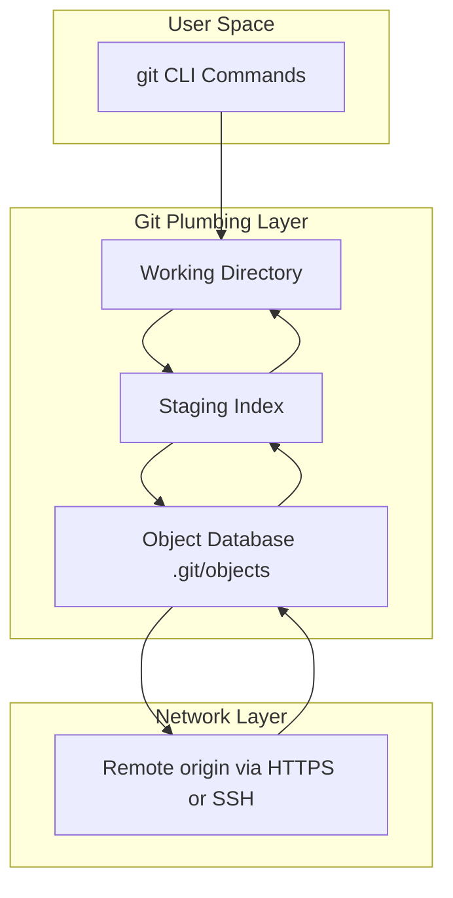

# ( Use Git: cloning, committing, pushing, and pulling )

<!-- SECTION_1_START -->
# Use Git: Cloning, Committing, Pushing, and Pulling

## 1. Core Technical Definition & Intuitive Overview

> [!IMPORTANT]
> **Formal KTU 2024 Definition (Syllabus Aligned):**
> **Git** is a *distributed version control system (DVCS)* used to track changes in source code during software development. It enables multiple developers to work collaboratively on a project by maintaining a complete history of file modifications, supporting branching, merging, and remote synchronization operations such as **cloning, committing, pushing, and pulling**.

### Conceptual Analogy / Intuition

Think of Git as a **time-machine document editor for your entire project**.

- Imagine you and your teammates are co-writing a massive group report (your app's source code).
- Every time you reach a checkpoint you are happy with, you click a **"Save Snapshot"** button — that snapshot is a **commit**.
- The report lives on a shared cloud folder (like Google Drive) called a **remote repository** (e.g., GitHub).
- When you first want a copy of the report on your laptop, you **clone** it.
- When you finish editing your local copy, you **push** your changes back to the cloud so others can see them.
- When your teammate made changes, you **pull** their updates to your local machine to stay in sync.

> [!NOTE]
> **Core Syllabus Highlight:** In KTU's Mobile Application Development module, Git is treated as the *industry-standard collaboration backbone* for Android (Kotlin/Java) and cross-platform (Flutter/React Native) projects. Mastering these four commands is a **mandatory practical skill** assessed in lab records and university exams.

### Key Terminology (Bold = High-Yield for KTU Exams)

| Term | Meaning |
|---|---|
| **Repository (Repo)** | A folder tracked by Git containing your project history |
| **Working Directory** | The local folder where you are currently editing files |
| **Staging Area (Index)** | A buffer zone where changes are marked for the next commit |
| **Commit** | A recorded snapshot of staged changes with a unique SHA hash |
| **Remote** | A version of your repository hosted on a server (e.g., GitHub) |
| **Origin** | The default alias name Git gives to the remote URL you cloned from |
| **Branch** | An independent line of development |
| **HEAD** | A pointer to the latest commit on the currently checked-out branch |

> [!VISUALIZATION CONTROL]
> **Concept:** Git's Three-Tree Architecture (Working Directory → Staging Area → Local Repo → Remote Repo)
> **Visual Description:** Picture four boxes in sequence on a horizontal timeline. *Box 1 (leftmost)* = your local files being edited. *Box 2* = a small buffer where you place files with `git add`. *Box 3* = the local `.git` database storing all commits. *Box 4 (rightmost)* = the cloud server (GitHub/GitLab). Arrows flow from 1→2 (`add`), 2→3 (`commit`), 3→4 (`push`), and 4→3 (`pull`/`fetch`).
<!-- SECTION_1_END -->

<!-- SECTION_2_START -->
# 2. Deep Theoretical Analysis & KTU High-Yield Formula Sheet

## 2.1 The Four Core Operations — Logical Breakdown

### Operation 1: `git clone`
**Why it exists:** You need a *complete local copy* of a remote repository to begin contributing.
**How it works:**
1. Git contacts the remote server using HTTPS or SSH protocol.
2. It downloads **every commit, every branch, and every file** in the project's full history.
3. It automatically creates a remote-tracking alias called **`origin`** pointing back to the source URL.
4. It checks out the repository's default working branch (usually `main` or `master`).

> [!NOTE]
> Unlike SVN or older systems, `git clone` is a *one-time full download*. After cloning, you operate entirely offline using local snapshots.

### Operation 2: `git commit`
**Why it exists:** To record a *logical, atomic unit of change* in your project's history.
**How it works:**
1. Changes are first **staged** using `git add <file>` (moves file from Working Directory → Staging Area).
2. `git commit` then snapshots the staged content into the local `.git` database.
3. Each commit receives a unique **40-character SHA-1 hash** (e.g., `a1b2c3d4...`).
4. Every commit requires an author-attributed **message** describing *what* and *why* the change was made.

> [!IMPORTANT]
> **The Golden Rule of Commits:** A commit should represent *one logical change* (e.g., "Fix login button bug" or "Add user profile screen"). Never bundle unrelated changes into a single commit.

### Operation 3: `git push`
**Why it exists:** To *publish* your local commits to a remote repository so teammates and CI/CD pipelines can access them.
**How it works:**
1. Git negotiates with the remote server.
2. It uploads any local commits that the remote does not yet have.
3. It updates the **remote-tracking branches** (e.g., `origin/main`) to reflect new state.
4. If the remote has commits you do not have, the push is **rejected** — you must `pull` first.

### Operation 4: `git pull`
**Why it exists:** To *fetch* and *integrate* the latest changes from the remote into your local working copy.
**How it works:**
1. `git pull` = `git fetch` + `git merge` (by default).
2. `git fetch` downloads new remote commits without modifying your working files.
3. `git merge` then integrates those fetched commits into your current local branch.
4. If conflicts occur (same line edited differently in two places), Git pauses and requires **manual conflict resolution**.

## 2.2 KTU High-Yield Formula Sheet / Cheat Sheet

| Command | Syntax | Purpose | Typical Use Case |
|---|---|---|---|
| `git clone` | `git clone <url> [folder]` | Copy a remote repo locally | First-time setup of a project |
| `git add` | `git add <file>` or `git add .` | Stage changes for commit | Before every commit |
| `git commit` | `git commit -m "message"` | Snapshot staged changes to local history | Save a logical unit of work |
| `git push` | `git push <remote> <branch>` | Upload local commits to remote | Share work with team |
| `git pull` | `git pull <remote> <branch>` | Fetch + merge remote changes into local branch | Sync with teammates' updates |
| `git status` | `git status` | Show working tree state | Check what is staged/unstaged |
| `git log` | `git log --oneline` | Display commit history | Review past changes |
| `git remote -v` | `git remote -v` | List configured remote URLs | Verify the `origin` URL |

> [!TIP]
> **Engineering Real-World Utility:** Every modern mobile app team — from a 2-person startup building a Flutter app to a 200-engineer Android team at Google — uses Git for source control, code reviews via **Pull Requests (PRs)**, and **CI/CD pipelines** (GitHub Actions, GitLab CI) that automatically build APK/IPA files on every push.

## 2.3 Authentication Protocols (Conceptual)

| Protocol | Format | When Used |
|---|---|---|
| **HTTPS** | `https://github.com/user/repo.git` | Most common, uses Personal Access Tokens (PAT) |
| **SSH** | `git@github.com:user/repo.git` | Preferred by advanced users, uses key pairs |

> [!WARNING]
> **KTU Pitfall:** Many students confuse `git pull` with `git fetch`. Remember: **`fetch` only downloads; `pull` downloads AND merges.** This distinction is a frequent 3-mark question.
<!-- SECTION_2_END -->

<!-- SECTION_3_START -->
# 3. Step-by-Step Derivations & Code/Symbolic Implementation

## 3.1 Complete End-to-End Workflow with Explicit Steps

The following represents a *full first-day developer journey* — from cloning a Kotlin Android sample project to contributing changes back to the team.

### Step A: Cloning a Repository

```bash
# 1. Navigate to the folder where you want the project
cd ~/Documents/KTU_Projects

# 2. Clone the remote repository
git clone https://github.com/KTU-MobileDev/HelloWorldApp.git

# 3. Enter the new project directory
cd HelloWorldApp

# 4. Verify the remote alias is set correctly
git remote -v
# Expected output:
# origin  https://github.com/KTU-MobileDev/HelloWorldApp.git (fetch)
# origin  https://github.com/KTU-MobileDev/HelloWorldApp.git (push)

# 5. View commit history to confirm successful clone
git log --oneline
# Expected output (example):
# a1b2c3d Initial commit - MainActivity scaffold
# d4e5f6g Add Gradle build files
```

**Explanation of every transition:**
- `cd ~/Documents/KTU_Projects` → changes shell's working directory.
- `git clone <url>` → contacts the remote server, downloads all objects (commits, trees, blobs), sets up the `origin` remote, and checks out the default branch.
- `git remote -v` → displays the configured fetch and push URLs. The word `origin` is the *default alias*; you can rename it but KTU exams expect you to know the default.
- `git log --oneline` → renders the commit graph in compact form.

### Step B: Making a Change, Staging, and Committing

```bash
# 1. Verify you are on the correct branch
git branch
# Output: * main   (asterisk marks the active branch)

# 2. Create a new feature branch for your change
git checkout -b feature/add-login-screen

# 3. Edit a file (simulated — assume you added LoginActivity.kt)
# (The IDE or editor modifies the working directory)

# 4. Check what has changed
git status
# Output:
# On branch feature/add-login-screen
# Changes not staged for commit:
#   modified:   app/src/main/java/com/ktu/LoginActivity.kt

# 5. Stage the change (Working Dir -> Staging Area)
git add app/src/main/java/com/ktu/LoginActivity.kt

# 6. (Optional) Stage ALL modified files
git add .

# 7. Commit the staged change (Staging Area -> Local Repo)
git commit -m "Add LoginActivity with email/password fields"

# 8. Verify the commit was created
git log --oneline
# Output:
# h7i8j9k Add LoginActivity with email/password fields   <-- NEW
# a1b2c3d Initial commit - MainActivity scaffold
```

**Explanation of every transition:**
- `git checkout -b <name>` → creates a new branch AND switches to it. The `-b` flag is short for `--branch`.
- `git status` → reads the working tree and index, compares them to HEAD, and reports three states: *untracked, modified, staged*.
- `git add <file>` → moves file content into the index/staging area. This is a *preparation* step, not a save.
- `git commit -m "..."` → creates a permanent snapshot in `.git/objects/`, with the message stored as metadata.
- A **good commit message** uses the *imperative mood* (e.g., "Add", "Fix", "Refactor") and explains the *why*, not just the *what*.

### Step C: Pushing to the Remote

```bash
# 1. Push your new branch to the remote repository
git push -u origin feature/add-login-screen

# Output (first time):
# Enumerating objects: 7, done.
# Counting objects: 100% (7/7), done.
# Writing objects: 100% (5/5), 612 bytes | 612.00 KiB/s
# remote: Resolving deltas: 100% (2/2), completed with 2 local objects.
# To https://github.com/KTU-MobileDev/HelloWorldApp.git
#  * [new branch]      feature/add-login-screen -> feature/add-login-screen
# Branch 'feature/add-login-screen' set up to track remote 'origin/feature/add-login-screen'.

# 2. (For subsequent pushes on the same branch)
git push
```

**Explanation of every transition:**
- `-u` flag = `--set-upstream`. This tells Git: *future `git push`/`git pull` commands on this branch should use `origin` and this branch name by default.*
- After the first `-u` push, plain `git push` is sufficient.
- On a real team, you would then open a **Pull Request** on GitHub to request code review before merging into `main`.

### Step D: Pulling Updates from the Remote

```bash
# 1. Switch to the main branch (simulating teammate merged their PR)
git checkout main

# 2. Pull the latest changes from the remote main branch
git pull origin main

# Output:
# remote: Enumerating objects: 12, done.
# remote: Counting objects: 100% (12/12), done.
# remote: Total 12 (delta 5), reused 8 (delta 3)
# Unpacking objects: 100% (12/12), done.
# From https://github.com/KTU-MobileDev/HelloWorldApp.git
#  * branch            main       -> FETCH_HEAD
#    a1b2c3d..x9y8z7w  main       -> origin/main
# Updating a1b2c3d..x9y8z7w
# Fast-forward
#  app/src/main/res/layout/activity_main.xml | 15 ++++++++-------
#  1 file changed, 8 insertions(+), 7 deletions(-)
```

**Explanation of every transition:**
- `git pull` = `git fetch` + `git merge --ff-only` (fast-forward if possible).
- **Fast-forward merge** = the local branch pointer is simply moved forward to match `origin/main`, because no diverging local commits exist.
- If you had local commits on `main`, a **merge commit** would be created. If both sides modified the same lines, a **merge conflict** would occur, requiring manual editing.

### Step E: Conflict Resolution (When Pull Fails)

```bash
# Suppose git pull reports:
# CONFLICT (content): Merge conflict in app/build.gradle

# 1. Open the conflicting file in your editor; you'll see:
# <<<<<<< HEAD
#     implementation 'androidx.core:core-ktx:1.10.0'
# =======
#     implementation 'androidx.core:core-ktx:1.12.0'
# >>>>>>> origin/main

# 2. Edit the file to keep the correct version, then:
git add app/build.gradle

# 3. Complete the merge with a commit
git commit -m "Resolve merge conflict in build.gradle (chose 1.12.0)"
```

## 3.2 The Commit Lifecycle as a Symbolic Equation

Although Git is not a mathematical system, we can express the **state transitions** of a file as a clean state machine:

$$\text{Working Dir} \xrightarrow{\text{git add}} \text{Staging Area} \xrightarrow{\text{git commit}} \text{Local Repo} \xrightarrow{\text{git push}} \text{Remote Repo}$$

$$\text{Remote Repo} \xrightarrow{\text{git pull}} (\text{Local Repo} \cup \text{Working Dir})$$

> [!IMPORTANT]
> **KTU Exam Tip:** When asked to *describe the Git workflow*, draw or describe this four-state transition. It is worth 3-4 marks in Part A and is the foundation of any 14-mark question on version control.
<!-- SECTION_3_END -->

<!-- SECTION_4_START -->
# 4. Structural Diagrams & Schematics

## 4.1 Mermaid Flowchart: Complete Git Collaboration Cycle

```mermaid
flowchart LR
    R1[Remote Repo on GitHub]:::remote
    L1[git clone]:::action
    WD1[Local Working Directory]:::local
    SA1[Staging Area]:::stage
    LR1[Local Repository .git]:::localrepo
    L2[git add]:::action
    L3[git commit]:::action
    L4[git push]:::action
    L5[git pull]:::action
    R2[Updated Remote Repo]:::remote
    TEAM[Teammate Pushes Changes]:::team

    R1 --> L1
    L1 --> WD1
    WD1 --> L2
    L2 --> SA1
    SA1 --> L3
    L3 --> LR1
    LR1 --> L4
    L4 --> R2
    TEAM --> R1
    R2 --> L5
    L5 --> WD1

    classDef remote fill:#fef3c7,stroke:#d97706,stroke-width:2px,color:#000
    classDef action fill:#dbeafe,stroke:#1d4ed8,stroke-width:2px,color:#000
    classDef local fill:#dcfce7,stroke:#15803d,stroke-width:2px,color:#000
    classDef stage fill:#fce7f3,stroke:#be185d,stroke-width:2px,color:#000
    classDef localrepo fill:#e0e7ff,stroke:#4338ca,stroke-width:2px,color:#000
    classDef team fill:#fee2e2,stroke:#b91c1c,stroke-width:2px,color:#000
```



## 4.2 Mermaid Sequence Diagram: Developer + Teammate Interaction



## 4.3 Mermaid Block Diagram: Git Architecture Layers



## 4.4 Conceptual Command-Cycle Matrix

| Phase | Command | Source State | Destination State | Reversible? |
|---|---|---|---|---|
| Acquire | `git clone` | Empty / No local repo | Local repo with full history | N/A (idempotent on re-clone) |
| Stage | `git add` | Working Directory | Staging Index | Yes (`git restore --staged`) |
| Record | `git commit` | Staging Index | Local Object Database | No (creates permanent history) |
| Publish | `git push` | Local Object Database | Remote Object Database | Yes (`git push --force` with caution) |
| Sync | `git pull` | Remote Object Database | Local Working Directory | Partial (merge commits persist) |
<!-- SECTION_4_END -->

<!-- SECTION_5_START -->
# 5. KTU 2024 Scheme Examination Question Bank & Topic Recap

## Part A — Short Answer Questions (3 Marks Each)

### Q1. `[KTU University Exam - July 2024]`
**Differentiate between `git pull` and `git fetch`.** (CO1, **Remember**)

**Model Answer (Valuation Key):**
- `[Defining fetch: 1 Mark]` `git fetch` downloads new commits, files, and refs from a remote repository **into the local remote-tracking branches** (e.g., `origin/main`), but it **does NOT modify** your working directory or current local branch.
- `[Defining pull: 1 Mark]` `git pull` is essentially `git fetch` followed immediately by `git merge`. It both downloads the remote changes **and** integrates them into your current working branch in one step.
- `[When to use: 1 Mark]` Use `git fetch` when you want to *review* incoming changes before merging. Use `git pull` when you are confident you want an immediate, automatic merge of remote updates.

---

### Q2. `[KTU University Exam - Dec 2023]`
**What is the purpose of the `git clone` command and what alias is automatically created?** (CO1, **Remember**)

**Model Answer (Valuation Key):**
- `[Purpose: 2 Marks]` `git clone <repository-url>` creates a **full local copy** of a remote repository, including the entire commit history, all branches, and all tags. It is the standard first step for any new developer joining a project.
- `[Default alias: 1 Mark]` Git automatically creates a remote-tracking alias named **`origin`** that points back to the source URL — this is the conventional name used in subsequent `git push`/`git pull` commands.

---

## Part B — Long Answer Questions (14 Marks, Module Internal Choice)

### Question A: `[KTU University Exam - July 2024]` (14 Marks)

**Explain the four fundamental Git operations — clone, add, commit, and push — used in collaborative mobile application development. For each operation, state the syntax, its purpose, and the state transition it triggers in the Git architecture. (CO1, CO2 — Understand + Apply)**

#### (a) Clone and Commit — 7 Marks (Understand)

**Model Answer (Valuation Key):**
- `[Stating clone syntax: 1 Mark]` `git clone https://github.com/user/repo.git`
- `[Explaining clone purpose: 2 Marks]` Cloning creates a complete local mirror of the remote repository, including all commits, branches, and the `.git` metadata folder. It also sets up the `origin` alias.
- `[Stating commit workflow: 1 Mark]` A commit requires two steps: first stage with `git add <file>`, then record with `git commit -m "message"`.
- `[Explaining commit state transition: 2 Marks]` `git add` moves files from the *Working Directory* to the *Staging Area (Index)*. `git commit` then snapshots the staged content into the *Local Object Database* (`.git/objects`), producing a unique SHA-1 hash. Each commit is a permanent, immutable record.

#### (b) Push and Pull — 7 Marks (Apply)

**Model Answer (Valuation Key):**
- `[Stating push syntax: 1 Mark]` `git push origin main` (or `git push` if upstream is configured with `-u`).
- `[Explaining push purpose: 2 Marks]` Push uploads local commits to the remote repository so teammates, CI systems, and deployment pipelines can access the new code. If the remote has commits you lack, push is rejected — this is a **safety mechanism** preventing accidental history loss.
- `[Stating pull syntax: 1 Mark]` `git pull origin main`
- `[Explaining pull mechanism: 2 Marks]` Pull performs `git fetch` (downloads remote refs) followed by `git merge` (integrates them into the local working branch). In a fast-forward scenario, the local branch pointer simply advances. In divergent scenarios, a merge commit is created, and conflicts must be resolved manually.
- `[Real-world application: 1 Mark]` In a 3-member Android team, Developer A clones the repo, builds the login screen, commits, and pushes to a feature branch. After code review approval, the change is merged to `main`. Developers B and C then `pull` to receive the new login screen on their machines.

---

### Question B: `[KTU University Exam - Dec 2023]` (14 Marks)

**Describe a complete Git workflow for a mobile application development team of three developers. Include commands, the role of branches, and how the push and pull operations prevent data loss and ensure synchronization.** (CO1, CO2, CO3 — Understand + Apply + Analyze)

#### (a) Team Setup and Branching Strategy — 7 Marks (Understand + Apply)

**Model Answer (Valuation Key):**
- `[Initial setup: 2 Marks]` The team lead creates a central repository on GitHub. Each of the three developers executes `git clone <url>` to obtain a local working copy. This establishes the `origin` remote alias on every machine.
- `[Branching model: 2 Marks]` The team adopts a **feature-branch workflow**: the `main` branch is protected (always deployable), and every new feature is developed on an isolated branch such as `feature/payment-screen` or `bugfix/login-crash`.
- `[Branch creation commands: 1 Mark]` `git checkout -b feature/payment-screen` creates and switches to a new branch in one step.
- `[Isolation benefits: 2 Marks]` Branching prevents developers' in-progress work from interfering with one another. The `main` branch remains stable; merges happen only after code review via Pull Requests.

#### (b) Push, Pull, and Conflict Resolution — 7 Marks (Apply + Analyze)

**Model Answer (Valuation Key):**
- `[Daily push routine: 1 Mark]` Each developer runs `git add .` → `git commit -m "descriptive message"` → `git push origin feature/<branch-name>` at logical checkpoints.
- `[Daily pull routine: 1 Mark]` At the start of each day, every developer runs `git checkout main` followed by `git pull origin main` to receive the latest approved changes.
- `[Merge conflict analysis: 2 Marks]` If two developers edited the same line in `activity_main.xml`, Git halts the merge and marks the file with conflict markers (`<<<<<<<`, `=======`, `>>>>>>>`). The team must manually edit, choose the correct version, then `git add` and `git commit` to finalize.
- `[Data-loss prevention analysis: 2 Marks]` Git prevents accidental overwrites in two ways: (1) the push is **rejected** if the remote has commits the local repo lacks, forcing a pull first; (2) every commit is content-addressable by SHA hash, so even `git push --force` can typically be recovered using `git reflog`.
- `[Industry relevance: 1 Mark]` This workflow mirrors the **GitHub Flow** used in production mobile teams — branches for features, Pull Requests for review, fast-forward merges into `main`, and CI/CD pipelines that build APKs on every push.

---

> [!WARNING]
> **KTU Examiner's Valuation Warning / Pitfall Callout:**
> 1. **Do not confuse `git pull` with `git clone`.** `clone` is a *one-time download of the entire repo*; `pull` is a *routine sync of new commits*. Writing one where the other is expected will cost you 2-3 marks.
> 2. **Always mention the `origin` alias** in any answer about `git push`/`git pull`. Examiners specifically look for this term.
> 3. **Never skip explaining state transitions.** A 14-mark answer that lists commands without stating *which Git state (Working Dir, Staging, Local Repo, Remote) is affected* loses 3-4 marks.
> 4. **For merge conflict questions, you MUST show the conflict markers** (`<<<<<<<`, `=======`, `>>>>>>>`) and the resolution steps (`git add` + `git commit`). Skipping the conflict marker representation is a common 2-mark deduction.
> 5. **Distinguish `add` from `commit`.** Many students treat them as the same operation. `add` is *staging*; `commit` is *recording*. This distinction is frequently tested.

---

## Topic Recap & Important Things to Remember

- ✅ **Git is a Distributed Version Control System (DVCS)** — every clone contains the full history.
- ✅ **Four mandatory commands for KTU:**
  - `git clone <url>` → one-time full local copy + creates `origin` alias.
  - `git add <file>` → moves file from *Working Directory* to *Staging Area*.
  - `git commit -m "msg"` → moves staged content to *Local Object Database* with a SHA hash.
  - `git push <remote> <branch>` → publishes local commits to remote.
  - `git pull <remote> <branch>` → `fetch` + `merge` to sync with remote.
- ✅ **State Machine to Memorize:** Working Dir → Staging Area → Local Repo → Remote Repo.
- ✅ **`origin` is the default alias** for the URL you cloned from; it is conventional, not magical.
- ✅ **`git pull` ≠ `git fetch`.** Pull = fetch + merge. Fetch only downloads.
- ✅ **Push is rejected** if remote has commits you lack → safety against history loss.
- ✅ **Merge conflicts** occur when the same lines are modified in diverging branches; resolution requires manual edit + `git add` + `git commit`.
- ✅ **Branches** isolate in-progress work; the `main` branch is the integration branch.
- ✅ **Authentication:** HTTPS uses Personal Access Tokens (PAT); SSH uses key pairs.
- ✅ **Industry use case:** Every professional mobile app team (Android, iOS, Flutter, React Native) uses this exact four-command workflow with GitHub/GitLab + Pull Requests + CI/CD.
<!-- SECTION_5_END -->
