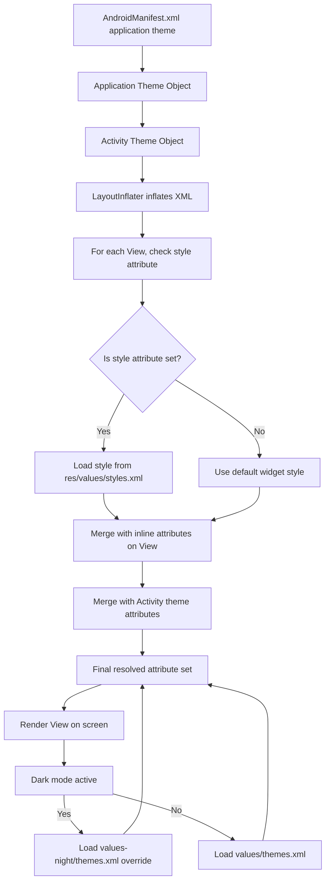
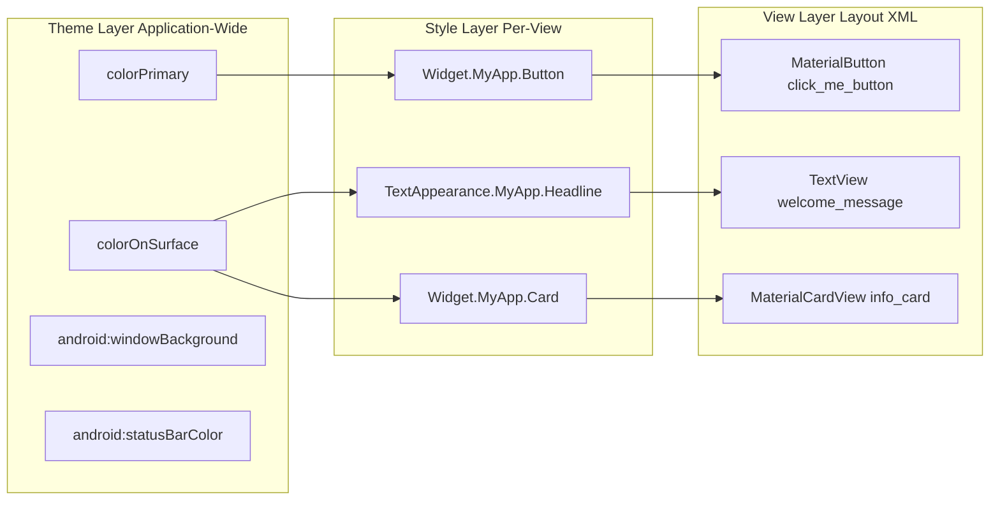
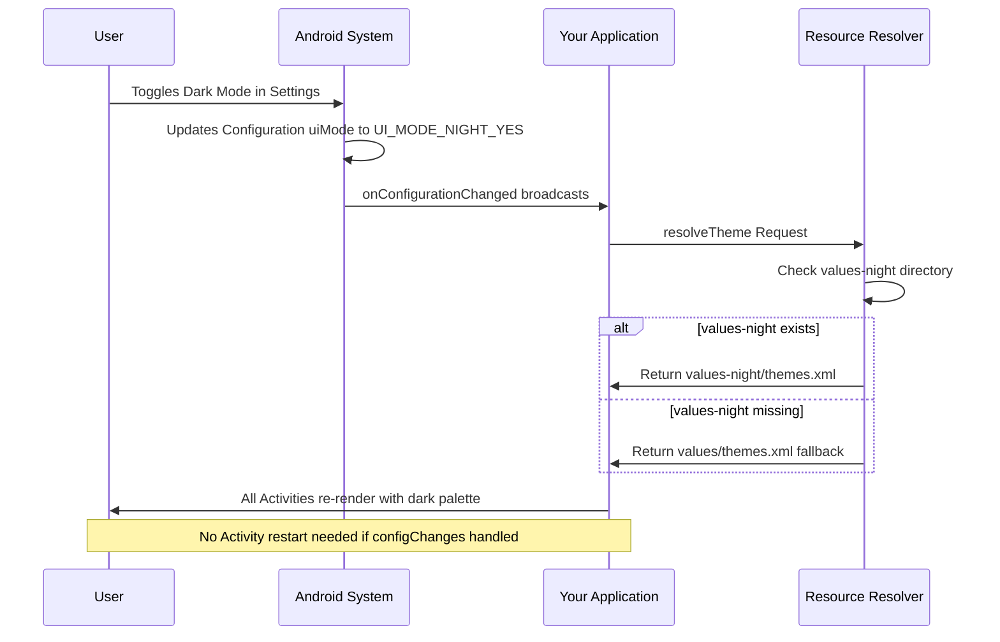
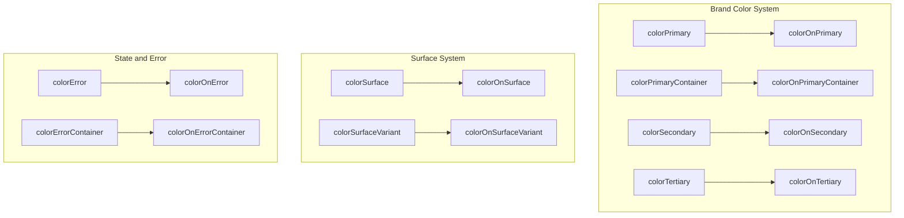

# Customizing UI with Themes and Styles

<!-- SECTION_1_START -->
# 1. Core Technical Definition & Intuitive Overview

## Formal KTU 2024 Definition

In Android application development, a **Theme** is a collection of attributes applied to an entire application, Activity, or view hierarchy to define a consistent visual appearance. A **Style** is a collection of attributes that specify the look and format for a single `View` or a group of views. Together, Themes and Styles are the foundational pillars of Android's **Material Design** system, enabling developers to enforce visual consistency, support dynamic color, and implement light/dark variants declaratively in XML resources (`res/values/themes.xml`, `res/values/styles.xml`).

In the **KTU 2024 Scheme (PECST695 - Module 2: User Interface Design and User Experience)**, this topic maps directly to the design phase of the Android application lifecycle, where UI consistency, accessibility, and Material Design guidelines are evaluated.

> [!IMPORTANT]
> **Key Distinction (Board Exam Favorite):**
> - **Style** → Applied to **Views** (e.g., `TextView`, `Button`). It is referenced via the `style="@style/MyStyle"` attribute on a single widget.
> - **Theme** → Applied **application-wide** or to an entire **Activity**. It is referenced in `AndroidManifest.xml` via `android:theme="@style/Theme.MyApp"`.
> - A Theme is essentially a special Style applied at the Activity/Application level, where attributes like `colorPrimary`, `colorOnPrimary`, `android:windowBackground` are valid.

## Conceptual Analogy / Intuition

Imagine you are furnishing a **hotel chain**:
- A **Style** is the *interior decoration of a single room* — the bedspread pattern, the curtain color, the lamp shade. It is localized to one place.
- A **Theme** is the *corporate branding guideline of the entire hotel chain* — the lobby paint, the staff uniform, the logo, the ambient lighting. It cascades through every room.

In Android:
- When you set a Theme on the `<application>` tag, every Activity and every View inside it **inherits** those visual defaults automatically.
- When you set a Style on a `Button`, only that button adopts those visual properties.

> [!NOTE]
> **KTU Syllabus Highlight (Material Design 3):**
> The 2024 scheme specifically emphasizes **Material Design 3 (Material You)**, which introduced **Dynamic Color** — colors derived from the user's wallpaper (API 31+, Android 12+). Students must understand tokens like `colorPrimary`, `colorSecondary`, `colorTertiary`, and their corresponding `*Container` and `*On*` variants.

> [!VISUALIZATION CONTROL]
> **Concept:** Theme Attribute Cascade
> **GeoGebra / Desmos Input Equations:**
> * `Application(theme = Theme.MyApp)` at top
> * `Activity_A(theme inherits)` as child
> * `TextView(style = BodyText)` as leaf
> **Visual Description:** Draw a parent-child tree. At the root, define `colorPrimary = #6750A4`. Show arrows flowing downward to all children, indicating that if a child View does not explicitly override `colorPrimary`, it inherits the value from its parent Activity, which inherits from the Application theme.

---

## Types of Attributes Modifiable via Themes

A Theme can override virtually any styleable attribute on any View. The most commonly used attribute categories are:

1. **Color attributes** — `colorPrimary`, `colorOnPrimary`, `colorSurface`, `colorBackground`, `android:colorBackground`
2. **Typography** — `textAppearanceHeadlineLarge`, `textAppearanceBodyMedium`, `fontFamily`
3. **Shape attributes** — `shapeAppearanceSmallComponent`, `shapeAppearanceCornerLarge`
4. **Window-level** — `android:windowBackground`, `android:statusBarColor`, `android:navigationBarColor`
5. **State List** — `colorControlNormal`, `colorControlActivated`, `colorControlHighlight`
6. **Elevation / Surface tinting** — `elevationOverlayEnabled`, `elevationOverlayColor`

> [!TIP]
> **Standard Material 3 Color Tokens (Memorize These):**
> - `colorPrimary` — The brand's primary color (e.g., Purple 40 in default M3).
> - `colorOnPrimary` — Color of text/icons drawn *on* `colorPrimary` (usually white or near-white).
> - `colorPrimaryContainer` — A tonal variant of primary used for less prominent containers.
> - `colorOnPrimaryContainer` — Foreground color drawn *on* `colorPrimaryContainer`.
> - This **Primary / OnPrimary / PrimaryContainer / OnPrimaryContainer** pattern repeats for `Secondary` and `Tertiary`.
<!-- SECTION_1_END -->

<!-- SECTION_2_START -->
# 2. Deep Theoretical Analysis & KTU High-Yield Formula Sheet

## 2.1 Operational Mechanics of Theme Inheritance

Android follows a **cascading resolution mechanism** for every styleable attribute at runtime. The hierarchy (highest priority first) is:

1. **Inline attribute on the View** (e.g., `android:textColor="#FF0000"` set directly on a `TextView`).
2. **Style referenced via `style="@style/..."`** on the View.
3. **Default Style** declared on the View class (e.g., `Button`'s default style is `Widget.Material3.Button`).
4. **Activity-level Theme** (set in `AndroidManifest.xml` or programmatically).
5. **Application-level Theme** (set in `<application android:theme="...">`).
6. **Platform default** (the framework's hardcoded fallback).

> [!NOTE]
> **Why is this important for KTU exams?** Because students are often asked: *"If I set `android:textColor` on a Button and also in the theme, which wins?"* The answer is the **inline attribute wins**, because it is closest to the View in the resolution chain.

## 2.2 Light vs Dark Theme Mechanics

Android supports two parallel resource directories:
- `res/values/themes.xml` → Default (Light) theme.
- `res/values-night/themes.xml` → Override applied when the device is in **Dark Mode** (API 29+ recommended, full support from API 31).

The system automatically picks the correct file at runtime based on the system's `Configuration.uiMode` value (`UI_MODE_NIGHT_YES` or `UI_MODE_NIGHT_NO`).

## 2.3 Theme Inheritance via `parent`

Every custom theme **must** declare a `parent` attribute. This is mandatory, not optional, because Material 3 themes inherit hundreds of attribute defaults.

```xml
<style name="Theme.MyApp" parent="Theme.Material3.DayNight">
    <!-- Override only the attributes you want to change -->
    <item name="colorPrimary">@color/purple_500</item>
</style>
```

## 2.4 Shape and Typography System

Material 3 enforces a **shape scale** (`extraSmall`, `small`, `medium`, `large`, `extraLarge`) and a **type scale** (Display, Headline, Title, Body, Label — each with Large/Medium/Small sizes). Themes can override these to enforce a consistent design language.

## KTU Formula Sheet / Cheat Sheet

| Concept | XML Attribute / Token | Purpose | Default Material 3 Value (approx) |
|---|---|---|---|
| Brand primary | `colorPrimary` | Buttons, FABs, active states | `#6750A4` (M3 Baseline Purple) |
| On-primary contrast | `colorOnPrimary` | Text/icons on `colorPrimary` | `#FFFFFF` |
| Surface | `colorSurface` | Background of cards, sheets, menus | `#FFFBFE` (Light) / `#1C1B1F` (Dark) |
| On-surface | `colorOnSurface` | Text/icons on `colorSurface` | `#1C1B1F` / `#E6E1E5` |
| Error | `colorError` | Destructive actions, validation | `#B3261E` / `#F2B8B5` |
| Window background | `android:windowBackground` | Activity root background | `@color/colorSurface` |
| Status bar | `android:statusBarColor` | Top system bar tint | `@color/colorPrimary` |
| Corner shape | `shapeAppearanceCornerLarge` | Rounded corners for large components | `28dp` |
| Body text | `textAppearanceBodyMedium` | Default body text | 14sp, Regular |
| Theme parent | `parent="Theme.Material3.DayNight.NoActionBar"` | Inherits M3 + auto day/night | — |
| Dynamic color | `Theme.Material3.DynamicColors.*` (API 31+) | Wallpaper-derived palette | Wallpaper-driven |

> [!WARNING]
> **Common Board Mistake:** Writing `parent="android:Theme.Material"` instead of `parent="Theme.Material3.DayNight"`. The first is the **platform** Material theme (API 21+). The second is the **AndroidX support library** Material 3 theme, which is what modern apps use. Always prefer the AndroidX one.

## 2.5 Real-World Engineering Utility

- **Theming** is what enables apps like **Google Gmail, WhatsApp, Spotify** to provide a unified visual identity across hundreds of screens without per-screen hardcoding.
- It supports **white-labeling** — a single codebase can be reskinned for multiple clients by swapping one theme file.
- It enables **accessibility** — proper `colorOnPrimary` choices ensure WCAG contrast compliance automatically.
- **Dynamic theming** in Android 12+ provides a personalized UX without developer effort.
<!-- SECTION_2_END -->

<!-- SECTION_3_START -->
# 3. Step-by-Step Derivations & Code/Symbolic Implementation

## 3.1 Creating a Custom Color Palette (colors.xml)

Before defining a theme, we define a color palette. This separation enables easier theming and dark-mode overrides.

```xml
<!-- res/values/colors.xml -->
<?xml version="1.0" encoding="utf-8"?>
<resources>
    <color name="md_theme_light_primary">#0061A4</color>
    <color name="md_theme_light_onPrimary">#FFFFFF</color>
    <color name="md_theme_light_primaryContainer">#D1E4FF</color>
    <color name="md_theme_light_onPrimaryContainer">#001D36</color>
    <color name="md_theme_light_secondary">#535F70</color>
    <color name="md_theme_light_onSecondary">#FFFFFF</color>
    <color name="md_theme_light_surface">#FDFCFF</color>
    <color name="md_theme_light_onSurface">#1A1C1E</color>
    <color name="md_theme_light_error">#BA1A1A</color>
    <color name="md_theme_light_onError">#FFFFFF</color>
    <color name="md_theme_light_background">#FDFCFF</color>
    <color name="md_theme_light_onBackground">#1A1C1E</color>
</resources>
```

> **Explanation:** Each color name is prefixed with `md_theme_light_` to make it self-documenting. The `on*` colors are chosen to satisfy a **contrast ratio of at least 4.5:1** against their parent color, which is the WCAG AA standard.

## 3.2 Defining the Light Theme (themes.xml)

```xml
<!-- res/values/themes.xml -->
<resources xmlns:tools="http://schemas.android.com/tools">
    <style name="Theme.MyApp" parent="Theme.Material3.DayNight.NoActionBar">
        <!-- Primary -->
        <item name="colorPrimary">@color/md_theme_light_primary</item>
        <item name="colorOnPrimary">@color/md_theme_light_onPrimary</item>
        <item name="colorPrimaryContainer">@color/md_theme_light_primaryContainer</item>
        <item name="colorOnPrimaryContainer">@color/md_theme_light_onPrimaryContainer</item>
        <!-- Secondary -->
        <item name="colorSecondary">@color/md_theme_light_secondary</item>
        <item name="colorOnSecondary">@color/md_theme_light_onSecondary</item>
        <!-- Surface and Background -->
        <item name="colorSurface">@color/md_theme_light_surface</item>
        <item name="colorOnSurface">@color/md_theme_light_onSurface</item>
        <item name="android:colorBackground">@color/md_theme_light_background</item>
        <item name="colorOnBackground">@color/md_theme_light_onBackground</item>
        <!-- Error -->
        <item name="colorError">@color/md_theme_light_error</item>
        <item name="colorOnError">@color/md_theme_light_onError</item>
        <!-- Status bar -->
        <item name="android:statusBarColor">?attr/colorPrimary</item>
        <item name="android:windowLightStatusBar">true</item>
    </style>
</resources>
```

> **Explanation (line by line):**
> - `parent="Theme.Material3.DayNight.NoActionBar"` — Inherits all M3 defaults and automatically swaps to a dark version when the device is in night mode. `NoActionBar` removes the default ActionBar so we can use a `Toolbar` later.
> - `?attr/colorPrimary` — The `?attr/` syntax references a **theme attribute** at runtime, not a static color resource. This is critical: it means if the theme changes, the status bar follows automatically.
> - `android:windowLightStatusBar="true"` — Sets dark icons on the status bar (used when the status bar is light-colored).

## 3.3 Defining the Dark Theme (values-night/themes.xml)

```xml
<!-- res/values-night/themes.xml -->
<resources xmlns:tools="http://schemas.android.com/tools">
    <style name="Theme.MyApp" parent="Theme.Material3.DayNight.NoActionBar">
        <item name="colorPrimary">#9ECAFF</item>
        <item name="colorOnPrimary">#003258</item>
        <item name="colorPrimaryContainer">#00497D</item>
        <item name="colorOnPrimaryContainer">#D1E4FF</item>
        <item name="colorSecondary">#BBC7DB</item>
        <item name="colorOnSecondary">#253140</item>
        <item name="colorSurface">#1A1C1E</item>
        <item name="colorOnSurface">#E2E2E6</item>
        <item name="android:colorBackground">#1A1C1E</item>
        <item name="colorError">#FFB4AB</item>
        <item name="colorOnError">#690005</item>
        <item name="android:statusBarColor">?attr/colorSurface</item>
        <item name="android:windowLightStatusBar">false</item>
    </style>
</resources>
```

> **Explanation:** Notice we use the **same style name** `Theme.MyApp`. The Android resource system automatically picks `values-night/themes.xml` when the device is in dark mode. The `colorPrimary` shifts to a **lighter shade** of the brand color because dark backgrounds require brighter foregrounds for legibility.

## 3.4 Defining a Custom Style (styles.xml)

```xml
<!-- res/values/styles.xml -->
<resources>

    <!-- Style for Headline Text -->
    <style name="TextAppearance.MyApp.Headline" parent="TextAppearance.Material3.HeadlineMedium">
        <item name="android:textColor">?attr/colorOnSurface</item>
        <item name="android:textSize">28sp</item>
        <item name="android:fontFamily">sans-serif-medium</item>
        <item name="android:letterSpacing">0</item>
    </style>

    <!-- Style for a Custom Rounded Button -->
    <style name="Widget.MyApp.Button" parent="Widget.Material3.Button">
        <item name="android:textColor">?attr/colorOnPrimary</item>
        <item name="backgroundTint">?attr/colorPrimary</item>
        <item name="cornerRadius">12dp</item>
        <item name="android:paddingStart">24dp</item>
        <item name="android:paddingEnd">24dp</item>
    </style>

    <!-- Style for a Card -->
    <style name="Widget.MyApp.Card" parent="Widget.Material3.CardView.Elevated">
        <item name="cardCornerRadius">16dp</item>
        <item name="cardElevation">2dp</item>
        <item name="cardBackgroundColor">?attr/colorSurface</item>
        <item name="contentPadding">16dp</item>
    </style>

</resources>
```

> **Explanation:**
> - `TextAppearance.MyApp.Headline` follows the **dot-naming convention**, which is the Android-recommended way to inherit styles without using the `parent` attribute. `TextAppearance.MyApp.Headline` is implicitly a child of `TextAppearance.MyApp`, which is a child of `TextAppearance`.
> - `Widget.MyApp.Button` extends the M3 default button, then overrides only what is needed.
> - Using `?attr/colorPrimary` (theme attribute) instead of `@color/purple_500` (static color) ensures the button automatically re-themes in dark mode.

## 3.5 Applying the Theme in AndroidManifest.xml

```xml
<application
    android:allowBackup="true"
    android:icon="@mipmap/ic_launcher"
    android:label="@string/app_name"
    android:theme="@style/Theme.MyApp"
    ...>
    <activity android:name=".MainActivity" />
</application>
```

> **Explanation:** The `android:theme="@style/Theme.MyApp"` line applies the theme to the entire application. Every Activity within this app will inherit the theme unless overridden per-Activity.

## 3.6 Using Styles in Layout XML

```xml
<!-- res/layout/activity_main.xml -->
<LinearLayout
    android:layout_width="match_parent"
    android:layout_height="match_parent"
    android:orientation="vertical"
    android:padding="16dp">

    <TextView
        android:layout_width="wrap_content"
        android:layout_height="wrap_content"
        android:text="@string/welcome"
        style="@style/TextAppearance.MyApp.Headline" />

    <com.google.android.material.button.MaterialButton
        android:layout_width="wrap_content"
        android:layout_height="wrap_content"
        android:text="@string/click_me"
        style="@style/Widget.MyApp.Button" />

    <com.google.android.material.card.MaterialCardView
        android:layout_width="match_parent"
        android:layout_height="wrap_content"
        style="@style/Widget.MyApp.Card">

        <TextView
            android:layout_width="match_parent"
            android:layout_height="wrap_content"
            android:text="@string/card_content"
            android:textColor="?attr/colorOnSurface" />
    </com.google.android.material.card.MaterialCardView>

</LinearLayout>
```

> **Explanation:** Each View references its style via the `style="@style/..."` attribute. The `?attr/colorOnSurface` reference inside the inner `TextView` ensures the text remains readable when the surface color changes in dark mode.

## 3.7 Dynamic Color (API 31+) — Optional but Trending

```xml
<!-- res/values-v31/themes.xml -->
<style name="Theme.MyApp" parent="Theme.Material3.DynamicColors.DayNight.NoActionBar">
    <!-- No need to define colorPrimary; system uses wallpaper -->
</style>
```

> **Explanation:** The `DynamicColors` parent theme instructs the system to derive `colorPrimary`, `colorSecondary`, and `colorTertiary` from the user's wallpaper. This is the hallmark of **Material You**. We keep the `values-night/` override for older devices (pre-API 31) and as a manual fallback.

## 3.8 Programmatically Reading Theme Attributes (Kotlin)

```kotlin
// In an Activity
val typedValue = TypedValue()
theme.resolveAttribute(com.google.android.material.R.attr.colorPrimary, typedValue, true)
val primaryColor = typedValue.data
val primaryHex = String.format("#%08X", primaryColor)
Log.d("ThemeDebug", "Primary color: $primaryHex")
```

> **Explanation:** `theme.resolveAttribute()` looks up an attribute in the **current Activity's theme** and returns its resolved value. This is how you read theme colors at runtime to apply them to custom-drawn views (e.g., in a `Canvas`).
<!-- SECTION_3_END -->

<!-- SECTION_4_START -->
# 4. Structural Diagrams & Schematics

## 4.1 Theme Attribute Resolution Flow



## 4.2 Style vs Theme — Functional Block Architecture



## 4.3 Light/Dark Theme Switching Sequence



## 4.4 Color Token Relationship Matrix



> **Interpretation:** Each "Container" color is a tonal, lower-saturation variant of its base. Each "On" color is the foreground designed to be readable on top of its corresponding background.
<!-- SECTION_4_END -->

<!-- SECTION_5_START -->
# 5. KTU 2024 Scheme Examination Question Bank & Topic Recap

## Part A Questions (3 Marks Each)

### Q1. **[KTU University Exam - July 2024]** Differentiate between a Style and a Theme in Android. (3 Marks) — *CO1, Remember*

**Model Answer:**
A **Style** in Android is a collection of attributes applied to a single `View` (e.g., `TextView`, `Button`) and is referenced using the `style="@style/MyStyle"` attribute within a layout XML. A **Theme**, in contrast, is a special type of style applied to an entire `Application` or `Activity` via the `android:theme` attribute in `AndroidManifest.xml`, affecting all child views in the hierarchy. While styles focus on per-view visual customization (font, padding, color), themes focus on app-wide attributes like `colorPrimary`, `colorOnSurface`, and `android:windowBackground`.

**[Valuation Key: Definition of Style — 1 Mark; Definition of Theme — 1 Mark; Clear distinction (application scope) — 1 Mark]**

---

### Q2. **[KTU University Exam - Dec 2023]** What is Material 3 Dynamic Color, and from which Android API level is it supported? (3 Marks) — *CO1, Understand*

**Model Answer:**
**Material 3 Dynamic Color** is a Material You design system feature where the application's color palette (specifically `colorPrimary`, `colorSecondary`, and `colorTertiary`) is automatically derived from the user's wallpaper, providing a personalized visual experience. It is supported from **Android 12 (API Level 31)** onwards. Developers enable it by setting the theme parent to `Theme.Material3.DynamicColors.DayNight` in `themes.xml`.

**[Valuation Key: Definition — 1 Mark; API Level 31 — 1 Mark; Theme parent reference — 1 Mark]**

---

## Part B Questions (14 Marks Each — Internal Choice)

### Question A **[KTU University Exam - Dec 2024]**

**(a)** Explain the concept of **Theme inheritance** in Android with a suitable XML example. Discuss the role of the `parent` attribute and the `?attr/` namespace prefix. **(7 Marks)** — *CO2, Understand*

**Model Answer:**

Theme inheritance in Android allows a new theme to inherit all the attribute values of a parent theme and override only the specific attributes the developer wants to customize. This is achieved using the `parent` attribute in the `<style>` element.

**XML Example:**

```xml
<resources>
    <style name="Theme.MyApp" parent="Theme.Material3.DayNight.NoActionBar">
        <item name="colorPrimary">@color/md_theme_light_primary</item>
        <item name="colorOnPrimary">@color/md_theme_light_onPrimary</item>
        <item name="android:statusBarColor">?attr/colorPrimary</item>
    </style>
</resources>
```

**Explanation:**
- The `parent="Theme.Material3.DayNight.NoActionBar"` attribute declares that `Theme.MyApp` inherits every default value from the Material 3 DayNight theme. We only need to specify the attributes we want to change.
- The `?attr/colorPrimary` prefix is a **theme attribute reference**. At runtime, the Android framework resolves `?attr/colorPrimary` by looking up the `colorPrimary` attribute in the **currently active theme**. This is dynamic — if the theme changes (e.g., dark mode is enabled), `?attr/colorPrimary` automatically points to the dark variant.
- Without the `?attr/` prefix, if we wrote `@color/purple_500`, the value would be **statically resolved** at compile time, and the color would not change with the theme.

**[Valuation Key: Definition of theme inheritance — 2 Marks; XML example — 2 Marks; Explanation of `parent` — 1.5 Marks; Explanation of `?attr/` prefix — 1.5 Marks]**

---

**(b)** Design a **complete custom theme** for an Android app named *CampusBuddy* using Material 3. The app should have a light and dark variant, with a green primary color (`#2E7D32`) and a yellow secondary color (`#FBC02D`). Show the `colors.xml`, `themes.xml`, and `values-night/themes.xml` files. **(7 Marks)** — *CO3, Apply*

**Model Answer:**

**Step 1: `res/values/colors.xml`**

```xml
<?xml version="1.0" encoding="utf-8"?>
<resources>
    <!-- Light Palette -->
    <color name="cb_light_primary">#2E7D32</color>
    <color name="cb_light_onPrimary">#FFFFFF</color>
    <color name="cb_light_primaryContainer">#B7F3B5</color>
    <color name="cb_light_onPrimaryContainer">#002106</color>
    <color name="cb_light_secondary">#FBC02D</color>
    <color name="cb_light_onSecondary">#3E2F00</color>
    <color name="cb_light_surface">#FCFDF6</color>
    <color name="cb_light_onSurface">#1A1C19</color>
    <color name="cb_light_background">#FCFDF6</color>
    <color name="cb_light_error">#BA1A1A</color>
    <color name="cb_light_onError">#FFFFFF</color>
</resources>
```

**Step 2: `res/values/themes.xml`**

```xml
<resources>
    <style name="Theme.CampusBuddy" parent="Theme.Material3.DayNight.NoActionBar">
        <item name="colorPrimary">@color/cb_light_primary</item>
        <item name="colorOnPrimary">@color/cb_light_onPrimary</item>
        <item name="colorPrimaryContainer">@color/cb_light_primaryContainer</item>
        <item name="colorOnPrimaryContainer">@color/cb_light_onPrimaryContainer</item>
        <item name="colorSecondary">@color/cb_light_secondary</item>
        <item name="colorOnSecondary">@color/cb_light_onSecondary</item>
        <item name="colorSurface">@color/cb_light_surface</item>
        <item name="colorOnSurface">@color/cb_light_onSurface</item>
        <item name="android:colorBackground">@color/cb_light_background</item>
        <item name="colorError">@color/cb_light_error</item>
        <item name="colorOnError">@color/cb_light_onError</item>
        <item name="android:statusBarColor">?attr/colorPrimary</item>
    </style>
</resources>
```

**Step 3: `res/values-night/themes.xml`**

```xml
<resources>
    <style name="Theme.CampusBuddy" parent="Theme.Material3.DayNight.NoActionBar">
        <item name="colorPrimary">#9CD49C</item>
        <item name="colorOnPrimary">#003910</item>
        <item name="colorPrimaryContainer">#00531B</item>
        <item name="colorOnPrimaryContainer">#B7F3B5</item>
        <item name="colorSecondary">#FFF2A8</item>
        <item name="colorOnSecondary">#5C4300</item>
        <item name="colorSurface">#1A1C19</item>
        <item name="colorOnSurface">#E2E3DD</item>
        <item name="android:colorBackground">#1A1C19</item>
        <item name="colorError">#FFB4AB</item>
        <item name="colorOnError">#690005</item>
        <item name="android:statusBarColor">?attr/colorSurface</item>
    </style>
</resources>
```

**Step 4: `AndroidManifest.xml` application tag**

```xml
<application
    android:label="@string/app_name"
    android:theme="@style/Theme.CampusBuddy"
    ...>
```

**[Valuation Key: `colors.xml` with full palette — 2 Marks; `themes.xml` with parent and all tokens — 2 Marks; `values-night/themes.xml` dark override — 2 Marks; Manifest application reference — 1 Mark]**

---

### Question B (Alternative) **[KTU University Exam - July 2024]**

**(a)** What are the **standard Material 3 color tokens**? List any six of them with their functional purpose. **(7 Marks)** — *CO1, Remember*

**Model Answer:**

Material 3 defines a comprehensive set of color tokens that map abstract roles to concrete color values. The six primary tokens are:

| # | Token | Purpose |
|---|---|---|
| 1 | `colorPrimary` | The primary brand color used for key components like the FAB, prominent buttons, and active states. |
| 2 | `colorOnPrimary` | A contrasting color used for text and icons drawn **on top of** `colorPrimary`. |
| 3 | `colorPrimaryContainer` | A less prominent, tonal variant of primary, used for less prominent containers (e.g., tonal buttons, chips). |
| 4 | `colorOnPrimaryContainer` | Foreground color for content drawn on `colorPrimaryContainer`. |
| 5 | `colorSurface` | The background color for surfaces like cards, sheets, and menus. |
| 6 | `colorOnSurface` | The foreground color for text and icons drawn on `colorSurface`. |

Additional tokens include `colorSecondary`, `colorTertiary`, `colorError`, and their `Container` and `On*` variants, plus `colorSurfaceVariant` for lower-emphasis surfaces.

**[Valuation Key: Listing six tokens — 3 Marks; Correct purpose mapping for each — 3 Marks; Mention of On/Container pattern — 1 Mark]**

---

**(b)** Write the complete **XML and Kotlin code** to programmatically apply a custom theme to a single `Button` view at runtime, without restarting the Activity. The button should switch between two predefined themes (`ThemeA` and `ThemeB`) on click. **(7 Marks)** — *CO3, Apply*

**Model Answer:**

**Step 1: `res/values/themes.xml` — Define Two Themes**

```xml
<resources>
    <style name="ThemeA" parent="Theme.Material3.DayNight.NoActionBar">
        <item name="colorPrimary">#1976D2</item>
        <item name="colorOnPrimary">#FFFFFF</item>
    </style>
    <style name="ThemeB" parent="Theme.Material3.DayNight.NoActionBar">
        <item name="colorPrimary">#D32F2F</item>
        <item name="colorOnPrimary">#FFFFFF</item>
    </style>
</resources>
```

**Step 2: `res/layout/activity_main.xml`**

```xml
<LinearLayout
    xmlns:android="http://schemas.android.com/apk/res/android"
    android:layout_width="match_parent"
    android:layout_height="match_parent"
    android:orientation="vertical"
    android:gravity="center"
    android:padding="16dp">

    <com.google.android.material.button.MaterialButton
        android:id="@+id/themeButton"
        android:layout_width="wrap_content"
        android:layout_height="wrap_content"
        android:text="Switch Theme" />

</LinearLayout>
```

**Step 3: `MainActivity.kt`**

```kotlin
package com.example.campusbuddy

import android.os.Bundle
import androidx.appcompat.app.AppCompatActivity
import com.google.android.material.button.MaterialButton

class MainActivity : AppCompatActivity() {

    private var isThemeA = true
    private lateinit var themeButton: MaterialButton

    override fun onCreate(savedInstanceState: Bundle?) {
        // Apply initial theme BEFORE setContentView
        setTheme(R.style.ThemeA)
        super.onCreate(savedInstanceState)
        setContentView(R.layout.activity_main)

        themeButton = findViewById(R.id.themeButton)

        themeButton.setOnClickListener {
            isThemeA = !isThemeA
            if (isThemeA) {
                setTheme(R.style.ThemeA)
            } else {
                setTheme(R.style.ThemeB)
            }
            // Recreate the Activity to apply the new theme
            recreate()
        }
    }
}
```

**Explanation:**
- `setTheme()` must be called **before** `super.onCreate()` to take effect for the initial layout inflation.
- At runtime, `recreate()` is required to re-inflate the layout with the new theme. The Activity is destroyed and recreated with the new theme attributes.
- All views that use `?attr/colorPrimary` will automatically update to the new theme's primary color.

**[Valuation Key: Defining two themes — 2 Marks; Layout XML with button — 1 Mark; Correct use of `setTheme()` before `super.onCreate()` — 2 Marks; `recreate()` call to apply changes — 1 Mark; Explanation — 1 Mark]**

---

> [!WARNING]
> **KTU Examiner's Valuation Warning / Pitfall Callout:**
> 1. **Never** write `parent="android:Theme.Material"` (platform theme) for modern apps. Use `parent="Theme.Material3.DayNight.NoActionBar"` (AndroidX) instead. This is a 1-mark penalty.
> 2. **Never** use a static color reference like `@color/purple_500` inside a theme item that should adapt to dark mode. Always use `?attr/colorPrimary` for theme attributes.
> 3. **Always** remember to apply the theme in `AndroidManifest.xml`'s `<application>` or `<activity>` tag, not just in `themes.xml`. The XML file alone is inert.
> 4. **Do not confuse** `style="@style/..."` (used on Views) with `android:theme="@style/..."` (used on Application/Activity).
> 5. **Forgetting** the `On*` counterpart colors (e.g., defining `colorPrimary` but not `colorOnPrimary`) results in text becoming invisible — a common runtime bug.
> 6. The `values-night/` directory must mirror the exact **same style names** as `values/`; the system does a name-based swap.

---

## Topic Recap & Important Things to Remember

- **Style** = per-View appearance; **Theme** = app/Activity-wide appearance. Both live in XML under `res/values/`.
- The `parent` attribute is **mandatory** for a custom theme — it defines inheritance.
- The `?attr/` prefix resolves a theme attribute **dynamically at runtime**; the `@color/` prefix resolves a static color at compile time.
- Material 3 color tokens follow a **Base + On + Container + OnContainer** quartet. Memorize `colorPrimary`, `colorOnPrimary`, `colorPrimaryContainer`, `colorOnPrimaryContainer`.
- **Dark mode** is supported via the `res/values-night/` directory. The system auto-swaps based on `Configuration.uiMode`.
- **Dynamic Color** (Material You) is enabled via `Theme.Material3.DynamicColors.*` parent and works only on **API 31+**.
- A theme can be applied at three levels: `<application>`, `<activity>`, and per-View via `android:theme` (less common, used for dialogs/popups).
- The **dot-naming convention** (`TextAppearance.MyApp.Headline`) is the Android-recommended way to chain style inheritance without using the `parent` attribute explicitly.
- Theme attribute **resolution order** (highest priority first): inline View attribute → View's `style` → View's default style → Activity theme → Application theme → platform default.
- `android:windowBackground` controls the root window background, which paints before any layout is drawn (prevents white flashes on cold start).
- **Status bar** color is controlled by `android:statusBarColor`; for edge-to-edge apps, set it to `@android:color/transparent` and use `WindowCompat.setDecorFitsSystemWindows(window, false)`.
- For **Type Scale**, Material 3 provides: Display, Headline, Title, Body, Label — each with Large/Medium/Small variants, totaling 15 text appearances.
- For **Shape Scale**, Material 3 provides: extraSmall (4dp), small (8dp), medium (12dp), large (16dp), extraLarge (28dp) corner radius families.
- A common production pattern: define a **brand colors** XML, a **light theme** XML, a **night theme** XML, and a set of **reusable styles** in `styles.xml`. The Activity layout then only references these styles, never hardcoded colors.
- **Theme.Material3.DayNight** automatically handles day/night switching; **Theme.Material3.Light** and **Theme.Material3.Dark** are fixed.
- Programmatic theme switching at runtime requires `recreate()` because the layout XML is already inflated with the old theme attributes.
- Always wrap custom theme attribute references in `?attr/` to ensure future-proofing and dark-mode correctness.
- The **`windowLightStatusBar`** attribute (boolean) controls whether the status bar icons are dark or light — set to `true` for light themes, `false` for dark themes.
<!-- SECTION_5_END -->
