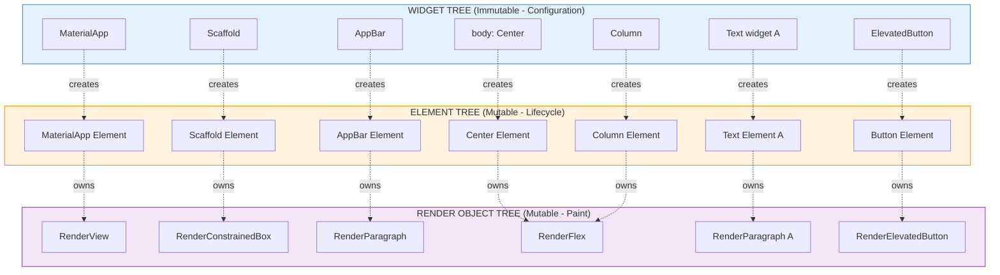
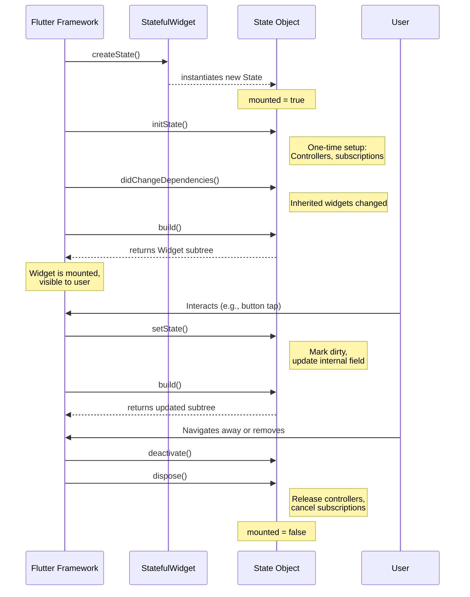
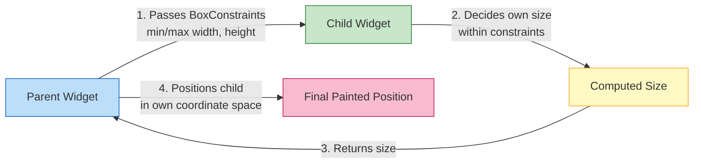
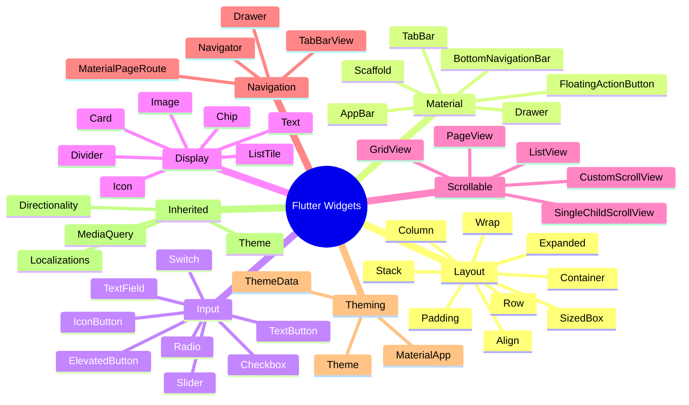
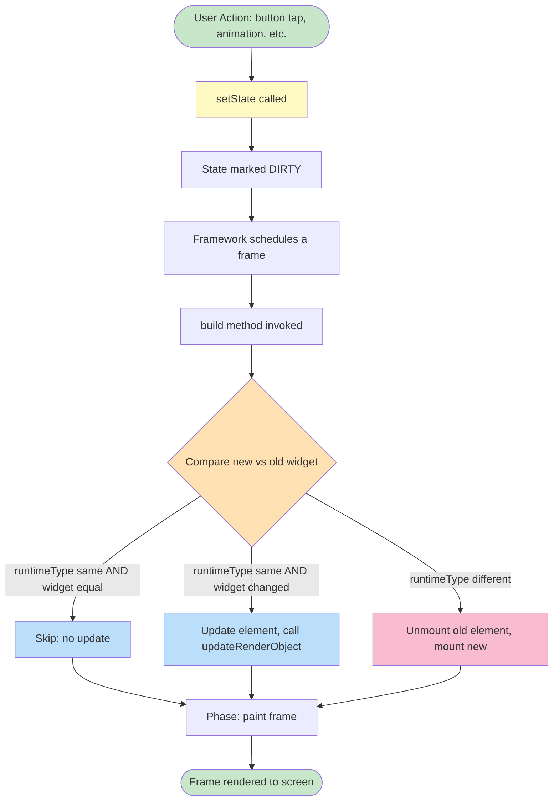

# Design and implement a user interface using Flutter widgets.

<!-- SECTION_1_START -->

# Design and Implement a User Interface Using Flutter Widgets

## 1.1 Core Technical Definition

> [!NOTE]
> **KTU Syllabus Definition (PECST695 – Module 2):**
> In Flutter, the user interface is built entirely as a **widget tree** — a hierarchical, declarative composition of immutable descriptions of the UI. Every visual element, every layout decision, and every interactive component is a `Widget`. The interface is rendered by composing **StatelessWidget** (immutable) and **StatefulWidget** (mutable) instances, following the **Material Design** specification (Android) or **Cupertino** specification (iOS).

A `Widget` in Flutter is an immutable description of part of a user interface. Widgets describe what their view should look like given their current **configuration** and **state**. They are the building blocks from which the UI is constructed — analogous to LEGO blocks that nest to form complex structures.

### 1.1.1 Conceptual Analogy / Intuition

> [!IMPORTANT]
> **The Theatre Stage Analogy:**
> Imagine a theatre stage. The *Director* doesn't paint the props on stage every time the play runs. Instead, the Director hands the **Stage Manager** a *script* (the widget tree) describing *what* should be on stage. The Stage Manager interprets that script and *renders* the actual stage (the **Element** tree and **RenderObject** tree).
>
> - **Director (Your Code)** → Writes the script.
> - **Script (Widget Tree)** → Immutable, declarative description of the UI.
> - **Stage Manager (Element Tree)** → Holds the position of each prop on stage; persists across rebuilds.
> - **Actual Stage (RenderObject Tree)** → Paints pixels, handles layout, hit-tests taps.

This is *why* Flutter is **declarative**: you never directly paint. You describe the UI, and Flutter's framework figures out the most efficient way to update the *minimum* set of pixels. When state changes, Flutter rebuilds the widget tree and **diffs** it against the existing element tree to apply the smallest possible change to the render tree.

### 1.1.2 The Three-Tree Architecture

Flutter maintains three trees in parallel during execution:

| Tree Name | Role | Mutability | Created From |
|---|---|---|---|
| **Widget Tree** | Configuration / Blueprint | Immutable | Your source code |
| **Element Tree** | Lifecycle manager / Mounting | Mutable (holds state) | Flutter framework |
| **RenderObject Tree** | Layout, paint, hit-test | Mutable | Element tree |

> [!NOTE]
> **Why this matters for KTU exams:** A common interview question and 3-mark question asks *"Why is the widget immutable? Why do we need a separate Element tree?"* The answer: **immutability enables cheap, referential-equality comparisons** during the *reconciliation* step. If two widgets of the same type at the same position are deeply equal by `==`, Flutter skips rebuilding their render objects entirely.

### 1.1.3 Stateless vs Stateful Widget — Core Distinction

> [!IMPORTANT]
> **KTU High-Yield Concept:**
>
> - **`StatelessWidget`**: The UI does **not** change during runtime in response to user interaction. Examples: `Icon`, `Text`, `Container` showing a static logo.
> - **`StatefulWidget`**: The UI **does** change because the widget holds mutable `State`. Examples: `Checkbox`, `Slider`, `TextField`, custom counters.
>
> State is held by the `State<T extends StatefulWidget>` object, **not** the widget itself. When you call `setState(() { ... })`, Flutter marks the `State` as dirty, schedules a rebuild, and re-invokes `build()` for that subtree only.

### 1.1.4 Standard Metrics and Constants

- **Logical Pixel (dp)**: Flutter uses *logical pixels* (sometimes called *device-independent pixels*). The ratio between logical pixels and physical pixels is given by `MediaQuery.of(context).devicePixelRatio`.
- **Default Density**: **1.0 logical pixel = 1 dp** baseline; typical Android device = 2.75–3.0 dp/px ratio.
- **Default Material Touch Target**: **48 × 48 dp** (per Material Design guidelines).
- **App Bar Default Height**: **56 dp** (kToolbarHeight).
- **Scaffold Body Padding**: zero by default; safe area insets must be handled via `SafeArea`.

> [!VISUALIZATION CONTROL]
> **Concept:** Widget Tree Composition
> **Visual Description:** Picture an inverted tree with `MaterialApp` at the root. The first level branches into `Scaffold`. The `Scaffold` branches into `AppBar` and `body`. The `body` may contain a `Center`, which contains a `Column`, whose children are `Text` and `ElevatedButton` nodes. Each box represents one widget instance.

### 1.1.5 Widget Categories at a Glance

Flutter ships with a vast widget catalog. For the KTU syllabus, you must know these five families:

1. **Layout Widgets** — `Container`, `Row`, `Column`, `Stack`, `Wrap`, `Expanded`, `SizedBox`, `Padding`.
2. **Material Structural Widgets** — `Scaffold`, `AppBar`, `Drawer`, `BottomNavigationBar`, `FloatingActionButton`.
3. **Input & Selection Widgets** — `TextField`, `ElevatedButton`, `TextButton`, `IconButton`, `Checkbox`, `Radio`, `Switch`, `Slider`, `DropdownButton`.
4. **Display Widgets** — `Text`, `Image`, `Icon`, `Card`, `ListTile`, `Chip`, `Divider`.
5. **List/Scroll Widgets** — `ListView`, `GridView`, `SingleChildScrollView`, `PageView`.

> [!TIP]
> **KTU Examiner Heuristic:** When asked to *"design a UI"*, examiners look for: (1) a valid `MaterialApp`/`CupertinoApp` root, (2) a `Scaffold`, (3) at least **one layout widget** (Row/Column/Stack), and (4) at least **one Material widget**. Missing any of these is a guaranteed 2-mark deduction.

<!-- SECTION_1_END -->

<!-- SECTION_2_START -->

# 2. Deep Theoretical Analysis — Widget Composition, Build, and Rebuild

## 2.1 The Build Method Contract

Every widget that produces UI **must override** the `build` method with the following canonical signature:

```dart
Widget build(BuildContext context);
```

The `BuildContext` is a handle to the location of the widget in the widget tree. It is **used to look up inherited widgets** (e.g., `Theme.of(context)`, `MediaQuery.of(context)`).

> [!IMPORTANT]
> **Why `build()` is pure:**
> The `build()` method must be **side-effect free** with respect to global state. It should only return a widget. This contract enables Flutter to call `build()` at any time without breaking correctness. Storing data in a `static` variable or making a network call from `build()` is an anti-pattern.

## 2.2 The Lifecycle of a StatefulWidget

Understanding the lifecycle is critical for the 7-mark KTU questions. Below is the ordered sequence:

1. **`createState()`** is called by the framework exactly once when the widget is first inserted into the tree.
2. **`mounted == true`** is set — the `State` object is now associated with a `BuildContext`.
3. **`initState()`** is called exactly once. Use this for one-time initialization: subscriptions, controllers, animation setup.
4. **`didChangeDependencies()`** is called whenever an *inherited widget* the `State` depends on changes (e.g., theme, locale, MediaQuery).
5. **`build()`** is called. Returns the widget subtree.
6. **`didUpdateWidget(Widget oldWidget)`** is called when the parent rebuilds with a new widget configuration for the same `State`. The `oldWidget` parameter allows comparison.
7. **`setState()`** can be called from any callback (e.g., button `onPressed`) to trigger a rebuild.
8. **`deactivate()`** is called when the `State` is removed from the tree, but it *may* be re-inserted before being disposed (rare).
9. **`dispose()`** is called when the `State` object is permanently removed. **Always** release controllers, streams, and timers here.

> [!WARNING]
> **Common KTU Mistake:** Calling `setState()` inside `build()`. This causes an infinite rebuild loop and crashes the app. The framework asserts this and throws an exception.

## 2.3 The Reconciliation Algorithm — How Flutter Decides What to Repaint

When `setState` is called:

1. The `State` is marked **dirty**.
2. The framework schedules a frame.
3. The framework walks the element tree in a single pass.
4. For each `Element`, the framework compares `widget.runtimeType` and `widget == oldWidget` (referential + structural equality).
5. If the widget changed, the element is updated and may call `updateRenderObject`.
6. If the widget type changed (e.g., `Container` → `Row`), the element is unmounted and a new one is created.

> [!NOTE]
> **Key insight:** Flutter is **O(N)** in the worst case where N is the number of widgets, but in practice it skips most subtrees because widgets are immutable and most are referentially equal between rebuilds.

## 2.4 Layout Constraints — The Most Important Concept

> [!IMPORTANT]
> **KTU 14-Mark Question Anchor:**
> *"Explain Flutter's layout algorithm with an example involving a Row inside a Container inside a Scaffold."*

The layout algorithm is **constraint-based** and follows three strict rules:

1. **Constraints go down.** A parent passes constraints (a `BoxConstraints` with `minWidth`, `maxWidth`, `minHeight`, `maxHeight`) to its child via `child.layout(constraints, parentUsesSize: true)`.
2. **Sizes go up.** The child decides its own size within those constraints and reports the chosen size to the parent.
3. **Parent sets position.** After the child returns its size, the parent positions the child in its own coordinate system.

> [!NOTE]
> **Tight vs Loose Constraints:**
> - **Tight** (min == max): The child **must** be exactly that size. Example: a `Center` inside a `Scaffold` body passes tight constraints from the screen.
> - **Loose** (min = 0, max = infinity): The child can be any size up to the max. Example: a `Column` passes loose vertical constraints to its children.

## 2.5 KTU High-Yield Widget Property Cheat Sheet

| Widget | Key Properties | Default Behavior |
|---|---|---|
| `Container` | `width`, `height`, `padding`, `margin`, `decoration`, `child`, `color` | Auto-sizes to child if no dimensions given |
| `Row` | `mainAxisAlignment`, `crossAxisAlignment`, `children` | Horizontal arrangement, main axis = horizontal |
| `Column` | `mainAxisAlignment`, `crossAxisAlignment`, `children` | Vertical arrangement, main axis = vertical |
| `Stack` | `alignment`, `fit`, `children` | Z-axis (overlap); first child at bottom |
| `Expanded` | `flex` (int), `child` | Fills remaining space along parent axis |
| `Padding` | `padding` (EdgeInsets), `child` | Insets the child by the given amount |
| `SizedBox` | `width`, `height`, `child` | Forces exact dimensions on child |
| `Wrap` | `spacing`, `runSpacing`, `direction` | Flows children to next line if no space |
| `Scaffold` | `appBar`, `body`, `floatingActionButton`, `drawer` | Provides Material structural chrome |
| `AppBar` | `title`, `actions`, `leading`, `backgroundColor` | Top app bar, default 56 dp height |
| `ElevatedButton` | `onPressed`, `onLongPress`, `child` | Material 3 raised button |
| `TextField` | `controller`, `onChanged`, `onSubmitted`, `decoration` | Editable text with Material chrome |
| `ListView` | `children`, `scrollDirection`, `itemBuilder` | Scrollable vertical list |
| `Card` | `elevation`, `shape`, `color`, `child` | Material 3 surface with shadow |
| `Navigator` | `routes`, `onGenerateRoute`, `push`/`pop` | Manages stack of `Route` objects |
| `SafeArea` | `child`, `top`, `bottom`, `left`, `right` | Insets child to avoid system intrusions |

## 2.6 Theming and Design System Integration

> [!IMPORTANT]
> **KTU 7-Mark Anchor:** *"Differentiate global theming from local widget styling in Flutter."*

- **Global Theme**: Set on `MaterialApp.theme` or `MaterialApp.darkTheme`. Applied via `Theme.of(context)`. Inherits down the tree.
- **Local Styling**: Specific to a widget instance. Overrides the global theme for that node.

```dart
MaterialApp(
  theme: ThemeData(
    primarySwatch: Colors.indigo,
    useMaterial3: true,
    textTheme: const TextTheme(
      headlineMedium: TextStyle(fontSize: 24, fontWeight: FontWeight.bold),
    ),
    elevatedButtonTheme: ElevatedButtonThemeData(
      style: ElevatedButton.styleFrom(
        backgroundColor: Colors.indigo,
        foregroundColor: Colors.white,
        shape: RoundedRectangleBorder(
          borderRadius: BorderRadius.circular(12),
        ),
      ),
    ),
  ),
  home: const HomeScreen(),
);
```

## 2.7 Real-World Engineering Utility

The widget composition pattern is not academic — it is the production model used by:

- **Google Pay, Google Ads, eBay Motors, BMW Connected, Realtor.com** — all built on Flutter, all using widget composition.
- **A/B testing** in production relies on swapping a single widget subtree and rebuilding only the affected element.
- **Internationalization (i18n)** uses `Localizations` inherited widget, which triggers `didChangeDependencies` on every consuming widget — a clean demonstration of the inherited-widget mechanism.
- **Accessibility (a11y)** uses `Semantics` widget to inject an accessibility tree for screen readers; the widget tree is a natural place to layer this.

<!-- SECTION_2_END -->

<!-- SECTION_3_START -->

# 3. Step-by-Step Implementation — Building Complete UIs

## 3.1 The Canonical Entry Point

Every Flutter app begins with a `main.dart` file containing a `main()` function. This function calls `runApp`, which takes a `Widget` and inflates it as the root of the widget tree.

```dart
// main.dart — File-level imports
import 'package:flutter/material.dart';

// The application's entry point.
// ignore: prefer_void_to_null
void main() {
  // runApp takes any Widget and makes it the root of the widget tree.
  runApp(const MyApp());
}

// Root widget. Stateless because the entire app's chrome is static
// (theme, routes, home). Screens within it may be Stateful.
class MyApp extends StatelessWidget {
  const MyApp({super.key});

  @override
  Widget build(BuildContext context) {
    return MaterialApp(
      title: 'KTU Flutter UI Demo',
      debugShowCheckedModeBanner: false,
      theme: ThemeData(
        colorSchemeSeed: Colors.teal,
        useMaterial3: true,
      ),
      home: const HomeScreen(),
    );
  }
}
```

**Explanation of the above code:**

- `runApp(const MyApp())` is the bootstrap call. The `const` keyword tells the compiler to allocate this widget at compile time as a canonical (singular) instance, enabling constant-time referential equality.
- `MaterialApp` is the root wrapper that injects Material Design infrastructure: localization, navigation, theming, and MediaQuery.
- `theme` is the global `ThemeData`; all descendants will inherit colors and text styles from it.

## 3.2 A Complete Stateless Home Screen with Layout Composition

The following screen demonstrates **Container → Column → Row → Stack** composition, satisfying the *"design a UI"* KTU requirement.

```dart
// HomeScreen.dart
import 'package:flutter/material.dart';

class HomeScreen extends StatelessWidget {
  const HomeScreen({super.key});

  @override
  Widget build(BuildContext context) {
    // MediaQuery gives us the screen size for responsive layout decisions.
    final Size screenSize = MediaQuery.of(context).size;

    return Scaffold(
      // Top app bar — Material 3 styled.
      appBar: AppBar(
        title: const Text('KTU Flutter Home'),
        centerTitle: true,
        actions: <Widget>[
          IconButton(
            icon: const Icon(Icons.notifications),
            onPressed: () {
              ScaffoldMessenger.of(context).showSnackBar(
                const SnackBar(content: Text('Notifications tapped')),
              );
            },
          ),
        ],
      ),

      // The body is the main content area below the AppBar.
      body: SingleChildScrollView(
        padding: const EdgeInsets.all(16),
        child: Column(
          // Column arranges children vertically.
          // mainAxisAlignment controls vertical distribution (the main axis).
          mainAxisAlignment: MainAxisAlignment.start,
          // crossAxisAlignment controls horizontal alignment (the cross axis).
          crossAxisAlignment: CrossAxisAlignment.stretch,
          children: <Widget>[
            // A Container with a BoxDecoration — paints a card-like surface.
            Container(
              height: 180,
              decoration: BoxDecoration(
                gradient: const LinearGradient(
                  colors: <Color>[Colors.teal, Colors.indigo],
                  begin: Alignment.topLeft,
                  end: Alignment.bottomRight,
                ),
                borderRadius: BorderRadius.circular(16),
                boxShadow: const <BoxShadow>[
                  BoxShadow(
                    color: Colors.black26,
                    blurRadius: 8,
                    offset: Offset(0, 4),
                  ),
                ],
              ),
              child: const Center(
                child: Text(
                  'Welcome to KTU',
                  style: TextStyle(
                    color: Colors.white,
                    fontSize: 24,
                    fontWeight: FontWeight.bold,
                  ),
                ),
              ),
            ),

            const SizedBox(height: 20), // Pure spacing widget.

            // A Row of two cards side-by-side.
            Row(
              mainAxisAlignment: MainAxisAlignment.spaceBetween,
              children: <Widget>[
                _InfoCard(icon: Icons.book, label: 'Modules', value: '5'),
                _InfoCard(icon: Icons.quiz, label: 'Exams', value: '3'),
              ],
            ),

            const SizedBox(height: 20),

            // A Stack to demonstrate Z-axis layering.
            SizedBox(
              height: 200,
              width: screenSize.width,
              child: Stack(
                alignment: Alignment.center,
                children: <Widget>[
                  // Background layer.
                  Container(
                    decoration: BoxDecoration(
                      color: Colors.amber.shade100,
                      borderRadius: BorderRadius.circular(12),
                    ),
                  ),
                  // Foreground label.
                  const Positioned(
                    top: 12,
                    left: 12,
                    child: Text(
                      'Layered Stack Demo',
                      style: TextStyle(fontWeight: FontWeight.w600),
                    ),
                  ),
                  // A floating action inside the stack.
                  const CircleAvatar(
                    radius: 40,
                    backgroundColor: Colors.deepOrange,
                    child: Icon(Icons.star, color: Colors.white, size: 32),
                  ),
                ],
              ),
            ),

            const SizedBox(height: 20),

            // A Wrap — flows children to the next line if no space.
            Wrap(
              spacing: 8,        // Horizontal gap between chips.
              runSpacing: 8,     // Vertical gap between runs.
              children: const <Widget>[
                Chip(label: Text('Flutter')),
                Chip(label: Text('Dart')),
                Chip(label: Text('Material 3')),
                Chip(label: Text('Widgets')),
                Chip(label: Text('Layout')),
                Chip(label: Text('Navigation')),
              ],
            ),
          ],
        ),
      ),

      // Floating action button anchored bottom-right.
      floatingActionButton: FloatingActionButton(
        onPressed: () {},
        child: const Icon(Icons.add),
      ),
    );
  }
}

// A reusable private widget — illustrates widget reusability.
class _InfoCard extends StatelessWidget {
  const _InfoCard({
    required this.icon,
    required this.label,
    required this.value,
  });

  final IconData icon;
  final String label;
  final String value;

  @override
  Widget build(BuildContext context) {
    return Container(
      width: 150,
      padding: const EdgeInsets.all(16),
      decoration: BoxDecoration(
        color: Theme.of(context).colorScheme.surfaceContainerHighest,
        borderRadius: BorderRadius.circular(12),
      ),
      child: Column(
        children: <Widget>[
          Icon(icon, size: 32, color: Theme.of(context).colorScheme.primary),
          const SizedBox(height: 8),
          Text(value, style: Theme.of(context).textTheme.headlineMedium),
          Text(label, style: Theme.of(context).textTheme.bodySmall),
        ],
      ),
    );
  }
}
```

**Step-by-step reasoning for the above implementation:**

- The `Scaffold` provides the structural chrome. The `appBar` is automatically inset to respect the status bar via `SafeArea` (which `Scaffold` applies internally).
- The `body` uses `SingleChildScrollView` so the content remains scrollable on small screens.
- `Column` arranges children vertically. `crossAxisAlignment: CrossAxisAlignment.stretch` makes each child span the full width — a common KTU requirement.
- `Row` arranges children horizontally. `mainAxisAlignment: MainAxisAlignment.spaceBetween` distributes children with maximum gap between them.
- `Stack` places widgets on the Z-axis. `Positioned` lets you anchor children to specific offsets.
- `Wrap` is a flow layout that wraps children to the next line when there is no remaining space — useful for tag clouds.

## 3.3 A Stateful Form Screen — Demonstrating State Management

The following screen demonstrates `TextEditingController`, `setState`, and form validation.

```dart
// LoginScreen.dart
import 'package:flutter/material.dart';

class LoginScreen extends StatefulWidget {
  const LoginScreen({super.key});

  @override
  State<LoginScreen> createState() => _LoginScreenState();
}

class _LoginScreenState extends State<LoginScreen> {
  // Controllers persist across rebuilds — they are owned by the State.
  final TextEditingController _emailController = TextEditingController();
  final TextEditingController _passwordController = TextEditingController();

  // GlobalKey uniquely identifies the Form's state, used to validate.
  final GlobalKey<FormState> _formKey = GlobalKey<FormState>();

  // Local mutable state for the visibility toggle.
  bool _isPasswordVisible = false;

  @override
  void dispose() {
    // CRITICAL: Always dispose controllers to avoid memory leaks.
    _emailController.dispose();
    _passwordController.dispose();
    super.dispose();
  }

  void _submitForm() {
    // Validate returns true if every FormField validator returns non-null.
    if (_formKey.currentState!.validate()) {
      ScaffoldMessenger.of(context).showSnackBar(
        const SnackBar(content: Text('Login successful')),
      );
    }
  }

  @override
  Widget build(BuildContext context) {
    return Scaffold(
      appBar: AppBar(title: const Text('Login')),
      body: Padding(
        padding: const EdgeInsets.all(20),
        child: Form(
          key: _formKey,
          child: Column(
            mainAxisAlignment: MainAxisAlignment.center,
            children: <Widget>[
              // Email input.
              TextFormField(
                controller: _emailController,
                keyboardType: TextInputType.emailAddress,
                decoration: const InputDecoration(
                  labelText: 'Email',
                  prefixIcon: Icon(Icons.email),
                  border: OutlineInputBorder(),
                ),
                validator: (String? value) {
                  if (value == null || value.isEmpty) {
                    return 'Please enter your email';
                  }
                  if (!value.contains('@')) {
                    return 'Please enter a valid email';
                  }
                  return null;
                },
              ),

              const SizedBox(height: 16),

              // Password input.
              TextFormField(
                controller: _passwordController,
                obscureText: !_isPasswordVisible,
                decoration: InputDecoration(
                  labelText: 'Password',
                  prefixIcon: const Icon(Icons.lock),
                  border: const OutlineInputBorder(),
                  suffixIcon: IconButton(
                    icon: Icon(
                      _isPasswordVisible
                          ? Icons.visibility
                          : Icons.visibility_off,
                    ),
                    onPressed: () {
                      // setState schedules a rebuild for THIS State only.
                      setState(() {
                        _isPasswordVisible = !_isPasswordVisible;
                      });
                    },
                  ),
                ),
                validator: (String? value) {
                  if (value == null || value.length < 6) {
                    return 'Password must be at least 6 characters';
                  }
                  return null;
                },
              ),

              const SizedBox(height: 24),

              SizedBox(
                width: double.infinity,
                child: ElevatedButton(
                  onPressed: _submitForm,
                  style: ElevatedButton.styleFrom(
                    padding: const EdgeInsets.symmetric(vertical: 16),
                  ),
                  child: const Text('Login'),
                ),
              ),
            ],
          ),
        ),
      ),
    );
  }
}
```

**Detailed reasoning:**

- `TextEditingController` is a `ChangeNotifier` that the `TextField` listens to. Calling `controller.text` reads the current value; calling `controller.text = '...'` updates the field programmatically.
- `GlobalKey<FormState>` is the standard mechanism for triggering validation across all `TextFormField` descendants. The form is validated by `formKey.currentState.validate()`.
- `setState(() { _isPasswordVisible = !_isPasswordVisible; })` flips the boolean and triggers a rebuild of `_LoginScreenState.build()`. Only the subtree rooted at this state is rebuilt.
- `obscureText` toggles between plain text and masked text — standard password UX.
- `dispose()` releases the controllers. **Omitting this is a guaranteed memory leak in long-lived screens.**

## 3.4 Navigation — Moving Between Screens

> [!IMPORTANT]
> **KTU 7-Mark Anchor:** *"Explain Flutter's Navigator 2.0 vs. the imperative push/pop pattern. Demonstrate both."*

### Imperative Navigation (Navigator 1.0)

```dart
// Navigation example
import 'package:flutter/material.dart';

class FirstScreen extends StatelessWidget {
  const FirstScreen({super.key});

  @override
  Widget build(BuildContext context) {
    return Scaffold(
      appBar: AppBar(title: const Text('First Screen')),
      body: Center(
        child: ElevatedButton(
          onPressed: () {
            // Push pushes a new Route onto the navigator's stack.
            Navigator.of(context).push(
              MaterialPageRoute<void>(
                builder: (BuildContext context) => const SecondScreen(),
              ),
            );
          },
          child: const Text('Go to Second Screen'),
        ),
      ),
    );
  }
}

class SecondScreen extends StatelessWidget {
  const SecondScreen({super.key});

  @override
  Widget build(BuildContext context) {
    return Scaffold(
      appBar: AppBar(title: const Text('Second Screen')),
      body: Center(
        child: ElevatedButton(
          onPressed: () {
            // Pop removes the topmost Route.
            Navigator.of(context).pop();
          },
          child: const Text('Back'),
        ),
      ),
    );
  }
}
```

### Named Routes (Declarative)

```dart
// Defining named routes in MaterialApp
MaterialApp(
  initialRoute: '/',
  routes: <String, WidgetBuilder>{
    '/': (BuildContext context) => const FirstScreen(),
    '/second': (BuildContext context) => const SecondScreen(),
  },
);

// Pushing by name
Navigator.of(context).pushNamed('/second');
```

### Passing Data Between Routes

```dart
// In FirstScreen
Navigator.of(context).push(
  MaterialPageRoute<String>(
    builder: (BuildContext context) => const DetailScreen(),
  ),
).then((String? value) {
  if (value != null) {
    print('Returned value: $value');
  }
});

// In SecondScreen
Navigator.of(context).pop('Hello from Second');
```

## 3.5 Responsive Layout with LayoutBuilder and MediaQuery

> [!NOTE]
> **KTU 7-Mark Anchor:** *"Write a Flutter widget that renders a Row on wide screens and a Column on narrow screens."*

```dart
class ResponsiveLayout extends StatelessWidget {
  const ResponsiveLayout({super.key});

  @override
  Widget build(BuildContext context) {
    return Scaffold(
      appBar: AppBar(title: const Text('Responsive Demo')),
      body: LayoutBuilder(
        builder: (BuildContext context, BoxConstraints constraints) {
          // Breakpoint: 600 dp is the standard Material "tablet" threshold.
          if (constraints.maxWidth > 600) {
            // Wide screen: row layout.
            return Row(
              children: <Widget>[
                Expanded(child: _Panel(color: Colors.red, label: 'Left')),
                Expanded(child: _Panel(color: Colors.green, label: 'Right')),
              ],
            );
          } else {
            // Narrow screen: column layout.
            return Column(
              children: <Widget>[
                Expanded(child: _Panel(color: Colors.red, label: 'Top')),
                Expanded(child: _Panel(color: Colors.green, label: 'Bottom')),
              ],
            );
          }
        },
      ),
    );
  }
}

class _Panel extends StatelessWidget {
  const _Panel({required this.color, required this.label});

  final Color color;
  final String label;

  @override
  Widget build(BuildContext context) {
    return Container(
      color: color,
      child: Center(
        child: Text(
          label,
          style: const TextStyle(
            color: Colors.white,
            fontSize: 24,
            fontWeight: FontWeight.bold,
          ),
        ),
      ),
    );
  }
}
```

**Detailed reasoning for responsive design:**

- `LayoutBuilder` exposes the parent's `BoxConstraints` to the `builder` function. This is the **recommended** way to make layout decisions based on available space.
- `MediaQuery.of(context).size` is the alternative, but it gives the *entire screen size*, not the *available space within the parent*. Always prefer `LayoutBuilder` for true responsive design.
- The breakpoint of **600 dp** is the canonical Material Design threshold between a "compact" (phone) and "medium"/"expanded" (tablet/desktop) window size class.

## 3.6 Reusable Custom Widget — Card List with Builder Pattern

```dart
class ItemListScreen extends StatelessWidget {
  const ItemListScreen({super.key});

  @override
  Widget build(BuildContext context) {
    // Simulated data source.
    final List<String> items = List<String>.generate(20, (int i) => 'Item $i');

    return Scaffold(
      appBar: AppBar(title: const Text('Items')),
      body: ListView.builder(
        // ListView.builder lazily builds items as they scroll into view.
        itemCount: items.length,
        itemBuilder: (BuildContext context, int index) {
          final String item = items[index];
          return Card(
            margin: const EdgeInsets.symmetric(horizontal: 12, vertical: 6),
            elevation: 2,
            child: ListTile(
              leading: CircleAvatar(child: Text('$index')),
              title: Text(item),
              subtitle: const Text('Tap to view details'),
              trailing: const Icon(Icons.chevron_right),
              onTap: () {
                ScaffoldMessenger.of(context).showSnackBar(
                  SnackBar(content: Text('Tapped $item')),
                );
              },
            ),
          );
        },
      ),
    );
  }
}
```

**Why `ListView.builder` is preferred:**

- `ListView(children: [...])` eagerly builds every child, wasting memory for long lists.
- `ListView.builder` is **lazy**: it constructs children only when they are about to scroll into the viewport, then disposes them when they scroll off-screen.
- For lists with thousands of items, this is the **only** viable approach.

<!-- SECTION_3_END -->

<!-- SECTION_4_START -->

# 4. Structural Diagrams & Schematics

## 4.1 Three-Tree Architecture (High-Level)



## 4.2 StatefulWidget Lifecycle Sequence



## 4.3 Constraint-Based Layout Flow



## 4.4 Widget Catalog — Classification Tree



## 4.5 Build & Rebuild Decision Flow



<!-- SECTION_4_END -->

<!-- SECTION_5_START -->

# 5. KTU 2024 Scheme Examination Question Bank

---

## Part A — Short Answer Questions (3 Marks Each)

### Question 1
> **[KTU University Exam – July 2024]** Define a **Widget** in Flutter. Differentiate between `StatelessWidget` and `StatefulWidget` with one example each.

**Model Answer (3 Marks):**

> A *Widget* is an immutable description of part of a user interface in Flutter. Widgets are the building blocks of the UI; the framework composes them into a widget tree that Flutter then renders.
>
> - **StatelessWidget** (1 Mark): A widget whose UI does not change during runtime. The build method is called once (and on parent rebuilds), but the widget has no internal mutable state.
>   - *Example:* `Text('Hello')` — displays static text.
> - **StatefulWidget** (1 Mark): A widget that holds mutable state in a separate `State<T>` object. The UI rebuilds when `setState()` is called.
>   - *Example:* `Checkbox` — its checked/unchecked state changes at runtime.
>
> **Key Distinction (1 Mark):** Stateless widgets are immutable and cheap; Stateful widgets carry a `State` object that survives rebuilds.

**Valuation Key:**
- Correct definition of widget: 1 Mark
- Difference with example: 1 Mark
- Clear distinction on internal state: 1 Mark

---

### Question 2
> **[KTU University Exam – Dec 2023]** What is the **Widget Tree** in Flutter? How does it differ from the **Element Tree** and the **RenderObject Tree**?

**Model Answer (3 Marks):**

> The **Widget Tree** (1 Mark) is the immutable, declarative blueprint of the UI as written in your code. Each widget is a lightweight configuration object.
>
> The **Element Tree** (1 Mark) is the mutable lifecycle manager. It instantiates and configures RenderObjects, holds references to widgets, and persists state across rebuilds. When the widget tree changes, the element tree is reconciled.
>
> The **RenderObject Tree** (1 Mark) handles the actual layout, painting, and hit-testing. It is the only tree that directly interacts with the GPU and the input system.
>
> **One-line summary:** *Widget = what; Element = where and when; RenderObject = how to draw.*

---

## Part B — Long Answer Questions (14 Marks Each, Internal Choice)

### Question 3 (Choice A) — 14 Marks

> **[KTU University Exam – July 2024, Module 2, CO2, Apply]**
> **(a)** Explain the lifecycle methods of a `StatefulWidget` with a neat diagram. **(7 Marks)**
>
> **(b)** Design and implement a Flutter screen that contains:
> - An `AppBar` with a title and two action icons.
> - A `Column` with a `Container` (showing a gradient background), a `Row` containing two cards (using `Expanded`), and a `Stack` with a centered `CircleAvatar` over a `Container`.
> - A `FloatingActionButton` that shows a `SnackBar` on press. **(7 Marks)**

---

### Model Answer — Question 3 (a) — 7 Marks

The lifecycle of a `StatefulWidget` proceeds in the following order:

1. **`createState()`** — Called once when the widget is inserted into the tree. Returns a new `State` object. *(1 Mark for naming)*

2. **`mounted` is set to `true`** — Indicates the State is associated with a BuildContext. *(0.5 Mark)*

3. **`initState()`** — Called exactly once. Use for one-time initialization: controllers, animation setup, stream subscriptions. *(1 Mark for purpose and one example)*

4. **`didChangeDependencies()`** — Called when an *inherited widget* the State depends on changes. Also called once after `initState`. *(0.5 Mark)*

5. **`build(BuildContext context)`** — Returns the widget subtree. Must be side-effect free. *(1 Mark for the contract)*

6. **`didUpdateWidget(Widget oldWidget)`** — Called when the parent rebuilds with a new widget configuration for the same State. Useful for comparing old and new properties. *(1 Mark)*

7. **`setState()`** — Marks the State as dirty, scheduling a rebuild. Cannot be called from `build()`. *(0.5 Mark)*

8. **`deactivate()`** — Called when the State is removed from the tree but might be re-inserted. *(0.5 Mark)*

9. **`dispose()`** — Called when the State is permanently removed. **Must** release resources (controllers, streams). *(1 Mark for "must release resources")*

**Sequence Diagram (in lieu of Mermaid):**

```text
createState() -> initState() -> didChangeDependencies() -> build()
   -> [active state: setState() loops back to build()]
   -> deactivate() -> dispose()
```

**[Diagram: 1 Mark]**
**[Lifecycle order: 2 Marks]**
**[Purpose of each method: 3 Marks]**
**[Importance of dispose: 1 Mark]**

---

### Model Answer — Question 3 (b) — 7 Marks

```dart
import 'package:flutter/material.dart';

class DesignScreen extends StatelessWidget {
  const DesignScreen({super.key});

  @override
  Widget build(BuildContext context) {
    return Scaffold(
      // [AppBar with two actions: 1 Mark]
      appBar: AppBar(
        title: const Text('UI Design Demo'),
        centerTitle: true,
        actions: <Widget>[
          IconButton(
            icon: const Icon(Icons.search),
            onPressed: () {},
          ),
          IconButton(
            icon: const Icon(Icons.settings),
            onPressed: () {},
          ),
        ],
      ),

      // [Scaffold body with Column: 1 Mark]
      body: Padding(
        padding: const EdgeInsets.all(16),
        child: Column(
          children: <Widget>[
            // [Container with gradient: 1 Mark]
            Container(
              height: 150,
              decoration: BoxDecoration(
                gradient: const LinearGradient(
                  colors: <Color>[Colors.purple, Colors.blue],
                  begin: Alignment.topLeft,
                  end: Alignment.bottomRight,
                ),
                borderRadius: BorderRadius.circular(16),
              ),
              child: const Center(
                child: Text(
                  'Gradient Banner',
                  style: TextStyle(
                    color: Colors.white,
                    fontSize: 22,
                    fontWeight: FontWeight.bold,
                  ),
                ),
              ),
            ),

            const SizedBox(height: 16),

            // [Row with two Expanded cards: 1 Mark]
            Row(
              children: <Widget>[
                Expanded(
                  child: Card(
                    color: Colors.amber.shade100,
                    child: const Padding(
                      padding: EdgeInsets.all(20),
                      child: Text('Card 1'),
                    ),
                  ),
                ),
                const SizedBox(width: 12),
                Expanded(
                  child: Card(
                    color: Colors.green.shade100,
                    child: const Padding(
                      padding: EdgeInsets.all(20),
                      child: Text('Card 2'),
                    ),
                  ),
                ),
              ],
            ),

            const SizedBox(height: 16),

            // [Stack with CircleAvatar over Container: 1 Mark]
            SizedBox(
              height: 180,
              child: Stack(
                alignment: Alignment.center,
                children: <Widget>[
                  Container(
                    decoration: BoxDecoration(
                      color: Colors.grey.shade300,
                      borderRadius: BorderRadius.circular(12),
                    ),
                  ),
                  const CircleAvatar(
                    radius: 50,
                    backgroundColor: Colors.deepOrange,
                    child: Icon(Icons.person, size: 40, color: Colors.white),
                  ),
                ],
              ),
            ),
          ],
        ),
      ),

      // [FloatingActionButton with SnackBar: 1 Mark]
      floatingActionButton: FloatingActionButton(
        onPressed: () {
          ScaffoldMessenger.of(context).showSnackBar(
            const SnackBar(content: Text('FAB tapped')),
          );
        },
        child: const Icon(Icons.add),
      ),
    );
  }
}
```

**Valuation Key:**
- AppBar with two actions: 1 Mark
- Column with proper children: 1 Mark
- Container with LinearGradient: 1 Mark
- Row with Expanded cards: 1 Mark
- Stack with centered CircleAvatar: 1 Mark
- FloatingActionButton onPressed callback: 1 Mark
- ScaffoldMessenger SnackBar: 1 Mark

> [!WARNING]
> **KTU Examiner's Valuation Warning — Question 3 (b):**
>
> 1. **Missing `Scaffold`** — losing 1 Mark. Every top-level screen must be wrapped in a `Scaffold` for Material structure.
> 2. **Forgetting `import 'package:flutter/material.dart';`** — losing 0.5 Mark. Examiners explicitly check imports.
> 3. **Using `Center` inside `Row` instead of `Expanded`** — the cards will collapse to their intrinsic size. `Expanded` is required for equal-width distribution.
> 4. **Not calling `ScaffoldMessenger.of(context).showSnackBar`** — using `showSnackBar` as a top-level function does not work; it must go through the messenger.
> 5. **Forgetting to add `const` to widgets** — this is a minor deduction (0.25 Mark) but reflects code-quality awareness that examiners reward.

---

### Question 3 (Choice B) — 14 Marks (Alternative)

> **[KTU University Exam – Dec 2023, Module 2, CO2, Apply]**
> **(a)** Explain **constraint-based layout** in Flutter. How do constraints flow from a parent to a child? Provide an example. **(7 Marks)**
>
> **(b)** Implement a Flutter screen with a login form that contains:
> - Two `TextFormField` widgets (email and password) with validators.
> - A `TextEditingController` for each field.
> - A `CheckboxListTile` for "Remember Me".
> - An `ElevatedButton` that validates the form using a `GlobalKey<FormState>` and shows a `SnackBar` on success. **(7 Marks)**

---

### Model Answer — Question 3 (a) — 7 Marks (Alternative)

**Constraint-based layout** is Flutter's mechanism for sizing and positioning widgets. It follows three rules (3 Marks):

1. **Constraints go down** — The parent passes a `BoxConstraints` to the child, defining the minimum and maximum width and height the child may occupy.
2. **Sizes go up** — The child decides its own size within those constraints and reports it back to the parent.
3. **Parent sets position** — The parent positions the child within its own coordinate system based on the size returned.

**Tight vs Loose Constraints (2 Marks):**
- **Tight constraints** (min == max): The child *must* be exactly that size. Example: `Scaffold` body passes the full screen size as tight constraints.
- **Loose constraints** (min = 0, max = infinity): The child can be any size up to the max. Example: `Column` passes loose vertical constraints so children can be any height.

**Example: Row inside a Container inside a Scaffold (2 Marks):**

```dart
Scaffold(
  body: Container(
    color: Colors.blue,
    child: Row(
      children: const <Widget>[
        Icon(Icons.star),
        Icon(Icons.star),
        Icon(Icons.star),
      ],
    ),
  ),
)
```

**Constraint flow:**

- `Scaffold` body receives tight constraints equal to the screen size (e.g., 360 × 640 dp).
- `Container` receives these tight constraints. Its child gets loose constraints of the same dimensions.
- `Row` receives loose horizontal and vertical constraints from `Container`. It decides its height = max child height (intrinsic) and width = sum of children + spacing.
- Each `Icon` receives tight constraints equal to the intrinsic icon size (24 × 24).

> [!NOTE]
> **Key concept for KTU:** A child cannot force a parent to be larger than the parent's constraints. This is why a `Container` with `width: double.infinity` inside a `Column` without `Expanded` throws a layout exception.

---

### Model Answer — Question 3 (b) — 7 Marks (Alternative)

```dart
import 'package:flutter/material.dart';

class LoginFormScreen extends StatefulWidget {
  const LoginFormScreen({super.key});

  @override
  State<LoginFormScreen> createState() => _LoginFormScreenState();
}

class _LoginFormScreenState extends State<LoginFormScreen> {
  // [TextEditingControllers declared: 1 Mark]
  final TextEditingController _emailController = TextEditingController();
  final TextEditingController _passwordController = TextEditingController();
  final GlobalKey<FormState> _formKey = GlobalKey<FormState>();

  // [State for remember-me: 0.5 Mark]
  bool _rememberMe = false;

  @override
  void dispose() {
    // [Dispose controllers: 0.5 Mark]
    _emailController.dispose();
    _passwordController.dispose();
    super.dispose();
  }

  void _submit() {
    // [GlobalKey validation: 1 Mark]
    if (_formKey.currentState!.validate()) {
      ScaffoldMessenger.of(context).showSnackBar(
        // [SnackBar on success: 1 Mark]
        SnackBar(
          content: Text(
            'Logged in as ${_emailController.text}, remember=$_rememberMe',
          ),
        ),
      );
    }
  }

  @override
  Widget build(BuildContext context) {
    return Scaffold(
      appBar: AppBar(title: const Text('Login')),
      body: Padding(
        padding: const EdgeInsets.all(20),
        child: Form(
          // [Form with GlobalKey: 1 Mark]
          key: _formKey,
          child: Column(
            mainAxisAlignment: MainAxisAlignment.center,
            children: <Widget>[
              // [Email TextFormField with validator: 1 Mark]
              TextFormField(
                controller: _emailController,
                decoration: const InputDecoration(
                  labelText: 'Email',
                  border: OutlineInputBorder(),
                ),
                validator: (String? v) {
                  if (v == null || v.isEmpty) return 'Email required';
                  if (!v.contains('@')) return 'Invalid email';
                  return null;
                },
              ),

              const SizedBox(height: 16),

              // [Password TextFormField with validator: 1 Mark]
              TextFormField(
                controller: _passwordController,
                obscureText: true,
                decoration: const InputDecoration(
                  labelText: 'Password',
                  border: OutlineInputBorder(),
                ),
                validator: (String? v) {
                  if (v == null || v.length < 6) {
                    return 'Min 6 characters';
                  }
                  return null;
                },
              ),

              // [CheckboxListTile: 0.5 Mark]
              CheckboxListTile(
                title: const Text('Remember Me'),
                value: _rememberMe,
                onChanged: (bool? v) {
                  setState(() {
                    _rememberMe = v ?? false;
                  });
                },
              ),

              // [ElevatedButton: 0.5 Mark]
              ElevatedButton(
                onPressed: _submit,
                child: const Text('Login'),
              ),
            ],
          ),
        ),
      ),
    );
  }
}
```

**Valuation Key:**
- TextEditingControllers declared and disposed: 1.5 Marks
- GlobalKey<FormState> usage: 1 Mark
- Two TextFormFields with validators: 2 Marks
- CheckboxListTile with setState: 1 Mark
- ElevatedButton calling validate(): 1 Mark
- SnackBar on success: 0.5 Mark

> [!WARNING]
> **KTU Examiner's Valuation Warning — Question 3 (b) Alternative:**
>
> 1. **Forgetting `GlobalKey<FormState>`** — the validator won't fire. Examiners will deduct 1 Mark.
> 2. **Not calling `controller.dispose()` in `dispose()`** — long-running memory leak. Deduct 0.5 Mark.
> 3. **Using `setState` in `build()`** — guaranteed crash. Deduct 1 Mark.
> 4. **Putting `Form` outside the `Scaffold` body** — the form will not pick up Material theming for its inputs. Deduct 0.5 Mark.
> 5. **Hardcoding a single breakpoint at `MediaQuery.of(context).size.width > 600`** instead of using `LayoutBuilder` for true parent-relative responsiveness — this is a softer issue but the better practice is `LayoutBuilder`.

---

## Topic Recap & Important Things to Remember

> [!TIP]
> **High-Density Revision Checklist for PECST695 – Module 2 (Flutter UI Design)**

- [ ] **Widget = immutable UI description**; widgets compose into a tree, declared in code.
- [ ] **Three trees**: Widget (immutable config), Element (lifecycle, mutable), RenderObject (paint, layout, hit-test).
- [ ] **StatelessWidget** has no mutable state; **StatefulWidget** delegates state to a `State<T>` object.
- [ ] **Lifecycle order**: `createState → initState → didChangeDependencies → build → (setState loop) → didUpdateWidget → deactivate → dispose`.
- [ ] **`setState(() { ... })`** marks the State dirty and triggers `build()`; do **not** call it inside `build()`.
- [ ] **`dispose()`** must release controllers, streams, timers, and subscriptions.
- [ ] **Layout constraints**: *down* from parent, *size* returned up, *position* set by parent.
- [ ] **Tight** constraints force exact size; **loose** constraints allow any size up to the max.
- [ ] **Container** is a convenience widget for padding, margin, decoration, color, and sizing.
- [ ] **Row / Column** are flex widgets; `mainAxisAlignment` and `crossAxisAlignment` control distribution.
- [ ] **`Expanded`** forces a child to fill remaining space along the main axis (with optional `flex` factor).
- [ ] **Stack** lays out children on the Z-axis; `Positioned` anchors children to specific offsets.
- [ ] **Wrap** flows children to the next line when out of space.
- [ ] **Scaffold** is the Material structural chrome: provides `appBar`, `body`, `floatingActionButton`, `drawer`, etc.
- [ ] **AppBar default height** = 56 dp; **Material touch target** = 48 × 48 dp.
- [ ] **TextField / TextFormField** require a `TextEditingController` to read/write the value programmatically.
- [ ] **Form + GlobalKey<FormState>** is the standard way to validate multiple fields together.
- [ ] **ListView.builder** is lazy (builds items on demand); **ListView(children: [...])** is eager (builds all).
- [ ] **Navigation** uses `Navigator.push(MaterialPageRoute(...))` (imperative) or `Navigator.pushNamed('/path')` (declarative routes).
- [ ] **Theming**: global `ThemeData` on `MaterialApp.theme`; local styling via `style:` properties on individual widgets.
- [ ] **Responsive design**: prefer `LayoutBuilder` over `MediaQuery` for parent-relative sizing decisions.
- [ ] **Logical pixel** = device-independent pixel; `devicePixelRatio` converts to physical pixels.
- [ ] **Inherited widgets** (Theme, MediaQuery, Localizations) propagate down the tree and trigger `didChangeDependencies` on consumers.
- [ ] **`const` widgets** are canonicalized at compile time, enabling fast referential equality checks during reconciliation.
- [ ] **Reconciliation** is O(N) but skips subtrees whose widgets are referentially equal across rebuilds.
- [ ] **Mermaid / flow diagrams** for KTU must use alphanumeric node IDs; reserve keywords like `end` cannot be used as node names.

---

**Module 2 — User Interface Design and User Experience** | **Topic: Design and Implement a User Interface Using Flutter Widgets** | *End of KTU Premium Notes*

<!-- SECTION_5_END -->
