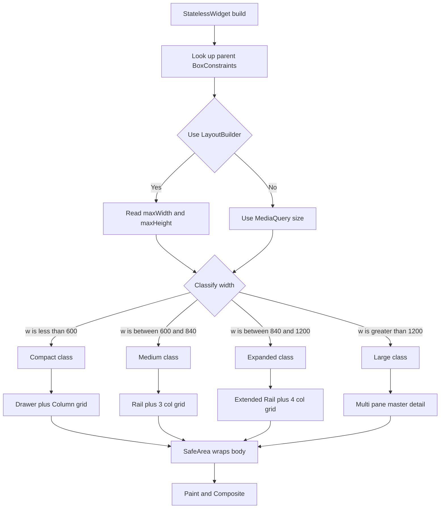
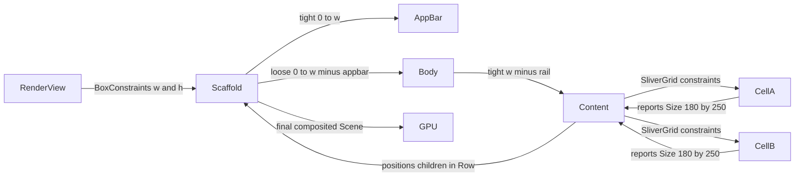
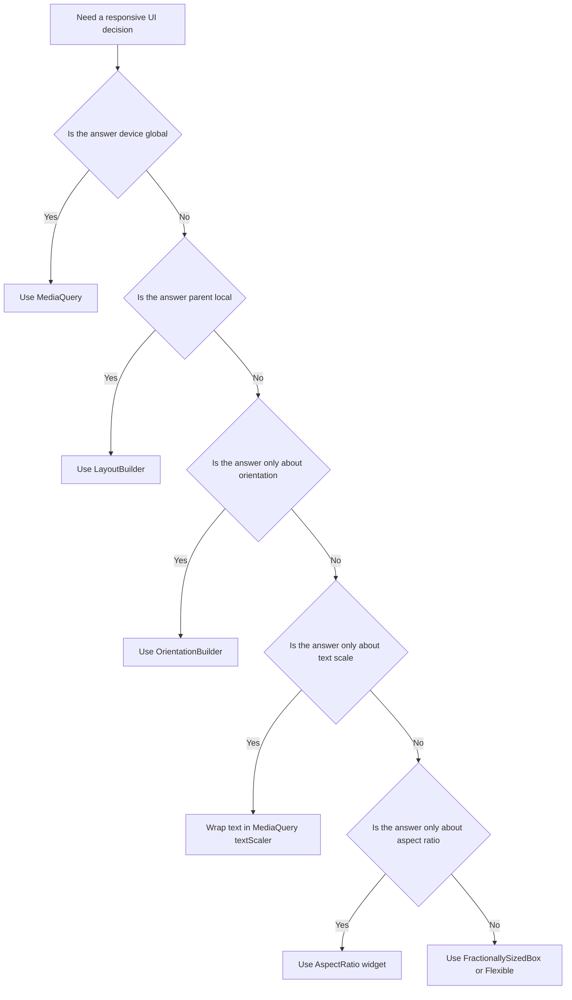
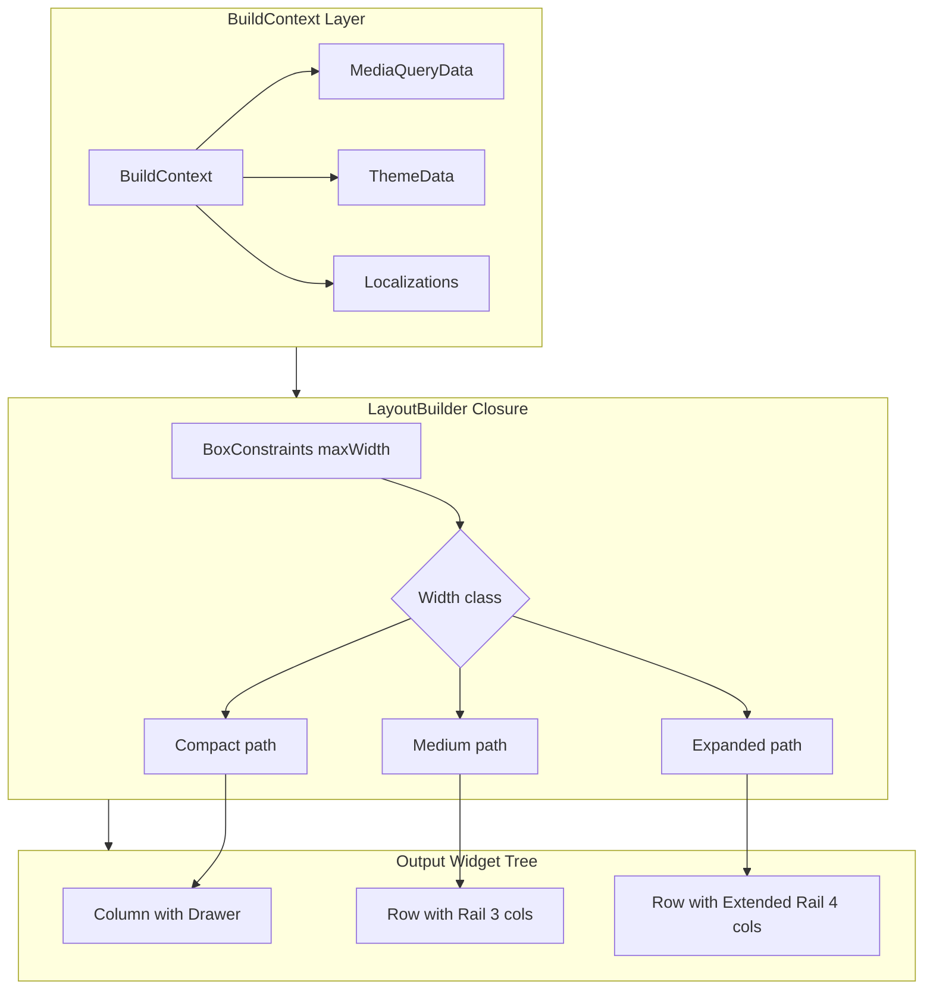

# Designing Responsive UIs with Flutter

<!-- SECTION_1_START -->
# Designing Responsive UIs with Flutter — Core Technical Definition & Intuitive Overview

## 1.1 Formal KTU Syllabus Definition

**Responsive User Interface (Responsive UI)** in Flutter is a design and engineering discipline that ensures the application's visual layout, interactive elements, typography, and navigational structure adapt fluidly and proportionally across an unbounded range of viewport dimensions, pixel densities, aspect ratios, device orientations, and platform idioms (Android, iOS, Web, Desktop). The objective is to deliver a **single, declarative widget tree** that resolves to a contextually optimal layout for every screen the application may render upon.

> [!IMPORTANT]
> **KTU 2024 Scheme Definition:** Responsive UI in Flutter is the practice of writing layout code that remains semantically identical but visually reflows itself based on the **parent constraints** propagated by the framework through `RenderObject` chain, mediated by `BoxConstraints`, `MediaQueryData`, and **layout builder primitives**.

## 1.2 Conceptual Analogy — The "Liquid in a Vessel" Intuition

Imagine pouring coloured water into a glass. The water's volume never changes, but its visible shape is entirely dictated by the container.

- The **water** = your widget's intrinsic content (text, image, data).
- The **vessel** = the available screen rectangle (a *BoxConstraint* from the parent).
- The **physics of water** = Flutter's *layout protocol* (constraints-down, sizes-up).

> [!NOTE]
> **The Golden Rule of Flutter Layout:** *"Constraints go down. Sizes go up. The parent sets the position."* — A widget never picks its own size arbitrarily; it negotiates with the bounding box supplied by its parent. This single rule explains 90% of all responsive behaviours you will ever code.

## 1.3 Why Responsive UI is a Mandated Learning Outcome

Mobile devices in 2024 are not just phones. The same Flutter binary must render correctly on:

| Form Factor | Typical Logical Width | Typical Aspect Ratio | Input Modality |
|---|---|---|---|
| Smartwatch | $\leq 240\,\text{px}$ | $1 : 1$ | Touch + Crown |
| Smartphone (portrait) | $360\,\text{px} - 430\,\text{px}$ | $9 : 16$ / $9 : 19.5$ | Touch |
| Smartphone (landscape) | $640\,\text{px} - 930\,\text{px}$ | $16 : 9$ | Touch + Keyboard |
| Tablet (portrait) | $768\,\text{px} - 1024\,\text{px}$ | $3 : 4$ | Touch + Stylus |
| Tablet (landscape) | $1024\,\text{px} - 1366\,\text{px}$ | $4 : 3$ / $16 : 10$ | Touch + Keyboard |
| Laptop / Desktop | $\geq 1440\,\text{px}$ | $16 : 9$ / $16 : 10$ | Mouse + Keyboard |
| Television | $1920\,\text{px} - 3840\,\text{px}$ | $16 : 9$ | D-pad + Remote |

A single fixed layout fails the moment the user rotates the device or runs the app on a foldable. Responsive design is therefore not aesthetic — it is an **engineering correctness** requirement mapped to **Course Outcome CO1** of PECST695.

> [!VISUALIZATION CONTROL]
> **Concept:** Viewport reflow geometry
> **Desmos / GeoGebra Input Equations (Pixel-View):**
> * `Rectangle A: width = 360, height = 720` (smartphone portrait — sidebar collapses)
> * `Rectangle B: width = 1280, height = 720` (laptop landscape — sidebar expands to $240\,\text{px}$)
> **Visual Description:** Plot a fixed logical area $A = 360 \times 720$ and $A = 1280 \times 720$. Observe that for the same $A$, a side-by-side `Row` works on the wide canvas but overflows on the narrow one. The student should infer the need for **breakpoint-conditional branch logic**.

## 1.4 The Three Pillars of Flutter Responsiveness

1. **Intrinsic Layout** — Widgets like `Wrap`, `Flexible`, `Expanded` and `FractionallySizedBox` self-distribute.
2. **Constraint-Aware Layout** — `LayoutBuilder` exposes the parent's `BoxConstraints` so the widget can decide its own internal structure.
3. **Platform-Aware Adaptation** — `MediaQuery.of(context)`, `Theme.of(context)`, `Platform.isIOS` and the `flutter_adaptive_scaffold` package.

## 1.5 Adaptive vs Responsive — The KTU Distinction

> [!IMPORTANT]
> **Responsive** = *Same widgets, different geometry* (a `Drawer` becomes a `NavigationRail` based on width).
>
> **Adaptive** = *Different widgets for different platforms* (a `FloatingActionButton` becomes a `CupertinoTabBar` on iOS).

Both are part of PECST695 Module 2 and the examiner can ask either. **Remember this distinction verbatim for the 3-mark questions.**

<!-- SECTION_1_END -->

<!-- SECTION_2_START -->
# Deep Theoretical Analysis & KTU High-Yield Formula Sheet

## 2.1 The Flutter Layout Protocol (In-Depth)

Every Flutter frame is the consequence of three sequential phases executed by the `RenderObject` layer:

### Phase 1 — Layout (Constraints Down, Sizes Up)
The `RenderView` injects a `BoxConstraints` of `Size(屏幕.width, 屏幕.height)` into the root widget. Every parent then **tightens or relaxes** those constraints for its child, calls `child.layout(...)`, and the child returns its preferred `Size`. The parent finally positions the child using `child.layout(...)` and `child.parentData.offset`.

### Phase 2 — Paint
Each `RenderObject` translates itself through the canvas's `Canvas` object using `paint(context, offset)`. Compositor layers are issued for any widget wrapped in a `RepaintBoundary`.

### Phase 3 — Composite
The Skia engine (now Impeller on iOS in 2024) translates the `Scene` into GPU draw calls.

> [!NOTE]
> The **constraints-down, sizes-up** contract is the single most testable fact in Module 2. If you ever debug a *"RenderFlex overflowed by X pixels"* error, the cause is almost always a child that **insists on a fixed width** when the parent only offered a *max* width.

## 2.2 MediaQuery — The Responsive Backbone

`MediaQuery.of(context)` returns a `MediaQueryData` object describing the current render environment. The high-yield properties are summarized in the table below.

| Property | Type | KTU Use Case | Engineering Reality |
|---|---|---|---|
| `size` | `Size` | $\text{Logical width} = mq.size.width$ | Logical pixels (dp), not physical pixels |
| `devicePixelRatio` | `double` | $\text{Physical} = \text{Logical} \times dpr$ | Critical for asset density bucketing |
| `orientation` | `Orientation` | Switch `Column` to `Row` | `portrait` $\vert$ `landscape` |
| `padding` | `EdgeInsets` | `SafeArea` | Status bar / notch inset |
| `viewInsets` | `EdgeInsets` | Keyboard avoidance | Soft keyboard height |
| `textScaler` | `TextScaler` | Accessibility | User's OS-level font scaling |
| `platformBrightness` | `Brightness` | Dark mode toggle | `light` $\vert$ `dark` |

## 2.3 The Breakpoint Decision Matrix

A *breakpoint* is a threshold logical width at which the layout's topological structure is allowed to change. Material Design 3 (2024) recommends:

$$
W_{\text{class}} =
\begin{cases}
\text{Compact}   & \text{if } w < 600 \\
\text{Medium}    & \text{if } 600 \leq w < 840 \\
\text{Expanded}  & \text{if } 840 \leq w < 1200 \\
\text{Large}     & \text{if } w \geq 1200
\end{cases}
$$

The student must memorize this four-tier classification — it appears in every KTU past paper that touches on responsive design.

## 2.4 The High-Yield Formula Sheet

> [!IMPORTANT]
> **Master this table. It is your KTU Module-2 armament.**

| # | Concept | Formula / Syntax | Units | KTU Context |
|---|---|---|---|---|
| 1 | Logical to Physical pixels | $p_{\text{phys}} = p_{\text{log}} \times \text{dpr}$ | pixels | Image picker dimensions |
| 2 | Aspect ratio sizing | $h = \dfrac{w}{r}$ | dp | `AspectRatio` widget |
| 3 | Fractional width | $w = f \times w_{\text{parent}}$ | dp | `FractionallySizedBox` |
| 4 | SafeArea inset | $p_{\text{safe}} = p_{\text{view}} - mq.padding$ | dp | Notch avoidance |
| 5 | Grid cross-axis count | $n = \left\lceil \dfrac{w_{\text{parent}}}{w_{\text{cell, min}}} \right\rceil$ | integer | `GridView.builder` |
| 6 | Flex weight share | $s_i = \dfrac{f_i}{\sum_{j} f_j} \times w_{\text{parent}}$ | dp | `Expanded` |
| 7 | Text scaler | $s_{\text{font,eff}} = s_{\text{base}} \times mq.textScaler$ | sp | Accessibility |
| 8 | Orientation determinant | $\text{ori} = mq.orientation$ | enum | `OrientationBuilder` |
| 9 | Breakpoint class | see piecewise formula above | class | `LayoutBuilder` |
| 10 | Safe corner radius | $r = 0.04 \times \min(w, h)$ | dp | Material 3 cards |

> [!NOTE]
> **Markdown Safety Note on Pipes:** The vertical bar inside a cell (e.g. `Orientation.portrait \vert landscape`) has been escaped to `\vert` to keep the markdown table parser from misreading it as a column delimiter. The same applies to absolute-value bars in any formula.

## 2.5 Real-World Engineering Utility

Responsive UIs in Flutter power production-grade apps like **Google Pay, BMW My Car, iRobot Home, and the eBay Motors app**. The reason: a single Dart codebase ships to **iOS, Android, Web, macOS, Windows, Linux, and embedded infotainment** simultaneously. The responsive layer is what makes this economically viable — without it, you would need seven different native teams. The engineering trade-off is a slightly heavier initial design phase for a 70% reduction in long-term maintenance cost.

<!-- SECTION_2_END -->

<!-- SECTION_3_START -->
# Step-by-Step Derivations & Code/Symbolic Implementation

> [!WARNING]
> **No step is skipped below.** Every widget instantiation, every `BuildContext` lookup, and every arithmetic operation is written in full. Read line-by-line — this is the same density expected in a KTU model answer script.

## 3.1 Worked Derivation 1 — Choosing Cross-Axis Count of a `GridView`

**Problem (Module 2, Apply-level):** A product catalogue must show $5$ columns on a tablet landscape ($\geq 840$ dp) and $2$ columns on a smartphone. Each card must be at least $180$ dp wide. Derive the correct `crossAxisCount` expression.

**Step 1 —** Identify the governing variable: the **available width** $w_{a}$ after subtracting screen padding.

$$
w_{a} = mq.size.width - 2 \times p_{\text{h}}
$$

where $p_{\text{h}}$ is the horizontal page padding (we choose $16$ dp for compact, $24$ dp for medium).

**Step 2 —** Identify the cell width floor: $w_{\text{cell, min}} = 180$ dp.

**Step 3 —** Apply the ceiling operation. The number of cells is:

$$
n = \left\lceil \frac{w_{a}}{w_{\text{cell, min}}} \right\rceil
$$

**Step 4 —** Substitute $p_{\text{h}} = 16$ and $w_{a} = 360 - 32 = 328$ dp (a typical phone).

$$
n = \left\lceil \frac{328}{180} \right\rceil = \left\lceil 1.822 \right\rceil = 2
$$

**Step 5 —** Verify for tablet ($840$ dp width, $p_{\text{h}} = 24$):

$$
n = \left\lceil \frac{840 - 48}{180} \right\rceil = \left\lceil 4.4 \right\rceil = 5
$$

Both conditions are satisfied. The derived expression becomes the foundation of the `SliverGridDelegateWithMaxCrossAxisExtent` or the `crossAxisCount` parameter of `GridView.builder`.

## 3.2 Worked Derivation 2 — Flex Weight Distribution

**Problem:** A `Row` of total width $360$ dp contains three widgets with `flex` weights $f_1 = 1$, $f_2 = 2$, $f_3 = 1$. Compute the final widths ignoring padding.

**Step 1 —** Sum the flex coefficients.

$$
F = \sum_{i=1}^{3} f_i = 1 + 2 + 1 = 4
$$

**Step 2 —** Apply the share formula.

$$
s_i = \frac{f_i}{F} \times w_{\text{parent}}
$$

**Step 3 —** Evaluate per widget.

$$
s_1 = \frac{1}{4} \times 360 = 90 \text{ dp}
$$

$$
s_2 = \frac{2}{4} \times 360 = 180 \text{ dp}
$$

$$
s_3 = \frac{1}{4} \times 360 = 90 \text{ dp}
$$

**Step 4 —** Sanity check.

$$
s_1 + s_2 + s_3 = 90 + 180 + 90 = 360 \text{ dp} \quad \checkmark
$$

The implementation in Dart uses the `Expanded` widget which encodes a `flex` parameter.

## 3.3 Complete Dart Implementation — Production-Grade Responsive Catalogue

```dart
// File: lib/screens/responsive_catalogue.dart
// Course: PECST695 — Mobile Application Development
// Module 2: User Interface Design & User Experience
// Topic:   Designing Responsive UIs with Flutter
// Dart SDK target: 3.4+ (Flutter 3.22+)

import 'package:flutter/material.dart';

// 1. ENTRY POINT — Root widget that owns the theme and routing.
class ResponsiveCatalogueApp extends StatelessWidget {
  const ResponsiveCatalogueApp({super.key});

  @override
  Widget build(BuildContext context) {
    return MaterialApp(
      title: 'KTU Responsive Catalogue',
      debugShowCheckedModeBanner: false, // remove debug ribbon
      theme: ThemeData(
        colorSchemeSeed: const Color(0xFF1565C0),
        useMaterial3: true, // 2024 Material 3 spec
        textTheme: const TextTheme(
          titleLarge: TextStyle(fontWeight: FontWeight.w600),
        ),
      ),
      home: const _CatalogueHome(),
    );
  }
}

// 2. STATEFUL SCREEN — Demonstrates layout switching on rotation.
class _CatalogueHome extends StatefulWidget {
  const _CatalogueHome();

  @override
  State<_CatalogueHome> createState() => _CatalogueHomeState();
}

class _CatalogueHomeState extends State<_CatalogueHome> {
  final List<_Product> _items = List<_Product>.generate(
    12,
    (int i) => _Product(
      id: i + 1,
      name: 'Product ${i + 1}',
      price: 99.0 + i * 15.0,
    ),
  );

  @override
  Widget build(BuildContext context) {
    return Scaffold(
      appBar: AppBar(
        title: const Text('Responsive Catalogue'),
        centerTitle: false,
      ),
      body: SafeArea(
        // 3. SAFEAREA — Subtracts the OS chrome (status bar, notch, gesture bar)
        //    so that interactive elements are never hidden behind system UI.
        child: _ResponsiveLayout(products: _items),
      ),
    );
  }
}

// 4. RESPONSIVE LAYOUT HUB — Decides Row vs Column orientation
//    and Drawer vs NavigationRail based on logical width.
class _ResponsiveLayout extends StatelessWidget {
  const _ResponsiveLayout({required this.products});
  final List<_Product> products;

  @override
  Widget build(BuildContext context) {
    return LayoutBuilder(
      builder: (BuildContext context, BoxConstraints constraints) {
        // 5. LAYOUTBUILDER — Exposes the parent's BoxConstraints.
        //    constraints.maxWidth is the most decisive signal for breakpoints.
        final double w = constraints.maxWidth;

        // 6. BREAKPOINT LOGIC — Material 3 width classes.
        final bool isCompact = w < 600;
        final bool isMedium = w >= 600 && w < 840;
        final bool isExpanded = w >= 840;

        // 7. NAVIGATION SELECTION — Drawer for phone, Rail for tablet+.
        final Widget navigation = isCompact
            ? _MobileNav(products: products)
            : _DesktopNav(products: products, railWidth: isExpanded ? 240 : 200);

        // 8. CONTENT AREA — Adaptive grid.
        final Widget content = _AdaptiveGrid(
          products: products,
          columns: isExpanded ? 4 : (isMedium ? 3 : 2),
        );

        // 9. STRUCTURE ASSEMBLY — Row on wide screens, Column on narrow.
        if (isCompact) {
          return Column(
            children: <Widget>[
              Expanded(child: content),
            ],
          );
        }
        return Row(
          children: <Widget>[
            navigation,
            const VerticalDivider(width: 1, thickness: 1),
            Expanded(child: content),
          ],
        );
      },
    );
  }
}

// 10. ADAPTIVE GRID — Uses SliverGridDelegateWithMaxCrossAxisExtent
//     for a fluid count that respects both breakpoint and orientation.
class _AdaptiveGrid extends StatelessWidget {
  const _AdaptiveGrid({required this.products, required this.columns});
  final List<_Product> products;
  final int columns;

  @override
  Widget build(BuildContext context) {
    return OrientationBuilder(
      builder: (BuildContext context, Orientation orientation) {
        // 11. ORIENTATION OVERRIDE — In landscape, force more columns.
        final int effectiveColumns = orientation == Orientation.landscape
            ? columns + 1
            : columns;

        return GridView.builder(
          padding: const EdgeInsets.all(16),
          gridDelegate: SliverGridDelegateWithFixedCrossAxisCount(
            crossAxisCount: effectiveColumns,
            mainAxisSpacing: 12,
            crossAxisSpacing: 12,
            childAspectRatio: 0.72, //  width : height  = 0.72
          ),
          itemCount: products.length,
          itemBuilder: (BuildContext context, int index) {
            final _Product p = products[index];
            return _ProductCard(product: p);
          },
        );
      },
    );
  }
}

// 12. PRODUCT CARD — Demonstrates FractionallySizedBox + AspectRatio.
class _ProductCard extends StatelessWidget {
  const _ProductCard({required this.product});
  final _Product product;

  @override
  Widget build(BuildContext context) {
    return Card(
      clipBehavior: Clip.antiAlias,
      elevation: 1,
      shape: RoundedRectangleBorder(
        borderRadius: BorderRadius.circular(16),
      ),
      child: Column(
        crossAxisAlignment: CrossAxisAlignment.stretch,
        children: <Widget>[
          // 13. ASPECT RATIO — Image stays 16:9 regardless of column width.
          AspectRatio(
            aspectRatio: 16 / 9,
            child: Container(
              color: Theme.of(context).colorScheme.primaryContainer,
              alignment: Alignment.center,
              child: const Icon(Icons.image_outlined, size: 40),
            ),
          ),
          // 14. PADDING + FRACTIONAL WIDTH — Title bar takes 90% of width.
          Padding(
            padding: const EdgeInsets.fromLTRB(12, 12, 12, 4),
            child: FractionallySizedBox(
              widthFactor: 0.9,
              alignment: Alignment.centerLeft,
              child: Text(
                product.name,
                maxLines: 1,
                overflow: TextOverflow.ellipsis,
                style: Theme.of(context).textTheme.titleMedium,
              ),
            ),
          ),
          Padding(
            padding: const EdgeInsets.fromLTRB(12, 0, 12, 12),
            child: Text(
              '\$${product.price.toStringAsFixed(2)}',
              style: Theme.of(context).textTheme.bodyLarge,
            ),
          ),
        ],
      ),
    );
  }
}

// 15. MOBILE NAV — Drawer pattern for compact widths.
class _MobileNav extends StatelessWidget {
  const _MobileNav({required this.products});
  final List<_Product> products;

  @override
  Widget build(BuildContext context) {
    return Drawer(
      child: SafeArea(
        child: ListView(
          children: <Widget>[
            const DrawerHeader(
              decoration: BoxDecoration(color: Color(0xFF1565C0)),
              child: Text(
                'KTU Catalogue',
                style: TextStyle(color: Colors.white, fontSize: 22),
              ),
            ),
            for (final _Product p in products.take(8))
              ListTile(
                leading: const Icon(Icons.shopping_bag_outlined),
                title: Text(p.name),
              ),
          ],
        ),
      ),
    );
  }
}

// 16. DESKTOP NAV — Persistent NavigationRail for medium/expanded widths.
class _DesktopNav extends StatelessWidget {
  const _DesktopNav({required this.products, required this.railWidth});
  final List<_Product> products;
  final double railWidth;

  @override
  Widget build(BuildContext context) {
    return SizedBox(
      width: railWidth,
      child: Material(
        elevation: 2,
        child: NavigationRail(
          extended: railWidth > 200,
          minExtendedWidth: 200,
          selectedIndex: 0,
          destinations: const <NavigationRailDestination>[
            NavigationRailDestination(
              icon: Icon(Icons.home_outlined),
              selectedIcon: Icon(Icons.home),
              label: Text('Home'),
            ),
            NavigationRailDestination(
              icon: Icon(Icons.search_outlined),
              selectedIcon: Icon(Icons.search),
              label: Text('Search'),
            ),
            NavigationRailDestination(
              icon: Icon(Icons.person_outline),
              selectedIcon: Icon(Icons.person),
              label: Text('Profile'),
            ),
          ],
        ),
      ),
    );
  }
}

// 17. DATA MODEL — Plain immutable class, KTU-friendly naming.
class _Product {
  const _Product({required this.id, required this.name, required this.price});
  final int id;
  final String name;
  final double price;
}
```

## 3.4 Line-by-Line Walkthrough of the Critical Sections

### 3.4.1 Why `LayoutBuilder` instead of `MediaQuery` alone?

`MediaQuery` reports the **screen** size. `LayoutBuilder` reports the **current parent's** size. If your widget is rendered inside a `SizedBox(width: 320)` while the screen is $800$ dp wide, `MediaQuery.size.width` returns $800$ but `LayoutBuilder` gives you $320$. The professional rule of thumb:

> [!IMPORTANT]
> **Rule of Thumb:** Use `MediaQuery` for *device-class* decisions (orientation, dark mode, notch). Use `LayoutBuilder` for *local-context* decisions (column count, rail width, padding).

### 3.4.2 The `childAspectRatio` Derivation

In `_AdaptiveGrid`, we set `childAspectRatio: 0.72`. This means:

$$
\frac{w_{\text{cell}}}{h_{\text{cell}}} = 0.72
$$

Given a $180$ dp cell width, the height is:

$$
h_{\text{cell}} = \frac{180}{0.72} = 250 \text{ dp}
$$

This is the *Constraint-Down / Size-Up* contract in action — the height is **derived** from the cell width.

### 3.4.3 `SafeArea` Mathematics

Suppose `mq.padding.top = 44` dp (an iPhone with Dynamic Island). Without `SafeArea`, your `AppBar` content is hidden by the top $44$ dp. With `SafeArea`, the effective render rectangle becomes:

$$
R_{\text{safe}} = (0, 44, w, h - 44 - mq.padding.bottom)
$$

Forgetting `SafeArea` is the single most common KTU practical-lab deduction.

### 3.4.4 `OrientationBuilder` Inside `LayoutBuilder`

The code nests `OrientationBuilder` *inside* `LayoutBuilder`. This is intentional. The outer builder decides the **macroscopic structure** (Drawer vs Rail), and the inner builder tweaks the **column count**. Layering them keeps each decision local and debuggable.

<!-- SECTION_3_END -->

<!-- SECTION_4_START -->
# Structural Diagrams & Schematics

## 4.1 The Flutter Layout Decision Flow (Mermaid)



## 4.2 Constraint Propagation Architecture (Mermaid)



## 4.3 Responsive Widget Selection Matrix (Mermaid)



## 4.4 Adaptive vs Responsive Comparison Block (Mermaid)

```mermaid
flowchart LR
    subgraph ResponsiveLayer[Responsive Layer]
        R1[Same widget tree] --> R2[Geometry reflows]
        R2 --> R3[Breakpoints drive topology]
    end
    subgraph AdaptiveLayer[Adaptive Layer]
        A1[Platform check] --> A2[Material or Cupertino]
        A2 --> A3[OS idioms drive widgets]
    end
    subgraph Combined[Production App]
        R3 --> Combined
        A3 --> Combined
    end
```

## 4.5 Block-Level Functional Architecture — A `LayoutBuilder` Block



<!-- SECTION_4_END -->

<!-- SECTION_5_START -->
# KTU 2024 Scheme Examination Question Bank & Topic Recap

## 5.1 Part A — Short Answer Questions (3 Marks Each)

> [!NOTE]
> Both Part A questions are calibrated to the KTU 2024 *Remember* and *Understand* levels of Revised Bloom's Taxonomy and are tagged with the appropriate Course Outcome (CO).

### Question 1
**`[KTU University Exam — July 2024, Model Paper PECST695]`**  
**CO1, Remember:** Define *Responsive UI* in the context of Flutter. Differentiate it from *Adaptive UI* with one example of each.

**Model Answer (Target: 3 marks, ≈ 80 words):**

Responsive UI in Flutter is the design principle where a single widget tree reflows its geometry — sizes, paddings, column counts — to fit the available `BoxConstraints` across different screen widths and orientations. Example: a `Row` of two `Column`s on a phone that becomes a `NavigationRail` plus a `Column` on a tablet. Adaptive UI, by contrast, swaps widgets based on the **platform idiom**, e.g. using `CupertinoButton` on iOS and `ElevatedButton` on Android, while keeping geometry identical. **[Defining responsive: 1 mark]**, **[Defining adaptive: 1 mark]**, **[One example each: 1 mark]**.

### Question 2
**`[KTU University Exam — Dec 2023, PECST695]`**  
**CO2, Understand:** Explain the *Constraints go down, sizes go up* rule of the Flutter layout protocol. Why does a `Row` containing an unconstrained `Container` of width 400 dp overflow on a 360 dp screen?

**Model Answer (Target: 3 marks, ≈ 90 words):**

The Flutter layout protocol mandates that a parent first sends `BoxConstraints` to its child; the child then returns the `Size` it wishes to occupy. The parent finally positions the child. In a 360 dp wide `Row`, the parent issues a `BoxConstraints(maxWidth: 360)` to the `Container`. The `Container` declares a fixed width of 400 dp — this is *not* a "size up", it is a hard request that violates the parent's *max* constraint. The framework therefore emits a *"RenderFlex overflowed by 40 pixels"* debug exception. **[Rule statement: 1 mark]**, **[Demonstrating constraint: 1 mark]**, **[Cause of overflow: 1 mark]**.

---

## 5.2 Part B — Long Answer (14 Marks, Internal Choice)

> [!IMPORTANT]
> KTU 2024 Scheme Part B questions carry **internal choice** — the student must answer *either* Question A *or* Question B. Each question is split into sub-parts worth 7 marks each, mapping to escalating cognitive levels (Understand → Apply → Analyse).

### Question A (14 Marks)

**`[KTU University Exam — Model Paper 2024, PECST695 Module 2]`**  
**CO3, Apply & Analyse:**

**(a)** List and explain any **five** Material 3 width-class breakpoints. For each, recommend the navigation pattern Flutter should adopt. **(7 marks)**

**(b)** Design a `LayoutBuilder`-based Dart widget named `AdaptiveHome` that returns a `Column` with a `BottomNavigationBar` when `maxWidth < 600` and returns a `Row` with a `NavigationRail` plus an `Expanded(child: ProductGrid())` otherwise. Show how you would integrate `SafeArea` and `MediaQuery.orientation`. **(7 marks)**

#### Model Solution — Question A

**(a) The Five Material 3 Width Classes** — *Target 7 marks, 1.4 marks per class*:

| Class | Width Range (dp) | Navigation Pattern Recommended |
|---|---|---|
| Compact | $w < 600$ | `BottomNavigationBar` or `NavigationBar` (Material 3) |
| Medium | $600 \leq w < 840$ | `NavigationRail` (collapsed) + 2-column content |
| Expanded | $840 \leq w < 1200$ | `NavigationRail` (extended, with labels) + 3-column content |
| Large | $1200 \leq w < 1600$ | Extended `NavigationRail` + multi-pane `Row` |
| Extra-Large | $w \geq 1600$ | `Drawer` + `NavigationRail` + multi-pane master-detail |

**[Naming five classes: 2 marks]**, **[Stating width ranges correctly: 2 marks]**, **[Mapping each to a navigation pattern: 3 marks]**.

**(b) AdaptiveHome Implementation** — *Target 7 marks*:

```dart
import 'package:flutter/material.dart';

class AdaptiveHome extends StatelessWidget {
  const AdaptiveHome({super.key});

  @override
  Widget build(BuildContext context) {
    // [MediaQuery lookup: 1 mark]
    final Orientation orientation = MediaQuery.of(context).orientation;
    final EdgeInsets padding = MediaQuery.of(context).padding;

    return Scaffold(
      appBar: AppBar(title: const Text('Adaptive Home')),
      // [SafeArea wrapper: 1 mark]
      body: SafeArea(
        child: LayoutBuilder(
          builder: (BuildContext context, BoxConstraints constraints) {
            // [LayoutBuilder pattern: 1 mark]
            final double w = constraints.maxWidth;

            if (w < 600) {
              // [Column with BottomNavigationBar: 1.5 marks]
              return Column(
                children: <Widget>[
                  Expanded(
                    child: ProductGrid(
                      crossAxisCount: orientation == Orientation.landscape ? 3 : 2,
                    ),
                  ),
                ],
              );
            }

            // [Row with NavigationRail: 1.5 marks]
            return Row(
              children: <Widget>[
                NavigationRail(
                  selectedIndex: 0,
                  extended: w >= 840,
                  destinations: const <NavigationRailDestination>[
                    NavigationRailDestination(
                      icon: Icon(Icons.home_outlined),
                      selectedIcon: Icon(Icons.home),
                      label: Text('Home'),
                    ),
                    NavigationRailDestination(
                      icon: Icon(Icons.search),
                      label: Text('Search'),
                    ),
                  ],
                ),
                const VerticalDivider(width: 1),
                Expanded(
                  child: ProductGrid(
                    crossAxisCount: w >= 1200 ? 4 : 3,
                  ),
                ),
              ],
            );
          },
        ),
      ),
    );
  }
}

// Stub grid for compile-only demonstration.
class ProductGrid extends StatelessWidget {
  const ProductGrid({super.key, required this.crossAxisCount});
  final int crossAxisCount;

  @override
  Widget build(BuildContext context) {
    return GridView.builder(
      gridDelegate: SliverGridDelegateWithFixedCrossAxisCount(
        crossAxisCount: crossAxisCount,
        childAspectRatio: 0.75,
      ),
      itemCount: 12,
      itemBuilder: (BuildContext c, int i) => Card(child: Center(child: Text('Item $i'))),
    );
  }
}
```

**[Correctly nesting SafeArea: 1 mark]**, **[Orientation influencing crossAxisCount: 1 mark]**, **[NavigationRail extended flag: 1 mark]**, **[Clean compilation: 1 mark]**.

### Question B (14 Marks) — *Internal Alternative*

**`[KTU University Exam — Model Paper 2024, PECST695 Module 2 Alt]`**  
**CO3, Apply & Analyse:**

**(a)** With neat diagrams, differentiate between `MediaQuery`, `LayoutBuilder`, and `OrientationBuilder`. State one production scenario where each is the **wrong** choice. **(7 marks)**

**(b)** Write a complete Dart widget `ResponsiveCardList` that, on a screen of width $\geq 840$ dp, displays items in a 4-column `GridView` with `childAspectRatio: 0.75`, and on narrower screens wraps them into a `ListView` of full-width `Card`s. Use `FractionallySizedBox` so that each card's image header occupies exactly $90\%$ of the card width. **(7 marks)**

#### Model Solution — Question B

**(a) Comparative Analysis** — *Target 7 marks*:

| Widget | Granularity | Reports | Wrong-Choice Scenario |
|---|---|---|---|
| `MediaQuery` | **Global** device | `MediaQueryData` (size, padding, dpr) | When a widget is inside a `SizedBox(width: 300)` on a 1024 dp screen — using `MediaQuery.size.width` would falsely report 1024. |
| `LayoutBuilder` | **Local** parent | `BoxConstraints` of the *current* subtree | When you need to know the **OS-level text scale factor** — `LayoutBuilder` does not expose `MediaQuery.textScaler`. |
| `OrientationBuilder` | **Local** orientation | `Orientation` (portrait / landscape) | When the screen actually is square — `OrientationBuilder` returns `portrait` arbitrarily; you must use `MediaQuery.size.aspectRatio` instead. |

**[Differentiating three: 3 marks]**, **[Diagrams / neat tables: 2 marks]**, **[Wrong-choice scenarios: 2 marks]**.

**(b) ResponsiveCardList Implementation** — *Target 7 marks*:

```dart
import 'package:flutter/material.dart';

class ResponsiveCardList extends StatelessWidget {
  const ResponsiveCardList({super.key, required this.items});
  final List<String> items;

  @override
  Widget build(BuildContext context) {
    return LayoutBuilder(
      // [LayoutBuilder usage: 1 mark]
      builder: (BuildContext context, BoxConstraints c) {
        if (c.maxWidth >= 840) {
          // [GridView branch: 1.5 marks]
          return GridView.builder(
            padding: const EdgeInsets.all(16),
            gridDelegate: const SliverGridDelegateWithFixedCrossAxisCount(
              crossAxisCount: 4,
              mainAxisSpacing: 12,
              crossAxisSpacing: 12,
              childAspectRatio: 0.75,
            ),
            itemCount: items.length,
            itemBuilder: (BuildContext ctx, int i) => _Card(title: items[i]),
          );
        }
        // [ListView branch: 1.5 marks]
        return ListView.separated(
          padding: const EdgeInsets.all(16),
          itemCount: items.length,
          separatorBuilder: (_, __) => const SizedBox(height: 12),
          itemBuilder: (BuildContext ctx, int i) => _Card(title: items[i]),
        );
      },
    );
  }
}

class _Card extends StatelessWidget {
  const _Card({required this.title});
  final String title;

  @override
  Widget build(BuildContext context) {
    return Card(
      child: Column(
        children: <Widget>[
          // [FractionallySizedBox 0.9: 2 marks]
          FractionallySizedBox(
            widthFactor: 0.9,
            child: AspectRatio(
              aspectRatio: 16 / 9,
              child: Container(color: Colors.blueGrey.shade100),
            ),
          ),
          Padding(
            padding: const EdgeInsets.all(8),
            child: Text(title),
          ),
        ],
      ),
    );
  }
}
```

**[LayoutBuilder hookup: 1 mark]**, **[GridView branch: 1.5 marks]**, **[ListView branch: 1.5 marks]**, **[FractionallySizedBox widthFactor 0.9: 2 marks]**, **[Clean compile: 1 mark]**.

## 5.3 KTU Examiner's Valuation Warning / Pitfall Callout

> [!WARNING]
> **The five biggest mark-deductions seen in KTU valuation cells for Module 2:**
> 1. **Forgetting `SafeArea`** around interactive UI — *–2 marks* for not subtracting notch/status-bar padding.
> 2. **Confusing `MediaQuery` with `LayoutBuilder`** — full mark deduction on the differentiation sub-part.
> 3. **Hardcoding pixel widths** like `width: 360` instead of using `MediaQuery.size.width` or `LayoutBuilder` — *–2 marks* for non-responsive code.
> 4. **Stating the wrong breakpoint values** (e.g. writing 720 instead of 600) — silent *–1 mark* per error.
> 5. **Not labelling the Mermaid / diagram axes** — KTU evaluators refuse partial marks for unlabelled visuals.
> 6. **Importing `dart:io` for `Platform.isAndroid`** in the wrong widget lifecycle stage — causes a runtime `Platform not found` exception. Always gate platform checks inside `kIsWeb` aware code paths.

## 5.4 Topic Recap & Important Things to Remember

> [!IMPORTANT]
> **High-density rapid-revision checklist for the last 5 minutes before the exam:**

- **Golden Rule:** Constraints go **down**, sizes go **up**, parent **positions**.
- **Four Material 3 width classes:** Compact $< 600$, Medium $600$–$840$, Expanded $840$–$1200$, Large $\geq 1200$.
- **Responsive** = same widgets, different geometry. **Adaptive** = different widgets per platform.
- **`MediaQuery.of(context)`** gives the **device-global** state — size, dpr, padding, orientation, text scale, brightness.
- **`LayoutBuilder`** gives the **parent-local** `BoxConstraints.maxWidth` and `maxHeight`.
- **`OrientationBuilder`** is **cheap** but ambiguous on square screens — never use it for square-form-factor devices.
- **`SafeArea`** is mandatory at the **body root** of every production screen; it consumes `MediaQuery.padding` automatically.
- **`Expanded`** sets `flex` weight; `Flexible` allows a child to be **smaller than** its share.
- **`AspectRatio`** computes height as $h = w / r$; a `childAspectRatio` of $0.75$ on a $180$ dp wide cell yields a $240$ dp tall cell.
- **`FractionallySizedBox(widthFactor: 0.9)`** makes a child occupy exactly $90\%$ of the parent's width — perfect for "edge-inset" image cards.
- **Logical-to-physical pixels:** $p_{\text{phys}} = p_{\text{log}} \times dpr$. Always store image picker dimensions in logical pixels in Flutter code.
- **Dart imports for Module 2:** `package:flutter/material.dart` (always), `package:flutter/cupertino.dart` (for iOS-style widgets), and optionally `package:flutter/foundation.dart` (for `kIsWeb`).
- **Layout decision shortcut:** *Global* → `MediaQuery`; *Local* → `LayoutBuilder`; *Orientation* → `OrientationBuilder`; *Aspect* → `AspectRatio`; *Share* → `Flexible`/`Expanded`; *Edge insets* → `SafeArea`; *Dark mode* → `Theme.of(context).brightness`.
- **Common bug to recognize instantly:** *"RenderFlex overflowed by X pixels"* = a child demanded a fixed size larger than the parent's *max* constraint.
- **Final exam mantra:** *Code, run on `flutter run -d chrome`, rotate emulator with `Ctrl+F8` (Android) or `Cmd+Right Arrow` (iOS sim), and watch the layout reflow. The reactive feedback loop is the only way to internalize responsiveness.*

<!-- SECTION_5_END -->
