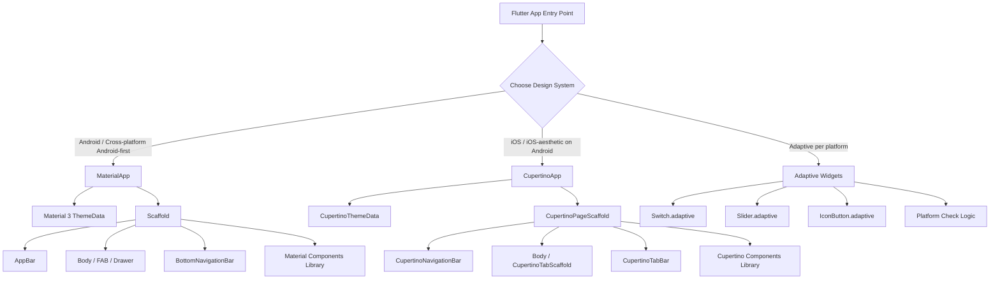
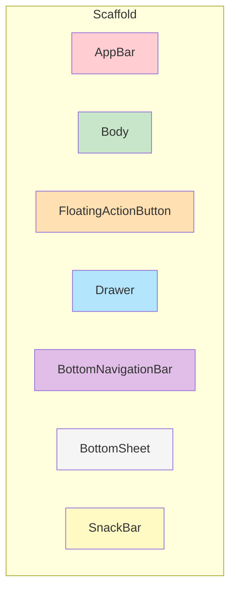
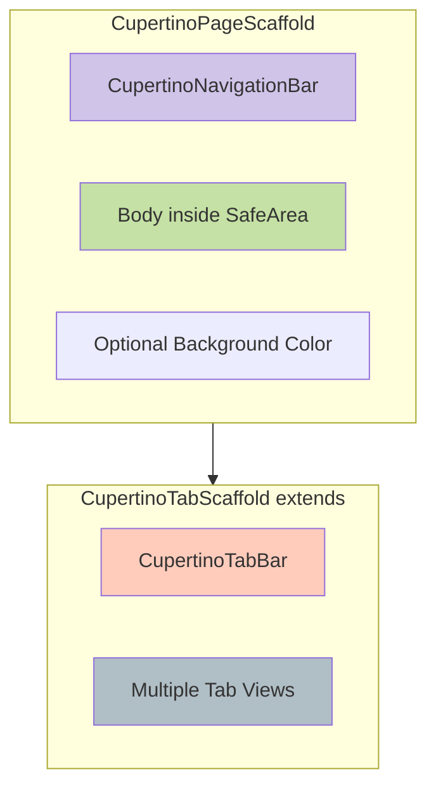
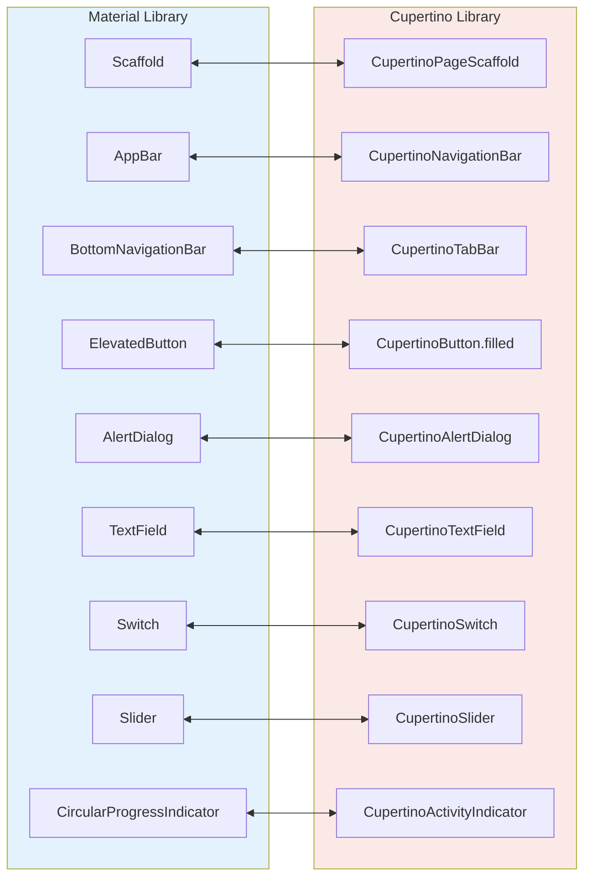
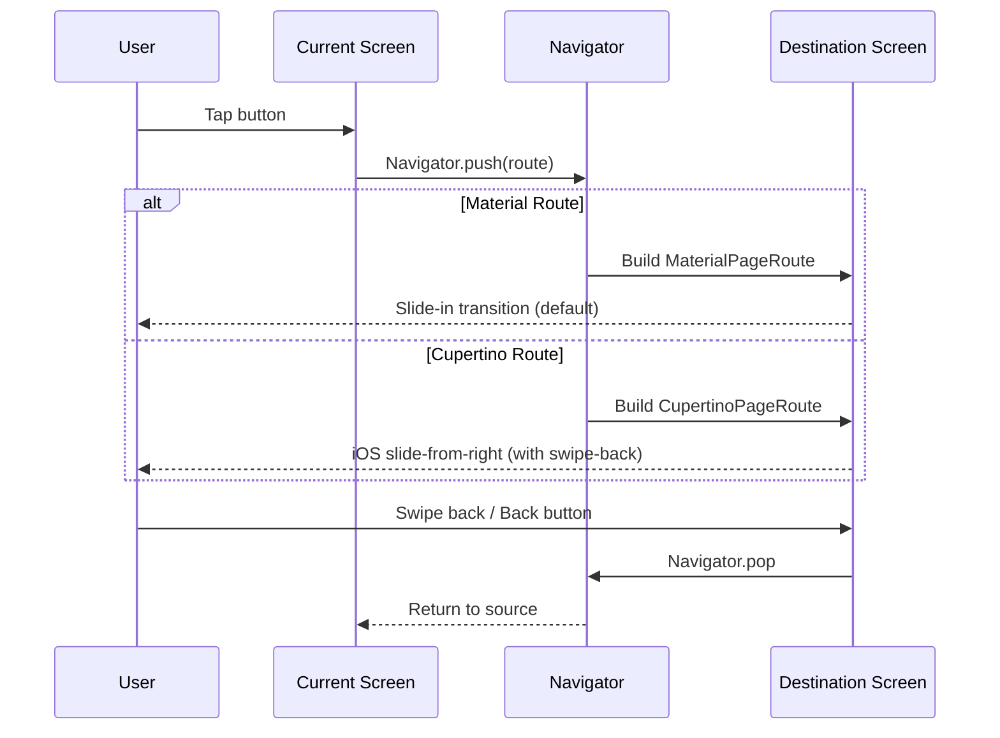
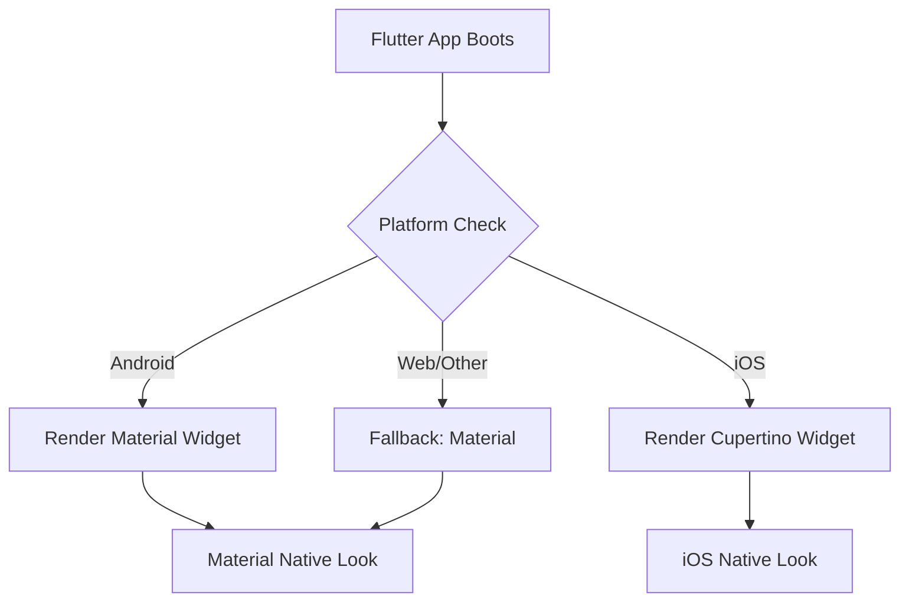

# Introduction to Material Design and Cupertino Widgets

<!-- SECTION_1_START -->
# Introduction to Material Design and Cupertino Widgets

## 1.1 Core Technical Definition (KTU 2024 Syllabus Terminology)

**Material Design** is an open-source, unified design system created by **Google** in 2014 that synthesizes the classic principles of good design with the innovation of technology and science. It is a visual, motion, and interaction design language that enables developers to build cohesive, high-quality digital experiences across Android, iOS, Flutter, and the web.

> [!IMPORTANT]
> **KTU Definition (PECST695 – Module 2):** *Material Design is a design language developed by Google that provides guidelines for UI/UX, typography, color usage, elevation, motion, and component behavior. In Flutter, it is implemented as the `material` library and primarily used for Android-targeting applications.*

**Cupertino Widgets** are a set of iOS-style design components in Flutter that implement Apple's **Human Interface Guidelines (HIG)**. They are part of the `cupertino` library and provide a native iOS look-and-feel for applications built using Flutter.

> [!IMPORTANT]
> **KTU Definition:** *Cupertino is a Flutter library that provides widgets conforming to Apple's iOS design language (HIG). These widgets are essential when developing applications specifically targeting iOS platforms or when the application needs a cross-platform native iOS aesthetic on both iOS and Android devices.*

> [!NOTE]
> Both design systems are **platform-aware design languages** — Material Design for Android and Cupertino for iOS. Flutter, being cross-platform, ships with both libraries, allowing developers to choose a design paradigm based on the target platform or business requirements.

---

## 1.2 Conceptual Analogy / Intuition

Think of **building a house**:

- **Material Design** is like building a house with Google's blueprint. Every room (screen), every door (button), and every window (input) follows Google's standardized architectural style — open floor plans, bold colors, elevations (shadows), and z-depth layers.
- **Cupertino Widgets** are like building a house following Apple's blueprint. The rooms are more minimalistic, the doors have rounded corners, the typography is sleek, and the navigation is governed by different rules (e.g., a back swipe gesture instead of a hardware/system back button).

Imagine a **restaurant menu**:
- **Material** is the menu you get in a modern, vibrant, casual diner — bold typography, vivid colors, large imagery.
- **Cupertino** is the menu in a fine-dining restaurant — minimal, elegant, mostly white space, subtle typography.

> [!NOTE]
> **Why two libraries in Flutter?**
> A single Flutter codebase can dynamically render **Material** widgets on Android (since Android natively uses Material) and **Cupertino** widgets on iOS (since iOS natively uses Cupertino/HIG). This ensures **platform fidelity**.

---

## 1.3 Physical Constants and Standard Metrics

> [!TIP]
> **Material Design 3 (M3) Standard Metrics:**
> - **Primary Color:** Brand-driven (default seed-based dynamic color)
> - **Elevation (z-depth):** $0$ dp to $24$ dp (measured in **density-independent pixels**)
> - **Corner Radius:** $4$ dp, $8$ dp, $12$ dp, $16$ dp, $28$ dp
> - **Touch Target:** Minimum **48 dp × 48 dp**
> - **Grid baseline:** **8 dp** (with 4 dp half-baseline)
> - **Typography Scale:** Display, Headline, Title, Body, Label (5 categories, each with Large/Medium/Small)
> - **Stateful Elevation:** $1$ dp resting $\to$ $8$ dp on hover/press

> [!TIP]
> **Apple Human Interface Guidelines (HIG) Metrics:**
> - **Corner Radius:** $10$ pt continuous (squircles) for iOS 13+
> - **Touch Target:** Minimum **44 pt × 44 pt**
> - **Grid baseline:** **8 pt** (with 4 pt half-baseline)
> - **Typography:** San Francisco (SF Pro) system font, Dynamic Type support
> - **Vibrancy & Translucency:** Yes (backdrop blur effects)

> [!WARNING]
> **Density Independence:** $1$ dp $\neq$ $1$ px. The conversion is $px = dp \times (dpi / 160)$. Always design in dp/pt to ensure consistent rendering across devices.

---

## 1.4 Visualization: Elevation Hierarchy in Material Design

> [!VISUALIZATION CONTROL]
> **Concept:** Material Design 3D elevation layers (z-axis stacking)
> **GeoGebra / Desmos Input Equations:**
> * `E(x) = 2 * sin(x) + 4` (elevation curve)
> * `E(x) = 0.5 * x + 1` (linear resting elevation)
> **Visual Description:** Plot z-axis elevation on the y-axis. Observe how Cards rest at $1$ dp, AppBars at $4$ dp, FloatingActionButtons at $6$ dp, and Dialogs/Modals at $24$ dp. The student should observe a discrete, step-wise jump — Material elevations are **discrete integer levels**, not continuous.

<!-- SECTION_1_END -->

<!-- SECTION_2_START -->
# Deep Theoretical Analysis & KTU High-Yield Cheat Sheet

## 2.1 Material Design: Theoretical Foundation

Material Design is grounded in **three core principles**:

### A. Material as a Metaphor
Surfaces and edges provide **visual cues** grounded in real-world physics. Surfaces have a **z-axis depth** (elevation), reflecting light and casting shadows. This is inspired by paper and ink.

### B. Bold, Graphic, Intentional
- **Typography:** Roboto (now Google Sans, Roboto Flex). Weight, size, and color are deliberate.
- **Color:** A primary palette with a primary, secondary, tertiary, and error color, each with tonal variants.
- **Iconography:** Material Symbols (variable-axis icons).

### C. Motion Provides Meaning
Motion is **choreographed**, not decorative. It has:
- **Easing curves:** Standard easing $c(t) = 0.4, 0.0, 0.2, 1.0$ (cubic-bezier)
- **Duration:** Micro ($100$ ms), Short ($200$ ms), Medium ($300$ ms), Long ($400$ ms)
- **Choreography:** Shared element transitions via `Hero` widget.

---

### Key Material Widgets in Flutter

| Widget | Purpose | KTU Important Properties |
|---|---|---|
| `MaterialApp` | Root widget binding Material design | `home`, `theme`, `routes`, `title` |
| `Scaffold` | Implements basic Material layout structure | `appBar`, `body`, `floatingActionButton`, `drawer`, `bottomNavigationBar` |
| `AppBar` | Top app bar (title + actions) | `title`, `actions`, `leading`, `backgroundColor` |
| `FloatingActionButton` (FAB) | Primary action button | `onPressed`, `child`, `tooltip`, `backgroundColor` |
| `Drawer` | Side navigation panel | `child`, `elevation` |
| `BottomNavigationBar` | Bottom navigation tabs | `items`, `currentIndex`, `onTap` |
| `Card` | Rounded surface with elevation | `elevation`, `child`, `shape` |
| `ListTile` | Single row in a list | `title`, `subtitle`, `leading`, `trailing` |
| `TextField` | Material text input | `decoration`, `controller`, `validator` |
| `ElevatedButton` | Filled, elevated button | `onPressed`, `child`, `style` |
| `IconButton` | Circular, icon-only button | `onPressed`, `icon` |
| `SnackBar` | Brief message at bottom | `content`, `action`, `duration` |
| `AlertDialog` | Modal dialog | `title`, `content`, `actions` |
| `TabBar` / `TabBarView` | Tabbed interface | `tabs`, `controller` |

---

## 2.2 Cupertino Widgets: Theoretical Foundation

Cupertino is based on **Apple's Human Interface Guidelines (HIG)**. Key principles include:
- **Clarity:** Text is legible, icons are precise, adornments are subtle.
- **Deference:** UI helps people understand and interact with content, but never competes with it.
- **Depth:** Visual layers and realistic motion convey hierarchy.

### Key Cupertino Widgets in Flutter

| Widget | Purpose | Material Counterpart |
|---|---|---|
| `CupertinoApp` | Root widget binding iOS design | `MaterialApp` |
| `CupertinoPageScaffold` | Basic iOS layout structure | `Scaffold` |
| `CupertinoNavigationBar` | Top nav bar (large title capable) | `AppBar` |
| `CupertinoTabScaffold` | Tabbed iOS root layout | `BottomNavigationBar` |
| `CupertinoTabBar` | Bottom tab bar (iOS style) | `BottomNavigationBar` |
| `CupertinoButton` | iOS-style button (text or filled) | `TextButton` / `ElevatedButton` |
| `CupertinoTextField` | iOS-style text input | `TextField` |
| `CupertinoAlertDialog` | iOS alert dialog | `AlertDialog` |
| `CupertinoActionSheet` | Bottom action sheet | `showModalBottomSheet` |
| `CupertinoActivityIndicator` | iOS spinner | `CircularProgressIndicator` |
| `CupertinoSwitch` | iOS-style toggle switch | `Switch` |
| `CupertinoSlider` | iOS-style slider | `Slider` |
| `CupertinoPicker` | iOS-style wheel picker | `DropdownButton` |
| `CupertinoDatePicker` | iOS date/time picker | `showDatePicker` |
| `CupertinoIcons` | Icon font for iOS | `Icons` |
| `CupertinoSegmentedControl` | iOS segmented control | none (Material has `ToggleButtons`) |
| `CupertinoListSection` | iOS 14+ grouped list | `ListView` |
| `CupertinoListTile` | iOS list row | `ListTile` |
| `CupertinoContextMenu` | Long-press iOS context menu | `PopupMenuButton` |
| `CupertinoPopupSurface` | Popup with iOS blur | `Dialog` |
| `CupertinoSearchTextField` | iOS search bar | `SearchBar` |

---

## 2.3 KTU High-Yield Comparison Table

| Aspect | Material Design | Cupertino |
|---|---|---|
| **Origin** | Google (2014) | Apple (HIG) |
| **Target Platform** | Android (also web, iOS via Flutter) | iOS (also Android via Flutter) |
| **Root Widget** | `MaterialApp` | `CupertinoApp` |
| **Primary Color** | Dynamic, seed-based (M3) | `CupertinoColors.systemBlue` (`#007AFF`) |
| **Typography** | Roboto / Google Sans | San Francisco (SF Pro) |
| **Corner Radius** | M3: $4, 8, 12, 16, 28$ dp | Continuous $10$ pt (squircles) |
| **Touch Target** | $48 \times 48$ dp | $44 \times 44$ pt |
| **Elevation** | Discrete, $0$–$24$ dp (shadows) | Subtle, mostly via blur/translucency |
| **Back Navigation** | Hardware/Software back button + AppBar back arrow | Swipe-from-left-edge gesture (no arrow by default) |
| **Dialog Style** | Centered, elevated | Centered with rounded corners + iOS blur |
| **Switch Style** | Track + thumb with track outline | Pill-shaped, colored when on |
| **Pull-to-refresh** | Material default (purple ripple) | iOS-style rubber band |
| **Theme Switching** | `ThemeData` (light/dark) | `CupertinoThemeData` (light/dark) |
| **Recommended For** | Android-first apps, cross-platform with Android focus | iOS-first apps, iOS aesthetic on Android |

---

## 2.4 Real-World Engineering Utility

> [!TIP]
> **When to choose Material in production:**
> - App is targeted at Android users primarily.
> - You need deep integration with Android system features (Material You dynamic theming, Material 3 expressive shapes).
> - You want a unified cross-platform feel using **adaptive widgets** (e.g., `Switch.adaptive`).

> [!TIP]
> **When to choose Cupertino in production:**
> - App is targeted at iOS users, or you need an iOS-style app on Android (e.g., Telegram's iOS-style Android version uses Cupertino).
> - You want to enforce a strict design language across teams.
> - You are implementing platform-specific flows (e.g., a payment screen in an iOS-feel app).

> [!NOTE]
> **Adaptive Widget Pattern:** Use `.adaptive` constructors (e.g., `IconButton.adaptive`, `Switch.adaptive`, `Slider.adaptive`) to let Flutter automatically pick Material on Android and Cupertino on iOS at runtime.

---

## 2.5 Engineering Decision Matrix

| Scenario | Recommendation | Justification |
|---|---|---|
| Single-platform Android app | Pure `MaterialApp` | Native fidelity, Material You support |
| Single-platform iOS app | Pure `CupertinoApp` | Native fidelity, HIG compliance |
| Cross-platform with same look | Pick one (Material or Cupertino) globally | UX consistency |
| Cross-platform with native look | Use `.adaptive` widgets and platform checks (`Theme.of(context).platform`) | Platform fidelity |
| Hybrid (Material scaffold + Cupertino controls) | Wrap Cupertino controls in `Material` parent | Avoid theme conflicts |

<!-- SECTION_2_END -->

<!-- SECTION_3_START -->
# Step-by-Step Derivations & Code Implementation

## 3.1 Foundation: Anatomy of `MaterialApp` and `CupertinoApp`

### 3.1.1 Complete `MaterialApp` Skeleton (Flutter)

```dart
import 'package:flutter/material.dart';

void main() {
  runApp(const MyMaterialApp());
}

class MyMaterialApp extends StatelessWidget {
  const MyMaterialApp({super.key});

  @override
  Widget build(BuildContext context) {
    return MaterialApp(
      // 1. Application title (used by OS task switcher / a11y)
      title: 'KTU Material Demo',

      // 2. Theme - Material 3 enabled via useMaterial3: true
      theme: ThemeData(
        useMaterial3: true,
        colorSchemeSeed: const Color(0xFF0066CC),
        brightness: Brightness.light,
      ),
      darkTheme: ThemeData(
        useMaterial3: true,
        colorSchemeSeed: const Color(0xFF0066CC),
        brightness: Brightness.dark,
      ),

      // 3. Named routes for navigation
      routes: {
        '/': (context) => const HomeScreen(),
        '/details': (context) => const DetailsScreen(),
      },

      // 4. Initial route
      initialRoute: '/',

      // 5. Debug banner toggle
      debugShowCheckedModeBanner: false,
    );
  }
}
```

### 3.1.2 Complete `CupertinoApp` Skeleton (Flutter)

```dart
import 'package:flutter/cupertino.dart';

void main() {
  runApp(const MyCupertinoApp());
}

class MyCupertinoApp extends StatelessWidget {
  const MyCupertinoApp({super.key});

  @override
  Widget build(BuildContext context) {
    return CupertinoApp(
      title: 'KTU Cupertino Demo',

      // iOS theme
      theme: const CupertinoThemeData(
        primaryColor: CupertinoColors.systemBlue,
        brightness: Brightness.light,
        scaffoldBackgroundColor: CupertinoColors.systemBackground,
        textTheme: CupertinoTextThemeData(
          primaryColor: CupertinoColors.systemBlue,
        ),
      ),

      // Routing
      initialRoute: '/',
      onGenerateRoute: (settings) {
        switch (settings.name) {
          case '/':
            return CupertinoPageRoute(
              builder: (context) => const HomeScreenIOS(),
            );
          case '/details':
            return CupertinoPageRoute(
              builder: (context) => const DetailsScreenIOS(),
            );
          default:
            return null;
        }
      },

      debugShowCheckedModeBanner: false,
    );
  }
}
```

---

## 3.2 Building a Material Home Screen with Scaffold

```dart
class HomeScreen extends StatelessWidget {
  const HomeScreen({super.key});

  @override
  Widget build(BuildContext context) {
    return Scaffold(
      // 1. AppBar with title and actions
      appBar: AppBar(
        title: const Text('Material Home'),
        backgroundColor: Theme.of(context).colorScheme.primaryContainer,
        actions: [
          IconButton(
            icon: const Icon(Icons.search),
            onPressed: () {
              // Handle search action
            },
          ),
          IconButton(
            icon: const Icon(Icons.more_vert),
            onPressed: () {
              // Handle overflow menu
            },
          ),
        ],
      ),

      // 2. Body content
      body: Center(
        child: Column(
          mainAxisAlignment: MainAxisAlignment.center,
          children: [
            const Icon(Icons.flutter_dash, size: 96),
            const SizedBox(height: 16),
            Text(
              'Welcome to Material Design',
              style: Theme.of(context).textTheme.headlineSmall,
            ),
            const SizedBox(height: 8),
            const Text('KTU PECST695 - Module 2'),
          ],
        ),
      ),

      // 3. Floating Action Button (primary action)
      floatingActionButton: FloatingActionButton(
        onPressed: () {
          // Handle primary action
        },
        tooltip: 'Add Item',
        child: const Icon(Icons.add),
      ),

      // 4. Optional Drawer
      drawer: Drawer(
        child: ListView(
          padding: EdgeInsets.zero,
          children: const [
            DrawerHeader(
              decoration: BoxDecoration(
                color: Colors.blue,
              ),
              child: Text('Drawer Header'),
            ),
            ListTile(
              leading: Icon(Icons.home),
              title: Text('Home'),
            ),
            ListTile(
              leading: Icon(Icons.settings),
              title: Text('Settings'),
            ),
          ],
        ),
      ),

      // 5. Bottom Navigation Bar
      bottomNavigationBar: BottomNavigationBar(
        items: const [
          BottomNavigationBarItem(
            icon: Icon(Icons.home),
            label: 'Home',
          ),
          BottomNavigationBarItem(
            icon: Icon(Icons.business),
            label: 'Business',
          ),
          BottomNavigationBarItem(
            icon: Icon(Icons.school),
            label: 'School',
          ),
        ],
      ),
    );
  }
}
```

---

## 3.3 Building a Cupertino Home Screen with `CupertinoPageScaffold`

```dart
class HomeScreenIOS extends StatelessWidget {
  const HomeScreenIOS({super.key});

  @override
  Widget build(BuildContext context) {
    return CupertinoPageScaffold(
      // 1. Navigation bar (iOS top bar)
      navigationBar: CupertinoNavigationBar(
        middle: const Text('Cupertino Home'),
        trailing: CupertinoButton(
          padding: EdgeInsets.zero,
          onPressed: () {
            // iOS search handler
          },
          child: const Icon(CupertinoIcons.search),
        ),
      ),

      // 2. Body
      child: SafeArea(
        child: Center(
          child: Column(
            mainAxisAlignment: MainAxisAlignment.center,
            children: const [
              Icon(CupertinoIcons.app_badge, size: 96, color: CupertinoColors.systemBlue),
              SizedBox(height: 16),
              Text(
                'Welcome to Cupertino',
                style: TextStyle(fontSize: 24, fontWeight: FontWeight.w600),
              ),
              SizedBox(height: 8),
              Text('KTU PECST695 - Module 2'),
            ],
          ),
        ),
      ),

      // 3. Tab bar at the bottom
      // Note: For tab-based structure, use CupertinoTabScaffold
    );
  }
}
```

### 3.3.1 Cupertino Tab-Based Root (Full iOS Pattern)

```dart
class IOSRootTab extends StatelessWidget {
  const IOSRootTab({super.key});

  @override
  Widget build(BuildContext context) {
    return CupertinoTabScaffold(
      tabBar: CupertinoTabBar(
        items: const [
          BottomNavigationBarItem(
            icon: Icon(CupertinoIcons.home),
            label: 'Home',
          ),
          BottomNavigationBarItem(
            icon: Icon(CupertinoIcons.book),
            label: 'Library',
          ),
          BottomNavigationBarItem(
            icon: Icon(CupertinoIcons.person),
            label: 'Profile',
          ),
        ],
      ),
      tabBuilder: (context, index) {
        switch (index) {
          case 0:
            return const CupertinoTabView(builder: _buildHomeTab);
          case 1:
            return const CupertinoTabView(builder: _buildLibraryTab);
          case 2:
            return const CupertinoTabView(builder: _buildProfileTab);
          default:
            return const SizedBox.shrink();
        }
      },
    );
  }

  static Widget _buildHomeTab(BuildContext context) =>
      const CupertinoPageScaffold(child: Center(child: Text('Home Tab')));
  static Widget _buildLibraryTab(BuildContext context) =>
      const CupertinoPageScaffold(child: Center(child: Text('Library Tab')));
  static Widget _buildProfileTab(BuildContext context) =>
      const CupertinoPageScaffold(child: Center(child: Text('Profile Tab')));
}
```

---

## 3.4 Comparing Buttons Side-by-Side (Material vs Cupertino)

### 3.4.1 Buttons in Material

```dart
Column(
  mainAxisSize: MainAxisSize.min,
  children: [
    // Filled, elevated button
    ElevatedButton(
      onPressed: () {},
      child: const Text('Elevated'),
    ),

    // Outlined button
    OutlinedButton(
      onPressed: () {},
      child: const Text('Outlined'),
    ),

    // Text button (low-emphasis)
    TextButton(
      onPressed: () {},
      child: const Text('Text'),
    ),

    // Icon button
    IconButton(
      onPressed: () {},
      icon: const Icon(Icons.favorite),
    ),

    // Floating action button (primary)
    FloatingActionButton(
      onPressed: () {},
      child: const Icon(Icons.add),
    ),
  ],
);
```

### 3.4.2 Buttons in Cupertino

```dart
Column(
  mainAxisSize: MainAxisSize.min,
  children: [
    // Filled iOS button
    CupertinoButton.filled(
      onPressed: () {},
      child: const Text('Filled'),
    ),

    // Plain iOS button (no background, just text)
    CupertinoButton(
      onPressed: () {},
      child: const Text('Plain'),
    ),

    // iOS-style icon button
    CupertinoButton(
      padding: EdgeInsets.zero,
      onPressed: () {},
      child: const Icon(CupertinoIcons.heart),
    ),
  ],
);
```

---

## 3.5 Dialogs: Material `AlertDialog` vs Cupertino `CupertinoAlertDialog`

### 3.5.1 Material `AlertDialog`

```dart
void showMaterialDialog(BuildContext context) {
  showDialog(
    context: context,
    builder: (ctx) => AlertDialog(
      title: const Text('Delete Item?'),
      content: const Text('This action cannot be undone.'),
      actions: [
        TextButton(
          onPressed: () => Navigator.of(ctx).pop(false),
          child: const Text('Cancel'),
        ),
        FilledButton(
          onPressed: () => Navigator.of(ctx).pop(true),
          child: const Text('Delete'),
        ),
      ],
    ),
  );
}
```

### 3.5.2 Cupertino `CupertinoAlertDialog`

```dart
void showCupertinoDialog(BuildContext context) {
  showCupertinoDialog(
    context: context,
    builder: (ctx) => CupertinoAlertDialog(
      title: const Text('Delete Item?'),
      content: const Text('This action cannot be undone.'),
      actions: [
        CupertinoDialogAction(
          isDefaultAction: true,
          onPressed: () => Navigator.of(ctx).pop(false),
          child: const Text('Cancel'),
        ),
        CupertinoDialogAction(
          isDestructiveAction: true,
          onPressed: () => Navigator.of(ctx).pop(true),
          child: const Text('Delete'),
        ),
      ],
    ),
  );
}
```

> [!NOTE]
> **`isDestructiveAction: true`** is a Cupertino-specific flag. On iOS, this renders the action text in **red**, signaling a destructive operation (e.g., delete). Material handles this through `FilledButton.styleFrom(foregroundColor: Colors.red)`.

---

## 3.6 Input Fields: Material `TextField` vs Cupertino `CupertinoTextField`

### 3.6.1 Material `TextField`

```dart
TextField(
  decoration: InputDecoration(
    labelText: 'Email',
    hintText: 'you@example.com',
    prefixIcon: const Icon(Icons.email),
    border: const OutlineInputBorder(),
  ),
  keyboardType: TextInputType.emailAddress,
)
```

### 3.6.2 Cupertino `CupertinoTextField`

```dart
const CupertinoTextField(
  placeholder: 'Email',
  prefix: Padding(
    padding: EdgeInsets.symmetric(horizontal: 8),
    child: Icon(CupertinoIcons.mail, color: CupertinoColors.systemGrey),
  ),
  keyboardType: TextInputType.emailAddress,
  padding: EdgeInsets.all(12),
  decoration: BoxDecoration(
    border: Border.all(color: CupertinoColors.systemGrey4),
    borderRadius: BorderRadius.all(Radius.circular(8)),
  ),
)
```

---

## 3.7 Navigation: Material `Navigator` vs Cupertino Page Routes

### 3.7.1 Material Navigation

```dart
// Pushing a Material route
Navigator.of(context).push(
  MaterialPageRoute(builder: (context) => const DetailsScreen()),
);
```

### 3.7.2 Cupertino Navigation (with swipe-back)

```dart
// Pushing a Cupertino route (supports iOS swipe-to-go-back)
Navigator.of(context).push(
  CupertinoPageRoute(builder: (context) => const DetailsScreenIOS()),
);
```

> [!NOTE]
> **Swipe-back gesture** is automatic in `CupertinoPageRoute`. For Material, you must use `CupertinoPageRoute` inside a Material app, or wrap with `WillPopScope`/`PopScope` to enable custom swipe-back.

---

## 3.8 Adaptive Widgets: Best of Both Worlds

```dart
@override
Widget build(BuildContext context) {
  final isIOS = Theme.of(context).platform == TargetPlatform.iOS;

  return Scaffold(
    appBar: isIOS
        ? null
        : AppBar(title: const Text('Adaptive Home')),
    body: Center(
      child: Column(
        children: [
          // Adaptive switch
          Switch.adaptive(
            value: true,
            onChanged: (val) {},
          ),

          // Adaptive slider
          Slider.adaptive(
            value: 0.5,
            onChanged: (val) {},
          ),

          // Adaptive icon button
          IconButton(
            icon: const Icon(Icons.add),
            onPressed: () {},
          ).adaptive(), // Custom extension pattern; Flutter's built-in adaptive is via constructor
        ],
      ),
    ),
  );
}
```

> [!TIP]
> **Production Pattern:** Use `Theme.of(context).platform` checks or `defaultTargetPlatform` from `package:flutter/foundation.dart` to switch between Material and Cupertino widgets dynamically.

---

## 3.9 Hybrid Application: Cupertino Inside a Material App (Common in KTU Lab)

```dart
import 'package:flutter/material.dart';
import 'package:flutter/cupertino.dart';

class HybridDemo extends StatelessWidget {
  const HybridDemo({super.key});

  @override
  Widget build(BuildContext context) {
    return Scaffold(
      appBar: AppBar(title: const Text('Hybrid App')),
      body: Center(
        child: Column(
          mainAxisAlignment: MainAxisAlignment.center,
          children: [
            // Material widget
            const Text('This is a Material Scaffold'),
            const SizedBox(height: 20),

            // Cupertino widget embedded inside Material
            CupertinoButton.filled(
              onPressed: () {
                // Show Cupertino dialog from Material context
                showCupertinoDialog(
                  context: context,
                  builder: (ctx) => CupertinoAlertDialog(
                    title: const Text('Cupertino Dialog'),
                    content: const Text('Shown from a Material app!'),
                    actions: [
                      CupertinoDialogAction(
                        onPressed: () => Navigator.of(ctx).pop(),
                        child: const Text('OK'),
                      ),
                    ],
                  ),
                );
              },
              child: const Text('Show Cupertino Dialog'),
            ),
          ],
        ),
      ),
    );
  }
}
```

> [!WARNING]
> When embedding Cupertino inside Material, **always provide a `Material` or `CupertinoTheme` ancestor** to ensure the Cupertino widget picks up the correct theme defaults. Use `CupertinoTheme(data: ..., child: ...)` if needed.

---

## 3.10 Master Comparison: Visual Side-by-Side Code Pattern

```dart
import 'package:flutter/material.dart';
import 'package:flutter/cupertino.dart';

class UIDemoScreen extends StatelessWidget {
  const UIDemoScreen({super.key});

  @override
  Widget build(BuildContext context) {
    final isIOS = Theme.of(context).platform == TargetPlatform.iOS;

    return isIOS ? const CupertinoDemoBody() : const MaterialDemoBody();
  }
}

class MaterialDemoBody extends StatelessWidget {
  const MaterialDemoBody({super.key});

  @override
  Widget build(BuildContext context) {
    return Scaffold(
      appBar: AppBar(title: const Text('Material')),
      body: Center(
        child: Column(
          mainAxisAlignment: MainAxisAlignment.center,
          children: [
            ElevatedButton(
              onPressed: () {},
              child: const Text('Click Me'),
            ),
            const SizedBox(height: 16),
            const CircularProgressIndicator(),
          ],
        ),
      ),
    );
  }
}

class CupertinoDemoBody extends StatelessWidget {
  const CupertinoDemoBody({super.key});

  @override
  Widget build(BuildContext context) {
    return CupertinoPageScaffold(
      navigationBar: const CupertinoNavigationBar(middle: Text('Cupertino')),
      child: Center(
        child: Column(
          mainAxisAlignment: MainAxisAlignment.center,
          children: [
            CupertinoButton.filled(
              onPressed: () {},
              child: const Text('Click Me'),
            ),
            const SizedBox(height: 16),
            const CupertinoActivityIndicator(radius: 16),
          ],
        ),
      ),
    );
  }
}
```

<!-- SECTION_3_END -->

<!-- SECTION_4_START -->
# Structural Diagrams & Schematics

## 4.1 Mermaid: Material vs Cupertino Design System Hierarchy



## 4.2 Mermaid: Material Scaffold Internal Anatomy



## 4.3 Mermaid: CupertinoPageScaffold Internal Anatomy



## 4.4 Mermaid: Widget Component Comparison Flow



## 4.5 Mermaid: Routing & Navigation Flow (Material vs Cupertino)



## 4.6 Mermaid: Adaptive Widget Resolution Flow



<!-- SECTION_4_END -->

<!-- SECTION_5_START -->
# KTU 2024 Scheme Examination Question Bank & Topic Recap

---

## 5.1 Part A Questions (3 Marks Each — Short Answer)

### Q1. [KTU University Exam - Dec 2023] — CO1, Remember
**Define Material Design. List any four core principles of Material Design.**

**Model Answer (3 Marks):**
- **Definition (1 Mark):** Material Design is a design language developed by Google that synthesizes the classic principles of good design with the innovation of technology and science. It provides a unified system for visual, motion, and interaction design across platforms.
- **Four Core Principles (2 Marks — 0.5 each):**
  1. **Material as a Metaphor** — Surfaces inspired by paper and ink, with z-axis depth and shadows.
  2. **Bold, Graphic, Intentional** — Strong typography, vivid color, intentional iconography.
  3. **Motion Provides Meaning** — Choreographed, not decorative, easing and duration standardized.
  4. **Flexible Foundation** — Cross-platform consistency, responsive grid (8 dp baseline).

---

### Q2. [KTU University Exam - July 2024] — CO2, Understand
**What are Cupertino widgets in Flutter? Give two examples.**

**Model Answer (3 Marks):**
- **Definition (1 Mark):** Cupertino is a Flutter library (`package:flutter/cupertino.dart`) that provides widgets conforming to Apple's Human Interface Guidelines (HIG), enabling iOS-style UI in Flutter applications.
- **Two Examples (2 Marks — 1 each):**
  1. `CupertinoApp` — The root widget that enables iOS design throughout the app (analogous to `MaterialApp`).
  2. `CupertinoAlertDialog` — The iOS-styled alert dialog (analogous to `AlertDialog`), with properties like `isDestructiveAction` and `isDefaultAction`.

---

## 5.2 Part B Questions (14 Marks Each — Module Internal Choice)

### Question A (14 Marks) — CO1, CO2, Apply + Analyze

**[KTU University Exam - Dec 2023, Model Paper Adaptation]**

#### Part (a) — 7 Marks, Apply
**Compare Material Design and Cupertino Widgets in Flutter across the following dimensions: (i) Origin, (ii) Touch Target, (iii) Default Typography, (iv) Corner Radius, (v) Back Navigation.**

**Model Answer (7 Marks):**

| Dimension (1.4 Marks each) | Material Design | Cupertino |
|---|---|---|
| **(i) Origin** | Developed by Google in 2014 | Apple Human Interface Guidelines (HIG) |
| **(ii) Touch Target** | $48 \times 48$ dp minimum | $44 \times 44$ pt minimum |
| **(iii) Default Typography** | Roboto / Google Sans | San Francisco (SF Pro) |
| **(iv) Corner Radius** | Discrete: $4, 8, 12, 16, 28$ dp | Continuous: $10$ pt squircles |
| **(v) Back Navigation** | Hardware/Software back + AppBar arrow | Swipe-from-left-edge gesture |

**[Tabulating dimensions with correct values: 5 × 1.4 = 7 Marks]**

---

#### Part (b) — 7 Marks, Apply
**Write Flutter code to create a screen using Material `Scaffold` containing an `AppBar` titled "KTU Mobile App", a centered body displaying a `FloatingActionButton` with an `Icons.add` icon, and a `BottomNavigationBar` with three items (Home, Search, Profile).**

**Model Answer (7 Marks):**

```dart
import 'package:flutter/material.dart';

void main() => runApp(const KtuMaterialApp());

class KtuMaterialApp extends StatelessWidget {
  const KtuMaterialApp({super.key});

  @override
  Widget build(BuildContext context) {
    return MaterialApp(
      title: 'KTU Mobile App',
      home: const KtuHomeScreen(),
      debugShowCheckedModeBanner: false,
    );
  }
}

class KtuHomeScreen extends StatelessWidget {
  const KtuHomeScreen({super.key});

  @override
  Widget build(BuildContext context) {
    return Scaffold(
      appBar: AppBar(
        title: const Text('KTU Mobile App'),
        backgroundColor: Colors.blueAccent,
      ),
      body: const Center(
        child: Text(
          'Welcome to KTU PECST695',
          style: TextStyle(fontSize: 20, fontWeight: FontWeight.w500),
        ),
      ),
      floatingActionButton: FloatingActionButton(
        onPressed: () {
          // Handle FAB tap
        },
        tooltip: 'Add',
        child: const Icon(Icons.add),
      ),
      bottomNavigationBar: BottomNavigationBar(
        items: const [
          BottomNavigationBarItem(icon: Icon(Icons.home), label: 'Home'),
          BottomNavigationBarItem(icon: Icon(Icons.search), label: 'Search'),
          BottomNavigationBarItem(icon: Icon(Icons.person), label: 'Profile'),
        ],
        currentIndex: 0,
        onTap: (index) {
          // Handle tab switch
        },
      ),
    );
  }
}
```

**Valuation Key:**
- [Import statement and `main()`: 1 Mark]
- [`MaterialApp` with `home`: 1 Mark]
- [Scaffold with `AppBar` titled correctly: 1 Mark]
- [`FloatingActionButton` with `Icons.add`: 2 Marks]
- [`BottomNavigationBar` with 3 items: 2 Marks]

---

### Question B (14 Marks) — CO2, Apply + Analyze

**[KTU University Exam - July 2024, Model Paper Adaptation]**

#### Part (a) — 7 Marks, Understand
**Explain the role of `CupertinoApp` and `CupertinoPageScaffold` in Flutter. State the Material counterparts for each.**

**Model Answer (7 Marks):**
- **`CupertinoApp` (3 Marks):**
  - It is the **root widget** that initializes the Cupertino design system throughout the application.
  - It provides a `CupertinoThemeData`, which defines default styling such as primary color, brightness, and text theme.
  - It supports `onGenerateRoute` and `initialRoute` for declarative navigation.
  - **Material counterpart:** `MaterialApp`.

- **`CupertinoPageScaffold` (3 Marks):**
  - Implements the basic iOS visual layout structure, equivalent to Material's `Scaffold`.
  - It accepts a `navigationBar` (top) and a `child` (body).
  - It does **not** support a `drawer` or `floatingActionButton` by default; iOS patterns use navigation bars, action sheets, and tab bars instead.
  - **Material counterpart:** `Scaffold`.

- **Wrap-up (1 Mark):** Both widgets are essential for building platform-native UIs and are typically used together when targeting iOS.

---

#### Part (b) — 7 Marks, Apply
**Write Flutter code to build a Cupertino home screen using `CupertinoPageScaffold` with a `CupertinoNavigationBar` titled "KTU iOS App", a centered body with an `Icon(CupertinoIcons.flutter_dash)`, and demonstrate how to show a `CupertinoAlertDialog` with Cancel and OK actions.**

**Model Answer (7 Marks):**

```dart
import 'package:flutter/cupertino.dart';

void main() => runApp(const KtuCupertinoApp());

class KtuCupertinoApp extends StatelessWidget {
  const KtuCupertinoApp({super.key});

  @override
  Widget build(BuildContext context) {
    return const CupertinoApp(
      title: 'KTU iOS App',
      debugShowCheckedModeBanner: false,
      home: KtuCupertinoHome(),
    );
  }
}

class KtuCupertinoHome extends StatelessWidget {
  const KtuCupertinoHome({super.key});

  @override
  Widget build(BuildContext context) {
    return CupertinoPageScaffold(
      navigationBar: const CupertinoNavigationBar(
        middle: Text('KTU iOS App'),
      ),
      child: SafeArea(
        child: Center(
          child: CupertinoButton.filled(
            onPressed: () {
              // Show Cupertino Alert Dialog
              showCupertinoDialog(
                context: context,
                builder: (ctx) => CupertinoAlertDialog(
                  title: const Text('Confirm'),
                  content: const Text('Do you want to proceed?'),
                  actions: [
                    CupertinoDialogAction(
                      isDefaultAction: true,
                      onPressed: () => Navigator.of(ctx).pop(false),
                      child: const Text('Cancel'),
                    ),
                    CupertinoDialogAction(
                      isDestructiveAction: false,
                      onPressed: () => Navigator.of(ctx).pop(true),
                      child: const Text('OK'),
                    ),
                  ],
                ),
              );
            },
            child: const Icon(CupertinoIcons.flutter_dash),
          ),
        ),
      ),
    );
  }
}
```

**Valuation Key:**
- [Imports and `main()`: 1 Mark]
- [`CupertinoApp` with `CupertinoNavigationBar` titled correctly: 2 Marks]
- [`SafeArea` + `Center` + `Icon(CupertinoIcons.flutter_dash)`: 1 Mark]
- [`showCupertinoDialog` invoked correctly: 1 Mark]
- [`CupertinoAlertDialog` with both Cancel and OK actions: 2 Marks]

---

## 5.3 KTU Examiner's Valuation Warning / Pitfall Callout

> [!WARNING]
> **Common mistakes students make in Material/Cupertino questions — leading to mark deductions:**
> 1. **Confusing `MaterialApp` with `WidgetsApp`:** `WidgetsApp` is a lower-level widget without any design system. Always use `MaterialApp` for Material and `CupertinoApp` for Cupertino.
> 2. **Forgetting to import the library:** `package:flutter/material.dart` for Material, `package:flutter/cupertino.dart` for Cupertino. A missing import will fail compilation and cost **up to 1 mark**.
> 3. **Mixing widgets without context providers:** Embedding a `CupertinoButton` in a `MaterialApp` without any CupertinoTheme can cause runtime errors. Always provide a proper theme ancestor.
> 4. **Wrong icon constants:** Using `Icons.add` (Material) inside a `CupertinoApp` instead of `CupertinoIcons.add` may compile but cause visual inconsistency. **Always use the appropriate icon set.**
> 5. **Not handling `Navigator.pop` correctly:** Inside dialogs, call `Navigator.of(ctx).pop()` where `ctx` is the dialog's context, **not** the parent screen's context.
> 6. **Missing `useMaterial3: true`:** For M3 features (e.g., dynamic color, tonal surfaces), explicitly set `useMaterial3: true` in `ThemeData`.
> 7. **Confusing `CupertinoButton` with `CupertinoButton.filled`:** The plain `CupertinoButton` has no background — it is a text-only button. Use `.filled` for the iOS filled button style.
> 8. **Forgetting `SafeArea`:** iOS apps render behind the status bar / notch by default. Always wrap the body in `SafeArea` for proper layout.

---

## 5.4 Topic Recap & Important Things to Remember

> [!TIP]
> **Rapid Revision Checklist — Must-Memorize for KTU Exam:**

- **Material Design Origin:** Google, 2014. **Cupertino Origin:** Apple HIG.
- **Material Root:** `MaterialApp` (with `useMaterial3: true` for M3). **Cupertino Root:** `CupertinoApp`.
- **Material Scaffold Core Properties:** `appBar`, `body`, `floatingActionButton`, `drawer`, `bottomNavigationBar`, `floatingActionButtonLocation`, `persistentFooterButtons`.
- **Cupertino Scaffold Core Properties:** `navigationBar`, `child`, `backgroundColor` (NO `drawer`, NO `floatingActionButton`).
- **Touch Targets:** Material $48 \times 48$ dp, Cupertino $44 \times 44$ pt.
- **Grid Baseline:** $8$ dp (Material), $8$ pt (Cupertino), with a $4$ dp/pt half-baseline.
- **Default Fonts:** Roboto (Material), San Francisco/SF Pro (Cupertino).
- **Primary Color (Cupertino):** `CupertinoColors.systemBlue` = `#007AFF`.
- **Elevation:** Material uses discrete z-depth shadows; Cupertino uses blur/translucency.
- **Key Cupertino-only Widgets:** `CupertinoActionSheet`, `CupertinoContextMenu`, `CupertinoSegmentedControl`, `CupertinoPopupSurface`, `CupertinoListSection.insetGrouped`, `CupertinoListTile`.
- **Key Material-only Widgets:** `MaterialBanner`, `Material 3 NavigationBar` (different from `BottomNavigationBar`), `FilledButton`, `OutlinedButton`, `SegmentedButton`.
- **Adaptive Constructors:** `Switch.adaptive`, `Slider.adaptive`, `IconButton.adaptive`, `TextField.adaptive`, `CircularProgressIndicator.adaptive`, `BackButtonIcon`, `PageTransitionSwitcher`.
- **Platform Detection:** `Theme.of(context).platform == TargetPlatform.iOS` or `defaultTargetPlatform` from `package:flutter/foundation.dart`.
- **Material Design 3 Features:** Dynamic color (seed-based), expressive shapes, tonal palette, large app bars (Material 3 large top app bar), updated typography scale (Display, Headline, Title, Body, Label).
- **Cupertino Navigation:** Always use `CupertinoPageRoute` for iOS feel — enables swipe-to-go-back gesture.
- **Dialog API:** Material → `showDialog() + AlertDialog`. Cupertino → `showCupertinoDialog() + CupertinoAlertDialog`.
- **Icon Library:** Material → `Icons.*` (Material Symbols). Cupertino → `CupertinoIcons.*` (Apple SF Symbols style).
- **Switch Style:** Material `Switch` has a thumb + outlined track. Cupertino `CupertinoSwitch` is a pill-shaped track.
- **Progress Indicator:** Material → `CircularProgressIndicator` / `LinearProgressIndicator`. Cupertino → `CupertinoActivityIndicator` (only circular).
- **List Style:** Material → `ListView` + `ListTile`. Cupertino → `ListView` + `CupertinoListTile` (with iOS grouped/inset-grouped sections).
- **Picker:** Material → `showDatePicker` / `showTimePicker` / `DropdownButton`. Cupertino → `CupertinoDatePicker` / `CupertinoPicker` (wheel-based).
- **Production Tip:** Use `AdaptiveTheme` package or build a custom `ThemeExtension` to manage both Material and Cupertino themes consistently.
- **Import Rule:** `import 'package:flutter/material.dart';` brings in **both** Material widgets and Cupertino widgets transitively, but for clarity in iOS-only apps, prefer explicit `import 'package:flutter/cupertino.dart';`.
- **Cross-Platform Pattern:** Start with `MaterialApp` (since it provides `Localizations`, `Directionality`, `MediaQuery` defaults) and embed Cupertino widgets inside — this is the most common production pattern.
- **Color Token Mapping:** Material uses `Theme.of(context).colorScheme.primary`; Cupertino uses `CupertinoTheme.of(context).primaryColor`.
- **Backwards Compatibility:** Cupertino widgets can be used in apps targeting Android (rarely) for iOS-feel apps; Material widgets **cannot** be used inside a `CupertinoApp` root without a `Material` ancestor.
- **Future Direction (KTU 2024 Trend):** Flutter team is investing in **Material 3** as the default; Cupertino is in maintenance mode but still essential for iOS-fidelity apps.

<!-- SECTION_5_END -->
