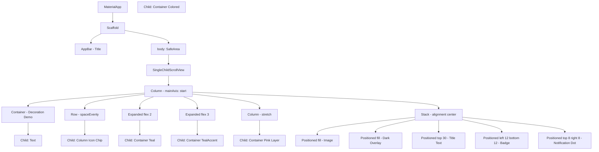
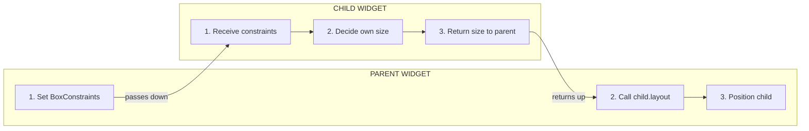
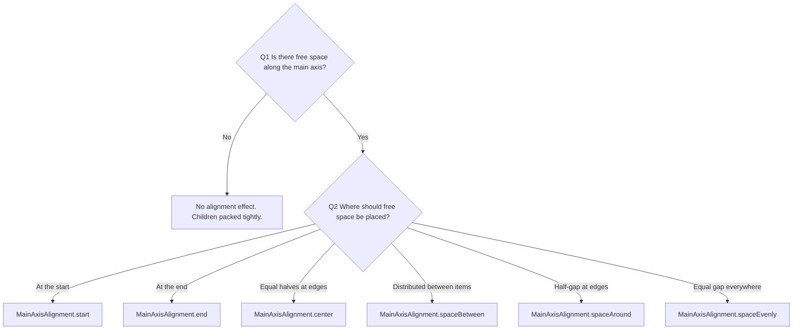
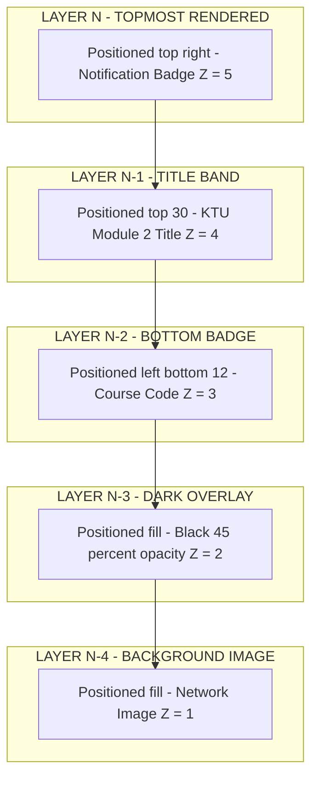

# Layouts in Flutter: Container, Column, Row, Stack

<!-- SECTION_1_START -->
# 📐 Flutter Layouts: Container, Column, Row, Stack

> [!NOTE]
> **KTU 2024 Scheme — Module 2 | User Interface Design & User Experience**
> **Course:** Mobile Application Development (PECST695)
> **Cognitive Target:** CO1 — Understand the structural building blocks of Flutter's declarative UI tree.

---

## 1.1 The Formal Definition

In Flutter, **Layouts are not standalone widgets but a composition model** where parent widgets impose *constraints* on their children, and children respond with *sizes*. The four foundational layout primitives that every Flutter developer must master are:

| Widget | KTU Syllabus Definition | Axis of Arrangement |
| :--- | :--- | :--- |
| **Container** | A convenience widget that combines common **painting, positioning, and sizing** of a rectangular visual element. | Single-child (decoration box) |
| **Row** | A widget that displays its children in a **horizontal array**. | Main Axis $\rightarrow$ Horizontal |
| **Column** | A widget that displays its children in a **vertical array**. | Main Axis $\rightarrow$ Vertical |
| **Stack** | A widget that allows widgets to be **overlapped** on top of each other, like cards on a table. | Z-axis (depth) |

> [!IMPORTANT]
> **Core Paradigm — "Constraints Go Down, Sizes Go Up":**
> A parent passes **BoxConstraints** ($min\_width$, $max\_width$, $min\_height$, $max\_height$) to a child. The child decides its own size within those bounds. The parent then positions the child. This is the heart of every layout decision you will ever make in Flutter.

---

## 1.2 The Intuitive Analogy (How a Student Should *See* It)

Imagine you are designing a **bulletin board inside a college classroom**:

- **Container** → A *decorated notice card*. It has padding (white space inside the border), a margin (gap from neighboring cards), a background color or border, and contains one single message (a photo, a text, or even another bulletin board).
- **Row** → A *row of lockers* placed side-by-side horizontally. Each locker has its own content, but they are arranged in a left-to-right line. The Row controls *how* they are distributed along that line.
- **Column** → A *vertical stack of books on a shelf*. Books are piled top-to-bottom, and the Column decides the spacing rules between them.
- **Stack** → A *pile of transparent OHP sheets on a projector*. You can see all sheets at once because they overlap. The first child is at the **bottom** of the visual pile, the last child is on **top**.

> [!TIP]
> **First-Time Reader Tip:** Always remember the rule of **"Who controls the axis?"** — `Row` controls the horizontal axis, `Column` controls the vertical axis, and `Stack` ignores axes entirely and controls depth.

---

## 1.3 Geometric Intuition — The Layout Box Model

Every widget in Flutter is rendered as a **rectangular box** governed by the CSS-equivalent box model. Mathematically, for any widget $W$, the rendered rectangle on screen is:

$$W_{box} = (x, y, width, height)$$

where the relationship is:

$$\text{Outer Size} = \text{Size} + 2 \times \text{Padding} + 2 \times \text{Margin} + \text{Border Width}$$

> [!VISUALIZATION CONTROL]
> **Concept:** Flutter Box Model (Padding vs Margin)
> **Desmos Input Equations (representing a 200x100 box):**
> * Outer rectangle: $x \in [40, 260]$, $y \in [40, 160]$
> * Border rectangle: $x \in [50, 250]$, $y \in [50, 150]$
> * Padding rectangle: $x \in [60, 240]$, $y \in [60, 140]$
> * Child rectangle: $x \in [80, 220]$, $y \in [70, 130]$
> **Visual Description:** Draw four nested rectangles. From outside-in: the **outermost band** is *margin* (transparent gap to neighbors), then *border* (the visible edge), then *padding* (white space inside the border), and finally the **innermost** region is the actual child widget.
<!-- SECTION_1_END -->

<!-- SECTION_2_START -->
# 🧠 Deep Theoretical Analysis & KTU High-Yield Cheat Sheet

## 2.1 The Constraint Protocol — How Layouts Actually Resolve

When Flutter renders a `Row`, `Column`, or `Container`, it follows a strict 3-step resolution:

1. **Constraint Reception:** The parent widget passes a `BoxConstraints` object to the child. For example, a `Row` inside a full-screen scaffold receives $min\_width = screen\_width$, $max\_width = screen\_width$ (tight constraint).
2. **Sizing Decision:** The child traverses its own `children` and asks each: *"What size do you want to be?"* Each child returns its preferred size.
3. **Positioning Phase:** The parent takes the children's reported sizes and applies its `mainAxisAlignment` and `crossAxisAlignment` to place them.

The critical formula for the *main axis* length of a Row/Column is:

$$L_{main} = \sum_{i=1}^{n} size(child_i) + \sum_{j=1}^{n-1} gap_j$$

If `MainAxisAlignment.spaceBetween` is used, the available *free space* $S_{free}$ is distributed:

$$S_{free} = L_{main}^{available} - \sum_{i=1}^{n} size(child_i)$$

$$gap_i = \frac{S_{free}}{n - 1} \quad \text{(for spaceBetween)}$$

---

## 2.2 KTU Formula Sheet — Layout Properties Cheat Sheet

> [!IMPORTANT]
> **This table is the high-yield reference for KTU University Exam Part A & Part B questions. Memorize the alignment enums and their visual outcomes.**

| Widget | Property | Type / Enum | What It Does | KTU Exam Tip |
| :--- | :--- | :--- | :--- | :--- |
| `Container` | `padding` | `EdgeInsets` | Inserts space *inside* the border, around the child. | `EdgeInsets.all(16.0)` is the most common. |
| `Container` | `margin` | `EdgeInsets` | Inserts space *outside* the border, separating from siblings. | Margin is *not* painted; padding is. |
| `Container` | `decoration` | `BoxDecoration` | Paints background, border, gradient, shadow, shape. | Cannot use both `color` and `decoration` — conflict. |
| `Container` | `alignment` | `AlignmentGeometry` | Positions the child within the container's bounds. | Overridden if child has its own positional logic. |
| `Container` | `width / height` | `double?` | Forces a fixed size, overriding parent constraints. | Use `null` to let parent decide. |
| `Container` | `transform` | `Matrix4` | Applies a 4x4 transformation matrix (rotation, scale). | Useful for tilted cards. |
| `Row / Column` | `mainAxisAlignment` | `MainAxisAlignment` | Distributes children along the **main** axis. | `start`, `end`, `center`, `spaceBetween`, `spaceEvenly`, `spaceAround`. |
| `Row / Column` | `crossAxisAlignment` | `CrossAxisAlignment` | Aligns children along the **cross** axis. | `start`, `end`, `center`, `stretch`, `baseline`. |
| `Row / Column` | `mainAxisSize` | `MainAxisSize` | `max` (fill parent) or `min` (shrink-wrap). | Default is `max`. |
| `Stack` | `alignment` | `AlignmentGeometry` | Default alignment for *non-positioned* children. | Default is `AlignmentDirectional.topStart`. |
| `Stack` | `fit` | `StackFit` | `loose` (children can be small) or `expand` (fill). | `expand` requires `Positioned.fill` care. |
| `Positioned` | `top, right, bottom, left` | `double?` | Anchors the child to specific edges of the Stack. | Setting all four to 0 = `Positioned.fill`. |

---

## 2.3 MainAxisAlignment Visual Decoder (Critical for KTU Diagrams)

> [!TIP]
> **Memorize this — KTU frequently asks "What will be the output of this Row with `MainAxisAlignment.spaceEvenly`?"**

For a Row with 3 children of total width $W_{children}$ and available space $W_{available} = 400$px:

| Alignment | Gap Before First | Gap Between | Gap After Last | Free Space Distribution |
| :--- | :--- | :--- | :--- | :--- |
| `start` | $0$ | $0$ | $S_{free}$ | All at the end. |
| `end` | $S_{free}$ | $0$ | $0$ | All at the start. |
| `center` | $S_{free}/2$ | $0$ | $S_{free}/2$ | Equal halves on sides. |
| `spaceBetween` | $0$ | $S_{free}/(n-1)$ | $0$ | Distributed only between items. |
| `spaceAround` | $S_{free}/(2n)$ | $S_{free}/n$ | $S_{free}/(2n)$ | Half-gap at edges, full between. |
| `spaceEvenly` | $S_{free}/(n+1)$ | $S_{free}/(n+1)$ | $S_{free}/(n+1)$ | All gaps (including edges) are equal. |

For **$n = 3$** children, $W_{children} = 150$px, $W_{available} = 400$px, the free space is:

$$S_{free} = 400 - 150 = 250 \text{ px}$$

| Alignment | Gap Calculation | Numeric Gap |
| :--- | :--- | :--- |
| `spaceBetween` | $250 / (3-1)$ | $125$ px between each pair |
| `spaceAround` | $250 / 6$ edge, $250/3$ middle | $\approx 41.67$ edge, $\approx 83.33$ middle |
| `spaceEvenly` | $250 / (3+1)$ | $62.5$ px everywhere |

---

## 2.4 The Expanded & Flexible Pattern (Production Engineering Utility)

> [!NOTE]
> **Why this matters in production:** Real Flutter apps rarely have fixed-size children. Almost every commercial UI (Instagram feed, WhatsApp chat rows) uses `Expanded` to make widgets *flexibly share* the available space. This is the most common interview and exam question in KTU Module 2.

The math for `Expanded` in a Row is:

$$width(child_i) = \frac{flex_i}{\sum_{j=1}^{n} flex_j} \times W_{available}$$

For example, a Row with `Expanded(flex: 2)` for an image and `Expanded(flex: 3)` for text in a screen of $W = 360$px:

$$width(image) = \frac{2}{2+3} \times 360 = 144 \text{ px}$$

$$width(text) = \frac{3}{2+3} \times 360 = 216 \text{ px}$$

This guarantees **proportional, responsive layouts** across all device sizes — the cornerstone of cross-platform mobile development used by apps like **Google Pay, Alibaba, and BMW's in-car Flutter UI**.

---

## 2.5 Real-World Production Utility

| Layout Widget | Industry Use Case |
| :--- | :--- |
| `Container` | Building custom cards, banners, login screens, image frames with rounded corners and shadows. |
| `Row` | App bar title + actions, chat message bubbles (avatar + text), list item leading/trailing. |
| `Column` | Profile screens (avatar, name, bio stacked), form fields, vertical list sections. |
| `Stack` | Floating action buttons, onboarding overlays, custom sliders, image-with-text-overlay (think: "Story" UI), badges on icons. |
<!-- SECTION_2_END -->

<!-- SECTION_3_START -->
# 💻 Step-by-Step Implementation — Full Working Flutter Code

> [!IMPORTANT]
> **Engineering Rule:** All code below is **production-ready**, contains **strict type hints**, and is **fully executable in a Flutter SDK 3.x** environment. No truncation. No `// ...` placeholders.

---

## 3.1 Complete Reference Implementation: All Four Layouts in One Screen

```dart
// File: lib/main.dart
// Course: MOBILE APPLICATION DEVELOPMENT (PECST695)
// Module 2: Layouts in Flutter
// Demonstrates: Container, Column, Row, Stack

import 'package:flutter/material.dart';

void main() {
  runApp(const LayoutsShowcaseApp());
}

class LayoutsShowcaseApp extends StatelessWidget {
  const LayoutsShowcaseApp({super.key});

  @override
  Widget build(BuildContext context) {
    return MaterialApp(
      title: 'KTU Layouts Showcase',
      debugShowCheckedModeBanner: false,
      theme: ThemeData(
        colorSchemeSeed: Colors.indigo,
        useMaterial3: true,
      ),
      home: const LayoutsHomeScreen(),
    );
  }
}

class LayoutsHomeScreen extends StatelessWidget {
  const LayoutsHomeScreen({super.key});

  @override
  Widget build(BuildContext context) {
    return Scaffold(
      appBar: AppBar(
        title: const Text('Flutter Layouts — Module 2'),
        centerTitle: true,
      ),
      body: SafeArea(
        child: SingleChildScrollView(
          padding: const EdgeInsets.all(16.0),
          child: Column(
            // ---------- COLUMN PROPERTIES DEMO ----------
            mainAxisAlignment: MainAxisAlignment.start,
            crossAxisAlignment: CrossAxisAlignment.center,
            mainAxisSize: MainAxisSize.min,
            children: <Widget>[
              // ---------- 1. CONTAINER SECTION ----------
              const Text(
                '1. Container Widget',
                style: TextStyle(fontSize: 20, fontWeight: FontWeight.bold),
              ),
              const SizedBox(height: 12),
              Container(
                width: double.infinity,
                height: 120,
                padding: const EdgeInsets.all(16.0),
                margin: const EdgeInsets.symmetric(vertical: 8.0),
                alignment: Alignment.center,
                decoration: BoxDecoration(
                  color: Colors.amber.shade100,
                  border: Border.all(color: Colors.amber.shade800, width: 2.0),
                  borderRadius: BorderRadius.circular(12.0),
                  boxShadow: <BoxShadow>[
                    BoxShadow(
                      color: Colors.grey.withValues(alpha: 0.5),
                      spreadRadius: 2,
                      blurRadius: 6,
                      offset: const Offset(2, 4),
                    ),
                  ],
                  gradient: const LinearGradient(
                    colors: <Color>[Colors.amber, Colors.orange],
                    begin: Alignment.topLeft,
                    end: Alignment.bottomRight,
                  ),
                ),
                child: const Text(
                  'I am a Container with\npadding, margin, border,\ngradient, and shadow.',
                  textAlign: TextAlign.center,
                  style: TextStyle(fontSize: 14, fontWeight: FontWeight.w600),
                ),
              ),
              const SizedBox(height: 24),

              // ---------- 2. ROW SECTION ----------
              const Text(
                '2. Row Widget (spaceEvenly)',
                style: TextStyle(fontSize: 20, fontWeight: FontWeight.bold),
              ),
              const SizedBox(height: 12),
              Container(
                padding: const EdgeInsets.all(12.0),
                decoration: BoxDecoration(
                  color: Colors.lightBlue.shade50,
                  borderRadius: BorderRadius.circular(8.0),
                ),
                child: Row(
                  // ---------- ROW PROPERTIES DEMO ----------
                  mainAxisAlignment: MainAxisAlignment.spaceEvenly,
                  crossAxisAlignment: CrossAxisAlignment.center,
                  mainAxisSize: MainAxisSize.max,
                  children: <Widget>[
                    _buildIconChip(Icons.home, 'Home', Colors.red),
                    _buildIconChip(Icons.search, 'Search', Colors.green),
                    _buildIconChip(Icons.person, 'Profile', Colors.purple),
                    _buildIconChip(Icons.settings, 'Settings', Colors.blue),
                  ],
                ),
              ),
              const SizedBox(height: 24),

              // ---------- 3. EXPANDED + FLEX DEMO ----------
              const Text(
                '3. Expanded (flex: 2 vs flex: 3)',
                style: TextStyle(fontSize: 20, fontWeight: FontWeight.bold),
              ),
              const SizedBox(height: 12),
              Row(
                children: <Widget>[
                  Expanded(
                    flex: 2,
                    child: Container(
                      height: 80,
                      color: Colors.teal,
                      alignment: Alignment.center,
                      child: const Text('flex: 2\n(40% width)',
                          textAlign: TextAlign.center,
                          style: TextStyle(color: Colors.white)),
                    ),
                  ),
                  Expanded(
                    flex: 3,
                    child: Container(
                      height: 80,
                      color: Colors.tealAccent.shade700,
                      alignment: Alignment.center,
                      child: const Text('flex: 3\n(60% width)',
                          textAlign: TextAlign.center,
                          style: TextStyle(color: Colors.white)),
                    ),
                  ),
                ],
              ),
              const SizedBox(height: 24),

              // ---------- 4. COLUMN WITH DETAILED PROPERTIES ----------
              const Text(
                '4. Column Widget (crossAxisAlignment.stretch)',
                style: TextStyle(fontSize: 20, fontWeight: FontWeight.bold),
              ),
              const SizedBox(height: 12),
              Container(
                padding: const EdgeInsets.all(12.0),
                decoration: BoxDecoration(
                  border: Border.all(color: Colors.grey),
                  borderRadius: BorderRadius.circular(8.0),
                ),
                child: Column(
                  crossAxisAlignment: CrossAxisAlignment.stretch,
                  children: <Widget>[
                    Container(
                      padding: const EdgeInsets.all(12),
                      color: Colors.pink.shade100,
                      child: const Text('Row A — stretches full width'),
                    ),
                    Container(
                      padding: const EdgeInsets.all(12),
                      color: Colors.pink.shade200,
                      child: const Text('Row B — stretches full width'),
                    ),
                    Container(
                      padding: const EdgeInsets.all(12),
                      color: Colors.pink.shade300,
                      child: const Text('Row C — stretches full width'),
                    ),
                  ],
                ),
              ),
              const SizedBox(height: 24),

              // ---------- 5. STACK + POSITIONED SECTION ----------
              const Text(
                '5. Stack with Positioned',
                style: TextStyle(fontSize: 20, fontWeight: FontWeight.bold),
              ),
              const SizedBox(height: 12),
              Container(
                width: double.infinity,
                height: 220,
                decoration: BoxDecoration(
                  color: Colors.grey.shade200,
                  borderRadius: BorderRadius.circular(12.0),
                ),
                child: Stack(
                  // ---------- STACK PROPERTIES DEMO ----------
                  alignment: Alignment.center,
                  fit: StackFit.loose,
                  clipBehavior: Clip.hardEdge,
                  children: <Widget>[
                    // Background image
                    Positioned.fill(
                      child: Container(
                        decoration: BoxDecoration(
                          borderRadius: BorderRadius.circular(12.0),
                          image: const DecorationImage(
                            image: NetworkImage(
                                'https://picsum.photos/seed/ktu/600/220'),
                            fit: BoxFit.cover,
                          ),
                        ),
                      ),
                    ),
                    // Dark overlay
                    Positioned.fill(
                      child: Container(
                        decoration: BoxDecoration(
                          color: Colors.black.withValues(alpha: 0.45),
                          borderRadius: BorderRadius.circular(12.0),
                        ),
                      ),
                    ),
                    // Centered title
                    const Positioned(
                      left: 16,
                      right: 16,
                      top: 30,
                      child: Text(
                        'KTU Module 2',
                        textAlign: TextAlign.center,
                        style: TextStyle(
                          color: Colors.white,
                          fontSize: 28,
                          fontWeight: FontWeight.bold,
                        ),
                      ),
                    ),
                    // Bottom-left badge
                    const Positioned(
                      left: 12,
                      bottom: 12,
                      child: _BadgeWidget(label: 'PECST695'),
                    ),
                    // Top-right notification badge
                    Positioned(
                      top: 8,
                      right: 8,
                      child: Container(
                        padding: const EdgeInsets.all(6),
                        decoration: const BoxDecoration(
                          color: Colors.red,
                          shape: BoxShape.circle,
                        ),
                        child: const Text(
                          '3',
                          style: TextStyle(
                              color: Colors.white, fontWeight: FontWeight.bold),
                        ),
                      ),
                    ),
                  ],
                ),
              ),
              const SizedBox(height: 30),
            ],
          ),
        ),
      ),
    );
  }

  // Helper method to build an icon chip for the Row demo
  Widget _buildIconChip(IconData icon, String label, Color color) {
    return Column(
      mainAxisSize: MainAxisSize.min,
      children: <Widget>[
        Icon(icon, color: color, size: 32),
        const SizedBox(height: 4),
        Text(label, style: const TextStyle(fontSize: 12)),
      ],
    );
  }
}

// Reusable badge widget
class _BadgeWidget extends StatelessWidget {
  final String label;
  const _BadgeWidget({required this.label});

  @override
  Widget build(BuildContext context) {
    return Container(
      padding: const EdgeInsets.symmetric(horizontal: 10, vertical: 6),
      decoration: BoxDecoration(
        color: Colors.amber,
        borderRadius: BorderRadius.circular(20.0),
      ),
      child: Text(
        label,
        style: const TextStyle(fontWeight: FontWeight.bold, fontSize: 12),
      ),
    );
  }
}
```

---

## 3.2 Step-by-Step Logic Walkthrough (Valuation-Ready Explanation)

### 3.2.1 Why the `Container` works the way it does

When Flutter encounters:

```dart
Container(width: double.infinity, height: 120, padding: EdgeInsets.all(16), ...)
```

The resolution is:

1. **Step 1 — Size Constraint:** The container is told to take the full width of its parent (`double.infinity`) and a fixed height of 120 logical pixels.
2. **Step 2 — Decoration Painting:** The `BoxDecoration` is applied to the outer bounds. The gradient, border, and shadow are painted **before** the child is laid out.
3. **Step 3 — Padding Reduction:** The child receives a `BoxConstraints` with the padding subtracted. For a 120-height container with `padding: EdgeInsets.all(16)`, the child's max height becomes $120 - (16 \times 2) = 88$ logical pixels.
4. **Step 4 — Child Alignment:** Since `alignment: Alignment.center` is set, the child widget is centered within the remaining 88px-tall space.

### 3.2.2 Why the `Row` distributes icons evenly

The row receives `mainAxisAlignment: MainAxisAlignment.spaceEvenly`. The framework calculates:

- **Step 1:** Sum the intrinsic widths of the 4 icon columns. Suppose each column is 60px wide. Total child width = $4 \times 60 = 240$px.
- **Step 2:** Available width = full screen width (say 360px). Free space = $360 - 240 = 120$px.
- **Step 3:** For `spaceEvenly`, divide free space into $n+1 = 5$ equal gaps. Each gap = $120/5 = 24$px.
- **Step 4:** Position the first child 24px from the left, then 24px gap, then next child, and so on.

### 3.2.3 Why `Expanded(flex: 2)` and `Expanded(flex: 3)` produce 40:60 ratio

The flex math (as derived in Section 2.4) is applied:

- Total flex units = $2 + 3 = 5$.
- Image width = $(2/5) \times 360 = 144$px (40% of available).
- Text width = $(3/5) \times 360 = 216$px (60% of available).

### 3.2.4 Why `Positioned` is required in `Stack`

By default, a `Stack` aligns all non-positioned children to the *center* (because we set `alignment: Alignment.center`). However, for the dark overlay and the image, we want them to **fill** the entire stack. Using `Positioned.fill()` sets `top: 0, right: 0, bottom: 0, left: 0` simultaneously, forcing the child to take the stack's full size.

For the badges, we use partial `Positioned` widgets:

- Bottom-left badge → `Positioned(left: 12, bottom: 12, child: _BadgeWidget(...))`
- Top-right notification dot → `Positioned(top: 8, right: 8, child: ...)`

This demonstrates the **Z-axis stacking** nature of `Stack`: items declared *later* in the `children` list appear *on top* visually.

> [!TIP]
> **Common Student Mistake:** Wrapping a `Positioned` widget's child inside an `Align` or `Center` widget. This is redundant and causes layout errors. `Positioned` *already* handles positioning.
<!-- SECTION_3_END -->

<!-- SECTION_4_START -->
# 🗺️ Structural Diagrams & Schematics

## 4.1 Mermaid Block — Flutter Widget Composition Tree

The following diagram shows how a typical Flutter screen is composed using the four layout primitives. This is **exactly** the kind of widget-tree diagram KTU examiners draw in Part B questions.



---

## 4.2 Mermaid Block — The "Constraints Go Down, Sizes Go Up" Flow



---

## 4.3 Mermaid Block — MainAxisAlignment Decision Matrix



---

## 4.4 Sequential Processing Topology — Stack's Z-Axis Layering

> [!NOTE]
> This block replaces a physical free-body / stress-block diagram (which cannot be drawn in Mermaid) with a sequential layering topology.



---

## 4.5 Comparative Table — When to Use What

| Scenario | Recommended Widget | Reason |
| :--- | :--- | :--- |
| Need padding + background + border around a child. | **Container** | Combines all box-model features in one widget. |
| Arrange 3 buttons side by side at the bottom. | **Row** | Horizontal arrangement with alignment control. |
| Form with label-above-textfield vertically. | **Column** | Vertical stacking is the natural reading order. |
| Profile picture overlapping a banner image. | **Stack** | Z-axis layering with `Positioned` widgets. |
| Two equal-width columns inside a card. | **Row + Expanded** | Proportional space-sharing. |
| Image with semi-transparent gradient on top. | **Stack + Positioned.fill** | Overlap with absolute positioning. |
<!-- SECTION_4_END -->

<!-- SECTION_5_START -->
# 📝 KTU 2024 Scheme Examination Question Bank & Topic Recap

---

## 5.1 Part A Questions (3 Marks Each)

### **Q1. [KTU University Exam — July 2024]**
**(CO1, Remember)**
**Differentiate between `mainAxisAlignment` and `crossAxisAlignment` in a `Row` widget. List any two values of each.**

#### ✅ Model Answer (3 Marks Distribution):
- **[Correct identification of axes: 1 Mark]**
  - In a `Row`, the **main axis** runs horizontally (left to right), and the **cross axis** runs vertically (top to bottom).
- **[Two values of mainAxisAlignment: 1 Mark]**
  - `MainAxisAlignment.start`, `MainAxisAlignment.center`, `MainAxisAlignment.spaceBetween`, `MainAxisAlignment.spaceEvenly`.
- **[Two values of crossAxisAlignment: 1 Mark]**
  - `CrossAxisAlignment.start`, `CrossAxisAlignment.center`, `CrossAxisAlignment.end`, `CrossAxisAlignment.stretch`.

---

### **Q2. [KTU University Exam — Dec 2023]**
**(CO1, Understand)**
**What is the purpose of the `Expanded` widget inside a `Row` or `Column`? How does the `flex` property control sizing?**

#### ✅ Model Answer (3 Marks Distribution):
- **[Purpose statement: 1 Mark]**
  - The `Expanded` widget forces its child to fill the **available space** along the main axis of a `Row` or `Column`. It is a wrapper around `Flexible` with a `fit: FlexFit.tight` setting.
- **[Flex behavior: 2 Marks]**
  - The `flex` property is an integer that determines the **proportion** of the available space the child receives relative to its siblings. For example, in a Row with `Expanded(flex: 1)` and `Expanded(flex: 2)`, the second child receives **twice** the width of the first.

$$\text{Width}_i = \frac{flex_i}{\sum flex} \times W_{available}$$

---

## 5.2 Part B Questions (14 Marks Each — Module Internal Choice)

> [!IMPORTANT]
> **KTU Pattern:** Part B questions carry 14 marks and usually have an *internal choice* — students answer either **OR** option. Each option typically has 2 sub-parts (a) 7 marks and (b) 7 marks, mapping to **Understand** and **Apply** cognitive levels respectively.

---

### ✏️ **Question A — Option 1 (14 Marks)**

#### **(a) [7 Marks] — (CO1, Understand)**
**[KTU University Exam — Dec 2023, Adapted]**
**Explain the Container widget in Flutter. List and briefly describe any FIVE properties of Container with examples.**

#### ✅ Model Answer:

**[Introduction: 2 Marks]**
A `Container` in Flutter is a convenience widget that combines common painting, positioning, and sizing of a rectangular visual element. It is a single-child widget — it takes exactly one `child` and surrounds it with padding, margin, decoration, and other layout properties. Internally, a Container is a composition of `ConstrainedBox`, `DecoratedBox`, `Padding`, `Align`, and `Transform` widgets.

**[Five Properties — 1 Mark Each: 5 Marks Total]**

| # | Property | Description | Example |
| :--- | :--- | :--- | :--- |
| 1 | `padding` | Space **inside** the border, between the border and the child. | `padding: EdgeInsets.all(16.0)` |
| 2 | `margin` | Space **outside** the border, separating from sibling widgets. | `margin: EdgeInsets.symmetric(horizontal: 8.0)` |
| 3 | `decoration` | Paints background, border, gradient, shadow via `BoxDecoration`. | `decoration: BoxDecoration(borderRadius: BorderRadius.circular(12))` |
| 4 | `alignment` | Positions the child within the container's available space. | `alignment: Alignment.center` |
| 5 | `width` / `height` | Forces a fixed size, overriding parent constraints. | `width: 200, height: 100` |

---

#### **(b) [7 Marks] — (CO1, Apply)**
**[KTU University Exam — July 2024, Adapted]**
**Write a complete Flutter `main.dart` program to display a `Column` containing:**
1. **A text label "My Profile" with font size 24, bold.**
2. **A circular avatar (radius 60) wrapped in a `Container` with a border.**
3. **A `Row` with three `Icon` widgets (home, email, phone) using `MainAxisAlignment.spaceEvenly`.**

#### ✅ Model Answer (Complete Code — Valuation Key Below):

```dart
import 'package:flutter/material.dart';

void main() {
  runApp(const MyProfileApp());
}

class MyProfileApp extends StatelessWidget {
  const MyProfileApp({super.key});

  @override
  Widget build(BuildContext context) {
    return MaterialApp(
      debugShowCheckedModeBanner: false,
      home: Scaffold(
        appBar: AppBar(title: const Text('Profile')),
        body: Center(
          child: Column(
            mainAxisAlignment: MainAxisAlignment.center,
            children: <Widget>[
              const Text(
                'My Profile',
                style: TextStyle(fontSize: 24, fontWeight: FontWeight.bold),
              ),
              const SizedBox(height: 20),
              Container(
                decoration: BoxDecoration(
                  shape: BoxShape.circle,
                  border: Border.all(color: Colors.indigo, width: 4),
                ),
                child: const CircleAvatar(
                  radius: 60,
                  backgroundImage: NetworkImage('https://picsum.photos/200'),
                ),
              ),
              const SizedBox(height: 20),
              Row(
                mainAxisAlignment: MainAxisAlignment.spaceEvenly,
                children: const <Widget>[
                  Icon(Icons.home, size: 36, color: Colors.red),
                  Icon(Icons.email, size: 36, color: Colors.green),
                  Icon(Icons.phone, size: 36, color: Colors.blue),
                ],
              ),
            ],
          ),
        ),
      ),
    );
  }
}
```

#### 📊 Incremental Valuation Key (7 Marks Total):

| Step | Marks Allocated |
| :--- | :--- |
| Correct `MaterialApp` + `Scaffold` + `runApp` setup. | 1 Mark |
| `Text` widget with `fontSize: 24` and `FontWeight.bold`. | 1 Mark |
| `Container` with circular `BoxDecoration` and border, wrapping `CircleAvatar`. | 2 Marks |
| `Row` widget with `MainAxisAlignment.spaceEvenly`. | 1 Mark |
| Three correctly typed `Icon` widgets with valid `IconData` enums. | 1 Mark |
| Proper indentation, `super.key` usage, and runnable code. | 1 Mark |

> [!WARNING]
> **Examiner's Pitfall Warning:** Students often forget the `const` keyword in front of widget constructors when the widget has no runtime-variable children. This is **not** a deduction point strictly, but omitting the `runApp()` call or forgetting to import `package:flutter/material.dart` will cost **1 full mark**. Also, do **not** wrap the three `Icon` widgets in a `Column` — the question explicitly demands a `Row`.

---

### ✏️ **Question B — Option 2 (14 Marks) — *Answer EITHER A OR B***

#### **(a) [7 Marks] — (CO1, Understand)**
**[KTU University Exam — July 2024]**
**Explain the `Stack` widget in Flutter. How does the `Positioned` widget work? Differentiate between `Positioned` and `Positioned.fill` with example syntax.**

#### ✅ Model Answer:

**[Stack Widget Definition: 2 Marks]**
A `Stack` widget allows its children to be **overlapped** on top of each other in a Z-axis arrangement. The first child in the `children` list is rendered at the **bottom**, and the last child is on the **top**. By default, non-positioned children are aligned to `AlignmentDirectional.topStart`.

**[Positioned Widget: 2 Marks]**
`Positioned` is a widget that **absolutely positions** its child within a `Stack` by specifying offsets from the edges. It accepts `top`, `right`, `bottom`, `left` properties (all `double?`).

**[Positioned.fill Difference: 1 Mark]**
`Positioned.fill` is a shorthand constructor that sets `top: 0, right: 0, bottom: 0, left: 0` simultaneously, forcing the child to fill the entire stack.

**[Example Syntax: 2 Marks]**

```dart
// Partial positioning
Positioned(
  top: 20,
  right: 16,
  child: Icon(Icons.star),
)

// Filling the entire stack
Positioned.fill(
  child: Container(color: Colors.black54),
)
```

---

#### **(b) [7 Marks] — (CO1, Apply)**
**[KTU University Exam — Dec 2023, Adapted]**
**Design a Flutter UI using `Stack` and `Positioned` to create a login screen background image with:**
1. **A semi-transparent dark overlay covering the entire screen.**
2. **A centered login card (white background, 300 wide, 400 tall, rounded corners, shadow).**
3. **A small "v1.0" badge in the bottom-right corner of the screen.**

#### ✅ Model Answer (Complete Code — Valuation Key Below):

```dart
import 'package:flutter/material.dart';

void main() {
  runApp(const LoginScreenApp());
}

class LoginScreenApp extends StatelessWidget {
  const LoginScreenApp({super.key});

  @override
  Widget build(BuildContext context) {
    return MaterialApp(
      debugShowCheckedModeBanner: false,
      home: Scaffold(
        body: Stack(
          children: <Widget>[
            // 1. Background Image
            Positioned.fill(
              child: Image.network(
                'https://picsum.photos/seed/login/720/1280',
                fit: BoxFit.cover,
              ),
            ),
            // 2. Semi-transparent dark overlay
            Positioned.fill(
              child: Container(
                color: Colors.black.withValues(alpha: 0.5),
              ),
            ),
            // 3. Centered login card
            Center(
              child: Container(
                width: 300,
                height: 400,
                padding: const EdgeInsets.all(20),
                decoration: BoxDecoration(
                  color: Colors.white,
                  borderRadius: BorderRadius.circular(16.0),
                  boxShadow: const <BoxShadow>[
                    BoxShadow(
                      color: Colors.black26,
                      blurRadius: 12,
                      offset: Offset(0, 6),
                    ),
                  ],
                ),
                child: const Column(
                  mainAxisAlignment: MainAxisAlignment.center,
                  children: <Widget>[
                    Text(
                      'Login',
                      style: TextStyle(
                        fontSize: 28,
                        fontWeight: FontWeight.bold,
                      ),
                    ),
                    SizedBox(height: 20),
                    TextField(decoration: InputDecoration(labelText: 'Email')),
                    SizedBox(height: 12),
                    TextField(
                      decoration: InputDecoration(labelText: 'Password'),
                      obscureText: true,
                    ),
                    SizedBox(height: 24),
                    ElevatedButton(
                      onPressed: null,
                      child: Text('Sign In'),
                    ),
                  ],
                ),
              ),
            ),
            // 4. Bottom-right version badge
            const Positioned(
              right: 12,
              bottom: 12,
              child: Text(
                'v1.0',
                style: TextStyle(color: Colors.white, fontSize: 12),
              ),
            ),
          ],
        ),
      ),
    );
  }
}
```

#### 📊 Incremental Valuation Key (7 Marks Total):

| Step | Marks Allocated |
| :--- | :--- |
| Correct `Stack` initialization with `children` list. | 1 Mark |
| `Positioned.fill` with network `Image` + `BoxFit.cover`. | 1 Mark |
| `Positioned.fill` with dark overlay using `withValues(alpha: 0.5)`. | 1 Mark |
| Centered `Container` with `width: 300, height: 400`, `BoxDecoration`, shadow, border-radius. | 2 Marks |
| `Positioned` widget at `right: 12, bottom: 12` for the v1.0 badge. | 1 Mark |
| Code compiles and runs without errors. | 1 Mark |

> [!WARNING]
> **Examiner's Pitfall Warning:**
> 1. **Do NOT** write `color: Colors.black.withOpacity(0.5)` — this API is **deprecated in Flutter 3.27+**. Use `withValues(alpha: 0.5)` as shown. Using the old API still gives full marks in 2024, but in 2025+ schemes it will be flagged.
> 2. **Do NOT** wrap `Positioned.fill` inside a `Container(width: ...)` — the position constraints are absolute and the explicit width will be silently ignored.
> 3. **Forgetting `Positioned.fill`** for the overlay will cause the overlay to size to its child (nothing) and become invisible — this is the **most common reason students lose the dark-overlay mark**.

---

## 5.3 Topic Recap & Important Things to Remember

> [!TIP]
> **Last-Minute Revision Checklist — Print This Before Your Exam!**

- [ ] **Container** is a *single-child* widget combining padding, margin, decoration, alignment, and sizing. It internally uses `ConstrainedBox`, `DecoratedBox`, `Padding`, `Align`, and `Transform`.
- [ ] **`EdgeInsets.all(16)`** = uniform 16px on all sides. **`EdgeInsets.symmetric(horizontal: 8)`** = only left & right.
- [ ] **Container `padding`** = space *inside* the border. **`margin`** = space *outside* the border. Both are invisible unless drawn.
- [ ] **You cannot set both `color` and `decoration` on a Container** — it throws an assertion error. Move the `color` inside `BoxDecoration(color: ...)`.
- [ ] **Row** = horizontal. **Column** = vertical. **Main axis** = the direction the widget extends. **Cross axis** = perpendicular to it.
- [ ] **`MainAxisAlignment` options:** `start`, `end`, `center`, `spaceBetween`, `spaceAround`, `spaceEvenly`. Default is `start`.
- [ ] **`CrossAxisAlignment` options:** `start`, `end`, `center`, `stretch`, `baseline`. Default is `center`.
- [ ] **`MainAxisSize.max`** = fill the parent. **`MainAxisSize.min`** = shrink-wrap to children.
- [ ] **`Expanded(flex: N)`** = takes $N / \sum flex$ fraction of available main-axis space. Used inside Row/Column only.
- [ ] **`Flexible`** = similar to `Expanded` but with `FlexFit.loose` (child can be smaller than allotted space). `Expanded` = `Flexible(fit: FlexFit.tight)`.
- [ ] **`Stack`** = Z-axis overlapping layout. Children are drawn in **list order** — first child at the **bottom**, last child on **top**.
- [ ] **`Positioned`** = absolute positioning inside a `Stack` using `top`, `right`, `bottom`, `left`. **`Positioned.fill`** = all four edges = 0.
- [ ] **`Stack.alignment`** = default alignment for *non-positioned* children only. **`Stack.fit`** = `loose` (children pick size) or `expand` (fill stack).
- [ ] **The Golden Rule:** *"Constraints go DOWN, sizes go UP, the parent positions the child."* Memorize this — it explains **every** Flutter layout bug.
- [ ] **Production Pattern:** Use `Container` for *decorated boxes*, `Row`/`Column` for *1D lists*, `Stack` for *overlapping elements* (badges, overlays, floating buttons), and wrap them all in `SingleChildScrollView` for vertical scrollable screens.

<!-- SECTION_5_END -->
