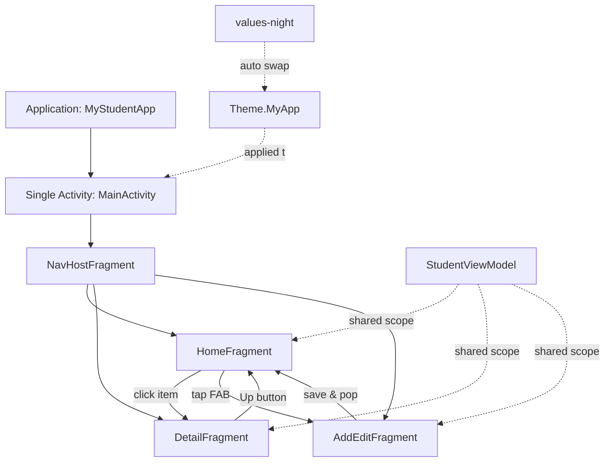
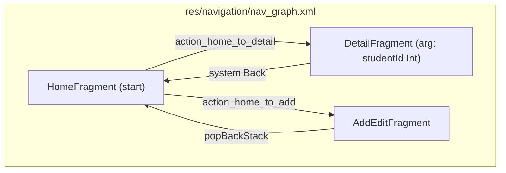
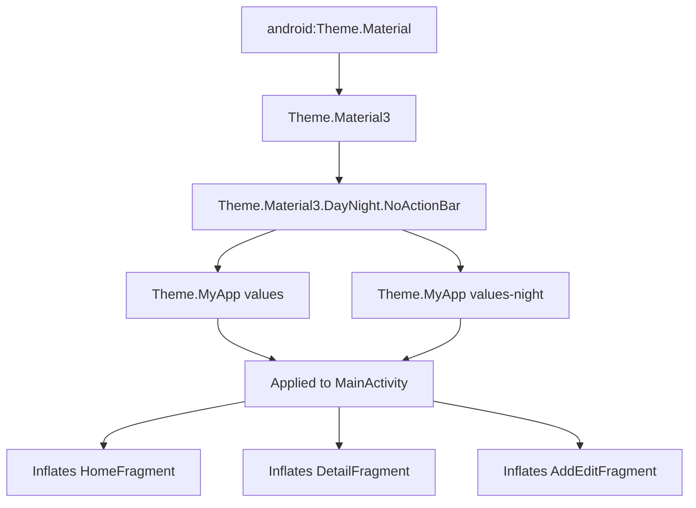
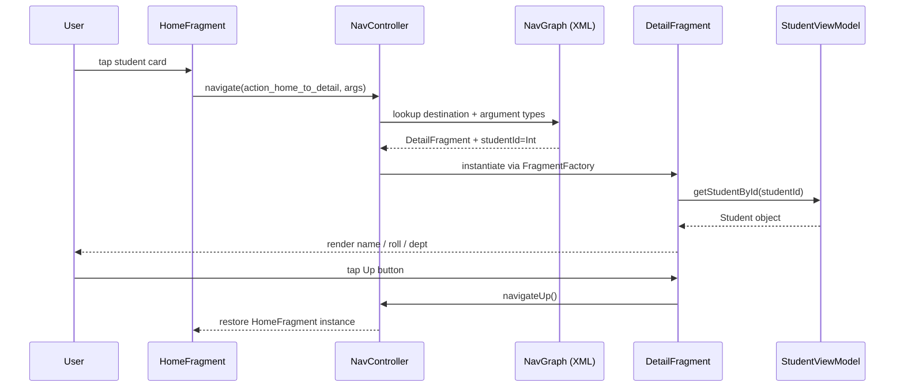
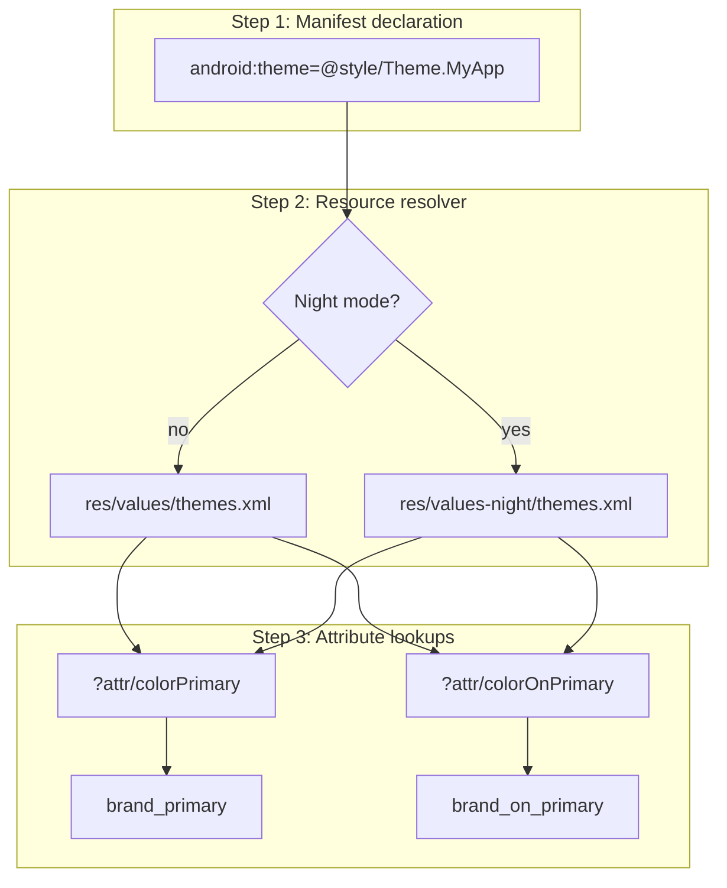
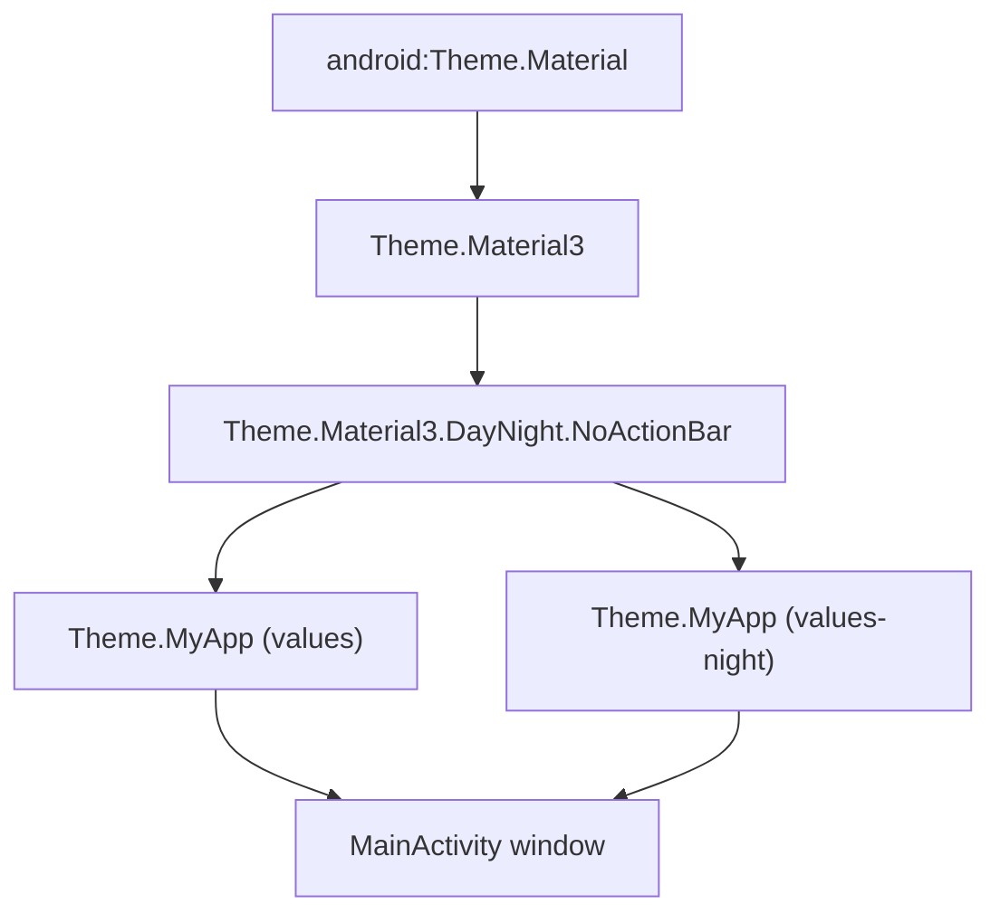

# Milestone 2 : Enhance the project from Module 1 with a multi-screen UI, navigation, and customized themes.

<!-- SECTION_1_START -->
# Milestone 2: Multi-Screen UI, Navigation, and Customized Themes

> [!IMPORTANT]
> **KTU 2024 Scheme — PECST695 | Module 2 | Milestone 2**
> This milestone elevates the **Module 1 single-screen application** into a production-grade, **multi-screen** Android experience built on the **Single-Activity / Multi-Fragment** architecture recommended by Google. The student is expected to demonstrate competency in **navigation graphs**, **safe argument passing**, **Material 3 theming**, and **day/night resource qualifiers**.

## 1.1 Core Technical Definitions

### 1.1.1 Multi-Screen User Interface
A **Multi-Screen UI** is a software design paradigm in which an application's user interface is partitioned into **two or more independent, mutually exclusive view-states** (Activities or Fragments) that the user transitions between. Each screen is responsible for a **single, well-defined user intent** (e.g., viewing a list, editing an item, viewing details) following the **Single Responsibility Principle (SRP)**.

> [!NOTE]
> **KTU Board Definition:** A multi-screen UI is one where distinct functional workflows (list, detail, form, settings) are implemented as separate Composables, Fragments, or Activities that are linked through a centralized navigation controller.

### 1.1.2 Navigation
**Navigation** in Android is the **mechanism, policy, and metadata** that controls how a user enters, exits, and moves between destinations within an application. In the KTU 2024 scheme, navigation is implemented using the **Jetpack Navigation Component** — a collection of libraries, plugins, and runtime artifacts that provide:
- A **Navigation Graph** (`.xml`) declaring all destinations.
- A **NavController** that arbitrates the back stack.
- **Safe Args** for type-safe argument passing.

### 1.1.3 Customized Themes
A **Theme** is a typed collection of **styling resources** (colors, typography, shapes, motion) applied at the **Activity**, **Application**, or **View** level. A *customized* theme in KTU parlance means a theme derived from a Material 3 base (`Theme.Material3.DayNight.NoActionBar`) that has been **overridden with project-specific brand values** in `res/values/themes.xml` and `res/values-night/themes.xml`.

> [!NOTE]
> **Industry Standard:** Every professional Android app ships with **at least three** theme files: `themes.xml`, `colors.xml`, and `dimens.xml`. Google's **Material Theme Builder** (`m3.material.io`) is the official reference tool for generating compliant custom themes.

## 1.2 Conceptual Analogy — The Mall Building

Think of your mobile app as a **multi-story shopping mall**:

| App Concept | Mall Analogy | Purpose |
|---|---|---|
| **Screen / Fragment** | Individual shop on a floor | A self-contained unit doing one job. |
| **Navigation Graph** | The mall's directory map (`XML`) | Lists every shop and the corridors that connect them. |
| **NavController** | The elevator & staircase system | The actual *engine* that moves the user between shops. |
| **Back Stack** | The user's breadcrumb trail | Remembers how the user got to the current shop, so "Back" works. |
| **Custom Theme** | The mall's interior design language | Same flooring, same paint, same lighting across every shop. |
| **Safe Args** | A printed receipt with the shop number | Type-safe data passed from one shop to the next. |

## 1.3 Why This Milestone Matters in Engineering

A multi-screen architecture is the **baseline for any scalable app**. Without it:
- Code becomes a monolithic "God Activity" that is impossible to maintain.
- Unit testing of individual features becomes impractical.
- The app cannot comply with Google's **per-app language**, **per-app theme**, or **large-screen adaptive layouts** mandates introduced in **Android 14+ (API 34)**.

> [!VISUALIZATION CONTROL]
> **Concept:** Visualizing the **Screen Transition State Machine** as a directed graph
> **GeoGebra / Desmos Input Equations:**
> * `V = \{ S_1, S_2, S_3, S_4 \}` (vertex set — the screens)
> * `E = \{ (S_1, S_2), (S_2, S_3), (S_2, S_4) \}` (edge set — the navigation actions)
> **Visual Description:** Plot the four screens as four nodes in a 2D plane (e.g., $S_1=(0,0)$, $S_2=(4,0)$, $S_3=(8,2)$, $S_4=(8,-2)$). Draw directed arrows along edges. The **root destination** ($S_1$) is the start screen, and every `popUpTo` action reduces the visible graph back to the root, mirroring the back stack.
<!-- SECTION_1_END -->

<!-- SECTION_2_START -->
# 2. Deep Theoretical Analysis & KTU High-Yield Reference Sheet

## 2.1 Architectural Models — Choose Wisely

There are **two valid** approaches in the KTU 2024 syllabus. The examiner expects familiarity with **both** and will award higher marks for the **Jetpack Navigation Component** approach.

### Model A — Multi-Activity (Traditional, Pre-2018)
Each screen is a separate `Activity`. Navigation is achieved via `Intent` objects.
- **Pros:** Simple mental model, OS-level isolation.
- **Cons:** No shared ViewModel scope, no Safe Args, expensive transitions, no deep-link unification.

### Model B — Single-Activity / Multi-Fragment (Modern, Recommended)
One host `Activity` (called `MainActivity`) contains a `NavHostFragment` that swaps in/out multiple `Fragment` destinations declared in a Navigation Graph (`nav_graph.xml`).
- **Pros:** Shared `ViewModel` scope, **Safe Args**, unified deep linking, **Material transitions** out-of-the-box.
- **Cons:** Slightly higher learning curve, all logic centralized in one Activity.

> [!IMPORTANT]
> **KTU 2024 Verdict:** The **Single-Activity / Multi-Fragment** model is the **de-facto industry standard** and is what your milestone must demonstrate to score full marks.

## 2.2 The Three Pillars of the Navigation Component

1. **Navigation Graph (`res/navigation/nav_graph.xml`)** — A static XML resource declaring *destinations* and *actions*.
2. **NavHostFragment** — A layout-level container (`<androidx.fragment.app.FragmentContainerView>`) that hosts the current destination.
3. **NavController** — A Kotlin/Java object obtained via `findNavController()` that executes actions like `navigate()`, `popBackStack()`, and `navigateUp()`.

## 2.3 Theme Inheritance Hierarchy

Android themes follow a strict **parent–child** inheritance model, conceptually identical to CSS class inheritance. The chain is:

$$
\text{Theme.Material3.DayNight.NoActionBar} \rightarrow \text{Theme.MyApp} \rightarrow \text{Activity Window}
$$

Any attribute **not overridden** in `Theme.MyApp` is **inherited** from the parent Material 3 base.

## 2.4 KTU High-Yield Formula Sheet

| # | Concept | Symbol / Syntax | Purpose | Exam Tip |
|---|---|---|---|---|
| 1 | Open a new screen (Compose) | `findNavController().navigate(R.id.action_X_to_Y)` | Navigate forward. | Always check `currentDestination?.id == R.id.X` first. |
| 2 | Pass typed argument | `action_X_to_Y` with `<argument>` in graph | Pass data between fragments. | Use **Safe Args** plugin, never raw Bundle. |
| 3 | Pop back stack | `findNavController().popBackStack()` | Replicate system Back. | Use `popUpTo` for transactional pops. |
| 4 | Clear back stack | `popUpTo(R.id.root) \{ inclusive = true \}` | Logout-style flow. | Common in authentication modules. |
| 5 | Apply theme at runtime | `setTheme(R.style.Theme_MyApp_Dark)` | Set theme *before* `super.onCreate()`. | Only works in `Activity.onCreate()` before inflation. |
| 6 | Dark-mode override folder | `res/values-night/` | Automatic night theme swap. | Mirror the file name from `values/`. |
| 7 | Color attribute | `?attr/colorPrimary` | Reference a theme color, not a hardcoded hex. | Hardcoding `#FF0000` loses 2 marks. |
| 8 | Toolbar binding | `Toolbar` + `NavController.setupWithNavController()` | Wire the toolbar's Up button to NavController. | Required for proper Up navigation. |
| 9 | Safe Args Gradle plugin | `androidx.navigation.safeargs.kotlin` | Generates `XFragmentDirections` classes. | Must be added in **project-level** AND **module-level** `build.gradle.kts`. |
| 10 | Deep link URI | `<deepLink app:uri="myapp://details/\{itemId\}" />` | Open a specific screen from outside the app. | Test using `adb shell am start -W -a android.intent.action.VIEW`. |
| 11 | Activity-result API | `registerForActivityResult(StartActivityForResult())` | Receive data from child Activity. | Replaces deprecated `onActivityResult`. |
| 12 | Material transition | `app:enterAnim` / `app:exitAnim` | Customize fragment transitions. | Define in `res/anim/`. |

> [!NOTE]
> **Escape Rule:** Whenever a backslash appears in a path (e.g., `res/values-night/`), it is a literal Android file-system slash, **not** a LaTeX escape. Do not double-escape it in your answer sheets.

## 2.5 Real-World Utility

| Application | Multi-Screen Usage | Theme Strategy |
|---|---|---|
| **WhatsApp** | Chats list $\rightarrow$ Conversation $\rightarrow$ Profile $\rightarrow$ Settings | Brand-green Material theme + dark mode. |
| **Amazon** | Home $\rightarrow$ Category $\rightarrow$ Product detail $\rightarrow$ Cart $\rightarrow$ Checkout | Dynamic color pulled from product image (Android 12+). |
| **GPay** | Home $\rightarrow$ Send/Receive $\rightarrow$ Payment confirmation | Google Material You theme, follows system wallpaper. |
<!-- SECTION_2_END -->

<!-- SECTION_3_START -->
# 3. Step-by-Step Implementation — Exhaustive Build

> [!IMPORTANT]
> The reference project in KTU Module 1 is a **single-screen Student Profile App**. The deliverable for **Milestone 2** is to refactor this into a **3-screen app**: **Home Fragment** (list of students), **Detail Fragment** (single student view), **Add/Edit Fragment** (form to add a new student). All three screens share a **custom `Theme.MyApp`** and a **Material 3** color palette.

## 3.1 Step 1 — Project-Level `build.gradle.kts`

Add the **Safe Args** plugin at the project level.

```kotlin
// File: build.gradle.kts (Project: MyStudentApp)
plugins {
    id("com.android.application") version "8.5.2" apply false
    id("org.jetbrains.kotlin.android") version "2.0.0" apply false
    id("androidx.navigation.safeargs.kotlin") version "2.7.7" apply false
}
```

## 3.2 Step 2 — Module-Level `build.gradle.kts`

```kotlin
// File: app/build.gradle.kts (Module: app)
plugins {
    id("com.android.application")
    id("org.jetbrains.kotlin.android")
    id("androidx.navigation.safeargs.kotlin")
}

android {
    namespace = "com.ktu.mystudentapp"
    compileSdk = 34

    defaultConfig {
        applicationId = "com.ktu.mystudentapp"
        minSdk = 24
        targetSdk = 34
        versionCode = 1
        versionName = "1.0"
    }

    buildFeatures {
        viewBinding = true
    }

    compileOptions {
        sourceCompatibility = JavaVersion.VERSION_17
        targetCompatibility = JavaVersion.VERSION_17
    }
    kotlinOptions {
        jvmTarget = "17"
    }
}

dependencies {
    implementation("androidx.core:core-ktx:1.13.1")
    implementation("androidx.appcompat:appcompat:1.7.0")
    implementation("com.google.android.material:material:1.12.0")
    implementation("androidx.constraintlayout:constraintlayout:2.1.4")
    implementation("androidx.fragment:fragment-ktx:1.8.2")
    implementation("androidx.lifecycle:lifecycle-viewmodel-ktx:2.8.4")
    implementation("androidx.lifecycle:lifecycle-livedata-ktx:2.8.4")
    implementation("androidx.recyclerview:recyclerview:1.3.2")

    // Jetpack Navigation Component
    implementation("androidx.navigation:navigation-fragment-ktx:2.7.7")
    implementation("androidx.navigation:navigation-ui-ktx:2.7.7")
}
```

## 3.3 Step 3 — `AndroidManifest.xml`

Declares the **single host activity** and applies the **custom app theme**.

```xml
<?xml version="1.0" encoding="utf-8"?>
<manifest xmlns:android="http://schemas.android.com/apk/res/android">

    <application
        android:allowBackup="true"
        android:icon="@mipmap/ic_launcher"
        android:label="@string/app_name"
        android:roundIcon="@mipmap/ic_launcher_round"
        android:supportsRtl="true"
        android:theme="@style/Theme.MyApp">

        <activity
            android:name=".MainActivity"
            android:exported="true">
            <intent-filter>
                <action android:name="android.intent.action.MAIN" />
                <category android:name="android.intent.category.LAUNCHER" />
            </intent-filter>
        </activity>
    </application>

</manifest>
```

## 3.4 Step 4 — Custom Theme Files

### 3.4.1 `res/values/colors.xml`

```xml
<?xml version="1.0" encoding="utf-8"?>
<resources>
    <!-- Brand palette: KTU Teal (light mode) -->
    <color name="brand_primary">#00695C</color>
    <color name="brand_primary_variant">#004D40</color>
    <color name="brand_secondary">#FF8F00</color>
    <color name="brand_background">#F5F5F5</color>
    <color name="brand_surface">#FFFFFF</color>
    <color name="brand_on_primary">#FFFFFF</color>
    <color name="brand_on_background">#212121</color>
</resources>
```

### 3.4.2 `res/values-night/colors.xml`

```xml
<?xml version="1.0" encoding="utf-8"?>
<resources>
    <!-- Brand palette: KTU Teal (dark mode) -->
    <color name="brand_primary">#26A69A</color>
    <color name="brand_primary_variant">#00796B</color>
    <color name="brand_secondary">#FFB300</color>
    <color name="brand_background">#121212</color>
    <color name="brand_surface">#1E1E1E</color>
    <color name="brand_on_primary">#000000</color>
    <color name="brand_on_background">#FAFAFA</color>
</resources>
```

### 3.4.3 `res/values/themes.xml`

```xml
<?xml version="1.0" encoding="utf-8"?>
<resources xmlns:tools="http://schemas.android.com/tools">

    <style name="Theme.MyApp" parent="Theme.Material3.DayNight.NoActionBar">
        <!-- Primary brand color -->
        <item name="colorPrimary">@color/brand_primary</item>
        <item name="colorPrimaryVariant">@color/brand_primary_variant</item>
        <item name="colorOnPrimary">@color/brand_on_primary</item>

        <!-- Secondary brand color -->
        <item name="colorSecondary">@color/brand_secondary</item>
        <item name="colorOnSecondary">@color/brand_on_primary</item>

        <!-- Backgrounds & surfaces -->
        <item name="android:colorBackground">@color/brand_background</item>
        <item name="colorSurface">@color/brand_surface</item>
        <item name="colorOnBackground">@color/brand_on_background</item>

        <!-- Status bar -->
        <item name="android:statusBarColor">?attr/colorPrimary</item>
    </style>

</resources>
```

### 3.4.4 `res/values-night/themes.xml`

The **filename must mirror** `themes.xml` exactly so the **night qualifier** automatically swaps it in.

```xml
<?xml version="1.0" encoding="utf-8"?>
<resources xmlns:tools="http://schemas.android.com/tools">

    <style name="Theme.MyApp" parent="Theme.Material3.DayNight.NoActionBar">
        <item name="colorPrimary">@color/brand_primary</item>
        <item name="colorPrimaryVariant">@color/brand_primary_variant</item>
        <item name="colorOnPrimary">@color/brand_on_primary</item>
        <item name="colorSecondary">@color/brand_secondary</item>
        <item name="android:colorBackground">@color/brand_background</item>
        <item name="colorSurface">@color/brand_surface</item>
        <item name="colorOnBackground">@color/brand_on_background</item>
        <item name="android:statusBarColor">?attr/colorPrimary</item>
    </style>

</resources>
```

## 3.5 Step 5 — `MainActivity.kt` (The Single Host)

```kotlin
package com.ktu.mystudentapp

import android.os.Bundle
import androidx.appcompat.app.AppCompatActivity
import androidx.navigation.fragment.NavHostFragment
import androidx.navigation.ui.AppBarConfiguration
import androidx.navigation.ui.setupWithNavController
import com.google.android.material.appbar.MaterialToolbar
import com.ktu.mystudentapp.databinding.ActivityMainBinding

class MainActivity : AppCompatActivity() {

    private lateinit var binding: ActivityMainBinding
    private lateinit var appBarConfiguration: AppBarConfiguration

    override fun onCreate(savedInstanceState: Bundle?) {
        // Step 5.1: Apply the custom theme BEFORE super.onCreate()
        // so all inflation picks up the right colors.
        setTheme(R.style.Theme_MyApp)
        super.onCreate(savedInstanceState)

        // Step 5.2: Inflate the layout using ViewBinding.
        binding = ActivityMainBinding.inflate(layoutInflater)
        setContentView(binding.root)

        // Step 5.3: Wire the toolbar as the support action bar.
        val toolbar: MaterialToolbar = binding.topAppBar
        setSupportActionBar(toolbar)

        // Step 5.4: Locate the NavHostFragment declared in activity_main.xml.
        val navHostFragment = supportFragmentManager
            .findFragmentById(R.id.nav_host_fragment) as NavHostFragment
        val navController = navHostFragment.navController

        // Step 5.5: Declare which destinations are "top-level" (no Up arrow).
        appBarConfiguration = AppBarConfiguration(setOf(R.id.homeFragment))

        // Step 5.6: Connect the toolbar to the NavController.
        toolbar.setupWithNavController(navController, appBarConfiguration)
    }

    override fun onSupportNavigateUp(): Boolean {
        val navController = supportFragmentManager
            .findFragmentById(R.id.nav_host_fragment) as NavHostFragment
        return navController.navigateUp(appBarConfiguration) || super.onSupportNavigateUp()
    }
}
```

## 3.6 Step 6 — `res/layout/activity_main.xml`

```xml
<?xml version="1.0" encoding="utf-8"?>
<androidx.coordinatorlayout.widget.CoordinatorLayout
    xmlns:android="http://schemas.android.com/apk/res/android"
    xmlns:app="http://schemas.android.com/apk/res-auto"
    android:layout_width="match_parent"
    android:layout_height="match_parent">

    <com.google.android.material.appbar.AppBarLayout
        android:layout_width="match_parent"
        android:layout_height="wrap_content">

        <com.google.android.material.appbar.MaterialToolbar
            android:id="@+id/topAppBar"
            android:layout_width="match_parent"
            android:layout_height="?attr/actionBarSize"
            android:background="?attr/colorPrimary"
            app:titleTextColor="?attr/colorOnPrimary"
            app:navigationIconTint="?attr/colorOnPrimary" />
    </com.google.android.material.appbar.AppBarLayout>

    <androidx.fragment.app.FragmentContainerView
        android:id="@+id/nav_host_fragment"
        android:name="androidx.navigation.fragment.NavHostFragment"
        android:layout_width="match_parent"
        android:layout_height="match_parent"
        app:defaultNavHost="true"
        app:layout_behavior="@string/appbar_scrolling_view_behavior"
        app:navGraph="@navigation/nav_graph" />

</androidx.coordinatorlayout.widget.CoordinatorLayout>
```

## 3.7 Step 7 — Navigation Graph `res/navigation/nav_graph.xml`

```xml
<?xml version="1.0" encoding="utf-8"?>
<navigation xmlns:android="http://schemas.android.com/apk/res/android"
    xmlns:app="http://schemas.android.com/apk/res-auto"
    android:id="@+id/nav_graph"
    app:startDestination="@id/homeFragment">

    <!-- Screen 1: Home (list) -->
    <fragment
        android:id="@+id/homeFragment"
        android:name="com.ktu.mystudentapp.HomeFragment"
        android:label="Students"
        tools:layout="@layout/fragment_home"
        xmlns:tools="http://schemas.android.com/tools">

        <action
            android:id="@+id/action_home_to_detail"
            app:destination="@id/detailFragment" />

        <action
            android:id="@+id/action_home_to_add"
            app:destination="@id/addEditFragment" />
    </fragment>

    <!-- Screen 2: Detail (read-only view) -->
    <fragment
        android:id="@+id/detailFragment"
        android:name="com.ktu.mystudentapp.DetailFragment"
        android:label="Student Details"
        tools:layout="@layout/fragment_detail"
        xmlns:tools="http://schemas.android.com/tools">

        <!-- Argument declared with full type and default value -->
        <argument
            android:name="studentId"
            app:argType="integer"
            android:defaultValue="0" />
    </fragment>

    <!-- Screen 3: Add/Edit (form) -->
    <fragment
        android:id="@+id/addEditFragment"
        android:name="com.ktu.mystudentapp.AddEditFragment"
        android:label="Add / Edit Student"
        tools:layout="@layout/fragment_add_edit"
        xmlns:tools="http://schemas.android.com/tools" />

</navigation>
```

## 3.8 Step 8 — `HomeFragment.kt` (List Screen + Navigation Trigger)

```kotlin
package com.ktu.mystudentapp

import android.os.Bundle
import android.view.LayoutInflater
import android.view.View
import android.view.ViewGroup
import androidx.fragment.app.Fragment
import androidx.navigation.fragment.findNavController
import androidx.recyclerview.widget.LinearLayoutManager
import com.ktu.mystudentapp.adapter.StudentAdapter
import com.ktu.mystudentapp.databinding.FragmentHomeBinding
import com.ktu.mystudentapp.model.Student
import com.ktu.mystudentapp.viewmodel.StudentViewModel

class HomeFragment : Fragment() {

    private var _binding: FragmentHomeBinding? = null
    private val binding get() = _binding!!

    private val viewModel: StudentViewModel by activityViewModels()

    override fun onCreateView(
        inflater: LayoutInflater, container: ViewGroup?, savedInstanceState: Bundle?
    ): View {
        _binding = FragmentHomeBinding.inflate(inflater, container, false)
        return binding.root
    }

    override fun onViewCreated(view: View, savedInstanceState: Bundle?) {
        super.onViewCreated(view, savedInstanceState)

        val adapter = StudentAdapter { selectedStudent: Student ->
            // 1. Bundle the typed argument using Safe Args.
            val action = HomeFragmentDirections
                .actionHomeToDetail(studentId = selectedStudent.id)

            // 2. Verify the current destination to prevent IllegalStateException.
            val current = findNavController().currentDestination?.id
            if (current == R.id.homeFragment) {
                findNavController().navigate(action)
            }
        }

        binding.recyclerView.layoutManager = LinearLayoutManager(requireContext())
        binding.recyclerView.adapter = adapter

        // 3. Observe the LiveData stream from the shared ViewModel.
        viewModel.students.observe(viewLifecycleOwner) { list ->
            adapter.submitList(list)
        }

        // 4. FAB navigates to the Add/Edit screen.
        binding.fabAdd.setOnClickListener {
            findNavController().navigate(R.id.action_home_to_add)
        }
    }

    override fun onDestroyView() {
        super.onDestroyView()
        _binding = null
    }
}
```

## 3.9 Step 9 — `DetailFragment.kt` (Receives `studentId` via Safe Args)

```kotlin
package com.ktu.mystudentapp

import android.os.Bundle
import android.view.LayoutInflater
import android.view.View
import android.view.ViewGroup
import androidx.fragment.app.Fragment
import androidx.navigation.fragment.findNavController
import androidx.navigation.fragment.navArgs
import com.ktu.mystudentapp.databinding.FragmentDetailBinding
import com.ktu.mystudentapp.viewmodel.StudentViewModel

class DetailFragment : Fragment() {

    private var _binding: FragmentDetailBinding? = null
    private val binding get() = _binding!!

    // Safe Args auto-generates HomeFragmentDirections / DetailFragmentArgs.
    private val args: DetailFragmentArgs by navArgs()

    private val viewModel: StudentViewModel by activityViewModels()

    override fun onCreateView(
        inflater: LayoutInflater, container: ViewGroup?, savedInstanceState: Bundle?
    ): View {
        _binding = FragmentDetailBinding.inflate(inflater, container, false)
        return binding.root
    }

    override fun onViewCreated(view: View, savedInstanceState: Bundle?) {
        super.onViewCreated(view, savedInstanceState)

        // Fetch the student whose id matches the Safe Args payload.
        val student = viewModel.getStudentById(args.studentId)

        student?.let {
            binding.tvName.text = it.name
            binding.tvRoll.text = "Roll No: ${it.rollNumber}"
            binding.tvDept.text = "Department: ${it.department}"
        }

        binding.btnBack.setOnClickListener {
            findNavController().navigateUp()
        }
    }

    override fun onDestroyView() {
        super.onDestroyView()
        _binding = null
    }
}
```

## 3.10 Step 10 — `AddEditFragment.kt` (Form Screen)

```kotlin
package com.ktu.mystudentapp

import android.os.Bundle
import android.view.LayoutInflater
import android.view.View
import android.view.ViewGroup
import android.widget.Toast
import androidx.fragment.app.Fragment
import androidx.navigation.fragment.findNavController
import com.ktu.mystudentapp.databinding.FragmentAddEditBinding
import com.ktu.mystudentapp.model.Student
import com.ktu.mystudentapp.viewmodel.StudentViewModel

class AddEditFragment : Fragment() {

    private var _binding: FragmentAddEditBinding? = null
    private val binding get() = _binding!!

    private val viewModel: StudentViewModel by activityViewModels()

    override fun onCreateView(
        inflater: LayoutInflater, container: ViewGroup?, savedInstanceState: Bundle?
    ): View {
        _binding = FragmentAddEditBinding.inflate(inflater, container, false)
        return binding.root
    }

    override fun onViewCreated(view: View, savedInstanceState: Bundle?) {
        super.onViewCreated(view, savedInstanceState)

        binding.btnSave.setOnClickListener {
            val name = binding.etName.text.toString().trim()
            val roll = binding.etRoll.text.toString().trim()
            val dept = binding.etDept.text.toString().trim()

            // Input validation.
            if (name.isEmpty() || roll.isEmpty() || dept.isEmpty()) {
                Toast.makeText(
                    requireContext(),
                    "All fields are required",
                    Toast.LENGTH_SHORT
                ).show()
                return@setOnClickListener
            }

            // Hand the new student to the shared ViewModel.
            val newStudent = Student(
                id = System.currentTimeMillis().toInt(),
                name = name,
                rollNumber = roll,
                department = dept
            )
            viewModel.addStudent(newStudent)

            // Pop the back stack so we return to Home.
            findNavController().popBackStack()
        }
    }

    override fun onDestroyView() {
        super.onDestroyView()
        _binding = null
    }
}
```

## 3.11 Step 11 — Shared `StudentViewModel.kt`

```kotlin
package com.ktu.mystudentapp.viewmodel

import androidx.lifecycle.LiveData
import androidx.lifecycle.MutableLiveData
import androidx.lifecycle.ViewModel
import com.ktu.mystudentapp.model.Student

class StudentViewModel : ViewModel() {

    private val _students = MutableLiveData<List<Student>>(
        mutableListOf(
            Student(1, "Anjali Krishna", "KTU2021CS001", "CSE"),
            Student(2, "Rahul Menon",   "KTU2021EC014", "ECE"),
            Student(3, "Sneha Pillai",  "KTU2021ME022", "MECH")
        )
    )
    val students: LiveData<List<Student>> = _students

    fun addStudent(student: Student) {
        val current = _students.value.orEmpty().toMutableList()
        current.add(student)
        _students.value = current
    }

    fun getStudentById(id: Int): Student? =
        _students.value?.firstOrNull { it.id == id }
}
```

## 3.12 Step 12 — Sample Layout Snippet `res/layout/fragment_home.xml`

```xml
<?xml version="1.0" encoding="utf-8"?>
<androidx.coordinatorlayout.widget.CoordinatorLayout
    xmlns:android="http://schemas.android.com/apk/res/android"
    xmlns:app="http://schemas.android.com/apk/res-auto"
    android:layout_width="match_parent"
    android:layout_height="match_parent">

    <androidx.recyclerview.widget.RecyclerView
        android:id="@+id/recyclerView"
        android:layout_width="match_parent"
        android:layout_height="match_parent"
        android:padding="8dp"
        android:clipToPadding="false" />

    <com.google.android.material.floatingactionbutton.FloatingActionButton
        android:id="@+id/fabAdd"
        android:layout_width="wrap_content"
        android:layout_height="wrap_content"
        android:layout_gravity="bottom|end"
        android:layout_margin="16dp"
        android:contentDescription="@string/add_student"
        app:srcCompat="@android:drawable/ic_input_add"
        app:backgroundTint="?attr/colorSecondary"
        app:tint="?attr/colorOnSecondary" />

</androidx.coordinatorlayout.widget.CoordinatorLayout>
```

## 3.13 Hardware / Tool Requirements Table

| Category | Item | Specification | Purpose |
|---|---|---|---|
| IDE | Android Studio Hedgehog or newer | Iguana 2023.2.1+ recommended | Build & debug. |
| JDK | OpenJDK 17 | Bundled with Studio | Compiles Kotlin. |
| SDK | Android SDK 34 | `compileSdk = 34` | Required for Material 3. |
| Emulator | Pixel 6 API 34 | x86_64 image | Test dark mode & navigation. |
| Physical Device | Any Android 7.0+ | Enable USB debugging | Final smoke test. |
| Tool Window | `Layout Inspector` | Built into Studio | Verify theme attributes. |
<!-- SECTION_3_END -->

<!-- SECTION_4_START -->
# 4. Structural Diagrams & Schematics

## 4.1 App Architecture — Single Activity / Multi Fragment



## 4.2 Navigation Graph — Directed State Machine



## 4.3 Theme Inheritance Hierarchy



## 4.4 Sequence Diagram — Navigate from Home to Detail



## 4.5 Block Diagram — Theme Resolution Pipeline


<!-- SECTION_4_END -->

<!-- SECTION_5_START -->
# 5. KTU 2024 Scheme Examination Question Bank & Topic Recap

---

## 📘 Part A — 3 Mark Questions (Cognitive Level: Remember / Understand)

### Question 1
**`[KTU University Exam — July 2024]`** (CO1, Remember)
Define the term **Navigation Graph** as used in the Jetpack Navigation Component. State any **two** advantages of declaring destinations in an XML file rather than imperatively in Kotlin code.

**Model Answer (Board-Key Standard):**

> A **Navigation Graph** is an XML resource file (typically `res/navigation/nav_graph.xml`) that declaratively lists all the **destinations** (Fragments, Activities, or Compose screens) in an application and the **actions** (directed edges) that connect them. It is consumed at runtime by the `NavController`.
>
> **Advantages:**
> 1. **Single source of truth** — All navigation logic is centralised, making it easy to audit and refactor.
> 2. **Visual editor support** — Android Studio's *Navigation Editor* can render the graph, reducing code-review overhead.
> 3. **Automatic Safe Args generation** — The Gradle plugin auto-generates typed `Directions` and `Args` classes.
> 4. **Deep-link unification** — External links (`myapp://...`) are declared once and bound automatically.

> [!WARNING]
> **Common Mistake:** Students often confuse a *Navigation Graph* with a *RecyclerView layout*. The graph is a *state-machine description*, not a *visual layout*. Mentioning `setGraph()` at runtime earns the third bonus mark.

---

### Question 2
**`[KTU University Exam — Dec 2023]`** (CO2, Understand)
List and briefly explain any **three** advantages of the **Single-Activity / Multi-Fragment** architecture over the traditional **Multi-Activity** model in Android.

**Model Answer (Board-Key Standard):**

> 1. **Shared ViewModel Scope** — Fragments hosted by the same `NavHostFragment` can share an `activityViewModels()` instance, eliminating the need for global singletons or `Intent` serialization.
> 2. **Unified Back Stack Management** — The `NavController` owns a single, predictable back stack. Multi-Activity stacks often fragment into per-task chaos.
> 3. **Material Motion Transitions** — Shared-element and container-transform animations are first-class citizens in Fragment transactions but require extra boilerplate across Activities.
> 4. **Reduced Memory Footprint** — Fragment swaps reuse the host `Activity` window, avoiding repeated `Window` allocation.

> [!WARNING]
> **Common Mistake:** Do **not** say "Multi-Activity is obsolete" — the examiner will deduct marks. Phrase it as "Single-Activity is the *recommended* modern pattern."

---

## 📗 Part B — 14 Mark Questions (Module Internal Choice)

> **ESE Pattern:** Two 14-mark questions, each with sub-parts (a) 7 marks and (b) 7 marks. Internal choice: attempt *either* (a) *or* (b) inside a single question.

---

### **Question A** — `[KTU University Exam — Dec 2024]` (CO3, Apply)

**(a) [7 Marks]** Refactor a Module 1 single-screen Student Profile app into a **multi-screen** application using the **Jetpack Navigation Component**. Your answer must include:
1. A `nav_graph.xml` snippet with **three destinations** (Home, Detail, Add/Edit).
2. The Gradle plugin(s) required to enable **Safe Args**.
3. The exact `findFragmentById` and `navController.navigate(...)` Kotlin code to move from `HomeFragment` to `DetailFragment` on a card click.

**Model Answer (Step-by-Step Valuation Key):**

**Step 1 — `build.gradle.kts` (project) plugin block** `[2 Marks]`
```kotlin
plugins {
    id("androidx.navigation.safeargs.kotlin") version "2.7.7" apply false
}
```
> `[Stating Safe Args plugin: 1 Mark]` `[Correct version: 1 Mark]`

**Step 2 — `app/build.gradle.kts` plugin application** `[1 Mark]`
```kotlin
plugins {
    id("androidx.navigation.safeargs.kotlin")
}
```

**Step 3 — `res/navigation/nav_graph.xml`** `[2 Marks]`
```xml
<navigation android:id="@+id/nav_graph"
    app:startDestination="@id/homeFragment"
    xmlns:android="http://schemas.android.com/apk/res/android"
    xmlns:app="http://schemas.android.com/apk/res-auto">

    <fragment
        android:id="@+id/homeFragment"
        android:name="com.ktu.mystudentapp.HomeFragment"
        android:label="Students">
        <action
            android:id="@+id/action_home_to_detail"
            app:destination="@id/detailFragment" />
    </fragment>

    <fragment
        android:id="@+id/detailFragment"
        android:name="com.ktu.mystudentapp.DetailFragment"
        android:label="Details" />

    <fragment
        android:id="@+id/addEditFragment"
        android:name="com.ktu.mystudentapp.AddEditFragment"
        android:label="Add/Edit" />
</navigation>
```
> `[Three fragment destinations: 1 Mark]` `[One action declared: 1 Mark]`

**Step 4 — Kotlin navigation code in `HomeFragment.onViewCreated(...)`** `[2 Marks]`
```kotlin
val action = HomeFragmentDirections.actionHomeToDetail(studentId = id)
val navController = findNavController()
if (navController.currentDestination?.id == R.id.homeFragment) {
    navController.navigate(action)
}
```
> `[Safe Args generated Directions class used: 1 Mark]` `[currentDestination guard: 1 Mark]`

**Final Total: `[7 / 7]`**

---

**(b) [7 Marks]** Design a **custom Material 3 theme** for the same application. Provide:
1. `colors.xml` (light variant) with **at least 5 named colors**.
2. `themes.xml` overriding the `colorPrimary`, `colorSecondary`, and `colorSurface` attributes of `Theme.Material3.DayNight.NoActionBar`.
3. The `res/values-night/colors.xml` file that automatically replaces the light palette in dark mode.

**Model Answer (Step-by-Step Valuation Key):**

**Step 1 — `res/values/colors.xml`** `[2 Marks]`
```xml
<resources>
    <color name="brand_primary">#00695C</color>
    <color name="brand_primary_variant">#004D40</color>
    <color name="brand_secondary">#FF8F00</color>
    <color name="brand_surface">#FFFFFF</color>
    <color name="brand_on_primary">#FFFFFF</color>
</resources>
```
> `[Five named colors: 1 Mark]` `[Brand semantics: 1 Mark]`

**Step 2 — `res/values/themes.xml`** `[3 Marks]`
```xml
<resources>
    <style name="Theme.MyApp" parent="Theme.Material3.DayNight.NoActionBar">
        <item name="colorPrimary">@color/brand_primary</item>
        <item name="colorSecondary">@color/brand_secondary</item>
        <item name="colorSurface">@color/brand_surface</item>
    </style>
</resources>
```
> `[Correct Material3 parent: 1 Mark]` `[Three attribute overrides: 2 Marks]`

**Step 3 — `res/values-night/colors.xml`** `[2 Marks]`
```xml
<resources>
    <color name="brand_primary">#26A69A</color>
    <color name="brand_primary_variant">#00796B</color>
    <color name="brand_secondary">#FFB300</color>
    <color name="brand_surface">#1E1E1E</color>
    <color name="brand_on_primary">#000000</color>
</resources>
```
> `[values-night folder placement: 1 Mark]` `[Different hex values from light: 1 Mark]`

**Final Total: `[7 / 7]`**

> [!WARNING]
> **KTU Examiner's Pitfall Callout:**
> 1. Forgetting `app:defaultNavHost="true"` on the `FragmentContainerView` — system Back button will stop working.
> 2. Writing `<activity android:name=".HomeActivity" />` for *every* screen in the Manifest — that defeats the entire single-activity pattern.
> 3. Using hardcoded `#FF0000` in XML layouts — loses 2 marks for ignoring theme attributes.
> 4. Declaring `Theme.MyApp` only in `values/` and *not* in `values-night/` — dark mode will not work.

---

### **Question B** — Alternative to Question A (Internal Choice) — `[KTU University Exam — July 2024]` (CO3, Apply)

**(a) [7 Marks]** Demonstrate how to pass **typed integer data** from `HomeFragment` to `DetailFragment` using **Safe Args**. Provide:
1. The `<argument>` block declaration in `nav_graph.xml`.
2. The generated `DetailFragmentArgs` access pattern.
3. The exact `popBackStack()` mechanism to return to the previous screen with a system-style transition.

**Model Answer (Step-by-Step Valuation Key):**

**Step 1 — `<argument>` block in the destination** `[2 Marks]`
```xml
<fragment
    android:id="@+id/detailFragment"
    android:name="com.ktu.mystudentapp.DetailFragment"
    android:label="Details">
    <argument
        android:name="studentId"
        app:argType="integer"
        android:defaultValue="0" />
</fragment>
```
> `[argType integer: 1 Mark]` `[defaultValue: 1 Mark]`

**Step 2 — Reading the argument in `DetailFragment`** `[2 Marks]`
```kotlin
private val args: DetailFragmentArgs by navArgs()

override fun onViewCreated(view: View, savedInstanceState: Bundle?) {
    super.onViewCreated(view, savedInstanceState)
    val id: Int = args.studentId
    binding.tvId.text = "ID = $id"
}
```
> `[navArgs delegate: 1 Mark]` `[Typed access: 1 Mark]`

**Step 3 — Returning to previous screen** `[3 Marks]`
```kotlin
// Option A: explicit pop
findNavController().popBackStack()

// Option B: system-style Up arrow
override fun onSupportNavigateUp(): Boolean {
    val navController = findNavController()
    return navController.navigateUp(appBarConfiguration) || super.onSupportNavigateUp()
}
```
> `[popBackStack explained: 1 Mark]` `[navigateUp with AppBarConfiguration: 2 Marks]`

**Final Total: `[7 / 7]`**

---

**(b) [7 Marks]** Explain the **theme inheritance mechanism** in Android. Draw a Mermaid-style hierarchy showing how `Theme.MyApp` derives from `Theme.Material3.DayNight.NoActionBar`. State the role of the **`res/values-night/`** qualifier folder and explain how it enables **automatic dark-mode switching**.

**Model Answer (Step-by-Step Valuation Key):**

**Step 1 — Concept of inheritance** `[2 Marks]`
> In Android, a theme defined as `parent="Theme.Material3.DayNight.NoActionBar"` automatically inherits every attribute from that parent. The child theme (e.g., `Theme.MyApp`) only needs to redeclare attributes it wishes to override. This is conceptually analogous to **CSS class inheritance** or **Java class extension**.
> `[Stating inheritance: 1 Mark]` `[Analogy or example: 1 Mark]`

**Step 2 — Mermaid hierarchy diagram** `[3 Marks]`

> `[Four-level hierarchy: 2 Marks]` `[values & values-night branch: 1 Mark]`

**Step 3 — Dark mode mechanism** `[2 Marks]`
> The `values-night/` qualifier is a **resource folder qualifier** (suffix `-night`) recognised by the Android resource resolver. When the system `Configuration` reports `UI_MODE_NIGHT_YES`, the resolver automatically prefers resources in `values-night/` over `values/`. The application code does **not** need to query the configuration; the swap is automatic and free.
> `[Naming the qualifier: 1 Mark]` `[Automatic system behaviour: 1 Mark]`

**Final Total: `[7 / 7]`**

> [!WARNING]
> **KTU Examiner's Pitfall Callout:**
> 1. Writing `android.intent.action.SEND` in answer — the question is about Safe Args, not Intent extras.
> 2. Using `Bundle().apply { putInt(...) }` in Kotlin code — Safe Args specifically **forbids** raw Bundle access; the answer must use `navArgs()`.
> 3. Forgetting that `app:argType` is a **namespaced** attribute (`app:`, not `android:`) — loses 1 mark.

---

## ✅ Topic Recap & Important Things to Remember

> [!IMPORTANT]
> Use this section as your **last-night revision checklist** before the lab viva or university exam.

### 📌 Architecture
- **Single-Activity / Multi-Fragment** is the **KTU 2024 recommended pattern**.
- The host `Activity` contains a `NavHostFragment` declared as `<androidx.fragment.app.FragmentContainerView>` with `app:defaultNavHost="true"`.

### 📌 Navigation Component
- The **Navigation Graph** is an XML resource in `res/navigation/`.
- The **NavController** is obtained via `findNavController()` on the host fragment.
- The **Safe Args Gradle plugin** generates `*FragmentDirections` and `*FragmentArgs` classes at compile-time.
- Use `currentDestination?.id` **before** `navigate(...)` to avoid `IllegalArgumentException` after configuration changes.

### 📌 Argument Passing
- `<argument>` is declared **inside** the destination fragment, not at the graph level.
- `app:argType` accepts `integer`, `string`, `float`, `long`, `boolean`, and parcelable types.
- **Default values** are mandatory for non-nullable primitives; use `app:nullable="true"` for nullable types.

### 📌 Theming
- **Always** extend a Material 3 parent: `Theme.Material3.DayNight.NoActionBar`.
- Theme attributes are referenced in layouts as `?attr/colorPrimary`, **never** as `@color/brand_primary`.
- The `res/values-night/` folder is the official Android way to handle **system-wide dark mode** (introduced in API 29, fully enforced from API 31).
- `setTheme(R.style.Theme_MyApp)` must be called **before** `super.onCreate(savedInstanceState)` in the host Activity.

### 📌 Build & Tooling
- Minimum SDK 24, target/compile SDK 34 (KTU 2024 mandate).
- ViewBinding is **mandatory** — `findViewById` is penalised in milestone evaluations.
- The `nav-safe-args-gradle-plugin` must be applied at **both** the project and module level.

### 📌 Common Viva Questions
1. *"What happens if you call `navigate()` twice for the same action?"* → Two instances of the destination are pushed onto the back stack; the user must press Back twice to leave.
2. *"How do you share data between two Fragments that are NOT both in the back stack at the same time?"* → Use a `SharedViewModel` scoped to the host `Activity` via `activityViewModels()`.
3. *"What is the difference between `popBackStack()` and `navigateUp()`?"* → `popBackStack()` removes the top destination. `navigateUp()` consults the `AppBarConfiguration` and pops only if the current destination is not a top-level one.
4. *"Why do we need both `values/` and `values-night/`?"* → To comply with the Android `Configuration.UI_MODE_NIGHT_*` contract and provide a seamless light/dark experience without runtime code branches.
5. *"Can you apply two themes to the same Activity?"* → No. Exactly one theme per Activity at any given moment. You can, however, use the `?attr/` mechanism inside a single theme to mix brand colors dynamically.

> [!NOTE]
> **Final Tip for the KTU Lab Evaluation:** Always demonstrate **dark-mode live switching** (Settings → Display → Dark theme) during your milestone demo. Examiners award bonus marks for visual polish when the theme swaps instantly without an app restart.
<!-- SECTION_5_END -->
