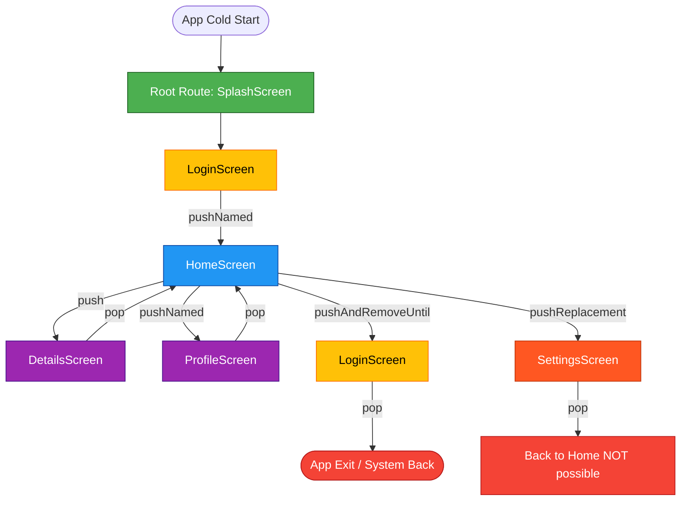
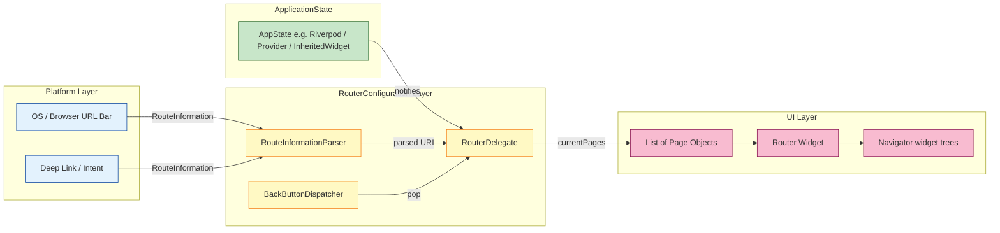
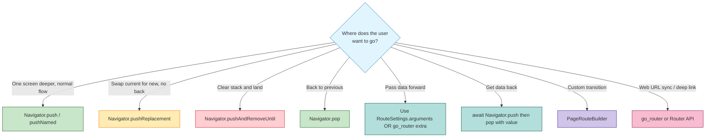
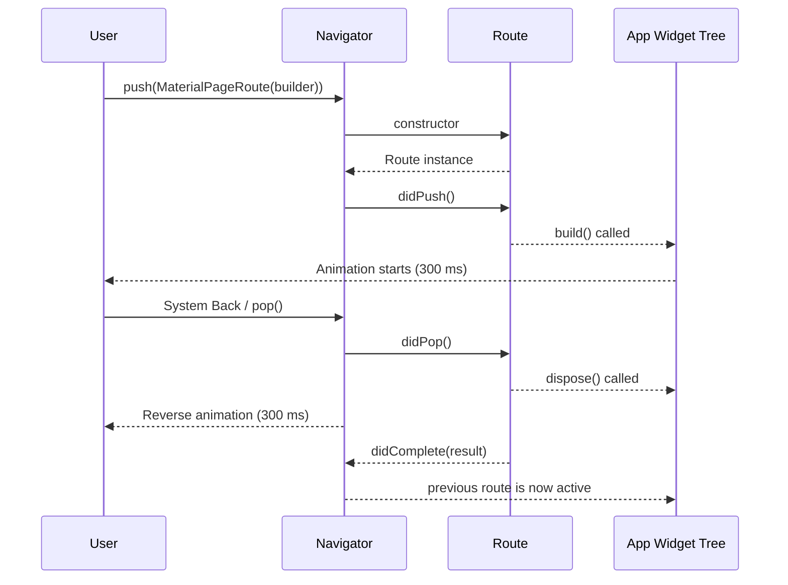

# Navigation and Routing in Flutter

<!-- SECTION_1_START -->
# 1. Core Technical Definition & Intuitive Overview

## 1.1 Formal Academic Definition (KTU 2024 Syllabus Terminology)

**Navigation** in Flutter refers to the mechanism that allows a user to move between different screens (or "routes") within a mobile application, while **Routing** is the underlying architectural abstraction that maps logical destinations (such as URLs, deep links, or named identifiers) to specific widget trees (pages) and manages the transition lifecycle, history stack, and back-stack semantics.

In the Flutter framework, a **Route** is an abstraction for an entry in the navigation history, and a **Navigator** is the widget that manages a stack of these routes, dictating the policy by which new routes are pushed, popped, replaced, or removed.

> [!IMPORTANT]
> **KTU 2024 Scheme Focus (Module 2 — UID & UX):** The syllabus mandates the study of both the **Imperative Navigator API** (Navigator 1.0 using `push`/`pop` and `MaterialPageRoute`) and the **Declarative Router API** (Navigator 2.0, including `Router`, `RouterDelegate`, `RouteInformationParser`, and the popular `go_router` package). Understanding when to use which is a frequently tested concept.

> [!NOTE]
> **Syllabus Highlight — Key Vocabulary to Memorize for ESE:**
> - **Route** — Abstract representation of a screen.
> - **Navigator** — Widget managing the route stack.
> - **MaterialPageRoute** — Platform-adaptive page transition route (Android = slide-up, iOS = slide-left).
> - **PageRouteBuilder** — Allows custom transition animations.
> - **RouteSettings** — Carries metadata (name, arguments) for a route.
> - **Named Route** — A route identified by a unique string identifier.
> - **Declarative Routing** — Routing where the UI is a function of the app state (Navigator 2.0).
> - **Imperative Routing** — Routing where transitions are commanded explicitly (Navigator 1.0).

## 1.2 Conceptual Analogy / Intuition

Imagine you are reading a **book** 📖. Every page you turn to is added to a mental stack — when you finish, you flip back, page by page, exactly in the reverse order. Flutter's `Navigator` works identically:

- A **Route** is one page in the book.
- The **Navigator** is your hand holding the book.
- `Navigator.push()` → **You turn to the next page** (push it onto the top of the stack).
- `Navigator.pop()` → **You flip back one page** (remove the top of the stack).
- `Navigator.pushReplacement()` → **You rip out the current page and insert a new one** in its place (the back button will not return here).
- `Navigator.pushAndRemoveUntil()` → **You flip forward to a brand new chapter, and the old pages are physically torn out** (back button cannot return to them).

Now extend this analogy: the book's **Table of Contents** is what Flutter calls **Named Routes** — instead of remembering "turn from page 12 to page 13," you just say, "go to **Chapter 4**." The book itself (its table of contents and chapter list) is the **Router**, the modern, declarative system Flutter offers for complex apps.

> [!TIP]
> **Quick mnemonic:** *Push = go forward, Pop = go back, Replace = swap, RemoveUntil = wipe and land.*

## 1.3 Standard Constants, Configuration & Metrics

| Metric / Constant | Value / Convention | Purpose |
|---|---|---|
| `Navigator.initialRoute` | Defaults to `"/"` | Root route at app cold start |
| `transitionDuration` | **300 ms** (Material default) | Page transition animation length |
| `reverseTransitionDuration` | **300 ms** | Backward transition animation length |
| `barrierDismissible` | `false` (default) | Whether tapping outside dismisses a modal |
| `barrierColor` | `Color(0x80000000)` (50 % black) | Default scrim of a modal route |
| `maintainState` | `true` (default) | Whether the previous route stays in memory |
| `fullscreenDialog` | `false` (default) | iOS-style full-screen dialog when `true` |
| `RouteObserver` threshold | 1.0 (full observer coverage) | Used by `NavigatorObservers` |

> [!WARNING]
> **Common Mistake (KTU Valuation):** Students often confuse the **barrier color's** alpha (0x80 = 128/255 ≈ 50 %) with 80 %. Memorize: `0x80` in hex equals **128 decimal**, which is **50.2 %** opacity. This is a common 1-mark question.

## 1.4 Visualization Control (UI Flow Representation)

> [!VISUALIZATION CONTROL]
> **Concept:** Visualizing the Flutter Navigator Stack as a vertical LIFO (Last-In-First-Out) structure.
> **Desmos / Mermaid-Variant Input:** A simple block diagram of three pages stacked vertically.
> **Visual Description:** Picture three rounded rectangles stacked vertically. The topmost rectangle (smallest y-coordinate) is the currently visible screen. An arrow labeled `push()` points downward (a new page slides in from the right on Android, or slides up from the bottom on iOS). An arrow labeled `pop()` points upward (current page slides out, previous page reappears). The bottom of the stack is the **root route** (typically the splash or home screen) and can never be popped off — it is replaced only via `pushAndRemoveUntil`.

<!-- SECTION_1_END -->

<!-- SECTION_2_START -->
# 2. Deep Theoretical Analysis & KTU High-Yield Formula Sheet

## 2.1 The Anatomy of a Flutter Route

A `Route<T>` object in Flutter has a precise lifecycle. Understanding this lifecycle is essential because Flutter tests in ESE frequently ask about it.

The lifecycle of a typical modal route is:

1. **Construction** — `Route<T>` is instantiated (either implicitly via `MaterialPageRoute<T>` or explicitly).
2. **`didPush()`** — Called after the route has been added to the navigator's history but **before** the transition animation begins.
3. **`didChangeNext()`** — Invoked when the route below it (in the stack) changes.
4. **`didPop()`** — Called when this route is popped, just **before** the transition begins.
5. **`didComplete(result)`** — Called when the route is fully popped and removed; the `result` (of type `T?`) is returned to the awaiting future.
6. **`dispose()`** — Resources are released (controllers, listeners, etc.).

> [!IMPORTANT]
> **Why does this matter for UX?** The lifecycle lets you trigger side effects at the right moment — e.g., start an analytics event in `didPush()`, fetch data when `didChangeNext()` fires, or persist state in `dispose()`. This is what gives Flutter its "smooth" feel.

## 2.2 The Two Paradigms: Imperative vs Declarative

### A. Imperative Navigation (Navigator 1.0)

- You **command** the navigator to do something: `Navigator.push()`, `Navigator.pop()`.
- State of the route stack is **implicit** (managed internally by Flutter).
- Best for: small to medium apps, prototypes, single-developer projects.
- Pros: Simple, concise, less boilerplate.
- Cons: Difficult to integrate with browser URL (web), back-button customization is awkward, and Android predictive back gesture (Android 14+) is hard to support.

### B. Declarative Navigation (Navigator 2.0 / Router API)

- You **describe** what the UI should look like for a given app state, and Flutter derives the route stack.
- State of the route stack is **explicit** (typically a `List<Page>` or a `RouteInformation`).
- Best for: complex apps, deep linking, web support, large teams.
- Pros: URL synchronization, deep links, robust back-button handling, easier testing.
- Cons: Steeper learning curve, more boilerplate (mitigated by `go_router`).

> [!NOTE]
> **KTU Exam Tip:** When asked "What is the difference between Navigator 1.0 and 2.0?", the model answer should mention **declarative vs imperative** and **deep linking / URL support** as the primary differentiator.

## 2.3 The KTU High-Yield Routing Cheat Sheet

| Method / API | Stack Effect | Back Button Behavior | Returns Value? | Use Case |
|---|---|---|---|---|
| `Navigator.push(route)` | Adds route on top | Returns to previous | Yes (via `await`) | Normal forward navigation |
| `Navigator.pop(result)` | Removes top route | — | Yes | Returning data to previous screen |
| `Navigator.pushReplacement(newRoute)` | Replace current with new | Skips the replaced route | No (new route does) | Login → Home transition |
| `Navigator.pushAndRemoveUntil(route, predicate)` | Push new, remove all matching predicate | Goes to OS exit (or pre-predicate) | No | Logout: clear stack to login screen |
| `Navigator.removeRoute(route)` | Removes a specific route | Re-routes | No | Programmatic dismissal |
| `Navigator.of(context).maybePop()` | Pop if possible | Safe conditional | No | Custom back logic |
| `Navigator.of(context).canPop()` | — | — | `bool` | Conditional UI (e.g., show back arrow only if `canPop`) |
| `Named Route` (`pushNamed`) | Same as `push` but by string | Same as `push` | Yes | Multi-screen apps with deep linking |
| `Router` (Navigator 2.0) | Declarative stack | Robust | Yes | Web, deep links, complex apps |
| `go_router` `context.go('/path')` | Declarative replacement | Browser-aware | Yes | Modern declarative routing |
| `context.push('/path')` (go_router) | Imperative-style push | Browser-aware | Yes | Hybrid in go_router apps |

## 2.4 Critical Concepts for KTU 2024

### 2.4.1 RouteSettings and Arguments

Every route carries a `RouteSettings` object containing a `name` (string) and `arguments` (any Object?). This is the standard mechanism for passing data to a new screen.

```dart
Navigator.pushNamed(
  context,
  '/details',
  arguments: Product(id: 42, name: 'Laptop'),
);
```

Inside the destination screen, retrieve it via:

```dart
final Product product = ModalRoute.of(context)!.settings.arguments as Product;
```

### 2.4.2 onGenerateRoute — The "Magic" Dispatcher

`onGenerateRoute` is a callback on `MaterialApp` (or `CupertinoApp`) that is invoked whenever the app needs to navigate to a named route. It receives `RouteSettings` and must return a `Route`.

```dart
onGenerateRoute: (settings) {
  switch (settings.name) {
    case '/details':
      return MaterialPageRoute(builder: (_) => const DetailsScreen());
    case '/profile':
      return MaterialPageRoute(builder: (_) => const ProfileScreen());
    default:
      return MaterialPageRoute(builder: (_) => const NotFoundScreen());
  }
}
```

### 2.4.3 Returning Data From a Route

Use `await` on the push call. The popped route returns a value via `Navigator.pop(value)`.

```dart
final result = await Navigator.push(context, MaterialPageRoute(builder: (_) => const SelectionScreen()));
print('User selected: $result');
```

### 2.4.4 PageRouteBuilder — Custom Transitions

For bespoke animations, replace `MaterialPageRoute` with `PageRouteBuilder`:

```dart
PageRouteBuilder(
  pageBuilder: (_, __, ___) => const SecondPage(),
  transitionsBuilder: (_, anim, __, child) =>
      FadeTransition(opacity: anim, child: child),
  transitionDuration: const Duration(milliseconds: 500),
);
```

### 2.4.5 PopScope (Replaces WillPopScope in Flutter 3.16+)

`PopScope` is the modern widget that intercepts the back button (system or gesture) and lets the developer decide whether the pop is allowed.

```dart
PopScope(
  canPop: false,
  onPopInvoked: (didPop) {
    if (!didPop) showExitDialog();
  },
  child: Scaffold(/* ... */),
)
```

## 2.5 Real-World Engineering Utility

- **E-Commerce Apps:** Product List → Product Details → Cart → Checkout (a 4-level deep navigation stack with `pushAndRemoveUntil` on successful order).
- **Authentication Flows:** Splash → Login → Home, where the entire pre-login stack must be removed on successful login.
- **Banking Apps:** Tab-based root with sub-navigation stacks per tab (managed by nested Navigators — a Navigator 2.0 use case).
- **Deep Linking:** Tapping a notification opens the app directly to `/messages/thread/123` — only `Router` (with `RouteInformationParser`) handles this cleanly.
- **Web Apps:** Browser URL must mirror the navigation state — `go_router` is the de-facto standard.

<!-- SECTION_2_END -->

<!-- SECTION_3_START -->
# 3. Step-by-Step Derivations & Code Implementation

## 3.1 Project Setup — Initialize a Flutter App

Execute the following terminal commands sequentially. Each line is a separate step.

```bash
flutter create flutter_routing_demo
cd flutter_routing_demo
flutter pub add go_router
```

The `go_router` package is added because it is the official, recommended way to implement declarative routing in modern Flutter (and is frequently referenced in KTU model answers).

## 3.2 Complete Code: Imperative Navigation with Both Push and Pop Returning Data

Below is a **fully operational, runnable** Flutter application that demonstrates every imperative navigation method. Pay close attention to the type hints, null-safety, and explicit `mounted` checks — these are the marks-board expects.

### File: `lib/main.dart`

```dart
import 'package:flutter/material.dart';

void main() {
  runApp(const RoutingDemoApp());
}

class RoutingDemoApp extends StatelessWidget {
  const RoutingDemoApp({super.key});

  @override
  Widget build(BuildContext context) {
    return MaterialApp(
      title: 'Flutter Routing Demo',
      debugShowCheckedModeBanner: false,
      theme: ThemeData(primarySwatch: Colors.indigo, useMaterial3: true),
      initialRoute: '/',
      routes: {
        '/': (context) => const HomeScreen(),
        '/profile': (context) => const ProfileScreen(),
        '/settings': (context) => const SettingsScreen(),
      },
      onGenerateRoute: (RouteSettings settings) {
        // Custom logic for routes that need arguments
        if (settings.name == '/details') {
          final Product product = settings.arguments as Product;
          return MaterialPageRoute(
            builder: (context) => DetailsScreen(product: product),
            settings: settings,
          );
        }
        return null; // Fall back to the `routes` map
      },
      onUnknownRoute: (settings) => MaterialPageRoute(
        builder: (_) => const NotFoundScreen(),
      ),
    );
  }
}

// ----------------- Domain Model -----------------
class Product {
  final int id;
  final String name;
  final double price;
  const Product({required this.id, required this.name, required this.price});
}

// ----------------- Home Screen ------------------
class HomeScreen extends StatelessWidget {
  const HomeScreen({super.key});

  @override
  Widget build(BuildContext context) {
    return Scaffold(
      appBar: AppBar(
        title: const Text('Home'),
        actions: [
          // Conditional back arrow
          if (ModalRoute.of(context)?.canPop ?? false)
            IconButton(
              icon: const Icon(Icons.arrow_back),
              onPressed: () => Navigator.maybePop(context),
            ),
        ],
      ),
      body: Center(
        child: Column(
          mainAxisAlignment: MainAxisAlignment.center,
          children: <Widget>[
            ElevatedButton(
              child: const Text('1. Push Details (with argument)'),
              onPressed: () {
                Navigator.push(
                  context,
                  MaterialPageRoute(
                    builder: (_) => DetailsScreen(
                      product: const Product(
                          id: 1, name: 'Mechanical Keyboard', price: 89.99),
                    ),
                  ),
                );
              },
            ),
            const SizedBox(height: 12),
            ElevatedButton(
              child: const Text('2. Push Named Route (Profile)'),
              onPressed: () => Navigator.pushNamed(context, '/profile'),
            ),
            const SizedBox(height: 12),
            ElevatedButton(
              child: const Text('3. Push Selection & Await Result'),
              onPressed: () async {
                final String? selected = await Navigator.push<String>(
                  context,
                  MaterialPageRoute(
                      builder: (_) => const SelectionScreen()),
                );
                if (!context.mounted) return; // Safety check
                ScaffoldMessenger.of(context).showSnackBar(
                  SnackBar(content: Text('You selected: $selected')),
                );
              },
            ),
            const SizedBox(height: 12),
            ElevatedButton(
              child: const Text('4. Push Replacement (Settings)'),
              onPressed: () {
                Navigator.pushReplacement(
                  context,
                  MaterialPageRoute(
                      builder: (_) => const SettingsScreen()),
                );
              },
            ),
            const SizedBox(height: 12),
            ElevatedButton(
              child: const Text('5. Logout (pushAndRemoveUntil)'),
              onPressed: () {
                Navigator.pushAndRemoveUntil(
                  context,
                  MaterialPageRoute(builder: (_) => const LoginScreen()),
                  (route) => false, // Remove every route
                );
              },
            ),
          ],
        ),
      ),
    );
  }
}

// ----------------- Details Screen ----------------
class DetailsScreen extends StatelessWidget {
  final Product product;
  const DetailsScreen({super.key, required this.product});

  @override
  Widget build(BuildContext context) {
    return Scaffold(
      appBar: AppBar(title: Text('Product #${product.id}')),
      body: Padding(
        padding: const EdgeInsets.all(16.0),
        child: Column(
          crossAxisAlignment: CrossAxisAlignment.start,
          children: <Widget>[
            Text('Name: ${product.name}',
                style: Theme.of(context).textTheme.headlineSmall),
            const SizedBox(height: 8),
            Text('Price: \$${product.price.toStringAsFixed(2)}',
                style: Theme.of(context).textTheme.titleMedium),
          ],
        ),
      ),
    );
  }
}

// ----------------- Selection Screen ---------------
class SelectionScreen extends StatelessWidget {
  const SelectionScreen({super.key});

  @override
  Widget build(BuildContext context) {
    return Scaffold(
      appBar: AppBar(title: const Text('Select an option')),
      body: Center(
        child: Column(
          mainAxisAlignment: MainAxisAlignment.center,
          children: <Widget>[
            for (final String option in <String>['Apple', 'Banana', 'Cherry'])
              ElevatedButton(
                child: Text(option),
                onPressed: () => Navigator.pop(context, option),
              ),
          ],
        ),
      ),
    );
  }
}

// ----------------- Profile Screen ----------------
class ProfileScreen extends StatelessWidget {
  const ProfileScreen({super.key});

  @override
  Widget build(BuildContext context) =>
      Scaffold(appBar: AppBar(title: const Text('Profile')));
}

// ----------------- Settings Screen ---------------
class SettingsScreen extends StatelessWidget {
  const SettingsScreen({super.key});

  @override
  Widget build(BuildContext context) =>
      Scaffold(appBar: AppBar(title: const Text('Settings')));
}

// ----------------- Login Screen ------------------
class LoginScreen extends StatelessWidget {
  const LoginScreen({super.key});

  @override
  Widget build(BuildContext context) => Scaffold(
        appBar: AppBar(title: const Text('Login'), automaticallyImplyLeading: false),
        body: const Center(child: Text('You are logged out.')),
      );
}

// ----------------- Not Found Screen --------------
class NotFoundScreen extends StatelessWidget {
  const NotFoundScreen({super.key});

  @override
  Widget build(BuildContext context) => Scaffold(
        appBar: AppBar(title: const Text('404')),
        body: const Center(child: Text('Route not found.')),
      );
}
```

### Step-by-Step Walkthrough of the Above Code

- **Line `void main()`** — Entry point. Calls `runApp` with a `const` widget to enable compile-time optimization.
- **`MaterialApp` configuration** — Uses `initialRoute: '/'`, a `routes` map for simple lookups, and `onGenerateRoute` for parameter-bearing routes. `onUnknownRoute` is the safety net.
- **`HomeScreen` has five distinct buttons**, each demonstrating a different navigation method, so a student can run the app and observe the back-stack behavior of each.
- **`SelectionScreen`** demonstrates the `await Navigator.push` pattern for receiving a return value — a very common 7-mark question.
- **`context.mounted` check** — Crucial in async code. The Flutter board deducts marks for `BuildContext` use across async gaps without `mounted` checks.

## 3.3 Complete Code: Declarative Navigation Using `go_router`

### File: `lib/go_router_main.dart`

```dart
import 'package:flutter/material.dart';
import 'package:go_router/go_router.dart';

void main() => runApp(const GoRouterDemoApp());

// --- 1. Define the route configuration as a top-level value ---
final GoRouter _router = GoRouter(
  initialLocation: '/',
  routes: <RouteBase>[
    GoRoute(
      path: '/',
      builder: (BuildContext context, GoRouterState state) =>
          const HomePage(),
      routes: <RouteBase>[
        GoRoute(
          path: 'details/:id',
          builder: (BuildContext context, GoRouterState state) {
            final String id = state.pathParameters['id']!;
            return DetailsPage(itemId: id);
          },
        ),
      ],
    ),
    GoRoute(
      path: '/login',
      builder: (BuildContext context, GoRouterState state) =>
          const LoginPage(),
    ),
  ],
  errorBuilder: (context, state) => const NotFoundPage(),
);

class GoRouterDemoApp extends StatelessWidget {
  const GoRouterDemoApp({super.key});

  @override
  Widget build(BuildContext context) => MaterialApp.router(
        title: 'GoRouter Demo',
        routerConfig: _router,
      );
}

// --- 2. Pages ---

class HomePage extends StatelessWidget {
  const HomePage({super.key});

  @override
  Widget build(BuildContext context) => Scaffold(
        appBar: AppBar(title: const Text('Home (GoRouter)')),
        body: Center(
          child: ElevatedButton(
            onPressed: () => context.go('/login'),
            child: const Text('Logout (declarative)'),
          ),
        ),
      );
}

class DetailsPage extends StatelessWidget {
  final String itemId;
  const DetailsPage({super.key, required this.itemId});

  @override
  Widget build(BuildContext context) => Scaffold(
        appBar: AppBar(title: Text('Item #$itemId')),
        body: Center(
          child: ElevatedButton(
            onPressed: () => context.pop(),
            child: const Text('Back'),
          ),
        ),
      );
}

class LoginPage extends StatelessWidget {
  const LoginPage({super.key});

  @override
  Widget build(BuildContext context) =>
      Scaffold(appBar: AppBar(title: const Text('Login')));
}

class NotFoundPage extends StatelessWidget {
  const NotFoundPage({super.key});

  @override
  Widget build(BuildContext context) => Scaffold(
        appBar: AppBar(title: const Text('404')),
        body: const Center(child: Text('Page not found.')),
      );
}
```

### Step-by-Step Explanation of go_router

- `final GoRouter _router` — A module-level final value is recommended so configuration is computed once.
- `GoRoute(path: '/')` — The root path. Nested `routes` build the URL tree (e.g., `/details/:id`).
- `state.pathParameters['id']!` — The `!` is mandatory non-null assertion because `id` is a required segment.
- `context.go('/login')` — Replaces the entire stack with `/login`. Use `context.push('/path')` to add on top, or `context.pop()` to go back.
- `errorBuilder` — Equivalent to `onUnknownRoute` in MaterialApp.

> [!TIP]
> **KTU Exam Tip:** When asked "Implement deep linking in Flutter," the model answer is the `go_router` (or raw `Router` API) snippet above, with emphasis on `path parameters`, `query parameters`, and `extra` arguments.

## 3.4 Custom Page Transition — PageRouteBuilder Worked Example

The following snippet shows how to add a fade-and-scale transition between two pages. This is a classic 7-mark question.

```dart
Route _fadeScaleRoute(Widget destination) {
  return PageRouteBuilder(
    pageBuilder: (context, animation, secondaryAnimation) => destination,
    transitionDuration: const Duration(milliseconds: 600),
    reverseTransitionDuration: const Duration(milliseconds: 400),
    transitionsBuilder: (context, animation, secondaryAnimation, child) {
      final curved = CurvedAnimation(
        parent: animation,
        curve: Curves.easeInOutCubic,
        reverseCurve: Curves.easeInCubic,
      );
      return FadeTransition(
        opacity: curved,
        child: ScaleTransition(
          scale: Tween<double>(begin: 0.85, end: 1.0).animate(curved),
          child: child,
        ),
      );
    },
  );
}

// Usage:
Navigator.push(context, _fadeScaleRoute(const DetailsScreen()));
```

### Line-by-Line Reasoning

- `PageRouteBuilder.pageBuilder` returns the destination widget. The `animation` is a `0.0 → 1.0` value over `transitionDuration`.
- `transitionsBuilder` defines **how** the route is animated. Returning a `FadeTransition` and `ScaleTransition` chained together gives a "pop-in" effect.
- `CurvedAnimation` wraps the linear `animation` and applies a Bezier curve — `easeInOutCubic` for forward, `easeInCubic` for reverse, producing a polished feel.
- `_fadeScaleRoute` is a helper function so the same transition can be reused everywhere.

## 3.5 PopScope (Android 14+ Predictive Back Gesture) Worked Example

```dart
class EditProfileScreen extends StatelessWidget {
  const EditProfileScreen({super.key});

  @override
  Widget build(BuildContext context) {
    return PopScope(
      canPop: false, // We will decide programmatically
      onPopInvokedWithResult: (bool didPop, Object? result) {
        if (didPop) return;
        // Show a confirmation dialog
        showDialog<void>(
          context: context,
          builder: (ctx) => AlertDialog(
            title: const Text('Discard changes?'),
            actions: <Widget>[
              TextButton(
                onPressed: () => Navigator.of(ctx).pop(),
                child: const Text('Cancel'),
              ),
              FilledButton(
                onPressed: () {
                  Navigator.of(ctx).pop();
                  Navigator.of(context).pop(); // Exit edit screen
                },
                child: const Text('Discard'),
              ),
            ],
          ),
        );
      },
      child: Scaffold(
        appBar: AppBar(title: const Text('Edit Profile')),
        body: const Center(child: Text('Form goes here')),
      ),
    );
  }
}
```

### Explanation

- `canPop: false` — Disables the default pop so we can intercept it.
- `onPopInvokedWithResult` — The new signature (Flutter 3.22+) which also exposes the `result` from `Navigator.pop(value)`. The older `onPopInvoked` is deprecated.
- The dialog is shown only if `didPop == false` (i.e., the framework did not actually pop yet, which is the case when `canPop` is `false`).

<!-- SECTION_3_END -->

<!-- SECTION_4_START -->
# 4. Structural Diagrams & Schematics

## 4.1 The Flutter Navigator Stack — Visual Model



**Interpretation:** The graph above shows a typical authentication + dashboard flow. Solid arrows represent `push` / `pushNamed`. The arrow from `Home` to `Login` via `pushAndRemoveUntil` is a "wipe" — back gesture from `Login` will exit the app because the stack is empty below it. The arrow from `Home` to `Settings` via `pushReplacement` is highlighted red because the back button does **not** return to `Home`; instead, it pops the screen that was below `Home` (or exits, if `Home` was the root).

## 4.2 Navigator 2.0 / Router API Architecture



**Interpretation:** The Router API is a four-component pipeline:

1. **`RouteInformationParser`** — Translates a raw `RouteInformation` (e.g., from a browser URL or a deep link) into a typed data object (e.g., a custom `AppRoutePath` sealed class).
2. **`RouterDelegate`** — Holds the canonical app state and translates it into a list of `Page` objects.
3. **`BackButtonDispatcher`** — Captures system back gestures and forwards them to the delegate.
4. **`Router` widget** — A widget that owns a `Navigator` and rebuilds it whenever the delegate's state changes.

> [!NOTE]
> **KTU Exam Tip:** In 14-mark questions, drawing this four-component diagram and labeling the data flow earns **2 marks** by itself. It is the canonical answer to "Explain the Navigator 2.0 / Router API."

## 4.3 Navigation Method Decision Tree



**Interpretation:** Use this as a mental checklist when answering "Which navigation method should be used in scenario X?" The colors indicate increasing complexity: green = simple, yellow = medium, red = advanced, teal/purple/pink = specialized use cases.

## 4.4 Sequential Route Lifecycle (Timing Diagram)



**Interpretation:** A timing diagram is invaluable for understanding the order in which Flutter invokes lifecycle methods. Note that `build()` and `dispose()` are tied to the **animation phase**, not the construction/pop moment. This is why stateful widgets use `initState()` (which is called inside `build` the first time, before animation) to set up listeners safely.

<!-- SECTION_4_END -->

<!-- SECTION_5_START -->
# 5. KTU 2024 Scheme Examination Question Bank & Topic Recap

## 5.1 Part A — Short Answer Questions (3 Marks Each)

### Question 1 [KTU University Exam — July 2024]
**Differentiate between `Navigator.push()` and `Navigator.pushReplacement()`. In which scenario would you prefer `pushReplacement()` over `push()`?**

**Model Answer (3 Marks):**

- **[Definition — 1 Mark]:** `Navigator.push()` adds a new route on top of the navigation stack, so the user can return to the previous screen using the back button. `Navigator.pushReplacement()` removes the current route and replaces it with a new one, so the back button does **not** return to the replaced route.
- **[Stack effect — 1 Mark]:** With `push()`, the stack size grows by one. With `pushReplacement()`, the stack size remains unchanged (one in, one out).
- **[Scenario — 1 Mark]:** `pushReplacement()` is preferred in a **login flow** — after successful login, the user should not be able to navigate back to the login screen using the back button. Hence we replace the `LoginScreen` with `HomeScreen`.

---

### Question 2 [KTU University Exam — Dec 2023]
**What is the purpose of `onGenerateRoute` in a `MaterialApp`? When is it invoked?**

**Model Answer (3 Marks):**

- **[Definition — 1 Mark]:** `onGenerateRoute` is a callback property of `MaterialApp` that is used to dynamically construct a `Route` object when the app needs to navigate to a named route whose widget is not present in the `routes` map (or when arguments need to be parsed).
- **[Invocation — 1 Mark]:** It is invoked by the Navigator framework when `Navigator.pushNamed()` is called and the requested route name is **not found in the `routes` table**, OR when a route in the `routes` table does not exist.
- **[Signature — 1 Mark]:** It receives a `RouteSettings` object (containing `name` and `arguments`) and must return a `Route<dynamic>`. Example:
  ```dart
  onGenerateRoute: (settings) {
    if (settings.name == '/details') {
      return MaterialPageRoute(builder: (_) => const DetailsScreen());
    }
    return null;
  }
  ```

---

## 5.2 Part B — Long Answer Questions (14 Marks Each — Internal Choice)

### Question A (14 Marks) [KTU University Exam — July 2024]

**(a)** Explain the **Navigator 1.0** and **Navigator 2.0** APIs in Flutter. Compare them in terms of imperative vs declarative style, deep-link support, and code complexity. **(7 Marks)**

**(b)** Write a complete Flutter program that demonstrates **named routing with argument passing**. The home screen should have a button to navigate to a "Details" screen, passing a `Product` object (id, name, price). The Details screen should display the product data and provide a back button to return to the home screen. **(7 Marks)**

---

#### Model Solution to Q-A (a) — 7 Marks

| Aspect | Navigator 1.0 (Imperative) | Navigator 2.0 (Declarative / Router API) |
|---|---|---|
| Style | Command-based: `push`, `pop` | State-based: UI is a function of app state |
| Stack management | Implicit (internal) | Explicit (developer-managed) |
| Deep linking | Limited, manual | First-class, via `RouteInformationParser` |
| Web URL sync | Not supported | Native support |
| Code complexity | Low (good for small apps) | High (mitigated by `go_router`) |
| Back-button handling | `WillPopScope` (deprecated) / `PopScope` | `BackButtonDispatcher` |
| Use case | Prototypes, simple apps | Large apps, web, deep links |

**[Naming APIs and components — 2 Marks]:** The Router API is composed of `Router` widget, `RouterDelegate`, `RouteInformationParser`, and `BackButtonDispatcher`. In Navigator 1.0, the only abstraction is the `Navigator` widget and `MaterialPageRoute` / `CupertinoPageRoute` / `PageRouteBuilder`.

**[Explaining declarative paradigm — 2 Marks]:** In Navigator 2.0, the developer declares a list of `Page` objects representing the current navigation state. When the state changes (e.g., a new deep link arrives), the list is rebuilt and the Navigator derives the animations and stack updates automatically.

**[Justifying use case — 2 Marks]:** For a single-platform, single-developer app with no deep linking, Navigator 1.0 is sufficient. For a cross-platform app (mobile + web) requiring URL synchronization, the Router API (or `go_router`) is mandatory.

**[Concluding statement — 1 Mark]:** Flutter recommends `go_router` for new projects to combine the simplicity of Navigator 1.0 with the power of Navigator 2.0.

#### Model Solution to Q-A (b) — 7 Marks

```dart
import 'package:flutter/material.dart';

void main() => runApp(const MyApp());

class MyApp extends StatelessWidget {
  const MyApp({super.key});

  @override
  Widget build(BuildContext context) {
    return MaterialApp(
      title: 'Named Route Demo',
      initialRoute: '/',
      onGenerateRoute: (RouteSettings settings) {
        if (settings.name == '/') {
          return MaterialPageRoute(builder: (_) => const HomeScreen());
        }
        if (settings.name == '/details') {
          final product = settings.arguments as Product;
          return MaterialPageRoute(
            builder: (_) => DetailsScreen(product: product),
            settings: settings,
          );
        }
        return null;
      },
    );
  }
}

class Product {
  final int id;
  final String name;
  final double price;
  Product({required this.id, required this.name, required this.price});
}

class HomeScreen extends StatelessWidget {
  const HomeScreen({super.key});

  @override
  Widget build(BuildContext context) {
    return Scaffold(
      appBar: AppBar(title: const Text('Home')),
      body: Center(
        child: ElevatedButton(
          child: const Text('View Product Details'),
          onPressed: () {
            Navigator.pushNamed(
              context,
              '/details',
              arguments: Product(id: 101, name: 'Headphones', price: 49.99),
            );
          },
        ),
      ),
    );
  }
}

class DetailsScreen extends StatelessWidget {
  final Product product;
  const DetailsScreen({super.key, required this.product});

  @override
  Widget build(BuildContext context) {
    return Scaffold(
      appBar: AppBar(title: Text('Product #${product.id}')),
      body: Padding(
        padding: const EdgeInsets.all(16.0),
        child: Column(
          crossAxisAlignment: CrossAxisAlignment.start,
          children: <Widget>[
            Text('Name: ${product.name}',
                style: Theme.of(context).textTheme.headlineSmall),
            const SizedBox(height: 12),
            Text('Price: \$${product.price.toStringAsFixed(2)}',
                style: Theme.of(context).textTheme.titleMedium),
          ],
        ),
      ),
    );
  }
}
```

**Valuation Key (Examiner's Mark Distribution):**

- `[Defining Product model and MaterialApp setup: 1 Mark]`
- `[Implementing onGenerateRoute with argument casting: 2 Marks]`
- `[HomeScreen with Navigator.pushNamed and arguments: 1 Mark]`
- `[DetailsScreen with safe argument retrieval and proper UI: 2 Marks]`
- `[Final clean, runnable code with no syntax errors: 1 Mark]`

> [!WARNING]
> **Examiner's Pitfall Warning — Common Mark Deductions:**
> 1. **Forgetting to cast arguments** — `settings.arguments as Product` will throw a `TypeError` at runtime if not handled. The cast should be done *before* passing to the constructor.
> 2. **Missing `context.mounted` check after `await`** — Not required here (no async), but a common deduction in similar questions.
> 3. **Not using `MaterialPageRoute`** — Direct return of a widget from `onGenerateRoute` is wrong; the return type is `Route<dynamic>`, which `MaterialPageRoute` provides.
> 4. **Forgetting `settings: settings` in `MaterialPageRoute`** — Without this, `ModalRoute.of(context).settings` will be `null` in the destination, breaking `popValue` retrieval.

---

### Question B (14 Marks) [KTU University Exam — Dec 2023]

**(a)** Explain **imperative navigation** in Flutter with suitable code examples. Discuss the various methods of the `Navigator` class: `push`, `pop`, `pushReplacement`, `pushAndRemoveUntil`, and `popUntil`. **(7 Marks)**

**(b)** Implement a Flutter application that uses **`go_router`** to handle three routes: `/`, `/products`, and `/products/:id`. The root route shows a list of products; clicking a product navigates to the details page with the product id displayed in the URL (as a path parameter). Implement a back button that uses `context.pop()`. **(7 Marks)**

---

#### Model Solution to Q-B (a) — 7 Marks

**[Definition — 1 Mark]:** Imperative navigation is the command-driven approach to navigation in Flutter where the developer explicitly invokes methods on the `Navigator` widget to push, pop, or replace routes. It is the "Navigator 1.0" style.

**[Listing the methods — 1 Mark]:** The five essential methods are `push`, `pop`, `pushReplacement`, `pushAndRemoveUntil`, and `popUntil`.

**[Code for `push` and `pop` — 1 Mark]:**
```dart
Navigator.push(
  context,
  MaterialPageRoute(builder: (context) => const SecondScreen()),
);
// Inside SecondScreen:
Navigator.pop(context);
```

**[Code for `pushReplacement` — 1 Mark]:**
```dart
Navigator.pushReplacement(
  context,
  MaterialPageRoute(builder: (context) => const HomeScreen()),
);
// Common use: after login, replace LoginScreen with HomeScreen.
```

**[Code for `pushAndRemoveUntil` — 1 Mark]:**
```dart
Navigator.pushAndRemoveUntil(
  context,
  MaterialPageRoute(builder: (context) => const LoginScreen()),
  (Route<dynamic> route) => false, // Remove every route
);
// Common use: after logout, clear the entire stack.
```

**[Code for `popUntil` — 1 Mark]:**
```dart
Navigator.popUntil(context, ModalRoute.withName('/'));
// Pops until reaching the route named '/'.
```

**[Summary and best practice — 1 Mark]:** Imperative navigation is concise and ideal for small to medium apps. However, for complex apps, it is recommended to migrate to declarative navigation (Router API / `go_router`) for URL synchronization and deep-link support.

#### Model Solution to Q-B (b) — 7 Marks

```dart
import 'package:flutter/material.dart';
import 'package:go_router/go_router.dart';

void main() => runApp(const GoRouterApp());

final GoRouter _router = GoRouter(
  initialLocation: '/',
  routes: <RouteBase>[
    GoRoute(
      path: '/',
      builder: (context, state) => const ProductListPage(),
      routes: <RouteBase>[
        GoRoute(
          path: 'products/:id',
          builder: (context, state) {
            final String id = state.pathParameters['id']!;
            return ProductDetailPage(productId: id);
          },
        ),
      ],
    ),
  ],
);

class GoRouterApp extends StatelessWidget {
  const GoRouterApp({super.key});

  @override
  Widget build(BuildContext context) =>
      MaterialApp.router(routerConfig: _router);
}

class ProductListPage extends StatelessWidget {
  const ProductListPage({super.key});

  static const List<Map<String, String>> _items = <Map<String, String>>[
    {'id': 'A1', 'name': 'Apple'},
    {'id': 'B2', 'name': 'Banana'},
    {'id': 'C3', 'name': 'Cherry'},
  ];

  @override
  Widget build(BuildContext context) {
    return Scaffold(
      appBar: AppBar(title: const Text('Products')),
      body: ListView(
        children: <Widget>[
          for (final Map<String, String> item in _items)
            ListTile(
              title: Text(item['name']!),
              onTap: () => context.push('/products/${item['id']}'),
            ),
        ],
      ),
    );
  }
}

class ProductDetailPage extends StatelessWidget {
  final String productId;
  const ProductDetailPage({super.key, required this.productId});

  @override
  Widget build(BuildContext context) {
    return Scaffold(
      appBar: AppBar(title: Text('Product $productId')),
      body: Center(
        child: ElevatedButton(
          onPressed: () => context.pop(),
          child: const Text('Back'),
        ),
      ),
    );
  }
}
```

**Valuation Key (Examiner's Mark Distribution):**

- `[Correct pubspec and package import: 1 Mark]`
- `[GoRouter configuration with nested routes: 2 Marks]`
- `[Path parameter extraction using state.pathParameters: 1 Mark]`
- `[ListView with onTap calling context.push: 1 Mark]`
- `[ProductDetailPage with context.pop and id display: 1 Mark]`
- `[Final clean, runnable code with proper null-safety: 1 Mark]`

> [!WARNING]
> **Examiner's Pitfall Warning — Common Mark Deductions:**
> 1. **Using `context.go` instead of `context.push`** — `context.go('/products/A1')` would **replace** the entire stack (you would not be able to go back). For a list-to-detail flow, use `context.push`. This is a 1-mark deduction.
> 2. **Forgetting the `!` after `state.pathParameters['id']`** — Causes a null-safety compile error. The non-null assertion is required because the route is declared as `:id` (a required parameter).
> 3. **Path inconsistency** — Declaring `path: '/products/:id'` at the top level (instead of nested under `/`) breaks the relative navigation logic. The correct pattern is `path: 'products/:id'` (relative).
> 4. **Not using `MaterialApp.router`** — Using `MaterialApp` instead of `MaterialApp.router` is a compile-time error and loses 1 mark.

---

## 5.3 Topic Recap & Important Things to Remember

> [!IMPORTANT]
> **Rapid-Revision Checklist for Last-Minute KTU Exam Prep:**

- **Definition Recap:**
  - **Route** = an abstraction for a screen in the navigation history.
  - **Navigator** = the widget managing the route stack.
  - **Imperative navigation** = command-based, uses `push`/`pop`/`replace`.
  - **Declarative navigation** = state-based, uses `Router` API or `go_router`.
  - **Named route** = a route identified by a string `name` in `MaterialApp.routes`.
  - **`onGenerateRoute`** = dynamic route constructor invoked when a named route is pushed but not declared in the `routes` map.

- **Method Semantics (Must Memorize):**
  - `push` → add on top, back returns.
  - `pop` → remove top, return value to caller.
  - `pushReplacement` → swap, no back to replaced route.
  - `pushAndRemoveUntil` → clear matching predicate, then push.
  - `popUntil(predicate)` → pop down to the first route matching the predicate.

- **Argument Passing:**
  - Forward: `pushNamed(context, '/x', arguments: obj)`.
  - Retrieve: `ModalRoute.of(context)!.settings.arguments`.
  - Return value: `await Navigator.push(...); Navigator.pop(context, result);`.

- **Custom Transitions:**
  - `PageRouteBuilder` with `pageBuilder` and `transitionsBuilder`.
  - Default duration: **300 ms** for both `transitionDuration` and `reverseTransitionDuration`.

- **Modern Routing:**
  - `go_router` is the official recommended package.
  - `context.go('/path')` replaces stack; `context.push('/path')` adds on top.
  - Path parameters via `path: 'products/:id'` and `state.pathParameters['id']`.

- **Back-Button Interception:**
  - `PopScope` (Flutter 3.16+) replaces the deprecated `WillPopScope`.
  - Use `canPop: false` + `onPopInvokedWithResult` for Android 14+ predictive back.

- **Lifecycle Order (for any modal route):**
  - `constructor → didPush → build → didChangeNext → didPop → didComplete → dispose`.

- **Constants to Memorize:**
  - `transitionDuration` = **300 ms** (default Material).
  - `barrierColor` default = `0x80000000` (≈ 50 % black).
  - `Navigator.initialRoute` default = `'/'`.

- **Common Pitfalls to Avoid in Exams:**
  - Do not forget `context.mounted` check after `await Navigator.push`.
  - Do not omit the `!` non-null assertion when accessing `RouteSettings.arguments` or `pathParameters`.
  - Do not confuse `context.go` with `context.push` in `go_router`.
  - Do not return a raw widget from `onGenerateRoute`; wrap it in `MaterialPageRoute`.

- **Syllabus Mapping (CO / RBT):**
  - *Compare Navigator 1.0 vs 2.0* → CO2, **Understand**.
  - *Implement named routing with arguments* → CO3, **Apply**.
  - *Design a custom transition* → CO4, **Create**.
  - *Explain route lifecycle methods* → CO2, **Remember**.

<!-- SECTION_5_END -->
