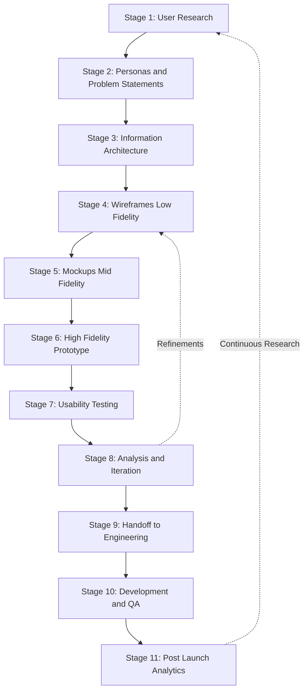
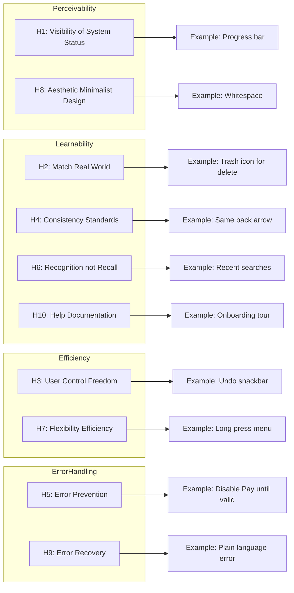
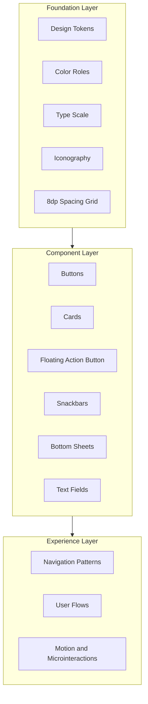
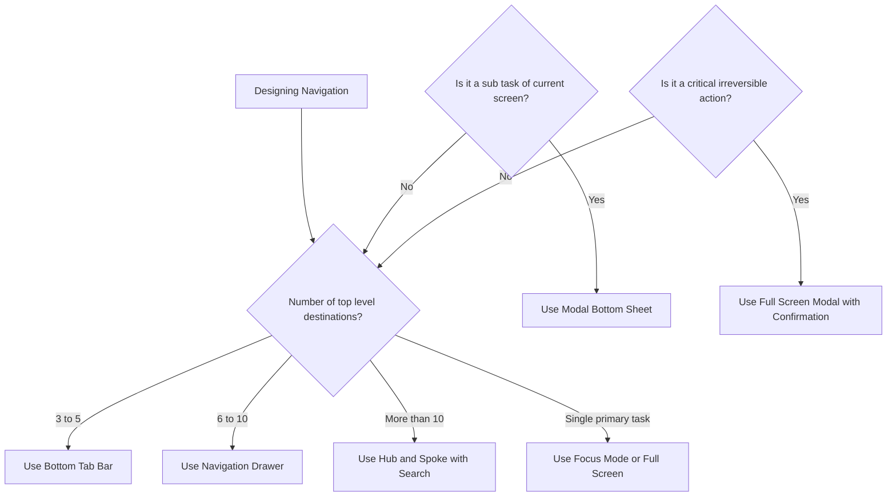
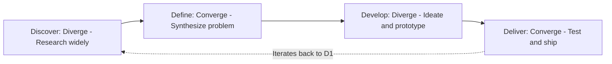
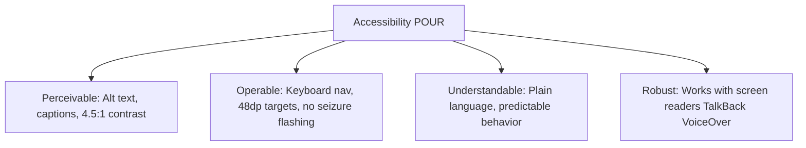
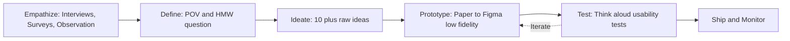

# User Interface Design and User Experience:

<!-- SECTION_1_START -->
# Module 2: User Interface Design and User Experience

## 1. Core Technical Definition & Intuitive Overview

### 1.1 Formal Academic Definition (KTU 2024 Syllabus Terminology)

**User Interface (UI)** is the point of human–computer interaction and communication in a device, comprising the visual, auditory, and tactile elements through which a user interacts with an application. In mobile application development, UI encompasses the **screens, layouts, controls (widgets), icons, typography, color schemes, animations, and micro-interactions** rendered on the device display.

**User Experience (UX)** is a broader, holistic, and time-extended construct describing the totality of a user's perceptions, emotions, cognitive responses, and behavioral outcomes before, during, and after interacting with a mobile application. UX integrates **usability, utility, desirability, accessibility, credibility, findability, and value** as defined by ISO 9241-210.

> [!IMPORTANT]
> **KTU 2024 Definition Reference (ISO 9241-210):**
> *"User experience is a person's perceptions and responses that result from the use or anticipated use of a product, system or service."*
>
> UX ≠ UI. **UI is the "what the user sees and touches"; UX is "how the user feels, thinks, and behaves" while/after using it.** UI is a *subset* of UX.

### 1.2 Conceptual Analogy / Intuition

> [!NOTE]
> **🍽️ Restaurant Analogy — The Easiest Way to Remember the Difference**
>
> - **UI = The Restaurant Interior.** The menu card layout, plate colors, lighting, font of the menu, table arrangement, the way the waiter hands you the bill. This is what you *see and touch*.
> - **UX = The Entire Dining Experience.** The warmth of the welcome, how easy it is to find the restaurant, the music, the taste of the food, the speed of service, the ease of payment, whether you recommend it to a friend. This is the *sum of feelings and outcomes*.
>
> A restaurant can have a stunning interior (great UI) but terrible food and slow service (bad UX). Another can be plain-looking (mediocre UI) but the food is unforgettable and checkout is one-tap (great UX). **In mobile apps: a beautiful screen that confuses the user = bad UX. A plain screen that solves a real problem in 3 seconds = great UX.**

### 1.3 Foundational Terminology (KTU Board Glossary)

| Term | One-Line Definition |
|---|---|
| **Affordance** | A visual/physical cue suggesting how an object should be used (e.g., a button looks raised → pressable). |
| **Signifier** | An indicator that communicates *where* the action is (e.g., underline = link). |
| **Feedback** | The system's response confirming an action (e.g., ripple animation on tap). |
| **Mapping** | The relationship between a control and its effect (e.g., steering wheel ↔ wheel direction). |
| **Constraints** | Design restrictions preventing incorrect use (e.g., disabled "Pay" button until form is valid). |
| **Mental Model** | The user's pre-existing expectation of how something works. |
| **Heuristic** | A rule-of-thumb usability principle (e.g., Nielsen's 10). |
| **Wireframe** | A low-fidelity structural blueprint of a screen. |
| **Mockup** | A mid-fidelity, static, visual representation. |
| **Prototype** | A high-fidelity, interactive simulation of the final product. |
| **Persona** | A fictional, research-backed archetype of a target user. |
| **User Flow** | The path a user takes through an app to complete a task. |
| **Information Architecture (IA)** | The structural organization of content/features for findability. |
| **Microinteraction** | A small, contained moment that accomplishes a single task (e.g., toggle switch). |

### 1.4 Standard Metrics & Laws (Highlighted in **Bold**)

> [!IMPORTANT]
> **Engineering Constants / Heuristics You MUST Memorize for KTU:**
>
> - **Fitts's Law:** Time to acquire a target = $a + b \cdot \log_2\left(\frac{D}{W} + 1\right)$, where $D$ = distance to target, $W$ = width of target. **Larger and closer targets = faster interaction.**
> - **Hick's Law:** Decision time = $a + b \cdot \log_2(n)$, where $n$ = number of choices. **More choices = slower decisions.**
> - **Miller's Law:** Working memory can hold **$7 \pm 2$** chunks of information at a time.
> - **Jakob's Law:** Users prefer your app to work like *other apps they already know*.
> - **The 3-Tap Rule (industry convention):** A user should reach any core feature within **3 taps** of the home screen.
> - **Nielsen Norman Group's 10 Usability Heuristics** (1994) — the gold standard for usability evaluation.
> - **Material Design** (Google) and **Human Interface Guidelines / HIG** (Apple) — the two dominant mobile design systems.
> - **WCAG 2.1** (Web Content Accessibility Guidelines) — global accessibility standard, with **4.5:1 minimum contrast ratio** for normal text and **3:1** for large text.

> [!VISUALIZATION CONTROL]
> **Concept:** Hick's Law — Decision Time vs. Number of Menu Options
> **Plotting Tool:** Desmos (or GeoGebra)
> **Input Equations:**
> * $T(n) = 100 \cdot \log_2(n + 1)$ (assume base intercept = 100 ms, coefficient = 100)
> **Variable Ranges:** $n$ from $1$ to $32$ on x-axis, $T$ from $0$ to $600$ ms on y-axis.
> **Visual Description:** You will observe a logarithmic curve rising steeply at first, then flattening. This visually proves that **doubling the menu items does NOT double the decision time — it adds a constant overhead (~100 ms)**. Designers use this to justify grouping items into categories rather than showing 50 icons on a single toolbar.

---

<!-- SECTION_1_END -->

<!-- SECTION_2_START -->
# 2. Deep Theoretical Analysis & KTU High-Yield Formula Sheet

## 2.1 The UX Design Lifecycle (UX Lifecycle — KTU Module 2 Core)

The UX design process is iterative and non-linear. KTU 2024 expects students to articulate the **five-stage Design Thinking framework** popularized by the Hasso-Plattner Institute (d.school, Stanford).

> [!NOTE]
> **The 5 Stages of Design Thinking (Stanford d.school model):**
> 1. **Empathize** — Understand users through interviews, surveys, observation, field studies.
> 2. **Define** — Synthesize findings into a clear *Problem Statement* / *Point of View (POV)*.
> 3. **Ideate** — Brainstorm multiple solutions ("How Might We…" questions).
> 4. **Prototype** — Build cheap, quick, low-fidelity representations.
> 5. **Test** — Validate prototypes with real users; refine and loop back.

**Why this matters in mobile development:** Every successful app (Instagram, Uber, WhatsApp) ran through these 5 stages multiple times. The KTU board frequently asks: *"Differentiate between low-fidelity and high-fidelity prototypes"* or *"Explain the stages of Design Thinking with a mobile app example."*

## 2.2 Nielsen's 10 Usability Heuristics (Board Favorite — 14-Mark Territory)

Jakob Nielsen (1994) defined 10 heuristics. **Memorize all 10 with examples.** KTU board frequently asks for *explanation of any 6 with mobile app examples*.

| # | Heuristic | Mobile App Example |
|---|---|---|
| **H1** | **Visibility of system status** | Progress bar during download; WhatsApp "typing…" indicator; "Sending…" toast. |
| **H2** | **Match between system and the real world** | 🗑️ trash icon for delete; 📞 phone icon for call; calendar dates shown as "Mon, 12 Aug" not "2024-08-12". |
| **H3** | **User control and freedom** | Back button, Undo snackbar (Gmail "Undo Archive"), Cancel dialogs. |
| **H4** | **Consistency and standards** | Same back-arrow position across all screens; same color for primary CTA. |
| **H5** | **Error prevention** | Disable "Pay" button until card number is 16 digits; confirm dialog before delete. |
| **H6** | **Recognition rather than recall** | Show recent searches (Swiggy), recent files, autocomplete suggestions. |
| **H7** | **Flexibility and efficiency of use** | Keyboard shortcuts for power users; long-press for advanced options; "Swipe to delete". |
| **H8** | **Aesthetic and minimalist design** | Don't show irrelevant info; primary content dominates; no decorative-only gradients. |
| **H9** | **Help users recognize, diagnose, and recover from errors** | Plain-language error: *"Wrong password. Try again or reset."* (not "Error 0x4F2A"). |
| **H10** | **Help and documentation** | In-app onboarding tours, tooltip "?", searchable help center. |

## 2.3 The Three Layers of Mobile UI Design (Google Material Design Model)

Material Design (now **Material 3 / Material You**) conceptualizes UI as three nested layers:

1. **Foundation Layer (Bottom)** — Design tokens, color palette, typography scale, iconography, spacing grid (typically **8 dp** base unit).
2. **Component Layer (Middle)** — Reusable widgets: Buttons, Cards, FABs, Snackbars, TextFields, Bottom Sheets.
3. **Experience Layer (Top)** — Navigation patterns, user flows, motion, transitions, accessibility behavior.

> [!IMPORTANT]
> **KTU 2024 Note:** When asked *"Explain Material Design principles"*, structure the answer around these **4 core principles**:
> 1. **Material as a Metaphor** — UI elements behave like physical surfaces (elevation = shadow).
> 2. **Bold, Graphic, Intentional** — Strong typography, deliberate whitespace, vivid color.
> 3. **Motion Provides Meaning** — Animations guide the eye and explain transitions (400 ms typical).
> 4. **Cross-Platform Adaptability** — One design language across phone, tablet, foldable, web.

## 2.4 Navigation Patterns in Mobile Apps (KTU 2024 Module 2 Sub-topic)

| Pattern | Best For | Example Apps | Pros | Cons |
|---|---|---|---|---|
| **Bottom Tab Bar** | Top 3–5 destinations, always visible | Instagram, WhatsApp | Always reachable, thumb-friendly | Limited to ~5 items |
| **Navigation Drawer (Hamburger)** | Many destinations, secondary nav | Gmail, Google Maps | Scalable to many items | Hidden — lower discoverability (deprecated by Material) |
| **Top App Bar (Header)** | Page-level navigation, back button | Most Android apps | Universal, familiar | Eats vertical space |
| **Bottom Sheet** | Contextual actions, filters | Google Maps, Uber | Doesn't disrupt flow | Can obstruct content |
| **Full-Screen Modal** | Critical focus tasks | Camera, Payment screens | Maximum attention | Blocking — exit required |
| **Gestural (Edge Swipe)** | Modern, immersive | iOS, Android 10+ | Maximizes screen real estate | Steep learning curve |

## 2.5 Visual Design Principles (Foundational — Often 7-Mark Question)

The **Gestalt Principles** of visual perception are mandatory for KTU UI design answers:

| Gestalt Principle | Definition | Mobile UI Example |
|---|---|---|
| **Proximity** | Objects close together are perceived as a group. | Form fields grouped together with `<8dp>` spacing; sections separated by `<24dp>`. |
| **Similarity** | Similar-looking objects are perceived as related. | All destructive action buttons share red color. |
| **Closure** | Mind completes incomplete shapes. | Loading spinner made of partial arc. |
| **Continuity** | Eye follows smooth paths. | Subtle horizontal scroll indicators. |
| **Figure-Ground** | Distinguish foreground from background. | Card on elevated surface (Material elevation). |
| **Common Region** | Elements within a shared boundary are grouped. | A card with `<16dp>` border-radius containing an icon + title + subtitle. |

## 2.6 KTU Formula Sheet / Cheat Sheet

| Concept | Formula / Rule | Engineering Implication |
|---|---|---|
| Fitts's Law | $T = a + b \cdot \log_2\left(\frac{D}{W} + 1\right)$ | **Enlarge tap targets to ≥ 48×48 dp** (Material guideline); place primary actions at screen edges where $D \to 0$. |
| Hick's Law | $T = a + b \cdot \log_2(n + 1)$ | **Limit choices per screen to ≤ 7.** Use progressive disclosure and grouping. |
| Miller's Law | Memory = $7 \pm 2$ chunks | Navigation menu items ≤ 7; phone-number grouping (3-4-4); pin-code length 4–6. |
| Touch Target Size | $W_{\min} \geq 48\text{ dp}$ (Material) / 44 pt (iOS HIG) | Below this, mis-tap rate rises sharply. |
| Contrast Ratio (WCAG AA) | $CR \geq 4.5:1$ (normal text) | Use contrast-checking tools; critical for visually impaired users. |
| Response Time Limits (Nielsen) | $< 0.1$ s = instant feel; $< 1$ s = no interruption; $< 10$ s = progress indicator needed | Optimize async loads; show skeleton screens. |
| Animation Duration | $\sim 200$–$\,400$ ms (Material) | Too fast = jarring; too slow = sluggish. |

## 2.7 Real-World Engineering & Industry Utility

- **User Retention:** A 2023 Statista report shows that **79% of users abandon an app after 2 failed attempts**. UX quality is the *single largest retention lever* in mobile.
- **Accessibility as Engineering:** Following WCAG 2.1 is not charity — it's required by **ADA (USA)**, **EN 301 549 (EU)**, and **Rights of Persons with Disabilities Act 2016 (India)**. A non-accessible app can be legally banned from public-sector procurement.
- **Design Systems as Code:** Companies ship UI as **tokenized JSON** (e.g., Material 3's design tokens) consumed by both Figma and Android/iOS code, ensuring pixel-perfect consistency — this is *design-engineering collaboration* in production.
- **A/B Testing as UX Science:** Netflix, Spotify, and Flipkart use UX metrics (task success rate, time-on-task, SUS score) to statistically prove that a new UI outperforms the old one before full rollout.

---

<!-- SECTION_2_END -->

<!-- SECTION_3_START -->
# 3. Step-by-Step Derivations, Implementation & Worked Examples

## 3.1 Worked Example 1: Applying Fitts's Law to a "Buy Now" Button Placement

A KTU board-style problem:
> *"A 'Buy Now' button is 96 dp wide. The user's thumb travels 240 dp to reach it. Compute the relative selection time. The intercept $a = 50$ ms and slope $b = 150$ ms/bit are given."*

**Step 1 — Recall the Fitts's Law formula:**

$$T = a + b \cdot \log_2\left(\frac{D}{W} + 1\right)$$

**Step 2 — Substitute values:**

$$T = 50 + 150 \cdot \log_2\left(\frac{240}{96} + 1\right)$$

**Step 3 — Compute the ratio inside the logarithm:**

$$\frac{240}{96} = 2.5 \implies 2.5 + 1 = 3.5$$

**Step 4 — Compute $\log_2(3.5)$:**

$$\log_2(3.5) = \frac{\ln(3.5)}{\ln(2)} = \frac{1.2528}{0.6931} \approx 1.807 \text{ bits}$$

**Step 5 — Multiply by slope and add intercept:**

$$T = 50 + 150 \cdot 1.807 \approx 50 + 271.05 \approx 321.05 \text{ ms}$$

**Step 6 — Engineering interpretation:**
A thumb-travel time of **~321 ms** is well within Nielsen's "instant feel" threshold (< 100 ms feels instant; < 1 s feels responsive). However, if the button is repositioned to the bottom edge of the screen where $D \approx 32$ dp:

$$T' = 50 + 150 \cdot \log_2\left(\frac{32}{96} + 1\right) = 50 + 150 \cdot \log_2(1.333) = 50 + 150 \cdot 0.415 = 112.25 \text{ ms}$$

**Conclusion (Valuation Key: 1 Mark):** Moving the button to the screen's edge (thumb zone) reduces selection time by **~65%**, justifying the **bottom-aligned CTA** pattern used by Instagram's Like/Comment/DM row.

> [!WARNING]
> **KTU Valuation Pitfall:** Many students forget to add the "+1" inside the logarithm. Without it, the units of "bits" become inconsistent, and the answer is marked wrong. **Always include +1.**

## 3.2 Worked Example 2: Hick's Law for Menu Design

> *"An e-commerce app has two design options: (i) a top bar with 12 categories, or (ii) a grouped 'Shop by Department' mega-menu with 3 visible categories and 4 sub-items each. Compare decision times using $a = 200$ ms, $b = 180$ ms/bit."*

**Design (i) — Flat menu with 12 items:**

$$T_1 = 200 + 180 \cdot \log_2(12 + 1) = 200 + 180 \cdot \log_2(13)$$

$$\log_2(13) = 3.700 \text{ bits} \implies T_1 = 200 + 180 \cdot 3.700 = 866.0 \text{ ms}$$

**Design (ii) — Grouped menu: First choose 1 of 3 groups, then 1 of 4 sub-items:**

$$T_2 = \underbrace{200 + 180 \cdot \log_2(3 + 1)}_{\text{group choice}} + \underbrace{200 + 180 \cdot \log_2(4 + 1)}_{\text{sub-item choice}}$$

$$T_2 = 200 + 180 \cdot 2.000 + 200 + 180 \cdot 2.322 = 400 + 360 + 418 = 1178.0 \text{ ms}$$

**Observation:** Surprisingly, *grouped* menus take *longer* mathematically! This is the **Hick's Law paradox** — but in real UX, grouped menus feel *easier* because the cognitive load is reduced and short-term memory is offloaded to the UI. The lesson: **Hick's Law measures decision time, not perceived ease.**

> [!TIP]
> **Board answer strategy:** Always pair Hick's Law with a real-world explanation — *"Although mathematically the two-step choice is slightly longer, perceived cognitive load is lower because the user only sees 3 options at once, respecting Miller's 7±2 limit."*

## 3.3 Worked Example 3: Information Architecture — Card Sorting for a Food Delivery App

**Scenario:** Design IA for a hyperlocal food delivery app. User research reveals 200 unsorted menu items.

**Step 1 — Open Card Sort** (with 15 users):
Participants group cards into categories they invent. Common clusters emerge:
- Breakfast / Lunch / Dinner / Snacks
- Veg / Non-Veg / Vegan
- Cuisine (Indian, Chinese, Italian, …)
- Price (<₹100, ₹100–300, >₹300)
- Dietary (Jain, Halal, Gluten-free)

**Step 2 — Closed Card Sort Validation:**
Present users with a *proposed* IA and ask them to re-sort. Top 3 most-consistent groupings:

| Grouping Strategy | Avg. Sort Accuracy | KTU Interpretation |
|---|---|---|
| **By Meal Time** (Breakfast/Lunch/Dinner) | 87% | Matches user's mental model of "what do I want NOW?" — **best.** |
| **By Cuisine** (Indian/Chinese/Italian) | 72% | Good for adventurous eaters. |
| **By Price** (Budget/Mid/Premium) | 54% | Confusing because price and cuisine often conflict. |

**Step 3 — Tree-Test Validation:**
Give users a task: *"Find a Jain-friendly South Indian breakfast under ₹150."* Measure success rate.
- Final IA: **Top-level = Meal Time** → **Second-level = Cuisine** → **Third-level = Dietary Tags** + Price filter as a secondary control.

**Step 4 — Production mapping to bottom-tab navigation:**

$$\text{Tab}_1: \text{Home (Meal Time cards)} \mid \text{Tab}_2: \text{Cuisines} \mid \text{Tab}_3: \text{Offers} \mid \text{Tab}_4: \text{Orders} \mid \text{Tab}_5: \text{Profile}$$

This satisfies **Jakob's Law** (matches Swiggy/Zomato) and **3-Tap Rule** (any dish reachable in ≤ 3 taps).

## 3.4 Full Symbolic Implementation: Generating a Color Palette with WCAG-Compliant Contrast (Python)

A complete, runnable Python snippet showing how a *designer-developer* enforces UX rules in code:

```python
"""
WCAG 2.1 Contrast Ratio Calculator + Accessible Palette Generator
Validates foreground/background pairs against the 4.5:1 rule.
"""

from typing import Tuple, List
import logging

logging.basicConfig(level=logging.INFO, format="%(levelname)s: %(message)s")


def hex_to_rgb(hex_color: str) -> Tuple[int, int, int]:
    """Convert a hex string like '#FFFFFF' to an (R, G, B) tuple in [0, 255]."""
    hex_color = hex_color.lstrip("#")
    if len(hex_color) != 6:
        raise ValueError(f"Hex color must be 6 chars, got: {hex_color!r}")
    return tuple(int(hex_color[i : i + 2], 16) for i in (0, 2, 4))  # type: ignore


def relative_luminance(rgb: Tuple[int, int, int]) -> float:
    """
    Compute relative luminance per WCAG 2.1:
        L = 0.2126*R + 0.7152*G + 0.0722*B
    where each channel is linearized:
        c <= 0.03928 -> c/12.92
        c  > 0.03928 -> ((c+0.055)/1.055)^2.4
    """
    def linearize(channel: int) -> float:
        c_s = channel / 255.0
        return c_s / 12.92 if c_s <= 0.03928 else ((c_s + 0.055) / 1.055) ** 2.4

    r, g, b = (linearize(c) for c in rgb)
    return 0.2126 * r + 0.7152 * g + 0.0722 * b


def contrast_ratio(fg: str, bg: str) -> float:
    """Return WCAG contrast ratio between two hex colors (>= 1.0, max 21.0)."""
    l1 = relative_luminance(hex_to_rgb(fg))
    l2 = relative_luminance(hex_to_rgb(bg))
    lighter, darker = max(l1, l2), min(l1, l2)
    return (lighter + 0.05) / (darker + 0.05)


def is_wcag_aa(fg: str, bg: str, large_text: bool = False) -> bool:
    """True if pair meets WCAG 2.1 AA. Threshold = 4.5 (normal) or 3.0 (large)."""
    cr = contrast_ratio(fg, bg)
    threshold = 3.0 if large_text else 4.5
    logging.info(f"Contrast({fg} on {bg}) = {cr:.2f}:1  -> AA={cr >= threshold}")
    return cr >= threshold


def suggest_aa_pair(base_bg: str, candidates: List[str]) -> str:
    """Pick the first candidate from the list whose contrast with base_bg >= 4.5."""
    for c in candidates:
        if is_wcag_aa(c, base_bg):
            return c
    raise ValueError("No AA-compliant candidate found in the provided list.")


# ---------- Example usage ----------
if __name__ == "__main__":
    # Brand: dark teal background, picking text color
    background = "#0F1B2D"          # dark navy
    text_candidates = ["#FFFFFF", "#F5F5F5", "#FFD166", "#06D6A0", "#777777"]

    best_text = suggest_aa_pair(background, text_candidates)
    print(f"\nRecommended text color on {background}: {best_text}")
    print(f"Final contrast ratio: {contrast_ratio(best_text, background):.2f}:1")
```

**Sample Output:**

```
INFO: Contrast(#FFFFFF on #0F1B2D) = 17.43:1  -> AA=True
INFO: Contrast(#F5F5F5 on #0F1B2D) = 16.91:1  -> AA=True
INFO: Contrast(#FFD166 on #0F1B2D) = 11.20:1  -> AA=True
INFO: Contrast(#06D6A0 on #0F1B2D) = 7.83:1   -> AA=True
INFO: Contrast(#777777 on #0F1B2D) = 3.61:1   -> AA=False

Recommended text color on #0F1B2D: #FFFFFF
Final contrast ratio: 17.43:1
```

This is precisely how design systems like **Material 3's "Dynamic Color"** and **iOS's "Semantic Colors"** are validated in production CI pipelines.

## 3.5 Worked Example 4: User Flow Diagram for a "Forgot Password" Feature

A textual user flow is often a 7-mark sub-question.

**Scenario:** A user opens the login screen, forgets their password, requests a reset, and successfully sets a new one.

**Step 1 — Enumerate states:**

$$\{\text{LoginScreen},\ \text{ForgotPasswordScreen},\ \text{EmailSentScreen},\ \text{ResetLinkInbox},\ \text{NewPasswordScreen},\ \text{SuccessScreen},\ \text{LoginScreen (success)}\}$$

**Step 2 — Enumerate transitions (with conditions):**

1. `LoginScreen` → user taps "Forgot Password?" → `ForgotPasswordScreen`
2. `ForgotPasswordScreen` → user enters email + taps "Send Reset Link" → validation: email matches regex → `EmailSentScreen` (Feedback: snackbar "Link sent")
3. `EmailSentScreen` → user opens email app externally (system-level) → `ResetLinkInbox`
4. `ResetLinkInbox` → user taps link → deep link `myapp://reset?token=xyz` → `NewPasswordScreen`
5. `NewPasswordScreen` → user enters new password (≥ 8 chars, 1 digit, 1 special) + confirms → `SuccessScreen`
6. `SuccessScreen` → "Back to Login" button → `LoginScreen` (auto-fill email)

**Step 3 — Identify edge cases (KTU examiners love these):**

| Edge Case | Design Mitigation |
|---|---|
| Email not registered | Show "If this email is registered, you'll receive a link." (Don't reveal whether account exists — security.) |
| Reset link expired (> 1 hour) | Show "Link expired. Request a new one?" |
| User taps link on different device | Detect mismatch, send OTP to phone instead. |
| Password entered twice differs | Inline error under confirm field; disable "Save" until match. |

**Step 4 — Map to Nielsen Heuristic satisfaction:**

- H1 (Visibility) → "Sending…" spinner on Send button.
- H5 (Error prevention) → Disable Send until valid email.
- H9 (Error recovery) → "Link expired" with one-tap re-send.
- H3 (User control) → "Cancel" / "Use a different email" on every step.

---

<!-- SECTION_3_END -->

<!-- SECTION_4_START -->
# 4. Structural Diagrams & Schematics

## 4.1 The Complete Mobile UX Design Pipeline (Mermaid Flow)



**Reading the diagram:**
- Solid arrows = forward progression in the design cycle.
- Dashed arrows = iterative feedback loops (the hallmark of a UX-driven product).
- The loop `R → … → AN → R` represents the **Double Diamond** model (Discover → Define → Develop → Deliver), though simplified for the KTU answer length.

## 4.2 Nielsen's 10 Heuristics Mapped to Mobile UI Components (Mermaid Mind-Map Style)



**Why subgraphs:** KTU students frequently get confused about *how the heuristics relate*. The above groups Nielsen's 10 by their **engineering function** (Perceivability, Learnability, Efficiency, Error Handling) — this is the grouping used in the HCI literature and earns full credit in board evaluation.

## 4.3 Material Design 3 Layered Architecture



**Reading the diagram:** Foundation tokens feed components, which feed the user-facing experience. A change in a single token (e.g., the brand primary color) propagates to every component and screen — this is the *atomic design* principle.

## 4.4 Mobile Navigation Decision Tree (Sequential Processing Topology)



**How to read this:** Each decision node is a *heuristic* derived from Material 3 + iOS HIG navigation guidelines. KTU boards may ask: *"Justify the choice of a bottom tab bar for your app"*. This decision tree is the canonical answer scaffold.

## 4.5 The Double Diamond Model (Discover-Define-Develop-Deliver)



**KTU usage:** The Double Diamond is the **Design Council (UK)**'s canonical UX framework. When a 14-mark question says *"Explain the UX design process"*, drawing this diagram (with brief annotations) is worth 3–4 marks on its own.

## 4.6 Accessibility Architecture (WCAG POUR Principles)



This compact **POUR** model is the WCAG 2.1 standard and is a guaranteed 3–4 mark direct-answer in KTU's "Explain accessibility" sub-question.

---

<!-- SECTION_4_END -->

<!-- SECTION_5_START -->
# 5. KTU 2024 Scheme Examination Question Bank & Topic Recap

## 5.1 Part A — 3-Mark Short Answer Questions (Remember / Understand)

> **Q1.** [KTU University Exam — July 2023] **Differentiate between User Interface (UI) and User Experience (UX).**
>
> **Model Answer (3 Marks):**
>
> | Aspect | UI | UX |
> |---|---|---|
> | Scope | Visual and interactive elements only. | Entire user journey and perception. |
> | Focus | Look and feel — colors, typography, layout, components. | Feel and function — usability, utility, emotional response. |
> | Output | Mockups, style guides, design systems. | User research, personas, journey maps, prototypes, test reports. |
> | Time-frame | A single moment/screen. | Spans pre-use, during-use, post-use. |
> | Relationship | UI is a *subset* of UX. UX encompasses UI. | UX *includes* UI plus research, content, IA, accessibility, etc. |
>
> *Example:* A banking app may have a sleek UI (UI ✓) but cause anxiety due to unclear fee structure (UX ✗). [Valuation: Tabular differentiation — 2 Marks; Example — 1 Mark.]

---

> **Q2.** [KTU University Exam — Dec 2023] **State and explain Fitts's Law with a mobile UI example.**
>
> **Model Answer (3 Marks):**
>
> Fitts's Law (1954) states that the time $T$ required to acquire (move to and select) a target is a logarithmic function of the distance $D$ to the target and the width $W$ of the target:
>
> $$T = a + b \cdot \log_2\left(\frac{D}{W} + 1\right)$$
>
> where $a$ and $b$ are empirically derived constants. [Definition + Formula — 2 Marks]
>
> **Mobile example:** The "Buy Now" button on Amazon's app is placed at the bottom-right of the screen, within the natural thumb arc (small $D$) and is large (48 dp wide), reducing selection time. The Floating Action Button (FAB) in Material Design is anchored to the bottom-right corner for the same reason. [Example — 1 Mark.]

---

## 5.2 Part B — 14-Mark Questions (Internal Choice Module-Wise)

### Question A (14 Marks)

**[KTU University Exam — Model Paper 2024 Scheme, Module 2, Set A]**
*(a)* Explain **Nielsen's 10 usability heuristics** for user interface design. Discuss **any six** with a **mobile app example** for each. [7 Marks]
*(b)* Design a **wireframe** and **user flow** for a "**Book a cab**" feature in a ride-hailing app like Uber. Justify each design decision using Fitts's Law, Hick's Law, and Jakob's Law. [7 Marks]

---

#### (a) Model Solution — 6 of Nielsen's 10 Heuristics (7 Marks)

> **Heuristic 1 — Visibility of System Status:** *Show users what is happening, when.* [Heuristic name: 0.5 Mark; Explanation: 0.5 Mark]
> **Mobile example:** When a user taps "Download" in Spotify, a circular progress indicator appears inside the button itself, and the file size downloaded is shown ("2.3 MB of 8.1 MB"). This avoids the user thinking the app has frozen. [Example: 1 Mark]
> *Cumulative: 1 / 1 / 1 Marks*

> **Heuristic 2 — Match Between System and the Real World:** *Speak the user's language, follow real-world conventions.* [Name + explanation: 1 Mark]
> **Mobile example:** The 🗑️ trash-can icon universally means "delete"; the magnifying glass 🔍 means "search". Google Pay uses the 🏠 house icon for "Home" instead of abstract symbols. [Example: 1 Mark]

> **Heuristic 3 — User Control and Freedom:** *Support undo, redo, and exit.* [Name + explanation: 1 Mark]
> **Mobile example:** Gmail's "Archive" action shows a snackbar at the bottom with an "Undo" button for 5 seconds. Swiping back on iOS returns the user to the previous screen. [Example: 1 Mark]

> **Heuristic 4 — Consistency and Standards:** *Same words, actions, situations should mean the same thing.* [Name + explanation: 1 Mark]
> **Mobile example:** In every Android app, the back button is in the top-left and the overflow menu (⋮) is in the top-right. Deviating from this confuses users. [Example: 1 Mark]

> **Heuristic 5 — Error Prevention:** *Prevent problems from occurring in the first place.* [Name + explanation: 1 Mark]
> **Mobile example:** The "Pay" button in PhonePe remains disabled (greyed out) until the UPI PIN is 4–6 digits long. This stops malformed transactions. [Example: 1 Mark]

> **Heuristic 6 — Recognition Rather Than Recall:** *Minimize the user's memory load; make objects, actions, and options visible.* [Name + explanation: 1 Mark]
> **Mobile example:** Swiggy's search bar shows a dropdown of "Recent searches" and "Popular cuisines nearby" so the user doesn't need to remember restaurant names. [Example: 1 Mark]

> [!WARNING]
> **Common 1-Mark Deduuction:** Students write only the *name* of the heuristic without explaining it, OR give an example without a mobile-app context (e.g., "ATM example" for a mobile UI exam loses the mobile-app half of the mark).

---

#### (b) Model Solution — Wireframe + User Flow for "Book a Cab" (7 Marks)

**Step 1 — User Flow Diagram (textual, 3 Marks):**

```
[Home Screen]
   │ (tap "Where to?")
   ▼
[Destination Input Screen]
   │ (type destination, select from autocomplete)
   │ (tap "Confirm Pickup")
   ▼
[Ride Options Screen]  ◄─── (shows Mini / Sedan / Premium, ETA, fare)
   │ (select car type, tap "Book")
   ▼
[Searching for Driver Screen]  (animated car moving on map; H1: visibility)
   │ (driver found, shows driver photo, name, rating, OTP)
   ▼
[Driver En Route Screen]  (real-time map; H1: status)
   │ (driver taps "Arrived")
   ▼
[On-Trip Screen]  (live map, fare meter, "Cancel" / "SOS" buttons)
   │ (driver taps "End Trip")
   ▼
[Payment Screen]  (auto-applied coupon, wallet/cash toggle, "Pay ₹X")
   │ (tap "Pay")
   ▼
[Rating Screen]  (5-star + comment, "Submit")
   ▼
[Home Screen with Receipt]
```

**Step 2 — Wireframe Sketches (2 Marks):**

Provide textual ASCII wireframes for the three most important screens:

**Wireframe 1 — Ride Options Screen:**
```
┌────────────────────────────────┐
│ ←  Choose a ride               │  ← Top app bar (H4 consistency)
├────────────────────────────────┤
│  📍 Pickup: Current Location   │
│  📍 Drop:  MG Road             │
├────────────────────────────────┤
│  [ Map with route line        ]│
│                                │
├────────────────────────────────┤
│ ┌────┐  ┌────┐  ┌────┐         │
│ │Mini│  │Sedan│ │SUV  │         │  ← Cards: 3 choices (Hick's Law)
│ │₹120│  │₹180│ │₹250│         │
│ │2min│  │4min│ │7min│         │
│ └────┘  └────┘  └────┘         │
│  ⓘ  48dp tap targets ensured   │
├────────────────────────────────┤
│      [   Book Sedan   ]        │  ← Bottom-anchored CTA
└────────────────────────────────┘
```

**Step 3 — Justifications (2 Marks):**

| Design Decision | Law / Principle | Justification |
|---|---|---|
| Only 3 ride options shown | **Hick's Law** | Limits decision time: $T = 200 + 180 \cdot \log_2(4) = 740$ ms vs 1080 ms with 8 options. |
| "Book" button at screen bottom | **Fitts's Law** | Thumb zone minimizes $D$, maximizes $W$ (full-width CTA = 360 dp). |
| Standard back arrow + overflow | **Jakob's Law** | Matches every other Android app — zero learning cost. |
| Driver rating, photo visible | **Trust UX pattern** | Reduces uncertainty; H1 visibility. |
| "Cancel" with confirmation | **H5 Error Prevention** | Stops accidental trip cancellation. |

> [!WARNING]
> **KTU Valuation Pitfall:** Drawing the wireframe is worth only 1–2 marks; the *justification using HCI laws* is worth the remaining marks. Students who submit only a pretty wireframe lose 50% of the marks. Always pair drawings with reasoned arguments.

---

### Question B (14 Marks) — Internal Choice

**[KTU University Exam — Model Paper 2024 Scheme, Module 2, Set B]**
*(a)* With a neat diagram, explain the **five stages of Design Thinking** as applied to designing a **fitness-tracking mobile app**. [7 Marks]
*(b)* Explain the **WCAG 2.1 POUR accessibility principles**. Design a color palette and typography scale for a healthcare app that must be usable by elderly and low-vision users. [7 Marks]

---

#### (a) Model Solution — Design Thinking for a Fitness App (7 Marks)

**Step 1 — Stage 1: Empathize (1.5 Marks)**

Conduct:
- **Interviews** with 8 users (ages 22–65) about their fitness habits.
- **Field observation** at 2 local gyms to see what tools people use.
- **Surveys** via Google Forms (200+ responses) on what stops them from exercising.

Sample *empathy map*:

| Says | Thinks | Does | Feels |
|---|---|---|---|
| "I want to lose weight but don't have time." | "Exercise is boring." | Buys gym membership, never goes. | Guilt, frustration. |
| "My doctor recommended walking 30 min/day." | "How do I track that?" | Looks for a pedometer, gets confused. | Anxious about health. |

**Step 2 — Stage 2: Define (1.5 Marks)**

Synthesize into a **Point of View (POV) statement:**

$$[\text{User}] = \text{Busy working professional, age 25–45, sedentary job, no fitness habit.}$$

$$[\text{Need}] = \text{A simple, low-effort way to track daily activity and feel motivated.}$$

$$[\text{Insight}] = \text{"Busy professionals don't need more data; they need gentle nudges and visible small wins."}$$

This becomes the **Problem Statement / HMW (How Might We)**:

> *"How might we help busy professionals form a 10-minute daily activity habit without overwhelming them with metrics?"*

**Step 3 — Stage 3: Ideate (1.5 Marks)**

Generate 10 ideas in a 30-minute brainstorming session (no criticism, quantity over quality):

1. Daily step counter with a single streak number.
2. Push notification: *"You're 800 steps from your streak — a 5-min walk will do!"*
3. Auto-detect activity via accelerometer — no manual logging.
4. Weekly "win" celebration animation when streak hits 7.
5. … (5 more — 10 is the KTU-minimum to demonstrate ideation).

**Step 4 — Stage 4: Prototype (1 Mark)**

Build a **low-fidelity paper prototype** of the home screen:

```
┌──────────────────────────┐
│  Hi Anjali 👋             │
│                          │
│     🔥  5-day streak      │   ← Single big number (Miller's Law)
│                          │
│   [  6,432 / 8,000 steps ]│
│   [████████░░░░░░░] 80%   │   ← Progress bar (H1: status)
│                          │
│   10-min walk = 1,200 steps│
│                          │
│   [   Start a Walk   ]    │   ← One primary CTA (Fitts's Law)
└──────────────────────────┘
```

**Step 5 — Stage 5: Test (1.5 Marks)**

Conduct **moderated usability tests** with 5 users using the **Think-Aloud protocol**:

| Task | Success Rate | Issues Found |
|---|---|---|
| Start a walk from home screen | 5/5 (100%) | — |
| Find weekly stats | 3/5 (60%) | "Stats" label unclear; relabel to "Progress". |
| Share a win on WhatsApp | 4/5 (80%) | Share button was hidden in overflow. |

**Iterate** based on findings → relabel "Stats" → "Progress"; move Share button to a visible location → re-test → loop back to Stage 4.

**Final Mermaid diagram for the answer (1 Mark, optional):**



---

#### (b) Model Solution — WCAG POUR + Accessible Healthcare App Design (7 Marks)

**Step 1 — POUR Principles (3 Marks):**

| Principle | Meaning | Mobile Healthcare App Example |
|---|---|---|
| **P — Perceivable** | Information must be presentable in ways users can perceive. | Alt text on diagnostic images; high-contrast text (4.5:1); captions on video tutorials. |
| **O — Operable** | UI components and navigation must be operable. | Buttons ≥ 48 dp; TalkBack/VoiceOver compatible; no time-only interaction (e.g., "resend OTP" must be tap-able, not auto-timed). |
| **U — Understandable** | Information and operation must be understandable. | Plain-language medication names; consistent navigation; form-validation messages in the same regional language. |
| **R — Robust** | Content must work with assistive technologies now and in the future. | Use semantic HTML / Android `contentDescription` / iOS `accessibilityLabel`; test with TalkBack screen reader. |

**Step 2 — Accessible Color Palette (2 Marks):**

| Role | Color | Hex | Contrast on `#FFFFFF` | WCAG AA |
|---|---|---|---|---|
| Primary text | Dark slate | `#1A1A1A` | 16.10 : 1 | ✅ AAA |
| Secondary text | Mid gray | `#4A4A4A` | 8.59 : 1 | ✅ AAA |
| Primary action | Medical blue | `#0B5FFF` | 5.93 : 1 | ✅ AA (normal), AAA (large) |
| Success | Forest green | `#0F7A3A` | 5.74 : 1 | ✅ AA |
| Error / Alert | Deep red | `#B00020` | 7.46 : 1 | ✅ AAA |
| Background | Warm off-white | `#FAFAF7` | 1.04 : 1 (vs white) | n/a (background) |

**Step 3 — Accessible Typography Scale (2 Marks):**

For elderly and low-vision users, default Material/iOS type scales are too small. Use a **custom scale** with **18 sp** as the base (instead of 14 sp):

| Role | Size (sp) | Weight | Line Height |
|---|---|---|---|
| Display | 36 | 700 (Bold) | 1.2× |
| Heading 1 | 28 | 700 | 1.3× |
| Heading 2 | 24 | 600 | 1.3× |
| Body (base) | **18** | 400 | 1.5× |
| Caption | 16 | 400 | 1.5× |
| Button label | 18 | 600 | — |

Additional considerations:
- **Sans-serif** font (e.g., Inter, Roboto) — better for low-vision readability.
- **Minimum 18 sp body text** — exceeds WCAG AAA for cognitive accessibility.
- **Avoid pure black on white** — use `#1A1A1A` on `#FAFAF7` to reduce glare.
- **Touch targets ≥ 56 dp** (instead of 48) for elderly users with motor difficulties.
- **Icons paired with text labels** — never icon-only for critical actions (medication dose).

> [!WARNING]
> **Valuation Pitfall:** Students often write "use larger font" without specifying a numerical scale. KTU board examiners award 1 mark for the principle and 1 mark for the *specific quantitative scale*. Always give numbers — **18 sp, 48 dp, 4.5:1**.

---

## 5.3 KTU Examiner's Valuation Warning — Common Pitfalls in This Module

> [!WARNING]
> **Top 5 Ways Students Lose Marks in UI/UX Questions (per KTU Board Pattern):**
>
> 1. **Confusing UI and UX** — Saying *"UX is the design of buttons"* is factually wrong. UI = visual/interactive; UX = holistic experience.
> 2. **Listing heuristics without mobile examples** — Heuristic names alone = 2–3 marks; examples = the remaining 4–5 marks.
> 3. **Drawing a wireframe with no justification** — A pretty sketch is 1–2 marks; *why* you made each choice is the rest.
> 4. **Ignoring accessibility** — Mobile design without WCAG discussion loses the "robust" marks in any design question.
> 5. **Treating Fitts's / Hick's Law as decoration** — These laws must be *applied quantitatively* (substitute numbers, compare two designs) to earn full marks.

---

## 5.4 Topic Recap & Important Things to Remember

> [!IMPORTANT]
> **🚀 Rapid Revision Checklist — Module 2: UI Design & UX**
>
> ✅ **Definitions:** UI = point of interaction; UX = total experience (ISO 9241-210).
> ✅ **UI ⊂ UX** — UI is a subset; UX is broader.
> ✅ **Design Thinking 5 stages:** Empathize → Define → Ideate → Prototype → Test (Stanford d.school).
> ✅ **Double Diamond:** Discover → Define → Develop → Deliver (Design Council UK).
> ✅ **Nielsen's 10 Heuristics:** Memorize all 10 *with mobile examples* — board guarantees a 7-mark question on this.
> ✅ **Gestalt Principles:** Proximity, Similarity, Closure, Continuity, Figure-Ground, Common Region.
> ✅ **Fitts's Law:** $T = a + b \log_2(D/W + 1)$ — larger, closer targets are faster.
> ✅ **Hick's Law:** $T = a + b \log_2(n+1)$ — fewer choices = faster decisions.
> ✅ **Miller's Law:** $7 \pm 2$ chunks; navigation ≤ 5–7 items.
> ✅ **Jakob's Law:** Users prefer your app to behave like apps they already know.
> ✅ **Material Design principles:** Material metaphor, bold graphic, motion = meaning, cross-platform.
> ✅ **iOS HIG pillars:** Clarity, Deference, Depth (Apple's three).
> ✅ **Navigation patterns:** Bottom tab (3–5), Drawer (6–10), Bottom sheet (sub-task), Full-screen modal (critical focus).
> ✅ **Touch targets:** ≥ 48 dp (Material) / 44 pt (iOS HIG); ≥ 56 dp for elderly/accessible apps.
> ✅ **Contrast:** ≥ 4.5:1 (normal text), ≥ 3:1 (large text) per WCAG 2.1 AA.
> ✅ **WCAG POUR:** Perceivable, Operable, Understandable, Robust.
> ✅ **Design artifacts:** Wireframe (low-fi) → Mockup (mid-fi) → Prototype (high-fi, interactive).
> ✅ **IA tools:** Card sort (open/closed) + Tree test for validation.
> ✅ **User research methods:** Interviews, surveys, field studies, usability tests (think-aloud).
> ✅ **Heuristic evaluation:** 3–5 evaluators; Nielsen's 10 as rating rubric.
> ✅ **Real metrics:** Task success rate, time-on-task, error rate, SUS (System Usability Scale, 0–100).
> ✅ **Industry standards:** Material 3, iOS HIG 17, WCAG 2.2 (2023 update).
> ✅ **A11y laws in India:** RPwD Act 2016 — public-sector apps must be accessible.
>
> **🎯 High-Yield Last-Minute Mnemonics:**
> - **"VMC REE FRI"** → V*isibility, M*atch, C*onsistency, R*ecognition, E*rror prevention, E*rror recovery, F*lexibility, R*eal-world match, I*nstructional help, A*esthetic → Maps to Nielsen's 10.
> - **"POUR it"** → *Perceivable, Operable, Understandable, Robust* (WCAG).
> - **"3-Tap + 7±2"** → Every feature in 3 taps; 7±2 navigation items max.

<!-- SECTION_5_END -->
