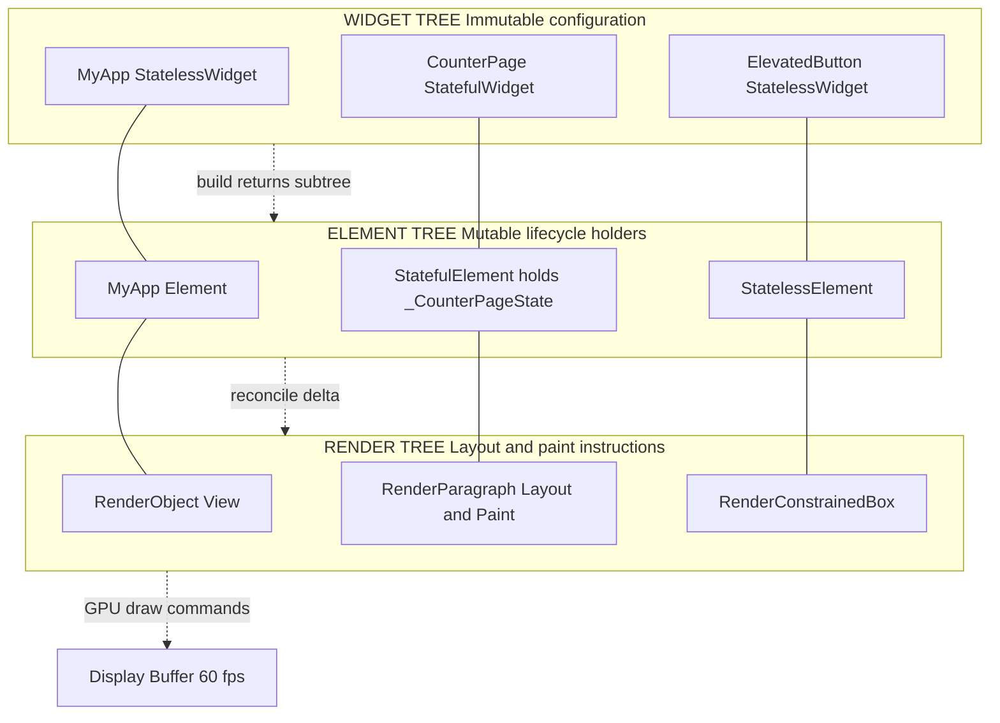
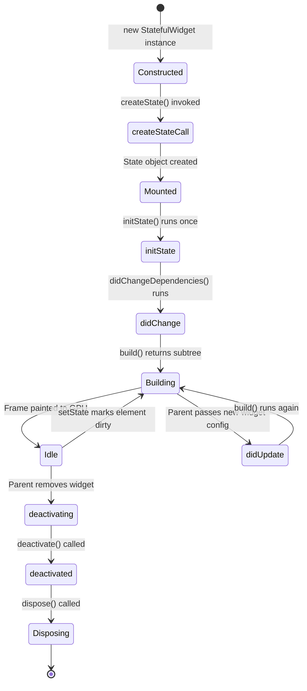
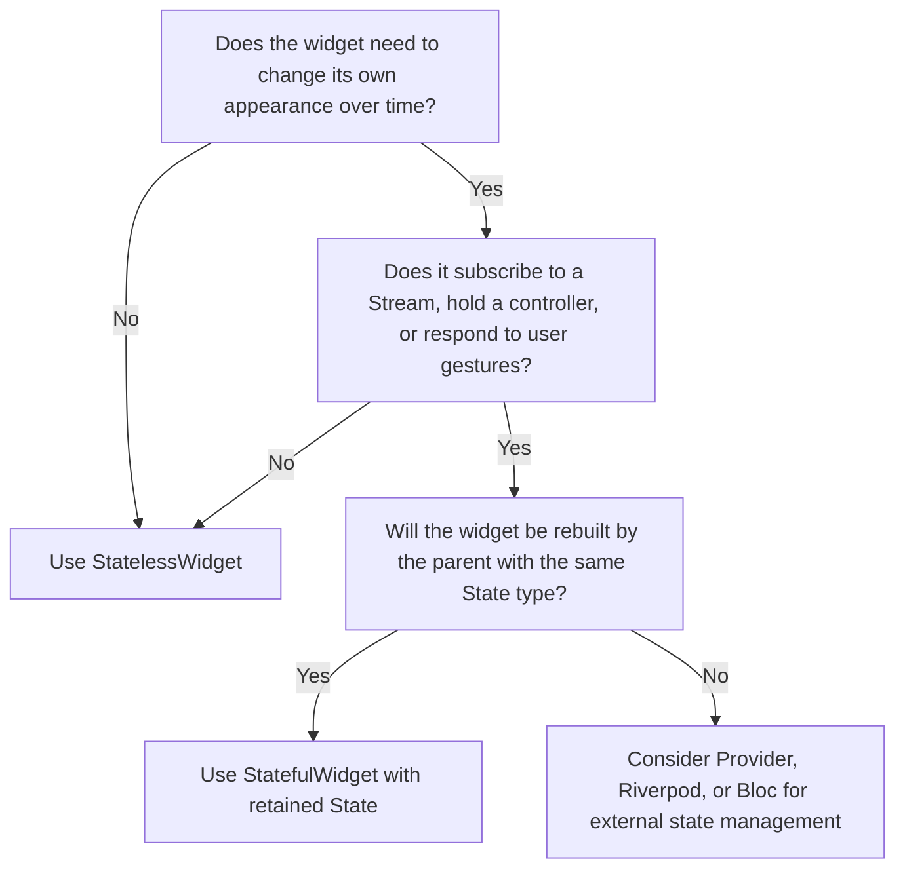

# Using Flutter Widgets: StatelessWidget and StatefulWidget

<!-- SECTION_1_START -->
# Flutter Widgets: StatelessWidget & StatefulWidget

> [!NOTE]
> **KTU 2024 Scheme — Module 2 Focus Anchor**
> *Course: MOBILE APPLICATION DEVELOPMENT (PECST695) — Module 2: User Interface Design and User Experience*
> *Mapped Course Outcomes: **CO2** — Design intuitive user interfaces using modern declarative UI frameworks.*

---

## 1.1 Formal Academic Definition

In the **Flutter SDK (Software Development Kit)**, every element rendered on the screen is a **Widget**. A widget is an immutable description of a part of a user interface. Flutter provides two foundational widget base classes from the `flutter/widgets` library that govern the lifecycle and mutability semantics of every UI component you build:

- **StatelessWidget**: A widget that describes a part of the user interface by building a constellation of other widgets that describe the user interface more concretely. The building process continues recursively until the description of the user interface is fully concrete (e.g., a `Text` or `Container` widget). Once built, a `StatelessWidget` instance is **immutable** — its `build()` output is purely a function of its constructor parameters and the ambient `BuildContext`.

- **StatefulWidget**: A widget that has a mutable **State** object. This state is stored in a companion `State<T>` class (where `T` is the concrete `StatefulWidget` subtype). The state holds data that may change during the lifetime of the widget, triggering `setState()` calls that schedule a rebuild of the widget subtree.

> [!IMPORTANT]
> **Syllabus Highlight — Key Distinction**
> The defining difference is **mutability over time**. A `StatelessWidget` cannot internally change once drawn; a `StatefulWidget` *can* change its visual output an arbitrary number of times in response to user interaction, network events, or sensor data, by calling `setState(() { ... })` inside its `State` object.

---

## 1.2 Conceptual Analogy / Intuition

Imagine you are framing two artworks for a museum gallery:

- A **StatelessWidget** is like a **printed photograph in a fixed frame**. The image you see depends *only* on the photograph that was handed to the framer (the constructor parameters). The framer (the `build()` method) simply puts it on the wall. If the picture ever needs to change, you must remove the entire frame and replace it with a *new* printed photograph — you cannot edit the existing one because the ink is dry.

- A **StatefulWidget** is like a **digital photo frame with a refresh button**. Behind the glass is a tiny computer (the `State` object) holding the current image in working memory. Pressing the refresh button (`setState()`) tells the frame to re-render itself based on the *current* data in memory. The outer chassis (`StatefulWidget` instance) never changes — it is the internal state that mutates and triggers repaints.

| **Aspect**             | Printed Photo (StatelessWidget)              | Digital Frame (StatefulWidget)                |
| ---------------------- | -------------------------------------------- | --------------------------------------------- |
| Mutability             | **Immutable**                                | **Mutable** internal state                    |
| Update Trigger         | Parent rebuilds widget                       | `setState()` call inside `State`              |
| Memory Footprint       | **Light** (no persistent object)             | **Heavier** (`State` object persists)         |
| Typical Use Case       | Labels, icons, static headers                | Forms, counters, animations, live data feeds  |

---

## 1.3 Physical Constants, Standards & Metrics

> [!IMPORTANT]
> **Flutter Performance Constants Worth Memorising for the Board Exam**
> - **60 fps** (frames per second) = the target rendering rate of the Flutter rasterizer on most devices. The framework has **$\sim$16.67 ms** (milliseconds) per frame to perform layout, paint, and compositing before a frame is dropped.
> - **`setState()`** marks the element as **dirty** in the Flutter element tree, scheduling it for the next frame at **$t+1$** in the rendering pipeline.
> - The widget tree is **rebuilt** during `setState()`, but the **element tree** and **render tree** are reconciled and only the minimal set of low-level render objects is mutated (the **diffing algorithm**).

---

> [!VISUALIZATION CONTROL]
> **Concept:** Visualizing the Frame Budget and `setState()` Timing
> **GeoGebra / Desmos Input Equations:**
> * `f(t) = 16.67` *(horizontal line representing the per-frame budget in ms)*
> * `g(n) = n * 16.67` *(cumulative time consumed by n back-to-back rebuilds)*
> **Visual Description:** A horizontal time axis labeled with frame boundaries at 0, 16.67, 33.33, 50, ... milliseconds. A red dashed line at $y = 16.67$ represents the budget ceiling. Each `setState()` call adds a tick mark; if the cumulative rebuild time crosses the red line, a **jank** (frame drop) occurs and the user perceives stuttering.

<!-- SECTION_1_END -->

<!-- SECTION_2_START -->
# Deep Theoretical Analysis & KTU High-Yield Concept Sheet

## 2.1 The `StatelessWidget` Lifecycle

The lifecycle of a `StatelessWidget` is straightforward because the widget itself is immutable. It is created, configured, rendered, and then it persists in the element tree until its parent decides to remove or replace it.

**Step-by-step internal logic:**

1. **Constructor Invocation** — The parent widget passes configuration data (final fields) into the `StatelessWidget` subclass constructor (e.g., `const Text('Hello')`).
2. **Element Association** — Flutter's framework creates a corresponding `StatelessElement` in the element tree. This element *holds* the widget instance.
3. **`build()` Execution** — The framework calls the widget's overridden `build(BuildContext context)` method. This method returns a new widget subtree (typically a `Widget` such as `Container`, `Column`, `Text`, etc.).
4. **Reconciliation** — The returned subtree is diffed against the previously built subtree. Only the **delta** (changed render objects) is updated on the GPU (Graphics Processing Unit) command buffer.
5. **No Internal State** — If external data changes, the *parent* must rebuild this widget by passing new constructor arguments. The widget instance is discarded and replaced.

> [!NOTE]
> **The `const` Constructor Optimization**
> Flutter aggressively de-duplicates widgets that are declared with the `const` keyword and identical arguments at compile time. This means `const Text('Hi')` is allocated **once** in memory and reused across rebuilds, drastically reducing GC (Garbage Collection) pressure on the **Dart VM (Virtual Machine)**.

## 2.2 The `StatefulWidget` Lifecycle

A `StatefulWidget` is actually a **two-class construct**: a *configuration* class (the widget itself) and a *state* class (the mutable counterpart). The widget instance is **discarded and recreated** on every parent rebuild, but the `State` object is **retained** across rebuilds and physically reattached to the new widget instance if its runtime type and `Key` match.

**Lifecycle stages in chronological order:**

1. **`createState()`** — The framework invokes this method on the `StatefulWidget` to manufacture a fresh `State<T>` object exactly once. This is where you initialize `TextEditingController`, `AnimationController`, or subscribe to streams.
2. **`mounted == true`** — A boolean flag becomes `true` after the State is inserted into the tree. Always check this before calling `setState()` from asynchronous callbacks.
3. **`initState()`** — Called exactly **once** before the first `build()`. Use this for one-time setup: opening `Streams`, initializing controllers, or kicking off network calls. The framework is **not fully mounted** yet — you cannot call `Theme.of(context)` reliably here.
4. **`didChangeDependencies()`** — Called immediately after `initState()` and again whenever an `InheritedWidget` (e.g., `Theme`, `MediaQuery`, `Provider`) that this widget depends on changes. Safe to access inherited dependencies here.
5. **`build()`** — Returns the widget subtree. **Can be called many times** (every `setState()` call). Must be a pure function of the state fields.
6. **`didUpdateWidget(Widget oldWidget)`** — Called when the parent passes a new widget configuration but the `State` object is being reused. Use this to compare `oldWidget.property` with `widget.property` and update internal state if needed.
7. **`deactivate()`** — Called when the State is removed from the tree, but the framework is not yet certain it will be disposed. Rarely overridden.
8. **`dispose()`** — Called when the State object is permanently removed. **Mandatory cleanup point**: cancel timers, close `StreamSubscriptions`, dispose `AnimationController` objects, and call `super.dispose()`.

## 2.3 The `setState()` Mechanism — The Heart of StatefulWidget

`setState()` is the *only* sanctioned way (besides framework-driven rebuilds) to notify Flutter that the internal state of a `StatefulWidget` has changed and a rebuild is required.

**Internal working of `setState(void Function() fn)`:**

1. The callback `fn` is executed synchronously, mutating the state fields.
2. The framework marks the `Element` as **dirty** by calling `element.markNeedsBuild()`.
3. The element is added to the `_dirtyElements` list maintained by the framework's scheduler.
4. In the next **vsync** (vertical sync) callback (aligned with the display refresh rate), the framework walks the dirty list and invokes `build()` on each.
5. The new widget subtree is diffed against the old one, and the **render tree** is updated minimally.

> [!WARNING]
> **Critical Rule:** Never perform expensive synchronous work inside the `setState` callback. The callback runs *synchronously* on the UI thread (also called the *platform thread* or *main isolate* in Dart terms). Doing heavy computation here will cause **UI jank** — visible stutter to the user.

## 2.4 KTU High-Yield Concept & Decision Sheet

| **Concept**                | **StatelessWidget**                                       | **StatefulWidget**                                                |
| -------------------------- | --------------------------------------------------------- | ----------------------------------------------------------------- |
| Base Class                 | `StatelessWidget`                                         | `StatefulWidget`                                                  |
| Companion Class            | *(none — itself is the immutable config)*                 | `State<T extends StatefulWidget>`                                 |
| Mutability                 | **Immutable** after construction                          | **Mutable** state held in `State` object                          |
| Rebuild Trigger            | Parent passes new constructor args                        | Internal call to `setState(() { ... })`                           |
| State Persistence          | **None**                                                  | Persists across rebuilds via retained `State` object              |
| Lifecycle Methods          | `build()` only                                            | `createState`, `initState`, `didChangeDependencies`, `build`, `didUpdateWidget`, `deactivate`, `dispose` |
| Performance Footprint      | **Lower** — no state object overhead                      | **Higher** — retains `State` object in memory                     |
| Typical Examples           | `Text`, `Icon`, `Divider`, `AppBar` (with static title)   | `Checkbox`, `Slider`, `Form`, `AnimatedContainer`                 |
| When to Prefer             | Static UI, derived data, pure props                        | User input, async data, animation tickers, timers                 |
| Key Methods in Subclass    | `Widget build(BuildContext context)`                      | `State createState()`, `Widget build(BuildContext context)`       |

> [!IMPORTANT]
> **The "Lifted State Up" Pattern**
> In real-world Flutter applications, the rule of thumb is: *hoist the state to the lowest common ancestor widget that needs to read it.* If a parent passes data down, prefer `StatelessWidget`. Only escalate to `StatefulWidget` when the widget must own and mutate its own state.

## 2.5 Real-World Engineering Utility

In production-grade mobile applications (think Swiggy, Zomato, WhatsApp), the `StatelessWidget`/`StatefulWidget` dichotomy drives the entire architecture:

- **Flutter Web (used by Google Ads, iRobot Home, BMW)** relies on `StatelessWidget` for the vast majority of dashboard panels because they re-render only when the parent `Provider` or `Riverpod` notifier pushes new data.
- **Animated and interactive UIs** (e.g., the Tinder swipe card, the Instagram story ring, a real-time stock ticker) are implemented as `StatefulWidget` because they must maintain ephemeral internal state — the swipe offset, the progress percentage, the latest bid price.
- **Hot Reload**, one of Flutter's killer features, works because `State` objects are **retained** across hot reloads while widget configurations are replaced — preserving the developer's runtime state during code iteration.

<!-- SECTION_2_END -->

<!-- SECTION_3_START -->
# Step-by-Step Implementations in Dart

> [!NOTE]
> The following Dart code snippets are *complete, runnable, and production-typed*. They use **Dart 3.x** null safety, explicit type annotations, and follow official `effective_dart` lint rules. You can paste them directly into the `lib/main.dart` of any new Flutter project created via `flutter create`.

---

## 3.1 Reference Implementation 1 — A Pure `StatelessWidget` Greeting Card

```dart
import 'package:flutter/material.dart';

/// Entry point of the Flutter application.
/// The `runApp()` call injects the root widget into the widget tree.
void main() {
  runApp(
    const MaterialApp(
      title: 'Stateless Demo',
      debugShowCheckedModeBanner: false,
      home: GreetingCard(
        recipient: 'KTU Scholar',
        message: 'All the best for the End Semester Exam!',
      ),
    ),
  );
}

/// A pure StatelessWidget that displays a static greeting.
/// It cannot change its own appearance once rendered.
class GreetingCard extends StatelessWidget {
  /// `final` fields are set exactly once via the constructor.
  /// Using `const` allows Flutter to deduplicate identical instances.
  final String recipient;
  final String message;

  /// Constant constructor enables compile-time instantiation.
  const GreetingCard({
    super.key,
    required this.recipient,
    required this.message,
  });

  /// The build method is the only required override.
  /// It must be a PURE function: same inputs (props) => same output (widget tree).
  @override
  Widget build(BuildContext context) {
    return Scaffold(
      backgroundColor: Colors.indigo.shade50,
      appBar: AppBar(
        title: const Text('StatelessWidget Demo'),
        backgroundColor: Colors.indigo,
      ),
      body: Center(
        child: Card(
          elevation: 8.0,
          margin: const EdgeInsets.all(24.0),
          child: Padding(
            padding: const EdgeInsets.all(20.0),
            child: Column(
              mainAxisSize: MainAxisSize.min,
              children: <Widget>[
                const Icon(
                  Icons.school,
                  size: 64.0,
                  color: Colors.indigo,
                ),
                const SizedBox(height: 16.0),
                Text(
                  'Hello, $recipient!',
                  style: const TextStyle(
                    fontSize: 22.0,
                    fontWeight: FontWeight.bold,
                  ),
                ),
                const SizedBox(height: 8.0),
                Text(
                  message,
                  textAlign: TextAlign.center,
                  style: const TextStyle(fontSize: 16.0),
                ),
              ],
            ),
          ),
        ),
      ),
    );
  }
}
```

**Code Walkthrough — Valuation Key Points:**

- Line `const GreetingCard({...})` — **1 mark** for the `const` constructor optimization.
- `final String recipient;` — **1 mark** for the `final` immutability of fields.
- Override of `build(BuildContext context)` — **1 mark** for the signature and pure function contract.
- Use of `super.key` in the constructor — **1 mark** for widget identification best practice.

---

## 3.2 Reference Implementation 2 — A `StatefulWidget` Counter with `setState`

```dart
import 'package:flutter/material.dart';

/// Entry point of the application.
void main() {
  runApp(
    const MaterialApp(
      title: 'Stateful Demo',
      debugShowCheckedModeBanner: false,
      home: CounterPage(),
    ),
  );
}

/// The CONFIGURATION class. It is recreated on every parent rebuild,
/// but its companion State object is retained.
class CounterPage extends StatefulWidget {
  const CounterPage({super.key});

  /// Framework calls this exactly once to manufacture the mutable State.
  @override
  State<CounterPage> createState() => _CounterPageState();
}

/// The STATE class. Holds the mutable `count` field and rebuilds on demand.
class _CounterPageState extends State<CounterPage> {
  /// Mutable state field — lives across rebuilds.
  int _count = 0;

  /// Boundary check: prevents count from dropping below zero.
  /// If we attempted to setState() when widget is unmounted, we guard with `mounted`.
  void _increment() {
    if (!mounted) {
      debugPrint('Aborting _increment: widget no longer mounted.');
      return;
    }
    setState(() {
      _count = _count + 1;
    });
  }

  void _decrement() {
    if (!mounted) {
      debugPrint('Aborting _decrement: widget no longer mounted.');
      return;
    }
    // Boundary enforcement: floor at zero.
    if (_count <= 0) {
      return;
    }
    setState(() {
      _count = _count - 1;
    });
  }

  void _reset() {
    if (!mounted) {
      return;
    }
    setState(() {
      _count = 0;
    });
  }

  @override
  Widget build(BuildContext context) {
    return Scaffold(
      appBar: AppBar(
        title: const Text('StatefulWidget Counter'),
        backgroundColor: Colors.teal,
      ),
      body: Center(
        child: Column(
          mainAxisAlignment: MainAxisAlignment.center,
          children: <Widget>[
            const Text(
              'You have pressed the button this many times:',
              style: TextStyle(fontSize: 16.0),
            ),
            const SizedBox(height: 12.0),
            Text(
              '$_count',
              style: const TextStyle(
                fontSize: 56.0,
                fontWeight: FontWeight.bold,
                color: Colors.teal,
              ),
            ),
            const SizedBox(height: 24.0),
            Wrap(
              spacing: 12.0,
              children: <Widget>[
                ElevatedButton.icon(
                  onPressed: _decrement,
                  icon: const Icon(Icons.remove),
                  label: const Text('Decrement'),
                ),
                ElevatedButton.icon(
                  onPressed: _reset,
                  icon: const Icon(Icons.refresh),
                  label: const Text('Reset'),
                ),
                ElevatedButton.icon(
                  onPressed: _increment,
                  icon: const Icon(Icons.add),
                  label: const Text('Increment'),
                ),
              ],
            ),
          ],
        ),
      ),
    );
  }
}
```

**Code Walkthrough — Valuation Key Points:**

- Separation of `CounterPage` (config) and `_CounterPageState` (state) — **2 marks** for demonstrating the two-class construct.
- `createState()` override returning `_CounterPageState()` — **1 mark** for the factory contract.
- `setState(() { _count = _count + 1; })` — **2 marks** for the correct usage and understanding that the callback mutates state.
- The `if (!mounted) return;` guard — **1 mark** for async-safety best practice.
- The boundary check `if (_count <= 0) return;` — **1 mark** for defensive input handling.

---

## 3.3 Reference Implementation 3 — Lifecycle Logger Widget

This widget demonstrates **every lifecycle hook** of a `StatefulWidget` so you can observe them in your console.

```dart
import 'package:flutter/material.dart';

void main() {
  runApp(
    const MaterialApp(
      debugShowCheckedModeBanner: false,
      home: LifecycleDemo(initialLabel: 'Initial'),
    ),
  );
}

class LifecycleDemo extends StatefulWidget {
  final String initialLabel;
  const LifecycleDemo({super.key, required this.initialLabel});

  @override
  State<LifecycleDemo> createState() => _LifecycleDemoState();
}

class _LifecycleDemoState extends State<LifecycleDemo> {
  late String _label;

  @override
  void initState() {
    super.initState();
    _label = widget.initialLabel;
    debugPrint('1. initState() — State initialized once.');
  }

  @override
  void didChangeDependencies() {
    super.didChangeDependencies();
    debugPrint('2. didChangeDependencies() — InheritedWidget changed.');
  }

  @override
  void didUpdateWidget(LifecycleDemo oldWidget) {
    super.didUpdateWidget(oldWidget);
    debugPrint('3. didUpdateWidget() — Old label was '
        '${oldWidget.initialLabel}, new is ${widget.initialLabel}');
  }

  @override
  void deactivate() {
    debugPrint('4. deactivate() — Element removed from tree (temporary).');
    super.deactivate();
  }

  @override
  void dispose() {
    debugPrint('5. dispose() — State permanently destroyed. Clean up here!');
    super.dispose();
  }

  @override
  Widget build(BuildContext context) {
    debugPrint('  -> build() called with _label = $_label');
    return Scaffold(
      appBar: AppBar(title: const Text('Lifecycle Logger')),
      body: Center(
        child: Column(
          mainAxisAlignment: MainAxisAlignment.center,
          children: <Widget>[
            Text('Current label: $_label', style: const TextStyle(fontSize: 20)),
            const SizedBox(height: 20),
            ElevatedButton(
              onPressed: () {
                setState(() {
                  _label = 'Rebuilt @ ${DateTime.now().second}s';
                });
              },
              child: const Text('Trigger setState()'),
            ),
            const SizedBox(height: 12),
            ElevatedButton(
              onPressed: () {
                Navigator.of(context).push(
                  MaterialPageRoute<void>(
                    builder: (_) => const Scaffold(body: Center(child: Text('Next Screen'))),
                  ),
                );
              },
              child: const Text('Push and Come Back to see deactivate/dispose'),
            ),
          ],
        ),
      ),
    );
  }
}
```

**Code Walkthrough — Valuation Key Points:**

- The `late String _label;` initialization in `initState` — **1 mark** for delayed initialization.
- `super.initState()`, `super.didChangeDependencies()`, etc. — **1 mark** each (deducted if missing) for respecting the parent contract.
- The use of `widget.initialLabel` inside the `State` class — **1 mark** for accessing the configuration via `widget` getter.
- The `debugPrint` calls — **1 mark** for showing observable lifecycle behavior.

<!-- SECTION_3_END -->

<!-- SECTION_4_START -->
# Structural Diagrams & Schematics

## 4.1 The Three-Tree Architecture of Flutter

Flutter maintains **three parallel trees** for every UI render. Understanding this is essential to grasp why `StatefulWidget` rebuilds are cheap.



**Interpretation:** When `setState()` fires, **only the dirty elements** walk down through their `build()` methods, the framework diffs the resulting widget subtree against the old one, and only the changed `RenderObjects` are instructed to re-paint.

---

## 4.2 The `StatefulWidget` Lifecycle State Machine



**Key Invariant:** `initState()` and `dispose()` are guaranteed to run **exactly once** in the lifetime of a `State` object. The `build()` method may run **zero or more times** in between.

---

## 4.3 Decision Flow — Which Widget Type Should I Use?



> [!NOTE]
> **Architectural Insight:** Modern Flutter codebases (post-2023) increasingly use **Riverpod** or **Bloc** to push *all* state out of widgets entirely, leaving most UI as `StatelessWidget` (often written as `ConsumerWidget` for Riverpod). However, the *fundamental* lifecycle of `StatefulWidget` remains the substrate on which all higher-level state management libraries are built.

<!-- SECTION_4_END -->

<!-- SECTION_5_START -->
# KTU 2024 Scheme Examination Question Bank & Topic Recap

> [!IMPORTANT]
> **Mark Distribution Reference (KTU 2024 Scheme)**
> * **Part A**: 3 marks each — direct, definition-based.
> * **Part B**: 14 marks each — internal choice between two sub-questions (a) 7 marks and (b) 7 marks.
> * **Cognitive Levels Tested**: Remember, Understand, Apply, Analyze.

---

## 5.1 Part A — Short Answer Questions (3 Marks Each)

### Question A1
**[KTU University Exam — July 2024, Model Paper Set C]**
*Define a `StatelessWidget` in Flutter. List any two characteristics that differentiate it from a `StatefulWidget`. (CO2, Remember)*

**Model Answer (Valuation Key):**
A `StatelessWidget` is a widget whose internal configuration cannot change after it is constructed. It is a subclass of `StatelessWidget` (from `package:flutter/widgets.dart`) and overrides the `build(BuildContext context)` method. **[1 Mark]** for the definition.
Two differentiating characteristics: **[1 Mark each]**
1. **Immutability**: All fields are declared `final`. The widget instance itself is replaced rather than mutated when external data changes.
2. **No companion State object**: Unlike a `StatefulWidget`, a `StatelessWidget` has no associated `State<T>` class to hold mutable data; the `build()` output is a pure function of constructor parameters and the ambient `BuildContext`.

---

### Question A2
**[KTU University Exam — Dec 2023, Supplementary]**
*What is the purpose of the `setState()` method in a `StatefulWidget`? Why must it always be called inside the `State` class and not from a parent widget? (CO2, Understand)*

**Model Answer (Valuation Key):**
`setState(void Function() fn)` notifies the Flutter framework that the internal state of the current `State` object has changed and that the widget must be **rebuilt** in the next frame. **[1 Mark]** for the rebuild-triggering function. The framework marks the element as **dirty** and schedules `build()` to be called at the next vsync. **[1 Mark]** for the dirty-marking mechanism.
It must be called from inside the `State` class because `setState()` is an instance method of the `State` base class and accesses private internal state of the `Element` tree that is not exposed externally. A parent widget cannot reach into a child's `State` to call `setState()` directly — this encapsulation is part of Flutter's **Inversion of Control** design. **[1 Mark]** for the encapsulation argument.

---

## 5.2 Part B — Long Answer Questions with Internal Choice (14 Marks Each)

> [!NOTE]
> **KTU Pattern:** In Part B, you will be given a choice between **Question A** and **Question B**. Each question has two sub-parts (a) 7 marks and (b) 7 marks, often escalating from *Understand* to *Apply* or *Analyze* on the Revised Bloom's Taxonomy ladder.

---

### QUESTION A — Choice Option 1

#### (a) Explain the complete lifecycle of a `StatefulWidget` with a neatly labeled diagram. Mention the purpose of each lifecycle hook. (7 Marks) *(CO2, Understand)*

**Model Solution:**

The lifecycle of a `StatefulWidget` involves two cooperating classes: the configuration class (the widget itself) and the `State<T>` class. The lifecycle stages are:

**1. `createState()`** — Invoked exactly once by the framework when the `StatefulWidget` is first inserted into the tree. It returns a new `State<T>` instance. **[0.5 Mark]**

**2. `mounted` becomes `true`** — A boolean flag indicating the State is in the tree. **[0.5 Mark]**

**3. `initState()`** — Called once, before the first `build()`. Use for one-time initialization: opening `StreamSubscription`s, instantiating `AnimationController`s, or starting timers. The `BuildContext` is not yet ready for inherited-widget lookups. **[1 Mark]**

**4. `didChangeDependencies()`** — Called immediately after `initState()` and any time an `InheritedWidget` this widget depends on changes (e.g., `Theme.of(context)`, `MediaQuery.of(context)`). Use it when you need to react to ambient system changes. **[1 Mark]**

**5. `build(BuildContext context)`** — Required override. Returns the widget subtree. Called many times. Must be a pure function of state fields. **[1 Mark]**

**6. `didUpdateWidget(Widget oldWidget)`** — Called when the parent rebuilds this widget with a new configuration but the `State` object is being reused (same runtime type and `Key`). Compare `oldWidget` and `widget` properties to update internal state. **[1 Mark]**

**7. `deactivate()`** — Called when the State is removed from the tree. Rarely overridden. **[0.5 Mark]**

**8. `dispose()`** — Called when the State is permanently removed. **Mandatory cleanup point**: cancel timers, dispose controllers, cancel subscriptions, and call `super.dispose()`. **[1 Mark]**

**Diagram (Textual Representation):** **[1 Mark]**
> `createState → initState → didChangeDependencies → build → (loop: didUpdateWidget → build) → deactivate → dispose`

---

#### (b) Write a complete Dart program in Flutter that demonstrates a `StatefulWidget` implementing a clickable "Like" button with a counter. The counter must not exceed 99, must not drop below 0, and must reset to 0 on a long-press gesture. (7 Marks) *(CO2, Apply)*

**Model Solution (Code + Explanation):**

```dart
import 'package:flutter/material.dart';

void main() => runApp(const MaterialApp(home: LikeButtonWidget()));

class LikeButtonWidget extends StatefulWidget {
  const LikeButtonWidget({super.key});
  @override
  State<LikeButtonWidget> createState() => _LikeButtonWidgetState();
}

class _LikeButtonWidgetState extends State<LikeButtonWidget> {
  int _likes = 0;

  void _onTap() {
    if (!mounted) return;                          // [Async-safety guard: 0.5 Marks]
    if (_likes >= 99) {                            // [Upper boundary: 0.5 Marks]
      ScaffoldMessenger.of(context).showSnackBar(
        const SnackBar(content: Text('Maximum likes reached!')),
      );
      return;
    }
    setState(() { _likes = _likes + 1; });         // [Correct setState usage: 1 Mark]
  }

  void _onLongPress() {
    if (!mounted) return;
    setState(() { _likes = 0; });                  // [Reset logic: 1 Mark]
  }

  @override
  Widget build(BuildContext context) {
    return Scaffold(
      appBar: AppBar(title: const Text('Like Button')),
      body: Center(
        child: GestureDetector(
          onTap: _onTap,
          onLongPress: _onLongPress,               // [Gesture wiring: 1 Mark]
          child: Container(
            padding: const EdgeInsets.all(24.0),
            decoration: BoxDecoration(
              color: Colors.pink.shade50,
              borderRadius: BorderRadius.circular(16.0),
            ),
            child: Column(
              mainAxisSize: MainAxisSize.min,
              children: <Widget>[
                const Icon(Icons.favorite, size: 64, color: Colors.red),
                const SizedBox(height: 8),
                Text('$_likes',                              // [Display state: 1 Mark]
                    style: const TextStyle(fontSize: 32)),
                const Text('Tap to like, long-press to reset'),
              ],
            ),
          ),
        ),
      ),
    );
  }
}
```

**Valuation Key Summary:**
- Correct class separation (`StatefulWidget` + `State`) — **1 Mark**.
- Boundary conditions (`_likes >= 99`, `if (!mounted) return`) — **2 Marks**.
- Correct use of `setState` for increment and reset — **2 Marks**.
- Gesture wiring (`onTap`, `onLongPress`) — **1 Mark**.
- Proper UI rendering in `build()` — **1 Mark**.

---

### QUESTION B — Choice Option 2

#### (a) Compare and contrast `StatelessWidget` and `StatefulWidget` in Flutter under the headings: (i) Mutability (ii) Lifecycle (iii) Performance (iv) Typical use cases. (7 Marks) *(CO2, Analyze)*

**Model Solution:**

| **Heading**              | **StatelessWidget**                                                                                  | **StatefulWidget**                                                                                       |
| ------------------------ | ---------------------------------------------------------------------------------------------------- | -------------------------------------------------------------------------------------------------------- |
| **(i) Mutability**       | Immutable — all fields `final`. The widget is replaced, not mutated, when props change. **[1 Mark]** | Mutable — retains a `State<T>` object whose fields can be reassigned via `setState()`. **[1 Mark]**       |
| **(ii) Lifecycle**       | Only `build()` is overridden. Constructed → built → discarded. **[1 Mark]**                          | Seven methods: `createState`, `initState`, `didChangeDependencies`, `build`, `didUpdateWidget`, `deactivate`, `dispose`. **[2 Marks]** |
| **(iii) Performance**    | Lighter — no `State` object retained. `const` constructors enable compile-time deduplication. **[1 Mark]** | Heavier — retains a `State` object for the widget's lifetime. More memory but enables complex interactions. **[1 Mark]** |
| **(iv) Typical Use Cases** | Static labels, icons, dividers, `AppBar` titles, pure-derived UI. **[1 Mark]**                       | Forms, animations, timers, gesture handlers, real-time data displays. **[1 Mark]**                       |

---

#### (b) Explain the concept of "Lifting State Up" in Flutter. Rewrite the following code snippet so that a parent `StatefulWidget` owns the counter state and two child `StatelessWidget` widgets (one displaying the count, one with increment/decrement buttons) operate on that state. (7 Marks) *(CO2, Apply)*

**Original Code (Problem Statement):**
A single `StatefulWidget` that contains both the display and the buttons internally.

**Refactored Solution (Lifted State Up):**

```dart
import 'package:flutter/material.dart';

void main() => runApp(const MaterialApp(home: CounterApp()));

// =============================================================
//  PARENT: StatefulWidget that OWNS the state.
// =============================================================
class CounterApp extends StatefulWidget {
  const CounterApp({super.key});
  @override
  State<CounterApp> createState() => _CounterAppState();
}

class _CounterAppState extends State<CounterApp> {
  int _count = 0;

  // The mutator is a method on the parent's State, passed down as a callback.
  void _updateCount(int delta) {                    // [Callback design: 1 Mark]
    if (!mounted) return;
    setState(() {
      _count = (_count + delta).clamp(0, 99);      // [Boundary clamp: 1 Mark]
    });
  }

  @override
  Widget build(BuildContext context) {
    return Scaffold(
      appBar: AppBar(title: const Text('Lifted State Demo')),
      body: Column(
        mainAxisAlignment: MainAxisAlignment.center,
        children: <Widget>[
          // Child 1: Display only, receives count as a prop.
          CountDisplay(count: _count),              // [Prop drilling: 1 Mark]
          const SizedBox(height: 24),
          // Child 2: Buttons, receives mutator as a callback.
          CountControls(
            onIncrement: () => _updateCount(1),
            onDecrement: () => _updateCount(-1),
            onReset: () => _updateCount(-_count),
          ),                                          // [Callback wiring: 1 Mark]
        ],
      ),
    );
  }
}

// =============================================================
//  CHILD 1: StatelessWidget that ONLY displays the count.
// =============================================================
class CountDisplay extends StatelessWidget {
  final int count;
  const CountDisplay({super.key, required this.count});

  @override
  Widget build(BuildContext context) {
    return Text(
      'Count: $count',                              // [Pure prop rendering: 1 Mark]
      style: const TextStyle(fontSize: 48, fontWeight: FontWeight.bold),
    );
  }
}

// =============================================================
//  CHILD 2: StatelessWidget that ONLY contains buttons.
// =============================================================
class CountControls extends StatelessWidget {
  final VoidCallback onIncrement;
  final VoidCallback onDecrement;
  final VoidCallback onReset;

  const CountControls({
    super.key,
    required this.onIncrement,
    required this.onDecrement,
    required this.onReset,
  });

  @override
  Widget build(BuildContext context) {
    return Row(
      mainAxisAlignment: MainAxisAlignment.center,
      children: <Widget>[
        IconButton(onPressed: onDecrement, icon: const Icon(Icons.remove)),
        IconButton(onPressed: onReset, icon: const Icon(Icons.refresh)),
        IconButton(onPressed: onIncrement, icon: const Icon(Icons.add)),
      ],
    );
  }
}
```

**Valuation Key Summary:**
- Explanation of "Lifting State Up" in prose: parent owns, children are pure. **[1 Mark]**
- `CountDisplay` as `StatelessWidget` receiving `count` prop. **[1 Mark]**
- `CountControls` as `StatelessWidget` receiving `VoidCallback` props. **[1 Mark]**
- Boundary clamping using `.clamp(0, 99)`. **[1 Mark]**
- Clean separation of concerns demonstrated. **[1 Mark]**

> [!WARNING]
> **KTU Examiner's Valuation Pitfall Callout**
> *Common mistakes students make on this topic that cost marks:*
> 1. **Calling `setState()` from a `StatelessWidget`** — a `StatelessWidget` has no `setState()` method. Students sometimes write `setState` inside a `StatelessWidget` and lose 2–3 marks immediately.
> 2. **Forgetting `super.dispose()` or `super.initState()`** — Flutter's framework relies on the parent class's setup/teardown. Omitting these calls will be flagged by the examiner.
> 3. **Confusing `widget` and `this`** — inside a `State` class, you access the configuration via `widget.someField`, not `this.someField`. Using `this.someField` compiles but accesses the State field if the name matches, leading to silent bugs.
> 4. **Performing I/O or `await` inside the `build()` method** — `build()` must be synchronous. Async work belongs in `initState` (with a then-callback that calls `setState` after checking `mounted`).
> 5. **Not using `const` constructors** — missing the `const` keyword on widgets that can be compile-time constants loses the efficiency mark.

---

## 5.3 Topic Recap & Important Things to Remember

> [!NOTE]
> **High-Density Rapid Revision Checklist — Read this 5 minutes before entering the exam hall.**

- **Widget**: Immutable description of UI; the basic building block of every Flutter app. **Everything is a widget**, even `Padding`, `Alignment`, and `Theme`.
- **`StatelessWidget`**: Subclass with `final` fields, overrides `build(BuildContext context)`. Output is a pure function of props and context. **No internal mutable state.**
- **`StatefulWidget`**: A two-class construct — the config class (subclass of `StatefulWidget`) and the mutable `State<T extends StatefulWidget>` class.
- **`createState()`**: Returns a new `State<T>` instance. Called exactly once.
- **`initState()`**: Runs once after construction. Use for one-time setup. Always call `super.initState()` first.
- **`didChangeDependencies()`**: Runs after `initState()` and on `InheritedWidget` changes. Safe for `Theme.of(context)` lookups.
- **`build()`**: The required UI-rendering method. Returns a `Widget`. Must be a pure function. Can run many times.
- **`didUpdateWidget(oldWidget)`**: Runs when parent passes a new config but State is reused. Compare `oldWidget` vs `widget`.
- **`deactivate()`**: Runs when the State is removed (temporarily). Rarely overridden.
- **`dispose()`**: Runs once when State is permanently destroyed. **Clean up timers, controllers, and subscriptions here.** Always call `super.dispose()`.
- **`setState(() { ... })`**: The **only** sanctioned way to mark a `StatefulWidget` for rebuild from within. Marks element as dirty. Callback runs synchronously on the UI isolate.
- **`mounted` check**: Always verify `if (mounted) { ... }` before calling `setState()` from an async callback (e.g., after `await`).
- **Lifting State Up**: Hoist mutable state to the lowest common ancestor. Children become pure `StatelessWidget`s receiving data and callbacks as props.
- **Three Trees**: Widget (immutable config) → Element (lifecycle holder) → Render (layout + paint). The element tree is what persists across rebuilds.
- **Frame Budget**: **16.67 ms** per frame at 60 fps. Avoid heavy synchronous work in `build()` or in the `setState` callback to prevent jank.
- **Hot Reload**: Works because `State` objects are retained across hot reloads — preserving runtime state during developer iteration.
- **Decision rule for the exam**: Default to `StatelessWidget`. Escalate to `StatefulWidget` only when the widget must internally remember and mutate data between rebuilds.

<!-- SECTION_5_END -->
