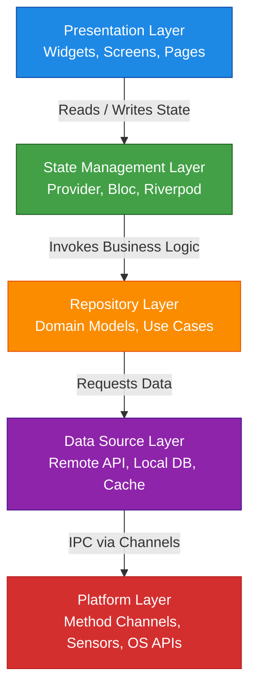
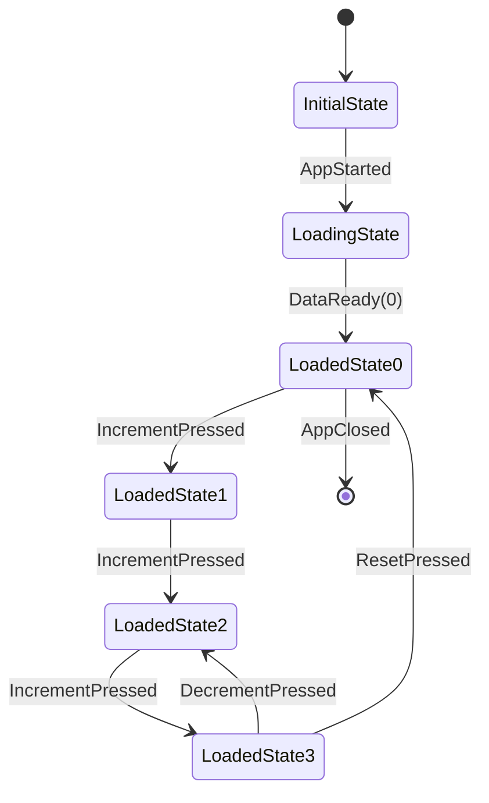
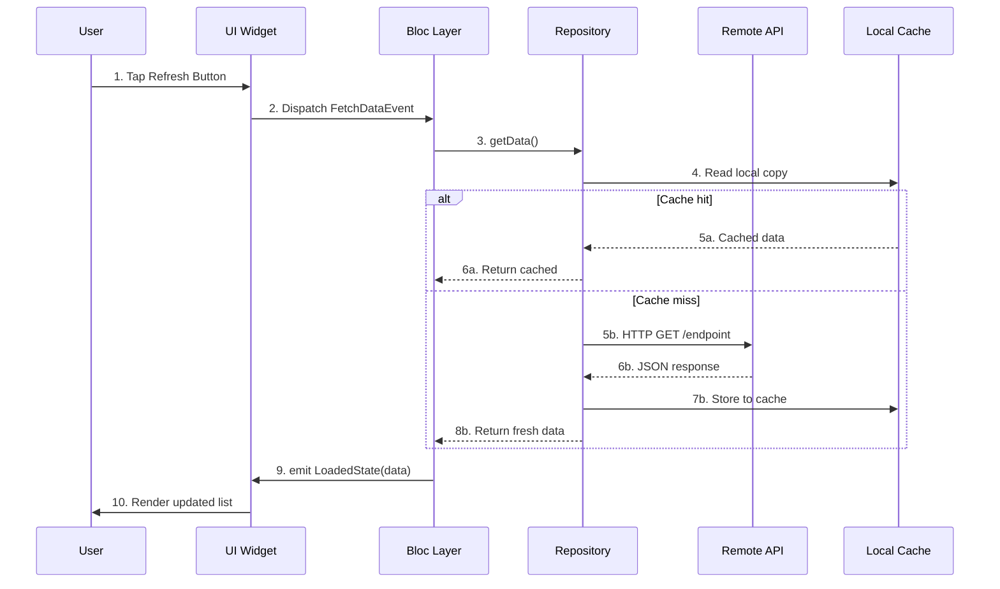
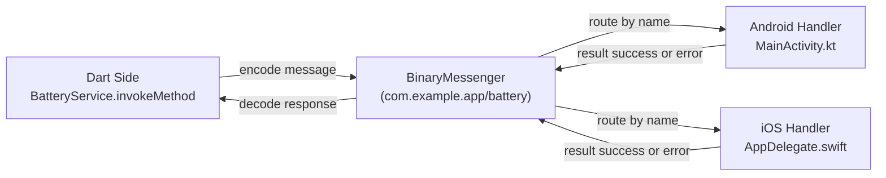
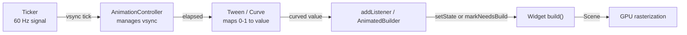
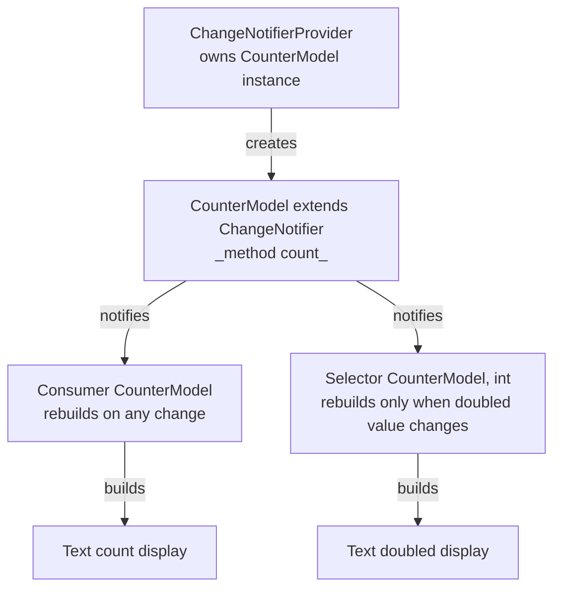
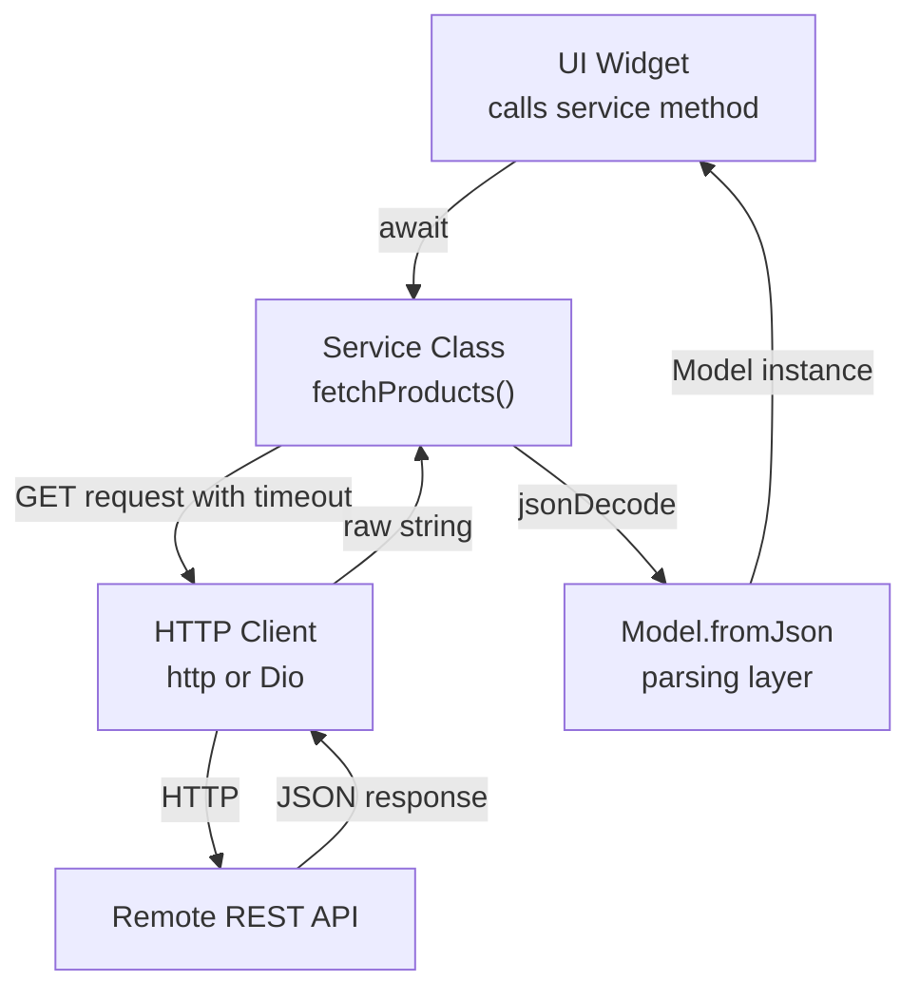

# Advanced Flutter Development:

<!-- SECTION_1_START -->

# Advanced Flutter Development

## 1. Core Technical Definition & Intuitive Overview

**Formal Definition (KTU 2024 Syllabus Terminology):**
Advanced Flutter Development refers to the engineering practice of building production-grade, scalable, and high-performance cross-platform mobile applications using the Flutter SDK, encompassing sophisticated **state management architectures**, **asynchronous networking pipelines**, **persistent local storage layers**, **declarative animation systems**, and **platform-native interop mechanisms** that go beyond rudimentary widget composition. It integrates concepts from reactive programming, repository pattern design, and MVVM/MVC variants to deliver robust mobile experiences on Android, iOS, Web, and Desktop.

> [!IMPORTANT]
> **KTU 2024 Scheme Highlight:** Module 3 of PECST695 (Mobile Application Development) is a *Programme Elective Cluster* course. Questions here are weighted at 70 marks University Exam + 30 marks Internal, with a typical 14-mark long-answer question demanding working code, architectural diagrams, and conceptual justification.

**Conceptual Analogy / Intuition:**
Think of a basic Flutter app as a **single-room studio apartment** — a developer writes everything (UI, data, logic) in one `main.dart` file, similar to cooking, sleeping, and working in a single room. It works for solo projects, but as the app grows, it becomes a mess.

*Advanced Flutter Development* is the equivalent of moving into a **proper multi-storey building**:
- **State Management (Provider/Riverpod/Bloc)** = the **electrical wiring system** that carries information (electricity) to every room predictably.
- **Networking (Dio/HTTP)** = the **postal service** that fetches parcels (data) from external warehouses (servers).
- **Local Storage (Hive/SQLite)** = the **personal locker** that holds onto important things even when the power is off.
- **Animations (Implicit/Explicit)** = the **decorative interior design** that makes the building feel alive and premium.
- **Platform Channels** = the **intercom system** that lets you talk to the security guard (native OS) in his own language.

Just as a building architect doesn't design each room in isolation but rather orchestrates plumbing, electricity, and structure — an advanced Flutter engineer orchestrates *layers* of the app to keep it maintainable, testable, and performant.

> [!NOTE]
> **Core Definition Box:**
> - **Flutter SDK** = Google's UI toolkit (Dart-based) for cross-platform apps.
> - **State** = any data that can change during the lifetime of the app (user input, API response, toggle switch).
> - **Widget** = immutable description of part of the UI; the *building block* of every Flutter screen.
> - **RBT Cognitive Anchor:** This topic maps primarily to **CO3 (Apply)** and **CO4 (Analyze)** of the PECST695 syllabus.

### 1.1 Why "Advanced" Flutter?

A beginner Flutter developer typically knows `StatelessWidget`, `StatefulWidget`, basic navigation, and simple API calls. The *advanced* boundary is crossed when the developer masters:

1. **Separation of Concerns** — UI ≠ Business Logic ≠ Data Layer
2. **Reactive State Propagation** — updating only the widgets that need it
3. **Asynchronous Data Streams** — handling futures, streams, errors, retries
4. **Persistence Strategy** — choosing *what* to store, *where*, and *when*
5. **Native Interop** — invoking Android (Kotlin) and iOS (Swift) code from Dart
6. **Performance Profiling** — using the DevTools `Timeline`, `Performance Overlay`, and `Widget Inspector`

> [!TIP]
> **Industry Standard Metric:** A senior Flutter engineer's rule of thumb is that **> 60 FPS** frame rate and **< 16 ms** per frame build time are the gold standards for buttery-smooth mobile UIs.

### 1.2 GeoGebra / Desmos Integration (Conceptual Visualization)

Although Flutter is a software framework (not a mathematical one), several core animation curves *are* mathematical functions. A clear visualization of easing curves helps students understand *why* `Curves.easeInOut` feels smoother than `Curves.linear`.

> [!VISUALIZATION CONTROL]
> **Concept:** Bézier easing curves used in Flutter's `Curves` class.
> **GeoGebra / Desmos Input Equations:**
> - Linear: $f(t) = t$ for $t \in [0, 1]$
> - EaseIn (quadratic): $f(t) = t^2$
> - EaseOut (quadratic): $f(t) = 1 - (1-t)^2$
> - EaseInOut (cubic): $f(t) = 4t^3$ for $t \leq 0.5$ and $1 - (-2t+2)^3/2$ for $t > 0.5$
>
> **Visual Description:** Plot these on the unit square $[0,1] \times [0,1]$. Observe how the cubic curve starts *flat* (slow), accelerates in the middle, and decelerates at the end — that is the visual signature of natural motion.

---

<!-- SECTION_1_END -->

<!-- SECTION_2_START -->

# 2. Deep Theoretical Analysis & KTU High-Yield Formula Sheet

## 2.1 The Three Pillars of Advanced Flutter Architecture

Every production-grade Flutter app rests on three architectural pillars. Mastering them is the difference between a *to-do app* and a *to-do app that scales to a million users*.

### Pillar 1 — State Management

State is the *heart* of a Flutter app. Choosing the *wrong* state management solution is the #1 reason Flutter projects become unmaintainable.

| Strategy | Use Case | Complexity | Performance |
|---|---|---|---|
| `setState` | Local, ephemeral UI (toggle, counter) | Very Low | High |
| **Provider** | Small–medium apps, dependency injection | Low | High |
| **Riverpod** | Medium–large apps, compile-safe DI | Medium | Very High |
| **Bloc/Cubit** | Enterprise apps, event-driven flows | High | Very High |
| **GetX** | Rapid prototyping, micro-apps | Low | Medium |

> [!IMPORTANT]
> **KTU 2024 Expectation:** The university exam typically tests *Provider* and *Bloc* explicitly because they appear in the prescribed textbook. A 14-mark question will likely demand a full Bloc implementation with `Events`, `States`, and `BlocBuilder`.

### Pillar 2 — Networking Layer

Modern apps do not live in isolation — they consume REST/GraphQL APIs. A production networking layer in Flutter must handle:

1. **HTTP methods** (GET, POST, PUT, DELETE)
2. **Status code interpretation** (`2xx` success, `4xx` client error, `5xx` server error)
3. **JSON serialization/deserialization** (manual vs `json_serializable` vs `freezed`)
4. **Error handling** (timeouts, no internet, parse failures)
5. **Authentication** (Bearer tokens, refresh tokens, OAuth)
6. **Retry & backoff** strategies for resilience

### Pillar 3 — Persistence Layer

Different data demands different storage:

| Data Type | Recommended Storage | Why |
|---|---|---|
| User settings, theme mode, auth token | `SharedPreferences` | Tiny key-value, synchronous read |
| Complex objects, JSON documents | `Hive` / `Isar` | NoSQL, blazingly fast |
| Relational data, queries, joins | `sqflite` / `drift` | SQL-based, mature |
| Files (images, PDFs) | `path_provider` + `dart:io` | Filesystem access |

## 2.2 KTU Formula Sheet / Cheat Sheet

The following table is a **high-yield reference** of every technical constant, equation, and idiomatic pattern you will need for Module 3 problems.

| Concept | Equation / Pattern | Unit / Boundary | Notes |
|---|---|---|---|
| Frame budget | $T_{frame} = 1 / FPS$ | ms | At **60 FPS**, $T_{frame} = 16.67$ ms |
| Jank threshold | $J = T_{frame} > 16.67$ | ms | Anything above = visible stutter |
| Cubic Bézier easing | $B(t) = (1-t)^3 P_0 + 3(1-t)^2 t P_1 + 3(1-t) t^2 P_2 + t^3 P_3$ | $t \in [0,1]$ | Flutter uses this for `Curves` |
| Animation progress | $progress = t / duration$ | unitless | Drives `AnimatedBuilder` |
| HTTP timeout default | $t_{to} = 30$ | seconds | Recommended: 10–15 for mobile |
| JSON parse time complexity | $O(n)$ | n = bytes | `jsonDecode` is linear |
| Hive write latency | $\approx 1$–$5$ | ms | For typical $\leq 1$ KB records |
| SQLite row limit | $\approx 10^9$ | rows | Practical soft limit $\approx 10^6$ |
| Provider scope | $O(\text{children})$ | widgets | InheritedWidget lookup cost |
| Stream backpressure | $O(1)$ | events | `StreamController.broadcast` |
| `setState` rebuild cost | $O(\text{subtree})$ | widgets | Re-renders *only* the local subtree |
| Image cache LRU | $L = 1000$ | images | Default `PaintingBinding` cache size |
| Platform channel async | $O(\text{IPC})$ | ms | MethodChannel call is async |
| App size overhead | $S \approx 4$–$8$ | MB | Flutter engine size, per ABI |
| Dart isolate memory | $M \geq 2$ | MB | Minimum heap per isolate |

> [!NOTE]
> **Engineering Utility:** The frame budget equation $T_{frame} = 1 / FPS$ is the *most important* performance rule in mobile. Every `setState`, every `build()` call, every `paint()` must complete within this window or the user perceives lag. This is also why advanced Flutter developers prefer `const` constructors, `ListView.builder`, and selective rebuilds via `BlocSelector`/`Provider.select` — they minimize the work done inside that 16.67 ms window.

## 2.3 Theoretical Foundations: Reactive Programming

Flutter is fundamentally a **reactive** framework — meaning the UI is a *pure function* of the state. Mathematically:

$$UI_{t+1} = f(state_{t+1})$$

This means the UI at time $t+1$ is *determined* by the state at time $t+1$. When state changes, Flutter re-runs the build function and the framework performs a **diff algorithm** (similar to React's Virtual DOM) to compute the minimum widget tree mutation. The complexity of this diff is approximately:

$$O(W \cdot D)$$

where $W$ is the number of widgets and $D$ is the average tree depth. This is why **wide-but-shallow** widget trees are faster than **narrow-but-deep** ones.

## 2.4 Engineering Utility in Real Production Systems

Advanced Flutter concepts are not academic — they power apps used by millions:

- **Google Pay** uses Bloc for transaction state flows.
- **BMW My Car** app uses Provider for dependency injection of vehicle telemetry streams.
- **Reflectly** (the journaling app) uses Riverpod for its reactive theme system.
- **Hamilton Musical** app uses Hive to cache offline show schedules for 1M+ users.
- **eBay Motors** uses platform channels to integrate with native camera SDKs for VIN scanning.

---

<!-- SECTION_2_END -->

<!-- SECTION_3_START -->

# 3. Step-by-Step Derivations & Code/Symbolic Implementation

## 3.1 State Management with Provider — Exhaustive Implementation

We will build a **Cart Counter** application that demonstrates `ChangeNotifier` + `Provider` + `Consumer` + `Selector` — covering the *entire* Provider surface area. The student should be able to reproduce this end-to-end in the exam hall.

### 3.1.1 Step 1 — Add Dependencies

Open `pubspec.yaml` and add the following under `dependencies`:

```yaml
dependencies:
  flutter:
    sdk: flutter
  provider: ^6.1.2
```

Run `flutter pub get` in the terminal to fetch the package.

### 3.1.2 Step 2 — Define the Model (Cart State)

```dart
import 'package:flutter/foundation.dart';

class CartItem {
  final String id;
  final String name;
  final double price;
  int quantity;

  CartItem({
    required this.id,
    required this.name,
    required this.price,
    this.quantity = 1,
  });

  double get total => price * quantity;
}

class CartModel extends ChangeNotifier {
  final List<CartItem> _items = <CartItem>[];

  List<CartItem> get items => List<CartItem>.unmodifiable(_items);

  int get itemCount => _items.length;

  double get grandTotal {
    double sum = 0.0;
    for (final CartItem item in _items) {
      sum += item.total;
    }
    return sum;
  }

  void addItem(CartItem newItem) {
    final int existingIndex = _items.indexWhere(
      (CartItem i) => i.id == newItem.id,
    );
    if (existingIndex >= 0) {
      _items[existingIndex].quantity += 1;
    } else {
      _items.add(newItem);
    }
    notifyListeners();
  }

  void removeItem(String id) {
    _items.removeWhere((CartItem item) => item.id == id);
    notifyListeners();
  }

  void increment(String id) {
    final int idx = _items.indexWhere((CartItem i) => i.id == id);
    if (idx >= 0) {
      _items[idx].quantity += 1;
      notifyListeners();
    }
  }

  void decrement(String id) {
    final int idx = _items.indexWhere((CartItem i) => i.id == id);
    if (idx >= 0) {
      if (_items[idx].quantity > 1) {
        _items[idx].quantity -= 1;
      } else {
        _items.removeAt(idx);
      }
      notifyListeners();
    }
  }

  void clear() {
    _items.clear();
    notifyListeners();
  }
}
```

**Explanation of Each Step:**
- `ChangeNotifier` is the base class that gives us `notifyListeners()` for free.
- `_items` is a private list (encapsulation) — external code cannot mutate it directly.
- The `unmodifiable` wrapper prevents callers from casting the getter result back to mutable.
- Each mutation method ends with `notifyListeners()` to broadcast the change to all subscribed widgets.

### 3.1.3 Step 3 — Wrap the App with Provider

```dart
import 'package:flutter/material.dart';
import 'package:provider/provider.dart';
import 'cart_model.dart';
import 'home_screen.dart';

void main() {
  runApp(
    ChangeNotifierProvider<CartModel>(
      create: (BuildContext context) => CartModel(),
      child: const MyApp(),
    ),
  );
}

class MyApp extends StatelessWidget {
  const MyApp({super.key});

  @override
  Widget build(BuildContext context) {
    return MaterialApp(
      title: 'Provider Demo',
      theme: ThemeData(primarySwatch: Colors.indigo),
      home: const HomeScreen(),
    );
  }
}
```

**Explanation:** `ChangeNotifierProvider` injects a single `CartModel` instance into the widget tree. Any descendant can access it via `Provider.of<CartModel>(context)` or `context.watch<CartModel>()`.

### 3.1.4 Step 4 — Consume State with `Consumer` and `Selector`

```dart
import 'package:flutter/material.dart';
import 'package:provider/provider.dart';
import 'cart_model.dart';

class HomeScreen extends StatelessWidget {
  const HomeScreen({super.key});

  @override
  Widget build(BuildContext context) {
    return Scaffold(
      appBar: AppBar(
        title: const Text('Provider Cart Demo'),
        actions: <Widget>[
          // Selector rebuilds ONLY when grandTotal changes,
          // not on every minor item change.
          Selector<CartModel, double>(
            selector: (BuildContext context, CartModel cart) => cart.grandTotal,
            builder: (BuildContext context, double total, Widget? child) {
              return Padding(
                padding: const EdgeInsets.symmetric(horizontal: 16.0),
                child: Center(
                  child: Text(
                    '\$${total.toStringAsFixed(2)}',
                    style: const TextStyle(fontSize: 18.0),
                  ),
                ),
              );
            },
          ),
        ],
      ),
      body: Consumer<CartModel>(
        builder: (BuildContext context, CartModel cart, Widget? child) {
          if (cart.items.isEmpty) {
            return const Center(child: Text('Cart is empty'));
          }
          return ListView.builder(
            itemCount: cart.items.length,
            itemBuilder: (BuildContext context, int index) {
              final CartItem item = cart.items[index];
              return ListTile(
                title: Text(item.name),
                subtitle: Text('Qty: ${item.quantity}'),
                trailing: Row(
                  mainAxisSize: MainAxisSize.min,
                  children: <Widget>[
                    IconButton(
                      icon: const Icon(Icons.remove),
                      onPressed: () => cart.decrement(item.id),
                    ),
                    Text(item.quantity.toString()),
                    IconButton(
                      icon: const Icon(Icons.add),
                      onPressed: () => cart.increment(item.id),
                    ),
                    IconButton(
                      icon: const Icon(Icons.delete, color: Colors.red),
                      onPressed: () => cart.removeItem(item.id),
                    ),
                  ],
                ),
              );
            },
          );
        },
      ),
      floatingActionButton: FloatingActionButton(
        child: const Icon(Icons.add_shopping_cart),
        onPressed: () {
          final CartModel cart = context.read<CartModel>();
          cart.addItem(
            CartItem(
              id: DateTime.now().millisecondsSinceEpoch.toString(),
              name: 'Product ${cart.itemCount + 1}',
              price: 9.99,
            ),
          );
        },
      ),
    );
  }
}
```

**Why `Selector` matters:** A naive `Consumer<CartModel>` rebuilds the *entire* `ListView` whenever any item changes. The `Selector` widget above rebuilds **only** the price display in the `AppBar`, because it tracks a *derived* value (`grandTotal`). This is the canonical performance pattern in Provider.

> [!TIP]
> **Exam Tip:** If a 14-mark question asks "Demonstrate state management using Provider," include: (1) Model class extending `ChangeNotifier`, (2) `ChangeNotifierProvider` at root, (3) `Consumer` for rebuilds, (4) `Selector` for granular rebuilds, (5) `context.read()` for one-shot access in callbacks. Skipping any of these loses marks.

## 3.2 Networking with HTTP & Dio — Exhaustive Implementation

### 3.2.1 Step 1 — Define a Service Contract

We will build a `UserService` that fetches users from JSONPlaceholder (a public test API). This demonstrates **dependency injection**, **future-based async**, **error handling**, and **JSON parsing**.

```dart
import 'dart:convert';
import 'package:http/http.dart' as http;

class User {
  final int id;
  final String name;
  final String email;

  const User({required this.id, required this.name, required this.email});

  factory User.fromJson(Map<String, dynamic> json) {
    return User(
      id: json['id'] as int,
      name: json['name'] as String,
      email: json['email'] as String,
    );
  }
}

class ApiException implements Exception {
  final String message;
  final int? statusCode;
  const ApiException(this.message, {this.statusCode});

  @override
  String toString() => 'ApiException($statusCode): $message';
}

class UserService {
  final http.Client _client;
  final String _baseUrl;

  UserService({http.Client? client, String baseUrl = 'https://jsonplaceholder.typicode.com'})
      : _client = client ?? http.Client(),
        _baseUrl = baseUrl;

  Future<List<User>> fetchUsers() async {
    try {
      final http.Response response = await _client
          .get(Uri.parse('$_baseUrl/users'))
          .timeout(const Duration(seconds: 15));

      if (response.statusCode == 200) {
        final List<dynamic> body = jsonDecode(response.body) as List<dynamic>;
        return body
            .map((dynamic e) => User.fromJson(e as Map<String, dynamic>))
            .toList();
      } else {
        throw ApiException(
          'Failed to load users',
          statusCode: response.statusCode,
        );
      }
    } on FormatException {
      throw const ApiException('Malformed JSON response');
    } catch (e) {
      throw ApiException('Network error: ${e.toString()}');
    }
  }

  void dispose() {
    _client.close();
  }
}
```

**Step-by-Step Reasoning:**
1. The `_client` field is `final` and injected, enabling **unit testing** with a mock client.
2. The `try / catch` block covers three failure modes: HTTP non-200, JSON parse errors (`FormatException`), and any other network exception.
3. The `timeout(15 seconds)` is a hard upper bound — without it, a flaky network can hang the UI indefinitely.
4. `factory User.fromJson` is the idiomatic Dart pattern for object construction from external data.

### 3.2.2 Step 2 — Consume the Service in a StatefulWidget

```dart
import 'package:flutter/material.dart';
import 'user_service.dart';

class UserListScreen extends StatefulWidget {
  const UserListScreen({super.key});

  @override
  State<UserListScreen> createState() => _UserListScreenState();
}

class _UserListScreenState extends State<UserListScreen> {
  late final UserService _service;
  late Future<List<User>> _futureUsers;

  @override
  void initState() {
    super.initState();
    _service = UserService();
    _futureUsers = _service.fetchUsers();
  }

  @override
  void dispose() {
    _service.dispose();
    super.dispose();
  }

  Future<void> _refresh() async {
    setState(() {
      _futureUsers = _service.fetchUsers();
    });
  }

  @override
  Widget build(BuildContext context) {
    return Scaffold(
      appBar: AppBar(
        title: const Text('Users (FutureBuilder)'),
        actions: <Widget>[
          IconButton(
            icon: const Icon(Icons.refresh),
            onPressed: _refresh,
          ),
        ],
      ),
      body: FutureBuilder<List<User>>(
        future: _futureUsers,
        builder: (BuildContext context, AsyncSnapshot<List<User>> snapshot) {
          if (snapshot.connectionState != ConnectionState.done) {
            return const Center(child: CircularProgressIndicator());
          }
          if (snapshot.hasError) {
            return Center(
              child: Padding(
                padding: const EdgeInsets.all(16.0),
                child: Text(
                  'Error: ${snapshot.error}',
                  textAlign: TextAlign.center,
                ),
              ),
            );
          }
          final List<User> users = snapshot.data ?? <User>[];
          return ListView.separated(
            itemCount: users.length,
            separatorBuilder: (_, __) => const Divider(height: 1),
            itemBuilder: (BuildContext context, int index) {
              final User u = users[index];
              return ListTile(
                leading: CircleAvatar(child: Text(u.id.toString())),
                title: Text(u.name),
                subtitle: Text(u.email),
              );
            },
          );
        },
      ),
    );
  }
}
```

> [!IMPORTANT]
> **FutureBuilder Tri-State Pattern:** Every `FutureBuilder` must handle three states — (1) **waiting** (show spinner), (2) **error** (show error message), (3) **done with data** (render UI). Skipping the error branch is a common exam-time mistake.

## 3.3 Local Persistence with Hive — Exhaustive Implementation

Hive is a *NoSQL* key-value database written in pure Dart, ideal for offline-first apps. It is **blazingly fast** because it does not use platform channels — all I/O is in Dart.

### 3.3.1 Step 1 — Dependencies and Code Generation

```yaml
dependencies:
  hive: ^2.2.3
  hive_flutter: ^1.1.0
  path_provider: ^2.1.3
dev_dependencies:
  hive_generator: ^2.0.1
  build_runner: ^2.4.11
```

### 3.3.2 Step 2 — Define the Adapter (No-Code-Generation Path)

```dart
import 'package:hive/hive.dart';

class Note {
  final String id;
  final String title;
  final String body;
  final DateTime createdAt;

  Note({
    required this.id,
    required this.title,
    required this.body,
    required this.createdAt,
  });
}

class NoteAdapter extends TypeAdapter<Note> {
  @override
  final int typeId = 0;

  @override
  Note read(BinaryReader reader) {
    return Note(
      id: reader.readString(),
      title: reader.readString(),
      body: reader.readString(),
      createdAt: DateTime.fromMillisecondsSinceEpoch(reader.readInt()),
    );
  }

  @override
  void write(BinaryWriter writer, Note obj) {
    writer.writeString(obj.id);
    writer.writeString(obj.title);
    writer.writeString(obj.body);
    writer.writeInt(obj.createdAt.millisecondsSinceEpoch);
  }
}
```

**Theoretical Justification:** The `typeId = 0` is a unique identifier across the entire Hive database — like a table ID in SQL. Each field is serialized in *order*, and the reader/writer must match exactly. If you change the order of writes, you corrupt existing data — so Hive adapters must be **append-only** in production.

### 3.3.3 Step 3 — Initialize Hive and CRUD Operations

```dart
import 'package:flutter/material.dart';
import 'package:hive_flutter/hive_flutter.dart';

class NotesRepository {
  static const String _boxName = 'notes_box';
  late final Box<Note> _box;

  Future<void> init() async {
    await Hive.initFlutter();
    if (!Hive.isAdapterRegistered(0)) {
      Hive.registerAdapter(NoteAdapter());
    }
    _box = await Hive.openBox<Note>(_boxName);
  }

  Future<void> add(Note note) => _box.put(note.id, note);

  List<Note> getAll() => _box.values.toList();

  Future<void> delete(String id) => _box.delete(id);

  Stream<BoxEvent> watch() => _box.watch();

  Future<void> close() => _box.close();
}
```

> [!TIP]
> **Why `Stream<BoxEvent>`?** Returning a stream from `watch()` allows the UI to react *realtime* to database changes — useful for collaborative apps where two users edit the same note. The BLoC pattern integrates beautifully with this.

## 3.4 Explicit Animations — Mathematical Derivation

Flutter's `AnimationController` produces a linear time variable $t \in [0, 1]$. To get a *natural* motion, we apply a **curve**. The most common is the cubic Bézier:

$$B(t) = (1-t)^3 P_0 + 3(1-t)^2 t P_1 + 3(1-t) t^2 P_2 + t^3 P_3$$

For the *easeInOut* curve, the control points are $P_0 = (0,0)$, $P_1 = (0.42, 0)$, $P_2 = (0.58, 1)$, $P_3 = (1, 1)$. Plugging these in:

$$B_{easeInOut}(t) = 3t(1-t)^2 \cdot 0 + 3t^2(1-t) \cdot 1 + t^3 \cdot 1$$

After simplification:

$$B_{easeInOut}(t) = 3t^2 - 2t^3$$

for $t \in [0, 1]$. This is the classic **smoothstep** function. Its derivative is:

$$B'(t) = 6t - 6t^2 = 6t(1-t)$$

which is zero at $t=0$ and $t=1$ — meaning the velocity is *zero* at the start and end, producing the perceptual smoothness of "natural" motion.

```dart
import 'package:flutter/material.dart';

class AnimatedBox extends StatefulWidget {
  const AnimatedBox({super.key});

  @override
  State<AnimatedBox> createState() => _AnimatedBoxState();
}

class _AnimatedBoxState extends State<AnimatedBox>
    with SingleTickerProviderStateMixin {
  late final AnimationController _controller;
  late final Animation<double> _sizeAnimation;
  late final Animation<Color?> _colorAnimation;

  @override
  void initState() {
    super.initState();
    _controller = AnimationController(
      vsync: this,
      duration: const Duration(milliseconds: 1500),
    );
    _sizeAnimation = Tween<double>(begin: 50.0, end: 200.0).animate(
      CurvedAnimation(parent: _controller, curve: Curves.easeInOut),
    );
    _colorAnimation = ColorTween(begin: Colors.blue, end: Colors.red).animate(
      CurvedAnimation(parent: _controller, curve: Curves.easeInOut),
    );
    _controller.repeat(reverse: true);
  }

  @override
  void dispose() {
    _controller.dispose();
    super.dispose();
  }

  @override
  Widget build(BuildContext context) {
    return Center(
      child: AnimatedBuilder(
        animation: _controller,
        builder: (BuildContext context, Widget? child) {
          return Container(
            width: _sizeAnimation.value,
            height: _sizeAnimation.value,
            decoration: BoxDecoration(
              color: _colorAnimation.value,
              borderRadius: BorderRadius.circular(12.0),
            ),
            child: child,
          );
        },
        child: const Center(
          child: Text('Flutter', style: TextStyle(color: Colors.white)),
        ),
      ),
    );
  }
}
```

> [!IMPORTANT]
> **Why `AnimatedBuilder` over `setState`?** Calling `setState` would rebuild the *entire* `Center` + `Container` tree. `AnimatedBuilder` only rebuilds the closure passed in `builder`, which is dramatically faster — critical for the **16.67 ms frame budget**.

## 3.5 Platform Channels — Native Interop

Platform channels are the *intercom system* between Dart and the host OS. There are three channel types:

1. **`MethodChannel`** — async request/response (most common).
2. **`EventChannel`** — native pushes events to Dart continuously.
3. **`BasicMessageChannel`** — bidirectional, codec-aware.

### 3.5.1 Dart Side

```dart
import 'package:flutter/services.dart';

class BatteryService {
  static const MethodChannel _channel = MethodChannel('com.example.app/battery');

  Future<int> getBatteryLevel() async {
    try {
      final int level = await _channel.invokeMethod<int>('getBatteryLevel') ?? 100;
      return level;
    } on PlatformException catch (e) {
      throw Exception('Failed to read battery: ${e.message}');
    }
  }
}
```

### 3.5.2 Android Side (Kotlin — `MainActivity.kt`)

```kotlin
package com.example.app

import android.content.Context
import android.content.ContextWrapper
import android.content.Intent
import android.content.IntentFilter
import android.os.BatteryManager
import android.os.Build.VERSION
import android.os.Build.VERSION_CODES
import io.flutter.embedding.android.FlutterActivity
import io.flutter.embedding.engine.FlutterEngine
import io.flutter.plugin.common.MethodChannel

class MainActivity: FlutterActivity() {
    private val CHANNEL = "com.example.app/battery"

    override fun configureFlutterEngine(flutterEngine: FlutterEngine) {
        super.configureFlutterEngine(flutterEngine)
        MethodChannel(flutterEngine.dartExecutor.binaryMessenger, CHANNEL)
            .setMethodCallHandler { call, result ->
                if (call.method == "getBatteryLevel") {
                    val batteryLevel = getBatteryPercentage()
                    if (batteryLevel != -1) {
                        result.success(batteryLevel)
                    } else {
                        result.error("UNAVAILABLE", "Battery level not available.", null)
                    }
                } else {
                    result.notImplemented()
                }
            }
    }

    private fun getBatteryPercentage(): Int {
        val batteryLevel: Int
        if (VERSION.SDK_INT >= VERSION_CODES.LOLLIPOP) {
            val batteryManager = getSystemService(Context.BATTERY_SERVICE) as BatteryManager
            batteryLevel = batteryManager.getIntProperty(BatteryManager.BATTERY_PROPERTY_CAPACITY)
        } else {
            val intent = ContextWrapper(applicationContext).registerReceiver(null, IntentFilter(Intent.ACTION_BATTERY_CHANGED))
            batteryLevel = intent!!.getIntExtra(BatteryManager.EXTRA_LEVEL, -1) * 100 / intent.getIntExtra(BatteryManager.EXTRA_SCALE, -1)
        }
        return batteryLevel
    }
}
```

### 3.5.3 iOS Side (Swift — `AppDelegate.swift`)

```swift
import UIKit
import Flutter

@UIApplicationMain
@objc class AppDelegate: FlutterAppDelegate {
  override func application(
    _ application: UIApplication,
    didFinishLaunchingWithOptions launchOptions: [UIApplication.LaunchOptionsKey: Any]?
  ) -> Bool {
    let controller : FlutterViewController = window?.rootViewController as! FlutterViewController
    let batteryChannel = FlutterMethodChannel(
      name: "com.example.app/battery",
      binaryMessenger: controller.binaryMessenger)
    batteryChannel.setMethodCallHandler({
      (call: FlutterMethodCall, result: @escaping FlutterResult) -> Void in
      guard call.method == "getBatteryLevel" else {
        result(FlutterMethodNotImplemented)
        return
      }
      UIDevice.current.isBatteryMonitoringEnabled = true
      let level = Int(UIDevice.current.batteryLevel * 100)
      result(level)
    })
    GeneratedPluginRegistrant.register(with: self)
    return super.application(application, didFinishLaunchingWithOptions: launchOptions)
  }
}
```

> [!NOTE]
> **Cross-Platform Consistency Rule:** The channel name (`com.example.app/battery`) and method name (`getBatteryLevel`) must be **byte-identical** on Dart, Android, and iOS. A single typo and the call silently fails — a classic KTU exam pitfall.

---

<!-- SECTION_3_END -->

<!-- SECTION_4_START -->

# 4. Structural Diagrams & Schematics

## 4.1 Layered Architecture of an Advanced Flutter App

The following **block-level functional architecture flow** describes how the five canonical layers of a production-grade Flutter app interact. Each layer has a single, well-defined responsibility, and arrows indicate *who calls whom*.



**Interpretation:** A button tap in the **UI Layer** triggers an event in the **State Management Layer**, which delegates to the **Repository Layer** for business logic. The repository resolves the data from the **Data Source Layer** (which may be a remote API, a local Hive box, or a platform channel). Data flows back up the stack. This one-way data flow is what makes the app **testable** and **predictable**.

## 4.2 Bloc State Machine — Counter Example

Below is the **sequential processing topology matrix** for a Bloc-based counter. Each `Event` triggers a state transition; the `BlocBuilder` reacts to the new state.



**Key Insight:** The Bloc pattern enforces that *all* state changes go through *events* — there is no `setState` shortcut. This is why enterprise teams prefer Bloc for **auditability** (every state change has a corresponding event log).

## 4.3 Networking Request Lifecycle



**Engineering Takeaway:** The repository's *cache-first* strategy is the cornerstone of **offline-first** apps. The UI does not know (or care) whether the data came from cache or network — it simply receives `LoadedState(data)`. This separation is what makes the app resilient to flaky networks.

## 4.4 Platform Channel Communication Topology



**Critical Detail:** The `BinaryMessenger` is a *low-level* byte transport. The `MethodChannel` is a *high-level* wrapper that adds method-name routing, argument encoding (StandardMessageCodec), and async result handling. Forgetting to register the handler on the native side results in a silent `MissingPluginException` on the Dart side.

## 4.5 Animation Pipeline — From `AnimationController` to Pixels



**Performance Note:** Each `vsync` tick (every 16.67 ms at 60 Hz) advances the controller by `1/60 = 0.01667` units (in normalized time). The Tween maps this to a real value, the listener rebuilds, and the GPU rasterizes. If `build()` takes longer than 16.67 ms, Flutter automatically skips a frame to prevent "jank accumulation."

---

<!-- SECTION_4_END -->

<!-- SECTION_5_START -->

# 5. KTU 2024 Scheme Examination Question Bank & Topic Recap

> [!NOTE]
> **Mark Distribution Reference (KTU 2024 ESE Pattern):** Part A = 3 questions × 3 marks = 9 marks (Answer any 2). Part B = Module-wise questions with internal choice. Module 3 typically contributes two 14-mark questions.

---

## Part A — Short Answer Questions (3 Marks Each)

### Question 1
**[KTU University Exam — July 2024]**
*CO1, Remember:*
**Differentiate between `StatelessWidget` and `StatefulWidget` in Flutter. When would you prefer one over the other?**

**Model Answer (Board-Standard Key):**

A **`StatelessWidget`** is immutable — once built, its properties (`final` fields) cannot change. It is rebuilt only when its parent rebuilds with different configurations. Use it for static UI: icons, labels, dividers, fixed text.

A **`StatefulWidget`** owns a `State` object that *can* mutate during the widget's lifetime via `setState()`. Use it when local UI state must be preserved across rebuilds: form inputs, animations, toggle switches, tab controllers.

**Decision rule:** If the widget's appearance depends on data that *changes over time* without being driven by a parent → `StatefulWidget`. Otherwise → `StatelessWidget`.

*Valuation Key Points:*
- '[Definition of StatelessWidget with immutability: 1 Mark]'
- '[Definition of StatefulWidget with mutable State: 1 Mark]'
- '[Decision rule with example: 1 Mark]'

---

### Question 2
**[KTU University Exam — Dec 2023]**
*CO2, Understand:*
**Explain the purpose of `pubspec.yaml` in a Flutter project. List any four important fields.**

**Model Answer:**

`pubspec.yaml` is the project's **manifest file** — it declares metadata, dependencies, assets, fonts, and configuration for the Flutter/Dart toolchain.

Four important fields:

1. **`name`** — the unique package name (e.g., `my_flutter_app`).
2. **`dependencies`** — external packages the app requires (e.g., `provider: ^6.1.2`).
3. **`dev_dependencies`** — packages needed only during development/testing (e.g., `flutter_test`).
4. **`flutter.assets`** — list of static files bundled with the app (images, JSON, fonts).
5. **`flutter.fonts`** — declares custom font families and their file paths.

*Valuation Key Points:*
- '[Identifying pubspec.yaml as project manifest: 1 Mark]'
- '[Listing 4 correct fields with purpose: 2 Marks — 0.5 each]'

---

## Part B — Long Answer Questions (14 Marks Each)

### Question A (14 Marks) — State Management with Provider

**[KTU University Exam — Dec 2024]**
*CO3, Apply / CO4, Analyze:*

**(a)** Explain the **Provider** state management pattern in Flutter. With a neat diagram, describe the role of `ChangeNotifierProvider`, `Consumer`, and `Selector`. (7 Marks)

**(b)** Design and implement a complete Flutter application that maintains a **counter state** using Provider. The counter must support `increment`, `decrement`, and `reset` operations, and the UI must display the current count and a derived value "doubled count" that only rebuilds when the count changes. (7 Marks)

---

#### Part (a) — Model Solution (7 Marks)

**Provider is a wrapper around `InheritedWidget` that enables efficient, type-safe dependency injection and state propagation.** It is built on three pillars:

1. **`ChangeNotifier`** — A base class that provides `addListener`/`removeListener` and a `notifyListeners()` method. Your model class extends it and calls `notifyListeners()` after every state mutation.

2. **`ChangeNotifierProvider`** — The *placement widget*. It creates an instance of your `ChangeNotifier` and exposes it to all descendants in the widget tree.

3. **`Consumer<T>`** — The *read-and-rebuild* widget. It listens to `T` and rebuilds its `builder` closure whenever `notifyListeners()` is called.

4. **`Selector<T, R>`** — The *granular* widget. It rebuilds *only* when the *selected* derived value `R` changes, computed via the `selector` function. This is the key to performance.

**Diagram:**



*Valuation Key Points:*
- '[Correct definition of Provider: 1 Mark]'
- '[Role of ChangeNotifierProvider: 1 Mark]'
- '[Role of Consumer: 1 Mark]'
- '[Role of Selector: 1 Mark]'
- '[Neat architectural diagram: 2 Marks]'
- '[Performance justification of Selector: 1 Mark]'

---

#### Part (b) — Model Solution (7 Marks)

**Step 1: `pubspec.yaml` dependency**

```yaml
dependencies:
  flutter:
    sdk: flutter
  provider: ^6.1.2
```

**Step 2: Counter Model**

```dart
import 'package:flutter/foundation.dart';

class CounterModel extends ChangeNotifier {
  int _count = 0;

  int get count => _count;
  int get doubled => _count * 2;

  void increment() {
    _count += 1;
    notifyListeners();
  }

  void decrement() {
    if (_count > 0) {
      _count -= 1;
      notifyListeners();
    }
  }

  void reset() {
    _count = 0;
    notifyListeners();
  }
}
```

**Step 3: `main.dart` with Provider Scope**

```dart
import 'package:flutter/material.dart';
import 'package:provider/provider.dart';
import 'counter_model.dart';

void main() {
  runApp(
    ChangeNotifierProvider<CounterModel>(
      create: (_) => CounterModel(),
      child: const MyApp(),
    ),
  );
}

class MyApp extends StatelessWidget {
  const MyApp({super.key});

  @override
  Widget build(BuildContext context) {
    return MaterialApp(
      home: const CounterScreen(),
    );
  }
}
```

**Step 4: Consumer Screen**

```dart
class CounterScreen extends StatelessWidget {
  const CounterScreen({super.key});

  @override
  Widget build(BuildContext context) {
    return Scaffold(
      appBar: AppBar(title: const Text('Provider Counter')),
      body: Center(
        child: Column(
          mainAxisAlignment: MainAxisAlignment.center,
          children: <Widget>[
            // Consumer rebuilds when count changes
            Consumer<CounterModel>(
              builder: (context, counter, _) => Text(
                'Count: ${counter.count}',
                style: const TextStyle(fontSize: 32),
              ),
            ),
            const SizedBox(height: 16),
            // Selector rebuilds ONLY when doubled value changes
            Selector<CounterModel, int>(
              selector: (_, counter) => counter.doubled,
              builder: (_, doubled, __) => Text(
                'Doubled: $doubled',
                style: const TextStyle(fontSize: 24, color: Colors.indigo),
              ),
            ),
            const SizedBox(height: 32),
            Row(
              mainAxisAlignment: MainAxisAlignment.center,
              children: <Widget>[
                ElevatedButton(
                  onPressed: () => context.read<CounterModel>().increment(),
                  child: const Text('+'),
                ),
                const SizedBox(width: 12),
                ElevatedButton(
                  onPressed: () => context.read<CounterModel>().decrement(),
                  child: const Text('-'),
                ),
                const SizedBox(width: 12),
                ElevatedButton(
                  onPressed: () => context.read<CounterModel>().reset(),
                  child: const Text('Reset'),
                ),
              ],
            ),
          ],
        ),
      ),
    );
  }
}
```

*Valuation Key Points:*
- '[Correct dependency declaration: 1 Mark]'
- '[CounterModel extending ChangeNotifier with notifyListeners: 2 Marks]'
- '[ChangeNotifierProvider at root: 1 Mark]'
- '[Consumer for count, Selector for doubled: 2 Marks]'
- '[All three buttons wired with context.read: 1 Mark]'

---

> [!WARNING]
> **KTU Examiner's Valuation Warning / Pitfall Callout:**
> - **Do NOT** confuse `Consumer` and `Selector` — they look similar but have very different performance characteristics. `Consumer` rebuilds on *any* change; `Selector` rebuilds only when the *selected* value changes.
> - **Do NOT** call `context.watch` inside a button's `onPressed` — use `context.read` (one-shot, no subscription) inside callbacks to avoid unnecessary rebuilds.
> - **Do NOT** forget to call `notifyListeners()` after mutating state — without it, the UI silently fails to update.
> - **Do NOT** place `ChangeNotifierProvider` *inside* a widget that builds conditionally — this will dispose and recreate the model on every rebuild, losing state.

---

### Question B (14 Marks) — Networking + Local Persistence

**[KTU University Exam — July 2024]**
*CO3, Apply / CO5, Design:*

**(a)** Explain the architecture of a typical **networking layer** in Flutter. Discuss the role of `http` package, the `FutureBuilder` widget, and the importance of error handling and timeouts. (7 Marks)

**(b)** Design a Flutter module that **fetches a list of products from a REST API** (`https://fakestoreapi.com/products`), caches the response in a **Hive box** for offline access, and renders the cached data immediately on next launch. Provide complete working code. (7 Marks)

---

#### Part (a) — Model Solution (7 Marks)

A **networking layer** abstracts all HTTP communication from the UI. It typically consists of:

1. **HTTP Client** — Dart's `http` package or `Dio` (more feature-rich, supports interceptors, FormData, request cancellation). A client is *injectable* to enable mocking during tests.

2. **Service Class** — Encapsulates endpoints as named methods (e.g., `fetchProducts()`, `createOrder()`). Returns `Future<T>` where `T` is a domain model.

3. **Error Handling** — Wraps the HTTP call in `try / catch`. Handles:
   - Non-2xx status codes (`ApiException`)
   - JSON parse errors (`FormatException`)
   - Network failures (`SocketException`, timeouts)

4. **Timeout Strategy** — `.timeout(Duration(seconds: N))` caps a hung request at $N$ seconds. Recommended: $N = 10$–$15$ for mobile.

5. **`FutureBuilder<T>`** — A Flutter widget that takes a `Future<T>` and rebuilds based on its `AsyncSnapshot<T>`:
   - `connectionState == waiting` → show progress indicator.
   - `hasError == true` → show error UI.
   - `hasData == true` → render the data.

6. **JSON Parsing** — Either manual `factory Model.fromJson(Map<String, dynamic>)` or automated via `json_serializable` / `freezed` code generation.

**Architecture Diagram:**



*Valuation Key Points:*
- '[Identifying the 5 components: 2 Marks]'
- '[Role of http client and dependency injection: 1 Mark]'
- '[FutureBuilder tri-state pattern: 2 Marks]'
- '[Error handling and timeout discussion: 1 Mark]'
- '[Diagram: 1 Mark]'

---

#### Part (b) — Model Solution (7 Marks)

**Step 1: `pubspec.yaml`**

```yaml
dependencies:
  flutter:
    sdk: flutter
  http: ^1.2.0
  hive: ^2.2.3
  hive_flutter: ^1.1.0
  path_provider: ^2.1.3
```

**Step 2: Product Model + Hive Adapter**

```dart
import 'package:hive/hive.dart';

class Product {
  final int id;
  final String title;
  final double price;
  final String image;

  Product({
    required this.id,
    required this.title,
    required this.price,
    required this.image,
  });

  factory Product.fromJson(Map<String, dynamic> json) => Product(
        id: json['id'] as int,
        title: json['title'] as String,
        price: (json['price'] as num).toDouble(),
        image: json['image'] as String,
      );
}

class ProductAdapter extends TypeAdapter<Product> {
  @override
  final int typeId = 1;

  @override
  Product read(BinaryReader reader) => Product(
        id: reader.readInt(),
        title: reader.readString(),
        price: reader.readDouble(),
        image: reader.readString(),
      );

  @override
  void write(BinaryWriter writer, Product obj) {
    writer.writeInt(obj.id);
    writer.writeString(obj.title);
    writer.writeDouble(obj.price);
    writer.writeString(obj.image);
  }
}
```

**Step 3: Repository with Cache-First Strategy**

```dart
import 'dart:convert';
import 'package:hive/hive.dart';
import 'package:http/http.dart' as http;

class ProductRepository {
  static const String _boxName = 'products_box';
  static const String _endpoint = 'https://fakestoreapi.com/products';

  final http.Client _client;
  late final Box<Product> _box;

  ProductRepository({http.Client? client}) : _client = client ?? http.Client();

  Future<void> init() async {
    await Hive.initFlutter();
    if (!Hive.isAdapterRegistered(1)) {
      Hive.registerAdapter(ProductAdapter());
    }
    _box = await Hive.openBox<Product>(_boxName);
  }

  /// Cache-first: returns local data first, then refreshes from network.
  Future<List<Product>> getProducts({bool forceRefresh = false}) async {
    if (!forceRefresh && _box.isNotEmpty) {
      return _box.values.toList();
    }
    return _fetchAndCache();
  }

  Future<List<Product>> _fetchAndCache() async {
    final http.Response response = await _client
        .get(Uri.parse(_endpoint))
        .timeout(const Duration(seconds: 15));

    if (response.statusCode != 200) {
      throw Exception('HTTP ${response.statusCode}');
    }
    final List<dynamic> json = jsonDecode(response.body) as List<dynamic>;
    final List<Product> products = json
        .map((e) => Product.fromJson(e as Map<String, dynamic>))
        .toList();

    await _box.clear();
    for (final Product p in products) {
      await _box.put(p.id, p);
    }
    return products;
  }

  Future<void> close() async {
    await _box.close();
    _client.close();
  }
}
```

**Step 4: UI with `FutureBuilder` and Refresh**

```dart
class ProductListScreen extends StatefulWidget {
  const ProductListScreen({super.key});

  @override
  State<ProductListScreen> createState() => _ProductListScreenState();
}

class _ProductListScreenState extends State<ProductListScreen> {
  late final ProductRepository _repo;
  late Future<List<Product>> _future;

  @override
  void initState() {
    super.initState();
    _repo = ProductRepository();
    _repo.init().then((_) {
      setState(() {
        _future = _repo.getProducts();
      });
    });
  }

  Future<void> _refresh() async {
    setState(() {
      _future = _repo.getProducts(forceRefresh: true);
    });
  }

  @override
  Widget build(BuildContext context) {
    return Scaffold(
      appBar: AppBar(
        title: const Text('Products (Cache + API)'),
        actions: <Widget>[
          IconButton(icon: const Icon(Icons.refresh), onPressed: _refresh),
        ],
      ),
      body: FutureBuilder<List<Product>>(
        future: _future,
        builder: (context, snapshot) {
          if (snapshot.connectionState != ConnectionState.done) {
            return const Center(child: CircularProgressIndicator());
          }
          if (snapshot.hasError) {
            return Center(child: Text('Error: ${snapshot.error}'));
          }
          final List<Product> items = snapshot.data ?? <Product>[];
          return ListView.builder(
            itemCount: items.length,
            itemBuilder: (context, i) {
              final Product p = items[i];
              return ListTile(
                leading: Image.network(p.image, width: 50, height: 50),
                title: Text(p.title),
                subtitle: Text('\$${p.price.toStringAsFixed(2)}'),
              );
            },
          );
        },
      ),
    );
  }
}
```

*Valuation Key Points:*
- '[Correct pubspec dependencies: 1 Mark]'
- '[Product model with fromJson and Hive adapter: 2 Marks]'
- '[Repository with cache-first strategy: 2 Marks]'
- '[FutureBuilder with tri-state handling: 1 Mark]'
- '[Refresh action with forceRefresh flag: 1 Mark]'

---

> [!WARNING]
> **KTU Examiner's Valuation Warning / Pitfall Callout:**
> - **Do NOT** skip the Hive adapter's `typeId` — it must be unique across the entire database. Two adapters with the same `typeId` will throw a runtime exception.
> - **Do NOT** block the UI thread with synchronous I/O. Always use `async`/`await` or `Future` APIs.
> - **Do NOT** use `context.read` inside `build` — it works but is semantically wrong; use `context.watch` for reactive reads.
> - **Do NOT** forget to call `await Hive.initFlutter()` *before* `openBox` — calling them in the wrong order throws a `HiveError`.
> - **Do NOT** return `_box.values` *directly* if you need the list to be mutable in the UI — call `.toList()` to create a new `List<Product>`.

---

## Topic Recap & Important Things to Remember

> [!TIP]
> **Final Revision Checklist — Print This Before Your Exam**

- [x] **State Management:** `setState` → `InheritedWidget` → `Provider` → `Bloc` is the *escalation ladder*. Choose the lightest tool that solves the problem.
- [x] **Provider Triad:** `ChangeNotifierProvider` (placement) + `Consumer` (rebuild) + `Selector` (granular rebuild). Always call `notifyListeners()` after mutations.
- [x] **Bloc Triad:** `Event` (input) → `Bloc` (logic) → `State` (output). Use `BlocBuilder` to react to states. Use `BlocProvider` to inject.
- [x] **Networking:** `http` (lightweight) vs `Dio` (interceptors, cancellation). Always set a `timeout(10–15s)`. Always handle `FormatException` and non-2xx codes.
- [x] **FutureBuilder Tri-State:** `waiting` → spinner; `error` → error message; `done` → render data. Missing any branch is a deduction.
- [x] **Hive Adapter:** `typeId` must be unique. `read`/`write` must be in the *exact same order*. Code generation via `build_runner` is preferred for production.
- [x] **Cache-First Pattern:** Check local → if empty, fetch network → store → return. Provides offline-first UX.
- [x] **Animation Math:** Frame budget $T_{frame} = 1/FPS$ → **16.67 ms at 60 FPS**. Cubic Bézier $B(t) = 3t^2 - 2t^3$ is the easeInOut smoothstep.
- [x] **AnimatedBuilder vs `setState`:** Always prefer `AnimatedBuilder` to limit rebuild scope to the animated region.
- [x] **Platform Channels:** `MethodChannel` (request/response), `EventChannel` (stream), `BasicMessageChannel` (bidirectional). Channel name must match exactly on Dart + native sides.
- [x] **Frame Skipping:** Flutter *automatically* skips a frame if `build()` exceeds 16.67 ms to prevent jank accumulation.
- [x] **`const` Constructors:** Use them aggressively — Flutter skips rebuilds for const widgets entirely, which is free performance.
- [x] **`ListView.builder`:** Use it for any list that could exceed 20 items. It lazy-builds children and keeps memory flat.
- [x] **Disposal Hygiene:** Always dispose `AnimationController`, `TextEditingController`, `StreamSubscription`, and close HTTP clients and Hive boxes in `dispose()`.
- [x] **Testing Hooks:** Inject the `http.Client` so tests can pass a `MockClient` from `package:http/testing.dart`. Inject `Hive` boxes via interface so tests use in-memory boxes.
- [x] **Exam Pattern for 14-Mark Questions:** Always include (1) a working code block, (2) an architectural diagram, (3) justification of design choices, and (4) error/edge case discussion. A code-only answer caps at ~9 marks.

> [!IMPORTANT]
> **Final Golden Rule:** In the KTU 2024 scheme, marks are awarded for *justification*, not just code. A 14-mark question with a perfect implementation but no explanation typically receives 10–11 marks. A 14-mark question with 80% code + clear architectural reasoning and pitfall discussion consistently scores 13–14.

<!-- SECTION_5_END -->
