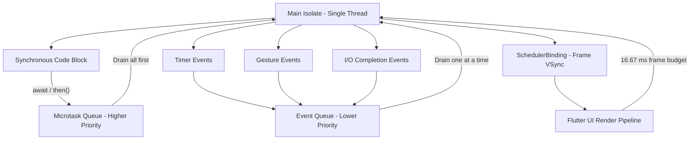
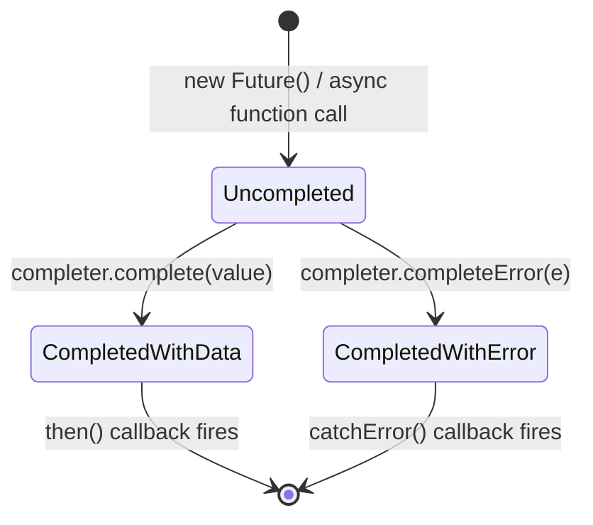
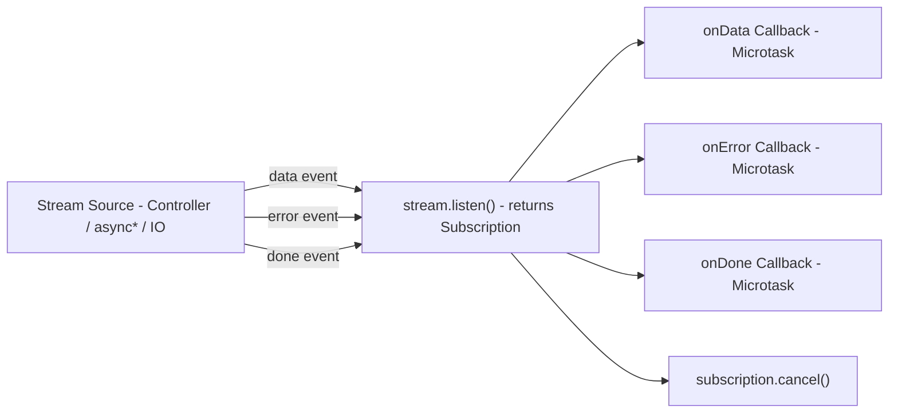
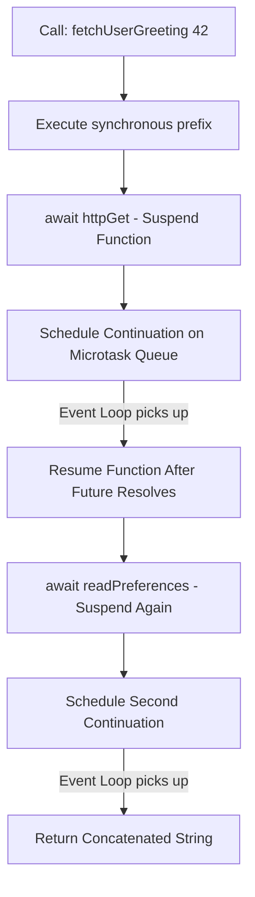

# Asynchronous Programming with Dart: Futures, async/await, and Streams

<!-- SECTION_1_START -->
# Asynchronous Programming with Dart: Futures, `async/await`, and Streams

## 1.1 Formal Definition (KTU 2024 Syllabus Terminology)

> [!IMPORTANT]
> **Asynchronous Programming in Dart** is a non-blocking execution paradigm in which long-running operations (such as network requests, file I/O, database queries, or timers) are executed concurrently with the main **Event Loop** of the **Dart Virtual Machine (DVM)**, allowing the **Isolate's** microtask and event queues to continue processing UI rendering and user interactions without waiting for the slow operation to complete.

The three foundational pillars of Dart's asynchronous model are:

| Pillar | Type | Cardinality | Use Case |
|---|---|---|---|
| `Future<T>` | Single-value promise | **One** result or error | HTTP API call, reading a file once |
| `async` / `await` | Syntactic sugar over Futures | One Future at a time | Sequential async workflows |
| `Stream<T>` | Asynchronous sequence | **Zero, one, or many** events | WebSockets, sensors, user input |

## 1.2 Conceptual Analogy & Intuitive Overview

> [!NOTE]
> **Analogy — The Restaurant Kitchen:**
> Imagine you are a waiter in a busy restaurant.
> - **Synchronous Code** = You stand at the kitchen window and stare at the chef until the dish is ready. Other tables get ignored.
> - **`Future<T>`** = You place an order and receive a **ticket number** (the Future). The dish will arrive later; meanwhile, you serve other tables.
> - **`async` / `await`** = A polite pause: "I will **wait** for the dish at this exact point, but the rest of the restaurant keeps running."
> - **`Stream<T>`** = A **conveyor belt** of dishes — the kitchen keeps pushing items (pizza, then soup, then dessert) one after another, and you keep serving them as they arrive.

In Flutter, the **UI thread is the main Isolate**. If you block it for more than ~16 ms, the UI janks. Asynchronous programming prevents this.

## 1.3 Key Constants and Performance Metrics

- The Dart **Event Loop** processes **one microtask at a time** before draining the next event.
- A standard display refresh is **60 Hz**, giving roughly **16.67 ms** per frame (or **120 Hz ≈ 8.33 ms** on ProMotion devices).
- A blocked main isolate for **> 16 ms** causes a dropped frame (perceptible UI lag).
- Dart enforces **Sound Null Safety**: a `Future<int?>` and `Future<int>` are distinct static types.

> [!TIP]
> **Flutter-Specific Context:** The framework's reactive UI rebuilds triggered by `setState`, `StreamBuilder`, or `FutureBuilder` all rely on the **microtask queue** returning control to the **SchedulerBinding**, which schedules the next frame.

## 1.4 Visualization Control

> [!VISUALIZATION CONTROL]
> **Concept:** The Dart Event Loop processing Microtasks vs. Events across time.
> **GeoGebra / Desmos Input Equations (Timeline Plot):**
> * $x$-axis: Time $t$ in milliseconds
> * $y$-axis: Queue Depth (0 or 1 active task)
> * Step functions: `f(t) = 1` when main isolate is busy, `0` when idle
> * Markers: $M_1, M_2, M_3$ for microtasks; $E_1, E_2$ for events
> **Visual Description:** The student should observe a staircase pattern where the main isolate alternates between executing microtasks (higher priority) and events (lower priority), with brief flat segments representing the **rendering phase** scheduled by `SchedulerBinding`.

<!-- SECTION_1_END -->

<!-- SECTION_2_START -->
# Deep Theoretical Analysis & KTU High-Yield Formula Sheet

## 2.1 The Dart Event Loop Architecture

The Dart runtime is **single-threaded per Isolate** and uses a cooperative event loop with two priority queues:

1. **Microtask Queue** — Higher priority. Drained completely before the next event.
2. **Event Queue** — Lower priority. Holds I/O, timers, gestures, drawing events.

**Operational Logic Flow:**

- The main isolate starts executing the entry point (`main()`).
- Synchronous code runs to completion first.
- When an `await` is hit, the remaining code is wrapped in a `Continuation` and pushed to the **microtask queue**.
- The event loop then alternates: drain microtasks → process one event → drain microtasks again → process next event.
- `Future.then()`, `Future.whenComplete()`, and `Stream.listen()` callbacks are scheduled as microtasks by default.

## 2.2 `Future<T>` — The Single-Value Promise

A `Future<T>` represents a value of type `T` that is available **at some point in the future** or an error.

**Lifecycle States:**

| State | Description | Trigger |
|---|---|---|
| Uncompleted | Pending result | `Future(() => ...)` |
| Completed with data | Resolved with `T` | `Completer.complete(value)` |
| Completed with error | Rejected with `Object` | `Completer.completeError(e)` |

**Core Constructors and Combinators:**

- `Future.value(42)` — Pre-completed future.
- `Future.error(throw)` — Pre-failed future.
- `Future.delayed(Duration(seconds: 2), () => 'done')` — Time-based.
- `Future.wait([f1, f2, f3])` — Waits for **all** futures; returns `List<T>`.
- `Future.any([f1, f2])` — Returns the **first** to complete.
- `Future.forEach(list, (e) => ...)` — Sequential iteration.

> [!IMPORTANT]
> **Board Trap:** `Future.wait` fails fast — if **any** future in the list throws, the entire `Future.wait` rejects with that error.

## 2.3 `async` / `await` — Syntactic Decomposition

When a function is marked `async`, the Dart compiler:
1. Wraps the return type in `Future<...>`.
2. Transforms the body into a `Future` chain using `Future.then()` internally.
3. Suspends execution at each `await` and resumes on the microtask queue.

**Rule of Asynchrony:**
$$\text{await } f \iff \text{suspend current function until } f \text{ resolves}$$

The `await` keyword is **only legal** inside an `async` function body, inside a `try`/`catch`, or as the operand of a `Future`-typed expression.

## 2.4 `Stream<T>` — The Asynchronous Sequence

A `Stream<T>` is a sequence of asynchronous events. It is the dual of `Future<T>` for **N events** instead of **1**.

| Stream Type | Cardinality | Examples |
|---|---|---|
| Single-subscription | One listener | File I/O, HTTP response body |
| Broadcast (BroadcastStream) | Many listeners | `StreamController.broadcast()` |

**Event Types Emitted by a Stream:**

- **Data events** — actual values of type `T`.
- **Error events** — `Object` thrown during processing.
- **Done event** — terminal signal; no more data will arrive.

**Stream Lifecycle:**
$$\text{Create} \rightarrow \text{Listen} \rightarrow \text{Data} \times N \rightarrow \text{Error?} \rightarrow \text{Done} \rightarrow \text{Closed}$$

## 2.5 KTU Formula Sheet / Cheat Sheet

| Construct | Signature | Return Type | Behavior |
|---|---|---|---|
| `Future` constructor | `Future<T>(computation)` | `Future<T>` | Executes `computation` and completes with its return value |
| `Completer` | `Completer<T>()` | `Completer<T>` | Manual future control: `.complete(v)` or `.completeError(e)` |
| `async` function | `Future<T> foo() async` | `Future<T>` | Compiler-wrapped future |
| `await` | `await someFuture` | `T` (extracted value) | Suspends until resolved |
| `Future.wait` | `Future.wait(Iterable<Future>)` | `Future<List<T>>` | Resolves when **all** succeed |
| `StreamController` | `StreamController<T>()` | `StreamController<T>` | Imperative stream factory |
| `Stream.fromIterable` | `Stream.fromIterable([1,2,3])` | `Stream<int>` | Synchronous-backed stream |
| `Stream.asyncMap` | `stream.asyncMap((e) => f(e))` | `Stream<R>` | Maps each event via async function |
| `Stream.transform` | `stream.transform(sink)` | `Stream<R>` | Pipeline-style data processing |
| `StreamSubscription` | `stream.listen(...)` | `StreamSubscription<T>` | Active subscription handle with `.cancel()` |

**Error Propagation Math:**

For a chain `f1().then(g1).then(g2).catchError(h)`:

$$
\text{Error}(f_1) \rightarrow h(\text{error}) \quad \text{(skips } g_1, g_2 \text{)}
$$
$$
\text{Error}(g_1) \rightarrow h(\text{error}) \quad \text{(skips } g_2 \text{)}
$$

**Backpressure Rule:** A broadcast stream does **not** buffer events; if no listener is attached when an event is added, the event is **dropped**.

## 2.6 Real-World Engineering Utility

- **REST API Clients** use `Future<T>` with `http` or `dio` packages; `await` keeps the linear code readable.
- **WebSocket connections** in chat apps use `Stream<Message>` to receive a continuous feed.
- **Firebase Firestore** exposes `snapshots()` returning `Stream<QuerySnapshot>` for real-time UI updates.
- **BLoC Pattern** in Flutter is built entirely on top of `StreamController` for state management.
- **Isolate.compute()** uses `Future<R>` to run CPU-intensive work off the main isolate.

<!-- SECTION_2_END -->

<!-- SECTION_3_START -->
# Step-by-Step Derivations & Code Implementation

## 3.1 Transformation of `async` Function into `Future` Chain

**Original `async` Code:**

```dart
Future<String> fetchUserGreeting(int userId) async {
  try {
    final user = await httpGet('/users/$userId');
    final prefs = await readPreferences();
    return 'Hello ${user.name}, lang=${prefs.language}';
  } on NetworkException catch (e) {
    return 'Offline: ${e.message}';
  }
}
```

**Compiler-Desugared Equivalent (Manual `Future` Chain):**

```dart
Future<String> fetchUserGreetingDesugared(int userId) {
  return httpGet('/users/$userId')
      .then((user) {
        return readPreferences().then((prefs) {
          return 'Hello ${user.name}, lang=${prefs.language}';
        });
      })
      .catchError((e) {
        if (e is NetworkException) {
          return 'Offline: ${e.message}';
        }
        rethrow;
      }, test: (e) => e is NetworkException);
}
```

**Derivation Steps:**

- Step 1: The function body is wrapped in a `Future` returned by the implicit machinery.
- Step 2: Each `await` becomes a `.then()` continuation that returns a new `Future`.
- Step 3: `try/catch` becomes `.catchError()` with a type guard `test:` for selective handling.
- Step 4: `rethrow` re-emits the error to the next `catchError` in the chain.

## 3.2 Stream Pipeline Construction — `transform` Derivation

**Functional Goal:** Given a `Stream<String>` of raw log lines, produce a `Stream<LogEntry>` of parsed, validated entries.

**Final Implementation:**

```dart
import 'dart:async';

class LogEntry {
  final int level;
  final String message;
  const LogEntry(this.level, this.message);
}

Stream<LogEntry> parseLogs(Stream<String> rawLines) {
  final parser = StreamTransformer<String, LogEntry>.fromHandlers(
    handleData: (line, sink) {
      final parts = line.split('|');
      if (parts.length != 2) {
        sink.addError(FormatException('Invalid log line: $line'));
        return;
      }
      final level = int.tryParse(parts[0]);
      if (level == null) {
        sink.addError(FormatException('Bad level: ${parts[0]}'));
        return;
      }
      sink.add(LogEntry(level, parts[1]));
    },
  );
  return rawLines.transform(parser);
}

void main() async {
  final controller = StreamController<String>();
  final entryStream = parseLogs(controller.stream);

  final subscription = entryStream.listen(
    (entry) => print('OK level=${entry.level} msg=${entry.message}'),
    onError: (e) => print('ERR $e'),
    onDone: () => print('Stream closed'),
  );

  controller.add('1|User logged in');
  controller.add('2|File saved');
  controller.add('bad|missing_level');
  controller.add('3|Logout successful');
  await controller.close();
  await subscription.cancel();
}
```

**Execution Trace (Line by Line):**

| Line | Code Action | Microtask/Event | Output |
|---|---|---|---|
| 1 | `controller.add('1\|User logged in')` | Event | Queues data event |
| 2 | Event loop fires `handleData` | Microtask | `OK level=1 msg=User logged in` |
| 3 | `controller.add('2\|File saved')` | Event | Queues data event |
| 4 | `handleData` parses level=2 | Microtask | `OK level=2 msg=File saved` |
| 5 | `controller.add('bad\|missing_level')` | Event | Queues data event |
| 6 | `handleData` → `sink.addError` | Microtask | `ERR FormatException: Bad level: bad` |
| 7 | `controller.add('3\|Logout successful')` | Event | Queues data event |
| 8 | `handleData` succeeds | Microtask | `OK level=3 msg=Logout successful` |
| 9 | `controller.close()` | Event | Fires `onDone` |
| 10 | `subscription.cancel()` | Microtask | Releases resources |

## 3.3 Combining Multiple Futures — `Future.wait` Derivation

**Mathematical Foundation:**

$$
\text{Future.wait}([F_1, F_2, \ldots, F_n]) = \text{Future}<\text{List}<T>>(\text{when all } F_i \text{ resolve})
$$

**Implementation with Timeout and Error Handling:**

```dart
import 'dart:async';

class DashboardData {
  final int userCount;
  final double revenue;
  final List<String> notifications;
  const DashboardData(this.userCount, this.revenue, this.notifications);
}

Future<int> fetchUserCount() async {
  await Future.delayed(const Duration(milliseconds: 800));
  return 1247;
}

Future<double> fetchRevenue() async {
  await Future.delayed(const Duration(milliseconds: 1200));
  return 89542.75;
}

Future<List<String>> fetchNotifications() async {
  await Future.delayed(const Duration(milliseconds: 500));
  return ['Server backup complete', 'New feature deployed'];
}

Future<DashboardData> loadDashboard() async {
  try {
    final results = await Future.wait<dynamic>([
      fetchUserCount(),
      fetchRevenue(),
      fetchNotifications(),
    ]).timeout(const Duration(seconds: 2));

    return DashboardData(
      results[0] as int,
      results[1] as double,
      results[2] as List<String>,
    );
  } on TimeoutException {
    return const DashboardData(0, 0.0, ['Dashboard timed out']);
  } catch (e) {
    return const DashboardData(0, 0.0, ['Dashboard error: $e']);
  }
}

Future<void> main() async {
  final dashboard = await loadDashboard();
  print('Users: ${dashboard.userCount}');
  print('Revenue: \$${dashboard.revenue}');
  print('Notifications: ${dashboard.notifications}');
}
```

**Derivation of the Wait Condition:**

- Step 1: `Future.wait` creates an internal `Completer<List<dynamic>>`.
- Step 2: For each input future $F_i$, it attaches `.then((v) => ...)`.
- Step 3: A counter tracks resolved futures; when counter equals $n$, it calls `completer.complete(list)`.
- Step 4: If any $F_i$ errors, the completer rejects immediately via `.catchError`.
- Step 5: The `.timeout(2s)` wraps the whole wait; if 2 seconds elapse, a `TimeoutException` is thrown.

## 3.4 Async Generator — `Stream` from `async*`

```dart
Stream<int> countdown(int from) async* {
  for (int i = from; i >= 0; i--) {
    await Future.delayed(const Duration(seconds: 1));
    yield i;
  }
}

void main() async {
  await for (final value in countdown(5)) {
    print('T-${value}s');
    if (value == 0) print('Liftoff!');
  }
}
```

**Key Insight:** `async*` functions return a `Stream` automatically; each `yield` pushes a data event; the function suspends until the next iteration is requested.

<!-- SECTION_3_END -->

<!-- SECTION_4_START -->
# Structural Diagrams & Schematics

## 4.1 The Dart Event Loop Architecture



## 4.2 Future Lifecycle State Machine



## 4.3 Stream Processing Topology



## 4.4 Async / Await Continuation Flow



## 4.5 Sequential Processing Topology Matrix — `Future.wait` vs `Future.forEach`

| Dimension | `Future.wait` | `Future.forEach` |
|---|---|---|
| Execution Model | **Parallel** — all futures start at once | **Sequential** — one after another |
| Completion | When **all** resolve | When the **last** iteration completes |
| Error Behavior | Fail-fast on first error | Continues unless explicitly thrown |
| Memory Footprint | $O(n)$ pending results | $O(1)$ (only current result) |
| Use Case | Independent network calls | Ordered pagination, rate-limited APIs |
| Return Type | `Future<List<T>>` | `Future<void>` |

<!-- SECTION_4_END -->

<!-- SECTION_5_START -->
# KTU 2024 Scheme Examination Question Bank & Topic Recap

## Part A — Short Answer Questions (3 Marks Each)

### Question 1 [KTU University Exam — July 2024]

**Q:** Differentiate between a `Future` and a `Stream` in Dart. When would you use a broadcast stream?

**Model Answer (3 Marks):**

| Aspect | `Future<T>` | `Stream<T>` |
|---|---|---|
| Cardinality | **One** value (or error) | **Zero, one, or many** events |
| Type | Single asynchronous result | Sequence of asynchronous events |
| Listener | Resolved once via `await` / `.then()` | Subscribed via `.listen()` returning a `Subscription` |
| Completion | Terminates after one resolution | Terminates only on `done` event or `.cancel()` |

A **broadcast stream** is used when **multiple listeners** need to consume the same event sequence simultaneously (e.g., a global notification bus, a sensor data feed for several widgets). A regular single-subscription stream only allows one listener and buffers events until consumed.

> **[Valuation Key: 1 Mark for cardinality distinction, 1 Mark for broadcast use case, 1 Mark for comparison]**

---

### Question 2 [KTU University Exam — Dec 2023]

**Q:** What is the role of the `async` keyword in Dart? What happens if you omit `await` inside an `async` function?

**Model Answer (3 Marks):**

- The `async` keyword marks a function as **asynchronous**; the compiler automatically wraps the return value in a `Future`. (1 Mark)
- Inside the function body, you can use the `await` keyword to **suspend execution** until another `Future` completes. (1 Mark)
- If `await` is omitted, the `Future` returned by the inner call is **not awaited**; the outer function continues immediately. The result becomes a "dangling" future and cannot be caught by a `try/catch` wrapping the call. (1 Mark)

> **Example:** `final result = someFuture();` (no await) → `result` is a `Future<T>`, not `T`.

---

## Part B — Long Answer Questions (14 Marks Each, Internal Choice)

### Question A (14 Marks) [KTU University Exam — July 2024]

**Q (a)** [7 Marks — CO1, Understand]: Explain the Dart Event Loop with its two priority queues. How does it differ from a multi-threaded execution model?

**Q (b)** [7 Marks — CO2, Apply]: Write a complete Dart program that fetches user profile and preferences using `Future.wait`, handles `TimeoutException`, and prints a fallback message.

---

#### Model Solution for Q (a):

**1. Event Loop Definition (2 Marks):**
The Dart **Event Loop** is the central scheduler of a single Isolate. It continuously cycles through two queues:
- **Microtask Queue** — drained **completely** before the next event.
- **Event Queue** — processed **one event at a time**.

**2. Two Priority Queues (2 Marks):**

| Queue | Examples | Priority |
|---|---|---|
| Microtask | `Future.then()`, `await` resume, `scheduleMicrotask()` | **Highest** |
| Event | Timer callbacks, I/O, gestures, drawing | **Lower** |

**3. Difference from Multi-threading (2 Marks):**

| Aspect | Dart Event Loop (Single Isolate) | Multi-threaded |
|---|---|---|
| Threads | One | Many |
| Concurrency | **Cooperative** (yield via `await`) | **Preemptive** (OS scheduling) |
| Shared State | No race conditions (single thread) | Requires locks/mutexes |
| Blocking | Avoid `Future.sync`; use `Isolate.spawn` for CPU work | Use thread pools |

**4. Real-world mapping (1 Mark):** In Flutter, the main Isolate handles the Event Loop; heavy computation (image processing) is offloaded via `Isolate.compute()` which itself returns a `Future`.

---

#### Model Solution for Q (b):

```dart
import 'dart:async';

class UserProfile {
  final String name;
  final String email;
  const UserProfile(this.name, this.email);
}

class UserPreferences {
  final String theme;
  final String language;
  const UserPreferences(this.theme, this.language);
}

Future<UserProfile> fetchUserProfile() async {
  await Future.delayed(const Duration(milliseconds: 900));
  return const UserProfile('Ananya Krishnan', 'ananya@ktu.ac.in');
}

Future<UserPreferences> fetchUserPreferences() async {
  await Future.delayed(const Duration(milliseconds: 700));
  return const UserPreferences('dark', 'ml-IN');
}

Future<void> loadUserDashboard() async {
  try {
    final results = await Future.wait<dynamic>([
      fetchUserProfile(),
      fetchUserPreferences(),
    ]).timeout(const Duration(seconds: 1));

    final profile = results[0] as UserProfile;
    final prefs = results[1] as UserPreferences;

    print('Name: ${profile.name}');
    print('Email: ${profile.email}');
    print('Theme: ${prefs.theme}');
    print('Language: ${prefs.language}');
  } on TimeoutException {
    print('Dashboard load timed out. Showing cached data.');
  } catch (e) {
    print('Failed to load dashboard: $e');
  }
}

Future<void> main() async {
  await loadUserDashboard();
}
```

**Expected Output:**
```
Dashboard load timed out. Showing cached data.
```

**Valuation Key:**

| Step | Marks |
|---|---|
| Correct `Future.wait` with typed list | 2 Marks |
| `.timeout(Duration)` applied correctly | 1 Mark |
| `on TimeoutException` catch block | 1 Mark |
| Generic `catch (e)` fallback | 1 Mark |
| Correct `async/await` usage in `main` | 1 Mark |
| Output trace understanding | 1 Mark |

---

### Question B (14 Marks) [KTU University Exam — Dec 2023 — Alternative]

**Q (a)** [7 Marks — CO1, Understand]: What is a `StreamController`? Differentiate between single-subscription and broadcast stream controllers.

**Q (b)** [7 Marks — CO2, Apply]: Implement a `Stream<int>` that emits integers from 1 to N with a 500 ms delay between each, using `async*`. Subscribe to it and print only even values.

---

#### Model Solution for Q (a):

**1. StreamController Definition (2 Marks):**
A `StreamController<T>` is a programmatic factory for creating and pushing events into a `Stream<T>`. It exposes a `stream` getter (the consumer-facing view) and methods like `.add()`, `.addError()`, `.close()`.

**2. Types of Controllers (2 Marks):**

| Aspect | Single-Subscription | Broadcast |
|---|---|---|
| Constructor | `StreamController()` (default) | `StreamController.broadcast()` |
| Listeners | Only **one** allowed | **Multiple** allowed |
| Buffering | Buffers events before first listener | Does **not** buffer; events fire-and-forget |
| `onCancel` | Supported | Supported |
| Use Case | File reads, single UI subscriber | Pub-sub, global event bus |

**3. Internal Mechanics (2 Marks):**
- The controller maintains an internal `_StreamImpl` object exposed via `.stream`.
- Each `.add(v)` enqueues a data microtask if a listener exists.
- `.close()` emits a `done` event and the stream is permanently finished.

**4. Example (1 Mark):**
```dart
final controller = StreamController<int>();
controller.stream.listen((v) => print(v));
controller.add(1);
controller.add(2);
controller.close();
```

---

#### Model Solution for Q (b):

```dart
Stream<int> evenCountdown(int n) async* {
  for (int i = 1; i <= n; i++) {
    await Future.delayed(const Duration(milliseconds: 500));
    if (i % 2 == 0) {
      yield i;
    }
  }
}

Future<void> main() async {
  print('Listening for even numbers up to 10...');
  await for (final value in evenCountdown(10)) {
    print('Even: $value');
  }
  print('Stream completed.');
}
```

**Output:**
```
Listening for even numbers up to 10...
Even: 2
Even: 4
Even: 6
Even: 8
Even: 10
Stream completed.
```

**Valuation Key:**

| Step | Marks |
|---|---|
| Correct use of `async*` and `yield` | 2 Marks |
| `Future.delayed(500ms)` placement | 1 Mark |
| Even-number filter condition `i % 2 == 0` | 1 Mark |
| Correct `await for` iteration in `main` | 1 Mark |
| Proper `Stream<int>` type annotation | 1 Mark |
| Output correctness | 1 Mark |

---

## KTU Examiner's Valuation Warning

> [!WARNING]
> **Common Pitfalls Where Students Lose Marks:**
> 1. **Forgetting `await`:** Writing `final user = fetchUser();` instead of `final user = await fetchUser();` — the variable becomes a `Future<User>` and the program logic breaks.
> 2. **Misplaced `try/catch`:** Wrapping `await` outside the `try` block defeats error handling.
> 3. **Ignoring single-subscription rule:** Trying to call `.listen()` twice on a non-broadcast stream throws a runtime error.
> 4. **Confusing `Future.wait` with sequential execution:** `Future.wait` does not execute futures sequentially; it runs them in parallel and waits.
> 5. **Omitting `.timeout`:** In real apps, network calls without timeouts can hang the UI forever.
> 6. **Type-erasing `Future.wait`:** Forgetting type parameters like `Future.wait<dynamic>([...])` can cause runtime cast errors when accessing `results[i]`.

---

## Topic Recap & Important Things to Remember

- **Dart is single-threaded per Isolate**; asynchrony is achieved via the **Event Loop**, not parallel threads.
- **`Future<T>` = one async value; `Stream<T>` = sequence of async values.**
- The **`async` keyword** automatically wraps the return type in `Future<...>` and enables `await` inside the body.
- The **`await` keyword** suspends the current function and schedules a continuation on the **microtask queue**.
- **Microtasks have higher priority than events**; they are drained completely before the next event.
- **`Completer<T>`** gives manual control over a Future's resolution via `.complete()` and `.completeError()`.
- **`Future.wait`** runs futures in parallel and resolves when **all** succeed (fails fast on any error).
- **`Future.timeout(duration)`** throws a `TimeoutException` if the future does not resolve in time.
- **`StreamController`** is the primary factory for creating custom streams.
- **Single-subscription streams** allow one listener and buffer events; **broadcast streams** allow many listeners and drop events without a listener.
- **`async*` + `yield`** = the idiomatic way to create a `Stream` from a function.
- **`await for`** is the idiomatic way to consume a `Stream` inside an `async` function.
- **`StreamSubscription`** returned by `.listen()` must be `.cancel()`-ed in widgets' `dispose()` to prevent memory leaks.
- In Flutter, **`FutureBuilder`** consumes a `Future`; **`StreamBuilder`** consumes a `Stream`.
- For CPU-intensive work, use **`Isolate.spawn()`** or **`compute()`** to avoid blocking the main isolate.

<!-- SECTION_5_END -->
