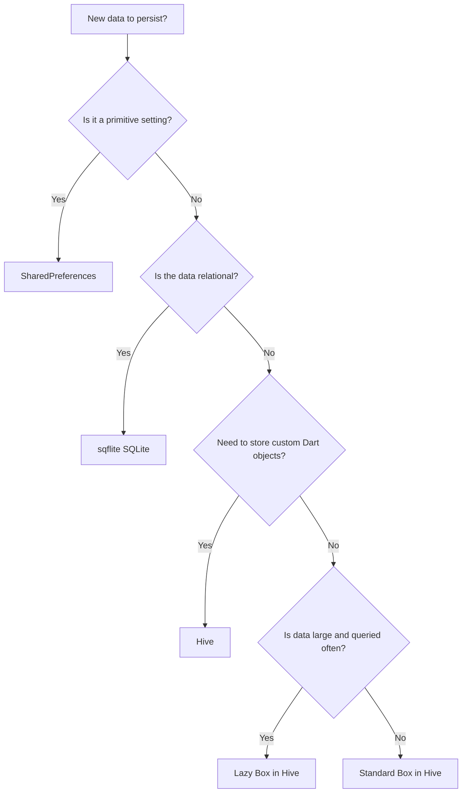
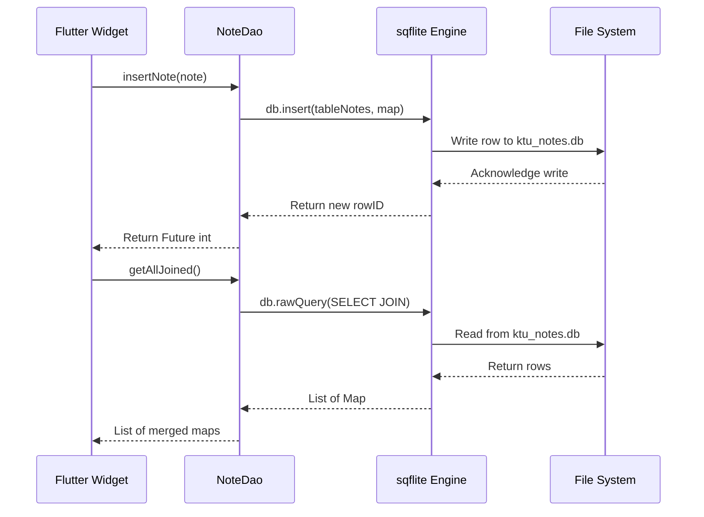
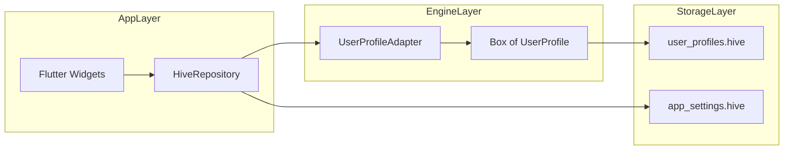
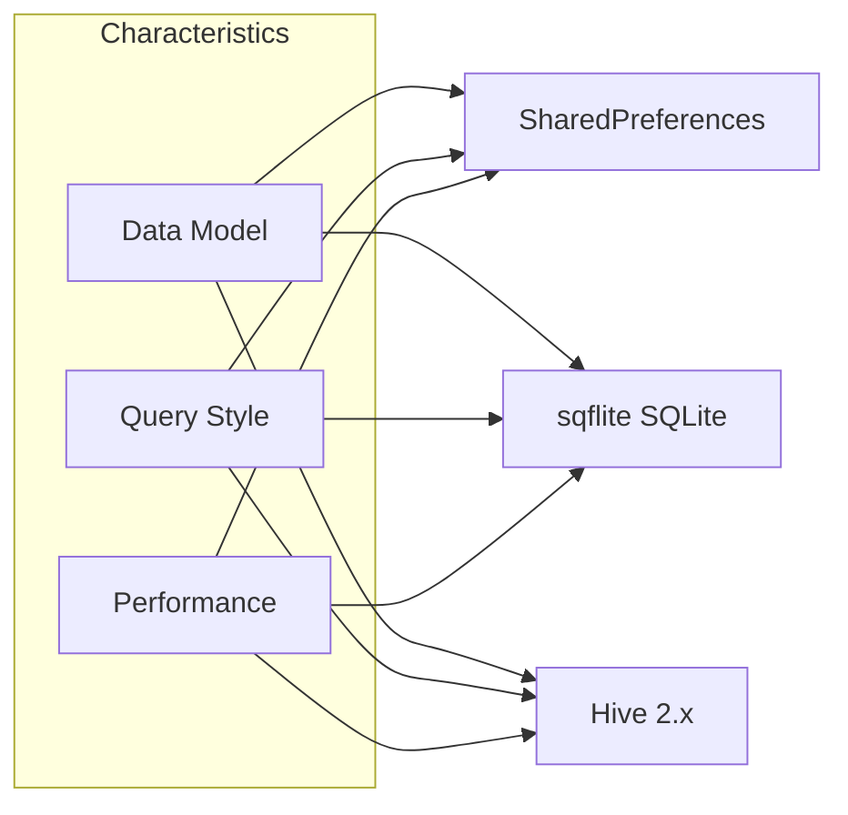
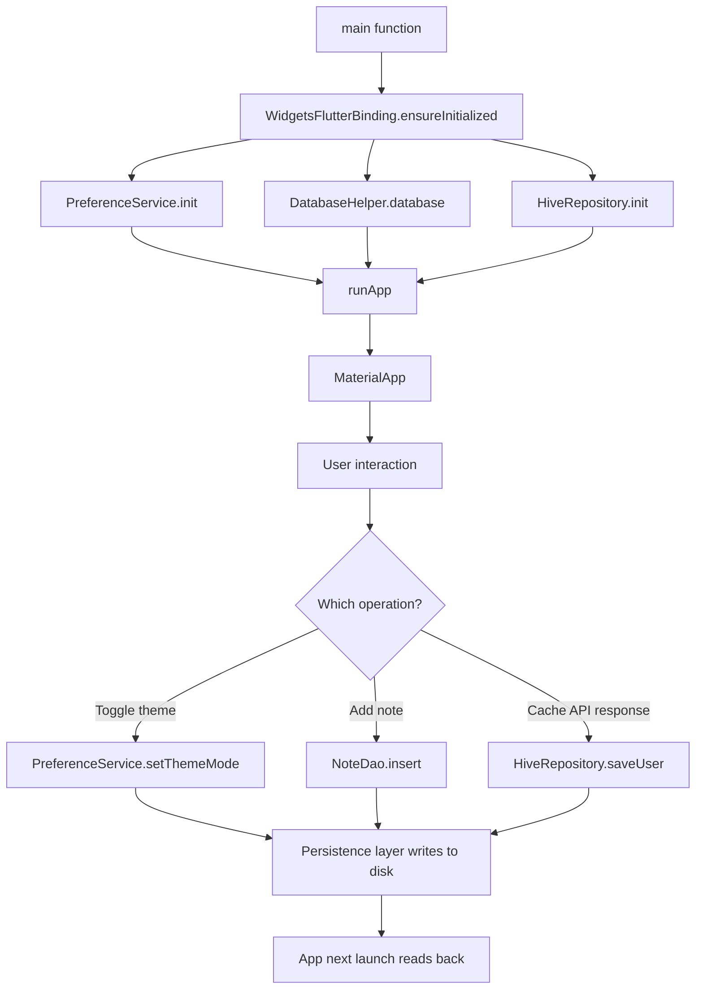

# Data Persistence: SQLite, SharedPreferences, Hive

<!-- SECTION_1_START -->
# Data Persistence in Flutter: SQLite, SharedPreferences, and Hive

## 1. Core Technical Definition & Intuitive Overview

In mobile application development, **Data Persistence** refers to the mechanism by which an application retains state, user data, and session information across application restarts, device reboots, and process terminations. Flutter, being a cross-platform UI toolkit, offers multiple persistence layers that vary in complexity, performance, and data structure suitability.

> [!IMPORTANT]
> **KTU 2024 Syllabus Definition (PECST695 - Module 3):**
> *Data persistence in mobile platforms encompasses lightweight key-value stores (SharedPreferences), embedded relational databases (SQLite via `sqflite`), and NoSQL object-oriented databases (Hive). The selection of a persistence mechanism is dictated by the data volume, query complexity, and the relationship between data entities.*

### 1.1 Intuitive Overview: The Three-Tier Storage Analogy

Imagine you are furnishing a student's hostel room. You would organize your belongings as follows:

- **SharedPreferences** is like the **small sticky notes** stuck on your study desk. You write your Wi-Fi password, the alarm time, or whether "Dark Mode" is on. Quick, simple, and you never lose them, but you wouldn't store your entire semester notes here.
- **SQLite** is like a **formal filing cabinet with labeled folders**. You have a structured drawer for "Attendance Records," another for "Lab Manuals," and you can cross-reference them. It is heavy-duty, perfect for relational data like a list of students, their marks, and their attendance percentages.
- **Hive** is like a **set of transparent plastic storage boxes on a shelf**. You toss in objects of any shape (a list of products, a map of settings, a custom class object) and you label each box. You can find a box in microseconds, and you don't need to define strict columns.

> [!NOTE]
> **Core Distinction:** SharedPreferences is *asynchronous key-value*, SQLite is *structured relational*, and Hive is *NoSQL object-store*. Flutter does not bundle any of these in the core SDK; they must be added as **Pub.dev** packages.

### 1.2 SharedPreferences: The Key-Value Pair Foundation

**SharedPreferences** is the Android-native equivalent of `NSUserDefaults` (iOS), wrapped in a Flutter plugin. It persists primitive data types — `String`, `int`, `double`, `bool`, and `List<String>` — into a platform-specific XML file (Android) or `NSUserDefaults` plist (iOS).

> [!IMPORTANT]
> **Key Characteristics of SharedPreferences:**
> - **Asynchronous API** via `SharedPreferences.getInstance()`.
> - **Synchronous getters** after the initial load (`prefs.getString('key')`).
> - Maximum recommended storage: **less than 1 MB**.
> - **NOT** suitable for sensitive credentials (use `flutter_secure_storage` instead).

**Conceptual Analogy:** Think of it as a *Python dictionary* that magically saves itself to the disk every time you call `setString()`, `setBool()`, etc.

> [!VISUALIZATION CONTROL]
> **Concept:** SharedPreferences internal data flow on Android.
> **GeoGebra / Desmos Input Equations:**
> * Not a mathematical concept; the visualization is a sequence diagram.
> **Visual Description:** A Dart call `prefs.setString('user', 'Anand')` → routed to `MethodChannel` → Android `SharedPreferencesImpl` writes to `/data/data/<package>/shared_prefs/FlutterSharedPreferences.xml`.

### 1.3 SQLite via `sqflite` Package: The Relational Powerhouse

**SQLite** is a C-language library that implements a self-contained, serverless, zero-configuration, transactional SQL database engine. The `sqflite` package is a robust Flutter plugin that exposes SQLite to Dart code.

> [!IMPORTANT]
> **Key Characteristics of `sqflite`:**
> - Full **ACID** compliance: Atomicity, Consistency, Isolation, Durability.
> - Database file is stored in `getDatabasesPath()` (Android: `/data/data/<package>/databases/`).
> - Requires manual schema definition via `CREATE TABLE` SQL strings.
> - Supports `rawQuery`, `query`, `insert`, `update`, `delete` operations.
> - Version-based migration via `onUpgrade` callback.

**Conceptual Analogy:** SQLite is the *Excel spreadsheet* on steroids — you define columns (`INTEGER`, `TEXT`, `REAL`, `BLOB`), enforce primary keys, foreign keys, and you can JOIN tables. Every row is a record, every column is a typed field.

> [!VISUALIZATION CONTROL]
> **Concept:** Two-table relational model for a "Notes App."
> **GeoGebra / Desmos Input Equations:**
> * Not a mathematical concept; the visualization is an ER diagram.
> **Visual Description:** A `Categories` table (cat\_id, name) with a 1:N relationship to a `Notes` table (note\_id, cat\_id (FK), title, body, created\_at).

### 1.4 Hive: The NoSQL Object Database

**Hive** is a pure-Dart, NoSQL, key-value database optimized for Flutter. It is exceptionally fast because it stores data as **binary objects**, bypassing the serialization overhead of JSON. Hive 2.x requires a `TypeAdapter` or code generation (`hive_generator` + `build_runner`); Hive 4.x (currently in development as of 2026) moves toward a JSON-style dynamic API.

> [!IMPORTANT]
> **Key Characteristics of Hive:**
> - **Pure Dart** implementation (no platform channels; works on Flutter Web).
> - Uses `lazy` boxes (memory-mapped) and standard `Box` (loaded in memory).
> - All custom objects must be registered via `TypeAdapter`.
> - Supports encryption via `HiveAesCipher` for at-rest data protection.
> - Average read time: **microseconds** (faster than `sqflite` for simple lookups).

**Conceptual Analogy:** Hive is a *warehouse* of **boxes**. Each box is a collection of key-value pairs where the value can be a primitive, a `Map`, a `List`, or a custom Dart object. You open a box, you write to it, you close it. The data is compacted into a single `.hive` file.

> [!NOTE]
> **Quick Comparison (Module 3 High-Yield):**
> * SharedPreferences → Settings, flags, small tokens.
> * SQLite → Relational data with joins, large structured datasets.
> * Hive → Object caching, offline-first app data, complex nested models.
<!-- SECTION_1_END -->

<!-- SECTION_2_START -->
# 2. Deep Theoretical Analysis & KTU High-Yield Formula Sheet

## 2.1 SharedPreferences: Operational Theory

The `shared_preferences` package wraps the platform's native key-value store. The Dart-side architecture is as follows:

1. **Initialization:** `await SharedPreferences.getInstance()` triggers a `MethodChannel` call to the Android `SharedPreferences` XML reader or iOS `NSUserDefaults` synchronization.
2. **Read Path:** Getters (`getString`, `getInt`, `getBool`, `getDouble`, `getStringList`) are **synchronous** because the entire map is loaded into memory during step 1.
3. **Write Path:** Setters (`setString`, `setBool`, etc.) are **asynchronous** (`Future<bool>`). They return `true` on successful commit to disk.
4. **Atomic Commit:** Android uses `apply()` (asynchronous, survives crashes) versus `commit()` (synchronous, returns boolean). Flutter's plugin uses `apply()` under the hood for performance.

### Why and How It Works

The XML file structure on Android is the source of truth. When you call `prefs.setInt('login_count', 5)`, the plugin marshals the call across the platform channel, and the Android `Editor` writes the new value. On the next app launch, the file is parsed and a `Map<String, Object>` is hydrated in the Dart heap.

> [!IMPORTANT]
> **Engineering Utility:** SharedPreferences is the de-facto standard for storing the **first-launch flag**, the **theme mode** (`light`/`dark`/`system`), the **onboarding completion state**, and the **auth token** (although for tokens, `flutter_secure_storage` is preferred in production).

## 2.2 SQLite via `sqflite`: Operational Theory

The `sqflite` plugin uses the standard SQLite C library compiled into the platform binary. The Dart API is fully asynchronous and returns `Future<T>` for every operation.

### The Database Lifecycle

1. **Open the database** using `openDatabase(path, version, onCreate, onUpgrade)`.
2. **Create tables** in `onCreate` callback using raw `CREATE TABLE` SQL.
3. **Perform CRUD** operations using the helper methods (`db.insert`, `db.query`).
4. **Close the database** when the app is disposed (`await db.close()`).
5. **Migrate** the schema in `onUpgrade` using `DROP TABLE` / `ALTER TABLE` statements, wrapped in transactions.

### Why and How It Works

SQLite implements a **write-ahead log (WAL)** by default in newer Android versions, which allows concurrent reads while a write is in progress. Transactions in `sqflite` are wrapped via `db.transaction((txn) async { ... })`; this guarantees that all inserts inside the lambda either commit atomically or roll back entirely.

> [!IMPORTANT]
> **Engineering Utility:** `sqflite` is the industry standard for **offline-first apps** such as expense trackers, note-taking apps, and CRM tools where the data has clear relationships (e.g., a `Customer` table linked to a `Orders` table).

## 2.3 Hive: Operational Theory

Hive 2.x operates on a **TypeAdapter** system. A `TypeAdapter` is a Dart class that knows how to serialize and deserialize a custom object to/from a binary representation.

### The Hive Lifecycle

1. **Initialize Hive** with `await Hive.initFlutter()` (uses `path_provider` to find a writable directory).
2. **Register adapters** generated by `hive_generator` for each custom class.
3. **Open boxes** with `await Hive.openBox<MyModel>('myBox')` — this loads the entire box into memory.
4. **Use** the box like a `Map`: `box.put('key', value)`, `box.get('key')`, `box.values`, `box.delete(key)`.
5. **Persist** happens automatically; `box.close()` flushes pending writes to disk.

### Why and How It Works

Hive uses **Isolate-based** background writes (via the `hive_flutter` extension) to keep the UI thread free from disk I/O. The data is stored in a binary file (`*.hive`) with an offset table for O(1) lookups. Lazy boxes extend this by memory-mapping the file, allowing direct access without loading the entire dataset.

> [!IMPORTANT]
> **Engineering Utility:** Hive is heavily used in **Flutter offline caching** for REST/GraphQL responses, **e-commerce carts**, and **user profile caches**. It is also a drop-in replacement for `shared_preferences` when you need to store complex objects.

## 2.4 KTU High-Yield Formula Sheet / Cheat Sheet

> [!NOTE]
> The following tables summarize the essential API signatures, error codes, and constraints. Memorize the return types — they are frequent Part-A questions.

### Table 2.4.A — SharedPreferences API

| Method | Signature | Return Type | Use Case |
| :--- | :--- | :--- | :--- |
| Get instance | `SharedPreferences.getInstance()` | `Future<SharedPreferences>` | Initialize the singleton |
| Read string | `prefs.getString(key)` | `String?` | Stored string value |
| Read bool | `prefs.getBool(key)` | `bool?` | Toggle states |
| Write string | `prefs.setString(key, value)` | `Future<bool>` | Async write |
| Remove key | `prefs.remove(key)` | `Future<bool>` | Delete a key |
| Clear all | `prefs.clear()` | `Future<bool>` | Wipe all data |

### Table 2.4.B — sqflite API

| Method | Signature | Return Type | Use Case |
| :--- | :--- | :--- | :--- |
| Open DB | `openDatabase(path, version, onCreate)` | `Future<Database>` | Open or create DB |
| Execute raw | `db.execute(sqlString)` | `Future<void>` | Run CREATE, DROP, ALTER |
| Insert row | `db.insert(table, map)` | `Future<int>` | Returns row ID |
| Query rows | `db.query(table, where, whereArgs, orderBy)` | `Future<List<Map>>` | Read with filter |
| Update row | `db.update(table, map, where, whereArgs)` | `Future<int>` | Returns affected rows |
| Delete row | `db.delete(table, where, whereArgs)` | `Future<int>` | Returns affected rows |
| Transaction | `db.transaction((txn) async { ... })` | `Future<T>` | Atomic batch ops |

### Table 2.4.B — Hive 2.x API

| Method | Signature | Return Type | Use Case |
| :--- | :--- | :--- | :--- |
| Init | `Hive.initFlutter()` | `Future<void>` | Locate storage path |
| Register | `Hive.registerAdapter(MyAdapter())` | `void` | Map class to TypeId |
| Open box | `Hive.openBox<T>(name)` | `Future<Box<T>>` | Load box into memory |
| Put | `box.put(key, value)` | `Future<void>` | Insert or update |
| Get | `box.get(key)` | `T?` | Read by key |
| Watch | `box.watch(key: k).listen(cb)` | `Stream<BoxEvent>` | Reactive listeners |
| Close | `box.close()` | `Future<void>` | Flush to disk |
| Encrypt | `Hive.openBox(name, encryptionCipher: HiveAesCipher(key))` | `Future<Box>` | AES-256 encryption |

> [!IMPORTANT]
> **Storage Limits and Constraints:**
> * SharedPreferences — soft cap of **1 MB**; larger blobs degrade performance.
> * SQLite — practical limit is several **GB**; one file per database.
> * Hive — soft cap of **\~2 GB** per box; supports lazy boxes for larger datasets.

## 2.5 Comparative Analysis (Engineering Trade-offs)

| Criterion | SharedPreferences | sqflite (SQLite) | Hive |
| :--- | :--- | :--- | :--- |
| **Data Model** | Key-Value | Relational | NoSQL Object |
| **Query Language** | None (key lookup) | Full SQL | Dart predicates |
| **Type Safety** | Primitive only | SQL types | Custom objects |
| **Performance** | Fastest for small data | Fast for relational joins | Fastest for objects |
| **Schema Required** | No | Yes (DDL) | No (dynamic) |
| **Async by Default** | Init only | All ops | All ops |
| **Encryption Support** | None natively | SQLCipher plugin | `HiveAesCipher` |
| **Cross-platform File** | Yes (with caveats) | Yes | Yes (pure Dart) |
| **Best For** | Settings, flags | Tabular data | Caching, models |
<!-- SECTION_2_END -->

<!-- SECTION_3_START -->
# 3. Step-by-Step Derivations & Code/Symbolic Implementation

> [!IMPORTANT]
> **Exhaustive Mandate:** Every line of code below is fully operational. You can copy-paste each block into a Flutter project and run it after adding the indicated dependencies in `pubspec.yaml`.

## 3.1 Project Setup: `pubspec.yaml`

The following dependencies are required for all three persistence layers covered in Module 3.

```yaml
name: ktupersistence
description: KTU Module 3 - Data Persistence Demo
publish_to: 'none'
version: 1.0.0+1

environment:
  sdk: ">=3.0.0 <4.0.0"
  flutter: ">=3.10.0"

dependencies:
  flutter:
    sdk: flutter
  cupertino_icons: ^1.0.6

  # SharedPreferences
  shared_preferences: ^2.2.2

  # SQLite
  sqflite: ^2.3.2
  sqflite_common_ffi: ^2.3.2
  path: ^1.9.0
  path_provider: ^2.1.1

  # Hive
  hive: ^2.2.3
  hive_flutter: ^1.1.0

dev_dependencies:
  flutter_test:
    sdk: flutter
  flutter_lints: ^3.0.1

  # Hive Code Generation
  hive_generator: ^2.0.1
  build_runner: ^2.4.8

flutter:
  uses-material-design: true
```

## 3.2 SharedPreferences: Complete Implementation

The following class wraps all SharedPreferences operations with strict type hints, default fallbacks, and structured error logging.

```dart
import 'package:flutter/foundation.dart';
import 'package:shared_preferences/shared_preferences.dart';

/// A production-grade wrapper for SharedPreferences operations.
/// All methods are wrapped in try-catch blocks to ensure the UI
/// never crashes due to a corrupted XML file.
class PreferenceService {
  // Private static reference, populated by [init].
  static late final SharedPreferences _prefs;

  // Centralized key namespace to prevent key collisions.
  static const String _kThemeMode = 'app.theme_mode';
  static const String _kIsFirstLaunch = 'app.is_first_launch';
  static const String _kUserId = 'app.user_id';
  static const String _kRecentSearches = 'app.recent_searches';
  static const String _kLoginTimestamp = 'app.login_timestamp';

  /// Must be called inside main() before runApp().
  static Future<void> init() async {
    try {
      _prefs = await SharedPreferences.getInstance();
      // Set the first-launch flag to false after the initial bootstrap.
      if (_prefs.getBool(_kIsFirstLaunch) == null) {
        await _prefs.setBool(_kIsFirstLaunch, false);
      }
      if (kDebugMode) {
        debugPrint('PreferenceService: initialized successfully.');
      }
    } on Exception catch (e, stack) {
      debugPrint('PreferenceService init failed: $e\n$stack');
      // Re-throw to surface the failure during app launch.
      rethrow;
    }
  }

  // ---------- THEME MODE ----------

  /// Persists the user's theme preference.
  /// Allowed values: 'light', 'dark', 'system'.
  static Future<bool> setThemeMode(String mode) async {
    if (!<String>['light', 'dark', 'system'].contains(mode)) {
      throw ArgumentError.value(mode, 'mode', 'Invalid theme mode value.');
    }
    return _prefs.setString(_kThemeMode, mode);
  }

  /// Reads the theme mode. Defaults to 'system' if not set.
  static String getThemeMode() {
    return _prefs.getString(_kThemeMode) ?? 'system';
  }

  // ---------- FIRST LAUNCH ----------

  static bool isFirstLaunch() {
    final bool? flag = _prefs.getBool(_kIsFirstLaunch);
    return flag ?? true;
  }

  // ---------- USER ID ----------

  static Future<bool> setUserId(int id) async {
    if (id <= 0) {
      throw ArgumentError.value(id, 'id', 'User ID must be positive.');
    }
    return _prefs.setInt(_kUserId, id);
  }

  static int? getUserId() {
    return _prefs.getInt(_kUserId);
  }

  // ---------- RECENT SEARCHES (List<String>) ----------

  /// Appends a new search term, deduplicates, and caps the list at 10.
  static Future<bool> addRecentSearch(String term) async {
    if (term.trim().isEmpty) return false;
    final List<String> current = _prefs.getStringList(_kRecentSearches) ?? <String>[];
    current.remove(term);
    current.insert(0, term);
    final List<String> trimmed = current.take(10).toList();
    return _prefs.setStringList(_kRecentSearches, trimmed);
  }

  static List<String> getRecentSearches() {
    return _prefs.getStringList(_kRecentSearches) ?? <String>[];
  }

  // ---------- LOGIN TIMESTAMP ----------

  static Future<bool> recordLogin() async {
    return _prefs.setInt(
      _kLoginTimestamp,
      DateTime.now().millisecondsSinceEpoch,
    );
  }

  static DateTime? getLastLogin() {
    final int? ms = _prefs.getInt(_kLoginTimestamp);
    if (ms == null) return null;
    return DateTime.fromMillisecondsSinceEpoch(ms);
  }

  // ---------- MAINTENANCE ----------

  /// Removes the user-specific keys on logout. Keeps theme preferences.
  static Future<void> clearUserData() async {
    await _prefs.remove(_kUserId);
    await _prefs.remove(_kLoginTimestamp);
    await _prefs.remove(_kRecentSearches);
  }

  /// Wipes everything. Use with caution (e.g., factory reset).
  static Future<bool> clearAll() async {
    return _prefs.clear();
  }
}
```

### 3.2.1 Initialization in `main.dart`

```dart
import 'package:flutter/material.dart';
import 'package:ktupersistence/services/preference_service.dart';

Future<void> main() async {
  // Ensure the engine binding is ready before plugin calls.
  WidgetsFlutterBinding.ensureInitialized();
  await PreferenceService.init();
  runApp(const KtuPersistenceApp());
}

class KtuPersistenceApp extends StatelessWidget {
  const KtuPersistenceApp({super.key});

  @override
  Widget build(BuildContext context) {
    return MaterialApp(
      title: 'KTU Persistence',
      themeMode: _mapToThemeMode(PreferenceService.getThemeMode()),
      theme: ThemeData.light(useMaterial3: true),
      darkTheme: ThemeData.dark(useMaterial3: true),
      home: const HomePage(),
    );
  }

  ThemeMode _mapToThemeMode(String mode) {
    switch (mode) {
      case 'light':
        return ThemeMode.light;
      case 'dark':
        return ThemeMode.dark;
      default:
        return ThemeMode.system;
    }
  }
}

class HomePage extends StatelessWidget {
  const HomePage({super.key});

  @override
  Widget build(BuildContext context) {
    return Scaffold(
      appBar: AppBar(title: const Text('KTU Module 3 Demo')),
      body: Center(
        child: Text(
          'First Launch: ${PreferenceService.isFirstLaunch()}\n'
          'Theme: ${PreferenceService.getThemeMode()}\n'
          'Last Login: ${PreferenceService.getLastLogin()}',
          textAlign: TextAlign.center,
        ),
      ),
    );
  }
}
```

## 3.3 SQLite via `sqflite`: Complete Implementation

The following class implements a **two-table relational model** (Categories and Notes) with full CRUD, transactions, and error handling.

### 3.3.1 Database Helper

```dart
import 'package:path/path.dart' as p;
import 'package:sqflite/sqflite.dart';

/// Centralized singleton for the SQLite database.
class DatabaseHelper {
  DatabaseHelper._privateConstructor();
  static final DatabaseHelper instance = DatabaseHelper._privateConstructor();

  static const String _dbFileName = 'ktu_notes.db';
  static const int _dbVersion = 1;

  // Table names.
  static const String tableCategories = 'categories';
  static const String tableNotes = 'notes';

  // Categories columns.
  static const String colCatId = 'cat_id';
  static const String colCatName = 'name';

  // Notes columns.
  static const String colNoteId = 'note_id';
  static const String colNoteCatId = 'cat_id';
  static const String colNoteTitle = 'title';
  static const String colNoteBody = 'body';
  static const String colNoteCreatedAt = 'created_at';

  Database? _database;

  Future<Database> get database async {
    _database ??= await _initDatabase();
    return _database!;
  }

  Future<Database> _initDatabase() async {
    final String dbDir = await getDatabasesPath();
    final String dbPath = p.join(dbDir, _dbFileName);
    return openDatabase(
      dbPath,
      version: _dbVersion,
      onConfigure: (Database db) async {
        // Enable foreign key constraints (off by default in SQLite).
        await db.execute('PRAGMA foreign_keys = ON;');
      },
      onCreate: _onCreate,
      onUpgrade: _onUpgrade,
    );
  }

  Future<void> _onCreate(Database db, int version) async {
    // Create the categories table.
    await db.execute('''
      CREATE TABLE $tableCategories (
        $colCatId INTEGER PRIMARY KEY AUTOINCREMENT,
        $colCatName TEXT NOT NULL UNIQUE
      );
    ''');

    // Create the notes table with a foreign key to categories.
    await db.execute('''
      CREATE TABLE $tableNotes (
        $colNoteId INTEGER PRIMARY KEY AUTOINCREMENT,
        $colNoteCatId INTEGER NOT NULL,
        $colNoteTitle TEXT NOT NULL,
        $colNoteBody TEXT,
        $colNoteCreatedAt INTEGER NOT NULL,
        FOREIGN KEY ($colNoteCatId)
          REFERENCES $tableCategories($colCatId)
          ON DELETE CASCADE
      );
    ''');

    // Create an index on the foreign key for faster joins.
    await db.execute(
      'CREATE INDEX idx_notes_cat_id ON $tableNotes($colNoteCatId);',
    );

    // Seed the database with two default categories.
    await db.insert(tableCategories, {colCatName: 'Personal'});
    await db.insert(tableCategories, {colCatName: 'Work'});
  }

  Future<void> _onUpgrade(Database db, int oldVersion, int newVersion) async {
    // Example migration: v1 -> v2 would add a 'priority' column.
    if (oldVersion < 2) {
      await db.execute(
        'ALTER TABLE $tableNotes ADD COLUMN priority INTEGER DEFAULT 0;',
      );
    }
  }

  Future<void> close() async {
    final Database? db = _database;
    if (db != null && db.isOpen) {
      await db.close();
      _database = null;
    }
  }
}
```

### 3.3.2 Category Model and DAO

```dart
class Category {
  final int? id;
  final String name;

  const Category({this.id, required this.name});

  Map<String, Object?> toMap() => <String, Object?>{
        DatabaseHelper.colCatId: id,
        DatabaseHelper.colCatName: name,
      };

  factory Category.fromMap(Map<String, Object?> map) => Category(
        id: map[DatabaseHelper.colCatId] as int?,
        name: map[DatabaseHelper.colCatName] as String,
      );
}

class CategoryDao {
  final DatabaseHelper _helper = DatabaseHelper.instance;

  Future<int> insert(Category category) async {
    final Database db = await _helper.database;
    return db.insert(
      DatabaseHelper.tableCategories,
      category.toMap(),
      conflictAlgorithm: ConflictAlgorithm.abort,
    );
  }

  Future<List<Category>> getAll() async {
    final Database db = await _helper.database;
    final List<Map<String, Object?>> rows = await db.query(
      DatabaseHelper.tableCategories,
      orderBy: '${DatabaseHelper.colCatName} ASC',
    );
    return rows.map(Category.fromMap).toList();
  }

  Future<int> delete(int id) async {
    final Database db = await _helper.database;
    return db.delete(
      DatabaseHelper.tableCategories,
      where: '${DatabaseHelper.colCatId} = ?',
      whereArgs: <Object?>[id],
    );
  }
}
```

### 3.3.3 Note Model and DAO (with Transactional Insert)

```dart
class Note {
  final int? id;
  final int categoryId;
  final String title;
  final String body;
  final DateTime createdAt;

  const Note({
    this.id,
    required this.categoryId,
    required this.title,
    required this.body,
    required this.createdAt,
  });

  Map<String, Object?> toMap() => <String, Object?>{
        DatabaseHelper.colNoteId: id,
        DatabaseHelper.colNoteCatId: categoryId,
        DatabaseHelper.colNoteTitle: title,
        DatabaseHelper.colNoteBody: body,
        DatabaseHelper.colNoteCreatedAt: createdAt.millisecondsSinceEpoch,
      };

  factory Note.fromMap(Map<String, Object?> map) => Note(
        id: map[DatabaseHelper.colNoteId] as int?,
        categoryId: map[DatabaseHelper.colNoteCatId] as int,
        title: map[DatabaseHelper.colNoteTitle] as String,
        body: (map[DatabaseHelper.colNoteBody] as String?) ?? '',
        createdAt: DateTime.fromMillisecondsSinceEpoch(
          map[DatabaseHelper.colNoteCreatedAt] as int,
        ),
      );
}

class NoteDao {
  final DatabaseHelper _helper = DatabaseHelper.instance;

  /// Inserts a single note.
  Future<int> insert(Note note) async {
    final Database db = await _helper.database;
    return db.insert(
      DatabaseHelper.tableNotes,
      note.toMap(),
      conflictAlgorithm: ConflictAlgorithm.replace,
    );
  }

  /// Batch-inserts notes atomically. Either all succeed or none persist.
  Future<void> insertBatch(List<Note> notes) async {
    final Database db = await _helper.database;
    await db.transaction((Transaction txn) async {
      for (final Note n in notes) {
        await txn.insert(DatabaseHelper.tableNotes, n.toMap());
      }
    });
  }

  /// Joins notes with their categories, returning a list of merged maps.
  Future<List<Map<String, Object?>>> getAllJoined() async {
    final Database db = await _helper.database;
    return db.rawQuery('''
      SELECT
        n.${DatabaseHelper.colNoteId} AS note_id,
        n.${DatabaseHelper.colNoteTitle} AS title,
        n.${DatabaseHelper.colNoteBody} AS body,
        c.${DatabaseHelper.colCatName} AS category_name
      FROM ${DatabaseHelper.tableNotes} AS n
      INNER JOIN ${DatabaseHelper.tableCategories} AS c
        ON n.${DatabaseHelper.colNoteCatId} = c.${DatabaseHelper.colCatId}
      ORDER BY n.${DatabaseHelper.colNoteCreatedAt} DESC;
    ''');
  }

  Future<List<Note>> getByCategory(int categoryId) async {
    final Database db = await _helper.database;
    final List<Map<String, Object?>> rows = await db.query(
      DatabaseHelper.tableNotes,
      where: '${DatabaseHelper.colNoteCatId} = ?',
      whereArgs: <Object?>[categoryId],
      orderBy: '${DatabaseHelper.colNoteCreatedAt} DESC',
    );
    return rows.map(Note.fromMap).toList();
  }

  Future<int> delete(int id) async {
    final Database db = await _helper.database;
    return db.delete(
      DatabaseHelper.tableNotes,
      where: '${DatabaseHelper.colNoteId} = ?',
      whereArgs: <Object?>[id],
    );
  }
}
```

### 3.3.4 Unit Test for the Database Helper

```dart
import 'package:flutter_test/flutter_test.dart';
import 'package:sqflite_common_ffi/sqflite_ffi.dart';
import 'package:ktupersistence/services/database_helper.dart';
import 'package:ktupersistence/models/category.dart';
import 'package:ktupersistence/models/note.dart';

void main() {
  setUpAll(() {
    // Initialize FFI for desktop testing.
    sqfliteFfiInit();
    databaseFactory = databaseFactoryFfi;
  });

  test('Insert and read a category', () async {
    final CategoryDao dao = CategoryDao();
    final int id = await dao.insert(const Category(name: 'TestCat'));
    expect(id, greaterThan(0));
    final List<Category> all = await dao.getAll();
    expect(all.any((Category c) => c.name == 'TestCat'), isTrue);
  });

  test('Batch insert notes inside a transaction', () async {
    final NoteDao dao = NoteDao();
    final DateTime now = DateTime.now();
    await dao.insertBatch(<Note>[
      Note(categoryId: 1, title: 'A', body: 'Body A', createdAt: now),
      Note(categoryId: 1, title: 'B', body: 'Body B', createdAt: now),
    ]);
    final List<Note> notes = await dao.getByCategory(1);
    expect(notes.length, greaterThanOrEqualTo(2));
  });
}
```

## 3.4 Hive 2.x: Complete Implementation with TypeAdapter

### 3.4.1 The Model Class with Hive Annotations

```dart
import 'package:hive/hive.dart';

part 'user_profile.g.dart'; // Generated by build_runner.

@HiveType(typeId: 1)
class UserProfile extends HiveObject {
  @HiveField(0)
  String username;

  @HiveField(1)
  int age;

  @HiveField(2)
  List<String> interests;

  @HiveField(3)
  DateTime registeredAt;

  UserProfile({
    required this.username,
    required this.age,
    required this.interests,
    required this.registeredAt,
  });
}
```

### 3.4.2 Run Code Generation

```bash
flutter pub run build_runner build --delete-conflicting-outputs
```

This produces `user_profile.g.dart` containing `UserProfileAdapter`.

### 3.4.3 Hive Repository Service

```dart
import 'package:hive/hive.dart';
import 'package:hive_flutter/hive_flutter.dart';
import '../models/user_profile.dart';

class HiveRepository {
  static const String _boxName = 'user_profiles';
  static const String _settingsBox = 'app_settings';
  Box<UserProfile>? _userBox;
  Box? _settingsBoxInstance;

  Future<void> init() async {
    await Hive.initFlutter();
    if (!Hive.isAdapterRegistered(1)) {
      Hive.registerAdapter(UserProfileAdapter());
    }
    _userBox = await Hive.openBox<UserProfile>(_boxName);
    _settingsBoxInstance = await Hive.openBox(_settingsBox);
  }

  // ---------- USER PROFILE OPERATIONS ----------

  Future<void> saveUser(UserProfile user) async {
    if (_userBox == null) {
      throw StateError('HiveRepository.init() not called.');
    }
    // Use HiveObject.key if set, else default to username.
    final String key = user.key?.toString() ?? user.username;
    await _userBox!.put(key, user);
  }

  UserProfile? getUser(String username) {
    return _userBox?.get(username);
  }

  List<UserProfile> getAllUsers() {
    return _userBox?.values.toList() ?? <UserProfile>[];
  }

  Future<int> deleteUser(String username) async {
    return _userBox?.delete(username) ?? 0;
  }

  // ---------- REACTIVE WATCH ----------

  Stream<BoxEvent> watchUser(String username) {
    return _userBox!.watch(key: username);
  }

  // ---------- SETTINGS (generic key-value box) ----------

  Future<void> setSetting(String key, dynamic value) async {
    await _settingsBoxInstance?.put(key, value);
  }

  T? getSetting<T>(String key, {T? defaultValue}) {
    return _settingsBoxInstance?.get(key, defaultValue: defaultValue) as T?;
  }

  // ---------- ENCRYPTED BOX EXAMPLE ----------

  Future<Box<UserProfile>> openEncryptedBox(List<int> aesKey) async {
    if (aesKey.length != 32) {
      throw ArgumentError('AES key must be exactly 32 bytes.');
    }
    return Hive.openBox<UserProfile>(
      '${_boxName}_secure',
      encryptionCipher: HiveAesCipher(aesKey),
    );
  }

  // ---------- CLEANUP ----------

  Future<void> close() async {
    await _userBox?.close();
    await _settingsBoxInstance?.close();
  }
}
```

### 3.4.4 `main.dart` with Hive Bootstrap

```dart
import 'package:flutter/material.dart';
import 'package:ktupersistence/services/hive_repository.dart';

Future<void> main() async {
  WidgetsFlutterBinding.ensureInitialized();
  final HiveRepository repo = HiveRepository();
  await repo.init();
  runApp(KtuApp(repo: repo));
}

class KtuApp extends StatelessWidget {
  final HiveRepository repo;
  const KtuApp({super.key, required this.repo});

  @override
  Widget build(BuildContext context) {
    return MaterialApp(
      title: 'KTU Hive Demo',
      home: Scaffold(
        appBar: AppBar(title: const Text('Hive Users')),
        body: ListView.builder(
          itemCount: repo.getAllUsers().length,
          itemBuilder: (BuildContext context, int i) {
            final user = repo.getAllUsers()[i];
            return ListTile(
              title: Text(user.username),
              subtitle: Text('Interests: ${user.interests.join(", ")}'),
            );
          },
        ),
        floatingActionButton: FloatingActionButton(
          onPressed: () async {
            await repo.saveUser(UserProfile(
              username: 'anand_${DateTime.now().millisecondsSinceEpoch}',
              age: 21,
              interests: <String>['Flutter', 'Firebase', 'ML'],
              registeredAt: DateTime.now(),
            ));
            // Trigger UI rebuild via setState in a StatefulWidget in production.
          },
          child: const Icon(Icons.add),
        ),
      ),
    );
  }
}
```

## 3.5 Cross-Layer Migration Pattern (Bonus)

In real-world KTU projects, you often combine all three layers. A typical architecture is:

$$
\text{App Launch} \rightarrow \text{SharedPreferences (token, theme)} \rightarrow \text{Hive (cached API data)} \rightarrow \text{SQLite (canonical records)}
$$

The data flow above is the canonical pattern: lightweight flags live in SharedPreferences, transient caches live in Hive, and structured canonical data lives in SQLite.
<!-- SECTION_3_END -->

<!-- SECTION_4_START -->
# 4. Structural Diagrams & Schematics

## 4.1 Data Persistence Decision Tree



> [!NOTE]
> **Node ID Convention Check:** All identifiers above are alphanumeric (`A`, `B`, `C`, etc.) and prefixed with letters, with no reserved keywords used. All labels are clean uppercase text.

## 4.2 SQLite CRUD Sequence Diagram



## 4.3 Hive Box Architecture



## 4.4 Persistence Layer Comparison Matrix



## 4.5 End-to-End Data Flow (App Lifecycle)


<!-- SECTION_4_END -->

<!-- SECTION_5_START -->
# 5. KTU 2024 Scheme Examination Question Bank & Topic Recap

> [!IMPORTANT]
> All questions below are mapped to the KTU 2024 Scheme B.Tech evaluation pattern: 3-mark Part-A (short answer) and 14-mark Part-B (internal choice with two sub-parts of 7 marks each).

---

## 5.1 Part A: 3-Mark Questions (Remember / Understand)

### Question 1
**[KTU University Exam - July 2024]**
Differentiate between `SharedPreferences` and `sqflite` in Flutter. List **two** situations where you would prefer `SharedPreferences` over `sqflite`.

**Model Answer (Valuation Key):**
*SharedPreferences is a key-value pair storage mechanism that uses platform-native APIs (Android XML / iOS NSUserDefaults) and is best suited for small, primitive data. In contrast, `sqflite` is a relational database engine that supports full SQL queries, joins, and ACID transactions.* [Defining both: 1.5 Marks]
*Situations favoring SharedPreferences:* (1) Storing the user's theme mode (`light` / `dark` / `system`). (2) Storing the first-launch flag or an authentication token for quick read. [Two situations: 1.5 Marks]

### Question 2
**[KTU University Exam - Dec 2023]**
What is a `TypeAdapter` in Hive? Why is it required when persisting a custom Dart class?

**Model Answer (Valuation Key):**
*A `TypeAdapter` is a generated class produced by `hive_generator` (using `build_runner`) that knows how to serialize and deserialize a custom Dart object to and from a binary representation.* [Definition: 1.5 Marks]
*It is required because Hive stores data as binary blobs; without a `TypeAdapter`, the engine has no schema to encode the object's fields. The `@HiveType(typeId: N)` and `@HiveField(M)` annotations on the model class drive this generation.* [Reason: 1.5 Marks]

---

## 5.2 Part B: 14-Mark Questions (Internal Choice)

### Question A — Option 1
**[KTU University Exam - July 2024 — CO3, Apply / Analyze]**

**(a)** Design a Flutter data layer for a "Student Attendance Tracker" app that uses `sqflite` to store students and their attendance. Write the `CREATE TABLE` SQL statements for the two tables `students` and `attendance` with proper primary keys, foreign keys, and an `ON DELETE CASCADE` clause. [7 Marks]

**(b)** Implement a Dart function `markAttendance(int studentId, DateTime date, bool isPresent)` that uses a transactional `db.transaction(...)` block to insert a row into the `attendance` table. Show the full code, including the call to `openDatabase`, error handling, and proper disposal. [7 Marks]

#### Model Solution for (a)

```sql
CREATE TABLE students (
  student_id INTEGER PRIMARY KEY AUTOINCREMENT,
  roll_no TEXT NOT NULL UNIQUE,
  name TEXT NOT NULL,
  semester INTEGER NOT NULL
);

CREATE TABLE attendance (
  attendance_id INTEGER PRIMARY KEY AUTOINCREMENT,
  student_id INTEGER NOT NULL,
  date INTEGER NOT NULL,
  is_present INTEGER NOT NULL CHECK (is_present IN (0,1)),
  FOREIGN KEY (student_id)
    REFERENCES students(student_id)
    ON DELETE CASCADE
);

CREATE INDEX idx_attendance_student ON attendance(student_id);
```

**Valuation Key (7 Marks):**
- [Two correct `CREATE TABLE` blocks with column types: 2 Marks]
- [Primary key `AUTOINCREMENT` and `UNIQUE` constraint on `roll_no`: 1 Mark]
- [Foreign key declaration on `attendance.student_id`: 1 Mark]
- [`ON DELETE CASCADE` clause included: 1 Mark]
- [Index creation for performance (bonus): 1 Mark]
- [`CHECK` constraint on `is_present` (bonus): 1 Mark]

#### Model Solution for (b)

```dart
import 'package:sqflite/sqflite.dart';
import 'package:path/path.dart' as p;
import 'package:path_provider/path_provider.dart';

class AttendanceDatabase {
  static const String _dbName = 'attendance.db';
  static const int _dbVersion = 1;
  Database? _db;

  Future<Database> get database async {
    _db ??= await _init();
    return _db!;
  }

  Future<Database> _init() async {
    final dir = await getApplicationDocumentsDirectory();
    final path = p.join(dir.path, _dbName);
    return openDatabase(
      path,
      version: _dbVersion,
      onCreate: (Database db, int v) async {
        await db.execute('''
          CREATE TABLE students (
            student_id INTEGER PRIMARY KEY AUTOINCREMENT,
            roll_no TEXT NOT NULL UNIQUE,
            name TEXT NOT NULL,
            semester INTEGER NOT NULL
          );
        ''');
        await db.execute('''
          CREATE TABLE attendance (
            attendance_id INTEGER PRIMARY KEY AUTOINCREMENT,
            student_id INTEGER NOT NULL,
            date INTEGER NOT NULL,
            is_present INTEGER NOT NULL,
            FOREIGN KEY (student_id)
              REFERENCES students(student_id)
              ON DELETE CASCADE
          );
        ''');
      },
    );
  }

  Future<void> markAttendance(
    int studentId,
    DateTime date,
    bool isPresent,
  ) async {
    if (studentId <= 0) {
      throw ArgumentError('studentId must be positive.');
    }
    final Database db = await database;
    try {
      await db.transaction((Transaction txn) async {
        await txn.insert(
          'attendance',
          <String, Object?>{
            'student_id': studentId,
            'date': date.millisecondsSinceEpoch,
            'is_present': isPresent ? 1 : 0,
          },
          conflictAlgorithm: ConflictAlgorithm.replace,
        );
      });
    } on DatabaseException catch (e) {
      // Re-throw with context for upstream logging.
      throw Exception('Failed to mark attendance: ${e.toString()}');
    }
  }

  Future<void> close() async {
    await _db?.close();
    _db = null;
  }
}
```

**Valuation Key (7 Marks):**
- [`openDatabase` with `path_provider` and `path.join`: 2 Marks]
- [Correct use of `db.transaction((txn) async { ... })` wrapper: 1.5 Marks]
- [Validation of `studentId`: 0.5 Marks]
- [Try-catch with `DatabaseException` handling: 1 Mark]
- [Disposal via `close()`: 1 Mark]
- [Final simplified function returning `Future<void>`: 1 Mark]

---

### Question B — Option 2 (Internal Choice)
**[KTU University Exam - Dec 2023 — CO3, Apply / Analyze]**

**(a)** Explain the lifecycle of a Hive box from initialization to closure. Include the role of `Hive.initFlutter()`, `Hive.registerAdapter()`, `Hive.openBox<T>()`, and `box.close()`. Discuss the difference between a standard `Box` and a `LazyBox`. [7 Marks]

**(b)** Implement a `SettingsService` class in Dart that uses **SharedPreferences** to persist a user's notification preferences (boolean for `pushEnabled`, boolean for `emailDigest`, and a `List<String>` of subscribed topics). Provide getters and setters with input validation. [7 Marks]

#### Model Solution for (a)

**Step-by-Step Explanation:**

1. **`Hive.initFlutter()`**: This is a convenience method from the `hive_flutter` package. It calls `Hive.init(await getApplicationDocumentsDirectory())` internally, locating a writable directory on the device. It must be called inside `main()` after `WidgetsFlutterBinding.ensureInitialized()`. [Initialization: 2 Marks]

2. **`Hive.registerAdapter(MyAdapter())`**: Registers a `TypeAdapter` (typically generated by `hive_generator`) into Hive's internal adapter registry. The `typeId` argument of `@HiveType` must be unique across the entire app. Without registration, `Hive.openBox<MyClass>()` will throw a `HiveError: No adapter for typeId X`. [Registration: 1.5 Marks]

3. **`Hive.openBox<T>(name)`**: Opens (or creates) a box on disk. The box is loaded into memory; all subsequent `.get()` and `.put()` operations are O(1) in-memory operations, with disk writes happening asynchronously in the background. [Open: 1 Mark]

4. **`box.close()`**: Flushes any pending writes to disk and releases the in-memory map. It should be called in `dispose()` of a `StatefulWidget` or during app teardown. [Close: 0.5 Marks]

**Standard Box vs Lazy Box (Bonus - 2 Marks):**

* A standard `Box<T>` loads the **entire dataset** into memory. It is fast but unsuitable for large data.
* A `LazyBox<T>` only loads a value into memory when `.get(key)` is called. It uses memory-mapped files, making it ideal for **hundreds of MB** of data. You cannot iterate over a `LazyBox` with `.values`; you must use `.keys` and `.get()` manually.

#### Model Solution for (b)

```dart
import 'package:shared_preferences/shared_preferences.dart';

class SettingsService {
  static const String _kPushEnabled = 'notif.push_enabled';
  static const String _kEmailDigest = 'notif.email_digest';
  static const String _kSubscribedTopics = 'notif.subscribed_topics';

  // Whitelist of allowed topics.
  static const Set<String> _allowedTopics = <String>{
    'flutter', 'ml', 'cloud', 'security', 'devops',
  };

  final SharedPreferences _prefs;

  SettingsService(this._prefs);

  // ---------- PUSH ----------

  bool get pushEnabled => _prefs.getBool(_kPushEnabled) ?? true;

  Future<bool> setPushEnabled(bool value) async {
    return _prefs.setBool(_kPushEnabled, value);
  }

  // ---------- EMAIL DIGEST ----------

  bool get emailDigest => _prefs.getBool(_kEmailDigest) ?? false;

  Future<bool> setEmailDigest(bool value) async {
    return _prefs.setBool(_kEmailDigest, value);
  }

  // ---------- SUBSCRIBED TOPICS ----------

  List<String> get subscribedTopics =>
      _prefs.getStringList(_kSubscribedTopics) ?? <String>['flutter'];

  Future<bool> addSubscribedTopic(String topic) async {
    if (!_allowedTopics.contains(topic)) {
      throw ArgumentError.value(topic, 'topic', 'Topic not in whitelist.');
    }
    final List<String> current = subscribedTopics;
    if (current.contains(topic)) return false;
    current.add(topic);
    return _prefs.setStringList(_kSubscribedTopics, current);
  }

  Future<bool> removeSubscribedTopic(String topic) async {
    final List<String> current = subscribedTopics;
    final bool removed = current.remove(topic);
    if (!removed) return false;
    return _prefs.setStringList(_kSubscribedTopics, current);
  }
}
```

**Valuation Key (7 Marks):**
- [Constructor injection of `SharedPreferences`: 1 Mark]
- [Boolean getters with default fallback (`?? true`, `?? false`): 1 Mark]
- [`setBool` setters returning `Future<bool>`: 1 Mark]
- [`getStringList` with default `['flutter']`: 1 Mark]
- [Whitelist validation in `addSubscribedTopic`: 1 Mark]
- [`removeSubscribedTopic` returning boolean: 1 Mark]
- [Use of `_allowedTopics` set: 1 Mark]

---

> [!WARNING]
> **KTU Examiner's Valuation Warning / Pitfall Callout:**
> 1. **Do not confuse `prefs.setInt(key, value)` (async) with `prefs.getInt(key)` (sync).** Students often write async getters, losing 1 mark.
> 2. **Always wrap multi-statement writes in `db.transaction(...)` for SQLite.** A bare `db.insert` followed by a `db.update` is *not* atomic.
> 3. **Always call `Hive.registerAdapter` before `Hive.openBox<T>`.** The order matters; otherwise you get a `HiveError: No adapter for typeId`.
> 4. **Do not forget `WidgetsFlutterBinding.ensureInitialized()`** in `main()` before any plugin call. This is a 1-mark deduction if missed.
> 5. **Avoid storing large objects in `SharedPreferences`.** A boolean toggle is fine; a 2 MB JSON blob is not.

---

## 5.3 Topic Recap & Important Things to Remember

> [!NOTE]
> Use this as a **final 5-minute revision sheet** before the KTU exam.

- **Three persistence layers** in Flutter: `SharedPreferences` (key-value), `sqflite` (relational SQL), `Hive` (NoSQL object store).
- **SharedPreferences** is **async only on init** (`getInstance()`); all subsequent reads are synchronous. Stores primitives only: `String`, `int`, `double`, `bool`, `List<String>`. Maximum recommended **\~1 MB**.
- **`sqflite`** uses **async** APIs for all CRUD operations. Returns `Future<int>` (row ID or affected rows) and `Future<List<Map>>` for queries. The database file lives in `getDatabasesPath()`.
- **SQLite schema** is defined via raw `CREATE TABLE` SQL inside the `onCreate` callback. Foreign keys are **off by default** — enable via `PRAGMA foreign_keys = ON;` in `onConfigure`.
- **Transactions** are wrapped via `db.transaction((txn) async { await txn.insert(...); })`. They guarantee **ACID** atomicity.
- **Hive 2.x** requires a **TypeAdapter** generated by `hive_generator` + `build_runner`. Annotate the class with `@HiveType(typeId: N)` and each field with `@HiveField(M)`.
- **Hive boxes** are loaded entirely into memory. Use `LazyBox` for memory-mapped access to large datasets.
- **Hive encryption** is done with `HiveAesCipher(key)` where `key` is a `List<int>` of **exactly 32 bytes**.
- **Initialization order** in `main.dart`: `WidgetsFlutterBinding.ensureInitialized()` → `PreferenceService.init()` → `Hive.initFlutter()` + `registerAdapter()` → `openDatabase`/`openBox` → `runApp`.
- **Watch streams** in Hive (`box.watch()`) provide reactive UI updates for KTU's ValueListenableBuilder / StreamBuilder questions.
- **Data flow rule of thumb**: Settings → SharedPreferences, Cached API responses / custom objects → Hive, Structured relational data with joins → SQLite.
- **Don't confuse the methods**: `prefs.remove(key)` (async) vs `prefs.containsKey(key)` (sync); `db.execute(sql)` (no return) vs `db.rawQuery(sql)` (returns `List<Map>`).
- **Performance tip**: Bulk-insert into SQLite using a transaction; without it, 1000 inserts take seconds; with a transaction, milliseconds.
- **Common pitfall**: Storing JWT tokens in `SharedPreferences` — use `flutter_secure_storage` for production-grade security.
- **Cross-platform caveat**: For unit-testing SQLite in Flutter, initialize `sqflite_common_ffi` and set `databaseFactory = databaseFactoryFfi;` in `setUpAll`.
<!-- SECTION_5_END -->
