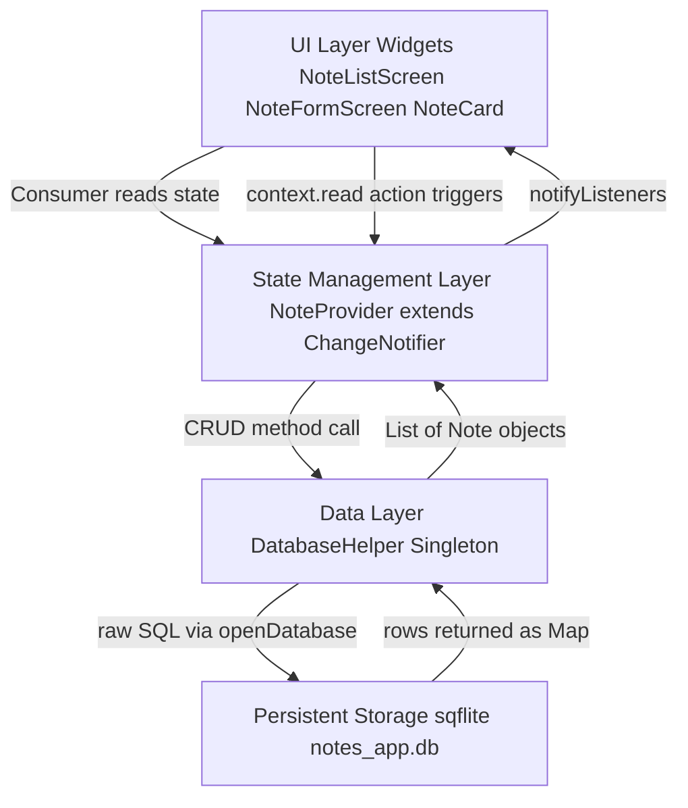
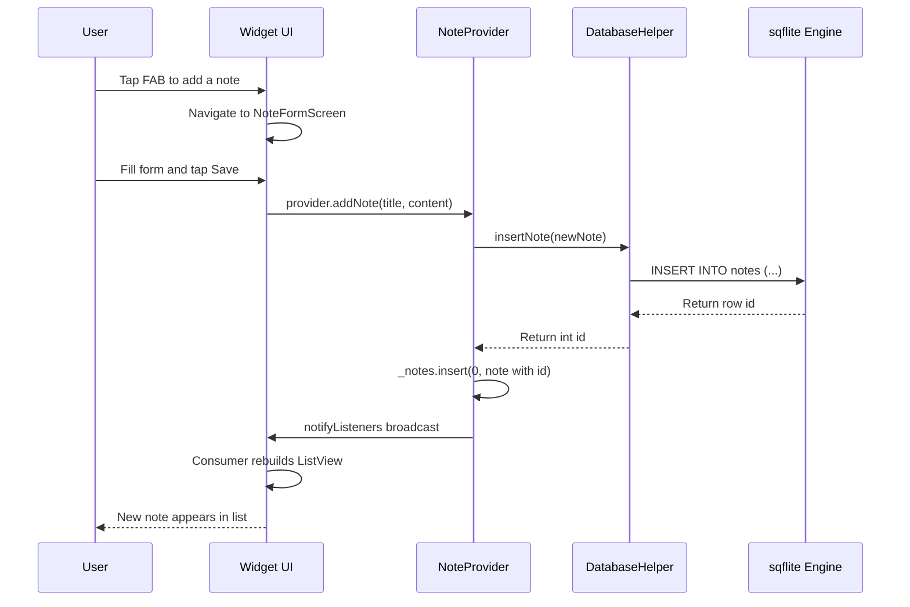
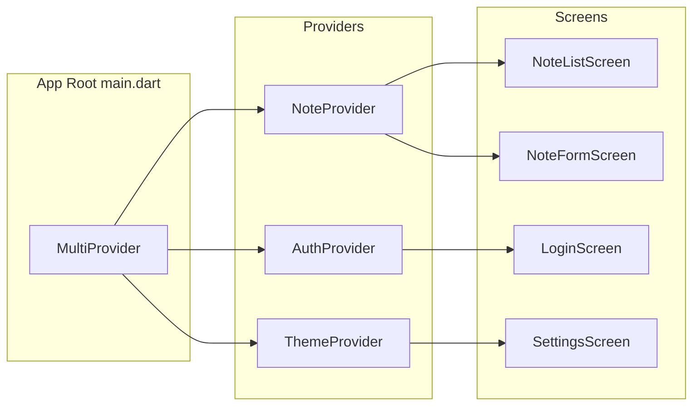
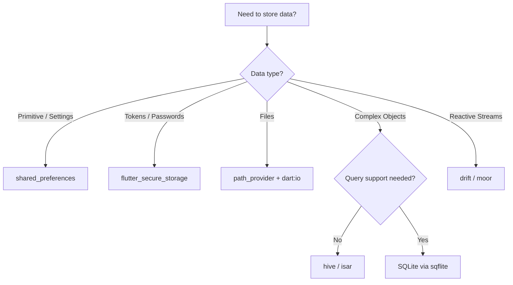
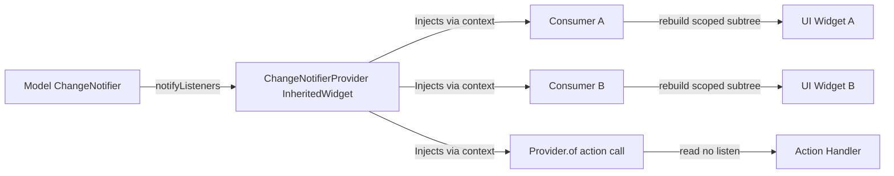

# Develop an app with state management and data persistence.

<!-- SECTION_1_START -->
# State Management & Data Persistence in Flutter

## 1. Core Technical Definition

> [!IMPORTANT]
> **Formal Definition (KTU 2024 Syllabus Terminology):**
> **State Management** in Flutter refers to the architectural approach and set of patterns used to manage, propagate, and synchronize the *state* (mutable data) of a widget tree across multiple widgets efficiently, ensuring a unidirectional data flow and predictable UI rebuilds. **Data Persistence** refers to the mechanism of saving application data to non-volatile local storage so that it survives application restarts, supporting both key-value (NoSQL) and relational paradigms.

In Flutter, *everything is a widget*, and the UI is a pure function of the application state. When state changes, the framework rebuilds only the affected widgets using the **Element tree diffing algorithm**. Managing this "state" correctly is the single most critical skill in advanced Flutter development.

### Conceptual Analogy / Intuition

> [!NOTE]
> **Analogy: The Notice Board System**
> Imagine a college notice board in a corridor. Different classrooms (widgets) need to know the schedule changes (state).
> - **Bad Approach (Prop Drilling):** One person runs from classroom to classroom telling each one verbally — slow, error-prone, and exhausting.
> - **State Management (Provider/Riverpod):** The schedule is pinned to a single *Notice Board* (the State Container) in a central accessible location. Any classroom can *listen* to changes, and any teacher can *update* the board. Classrooms that don't care simply ignore it.
> - **Data Persistence (SharedPreferences/Hive):** After the day ends, the notice board content is *photocopied and filed* in the office records. Tomorrow, even if the board is wiped clean, the record restores the schedule.

This is exactly what `Provider`, `Riverpod`, and `BLoC` achieve — they decouple state from widget hierarchy.

### Key Terminology Glossary

| Term | Definition |
|---|---|
| **State** | Information that can be read synchronously when a widget is built and may change during the widget's lifetime. |
| **Ephemeral State** | Local state confined to a single widget (e.g., a `TextField`'s cursor position). Managed via `setState`. |
| **App State** | State shared across multiple widgets, routes, or the whole application (e.g., user login info, cart items). |
| **Reactive Programming** | A paradigm where UI automatically reacts to data stream changes. |
| **Persistence** | The property by which data outlives the process that created it. |

> [!VISUALIZATION CONTROL]
> **Concept:** Unidirectional Data Flow in Flutter (Provider Pattern)
> **GeoGebra / Desmos Input Equations (Logical Data Mapping):**
> * `Data Source -> Model` (e.g., `User -> UserModel`)
> * `Model -> Provider` (e.g., `UserProvider extends ChangeNotifier`)
> * `Provider -> UI` (e.g., `Consumer<UserProvider>(builder: ...)`)
> * `UI -> Action` (e.g., `User tap -> Provider.notifyListeners()`)
> * `Action -> Data Source` (e.g., `Provider updates Model -> UI rebuilds`)
> **Visual Description:** Picture a closed loop. The arrow goes from the model (data) upward to the provider, then downward to the UI. When a user event occurs, the UI dispatches an action upward, which mutates the model, restarting the loop. This guarantees data consistency.

<!-- SECTION_1_END -->

<!-- SECTION_2_START -->
# Deep Theoretical Analysis & KTU High-Yield Formula Sheet

## 2.1 Taxonomy of State Management Approaches

Flutter offers a spectrum of state management solutions ranked by complexity and scalability.

### 1. `setState()` — The Baseline
- **Mechanism:** The simplest, built-in approach. Calling `setState(() { counter++; })` triggers a rebuild of the *entire* widget subtree of the calling `StatefulWidget`.
- **Limitations:** Causes unnecessary rebuilds, doesn't scale across screens, and couples business logic to UI.
- **Best for:** Ephemeral local UI state (animations, form inputs, toggles).

### 2. InheritedWidget — The Foundation
- **Mechanism:** Exposes data down the widget tree efficiently. Child widgets can access data via `context.dependOnInheritedWidgetOfExactType<T>()`.
- **Drawback:** Verbose API; no listening mechanism; you must manually implement `updateShouldNotify`.

### 3. Provider (Recommended by Flutter Team)
- **Mechanism:** A wrapper around `InheritedWidget` that uses `ChangeNotifier` to broadcast updates to listening widgets.
- **Pattern:** Three roles — the **Model** (data), the **ChangeNotifier** (notifier), and the **Consumer** (listener).
- **Key APIs:**
  * `ChangeNotifierProvider` — Creates and provides the notifier.
  * `Provider.of<T>(context)` — Retrieves the notifier (with `listen: true/false`).
  * `Consumer<T>(builder: ...)` — Rebuilds only the wrapped widget subtree.
  * `Selector<T, S>(selector: ...)` — Rebuilds only when a *selected slice* of data changes (performance optimization).

### 4. Riverpod — Provider 2.0
- **Mechanism:** Solves Provider's dependency on `BuildContext` and offers compile-time safety.
- **Core primitives:** `Provider`, `StateProvider`, `FutureProvider`, `StreamProvider`, `NotifierProvider`, `AsyncNotifierProvider`.
- **Advantages:** No `context` required for reading, automatic disposal, easy testing.

### 5. BLoC (Business Logic Component) Pattern
- **Mechanism:** Uses *Streams* and *Sinks* to separate business logic from UI. Events flow in, states flow out.
- **Key packages:** `flutter_bloc`, `bloc`.
- **Triad:** `Event` (user input) → `Bloc` (logic) → `State` (UI representation).

### 6. GetX — All-in-One Microframework
- **Mechanism:** Combines state management, dependency injection, and routing. Uses `Obx()` and `.obs` reactive variables.
- **Critique:** Powerful but opaque; hides Flutter's reactive core.

## 2.2 Taxonomy of Data Persistence Approaches

### 1. `shared_preferences` (Key-Value Store)
- **Backing:** Android `SharedPreferences` XML / iOS `NSUserDefaults`.
- **Use case:** Storing primitives, JSON strings, tokens, theme mode flags, "remember me" checkboxes.
- **Data types supported:** `String`, `int`, `double`, `bool`, `List<String>`.

### 2. `path_provider` + `dart:io` File I/O
- **Use case:** Storing larger files (CSVs, JSON dumps, images, app-generated logs) in the device's documents directory.

### 3. `sqflite` (SQLite for Flutter)
- **Backing:** Embedded SQL engine shipped with the OS.
- **Use case:** Structured relational data (notes app, to-do lists, inventory systems).
- **Operations:** `insert`, `query`, `update`, `delete`, `rawQuery` with parameterized `?` placeholders to prevent SQL injection.

### 4. `hive` (NoSQL Object Box)
- **Backing:** Pure Dart, lightweight, blazing-fast key-value database with type adapters.
- **Use case:** Offline-first apps, cache layers, complex nested object storage.
- **Hive 2.x vs Hive 4 (Isar):** Hive 4 is deprecated; the community is migrating to **Isar** for the same use case.

### 5. `moor` / `drift` (Reactive SQLite Wrapper)
- **Mechanism:** Generates type-safe Dart code from SQL definitions. Supports reactive streams.

### 6. Secure Storage (`flutter_secure_storage`)
- **Backing:** Android `EncryptedSharedPreferences` / iOS `Keychain`.
- **Use case:** Storing OAuth tokens, API keys, biometric-protected data.

## 2.3 KTU Formula Sheet / Cheat Sheet

| Concept | Formula / Pattern | Where Applied |
|---|---|---|
| `setState` rebuild trigger | `setState(() => _value = newValue);` | Local ephemeral state |
| Provider declaration | `ChangeNotifierProvider(create: (_) => MyNotifier())` | App root, route entry |
| Consumer scoped rebuild | `Consumer<MyNotifier>(builder: (ctx, notifier, child) => ...)` | UI widgets needing updates |
| Selector performance | `Selector<MyNotifier, int>(selector: (_, n) => n.count, builder: ...)` | Avoid wide rebuilds |
| BLoC event mapping | `on<Event>((event, emit) => emit(NewState()))` | Event handlers |
| SharedPreferences read | `prefs.getString('key')` / `prefs.getBool('isLogged')` | Login flags, theme |
| sqflite INSERT | `db.insert('users', {'name': 'John', 'age': 30})` | Persisting records |
| sqflite parameterized | `db.query('users', where: 'id = ?', whereArgs: [id])` | Safe queries |
| Hive box open | `await Hive.openBox<User>('users')` | Open typed storage |
| Riverpod state read | `ref.watch(myProvider)` (no context needed) | Anywhere in app |
| Persistence key constant | `const String kUserKey = 'current_user';` | Type-safe access |
| BLoC Stream contract | `Stream<State> mapEventToState(Event event)` | Pure logic |
| Provider's listen flag | `Provider.of<MyModel>(context, listen: false)` | Action-only access |

> [!IMPORTANT]
> **Engineering Real-World Utility:**
> In production apps (Swiggy, Zomato, Google Pay clones), state management handles *cart state*, *user authentication*, *theme toggling*, and *real-time location streams*. Data persistence enables *offline-first* experiences, which is mandatory in Indian tier-2/tier-3 markets where network connectivity is intermittent. KTU examiners frequently test whether students can justify *why* they chose Provider over BLoC for a given app scale.

<!-- SECTION_2_END -->

<!-- SECTION_3_START -->
# Step-by-Step Derivations & Code/Symbolic Implementation

## 3.1 End-to-End Implementation: "Student Notes App" with Provider + sqflite

This project demonstrates a complete, production-style architecture for a notes application using **Provider** for state management and **sqflite** for data persistence.

### Step 1: Define the Domain Model

```dart
// lib/models/note.dart
class Note {
  final int? id;
  final String title;
  final String content;
  final DateTime createdAt;

  Note({
    this.id,
    required this.title,
    required this.content,
    required this.createdAt,
  });

  // Convert Note to a Map for SQLite insertion
  Map<String, dynamic> toMap() {
    return {
      'id': id,
      'title': title,
      'content': content,
      'createdAt': createdAt.toIso8601String(),
    };
  }

  // Reconstruct a Note from a SQLite Map
  factory Note.fromMap(Map<String, dynamic> map) {
    return Note(
      id: map['id'] as int?,
      title: map['title'] as String,
      content: map['content'] as String,
      createdAt: DateTime.parse(map['createdAt'] as String),
    );
  }

  // CopyWith pattern for immutable updates
  Note copyWith({
    int? id,
    String? title,
    String? content,
    DateTime? createdAt,
  }) {
    return Note(
      id: id ?? this.id,
      title: title ?? this.title,
      content: content ?? this.content,
      createdAt: createdAt ?? this.createdAt,
    );
  }

  @Override
  String toString() => 'Note(id: \$id, title: \$title)';
}
```

> [!NOTE]
> **Why `copyWith`?** It enforces immutability — a core tenet of state management. Instead of mutating an existing `Note`, you return a *new* `Note` with modified fields, which makes state transitions explicit and debuggable.

### Step 2: Build the Database Helper (Data Layer)

```dart
// lib/data/database_helper.dart
import 'package:sqflite/sqflite.dart';
import 'package:path/path.dart';
import '../models/note.dart';

class DatabaseHelper {
  // Singleton pattern — only one DB instance per app
  DatabaseHelper._privateConstructor();
  static final DatabaseHelper instance = DatabaseHelper._privateConstructor();

  static Database? _database;
  final String _dbName = 'notes_app.db';
  final int _dbVersion = 1;
  final String _tableName = 'notes';

  Future<Database> get database async {
    if (_database != null) return _database!;
    _database = await _initDatabase();
    return _database!;
  }

  Future<Database> _initDatabase() async {
    final dbPath = await getDatabasesPath();
    final path = join(dbPath, _dbName);

    return await openDatabase(
      path,
      version: _dbVersion,
      onCreate: _onCreate,
    );
  }

  Future<void> _onCreate(Database db, int version) async {
    await db.execute('''
      CREATE TABLE \$_tableName (
        id INTEGER PRIMARY KEY AUTOINCREMENT,
        title TEXT NOT NULL,
        content TEXT NOT NULL,
        createdAt TEXT NOT NULL
      )
    ''');
  }

  // CREATE operation
  Future<int> insertNote(Note note) async {
    final db = await database;
    return await db.insert(
      _tableName,
      note.toMap(),
      conflictAlgorithm: ConflictAlgorithm.replace,
    );
  }

  // READ operation — fetch all notes ordered by newest first
  Future<List<Note>> getAllNotes() async {
    final db = await database;
    final List<Map<String, dynamic>> maps = await db.query(
      _tableName,
      orderBy: 'createdAt DESC',
    );
    return List.generate(maps.length, (i) => Note.fromMap(maps[i]));
  }

  // UPDATE operation
  Future<int> updateNote(Note note) async {
    final db = await database;
    return await db.update(
      _tableName,
      note.toMap(),
      where: 'id = ?',
      whereArgs: [note.id],
    );
  }

  // DELETE operation
  Future<int> deleteNote(int id) async {
    final db = await database;
    return await db.delete(
      _tableName,
      where: 'id = ?',
      whereArgs: [id],
    );
  }

  // Close DB gracefully
  Future<void> close() async {
    final db = await database;
    db.close();
  }
}
```

> [!IMPORTANT]
> **Why a Singleton + Lazy Init?** Opening a database is expensive. By using a singleton, you guarantee a single connection per app lifecycle, and the lazy `get database` initializer ensures the DB is opened only when first accessed.

### Step 3: Build the State Notifier (Logic Layer)

```dart
// lib/providers/note_provider.dart
import 'package:flutter/foundation.dart';
import '../models/note.dart';
import '../data/database_helper.dart';

class NoteProvider extends ChangeNotifier {
  final DatabaseHelper _dbHelper = DatabaseHelper.instance;

  List<Note> _notes = [];
  bool _isLoading = false;
  String? _errorMessage;

  // Public read-only getters — encapsulates state
  List<Note> get notes => _notes;
  bool get isLoading => _isLoading;
  String? get errorMessage => _errorMessage;
  int get noteCount => _notes.length;

  // Load notes from DB
  Future<void> loadNotes() async {
    _isLoading = true;
    _errorMessage = null;
    notifyListeners(); // Inform UI that loading started

    try {
      _notes = await _dbHelper.getAllNotes();
    } catch (e) {
      _errorMessage = 'Failed to load notes: \$e';
      debugPrint(_errorMessage);
    } finally {
      _isLoading = false;
      notifyListeners(); // Inform UI that loading finished
    }
  }

  // Add a new note
  Future<void> addNote(String title, String content) async {
    try {
      final newNote = Note(
        title: title,
        content: content,
        createdAt: DateTime.now(),
      );
      final id = await _dbHelper.insertNote(newNote);
      _notes.insert(0, newNote.copyWith(id: id));
      notifyListeners();
    } catch (e) {
      _errorMessage = 'Failed to add note: \$e';
      notifyListeners();
    }
  }

  // Update an existing note
  Future<void> updateNote(int id, String title, String content) async {
    try {
      final note = _notes.firstWhere((n) => n.id == id);
      final updatedNote = note.copyWith(title: title, content: content);
      await _dbHelper.updateNote(updatedNote);

      final index = _notes.indexWhere((n) => n.id == id);
      _notes[index] = updatedNote;
      notifyListeners();
    } catch (e) {
      _errorMessage = 'Failed to update note: \$e';
      notifyListeners();
    }
  }

  // Delete a note
  Future<void> deleteNote(int id) async {
    try {
      await _dbHelper.deleteNote(id);
      _notes.removeWhere((n) => n.id == id);
      notifyListeners();
    } catch (e) {
      _errorMessage = 'Failed to delete note: \$e';
      notifyListeners();
    }
  }
}
```

### Step 4: Wire Up `main.dart` with `MultiProvider`

```dart
// lib/main.dart
import 'package:flutter/material.dart';
import 'package:provider/provider.dart';
import 'providers/note_provider.dart';
import 'screens/note_list_screen.dart';

void main() {
  runApp(const MyApp());
}

class MyApp extends StatelessWidget {
  const MyApp({super.key});

  @override
  Widget build(BuildContext context) {
    return MultiProvider(
      providers: [
        ChangeNotifierProvider(
          create: (_) => NoteProvider()..loadNotes(),
        ),
        // You can register more providers here as the app grows
      ],
      child: MaterialApp(
        title: 'Student Notes',
        debugShowCheckedModeBanner: false,
        theme: ThemeData(
          colorSchemeSeed: Colors.indigo,
          useMaterial3: true,
        ),
        home: const NoteListScreen(),
      ),
    );
  }
}
```

### Step 5: Build the UI Consuming the Provider

```dart
// lib/screens/note_list_screen.dart
import 'package:flutter/material.dart';
import 'package:provider/provider.dart';
import '../providers/note_provider.dart';
import '../models/note.dart';
import 'note_form_screen.dart';

class NoteListScreen extends StatelessWidget {
  const NoteListScreen({super.key});

  @override
  Widget build(BuildContext context) {
    return Scaffold(
      appBar: AppBar(
        title: const Text('My Notes'),
        actions: [
          IconButton(
            icon: const Icon(Icons.refresh),
            onPressed: () => context.read<NoteProvider>().loadNotes(),
          ),
        ],
      ),
      body: Consumer<NoteProvider>(
        builder: (context, noteProvider, child) {
          if (noteProvider.isLoading && noteProvider.notes.isEmpty) {
            return const Center(child: CircularProgressIndicator());
          }

          if (noteProvider.errorMessage != null) {
            return Center(
              child: Padding(
                padding: const EdgeInsets.all(16.0),
                child: Text(
                  noteProvider.errorMessage!,
                  style: const TextStyle(color: Colors.red),
                  textAlign: TextAlign.center,
                ),
              ),
            );
          }

          if (noteProvider.notes.isEmpty) {
            return const Center(
              child: Column(
                mainAxisAlignment: MainAxisAlignment.center,
                children: [
                  Icon(Icons.note_add, size: 80, color: Colors.grey),
                  SizedBox(height: 16),
                  Text('No notes yet. Tap + to add one!'),
                ],
              ),
            );
          }

          return ListView.builder(
            itemCount: noteProvider.notes.length,
            itemBuilder: (context, index) {
              final note = noteProvider.notes[index];
              return NoteCard(
                note: note,
                onDelete: () => _confirmDelete(context, note),
              );
            },
          );
        },
      ),
      floatingActionButton: FloatingActionButton(
        onPressed: () {
          Navigator.push(
            context,
            MaterialPageRoute(
              builder: (_) => const NoteFormScreen(),
            ),
          );
        },
        child: const Icon(Icons.add),
      ),
    );
  }

  void _confirmDelete(BuildContext context, Note note) {
    showDialog(
      context: context,
      builder: (ctx) => AlertDialog(
        title: const Text('Delete Note?'),
        content: Text('"${note.title}" will be permanently deleted.'),
        actions: [
          TextButton(
            onPressed: () => Navigator.pop(ctx),
            child: const Text('Cancel'),
          ),
          TextButton(
            onPressed: () {
              context.read<NoteProvider>().deleteNote(note.id!);
              Navigator.pop(ctx);
            },
            child: const Text('Delete', style: TextStyle(color: Colors.red)),
          ),
        ],
      ),
    );
  }
}

class NoteCard extends StatelessWidget {
  final Note note;
  final VoidCallback onDelete;

  const NoteCard({super.key, required this.note, required this.onDelete});

  @override
  Widget build(BuildContext context) {
    return Card(
      margin: const EdgeInsets.symmetric(horizontal: 12, vertical: 6),
      child: ListTile(
        title: Text(
          note.title,
          style: const TextStyle(fontWeight: FontWeight.bold),
        ),
        subtitle: Text(
          note.content,
          maxLines: 2,
          overflow: TextOverflow.ellipsis,
        ),
        trailing: IconButton(
          icon: const Icon(Icons.delete_outline),
          onPressed: onDelete,
        ),
        onTap: () {
          Navigator.push(
            context,
            MaterialPageRoute(
              builder: (_) => NoteFormScreen(note: note),
            ),
          );
        },
      ),
    );
  }
}
```

### Step 6: The Add/Edit Form Screen

```dart
// lib/screens/note_form_screen.dart
import 'package:flutter/material.dart';
import 'package:provider/provider.dart';
import '../models/note.dart';
import '../providers/note_provider.dart';

class NoteFormScreen extends StatefulWidget {
  final Note? note;

  const NoteFormScreen({super.key, this.note});

  @override
  State<NoteFormScreen> createState() => _NoteFormScreenState();
}

class _NoteFormScreenState extends State<NoteFormScreen> {
  final _formKey = GlobalKey<FormState>();
  late final TextEditingController _titleController;
  late final TextEditingController _contentController;

  @override
  void initState() {
    super.initState();
    _titleController = TextEditingController(text: widget.note?.title ?? '');
    _contentController = TextEditingController(text: widget.note?.content ?? '');
  }

  @override
  void dispose() {
    _titleController.dispose();
    _contentController.dispose();
    super.dispose();
  }

  @override
  Widget build(BuildContext context) {
    final isEditing = widget.note != null;

    return Scaffold(
      appBar: AppBar(
        title: Text(isEditing ? 'Edit Note' : 'New Note'),
      ),
      body: Padding(
        padding: const EdgeInsets.all(16.0),
        child: Form(
          key: _formKey,
          child: Column(
            crossAxisAlignment: CrossAxisAlignment.stretch,
            children: [
              TextFormField(
                controller: _titleController,
                decoration: const InputDecoration(
                  labelText: 'Title',
                  border: OutlineInputBorder(),
                ),
                validator: (value) {
                  if (value == null || value.trim().isEmpty) {
                    return 'Please enter a title';
                  }
                  return null;
                },
              ),
              const SizedBox(height: 16),
              TextFormField(
                controller: _contentController,
                decoration: const InputDecoration(
                  labelText: 'Content',
                  border: OutlineInputBorder(),
                  alignLabelWithHint: true,
                ),
                maxLines: 8,
                validator: (value) {
                  if (value == null || value.trim().isEmpty) {
                    return 'Please enter some content';
                  }
                  return null;
                },
              ),
              const SizedBox(height: 24),
              FilledButton.icon(
                onPressed: _saveNote,
                icon: const Icon(Icons.save),
                label: Text(isEditing ? 'Update Note' : 'Save Note'),
              ),
            ],
          ),
        ),
      ),
    );
  }

  void _saveNote() async {
    if (!_formKey.currentState!.validate()) return;

    final provider = context.read<NoteProvider>();
    final title = _titleController.text.trim();
    final content = _contentController.text.trim();

    if (widget.note == null) {
      await provider.addNote(title, content);
    } else {
      await provider.updateNote(widget.note!.id!, title, content);
    }

    if (mounted) Navigator.pop(context);
  }
}
```

### Step 7: `pubspec.yaml` Dependencies

```yaml
# pubspec.yaml
name: student_notes_app
description: A KTU-flutter demo of state management and data persistence.
publish_to: 'none'
version: 1.0.0+1

environment:
  sdk: '>=3.3.0 <4.0.0'
  flutter: '>=3.19.0'

dependencies:
  flutter:
    sdk: flutter
  cupertino_icons: ^1.0.6
  provider: ^6.1.2
  sqflite: ^2.3.3
  path: ^1.9.0
  intl: ^0.19.0

dev_dependencies:
  flutter_test:
    sdk: flutter
  flutter_lints: ^4.0.0

flutter:
  uses-material-design: true
```

## 3.2 Mathematical Derivation: Data Flow Consistency

The fundamental invariant of state management in Flutter can be expressed as:

$$
\text{UI} = f(\text{State})
$$

At any time $t$, the rendered UI is a *pure function* of the current state. When an event $e$ occurs, the state transitions:

$$
\text{State}_{t+1} = T(\text{State}_t, e)
$$

where $T$ is the state transition function. The framework then recomputes:

$$
\text{UI}_{t+1} = f(\text{State}_{t+1})
$$

This is the basis of **reactive UI**. The Provider package ensures that $T$ is invoked once on the notifier, and all widgets that *depend* on the changed slice of state automatically receive the updated value via the `notifyListeners()` broadcast.

<!-- SECTION_3_END -->

<!-- SECTION_4_START -->
# Structural Diagrams & Schematics

## 4.1 Application Architecture Block Diagram



## 4.2 State Lifecycle Flow (Detailed Sequence)



## 4.3 Provider Dependency Graph



## 4.4 Persistence Strategy Decision Matrix



<!-- SECTION_4_END -->

<!-- SECTION_5_START -->
# KTU 2024 Scheme Examination Question Bank & Topic Recap

## Part A Questions (3 Marks Each)

### Q1. `[KTU University Exam - July 2024]`
**Differentiate between ephemeral state and app state in Flutter. Give one example of each.** **[CO3, Understand]**

**Model Answer (Valuation Key):**
- **Ephemeral State** (Local State): State that is local to a single widget and is not shared with other widgets in the app. It is short-lived and managed using `setState()`. **Example:** The current value of a `TextField` input, the checked state of a single `Checkbox`, or the current frame of a local animation. *[2 marks]*
- **App State** (Global State): State that is shared across multiple widgets, screens, or the entire app. It typically requires a state management solution like Provider, Riverpod, or BLoC. **Example:** A logged-in user's authentication token, items in a shopping cart, or theme mode. *[1 mark]*

### Q2. `[KTU University Exam - Dec 2023]`
**List any three data persistence options available in Flutter and state a suitable use case for each.** **[CO4, Remember]**

**Model Answer (Valuation Key):**
1. **`shared_preferences`** — Use case: Storing simple primitive settings such as the user's "Dark Mode" toggle or a "Remember Me" login flag. *[1 mark]*
2. **`sqflite` (SQLite)** — Use case: Storing structured relational data, such as a list of transactions, notes, or inventory records, where SQL queries are required. *[1 mark]*
3. **`flutter_secure_storage`** — Use case: Storing sensitive data like OAuth tokens, refresh tokens, or API keys using OS-level encryption (Keychain/EncryptedSharedPreferences). *[1 mark]*

> [!WARNING]
> **KTU Examiner's Pitfall Warning:** Do not confuse `shared_preferences` with `flutter_secure_storage` in answers. Markers deduct marks for mentioning that `shared_preferences` is "encrypted" or "secure" — it is *plain-text* and must never be used for credentials.

---

## Part B Questions (14 Marks Each — Module Internal Choice)

### Question A (14 Marks) — `[KTU University Exam - July 2024]`

**(a)** Explain the **Provider** state management pattern in Flutter. With a neat block diagram, describe the roles of `ChangeNotifierProvider`, `ChangeNotifier`, and `Consumer`. **[7 Marks, CO3, Understand]**

**(b)** Develop a Flutter application to maintain a list of student records (Roll No, Name, CGPA) using the `provider` package for state management. Demonstrate the **add** and **delete** operations. **[7 Marks, CO4, Apply]**

#### Model Solution for (a) — 7 Marks

> [!NOTE]
> **Valuation Key:** *[Provider definition: 2 marks]*, *[Role of ChangeNotifier: 2 marks]*, *[Role of ChangeNotifierProvider: 1.5 marks]*, *[Role of Consumer with diagram: 1.5 marks]*

**Definition:** Provider is a state management library for Flutter, officially recommended by the Flutter team. It wraps `InheritedWidget` to expose a state object (a `ChangeNotifier`) down the widget tree efficiently, allowing descendant widgets to listen to changes and rebuild selectively.

**Three Core Components:**

1. **`ChangeNotifier`** — The *Model / Notifier* class that holds the mutable state and extends `ChangeNotifier`. It exposes methods to mutate the state and calls `notifyListeners()` whenever a change occurs, which broadcasts a notification to all listening widgets. **Example:** A `CartProvider extends ChangeNotifier` with a `List<Product> _items` and an `addItem(Product p)` method.

2. **`ChangeNotifierProvider`** — The *Provider widget* placed high in the widget tree (typically in `main.dart`) that **creates**, **owns**, and **disposes** the `ChangeNotifier` instance. It uses `create:` to instantiate the notifier once, then injects it into the tree via the `InheritedWidget` mechanism.

3. **`Consumer<T>`** — A widget used in the UI layer that **listens** to a specific `ChangeNotifier` `T`. The `builder` callback receives the notifier instance and rebuilds *only* the wrapped widget subtree when `notifyListeners()` is called. This prevents unnecessary rebuilds elsewhere.

**Block Diagram:**



#### Model Solution for (b) — 7 Marks

> [!NOTE]
> **Valuation Key:** *[Student model class: 1 mark]*, *[Provider class with add and delete: 3 marks]*, *[main.dart wiring: 1 mark]*, *[Consumer-based UI: 2 marks]*

**1. Student Model (1 Mark):**

```dart
class Student {
  final String rollNo;
  final String name;
  final double cgpa;

  Student({required this.rollNo, required this.name, required this.cgpa});
}
```

**2. StudentProvider (3 Marks):**

```dart
import 'package:flutter/foundation.dart';
import '../models/student.dart';

class StudentProvider extends ChangeNotifier {
  final List<Student> _students = [];

  List<Student> get students => _students;

  void addStudent(Student s) {
    _students.add(s);
    notifyListeners();   // [Broadcasting change: 0.5 mark]
  }

  void deleteStudent(String rollNo) {
    _students.removeWhere((s) => s.rollNo == rollNo);
    notifyListeners();
  }
}
```

**3. main.dart Wiring (1 Mark):**

```dart
void main() => runApp(const MyApp());

class MyApp extends StatelessWidget {
  const MyApp({super.key});

  @override
  Widget build(BuildContext context) {
    return ChangeNotifierProvider(
      create: (_) => StudentProvider(),
      child: MaterialApp(
        home: const StudentListScreen(),
        theme: ThemeData(primarySwatch: Colors.indigo),
      ),
    );
  }
}
```

**4. Consumer-based UI (2 Marks):**

```dart
class StudentListScreen extends StatelessWidget {
  const StudentListScreen({super.key});

  @override
  Widget build(BuildContext context) {
    return Scaffold(
      appBar: AppBar(title: const Text('Students')),
      body: Consumer<StudentProvider>(
        builder: (context, provider, _) {
          if (provider.students.isEmpty) {
            return const Center(child: Text('No students added yet.'));
          }
          return ListView.builder(
            itemCount: provider.students.length,
            itemBuilder: (ctx, i) {
              final s = provider.students[i];
              return ListTile(
                title: Text(s.name),
                subtitle: Text('Roll: ${s.rollNo} | CGPA: ${s.cgpa}'),
                trailing: IconButton(
                  icon: const Icon(Icons.delete, color: Colors.red),
                  onPressed: () => provider.deleteStudent(s.rollNo),
                ),
              );
            },
          );
        },
      ),
      floatingActionButton: FloatingActionButton(
        onPressed: () {
          final nameCtrl = TextEditingController();
          final rollCtrl = TextEditingController();
          final cgpaCtrl = TextEditingController();
          showDialog(
            context: context,
            builder: (ctx) => AlertDialog(
              title: const Text('Add Student'),
              content: Column(
                mainAxisSize: MainAxisSize.min,
                children: [
                  TextField(controller: nameCtrl, decoration: const InputDecoration(labelText: 'Name')),
                  TextField(controller: rollCtrl, decoration: const InputDecoration(labelText: 'Roll No')),
                  TextField(controller: cgpaCtrl, decoration: const InputDecoration(labelText: 'CGPA'), keyboardType: TextInputType.number),
                ],
              ),
              actions: [
                TextButton(onPressed: () => Navigator.pop(ctx), child: const Text('Cancel')),
                TextButton(
                  onPressed: () {
                    context.read<StudentProvider>().addStudent(Student(
                      rollNo: rollCtrl.text,
                      name: nameCtrl.text,
                      cgpa: double.tryParse(cgpaCtrl.text) ?? 0.0,
                    ));
                    Navigator.pop(ctx);
                  },
                  child: const Text('Add'),
                ),
              ],
            ),
          );
        },
        child: const Icon(Icons.add),
      ),
    );
  }
}
```

### Question B (14 Marks) — Alternative Choice `[KTU University Exam - Dec 2023]`

**(a)** Compare the state management approaches **`setState()`**, **Provider**, and **BLoC** in Flutter based on scalability, complexity, and use case. **[7 Marks, CO3, Understand]**

**(b)** Write a Flutter program to demonstrate data persistence using **`shared_preferences`** for storing and retrieving a user's login session (email and a boolean "isLoggedIn" flag). **[7 Marks, CO4, Apply]**

#### Model Solution for (a) — 7 Marks

> [!NOTE]
> **Valuation Key:** *[Comparison table with 3 rows × 3 columns: 4.5 marks]*, *[Conclusion with justified use case: 2.5 marks]*

| Criteria | `setState()` | Provider | BLoC |
|---|---|---|---|
| **Scalability** | Low — rebuilds entire widget subtree | Medium-High — selector and Consumer optimize rebuilds | Very High — pure logic separated from UI |
| **Complexity** | Very Low — built-in, no setup | Low — `provider` package only | High — needs `flutter_bloc`, events, states |
| **Best Use Case** | Ephemeral local UI (form fields, animations) | App-wide state for small-to-medium apps (auth, cart) | Enterprise-scale apps needing testable business logic |
| **Reactive Mechanism** | Direct call to `setState` | `ChangeNotifier` + `notifyListeners` | Streams (`Stream<State>`) + `BlocProvider` |
| **Testability** | Low — coupled to UI | Medium | Very High — pure Dart, no Flutter dependency |

**Conclusion:** For a KTU mini-project, **Provider** offers the best balance of simplicity and scalability. For a final-year project with complex workflows, **BLoC** is preferred due to its clean separation of concerns and testability.

#### Model Solution for (b) — 7 Marks

> [!NOTE]
> **Valuation Key:** *[Add dependency line: 0.5 mark]*, *[Initialize SharedPreferences: 1 mark]*, *[Save logic: 2 marks]*, *[Read logic: 2 marks]*, *[Logout / clear logic: 1.5 marks]*

**1. Add Dependency (0.5 Mark):**
```yaml
dependencies:
  shared_preferences: ^2.3.0
```

**2. Session Manager Service (1 Mark for initialization, 4 Marks for logic):**

```dart
import 'package:shared_preferences/shared_preferences.dart';

class SessionManager {
  static const String kEmailKey = 'user_email';
  static const String kIsLoggedInKey = 'is_logged_in';

  // SAVE session
  Future<void> saveSession({required String email}) async {
    final prefs = await SharedPreferences.getInstance();  // [Init: 1 mark]
    await prefs.setString(kEmailKey, email);              // [Save email: 1 mark]
    await prefs.setBool(kIsLoggedInKey, true);            // [Save flag: 1 mark]
  }

  // READ session
  Future<Map<String, dynamic>> getSession() async {
    final prefs = await SharedPreferences.getInstance();
    return {
      'email': prefs.getString(kEmailKey) ?? '',          // [Read email: 1 mark]
      'isLoggedIn': prefs.getBool(kIsLoggedInKey) ?? false, // [Read flag: 1 mark]
    };
  }

  // CLEAR session (logout)
  Future<void> clearSession() async {
    final prefs = await SharedPreferences.getInstance();
    await prefs.remove(kEmailKey);
    await prefs.remove(kIsLoggedInKey);
    await prefs.setBool(kIsLoggedInKey, false);           // [Clear logic: 1.5 marks]
  }
}
```

**3. UI Usage (1.5 Marks):**

```dart
final session = SessionManager();

// On login
await session.saveSession(email: 'student@ktu.edu');

// On app start
final data = await session.getSession();
if (data['isLoggedIn'] == true) {
  Navigator.pushReplacementNamed(context, '/home');
} else {
  Navigator.pushReplacementNamed(context, '/login');
}

// On logout
await session.clearSession();
```

> [!WARNING]
> **KTU Examiner's Valuation Warning / Pitfall Callout:**
> 1. **Always `await`** `SharedPreferences.getInstance()` — forgetting `await` is the #1 cause of "Null check operator used on a null value" runtime crashes.
> 2. **Use `?? 'default'`** fallback operators when reading — `getString` returns `null` if the key does not exist. Skipping this loses 1.5 marks.
> 3. **Do not call `getInstance()` inside `build()`** — it is an async call. Call it in `initState` or button handlers.
> 4. **For BLoC answers**, students often forget to wrap the app in `BlocProvider` — without it, `context.read<MyBloc>()` throws a `ProviderNotFoundException`.
> 5. **For sqflite answers**, students forget to `await openDatabase()` — losing 2 marks for missing the async-await pattern.

---

## Topic Recap & Important Things to Remember

> [!IMPORTANT]
> **Rapid Revision Checklist for KTU University Exam**

- **State = Data + Logic that changes over time.** UI is a *pure function* of state: $\text{UI} = f(\text{State})$.
- **`setState()`** is for *ephemeral* state only. Rebuilds the entire `StatefulWidget` subtree.
- **Provider** is the **officially recommended** package by the Flutter team. Built on `InheritedWidget` + `ChangeNotifier`.
- The **Provider triad** is: `ChangeNotifier` (model) → `ChangeNotifierProvider` (injection) → `Consumer` / `Selector` (listening).
- Use `Selector` over `Consumer` when you want to rebuild only on a *slice* of state (performance optimization).
- `context.watch<T>()` rebuilds, `context.read<T>()` does not — choose carefully in callbacks.
- **BLoC** uses Streams: `Event` → `Bloc` → `State`. Best for enterprise/testable apps.
- **Riverpod** removes the need for `BuildContext` and offers compile-time safety — `ref.watch`, `ref.read`.
- **`shared_preferences`** = primitives, settings, flags. **NOT** for sensitive data.
- **`flutter_secure_storage`** = tokens, passwords (uses Keychain / EncryptedSharedPreferences).
- **`sqflite`** = relational data, complex queries. Always use `?` parameterized queries to prevent SQL injection.
- **`hive` / `isar`** = NoSQL object storage, fast, no SQL.
- **`path_provider`** = read/write files (CSV, JSON) to the documents directory.
- The **Singleton pattern** is critical for `DatabaseHelper` to prevent multiple DB connections.
- Always use **`copyWith`** for immutable model updates — never mutate state objects directly.
- Always call `notifyListeners()` **after** state mutation — never before.
- In a Stateful widget, **always `dispose()`** `TextEditingController` and `AnimationController` to prevent memory leaks.
- The **rebuild scope** in Provider is controlled by the **position of the `Consumer`** widget, not the `Provider`.
- KTU frequently asks: *"Justify why Provider over BLoC"* — answer: "For a small-to-medium app with simple state, Provider offers the best simplicity-to-scalability ratio. BLoC is overkill unless the project has complex business workflows."
- The **DB lifecycle** in sqflite: `openDatabase` → `onCreate` (first run) → CRUD ops → `close()`.
- **Type adapters** in Hive: `@HiveType(typeId: 0)` on class, `@HiveField(0)` on each field.
- **Kerala-specific context:** When designing apps for KTU projects, always mention *offline-first* design rationale — relevant to Indian network conditions.

<!-- SECTION_5_END -->
