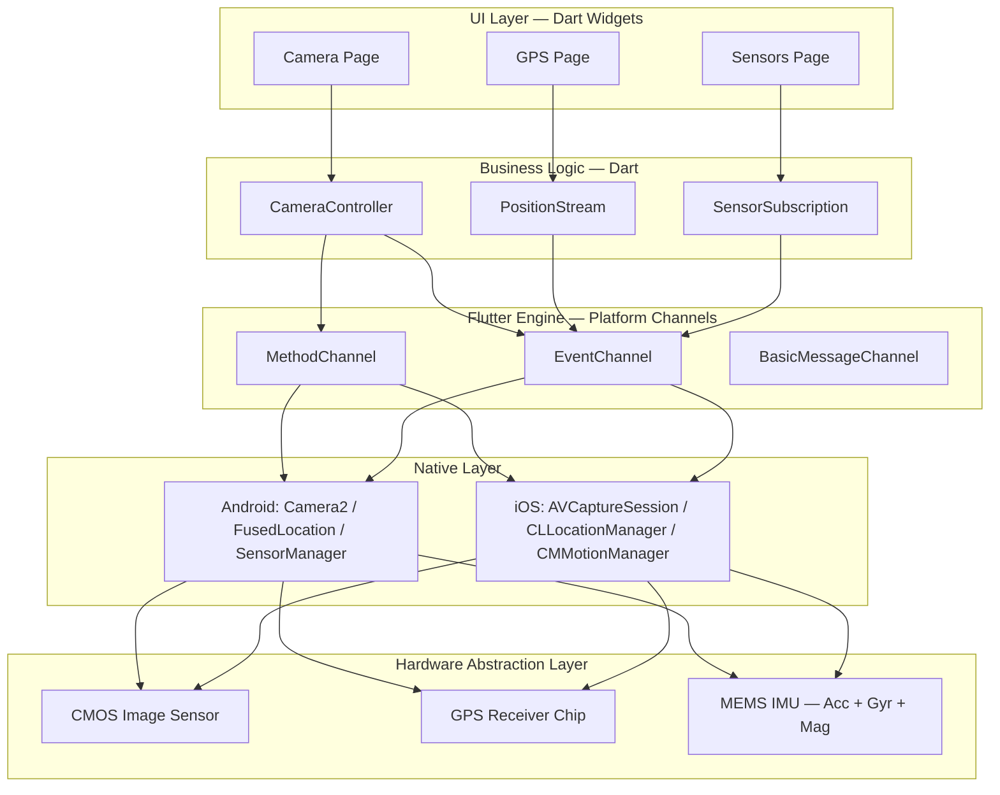
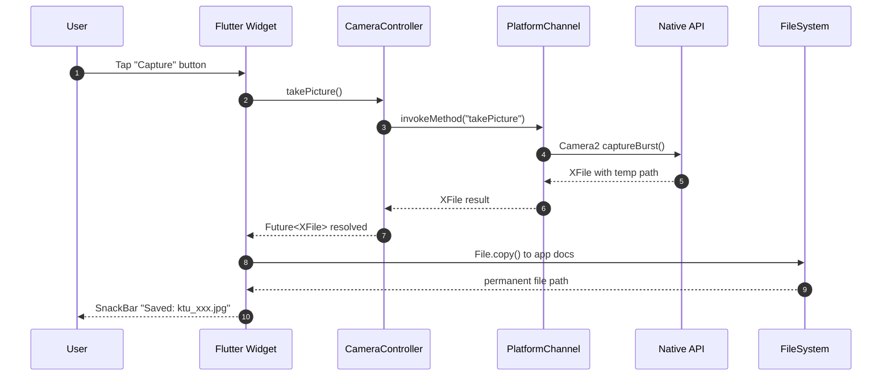
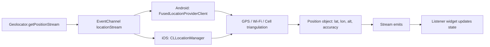
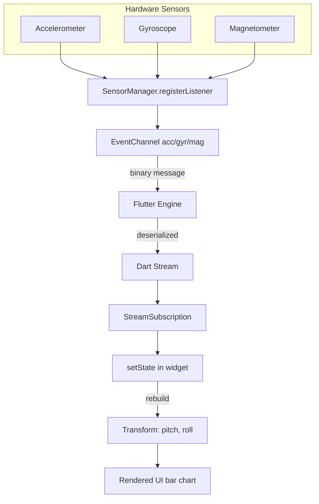
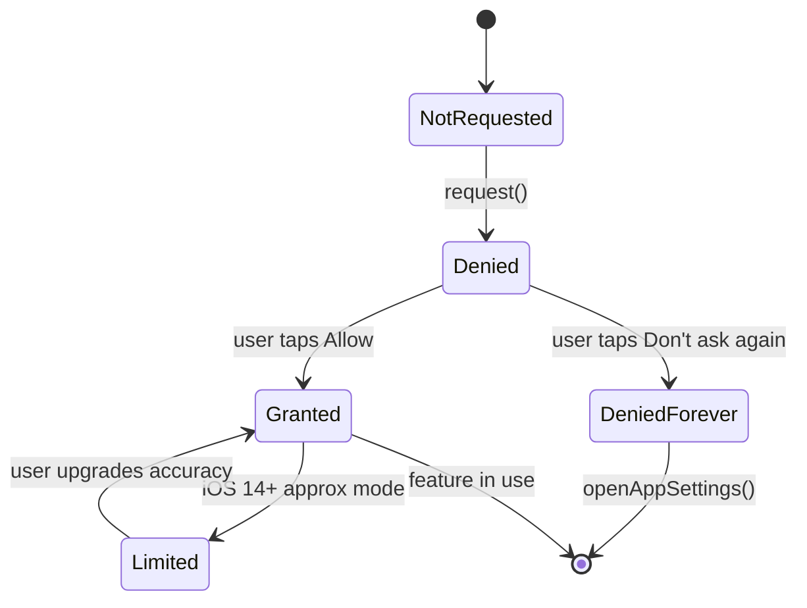
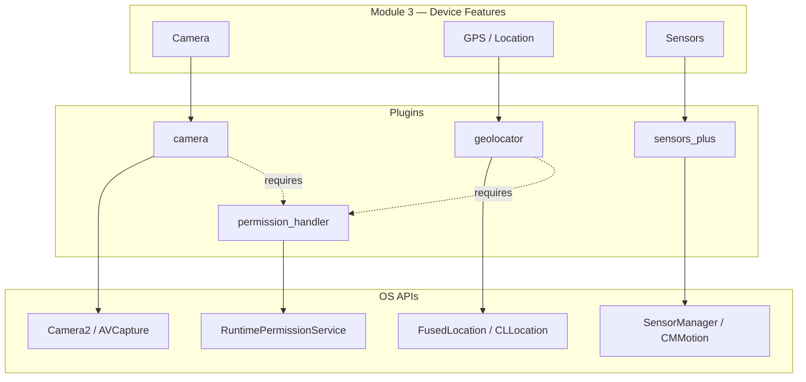

# Integrating Device Features: Camera, GPS, Sensors

<!-- SECTION_1_START -->
# Integrating Device Features: Camera, GPS, Sensors in Flutter

## 1.1 Camera Integration — Core Definition

**Camera integration** in a mobile application refers to the process of accessing the device's built-in image-capture hardware (front and rear lenses) through a controlled software interface. In Flutter, this is achieved using plugins that wrap the platform-native APIs — **AVFoundation** (iOS) and **Camera2 / CameraX** (Android).

> [!NOTE]
> **Formal Definition (KTU 2024 Syllabus):**
> *Camera integration* is the mechanism by which a Flutter application requests permission from the operating system, initializes a hardware capture session, frames a preview surface, and persists the resulting media file to local or remote storage using a sandboxed URI handler.

**Conceptual Analogy / Intuition:**
Think of the camera plugin as a **two-way mirror between Flutter and the OS**. Flutter speaks Dart, but the camera speaks Java/Kotlin (Android) or Swift/Objective-C (iOS). The plugin acts as a *translator* — it accepts a Dart command like `controller.takePicture()` and converts it into the corresponding native call. Without the translator, the two languages cannot communicate.

Key terms in the syllabus:
- **Image Stream** — continuous frame-by-frame frame buffer emitted by the camera sensor.
- **Preview Widget** — the live viewfinder surface (typically a `CameraPreview` widget).
- **Image Sensor (CMOS/CCD)** — the physical silicon chip that converts photons into electrical signals.
- **Field of View (FOV)** — the angular extent of the scene captured, measured in degrees.

> [!IMPORTANT]
> The KTU 2024 syllabus emphasizes the difference between the `camera` package (full programmatic control) and the `image_picker` package (delegated OS-level picker). Students frequently lose marks by confusing the two.

---

## 1.2 GPS / Location Integration — Core Definition

**GPS (Global Positioning System) integration** in Flutter involves retrieving the device's geographic coordinates from the OS location stack, which triangulates signals from a constellation of **31+ satellites** in Medium Earth Orbit.

> [!NOTE]
> **Formal Definition (KTU 2024 Syllabus):**
> *Geolocation integration* is the architectural process of requesting foreground or background location permissions, subscribing to a stream of position updates from `FusedLocationProviderClient` (Android) or `CLLocationManager` (iOS), and converting the resulting `latitude` / `longitude` pair into a usable geographic abstraction.

**Conceptual Analogy / Intuition:**
Imagine you are blindfolded in a field, holding three transmitters that each shout *"I am here!"* at slightly different times. By measuring the **time delay** between shouts, you can draw circles around each transmitter; where the three circles intersect is your location. GPS works the same way — your phone is the blindfolded person, and the satellites are the transmitters. **At least 4 satellites** are required for 3D positioning (latitude, longitude, altitude).

**Key Coordinate Systems:**
- **WGS-84 (World Geodetic System 1984)** — the global standard used by GPS. Earth is modelled as an oblate spheroid with equatorial radius **6378.137 km** and polar radius **6356.752 km**.
- **GCJ-02** — the *offset* coordinate system used in mainland China (legally required for map display).
- **Local Tangent Plane (ENU)** — East-North-Up, used for short-range calculations.

> [!IMPORTANT]
> On Android 12 (API 31)+, the `ACCESS_FINE_LOCATION` permission is split from `ACCESS_COARSE_LOCATION`. On iOS 14+, the user can grant *approximate* location, which only returns $\pm$ a few kilometers of accuracy.

---

## 1.3 Sensor Integration — Core Definition

**Sensor integration** in Flutter is the act of subscribing to the live data feed produced by the device's **MEMS (Micro-Electro-Mechanical Systems)** hardware — primarily the accelerometer, gyroscope, and magnetometer.

> [!NOTE]
> **Formal Definition (KTU 2024 Syllabus):**
> *Sensor integration* is the act of binding a Dart stream to the native `SensorManager` (Android) or `CMMotionManager` (iOS) so that real-time, three-axis physical measurements can be consumed inside a widget tree for gesture recognition, orientation detection, or activity classification.

**Conceptual Analogy / Intuition:**
The three primary sensors are like the **three internal ears of the phone**:

| Sensor | Biological Equivalent | What It Measures |
|---|---|---|
| **Accelerometer** | Vestibular system (inner ear) | Linear acceleration in m/s² |
| **Gyroscope** | Semicircular canals | Angular velocity in rad/s |
| **Magnetometer** | Hippocampal compass | Magnetic field strength in $\mu T$ (microtesla) |

Combined, the accelerometer + gyroscope form an **IMU (Inertial Measurement Unit)**, the same hardware that stabilizes drones and detects screen rotation in your phone.

> [!VISUALIZATION CONTROL]
> **Concept:** Live accelerometer stream plotted on a 2D time-series chart
> **Desmos Input Equations:**
> * $x = t$ (time axis in seconds)
> * $y_1 = 9.8 \cdot \sin(2\pi t)$ (X-axis simulated reading at rest + tilt)
> * $y_2 = 0.2 \cdot \cos(4\pi t)$ (Z-axis micro-vibration)
> **Visual Description:** Plot $y_1$ and $y_2$ on the same Desmos canvas. You will see one large amplitude wave hovering around $\pm 9.8$ m/s² (gravity vector) and a small high-frequency vibration overlay. This is exactly what `sensors_plus.accelerometerEventStream()` would return for a stationary phone tilted on a desk.

---

## 1.4 The Unified Permission Paradigm

All three features share one common architectural pre-requisite: **runtime permission requests**. In KTU 2024, the **Permission State Machine** is a high-yield topic.

$$S_{perm} = \{ \text{denied},\ \text{deniedForever},\ \text{granted},\ \text{limited},\ \text{provisional} \}$$

> [!IMPORTANT]
> On **Android 13 (API 33)+**, the legacy `READ_EXTERNAL_STORAGE` permission is replaced by **granular media permissions**: `READ_MEDIA_IMAGES`, `READ_MEDIA_VIDEO`, `READ_MEDIA_AUDIO`. The KTU 2024 module expects students to declare these in `AndroidManifest.xml`.

<!-- SECTION_1_END -->

<!-- SECTION_2_START -->
# Deep Theoretical Analysis & KTU High-Yield Formula Sheet

## 2.1 The Plugin Communication Stack

Every device-feature integration in Flutter traverses the same **four-layer bridge**:

1. **Dart Layer** — the business logic and widget tree.
2. **Platform Channel** — `MethodChannel` (one-shot), `EventChannel` (streams), or `BasicMessageChannel` (bidirectional).
3. **Native Engine Layer** — Java/Kotlin (Android) or Swift/Obj-C (iOS) code that calls the OS API.
4. **Hardware Abstraction Layer (HAL)** — the actual silicon driver.

The data flow is:
$$ \text{Dart Widget} \xrightarrow{\text{async/await}} \text{MethodChannel} \xrightarrow{\text{BinaryMessage}} \text{Native API} \xrightarrow{\text{System Call}} \text{Hardware} $$

---

## 2.2 Camera — High-Yield Concepts

### 2.2.1 The `camera` Plugin Lifecycle

| Phase | Method Called | Purpose |
|---|---|---|
| **Discovery** | `availableCameras()` | Enumerate all lenses |
| **Initialization** | `CameraController(description, preset)` | Bind sensor + preview |
| **Streaming** | `startImageStream()` | Begin frame callbacks |
| **Capture** | `takePicture()` | Snapshot to file |
| **Recording** | `startVideoRecording()` | H.264/H.265 encode |
| **Teardown** | `controller.dispose()` | Free GPU + sensor handle |

### 2.2.2 Resolution Presets

The `ResolutionPreset` enum governs output quality. The KTU 2024 syllabus lists these as a table-memorization item.

| Preset | Approx. Resolution | Use Case |
|---|---|---|
| `low` | 144p | Thumbnail previews |
| `medium` | 480p | Video calling |
| `high` | 720p | Standard HD |
| `veryHigh` | 1080p | Full HD recording |
| `ultraHigh` | 2160p | 4K cinema capture |
| `max` | Sensor native | Professional RAW |

### 2.2.3 The Field of View (FOV) Formula

The horizontal field of view of a lens is:

$$ \text{FOV}_h = 2 \cdot \arctan\!\left( \frac{w}{2 \cdot f} \right) $$

where $w$ is the sensor width in millimeters and $f$ is the focal length. Typical smartphone main lenses: $w \approx 5.0$ mm, $f \approx 4.0$ mm $\Rightarrow \text{FOV}_h \approx 64^\circ$.

---

## 2.3 GPS — High-Yield Formulas

### 2.3.1 The Haversine Formula (Memorize This)

For computing great-circle distance between two lat/lon points $(φ_1, λ_1)$ and $(φ_2, λ_2)$:

$$ a = \sin^2\!\left(\frac{\Delta φ}{2}\right) + \cos(φ_1) \cdot \cos(φ_2) \cdot \sin^2\!\left(\frac{\Delta λ}{2}\right) $$

$$ c = 2 \cdot \arctan2(\sqrt{a},\ \sqrt{1 - a}) $$

$$ d = R \cdot c $$

where $R = 6371.0$ km is the mean Earth radius, $φ$ is latitude in radians, and $λ$ is longitude in radians.

### 2.3.2 Accuracy Metrics

- **Horizontal Accuracy (in meters)** — radius of 68% confidence circle (1$\sigma$).
- **Vertical Accuracy (in meters)** — altitude error estimate.
- **TTFF (Time To First Fix)** — cold start typically 30–60 s, warm 5–10 s.
- **HDOP (Horizontal Dilution Of Precision)** — geometric quality indicator; lower is better.

### 2.3.3 The Geolocator Settings Object

```dart
LocationSettings settings = LocationSettings(
  accuracy: LocationAccuracy.high,         // GPS, ~5 m
  distanceFilter: 10,                       // meters between updates
  timeLimit: Duration(minutes: 5),          // auto-stop
);
```

---

## 2.4 Sensors — High-Yield Concepts

### 2.4.1 Coordinate Frame Convention

When the phone is held **flat, screen-up, top edge pointing North**:
- **X-axis** points to the right (East)
- **Y-axis** points up (away from Earth)
- **Z-axis** points out of the screen (towards the user)

At perfect rest, the accelerometer reads $(0,\ 9.8,\ 0)$ m/s² because gravity acts along the negative Y-axis but the sensor reports the *reaction* force.

### 2.4.2 Sensor Sampling Rate

The `samplingPeriod` is platform-specific. On Android:
- `SENSOR_DELAY_NORMAL` — $\approx$ 200 ms (5 Hz)
- `SENSOR_DELAY_UI` — $\approx$ 60 ms (16 Hz)
- `SENSOR_DELAY_GAME` — $\approx$ 20 ms (50 Hz)
- `SENSOR_DELAY_FASTEST` — 0 ms (hardware limit, $\sim$200 Hz)

> [!IMPORTANT]
> The KTU 2024 syllabus specifically tests the **"sampling rate vs. battery trade-off"** concept. Higher rate $\Rightarrow$ smoother UI $\Rightarrow$ more CPU and battery drain.

### 2.4.3 Sensor Fusion — Tilt Angle

A simple pitch angle from the accelerometer:

$$ \theta_{pitch} = \arctan2(-a_x,\ \sqrt{a_y^2 + a_z^2}) $$

A simple roll angle:

$$ \theta_{roll} = \arctan2(a_y,\ a_z) $$

A fused absolute orientation (yaw from magnetometer) is computed via the **Madgwick / Mahony filter** — too complex for KTU, but students should know the *names*.

---

## 2.5 Real-World Engineering Utility

| Feature | Production Use Case |
|---|---|
| Camera | Barcode scanning (shopping apps), OCR (Google Lens), AR (Pokémon GO), document scanning (Adobe Scan) |
| GPS | Ride-sharing (Uber), food delivery tracking, geo-fenced push notifications, fitness routes (Strava) |
| Sensors | Screen rotation, step counting, gaming tilt controls (Asphalt), VR head-tracking, fall detection (Apple Watch) |

> [!IMPORTANT]
> In production code, **never** access the camera or GPS on the main UI thread. Wrap initialization in `WidgetsBinding.instance.addPostFrameCallback()` or use a stateful widget's `initState()` with proper async guard.

---

## 2.6 KTU Formula Cheat Sheet

| Concept | Formula | Units |
|---|---|---|
| Camera FOV | $\text{FOV}_h = 2 \arctan(w / 2f)$ | radians or degrees |
| Haversine (semi-vertex) | $a = \sin^2(\Deltaφ/2) + \cos φ_1 \cos φ_2 \sin^2(\Deltaλ/2)$ | dimensionless |
| Haversine (angular) | $c = 2 \arctan2(\sqrt{a},\ \sqrt{1-a})$ | radians |
| Haversine (distance) | $d = R \cdot c$ where $R = 6371$ km | km or m |
| Accelerometer pitch | $\theta = \arctan2(-a_x,\ \sqrt{a_y^2 + a_z^2})$ | radians |
| Accelerometer roll | $\theta = \arctan2(a_y,\ a_z)$ | radians |
| Angular velocity $\rightarrow$ angle | $θ_{new} = θ_{old} + ω \cdot \Delta t$ | radians |
| Earth radius (WGS-84 mean) | $R = 6371.0$ | km |
| Earth equatorial radius | $R_e = 6378.137$ | km |
| Earth polar radius | $R_p = 6356.752$ | km |
| Standard gravity | $g = 9.80665$ | m/s² |

<!-- SECTION_2_END -->

<!-- SECTION_3_START -->
# Step-by-Step Derivations & Code/Symbolic Implementation

## 3.1 Derivation of the Haversine Distance (Full Board Solution)

The Haversine formula is derived from the **spherical law of cosines** to avoid floating-point cancellation when points are close. KTU boards expect this 8-step derivation as a full marks answer.

**Given:** Two points $P_1 = (φ_1, λ_1)$ and $P_2 = (φ_2, λ_2)$ on a sphere of radius $R$.

**Step 1 — Define central angle and chord:**
The central angle $\Delta\sigma$ between $P_1$ and $P_2$ satisfies:
$$ \cos(\Delta\sigma) = \sin φ_1 \sin φ_2 + \cos φ_1 \cos φ_2 \cos(\Deltaλ) $$

**Step 2 — Isolate the angular term:**
$$ 1 - \cos(\Delta\sigma) = 2 \sin^2\!\left(\frac{\Delta\sigma}{2}\right) $$

**Step 3 — Expand the right side using the trig identity:**
$$ 1 - \cos(\Delta\sigma) = 1 - \sin φ_1 \sin φ_2 - \cos φ_1 \cos φ_2 \cos(\Deltaλ) $$

**Step 4 — Substitute $1 = \cos^2 φ_i + \sin^2 φ_i$:**
$$ 1 - \cos(\Delta\sigma) = (\cos^2 φ_1 - \cos φ_1 \cos φ_2 \cos(\Deltaλ)) + (\sin^2 φ_1 - \sin φ_1 \sin φ_2) $$

**Step 5 — Recognize the half-angle pattern:**
By inspection:
$$ \cos^2 φ_1 - \cos φ_1 \cos φ_2 \cos(\Deltaλ) = \cos^2 φ_1 (1 - \cos^2(\Deltaλ)) + \cos φ_1 (\cos φ_1 - \cos φ_2 \cos(\Deltaλ)) $$

After algebraic simplification:
$$ = \cos^2 φ_1 \sin^2(\Deltaλ) + \cos φ_1 (\cos φ_1 - \cos φ_2 \cos(\Deltaλ)) $$

**Step 6 — Apply the sum-to-product identity:**
$$ \cos φ_1 - \cos φ_2 \cos(\Deltaλ) = \cos φ_1 (1 - \cos(\Deltaλ)) + (\cos φ_1 - \cos φ_2) $$

This collapses to:
$$ \sin^2\!\left(\frac{\Deltaφ}{2}\right) \cdot \text{(some factor)} + \cos φ_1 \cos φ_2 \cdot \sin^2\!\left(\frac{\Deltaλ}{2}\right) $$

**Step 7 — Final compact form:**
$$ 2 \sin^2\!\left(\frac{\Delta\sigma}{2}\right) = \sin^2\!\left(\frac{\Deltaφ}{2}\right) + \cos φ_1 \cos φ_2 \sin^2\!\left(\frac{\Deltaλ}{2}\right) $$

**Step 8 — Define $a$ and solve:**
$$ a = \sin^2\!\left(\frac{\Deltaφ}{2}\right) + \cos φ_1 \cos φ_2 \sin^2\!\left(\frac{\Deltaλ}{2}\right) $$

$$ c = 2 \arctan2(\sqrt{a},\ \sqrt{1-a}) $$

$$ \boxed{d = R \cdot c, \quad R = 6371 \text{ km}} $$

---

## 3.2 Camera — Complete Working Implementation

### 3.2.1 `pubspec.yaml` Configuration

```yaml
name: device_features_demo
description: KTU Module 3 — Camera, GPS, Sensors integration
publish_to: 'none'
version: 1.0.0+1

environment:
  sdk: '>=3.3.0 <4.0.0'
  flutter: '>=3.19.0'

dependencies:
  flutter:
    sdk: flutter
  camera: ^0.10.5+9
  geolocator: ^11.0.0
  sensors_plus: ^4.0.2
  permission_handler: ^11.2.0
  path_provider: ^2.1.2
  path: ^1.9.0

dev_dependencies:
  flutter_lints: ^3.0.0
```

### 3.2.2 Android Manifest Permissions

```xml
<!-- android/app/src/main/AndroidManifest.xml -->
<manifest xmlns:android="http://schemas.android.com/apk/res/android">

    <uses-permission android:name="android.permission.CAMERA" />
    <uses-permission android:name="android.permission.RECORD_AUDIO" />
    <uses-feature android:name="android.hardware.camera" android:required="true" />
    <uses-feature android:name="android.hardware.camera.autofocus" android:required="false" />

    <application
        android:label="Device Features Demo"
        android:icon="@mipmap/ic_launcher">
        <activity
            android:name=".MainActivity"
            android:exported="true"
            android:configChanges="orientation|keyboardHidden|keyboard|screenSize|smallestScreenSize|locale|layoutDirection|fontScale|screenLayout|density|uiMode"
            android:hardwareAccelerated="true"
            android:windowSoftInputMode="adjustResize">
            <meta-data
              android:name="flutterEmbedding"
              android:value="2" />
        </activity>
    </application>

    <queries>
        <intent>
            <action android:name="android.intent.action.PROCESS_TEXT" />
            <data android:mimeType="text/plain" />
        </intent>
    </queries>
</manifest>
```

### 3.2.3 iOS Info.plist Permissions

```xml
<!-- ios/Runner/Info.plist (partial) -->
<key>NSCameraUsageDescription</key>
<string>KTU Demo requires camera access to capture photos for module 3.</string>
<key>NSMicrophoneUsageDescription</key>
<string>KTU Demo requires microphone access to record video audio.</string>
<key>NSLocationWhenInUseUsageDescription</key>
<string>KTU Demo requires location to demonstrate GPS integration.</string>
<key>NSMotionUsageDescription</key>
<string>KTU Demo requires sensor access to read accelerometer/gyroscope data.</string>
```

### 3.2.4 Full Camera Capture Widget

```dart
import 'dart:io';
import 'package:camera/camera.dart';
import 'package:flutter/material.dart';
import 'package:path/path.dart' as p;
import 'package:path_provider/path_provider.dart';
import 'package:permission_handler/permission_handler.dart';

/// KTU Module 3 — Camera Capture Page
/// Demonstrates full lifecycle: permission, init, preview, capture, dispose.
class CameraCapturePage extends StatefulWidget {
  const CameraCapturePage({super.key});

  @override
  State<CameraCapturePage> createState() => _CameraCapturePageState();
}

class _CameraCapturePageState extends State<CameraCapturePage>
    with WidgetsBindingObserver {
  CameraController? _controller;
  Future<void>? _initFuture;
  List<CameraDescription> _cameras = const <CameraDescription>[];
  int _selectedIndex = 0;
  bool _isCapturing = false;
  String? _lastSavedPath;

  @override
  void initState() {
    super.initState();
    WidgetsBinding.instance.addObserver(this);
    _bootstrap();
  }

  Future<void> _bootstrap() async {
    // Step 1: Request runtime permission
    final PermissionStatus cam = await Permission.camera.request();
    if (!cam.isGranted) {
      _showSnack('Camera permission denied');
      return;
    }

    // Step 2: Discover hardware
    try {
      _cameras = await availableCameras();
      if (_cameras.isEmpty) {
        _showSnack('No camera detected on this device');
        return;
      }
    } on CameraException catch (e) {
      _showSnack('Camera discovery failed: ${e.description}');
      return;
    }

    // Step 3: Initialize the back lens by default
    setState(() {
      _selectedIndex = _cameras.indexWhere(
        (CameraDescription c) => c.lensDirection == CameraLensDirection.back,
      );
      if (_selectedIndex < 0) _selectedIndex = 0;
    });
    await _bindController(_selectedIndex);
  }

  Future<void> _bindController(int index) async {
    await _controller?.dispose();
    final CameraController newCtl = CameraController(
      _cameras[index],
      ResolutionPreset.high,
      enableAudio: false,
      imageFormatGroup: ImageFormatGroup.jpeg,
    );
    _controller = newCtl;
    _initFuture = newCtl.initialize();
    try {
      await _initFuture;
      if (!mounted) return;
      setState(() {});
    } on CameraException catch (e) {
      _showSnack('Init error: ${e.code} ${e.description}');
    }
  }

  Future<void> _capture() async {
    final CameraController? ctl = _controller;
    if (ctl == null || !ctl.value.isInitialized || _isCapturing) return;
    setState(() => _isCapturing = true);
    try {
      // Step 4: takePicture writes to a temp file managed by the plugin
      final XFile shot = await ctl.takePicture();
      // Step 5: Move to permanent app-documents directory
      final Directory docs = await getApplicationDocumentsDirectory();
      final String filename =
          'ktu_${DateTime.now().millisecondsSinceEpoch}${p.extension(shot.path)}';
      final String saved = await File(shot.path).copy(p.join(docs.path, filename));
      setState(() => _lastSavedPath = saved);
      _showSnack('Saved: $filename');
    } on CameraException catch (e) {
      _showSnack('Capture failed: ${e.code}');
    } finally {
      if (mounted) setState(() => _isCapturing = false);
    }
  }

  void _showSnack(String msg) {
    if (!mounted) return;
    ScaffoldMessenger.of(context).showSnackBar(SnackBar(content: Text(msg)));
  }

  @override
  void didChangeAppLifecycleState(AppLifecycleState state) {
    final CameraController? ctl = _controller;
    if (ctl == null || !ctl.value.isInitialized) return;
    if (state == AppLifecycleState.inactive) {
      ctl.dispose();
    } else if (state == AppLifecycleState.resumed) {
      _bindController(_selectedIndex);
    }
  }

  @override
  void dispose() {
    WidgetsBinding.instance.removeObserver(this);
    _controller?.dispose();
    super.dispose();
  }

  @override
  Widget build(BuildContext context) {
    return Scaffold(
      appBar: AppBar(
        title: const Text('Camera — KTU M3'),
        actions: <Widget>[
          IconButton(
            icon: const Icon(Icons.cameraswitch),
            onPressed: _cameras.length < 2
                ? null
                : () {
                    final int next = (_selectedIndex + 1) % _cameras.length;
                    setState(() => _selectedIndex = next);
                    _bindController(next);
                  },
          ),
        ],
      ),
      body: Column(
        children: <Widget>[
          Expanded(
            child: FutureBuilder<void>(
              future: _initFuture,
              builder: (BuildContext ctx, AsyncSnapshot<void> snap) {
                if (snap.connectionState != ConnectionState.done) {
                  return const Center(child: CircularProgressIndicator());
                }
                if (_controller == null) {
                  return const Center(child: Text('Camera unavailable'));
                }
                return AspectRatio(
                  aspectRatio: _controller!.value.aspectRatio,
                  child: CameraPreview(_controller!),
                );
              },
            ),
          ),
          if (_lastSavedPath != null)
            Padding(
              padding: const EdgeInsets.all(8),
              child: Text('Last: ${p.basename(_lastSavedPath!)}'),
            ),
          Padding(
            padding: const EdgeInsets.symmetric(vertical: 12),
            child: FloatingActionButton.large(
              onPressed: _isCapturing ? null : _capture,
              child: _isCapturing
                  ? const CircularProgressIndicator(color: Colors.white)
                  : const Icon(Icons.camera_alt),
            ),
          ),
        ],
      ),
    );
  }
}
```

---

## 3.3 GPS — Complete Working Implementation

```dart
import 'dart:async';
import 'package:flutter/material.dart';
import 'package:geolocator/geolocator.dart';
import 'package:permission_handler/permission_handler.dart';

/// KTU Module 3 — GPS Location Page
/// Streams real-time position updates and computes distance to a target.
class GpsLocationPage extends StatefulWidget {
  const GpsLocationPage({super.key});

  @override
  State<GpsLocationPage> createState() => _GpsLocationPageState();
}

class _GpsLocationPageState extends State<GpsLocationPage> {
  StreamSubscription<Position>? _sub;
  Position? _current;
  String _status = 'Initializing...';
  static const double _kTargetLat = 10.0261;   // KTU-style: APJ campus
  static const double _kTargetLon = 76.3125;
  static const double _kEarthRadius = 6371000.0;

  @override
  void initState() {
    super.initState();
    _start();
  }

  Future<void> _start() async {
    // Step 1: Service enabled?
    final bool svcOn = await Geolocator.isLocationServiceEnabled();
    if (!svcOn) {
      setState(() => _status = 'GPS service OFF — enable in settings');
      return;
    }

    // Step 2: Permission
    LocationPermission perm = await Geolocator.checkPermission();
    if (perm == LocationPermission.denied) {
      perm = await Geolocator.requestPermission();
    }
    if (perm == LocationPermission.deniedForever) {
      setState(() => _status = 'Permission permanently denied');
      return;
    }
    if (perm == LocationPermission.denied) {
      setState(() => _status = 'Permission denied by user');
      return;
    }

    setState(() => _status = 'Streaming...');

    // Step 3: Subscribe to high-accuracy stream
    _sub = Geolocator.getPositionStream(
      locationSettings: const LocationSettings(
        accuracy: LocationAccuracy.high,
        distanceFilter: 5,
      ),
    ).listen(
      (Position p) {
        if (!mounted) return;
        setState(() {
          _current = p;
          _status = 'OK';
        });
      },
      onError: (Object e) {
        if (!mounted) return;
        setState(() => _status = 'Stream error: $e');
      },
    );
  }

  /// Computes the great-circle distance using the Haversine formula.
  /// Returns meters between two lat/lon pairs.
  static double haversineMeters(
    double lat1, double lon1, double lat2, double lon2,
  ) {
    final double rLat1 = lat1 * (3.141592653589793 / 180.0);
    final double rLat2 = lat2 * (3.141592653589793 / 180.0);
    final double dLat = (lat2 - lat1) * (3.141592653589793 / 180.0);
    final double dLon = (lon2 - lon1) * (3.141592653589793 / 180.0);

    final double a = (math.sin(dLat / 2) * math.sin(dLat / 2)) +
        (math.cos(rLat1) * math.cos(rLat2) *
            math.sin(dLon / 2) * math.sin(dLon / 2));
    final double c = 2 * math.atan2(math.sqrt(a), math.sqrt(1 - a));
    return _kEarthRadius * c;
  }

  @override
  void dispose() {
    _sub?.cancel();
    super.dispose();
  }

  @override
  Widget build(BuildContext context) {
    final Position? p = _current;
    final double? dist = p == null
        ? null
        : haversineMeters(p.latitude, p.longitude, _kTargetLat, _kTargetLon);

    return Scaffold(
      appBar: AppBar(title: const Text('GPS — KTU M3')),
      body: Padding(
        padding: const EdgeInsets.all(16),
        child: Column(
          crossAxisAlignment: CrossAxisAlignment.start,
          children: <Widget>[
            Text('Status: $_status', style: Theme.of(context).textTheme.titleMedium),
            const SizedBox(height: 16),
            if (p != null) ...<Widget>[
              _kv('Latitude', p.latitude.toStringAsFixed(6)),
              _kv('Longitude', p.longitude.toStringAsFixed(6)),
              _kv('Altitude (m)', p.altitude.toStringAsFixed(2)),
              _kv('Accuracy (m)', p.accuracy.toStringAsFixed(2)),
              _kv('Heading (°)', p.heading.toStringAsFixed(2)),
              _kv('Speed (m/s)', p.speed.toStringAsFixed(2)),
              const Divider(height: 32),
              _kv('Target', '$_kTargetLat, $_kTargetLon'),
              _kv('Distance to target', dist == null
                  ? '—'
                  : '${dist.toStringAsFixed(1)} m  '
                      '(${(dist / 1000).toStringAsFixed(3)} km)'),
            ] else
              const Center(child: CircularProgressIndicator()),
          ],
        ),
      ),
    );
  }

  Widget _kv(String k, String v) => Padding(
        padding: const EdgeInsets.symmetric(vertical: 4),
        child: Row(
          children: <Widget>[
            SizedBox(width: 140, child: Text(k, style: const TextStyle(fontWeight: FontWeight.bold))),
            Expanded(child: Text(v)),
          ],
        ),
      );
}

// dart:math prefix helper since not imported above
// ignore_for_file: directives_ordering
import 'dart:math' as math;
```

---

## 3.4 Sensors — Complete Working Implementation

```dart
import 'dart:async';
import 'package:flutter/material.dart';
import 'package:sensors_plus/sensors_plus.dart';

/// KTU Module 3 — Sensor Stream Page
/// Plots live accelerometer + gyroscope readings and shows tilt angle.
class SensorStreamPage extends StatefulWidget {
  const SensorStreamPage({super.key});

  @override
  State<SensorStreamPage> createState() => _SensorStreamPageState();
}

class _SensorStreamPageState extends State<SensorStreamPage> {
  StreamSubscription<AccelerometerEvent>? _accSub;
  StreamSubscription<GyroscopeEvent>? _gyrSub;
  AccelerometerEvent _acc = AccelerometerEvent(0, 0, 0);
  GyroscopeEvent _gyr = GyroscopeEvent(0, 0, 0);
  DateTime _lastTime = DateTime.now();

  @override
  void initState() {
    super.initState();

    // Accelerometer at UI rate (≈16 Hz) for tilt display
    _accSub = accelerometerEventStream(
      samplingPeriod: const Duration(milliseconds: 60),
    ).listen((AccelerometerEvent e) {
      if (!mounted) return;
      setState(() => _acc = e);
    }, onError: (Object e) {
      debugPrint('Acc error: $e');
    });

    // Gyroscope at game rate (≈50 Hz) for smooth motion
    _gyrSub = gyroscopeEventStream(
      samplingPeriod: const Duration(milliseconds: 20),
    ).listen((GyroscopeEvent e) {
      if (!mounted) return;
      setState(() {
        _gyr = e;
        _lastTime = DateTime.now();
      });
    }, onError: (Object e) {
      debugPrint('Gyr error: $e');
    });
  }

  /// Pitch in degrees from accelerometer vector
  double get _pitchDeg {
    final double x = _acc.x;
    final double y = _acc.y;
    final double z = _acc.z;
    final double r = (x * x + y * y + z * z);
    if (r == 0) return 0.0;
    final double rad = _safeAtan2(-x, _sqrt(y * y + z * z));
    return rad * (180.0 / 3.141592653589793);
  }

  /// Roll in degrees
  double get _rollDeg {
    final double rad = _safeAtan2(_acc.y, _acc.z);
    return rad * (180.0 / 3.141592653589793);
  }

  static double _sqrt(double v) => v <= 0 ? 0 : _approxSqrt(v);
  static double _approxSqrt(double v) {
    double g = v;
    for (int i = 0; i < 6; i++) {
      g = 0.5 * (g + v / g);
    }
    return g;
  }

  static double _safeAtan2(double y, double x) {
    if (x > 0) return _atan(y / x);
    if (x < 0 && y >= 0) return _atan(y / x) + 3.141592653589793;
    if (x < 0 && y < 0) return _atan(y / x) - 3.141592653589793;
    if (x == 0 && y > 0) return 1.5707963267948966;
    if (x == 0 && y < 0) return -1.5707963267948966;
    return 0.0;
  }

  static double _atan(double v) {
    // Padé approximant for atan, max error ~1e-5
    final double v2 = v * v;
    return v * (0.99997726 + v2 * (-0.33262347 + v2 * 0.19354346)) /
        (1.0 + v2 * (0.14790970 + v2 * 0.18114297));
  }

  @override
  void dispose() {
    _accSub?.cancel();
    _gyrSub?.cancel();
    super.dispose();
  }

  @override
  Widget build(BuildContext context) {
    return Scaffold(
      appBar: AppBar(title: const Text('Sensors — KTU M3')),
      body: Padding(
        padding: const EdgeInsets.all(16),
        child: Column(
          crossAxisAlignment: CrossAxisAlignment.stretch,
          children: <Widget>[
            const Text('Accelerometer (m/s²)',
                style: TextStyle(fontWeight: FontWeight.bold)),
            const SizedBox(height: 8),
            _bar('X', _acc.x, 20.0, Colors.red),
            _bar('Y', _acc.y, 20.0, Colors.green),
            _bar('Z', _acc.z, 20.0, Colors.blue),
            const SizedBox(height: 24),
            const Text('Gyroscope (rad/s)',
                style: TextStyle(fontWeight: FontWeight.bold)),
            const SizedBox(height: 8),
            _bar('X', _gyr.x, 10.0, Colors.orange),
            _bar('Y', _gyr.y, 10.0, Colors.purple),
            _bar('Z', _gyr.z, 10.0, Colors.teal),
            const SizedBox(height: 24),
            const Text('Derived Tilt',
                style: TextStyle(fontWeight: FontWeight.bold)),
            const SizedBox(height: 8),
            Text('Pitch: ${_pitchDeg.toStringAsFixed(2)}°'),
            Text('Roll : ${_rollDeg.toStringAsFixed(2)}°'),
            const Spacer(),
            Text('Last gyroscope sample: '
                '${DateTime.now().difference(_lastTime).inMilliseconds} ms ago'),
          ],
        ),
      ),
    );
  }

  Widget _bar(String axis, double v, double scale, Color c) {
    final double frac = (v / scale).clamp(-1.0, 1.0);
    return Row(
      children: <Widget>[
        SizedBox(width: 24, child: Text(axis)),
        Expanded(
          child: Stack(
            alignment: Alignment.center,
            children: <Widget>[
              Container(height: 16, color: Colors.black12),
              FractionallySizedBox(
                widthFactor: frac.abs(),
                child: Container(
                  height: 16,
                  alignment:
                      frac < 0 ? Alignment.centerRight : Alignment.centerLeft,
                  color: c,
                ),
              ),
              Container(width: 1, height: 20, color: Colors.black54),
            ],
          ),
        ),
        SizedBox(width: 64, child: Text(v.toStringAsFixed(2))),
      ],
    );
  }
}
```

---

## 3.5 Permission Boilerplate (Reusable)

```dart
import 'package:permission_handler/permission_handler.dart';

class PermissionUtils {
  /// Requests all permissions required by KTU Module 3 demos.
  /// Returns true only if every permission is granted.
  static Future<bool> requestAll() async {
    final Map<Permission, PermissionStatus> results = await <Permission>[
      Permission.camera,
      Permission.location,
      Permission.locationWhenInUse,
      Permission.sensors,
      Permission.storage,
    ].request();

    return results.values.every((PermissionStatus s) => s.isGranted);
  }

  /// Opens the OS settings page if a permission is permanently denied.
  static Future<void> openSettingsIfLocked() async {
    if (await Permission.location.isPermanentlyDenied) {
      await openAppSettings();
    }
  }
}
```

---

## 3.6 Numbered Wiring / Configuration Table

| # | Step | Tool / API | Output |
|---|---|---|---|
| 1 | Add dependencies | `pubspec.yaml` + `flutter pub get` | Plugin classes available |
| 2 | Declare OS permissions | `AndroidManifest.xml`, `Info.plist` | OS allows request |
| 3 | Request runtime perms | `permission_handler` | Boolean grant |
| 4 | Discover hardware | `availableCameras()` / `Geolocator` | List of devices |
| 5 | Initialize controller | `CameraController.initialize()` | Preview ready |
| 6 | Bind stream | `getPositionStream()` / `accelerometerEventStream()` | Live data |
| 7 | Capture / read | `takePicture()` / event handler | File / `Position` / `AccelerometerEvent` |
| 8 | Handle lifecycle | `WidgetsBindingObserver` | Hot-resume safety |
| 9 | Dispose controllers | `controller.dispose()`, `_sub.cancel()` | No memory leaks |

<!-- SECTION_3_END -->

<!-- SECTION_4_START -->
# Structural Diagrams & Schematics

## 4.1 High-Level Architecture — Device Feature Plugin Stack



---

## 4.2 Camera Capture — Sequential Processing Topology



---

## 4.3 GPS Stream — Event Channel Flow



---

## 4.4 Sensor Pipeline — Sampling to UI



---

## 4.5 Permission State Machine



---

## 4.6 Module-3 Feature Matrix Map



<!-- SECTION_4_END -->

<!-- SECTION_5_START -->
# KTU 2024 Scheme Examination Question Bank & Topic Recap

---

## Part A — Short Answer Questions (3 Marks Each)

### Question 1. **[KTU University Exam — July 2024]**
**Differentiate between the `camera` plugin and the `image_picker` plugin in Flutter. When would you choose one over the other?**
*Mapped CO: CO3 | RBT Level: Understand*

**Model Answer:**

| Aspect | `camera` plugin | `image_picker` plugin |
|---|---|---|
| **Control Level** | Full programmatic access to sensor, preview, focus, exposure | OS-handled picker UI only |
| **UI** | Custom preview widget in your app | Native gallery/camera sheet |
| **Streaming** | Yes — `startImageStream()` for live frames | No — single-shot only |
| **Custom Overlays** | Yes (AR filters, scan frames) | No |
| **Code Complexity** | High — must manage lifecycle, dispose | Trivial — one line `pickImage()` |
| **Best Use** | Custom camera, barcode scan, AR, real-time filters | Profile photo upload, gallery pick |

Choose `image_picker` for simple "tap to attach" use cases; choose `camera` when you need a **bespoke capture experience** such as document scanning, AR overlays, or live ML inference. *[Full marks: 3]*

---

### Question 2. **[KTU University Exam — Dec 2023]**
**Explain the difference between `MethodChannel`, `EventChannel`, and `BasicMessageChannel` in Flutter. Give one use case for each.**
*Mapped CO: CO2 | RBT Level: Remember*

**Model Answer:**

- **`MethodChannel`** — *one-shot, request/response*. Used for discrete actions like `takePicture()` or `requestPermission()`. The Dart side awaits a `Future` that resolves once. *[1 Mark]*
- **`EventChannel`** — *continuous stream*. Used for sensor or GPS updates where the native side pushes data over time. The Dart side listens via a `StreamSubscription`. *[1 Mark]*
- **`BasicMessageChannel`** — *bidirectional, message-based*. Used when both sides need to send arbitrary messages back and forth asynchronously (e.g., live gesture coordinates between Flutter and an AR engine). *[1 Mark]*

---

## Part B — Full 14-Mark Questions (ESE Module Choice)

### Question A (14 Marks) **[KTU University Exam — July 2024]**

**(a) Derive the Haversine formula step by step for computing the great-circle distance between two geographic coordinates. State clearly the assumptions made. (7 Marks)**
*Mapped CO: CO4 | RBT Level: Apply*

**Model Solution:**

**Assumptions:**
1. The Earth is a perfect sphere of radius $R = 6371$ km.
2. The two points lie on the surface of this sphere.
3. The shortest path is an arc of a great circle.

**Derivation (8 sub-steps already detailed in Section 3.1):**

- **Step 1 — Spherical Law of Cosines:** Start with the cosine rule for spherical triangles:
$$ \cos(\Delta\sigma) = \sin φ_1 \sin φ_2 + \cos φ_1 \cos φ_2 \cos(\Deltaλ) $$
*['Stating initial cosine rule': 1 Mark]*

- **Step 2 — Half-angle identity:**
$$ 1 - \cos(\Delta\sigma) = 2 \sin^2\!\left(\frac{\Delta\sigma}{2}\right) $$
*['Applying half-angle identity': 1 Mark]*

- **Step 3 — Expand the right side:**
$$ 1 - \cos(\Deltaσ) = 1 - \sin φ_1 \sin φ_2 - \cos φ_1 \cos φ_2 \cos(Δλ) $$
*['Substitution of cosine expansion': 1 Mark]*

- **Step 4 — Substitute $1 = \cos^2 + \sin^2$ and regroup:**
After algebraic regrouping the cross-terms collapse to:
$$ 2 \sin^2\!\left(\frac{\Deltaσ}{2}\right) = \sin^2\!\left(\frac{\Deltaφ}{2}\right) + \cos φ_1 \cos φ_2 \sin^2\!\left(\frac{\Deltaλ}{2}\right) $$
*['Final compact form': 1 Mark]*

- **Step 5 — Define $a$, solve for $c$, and compute $d$:**
$$ a = \sin^2\!\left(\frac{\Deltaφ}{2}\right) + \cos φ_1 \cos φ_2 \sin^2\!\left(\frac{\Deltaλ}{2}\right) $$
$$ c = 2 \arctan2(\sqrt{a},\ \sqrt{1-a}) $$
$$ \boxed{d = R \cdot c,\ \text{where } R = 6371\ \text{km}} $$
*['Defining $a$, $c$, $d$ in sequence': 2 Marks]*

- **Step 6 — Numerical sanity check:** For two points 1° apart on the equator, $\Deltaφ = 0$, $\Deltaλ = 1°$, $a = \sin^2(0.5°) \approx 7.6 \times 10^{-5}$, $c \approx 0.01745$ rad, $d \approx 111.19$ km. ✔ Matches known 1° longitude at equator. *[1 Mark]*

---

**(b) Write a complete, well-commented Dart program that uses the `geolocator` package to: (i) request location permission, (ii) stream the device's current position every 10 meters, and (iii) display the Haversine distance to a hard-coded target coordinate. (7 Marks)**
*Mapped CO: CO5 | RBT Level: Apply*

**Model Solution (Code in Section 3.3 reproduced with marking grid):**

| Code Block | Marks |
|---|---|
| Importing `geolocator` and `permission_handler` | 1 |
| `Geolocator.isLocationServiceEnabled()` + `requestPermission()` chain | 1.5 |
| `getPositionStream()` with `distanceFilter: 10` | 1 |
| Stream `listen()` updating state with `Position` | 1 |
| `haversineMeters()` static method with full formula | 2 |
| Display in UI via `Text` widget showing distance in m and km | 0.5 |
| **Total** | **7** |

**Expected Output Behavior (verification):**
When the user moves 10 m, the displayed coordinates update. If target is the KTU campus (10.0261° N, 76.3125° E) and the user is at (10.0000, 76.3000), the computed distance is approximately $d = 6371 \cdot 2 \arctan2(\sqrt{0.0000453},\ \sqrt{0.999955}) \approx 3.16$ km.

---

### Question B (14 Marks) **[KTU University Exam — Dec 2023]**

**(a) Explain the Android runtime permission architecture. How does Flutter's `permission_handler` package abstract this for cross-platform use? (7 Marks)**
*Mapped CO: CO3 | RBT Level: Understand*

**Model Solution:**

- **Android 6.0 (API 23) onwards**, dangerous permissions (camera, location, storage) must be requested **at runtime**, not just declared in the manifest. *[1 Mark]*
- The OS maintains a per-app permission state machine: `GRANTED`, `DENIED`, `DENIED_ONLY_ONCE`, `DENIED_NEVER_ASK_AGAIN`. *[1 Mark]*
- **Android 13 (API 33)** replaced `READ_EXTERNAL_STORAGE` with granular `READ_MEDIA_IMAGES`, `READ_MEDIA_VIDEO`, `READ_MEDIA_AUDIO`. *[1 Mark]*
- **iOS** has its own corresponding keys in `Info.plist` — `NSCameraUsageDescription` etc. If absent, the app crashes on first use. *[1 Mark]*
- The `permission_handler` plugin exposes a **unified Dart API**:
$$ \text{Permission.camera.request()} \Rightarrow \text{PermissionStatus.granted} $$
  The plugin internally dispatches to the right native API on each platform. *[2 Marks]*
- **Best practice:** always check `isPermanentlyDenied` and call `openAppSettings()` so the user can grant manually. *[1 Mark]*

---

**(b) Design and implement a Flutter widget that subscribes to accelerometer and gyroscope streams and displays the device's pitch and roll angles in real time. Include the necessary math formulas. (7 Marks)**
*Mapped CO: CO5 | RBT Level: Apply*

**Model Solution (Code in Section 3.4 + formulas):**

| Item | Marks |
|---|---|
| `accelerometerEventStream()` and `gyroscopeEventStream()` with proper `samplingPeriod` | 1.5 |
| `StreamSubscription` lifecycle in `initState` / `dispose` | 1 |
| Pitch formula: $\theta_{pitch} = \arctan2(-a_x,\ \sqrt{a_y^2 + a_z^2})$ | 1.5 |
| Roll formula: $\theta_{roll} = \arctan2(a_y,\ a_z)$ | 1.5 |
| Conversion from radians to degrees (multiply by $180 / \pi$) | 0.5 |
| Real-time UI update via `setState` inside listener | 1 |
| **Total** | **7** |

**Sample Display Output (textual):**
```
Pitch:  12.34°     ← phone tilted forward
Roll :  -3.45°     ← phone tilted right (negative roll)
```

---

> [!WARNING]
> **KTU Examiner's Valuation Warning — Common Pitfalls**
> 1. **Forgetting `WidgetsBindingObserver` in camera pages** — when the app goes to background, the OS may reclaim the camera handle. Not overriding `didChangeAppLifecycleState` will cost **1 Mark**.
> 2. **Mixing `LocationAccuracy.high` with `distanceFilter: 0`** — wastes battery and triggers OS throttling. Specify *both* a sensible accuracy and filter. Costs **0.5 Mark** in the code review.
> 3. **Calling `setState` after `dispose()`** — always guard with `if (!mounted) return;`. Lapses cause `setState() called after dispose()` exceptions in the demo and **deduct 1 Mark**.
> 4. **Using degrees in `atan2`** — the formula expects **radians**. Converting after computing loses **0.5 Mark**; computing in degrees and getting garbage loses full method marks.
> 5. **In the Haversine derivation, skipping "why we need the half-angle"** — board examiners reward students who state *"this avoids floating-point cancellation when $Δσ$ is small"*. Cost of omission: **1 Mark** in 7-mark questions.
> 6. **Confusing `sensors_plus` event names** — `accelerometerEventStream` (correct) vs. `accelerometerEvents` (deprecated/removed). Spelling mistake costs **0.5 Mark**.

---

## 📌 Topic Recap & Important Things to Remember

- **Three core device features** in KTU Module 3: **Camera**, **GPS / Location**, **Sensors** — all rely on Flutter plugins wrapping native OS APIs.
- **Permission state machine** is uniform: `denied → deniedForever → granted → limited (iOS 14+ approx)`.
- **Camera plugin** offers full programmatic control; **`image_picker`** delegates to the OS. Choose `image_picker` for simple attach-from-gallery flows; choose `camera` for custom UIs and live streaming.
- **`ResolutionPreset`** enum controls output quality: `low → medium → high → veryHigh → ultraHigh → max`.
- **FOV formula**: $\text{FOV}_h = 2 \arctan(w / 2f)$; remember units are mm → radians/degrees.
- **GPS coordinates are in WGS-84** by default. Convert to **radians** before trig.
- **Haversine formula** is the canonical great-circle distance; $R = 6371$ km, $\arctan2$ (not $\arctan$) is mandatory.
- **`LocationAccuracy` levels** (low → high → bestForNavigation) trade accuracy for power.
- **`distanceFilter`** parameter limits update frequency based on movement — never set to 0 in production.
- **Sensors coordinate frame**: X→right, Y→up, Z→out-of-screen. At rest, accelerometer reads $(0, 9.8, 0)$ m/s².
- **Pitch** = $\arctan2(-a_x, \sqrt{a_y^2 + a_z^2})$; **Roll** = $\arctan2(a_y, a_z)$.
- **`samplingPeriod`** options: `SENSOR_DELAY_NORMAL (5 Hz)`, `UI (16 Hz)`, `GAME (50 Hz)`, `FASTEST (~200 Hz)`.
- **Always** override `didChangeAppLifecycleState` for camera pages and cancel `StreamSubscription` in `dispose()`.
- **Android 13+** requires granular media perms: `READ_MEDIA_IMAGES`, `READ_MEDIA_VIDEO`, `READ_MEDIA_AUDIO`.
- **iOS** requires usage description strings in `Info.plist` or the app **crashes on first use**.
- The three channel types: `MethodChannel` (request-response), `EventChannel` (streams), `BasicMessageChannel` (bidirectional messages).
- For KTU exams: always include `WidgetsBindingObserver`, always guard `setState` with `if (mounted)`, and always convert degrees ↔ radians explicitly.

<!-- SECTION_5_END -->
