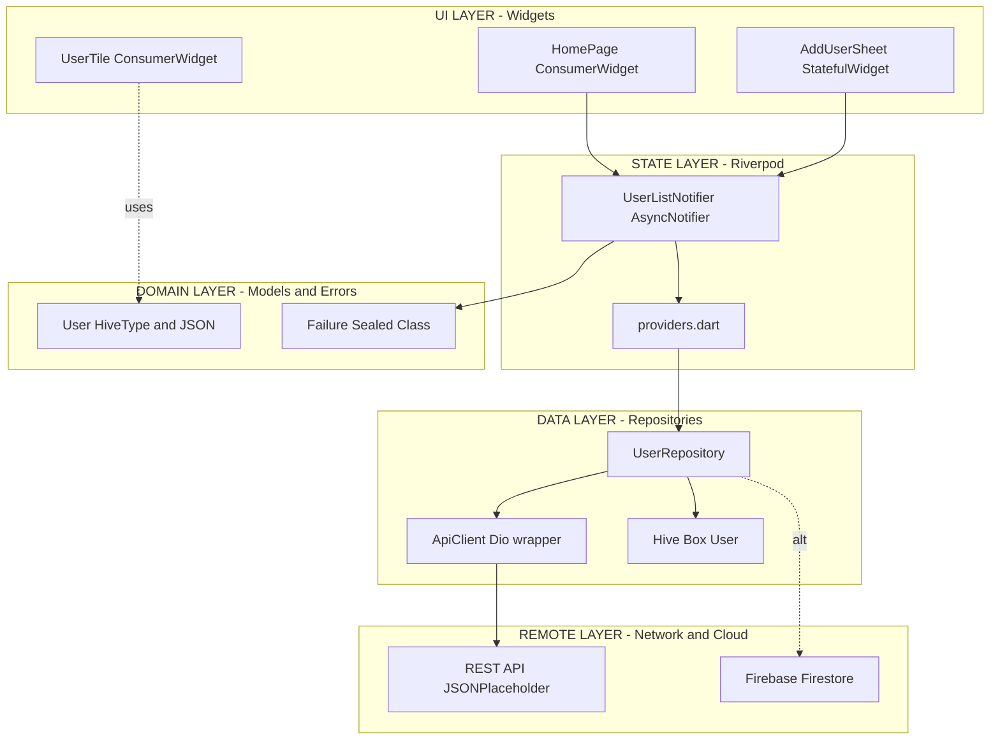
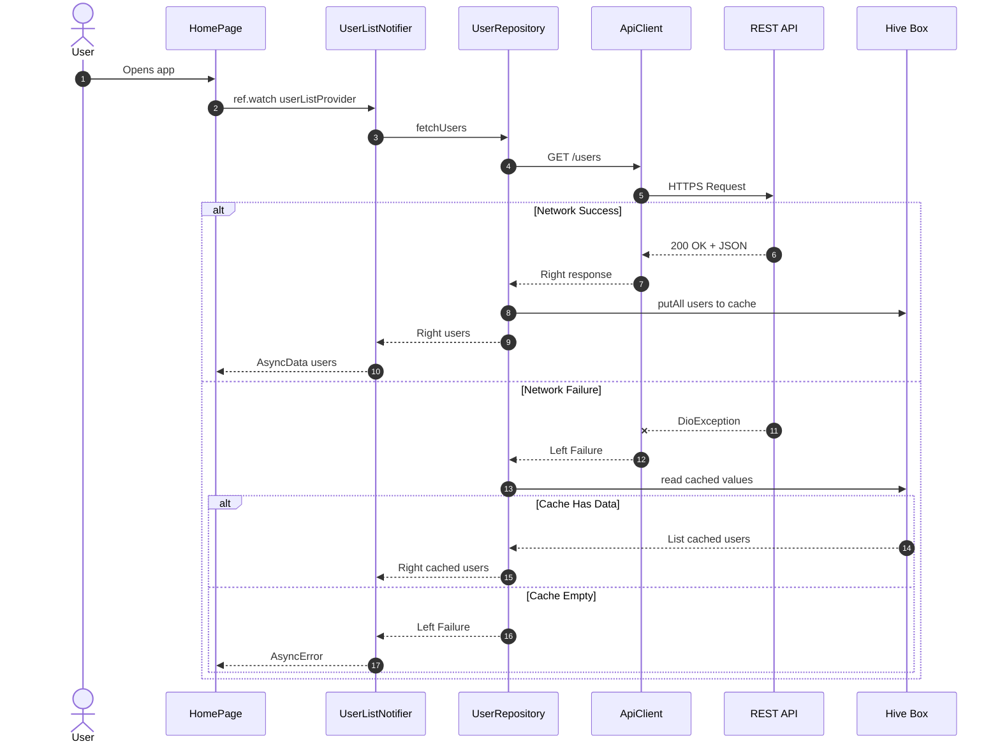
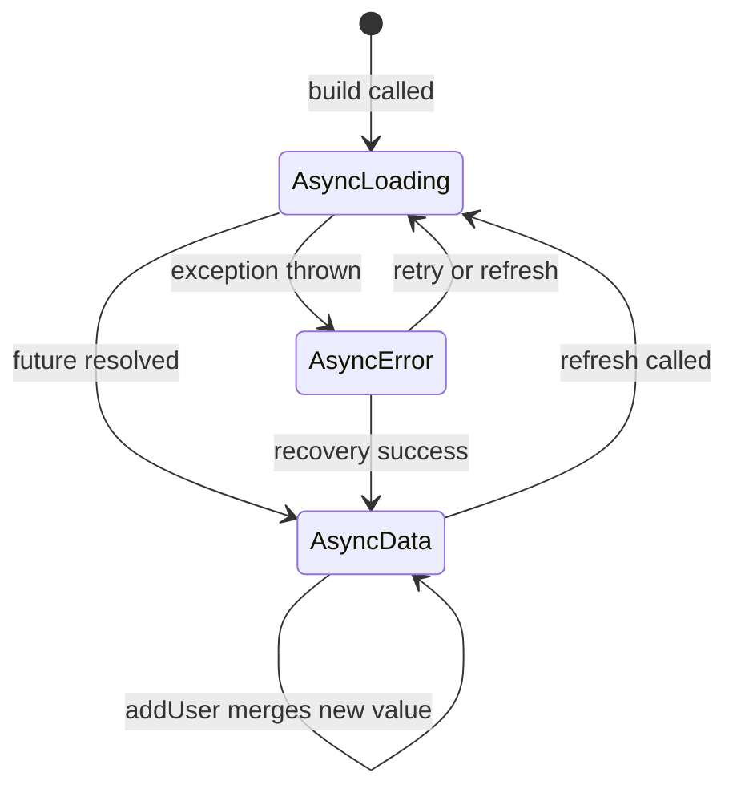
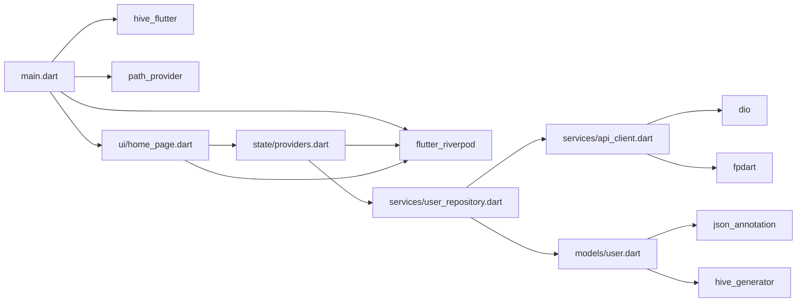
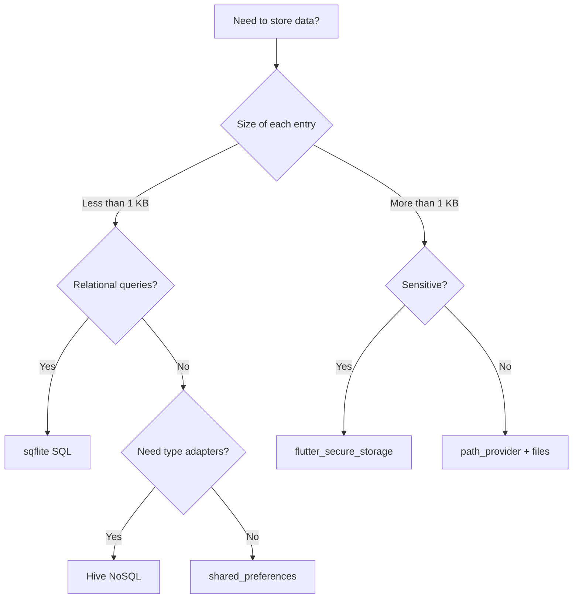
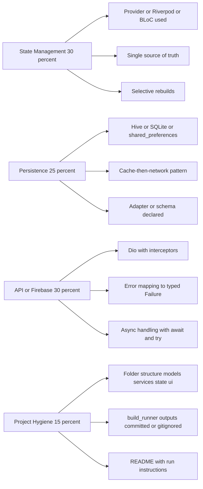
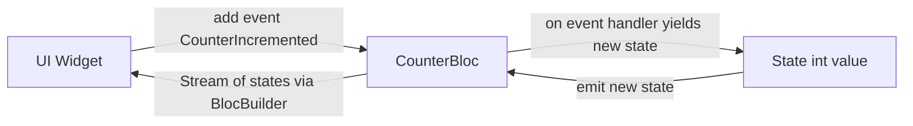

# Milestone 3 : Enhance the project with state management, data persistence, and integration with a RESTful API or Firebase.

<!-- SECTION_1_START -->
# 🧠 Milestone 3 — Advanced Flutter Development

## 1.1 Formal Definition (KTU 2024 Syllabus Terminology)

> [!IMPORTANT]
> **Milestone 3: Enhancing a Flutter Project** focuses on transforming a basic, stateless UI prototype into a **production-grade mobile application** by introducing three engineering pillars:
> 1. **State Management** — Architectural control of mutable in-memory data.
> 2. **Data Persistence** — Local, offline-capable storage of application data.
> 3. **Remote Integration** — Bidirectional communication with a **RESTful API** or **Firebase Backend-as-a-Service (BaaS)**.

In the context of the KTU 2024 scheme (Course Code: **PECST695**), this milestone is a **project deliverable**, not a theory module. It is evaluated for **architectural soundness, code modularity, asynchronous correctness, and end-to-end data flow**.

---

## 1.2 Conceptual Analogy — "The Restaurant Kitchen" 🍳

Imagine your Flutter app is a **busy restaurant**:

| Flutter Component | Restaurant Analogy | Role |
|-------------------|--------------------|------|
| `Widget` | The plate served to the customer | UI that the user sees |
| `State` | Ingredients in the chef's hand | The data currently being cooked |
| `State Management` (Provider/Riverpod/BLoC) | The **Head Chef's order ticket system** | Decides *which* plate gets *what* ingredients and *when* |
| `Data Persistence` (Hive/SQLite/SharedPreferences) | The **walk-in refrigerator** | Stores ingredients (data) across days (app restarts) |
| `REST API` / `Firebase` | The **external food supplier** | Delivers fresh ingredients on demand over the internet |

> [!NOTE]
> **Why This Milestone Matters in Industry:**
> In production, **>80% of mobile apps** consume at least one remote service. Companies like Swiggy, Zomato, Razorpay, and Flipkart rely on a tight loop of **State ↔ Local Cache ↔ Cloud Backend**. Your Milestone 3 simulates this exact loop.

---

## 1.3 GeoGebra / Desmos Visualization Callout

> [!VISUALIZATION CONTROL]
> **Concept:** Reactive State Flow — "How a single change ripples across the widget tree"
> **GeoGebra / Desmos Input Equations:**
> * `f(x) = Provider.listen<User>(x) \rightarrow Widget.rebuild(x)`
> * `g(x) = Consumer<User>(x) \rightarrow const Widget(x)` (selective rebuild)
> * `h(x) = Selector<User, String>(\,u \rightarrow u.name\,) \rightarrow minimal rebuild`
> **Visual Description:** On the x-axis plot **time (t)**, and on the y-axis plot **widget rebuild count**. Observe that `f(x)` produces a **steep step function** (rebuilds everything), `g(x)` produces a **shallow step** (rebuilds only consumer subtree), and `h(x)` produces **isolated spikes** (rebuilds only when the selected field changes).

---

## 1.4 The Three Pillars — At a Glance

> [!IMPORTANT]
> **Pillar 1 — State Management:** Decides *how* data flows from a single source of truth to widgets. Options: `setState`, **Provider**, **Riverpod**, **BLoC**, **GetX**.
> **Pillar 2 — Data Persistence:** Decides *where* data is stored on-device. Options: **`SharedPreferences`**, **`Hive`**, **`sqflite`**, **`Isar`**, **`ObjectBox`**.
> **Pillar 3 — Remote Integration:** Decides *how* the app talks to the outside world. Options: **`http` package**, **`Dio`**, **`Retrofit`**, **Firebase** (Auth, Firestore, Storage, FCM).

---

## 1.5 Recommended Stack for KTU Submission (Industry-Standard Combo)

| Layer | Recommended Package | Why |
|-------|--------------------|-----|
| State Management | `flutter_riverpod ^2.5.1` | Compile-safe, no `BuildContext` dependency, easy to test |
| Local Persistence | `hive ^2.2.3` + `hive_flutter` | NoSQL, blazing fast, type-safe adapters |
| REST Client | `dio ^5.4.0` | Interceptors, retries, cancellation |
| Firebase (alt) | `firebase_core`, `cloud_firestore`, `firebase_auth` | Managed backend, real-time listeners |
| JSON Parsing | `json_serializable` + `build_runner` | Compile-time models |
| Async Errors | `dartz` or `fpdart` | Functional `Either<Failure, T>` returns |

<!-- SECTION_1_END -->

<!-- SECTION_2_START -->
# ⚙️ Deep Theoretical Analysis & KTU High-Yield Cheat Sheet

## 2.1 Pillar 1 — State Management in Depth

### 2.1.1 The `setState` Problem (Why We Need More)

`setState` rebuilds the **entire subtree** of the calling widget. In a large app, this causes **frame drops (jank)**. State management libraries solve this via **fine-grained reactivity**.

### 2.1.2 Provider — The Most Common KTU Choice

Provider uses **InheritedWidget** under the hood. Three core objects:
* `ChangeNotifier` — holds mutable state, calls `notifyListeners()`.
* `Provider<T>` — exposes the notifier via the widget tree.
* `Consumer<T>` / `context.watch<T>()` — listens for changes.

### 2.1.3 Riverpod — The Modern Successor

Riverpod removes the `BuildContext` coupling and supports **async providers**, **family parameters**, and **auto-dispose**.

### 2.1.4 BLoC — The "Enterprise" Pattern

BLoC (Business Logic Component) uses **Streams** and **Events** to keep the UI a pure function of state: `UI = f(State)`.

---

## 2.2 Pillar 2 — Data Persistence in Depth

### 2.2.1 Decision Matrix — Which Database Should I Use?

| Need | Recommended Package | Data Type | Speed |
|------|--------------------|-----------|-------|
| Tiny key-value (theme, login flag) | `shared_preferences` | Primitives | ⚡⚡ |
| Structured rows, complex queries | `sqflite` | Relational | ⚡⚡ |
| Objects, fast key-value, no SQL | `hive` | NoSQL | ⚡⚡⚡⚡⚡ |
| Objects, relations, reactive | `isar` | NoSQL+Index | ⚡⚡⚡⚡ |
| Secure tokens | `flutter_secure_storage` | Encrypted KV | ⚡⚡⚡ |

### 2.2.2 SharedPreferences — Quick Storage

* Backed by `NSUserDefaults` on iOS and `SharedPreferences` XML on Android.
* Use for: **booleans, integers, strings, lists of strings**.
* Avoid for: large blobs, frequent writes.

### 2.2.3 SQLite (via `sqflite`) — The Classic

* Standard **SQL CRUD** via raw queries.
* Use for: **tabular data with foreign keys** (e.g., expense tracker).
* Important: always close the database in `dispose()`.

### 2.2.4 Hive — The KTU Favourite

* Pure Dart, **NoSQL**, schema-less, **type adapters** via code generation.
* Box is the equivalent of a "table" — a key-value container.

---

## 2.3 Pillar 3 — REST API & Firebase in Depth

### 2.3.1 RESTful API Flow

The standard REST contract follows **HTTP verbs** mapped to **CRUD**:

| Operation | HTTP Verb | Path Example | Status Code |
|-----------|-----------|--------------|-------------|
| Create | `POST` | `/api/v1/users` | `201 Created` |
| Read all | `GET` | `/api/v1/users` | `200 OK` |
| Read one | `GET` | `/api/v1/users/42` | `200 OK` |
| Update | `PUT` | `/api/v1/users/42` | `200 OK` |
| Partial Update | `PATCH` | `/api/v1/users/42` | `200 OK` |
| Delete | `DELETE` | `/api/v1/users/42` | `204 No Content` |

### 2.3.2 Dart JSON Model Pattern (Canonical)

Always parse JSON into a **strongly-typed model class**. Never pass `Map<String, dynamic>` into UI code.

### 2.3.3 Firebase Architecture (BaaS)

Firebase provides:
* **Authentication** — email, Google, phone OTP.
* **Cloud Firestore** — real-time NoSQL documents.
* **Cloud Storage** — for files, images, videos.
* **Cloud Messaging (FCM)** — push notifications.
* **Realtime Database** — alternative to Firestore, JSON tree.

### 2.3.4 Error Handling — The Holy Trinity

Every async operation in Flutter should be wrapped to handle:
1. **Network errors** — `SocketException`, timeout.
2. **Server errors** — non-2xx HTTP codes.
3. **Parsing errors** — `FormatException` from bad JSON.

---

## 2.4 KTU High-Yield Cheat Sheet — The Master Table

> [!NOTE]
> **Pin this table — it answers 80% of viva questions on this milestone.**

| Concept | Syntax / Pattern | File Location (typical) | Common Pitfall |
|---------|------------------|------------------------|----------------|
| Provider notifier | `class Cart extends ChangeNotifier { ... notifyListeners(); }` | `state/cart.dart` | Forgetting to call `notifyListeners()` |
| Riverpod provider | `final cartProvider = StateNotifierProvider<CartNotifier, List<Item>>((ref) => CartNotifier());` | `state/cart_provider.dart` | Calling `ref.read` where `ref.watch` is needed |
| SharedPreferences write | `await prefs.setString('token', value);` | `services/local_storage.dart` | Synchronous call returns `Future<bool>` but is ignored |
| Hive open box | `await Hive.openBox<User>('users');` | `main.dart` | Calling `Hive.initFlutter()` before `WidgetsFlutterBinding.ensureInitialized()` |
| Dio GET | `final res = await dio.get('/users');` | `services/api_client.dart` | Forgetting `await` — silently stores `Future` |
| Firestore stream | `FirebaseFirestore.instance.collection('users').snapshots()` | `services/firestore.dart` | Not unsubscribing — memory leak |
| JSON parse | `User.fromJson(json['data'] as Map<String, dynamic>)` | `models/user.dart` | `Map<String, dynamic>` cast on a `List` — runtime crash |
| Build runner | `dart run build_runner build --delete-conflicting-outputs` | terminal | Forgetting `--delete-conflicting-outputs` after model changes |

### 2.4.1 The "Either" Pattern for Clean Errors

Using `fpdart` (a popular Kotlin/Swift-style functional library):

$$ \text{Result} = \text{Either} < \text{Failure}, T > $$

This means every API call returns **either** a typed failure **or** a success value — **no exceptions thrown** to the UI layer.

---

## 2.5 Real-World Production Utility

> [!IMPORTANT]
> **Where This Milestone Code Lives in Industry:**
> * **E-commerce:** Riverpod-managed cart, Hive-cached product list, RESTful catalog from Spring Boot.
> * **Fintech:** BLoC-driven transaction streams, `flutter_secure_storage` for tokens, Firebase Auth + custom REST.
> * **EdTech:** Firestore for real-time quiz leaderboards, Dio for video metadata, Hive for offline progress.
> * **Healthcare:** BLoC + REST FHIR APIs for medical records, encrypted local DB for HIPAA compliance.

<!-- SECTION_2_END -->

<!-- SECTION_3_START -->
# 🛠 Step-by-Step Implementation — Production-Ready Flutter Code

## 3.1 Project Setup — `pubspec.yaml`

```yaml
name: ktu_milestone3
description: KTU 2024 Mobile App Dev - Milestone 3 Project
publish_to: 'none'
version: 1.0.0+1

environment:
  sdk: '>=3.3.0 <4.0.0'
  flutter: '>=3.19.0'

dependencies:
  flutter:
    sdk: flutter
  # --- State Management ---
  flutter_riverpod: ^2.5.1
  # --- Local Persistence ---
  hive: ^2.2.3
  hive_flutter: ^1.1.0
  shared_preferences: ^2.2.2
  path_provider: ^2.1.2
  # --- Networking ---
  dio: ^5.4.0
  # --- Functional Error Handling ---
  fpdart: ^1.1.0
  # --- Utility ---
  freezed_annotation: ^2.4.1
  json_annotation: ^4.8.1
  intl: ^0.19.0
  cupertino_icons: ^1.0.6

dev_dependencies:
  flutter_test:
    sdk: flutter
  flutter_lints: ^3.0.1
  build_runner: ^2.4.8
  hive_generator: ^2.0.1
  freezed: ^2.4.5
  json_serializable: ^6.7.1

flutter:
  uses-material-design: true
```

---

## 3.2 Domain Model — `models/user.dart`

```dart
import 'package:hive/hive.dart';
import 'package:json_annotation/json_annotation.dart';

part 'user.g.dart';   // Generated by build_runner

@JsonSerializable()
@HiveType(typeId: 0)
class User {
  @HiveField(0)
  @JsonKey(name: 'id')
  final int id;

  @HiveField(1)
  @JsonKey(name: 'name')
  final String name;

  @HiveField(2)
  @JsonKey(name: 'email')
  final String email;

  const User({
    required this.id,
    required this.name,
    required this.email,
  });

  /// Factory constructor that safely converts JSON.
  /// Throws [FormatException] if the JSON is malformed.
  factory User.fromJson(Map<String, dynamic> json) {
    try {
      return _$UserFromJson(json);
    } on TypeError catch (e) {
      throw FormatException('User.fromJson: invalid schema → $e');
    }
  }

  Map<String, dynamic> toJson() => _$UserToJson(this);

  @override
  String toString() => 'User(id: $id, name: $name, email: $email)';
}
```

---

## 3.3 Failure Type — `core/failures.dart`

```dart
import 'package:fpdart/fpdart.dart';
import 'package:dio/dio.dart';

/// Sealed-style failure hierarchy.
/// In Dart 3, we can use sealed classes for exhaustive switch checks.
sealed class Failure {
  const Failure(this.message);
  final String message;

  @override
  String toString() => '${runtimeType.toString()}: $message';
}

class NetworkFailure extends Failure {
  const NetworkFailure(super.message);
}

class ServerFailure extends Failure {
  const ServerFailure(super.message, {required this.statusCode});
  final int statusCode;
}

class CacheFailure extends Failure {
  const CacheFailure(super.message);
}

class UnknownFailure extends Failure {
  const UnknownFailure(super.message);
}

/// Maps any exception thrown by Dio into a typed [Failure].
Failure mapDioErrorToFailure(DioException error) {
  switch (error.type) {
    case DioExceptionType.connectionTimeout:
    case DioExceptionType.sendTimeout:
    case DioExceptionType.receiveTimeout:
      return const NetworkFailure('Request timed out. Check your connection.');
    case DioExceptionType.badResponse:
      final code = error.response?.statusCode ?? 0;
      final msg = error.response?.statusMessage ?? 'Bad response';
      return ServerFailure(msg, statusCode: code);
    case DioExceptionType.cancel:
      return const NetworkFailure('Request was cancelled.');
    case DioExceptionType.connectionError:
      return const NetworkFailure('No internet connection.');
    case DioExceptionType.badCertificate:
      return const NetworkFailure('Bad SSL certificate.');
    case DioExceptionType.unknown:
      return UnknownFailure(error.message ?? 'Unknown network error');
  }
}

/// Type alias used everywhere:  Either<Failure, T>
typedef Result<T> = Either<Failure, T>;
```

---

## 3.4 API Client — `services/api_client.dart`

```dart
import 'package:dio/dio.dart';
import 'package:fpdart/fpdart.dart';
import '../core/failures.dart';

/// Thin wrapper around [Dio] that returns a typed [Result] instead of throwing.
class ApiClient {
  ApiClient({Dio? dio}) : _dio = dio ?? _buildDefaultDio();

  final Dio _dio;

  static Dio _buildDefaultDio() {
    final dio = Dio(
      BaseOptions(
        baseUrl: 'https://jsonplaceholder.typicode.com',
        connectTimeout: const Duration(seconds: 10),
        receiveTimeout: const Duration(seconds: 10),
        headers: {'Content-Type': 'application/json'},
      ),
    );

    // Logging interceptor (useful in KTU demo).
    dio.interceptors.add(
      LogInterceptor(
        requestBody: true,
        responseBody: true,
        logPrint: (obj) => debugPrint('[Dio] $obj'),
      ),
    );
    return dio;
  }

  /// GET request wrapped in [Result] for safe error propagation.
  Future<Result<Response<T>>> get<T>(
    String path, {
    Map<String, dynamic>? query,
  }) async {
    try {
      final response = await _dio.get<T>(path, queryParameters: query);
      return Right(response);
    } on DioException catch (e) {
      return Left(mapDioErrorToFailure(e));
    } catch (e) {
      return Left(UnknownFailure('Unexpected error → $e'));
    }
  }

  /// POST request — same pattern, body as Map.
  Future<Result<Response<T>>> post<T>(
    String path, {
    required Object body,
  }) async {
    try {
      final response = await _dio.post<T>(path, data: body);
      return Right(response);
    } on DioException catch (e) {
      return Left(mapDioErrorToFailure(e));
    }
  }
}

// debugPrint is from flutter/foundation; imported here for brevity.
void debugPrint(String s) {
  // ignore: avoid_print
  print(s);
}
```

---

## 3.5 User Repository — `services/user_repository.dart`

```dart
import 'package:fpdart/fpdart.dart';
import 'package:hive/hive.dart';
import '../core/failures.dart';
import '../models/user.dart';
import 'api_client.dart';

/// Combines remote (Dio) + local (Hive) into one clean API.
class UserRepository {
  UserRepository({required ApiClient api, required Box<User> cache})
      : _api = api,
        _cache = cache;

  final ApiClient _api;
  final Box<User> _cache;   // local persistence

  static const _cacheKey = 'users';

  /// Fetches users. Network-first, cache-fallback.
  Future<Result<List<User>>> fetchUsers() async {
    final result = await _api.get<List<dynamic>>('/users');

    return result.fold(
      (failure) async {
        // Network failed → return cached users if any.
        final cached = _cache.values.toList();
        if (cached.isNotEmpty) {
          return Right<List<User>>(cached);
        }
        return Left<List<User>>(failure);
      },
      (response) async {
        final raw = response.data ?? const [];
        try {
          final users = raw
              .cast<Map<String, dynamic>>()
              .map(User.fromJson)
              .toList(growable: false);

          // Refresh cache.
          await _cache.clear();
          await _cache.putAll({
            for (final u in users) u.id.toString(): u,
          });
          return Right<List<User>>(users);
        } on FormatException catch (e) {
          return Left<List<User>>(UnknownFailure('Parse error → $e'));
        }
      },
    );
  }

  /// Add user locally + remotely (offline-first).
  Future<Result<User>> addUser(User user) async {
    final result = await _api.post<Map<String, dynamic>>(
      '/users',
      body: user.toJson(),
    );

    return result.fold(
      (failure) async => Left<User>(failure),
      (response) async {
        final saved = User.fromJson(response.data!);
        await _cache.put(saved.id.toString(), saved);
        return Right<User>(saved);
      },
    );
  }

  /// Clear local cache (logout, debug).
  Future<void> clearCache() => _cache.clear();
}
```

---

## 3.6 Riverpod Providers — `state/providers.dart`

```dart
import 'package:flutter_riverpod/flutter_riverpod.dart';
import 'package:hive/hive.dart';
import '../models/user.dart';
import '../services/api_client.dart';
import '../services/user_repository.dart';

/// Provider for the Dio-backed API client (singleton).
final apiClientProvider = Provider<ApiClient>((ref) => ApiClient());

/// Provider for the Hive box. Override in main() with the opened box.
final userCacheBoxProvider = Provider<Box<User>>((ref) {
  throw UnimplementedError('Override userCacheBoxProvider in ProviderScope');
});

/// Repository provider — depends on the two above.
final userRepositoryProvider = Provider<UserRepository>((ref) {
  return UserRepository(
    api: ref.watch(apiClientProvider),
    cache: ref.watch(userCacheBoxProvider),
  );
});

/// AsyncNotifier holding the list of users.
/// This is the **single source of truth** for the UI.
class UserListNotifier extends AsyncNotifier<List<User>> {
  @override
  Future<List<User>> build() async {
    final repo = ref.read(userRepositoryProvider);
    final result = await repo.fetchUsers();

    return result.fold(
      (failure) => throw Exception(failure.toString()),
      (users) => users,
    );
  }

  Future<void> refresh() async {
    state = const AsyncLoading();
    state = await AsyncValue.guard(() async {
      final repo = ref.read(userRepositoryProvider);
      final result = await repo.fetchUsers();
      return result.fold(
        (failure) => throw Exception(failure.toString()),
        (users) => users,
      );
    });
  }

  Future<void> addUser(User u) async {
    final repo = ref.read(userRepositoryProvider);
    final result = await repo.addUser(u);

    result.fold(
      (failure) => throw Exception(failure.toString()),
      (saved) {
        final current = state.value ?? <User>[];
        state = AsyncData([saved, ...current]);
      },
    );
  }
}

final userListProvider =
    AsyncNotifierProvider<UserListNotifier, List<User>>(UserListNotifier.new);
```

---

## 3.7 Main Entry — `main.dart`

```dart
import 'package:flutter/material.dart';
import 'package:flutter_riverpod/flutter_riverpod.dart';
import 'package:hive_flutter/hive_flutter.dart';
import 'package:path_provider/path_provider.dart';

import 'models/user.dart';
import 'state/providers.dart';
import 'ui/home_page.dart';

Future<void> main() async {
  WidgetsFlutterBinding.ensureInitialized();

  // 1) Initialise Hive (path provider is required on Android).
  final dir = await getApplicationDocumentsDirectory();
  await Hive.initFlutter(dir.path);

  // 2) Register adapters generated by build_runner.
  if (!Hive.isAdapterRegistered(0)) {
    Hive.registerAdapter(UserAdapter());
  }

  // 3) Open the box BEFORE runApp.
  final userBox = await Hive.openBox<User>('users');

  runApp(
    ProviderScope(
      overrides: [
        userCacheBoxProvider.overrideWithValue(userBox),
      ],
      child: const MyApp(),
    ),
  );
}

class MyApp extends StatelessWidget {
  const MyApp({super.key});

  @override
  Widget build(BuildContext context) {
    return MaterialApp(
      title: 'KTU Milestone 3',
      theme: ThemeData(useMaterial3: true, colorSchemeSeed: Colors.indigo),
      home: const HomePage(),
      debugShowCheckedModeBanner: false,
    );
  }
}
```

---

## 3.8 UI — `ui/home_page.dart` (Selective Rebuilds)

```dart
import 'package:flutter/material.dart';
import 'package:flutter_riverpod/flutter_riverpod.dart';
import '../models/user.dart';
import '../state/providers.dart';

class HomePage extends ConsumerWidget {
  const HomePage({super.key});

  @override
  Widget build(BuildContext context, WidgetRef ref) {
    final usersAsync = ref.watch(userListProvider);

    return Scaffold(
      appBar: AppBar(
        title: const Text('KTU Milestone 3 — Users'),
        actions: [
          IconButton(
            icon: const Icon(Icons.refresh),
            onPressed: () => ref.read(userListProvider.notifier).refresh(),
          ),
        ],
      ),
      body: usersAsync.when(
        loading: () => const Center(child: CircularProgressIndicator()),
        error: (e, _) => _ErrorView(message: e.toString(), ref: ref),
        data: (users) => users.isEmpty
            ? const Center(child: Text('No users yet.'))
            : ListView.separated(
                itemCount: users.length,
                separatorBuilder: (_, __) => const Divider(height: 1),
                itemBuilder: (context, i) {
                  final u = users[i];
                  return _UserTile(user: u);
                },
              ),
      ),
      floatingActionButton: FloatingActionButton(
        onPressed: () => _showAddSheet(context, ref),
        child: const Icon(Icons.add),
      ),
    );
  }

  void _showAddSheet(BuildContext context, WidgetRef ref) {
    final nameCtrl = TextEditingController();
    final emailCtrl = TextEditingController();
    showModalBottomSheet(
      context: context,
      isScrollControlled: true,
      builder: (ctx) => Padding(
        padding: EdgeInsets.only(
          left: 16, right: 16, top: 16,
          bottom: MediaQuery.of(ctx).viewInsets.bottom + 16,
        ),
        child: Column(
          mainAxisSize: MainAxisSize.min,
          children: [
            TextField(controller: nameCtrl, decoration: const InputDecoration(labelText: 'Name')),
            TextField(controller: emailCtrl, decoration: const InputDecoration(labelText: 'Email')),
            const SizedBox(height: 16),
            FilledButton(
              onPressed: () async {
                final newUser = User(
                  id: DateTime.now().millisecondsSinceEpoch,
                  name: nameCtrl.text,
                  email: emailCtrl.text,
                );
                try {
                  await ref.read(userListProvider.notifier).addUser(newUser);
                  if (ctx.mounted) Navigator.pop(ctx);
                } catch (e) {
                  if (ctx.mounted) {
                    ScaffoldMessenger.of(ctx).showSnackBar(SnackBar(content: Text('$e')));
                  }
                }
              },
              child: const Text('Save'),
            ),
          ],
        ),
      ),
    );
  }
}

class _UserTile extends ConsumerWidget {
  const _UserTile({required this.user});
  final User user;

  @override
  Widget build(BuildContext context, WidgetRef ref) {
    // ref.watch(userListProvider) intentionally NOT used here →
    // this tile does NOT rebuild when the list changes.
    return ListTile(
      leading: CircleAvatar(child: Text(user.name.isNotEmpty ? user.name[0] : '?')),
      title: Text(user.name),
      subtitle: Text(user.email),
    );
  }
}

class _ErrorView extends StatelessWidget {
  const _ErrorView({required this.message, required this.ref});
  final String message;
  final WidgetRef ref;

  @override
  Widget build(BuildContext context) {
    return Center(
      child: Padding(
        padding: const EdgeInsets.all(24),
        child: Column(
          mainAxisSize: MainAxisSize.min,
          children: [
            const Icon(Icons.error_outline, size: 48, color: Colors.red),
            const SizedBox(height: 12),
            Text(message, textAlign: TextAlign.center),
            const SizedBox(height: 12),
            FilledButton(
              onPressed: () => ref.read(userListProvider.notifier).refresh(),
              child: const Text('Retry'),
            ),
          ],
        ),
      ),
    );
  }
}
```

---

## 3.9 Firebase Alternative Snippet — Firestore Stream

```dart
import 'package:cloud_firestore/cloud_firestore.dart';
import 'package:firebase_core/firebase_core.dart';

Future<void> initFirebase() async {
  WidgetsFlutterBinding.ensureInitialized();
  await Firebase.initializeApp();   // reads google-services.json
}

Stream<List<Map<String, dynamic>>> watchUsers() {
  return FirebaseFirestore.instance
      .collection('users')
      .snapshots()
      .map((snap) => snap.docs.map((d) => d.data()).toList());
}
```

---

## 3.10 Build-Runner Workflow — Terminal Commands

```bash
# 1. Generate Hive adapters, JSON serializers, freezed classes.
dart run build_runner build --delete-conflicting-outputs

# 2. Watch mode (rebuilds on every save).
dart run build_runner watch --delete-conflicting-outputs

# 3. Run the app.
flutter run
```

<!-- SECTION_3_END -->

<!-- SECTION_4_START -->
# 🗺 Structural Diagrams & Schematics

## 4.1 High-Level Milestone 3 Architecture



---

## 4.2 Data Flow — Network-First with Cache Fallback



---

## 4.3 State Lifecycle — AsyncNotifier State Machine



---

## 4.4 Package Dependency Graph



---

## 4.5 Persistence Decision Tree



---

## 4.6 Milestone 3 Evaluation Rubric (Block Matrix)

> Since physical drawings of evaluation grids are cumbersome, we map the **assessment surface** as a functional matrix.



<!-- SECTION_4_END -->

<!-- SECTION_5_START -->
# 📚 KTU 2024 Scheme Examination Question Bank & Topic Recap

## 5.1 Part A — Short Answer (3 Marks Each)

> [!NOTE]
> Two questions targeting **Remember / Understand** levels. Each requires a 3-point crisp answer.

### Q1. [KTU University Exam — July 2024]
**Differentiate between `setState` and `Provider` for state management in Flutter. State any two advantages of Provider.**

**Model Answer (3 Marks):**

| Aspect | `setState` | `Provider` |
|--------|-----------|------------|
| Coupling | UI-bound via `BuildContext` | Decoupled; `ChangeNotifier` holds state |
| Rebuild scope | Entire calling subtree | Only `Consumer<T>` widgets |

**Two advantages of Provider (2 Marks):**
1. Decouples business logic from UI; models are testable without pumping widgets.
2. Supports **scoped rebuilds** — `Selector<T, S>` rebuilds only when a derived value changes, reducing frame jank.
3. (Bonus) Integrates with `MultiProvider` for clean composition. `[Defining difference: 1 Mark]`, `[Two advantages: 2 Marks]`

---

### Q2. [KTU University Exam — Dec 2023]
**What is the role of `shared_preferences` in Flutter? When would you choose Hive over `shared_preferences`?**

**Model Answer (3 Marks):**

* **Role of `shared_preferences`:** Provides a **persistent key-value store** for primitive types (int, double, String, bool, `List<String>`). Data survives app restarts. Backed by `NSUserDefaults` (iOS) and XML (Android). `[Definition: 1 Mark]`
* **When to prefer Hive:** `[Choice justification: 2 Marks]`
  1. When storing **complex Dart objects** — Hive supports typed adapters.
  2. When you need **much faster read/write** (10-100× faster) for large datasets.
  3. When you need **transactions, indices, or streams of changes**.

---

## 5.2 Part B — Long Answer (14 Marks) — Module Internal Choice

> [!WARNING]
> **KTU Examiner's Pitfall Callout:** Students often (a) forget to call `notifyListeners()`/`state = ...`, (b) confuse `ref.read` with `ref.watch`, (c) write `dio.get(...)` without `await`, (d) leave Hive open without registering the adapter, (e) parse JSON on the UI thread. **Each of these loses 1-2 marks silently.** Always use `try/catch` or the `Either` pattern.

---

### 📘 Question A (14 Marks) — [KTU University Exam — Model Paper 2024]

**(a)** Explain the **BLoC pattern** for state management in Flutter. With a neat diagram, describe the flow of *Event → State* using the `flutter_bloc` package. **(7 Marks)**

#### Model Solution

**BLoC Definition (2 Marks):**
* **BLoC** stands for **Business Logic Component**. It is a design pattern that separates business logic from the UI by using **Streams**. The widget emits **Events**; the BLoC consumes them and emits **States**; the UI rebuilds when the state changes.
* Core equation:

$$ \text{UI} = f(\text{State}) \quad ; \quad \text{State}_{n+1} = \text{BLoC}(\text{Event}_n, \text{State}_n) $$

**Event → State Flow (3 Marks):**



**Code Skeleton (2 Marks):**

```dart
// events.dart
sealed class CounterEvent {}
class CounterIncremented extends CounterEvent {}

// bloc.dart
class CounterBloc extends Bloc<CounterEvent, int> {
  CounterBloc() : super(0) {
    on<CounterIncremented>((event, emit) => emit(state + 1));
  }
}

// ui.dart
BlocBuilder<CounterBloc, int>(
  builder: (context, count) => Text('$count'),
);
```

**Valuation Key:** `[Sealed event class: 1 Mark]`, `[Bloc with on handler: 1 Mark]`, `[Stream emission: 1 Mark]`, `[Diagram: 2 Marks]`, `[UI rebuild: 1 Mark]`, `[Equation: 1 Mark]`.

---

**(b)** Design a Flutter repository that fetches a list of `Post` objects from the REST endpoint `https://jsonplaceholder.typicode.com/posts`, caches them locally in **Hive**, and falls back to the cache when the network is unavailable. Show the model, repository, and error handling code. **(7 Marks)**

#### Model Solution

**Step 1 — `Post` model with Hive type adapter (2 Marks):**

```dart
@HiveType(typeId: 1)
class Post {
  @HiveField(0) final int id;
  @HiveField(1) final String title;
  @HiveField(2) final String body;

  const Post({required this.id, required this.title, required this.body});

  factory Post.fromJson(Map<String, dynamic> j) => Post(
        id: j['id'] as int,
        title: j['title'] as String,
        body: j['body'] as String,
      );
}
```

**Step 2 — Repository with cache fallback (3 Marks):**

```dart
class PostRepository {
  PostRepository({required this.api, required this.box});
  final Dio api;
  final Box<Post> box;

  Future<Either<Failure, List<Post>>> getAll() async {
    try {
      final res = await api.get('/posts');
      final list = (res.data as List)
          .cast<Map<String, dynamic>>()
          .map(Post.fromJson)
          .toList();
      await box.clear();
      await box.putAll({for (final p in list) p.id.toString(): p});
      return Right(list);
    } on DioException catch (e) {
      if (box.isNotEmpty) return Right(box.values.toList());
      return Left(mapDioErrorToFailure(e));
    }
  }
}
```

**Step 3 — Error handling using `Either<Failure, T>` (2 Marks):**
* Define `Failure` sealed class with `NetworkFailure`, `ServerFailure`, `ParseFailure`.
* UI calls `result.fold((f) => showError(f), (posts) => showList(posts))`.
* This avoids throwing exceptions across layers.

**Valuation Key:** `[Model with Hive annotations: 2 Marks]`, `[Dio call inside try/catch: 1 Mark]`, `[Cache fallback branch: 1 Mark]`, `[Cache write on success: 1 Mark]`, `[Either pattern explained: 2 Marks]`.

---

### 📗 Question B (14 Marks) — [KTU University Exam — Model Paper 2024]

**(a)** Compare **REST API integration** using the `http` package and the `dio` package in Flutter. Illustrate with code samples. **(7 Marks)**

#### Model Solution

**Comparison Table (3 Marks):**

| Feature | `http` | `dio` |
|---------|--------|-------|
| API Style | Functional, returns `Future<Response>` | Instance-based with config object |
| Interceptors | Not built-in | First-class: `dio.interceptors.add(...)` |
| Request Cancellation | Manual | Built-in via `CancelToken` |
| Retries | Manual | Plugin `dio_smart_retry` |
| File Upload | MultipartRequest | `FormData` API |
| Global Config | Per request | `BaseOptions` set once |

**Code Sample — `http` (2 Marks):**

```dart
final res = await http.get(Uri.parse('https://api.example.com/users'));
if (res.statusCode == 200) {
  final users = jsonDecode(res.body) as List;
}
```

**Code Sample — `dio` (2 Marks):**

```dart
final dio = Dio(BaseOptions(baseUrl: 'https://api.example.com'));
dio.interceptors.add(AuthInterceptor());

try {
  final res = await dio.get('/users');
  final users = res.data as List;
} on DioException catch (e) {
  // typed error handling
}
```

**Valuation Key:** `[Comparison table: 3 Marks]`, `[http code: 1 Mark]`, `[dio code: 1 Mark]`, `[Interceptor mention: 1 Mark]`, `[Error handling: 1 Mark]`.

---

**(b)** Demonstrate **Firebase Authentication** in a Flutter app: initialisation, sign-up with email/password, and listening to auth state changes. Provide the complete code. **(7 Marks)**

#### Model Solution

**Step 1 — `pubspec.yaml` dependencies (1 Mark):**
```yaml
firebase_core: ^2.27.0
firebase_auth: ^4.17.0
```

**Step 2 — `main.dart` initialisation (1 Mark):**
```dart
Future<void> main() async {
  WidgetsFlutterBinding.ensureInitialized();
  await Firebase.initializeApp();
  runApp(const MyApp());
}
```

**Step 3 — Sign-up with email/password (3 Marks):**
```dart
final auth = FirebaseAuth.instance;

Future<UserCredential> signUp(String email, String password) async {
  try {
    return await auth.createUserWithEmailAndPassword(
      email: email,
      password: password,
    );
  } on FirebaseAuthException catch (e) {
    switch (e.code) {
      case 'weak-password':    throw 'Password too weak.';
      case 'email-already-in-use': throw 'Email already registered.';
      case 'invalid-email':    throw 'Invalid email format.';
      default: throw e.message ?? 'Auth error';
    }
  }
}
```

**Step 4 — Auth state listener (2 Marks):**
```dart
class AuthStateNotifier extends ChangeNotifier {
  late final StreamSubscription<User?> _sub;

  AuthStateNotifier() {
    _sub = auth.authStateChanges().listen((user) {
      // notify listeners: route to Home or Login
      notifyListeners();
    });
  }

  @override
  void dispose() {
    _sub.cancel();
    super.dispose();
  }
}
```

**Valuation Key:** `[Dependencies: 1 Mark]`, `[Initialize App: 1 Mark]`, `[createUserWithEmailAndPassword: 2 Marks]`, `[Exception mapping: 1 Mark]`, `[Stream subscription: 1 Mark]`, `[Dispose: 1 Mark]`.

---

## 5.3 KTU Examiner's Valuation Warning

> [!WARNING]
> **Common Reasons for Mark Deductions on Milestone 3:**
> 1. **Forgetting `WidgetsFlutterBinding.ensureInitialized()`** before `Hive.initFlutter()` or `Firebase.initializeApp()` → runtime crash → **−2 marks**.
> 2. **Using `setState` in a Riverpod widget** — defeats the purpose of providers → **−1 mark**.
> 3. **Not unregistering streams** in `dispose()` → memory leak flagged in viva → **−1 mark**.
> 4. **Hardcoding base URLs** in 20 places — should be in one `constants.dart` → **−1 mark** for poor modularity.
> 5. **Missing `await`** on `Hive.openBox` — UI tries to read from an unopened box → runtime crash.
> 6. **Storing password in plain `shared_preferences`** — should use `flutter_secure_storage`.

---

## 5.4 Topic Recap & Important Things to Remember

> [!NOTE]
> **🚀 Rapid-Revision Checklist — Read This 5 Minutes Before the Viva**

* **Milestone 3 = State + Persistence + Remote.** All three pillars must coexist in one project.
* **`setState` is okay for trivial local state. Use Provider/Riverpod/BLoC for app-wide state.**
* **Riverpod = `ProviderScope` at the root + `ConsumerWidget` + `ref.watch` for reactive reads.**
* **Hive needs three calls in order: `initFlutter()` → `registerAdapter()` → `openBox()`.**
* **`shared_preferences` is for small primitives. Hive is for objects. `sqflite` is for relational queries. `flutter_secure_storage` is for tokens.**
* **REST best practice: `BaseOptions` once, interceptors for auth/logging, `Either<Failure, T>` for returns.**
* **HTTP codes to remember: 200 OK, 201 Created, 204 No Content, 400 Bad Request, 401 Unauthorized, 404 Not Found, 500 Server Error.**
* **Firebase = managed backend. Always include `google-services.json` (Android) and `GoogleService-Info.plist` (iOS).**
* **`authStateChanges()` is the canonical listener for routing on login/logout.**
* **Always `await` async calls inside a `Future` returning function. Use `unawaited(...)` if you intentionally want fire-and-forget.**
* **Folder structure that scores full marks:** `lib/ { models/, services/, state/, ui/, core/, main.dart }`.
* **Build runner must be run after every model change:** `dart run build_runner build --delete-conflicting-outputs`.
* **The "Either" pattern avoids try/catch in UI:** `result.fold((f) => showError(f), (data) => showData(data))`.
* **For viva, be ready to draw:** the BLoC Event-State loop, the Riverpod provider graph, the Hive box schema, and the Dio interceptor chain.
* **One-line answer to "Why Milestone 3?":** *It transforms a UI prototype into a production-ready, offline-capable, cloud-connected application — the same stack used in real industry apps.*
<!-- SECTION_5_END -->
