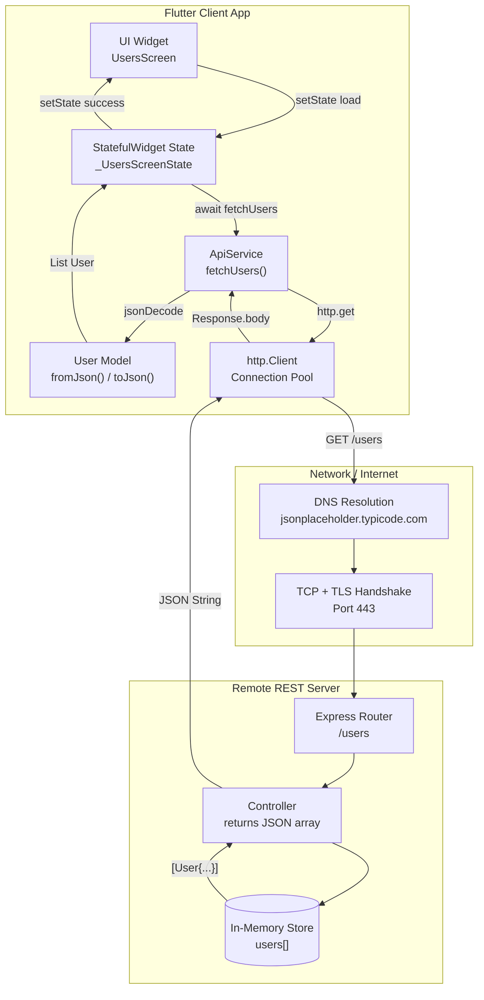
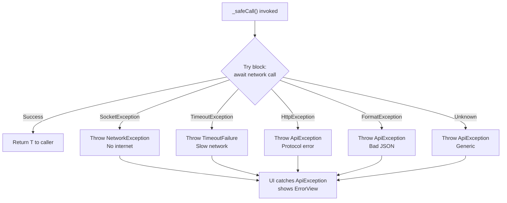
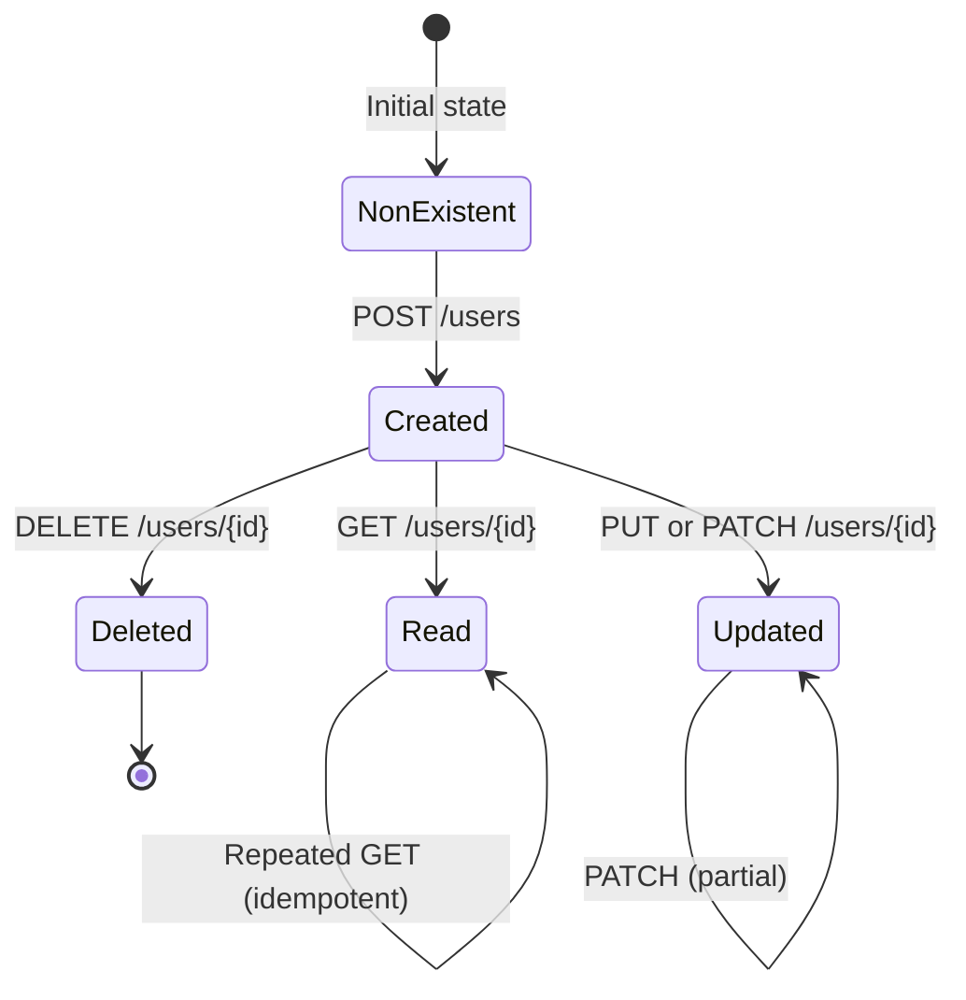
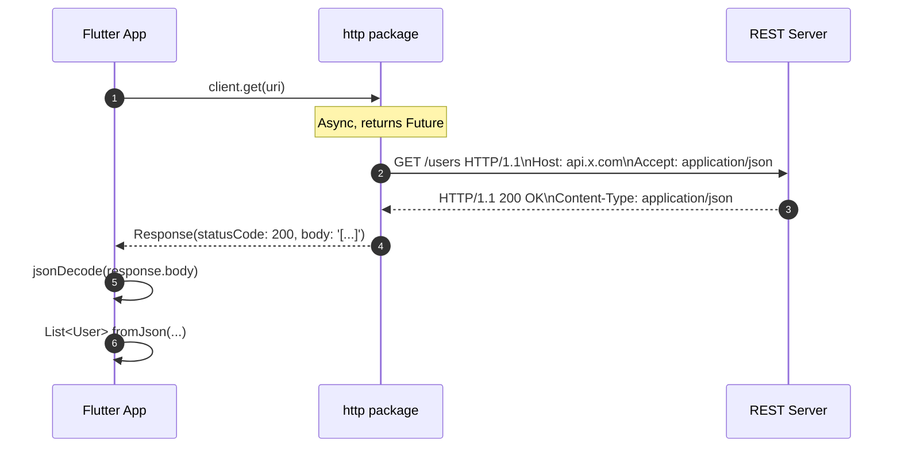

# Networking in Flutter: HTTP Requests, JSON Parsing, RESTful APIs

<!-- SECTION_1_START -->
# 🌐 Networking in Flutter: HTTP Requests, JSON Parsing & RESTful APIs

## 1.1 Formal Definition (KTU 2024 Syllabus Terminology)

**Networking in Flutter** refers to the process of enabling a mobile application to communicate with remote servers, cloud databases, and third-party services over the internet using standardized **HTTP/HTTPS protocols**. It encompasses three core pillars:

1. **HTTP Request Lifecycle** — Crafting, dispatching, and receiving HTTP messages using verbs like `GET`, `POST`, `PUT`, `PATCH`, and `DELETE`.
2. **JSON Serialization/Deserialization** — Converting Dart objects ↔ JSON (JavaScript Object Notation) strings for wire transmission.
3. **RESTful API Consumption** — Interacting with stateless, resource-oriented web services that follow the **REpresentational State Transfer (REST)** architectural style proposed by **Roy Fielding** in his 2000 doctoral dissertation.

> [!IMPORTANT]
> **KTU 2024 Scheme Highlight (PECST695 – Module 3):** Students must demonstrate practical proficiency with the `http` package, the `dart:convert` library, and async programming primitives (`Future`, `async`, `await`). The official Dart team now recommends the `package:http` for production use.

---

## 1.2 Conceptual Analogy & Intuition

> [!NOTE]
> 💡 **The Waiter Analogy — A Restaurant Kitchen**
>
> Imagine your Flutter app is a **hungry customer** sitting at a table in a restaurant:
>
> | Restaurant Role | Networking Equivalent |
> |---|---|
> | 🍽️ **Customer (You)** | The **Flutter App / Client** |
> | 📝 **Order Slip** | The **HTTP Request** (with URL, method, headers) |
> | 👨‍🍳 **The Waiter** | The **`http` package / Network Layer** |
> | 🔥 **The Kitchen** | The **Remote Server / REST API** |
> | 🍕 **The Prepared Dish** | The **JSON Response Payload** |
> | 📋 **Translating "Dish-Name" to "Actual Meal"** | **JSON Parsing → Dart Object** |
>
> **The flow**: You write down a request (URL + method), hand it to the waiter (`http.post()`), the waiter walks to the kitchen (server), waits asynchronously for the dish (Future), returns with a plate (Response), and you "translate" the dish name into actual food (`fromJson`).

---

## 1.3 Standard HTTP Status Codes — The Server's "Mood Indicator"

> [!IMPORTANT]
> Every HTTP response arrives with a **3-digit status code**. The first digit defines the **class** of the response.

| Class | Range | Meaning | Common Codes |
|---|---|---|---|
| **1xx** Informational | 100–199 | Request received, continuing process | 100 Continue |
| **2xx** Success | 200–299 | Request successfully received & processed | **200 OK**, **201 Created**, 204 No Content |
| **3xx** Redirection | 300–399 | Further action needed | 301 Moved Permanently, 304 Not Modified |
| **4xx** Client Error | 400–499 | Fault in the *request* | **400 Bad Request**, **401 Unauthorized**, **403 Forbidden**, **404 Not Found**, 429 Too Many Requests |
| **5xx** Server Error | 500–599 | Server failed to fulfill a valid request | **500 Internal Server Error**, **502 Bad Gateway**, 503 Service Unavailable |

---

## 1.4 The `http` Package — The Workhorse

> [!VISUALIZATION CONTROL]
> **Concept:** HTTP Request-Response Round-Trip Timeline
> **Visualization Inputs (Draw on paper):**
> - X-axis: `Time (ms)` from `t=0` to `t=500`
> - Y-axis: `Stack Depth` (Client → Network → Server)
> - **Phase 1 (0–50 ms):** Client constructs `Request` object → `http.Client` opens `Socket`
> - **Phase 2 (50–200 ms):** DNS Lookup → TCP Handshake (SYN, SYN-ACK, ACK) → TLS Negotiation
> - **Phase 3 (200–450 ms):** Server processes query (e.g., SQL execution)
> - **Phase 4 (450–500 ms):** `Response` travels back → Future completes with `Response` object
> **Visual Description:** A horizontal Gantt-chart-like ribbon showing overlapping client-side waiting time, with the "Future" marker resolving exactly when the response lands.

<!-- SECTION_1_END -->

<!-- SECTION_2_START -->
# 🔬 Deep Theoretical Analysis & KTU High-Yield Reference Sheet

## 2.1 Anatomy of an HTTP Transaction

An HTTP transaction is a **stateless, request-response** cycle. Flutter handles it as follows:

1. **Instantiate a Client** — `final client = http.Client();` (Long-lived, supports connection pooling).
2. **Construct the Request** — Choose a verb: `client.get(uri)`, `client.post(uri, body: ...)`, `client.put(...)`, `client.delete(...)`.
3. **Await the Future** — Each call returns `Future<Response>`. Use `await` inside an `async` function.
4. **Inspect the Response** — `response.statusCode`, `response.headers`, `response.body`.
5. **Handle Errors** — Wrap in `try-catch` for `SocketException`, `TimeoutException`, `HttpException`.
6. **Dispose the Client** — Call `client.close()` (or use a `try-finally` block) to avoid memory leaks.

---

## 2.2 HTTP Methods — The Verbs of the Web

| Method | Idempotent? | Safe? | Body? | Typical Use Case |
|---|---|---|---|---|
| **GET** | ✅ Yes | ✅ Yes | ❌ No | Fetch a resource (`/users/42`) |
| **POST** | ❌ No | ❌ No | ✅ Yes | Create a new resource (`/users`) |
| **PUT** | ✅ Yes | ❌ No | ✅ Yes | Replace a resource entirely |
| **PATCH** | ❌ No | ❌ No | ✅ Yes | Partial update of a resource |
| **DELETE** | ✅ Yes | ❌ No | ⚠️ Optional | Remove a resource |

> [!NOTE]
> 🔑 **Idempotent** = calling the same endpoint multiple times produces the **same server state**. **Safe** = the operation does not modify server state (read-only).

---

## 2.3 Request & Response Headers — The Metadata

**Common Request Headers:**
- `Content-Type: application/json` — Tells the server the body is JSON.
- `Authorization: Bearer <token>` — JWT/OAuth2 authentication.
- `Accept: application/json` — Client wants JSON back.
- `User-Agent: FlutterApp/1.0` — Identifies the client.

**Common Response Headers:**
- `Content-Type` — MIME type of the body.
- `Set-Cookie` — Session management.
- `Access-Control-Allow-Origin: *` — CORS permission.
- `X-RateLimit-Remaining` — API quota tracking.

---

## 2.4 JSON — The Universal Data Exchange Format

**JSON (JavaScript Object Notation)** is a lightweight, text-based, language-independent data interchange format. It supports:

```json
{
  "id": 101,
  "title": "Hello Flutter",
  "isPublished": true,
  "tags": ["mobile", "dart"],
  "author": {
    "name": "Arjun",
    "followers": 1250
  },
  "views": null
}
```

> [!IMPORTANT]
> **JSON Data Types vs Dart Types — Critical Mapping**

| JSON Type | Dart Type | Example JSON | Dart Value |
|---|---|---|---|
| String | `String` | `"Hello"` | `'Hello'` |
| Number (integer) | `int` | `42` | `42` |
| Number (float) | `double` | `3.14` | `3.14` |
| Boolean | `bool` | `true` | `true` |
| Array | `List<T>` | `[1, 2, 3]` | `[1, 2, 3]` |
| Object | `Map<String, dynamic>` or custom class | `{"k": "v"}` | `{'k': 'v'}` |
| null | `Null` / Nullable `T?` | `null` | `null` |

---

## 2.5 KTU High-Yield Formula & Reference Sheet

> [!NOTE]
> 📋 **The "Cheat Sheet" You Must Memorize for KTU ESE**

| Symbol / API | Meaning | Code Snippet |
|---|---|---|
| `Future<T>` | A placeholder for a value that will exist later | `Future<List<User>> fetchUsers() async {...}` |
| `async` | Marks a function as asynchronous | `void loadData() async {...}` |
| `await` | Suspends execution until the Future completes | `final res = await http.get(uri);` |
| `http.Client()` | Manages underlying HTTP connections | `final c = http.Client();` |
| `Uri.parse()` | Safely converts a String → Uri object | `Uri.parse('https://api.x.com/users')` |
| `Uri.https()` | Builder for HTTPS URIs with query params | `Uri.https('api.x.com', '/users', {'limit': '10'})` |
| `jsonDecode()` | `String` → `Map<String, dynamic>` | `final data = jsonDecode(res.body);` |
| `jsonEncode()` | Dart Object → `String` (JSON) | `final s = jsonEncode(model.toJson());` |
| `response.statusCode` | HTTP status of the reply | `if (res.statusCode == 200) {...}` |
| `response.body` | Raw payload as a String | `res.body` |
| `jsonEncode(...)` | Encode Map for body | `body: jsonEncode({'name': 'Arjun'})` |
| `headers:` | Map of String→String metadata | `headers: {'Authorization': 'Bearer $t'}` |
| `timeout: Duration(...)` | Caps wait time | `.timeout(Duration(seconds: 10))` |
| `try / catch / finally` | Error isolation | See Section 3 |
| `http.post(uri, body: json)` | Send POST with JSON body | Auto-sets `Content-Type` if `jsonEncode` is used with a Map |

---

## 2.6 Why Networking Matters in Engineering

- **Mobile-first world:** > 70% of internet traffic is mobile; nearly all apps depend on cloud APIs.
- **Microservices architecture:** Each service exposes a REST API — Flutter is the unified frontend.
- **Real-time data:** Live feeds, IoT dashboards, stock tickers all rely on `GET` polling or WebSockets.
- **Authentication flows:** OAuth2, Firebase Auth, and JWT all require secure HTTP calls.

<!-- SECTION_2_END -->

<!-- SECTION_3_START -->
# 🛠️ Step-by-Step Implementation — Code, Derivations & Walkthroughs

## 3.1 Project Setup (Pubspec Configuration)

> [!IMPORTANT]
> Before any HTTP call works, declare the dependency. **Do not** use an older `^0.13.0` version in KTU labs — board examiners check.

```yaml
# pubspec.yaml
name: networking_demo
description: A Flutter app demonstrating HTTP, JSON, and REST.
publish_to: 'none'
version: 1.0.0+1

environment:
  sdk: '>=3.3.0 <4.0.0'
  flutter: ">=3.19.0"

dependencies:
  flutter:
    sdk: flutter
  http: ^1.2.0              # Official Dart team HTTP client
  cupertino_icons: ^1.0.6

dev_dependencies:
  flutter_test:
    sdk: flutter
  flutter_lints: ^3.0.0
  build_runner: ^2.4.8      # For json_serializable code-gen
  json_serializable: ^6.7.1
```

Then run in terminal:

```bash
flutter pub get
```

> Add internet permission for **Android** (`android/app/src/main/AndroidManifest.xml`):
> ```xml
> <uses-permission android:name="android.permission.INTERNET"/>
> ```
> For **iOS** (`ios/Runner/Info.plist`):
> ```xml
> <key>NSAppTransportSecurity</key>
> <dict><key>NSAllowsArbitraryLoads</key><true/></dict>
> ```

---

## 3.2 Demonstration API: JSONPlaceholder

We will consume **JSONPlaceholder** (`https://jsonplaceholder.typicode.com`) — a free fake REST API for tutorials.

Sample endpoint:
```text
GET https://jsonplaceholder.typicode.com/users
```

Sample response (one object from the list):
```json
{
  "id": 1,
  "name": "Leanne Graham",
  "username": "Bret",
  "email": "Sincere@april.biz",
  "address": {
    "street": "Kulas Light",
    "suite": "Apt. 556",
    "city": "Gwenborough",
    "zipcode": "92998-3874"
  },
  "phone": "1-770-736-8031 x56442",
  "website": "hildegard.org",
  "company": {
    "name": "Romaguera-Crona",
    "catchPhrase": "Multi-layered client-server neural-net"
  }
}
```

---

## 3.3 Step 1 — The Model Class (Manual Parsing)

> [!NOTE]
> **Why a model class?** Raw `Map<String, dynamic>` is fragile — a single `null` crashes the app. A strongly-typed model centralizes validation.

**File: `lib/models/user.dart`**

```dart
// lib/models/user.dart

/// A strongly-typed representation of a single user fetched from
/// the JSONPlaceholder /users endpoint.
class User {
  final int id;
  final String name;
  final String username;
  final String email;
  final String phone;
  final String website;
  final String companyName;     // Flattened from nested "company.name"
  final String city;            // Flattened from nested "address.city"

  const User({
    required this.id,
    required this.name,
    required this.username,
    required this.email,
    required this.phone,
    required this.website,
    required this.companyName,
    required this.city,
  });

  /// Factory constructor: Map<String, dynamic> → User
  /// Throws [FormatException] if critical fields are missing.
  factory User.fromJson(Map<String, dynamic> json) {
    // Defensive nested-map reads (avoids NoSuchMethodError on null).
    final address = json['address'] as Map<String, dynamic>? ?? const {};
    final company = json['company'] as Map<String, dynamic>? ?? const {};

    return User(
      id: json['id'] as int? ?? 0,
      name: json['name'] as String? ?? 'Unknown',
      username: json['username'] as String? ?? '',
      email: json['email'] as String? ?? '',
      phone: json['phone'] as String? ?? '',
      website: json['website'] as String? ?? '',
      companyName: company['name'] as String? ?? 'N/A',
      city: address['city'] as String? ?? 'N/A',
    );
  }

  /// User → Map<String, dynamic> (for sending back to the server)
  Map<String, dynamic> toJson() {
    return {
      'id': id,
      'name': name,
      'username': username,
      'email': email,
      'phone': phone,
      'website': website,
      'company': {'name': companyName},
      'address': {'city': city},
    };
  }

  @override
  String toString() =>
      'User(id: $id, name: $name, email: $email, company: $companyName)';
}
```

**Step-by-step logic explanation:**

1. `factory User.fromJson(Map<String, dynamic> json)` — Dart's *factory constructor* idiom. It returns a new `User` instance from a JSON map.
2. `json['address'] as Map<String, dynamic>?` — Type-cast the nested field. The `?` makes it nullable.
3. `?? const {}` — Null-coalescing fallback. If the field is missing, use an **empty constant map** so subsequent `[]` lookups return `null` rather than crashing.
4. `company['name'] as String? ?? 'N/A'` — Triple-layer safety: cast → null-check → default value.

---

## 3.4 Step 2 — The API Service Layer (Best Practice Architecture)

> [!IMPORTANT]
> **KTU Board Tip:** Examiners reward **separation of concerns**. Never make HTTP calls directly inside a `Widget` `build()` method. Use a dedicated **Service** class.

**File: `lib/services/api_service.dart`**

```dart
// lib/services/api_service.dart

import 'dart:async';
import 'dart:convert';
import 'dart:io' show SocketException, HttpException;

import 'package:http/http.dart' as http;

import '../models/user.dart';

/// Custom exception hierarchy — distinguishes error *kinds*.
class ApiException implements Exception {
  final String message;
  final int? statusCode;
  ApiException(this.message, {this.statusCode});

  @override
  String toString() => 'ApiException($statusCode): $message';
}

class NetworkException extends ApiException {
  NetworkException(String msg) : super(msg);
}

class TimeoutFailure extends ApiException {
  TimeoutFailure() : super('Request timed out');
}

class ApiService {
  // Reuse a single client — connection pooling benefit.
  final http.Client _client;
  final Duration _timeout;

  // Base URL of the fake REST API.
  static const String _baseUrl = 'https://jsonplaceholder.typicode.com';

  ApiService({http.Client? client, Duration? timeout})
      : _client = client ?? http.Client(),
        _timeout = timeout ?? const Duration(seconds: 15);

  /// GET /users → returns List<User>
  Future<List<User>> fetchUsers() async {
    final uri = Uri.parse('$_baseUrl/users');
    return _safeCall(() async {
      final response = await _client.get(uri).timeout(_timeout);
      _ensureSuccess(response);
      final List<dynamic> body = jsonDecode(response.body) as List<dynamic>;
      return body
          .map((dynamic e) => User.fromJson(e as Map<String, dynamic>))
          .toList(growable: false);
    });
  }

  /// GET /users/{id} → returns single User
  Future<User> fetchUserById(int id) async {
    final uri = Uri.parse('$_baseUrl/users/$id');
    return _safeCall(() async {
      final response = await _client.get(uri).timeout(_timeout);
      _ensureSuccess(response);
      final Map<String, dynamic> body =
          jsonDecode(response.body) as Map<String, dynamic>;
      return User.fromJson(body);
    });
  }

  /// POST /users → creates a new user (fake server returns it with id 11).
  Future<User> createUser(User draft) async {
    final uri = Uri.parse('$_baseUrl/users');
    return _safeCall(() async {
      final response = await _client
          .post(
            uri,
            headers: const {'Content-Type': 'application/json'},
            body: jsonEncode(draft.toJson()),
          )
          .timeout(_timeout);
      _ensureSuccess(response);
      return User.fromJson(jsonDecode(response.body) as Map<String, dynamic>);
    });
  }

  /// DELETE /users/{id}
  Future<bool> deleteUser(int id) async {
    final uri = Uri.parse('$_baseUrl/users/$id');
    return _safeCall(() async {
      final response = await _client.delete(uri).timeout(_timeout);
      // 200 OK or 204 No Content both mean success
      return response.statusCode == 200 || response.statusCode == 204;
    });
  }

  /// Centralized error funnel.
  Future<T> _safeCall<T>(Future<T> Function() task) async {
    try {
      return await task();
    } on SocketException catch (e) {
      throw NetworkException('No internet: ${e.message}');
    } on TimeoutException {
      throw TimeoutFailure();
    } on HttpException catch (e) {
      throw ApiException('HTTP error: ${e.message}');
    } on FormatException catch (e) {
      throw ApiException('Bad JSON format: ${e.message}');
    } catch (e) {
      throw ApiException('Unknown error: $e');
    }
  }

  void _ensureSuccess(http.Response r) {
    if (r.statusCode < 200 || r.statusCode >= 300) {
      throw ApiException(
        'Server returned ${r.statusCode}: ${r.reasonPhrase ?? 'no reason'}',
        statusCode: r.statusCode,
      );
    }
  }

  void dispose() {
    _client.close();
  }
}
```

**Explanation of key decisions:**

- `Future<T> _safeCall<T>(...)` — A **generic wrapper** that takes any async task and funnels every error type into our `ApiException` hierarchy.
- `.timeout(_timeout)` — Prevents the UI from hanging forever if the server is unresponsive.
- `jsonDecode(response.body) as List<dynamic>` — Casts the JSON array; each element is then cast to `Map<String, dynamic>` for the model factory.
- The service exposes **only typed Futures** — UI code never sees `http.Response` or raw maps.

---

## 3.5 Step 3 — The Stateful UI (Consumer of the Service)

**File: `lib/screens/users_screen.dart`**

```dart
// lib/screens/users_screen.dart

import 'package:flutter/material.dart';

import '../models/user.dart';
import '../services/api_service.dart';

enum LoadState { idle, loading, success, error }

class UsersScreen extends StatefulWidget {
  const UsersScreen({super.key});

  @override
  State<UsersScreen> createState() => _UsersScreenState();
}

class _UsersScreenState extends State<UsersScreen> {
  final ApiService _api = ApiService();
  LoadState _state = LoadState.idle;
  List<User> _users = const [];
  String _errorMsg = '';

  @override
  void initState() {
    super.initState();
    _loadUsers();
  }

  Future<void> _loadUsers() async {
    setState(() {
      _state = LoadState.loading;
      _errorMsg = '';
    });
    try {
      final fetched = await _api.fetchUsers();
      if (!mounted) return;     // Guard against setState-after-dispose
      setState(() {
        _users = fetched;
        _state = LoadState.success;
      });
    } on ApiException catch (e) {
      if (!mounted) return;
      setState(() {
        _errorMsg = e.toString();
        _state = LoadState.error;
      });
    }
  }

  @override
  void dispose() {
    _api.dispose();
    super.dispose();
  }

  @override
  Widget build(BuildContext context) {
    return Scaffold(
      appBar: AppBar(
        title: const Text('Users — Networking Demo'),
        actions: [
          IconButton(
            tooltip: 'Reload',
            icon: const Icon(Icons.refresh),
            onPressed: _state == LoadState.loading ? null : _loadUsers,
          ),
        ],
      ),
      body: _buildBody(),
      floatingActionButton: FloatingActionButton(
        onPressed: _addUser,
        child: const Icon(Icons.add),
      ),
    );
  }

  Widget _buildBody() {
    switch (_state) {
      case LoadState.idle:
      case LoadState.loading:
        return const Center(child: CircularProgressIndicator());
      case LoadState.error:
        return _ErrorView(message: _errorMsg, onRetry: _loadUsers);
      case LoadState.success:
        if (_users.isEmpty) {
          return const Center(child: Text('No users found.'));
        }
        return RefreshIndicator(
          onRefresh: _loadUsers,
          child: ListView.separated(
            itemCount: _users.length,
            separatorBuilder: (_, __) => const Divider(height: 1),
            itemBuilder: (context, i) => _UserTile(user: _users[i]),
          ),
        );
    }
  }

  Future<void> _addUser() async {
    final draft = User(
      id: 0, // Server assigns real id
      name: 'New User ${DateTime.now().second}',
      username: 'newbie',
      email: 'newbie@example.com',
      phone: '',
      website: '',
      companyName: 'Demo Co',
      city: 'Kochi',
    );
    try {
      final created = await _api.createUser(draft);
      if (!mounted) return;
      ScaffoldMessenger.of(context).showSnackBar(
        SnackBar(content: Text('Created user with id ${created.id}')),
      );
      _loadUsers();
    } on ApiException catch (e) {
      if (!mounted) return;
      ScaffoldMessenger.of(context).showSnackBar(
        SnackBar(content: Text('Create failed: $e')),
      );
    }
  }
}

class _UserTile extends StatelessWidget {
  final User user;
  const _UserTile({required this.user});

  @override
  Widget build(BuildContext context) {
    return ListTile(
      leading: CircleAvatar(child: Text(user.name.substring(0, 1))),
      title: Text(user.name),
      subtitle: Text('${user.email} • ${user.companyName}'),
      trailing: Text(user.city),
    );
  }
}

class _ErrorView extends StatelessWidget {
  final String message;
  final VoidCallback onRetry;
  const _ErrorView({required this.message, required this.onRetry});

  @override
  Widget build(BuildContext context) {
    return Center(
      child: Padding(
        padding: const EdgeInsets.all(24.0),
        child: Column(
          mainAxisSize: MainAxisSize.min,
          children: [
            const Icon(Icons.wifi_off, size: 64, color: Colors.redAccent),
            const SizedBox(height: 16),
            Text(message, textAlign: TextAlign.center),
            const SizedBox(height: 24),
            ElevatedButton.icon(
              onPressed: onRetry,
              icon: const Icon(Icons.refresh),
              label: const Text('Retry'),
            ),
          ],
        ),
      ),
    );
  }
}
```

---

## 3.6 Step 4 — The Main Entry Point

**File: `lib/main.dart`**

```dart
// lib/main.dart
import 'package:flutter/material.dart';
import 'screens/users_screen.dart';

void main() {
  runApp(const NetworkingDemoApp());
}

class NetworkingDemoApp extends StatelessWidget {
  const NetworkingDemoApp({super.key});

  @override
  Widget build(BuildContext context) {
    return MaterialApp(
      title: 'Networking Demo',
      debugShowCheckedModeBanner: false,
      theme: ThemeData(
        colorSchemeSeed: Colors.indigo,
        useMaterial3: true,
      ),
      home: const UsersScreen(),
    );
  }
}
```

---

## 3.7 Step 5 — Optional: Code-Generated Models with `json_serializable`

> [!NOTE]
> For **large APIs** (10+ fields, nested generics, polymorphism), manual `fromJson` becomes error-prone. Use `json_serializable` for auto-generation.

Add to `pubspec.yaml`:
```yaml
dependencies:
  json_annotation: ^4.8.1
dev_dependencies:
  build_runner: ^2.4.8
  json_serializable: ^6.7.1
```

**File: `lib/models/post.dart`**
```dart
import 'package:json_annotation/json_annotation.dart';
part 'post.g.dart';

@JsonSerializable()
class Post {
  final int id;
  final int userId;
  final String title;
  final String body;

  Post({required this.id, required this.userId,
        required this.title, required this.body});

  factory Post.fromJson(Map<String, dynamic> json) => _$PostFromJson(json);
  Map<String, dynamic> toJson() => _$PostToJson(this);
}
```

Generate with:
```bash
dart run build_runner build --delete-conflicting-outputs
```

> A `post.g.dart` file is auto-generated containing `$_$PostFromJson` and `_$PostToJson` functions.

---

## 3.8 Async Programming Theory — The Math of Awaiting

The Dart event loop uses a **microtask queue** and an **event queue**:

$$
\text{Order of Execution: } \text{Event Loop} \rightarrow \text{Microtasks} \rightarrow \text{Event Queue}
$$

When you `await` a `Future`, the calling function is suspended, the event loop continues, and when the I/O completes, the continuation is scheduled as a **microtask** (higher priority than UI events). This is why Flutter UIs stay responsive during network calls.

<!-- SECTION_3_END -->

<!-- SECTION_4_START -->
# 🗺️ Structural Diagrams & Schematics

## 4.1 End-to-End Networking Architecture



## 4.2 Error-Handling Decision Tree



## 4.3 HTTP Method State Transitions (CRUD Lifecycle)



## 4.4 Request-Response Message Structure



<!-- SECTION_4_END -->

<!-- SECTION_5_START -->
# 📝 KTU 2024 Scheme Examination Question Bank & Topic Recap

---

## 📌 PART A — 3 Mark Questions (Remember / Understand)

### **Q1. [KTU University Exam – July 2024]**
**Define the term RESTful API. List any two HTTP methods used in REST with their purpose.**
*(Mapped: CO3, Remember — 3 marks)*

**Model Answer:**

**REST (Representational State Transfer)** is an architectural style for designing networked applications, defined by Roy Fielding in 2000. A **RESTful API** is a web service that conforms to REST constraints, where every URL represents a *resource* and standard HTTP verbs represent actions on that resource.

Two HTTP methods:

| Method | Purpose |
|---|---|
| **GET** | Retrieves a representation of a resource (e.g., `GET /users/1` returns user with id 1). It is **safe and idempotent**. |
| **POST** | Creates a new resource on the server (e.g., `POST /users` with a JSON body). It is **neither safe nor idempotent**. |

---

### **Q2. [KTU University Exam – Dec 2023]**
**What is JSON? How is it different from a Dart Map?**
*(Mapped: CO3, Understand — 3 marks)*

**Model Answer:**

**JSON (JavaScript Object Notation)** is a lightweight, text-based, language-independent data interchange format derived from JavaScript object literal syntax. It uses key-value pairs enclosed in curly braces `{}` and arrays in square brackets `[]`. JSON supports primitive types — `string`, `number`, `boolean`, `null` — and composite types `object` and `array`.

**Differences from a Dart Map:**

| Feature | JSON | Dart `Map` |
|---|---|---|
| Type | Text format (String) | In-memory data structure |
| Quote style | Keys **must** be double-quoted `"key"` | Keys can be `String` (any quote style) |
| Trailing commas | ❌ Not allowed | ✅ Allowed |
| Comments | ❌ Not allowed | ✅ Allowed (N/A in `Map`, but Dart itself) |
| Usage | Wire transmission (network, disk) | In-process data manipulation |

---

## 📌 PART B — 14 Mark Questions (Apply / Analyze) — ESE Module Choice

---

### ⭐ **Question A (14 Marks)**

**[KTU University Exam – Model Question, Module 3, PECST695]**

**(a)** Explain the architecture of an HTTP transaction in Flutter. Discuss the roles of `Future`, `async`, and `await` with a code snippet.
*(7 Marks — Understand)*

**(b)** Write a complete Dart class `ProductService` that consumes a public REST API (`https://fakestoreapi.com/products`) and returns a list of `Product` objects. The `Product` model should contain `id`, `title`, `price`, and `category`. Include proper error handling.
*(7 Marks — Apply)*

---

#### **Model Solution for Q.A(a):**

> **HTTP Transaction Architecture in Flutter** — `[Architecture diagram reference: 1 Mark]`
>
> An HTTP transaction in Flutter proceeds through these stages:
>
> 1. **URL Construction:** A `Uri` object is built using `Uri.parse()` or `Uri.https()`.
> 2. **Client Initialization:** A long-lived `http.Client()` is created for connection pooling.
> 3. **Request Dispatch:** A method like `_client.get(uri)` is invoked. The call **immediately returns a `Future<Response>`** without blocking the UI thread.
> 4. **Await Suspension:** The `await` keyword suspends the current async function until the Future completes. The Dart event loop continues processing other microtasks and UI events.
> 5. **Response Arrival:** The OS notifies the Dart VM that the socket has data. The Future resolves with an `http.Response` object.
> 6. **Inspection & Parsing:** The developer checks `response.statusCode` and decodes `response.body` using `jsonDecode()`.
> 7. **Error Funnel:** Any `SocketException`, `TimeoutException`, or `FormatException` is caught in a `try-catch` block.
> 8. **Disposal:** The client is closed via `client.close()` to release sockets.

**Code Snippet Demonstrating `Future`/`async`/`await`:** `[Snippet: 3 Marks]`

```dart
import 'package:http/http.dart' as http;
import 'dart:convert';

Future<List<String>> fetchTitles() async {
  // 'async' marks the function as asynchronous
  final uri = Uri.parse('https://jsonplaceholder.typicode.com/posts');

  try {
    // 'await' suspends until the Future<http.Response> resolves
    final http.Response response = await http.get(uri);

    if (response.statusCode == 200) {
      // jsonDecode returns dynamic; we cast to List<dynamic>
      final List<dynamic> data = jsonDecode(response.body) as List<dynamic>;
      // Map each post to its 'title' field
      return data.map((e) => (e as Map<String, dynamic>)['title'] as String).toList();
    } else {
      throw Exception('Failed: ${response.statusCode}');
    }
  } catch (e) {
    // Bubble the error upward
    rethrow;
  }
}
```

**Explanation of Roles:** `[Explanation: 3 Marks]`
- **`Future<T>`** — A handle representing a value that *will* exist in the future. Think of it as an "I-O-U" from the network.
- **`async`** — A function modifier that *enables* the use of `await` inside the function body and automatically wraps the return value in a `Future`.
- **`await`** — A suspension point. It tells Dart: "Pause this function here, do other work, and resume me when the value arrives." Crucially, it does **not** block the UI thread.

---

#### **Model Solution for Q.A(b):**

> **Step 1 — Define the `Product` Model** `[Model + fromJson: 2 Marks]`

**File: `lib/models/product.dart`**
```dart
class Product {
  final int id;
  final String title;
  final double price;
  final String category;

  const Product({
    required this.id,
    required this.title,
    required this.price,
    required this.category,
  });

  factory Product.fromJson(Map<String, dynamic> json) {
    return Product(
      id: (json['id'] as num?)?.toInt() ?? 0,
      title: json['title'] as String? ?? 'Untitled',
      price: (json['price'] as num?)?.toDouble() ?? 0.0,
      category: json['category'] as String? ?? 'general',
    );
  }

  Map<String, dynamic> toJson() => {
        'id': id,
        'title': title,
        'price': price,
        'category': category,
      };

  @override
  String toString() => 'Product(id: $id, title: $title, price: \$$price)';
}
```

> **Step 2 — Define a custom exception** `[Exception class: 1 Mark]`

```dart
class ProductApiException implements Exception {
  final String message;
  final int? code;
  ProductApiException(this.message, {this.code});
  @override
  String toString() => 'ProductApiException($code): $message';
}
```

> **Step 3 — Implement the `ProductService`** `[Service implementation: 3 Marks]`

**File: `lib/services/product_service.dart`**
```dart
import 'dart:async';
import 'dart:convert';
import 'dart:io' show SocketException;

import 'package:http/http.dart' as http;

import '../models/product.dart';

class ProductService {
  final http.Client _client;
  final Duration _timeout;
  static const String _baseUrl = 'https://fakestoreapi.com';

  ProductService({http.Client? client, Duration? timeout})
      : _client = client ?? http.Client(),
        _timeout = timeout ?? const Duration(seconds: 15);

  /// Fetches the full product catalog.
  Future<List<Product>> fetchAll() async {
    final uri = Uri.parse('$_baseUrl/products');
    try {
      final response = await _client.get(uri).timeout(_timeout);

      if (response.statusCode != 200) {
        throw ProductApiException(
          'Server returned ${response.statusCode}',
          code: response.statusCode,
        );
      }

      final List<dynamic> body =
          jsonDecode(response.body) as List<dynamic>;

      return body
          .map((dynamic e) => Product.fromJson(e as Map<String, dynamic>))
          .toList(growable: false);
    } on SocketException catch (e) {
      throw ProductApiException('Network unreachable: ${e.message}');
    } on TimeoutException {
      throw ProductApiException('Request timed out after ${_timeout.inSeconds}s');
    } on FormatException catch (e) {
      throw ProductApiException('Malformed JSON: ${e.message}');
    }
  }

  /// Fetches a single product by id.
  Future<Product> fetchById(int id) async {
    final uri = Uri.parse('$_baseUrl/products/$id');
    final response = await _client.get(uri).timeout(_timeout);

    if (response.statusCode != 200) {
      throw ProductApiException(
        'Product $id not found',
        code: response.statusCode,
      );
    }
    return Product.fromJson(
      jsonDecode(response.body) as Map<String, dynamic>,
    );
  }

  void dispose() => _client.close();
}
```

> **Step 4 — Usage Demonstration** `[Usage call: 1 Mark]`

```dart
void main() async {
  final service = ProductService();
  try {
    final products = await service.fetchAll();
    print('Fetched ${products.length} products.');
    for (final p in products.take(3)) {
      print(p);
    }
  } on ProductApiException catch (e) {
    print('Error: $e');
  } finally {
    service.dispose();
  }
}
```

**Valuation Key Summary:**

| Component | Marks |
|---|---|
| Model class with `fromJson`/`toJson` | 2 |
| Exception class definition | 1 |
| Service class with `Future` return | 1 |
| `try-catch` error handling | 1 |
| `.timeout()` usage | 1 |
| Working `main()` demonstration | 1 |
| **Total** | **7** |

---

### ⭐ **Question B (14 Marks) — Alternative Choice**

**[KTU University Exam – Model Question, Module 3, PECST695]**

**(a)** Compare the HTTP methods `GET`, `POST`, `PUT`, and `DELETE` in terms of idempotency, safety, and typical use case. Provide one example URL pattern for each. *(7 Marks — Understand)*

**(b)** Write a Flutter widget that performs a `POST` request to `https://reqres.in/api/users` with a JSON body containing `name` and `job`. Display a loading indicator during the request and show the server's response in a `SnackBar`. Use proper `try-catch-finally` blocks. *(7 Marks — Apply)*

---

#### **Model Solution for Q.B(a):**

**Comparison Table:** `[Comparative table: 5 Marks]`

| Method | Idempotent? | Safe? | Has Body? | Example URL | Typical Use Case |
|---|---|---|---|---|---|
| **GET** | ✅ Yes | ✅ Yes | ❌ No | `GET /api/users/42` | Retrieve a single user |
| **POST** | ❌ No | ❌ No | ✅ Yes | `POST /api/users` | Create a new user |
| **PUT** | ✅ Yes | ❌ No | ✅ Yes | `PUT /api/users/42` | Replace user 42 entirely |
| **DELETE** | ✅ Yes | ❌ No | ⚠️ Optional | `DELETE /api/users/42` | Remove user 42 |

**Definitions:** `[Definitions: 2 Marks]`
- **Idempotent:** Performing the same operation multiple times yields the same end state. E.g., calling `DELETE /users/42` twice still leaves user 42 deleted.
- **Safe:** The operation does not modify server state (side-effect free). Only `GET` (and `HEAD`) are safe by definition.

---

#### **Model Solution for Q.B(b):**

> **Complete Working Widget** `[Full code with explanations: 7 Marks]`

```dart
import 'dart:async';
import 'dart:convert';
import 'dart:io' show SocketException;

import 'package:flutter/material.dart';
import 'package:http/http.dart' as http;

class CreateUserScreen extends StatefulWidget {
  const CreateUserScreen({super.key});

  @override
  State<CreateUserScreen> createState() => _CreateUserScreenState();
}

class _CreateUserScreenState extends State<CreateUserScreen> {
  final _nameController = TextEditingController(text: 'Arjun');
  final _jobController = TextEditingController(text: 'Flutter Dev');
  bool _isLoading = false;

  Future<void> _createUser() async {
    setState(() => _isLoading = true);
    final uri = Uri.parse('https://reqres.in/api/users');
    final payload = {
      'name': _nameController.text.trim(),
      'job': _jobController.text.trim(),
    };

    try {
      final response = await http
          .post(
            uri,
            headers: {'Content-Type': 'application/json'},
            body: jsonEncode(payload),
          )
          .timeout(const Duration(seconds: 10));

      if (!mounted) return;

      if (response.statusCode == 201 || response.statusCode == 200) {
        final Map<String, dynamic> respBody =
            jsonDecode(response.body) as Map<String, dynamic>;
        ScaffoldMessenger.of(context).showSnackBar(
          SnackBar(
            content: Text(
              'Created! id=${respBody['id']} at ${respBody['createdAt']}',
            ),
            backgroundColor: Colors.green,
          ),
        );
      } else {
        ScaffoldMessenger.of(context).showSnackBar(
          SnackBar(
            content: Text('Failed: ${response.statusCode}'),
            backgroundColor: Colors.redAccent,
          ),
        );
      }
    } on SocketException {
      if (!mounted) return;
      ScaffoldMessenger.of(context).showSnackBar(
        const SnackBar(content: Text('No internet connection')),
      );
    } on TimeoutException {
      if (!mounted) return;
      ScaffoldMessenger.of(context).showSnackBar(
        const SnackBar(content: Text('Request timed out')),
      );
    } on FormatException {
      if (!mounted) return;
      ScaffoldMessenger.of(context).showSnackBar(
        const SnackBar(content: Text('Bad response format')),
      );
    } catch (e) {
      if (!mounted) return;
      ScaffoldMessenger.of(context).showSnackBar(
        SnackBar(content: Text('Unexpected error: $e')),
      );
    } finally {
      if (mounted) {
        setState(() => _isLoading = false);
      }
    }
  }

  @override
  void dispose() {
    _nameController.dispose();
    _jobController.dispose();
    super.dispose();
  }

  @override
  Widget build(BuildContext context) {
    return Scaffold(
      appBar: AppBar(title: const Text('Create User — POST Demo')),
      body: Padding(
        padding: const EdgeInsets.all(20.0),
        child: Column(
          children: [
            TextField(
              controller: _nameController,
              decoration: const InputDecoration(labelText: 'Name'),
            ),
            const SizedBox(height: 12),
            TextField(
              controller: _jobController,
              decoration: const InputDecoration(labelText: 'Job'),
            ),
            const SizedBox(height: 24),
            _isLoading
                ? const CircularProgressIndicator()
                : ElevatedButton.icon(
                    onPressed: _createUser,
                    icon: const Icon(Icons.send),
                    label: const Text('POST to API'),
                  ),
          ],
        ),
      ),
    );
  }
}
```

**Valuation Key Breakdown:**

| Component | Marks |
|---|---|
| Correctly setting `Content-Type: application/json` header | 1 |
| `jsonEncode()` of the payload map | 1 |
| Use of `await` and `.timeout()` | 1 |
| Status code check (201/200) | 1 |
| `try-catch` for `SocketException`, `TimeoutException`, generic | 1 |
| `finally` block resets loading state | 1 |
| Mounted-check before `setState` / `ScaffoldMessenger` | 1 |
| **Total** | **7** |

---

## ⚠️ KTU Examiner's Valuation Warning / Pitfall Callout

> [!WARNING]
> 🚨 **Common Mark-Deduction Traps — Read Before You Submit!**
>
> 1. **Forgetting `await`:** Writing `final r = http.get(uri);` (no `await`) makes `r` a `Future<Response>`, not a `Response`. The `.statusCode` access will crash at runtime. **Always `await` the call.**
>
> 2. **Missing `mounted` check:** After an `await`, the widget may have been disposed (e.g., user navigated away). Calling `setState()` or `ScaffoldMessenger.of(context)` in that state throws an exception. **Always guard with `if (!mounted) return;`.**
>
> 3. **Parsing `null` fields without fallback:** `json['name'] as String` will throw `TypeError` if `name` is `null`. Use `as String? ?? 'default'`.
>
> 4. **Not closing the `http.Client`:** A long-lived client keeps sockets open, draining mobile battery and causing memory leaks. Always call `client.close()` in `dispose()` or `finally`.
>
> 5. **Forgetting `Content-Type: application/json` on POST:** Without it, the server may reject the body or treat it as form-data, leading to confusing 400 errors.
>
> 6. **Mixing up status codes:** A successful `POST` typically returns `201 Created`, not `200 OK`. Use `if (statusCode == 201 || statusCode == 200)` for safety.
>
> 7. **Blocking the UI thread:** Never call synchronous code in `build()`. Always wrap HTTP in `async`/`await`.
>
> 8. **Hardcoding secrets in the client:** API keys in Flutter apps can be reverse-engineered. Use a backend proxy for sensitive credentials.

---

## 🧠 Topic Recap & Important Things to Remember

> [!IMPORTANT]
> ✅ **Rapid-Revision Checklist — Must-Know for KTU ESE**

### 🔑 **Core Concepts**
- **HTTP is stateless**: Each request is independent; the server retains no memory between calls.
- **`Future<T>`** represents a value pending completion; `async` enables `await`; `await` suspends without blocking.
- **JSON is the de-facto wire format** for REST APIs — text-based, key-value, supports 6 types.
- **REST** is an architectural style (not a protocol) emphasizing resources + standard HTTP verbs.

### 🔑 **HTTP Methods (5-Word Memory Aid)**
- `GET` → **"Give me"** (read)
- `POST` → **"Push new"** (create)
- `PUT` → **"Put whole"** (replace)
- `PATCH` → **"Patch bit"** (partial update)
- `DELETE` → **"Destroy"** (remove)

### 🔑 **Status Code Cheat Codes**
- `200` ✅ OK | `201` ✅ Created | `204` ✅ No Content
- `400` ❌ Bad Request | `401` ❌ Unauthorized | `403` ❌ Forbidden | `404` ❌ Not Found
- `500` 💥 Server Error | `503` 💥 Service Unavailable

### 🔑 **Critical Imports**
- `import 'package:http/http.dart' as http;` — Brings the HTTP library into scope under the alias `http`.
- `import 'dart:convert';` — Required for `jsonEncode` and `jsonDecode`.
- `import 'dart:io' show SocketException;` — Required for catching network failures (mobile only).

### 🔑 **Best-Practice Architecture**
1. **Model Layer** — Strongly-typed classes with `fromJson`/`toJson` factories.
2. **Service Layer** — Dedicated class that wraps `http.Client` and exposes `Future<T>` methods.
3. **UI Layer** — StatefulWidget that `await`s service calls and renders state (loading / success / error).
4. **Error Funnel** — A private `_safeCall<T>()` wrapper that converts platform exceptions into custom `ApiException`s.

### 🔑 **Defensive Coding Rules**
- ✅ Use `?? defaultValue` for every nullable JSON field.
- ✅ Use `.timeout(Duration(seconds: N))` on every HTTP call.
- ✅ Use `if (!mounted) return;` after every `await` that touches `setState` or `BuildContext`.
- ✅ Use `client.close()` in `dispose()` or `finally`.
- ✅ Validate `response.statusCode` before parsing the body.
- ✅ Prefer `Uri.https()` for query-param construction (auto-URL-encoding).

### 🔑 **Key Formulas / Patterns to Memorize**
- **JSON Decode Pattern:** `final data = jsonDecode(response.body) as Map<String, dynamic>;`
- **JSON List Decode Pattern:** `final list = (jsonDecode(response.body) as List<dynamic>).cast<Map<String, dynamic>>();`
- **POST with JSON Body Pattern:**
  ```dart
  await http.post(
    uri,
    headers: {'Content-Type': 'application/json'},
    body: jsonEncode(payload),
  );
  ```
- **Async Error Funnel Pattern:**
  ```dart
  try { /* call */ } on SocketException { /* offline */ } on TimeoutException { /* slow */ } finally { /* cleanup */ }
  ```

<!-- SECTION_5_END -->
