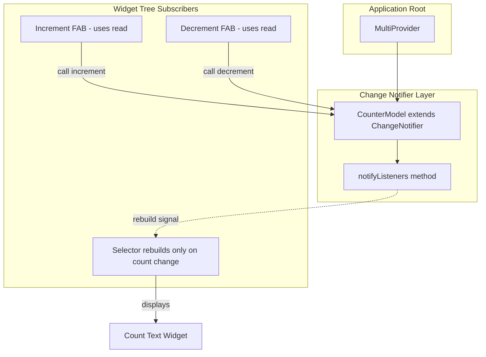
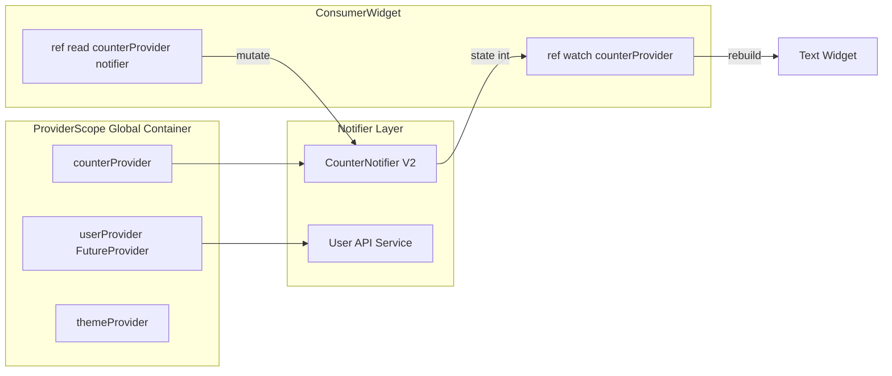
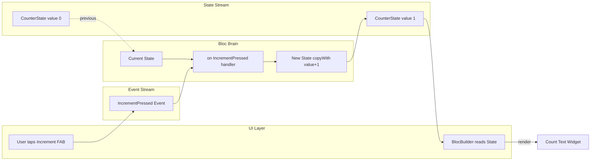
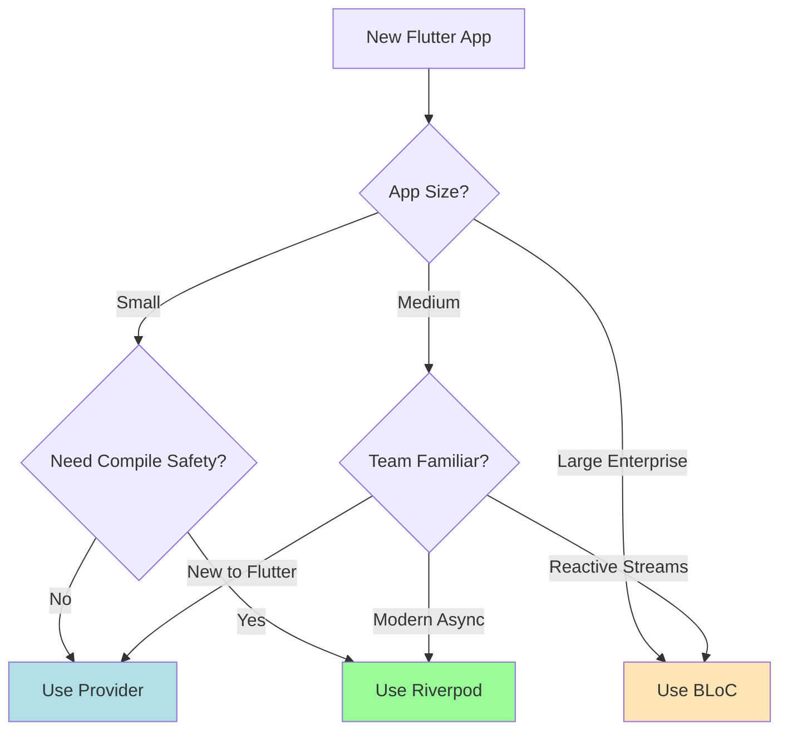
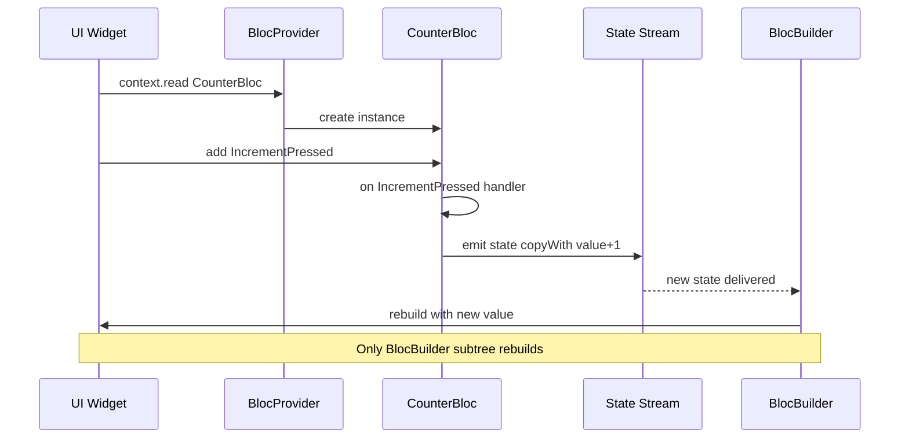

# State Management in Flutter: Provider, Riverpod, and BLoC

<!-- SECTION_1_START -->
# State Management in Flutter: Provider, Riverpod, and BLoC

## 1.1 Formal Definition (KTU 2024 Syllabus Terminology)

> [!NOTE]
> **State Management** in Flutter is the systematic approach to managing, propagating, and updating the *state* (mutable data) of widgets across a widget tree in a predictable, testable, and scalable manner. State refers to any data that can change during the lifecycle of a widget and influences the UI rebuild behavior.

In Flutter, the framework itself is **declarative** — you describe the UI as a function of the current state:

$$\text{UI} = f(\text{State})$$

When state changes, the framework rebuilds the affected widgets. **State Management solutions** (Provider, Riverpod, BLoC) are architectural patterns that determine *how*, *where*, and *when* this state is read, mutated, and broadcast to the UI.

The three paradigms covered in this module are:

| Pattern | Origin | Core Philosophy |
|---|---|---|
| **Provider** | Official Flutter team (Remi Rousselet) | Lightweight dependency injection + `InheritedWidget` wrapper |
| **Riverpod** | Remi Rousselet (rewrite of Provider) | Compile-safe, testable, no `BuildContext` dependency |
| **BLoC** | Felix Angelov / Google | Business Logic Component — pure Dart events \& streams |

## 1.2 Conceptual Analogy / Intuition

> [!IMPORTANT]
> **Think of state management as a "central notice board" in a college office.**

- Without a notice board (raw `setState`): every student who needs new information must personally visit each professor — chaotic, slow, doesn't scale.
- **Provider** = A notice board placed in the corridor. Anyone in the building can glance at it (`context.watch`) and stick updates on it (`notifyListeners`). The board is *inherited* from the building itself.
- **Riverpod** = A *smart digital notice board* with multiple, addressable panels. You don't need to be in the building — you tune in to a specific channel (`ref.watch(myProvider)`). Panels are indexed by name, so duplicates and missing contexts are impossible.
- **BLoC** = A *fully procedural bureaucratic office*. Every request is written on a slip (Event), processed by a clerk (BLoC), and posted on the official board (Stream). Strict chain of command, no shortcuts.

> [!TIP]
> **The Three Core Questions Every Flutter Dev Must Ask:**
> 1. *Where* does the data live? (Model / State class)
> 2. *How* is it mutated? (Method / Event / Notifier)
> 3. *How* is the UI notified? (Listener / Consumer / `BlocBuilder`)

## 1.3 GeoGebra / Visualization Note

> [!VISUALIZATION CONTROL]
> **Concept:** State propagation wave through a widget tree (Provider)
> **GeoGebra / Desmos Input Equations:**
> * `f(x) = e^{-0.4 x} \cdot \cos(x)` — the *decay curve of rebuild scope* as we move up the widget tree
> * `A = (0, 1)`, `B = (3, 0.3)`, `C = (6, 0.05)` — points representing `ChangeNotifier` → `Consumer` → leaf widget rebuild distance
> **Visual Description:** Imagine the y-axis as the *intensity of rebuild impact* and the x-axis as the *tree depth* from the provider. A sharp exponential decay shows that proper scoping (using `Consumer` / `Selector`) contains rebuilds locally instead of triggering the entire tree.

---
<!-- SECTION_1_END -->

<!-- SECTION_2_START -->
# Deep Theoretical Analysis & KTU High-Yield Formula Sheet

## 2.1 Why State Management Cannot Be Ignored

In a trivial `setState` approach, a counter app with 50 widgets may rebuild all 50 on every press. In a production app (e.g., a banking dashboard) this means:
- **Jank & frame drops** (dropped from 60 → 30 FPS)
- **Lost scroll position**
- **Memory leaks** from uncontrolled listeners
- **Untestable business logic** buried inside widgets

State management patterns solve this via:
1. **Separation of concerns** — UI ≠ Business logic
2. **Reactive rebuilds** — Only subscribed widgets rebuild
3. **Testability** — Logic can be unit-tested without `WidgetTester`
4. **Dependency injection** — Loosely coupled architecture

## 2.2 Provider — Theoretical Breakdown

**Provider** is a wrapper around `InheritedWidget` that exposes a value down the tree and rebuilds dependents on change.

**Key Components:**
- `ChangeNotifier` — Holds state, calls `notifyListeners()` on mutation
- `ChangeNotifierProvider` — Injects a `ChangeNotifier` into the tree
- `Provider.of<T>(context)` — Imperative read (with `listen: true/false`)
- `Consumer<T>` — Rebuilds only its child on change
- `Selector<T, S>` — Rebuilds only when a *derived* value changes
- `MultiProvider` — Injects multiple providers efficiently
- `ProxyProvider` — Derives a provider value from other providers

**Lifecycle:**
$$\text{Create} \rightarrow \text{Listen} \rightarrow \text{Notify} \rightarrow \text{Rebuild Dependents} \rightarrow \text{Dispose}$$

## 2.3 Riverpod — Theoretical Breakdown

**Riverpod** is a compile-safe rewrite of Provider. It removes the `BuildContext` dependency by using a global container (`ProviderContainer`).

**Key Components:**
- `Provider` — Immutable, synchronous value
- `StateProvider` — Simple mutable state (replacement for `ValueNotifier`)
- `ChangeNotifierProvider` — Wraps a `ChangeNotifier`
- `FutureProvider` / `StreamProvider` — Async state
- `Notifier` / `AsyncNotifier` — Modern declarative API (Riverpod 2.x)
- `ConsumerWidget` / `ConsumerStatefulWidget` — Read with `ref.watch/read/listen`
- `ProviderScope` — Root container (replaces `MultiProvider`)

**Why Riverpod?**
- ❌ No `BuildContext` required → can be used outside widgets
- ✅ Compile-time safety → no runtime "ProviderNotFoundException"
- ✅ Auto-disposing by default → memory safe
- ✅ Family / autoDispose modifiers

## 2.4 BLoC — Theoretical Breakdown

**BLoC (Business Logic Component)** implements the *unidirectional data flow* pattern using **Streams** and **Sinks**.

**Core Architecture:**
$$\text{UI} \xrightarrow{\text{Events}} \text{BLoC} \xrightarrow{\text{States (Stream)}} \text{UI}$$

**Key Components:**
- `Event` — Immutable input (e.g., `Increment`, `LoginSubmitted`)
- `State` — Immutable output (e.g., `CounterInitial`, `CounterUpdated(value: 5)`)
- `Bloc<Event, State>` — The brain: `on<Event>(handler)` maps events to states
- `BlocProvider` — Injects a BLoC into the tree
- `BlocBuilder` — Rebuilds on state change
- `BlocListener` — Side-effects (snackbars, navigation)
- `BlocConsumer` — Builder + Listener combined
- `BlocObserver` — Global logging / debugging
- `flutter_bloc` — The official Flutter binding

**Cubit** — A lightweight BLoC variant: instead of events, you call methods directly on a `Cubit<State>`.

## 2.5 KTU Formula Sheet / Comparison Cheat Sheet

| Feature | Provider | Riverpod | BLoC |
|---|---|---|---|
| **State Holder** | `ChangeNotifier` | `Notifier` / `Provider` | `Bloc` / `Cubit` |
| **Mutation Trigger** | `notifyListeners()` | State setter / notifier method | `add(Event)` |
| **UI Notification** | `Consumer` / `Selector` | `ref.watch` | `BlocBuilder` |
| **BuildContext Required?** | ✅ Yes | ❌ No | ✅ Yes (via `BlocProvider`) |
| **Compile-time Safety** | ❌ Runtime exceptions | ✅ Full | ✅ Full |
| **Async Native** | Manual | `FutureProvider` | Native (`emit.forEach`) |
| **Testing** | Mock `ChangeNotifier` | `ProviderContainer` | `bloc_test` package |
| **Code Verbosity** | ⭐⭐ Low | ⭐⭐ Low | ⭐⭐⭐ Medium-High |
| **Best For** | Small–medium apps | Medium–large apps | Enterprise / large teams |
| **Learning Curve** | Easy | Medium | Steep |
| **KTU Exam Frequency** | ⭐⭐⭐ High | ⭐⭐⭐ High | ⭐⭐⭐⭐ Very High |

> [!IMPORTANT]
> **The "Golden Rule" for KTU answers:** Always justify your choice of state management with a *use case*. E.g., "BLoC is preferred for an e-commerce checkout flow because events like `PaymentInitiated`, `PaymentSuccess`, `PaymentFailed` map cleanly to a state machine."

---
<!-- SECTION_2_END -->

<!-- SECTION_3_START -->
# Step-by-Step Code Implementations

## 3.1 Setup (Common to All Three)

Add to `pubspec.yaml`:

```yaml
dependencies:
  flutter:
    sdk: flutter
  # Provider
  provider: ^6.1.2
  # Riverpod
  flutter_riverpod: ^2.5.1
  # BLoC
  flutter_bloc: ^8.1.6
  equatable: ^2.0.5
```

Then run:
```bash
flutter pub get
```

---

## 3.2 Implementation A — Provider (Counter App)

### Step 1: Create the State Holder (Model)

```dart
import 'package:flutter/foundation.dart';

/// CounterModel is a ChangeNotifier holding the count.
/// [notifyListeners] triggers rebuilds of any [Consumer] or Selector.
class CounterModel extends ChangeNotifier {
  int _count = 0;
  int get count => _count;

  void increment() {
    _count += 1;
    notifyListeners(); // Explicit notification
  }

  void decrement() {
    if (_count <= 0) {
      debugPrint('[CounterModel] Decrement blocked at zero boundary.');
      return;
    }
    _count -= 1;
    notifyListeners();
  }

  void reset() {
    _count = 0;
    notifyListeners();
  }

  @override
  void dispose() {
    debugPrint('[CounterModel] Disposed and listeners cleared.');
    super.dispose();
  }
}
```

### Step 2: Provide it at the Root

```dart
import 'package:flutter/material.dart';
import 'package:provider/provider.dart';
import 'counter_model.dart';

void main() {
  runApp(const MyApp());
}

class MyApp extends StatelessWidget {
  const MyApp({super.key});

  @override
  Widget build(BuildContext context) {
    return MultiProvider(
      providers: [
        ChangeNotifierProvider<CounterModel>(
          create: (_) => CounterModel(),
        ),
        // Future providers can be added here
      ],
      child: MaterialApp(
        title: 'Provider Demo',
        theme: ThemeData(primarySwatch: Colors.blue),
        home: const CounterHomePage(),
      ),
    );
  }
}
```

### Step 3: Consume in the UI

```dart
class CounterHomePage extends StatelessWidget {
  const CounterHomePage({super.key});

  @override
  Widget build(BuildContext context) {
    return Scaffold(
      appBar: AppBar(title: const Text('Provider Counter')),
      body: Center(
        // Selector rebuilds ONLY when [count] changes (granular rebuild)
        child: Selector<CounterModel, int>(
          selector: (_, model) => model.count,
          builder: (context, count, child) {
            debugPrint('[Selector] Rebuilding with count = $count');
            return Text(
              'Count: $count',
              style: Theme.of(context).textTheme.headlineMedium,
            );
          },
        ),
      ),
      floatingActionButton: Row(
        mainAxisAlignment: MainAxisAlignment.end,
        children: [
          FloatingActionButton(
            heroTag: 'dec',
            onPressed: () => context.read<CounterModel>().decrement(),
            child: const Icon(Icons.remove),
          ),
          const SizedBox(width: 16),
          FloatingActionButton(
            heroTag: 'inc',
            onPressed: () => context.read<CounterModel>().increment(),
            child: const Icon(Icons.add),
          ),
        ],
      ),
    );
  }
}
```

> [!NOTE]
> **`context.read<T>()` vs `context.watch<T>()`**
> - `read` → one-time access, does NOT subscribe (used in callbacks).
> - `watch` → subscribes the widget to rebuilds (used inside `build`).
> - `select` → subscribes to a *derived* value only (performance optimization).

---

## 3.3 Implementation B — Riverpod (Counter App)

### Step 1: Define a Provider

```dart
import 'package:flutter_riverpod/flutter_riverpod.dart';

/// StateNotifierProvider holds an int count with [CounterNotifier] as logic.
final counterProvider = StateNotifierProvider<CounterNotifier, int>((ref) {
  return CounterNotifier();
});

class CounterNotifier extends StateNotifier<int> {
  CounterNotifier() : super(0); // initial state = 0

  void increment() => state = state + 1;

  void decrement() {
    if (state <= 0) {
      // log boundary violation
      return;
    }
    state = state - 1;
  }

  void reset() => state = 0;
}
```

### Step 2: Modern Riverpod 2.x — `Notifier` API

```dart
// Recommended for new projects (Riverpod 2.0+)
class CounterNotifierV2 extends Notifier<int> {
  @override
  int build() {
    return 0; // initial value
  }

  void increment() => state = state + 1;
  void decrement() => state = (state > 0) ? state - 1 : 0;
  void reset() => state = 0;
}

final counterProviderV2 = NotifierProvider<CounterNotifierV2, int>(
  CounterNotifierV2.new,
);
```

### Step 3: Wrap the App and Consume

```dart
void main() {
  runApp(const ProviderScope(child: MyApp()));
}

class MyApp extends StatelessWidget {
  const MyApp({super.key});

  @override
  Widget build(BuildContext context) {
    return MaterialApp(
      title: 'Riverpod Demo',
      home: const CounterHomePage(),
    );
  }
}

class CounterHomePage extends ConsumerWidget {
  const CounterHomePage({super.key});

  @override
  Widget build(BuildContext context, WidgetRef ref) {
    // ref.watch subscribes; ref.read is one-time.
    final count = ref.watch(counterProviderV2);

    return Scaffold(
      appBar: AppBar(title: const Text('Riverpod Counter')),
      body: Center(
        child: Text('Count: $count', style: Theme.of(context).textTheme.headlineMedium),
      ),
      floatingActionButton: FloatingActionButton(
        onPressed: () => ref.read(counterProviderV2.notifier).increment(),
        child: const Icon(Icons.add),
      ),
    );
  }
}
```

### Step 4: Async Example — `FutureProvider`

```dart
/// Simulates a network call to fetch user data.
final userProvider = FutureProvider<User>((ref) async {
  await Future<void>.delayed(const Duration(seconds: 2));
  return User(id: 1, name: 'Alice', email: 'alice@ktu.ac.in');
});

class User {
  final int id;
  final String name;
  final String email;
  const User({required this.id, required this.name, required this.email});
}

// In UI:
final userAsync = ref.watch(userProvider);
return userAsync.when(
  data: (user) => Text('Hello ${user.name}'),
  loading: () => const CircularProgressIndicator(),
  error: (e, st) => Text('Error: $e'),
);
```

---

## 3.4 Implementation C — BLoC (Counter App)

### Step 1: Define Event, State, and Bloc

```dart
import 'package:equatable/equatable.dart';
import 'package:flutter_bloc/flutter_bloc.dart';

// ----- Events -----
abstract class CounterEvent extends Equatable {
  const CounterEvent();
  @override
  List<Object?> get props => [];
}

class IncrementPressed extends CounterEvent {
  const IncrementPressed();
}

class DecrementPressed extends CounterEvent {
  const DecrementPressed();
}

class ResetPressed extends CounterEvent {
  const ResetPressed();
}

// ----- States -----
class CounterState extends Equatable {
  final int value;
  const CounterState({this.value = 0});
  CounterState copyWith({int? value}) => CounterState(value: value ?? this.value);
  @override
  List<Object?> get props => [value];
}

// ----- Bloc -----
class CounterBloc extends Bloc<CounterEvent, CounterState> {
  CounterBloc() : super(const CounterState()) {
    on<IncrementPressed>((event, emit) {
      emit(state.copyWith(value: state.value + 1));
    });

    on<DecrementPressed>((event, emit) {
      if (state.value <= 0) return; // boundary check
      emit(state.copyWith(value: state.value - 1));
    });

    on<ResetPressed>((event, emit) {
      emit(const CounterState());
    });
  }
}
```

### Step 2: Provide the Bloc and Build the UI

```dart
void main() {
  runApp(const MyApp());
}

class MyApp extends StatelessWidget {
  const MyApp({super.key});

  @override
  Widget build(BuildContext context) {
    return MaterialApp(
      title: 'BLoC Demo',
      home: BlocProvider<CounterBloc>(
        create: (_) => CounterBloc(),
        child: const CounterHomePage(),
      ),
    );
  }
}

class CounterHomePage extends StatelessWidget {
  const CounterHomePage({super.key});

  @override
  Widget build(BuildContext context) {
    return Scaffold(
      appBar: AppBar(title: const Text('BLoC Counter')),
      body: Center(
        child: BlocBuilder<CounterBloc, CounterState>(
          builder: (context, state) {
            return Text(
              'Count: ${state.value}',
              style: Theme.of(context).textTheme.headlineMedium,
            );
          },
        ),
      ),
      floatingActionButton: Row(
        mainAxisAlignment: MainAxisAlignment.end,
        children: [
          FloatingActionButton(
            heroTag: 'dec',
            onPressed: () => context.read<CounterBloc>().add(const DecrementPressed()),
            child: const Icon(Icons.remove),
          ),
          const SizedBox(width: 16),
          FloatingActionButton(
            heroTag: 'inc',
            onPressed: () => context.read<CounterBloc>().add(const IncrementPressed()),
            child: const Icon(Icons.add),
          ),
        ],
      ),
    );
  }
}
```

### Step 3: Cubit — The Lightweight BLoC Alternative

```dart
/// A Cubit exposes methods directly, no Event class needed.
class CounterCubit extends Cubit<CounterState> {
  CounterCubit() : super(const CounterState());

  void increment() => emit(state.copyWith(value: state.value + 1));
  void decrement() {
    if (state.value <= 0) return;
    emit(state.copyWith(value: state.value - 1));
  }
  void reset() => emit(const CounterState());
}

// Usage in UI:
context.read<CounterCubit>().increment();  // direct method call — no .add()
```

### Step 4: `BlocObserver` for Global Logging

```dart
class AppBlocObserver extends BlocObserver {
  @override
  void onChange(BlocBase bloc, Change change) {
    super.onChange(bloc, change);
    debugPrint('[${bloc.runtimeType}] ${change.currentState} -> ${change.nextState}');
  }

  @override
  void onError(BlocBase bloc, Object error, StackTrace stackTrace) {
    debugPrint('[${bloc.runtimeType}] Error: $error');
    super.onError(bloc, error, stackTrace);
  }
}

void main() {
  Bloc.observer = AppBlocObserver();
  runApp(const MyApp());
}
```

---

## 3.5 Side-by-Side Comparison — Same Feature, Three Paradigms

| Operation | Provider | Riverpod | BLoC |
|---|---|---|---|
| **Read** | `context.watch<Model>().count` | `ref.watch(provider)` | `BlocBuilder` / `context.watch<Bloc>().state` |
| **Trigger Update** | `context.read<Model>().inc()` | `ref.read(provider.notifier).inc()` | `context.read<Bloc>().add(Event())` |
| **Side-Effect (Nav)** | `addPostFrameCallback` | `ref.listen(provider, (prev, next) {...})` | `BlocListener` |
| **Test Stub** | `ChangeNotifier` mock | `ProviderContainer` override | `MockBloc` from `bloc_test` |

---
<!-- SECTION_3_END -->

<!-- SECTION_4_START -->
# Structural Diagrams & Schematics

## 4.1 State Propagation Flow — Provider



## 4.2 Riverpod Architecture (Compile-Safe Container)



## 4.3 BLoC Unidirectional Data Flow



## 4.4 Decision Matrix — Which to Pick?



## 4.5 Event-to-State Lifecycle in BLoC



---
<!-- SECTION_4_END -->

<!-- SECTION_5_START -->
# KTU 2024 Scheme Examination Question Bank & Topic Recap

## PART A — Short Answer Questions (3 Marks Each)

### Question 1
**[KTU University Exam — July 2024]**
Explain the concept of state in Flutter. Differentiate between ephemeral state and app state with an example.

**Model Answer (3 Marks):**
- **Definition of State (1 Mark):** State is any data that, when changed, causes a widget to rebuild. Formally, it is the mutable information held by a widget during its lifetime that influences the rendered UI.
- **Ephemeral State (1 Mark):** Also called *local* or *UI* state. It is confined to a single widget and is best managed with `setState()`. Example: the currently selected tab in a `BottomNavigationBar`, an animation controller's progress, or a form field's hover state.
- **App State (1 Mark):** Also called *shared* or *global* state. It is data shared across multiple widgets, screens, or routes. Example: a logged-in user's profile data, an authentication token, or items in a shopping cart visible to multiple screens. This is where Provider / Riverpod / BLoC become essential.

---

### Question 2
**[KTU University Exam — Dec 2023]**
List any three advantages of using the BLoC pattern over `setState` for state management.

**Model Answer (3 Marks):**
1. **Separation of Concerns (1 Mark):** BLoC extracts business logic from UI into pure Dart classes. The widget only renders states and dispatches events, making it easier to maintain and refactor.
2. **Testability (1 Mark):** BLoC classes can be unit-tested using the `bloc_test` package without rendering any widget. With `setState`, you must use `WidgetTester` and a full widget tree.
3. **Predictability & Unidirectional Flow (1 Mark):** Every state change is the result of a dispatched event processed by `on<Event>`. This makes debugging trivial — you can log every state transition via `BlocObserver`.
4. **Scalability (Bonus):** In a large app with nested widgets, `setState` causes cascading rebuilds; BLoC's `BlocBuilder` rebuilds only the subscribed subtree.

---

## PART B — Long Answer Questions (14 Marks — Internal Choice)

### Question A (14 Marks)
**[KTU University Exam — Dec 2023 / Model Paper 2024]**

**(a)** With a neat architecture diagram, explain the BLoC pattern in Flutter. List its core components. **(7 Marks)**

**(b)** Write a complete Flutter application using `flutter_bloc` that implements a counter where:
- Tapping **"+"** increments the value
- Tapping **"Reset"** resets to zero
- A `BlocObserver` logs every state change
Show all Event, State, Bloc, and UI classes. **(7 Marks)**

### Question B (14 Marks) — *Alternative Choice*
**[KTU University Exam — July 2024 / Model Paper 2024]**

**(a)** Compare Provider, Riverpod, and BLoC state management approaches in Flutter using a comparison table. Justify which is most suitable for a large-scale e-commerce application. **(7 Marks)**

**(b)** Implement a Riverpod `Notifier` based counter that supports `increment`, `decrement`, and `reset`. Show the `ProviderScope` setup and a `ConsumerWidget` UI. **(7 Marks)**

---

## MODEL SOLUTIONS

### Solution to Question A

#### Part (a) — BLoC Architecture **(7 Marks)**

> [!NOTE]
> **Valuation Key (7 Marks Breakdown):**
> - Diagram (2 Marks)
> - Core components list (2 Marks)
> - Flow explanation (2 Marks)
> - One example (1 Mark)

**BLoC (Business Logic Component)** is a state management pattern that enforces *unidirectional data flow* using Streams. The widget sends **Events** to the BLoC; the BLoC processes them and emits new **States** back to the UI.

**Core Components:**
- `Event` — Immutable user actions (e.g., `IncrementPressed`).
- `State` — Immutable UI representations (e.g., `CounterState(value: 5)`).
- `Bloc<Event, State>` — Processes events via `on<Event>(handler)` and emits states.
- `BlocProvider` — Injects a BLoC into the widget tree.
- `BlocBuilder` — Rebuilds the UI on state changes.
- `BlocListener` — Executes side-effects (snackbars, navigation) on state changes.
- `BlocConsumer` — Combines `Builder` + `Listener`.
- `BlocObserver` — Global logger for transitions and errors.

**Flow:** UI → Event → Bloc → State → UI (rebuild)

**Example Use Case:** A login form where events are `LoginSubmitted(email, password)` and states are `LoginInitial`, `LoginLoading`, `LoginSuccess(token)`, `LoginFailure(message)`.

#### Part (b) — Complete BLoC Counter App **(7 Marks)**

> [!NOTE]
> **Valuation Key (7 Marks Breakdown):**
> - Event class with Equatable (1 Mark)
> - State class with copyWith (1 Mark)
> - CounterBloc with on handlers (2 Marks)
> - BlocProvider + BlocBuilder in UI (2 Marks)
> - BlocObserver implementation (1 Mark)

**File: `counter_event.dart`**

```dart
import 'package:equatable/equatable.dart';

abstract class CounterEvent extends Equatable {
  const CounterEvent();
  @override
  List<Object?> get props => [];
}

class IncrementPressed extends CounterEvent {
  const IncrementPressed();
}

class ResetPressed extends CounterEvent {
  const ResetPressed();
}
```

**File: `counter_state.dart`**

```dart
import 'package:equatable/equatable.dart';

class CounterState extends Equatable {
  final int value;
  const CounterState({this.value = 0});

  CounterState copyWith({int? value}) =>
      CounterState(value: value ?? this.value);

  @override
  List<Object?> get props => [value];
}
```

**File: `counter_bloc.dart`**

```dart
import 'package:flutter_bloc/flutter_bloc.dart';

class CounterBloc extends Bloc<CounterEvent, CounterState> {
  CounterBloc() : super(const CounterState()) {
    on<IncrementPressed>((event, emit) {
      emit(state.copyWith(value: state.value + 1));
    });
    on<ResetPressed>((event, emit) {
      emit(const CounterState());
    });
  }
}
```

**File: `app_bloc_observer.dart`**

```dart
import 'package:flutter/foundation.dart';
import 'package:flutter_bloc/flutter_bloc.dart';

class AppBlocObserver extends BlocObserver {
  @override
  void onChange(BlocBase bloc, Change change) {
    super.onChange(bloc, change);
    debugPrint('${bloc.runtimeType} $change');
  }

  @override
  void onError(BlocBase bloc, Object error, StackTrace stackTrace) {
    debugPrint('${bloc.runtimeType} Error: $error');
    super.onError(bloc, error, stackTrace);
  }
}
```

**File: `main.dart`**

```dart
import 'package:flutter/material.dart';
import 'package:flutter_bloc/flutter_bloc.dart';

void main() {
  Bloc.observer = AppBlocObserver();
  runApp(const MaterialApp(home: CounterPage()));
}

class CounterPage extends StatelessWidget {
  const CounterPage({super.key});

  @override
  Widget build(BuildContext context) {
    return BlocProvider<CounterBloc>(
      create: (_) => CounterBloc(),
      child: const CounterView(),
    );
  }
}

class CounterView extends StatelessWidget {
  const CounterView({super.key});

  @override
  Widget build(BuildContext context) {
    return Scaffold(
      appBar: AppBar(title: const Text('BLoC Counter')),
      body: Center(
        child: BlocBuilder<CounterBloc, CounterState>(
          builder: (context, state) =>
              Text('Count: ${state.value}', style: const TextStyle(fontSize: 32)),
        ),
      ),
      floatingActionButton: Row(
        mainAxisAlignment: MainAxisAlignment.end,
        children: [
          FloatingActionButton(
            heroTag: 'r',
            onPressed: () => context.read<CounterBloc>().add(const ResetPressed()),
            child: const Icon(Icons.refresh),
          ),
          const SizedBox(width: 16),
          FloatingActionButton(
            heroTag: 'i',
            onPressed: () => context.read<CounterBloc>().add(const IncrementPressed()),
            child: const Icon(Icons.add),
          ),
        ],
      ),
    );
  }
}
```

---

### Solution to Question B

#### Part (a) — Comparison Table & Justification **(7 Marks)**

> [!NOTE]
> **Valuation Key (7 Marks Breakdown):**
> - Comparison table with 8+ rows (3 Marks)
> - Identification of e-commerce requirements (2 Marks)
> - Justified choice (2 Marks)

| Criterion | Provider | Riverpod | BLoC |
|---|---|---|---|
| **State Holder** | `ChangeNotifier` | `Notifier` / `StateNotifier` | `Bloc` / `Cubit` |
| **BuildContext Dependency** | Yes | No | Yes |
| **Compile-time Safety** | No | Yes | Yes |
| **Async Handling** | Manual | `FutureProvider` native | Native Streams |
| **Code Verbosity** | Low | Low–Medium | High |
| **Testability** | Mock `ChangeNotifier` | `ProviderContainer` override | `bloc_test` |
| **Scalability** | Medium | High | Very High |
| **Team Onboarding** | Easy | Medium | Steep |

**E-commerce Requirements Analysis:**
- Multiple user actions (add to cart, checkout, payment, login) → distinct events
- Need to log every state transition for analytics and debugging
- Strict separation between UI and business logic for A/B testing
- Multiple developers working in parallel on different features
- Complex async flows (API calls, payment gateway)

**Justification (2 Marks):** BLoC is the most suitable for a large-scale e-commerce app because its *event-driven* architecture naturally maps to user actions (cart, payment, login), `BlocObserver` enables centralized logging for analytics, and `bloc_test` supports unit testing of complex flows without rendering widgets. The verbosity is justified by the maintainability it provides at scale.

#### Part (b) — Riverpod Counter **(7 Marks)**

> [!NOTE]
> **Valuation Key (7 Marks Breakdown):**
> - ProviderScope in main (1 Mark)
> - Notifier class with build method (2 Marks)
> - increment/decrement/reset methods (2 Marks)
> - ConsumerWidget UI with ref.watch and ref.read (2 Marks)

**File: `counter_notifier.dart`**

```dart
import 'package:flutter_riverpod/flutter_riverpod.dart';

class CounterNotifier extends Notifier<int> {
  @override
  int build() {
    return 0;
  }

  void increment() => state = state + 1;

  void decrement() {
    if (state <= 0) return;
    state = state - 1;
  }

  void reset() => state = 0;
}

final counterProvider = NotifierProvider<CounterNotifier, int>(
  CounterNotifier.new,
);
```

**File: `main.dart`**

```dart
import 'package:flutter/material.dart';
import 'package:flutter_riverpod/flutter_riverpod.dart';
import 'counter_notifier.dart';

void main() {
  runApp(const ProviderScope(child: MyApp()));
}

class MyApp extends StatelessWidget {
  const MyApp({super.key});

  @override
  Widget build(BuildContext context) {
    return const MaterialApp(
      home: CounterScreen(),
    );
  }
}

class CounterScreen extends ConsumerWidget {
  const CounterScreen({super.key});

  @override
  Widget build(BuildContext context, WidgetRef ref) {
    final count = ref.watch(counterProvider);
    final notifier = ref.read(counterProvider.notifier);

    return Scaffold(
      appBar: AppBar(title: const Text('Riverpod Counter')),
      body: Center(
        child: Text('Count: $count', style: const TextStyle(fontSize: 32)),
      ),
      floatingActionButton: Row(
        mainAxisAlignment: MainAxisAlignment.end,
        children: [
          FloatingActionButton(
            heroTag: 'r',
            onPressed: notifier.reset,
            child: const Icon(Icons.refresh),
          ),
          const SizedBox(width: 16),
          FloatingActionButton(
            heroTag: 'i',
            onPressed: notifier.increment,
            child: const Icon(Icons.add),
          ),
        ],
      ),
    );
  }
}
```

---

> [!WARNING]
> **KTU Examiner's Valuation Warning / Common Pitfalls**
> 1. **Forgetting `notifyListeners()` in Provider** → UI never updates. Always call it after every state mutation. [**Lose 2 Marks**]
> 2. **Not extending `Equatable` in BLoC events/states** → identical consecutive events are dropped by the stream pipeline. [**Lose 1 Mark**]
> 3. **Calling `ref.read` inside `build` for state subscription** → UI never rebuilds. Use `ref.watch` for subscription, `ref.read` only for callbacks. [**Lose 2 Marks**]
> 4. **Wrapping the app with `ProviderScope` ONLY in main, not in tests** → Riverpod providers will not be accessible in widget tests. Use `ProviderScope(overrides: [...])` for testing. [**Lose 1 Mark**]
> 5. **Mixing `context.watch` inside an `onPressed` callback** → throws an error because the build phase has ended. Use `context.read` inside callbacks. [**Lose 2 Marks**]
> 6. **Not writing the `Equatable` `props` getter** → identical events are filtered as duplicates. Always override `props` correctly. [**Lose 1 Mark**]
> 7. **Forgetting to register `Bloc.observer = AppBlocObserver()` BEFORE `runApp`** → no logs will be captured. [**Lose 1 Mark**]

---

## 📌 Topic Recap & Important Things to Remember

- **State** = mutable data that triggers UI rebuilds. **Ephemeral** = local (use `setState`). **App** = shared (use Provider/Riverpod/BLoC).
- **Provider** = official `InheritedWidget` wrapper; uses `ChangeNotifier` + `notifyListeners()`; reads via `context.watch/read/select`.
- **Riverpod** = compile-safe rewrite of Provider; **no `BuildContext` needed**; uses `ProviderScope`, `ref.watch/read/listen`; `Notifier` API is the modern standard.
- **BLoC** = event-driven stream-based; strict unidirectional flow **UI → Event → Bloc → State → UI**; uses `BlocProvider`, `BlocBuilder`, `BlocListener`, `BlocObserver`.
- **Cubit** = a simpler BLoC without Events; methods directly emit states.
- **Equatable** is **mandatory** in BLoC events and states to enable proper change detection.
- **`notifyListeners()` in Provider, `state =` in Riverpod, `emit(...)` in BLoC** are the three ways to trigger a UI rebuild.
- **Selector / `ref.watch(derivedProvider)` / `BlocBuilder`** are the three ways to subscribe to changes granularly.
- **`Provider.of<T>(context, listen: false)`** is the old API equivalent of `context.read<T>()`.
- **Auto-dispose** in Riverpod prevents memory leaks — providers are destroyed when no longer watched.
- **`MultiBlocProvider` / `MultiProvider`** reduces nesting when injecting multiple state holders.
- **`bloc_test` package** enables BLoC unit testing with `blocTest('...', build: ..., act: ..., expect: () => [...])`.
- **For KTU answers, always draw a flow diagram showing the unidirectional data flow** — it is worth 2 marks by itself.
- **State management choice depends on**: app size, team size, async complexity, and testability requirements. Default recommendation in 2024 scheme = **Riverpod** for new projects, **BLoC** for enterprise.
- **`flutter_bloc` v8+** uses `BlocProvider` which auto-disposes the BLoC when the widget tree is removed.
- **`ProxyProvider` / `ProxyProvider2`** in Provider and `ref.watch(otherProvider)` in Riverpod handle **derived state** (state that depends on other state).

---
<!-- SECTION_5_END -->
