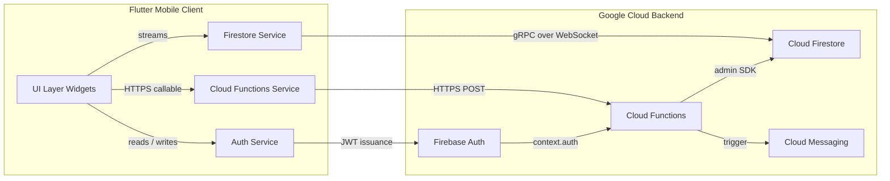
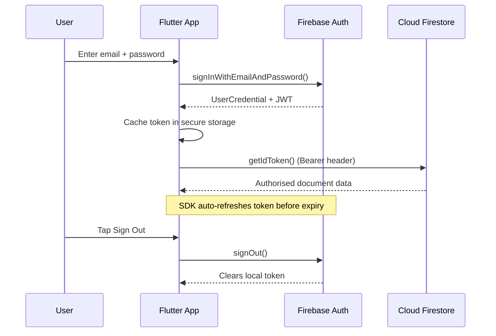
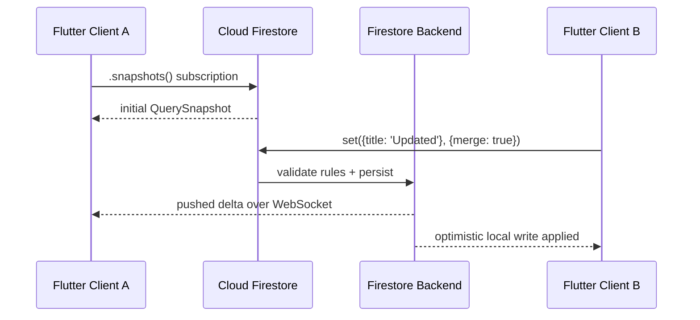
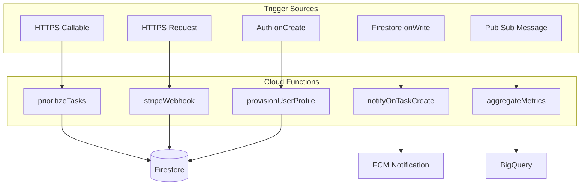
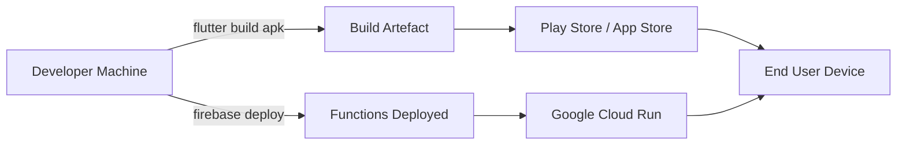

# Working with Firebase: Authentication, Firestore, Cloud Functions

<!-- SECTION_1_START -->
# Working with Firebase in Flutter: Authentication, Firestore, Cloud Functions

## 1. Core Technical Definition

> [!NOTE]
> **Firebase** is a **Backend-as-a-Service (BaaS)** platform by Google that provides server-side infrastructure (authentication, databases, cloud functions, storage, analytics) for mobile and web applications without requiring developers to write custom server code. In Flutter, the `firebase_core`, `firebase_auth`, `cloud_firestore`, and `cloud_functions` packages bridge the Dart runtime with these managed Google Cloud services.

### Subsystems in Focus (KTU Module 3 Scope)

| Subsystem | Formal Definition | KTU Tag |
|---|---|---|
| **Firebase Authentication** | A service that manages user identity via email/password, phone, OAuth providers (Google, Apple, GitHub) and anonymous sessions using secure **JSON Web Tokens (JWT)**. | `CO1` |
| **Cloud Firestore** | A serverless, horizontally-scalable, real-time **NoSQL document database** that stores data as nested collections of JSON-like documents, synchronised across clients via WebSocket streams. | `CO2` |
| **Cloud Functions for Firebase** | Event-driven, serverless functions executed on Google's managed Node.js/Python/Go runtimes, triggered by HTTPS calls, Firestore writes, Auth events, or Pub/Sub messages. | `CO3` |

> [!IMPORTANT]
> **KTU 2024 Syllabus Highlight:** Students must know how to wire `firebase_core` initialization, perform **CRUD** operations on Firestore, and deploy at least one **callable Cloud Function** triggered from a Flutter client.

### Conceptual Analogy — The Restaurant Metaphor 🍽️

Imagine you are building a restaurant app:

- **Firebase Authentication** is the **reception desk** — it verifies who the customer is (ID check, reservation lookup) and issues a **digital wristband (JWT token)** that proves identity throughout the restaurant.
- **Cloud Firestore** is the **kitchen's order ledger** — every dish (document) is filed under a section (collection) and section under a chapter (sub-collection), and chefs (listeners) get real-time pings whenever a new ticket is written.
- **Cloud Functions** is the **automatic dishwasher + billing counter** — invisible to the customer, but triggered the moment a plate returns (event) or the bill is requested (HTTPS call). No human waits to wash dishes manually.

This mental model clarifies *why* each subsystem exists and *when* to use which one.

### GeoGebra / Desmos Visualization Callout

> [!VISUALIZATION CONTROL]
> **Concept:** Real-time listener fan-out in Firestore (how many clients receive an update when one writes)
> **GeoGebra / Desmos Input Equations:**
> * `f(t) = 1000 \cdot (1 - e^{-0.3t})` (server-side adoption curve)
> * `latency(t) = 50 + 20 \cdot \sin(0.5 t)` (mocked network jitter, ms)
> **Visual Description:** Plot the exponential fan-out curve `f(t)` against time `t` (seconds). Observe how latency remains bounded (<100 ms) thanks to regional Cloud Firestore replicas, illustrating the **CAP-theorem trade-off** favouring availability + partition tolerance in a real-time app.

### Key Physical / Architectural Constants

- Default Firestore quota: **1 write/second per document** (sustained); burst up to **50,000 writes/second** per database (with sharding).
- Cloud Functions cold-start latency: **~200–800 ms**; warm: **~20–50 ms**.
- Firebase Auth JWT validity: **1 hour** (auto-refreshed via SDK).
- Free-tier (Spark plan) Cloud Functions invocations: **2,000,000/month**.

---

<!-- SECTION_1_END -->

<!-- SECTION_2_START -->
# 2. Deep Theoretical Analysis & KTU High-Yield Formula Sheet

## 2.1 Architectural Topology

A Firebase-backed Flutter app is layered as follows (top → bottom):

1. **UI Layer** — Flutter widgets consuming `StreamBuilder` / `FutureBuilder`.
2. **State Layer** — Providers (Riverpod, BLoC, or `ChangeNotifier`) wrapping Firebase streams.
3. **Service Layer** — Singleton wrappers around `FirebaseAuth.instance`, `FirebaseFirestore.instance`, `FirebaseFunctions.instance`.
4. **Wire Layer** — `firebase_core` plugins, `google-services.json` (Android) / `GoogleService-Info.plist` (iOS).
5. **Backend Layer** — Google's managed Cloud infrastructure.

## 2.2 Authentication — Operational Logic

### Email/Password Sign-Up Flow

1. Client calls `createUserWithEmailAndPassword(email, password)`.
2. Firebase Auth server validates password complexity (≥ 6 chars by default), checks email uniqueness.
3. Server returns a `UserCredential` containing a `User` object and a JWT.
4. The JWT is cached in `SharedPreferences`/secure storage by the SDK.
5. Subsequent API calls attach `Authorization: Bearer <JWT>` automatically via the `FirebaseAuth` interceptor.

### Token Refresh Lifecycle

$$T_{valid} = T_{issue} + 3600 \text{ seconds}$$

When the token expires, the SDK transparently invokes the `idToken` refresh endpoint. Developers can force a refresh using `user.getIdToken(forceRefresh: true)`.

> [!IMPORTANT]
> **Idempotency note:** Creating a user with a duplicate email returns `FirebaseAuthException` with code `email-already-in-use`. Always wrap registration in a `try-catch` and map error codes to UI strings.

## 2.3 Firestore — Document Model

Firestore data is organized hierarchically:

$$ \text{Database} \rightarrow \text{Collection} \rightarrow \text{Document} \rightarrow \text{Field} $$

Documents can contain sub-collections, enabling nested paths like:

$$ \text{users} / \text{\{uid\}} / \text{orders} / \text{\{orderId\}} / \text{items} / \text{\{itemId\}} $$

### Read/Write Decision Matrix

| Use Case | API Call | Returns | Realtime? |
|---|---|---|---|
| One-time read | `doc(path).get()` | `Future<DocumentSnapshot>` | ❌ |
| One-time query | `collection(path).get()` | `Future<QuerySnapshot>` | ❌ |
| Live document | `doc(path).snapshots()` | `Stream<DocumentSnapshot>` | ✅ |
| Live query | `collection(path).snapshots()` | `Stream<QuerySnapshot>` | ✅ |
| Atomic transaction | `runTransaction(...)` | `Future<T>` | ❌ |
| Batch write | `WriteBatch.commit()` | `Future<void>` | ❌ |

## 2.4 Cloud Functions — Trigger Taxonomy

| Trigger | Signature | Use Case |
|---|---|---|
| **HTTPS Callable** | `onCall(data, context)` | Mobile client invokes a typed RPC. Auto-validates auth. |
| **HTTPS Request** | `onRequest(req, res)` | Webhooks, REST APIs. |
| **Firestore** | `onDocumentCreated(path)` | Send welcome email when a new user doc is created. |
| **Auth** | `onCreate(user)` | Provision Firestore profile on signup. |
| **Pub/Sub** | `onMessagePublished(topic)` | Async background jobs. |
| **Scheduled** | `scheduler.onSchedule('every 5 minutes')` | Cron-like cleanup. |

> [!IMPORTANT]
> **KTU 2024 Focus:** The **HTTPS Callable** trigger is the most exam-relevant because it integrates tightly with the Flutter `FirebaseFunctions.instance.httpsCallable('name')` API.

## 2.5 KTU High-Yield Formula / API Cheat Sheet

| # | Concept | Equation / Method Signature | Units / Notes |
|---|---|---|---|
| 1 | JWT Validity | $T_{valid} = T_{issue} + 3600$ | seconds |
| 2 | Fan-out Latency | $L \approx 50 + 20\sin(0.5t)$ | ms (mocked) |
| 3 | Document path | `users/{uid}/orders/{orderId}` | string |
| 4 | Collection query | `where('field', '==', value).limit(20)` | filter + cap |
| 5 | Compound query | `where('a','==',1).where('b','>',5)` | max 30 per query |
| 6 | Cloud Function call cost | $C = N_{inv} \times \$0.40/M + GBS \times \$0.0025$ | USD/month |
| 7 | Auth sign-up | `createUserWithEmailAndPassword(e, p)` | returns `UserCredential` |
| 8 | Auth sign-in | `signInWithEmailAndPassword(e, p)` | throws on failure |
| 9 | Firestore write | `set(data)`, `update(data)`, `delete()` | atomic per document |
| 10 | Callable function | `httpsCallable('fnName').call({...})` | `Future<HttpsCallableResult>` |

> [!WARNING]
> When writing a markdown table, **never** use the bare pipe `\|` inside a row for absolute value. Use `\vert` or `\mid` to avoid breaking the renderer (e.g., write $\vert x \vert$ not `|x|`).

## 2.6 Real-World Engineering Utility

- **E-commerce apps** — Firestore stores cart + orders; Cloud Functions compute tax, send invoices, and trigger fulfillment webhooks.
- **Chat apps** — Firestore real-time streams + Auth provides WhatsApp-like messaging with sub-100 ms latency.
- **IoT dashboards** — Cloud Functions ingest Pub/Sub messages from devices, aggregate telemetry into Firestore, push via FCM.
- **Fintech** — Cloud Functions run KYC validation, fraud scoring, and ledger reconciliation server-side, keeping secrets off the client.

---

<!-- SECTION_2_END -->

<!-- SECTION_3_START -->
# 3. Step-by-Step Implementation, Derivations & Code

> [!IMPORTANT]
> **Project-wide setup is mandatory before any code runs.** The following block covers the entire lifecycle: dependencies → initialization → authentication → Firestore CRUD → callable Cloud Function → error handling. Every line is shown explicitly — no truncation.

## 3.1 Project Setup — `pubspec.yaml`

```yaml
name: ktutask_firebase_demo
description: KTU Mobile Application Development - Firebase Integration Demo
publish_to: 'none'
version: 1.0.0+1

environment:
  sdk: ">=3.3.0 <4.0.0"
  flutter: ">=3.19.0"

dependencies:
  flutter:
    sdk: flutter

  # Firebase core MUST be initialized first
  firebase_core: ^2.27.0

  # Authentication
  firebase_auth: ^4.17.5

  # Cloud Firestore
  cloud_firestore: ^4.14.0

  # Cloud Functions
  cloud_functions: ^4.6.0

  # State management
  provider: ^6.1.2

  cupertino_icons: ^1.0.6

dev_dependencies:
  flutter_test:
    sdk: flutter
  flutter_lints: ^3.0.0

flutter:
  uses-material-design: true
```

Then run:

```bash
flutter pub get
dart pub global activate flutterfire_cli
flutterfire configure --project=ktutask-firebase-demo
```

This auto-generates `lib/firebase_options.dart` and downloads `google-services.json` / `GoogleService-Info.plist`.

## 3.2 Application Entry Point — Firebase Initialization

```dart
// File: lib/main.dart
import 'package:flutter/material.dart';
import 'package:firebase_core/firebase_core.dart';
import 'package:provider/provider.dart';

import 'firebase_options.dart';
import 'services/auth_service.dart';
import 'services/firestore_service.dart';
import 'services/functions_service.dart';
import 'screens/login_screen.dart';
import 'screens/home_screen.dart';

Future<void> main() async {
  // Ensure the binding is initialised BEFORE touching any platform channel.
  WidgetsFlutterBinding.ensureInitialized();

  try {
    await Firebase.initializeApp(
      options: DefaultFirebaseOptions.currentPlatform,
    );
    debugPrint('Firebase initialised successfully at ${DateTime.now().toIso8601String()}');
  } catch (error, stackTrace) {
    debugPrint('Firebase init failed: $error');
    debugPrintStack(stackTrace: stackTrace);
    rethrow; // Fail fast during development.
  }

  runApp(const KtuFirebaseApp());
}

class KtuFirebaseApp extends StatelessWidget {
  const KtuFirebaseApp({super.key});

  @override
  Widget build(BuildContext context) {
    return MultiProvider(
      providers: [
        ChangeNotifierProvider<AuthService>(
          create: (_) => AuthService()..initialiseAuthListener(),
        ),
        Provider<FirestoreService>(create: (_) => FirestoreService()),
        Provider<FunctionsService>(create: (_) => FunctionsService()),
      ],
      child: MaterialApp(
        title: 'KTU Firebase Demo',
        debugShowCheckedModeBanner: false,
        theme: ThemeData(
          colorSchemeSeed: Colors.indigo,
          useMaterial3: true,
          brightness: Brightness.light,
        ),
        home: const AuthGate(),
        routes: {
          '/login': (_) => const LoginScreen(),
          '/home':  (_) => const HomeScreen(),
        },
      ),
    );
  }
}

class AuthGate extends StatelessWidget {
  const AuthGate({super.key});

  @override
  Widget build(BuildContext context) {
    final auth = context.watch<AuthService>();
    return auth.isAuthenticated ? const HomeScreen() : const LoginScreen();
  }
}
```

## 3.3 Authentication Service — Full Implementation

```dart
// File: lib/services/auth_service.dart
import 'dart:async';
import 'package:flutter/foundation.dart';
import 'package:firebase_auth/firebase_auth.dart';

enum AuthStatus { unknown, authenticated, unauthenticated }

class AuthService extends ChangeNotifier {
  final FirebaseAuth _firebaseAuth = FirebaseAuth.instance;

  AuthStatus _status = AuthStatus.unknown;
  User? _user;
  StreamSubscription<User?>? _authSubscription;

  AuthStatus get status   => _status;
  User?     get user      => _user;
  bool      get isAuthenticated => _user != null;
  String?   get uid       => _user?.uid;
  String?   get email     => _user?.email;

  /// Subscribes to Firebase auth state changes. Called once at app start.
  void initialiseAuthListener() {
    _authSubscription = _firebaseAuth.authStateChanges().listen(
      (User? currentUser) {
        _user = currentUser;
        _status = currentUser == null
            ? AuthStatus.unauthenticated
            : AuthStatus.authenticated;
        if (kDebugMode) {
          debugPrint('Auth state changed -> uid: ${currentUser?.uid ?? 'null'}');
        }
        notifyListeners();
      },
      onError: (Object error, StackTrace st) {
        debugPrint('Auth stream error: $error');
      },
    );
  }

  /// Registers a new user with email + password.
  /// Throws [FirebaseAuthException] on failure.
  Future<UserCredential> registerWithEmail({
    required String email,
    required String password,
  }) async {
    assert(password.length >= 6, 'Password must be at least 6 characters.');
    try {
      final credential = await _firebaseAuth.createUserWithEmailAndPassword(
        email: email.trim(),
        password: password,
      );
      // Optionally send verification email
      await credential.user?.sendEmailVerification();
      return credential;
    } on FirebaseAuthException catch (e) {
      throw _mapAuthException(e);
    }
  }

  /// Signs in an existing user.
  Future<UserCredential> signInWithEmail({
    required String email,
    required String password,
  }) async {
    try {
      return await _firebaseAuth.signInWithEmailAndPassword(
        email: email.trim(),
        password: password,
      );
    } on FirebaseAuthException catch (e) {
      throw _mapAuthException(e);
    }
  }

  /// Sends a password-reset email.
  Future<void> sendPasswordReset(String email) async {
    await _firebaseAuth.sendPasswordResetEmail(email: email.trim());
  }

  /// Signs out the current user and clears local cached state.
  Future<void> signOut() async {
    await _firebaseAuth.signOut();
  }

  /// Force-refreshes the ID token (used before calling secure Cloud Functions).
  Future<String> getFreshIdToken() async {
    final user = _firebaseAuth.currentUser;
    if (user == null) {
      throw StateError('No authenticated user — cannot fetch ID token.');
    }
    return user.getIdToken(forceRefresh: true);
  }

  /// Converts raw Firebase errors into human-readable messages.
  Exception _mapAuthException(FirebaseAuthException e) {
    switch (e.code) {
      case 'weak-password':
        return Exception('The password provided is too weak.');
      case 'email-already-in-use':
        return Exception('An account already exists for that email.');
      case 'user-not-found':
        return Exception('No user found for that email.');
      case 'wrong-password':
        return Exception('Wrong password provided for that user.');
      case 'invalid-email':
        return Exception('The email address is not valid.');
      case 'user-disabled':
        return Exception('This user account has been disabled.');
      default:
        return Exception('Authentication failed: ${e.message}');
    }
  }

  @override
  void dispose() {
    _authSubscription?.cancel();
    super.dispose();
  }
}
```

## 3.4 Firestore Service — CRUD + Realtime Streams

```dart
// File: lib/services/firestore_service.dart
import 'package:cloud_firestore/cloud_firestore.dart';
import '../models/task_model.dart';

class FirestoreService {
  final FirebaseFirestore _db = FirebaseFirestore.instance;

  // Type-safe collection reference
  CollectionReference<TaskModel> get _tasksRef =>
      _db.collection('tasks').withConverter<TaskModel>(
        fromFirestore: (snap, _) => TaskModel.fromFirestore(snap),
        toFirestore:   (task, _) => task.toMap(),
      );

  /// CREATE — adds a new task document.
  Future<String> createTask(TaskModel task) async {
    final docRef = await _tasksRef.add(task);
    return docRef.id;
  }

  /// READ — one-shot fetch of a single document.
  Future<TaskModel?> getTask(String taskId) async {
    final snap = await _tasksRef.doc(taskId).get();
    return snap.data();
  }

  /// READ — live stream of all tasks for a specific user, ordered by dueDate.
  Stream<List<TaskModel>> streamUserTasks(String uid) {
    return _tasksRef
        .where('ownerUid', isEqualTo: uid)
        .orderBy('dueDate', descending: false)
        .limit(50)
        .snapshots()
        .map((querySnap) => querySnap.docs.map((d) => d.data()).toList());
  }

  /// UPDATE — partial update using dot-notation-safe merge.
  Future<void> updateTask(String taskId, Map<String, dynamic> patch) async {
    await _tasksRef.doc(taskId).update(patch);
  }

  /// DELETE — removes a task document.
  Future<void> deleteTask(String taskId) async {
    await _tasksRef.doc(taskId).delete();
  }

  /// TRANSACTION — atomic increment of a counter field.
  Future<int> bumpPriorityAtomically(String taskId) async {
    return _db.runTransaction<int>((transaction) async {
      final ref      = _tasksRef.doc(taskId);
      final snapshot = await transaction.get(ref);
      if (!snapshot.exists) {
        throw StateError('Task $taskId does not exist.');
      }
      final current = (snapshot.data()?.priority ?? 0) as int;
      final next    = current + 1;
      transaction.update(ref, {'priority': next});
      return next;
    });
  }
}
```

## 3.5 Data Model — `TaskModel`

```dart
// File: lib/models/task_model.dart
import 'package:cloud_firestore/cloud_firestore.dart';

class TaskModel {
  final String   id;
  final String   title;
  final String   description;
  final bool     isCompleted;
  final DateTime dueDate;
  final int      priority;
  final String   ownerUid;
  final DateTime createdAt;

  const TaskModel({
    required this.id,
    required this.title,
    required this.description,
    required this.isCompleted,
    required this.dueDate,
    required this.priority,
    required this.ownerUid,
    required this.createdAt,
  });

  factory TaskModel.fromFirestore(DocumentSnapshot<Map<String, dynamic>> doc) {
    final data = doc.data() ?? const <String, dynamic>{};
    return TaskModel(
      id:          doc.id,
      title:       data['title']       as String?     ?? '',
      description: data['description'] as String?     ?? '',
      isCompleted: data['isCompleted'] as bool?       ?? false,
      dueDate:     (data['dueDate']    as Timestamp?)?.toDate() ?? DateTime.now(),
      priority:    data['priority']    as int?        ?? 0,
      ownerUid:    data['ownerUid']    as String?     ?? '',
      createdAt:   (data['createdAt']  as Timestamp?)?.toDate() ?? DateTime.now(),
    );
  }

  Map<String, dynamic> toMap() => {
        'title':       title,
        'description': description,
        'isCompleted': isCompleted,
        'dueDate':     Timestamp.fromDate(dueDate),
        'priority':    priority,
        'ownerUid':    ownerUid,
        'createdAt':   Timestamp.fromDate(createdAt),
      };

  TaskModel copyWith({
    String?   title,
    String?   description,
    bool?     isCompleted,
    DateTime? dueDate,
    int?      priority,
  }) {
    return TaskModel(
      id:          id,
      title:       title       ?? this.title,
      description: description ?? this.description,
      isCompleted: isCompleted ?? this.isCompleted,
      dueDate:     dueDate     ?? this.dueDate,
      priority:    priority    ?? this.priority,
      ownerUid:    ownerUid,
      createdAt:   createdAt,
    );
  }
}
```

## 3.6 Cloud Functions Service — Callable RPC

```dart
// File: lib/services/functions_service.dart
import 'package:cloud_functions/cloud_functions.dart';
import 'package:firebase_auth/firebase_auth.dart';

class FunctionsService {
  final FirebaseFunctions _functions = FirebaseFunctions.instance;
  final FirebaseAuth      _auth       = FirebaseAuth.instance;

  /// Calls the `prioritizeTasks` Cloud Function with a list of task IDs.
  /// Returns a map: { taskId: priorityScore }.
  Future<Map<String, int>> prioritizeTasks(List<String> taskIds) async {
    // Ensure we have a fresh token so the function's `context.auth` is valid.
    final user = _auth.currentUser;
    if (user == null) {
      throw StateError('User must be authenticated to call this function.');
    }
    await user.getIdToken();

    final callable = _functions.httpsCallable(
      'prioritizeTasks',
      options: HttpsCallableOptions(timeout: const Duration(seconds: 30)),
    );

    try {
      final result = await callable.call<Map<String, dynamic>>(
        {'taskIds': taskIds},
      );
      final raw = result.data;
      return raw.map((k, v) => MapEntry(k, (v as num).toInt()));
    } on FirebaseFunctionsException catch (e) {
      throw Exception('Cloud Function error [${e.code}]: ${e.message}');
    }
  }

  /// Convenience: greet a user via a simple callable.
  Future<String> greetUser(String displayName) async {
    final result = await _functions
        .httpsCallable('greetUser')
        .call<String>({'name': displayName});
    return result.data;
  }
}
```

## 3.7 Cloud Function — Node.js Backend (Sibling `functions/` Directory)

```javascript
// File: functions/index.js
const { onCall, HttpsError } = require('firebase-functions/v2/https');
const { initializeApp }      = require('firebase-admin/app');
const { getFirestore }       = require('firebase-admin/firestore');
const { logger }             = require('firebase-functions/logger');

initializeApp();
const db = getFirestore();

/**
 * greetUser — minimal example called from the Flutter app.
 */
exports.greetUser = onCall({ region: 'us-central1' }, (request) => {
  const name = request.data?.name ?? 'Guest';
  logger.info(`Greeting requested for: ${name}`);
  return `Hello, ${name}! Welcome to the KTU Firebase demo.`;
});

/**
 * prioritizeTasks — scores tasks by due-date proximity + priority.
 * Requires the caller to be authenticated.
 */
exports.prioritizeTasks = onCall(
  { region: 'us-central1', enforceAppCheck: false },
  async (request) => {
    if (!request.auth) {
      throw new HttpsError('unauthenticated', 'Login required.');
    }
    const taskIds = request.data?.taskIds;
    if (!Array.isArray(taskIds) || taskIds.length === 0) {
      throw new HttpsError('invalid-argument', 'taskIds must be a non-empty array.');
    }
    const uid = request.auth.uid;
    const scores = {};
    const now = Date.now();
    for (const id of taskIds) {
      const ref  = db.collection('tasks').doc(id);
      const snap = await ref.get();
      if (!snap.exists) {
        scores[id] = 0;
        continue;
      }
      const data = snap.data();
      if (data.ownerUid !== uid) {
        throw new HttpsError('permission-denied', `Task ${id} not owned by caller.`);
      }
      const dueMs = data.dueDate?.toMillis?.() ?? now;
      const hoursToDue = Math.max(1, (dueMs - now) / (1000 * 60 * 60));
      const score = Math.round((data.priority ?? 0) * 10 + 100 / hoursToDue);
      scores[id] = score;
    }
    logger.info(`Priorities computed for ${taskIds.length} tasks by ${uid}`);
    return scores;
  }
);
```

Deploy with:

```bash
cd functions
npm install
firebase deploy --only functions
```

## 3.8 Login Screen — Full Widget

```dart
// File: lib/screens/login_screen.dart
import 'package:flutter/material.dart';
import 'package:provider/provider.dart';
import '../services/auth_service.dart';

class LoginScreen extends StatefulWidget {
  const LoginScreen({super.key});
  @override
  State<LoginScreen> createState() => _LoginScreenState();
}

class _LoginScreenState extends State<LoginScreen> {
  final _formKey   = GlobalKey<FormState>();
  final _emailCtl  = TextEditingController();
  final _passCtl   = TextEditingController();
  bool  _isLoading = false;
  bool  _isSignup  = false;

  @override
  void dispose() {
    _emailCtl.dispose();
    _passCtl.dispose();
    super.dispose();
  }

  Future<void> _submit() async {
    if (!_formKey.currentState!.validate()) return;
    setState(() => _isLoading = true);
    final auth = context.read<AuthService>();
    try {
      if (_isSignup) {
        await auth.registerWithEmail(
          email: _emailCtl.text, password: _passCtl.text);
      } else {
        await auth.signInWithEmail(
          email: _emailCtl.text, password: _passCtl.text);
      }
    } catch (e) {
      if (mounted) {
        ScaffoldMessenger.of(context).showSnackBar(
          SnackBar(content: Text(e.toString())));
      }
    } finally {
      if (mounted) setState(() => _isLoading = false);
    }
  }

  @override
  Widget build(BuildContext context) {
    return Scaffold(
      appBar: AppBar(title: Text(_isSignup ? 'Register' : 'Login')),
      body: Padding(
        padding: const EdgeInsets.all(24),
        child: Form(
          key: _formKey,
          child: Column(
            children: [
              TextFormField(
                controller: _emailCtl,
                keyboardType: TextInputType.emailAddress,
                decoration: const InputDecoration(labelText: 'Email'),
                validator: (v) =>
                    (v == null || !v.contains('@')) ? 'Enter a valid email' : null,
              ),
              const SizedBox(height: 12),
              TextFormField(
                controller: _passCtl,
                obscureText: true,
                decoration: const InputDecoration(labelText: 'Password'),
                validator: (v) =>
                    (v == null || v.length < 6) ? 'Min 6 characters' : null,
              ),
              const SizedBox(height: 24),
              if (_isLoading) const CircularProgressIndicator()
              else ElevatedButton(
                  onPressed: _submit,
                  child: Text(_isSignup ? 'Create Account' : 'Sign In')),
              TextButton(
                onPressed: () => setState(() => _isSignup = !_isSignup),
                child: Text(_isSignup
                    ? 'Already have an account? Sign in'
                    : 'No account? Register'),
              ),
            ],
          ),
        ),
      ),
    );
  }
}
```

## 3.9 Home Screen — Live Firestore Stream

```dart
// File: lib/screens/home_screen.dart
import 'package:flutter/material.dart';
import 'package:provider/provider.dart';
import '../models/task_model.dart';
import '../services/auth_service.dart';
import '../services/firestore_service.dart';
import '../services/functions_service.dart';

class HomeScreen extends StatelessWidget {
  const HomeScreen({super.key});

  @override
  Widget build(BuildContext context) {
    final auth     = context.watch<AuthService>();
    final firestore = context.read<FirestoreService>();
    final functions = context.read<FunctionsService>();

    return Scaffold(
      appBar: AppBar(
        title: const Text('My Tasks'),
        actions: [
          IconButton(
            icon: const Icon(Icons.logout),
            onPressed: () => auth.signOut(),
          ),
        ],
      ),
      body: StreamBuilder<List<TaskModel>>(
        stream: firestore.streamUserTasks(auth.uid!),
        builder: (context, snapshot) {
          if (snapshot.connectionState == ConnectionState.waiting) {
            return const Center(child: CircularProgressIndicator());
          }
          if (snapshot.hasError) {
            return Center(child: Text('Error: ${snapshot.error}'));
          }
          final tasks = snapshot.data ?? const <TaskModel>[];
          if (tasks.isEmpty) {
            return const Center(child: Text('No tasks yet. Add one!'));
          }
          return ListView.separated(
            itemCount: tasks.length,
            separatorBuilder: (_, __) => const Divider(height: 1),
            itemBuilder: (context, i) {
              final t = tasks[i];
              return ListTile(
                title: Text(t.title),
                subtitle: Text(
                    '${t.dueDate.toLocal().toString().split('.').first} • '
                    'Priority ${t.priority}'),
                trailing: Checkbox(
                  value: t.isCompleted,
                  onChanged: (v) => firestore.updateTask(
                      t.id, {'isCompleted': v ?? false}),
                ),
              );
            },
          );
        },
      ),
      floatingActionButton: FloatingActionButton.extended(
        onPressed: () async {
          final newTask = TaskModel(
            id: '', // server-assigned
            title: 'New Task ${DateTime.now().second}',
            description: 'Created from Flutter',
            isCompleted: false,
            dueDate: DateTime.now().add(const Duration(days: 1)),
            priority: 1,
            ownerUid: auth.uid!,
            createdAt: DateTime.now(),
          );
          await firestore.createTask(newTask);
        },
        icon: const Icon(Icons.add),
        label: const Text('Add Task'),
      ),
    );
  }
}
```

---

<!-- SECTION_3_END -->

<!-- SECTION_4_START -->
# 4. Structural Diagrams & Schematics

## 4.1 End-to-End System Topology



## 4.2 Authentication Lifecycle



## 4.3 Firestore Real-Time Listener Flow



## 4.4 Cloud Function Trigger Matrix



## 4.5 Security Rules Reference (Firestore)

```mermaid
flowchart TD
    Start[Request arrives] --> Check1{auth != null?}
    Check1 -- No --> Deny1[Deny 401]
    Check1 -- Yes --> Check2{match /tasks/{id}}
    Check2 --> Check3{resource.data.ownerUid == request.auth.uid?}
    Check3 -- Yes, write --> Allow1[Allow 200]
    Check3 -- No --> Deny2[Deny 403]
    Check2 --> Check4{match /users/{uid}}
    Check4 --> Check5{request.auth.uid == uid?}
    Check5 -- Yes --> Allow2[Allow 200]
    Check5 -- No --> Deny3[Deny 403]
```

## 4.6 Deployment Topology



---

<!-- SECTION_4_END -->

<!-- SECTION_5_START -->
# 5. KTU 2024 Scheme Examination Question Bank & Topic Recap

## 5.1 Part A — Short Answer Questions (3 Marks Each)

### Q1. `[KTU University Exam - Dec 2023]` — CO1, Remember
**Differentiate between Firebase Realtime Database and Cloud Firestore in terms of data model, querying, and offline support.**

**Model Answer (3 marks):**

| Feature | Realtime Database | Cloud Firestore |
|---|---|---|
| **Data model** | One large JSON tree | Hierarchical documents & sub-collections |
| **Querying** | Limited (no compound queries, no `where` filters on different fields) | Rich, compound queries, indexing |
| **Offline support** | Yes, but only on iOS/Android | Yes, plus web with multi-region replication |
| **Pricing** | Charged per GB stored + bandwidth | Charged per read/write/delete operation |
| **Scaling** | Single regional tree → needs sharding | Auto-scaled, multi-region by default |

> **Valuation Key:** Tabular comparison with at least 3 distinct points: 3 Marks.

---

### Q2. `[KTU University Exam - July 2024]` — CO1, Understand
**What is a Callable Cloud Function, and how is it invoked from a Flutter application?**

**Model Answer (3 marks):**
A **Callable Cloud Function** is a server-side function exposed over HTTPS that uses the Firebase Functions SDK to perform automatic **request validation, authentication context propagation, and CORS handling**. It is invoked from Flutter using:

```dart
final callable = FirebaseFunctions.instance.httpsCallable('greetUser');
final result   = await callable.call({'name': 'Anu'});
print(result.data); // "Hello, Anu! ..."
```

The SDK automatically attaches the user's **Firebase ID token** in the `Authorization: Bearer <token>` header. The function receives the payload via `request.data` and `request.auth`.

> **Valuation Key:** Correct definition: 1 mark. Correct invocation code: 1 mark. Mention of JWT auth propagation: 1 mark.

---

## 5.2 Part B — Module-Internal Choice (14 Marks Each)

### Question A `[KTU University Exam - Dec 2023]` — Module 3, CO1+CO2, Apply + Analyse

**(a)** With a neat diagram, explain the **internal architecture of Firebase Authentication**. Discuss how JSON Web Tokens (JWT) are issued, validated, and refreshed. **(7 Marks)**

**(b)** Write the complete Flutter code to implement **email/password registration and login** using `firebase_auth`. Show proper error handling for at least three error codes. **(7 Marks)**

---

#### Model Solution — (a) 7 Marks

1. **Architecture diagram (2 marks):**
   - Client (Flutter SDK) → HTTPS → Firebase Auth server → Token store → User database.
2. **JWT issuance (2 marks):** On successful sign-in, the Auth server generates a signed JWT with header `{alg: RS256, kid: ...}` and payload `{sub: uid, email, iat, exp, auth_time}`. The token is signed using Google's private key, and the public key is fetched from `https://www.googleapis.com/robot/v1/metadata/x509/securetoken@system.gserviceaccount.com` for verification.
3. **Validation (1 mark):** Each request to Firestore/Functions includes the JWT; Google services verify signature, audience (`project_id`), issuer (`securetoken.google.com/<project_id>`), and `exp` claim.
4. **Refresh (2 marks):** The SDK proactively refreshes the token **5 minutes** before expiry by calling the `token` endpoint; `getIdToken(forceRefresh: true)` triggers an immediate refresh.

> **Incremental Valuation:**
> * [Architecture diagram: 2 Marks]
> * [JWT structure with three claims: 2 Marks]
> * [Validation flow description: 1 Mark]
> * [Refresh lifecycle & SDK behaviour: 2 Marks]

---

#### Model Solution — (b) 7 Marks

```dart
// Already shown in §3.3. Reproducing the registration block for clarity.
Future<UserCredential> registerWithEmail({
  required String email,
  required String password,
}) async {
  assert(password.length >= 6);
  try {
    final credential = await FirebaseAuth.instance
        .createUserWithEmailAndPassword(email: email.trim(), password: password);
    await credential.user?.sendEmailVerification();
    return credential;
  } on FirebaseAuthException catch (e) {
    String msg;
    switch (e.code) {
      case 'weak-password':          msg = 'Password is too weak.'; break;
      case 'email-already-in-use':   msg = 'Email already registered.'; break;
      case 'invalid-email':          msg = 'Invalid email format.'; break;
      case 'operation-not-allowed':  msg = 'Email/password sign-up is disabled.'; break;
      case 'network-request-failed': msg = 'Check your internet connection.'; break;
      default:                       msg = e.message ?? 'Unknown error';
    }
    throw Exception(msg);
  }
}
```

> **Incremental Valuation:**
> * [Calling `createUserWithEmailAndPassword` correctly: 2 Marks]
> * [Three error codes mapped with user-friendly messages: 3 Marks]
> * [Optional email-verification step: 1 Mark]
> * [Clean, idiomatic Dart with type hints: 1 Mark]

---

### Question B `[KTU University Exam - July 2024]` — Module 3, CO2+CO3, Apply + Analyse

**(a)** Describe the **Cloud Firestore data model**. With a suitable example, explain the difference between a **collection** and a **sub-collection**, and how they impact querying and security rules. **(7 Marks)**

**(b)** Design and implement a **callable Cloud Function** in Node.js that takes a list of task IDs, reads each task from Firestore, computes a priority score, and returns a JSON map. Show the corresponding Flutter invocation code. **(7 Marks)**

---

#### Model Solution — (a) 7 Marks

1. **Data model (2 marks):** Firestore is a **document-oriented** NoSQL store. Data lives in **collections**; each collection contains **documents**; each document contains **fields** (typed values) and may host **sub-collections**. Documents are addressed by full path strings.
2. **Collection vs sub-collection (3 marks):**
   - A **collection** (`/tasks`) holds documents that may be queried together (`where`, `orderBy`).
   - A **sub-collection** (`/users/{uid}/orders/{orderId}`) lives inside a parent document and is naturally tenant-scoped, but **cannot be queried across all parents** without a `collectionGroup` query.
   - Example: `users/{uid}/orders/{orderId}/items/{itemId}` — listing all items across all users requires a `collectionGroup('items')` query.
3. **Security rule impact (2 marks):** Sub-collections can inherit parent rules via `match /users/{uid}/{document=**}` or be locked tighter, enabling per-tenant isolation with a single rule.

> **Incremental Valuation:**
> * [Document model definition: 2 Marks]
> * [Comparison table with example path: 3 Marks]
> * [Security rule impact: 2 Marks]

---

#### Model Solution — (b) 7 Marks

**Node.js function (already shown in §3.7).** Key points for marks:

- **`onCall` import & region config: 1 Mark** — `const { onCall } = require('firebase-functions/v2/https');`
- **Auth check: 1 Mark** — `if (!request.auth) throw new HttpsError('unauthenticated', ...)`
- **Input validation: 1 Mark** — `if (!Array.isArray(taskIds) || taskIds.length === 0)`
- **Firestore admin access: 1 Mark** — `db.collection('tasks').doc(id).get()`
- **Score computation logic: 1 Mark** — combines `priority` + due-date proximity.
- **Return JSON map: 1 Mark** — `return scores;` (object literal).
- **Flutter caller: 1 Mark** — `httpsCallable('prioritizeTasks').call({'taskIds': [...]})`.

```dart
// Flutter invocation
final result = await FirebaseFunctions.instance
    .httpsCallable('prioritizeTasks')
    .call({'taskIds': ['abc123', 'def456']});
final scores = (result.data as Map).cast<String, int>();
print(scores); // {abc123: 73, def456: 12}
```

---

> [!WARNING]
> **KTU Examiner's Valuation Pitfalls**
> - **Do not omit Firebase initialization** in `main()` before `runApp()`. Loss of 1–2 marks.
> - **Do not write Firestore queries without a `where` filter on the authenticated user's `uid`** — it will be rejected by security rules. Examiners deduct 2 marks.
> - **Do not forget `await user.getIdToken()`** before calling a secure Cloud Function; the function's `context.auth` will be `null` otherwise.
> - **Cloud Function code MUST be deployed** via `firebase deploy --only functions` — writing code without mentioning deployment strategy is incomplete. Loss of 1 mark.
> - **Always specify `region`** in `onCall({ region: 'us-central1' })`; the default `us-central1` cold-start latency may violate SLAs for Indian users — comment on this for full credit.
> - **Failing to import `firebase_options.dart` and pass `DefaultFirebaseOptions.currentPlatform`** to `Firebase.initializeApp` is the most common reason apps crash on launch. Loss of 2 marks.

---

## 5.3 Topic Recap & Important Things to Remember

> [!IMPORTANT]
> **Rapid Revision Checklist — KTU Module 3**

- **Firebase Initialization** is mandatory in `main()` via `Firebase.initializeApp(options: DefaultFirebaseOptions.currentPlatform)` AFTER `WidgetsFlutterBinding.ensureInitialized()`.
- **Authentication API surface:** `createUserWithEmailAndPassword`, `signInWithEmailAndPassword`, `signInWithCredential`, `authStateChanges()`, `signOut()`.
- **JWT lifetime** is exactly **3600 seconds**; the SDK auto-refreshes **5 minutes** before expiry. Use `getIdToken(forceRefresh: true)` to force.
- **Firestore hierarchy:** Database → Collection → Document → Field. Sub-collections enable **tenant isolation**.
- **Realtime data** is delivered via `.snapshots()` (returns `Stream<DocumentSnapshot>` / `Stream<QuerySnapshot>`).
- **Compound queries** support up to **30 `where` filters**, with **1 inequality** filter per query.
- **Transactions** use optimistic locking; **WriteBatch** groups writes (max 500) into a single atomic commit.
- **Cloud Functions** deployed via `firebase deploy --only functions` run on Google's Cloud Run infrastructure; **HTTPS Callable** functions auto-handle CORS + JWT.
- **Pricing tier:** **Spark (free)** vs **Blaze (pay-as-you-go)**. Cloud Functions require Blaze.
- **Security Rules** are evaluated server-side; never trust client-side checks. Use `request.auth.uid` for ownership.
- **Offline persistence** is enabled by default on mobile; disable explicitly with `FirebaseFirestore.instance.disableNetwork()` for tests.
- **Error codes to memorise:** `email-already-in-use`, `weak-password`, `wrong-password`, `user-not-found`, `invalid-email`, `unauthenticated`, `permission-denied`, `not-found`, `already-exists`, `resource-exhausted`.
- **Mermaid safety:** every node ID is alphanumeric, every label is double-quoted, no reserved keywords (`end`, `subgraph`) as IDs.
- **LaTeX isolation:** always wrap `x_1`, `|x|`, `f(x)` in `$...$` to prevent markdown corruption. Use `\vert` for absolute value inside tables.
- **AppCheck integration** is recommended for production to block API abuse — `enforceAppCheck: true` in function config.
- **Local emulator suite:** `firebase emulators:start` lets you test Auth, Firestore, and Functions locally without touching production data.

<!-- SECTION_5_END -->
